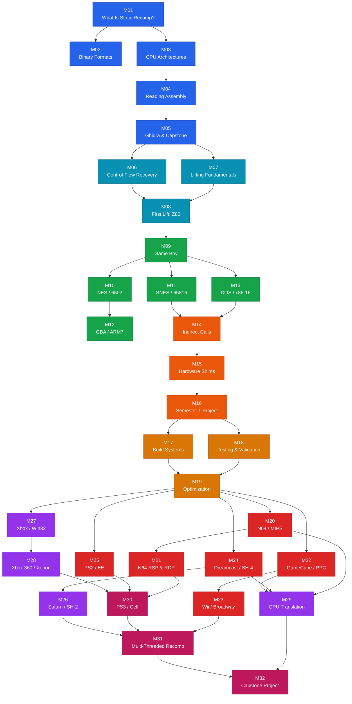

# Static Recompilation: From Theory to Practice -- Course Syllabus

## Course Overview

This course provides a comprehensive, hands-on introduction to **static recompilation** -- the technique of disassembling a compiled binary, lifting its machine code to portable C, linking against hardware and OS shims, and compiling natively for a modern platform without runtime emulation. Structured across two semesters, students progress from foundational concepts through increasingly complex real-world targets spanning **twelve architectures**. Every module is grounded in working code drawn from the [sp00nznet](https://github.com/sp00nznet) project portfolio and the broader recompilation community, giving students direct exposure to production toolchains and real-world projects. By the end of the course, students will be capable of planning and executing a static recompilation project against an unseen target.

The first semester ramps up slowly -- plenty of time to get comfortable with the tools, the theory, and the mechanical process of lifting before touching a real console. The second semester is where things get serious: 32-bit and 64-bit consoles, multi-processor architectures, GPU translation, and the hardest targets the community has tackled.

---

## Prerequisites

| Prerequisite | Level Required | Notes |
|---|---|---|
| **C programming** | Intermediate | Comfortable with pointers, structs, bitwise ops, and the C build toolchain (gcc/clang, make/CMake). |
| **Assembly language** | Minimal | Module 4 teaches assembly reading from scratch. You do *not* need prior assembly experience -- just willingness to learn. |
| **Command line** | Comfortable | Navigating filesystems, building projects from source, using Git, running scripts. |
| **Python** | Basic | Used in several lab scripts and tooling (Capstone bindings, analysis helpers). Familiarity with standard library and pip is sufficient. |

Optional but helpful: prior exposure to Ghidra or any other disassembly/decompilation tool.

---

## Module Dependency Map

The following flowchart shows prerequisite relationships between modules. An arrow from A to B means "A should be completed before B." Modules within the same unit can generally be taken in order. The Semester 2 console modules (20-25) are independent of each other once the pipeline modules (17-19) are complete.

**Legend:** Blue = Foundations | Teal = Core Techniques | Green = First Targets | Orange = Pipeline | Amber = Pipeline Mastery | Red = Console Architectures | Purple = Advanced Targets | Pink = Extreme Targets

---

# Semester 1: Foundations and First Targets

---

## Unit 1 -- Foundations (Modules 1-5)

### Module 1: What Is Static Recompilation?

| | |
|---|---|
| **Unit** | 1 -- Foundations |
| **Estimated Time** | 3 hours |

**Learning Objectives**

- Describe the structure of common executable formats (ELF, PE/COFF, raw ROM images) and locate code, data, and relocation sections.
- Use Ghidra and command-line tools (objdump, readelf, Python struct) to parse and inspect a binary.
- Explain the difference between static recompilation, dynamic recompilation, and interpretation, and articulate when each is appropriate.
- Identify the high-level pipeline stages of a static recompilation project: disassembly, lifting, shim authoring, and native compilation.

**Labs**

- Lab 1 -- ROM Inspector: Parse a Game Boy ROM header by hand and with Python.
- Lab 2 -- PE Explorer: Parse a PE executable header and enumerate sections.

**Key References**

- [gb-recompiled](https://github.com/sp00nznet/gb-recompiled) (ROM format examples)
- [N64Recomp](https://github.com/N64Recomp/N64Recomp) (toolchain overview)

---

### Module 2: Binary Formats and Loaders

| | |
|---|---|
| **Unit** | 1 -- Foundations |
| **Estimated Time** | 3 hours |

**Learning Objectives**

- Parse ELF, PE/COFF, and raw ROM headers programmatically using Python struct.
- Identify code, data, BSS, and relocation sections across formats.
- Explain memory maps for cartridge-based systems (Game Boy, NES, SNES, GBA) and disc-based systems (N64, GameCube, PS2).
- Map ROM banks and segments into a unified address space for analysis.

**Labs**

- Lab 3 -- Multi-Architecture Disassembly: Use Capstone to disassemble binary blobs from three different architectures.

**Key References**

- [gb-recompiled](https://github.com/sp00nznet/gb-recompiled) (ROM format examples)
- [snesrecomp](https://github.com/sp00nznet/snesrecomp) (SNES memory map handling)

---

### Module 3: CPU Architectures Overview

| | |
|---|---|
| **Unit** | 1 -- Foundations |
| **Estimated Time** | 3 hours |

**Learning Objectives**

- Compare register sets, instruction encoding, and calling conventions across six architectures: Z80/SM83, 6502, 65816, MIPS, PowerPC, and x86.
- Identify architectural features that complicate recompilation: variable-width instructions, delay slots, bank switching, segmented memory.
- Classify architectures by word size, endianness, and addressing model.

**Labs**

- Lab 4 -- SM83 Lifter: Hand-lift a small SM83 subroutine to C.

**Key References**

- Architecture reference docs: `docs/architecture-reference/`

---

### Module 4: Reading Assembly -- A Crash Course

| | |
|---|---|
| **Unit** | 1 -- Foundations |
| **Estimated Time** | 4 hours |

**Learning Objectives**

- Read and understand x86, MIPS, ARM, Z80, and PowerPC disassembly listings without prior assembly experience.
- Identify common instruction patterns: function prologues/epilogues, loops, conditional branches, switch statements.
- Interpret disassembly output from objdump, Ghidra, and Capstone (column meanings, annotations, cross-references).
- Recognize compiler-generated patterns (struct access, array indexing, function calls with arguments).

**Labs**

- Lab 21 -- 6502 Instruction Decoder: Write a Python decoder for 6502 opcodes and addressing modes.
- Lab 46 -- Multi-Arch Analyzer: Auto-detect the architecture of a binary blob by trying multiple Capstone decoders.

**Key References**

- Architecture reference docs: `docs/architecture-reference/`

---

### Module 5: Tooling Deep Dive -- Ghidra and Capstone

| | |
|---|---|
| **Unit** | 1 -- Foundations |
| **Estimated Time** | 4 hours |

**Learning Objectives**

- Use Capstone's Python and C APIs to disassemble binary blobs, iterate instructions, and extract operand details.
- Navigate Ghidra's CodeBrowser: auto-analysis, function identification, cross-references, data type annotation.
- Write Ghidra Python scripts to automate analysis tasks: bulk function export, annotation, batch processing.
- Build a recomp-oriented analysis workflow: from "I have a ROM" to "I have a function list with types."

**Labs**

- Lab 22 -- Ghidra Function Exporter: Write a Ghidra headless script that exports all identified functions to JSON.

**Key References**

- [Ghidra](https://ghidra-sre.org/)
- [Capstone](https://www.capstone-engine.org/)
- [N64Recomp](https://github.com/N64Recomp/N64Recomp) (uses Capstone for disassembly)

---

## Unit 2 -- Core Techniques (Modules 6-8)

### Module 6: Control-Flow Recovery

| | |
|---|---|
| **Unit** | 2 -- Core Techniques |
| **Estimated Time** | 4 hours |

**Learning Objectives**

- Explain what a control-flow graph (CFG) is and why recovering one is essential to static recompilation.
- Implement both linear sweep and recursive descent disassembly and compare their results.
- Build a CFG data structure (basic blocks with edges) from a disassembled instruction stream.
- Handle architecture-specific complications: delay slots (MIPS/SH-4), Thumb interworking (ARM), variable-length encoding (x86).

**Labs**

- Lab 5 -- Memory Bus Simulator: Implement a memory bus with bank switching for Game Boy.
- Lab 23 -- CFG Builder: Implement recursive descent disassembly on a simplified ISA and output a DOT-format CFG.

**Key References**

- [N64Recomp](https://github.com/N64Recomp/N64Recomp) (CFG recovery in practice)

---

### Module 7: Instruction Lifting Fundamentals

| | |
|---|---|
| **Unit** | 2 -- Core Techniques |
| **Estimated Time** | 4 hours |

**Learning Objectives**

- Define "instruction lifting" and contrast it with decompilation.
- Design a register model in C: global variables, structs, or local variables -- trade-offs of each approach.
- Implement flag computation helpers (zero, carry, half-carry, overflow) and explain lazy vs eager flag evaluation.
- Translate arithmetic, logic, load/store, and branch instructions into semantically equivalent C statements.

**Labs**

- Lab 7 -- Flag Tracker: Implement flag computation for Z80-style CPU status.
- Lab 24 -- Flag Computation Library: Implement add/sub/and/inc/dec flag helpers with test verification.

**Key References**

- [gb-recompiled](https://github.com/sp00nznet/gb-recompiled) (Z80 lifting examples)
- [snesrecomp](https://github.com/sp00nznet/snesrecomp) (65816 lifting patterns)

---

### Module 8: Your First Lift -- Hand-Translating Z80

| | |
|---|---|
| **Unit** | 2 -- Core Techniques |
| **Estimated Time** | 3 hours |

**Learning Objectives**

- Set up a C runtime (register struct, memory array, flag helpers) for hand-lifted Z80 code.
- Translate complete SM83/Z80 subroutines to C by hand, instruction by instruction.
- Handle loops, conditional branches, stack operations, bank switching, and CB-prefix bit operations in lifted code.
- Compile and run hand-lifted code and verify correctness by comparing output against an emulator.

**Labs**

- Lab 6 -- Mini Recompiler: Use the provided runtime to lift and run a small Z80 program.
- Lab 25 -- Hand-Lift Z80 Subroutine: Translate a Z80 checksum routine to C and verify against expected register state.

**Key References**

- [gb-recompiled](https://github.com/sp00nznet/gb-recompiled)

---

## Unit 3 -- First Targets (Modules 9-13)

### Module 9: Game Boy Recompilation (SM83)

| | |
|---|---|
| **Unit** | 3 -- First Targets |
| **Estimated Time** | 4 hours |

**Learning Objectives**

- Describe the Game Boy hardware model: CPU (Sharp LR35902 / SM83), memory map, tile-based PPU, and I/O registers.
- Walk through the gb-recompiled pipeline end to end: ROM ingestion, disassembly, C emission, shim linking, native build.
- Write a minimal hardware shim (PPU stub, joypad input) that allows a recompiled Game Boy program to run on desktop.
- Debug a recompiled Game Boy title by comparing register traces between an emulator and the recompiled binary.

**Labs**

- Lab 8 -- MZ Header Parser: Parse a DOS MZ executable header (binary format practice on a different format).

**Key References**

- [gb-recompiled](https://github.com/sp00nznet/gb-recompiled)

---

### Module 10: NES / 6502 Recompilation

| | |
|---|---|
| **Unit** | 3 -- First Targets |
| **Estimated Time** | 4 hours |

**Learning Objectives**

- Describe the NES hardware model: Ricoh 2A03 (6502 variant without BCD), PPU, APU, and the mapper system.
- Explain 6502 addressing modes and their implications for lifting (13 modes, zero page optimization, page-crossing behavior).
- Parse iNES headers and identify mapper type, PRG/CHR sizes, and mirroring configuration.
- Walk through a NES recompilation pipeline end to end and identify NES-specific challenges (mapper state, mid-frame PPU manipulation).

**Labs**

- Lab 26 -- NES ROM Inspector: Parse iNES headers and extract cartridge metadata.

**Key References**

- NES homebrew and preservation communities
- Architecture reference: `docs/architecture-reference/6502.md`

---

### Module 11: SNES Recompilation (65816)

| | |
|---|---|
| **Unit** | 3 -- First Targets |
| **Estimated Time** | 4 hours |

**Learning Objectives**

- Explain the 65816 architecture: 16-bit accumulator modes, bank switching, direct page, and the implications for lifting.
- Describe the SNES memory map and how DMA, HDMA, and PPU registers complicate recompilation.
- Compare the snesrecomp approach to gb-recompiled and identify what additional complexity the 65816 introduces.
- Recompile a small SNES ROM using snesrecomp and verify correct behavior.

**Labs**

- Lab 9 -- Dispatch Table Generator: Build a runtime dispatch mechanism for indirect calls.
- Lab 10 -- Recursive Disassembler: Implement recursive descent on a simplified ISA.

**Key References**

- [snesrecomp](https://github.com/sp00nznet/snesrecomp)

---

### Module 12: GBA / ARM7TDMI Recompilation

| | |
|---|---|
| **Unit** | 3 -- First Targets |
| **Estimated Time** | 4 hours |

**Learning Objectives**

- Describe the GBA hardware: ARM7TDMI CPU (ARM + Thumb modes), PPU (tile and bitmap modes), DMA, sound.
- Explain ARM/Thumb interworking and its implications for disassembly and lifting.
- Implement BIOS HLE (high-level emulation) shims for common SWI calls.
- Walk through a GBA recompilation pipeline from ROM to native executable.

**Labs**

- Lab 27 -- ARM/Thumb Disassembler: Use Capstone to disassemble ARM and Thumb code with mode detection.
- Lab 28 -- GBA Header Parser: Parse GBA ROM header and validate complement checksum.
- Lab 49 -- BIOS HLE Shim: Implement HLE replacements for GBA BIOS calls (Div, Sqrt, CpuSet).

**Key References**

- Architecture reference: `docs/architecture-reference/arm7tdmi.md`

---

### Module 13: DOS Recompilation (x86-16)

| | |
|---|---|
| **Unit** | 3 -- First Targets |
| **Estimated Time** | 3 hours |

**Learning Objectives**

- Describe the real-mode x86 segmented memory model and its implications for pointer lifting.
- Explain how DOS system calls (INT 21h) and BIOS interrupts are shimmed in a recompiled binary.
- Identify the unique challenges of self-modifying code and overlays in DOS executables.
- Walk through a DOS recompilation project and trace how segment:offset pairs are resolved.

**Labs**

- Lab 11 -- CFG to Mermaid: Convert a control-flow graph to Mermaid diagram format.
- Lab 12 -- MIPS Lifter: Translate a block of MIPS instructions to C.

**Key References**

- sp00nznet DOS recomp projects (fallout1-re, fallout2-re)
- [pcrecomp](https://github.com/sp00nznet/pcrecomp)

---

## Unit 4 -- Pipeline Essentials (Modules 14-16)

### Module 14: Indirect Calls, Jump Tables, and Function Pointers

| | |
|---|---|
| **Unit** | 4 -- Pipeline Essentials |
| **Estimated Time** | 3 hours |

**Learning Objectives**

- Explain why indirect control flow (jump tables, function pointers, virtual dispatch) is the hardest problem in static recompilation.
- Describe three strategies for handling indirect jumps: exhaustive enumeration, runtime dispatch tables, and hybrid approaches.
- Analyze a jump table in a disassembly listing and reconstruct the original switch-case structure.
- Implement a function-pointer dispatch table that maps original addresses to recompiled function pointers.

**Labs**

- Lab 13 -- Flag Implementation (C): Implement CPU flag computation in C with bitwise operations.
- Lab 14 -- Kernel Shim: Implement shims for OS kernel calls.

**Key References**

- [N64Recomp](https://github.com/N64Recomp/N64Recomp) (indirect call handling)
- [xboxrecomp](https://github.com/sp00nznet/xboxrecomp) (virtual dispatch in x86 targets)

---

### Module 15: Hardware Shims and SDL2 Integration

| | |
|---|---|
| **Unit** | 4 -- Pipeline Essentials |
| **Estimated Time** | 4 hours |

**Learning Objectives**

- Define the role of a hardware abstraction layer (shim) in a static recompilation project.
- Design shim interfaces for graphics (framebuffer, tile engines), audio (PCM, sequenced), and input (controllers, keyboard mapping).
- Implement an SDL2-based rendering shim that presents a recompiled game's framebuffer output in a desktop window.
- Explain the trade-offs between accuracy and performance in shim design.

**Labs**

- Lab 15 -- Graphics Bridge: Implement an SDL2 graphics bridge for framebuffer display.
- Lab 16 -- Recomp Output Analyzer: Analyze and validate recompiler output files.

**Key References**

- [gb-recompiled](https://github.com/sp00nznet/gb-recompiled) (SDL2 integration)
- [gcrecomp](https://github.com/sp00nznet/gcrecomp) (graphics shim patterns)

---

### Module 16: Semester 1 Mini-Project

| | |
|---|---|
| **Unit** | 4 -- Pipeline Essentials |
| **Estimated Time** | 6 hours |

**Learning Objectives**

- Plan and execute a complete, independent static recompilation of a simple target (Game Boy, NES, SNES, GBA, or DOS).
- Apply the full pipeline: binary parsing → disassembly → CFG recovery → lifting → shim authoring → build → test.
- Develop debugging and validation strategies for a recompiled binary.
- Produce a working (at least partially functional) recompiled binary from a target you chose yourself.

**Labs**

- Lab 29 -- Project Planner: Complete a structured project plan template for your chosen target.

**Key References**

- All tools and projects from Semester 1

---

# Semester 2: Console Architectures and Beyond

---

## Unit 5 -- Pipeline Mastery (Modules 17-19)

### Module 17: Build Systems, Linking, and Project Structure

| | |
|---|---|
| **Unit** | 5 -- Pipeline Mastery |
| **Estimated Time** | 3 hours |

**Learning Objectives**

- Design a CMake-based build system that compiles generated C sources alongside hand-written shim code.
- Explain how symbol resolution works when linking recompiled object files against shim libraries.
- Organize a recompilation project into clean directories: generated sources, shims, assets, build output.
- Configure cross-compilation for multiple target platforms (Windows, Linux, macOS) from a single build definition.

**Labs**

- Lab 30 -- CMake Recomp Project: Create a CMakeLists.txt that builds a recompilation project with generated sources and shim libraries.

**Key References**

- [xboxrecomp](https://github.com/sp00nznet/xboxrecomp) (build system reference)
- [gcrecomp](https://github.com/sp00nznet/gcrecomp) (project structure)

---

### Module 18: Testing and Validation

| | |
|---|---|
| **Unit** | 5 -- Pipeline Mastery |
| **Estimated Time** | 3 hours |

**Learning Objectives**

- Describe a validation strategy for recompiled binaries: trace comparison, screenshot diffing, automated input playback.
- Implement a register-trace logger that records CPU state at function boundaries.
- Write automated tests that compare recompiled output against known-good emulator output.
- Identify common classes of recompilation bugs (endianness errors, sign-extension mistakes, off-by-one in memory maps) and their symptoms.

**Labs**

- Lab 31 -- Trace Comparator: Build a tool that diffs two execution traces and highlights the first divergence.
- Lab 48 -- Register Trace Logger: Implement a C library that logs register state at function entry/exit.
- Lab 50 -- Regression Harness: Build a regression test runner using TOML configuration.

**Key References**

- [N64Recomp](https://github.com/N64Recomp/N64Recomp) (validation approaches)

---

### Module 19: Optimization and Post-Processing Generated C

| | |
|---|---|
| **Unit** | 5 -- Pipeline Mastery |
| **Estimated Time** | 3 hours |

**Learning Objectives**

- Identify optimization opportunities in generated C: dead code, unused flag computations, redundant temporaries.
- Implement a dead code elimination pass using call graph reachability analysis.
- Apply compiler hints (__builtin_expect, restrict, inline) to improve generated code performance.
- Measure and compare performance between optimized and unoptimized recompiled binaries.

**Labs**

- Lab 32 -- Dead Code Eliminator: Identify unreachable functions in a call graph.

**Key References**

- [N64Recomp](https://github.com/N64Recomp/N64Recomp) (optimization passes)

---

## Unit 6 -- Console Architectures (Modules 20-25)

### Module 20: N64 / MIPS Recompilation

| | |
|---|---|
| **Unit** | 6 -- Console Architectures |
| **Estimated Time** | 4 hours |

**Learning Objectives**

- Describe the N64 hardware architecture: VR4300 (MIPS III), RCP (RSP + RDP), and the role of microcoded display/audio lists.
- Explain the N64Recomp toolchain and how it automates ROM disassembly, function boundary detection, and C emission.
- Recompile an N64 title using N64Recomp and run it natively.
- Handle N64-specific challenges: TLB-mapped memory, big-endian to little-endian conversion, delay slots.

**Labs**

- Lab 17 -- XEX2 Inspector: Parse an Xbox 360 XEX2 header (binary format practice on a complex format).
- Lab 47 -- Endianness Conversion Library: Implement byte-swap utilities for big-endian ↔ little-endian conversion.

**Key References**

- [N64Recomp](https://github.com/N64Recomp/N64Recomp)
- sp00nznet N64 game projects (Zelda OoT/MM recomp, Rocket Robot on Wheels, etc.)

---

### Module 21: N64 Deep Dive -- RSP Microcode and the RDP

| | |
|---|---|
| **Unit** | 6 -- Console Architectures |
| **Estimated Time** | 4 hours |

**Learning Objectives**

- Describe the Reality Coprocessor (RCP): RSP vector processor architecture, IMEM/DMEM, display list processing.
- Distinguish HLE and LLE approaches to handling RSP microcode and explain when each is appropriate.
- Parse N64 display list commands (Fast3D/F3DEX2) and understand the graphics command format.
- Explain how RT64 and similar backends translate N64 graphics commands to modern GPU APIs.

**Labs**

- Lab 33 -- N64 Display List Parser: Parse a binary dump of Fast3D display list commands.

**Key References**

- [N64Recomp](https://github.com/N64Recomp/N64Recomp)
- [RT64](https://github.com/rt64/rt64) (rendering backend)

---

### Module 22: GameCube / PowerPC Recompilation

| | |
|---|---|
| **Unit** | 6 -- Console Architectures |
| **Estimated Time** | 4 hours |

**Learning Objectives**

- Describe the GameCube hardware: Gekko (PowerPC 750CXe), paired-singles FPU extension, GX graphics pipeline, DSP audio.
- Explain PowerPC-specific lifting challenges: condition register fields, paired-singles floating point, and branch-link conventions.
- Parse DOL binary format and map text/data sections into a unified address space.
- Walk through the gcrecomp toolchain from DOL binary to native executable.

**Labs**

- Lab 18 -- DOL Parser: Parse a GameCube DOL binary header and enumerate sections.

**Key References**

- [gcrecomp](https://github.com/sp00nznet/gcrecomp)

---

### Module 23: Wii / Broadway Recompilation

| | |
|---|---|
| **Unit** | 6 -- Console Architectures |
| **Estimated Time** | 3 hours |

**Learning Objectives**

- Identify what the Wii adds over GameCube: Broadway CPU (faster Gekko), Hollywood GPU, IOS ARM coprocessor, Wii Remote.
- Explain the IOS layer: ARM-based I/O processor, IPC communication, and how games access hardware through IOS.
- Design IOS shims for filesystem access, network, and encryption services.
- Extend a GameCube recompilation to handle Wii-specific features.

**Labs**

- Lab 34 -- Wii DOL Extended Parser: Parse DOL files with Wii-specific extensions.

**Key References**

- Architecture reference: `docs/architecture-reference/broadway.md`
- [gcrecomp](https://github.com/sp00nznet/gcrecomp)

---

### Module 24: Dreamcast / SH-4 Recompilation

| | |
|---|---|
| **Unit** | 6 -- Console Architectures |
| **Estimated Time** | 4 hours |

**Learning Objectives**

- Describe the Dreamcast hardware: Hitachi SH-4 CPU, PowerVR2 GPU (tile-based deferred rendering), and AICA sound processor (ARM7 core).
- Explain SH-4 ISA features relevant to lifting: delay slots, FPU bank switching, GBR-relative addressing.
- Implement a PowerVR2 rendering shim that converts tile-based submit calls into modern draw calls.
- Recompile a Dreamcast binary and validate graphical output.

**Labs**

- Lab 19 -- NID Resolver: Resolve PS3 NID (numeric ID) function stubs (binary format practice on a different system).

**Key References**

- sp00nznet Dreamcast recomp projects
- Architecture reference: `docs/architecture-reference/sh4.md`

---

### Module 25: PS2 / Emotion Engine Recompilation

| | |
|---|---|
| **Unit** | 6 -- Console Architectures |
| **Estimated Time** | 4 hours |

**Learning Objectives**

- Describe the PS2 Emotion Engine: MIPS R5900 core, 128-bit SIMD (MMI), VU0/VU1 vector units, GS graphics synthesizer.
- Explain how the IOP co-processor (running a PS1 R3000A CPU) handles I/O and adds complexity.
- Identify the differences between N64 MIPS III and PS2 MIPS IV / R5900 extensions, and how they affect the lifter.
- Lift R5900 code with 128-bit MMI instructions into C using SIMD intrinsics.

**Labs**

- Lab 20 -- SPU Simulator: Simulate basic SPU operations (C-based, reused from PS3 context).

**Key References**

- sp00nznet PS2 recomp projects

---

## Unit 7 -- Advanced Targets (Modules 26-29)

### Module 26: Saturn / Dual SH-2 Recompilation

| | |
|---|---|
| **Unit** | 7 -- Advanced Targets |
| **Estimated Time** | 4 hours |

**Learning Objectives**

- Describe the Saturn hardware: Master SH-2 + Slave SH-2, VDP1 (sprites/polygons), VDP2 (backgrounds), SCU DSP, SCSP (68K-based sound).
- Explain the SH-2 ISA for recompilation: 16-bit instructions, delay slots, MAC registers, GBR-relative addressing.
- Design strategies for recompiling dual-CPU execution: interleaved, threaded, or cooperative models.
- Implement VDP1 command parsing and basic VDP shimming.

**Labs**

- Lab 35 -- SH-2 Delay Slot Lifter: Correctly lift SH-2 instructions with delay slot handling.
- Lab 36 -- Saturn VDP1 Command Parser: Parse VDP1 command table entries.

**Key References**

- Architecture reference: `docs/architecture-reference/sh2.md`

---

### Module 27: Xbox / Win32 Recompilation (x86)

| | |
|---|---|
| **Unit** | 7 -- Advanced Targets |
| **Estimated Time** | 4 hours |

**Learning Objectives**

- Describe the original Xbox hardware: Intel Celeron (x86), NV2A GPU (based on GeForce 3), unified memory architecture.
- Explain how xboxrecomp handles x86 PE executables: import table resolution, DirectX API shimming, kernel call emulation.
- Parse Xbox XBE executable headers and map sections, imports, and entry points.
- Implement DirectX 8 API shims that translate D3D8 calls to modern equivalents.

**Labs**

- Lab 37 -- Xbox XBE Inspector: Parse an Xbox XBE header and enumerate sections and imports.
- Lab 38 -- DirectX Shim Skeleton: Implement stub shims for D3D8 functions with debug logging.

**Key References**

- [xboxrecomp](https://github.com/sp00nznet/xboxrecomp)

---

### Module 28: Xbox 360 / Xenon PPC Recompilation

| | |
|---|---|
| **Unit** | 7 -- Advanced Targets |
| **Estimated Time** | 4 hours |

**Learning Objectives**

- Describe the Xbox 360 hardware: Xenon (tri-core PPC with VMX128 SIMD), Xenos GPU (unified shaders), XEX binary format.
- Explain the XenonRecomp toolchain: Xenon PPC lifting, threaded execution model, Xenos graphics translation.
- Lift Xenon PowerPC code with VMX128 extensions into C with SSE/NEON intrinsics.
- Identify Xbox 360-specific pitfalls: XAM/XBL stubs, encrypted sections, title-specific patches.

**Labs**

- Lab 39 -- PPC VMX128 Lifter: Lift VMX128 SIMD instructions to C with SSE intrinsics.

**Key References**

- [XenonRecomp](https://github.com/XenonRecomp/XenonRecomp)
- [360tools](https://github.com/sp00nznet/360tools)

---

### Module 29: GPU Pipeline Translation

| | |
|---|---|
| **Unit** | 7 -- Advanced Targets |
| **Estimated Time** | 4 hours |

**Learning Objectives**

- Explain the general pattern of GPU command translation: intercept original GPU commands, translate to Vulkan/OpenGL/D3D.
- Translate fixed-function pipeline configurations (TEV stages, RDP combiners) into programmable shaders.
- Convert console-specific texture formats (CMPR, CI4/CI8, I4/I8, RGBA5551) to modern GPU-compatible formats.
- Handle framebuffer effects, resolution scaling, and render-to-texture in translated graphics code.

**Labs**

- Lab 40 -- Shader Translator Prototype: Translate simplified fixed-function combiner descriptions into GLSL.
- Lab 41 -- TEV Stage Compiler: Translate GameCube TEV stage configurations into GLSL shaders.

**Key References**

- [RT64](https://github.com/rt64/rt64) (N64 rendering backend)
- [gcrecomp](https://github.com/sp00nznet/gcrecomp) (GX translation)

---

## Unit 8 -- Extreme Targets and Capstone (Modules 30-32)

### Module 30: PS3 / Cell Broadband Engine Recompilation

| | |
|---|---|
| **Unit** | 8 -- Extreme Targets |
| **Estimated Time** | 4 hours |

**Learning Objectives**

- Describe the Cell Broadband Engine architecture: PPE (PowerPC core), six SPEs (synergistic processing elements), element interconnect bus, and local stores.
- Explain why the Cell is the most challenging static recompilation target: heterogeneous ISA, local store DMA, SPE task scheduling.
- Walk through ps3recomp's approach to lifting PPE code and stubbing SPE dispatches.
- Implement a minimal SPE task scheduler shim that routes SPE jobs to host threads.

**Labs**

- Lab 42 -- SPU Task Scheduler: Implement a simple SPU task scheduler for 6 SPE contexts.
- Lab 43 -- Cell PPU/SPU Memory Bridge: Implement the DMA bridge between PPU main memory and SPU local stores.

**Key References**

- [ps3recomp](https://github.com/sp00nznet/ps3recomp)

---

### Module 31: Multi-Threaded and Heterogeneous Recompilation

| | |
|---|---|
| **Unit** | 8 -- Extreme Targets |
| **Estimated Time** | 4 hours |

**Learning Objectives**

- Classify multi-processor systems: symmetric (Saturn), asymmetric homogeneous (Xbox 360), and heterogeneous (PS3, N64).
- Design execution models for recompiled multi-CPU systems: sequential, threaded, and hybrid approaches.
- Implement synchronization primitives (spinlocks, events, atomics) for recompiled multi-threaded code.
- Make multi-threaded recompilation deterministic for testing and debugging.

**Labs**

- Lab 44 -- Thread Synchronization Shim: Implement spinlock, event, and CAS primitives using pthreads/C11 atomics.
- Lab 45 -- Dual-CPU Interleaver: Implement cycle-approximate interleaving for two simulated CPUs.

**Key References**

- [ps3recomp](https://github.com/sp00nznet/ps3recomp) (heterogeneous execution)
- Saturn preservation projects (dual-CPU challenges)

---

### Module 32: Capstone Project

| | |
|---|---|
| **Unit** | 8 -- Extreme Targets |
| **Estimated Time** | 10+ hours |

**Learning Objectives**

- Select a target binary not covered in any module and independently analyze its architecture, hardware model, and recompilation requirements.
- Design and implement a recompilation pipeline: tooling selection/development, disassembly, lifting, shim authoring, and native compilation.
- Produce a recompiled binary that boots and runs at least partially, demonstrating core functionality.
- Write a technical report documenting the approach, challenges encountered, and results.

The capstone demonstrates the student's ability to generalize the techniques learned throughout the course to a novel target. Start thinking about your capstone around Module 24 -- you will want several weeks to work on it alongside the later modules.

**Key References**

- Everything you have learned

---

## Assessment Approach

This course is designed for **self-paced learning**. There are no exams. Progress is measured by practical output.

### Lab Completion

Each module includes hands-on labs (50 total across all modules). Labs are the primary measure of understanding. A lab is considered complete when:

- The code compiles and runs without errors.
- Output matches the expected results described in the lab instructions.
- The student can explain *why* their solution works (not just *that* it works).

### Semester 1 Mini-Project

At the midpoint (Module 16), students complete a guided mini-project: a full end-to-end recompilation of a simple target. This serves as a checkpoint and confidence builder before tackling the more complex architectures in Semester 2.

### Capstone Project

At the end of the course, students undertake a **capstone project**: plan and execute a static recompilation of a target binary that was *not* covered in any module. This requires:

1. **Target analysis** -- Select a binary, identify its architecture, and document the hardware model.
2. **Pipeline design** -- Choose or build tooling for disassembly, lifting, and shim authoring.
3. **Implementation** -- Produce a recompiled binary that boots and runs at least partially.
4. **Write-up** -- A short technical report documenting the approach, challenges encountered, and results.

The capstone demonstrates the student's ability to generalize the techniques learned throughout the course to a novel target.

---

## Suggested Pacing

### 32-Week Schedule (Two Semesters)

#### Semester 1: Foundations and First Targets (Weeks 1-16)

| Week | Module | Topic |
|------|--------|-------|
| 1 | Module 1 | What Is Static Recompilation? |
| 2 | Module 2 | Binary Formats and Loaders |
| 3 | Module 3 | CPU Architectures Overview |
| 4 | Module 4 | Reading Assembly (Crash Course) |
| 5 | Module 5 | Tooling Deep Dive: Ghidra & Capstone |
| 6 | Module 6 | Control-Flow Recovery |
| 7 | Module 7 | Instruction Lifting Fundamentals |
| 8 | Module 8 | Your First Lift: Hand-Translating Z80 |
| 9 | Module 9 | Game Boy Recompilation (SM83) |
| 10 | Module 10 | NES Recompilation (6502) |
| 11 | Module 11 | SNES Recompilation (65816) |
| 12 | Module 12 | GBA Recompilation (ARM7TDMI) |
| 13 | Module 13 | DOS Recompilation (x86-16) |
| 14 | Module 14 | Indirect Calls and Jump Tables |
| 15 | Module 15 | Hardware Shims and SDL2 |
| 16 | Module 16 | **Semester 1 Mini-Project** |

#### Semester 2: Console Architectures and Beyond (Weeks 17-32)

| Week | Module | Topic |
|------|--------|-------|
| 17 | Module 17 | Build Systems, Linking, and Project Structure |
| 18 | Module 18 | Testing and Validation |
| 19 | Module 19 | Optimization and Post-Processing |
| 20 | Module 20 | N64 / MIPS Recompilation |
| 21 | Module 21 | N64 Deep Dive: RSP & RDP |
| 22 | Module 22 | GameCube / PowerPC Recompilation |
| 23 | Module 23 | Wii / Broadway Recompilation |
| 24 | Module 24 | Dreamcast / SH-4 Recompilation |
| 25 | Module 25 | PS2 / Emotion Engine Recompilation |
| 26 | Module 26 | Saturn / Dual SH-2 Recompilation |
| 27 | Module 27 | Xbox / Win32 Recompilation |
| 28 | Module 28 | Xbox 360 / Xenon PPC Recompilation |
| 29 | Module 29 | GPU Pipeline Translation |
| 30 | Module 30 | PS3 / Cell Broadband Engine |
| 31 | Module 31 | Multi-Threaded and Heterogeneous Recompilation |
| 32 | Module 32 | **Capstone Project** |

Start thinking about your capstone project around Week 24. You will want several weeks to plan and work on it alongside the later modules.

### Self-Paced

Work through modules in dependency order (see the flowchart above). A reasonable pace is **one module per week**, but there is no penalty for going faster or slower. The Semester 2 console modules (20-25) are independent of each other and can be tackled in any order or in parallel once the pipeline modules (17-19) are complete.

---

## Repository and Tooling Quick Reference

| Tool / Repo | URL | Used In |
|---|---|---|
| gb-recompiled | https://github.com/sp00nznet/gb-recompiled | Modules 1, 3, 7, 8, 9, 15 |
| snesrecomp | https://github.com/sp00nznet/snesrecomp | Modules 3, 7, 11 |
| pcrecomp | https://github.com/sp00nznet/pcrecomp | Module 13 |
| gcrecomp | https://github.com/sp00nznet/gcrecomp | Modules 15, 22, 23, 29 |
| xboxrecomp | https://github.com/sp00nznet/xboxrecomp | Modules 14, 17, 27 |
| ps3recomp | https://github.com/sp00nznet/ps3recomp | Modules 30, 31 |
| 360tools | https://github.com/sp00nznet/360tools | Module 28 |
| N64Recomp | https://github.com/N64Recomp/N64Recomp | Modules 1, 6, 14, 18, 19, 20, 21 |
| XenonRecomp | https://github.com/XenonRecomp/XenonRecomp | Module 28 |
| RT64 | https://github.com/rt64/rt64 | Modules 21, 29 |
| Capstone | https://www.capstone-engine.org/ | Modules 3, 4, 5, 6 (labs) |
| Ghidra | https://ghidra-sre.org/ | Modules 5, 16, 32 |
| SDL2 | https://libsdl.org/ | Module 15 (labs) |
