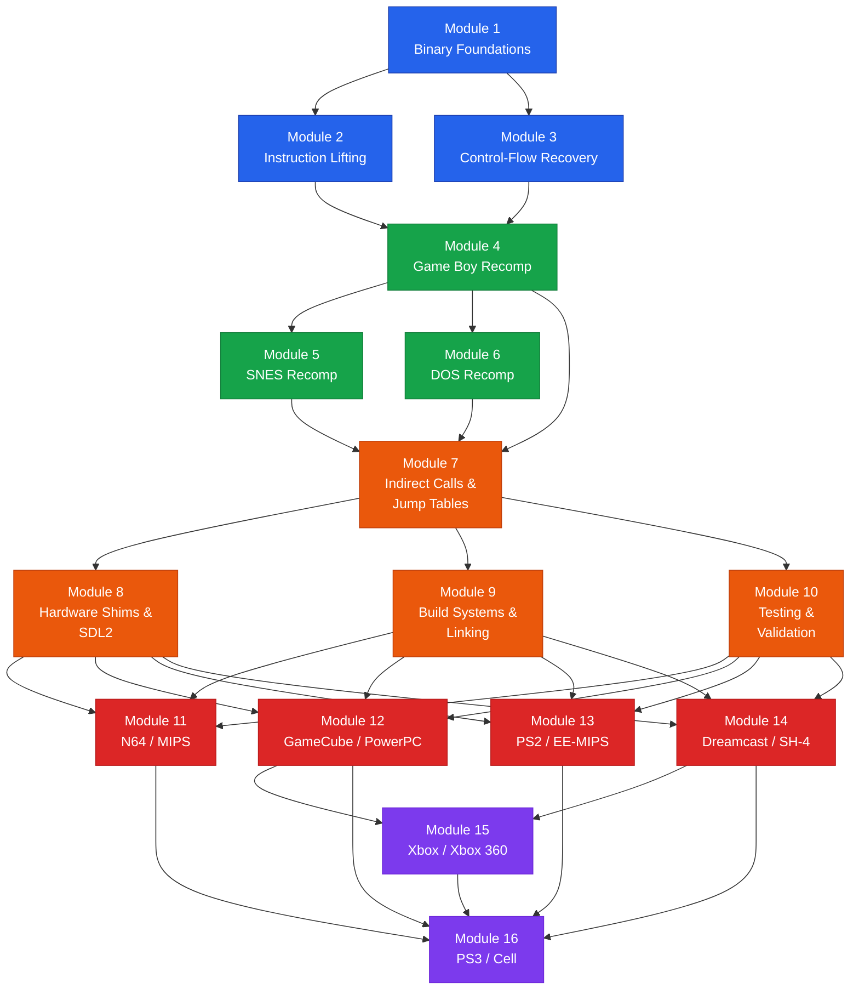

# Static Recompilation: From Theory to Practice -- Course Syllabus

## Course Overview

This course provides a comprehensive, hands-on introduction to **static recompilation** -- the technique of disassembling a compiled binary, lifting its machine code to portable C, linking against hardware and OS shims, and compiling natively for a modern platform without runtime emulation. Students will progress from foundational concepts (binary formats, instruction sets, control-flow recovery) through increasingly complex real-world targets spanning ten architectures. Every module is grounded in working code drawn from the [sp00nznet](https://github.com/sp00nznet) project portfolio, giving students direct exposure to the largest single-person static recompilation body of work on GitHub. By the end of the course, students will be capable of planning and executing a static recompilation project against an unseen target.

---

## Prerequisites

| Prerequisite | Level Required | Notes |
|---|---|---|
| **C programming** | Intermediate | Comfortable with pointers, structs, bitwise ops, and the C build toolchain (gcc/clang, make/CMake). |
| **Assembly language** | Basic | Able to read simple x86 or MIPS disassembly; understanding of registers, memory addressing, and calling conventions. Prior architecture-specific experience is *not* required -- each module introduces its target ISA. |
| **Command line** | Comfortable | Navigating filesystems, building projects from source, using Git, running scripts. |
| **Python** | Basic | Used in several lab scripts and tooling (Capstone bindings, analysis helpers). Familiarity with standard library and pip is sufficient. |

Optional but helpful: prior exposure to Ghidra or any other disassembly/decompilation tool.

---

## Module Dependency Map

The following flowchart shows prerequisite relationships between modules. An arrow from A to B means "A should be completed before B."

**Legend:** Blue = Foundation | Green = First Recomps | Orange = Pipeline | Red = Console Architectures | Purple = Extreme Targets

---

## Unit 1 -- Foundations (Modules 1-3)

### Module 1: Binary Foundations

| | |
|---|---|
| **Unit** | 1 -- Foundations |
| **Estimated Time** | 3 hours |

**Learning Objectives**

- Describe the structure of common executable formats (ELF, PE/COFF, raw ROM images) and locate code, data, and relocation sections.
- Use Ghidra and command-line tools (objdump, readelf, Python struct) to parse and inspect a binary.
- Explain the difference between static recompilation, dynamic recompilation, and interpretation, and articulate when each is appropriate.
- Identify the high-level pipeline stages of a static recompilation project: disassembly, lifting, shim authoring, and native compilation.

**Labs**

- Lab 1 -- Dissecting a ROM: Parse a Game Boy ROM header by hand and with Python.
- Lab 2 -- Ghidra Walkthrough: Load an N64 ROM into Ghidra, identify functions, and export a disassembly listing.

**Key References**

- [gb-recompiled](https://github.com/sp00nznet/gb-recompiled) (ROM format examples)
- [N64Recomp](https://github.com/N64Recomp/N64Recomp) (toolchain overview)

---

### Module 2: Instruction Lifting -- From Machine Code to C

| | |
|---|---|
| **Unit** | 1 -- Foundations |
| **Estimated Time** | 3 hours |

**Learning Objectives**

- Define "instruction lifting" and contrast it with decompilation.
- Use Capstone to disassemble a buffer of bytes and iterate over instructions programmatically in Python and C.
- Translate a small block of MIPS (or Z80) instructions into equivalent C statements by hand.
- Recognize common lifting patterns: register mapping to local variables, flag emulation, memory-mapped I/O access.

**Labs**

- Lab 3 -- Capstone Explorer: Write a Python script that disassembles a binary blob and prints each instruction with its operand breakdown.
- Lab 4 -- Hand-Lifting Exercise: Given 20 lines of annotated Z80 assembly, produce a C translation and verify output matches.

**Key References**

- [gb-recompiled](https://github.com/sp00nznet/gb-recompiled) (Z80 lifting examples)
- [snesrecomp](https://github.com/sp00nznet/snesrecomp) (65816 lifting patterns)

---

### Module 3: Control-Flow Recovery

| | |
|---|---|
| **Unit** | 1 -- Foundations |
| **Estimated Time** | 3 hours |

**Learning Objectives**

- Explain what a control-flow graph (CFG) is and why recovering one is essential to static recompilation.
- Distinguish direct branches, conditional branches, and function calls in a disassembly listing.
- Implement a basic recursive-descent disassembler that builds a CFG from a stream of instructions.
- Identify limitations of linear sweep vs. recursive descent and describe how each handles data-in-code.

**Labs**

- Lab 5 -- CFG Builder: Extend the Capstone script from Lab 3 to produce a DOT-format control-flow graph from a flat binary.
- Lab 6 -- Branch Classification: Given a set of MIPS branch instructions, classify each as conditional, unconditional, call, or return.

**Key References**

- [N64Recomp](https://github.com/N64Recomp/N64Recomp) (CFG recovery in practice)

---

## Unit 2 -- First Recompilations (Modules 4-6)

### Module 4: Game Boy Recompilation (Z80)

| | |
|---|---|
| **Unit** | 2 -- First Recompilations |
| **Estimated Time** | 4 hours |

**Learning Objectives**

- Describe the Game Boy hardware model: CPU (Sharp LR35902 / Z80 subset), memory map, tile-based PPU, and I/O registers.
- Walk through the gb-recompiled pipeline end to end: ROM ingestion, disassembly, C emission, shim linking, native build.
- Write a minimal hardware shim (PPU stub, joypad input) that allows a recompiled Game Boy program to run on desktop.
- Debug a recompiled Game Boy title by comparing register traces between an emulator and the recompiled binary.

**Labs**

- Lab 7 -- gb-recompiled from Source: Clone, build, and run gb-recompiled against a provided test ROM.
- Lab 8 -- Shim Authoring: Implement a minimal PPU shim that renders tiles to an SDL2 window.

**Key References**

- [gb-recompiled](https://github.com/sp00nznet/gb-recompiled)

---

### Module 5: SNES Recompilation (65816)

| | |
|---|---|
| **Unit** | 2 -- First Recompilations |
| **Estimated Time** | 4 hours |

**Learning Objectives**

- Explain the 65816 architecture: 16-bit accumulator modes, bank switching, direct page, and the implications for lifting.
- Describe the SNES memory map and how DMA, HDMA, and PPU registers complicate recompilation.
- Compare the snesrecomp approach to gb-recompiled and identify what additional complexity the 65816 introduces.
- Recompile a small SNES ROM using snesrecomp and verify correct behavior.

**Labs**

- Lab 9 -- 65816 Lifting Drill: Translate a block of 65816 code (with mode switches) into C.
- Lab 10 -- snesrecomp Build and Run: Build snesrecomp and recompile a provided test ROM.

**Key References**

- [snesrecomp](https://github.com/sp00nznet/snesrecomp)

---

### Module 6: DOS Recompilation (x86-16)

| | |
|---|---|
| **Unit** | 2 -- First Recompilations |
| **Estimated Time** | 3 hours |

**Learning Objectives**

- Describe the real-mode x86 segmented memory model and its implications for pointer lifting.
- Explain how DOS system calls (INT 21h) and BIOS interrupts are shimmed in a recompiled binary.
- Identify the unique challenges of self-modifying code and overlays in DOS executables.
- Walk through a DOS recompilation project and trace how segment:offset pairs are resolved.

**Labs**

- Lab 11 -- DOS Header Parsing: Parse an MZ executable header and map its segments.
- Lab 12 -- INT 21h Shim: Implement shims for file I/O and text output DOS interrupts.

**Key References**

- sp00nznet DOS recomp projects (fallout1-re, fallout2-re)
- [pcrecomp](https://github.com/sp00nznet/pcrecomp)

---

## Unit 3 -- The Recompilation Pipeline (Modules 7-10)

### Module 7: Indirect Calls, Jump Tables, and Function Pointers

| | |
|---|---|
| **Unit** | 3 -- The Recompilation Pipeline |
| **Estimated Time** | 3 hours |

**Learning Objectives**

- Explain why indirect control flow (jump tables, function pointers, virtual dispatch) is the hardest problem in static recompilation.
- Describe three strategies for handling indirect jumps: exhaustive enumeration, runtime dispatch tables, and hybrid approaches.
- Analyze a jump table in a disassembly listing and reconstruct the original switch-case structure.
- Implement a function-pointer dispatch table that maps original addresses to recompiled function pointers.

**Labs**

- Lab 13 -- Jump Table Recovery: Given a MIPS binary with a known jump table, write a script that extracts all targets.
- Lab 14 -- Dispatch Table: Build a runtime dispatch mechanism for indirect calls in a recompiled N64 module.

**Key References**

- [N64Recomp](https://github.com/N64Recomp/N64Recomp) (indirect call handling)
- [xboxrecomp](https://github.com/sp00nznet/xboxrecomp) (virtual dispatch in x86 targets)

---

### Module 8: Hardware Shims and SDL2 Integration

| | |
|---|---|
| **Unit** | 3 -- The Recompilation Pipeline |
| **Estimated Time** | 3 hours |

**Learning Objectives**

- Define the role of a hardware abstraction layer (shim) in a static recompilation project.
- Design shim interfaces for graphics (framebuffer, tile engines), audio (PCM, sequenced), and input (controllers, keyboard mapping).
- Implement an SDL2-based rendering shim that presents a recompiled game's framebuffer output in a desktop window.
- Explain the trade-offs between accuracy and performance in shim design.

**Labs**

- Lab 15 -- SDL2 Framebuffer: Write a minimal SDL2 application that displays a raw framebuffer from a recompiled binary.
- Lab 16 -- Audio Shim: Implement a basic PCM audio callback using SDL2 audio.

**Key References**

- [gb-recompiled](https://github.com/sp00nznet/gb-recompiled) (SDL2 integration)
- [gcrecomp](https://github.com/sp00nznet/gcrecomp) (graphics shim patterns)

---

### Module 9: Build Systems, Linking, and Project Structure

| | |
|---|---|
| **Unit** | 3 -- The Recompilation Pipeline |
| **Estimated Time** | 2 hours |

**Learning Objectives**

- Design a CMake-based build system that compiles generated C sources alongside hand-written shim code.
- Explain how symbol resolution works when linking recompiled object files against shim libraries.
- Organize a recompilation project into clean directories: generated sources, shims, assets, build output.
- Configure cross-compilation for multiple target platforms (Windows, Linux, macOS) from a single build definition.

**Labs**

- Lab 17 -- CMake from Scratch: Create a CMakeLists.txt that builds a recompiled Game Boy project with shim libraries.
- Lab 18 -- Cross-Platform Build: Extend the build to produce both Windows and Linux binaries.

**Key References**

- [xboxrecomp](https://github.com/sp00nznet/xboxrecomp) (build system reference)
- [gcrecomp](https://github.com/sp00nznet/gcrecomp) (project structure)

---

### Module 10: Testing and Validation

| | |
|---|---|
| **Unit** | 3 -- The Recompilation Pipeline |
| **Estimated Time** | 2 hours |

**Learning Objectives**

- Describe a validation strategy for recompiled binaries: trace comparison, screenshot diffing, automated input playback.
- Implement a register-trace logger that records CPU state at function boundaries in both an emulator and the recompiled binary.
- Write automated tests that compare recompiled output against known-good emulator output frame by frame.
- Identify common classes of recompilation bugs (endianness errors, sign-extension mistakes, off-by-one in memory maps) and their symptoms.

**Labs**

- Lab 19 -- Trace Comparator: Build a tool that diffs two execution traces and highlights the first divergence.
- Lab 20 -- Regression Harness: Create a test harness that runs a recompiled binary with fixed input and validates output checksums.

**Key References**

- [N64Recomp](https://github.com/N64Recomp/N64Recomp) (validation approaches)

---

## Unit 4 -- Console Architectures (Modules 11-14)

### Module 11: N64 / MIPS Recompilation

| | |
|---|---|
| **Unit** | 4 -- Console Architectures |
| **Estimated Time** | 4 hours |

**Learning Objectives**

- Describe the N64 hardware architecture: VR4300 (MIPS III), RCP (RSP + RDP), and the role of microcoded display/audio lists.
- Explain the N64Recomp toolchain and how it automates ROM disassembly, function boundary detection, and C emission.
- Recompile an N64 title using N64Recomp and sp00nznet's game-specific projects, and run it natively.
- Handle N64-specific challenges: TLB-mapped memory, RSP microcode, and big-endian to little-endian conversion.

**Labs**

- Lab 21 -- N64Recomp Pipeline: Use N64Recomp to process a provided ROM and generate a buildable C project.
- Lab 22 -- Endianness Lab: Identify and fix byte-swap bugs in a deliberately broken N64 recompilation.

**Key References**

- [N64Recomp](https://github.com/N64Recomp/N64Recomp)
- sp00nznet N64 game projects (Zelda OoT/MM recomp, Rocket Robot on Wheels, etc.)

---

### Module 12: GameCube / PowerPC Recompilation

| | |
|---|---|
| **Unit** | 4 -- Console Architectures |
| **Estimated Time** | 4 hours |

**Learning Objectives**

- Describe the GameCube hardware: Gekko (PowerPC 750CXe), GX graphics pipeline, and DSP audio.
- Explain PowerPC-specific lifting challenges: condition register fields, paired-singles floating point, and branch-link conventions.
- Walk through the gcrecomp toolchain from DOL binary to native executable.
- Implement GX graphics shims that translate display list commands into modern GPU API calls.

**Labs**

- Lab 23 -- PowerPC Lifting: Translate a block of Gekko PowerPC into C, handling CR fields and link register.
- Lab 24 -- gcrecomp Build: Build and run a GameCube recompilation using gcrecomp.

**Key References**

- [gcrecomp](https://github.com/sp00nznet/gcrecomp)

---

### Module 13: PS2 / Emotion Engine MIPS Recompilation

| | |
|---|---|
| **Unit** | 4 -- Console Architectures |
| **Estimated Time** | 3 hours |

**Learning Objectives**

- Describe the PS2 Emotion Engine: MIPS R5900 core, 128-bit SIMD (MMI), VU0/VU1 vector units, GS graphics synthesizer.
- Explain how the PS2 ELF format and IOP co-processor add complexity beyond standard MIPS recompilation.
- Identify the differences between N64 MIPS III and PS2 MIPS IV / R5900 extensions, and how they affect the lifter.
- Recompile a PS2 ELF and integrate GS output shims.

**Labs**

- Lab 25 -- EE-MIPS Extensions: Lift a block of R5900 code that uses 128-bit MMI instructions into C with SIMD intrinsics.
- Lab 26 -- PS2 Recomp Pipeline: Walk through a PS2 recompilation end to end.

**Key References**

- sp00nznet PS2 recomp projects

---

### Module 14: Dreamcast / SH-4 Recompilation

| | |
|---|---|
| **Unit** | 4 -- Console Architectures |
| **Estimated Time** | 3 hours |

**Learning Objectives**

- Describe the Dreamcast hardware: Hitachi SH-4 CPU, PowerVR2 GPU (tile-based deferred rendering), and AICA sound processor.
- Explain SH-4 ISA features relevant to lifting: delay slots, FPU bank switching, and the GBR-relative addressing mode.
- Implement a PowerVR2 rendering shim that converts tile-based submit calls into modern draw calls.
- Recompile a Dreamcast binary and validate graphical output.

**Labs**

- Lab 27 -- SH-4 Delay Slots: Correctly lift a sequence of SH-4 instructions with delay slots into C.
- Lab 28 -- Dreamcast Recomp Build: Build and run a Dreamcast recompilation end to end.

**Key References**

- sp00nznet Dreamcast recomp projects

---

## Unit 5 -- Extreme Targets (Modules 15-16)

### Module 15: Xbox and Xbox 360 Recompilation (x86 / Xenon PPC)

| | |
|---|---|
| **Unit** | 5 -- Extreme Targets |
| **Estimated Time** | 4 hours |

**Learning Objectives**

- Contrast original Xbox (x86 + NV2A) with Xbox 360 (Xenon / tri-core PPC + Xenos GPU) and the different recompilation strategies each demands.
- Explain how xboxrecomp handles x86 PE executables: import table resolution, DirectX API shimming, and kernel call emulation.
- Describe the XenonRecomp toolchain for Xbox 360: Xenon PPC lifting, threaded execution model, and Xenos graphics translation.
- Recompile an Xbox or Xbox 360 title and identify console-specific pitfalls (XAM/XBL stubs, encrypted sections, title-specific patches).

**Labs**

- Lab 29 -- Xbox PE Analysis: Parse an Xbox XBE header and map its sections, imports, and entry point.
- Lab 30 -- xboxrecomp Build: Build and run an Xbox recompilation using xboxrecomp.
- Lab 31 -- 360 PPC Lifting: Translate a block of Xenon PowerPC (with VMX128 extensions) into C.

**Key References**

- [xboxrecomp](https://github.com/sp00nznet/xboxrecomp)
- [360tools](https://github.com/sp00nznet/360tools)
- [XenonRecomp](https://github.com/XenonRecomp/XenonRecomp)

---

### Module 16: PS3 / Cell Broadband Engine Recompilation

| | |
|---|---|
| **Unit** | 5 -- Extreme Targets |
| **Estimated Time** | 4 hours |

**Learning Objectives**

- Describe the Cell Broadband Engine architecture: PPE (PowerPC core), six SPEs (synergistic processing elements), and the element interconnect bus.
- Explain why the Cell is considered the most challenging static recompilation target: heterogeneous ISA, local store DMA, and SPE task scheduling.
- Walk through ps3recomp's approach to lifting PPE code and stubbing SPE dispatches.
- Implement a minimal SPE task scheduler shim that routes SPE jobs to host threads.

**Labs**

- Lab 32 -- Cell Architecture Deep Dive: Map out PPE and SPE memory spaces for a PS3 ELF and identify SPE entry points.
- Lab 33 -- ps3recomp Build: Build and run a PS3 recompilation, diagnosing and fixing SPE-related issues.

**Key References**

- [ps3recomp](https://github.com/sp00nznet/ps3recomp)

---

## Assessment Approach

This course is designed for **self-paced learning**. There are no exams. Progress is measured by practical output.

### Lab Completion

Each module includes hands-on labs (33 total across all modules). Labs are the primary measure of understanding. A lab is considered complete when:

- The code compiles and runs without errors.
- Output matches the expected results described in the lab instructions.
- The student can explain *why* their solution works (not just *that* it works).

### Capstone Project

At the end of the course, students undertake a **capstone project**: plan and execute a static recompilation of a target binary that was *not* covered in any module. This requires:

1. **Target analysis** -- Select a binary, identify its architecture, and document the hardware model.
2. **Pipeline design** -- Choose or build tooling for disassembly, lifting, and shim authoring.
3. **Implementation** -- Produce a recompiled binary that boots and runs at least partially.
4. **Write-up** -- A short technical report documenting the approach, challenges encountered, and results.

The capstone demonstrates the student's ability to generalize the techniques learned throughout the course to a novel target.

---

## Suggested Pacing

### 16-Week Schedule (One Module Per Week)

| Week | Module | Topic |
|------|--------|-------|
| 1 | Module 1 | Binary Foundations |
| 2 | Module 2 | Instruction Lifting |
| 3 | Module 3 | Control-Flow Recovery |
| 4 | Module 4 | Game Boy Recomp (Z80) |
| 5 | Module 5 | SNES Recomp (65816) |
| 6 | Module 6 | DOS Recomp (x86-16) |
| 7 | Module 7 | Indirect Calls and Jump Tables |
| 8 | Module 8 | Hardware Shims and SDL2 |
| 9 | Module 9 | Build Systems and Linking |
| 10 | Module 10 | Testing and Validation |
| 11 | Module 11 | N64 / MIPS |
| 12 | Module 12 | GameCube / PowerPC |
| 13 | Module 13 | PS2 / Emotion Engine |
| 14 | Module 14 | Dreamcast / SH-4 |
| 15 | Module 15 | Xbox / Xbox 360 |
| 16 | Module 16 | PS3 / Cell |

The capstone project works best if you start thinking about it around Week 12, so you can work on it alongside the later modules.

### Self-Paced

Work through modules in dependency order (see the flowchart above). A reasonable pace is **one module per week**, but if you have a strong systems programming background you may move faster. The Unit 4 console modules (11-14) are independent of each other and can be tackled in any order or in parallel.

---

## Repository and Tooling Quick Reference

| Tool / Repo | URL | Used In |
|---|---|---|
| gb-recompiled | https://github.com/sp00nznet/gb-recompiled | Modules 1, 2, 4, 8 |
| snesrecomp | https://github.com/sp00nznet/snesrecomp | Modules 2, 5 |
| pcrecomp | https://github.com/sp00nznet/pcrecomp | Module 6 |
| gcrecomp | https://github.com/sp00nznet/gcrecomp | Modules 8, 9, 12 |
| xboxrecomp | https://github.com/sp00nznet/xboxrecomp | Modules 7, 9, 15 |
| ps3recomp | https://github.com/sp00nznet/ps3recomp | Module 16 |
| 360tools | https://github.com/sp00nznet/360tools | Module 15 |
| N64Recomp | https://github.com/N64Recomp/N64Recomp | Modules 1, 3, 7, 10, 11 |
| XenonRecomp | https://github.com/XenonRecomp/XenonRecomp | Module 15 |
| Capstone | https://www.capstone-engine.org/ | Modules 2, 3 (labs) |
| Ghidra | https://ghidra-sre.org/ | Module 1 (labs) |
| SDL2 | https://libsdl.org/ | Module 8 (labs) |
