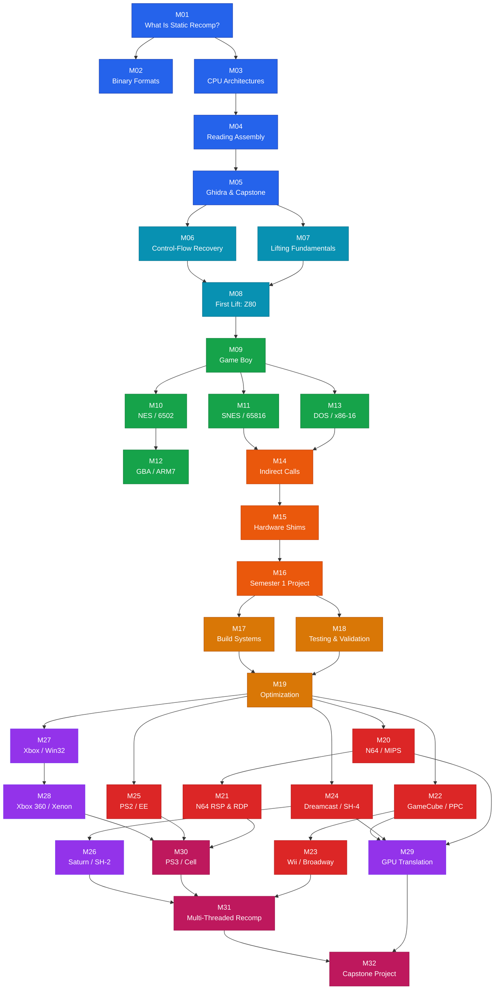

# Static Recompilation: From Theory to Practice -- Course Syllabus

## Course Overview

This course provides a comprehensive, hands-on introduction to **static recompilation** -- the technique of disassembling a compiled binary, lifting its machine code to portable C, linking against hardware and OS shims, and compiling natively for a modern platform without runtime emulation. Structured across two semesters, students progress from foundational concepts through increasingly complex real-world targets spanning **twelve architectures**. Every module is grounded in working code drawn from the [sp00nznet](https://github.com/sp00nznet) project portfolio and the broader recompilation community, giving students direct exposure to production toolchains and real-world projects. By the end of the course, students will be capable of planning and executing a static recompilation project against an unseen target.

The first semester ramps up slowly -- plenty of time to get comfortable with the tools, the theory, and the mechanical process of lifting before touching a real console. The second semester is where things get serious: 32-bit and 64-bit consoles, multi-processor architectures, GPU translation, and the hardest targets the community has tackled.

---

## Prerequisites

| Prerequisite | Level Required | Notes |
|---|---|---|
| **C programming** | Intermediate | Comfortable with pointers, structs, bitwise ops, and the C build toolchain (gcc/clang, make/CMake). |
| **Assembly language** | Minimal | Module 4 teaches assembly reading from scratch. You do *not* need prior assembly experience -- just willingness to learn. |
| **Command line** | Comfortable | Navigating filesystems, building projects from source, using Git, running scripts. |
| **Python** | Basic | Used in several lab scripts and tooling (Capstone bindings, analysis helpers). Familiarity with standard library and pip is sufficient. |

Optional but helpful: prior exposure to Ghidra or any other disassembly/decompilation tool.

---

## Module Dependency Map

The following flowchart shows prerequisite relationships between modules. An arrow from A to B means "A should be completed before B." Modules within the same unit can generally be taken in order. The Semester 2 console modules (20-25) are independent of each other once the pipeline modules (17-19) are complete.

```mermaid
flowchart TD
    classDef foundation fill:#2563eb,stroke:#1e40af,color:#fff
    classDef core fill:#0891b2,stroke:#0e7490,color:#fff
    classDef firsttarget fill:#16a34a,stroke:#15803d,color:#fff
    classDef pipeline fill:#ea580c,stroke:#c2410c,color:#fff
    classDef pipemaster fill:#d97706,stroke:#b45309,color:#fff
    classDef console fill:#dc2626,stroke:#b91c1c,color:#fff
    classDef advanced fill:#9333ea,stroke:#7c3aed,color:#fff
    classDef extreme fill:#be185d,stroke:#9d174d,color:#fff

    M1["M01<br/>What Is Static Recomp?"]:::foundation
    M2["M02<br/>Binary Formats"]:::foundation
    M3["M03<br/>CPU Architectures"]:::foundation
    M4["M04<br/>Reading Assembly"]:::foundation
    M5["M05<br/>Ghidra & Capstone"]:::foundation

    M6["M06<br/>Control-Flow Recovery"]:::core
    M7["M07<br/>Lifting Fundamentals"]:::core
    M8["M08<br/>First Lift: Z80"]:::core

    M9["M09<br/>Game Boy"]:::firsttarget
    M10["M10<br/>NES / 6502"]:::firsttarget
    M11["M11<br/>SNES / 65816"]:::firsttarget
    M12["M12<br/>GBA / ARM7"]:::firsttarget
    M13["M13<br/>DOS / x86-16"]:::firsttarget

    M14["M14<br/>Indirect Calls"]:::pipeline
    M15["M15<br/>Hardware Shims"]:::pipeline
    M16["M16<br/>Semester 1 Project"]:::pipeline

    M17["M17<br/>Build Systems"]:::pipemaster
    M18["M18<br/>Testing & Validation"]:::pipemaster
    M19["M19<br/>Optimization"]:::pipemaster

    M20["M20<br/>N64 / MIPS"]:::console
    M21["M21<br/>N64 RSP & RDP"]:::console
    M22["M22<br/>GameCube / PPC"]:::console
    M23["M23<br/>Wii / Broadway"]:::console
    M24["M24<br/>Dreamcast / SH-4"]:::console
    M25["M25<br/>PS2 / EE"]:::console

    M26["M26<br/>Saturn / SH-2"]:::advanced
    M27["M27<br/>Xbox / Win32"]:::advanced
    M28["M28<br/>Xbox 360 / Xenon"]:::advanced
    M29["M29<br/>GPU Translation"]:::advanced

    M30["M30<br/>PS3 / Cell"]:::extreme
    M31["M31<br/>Multi-Threaded Recomp"]:::extreme
    M32["M32<br/>Capstone Project"]:::extreme

    M1 --> M2
    M1 --> M3
    M3 --> M4
    M4 --> M5
    M5 --> M6
    M5 --> M7
    M6 --> M8
    M7 --> M8
    M8 --> M9
    M9 --> M10
    M9 --> M11
    M9 --> M13
    M10 --> M12
    M11 --> M14
    M13 --> M14
    M14 --> M15
    M15 --> M16

    M16 --> M17
    M16 --> M18
    M17 --> M19
    M18 --> M19

    M19 --> M20
    M19 --> M22
    M19 --> M24
    M19 --> M25

    M20 --> M21
    M22 --> M23
    M24 --> M26

    M19 --> M27
    M27 --> M28
    M22 --> M29
    M24 --> M29
    M20 --> M29

    M28 --> M30
    M25 --> M30
    M21 --> M30

    M26 --> M31
    M30 --> M31
    M23 --> M31

    M31 --> M32
    M29 --> M32
```

**Legend:** Blue = Foundations | Teal = Core Techniques | Green = First Targets | Orange = Pipeline | Amber = Pipeline Mastery | Red = Console Architectures | Purple = Advanced Targets | Pink = Extreme Targets

---

# Semester 1: Foundations and First Targets

---

## Unit 1 -- Foundations (Modules 1-5)

### Module 1: What Is Static Recompilation?

| | |
|---|---|
| **Unit** | 1 -- Foundations |
| **Estimated Time** | 3 hours |

**Learning Objectives**

- Describe the structure of common executable formats (ELF, PE/COFF, raw ROM images) and locate code, data, and relocation sections.
- Use Ghidra and command-line tools (objdump, readelf, Python struct) to parse and inspect a binary.
- Explain the difference between static recompilation, dynamic recompilation, and interpretation, and articulate when each is appropriate.
- Identify the high-level pipeline stages of a static recompilation project: disassembly, lifting, shim authoring, and native compilation.

**Labs**

- Lab 1 -- ROM Inspector: Parse a Game Boy ROM header by hand and with Python.
- Lab 2 -- PE Explorer: Parse a PE executable header and enumerate sections.

**Key References**

- [gb-recompiled](https://github.com/sp00nznet/gb-recompiled) (ROM format examples)
- [N64Recomp](https://github.com/N64Recomp/N64Recomp) (toolchain overview)

---

### Module 2: Binary Formats and Loaders

| | |
|---|---|
| **Unit** | 1 -- Foundations |
| **Estimated Time** | 3 hours |

**Learning Objectives**

- Parse ELF, PE/COFF, and raw ROM headers programmatically using Python struct.
- Identify code, data, BSS, and relocation sections across formats.
- Explain memory maps for cartridge-based systems (Game Boy, NES, SNES, GBA) and disc-based systems (N64, GameCube, PS2).
- Map ROM banks and segments into a unified address space for analysis.

**Labs**

- Lab 3 -- Multi-Architecture Disassembly: Use Capstone to disassemble binary blobs from three different architectures.

**Key References**

- [gb-recompiled](https://github.com/sp00nznet/gb-recompiled) (ROM format examples)
- [snesrecomp](https://github.com/sp00nznet/snesrecomp) (SNES memory map handling)

---

### Module 3: CPU Architectures Overview

| | |
|---|---|
| **Unit** | 1 -- Foundations |
| **Estimated Time** | 3 hours |

**Learning Objectives**

- Compare register sets, instruction encoding, and calling conventions across six architectures: Z80/SM83, 6502, 65816, MIPS, PowerPC, and x86.
- Identify architectural features that complicate recompilation: variable-width instructions, delay slots, bank switching, segmented memory.
- Classify architectures by word size, endianness, and addressing model.

**Labs**

- Lab 4 -- SM83 Lifter: Hand-lift a small SM83 subroutine to C.

**Key References**

- Architecture reference docs: `docs/architecture-reference/`

---

### Module 4: Reading Assembly -- A Crash Course

| | |
|---|---|
| **Unit** | 1 -- Foundations |
| **Estimated Time** | 4 hours |

**Learning Objectives**

- Read and understand x86, MIPS, ARM, Z80, and PowerPC disassembly listings without prior assembly experience.
- Identify common instruction patterns: function prologues/epilogues, loops, conditional branches, switch statements.
- Interpret disassembly output from objdump, Ghidra, and Capstone (column meanings, annotations, cross-references).
- Recognize compiler-generated patterns (struct access, array indexing, function calls with arguments).

**Labs**

- Lab 21 -- 6502 Instruction Decoder: Write a Python decoder for 6502 opcodes and addressing modes.
- Lab 46 -- Multi-Arch Analyzer: Auto-detect the architecture of a binary blob by trying multiple Capstone decoders.

**Key References**

- Architecture reference docs: `docs/architecture-reference/`

---

### Module 5: Tooling Deep Dive -- Ghidra and Capstone

| | |
|---|---|
| **Unit** | 1 -- Foundations |
| **Estimated Time** | 4 hours |

**Learning Objectives**

- Use Capstone's Python and C APIs to disassemble binary blobs, iterate instructions, and extract operand details.
- Navigate Ghidra's CodeBrowser: auto-analysis, function identification, cross-references, data type annotation.
- Write Ghidra Python scripts to automate analysis tasks: bulk function export, annotation, batch processing.
- Build a recomp-oriented analysis workflow: from "I have a ROM" to "I have a function list with types."

**Labs**

- Lab 22 -- Ghidra Function Exporter: Write a Ghidra headless script that exports all identified functions to JSON.

**Key References**

- [Ghidra](https://ghidra-sre.org/)
- [Capstone](https://www.capstone-engine.org/)
- [N64Recomp](https://github.com/N64Recomp/N64Recomp) (uses Capstone for disassembly)

---

## Unit 2 -- Core Techniques (Modules 6-8)

### Module 6: Control-Flow Recovery

| | |
|---|---|
| **Unit** | 2 -- Core Techniques |
| **Estimated Time** | 4 hours |

**Learning Objectives**

- Explain what a control-flow graph (CFG) is and why recovering one is essential to static recompilation.
- Implement both linear sweep and recursive descent disassembly and compare their results.
- Build a CFG data structure (basic blocks with edges) from a disassembled instruction stream.
- Handle architecture-specific complications: delay slots (MIPS/SH-4), Thumb interworking (ARM), variable-length encoding (x86).

**Labs**

- Lab 10 -- Recursive Descent Disassembler: Implement recursive descent on a simplified ISA and build a CFG.
- Lab 11 -- CFG Visualizer: Convert a control-flow graph to a Mermaid diagram.
- Lab 23 -- CFG Builder: Implement recursive descent disassembly on a simplified ISA and output a DOT-format CFG.

**Key References**

- [N64Recomp](https://github.com/N64Recomp/N64Recomp) (CFG recovery in practice)

---

### Module 7: Instruction Lifting Fundamentals

| | |
|---|---|
| **Unit** | 2 -- Core Techniques |
| **Estimated Time** | 4 hours |

**Learning Objectives**

- Define "instruction lifting" and contrast it with decompilation.
- Design a register model in C: global variables, structs, or local variables -- trade-offs of each approach.
- Implement flag computation helpers (zero, carry, half-carry, overflow) and explain lazy vs eager flag evaluation.
- Translate arithmetic, logic, load/store, and branch instructions into semantically equivalent C statements.

**Labs**

- Lab 12 -- Micro-Lifter: Build a small MIPS-subset instruction lifter that emits C.
- Lab 13 -- Flag Helper Library: Build a reusable C library for 8-bit ALU status flags.
- Lab 24 -- Flag Computation Library: Implement add/sub/and/inc/dec flag helpers with test verification.

**Key References**

- [gb-recompiled](https://github.com/sp00nznet/gb-recompiled) (Z80 lifting examples)
- [snesrecomp](https://github.com/sp00nznet/snesrecomp) (65816 lifting patterns)

---

### Module 8: Your First Lift -- Hand-Translating Z80

| | |
|---|---|
| **Unit** | 2 -- Core Techniques |
| **Estimated Time** | 3 hours |

**Learning Objectives**

- Set up a C runtime (register struct, memory array, flag helpers) for hand-lifted Z80 code.
- Translate complete SM83/Z80 subroutines to C by hand, instruction by instruction.
- Handle loops, conditional branches, stack operations, bank switching, and CB-prefix bit operations in lifted code.
- Compile and run hand-lifted code and verify correctness by comparing output against an emulator.

**Labs**

- Lab 25 -- Hand-Lift Z80 Subroutine: Translate a Z80 checksum routine to C and verify against expected register state.

**Key References**

- [gb-recompiled](https://github.com/sp00nznet/gb-recompiled)

---

## Unit 3 -- First Targets (Modules 9-13)

### Module 9: Game Boy Recompilation (SM83)

| | |
|---|---|
| **Unit** | 3 -- First Targets |
| **Estimated Time** | 4 hours |

**Learning Objectives**

- Describe the Game Boy hardware model: CPU (Sharp LR35902 / SM83), memory map, tile-based PPU, and I/O registers.
- Walk through the gb-recompiled pipeline end to end: ROM ingestion, disassembly, C emission, shim linking, native build.
- Write a minimal hardware shim (PPU stub, joypad input) that allows a recompiled Game Boy program to run on desktop.
- Debug a recompiled Game Boy title by comparing register traces between an emulator and the recompiled binary.

**Labs**

- Lab 5 -- Memory Bus: Implement a Game Boy memory bus in C, with bank switching and MMIO dispatch.
- Lab 6 -- Mini-GB Recomp: Recompile a tiny homebrew Game Boy ROM end to end using the provided runtime.

**Key References**

- [gb-recompiled](https://github.com/sp00nznet/gb-recompiled)

---

### Module 10: NES / 6502 Recompilation

| | |
|---|---|
| **Unit** | 3 -- First Targets |
| **Estimated Time** | 4 hours |

**Learning Objectives**

- Describe the NES hardware model: Ricoh 2A03 (6502 variant without BCD), PPU, APU, and the mapper system.
- Explain 6502 addressing modes and their implications for lifting (13 modes, zero page optimization, page-crossing behavior).
- Parse iNES headers and identify mapper type, PRG/CHR sizes, and mirroring configuration.
- Walk through a NES recompilation pipeline end to end and identify NES-specific challenges (mapper state, mid-frame PPU manipulation).

**Labs**

- Lab 26 -- NES ROM Inspector: Parse iNES headers and extract cartridge metadata.

**Key References**

- NES homebrew and preservation communities
- Architecture reference: `docs/architecture-reference/6502.md`

---

### Module 11: SNES Recompilation (65816)

| | |
|---|---|
| **Unit** | 3 -- First Targets |
| **Estimated Time** | 4 hours |

**Learning Objectives**

- Explain the 65816 architecture: 16-bit accumulator modes, bank switching, direct page, and the implications for lifting.
- Describe the SNES memory map and how DMA, HDMA, and PPU registers complicate recompilation.
- Compare the snesrecomp approach to gb-recompiled and identify what additional complexity the 65816 introduces.
- Recompile a small SNES ROM using snesrecomp and verify correct behavior.

**Labs**

- Lab 7 -- M/X Flag Tracker: Track the 65816's M and X flags to determine register widths at each instruction.

**Key References**

- [snesrecomp](https://github.com/sp00nznet/snesrecomp)

---

### Module 12: GBA / ARM7TDMI Recompilation

| | |
|---|---|
| **Unit** | 3 -- First Targets |
| **Estimated Time** | 4 hours |

**Learning Objectives**

- Describe the GBA hardware: ARM7TDMI CPU (ARM + Thumb modes), PPU (tile and bitmap modes), DMA, sound.
- Explain ARM/Thumb interworking and its implications for disassembly and lifting.
- Implement BIOS HLE (high-level emulation) shims for common SWI calls.
- Walk through a GBA recompilation pipeline from ROM to native executable.

**Labs**

- Lab 27 -- ARM/Thumb Disassembler: Use Capstone to disassemble ARM and Thumb code with mode detection.
- Lab 28 -- GBA Header Parser: Parse GBA ROM header and validate complement checksum.
- Lab 49 -- BIOS HLE Shim: Implement HLE replacements for GBA BIOS calls (Div, Sqrt, CpuSet).

**Key References**

- [gbarecomp](https://github.com/sp00nznet/gbarecomp) (GBA recompilation toolkit)
- Architecture reference: `docs/architecture-reference/arm7tdmi.md`

---

### Module 13: DOS Recompilation (x86-16)

| | |
|---|---|
| **Unit** | 3 -- First Targets |
| **Estimated Time** | 3 hours |

**Learning Objectives**

- Describe the real-mode x86 segmented memory model and its implications for pointer lifting.
- Explain how DOS system calls (INT 21h) and BIOS interrupts are shimmed in a recompiled binary.
- Identify the unique challenges of self-modifying code and overlays in DOS executables.
- Walk through a DOS recompilation project and trace how segment:offset pairs are resolved.

**Labs**

- Lab 8 -- MZ Parser: Parse a DOS MZ executable header and relocation table, and detect common packers.

**Key References**

- sp00nznet DOS recomp projects ([fallout1-re](https://github.com/sp00nznet/fallout1-re), [fallout2-re](https://github.com/sp00nznet/fallout2-re))
- [pcrecomp](https://github.com/sp00nznet/pcrecomp)

---

## Unit 4 -- Pipeline Essentials (Modules 14-16)

### Module 14: Indirect Calls, Jump Tables, and Function Pointers

| | |
|---|---|
| **Unit** | 4 -- Pipeline Essentials |
| **Estimated Time** | 3 hours |

**Learning Objectives**

- Explain why indirect control flow (jump tables, function pointers, virtual dispatch) is the hardest problem in static recompilation.
- Describe three strategies for handling indirect jumps: exhaustive enumeration, runtime dispatch tables, and hybrid approaches.
- Analyze a jump table in a disassembly listing and reconstruct the original switch-case structure.
- Implement a function-pointer dispatch table that maps original addresses to recompiled function pointers.

**Labs**

- Lab 9 -- Dispatch Table Generator: Generate C dispatch tables that route indirect jumps to recompiled functions.

**Key References**

- [N64Recomp](https://github.com/N64Recomp/N64Recomp) (indirect call handling)
- [xboxrecomp](https://github.com/sp00nznet/xboxrecomp) (virtual dispatch in x86 targets)

---

### Module 15: Hardware Shims and SDL2 Integration

| | |
|---|---|
| **Unit** | 4 -- Pipeline Essentials |
| **Estimated Time** | 4 hours |

**Learning Objectives**

- Define the role of a hardware abstraction layer (shim) in a static recompilation project.
- Design shim interfaces for graphics (framebuffer, tile engines), audio (PCM, sequenced), and input (controllers, keyboard mapping).
- Implement an SDL2-based rendering shim that presents a recompiled game's framebuffer output in a desktop window.
- Explain the trade-offs between accuracy and performance in shim design.

**Labs**

- Lab 15 -- Graphics Bridge: Implement an SDL2 graphics bridge for framebuffer display.

**Key References**

- [gb-recompiled](https://github.com/sp00nznet/gb-recompiled) (SDL2 integration)
- [gcrecomp](https://github.com/sp00nznet/gcrecomp) (graphics shim patterns)

---

### Module 16: Semester 1 Mini-Project

| | |
|---|---|
| **Unit** | 4 -- Pipeline Essentials |
| **Estimated Time** | 6 hours |

**Learning Objectives**

- Plan and execute a complete, independent static recompilation of a simple target (Game Boy, NES, SNES, GBA, or DOS).
- Apply the full pipeline: binary parsing → disassembly → CFG recovery → lifting → shim authoring → build → test.
- Develop debugging and validation strategies for a recompiled binary.
- Produce a working (at least partially functional) recompiled binary from a target you chose yourself.

**Labs**

- Lab 29 -- Project Planner: Complete a structured project plan template for your chosen target.

**Key References**

- All tools and projects from Semester 1

---

# Semester 2: Console Architectures and Beyond

---

## Unit 5 -- Pipeline Mastery (Modules 17-19)

### Module 17: Build Systems, Linking, and Project Structure

| | |
|---|---|
| **Unit** | 5 -- Pipeline Mastery |
| **Estimated Time** | 3 hours |

**Learning Objectives**

- Design a CMake-based build system that compiles generated C sources alongside hand-written shim code.
- Explain how symbol resolution works when linking recompiled object files against shim libraries.
- Organize a recompilation project into clean directories: generated sources, shims, assets, build output.
- Configure cross-compilation for multiple target platforms (Windows, Linux, macOS) from a single build definition.

**Labs**

- Lab 30 -- CMake Recomp Project: Create a CMakeLists.txt that builds a recompilation project with generated sources and shim libraries.

**Key References**

- [xboxrecomp](https://github.com/sp00nznet/xboxrecomp) (build system reference)
- [gcrecomp](https://github.com/sp00nznet/gcrecomp) (project structure)

---

### Module 18: Testing and Validation

| | |
|---|---|
| **Unit** | 5 -- Pipeline Mastery |
| **Estimated Time** | 3 hours |

**Learning Objectives**

- Describe a validation strategy for recompiled binaries: trace comparison, screenshot diffing, automated input playback.
- Implement a register-trace logger that records CPU state at function boundaries.
- Write automated tests that compare recompiled output against known-good emulator output.
- Identify common classes of recompilation bugs (endianness errors, sign-extension mistakes, off-by-one in memory maps) and their symptoms.

**Labs**

- Lab 31 -- Trace Comparator: Build a tool that diffs two execution traces and highlights the first divergence.
- Lab 48 -- Register Trace Logger: Implement a C library that logs register state at function entry/exit.
- Lab 50 -- Regression Harness: Build a regression test runner using TOML configuration.

**Key References**

- [N64Recomp](https://github.com/N64Recomp/N64Recomp) (validation approaches)

---

### Module 19: Optimization and Post-Processing Generated C

| | |
|---|---|
| **Unit** | 5 -- Pipeline Mastery |
| **Estimated Time** | 3 hours |

**Learning Objectives**

- Identify optimization opportunities in generated C: dead code, unused flag computations, redundant temporaries.
- Implement a dead code elimination pass using call graph reachability analysis.
- Apply compiler hints (__builtin_expect, restrict, inline) to improve generated code performance.
- Measure and compare performance between optimized and unoptimized recompiled binaries.

**Labs**

- Lab 32 -- Dead Code Eliminator: Identify unreachable functions in a call graph.

**Key References**

- [N64Recomp](https://github.com/N64Recomp/N64Recomp) (optimization passes)

---

## Unit 6 -- Console Architectures (Modules 20-25)

### Module 20: N64 / MIPS Recompilation

| | |
|---|---|
| **Unit** | 6 -- Console Architectures |
| **Estimated Time** | 4 hours |

**Learning Objectives**

- Describe the N64 hardware architecture: VR4300 (MIPS III), RCP (RSP + RDP), and the role of microcoded display/audio lists.
- Explain the N64Recomp toolchain and how it automates ROM disassembly, function boundary detection, and C emission.
- Recompile an N64 title using N64Recomp and run it natively.
- Handle N64-specific challenges: TLB-mapped memory, big-endian to little-endian conversion, delay slots.

**Labs**

- Lab 16 -- N64Recomp Configuration: Write an N64Recomp `.toml` config and analyse the C the recompiler generates from it.
- Lab 47 -- Endianness Conversion Library: Implement byte-swap utilities for big-endian ↔ little-endian conversion.

**Key References**

- [N64Recomp](https://github.com/N64Recomp/N64Recomp)
- sp00nznet N64 game projects (Zelda OoT/MM recomp, Rocket Robot on Wheels, etc.)

---

### Module 21: N64 Deep Dive -- RSP Microcode and the RDP

| | |
|---|---|
| **Unit** | 6 -- Console Architectures |
| **Estimated Time** | 4 hours |

**Learning Objectives**

- Describe the Reality Coprocessor (RCP): RSP vector processor architecture, IMEM/DMEM, display list processing.
- Distinguish HLE and LLE approaches to handling RSP microcode and explain when each is appropriate.
- Parse N64 display list commands (Fast3D/F3DEX2) and understand the graphics command format.
- Explain how RT64 and similar backends translate N64 graphics commands to modern GPU APIs.

**Labs**

- Lab 33 -- N64 Display List Parser: Parse a binary dump of Fast3D display list commands.

**Key References**

- [N64Recomp](https://github.com/N64Recomp/N64Recomp)
- [RT64](https://github.com/rt64/rt64) (rendering backend)

---

### Module 22: GameCube / PowerPC Recompilation

| | |
|---|---|
| **Unit** | 6 -- Console Architectures |
| **Estimated Time** | 4 hours |

**Learning Objectives**

- Describe the GameCube hardware: Gekko (PowerPC 750CXe), paired-singles FPU extension, GX graphics pipeline, DSP audio.
- Explain PowerPC-specific lifting challenges: condition register fields, paired-singles floating point, and branch-link conventions.
- Parse DOL binary format and map text/data sections into a unified address space.
- Walk through the gcrecomp toolchain from DOL binary to native executable.

**Labs**

- Lab 18 -- DOL Parser: Parse a GameCube DOL binary header and enumerate sections.

**Key References**

- [gcrecomp](https://github.com/sp00nznet/gcrecomp)

---

### Module 23: Wii / Broadway Recompilation

| | |
|---|---|
| **Unit** | 6 -- Console Architectures |
| **Estimated Time** | 3 hours |

**Learning Objectives**

- Identify what the Wii adds over GameCube: Broadway CPU (faster Gekko), Hollywood GPU, IOS ARM coprocessor, Wii Remote.
- Explain the IOS layer: ARM-based I/O processor, IPC communication, and how games access hardware through IOS.
- Design IOS shims for filesystem access, network, and encryption services.
- Extend a GameCube recompilation to handle Wii-specific features.

**Labs**

- Lab 34 -- Wii DOL Extended Parser: Parse DOL files with Wii-specific extensions.

**Key References**

- Architecture reference: `docs/architecture-reference/broadway.md`
- [gcrecomp](https://github.com/sp00nznet/gcrecomp)

---

### Module 24: Dreamcast / SH-4 Recompilation

| | |
|---|---|
| **Unit** | 6 -- Console Architectures |
| **Estimated Time** | 4 hours |

**Learning Objectives**

- Describe the Dreamcast hardware: Hitachi SH-4 CPU, PowerVR2 GPU (tile-based deferred rendering), and AICA sound processor (ARM7 core).
- Explain SH-4 ISA features relevant to lifting: delay slots, FPU bank switching, GBR-relative addressing.
- Implement a PowerVR2 rendering shim that converts tile-based submit calls into modern draw calls.
- Recompile a Dreamcast binary and validate graphical output.

**Labs**

- None yet. This module is lecture-only; there is no Dreamcast code lab in the repository. Lab 35 (SH-2 delay slot lifting, Module 26) is the closest hands-on work on the SH family.

**Key References**

- [dcrecomp](https://github.com/sp00nznet/dcrecomp) (Dreamcast/Naomi SH-4 recompilation framework)
- Architecture reference: `docs/architecture-reference/sh4.md`

---

### Module 25: PS2 / Emotion Engine Recompilation

| | |
|---|---|
| **Unit** | 6 -- Console Architectures |
| **Estimated Time** | 4 hours |

**Learning Objectives**

- Describe the PS2 Emotion Engine: MIPS R5900 core, 128-bit SIMD (MMI), VU0/VU1 vector units, GS graphics synthesizer.
- Explain how the IOP co-processor (running a PS1 R3000A CPU) handles I/O and adds complexity.
- Identify the differences between N64 MIPS III and PS2 MIPS IV / R5900 extensions, and how they affect the lifter.
- Lift R5900 code with 128-bit MMI instructions into C using SIMD intrinsics.

**Labs**

- None yet. This module is lecture-only; there is no PS2 code lab in the repository. Lab 39 (VMX128 SIMD lifting, Module 28) covers the same 128-bit SIMD lifting problem on another PowerPC target.

**Key References**

- sp00nznet PS2 recomp projects

---

## Unit 7 -- Advanced Targets (Modules 26-29)

### Module 26: Saturn / Dual SH-2 Recompilation

| | |
|---|---|
| **Unit** | 7 -- Advanced Targets |
| **Estimated Time** | 4 hours |

**Learning Objectives**

- Describe the Saturn hardware: Master SH-2 + Slave SH-2, VDP1 (sprites/polygons), VDP2 (backgrounds), SCU DSP, SCSP (68K-based sound).
- Explain the SH-2 ISA for recompilation: 16-bit instructions, delay slots, MAC registers, GBR-relative addressing.
- Design strategies for recompiling dual-CPU execution: interleaved, threaded, or cooperative models.
- Implement VDP1 command parsing and basic VDP shimming.

**Labs**

- Lab 35 -- SH-2 Delay Slot Lifter: Correctly lift SH-2 instructions with delay slot handling.
- Lab 36 -- Saturn VDP1 Command Parser: Parse VDP1 command table entries.

**Key References**

- Architecture reference: `docs/architecture-reference/sh2.md`

---

### Module 27: Xbox / Win32 Recompilation (x86)

| | |
|---|---|
| **Unit** | 7 -- Advanced Targets |
| **Estimated Time** | 4 hours |

**Learning Objectives**

- Describe the original Xbox hardware: Intel Celeron (x86), NV2A GPU (based on GeForce 3), unified memory architecture.
- Explain how xboxrecomp handles x86 PE executables: import table resolution, DirectX API shimming, kernel call emulation.
- Parse Xbox XBE executable headers and map sections, imports, and entry points.
- Implement DirectX 8 API shims that translate D3D8 calls to modern equivalents.

**Labs**

- Lab 37 -- Xbox XBE Inspector: Parse an Xbox XBE header and enumerate sections and imports.
- Lab 38 -- DirectX Shim Skeleton: Implement stub shims for D3D8 functions with debug logging.

**Key References**

- [xboxrecomp](https://github.com/sp00nznet/xboxrecomp)

---

### Module 28: Xbox 360 / Xenon PPC Recompilation

| | |
|---|---|
| **Unit** | 7 -- Advanced Targets |
| **Estimated Time** | 4 hours |

**Learning Objectives**

- Describe the Xbox 360 hardware: Xenon (tri-core PPC with VMX128 SIMD), Xenos GPU (unified shaders), XEX binary format.
- Explain the XenonRecomp toolchain: Xenon PPC lifting, threaded execution model, Xenos graphics translation.
- Lift Xenon PowerPC code with VMX128 extensions into C with SSE/NEON intrinsics.
- Identify Xbox 360-specific pitfalls: XAM/XBL stubs, encrypted sections, title-specific patches.

**Labs**

- Lab 14 -- Kernel Shim: Shim Xbox 360 kernel imports onto Win32 or POSIX equivalents.
- Lab 17 -- XEX2 Inspector: Parse Xbox 360 XEX2 executable headers and enumerate their sections.
- Lab 39 -- PPC VMX128 Lifter: Lift VMX128 SIMD instructions to C with SSE intrinsics.

**Key References**

- [XenonRecomp](https://github.com/hedge-dev/XenonRecomp)
- [ReXGlue SDK](https://github.com/rexglue/rexglue-sdk)
- [wormsrevolution](https://github.com/sp00nznet/wormsrevolution) -- playable bring-up
- [ydkj](https://github.com/sp00nznet/ydkj), [civrev](https://github.com/sp00nznet/civrev), [outrun](https://github.com/sp00nznet/outrun) -- bring-ups at three different stages

---

### Module 29: GPU Pipeline Translation

| | |
|---|---|
| **Unit** | 7 -- Advanced Targets |
| **Estimated Time** | 4 hours |

**Learning Objectives**

- Explain the general pattern of GPU command translation: intercept original GPU commands, translate to Vulkan/OpenGL/D3D.
- Translate fixed-function pipeline configurations (TEV stages, RDP combiners) into programmable shaders.
- Convert console-specific texture formats (CMPR, CI4/CI8, I4/I8, RGBA5551) to modern GPU-compatible formats.
- Handle framebuffer effects, resolution scaling, and render-to-texture in translated graphics code.

**Labs**

- Lab 40 -- Shader Translator Prototype: Translate simplified fixed-function combiner descriptions into GLSL.
- Lab 41 -- TEV Stage Compiler: Translate GameCube TEV stage configurations into GLSL shaders.

**Key References**

- [RT64](https://github.com/rt64/rt64) (N64 rendering backend)
- [gcrecomp](https://github.com/sp00nznet/gcrecomp) (GX translation)

---

## Unit 8 -- Extreme Targets and Capstone (Modules 30-32)

### Module 30: PS3 / Cell Broadband Engine Recompilation

| | |
|---|---|
| **Unit** | 8 -- Extreme Targets |
| **Estimated Time** | 4 hours |

**Learning Objectives**

- Describe the Cell Broadband Engine architecture: PPE (PowerPC core), six SPEs (synergistic processing elements), element interconnect bus, and local stores.
- Explain why the Cell is the most challenging static recompilation target: heterogeneous ISA, local store DMA, SPE task scheduling.
- Walk through ps3recomp's approach to lifting PPE code and stubbing SPE dispatches.
- Implement a minimal SPE task scheduler shim that routes SPE jobs to host threads.

**Labs**

- Lab 19 -- NID Resolver: Implement PS3 NID hash resolution for imports in PRX/SPRX modules.
- Lab 20 -- SPU DMA Simulator: Simulate the SPU's 256KB local store and its DMA transfer rules.
- Lab 42 -- SPU Task Scheduler: Implement a simple SPU task scheduler for 6 SPE contexts.
- Lab 43 -- Cell PPU/SPU Memory Bridge: Implement the DMA bridge between PPU main memory and SPU local stores.

**Key References**

- [ps3recomp](https://github.com/sp00nznet/ps3recomp)

---

### Module 31: Multi-Threaded and Heterogeneous Recompilation

| | |
|---|---|
| **Unit** | 8 -- Extreme Targets |
| **Estimated Time** | 4 hours |

**Learning Objectives**

- Classify multi-processor systems: symmetric (Saturn), asymmetric homogeneous (Xbox 360), and heterogeneous (PS3, N64).
- Design execution models for recompiled multi-CPU systems: sequential, threaded, and hybrid approaches.
- Implement synchronization primitives (spinlocks, events, atomics) for recompiled multi-threaded code.
- Make multi-threaded recompilation deterministic for testing and debugging.

**Labs**

- Lab 44 -- Thread Synchronization Shim: Implement spinlock, event, and CAS primitives using pthreads/C11 atomics.
- Lab 45 -- Dual-CPU Interleaver: Implement cycle-approximate interleaving for two simulated CPUs.

**Key References**

- [ps3recomp](https://github.com/sp00nznet/ps3recomp) (heterogeneous execution)
- Saturn preservation projects (dual-CPU challenges)

---

### Module 32: Capstone Project

| | |
|---|---|
| **Unit** | 8 -- Extreme Targets |
| **Estimated Time** | 10+ hours |

**Learning Objectives**

- Select a target binary not covered in any module and independently analyze its architecture, hardware model, and recompilation requirements.
- Design and implement a recompilation pipeline: tooling selection/development, disassembly, lifting, shim authoring, and native compilation.
- Produce a recompiled binary that boots and runs at least partially, demonstrating core functionality.
- Write a technical report documenting the approach, challenges encountered, and results.

The capstone demonstrates the student's ability to generalize the techniques learned throughout the course to a novel target. Start thinking about your capstone around Module 24 -- you will want several weeks to work on it alongside the later modules.

**Key References**

- Everything you have learned

---

## Semester 3 -- Production Engineering (Modules 33-48)

Semesters 1 and 2 teach how to recompile. Semester 3 is about the engineering that turns a
working proof of concept into something other people can build, trust, and use --
automation, evidence, performance, and shipping.

> **Build status:** All four semesters are written (Modules 1-64). Corrections and
> additions welcome -- see [CONTRIBUTING.md](CONTRIBUTING.md).

---

## Unit 9 -- Automated Pipelines (Modules 33-36)

### Module 33: Automated Disassembly Pipelines
[Lecture](units/unit-9-automated-pipelines/module-33-automated-disassembly/lecture.md)

Stage-based pipelines over files, container extraction across platforms, function discovery
as a committed artifact, why runtime observation beats pointer scanning, batch harnesses and
what corpus-wide numbers actually measure, automated symbol import from decomp projects,
content-hash caching and provenance.

**Labs:** 51 (pipeline driver with caching), 52 (batch harness with failure categories)

### Module 34: Automated Lifting at Scale
[Lecture](units/unit-9-automated-pipelines/module-34-lifting-at-scale/lecture.md)

Where instruction semantics should live -- emitter, runtime op kit, or IR. Table-driven
decoding and generating tables from ISA descriptions. Reusing one CPU front end across many
machines. Output volume as an engineering problem. Deciding what counts as a function, and
the four faces of getting it wrong. Generating the runtime.

**Labs:** 53 (table-driven lifter + matching interpreter), 54 (fallthrough detector)

### Module 35: CI/CD for Recompilation Projects
[Lecture](units/unit-9-automated-pipelines/module-35-ci-for-recomp/lecture.md)

The green badge that tests nothing (a real bug from this repository). What is testable
without shipping the ROM. Synthetic fixtures. Golden-output tests and their trap. Regression
gates and status files at scale. Build time as the real constraint. Documentation CI.

**Labs:** 55 (synthetic fixture suite), 56 (break your own CI)

### Module 36: Configuration-Driven Recompilation
[Lecture](units/unit-9-automated-pipelines/module-36-config-driven-recomp/lecture.md)

The manifest is the project. What belongs in it and what does not. Anatomy of a real config.
Hint tables as the record of a bring-up. Multi-target and multi-platform builds. Configuring
the escape hatches. When configuration becomes a program.

**Labs:** 57 (manifest-driven driver), 58 (variant build), 59 (Unit 9 capstone: full CI
pipeline, then break it at every stage)

---

## Unit 10 -- Quality and Correctness (Modules 37-40)

### Module 37: What "It Works" Means
[Lecture](units/unit-10-quality-correctness/module-37-what-it-works-means/lecture.md)

When your harness produces your own evidence. Silent fallbacks that make "it runs" meaningless.
Numbers that overshoot. **The ladder of evidence** -- eight distinct claims projects conflate.
The ten-minute audit. How to write a claim you can defend.

**Labs:** 60 (audit three projects), 61 (attribution harness)

### Module 38: Differential Testing and Oracles
[Lecture](units/unit-10-quality-correctness/module-38-differential-testing/lecture.md)

Build the oracle before the lifter. Four kinds of oracle. Choosing a comparison point.
Bisecting the lifted set. Tripwires for silent corruption. A full debugging campaign read
commit by commit, including its public retraction. Making re-verification one command.

**Labs:** 62 (interpreter oracle), 63 (bisect harness), 64 (boundary tripwires)

### Module 39: Fuzzing and Divergence Detection
[Lecture](units/unit-10-quality-correctness/module-39-fuzzing-divergence/lecture.md)

Why fuzzing fits this problem unusually well (you have a perfect oracle). What "input" means
for a game. Differential fuzzing against an emulator. Minimising a divergence by nested
bisection over inputs and code. Corpus runs as toolkit fuzzing. Triage. What fuzzing cannot find.

**Labs:** 65 (instruction fuzzer), 66 (divergence minimiser), 67 (triage tool)

### Module 40: Audio and Timing Accuracy
[Lecture](units/unit-10-quality-correctness/module-40-audio-timing/lecture.md)

The frame loop is not where you think it is. Who advances time. Interrupts as the clock, not
as control flow. Audio as a real-time deadline, and why it usually comes up before graphics.
Sample rate drift and clock discipline. Choosing an accuracy level. Testing timing.

**Labs:** 68 (frame driver), 69 (audio clock discipline), 70 (timing regression test),
71 (Unit 10 capstone: differential fuzzer with nested minimisation)

---

## Unit 11 -- Performance Engineering (Modules 41-44)

### Module 41: Profiling Recompiled Binaries
[Lecture](units/unit-11-performance/module-41-profiling/lecture.md)

The shape of generated code, and the number that governs everything: 88,816 functions lifted,
444 reached. Choosing a baseline that tests the premise. Where the time actually goes (mostly
not in the lifted code). Symbols. Build time as a performance problem.

**Labs:** 72 (profile a recompiled binary), 73 (guest-level sampling profiler)

### Module 42: SIMD for Lifted Code
[Lecture](units/unit-11-performance/module-42-simd/lecture.md)

Guest vector units and their host analogues. Register pressure and lane semantics. The easy
elementwise case. Helpers for permutes and dot products. Where correctness goes wrong --
reciprocal estimates, denormals, NaN, saturation, lane order. When the vector unit is a
separate computer.

**Labs:** 74 (vector lifter with differential reference), 75 (lane order and permutes)

### Module 43: Memory Access Optimization
[Lecture](units/unit-11-performance/module-43-memory-access/lecture.md)

The ladder from a switch in a function to the guest's own addresses via the host MMU. Keeping
memory-mapped I/O working when access is free. Endianness without branches. Cache behaviour,
and why compiling less is the best cache optimisation. What not to do.

**Labs:** 76 (memory access ladder, measured), 77 (endianness two ways)

### Module 44: Whole-Program Optimization
[Lecture](units/unit-11-performance/module-44-whole-program-opt/lecture.md)

Compile less: finding the live set, and why trap stubs make aggressive pruning safe. LTO (on
the runtime, not the generated code). PGO and representative profiles. Function ordering from
an execution trace. What the C compiler already does for you.

**Labs:** 78 (prune and trap), 79 (function ordering), 80 (Unit 11 capstone)

---

## Unit 12 -- Shipping and Distribution (Modules 45-48)

### Module 45: Legal Considerations
[Lecture](units/unit-12-shipping/module-45-legal/lecture.md)

*Not legal advice.* Why the corpus gitignores the generated output and not just the ROM. What
that costs in verifiability. Licence compatibility and what you linked. Why recompilation is
not clean room. Things that change the picture. A practical checklist.

**Labs:** 81 (dependency audit), 82 (ship-the-tool workflow)

### Module 46: Packaging and Distribution
[Lecture](units/unit-12-shipping/module-46-packaging/lecture.md)

The user's path from their own copy to a running build. Verifying the input before using it.
Extraction as the place users get stuck. Making failure legible. Documenting where the project
actually is. Distribution within the Module 45 constraint. Multi-platform.

**Labs:** 83 (input verification), 84 (fresh-machine run)

### Module 47: User Experience and Modding Support
[Lecture](units/unit-12-shipping/module-47-ux-modding/lecture.md)

The baseline users expect. Which enhancements are genuinely cheap and which are not. **Modding
as a link-order question** -- the override pattern that falls out of the dispatch table.
Debug tooling as user tooling. What "finished" looks like from the outside.

**Labs:** 85 (runtime feature set), 86 (write a mod)

### Module 48: Semester 3 Project: Ship a Recompiled Game
[Lecture](units/unit-12-shipping/module-48-semester3-project/lecture.md)

End to end: pipeline, evidence, performance, packaging. A suggested order that front-loads the
oracle. What to write down. How to audit your own work.

---

## Semester 4 -- Frontiers and Research (Modules 49-64)

Semester 4 leaves the well-trodden platforms. Hybrid designs, architectures nobody has
recompiled, contributing to the toolkits you have been using, and producing a result somebody
else can rely on.

---

## Unit 13 -- Hybrid Techniques (Modules 49-52)

### Module 49: Static and Dynamic, Together
[Lecture](units/unit-13-hybrid/module-49-static-dynamic/lecture.md)

The spectrum from pure interpreter to pure static, and where the real projects sit. Interception
(start with everything working) versus static-with-a-fallback (start with nothing working).
Runtime information feeding static analysis. JIT as a fallback, and why nobody took it. Migration
as a design rather than an accident.

**Labs:** 99 (instrument a hybrid), 100 (migration ladder)

### Module 50: Binary Rewriting and Patching
[Lecture](units/unit-13-hybrid/module-50-binary-rewriting/lecture.md)

The adjacent research family -- RetroWrite, rev.ng, BinRec, LeanBin -- and what transfers.
LLVM IR versus C as an output target. Patching as a technique, and why recompiling makes
patching easier. When rewriting beats recompiling.

**Labs:** 101 (patch versus recompile), 102 (read the adjacent literature)

### Module 51: Decompilation-Assisted Recompilation
[Lecture](units/unit-13-hybrid/module-51-decomp-assisted/lecture.md)

What a symbol file buys (Yasiki at 100% versus racer's 143 hand-fixed splits). Import it, do not
copy it. Why partial decompilations are still worth a lot. Matching decomps as ground truth.
Feeding back.

**Labs:** 103 (symbol importer), 104 (matching decomp as oracle), 105 (feed back)

### Module 52: Machine Learning for Binary Analysis
[Lecture](units/unit-13-hybrid/module-52-ml-binary-analysis/lecture.md)

Held to the same evidence standard as everything else. Tasks with a checker versus tasks
without. What is actually running in this corpus. How to evaluate a claim in this space --
including this course's own.

**Labs:** 106 (propose and check), 107 (equivalence gate), 108 (Unit 13 capstone)

---

## Unit 14 -- Emerging Architectures (Modules 53-56)

### Module 53: Very Small Targets -- 4-Bit CPUs and Whole-ROM Recompilation
[Lecture](units/unit-14-emerging-arch/module-53-four-bit/lecture.md)

The Tamagotchi's E0C6S46. One C function with 6,144 labels. A paging instruction that compiles
to nothing. An independent oracle that found a silent bug 1,486 instructions in -- and two
harness bugs that impersonated it. What this teaches about big targets.

**Labs:** 87 (whole-ROM emitter), 88 (fold a paging instruction), 89 (independent oracle)

### Module 54: Bytecode Targets -- When the "Machine Code" Is a VM
[Lecture](units/unit-14-emerging-arch/module-54-bytecode-targets/lecture.md)

Noticing you have a choice (one import, 14 relocations across 114 KB). Recompile the interpreter,
the bytecode, or neither. A stack VM without a stack. Encoding traps that fail silently, and
corpus verification as the defence.

**Labs:** 90 (is it bytecode?), 91 (stack-to-locals), 92 (encoding traps)

### Module 55: Undocumented and Unsupported Hardware
[Lecture](units/unit-14-emerging-arch/module-55-undocumented-hardware/lecture.md)

Measuring instead of assuming. Assembling the whole address space first (2,533 unresolved
transfers to 227). Classifying what is left -- "three different problems, not 227." Harvard
memory models. Where information comes from when there is no wiki.

**Labs:** 93 (assemble the address space), 94 (classify the unknowns), 95 (Harvard memory model)

### Module 56: Picking Your Own Frontier
[Lecture](units/unit-14-emerging-arch/module-56-your-own-frontier/lecture.md)

The feasibility questions, cheapest first. What makes a target genuinely easy or hard. Deciding
what "done" means before starting. The toolkit / first game / second game shape. Reusing a CPU
front end you already own. Frontiers that are still open.

**Labs:** 96 (feasibility report), 97 (front-end reuse audit), 98 (Unit 14 capstone)

---

## Unit 15 -- Tooling Contributions (Modules 57-60)

### Module 57: Contributing Upstream
[Lecture](units/unit-15-tooling/module-57-contributing-upstream/lecture.md)

The project with no code and ten upstream fixes. Why bring-up finds toolkit bugs. Making a
contribution that gets merged. Where the open work actually is. When to fork.

**Labs:** 109 (upstream a fix), 110 (fill a named gap)

### Module 58: Designing a Toolkit Others Can Use
[Lecture](units/unit-15-tooling/module-58-toolkit-design/lecture.md)

Where the toolkit/port line goes, and why a thin port is evidence. The second game as the test.
Organising by subsystem. Automatic registration. Shipping the escape hatches. Documentation that
earns its place.

**Labs:** 111 (extract a toolkit), 112 (auto-registration)

### Module 59: Project Shapes
[Lecture](units/unit-15-tooling/module-59-project-shapes/lecture.md)

Nine shapes the corpus actually contains -- toolkit, first game, second game, flagship port,
stress target, research log, preservation case, novel capability, harness -- each with its own
"done" condition and metric. Most do not require a playable game.

**Labs:** 113 (classify the corpus), 114 (declare a shape)

### Module 60: Documentation and Community
[Lecture](units/unit-15-tooling/module-60-docs-community/lecture.md)

Write down what you ruled out. Commit messages as the documentation. Separating the machine
document from the project document, and fact from inference. Numbers with their method. Credit
by name.

**Labs:** 115 (machine document), 116 (negative results), 117 (Unit 15 capstone)

---

## Unit 16 -- Original Research and Capstone (Modules 61-64)

### Module 61: Open Problems
[Lecture](units/unit-16-research/module-61-open-problems/lecture.md)

Ten genuinely unsolved things, each with what is done instead and what a real contribution would
look like: function boundaries, self-modifying code, verified equivalence, selective cycle
accuracy, generated shims, retargetable frameworks, a recompilability metric, microcode
identification, Palm OS, and one very concrete missing Vulkan backend.

**Labs:** 118 (measure an open problem), 119 (verified lifting rules)

### Module 62: Research Methods
[Lecture](units/unit-16-research/module-62-research-methods/lecture.md)

Ask something that can be answered no. Oracle first. Corpus, not examples. Vary one thing.
Expect your harness to be the bug. Negative and partial results. Revise downward when you should.

**Labs:** 120 (design a study), 121 (harness validation)

### Module 63: Writing It Up
[Lecture](units/unit-16-research/module-63-writing-it-up/lecture.md)

Picking the form -- most work belongs in a `docs/` file, not a paper. What a technique writeup
contains, including what failed. Writing the retraction. Where to put it.

**Labs:** 122 (technique writeup), 123 (machine document)

### Module 64: Capstone
[Lecture](units/unit-16-research/module-64-capstone/lecture.md)

Four shapes to choose from, what every shape must produce, auditing your own work, and what the
course was actually about.

---

---

## Assessment Approach

This course is designed for **self-paced learning**. There are no exams. Progress is measured by practical output.

### Lab Completion

Each module includes hands-on labs (50 total across all modules). Labs are the primary measure of understanding. A lab is considered complete when:

- The code compiles and runs without errors.
- Output matches the expected results described in the lab instructions.
- The student can explain *why* their solution works (not just *that* it works).

### Semester 1 Mini-Project

At the midpoint (Module 16), students complete a guided mini-project: a full end-to-end recompilation of a simple target. This serves as a checkpoint and confidence builder before tackling the more complex architectures in Semester 2.

### Capstone Project

At the end of the course, students undertake a **capstone project**: plan and execute a static recompilation of a target binary that was *not* covered in any module. This requires:

1. **Target analysis** -- Select a binary, identify its architecture, and document the hardware model.
2. **Pipeline design** -- Choose or build tooling for disassembly, lifting, and shim authoring.
3. **Implementation** -- Produce a recompiled binary that boots and runs at least partially.
4. **Write-up** -- A short technical report documenting the approach, challenges encountered, and results.

The capstone demonstrates the student's ability to generalize the techniques learned throughout the course to a novel target.

---

## Suggested Pacing

### 32-Week Schedule (Two Semesters)

#### Semester 1: Foundations and First Targets (Weeks 1-16)

| Week | Module | Topic |
|------|--------|-------|
| 1 | Module 1 | What Is Static Recompilation? |
| 2 | Module 2 | Binary Formats and Loaders |
| 3 | Module 3 | CPU Architectures Overview |
| 4 | Module 4 | Reading Assembly (Crash Course) |
| 5 | Module 5 | Tooling Deep Dive: Ghidra & Capstone |
| 6 | Module 6 | Control-Flow Recovery |
| 7 | Module 7 | Instruction Lifting Fundamentals |
| 8 | Module 8 | Your First Lift: Hand-Translating Z80 |
| 9 | Module 9 | Game Boy Recompilation (SM83) |
| 10 | Module 10 | NES Recompilation (6502) |
| 11 | Module 11 | SNES Recompilation (65816) |
| 12 | Module 12 | GBA Recompilation (ARM7TDMI) |
| 13 | Module 13 | DOS Recompilation (x86-16) |
| 14 | Module 14 | Indirect Calls and Jump Tables |
| 15 | Module 15 | Hardware Shims and SDL2 |
| 16 | Module 16 | **Semester 1 Mini-Project** |

#### Semester 2: Console Architectures and Beyond (Weeks 17-32)

| Week | Module | Topic |
|------|--------|-------|
| 17 | Module 17 | Build Systems, Linking, and Project Structure |
| 18 | Module 18 | Testing and Validation |
| 19 | Module 19 | Optimization and Post-Processing |
| 20 | Module 20 | N64 / MIPS Recompilation |
| 21 | Module 21 | N64 Deep Dive: RSP & RDP |
| 22 | Module 22 | GameCube / PowerPC Recompilation |
| 23 | Module 23 | Wii / Broadway Recompilation |
| 24 | Module 24 | Dreamcast / SH-4 Recompilation |
| 25 | Module 25 | PS2 / Emotion Engine Recompilation |
| 26 | Module 26 | Saturn / Dual SH-2 Recompilation |
| 27 | Module 27 | Xbox / Win32 Recompilation |
| 28 | Module 28 | Xbox 360 / Xenon PPC Recompilation |
| 29 | Module 29 | GPU Pipeline Translation |
| 30 | Module 30 | PS3 / Cell Broadband Engine |
| 31 | Module 31 | Multi-Threaded and Heterogeneous Recompilation |
| 32 | Module 32 | **Capstone Project** |

Start thinking about your capstone project around Week 24. You will want several weeks to plan and work on it alongside the later modules.

### Self-Paced

Work through modules in dependency order (see the flowchart above). A reasonable pace is **one module per week**, but there is no penalty for going faster or slower. The Semester 2 console modules (20-25) are independent of each other and can be tackled in any order or in parallel once the pipeline modules (17-19) are complete.

---

## Repository and Tooling Quick Reference

| Tool / Repo | URL | Used In |
|---|---|---|
| gb-recompiled | https://github.com/sp00nznet/gb-recompiled | Modules 1, 3, 7, 8, 9, 15 |
| snesrecomp | https://github.com/sp00nznet/snesrecomp | Modules 3, 7, 11 |
| gbarecomp | https://github.com/sp00nznet/gbarecomp | Module 12 |
| pcrecomp | https://github.com/sp00nznet/pcrecomp | Module 13 |
| gcrecomp | https://github.com/sp00nznet/gcrecomp | Modules 15, 22, 23, 29 |
| dcrecomp | https://github.com/sp00nznet/dcrecomp | Module 24 |
| xboxrecomp | https://github.com/sp00nznet/xboxrecomp | Modules 14, 17, 27 |
| ps3recomp | https://github.com/sp00nznet/ps3recomp | Modules 30, 31 |
| ReXGlue SDK | https://github.com/rexglue/rexglue-sdk | Module 28 |
| wormsrevolution | https://github.com/sp00nznet/wormsrevolution | Module 28 |
| ydkj | https://github.com/sp00nznet/ydkj | Module 28 |
| civrev | https://github.com/sp00nznet/civrev | Modules 14, 28 |
| outrun | https://github.com/sp00nznet/outrun | Module 28 |
| N64Recomp | https://github.com/N64Recomp/N64Recomp | Modules 1, 6, 14, 18, 19, 20, 21 |
| XenonRecomp | https://github.com/hedge-dev/XenonRecomp | Module 28 |
| RT64 | https://github.com/rt64/rt64 | Modules 21, 29 |
| Capstone | https://www.capstone-engine.org/ | Modules 3, 4, 5, 6 (labs) |
| Ghidra | https://ghidra-sre.org/ | Modules 5, 16, 32 |
| SDL2 | https://libsdl.org/ | Module 15 (labs) |
| apple2recomp | https://github.com/sp00nznet/apple2recomp | Modules 10, 34 |
| vic20recomp | https://github.com/sp00nznet/vic20recomp | Modules 10, 34, 38 |
| tirecomp | https://github.com/sp00nznet/tirecomp | Modules 14, 34, 35 |
| mariopaint | https://github.com/sp00nznet/mariopaint | Modules 11, 36, 38 |
| encarta | https://github.com/sp00nznet/encarta | Modules 13, 18, 38 |
| xboxdashboard | https://github.com/sp00nznet/xboxdashboard | Modules 27, 37 |
| burnout3 | https://github.com/sp00nznet/burnout3 | Modules 14, 27, 37 |
| xwa | https://github.com/sp00nznet/xwa | Modules 27, 37 |
| diddykongracing | https://github.com/sp00nznet/diddykongracing | Modules 20, 37 |
| flow | https://github.com/sp00nznet/flow | Modules 15, 30 |
| tokyojungle | https://github.com/sp00nznet/tokyojungle | Modules 30, 37 |
| ducktales | https://github.com/sp00nznet/ducktales | Modules 30, 34 |
