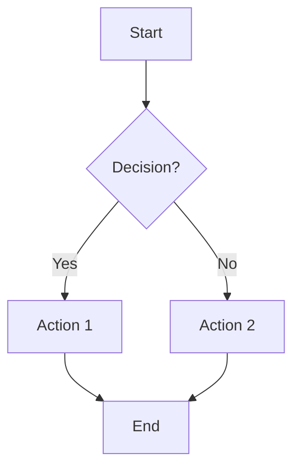
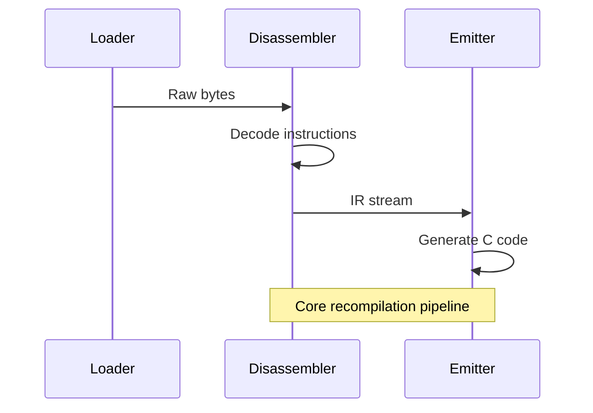
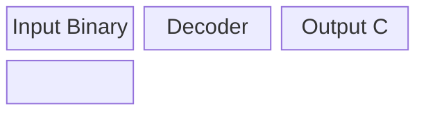
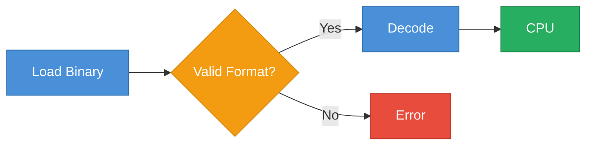
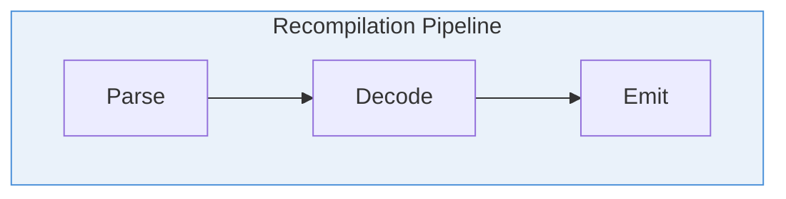
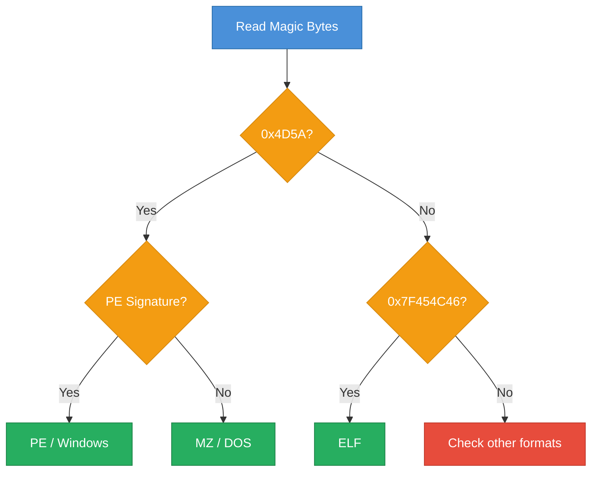
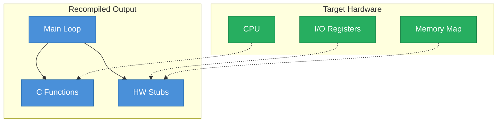

# Mermaid Diagram Cheat Sheet for Course Contributors

## Flowchart Syntax (Most Used)



Node shapes:
- `A[Text]` -- rectangle
- `A(Text)` -- rounded rectangle
- `A{Text}` -- diamond (decision)
- `A([Text])` -- stadium / pill
- `A[[Text]]` -- subroutine
- `A[(Text)]` -- cylinder (database)

Direction keywords: `TD` (top-down), `LR` (left-right), `BT` (bottom-top), `RL` (right-left)

Arrow types:
- `-->` solid arrow
- `-.->` dotted arrow
- `==>` thick arrow
- `-->|label|` labeled arrow

## Sequence Diagram Syntax



Key elements:
- `participant` / `actor` -- define participants
- `->>` solid arrow, `-->>` dashed arrow
- `Note over A,B: text` -- spanning note
- `loop` / `alt` / `opt` -- control blocks

## Block Diagram Syntax



## Course Color Scheme

| Color                  | Hex       | Usage                    |
|------------------------|-----------|--------------------------|
| Blue                   | `#4A90D9` | Pipeline stages          |
| Green                  | `#27AE60` | Hardware components      |
| Orange                 | `#F39C12` | Decision points          |
| Red                    | `#E74C3C` | Challenges / problems    |

## Style Declarations for Consistent Theming

### Applying Styles to Individual Nodes



### Applying Styles via `style` Keyword

```
style A fill:#4A90D9,stroke:#2C6FAC,color:#fff
```

### Subgraph Styling



## GitHub Rendering Notes and Limitations

- GitHub renders Mermaid in fenced code blocks tagged with `mermaid`.
- Maximum diagram complexity is limited -- very large graphs may fail to render. Keep node count under ~100.
- `block-beta` diagrams may not render on older GitHub versions. Flowcharts are the safest choice.
- GitHub does not support `click` callbacks or interactive features.
- Font and spacing differ between GitHub light and dark themes -- avoid relying on precise layout.
- Inline HTML inside node labels is not supported on GitHub.
- If a diagram fails silently, check for special characters in labels (use quotes around labels with parentheses or brackets).

## Common Patterns Used in the Course

### Recompilation Pipeline (Horizontal)


### Decision Tree (Format Detection)



### Architecture Block Diagram


