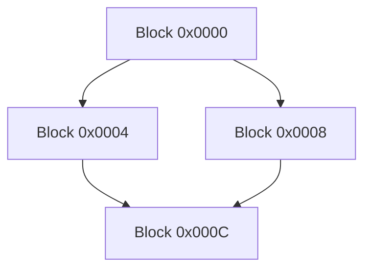
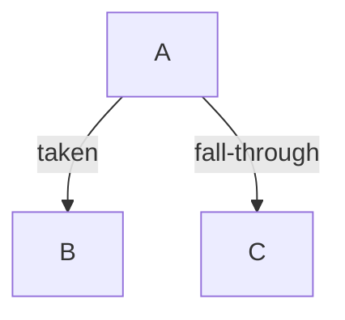

# Lab 11: CFG Visualizer

## Objective

Take a control flow graph (CFG) -- from Lab 10 or any other source -- and
generate a Mermaid diagram that visualizes basic blocks and control flow edges.

## Background

Visualizing a CFG is invaluable for understanding program structure during
static recompilation. Mermaid is a text-based diagramming language that
renders in GitHub, VS Code, and many other tools, making it an excellent
choice for lightweight CFG visualization without requiring external graphing
libraries.

### Mermaid Flowchart Syntax

A basic Mermaid flowchart looks like:



Edges can be labeled:



## Tasks

1. Convert a CFG (adjacency list of basic blocks) to Mermaid flowchart syntax.
2. Label edges with branch conditions (taken vs fall-through).
3. Support highlighting specific paths (e.g., a hot path or an error path).
4. (TODO) Add dominator tree visualization.
5. (TODO) Implement loop detection and highlight natural loops.

## Files

- `cfg_to_mermaid.py` — CFG to Mermaid converter
- `test_lab.py` — Tests that output is valid Mermaid syntax

## Running

```bash
python cfg_to_mermaid.py
python test_lab.py
```

## Key Concepts

- Control flow graph visualization
- Mermaid diagram syntax
- Dominator trees and their role in structured code recovery
- Natural loop detection (back edges in a DFS tree)
