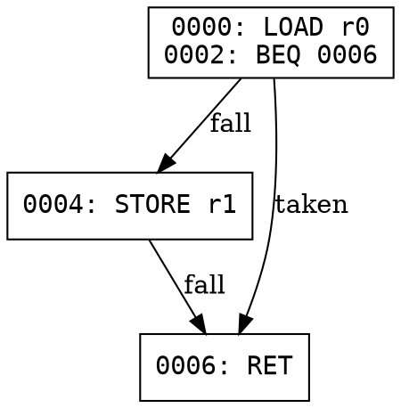

# Lab 23: CFG Builder (Recursive Descent)

## Objective

Implement a recursive-descent disassembler that builds a control-flow
graph (CFG) from a simplified instruction set. This is the same algorithm
real recompilers use to discover code paths -- you follow branches
recursively instead of linearly scanning bytes.

## Background

Linear sweep disassembly (like `objdump`) decodes every byte in order.
That works for well-structured code, but fails when data is mixed in with
instructions. Recursive descent starts at known entry points and follows
control flow, only decoding bytes that are actually reachable.

The output is a control-flow graph: a set of **basic blocks** (straight-line
instruction sequences with no branches except at the end) connected by
**edges** (branches, fall-throughs).

### SimpleISA

This lab uses a toy 8-instruction ISA defined in `simple_isa.py`:

| Opcode | Mnemonic | Operand | Description               |
|--------|----------|---------|---------------------------|
| 0x01   | NOP      | none    | No operation              |
| 0x02   | LOAD r   | 1 byte  | Load register r           |
| 0x03   | STORE r  | 1 byte  | Store register r          |
| 0x04   | ADD r    | 1 byte  | Add register r            |
| 0x05   | JMP addr | 2 bytes | Unconditional jump        |
| 0x06   | BEQ addr | 2 bytes | Branch if zero flag set   |
| 0x07   | CALL addr| 2 bytes | Call subroutine           |
| 0x08   | RET      | none    | Return from subroutine    |

All addresses are 16-bit, little-endian.

## Instructions

1. Review `simple_isa.py` -- it defines the ISA and a `decode_one()` function.
2. Open `cfg_builder.py` and implement the TODO functions:
   - `find_basic_blocks()` -- recursive descent to find block boundaries
   - `build_cfg()` -- build a dict of basic blocks with edges
   - `cfg_to_dot()` -- export the CFG in Graphviz DOT format
3. Run the tests:
   ```
   python -m pytest test_lab.py -v
   ```

## Expected Output

For a small program with a conditional branch, the DOT output looks like:


