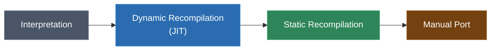
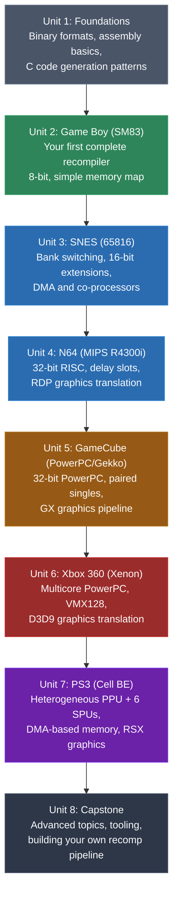

# Module 1: What Is Static Recompilation?

Static recompilation is the ahead-of-time translation of compiled machine code from one architecture into portable source code -- typically C -- that can then be compiled natively on any modern platform. It is the most powerful technique available for software preservation, performance-critical porting, and deep binary analysis.

This module defines the field, situates it among related techniques, walks through the full pipeline from binary to native executable, and previews the challenges you will solve throughout this course.

---

## 1. The Binary Translation Spectrum

Every technique for running software written for one platform on another falls somewhere on a spectrum. At one end, you interpret every instruction at runtime. At the other, you rewrite the software entirely by hand. Static recompilation occupies the sweet spot between these extremes.



### How the Approaches Compare

| Approach | Execution Speed | Development Effort | Output Portability | Modifiability | Accuracy |
|---|---|---|---|---|---|
| **Interpretation** | Slow (10-100x overhead) | Low | High (interpreter is portable) | None | Very high |
| **Dynamic Recompilation (JIT)** | Good (2-5x overhead) | Medium | Medium (JIT engine per host) | None | High |
| **Static Recompilation** | Native speed | Medium-High | Very high (C compiles everywhere) | High (output is source code) | High with effort |
| **Manual Port** | Native speed | Very high | Varies | Total | Depends on author |

**Interpretation** executes each instruction of the original program one at a time inside a software loop. It is conceptually simple but slow, because every guest instruction requires dozens or hundreds of host instructions to decode and execute.

**Dynamic recompilation** (also called JIT compilation) translates blocks of guest code into host machine code at runtime. Emulators like Dolphin and RPCS3 use this approach. It is faster than interpretation but still carries overhead from the translation process itself, and the translated code exists only in memory -- it is not portable and cannot be inspected or modified.

**Static recompilation** performs all translation ahead of time, before the program runs. The input is a binary; the output is C source code that implements the same logic. That C code is compiled with a standard compiler (GCC, Clang, MSVC) to produce a native executable. There is no runtime translation overhead. The generated source can be read, modified, and compiled on any platform with a C compiler.

**Manual porting** means a human rewrites the software from scratch, typically by studying the disassembly or original source. This produces the highest-quality result but requires enormous effort and deep understanding of both the original program and the target platform.

Static recompilation gives you native performance and full portability with a fraction of the effort of a manual port, while producing output that is transparent and modifiable -- something no emulator can offer.

---

## 2. Why Static Recompilation?

### Software Preservation

Games and historical software are trapped on dying hardware. Consoles break. Custom chips stop being manufactured. Optical media degrades. Emulators can keep this software running, but they require the emulator itself to be maintained forever, and they impose performance overhead that limits what hardware can run them.

Static recompilation produces standalone native executables. The output is C code -- the most portable language in computing history. A statically recompiled program from 2024 will compile and run in 2054 with minimal effort, because C compilers will still exist and POSIX-like environments will still be common. The preservation is in the generated source, not in a runtime dependency.

### Performance

A statically recompiled program runs at native speed. There is no interpreter loop, no JIT compiler running alongside your program, no block translation cache to manage. The C compiler applies all of its optimization passes -- inlining, register allocation, loop unrolling, vectorization -- to the generated code just as it would to hand-written C.

This matters most on low-power hardware. A Raspberry Pi can run a statically recompiled N64 game at full speed when it would struggle with a JIT-based emulator. A statically recompiled Game Boy game runs on anything with a C compiler.

### Portability

C compiles on every platform that matters: x86, ARM, RISC-V, PowerPC, MIPS, WebAssembly. A single static recompilation effort produces source code that targets all of them. You do not need to write a JIT backend for each host architecture. You do not need to maintain an interpreter for each new platform. You write one recompiler, generate C once, and compile anywhere.

### Modifiability

This is the advantage that no other approach offers. The output of static recompilation is human-readable (or at least human-navigable) C source code. You can:

- Fix bugs in the original program
- Add widescreen support, high-resolution rendering, or modern control schemes
- Replace graphics API calls (e.g., translate proprietary GPU commands to Vulkan or Direct3D)
- Integrate with modern operating system features (networking, achievements, cloud saves)
- Instrument the code for analysis, profiling, or debugging

Emulators treat the original binary as a black box. Static recompilation cracks it open.

### When to Use Emulation Instead

Static recompilation is not always the right tool. Emulation is preferable when:

- **You need cycle-accurate timing** (e.g., demoscene programs that rely on exact CPU/PPU synchronization)
- **The program uses heavy self-modifying code** (some DOS programs, certain copy protection schemes)
- **You want to run many different programs** without recompiling each one individually
- **Development time is limited** and a mature emulator already exists for the target platform

Static recompilation excels when you want to preserve and enhance a specific program, achieve native performance, or produce a portable artifact that stands on its own.

---

## 3. The Static Recompilation Pipeline

The full pipeline from input binary to running native executable involves seven major stages:

```mermaid
flowchart LR
    A["Binary\n(ROM / EXE)"] --> B["Format\nParser"]
    B --> C["Disassembler"]
    C --> D["Control Flow\nAnalyzer"]
    D --> E["Instruction\nLifter"]
    E --> F["C Code\nGenerator"]
    F --> G["C Compiler"]
    G --> H["Linker\n+ Runtime"]
    H --> I["Native\nExecutable"]

    style A fill:#2d3748,stroke:#4a5568,color:#fff
    style B fill:#2b6cb0,stroke:#3182ce,color:#fff
    style C fill:#2b6cb0,stroke:#3182ce,color:#fff
    style D fill:#2b6cb0,stroke:#3182ce,color:#fff
    style E fill:#2b6cb0,stroke:#3182ce,color:#fff
    style F fill:#2b6cb0,stroke:#3182ce,color:#fff
    style G fill:#2f855a,stroke:#38a169,color:#fff
    style H fill:#2f855a,stroke:#38a169,color:#fff
    style I fill:#2f855a,stroke:#38a169,color:#fff
```



The blue stages are what you build as a recompiler author. The green stages use existing tools (a C compiler and linker). Let us walk through each one.

### Stage 1: Binary Parsing

Every binary has a container format that describes how the code and data are laid out. A Game Boy ROM has a header at `0x0100-0x014F` that specifies the entry point, ROM size, and mapper type. An N64 ROM has a different header. A Windows PE executable has section tables. An ELF binary has program headers and section headers.

The format parser reads this container, extracts the raw code and data segments, and determines the entry point address and memory map. This stage must handle format-specific details like endianness (N64 ROMs are big-endian), banking (SNES and Game Boy use memory bank switching), and relocation tables (PE and ELF executables).

Getting this stage right is critical. If you misidentify a data region as code, or miss a code region entirely, everything downstream will produce incorrect results.

### Stage 2: Disassembly

The disassembler converts raw bytes into assembly instructions. There are two fundamental strategies:

**Linear sweep** starts at the beginning of a code section and decodes instructions sequentially, one after another. It is simple but can be fooled by data embedded in code sections -- it will try to decode data bytes as instructions and produce garbage.

**Recursive descent** starts at known entry points (the reset vector, exported functions, interrupt handlers) and follows the control flow: when it encounters a branch, it follows both targets. It only disassembles bytes that are actually reachable as code. This is more accurate but can miss code that is only reached through indirect jumps (function pointers, jump tables).

In practice, most static recompilers use recursive descent as the primary strategy, augmented with heuristics or manual annotations to catch code that indirect jumps reach.

### Stage 3: Control Flow Analysis

Once the instructions are disassembled, the control flow analyzer groups them into **basic blocks** -- straight-line sequences of instructions with a single entry point (the first instruction) and a single exit point (the last instruction, which is a branch, jump, call, or return).

These basic blocks are connected by edges representing the possible flow of execution, forming a **control flow graph (CFG)**. The CFG is the central data structure of the recompiler. It tells you which blocks can execute after which other blocks, which blocks form loops, and which blocks are unreachable.

Advanced analysis at this stage can recover higher-level structures: loops, if/else chains, switch statements. Some recompilers use this to generate more readable C code with structured control flow rather than flat goto-based code.

### Stage 4: Instruction Lifting

This is the core of static recompilation. The instruction lifter takes each assembly instruction and translates it into equivalent C code that produces the same observable effects: the same register values, the same memory writes, the same flag updates.

For a simple instruction like `ADD A, B` on the Game Boy (SM83), the lifter must:

1. Compute the result: `A + B`
2. Store the result in the A register
3. Update the zero flag (set if result is 0)
4. Clear the subtract flag
5. Update the half-carry flag (carry from bit 3 to bit 4)
6. Update the carry flag (carry from bit 7)

Every instruction in the source architecture needs a corresponding lifting rule. A Game Boy has roughly 500 instructions (including CB-prefixed opcodes). An N64's MIPS R4300i has several hundred. The PS3's Cell SPU has over 200. Each must be lifted correctly or the recompiled program will not function.

### Stage 5: Code Generation

The code generator takes the lifted C statements and organizes them into compilable C source files. It must handle:

- **Function boundaries**: grouping basic blocks into C functions
- **Labels and gotos**: translating branch targets into C labels within a function
- **Global state**: defining the CPU context structure (registers, flags, program counter)
- **Memory access**: generating calls to memory read/write functions that implement the original system's memory map

The output at this stage is one or more `.c` files and associated headers. This is the artifact that makes static recompilation valuable -- it is portable, readable, and modifiable source code.

### Stage 6: Runtime Library

The generated C code does not run in a vacuum. It calls into a **runtime library** that provides:

- **Memory system**: read/write functions that implement the original hardware's memory map, including bank switching, memory-mapped I/O, and mirroring
- **Hardware shims**: implementations of the original system's peripherals (video, audio, input, timers)
- **Graphics translation**: converting the original system's rendering commands into modern API calls (SDL2, OpenGL, Vulkan, Direct3D)
- **Audio mixing**: converting the original sound hardware's behavior into PCM audio output
- **Input mapping**: translating modern controller/keyboard input into the format the original program expects

The runtime is where the majority of platform-specific work lives. The recompiled C code is generic; the runtime makes it behave like the original hardware.

### Stage 7: Compilation and Linking

Finally, the generated C files and the runtime library are compiled with a standard C compiler and linked together to produce a native executable. This step uses entirely standard tooling -- GCC, Clang, or MSVC -- with standard optimization flags.

The result is a self-contained native binary that runs the original program at full speed on the host platform, with no emulator or runtime translator involved.

---

## 4. A Concrete Example

Let us make this concrete. Consider a simple loop from a Game Boy (SM83) program that scans through a block of memory looking for a non-zero byte:

### Original Assembly (SM83)

```asm
loop:
    LD A, [HL]     ; Load byte from address in HL into A
    INC HL         ; Increment HL to point to next byte
    CP 0x00        ; Compare A with zero (sets flags)
    JR NZ, loop    ; Jump back to loop if A was not zero
```

This is four instructions. The `LD A, [HL]` instruction reads a byte from the memory address stored in the 16-bit HL register pair. `INC HL` advances the pointer. `CP 0x00` subtracts zero from A without storing the result, but updates all flags -- critically, the zero flag. `JR NZ, loop` is a conditional relative jump that branches back to `loop` if the zero flag is not set (meaning A was not equal to zero).

### Recompiled C Output

```c
loop:
    ctx->a = mem_read(ctx->hl);
    ctx->hl++;
    cp_update_flags(ctx, ctx->a, 0x00);
    if (!ctx->flags.z) goto loop;
```

### How Each Instruction Maps

| SM83 Assembly | Recompiled C | What It Does |
|---|---|---|
| `LD A, [HL]` | `ctx->a = mem_read(ctx->hl);` | Read byte from memory at address HL into register A |
| `INC HL` | `ctx->hl++;` | Increment the 16-bit HL register pair |
| `CP 0x00` | `cp_update_flags(ctx, ctx->a, 0x00);` | Compare A with 0 by computing flags for A - 0 |
| `JR NZ, loop` | `if (!ctx->flags.z) goto loop;` | Branch back if the zero flag is clear |

The `ctx` pointer references a structure holding the entire CPU state -- all registers and flags. The `mem_read` function is part of the runtime library; it implements the Game Boy's memory map, handling ROM banking, VRAM access, and memory-mapped I/O registers. The `cp_update_flags` helper computes the zero, subtract, half-carry, and carry flags exactly as the SM83 hardware would.

This is a deliberately simple example. Real recompiled code handles more complex situations: 16-bit arithmetic with carry, conditional calls and returns, interrupt handling, and hardware register side effects. But the principle is always the same: each assembly instruction becomes one or more C statements that produce the identical observable result.

---

## 5. History and Notable Projects

### Academic Origins

Binary translation as a research topic dates back to the early 1990s. Digital Equipment Corporation's **FX!32** (1997) translated x86 Windows binaries to run on Alpha processors, combining interpretation with profile-guided static translation. HP's **Dynamo** (2000) demonstrated dynamic binary optimization. IBM's **DAISY** (1997) explored hardware-assisted binary translation.

These early projects focused on architecture migration -- helping customers move from one commercial platform to another without recompiling their software. The idea of using binary translation for software preservation and game porting came later.

### The Decompilation and Reverse Engineering Community

Throughout the 2000s and 2010s, communities around reverse engineering tools like IDA Pro and later Ghidra developed techniques for understanding compiled binaries. Decompilation -- translating machine code back into high-level source -- matured significantly. Projects like the **Super Mario 64** and **Ocarina of Time** decompilations demonstrated that entire commercial games could be reverse-engineered to produce compilable C code.

These decompilation projects differ from static recompilation in a key way: decompilation aims to recover the original source code (or something close to it), which requires enormous manual effort. Static recompilation aims to produce functionally equivalent C code automatically, without trying to recover the original program's structure or variable names.

### N64Recomp and the Modern Era

**[N64Recomp](https://github.com/N64Recomp/N64Recomp)** by **Mr-Wiseguy** (Wiseguy) brought static recompilation into mainstream visibility. The **[Zelda64Recomp](https://github.com/Zelda64Recomp/Zelda64Recomp)** project -- a native PC port of *The Legend of Zelda: Majora's Mask* -- demonstrated that static recomp could handle complex commercial games and produce results that rivaled or exceeded what emulators could achieve, with native performance and full moddability.

N64Recomp's design philosophy is pragmatic: rather than trying to build a general emulator, it focuses on producing high-quality native ports of individual titles. Each MIPS instruction is translated literally into C, and the host compiler optimizes the result. Wiseguy has noted that an experienced developer can set up a new N64 title for recompilation in roughly two days using the toolchain.

The graphics side is handled by **[RT64](https://github.com/rt64/rt64)**, created by **Dario Samo** (@dariosamo). RT64 is a modern rendering backend that translates N64 display lists into D3D12/Vulkan/Metal draw calls using ubershaders to eliminate pipeline compilation stutters. It started as a ray-tracing mod for Super Mario 64 and evolved into a general-purpose N64 renderer with accuracy-first design -- no per-game hacks. Wiseguy and Dario discussed their collaboration and design philosophy in a [Software Engineering Daily interview (Oct 2024)](https://softwareengineeringdaily.com/2024/10/02/n64-recompiled-with-dario-and-wiseguy/).

Since then, the N64Recomp ecosystem has grown rapidly: **sonicdcer** ported Star Fox 64 and Mario Kart 64, **Rainchus** ported Quest 64, **theboy181** ported Dr. Mario 64, and many others have contributed ports using the toolchain.

The N64 is a particularly good target for static recompilation because its MIPS R4300i CPU has a clean, regular instruction set with fixed-width 32-bit instructions. This makes disassembly reliable and instruction lifting straightforward compared to architectures with variable-length instructions (x86) or complex microarchitectural state (Cell).

### The Growing Community

Static recompilation has grown from scattered individual efforts into a real community, with multiple people and teams pushing the boundaries:

**Xbox 360 / PowerPC:** **[rexdex](https://github.com/rexdex/recompiler)** built the foundational Xbox 360 static recompiler that proved the concept was viable. Building on that work, **Skyth** ([hedge-dev](https://github.com/hedge-dev)) created **[XenonRecomp](https://github.com/hedge-dev/XenonRecomp)** and **[XenosRecomp](https://github.com/hedge-dev/XenosRecomp)** (for GPU shader translation), which together with **Sajid's** XenonAnalyse powered the **[UnleashedRecomp](https://github.com/hedge-dev/UnleashedRecomp)** project -- a full PC port of Sonic Unleashed from Xbox 360. The **[RexGlueSDK](https://github.com/rexglue/rexglue-sdk)** by tomcl7 provides another Xbox 360 recompilation runtime built on these foundations.

**Game Boy:** **[arcanite24](https://github.com/arcanite24)** (Brandon G. Neri) built **[gb-recompiled](https://github.com/arcanite24/gb-recompiled)**, a Game Boy static recompiler that successfully processes 98.9% of the tested ROM library. Its advanced static solver for JP HL and CALL HL instructions and trace-guided recompilation for complex games demonstrate how much can be done even on simpler architectures.

**SNES:** **Andrea Orru** ([AndreaOrru](https://github.com/AndreaOrru)) created **[Gilgamesh](https://github.com/AndreaOrru/gilgamesh)**, a SNES reverse engineering toolkit with static recompilation support for the 65C816.

**PS2:** **[ran-j](https://github.com/ran-j)** is developing **[PS2Recomp](https://github.com/ran-j/PS2Recomp)** for PS2 ELF binaries (MIPS R5900).

### sp00nznet's Work

This course's author, [sp00nznet](https://github.com/sp00nznet), has built recompilation projects spanning 10 architectures:

- **Game Boy (SM83)**: Game-specific recompilations
- **SNES (65816)**: snesrecomp framework
- **DOS (x86 real mode)**: DOS game recompilations
- **N64 (MIPS R4300i)**: Multiple N64 title recompilations
- **Xbox (x86)**: xboxrecomp toolkit
- **Xbox 360 (PowerPC/Xenon)**: 360tools and XenonRecomp-based projects
- **GameCube (PowerPC/Gekko)**: gcrecomp framework
- **Dreamcast (SH-4)**: Dreamcast title recompilations
- **PS2 (MIPS R5900)**: PS2 game recompilations
- **PS3 (Cell BE / PPU + SPU)**: ps3recomp, tackling one of the most complex consumer architectures ever made

This breadth across architectures is what motivated creating this course -- the same fundamental pipeline applies in every case, and the lessons learned on one architecture directly inform work on the next.

### The Preservation Argument

Software is culture. Games, productivity software, operating systems, and demos from past decades represent creative and engineering achievements that deserve to survive beyond the lifespan of the hardware they were written for. Emulators have carried the preservation torch for decades, but they have limitations: they require ongoing maintenance, they impose performance overhead, and they treat the original software as an opaque binary.

Static recompilation produces a permanent, portable artifact -- C source code -- that is the closest thing to a platform-independent representation of the original program's behavior. It is a stronger form of preservation than emulation alone.

---

## 6. Challenges Preview

Static recompilation is not a solved problem. Each of the following challenges will receive dedicated coverage later in this course:

### Indirect Jumps and Calls (Module 7)

When a program computes a jump target at runtime -- through a function pointer, a jump table, or a calculated branch -- the static recompiler cannot determine at analysis time where execution will go. This is the single hardest problem in static recompilation. Solutions include jump table recovery, type analysis, and runtime fallback mechanisms.

### Self-Modifying Code

Some programs write new instructions into memory and then execute them. This is common in certain DOS programs, some copy protection schemes, and occasionally in console games that use code generation for performance. Static recompilation fundamentally assumes the code is fixed at analysis time; self-modifying code violates this assumption and requires special handling.

### Hardware Timing Dependencies

Original hardware executes instructions in a specific number of cycles, and some programs depend on this timing -- for example, changing a graphics register at a precise point during screen rendering to achieve a visual effect. Statically recompiled code runs at whatever speed the host CPU provides. Preserving timing-dependent behavior requires careful instrumentation in the runtime.

### Floating Point Precision

Different architectures implement floating point arithmetic differently. The N64's MIPS R4300i, the GameCube's Gekko, and a modern x86-64 CPU all handle rounding, denormals, and edge cases slightly differently. Games that depend on specific floating point behavior (physics simulations, for example) may produce different results when recompiled. Reproducing the original behavior exactly can require disabling compiler optimizations or using software floating point emulation for critical sections.

### Graphics API Translation

The original hardware has custom graphics processors with unique command sets. A Game Boy has a PPU that draws tiles and sprites according to specific registers. An N64 has the Reality Display Processor (RDP) with its own microcode. A PS3 has RSX (a modified NVIDIA GPU) driven by libGCM commands. Translating these into modern graphics APIs -- OpenGL, Vulkan, Direct3D 11/12 -- is a major engineering effort that lives in the runtime library.

---

## 7. What You Will Build in This Course

This course takes you from first principles to advanced topics, building real static recompilation tools along the way. The progression follows a path through increasingly complex architectures:



Each unit builds on the last. By the end, you will understand not just how to use static recompilation tools, but how to build them -- and how to extend them to new architectures you encounter in the future.

In **Unit 2**, you will build a complete Game Boy static recompiler from scratch. The SM83 processor is simple enough to be tractable as a first project, but complex enough to encounter real challenges: bank switching, interrupt handling, and hardware register side effects.

In **Units 3 through 7**, you will tackle progressively more complex architectures, each introducing new concepts: 16-bit address space extensions (SNES), RISC pipelines with delay slots (N64), paired-single floating point (GameCube), multicore with VMX SIMD (Xbox 360), and finally the heterogeneous Cell architecture (PS3) where a general-purpose PPU coordinates with six specialized SPU cores communicating through DMA.

In **Unit 8**, you will bring everything together, building reusable tooling and applying your skills to new targets.

The goal is not just to understand static recompilation in the abstract, but to develop the practical skills and architectural intuition needed to take any binary and produce a working, portable, native executable from it.

---

**Next: [Module 2 -- Binary Formats and Executable Anatomy](../module-02-binary-formats/lecture.md)**
