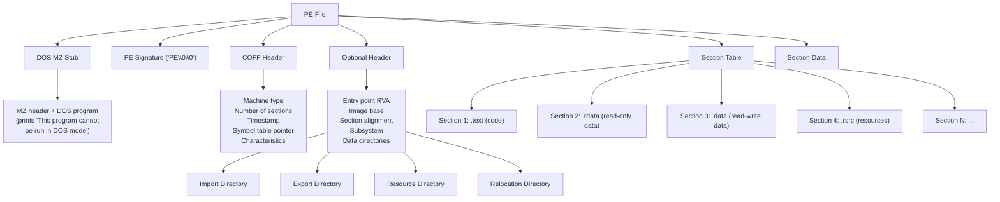
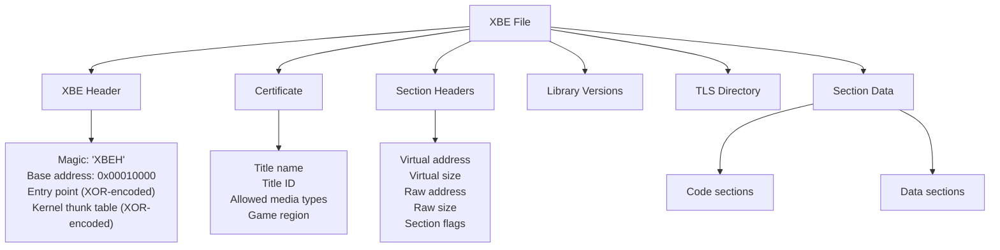
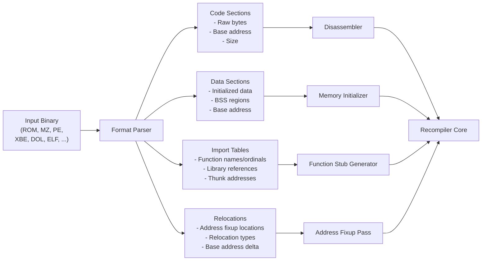

# Module 2: Binary Formats and Executable Anatomy

## 1. Why Binary Formats Matter

A static recompiler's very first job -- before any disassembly, before any analysis -- is **parsing the input binary**. If you cannot correctly read the executable format, you cannot extract the code, the data, or the metadata that drives every subsequent stage of the pipeline.

Every platform has its own binary format, and each format reflects the hardware and OS design philosophy of its era. Cartridge-based consoles use flat ROM images with minimal headers. PCs use layered formats (MZ, PE) that evolved over decades. Modern consoles wrap executables in signed, encrypted, and compressed containers.

Understanding binary formats is understanding the target. The format tells you:

- Where the code lives (and how it is organized into sections)
- Where the data lives (and how it should be laid out in memory)
- What external functions the program imports
- How addresses are relocated when the binary is loaded
- Whether the content is compressed or encrypted and must be unpacked first

This module surveys every format you will encounter in this course.

---

## 2. ROM Formats (Cartridge-Based)

Cartridge-based systems use relatively simple binary layouts. There is no operating system loader -- the CPU boots directly from ROM mapped into the address space.

### Game Boy (SM83)

Game Boy ROMs are flat binary images ranging from 32 KB (no banking) to 8 MB (with memory bank controllers). The header occupies bytes `0x0100` through `0x014F`:

```
Game Boy ROM Layout
===================================================================

 Offset     Size     Description
-------------------------------------------------------------------
 0x0000     0x100    Interrupt vectors / RST handlers
 0x0100     0x004    Entry point (usually NOP + JP 0x0150)
 0x0104     0x030    Nintendo logo (used for boot validation)
 0x0134     0x010    Game title (uppercase ASCII)
 0x0143     0x001    CGB flag
 0x0144     0x002    New licensee code
 0x0146     0x001    SGB flag
 0x0147     0x001    Cartridge type (MBC variant)
 0x0148     0x001    ROM size code
 0x0149     0x001    RAM size code
 0x014A     0x001    Destination code
 0x014B     0x001    Old licensee code
 0x014C     0x001    ROM version
 0x014D     0x001    Header checksum
 0x014E     0x002    Global checksum
 0x0150     ...      Program code and data begin
===================================================================

Memory Map (with MBC1):

 CPU Address Space          Cartridge ROM
 +------------------+       +------------------+
 | 0x0000 - 0x3FFF  | <---- | Bank 0 (fixed)   |
 |  ROM Bank 0      |       +------------------+
 +------------------+       | Bank 1           |
 | 0x4000 - 0x7FFF  | <--+  +------------------+
 |  Switchable Bank  |    +--| Bank 2           |
 +------------------+    |  +------------------+
 | 0x8000 - 0x9FFF  |    +--| Bank 3           |
 |  VRAM            |    |  +------------------+
 +------------------+    +--|       ...        |
 | 0xA000 - 0xBFFF  |    |  +------------------+
 |  External RAM    |    +--| Bank N           |
 +------------------+       +------------------+
 | 0xC000 - 0xFFFF  |
 |  WRAM / IO / etc |
 +------------------+
```

The **cartridge type byte** at `0x0147` determines the Memory Bank Controller (MBC) variant. MBC1, MBC3, and MBC5 are the most common. The recompiler must understand bank switching to correctly resolve cross-bank references: a `CALL` to address `0x4000` targets a different function depending on which bank is currently mapped.

### SNES (65816)

SNES ROMs use one of two primary memory mappings:

- **LoROM**: 32 KB banks mapped to the upper half of each bank (`0x8000-0xFFFF`)
- **HiROM**: 64 KB banks mapped contiguously

Header detection is heuristic-based. The SNES has no magic number -- instead, you check the internal checksum complement at the expected header offset (`0x7FC0` for LoROM, `0xFFC0` for HiROM) and see which one validates.

### N64 (MIPS)

N64 ROMs contain big-endian MIPS code, but the ROM file itself can appear in three byte orderings depending on the dumping tool:

| Extension | Byte Order | First 4 Bytes |
|-----------|-----------|----------------|
| `.z64`    | Big-endian (native) | `80 37 12 40` |
| `.n64`    | Little-endian (word-swapped) | `40 12 37 80` |
| `.v64`    | Byte-swapped (16-bit) | `37 80 40 12` |

The first 4 KB of an N64 ROM contain the boot code (IPL3), which handles hardware initialization. The entry point and load address are specified in the header at offset `0x0008`.

---

## 3. PC Executable Formats

### MZ (DOS)

The MZ format (named after Mark Zbikowski) is the original DOS executable format. Its header starts with the magic bytes `4D 5A` ("MZ"):

**Header structure (28 bytes minimum):**

| Offset | Size | Field |
|--------|------|-------|
| 0x00 | 2 | Magic number (`MZ`) |
| 0x02 | 2 | Bytes on last page |
| 0x04 | 2 | Pages in file (512 bytes each) |
| 0x06 | 2 | Relocation count |
| 0x08 | 2 | Header size in paragraphs (16 bytes each) |
| 0x0A | 2 | Minimum extra paragraphs |
| 0x0C | 2 | Maximum extra paragraphs |
| 0x0E | 2 | Initial SS (relative) |
| 0x10 | 2 | Initial SP |
| 0x12 | 2 | Checksum |
| 0x14 | 2 | Initial IP |
| 0x16 | 2 | Initial CS (relative) |
| 0x18 | 2 | Relocation table offset |
| 0x1A | 2 | Overlay number |

**Relocations** are segment:offset pairs. DOS loads the executable at an arbitrary segment, so every far pointer embedded in the code must be adjusted by the load segment. A recompiler must apply these relocations to resolve absolute addresses.

**EXEPACK** compression was commonly used in the late 1980s and early 1990s. EXEPACK-compressed executables contain a small decompression stub that unpacks the real code at load time. A recompiler must either decompress the binary as a preprocessing step or handle the compression internally.

**Overlays** are additional code/data appended after the main executable image. They are loaded on demand by the application itself. Overlay management is application-specific, making it one of the more complex aspects of DOS recompilation.

### PE (Windows / Xbox)

The Portable Executable format is the standard for Windows executables and was also used (with modifications) for the original Xbox. A PE file is structured in layers:



Key concepts for recompiler authors:

- **RVA (Relative Virtual Address)**: Addresses are relative to the image base. The PE loader maps sections at `ImageBase + section RVA`.
- **Import table**: Lists DLLs and functions the executable calls. The recompiler must generate stubs or wrappers for each import.
- **Export table**: Lists functions the executable provides. Relevant when recompiling DLLs.
- **Relocations**: Base relocation entries allow the image to load at a different base address. Critical for position-dependent recompilation.

---

## 4. Console Executable Formats

### XBE (Original Xbox)

The Xbox Executable format is derived from PE but customized for the Xbox kernel:



Notable details:

- The entry point and kernel thunk addresses are **XOR-encoded** with known keys (retail vs debug).
- The Xbox kernel exposes exactly **147 functions** via ordinal. The kernel thunk table contains pointers resolved by ordinal number, not by name.
- Section headers include digest hashes for integrity checking.

### XEX2 (Xbox 360)

Xbox 360 executables use the XEX2 format, which wraps a PE image inside a signed and optionally compressed container:

| Component | Description |
|-----------|-------------|
| XEX2 Header | Magic `XEX2`, module flags, PE offset, security info offset |
| Optional Headers | Variable-length list: entry point, base address, import libraries, TLS info, system flags |
| Security Info | RSA signature, SHA-1 hashes of each page, AES encryption key |
| Compressed PE | The actual PE image, block-compressed and/or encrypted |

For recompilation, you must first decrypt and decompress the PE image, then parse it as a standard PE. The optional headers contain the import library table, which maps imported functions from system libraries (`xboxkrnl.exe`, `xam.xex`, etc.) by ordinal.

### DOL (GameCube / Wii)

The DOL format is one of the simplest executable formats you will encounter:

- **7 text (code) sections** and **11 data sections** -- each with file offset, load address, and size
- **BSS address and size** (uninitialized data, not stored in the file)
- **Entry point address**
- No imports, no exports, no relocations -- the GameCube/Wii OS is linked statically or handled via fixed function addresses

The header is exactly 256 bytes. Parsing a DOL takes roughly 20 lines of code.

### ELF (PS2 / PS3 / Linux)

The Executable and Linkable Format is the standard on Unix-like systems and was adopted by Sony for PlayStation consoles:

| ELF Component | Purpose |
|---------------|---------|
| ELF Header | Magic, class (32/64), endianness, machine type, entry point |
| Program Headers | Describe segments to load: type, offset, virtual address, size, flags |
| Section Headers | Describe sections: name, type, flags, address, offset, size |
| Symbol Table | Function and variable names with addresses |
| Relocation Tables | Address fixups for position-independent code |
| Dynamic Section | Shared library dependencies and dynamic linking info |

PS2 ELFs are 32-bit MIPS little-endian. PS3 ELFs are 64-bit PowerPC big-endian (but are typically wrapped in SELF containers for distribution).

### SELF (PS3)

The Signed ELF format wraps a standard ELF with Sony's encryption and signing infrastructure:

```
+----------------------------+
| SCE Header                 |  Magic: 'SCE\0', header type, metadata offset
+----------------------------+
| Self Header / App Info     |  Auth ID, vendor ID, self type, version
+----------------------------+
| ELF Header (copy)         |  Copy of the inner ELF header
+----------------------------+
| Program Header Table       |  Copy of the inner program headers
+----------------------------+
| Section Info (per segment) |  Offset, size, compression type, encryption flag
+----------------------------+
| SCE Version Info           |
+----------------------------+
| Control Info               |  NPDRM info, digest, etc.
+----------------------------+
| Encrypted/Compressed Data  |  The actual ELF segments
+----------------------------+
```

For recompilation, you need decrypted SELF files (or the extracted ELF). The RPCS3 project and community tools can decrypt retail SELFs. Once decrypted, you parse the inner ELF normally.

### Format Comparison

```mermaid
graph LR
    subgraph Simple["Simple Formats"]
        GB["Game Boy ROM<br/>Flat binary + small header"]
        DOL["DOL (GC/Wii)<br/>18 sections, 256-byte header"]
    end

    subgraph Moderate["Moderate Complexity"]
        MZ["MZ (DOS)<br/>Segments + relocations"]
        ELF["ELF (PS2/PS3)<br/>Sections + segments + symbols"]
    end

    subgraph Complex["Complex Formats"]
        PE["PE (Windows/Xbox)<br/>Sections + imports + exports + relocs"]
        XBE["XBE (Xbox)<br/>PE-derived + kernel thunks"]
    end

    subgraph Wrapped["Wrapped/Encrypted"]
        XEX["XEX2 (Xbox 360)<br/>Encrypted PE container"]
        SELF["SELF (PS3)<br/>Signed + encrypted ELF"]
    end

    Simple --> Moderate --> Complex --> Wrapped
```



---

## 5. Compression and Encryption

Several formats include compression or encryption that must be handled before the recompiler can access the actual code and data.

### EXEPACK (DOS)

EXEPACK is a simple run-length compression scheme applied to DOS MZ executables. The compressed executable includes a decompression stub that runs first. For static recompilation, you should **decompress as a preprocessing step**, producing a clean MZ executable that the recompiler can parse normally.

Tools like `unexepack` can perform this extraction. Alternatively, you can implement EXEPACK decompression directly -- the algorithm is well-documented and straightforward.

### XEX2 Compression (Xbox 360)

XEX2 files use block-based compression (LZX or raw deflate) on the embedded PE image. The compression is specified in the optional headers, and each block has a hash for verification. You must:

1. Read the compression info from the optional headers
2. Decompress each block in sequence
3. Reconstruct the PE image
4. Parse the PE as usual

### SELF Encryption (PS3)

SELF files use AES-128-CBC encryption per segment, with per-segment keys derived from the master key hierarchy. The encryption keys are hardware-specific (stored in the PS3's secure hardware). For recompilation purposes:

- Use community-decrypted ELFs when available
- Use `scetool` or similar to decrypt if you have the keys
- The RPCS3 emulator project provides tooling for this

### When to Handle These

The general principle is: **handle decryption and decompression as a preprocessing step**, separate from the recompiler itself. This keeps the recompiler's binary parser clean and focused. Your pipeline becomes:

```
Encrypted/Compressed Binary --> Preprocessing Tool --> Clean Binary --> Recompiler
```

The one exception is when the compression is integral to the format and you want your recompiler to accept files directly (for user convenience). In that case, build the decompression into your format parser as an early stage.

---

## 6. Practical: What the Recompiler Extracts

Regardless of the format, every binary parser in a static recompiler extracts the same fundamental data:



**Code sections** become the input to the disassembler. The parser provides the raw bytes along with the virtual address at which they should be disassembled. For multi-section binaries, each code section is disassembled independently.

**Data sections** are used to initialize the recompiled program's memory. Read-only data (string tables, constant arrays, vtables) can often be emitted as `const` arrays in C. Read-write data must be placed in a mutable memory region.

**Import tables** tell the recompiler which external functions the original program calls. Each import becomes a function stub in the recompiled output -- either mapping to an equivalent host OS function or to a reimplementation.

**Relocations** identify places in the code and data where absolute addresses are embedded. When the recompiler translates code, these locations must be handled specially -- either by applying the relocations at parse time or by emitting address computation code that accounts for the new memory layout.

Not every format provides all four of these. Game Boy ROMs have no import tables or relocations (everything is statically linked and position-fixed). DOL files have no imports. The recompiler must adapt to whatever the format provides.

---

## Summary

| Format | Platforms | Complexity | Key Challenge |
|--------|-----------|-----------|---------------|
| GB ROM | Game Boy | Low | Bank switching |
| SNES ROM | SNES | Low-Medium | LoROM/HiROM detection |
| N64 ROM | N64 | Low-Medium | Byte ordering variants |
| MZ | DOS | Medium | Relocations, EXEPACK, overlays |
| PE | Windows, Xbox | High | Imports, exports, relocations, sections |
| XBE | Xbox | High | XOR-encoded pointers, kernel thunks |
| XEX2 | Xbox 360 | Very High | Encryption + compression + PE inside |
| DOL | GameCube/Wii | Low | Almost nothing -- 256-byte header |
| ELF | PS2, PS3, Linux | Medium-High | Flexible but well-documented |
| SELF | PS3 | Very High | Encryption, signing, key management |

The takeaway: always separate format parsing from the rest of your recompiler. Write a clean parser for each format that outputs a uniform internal representation (code sections, data sections, imports, relocations). Everything downstream operates on that uniform representation, not on format-specific structures.

---

Next: Module 3 -- CPU Architectures for Recompilers
