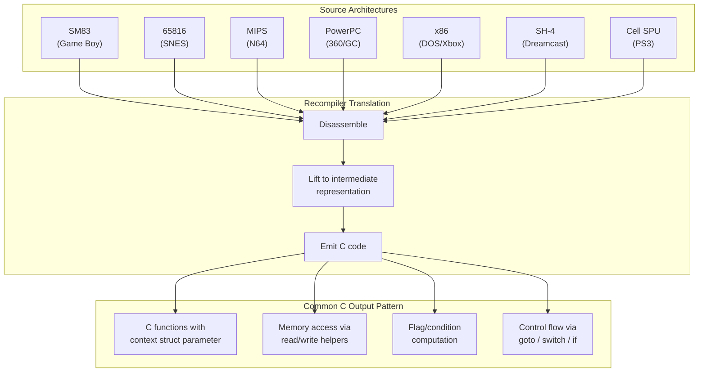
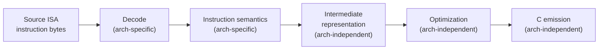

# Module 3: CPU Architectures for Recompilers

## 1. Why Architecture Knowledge Matters for Recompilers

Static recompilation is, at its core, **translation between instruction set architectures**. You are reading instructions from a source ISA and emitting equivalent code in C (or another target language) that produces identical behavior when compiled for the host ISA.

This means you need to understand the source ISA deeply:

- **Every instruction's semantics** must be captured correctly. A single missed side effect (an unhandled flag update, a skipped delay slot) produces a wrong translation.
- **Each ISA has unique challenges** that shape your recompiler's design. Delay slots require different control flow handling than conditional execution. Variable-length encodings require different disassembly strategies than fixed-width ones. SIMD-only architectures require fundamentally different register modeling.
- **Calling conventions and ABI details** determine how you detect and lift function boundaries, which is essential for producing readable, maintainable output.

This module surveys all seven architectures covered in this course, specifically from the perspective of someone writing a static recompiler for them.

---

## 2. Architecture Comparison Table

| Feature | SM83 (GB) | 65816 (SNES) | MIPS (N64) | PowerPC (360/GC) | x86 (DOS/Xbox) | SH-4 (DC) | Cell SPU (PS3) |
|---|---|---|---|---|---|---|---|
| **Word size** | 8-bit | 8/16-bit | 32/64-bit | 32/64-bit | 16/32-bit | 32-bit | 128-bit |
| **Endianness** | Little | Little | Big | Big | Little | Little | Big |
| **GPR count** | 7 (A,B,C,D,E,H,L) | 5 (A,X,Y,S,D) | 32 | 32 | 8 (16/32-bit) | 16 | 128 |
| **Instruction encoding** | Variable (1-3 bytes) | Variable (1-4 bytes) | Fixed (4 bytes) | Fixed (4 bytes) | Variable (1-15 bytes) | Fixed (2 bytes) | Fixed (4 bytes) |
| **Delay slots** | No | No | Yes (1) | No | No | Yes (1) | No |
| **Flags register** | Z, N, H, C | N, V, M, X, D, I, Z, C | No flags register | CR (8 fields x 4 bits) | EFLAGS (many) | T bit + SR | No flags register |
| **Calling convention** | Custom per game | Custom per game | o32/n32/n64 | PPC SysV / Xbox 360 ABI | cdecl/stdcall/fastcall | SH-4 ABI | SPU ABI |
| **Notable quirk** | Bank switching | Variable-width A/X/Y | Branch delay slots | Condition register | Prefix bytes, REP | Compact ISA (16-bit) | No scalar ops, local store only |

---

## 3. Per-Architecture Deep Dive

### SM83 (Game Boy)

The SM83 is a custom Sharp CPU loosely based on the Intel 8080 and Zilog Z80. It is the simplest architecture in this course and makes an excellent teaching target.

**Register set:**
- 8-bit registers: `A`, `B`, `C`, `D`, `E`, `H`, `L`
- 16-bit pairs: `BC`, `DE`, `HL`, `AF`
- Special: `SP` (stack pointer), `PC` (program counter)
- Flags (in `F` register): Zero (Z), Subtract (N), Half-carry (H), Carry (C)

**Instruction encoding:**
Variable-length, 1 to 3 bytes. The first byte is the opcode (with a `0xCB` prefix for bit operations). Immediate values follow the opcode byte.

**Memory model:**
16-bit address space (64 KB). ROM is mapped at `0x0000-0x7FFF`, with the upper half bank-switched. RAM at `0xC000-0xDFFF`. Memory-mapped I/O for the PPU, APU, and other hardware.

**Top 3 recompiler challenges:**
1. **Bank switching**: Code in banks 1-N is accessed through the same address range (`0x4000-0x7FFF`). The recompiler must track which bank is active to resolve call targets.
2. **Half-carry flag**: The H flag tracks carry from bit 3 to bit 4. Most host architectures do not expose this, so it must be computed explicitly.
3. **Memory-mapped I/O**: Writes to certain addresses trigger hardware behavior. These must be intercepted and routed to emulation code.

**Example -- `ADD A, B` (opcode `0x80`):**
```c
// SM83: ADD A, B
{
    uint16_t result = (uint16_t)ctx->A + (uint16_t)ctx->B;
    ctx->F_Z = ((result & 0xFF) == 0);
    ctx->F_N = 0;
    ctx->F_H = ((ctx->A & 0x0F) + (ctx->B & 0x0F)) > 0x0F;
    ctx->F_C = (result > 0xFF);
    ctx->A = (uint8_t)result;
}
```

---

### 65816 (SNES)

The WDC 65C816 is a 16-bit extension of the venerable 6502. It powers the SNES and is notable for its variable-width registers.

**Register set:**
- `A` (accumulator): 8 or 16 bits, controlled by the M flag
- `X`, `Y` (index registers): 8 or 16 bits, controlled by the X flag
- `S` (stack pointer), `D` (direct page), `DBR` (data bank), `PBR` (program bank)
- `P` (processor status): N, V, M, X, D, I, Z, C

**Instruction encoding:**
Variable-length, 1 to 4 bytes. The length of immediate operands depends on the current state of the M and X flags, making static disassembly non-trivial.

**Memory model:**
24-bit address space (16 MB), divided into 256 banks of 64 KB each. The `PBR` (program bank register) and `DBR` (data bank register) provide the upper 8 bits for code and data accesses respectively.

**Top 3 recompiler challenges:**
1. **Variable-width registers**: The size of `A`, `X`, and `Y` changes at runtime based on processor flags. The recompiler must track flag state to know how wide each operation is -- and when it cannot determine this statically, it must emit runtime checks.
2. **24-bit addressing**: The bank byte adds complexity to every address calculation. Cross-bank references require careful tracking.
3. **Decimal mode**: The D flag enables BCD arithmetic. When set, `ADC` and `SBC` operate in binary-coded decimal. This is rarely used in games but must be handled correctly.

**Example -- `LDA #imm` (opcode `0xA9`, 16-bit mode):**
```c
// 65816: LDA #$1234 (M flag clear, 16-bit accumulator)
{
    ctx->A = 0x1234;
    ctx->P_N = (ctx->A & 0x8000) != 0;
    ctx->P_Z = (ctx->A == 0);
}
```

---

### MIPS (N64)

The Nintendo 64 uses a NEC VR4300 (MIPS III). MIPS is a classic RISC architecture and one of the most commonly targeted ISAs in recompilation.

**Register set:**
- 32 general-purpose registers (`$zero` through `$ra`), 64-bit
- `HI` / `LO` for multiply/divide results
- 32 FPU registers (64-bit, or 32-bit paired)
- `$zero` is hardwired to 0

**Instruction encoding:**
Fixed 4-byte instructions in three formats: R-type (register), I-type (immediate), J-type (jump). Clean and regular -- straightforward to decode.

**Memory model:**
32-bit virtual address space. The N64 maps physical RAM (4-8 MB) through unmapped segments (`kseg0`/`kseg1`). TLB-mapped segments exist but are rarely used by games.

**Top 3 recompiler challenges:**
1. **Branch delay slots**: The instruction immediately after a branch always executes, regardless of whether the branch is taken. The recompiler must execute the delay slot instruction before performing the branch.
2. **`HI`/`LO` register pair**: Multiply and divide instructions write results to `HI:LO`, not to a GPR. Later `MFHI`/`MFLO` instructions retrieve the results. The recompiler must track these.
3. **Unaligned load/store**: `LWL`/`LWR` (load word left/right) perform unaligned memory accesses by merging partial words. These have no direct C equivalent and require explicit byte manipulation.

**Example -- `ADDIU $t0, $t1, 100`:**
```c
// MIPS: ADDIU $t0, $t1, 100
ctx->r[T0] = (int32_t)(ctx->r[T1] + 100);  // No overflow trap, no flags
```

---

### PowerPC (Xbox 360 / GameCube / Wii)

The Xbox 360 uses a custom Xenon CPU (PowerPC 970 derivative with VMX128). The GameCube and Wii use the Gekko and Broadway (PowerPC 750 derivatives).

**Register set:**
- 32 GPRs (32-bit on GC/Wii, 64-bit on 360)
- 32 FPRs (64-bit double precision)
- `CR` (Condition Register): 8 four-bit fields (CR0-CR7), each with LT/GT/EQ/SO
- `LR` (Link Register), `CTR` (Count Register)
- `XER` (fixed-point exception register): SO, OV, CA, byte count
- VMX/VMX128: 128 vector registers (128-bit SIMD) on Xbox 360

**Instruction encoding:**
Fixed 4-byte instructions. The primary opcode is in bits 0-5, with extended opcodes in the lower bits. Very regular encoding.

**Memory model:**
32-bit flat address space on GameCube/Wii. 32-bit effective addresses on Xbox 360 (running in 32-bit mode). Big-endian.

**Top 3 recompiler challenges:**
1. **Condition Register (CR)**: PowerPC branches test individual CR fields, and comparison instructions write to specific CR fields. The recompiler must model all 8 CR fields and emit the correct comparisons.
2. **Link Register (LR) calling convention**: `bl` (branch and link) stores the return address in `LR`, and `blr` (branch to LR) returns. The recompiler must pair these to detect function boundaries.
3. **VMX128 (Xbox 360)**: The Xenon CPU has 128 vector registers with custom shuffle and permute operations that do not map cleanly to SSE/AVX on x86. Translating these is one of the hardest problems in Xbox 360 recompilation.

**Example -- `add r3, r4, r5`:**
```c
// PPC: add r3, r4, r5
ctx->r[3] = ctx->r[4] + ctx->r[5];
// Note: no flags updated unless the '.' (Rc=1) variant is used
```

---

### x86 (DOS / Xbox / Win32)

The x86 architecture spans from the 16-bit 8086 (DOS era) through 32-bit i386+ (Windows/Xbox). It is the most complex architecture in this course.

**Register set (32-bit mode):**
- 8 GPRs: `EAX`, `EBX`, `ECX`, `EDX`, `ESI`, `EDI`, `EBP`, `ESP`
- Segment registers: `CS`, `DS`, `ES`, `FS`, `GS`, `SS`
- `EFLAGS`: CF, PF, AF, ZF, SF, OF, DF, IF, and more
- x87 FPU: 8 registers in a stack (`ST(0)` through `ST(7)`)

**Instruction encoding:**
Variable-length, 1 to 15 bytes. Consists of optional prefixes, opcode (1-3 bytes), ModR/M byte, SIB byte, displacement, and immediate. The variable encoding makes disassembly significantly more complex than RISC architectures.

**Memory model:**
16-bit real mode (DOS): 20-bit segmented addressing (segment << 4 + offset). 32-bit protected mode (Windows/Xbox): flat 4 GB address space with paging.

**Top 3 recompiler challenges:**
1. **Complex flag semantics**: Almost every ALU instruction updates multiple flags (CF, ZF, SF, OF, PF, AF). Many instructions update only a subset. The recompiler must precisely model which flags each instruction modifies, because subsequent conditional branches depend on them.
2. **Variable-length encoding**: Disassembly requires parsing prefixes, opcode maps, ModR/M, and SIB bytes. There is no fixed instruction boundary -- you must decode sequentially from known entry points.
3. **Segmented addressing (DOS)**: In real-mode DOS programs, every pointer is a segment:offset pair. The recompiler must either flatten the address space or maintain segment semantics.

**Example -- `ADD EAX, EBX`:**
```c
// x86: ADD EAX, EBX
{
    uint32_t a = ctx->eax;
    uint32_t b = ctx->ebx;
    uint64_t result = (uint64_t)a + (uint64_t)b;
    ctx->eax = (uint32_t)result;
    ctx->CF = (result > 0xFFFFFFFF);
    ctx->ZF = (ctx->eax == 0);
    ctx->SF = (ctx->eax >> 31) & 1;
    ctx->OF = ((~(a ^ b) & (a ^ ctx->eax)) >> 31) & 1;
    ctx->PF = parity_table[ctx->eax & 0xFF];
    ctx->AF = ((a ^ b ^ ctx->eax) >> 4) & 1;
}
```

---

### SH-4 (Dreamcast)

The Hitachi (now Renesas) SH-4 is a 32-bit RISC CPU used in the Sega Dreamcast. It features a compact 16-bit instruction encoding.

**Register set:**
- 16 GPRs: `R0` through `R15` (32-bit)
- `R15` is conventionally the stack pointer
- 16 FPRs: `FR0` through `FR15` (can be used as 8 double-precision pairs)
- Vector FP registers: `FV0`, `FV4`, `FV8`, `FV12` (for matrix operations)
- `SR` (status register): T bit (used for conditional branches), S, IMASK
- `PR` (procedure register -- return address), `MACL`/`MACH`, `GBR`, `VBR`

**Instruction encoding:**
Fixed 16-bit (2-byte) instructions. This "compact" encoding means high code density but a limited immediate range. PC-relative addressing is used extensively for loading constants and accessing data.

**Memory model:**
32-bit address space. The SH-4 has multiple address space regions (P0-P4) with different caching and translation behavior. The Dreamcast maps main RAM at `0x0C000000`.

**Top 3 recompiler challenges:**
1. **Delay slots**: Like MIPS, the SH-4 has single-instruction branch delay slots. The instruction in the delay slot executes before the branch takes effect.
2. **PC-relative data access**: `MOV.L @(disp, PC), Rn` loads a 32-bit value from a literal pool near the instruction. The recompiler must identify these literal pools and extract the constants.
3. **FP matrix operations**: The SH-4 has hardware 4x4 matrix multiply (`FTRV`) and other vector operations that must be translated into equivalent host code.

**Example -- `ADD R4, R5` (opcode `0x354C`):**
```c
// SH-4: ADD R4, R5
ctx->r[5] = ctx->r[5] + ctx->r[4];
// No flags affected (SH-4 ADD does not modify SR.T)
```

---

### Cell SPU (PS3)

The Cell Broadband Engine's Synergistic Processing Units are unlike any other architecture in this course. Each SPU is a 128-bit SIMD-only processor with its own 256 KB local store.

**Register set:**
- 128 GPRs, each 128 bits wide (16 bytes)
- Every register holds a vector of elements (4 x 32-bit, 8 x 16-bit, 16 x 8-bit, 2 x 64-bit)
- No scalar registers -- "scalar" operations use a preferred slot within the 128-bit register
- `$LR` (link register, stored in a GPR by convention)
- No condition register or flags -- comparisons produce vector masks

**Instruction encoding:**
Fixed 4-byte instructions. Three main formats: RR (register-register), RI7/RI10/RI16/RI18 (register-immediate with various widths). Clean and regular.

**Memory model:**
Each SPU has a private 256 KB **local store** (LS). There is no cache and no virtual memory. All loads and stores access the local store. Data transfer between the local store and main memory is performed via DMA through the MFC (Memory Flow Controller).

**Top 3 recompiler challenges:**
1. **SIMD-only architecture**: There are no scalar integer or floating-point operations. A "scalar" add is actually a vector add where you only care about one element. The recompiler must either emit SIMD intrinsics or extract scalar operations from the vector context.
2. **Local store model**: The SPU cannot access main memory directly. All data must be DMA'd into the local store first. The recompiler must model the local store and translate DMA operations.
3. **Branch hinting**: The SPU has no branch predictor. Instead, it uses explicit `hbr` (hint branch) instructions to prefetch branch targets. While hints can be ignored for correctness, the programming patterns built around them affect code structure.

**Example -- `a $3, $4, $5` (add word):**
```c
// SPU: a $3, $4, $5  (vector add word, four 32-bit lanes)
for (int i = 0; i < 4; i++) {
    ctx->r[3].w[i] = ctx->r[4].w[i] + ctx->r[5].w[i];
}
// Scalar usage (preferred slot is element 0 in big-endian):
// The "scalar" result is ctx->r[3].w[0]
```

---

## 4. Endianness in Practice

Endianness determines the byte ordering of multi-byte values in memory. It is one of the first things a recompiler must get right.

### Big-Endian vs Little-Endian

Consider the 32-bit value `0xDEADBEEF` stored at address `0x1000`:

```
Address:    0x1000  0x1001  0x1002  0x1003

Big-endian:   DE      AD      BE      EF     (most significant byte first)
Little-end:   EF      BE      AD      DE     (least significant byte first)
```

| Architecture | Endianness |
|---|---|
| SM83 (Game Boy) | Little-endian |
| 65816 (SNES) | Little-endian |
| MIPS (N64) | Big-endian |
| PowerPC (360/GC) | Big-endian |
| x86 (DOS/Xbox) | Little-endian |
| SH-4 (Dreamcast) | Little-endian |
| Cell SPU (PS3) | Big-endian |

### Byte-Swapping in the Recompiler

When the source architecture's endianness differs from the host (typically x86/ARM, both little-endian), the recompiler must byte-swap all multi-byte memory accesses.

Common approach: wrap all memory reads and writes in endian-aware helpers:

```c
// For a big-endian source running on a little-endian host:
uint32_t mem_read32(uint8_t *mem, uint32_t addr) {
    return ((uint32_t)mem[addr] << 24) |
           ((uint32_t)mem[addr + 1] << 16) |
           ((uint32_t)mem[addr + 2] << 8) |
           ((uint32_t)mem[addr + 3]);
}
```

Alternatively, use compiler intrinsics like `__builtin_bswap32` for better performance.

### Mixed-Endian Systems

Some systems have mixed-endian characteristics:

- **N64**: The CPU is big-endian, but ROM dumps exist in three byte orderings (z64, n64, v64). The recompiler's ROM parser must detect and normalize the byte order.
- **Xbox 360**: The Xenon CPU is big-endian, but the system interoperates with little-endian USB and network peripherals. Game data files may contain a mix of endianness conventions.
- **PS3**: The PPE and SPU are big-endian, but the RSX GPU (based on NVIDIA hardware) uses little-endian data for certain structures. Graphics command buffers may require byte-swapping.

---

## 5. Calling Conventions

### Why Calling Conventions Matter

A recompiler that can identify function boundaries and calling conventions can produce dramatically better output. Instead of mechanically translating every instruction, it can:

- Emit proper C function signatures with typed parameters
- Replace register-passing with named function arguments
- Generate direct function calls instead of indirect register jumps
- Skip prologue/epilogue boilerplate (stack frame setup/teardown)

### Convention Summary

| Architecture | Convention | Parameters | Return Value | Callee-Saved |
|---|---|---|---|---|
| SM83 | Game-specific | Varies (registers, memory) | Usually A | Varies |
| 65816 | Game-specific | A, X, Y, stack | A | Varies |
| MIPS (o32) | o32 ABI | `$a0`-`$a3` | `$v0`-`$v1` | `$s0`-`$s7`, `$sp`, `$fp` |
| PPC (SysV) | PPC ABI | `r3`-`r10` | `r3` | `r14`-`r31` |
| PPC (360) | Xbox 360 ABI | `r3`-`r10` | `r3` | `r14`-`r31` |
| x86 (cdecl) | cdecl | Stack (right-to-left) | `EAX` | `EBX`, `ESI`, `EDI`, `EBP` |
| x86 (stdcall) | stdcall | Stack (right-to-left) | `EAX` | `EBX`, `ESI`, `EDI`, `EBP` |
| SH-4 | SH-4 ABI | `R4`-`R7` | `R0` | `R8`-`R14` |
| Cell SPU | SPU ABI | `$3`-`$74` | `$3` | `$80`-`$127` |

### Register-Based vs Stack-Based

Most RISC architectures (MIPS, PowerPC, SH-4, SPU) pass arguments in registers, falling back to the stack only when registers are exhausted. This makes function detection easier -- the recompiler can look for reads of argument registers at function entry.

x86 (in 32-bit mode) primarily uses the stack for argument passing. The recompiler must analyze stack accesses relative to `EBP` or `ESP` to determine parameter count and types. This is significantly harder than register-based conventions.

---

## 6. Common Patterns Across Architectures

Despite their differences, all architectures share fundamental operation categories that a recompiler can exploit.

### Universal Instruction Categories

Every architecture provides:

- **Load/Store**: Move data between registers and memory
- **ALU operations**: Add, subtract, AND, OR, XOR, shift, rotate
- **Branches**: Conditional and unconditional control flow changes
- **Calls and Returns**: Function invocation (branch-and-link) and return (branch to saved address)
- **Comparison**: Set flags or condition codes based on register values

### The Common Output Pattern

Regardless of the source architecture, the recompiler produces C code that follows a consistent structure:



The key insight: **the output is always C code that manipulates a context struct, accesses memory through helper functions, and implements control flow with standard C constructs**. The source architecture determines the details of each operation, but the overall structure remains the same.

This is why we can build recompiler frameworks that share infrastructure across targets. The disassembler and instruction semantics are per-architecture, but the code emitter, memory system, and runtime framework can be reused.

### Preview: Lifting

In Module 7, we will explore **lifting** -- the process of converting architecture-specific instructions into a higher-level intermediate representation. Lifting is what allows the recompiler to:

- Optimize across instruction boundaries
- Eliminate dead flag computations
- Recover high-level constructs (if/else, loops, function calls)
- Produce cleaner, more readable C output

For now, understand that the per-architecture instruction handlers you have seen in this module (the `ADD` examples for each ISA) are the "front end" of the recompiler. Lifting transforms their output into something the "back end" (C code emitter) can work with more effectively.



The more architectures you support, the more value the shared middle and back end provide. This is the recompiler's economy of scale.

---

## Summary

You now have a working knowledge of every architecture this course covers. The key takeaways:

- **Simple architectures** (SM83, 65816) are excellent for learning. Their small instruction sets let you focus on recompiler design rather than ISA complexity.
- **Classic RISC** (MIPS, PowerPC, SH-4) offers clean, fixed-width encodings but introduces challenges like delay slots and complex condition registers.
- **x86** is in a class of its own for complexity. Variable-length encoding, dense flag semantics, and segmented addressing (in real mode) make it the hardest architecture to recompile.
- **Cell SPU** is architecturally unique. Its SIMD-only, local-store-only design requires a fundamentally different approach to translation.
- **Endianness** must be handled at the memory access layer, consistently and correctly.
- **Calling conventions** unlock the ability to produce clean function-level output instead of mechanical instruction-by-instruction translation.

In the next module, we put theory into practice with the simplest target: the Game Boy.

---

Next: Module 4 -- Your First Recompilation: Game Boy
