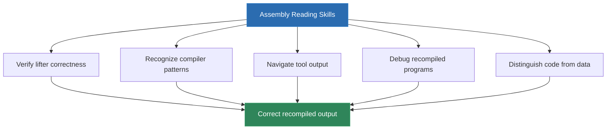
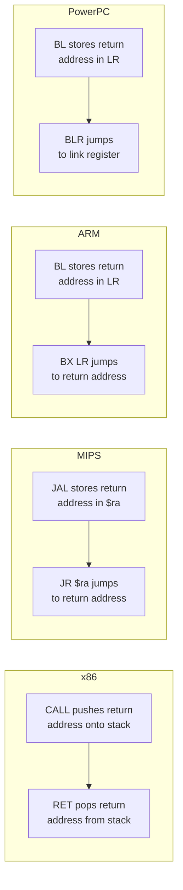
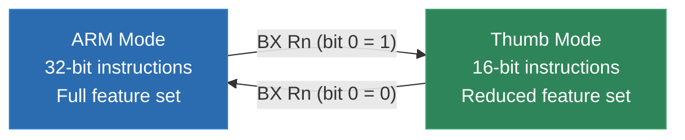
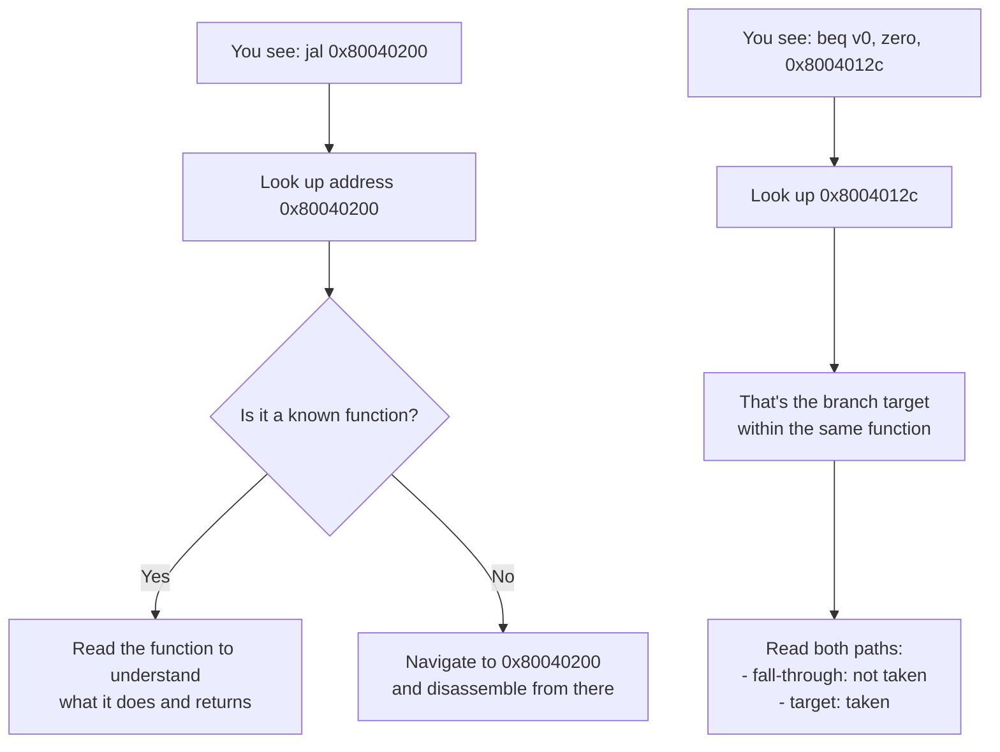

# Module 4: Reading Assembly -- A Crash Course

You do not need to write assembly to build a static recompiler. You need to **read** it. Every day you work on a recompilation project, you will stare at disassembly output -- hundreds or thousands of lines of it -- and your job is to understand what the original compiler generated, what the programmer intended, and how to translate that into equivalent C. This module is your crash course in doing exactly that.

We are not trying to turn you into an assembly programmer. We are trying to make you fluent at reading the output of disassemblers and decompilers across the architectures this course covers. By the end of this module, you should be able to look at a block of disassembly from any of our target platforms, identify the function boundaries, trace the control flow, and describe in plain English what the code does.

If you already read assembly comfortably, skim the architecture-specific sections for the ISAs you know and focus on the ones you do not. If you have never looked at a disassembly listing before, start from the top and work through everything -- the patterns are more consistent across architectures than you might expect.

---

## 1. Why Reading Assembly Matters for Recompilation

Let us be direct about this: you cannot build a correct static recompiler without understanding assembly. The entire job is translating assembly instructions into C, and you cannot translate what you cannot read.

But the skill you need is very specific. You are not writing optimized inner loops in hand-tuned NASM. You are not debugging kernel code through a serial console. You are doing something closer to **reading a foreign language that you never need to speak** -- you need comprehension, not production.

Here is what you will actually do with assembly reading skills in a recompilation project:

### Verifying Lifter Output

When your recompiler translates an instruction and the output program behaves wrong, you need to compare the original assembly against the generated C to find the bug. This happens constantly. You will look at something like:

```asm
; MIPS
addiu   $t0, $t1, -4
```

And check whether your lifter correctly handles the sign extension of the immediate value. If your C output says `ctx->r[T0] = ctx->r[T1] + 0xFFFC;` instead of `ctx->r[T0] = ctx->r[T1] + (int16_t)(-4);`, you have a bug -- and you need to read the assembly to know that.

### Understanding Compiler Idioms

Compilers generate predictable patterns for common constructs: function prologues, switch statements, struct member access, loop counters. Once you recognize these patterns, you can make your recompiler smarter -- generating cleaner C for recognized patterns instead of mechanical instruction-by-instruction translation.

### Reading Ghidra and Capstone Output

Your primary tools (covered in Module 5) present disassembly in specific formats. You need to know what each column means, how addresses map to file offsets, what the operand notation represents, and how to navigate cross-references. This is a practical, tool-specific skill built on top of general assembly literacy.

### Debugging Recompiled Programs

When a recompiled game crashes, you often need to trace backward: which original function was executing, what address was it translated from, what does the original assembly at that address do? Without assembly reading skills, you are debugging blind.

### Identifying Data vs Code

Static analysis tools are not perfect. They sometimes disassemble data as code or miss code regions entirely. Your ability to glance at a listing and say "that is clearly a jump table, not code" or "those bytes look like ASCII strings, not instructions" is essential for getting accurate disassembly coverage.



The good news: assembly is simpler than most people expect. Every instruction does exactly one thing. There are no hidden abstractions, no polymorphism, no garbage collection. It is the most explicit programming language there is -- every operation is spelled out. The challenge is volume, not complexity.

---

## 2. Common Instruction Patterns Across Architectures

Before we dive into specific ISAs, let us establish the universal vocabulary. Every CPU architecture provides the same fundamental categories of operations. The syntax differs, the register names change, the encoding is different -- but the concepts are identical.

### Loads and Stores

Every architecture moves data between registers and memory. This is the most common operation category in any program.

| Concept | x86 | MIPS | ARM | Z80/SM83 | PowerPC |
|---------|-----|------|-----|----------|---------|
| Load word from memory | `mov eax, [ebx]` | `lw $t0, 0($t1)` | `ldr r0, [r1]` | `ld a, [hl]` | `lwz r3, 0(r4)` |
| Store word to memory | `mov [ebx], eax` | `sw $t0, 0($t1)` | `str r0, [r1]` | `ld [hl], a` | `stw r3, 0(r4)` |
| Load byte | `movzx eax, byte [ebx]` | `lbu $t0, 0($t1)` | `ldrb r0, [r1]` | `ld a, [hl]` | `lbz r3, 0(r4)` |
| Load with offset | `mov eax, [ebx+8]` | `lw $t0, 8($t1)` | `ldr r0, [r1, #8]` | N/A | `lwz r3, 8(r4)` |

The key thing to notice: the information is always the same (source/destination register, memory address, offset), but the syntax varies wildly. MIPS puts the offset before the base register in parentheses. ARM uses square brackets with a comma. x86 uses square brackets with a plus sign. PowerPC uses a bare offset before the register in parentheses, like MIPS.

For recompilation, you care about three things in every load/store:
1. **Which register** is the source or destination
2. **What address** is being accessed (base register + offset)
3. **What size** is the access (byte, halfword, word, doubleword)

### Arithmetic

| Concept | x86 | MIPS | ARM | Z80/SM83 | PowerPC |
|---------|-----|------|-----|----------|---------|
| Add registers | `add eax, ebx` | `addu $t0, $t1, $t2` | `add r0, r1, r2` | `add a, b` | `add r3, r4, r5` |
| Add immediate | `add eax, 5` | `addiu $t0, $t1, 5` | `add r0, r1, #5` | `add a, 5` | `addi r3, r4, 5` |
| Subtract | `sub eax, ebx` | `subu $t0, $t1, $t2` | `sub r0, r1, r2` | `sub a, b` | `subf r3, r5, r4` |
| Multiply | `imul eax, ebx` | `mult $t0, $t1` | `mul r0, r1, r2` | N/A | `mullw r3, r4, r5` |

Notice that MIPS `mult` does not take a destination register -- it writes to the special `HI:LO` pair, and you retrieve the result with `mflo`. PowerPC `subf` has "reversed" operand order compared to what you might expect: `subf r3, r5, r4` computes `r4 - r5` and stores in `r3`. These are the kinds of quirks that trip people up, and why per-architecture fluency matters.

### Branches and Jumps

| Concept | x86 | MIPS | ARM | Z80/SM83 | PowerPC |
|---------|-----|------|-----|----------|---------|
| Unconditional jump | `jmp label` | `j label` | `b label` | `jp label` | `b label` |
| Jump if equal/zero | `je label` | `beq $t0, $t1, label` | `beq label` | `jr z, label` | `beq cr0, label` |
| Jump if not equal | `jne label` | `bne $t0, $t1, label` | `bne label` | `jr nz, label` | `bne cr0, label` |
| Function call | `call func` | `jal func` | `bl func` | `call func` | `bl func` |
| Return | `ret` | `jr $ra` | `bx lr` | `ret` | `blr` |

The big conceptual split here is between **flag-based** and **register-based** branching:

- **x86, ARM, Z80/SM83**: A comparison or arithmetic instruction sets flags, and then a separate conditional branch instruction tests those flags.
- **MIPS**: Branch instructions compare two registers directly. There are no condition flags. `beq $t0, $t1, label` means "branch if `$t0` equals `$t1`."
- **PowerPC**: Comparison instructions write to condition register fields, and branch instructions test those fields. It is a hybrid -- more structured than raw flags, but still a two-step process.

For your recompiler, the branch model determines how you handle condition tracking. Flag-based architectures need a flags structure in the context. MIPS needs nothing -- the comparison is inline. PowerPC needs condition register fields.

### Calls and Returns

Function calls work the same way conceptually everywhere: save the return address somewhere, jump to the target. The mechanism differs:



- **x86**: `CALL` pushes the return address onto the stack. `RET` pops it off.
- **MIPS**: `JAL` (jump and link) stores the return address in register `$ra` (register 31). `JR $ra` returns.
- **ARM**: `BL` (branch with link) stores the return address in the link register `LR`. `BX LR` returns.
- **PowerPC**: `BL` stores the return address in the link register `LR`. `BLR` (branch to link register) returns.
- **Z80/SM83**: `CALL` pushes the return address onto the stack. `RET` pops it off. Same as x86.

For recompilation, the call/return mechanism tells you how to detect function boundaries. On MIPS and PowerPC, look for `JAL`/`BL` instructions to find call sites. On x86, look for `CALL`. The return mechanism tells you how to detect function exits.

### Comparisons and Flags

This is where architectures diverge the most, and it matters enormously for recompilation because **every conditional branch depends on how comparisons work**.

**x86 approach**: Almost every ALU instruction updates the flags register (`EFLAGS`). The key flags are:
- `ZF` (zero flag): set if the result is zero
- `SF` (sign flag): set if the result is negative
- `CF` (carry flag): set on unsigned overflow
- `OF` (overflow flag): set on signed overflow

A typical comparison is `CMP EAX, EBX`, which subtracts EBX from EAX without storing the result, but updates all flags. The subsequent `JE` (jump if equal) tests the zero flag.

**MIPS approach**: No flags at all. Comparisons are built into branch instructions (`BEQ`, `BNE`) or produce boolean results in registers (`SLT` sets a register to 1 if less-than, 0 otherwise).

**ARM approach**: Similar to x86 -- a flags register (CPSR) with N, Z, C, V flags. But ARM adds conditional execution: almost any instruction can be conditionally executed based on flags, not just branches.

**PowerPC approach**: Eight condition register fields (CR0-CR7), each with four bits (LT, GT, EQ, SO). Comparison instructions write to a specific CR field. Branch instructions test a specific CR field. This is more structured than x86 but requires tracking multiple condition fields.

**Z80/SM83 approach**: Four flags in the F register: Z (zero), N (subtract), H (half-carry), C (carry). Simpler than x86 but the half-carry flag is unusual -- it tracks carry from bit 3 to bit 4, which is needed for BCD arithmetic.

---

## 3. x86 Assembly Reading

x86 is the most complex ISA you will encounter. It has been extended continuously since 1978, accumulating layers of features. But you do not need to know all of x86 -- you need to read the subset that compilers actually generate for DOS and original Xbox games.

### AT&T vs Intel Syntax

The first thing that will confuse you: there are two completely different syntax conventions for x86 assembly, and tools use them inconsistently.

**Intel syntax** (used by IDA, Ghidra, NASM, and most Windows tools):
```asm
mov     eax, [ebx+8]       ; destination first
add     ecx, 5
cmp     dword ptr [esi], 0
```

**AT&T syntax** (used by GAS, objdump on Linux, GCC inline asm by default):
```asm
movl    8(%ebx), %eax       ; source first, registers prefixed with %
addl    $5, %ecx             ; immediates prefixed with $
cmpl    $0, (%esi)           ; size suffixes: b/w/l/q
```

The differences:

| Feature | Intel | AT&T |
|---------|-------|------|
| Operand order | `dest, src` | `src, dest` |
| Register prefix | none | `%` |
| Immediate prefix | none | `$` |
| Memory dereference | `[reg]` | `(%reg)` |
| Size specification | `byte/word/dword ptr` | suffix `b/w/l/q` |

**For this course, we use Intel syntax.** It is what Ghidra uses, it is what most recompilation projects use, and it is easier to read. If you encounter AT&T syntax in the wild, just remember: flip the operands and strip the prefixes.

### Register Naming

x86 has an unusual register naming scheme that reflects its 8086 heritage:

```
64-bit      32-bit    16-bit    8-bit high    8-bit low
---------------------------------------------------------
RAX         EAX       AX        AH            AL
RBX         EBX       BX        BH            BL
RCX         ECX       CX        CH            CL
RDX         EDX       DX        DH            DL
RSI         ESI       SI        --            SIL (64-bit mode)
RDI         EDI       DI        --            DIL (64-bit mode)
RBP         EBP       BP        --            BPL (64-bit mode)
RSP         ESP       SP        --            SPL (64-bit mode)
R8-R15      R8D-R15D  R8W-R15W  --            R8B-R15B
```

The historical roles (accumulator, base, count, data) matter less in compiler-generated code, but you will still see `ECX` used as a loop counter and `EAX` as the return value because that is what the calling conventions specify.

For DOS recompilation (16-bit real mode), you deal with the 16-bit registers `AX`, `BX`, `CX`, `DX`, `SI`, `DI`, `BP`, `SP` and the segment registers `CS`, `DS`, `ES`, `SS`. For original Xbox recompilation (32-bit protected mode), you deal with `EAX` through `ESP` plus the x87 FPU stack and sometimes SSE registers (`XMM0`-`XMM7`).

### Addressing Modes

x86 has the most complex addressing modes of any architecture in this course. The general form is:

```
[base + index * scale + displacement]
```

Where:
- **base** is any general-purpose register
- **index** is any GPR except ESP
- **scale** is 1, 2, 4, or 8
- **displacement** is a signed immediate value

Examples you will see constantly:

```asm
mov     eax, [ebx]              ; Simple register indirect: *(ebx)
mov     eax, [ebx+4]            ; Register + displacement: *(ebx + 4)
                                 ; This is struct member access: ptr->field
mov     eax, [ebx+ecx*4]        ; Register + index*scale: array[i]
                                 ; ebx = array base, ecx = index, 4 = sizeof(int)
mov     eax, [ebx+ecx*4+16]     ; Full form: struct with array member
                                 ; ptr->array[i] where array starts at offset 16
mov     eax, [0x00401000]       ; Absolute address: global variable
```

When you see `[ebx+ecx*4]`, think "array access with 4-byte elements." When you see `[ebx+12]`, think "struct field at offset 12." These patterns are nearly universal in compiler output.

### Common Instructions

Here are the x86 instructions you will encounter most often in compiler-generated code, grouped by category:

**Data Movement:**
```asm
mov     eax, ebx            ; Register to register copy
mov     eax, [ebx]          ; Load from memory
mov     [ebx], eax          ; Store to memory
mov     eax, 42             ; Load immediate
movzx   eax, byte [ebx]    ; Load byte, zero-extend to 32 bits
movsx   eax, byte [ebx]    ; Load byte, sign-extend to 32 bits
lea     eax, [ebx+ecx*4]   ; Load effective address (compute address, don't dereference)
push    eax                 ; Push register onto stack (ESP -= 4, [ESP] = EAX)
pop     eax                 ; Pop from stack (EAX = [ESP], ESP += 4)
xchg    eax, ebx            ; Swap two registers
```

`LEA` is important: it uses the addressing mode hardware to compute an address but does **not** access memory. Compilers use it as a fast multiply-add: `lea eax, [ebx+ebx*2]` computes `ebx * 3` without touching memory.

**Arithmetic:**
```asm
add     eax, ebx            ; eax = eax + ebx, updates flags
sub     eax, ebx            ; eax = eax - ebx, updates flags
imul    eax, ebx            ; eax = eax * ebx (signed), partial flag update
imul    eax, ebx, 7         ; eax = ebx * 7 (three-operand form)
inc     eax                 ; eax++, updates flags (but NOT carry flag)
dec     eax                 ; eax--, updates flags (but NOT carry flag)
neg     eax                 ; eax = -eax (two's complement)
cdq                         ; Sign-extend EAX into EDX:EAX (for signed division)
idiv    ebx                 ; Signed divide EDX:EAX by EBX; quotient->EAX, remainder->EDX
div     ebx                 ; Unsigned divide EDX:EAX by EBX
```

**Bitwise:**
```asm
and     eax, ebx            ; eax = eax & ebx
or      eax, ebx            ; eax = eax | ebx
xor     eax, ebx            ; eax = eax ^ ebx
xor     eax, eax            ; eax = 0 (common idiom, more efficient than mov eax, 0)
not     eax                 ; eax = ~eax
shl     eax, 3              ; eax = eax << 3 (shift left)
shr     eax, 3              ; eax = eax >> 3 (logical shift right, zero-fill)
sar     eax, 3              ; eax = eax >> 3 (arithmetic shift right, sign-fill)
test    eax, eax            ; Compute eax & eax, set flags, discard result
                             ; Used to test if eax is zero
```

**Comparison and Branching:**
```asm
cmp     eax, ebx            ; Compute eax - ebx, set flags, discard result
test    eax, 0x80           ; Compute eax & 0x80, set flags, discard result
je      label               ; Jump if equal (ZF=1)
jne     label               ; Jump if not equal (ZF=0)
jl      label               ; Jump if less (signed: SF != OF)
jg      label               ; Jump if greater (signed: ZF=0 and SF=OF)
jb      label               ; Jump if below (unsigned: CF=1)
ja      label               ; Jump if above (unsigned: CF=0 and ZF=0)
jmp     label               ; Unconditional jump
call    func                ; Push return address, jump to func
ret                         ; Pop return address, jump to it
```

The signed vs unsigned distinction in branch mnemonics is critical: `JL`/`JG` are signed comparisons (using SF and OF), while `JB`/`JA` are unsigned (using CF). Compilers use the correct form based on whether the C variables were `int` or `unsigned int`. If you see `JB`, the original code was comparing unsigned values.

**String and Block Operations** (less common but you will see them in DOS games):
```asm
rep movsb                   ; Copy ECX bytes from [ESI] to [EDI] (memcpy)
rep stosb                   ; Fill ECX bytes at [EDI] with AL (memset)
repne scasb                 ; Search for AL in [EDI], up to ECX bytes (strchr-like)
```

### x86 Flag Update Rules

This is the single biggest source of recompiler bugs for x86. Different instructions update different subsets of flags:

| Instruction | CF | ZF | SF | OF | PF | AF |
|-------------|----|----|----|----|----|----|
| `ADD/SUB` | Yes | Yes | Yes | Yes | Yes | Yes |
| `INC/DEC` | **No** | Yes | Yes | Yes | Yes | Yes |
| `AND/OR/XOR` | Cleared | Yes | Yes | Cleared | Yes | Undefined |
| `TEST` | Cleared | Yes | Yes | Cleared | Yes | Undefined |
| `CMP` | Yes | Yes | Yes | Yes | Yes | Yes |
| `SHL/SHR` | Yes* | Yes | Yes | Yes* | Yes | Undefined |
| `MUL/IMUL` | Yes | Undefined | Undefined | Yes | Undefined | Undefined |
| `DIV/IDIV` | Undefined | Undefined | Undefined | Undefined | Undefined | Undefined |
| `MOV` | No change | No change | No change | No change | No change | No change |

The "Undefined" entries mean the CPU may set the flag to any value -- your recompiler should not rely on the value. The "`INC`/`DEC` do not affect CF" rule is a classic gotcha: code that does `INC` followed by `JC` is testing the carry from a **previous** instruction, not from the increment.

For your recompiler, you have two strategies:
1. **Lazy flag evaluation**: Only compute flags when a branch or conditional move actually reads them. This avoids computing flags that are never used.
2. **Eager flag evaluation**: Compute all affected flags after every instruction. Simpler to implement but slower.

Most production recompilers use lazy evaluation because the majority of flag computations are overwritten before they are tested.

### x86 Segmented Addressing (DOS)

If you are recompiling DOS games, you will encounter segmented addressing. In 16-bit real mode, every memory access uses a segment register:

```asm
mov     ax, [ds:bx+si]      ; Physical address = DS * 16 + BX + SI
mov     ax, [es:di]          ; Physical address = ES * 16 + DI
mov     ax, [cs:0x1000]      ; Physical address = CS * 16 + 0x1000
```

The physical address is computed as `segment * 16 + offset`, giving a 20-bit (1 MB) address space from 16-bit values. `DS` is the default data segment, `CS` is the code segment, `SS` is the stack segment, and `ES` is the "extra" segment used for string operations.

For recompilation, you can either:
- **Flatten the address space**: Convert all segment:offset pairs into flat 20-bit addresses at recompilation time
- **Maintain segment semantics**: Keep segment registers in your context and compute addresses at runtime

Flattening is simpler and works for most games. You only need segment semantics if the game switches segments dynamically or relies on segment wrapping behavior.

### x87 Floating Point (Brief)

The x87 FPU uses a stack-based model that looks nothing like the integer register file:

```asm
fld     dword [ebp-8]       ; Push float from memory onto FPU stack (ST(0))
fld     dword [ebp-12]      ; Push another float (old ST(0) becomes ST(1))
fmulp   st(1), st(0)        ; ST(1) = ST(1) * ST(0), pop ST(0)
fstp    dword [ebp-16]      ; Pop ST(0) and store to memory
```

The FPU stack has 8 registers (ST(0) through ST(7)), and most operations implicitly work on the top of the stack. `fld` pushes, `fstp` pops. The `p` suffix on arithmetic instructions (like `fmulp`) means "and pop."

For recompilation, you can model the x87 stack as a circular buffer with a top-of-stack pointer, or you can use a simpler approach: track which x87 register maps to which "virtual" float variable and emit direct float operations. The second approach produces cleaner output but requires more analysis.

Xbox games (32-bit x86) sometimes use SSE instead of x87 for floating point:
```asm
movss   xmm0, dword [ebp-8]  ; Load scalar float into XMM0
mulss   xmm0, xmm1           ; Multiply XMM0 by XMM1 (scalar single)
movss   dword [ebp-16], xmm0 ; Store result
```

SSE scalar operations are much easier to recompile than x87 because they use named registers instead of a stack.

---

## 4. MIPS Assembly Reading

MIPS is arguably the cleanest ISA you will work with. It was designed from the ground up as a RISC architecture with a small, regular instruction set. The N64 uses MIPS III (VR4300), and the PS2 uses a MIPS R5900 variant. Both are common recompilation targets -- N64Recomp handles the N64 side, and PS2Recomp by ran-j targets the PS2.

### Register Conventions

MIPS has 32 general-purpose registers. By convention (not hardware enforcement), they are used as follows:

| Register | Name | Purpose |
|----------|------|---------|
| `$0` | `$zero` | Always zero (hardwired) |
| `$1` | `$at` | Assembler temporary (pseudo-instruction expansion) |
| `$2-$3` | `$v0-$v1` | Function return values |
| `$4-$7` | `$a0-$a3` | Function arguments |
| `$8-$15` | `$t0-$t7` | Temporaries (caller-saved) |
| `$16-$23` | `$s0-$s7` | Saved registers (callee-saved) |
| `$24-$25` | `$t8-$t9` | More temporaries |
| `$26-$27` | `$k0-$k1` | Kernel reserved |
| `$28` | `$gp` | Global pointer |
| `$29` | `$sp` | Stack pointer |
| `$30` | `$fp` / `$s8` | Frame pointer / saved register |
| `$31` | `$ra` | Return address |

Plus `HI` and `LO` for multiply/divide results, and 32 floating-point registers (`$f0`-`$f31`).

Disassemblers vary in whether they show numeric (`$8`) or named (`$t0`) registers. Ghidra uses named registers by default. N64Recomp uses named registers. You should be comfortable with both.

### Instruction Formats

Every MIPS instruction is exactly 4 bytes (32 bits). There are three formats:

```
R-type:  [opcode(6)] [rs(5)] [rt(5)] [rd(5)] [shamt(5)] [funct(6)]
I-type:  [opcode(6)] [rs(5)] [rt(5)] [immediate(16)]
J-type:  [opcode(6)] [target(26)]
```

This regularity is why MIPS is so pleasant to disassemble. You never have to guess where the next instruction starts -- it is always exactly 4 bytes ahead. Compare this with x86, where instructions range from 1 to 15 bytes.

### Delay Slots

This is the single most important MIPS concept for recompilation. **The instruction immediately after a branch or jump always executes**, regardless of whether the branch is taken. This is called the **branch delay slot**.

```asm
    beq     $t0, $t1, target    ; Branch if t0 == t1
    addiu   $t2, $t2, 1         ; THIS ALWAYS EXECUTES (delay slot)
    ; ... execution continues here if branch not taken
target:
    ; ... execution continues here if branch taken
    ; In both cases, t2 has been incremented
```

The delay slot exists because of the MIPS pipeline design -- the instruction after the branch has already been fetched and is in the pipeline. Rather than waste that cycle, MIPS executes it.

For your recompiler, this means: **always execute the delay slot instruction before evaluating the branch**. The standard pattern is:

```c
// Recompiled: beq $t0, $t1, target  (with delay slot: addiu $t2, $t2, 1)
ctx->r[T2] = ctx->r[T2] + 1;           // Execute delay slot first
if (ctx->r[T0] == ctx->r[T1]) goto target;  // Then evaluate branch
```

Some delay slots contain `NOP` (encoded as `sll $zero, $zero, 0`). When you see a NOP in a delay slot, it means the compiler could not find a useful instruction to put there. This is common after unconditional jumps.

There is one subtle gotcha: if the delay slot instruction modifies a register that the branch instruction tests, the branch uses the **original** value (before the delay slot executed). This is because the branch condition is evaluated before the delay slot writes back. Your recompiler must handle this:

```asm
    bne     $t0, $zero, target  ; Tests t0's CURRENT value
    addiu   $t0, $t0, 1         ; Modifies t0 in delay slot
```

The branch tests the old value of `$t0`. The new value (incremented) is what arrives at the target or the fall-through. To handle this correctly:

```c
// Save the branch condition BEFORE executing the delay slot
int branch_taken = (ctx->r[T0] != 0);
ctx->r[T0] = ctx->r[T0] + 1;  // delay slot
if (branch_taken) goto target;
```

N64Recomp handles this by evaluating the branch condition first, saving the result, executing the delay slot, then branching based on the saved result.

### Pseudo-Instructions

MIPS assemblers provide pseudo-instructions that expand to one or more real instructions. The disassembler may show either the real instructions or the pseudo-instructions depending on the tool:

| Pseudo-instruction | Expansion | Purpose |
|-------------------|-----------|---------|
| `li $t0, 0x12345678` | `lui $t0, 0x1234` + `ori $t0, $t0, 0x5678` | Load 32-bit immediate |
| `la $t0, label` | `lui $t0, %hi(label)` + `addiu $t0, $t0, %lo(label)` | Load address |
| `move $t0, $t1` | `addu $t0, $zero, $t1` | Register copy |
| `nop` | `sll $zero, $zero, 0` | No operation |
| `b label` | `beq $zero, $zero, label` | Unconditional branch |
| `blt $t0, $t1, label` | `slt $at, $t0, $t1` + `bne $at, $zero, label` | Branch if less than |

The `lui` + `ori`/`addiu` pattern for loading 32-bit constants is everywhere in MIPS code. `LUI` (load upper immediate) loads a 16-bit value into the upper half of a register, zeroing the lower half. Then `ORI` or `ADDIU` fills in the lower 16 bits. When you see this pattern, your recompiler should recognize it as a single constant load.

### Common MIPS Patterns

**Function prologue** (saving callee-saved registers and setting up the stack frame):
```asm
addiu   $sp, $sp, -32       ; Allocate 32 bytes of stack space
sw      $ra, 28($sp)         ; Save return address
sw      $s0, 24($sp)         ; Save callee-saved register s0
sw      $s1, 20($sp)         ; Save callee-saved register s1
```

**Function epilogue** (restoring and returning):
```asm
lw      $ra, 28($sp)         ; Restore return address
lw      $s0, 24($sp)         ; Restore s0
lw      $s1, 20($sp)         ; Restore s1
jr      $ra                  ; Return
addiu   $sp, $sp, 32         ; Deallocate stack (in delay slot!)
```

Notice the `addiu $sp` in the delay slot of `jr $ra` -- the stack is restored as part of the return. This is a standard MIPS compiler optimization.

**Multiply and retrieve result:**
```asm
mult    $a0, $a1             ; Multiply, result goes to HI:LO
mflo    $v0                  ; Move lower 32 bits of result to v0
```

**Address calculation for global variables** (using the global pointer):
```asm
lw      $t0, %got(myvar)($gp)   ; Load address of myvar from GOT
lw      $t1, 0($t0)              ; Load myvar's value
```

Or the more common pattern in N64 games (no GOT, direct addressing):
```asm
lui     $t0, 0x8003              ; Upper half of address
lw      $t1, 0x4560($t0)        ; Load from 0x80034560
```

**Unaligned loads (N64 specific):**
```asm
lwl     $t0, 0($a0)         ; Load word left (big-endian upper bytes)
lwr     $t0, 3($a0)         ; Load word right (big-endian lower bytes)
```

This pair loads a 32-bit word from a potentially unaligned address. `LWL` loads bytes from the specified address down to the word boundary, placing them in the upper bytes of the register. `LWR` loads bytes from the specified address up to the word boundary, placing them in the lower bytes. Together, they assemble a complete word regardless of alignment. These have no direct C equivalent -- you need byte-by-byte loads or memcpy:

```c
// Recompiled: lwl/lwr pair for unaligned load
uint32_t val;
memcpy(&val, &mem[addr], 4);  // Assuming correct endian handling
ctx->r[T0] = val;
```

### MIPS Floating Point

The N64's VR4300 has a 64-bit FPU with 32 registers. In 32-bit mode (the common case for N64 games), even-numbered registers hold single floats and odd-numbered registers are the upper halves of double-precision pairs:

```asm
lwc1    $f4, 0($a0)         ; Load 32-bit float into FPU register f4
lwc1    $f6, 4($a0)         ; Load another float
add.s   $f8, $f4, $f6       ; f8 = f4 + f6 (single precision)
swc1    $f8, 0($v0)         ; Store result
```

The `.s` suffix means single precision, `.d` means double precision. Most N64 games use single precision exclusively.

For double precision:
```asm
ldc1    $f4, 0($a0)         ; Load 64-bit double into f4:f5 pair
ldc1    $f6, 8($a0)         ; Load another double
add.d   $f8, $f4, $f6       ; f8:f9 = f4:f5 + f6:f7
sdc1    $f8, 0($v0)         ; Store result
```

---

## 5. ARM Assembly Reading

ARM is increasingly relevant as both a recompilation target host (Apple Silicon, Raspberry Pi, phones) and as a source architecture (Game Boy Advance uses ARM7TDMI, Nintendo DS uses ARM9/ARM7). Even if this course does not have a dedicated GBA unit, ARM literacy is valuable for understanding recompilation concepts, and you may well want to recompile GBA titles yourself.

### Conditional Execution

ARM's most distinctive feature is that **almost every instruction can be conditionally executed** based on the current flags. Instead of a separate branch instruction, you append a condition code suffix:

```asm
cmp     r0, #0          ; Compare r0 with 0, setting flags
moveq   r1, #1          ; Execute only if equal (Z flag set)
movne   r1, #0          ; Execute only if not equal (Z flag clear)
```

This replaces what would be an `if/else` branch sequence on other architectures:

```asm
; Equivalent x86 (requires a branch):
    cmp     eax, 0
    jne     .else
    mov     ecx, 1
    jmp     .end
.else:
    mov     ecx, 0
.end:
```

The condition codes are:

| Suffix | Meaning | Flags |
|--------|---------|-------|
| `EQ` | Equal | Z=1 |
| `NE` | Not equal | Z=0 |
| `GT` | Greater than (signed) | Z=0, N=V |
| `LT` | Less than (signed) | N!=V |
| `GE` | Greater or equal (signed) | N=V |
| `LE` | Less or equal (signed) | Z=1 or N!=V |
| `HI` | Higher (unsigned) | C=1, Z=0 |
| `LO` / `CC` | Lower / Carry clear (unsigned) | C=0 |
| `HS` / `CS` | Higher or same / Carry set (unsigned) | C=1 |
| `MI` | Minus (negative) | N=1 |
| `PL` | Plus (positive or zero) | N=0 |
| `VS` | Overflow set | V=1 |
| `VC` | Overflow clear | V=0 |
| `AL` | Always (default, usually omitted) | Any |

When you see `ADDGT r3, r4, r5`, it means "add r4 and r5, store in r3, but only if the previous comparison resulted in greater-than." If the condition is false, the instruction is a NOP.

For recompilation, conditional execution maps naturally to C ternary operators or if-statements:

```c
// ARM: moveq r1, #1
if (ctx->cpsr_z) ctx->r[1] = 1;

// ARM: movne r1, #0
if (!ctx->cpsr_z) ctx->r[1] = 0;
```

### The Barrel Shifter

ARM's second distinctive feature is the **barrel shifter** on the second operand. Any data processing instruction can shift or rotate its second operand as part of the instruction, for free:

```asm
add     r0, r1, r2, lsl #3     ; r0 = r1 + (r2 << 3)  -- r2 shifted left by 3
mov     r0, r1, ror #8          ; r0 = rotate_right(r1, 8)
sub     r0, r1, r2, asr r3     ; r0 = r1 - (r2 >> r3)  -- arithmetic shift by r3
rsb     r0, r1, r1, lsl #3     ; r0 = (r1 << 3) - r1 = r1 * 7
```

Shift types:
- `LSL #n` -- logical shift left by n
- `LSR #n` -- logical shift right by n
- `ASR #n` -- arithmetic shift right by n (sign-extending)
- `ROR #n` -- rotate right by n
- `RRX` -- rotate right by 1 through carry (33-bit rotate)

This is how ARM compilers implement multiplications by small constants without a multiply instruction: `add r0, r1, r1, lsl #2` computes `r1 + r1 * 4 = r1 * 5`.

For recompilation:
```c
// ARM: add r0, r1, r2, lsl #3
ctx->r[0] = ctx->r[1] + (ctx->r[2] << 3);

// ARM: rsb r0, r1, r1, lsl #3
ctx->r[0] = (ctx->r[1] << 3) - ctx->r[1];  // r1 * 7
```

### S Suffix (Flag Update)

By default, ARM data processing instructions do **not** update flags. You must add the `S` suffix to request flag updates:

```asm
add     r0, r1, r2          ; r0 = r1 + r2, flags unchanged
adds    r0, r1, r2          ; r0 = r1 + r2, flags updated (N, Z, C, V)
subs    r0, r0, #1          ; r0 = r0 - 1, flags updated
```

This is important for recompilation: you only need to compute flags for instructions that have the `S` suffix. This saves a lot of unnecessary flag computation compared to x86, where nearly everything updates flags.

The combination of conditional execution and the S suffix gives ARM a unique idiom: conditional loops without explicit branch instructions:

```asm
    subs    r0, r0, #1       ; Decrement and set flags
    bne     loop              ; Branch back if not zero
```

### Thumb Mode

ARM has a 16-bit compressed instruction set called **Thumb** (and later Thumb-2 which mixes 16-bit and 32-bit). In Thumb mode, instructions are 16 bits wide, giving better code density at the cost of reduced functionality (fewer registers directly accessible, no conditional execution on most instructions, limited immediate ranges).

The GBA switches between ARM and Thumb mode frequently. The T bit in the CPSR indicates the current mode. A `BX` (branch and exchange) instruction can switch modes based on bit 0 of the target address: if bit 0 is 1, switch to Thumb; if 0, switch to ARM.

For recompilation, you need to track which mode the processor is in and use the correct decoder. Most GBA games use Thumb mode for the majority of their code (because the GBA's 16-bit bus makes Thumb code faster to fetch from ROM) and ARM mode for time-critical routines.



### Common ARM Patterns

**Function prologue:**
```asm
push    {r4-r7, lr}         ; Save callee-saved registers and return address
sub     sp, sp, #16          ; Allocate local variable space
```

**Function epilogue:**
```asm
add     sp, sp, #16          ; Deallocate locals
pop     {r4-r7, pc}          ; Restore registers and return (pop into PC = return)
```

The `pop {pc}` trick is elegant: instead of popping into LR and then doing `BX LR`, you pop directly into the program counter, which both restores the return address and branches to it in one instruction.

**Load a 32-bit constant** (ARM lacks a "load 32-bit immediate" instruction):
```asm
; Method 1: Literal pool (ARM and Thumb)
ldr     r0, =0x12345678      ; Assembler places constant nearby and generates PC-relative load
; Actual encoding:
ldr     r0, [pc, #offset]    ; Load from literal pool

; Method 2: movw/movt (ARMv7+)
movw    r0, #0x5678           ; Load lower 16 bits
movt    r0, #0x1234           ; Load upper 16 bits
```

**Compare and branch pattern:**
```asm
cmp     r0, #10
bgt     .greater_than_10
; ... less than or equal path
b       .end
.greater_than_10:
; ... greater than path
.end:
```

**Block copy (using LDM/STM):**
```asm
; Copy 16 bytes (4 words) from [r0] to [r1]
ldmia   r0!, {r2-r5}        ; Load 4 registers, increment r0
stmia   r1!, {r2-r5}        ; Store 4 registers, increment r1
```

`LDM` (load multiple) and `STM` (store multiple) are the ARM equivalents of x86's `rep movs`. The `IA` suffix means "increment after." Other variants: `IB` (increment before), `DA` (decrement after), `DB` (decrement before). The `!` means writeback -- update the base register after the transfer.

---

## 6. Z80 and SM83 Assembly Reading

The Game Boy's SM83 is a subset of the Z80 with some modifications. Since the Game Boy is one of our primary recompilation targets -- gb-recompiled by arcanite24 demonstrates what is possible here -- and the Z80 family powers a huge range of retro systems (ZX Spectrum, MSX, Sega Master System, Game Gear, TI calculators), this section covers both.

### 8-Bit Register Pairs

The SM83/Z80 has seven 8-bit registers that can also be used as three 16-bit pairs:

```
8-bit:  A  F  B  C  D  E  H  L
16-bit:    AF    BC    DE    HL
Special: SP (stack pointer), PC (program counter)
```

The `HL` pair is the most important -- it functions as the primary pointer register. Most memory access instructions use `HL` as the address: `LD A, [HL]` loads the byte at address HL into A, and `LD [HL], A` stores A to that address.

The `AF` pair is unusual: `A` is the accumulator (where most arithmetic results go) and `F` is the flags register. You can push and pop `AF` to save/restore both the accumulator and flags.

### The Flags Register

The SM83 flags register has four bits:

```
Bit 7: Z (Zero)       - Set when result is zero
Bit 6: N (Subtract)   - Set when last operation was subtraction
Bit 5: H (Half-carry) - Set on carry from bit 3 to bit 4
Bit 4: C (Carry)      - Set on carry from bit 7 (overflow)
Bits 3-0: Always zero
```

The **half-carry flag** is the unusual one. It exists for BCD (binary-coded decimal) arithmetic, specifically the `DAA` (decimal adjust accumulator) instruction. For Game Boy games, H is rarely tested directly in branches, but your recompiler must compute it correctly because `DAA` uses it and some games rely on BCD math (scores, timers displayed in decimal).

Computing the half-carry for addition:
```c
// H flag for ADD A, B
ctx->F_H = ((ctx->A & 0x0F) + (ctx->B & 0x0F)) > 0x0F;
```

Computing the half-carry for subtraction:
```c
// H flag for SUB B  (or CP B)
ctx->F_H = (ctx->A & 0x0F) < (ctx->B & 0x0F);
```

### Common SM83 Instructions

**Data movement:**
```asm
LD A, B              ; A = B (register to register)
LD A, [HL]           ; A = memory[HL] (load from address in HL)
LD [HL], A           ; memory[HL] = A (store to address in HL)
LD A, [0xFF44]       ; A = memory[0xFF44] (load from absolute address, LDH form)
LD A, 0x42           ; A = 0x42 (load immediate byte)
LD HL, 0xC000        ; HL = 0xC000 (load immediate 16-bit)
LD [HL+], A          ; memory[HL] = A, then HL++ (store and increment)
LD A, [HL-]          ; A = memory[HL], then HL-- (load and decrement)
PUSH BC              ; SP -= 2, memory[SP] = BC
POP BC               ; BC = memory[SP], SP += 2
```

The `LDH` instructions (load/store to `0xFF00 + offset`) are used for hardware register access. The Game Boy's I/O registers live at `0xFF00-0xFF7F`. When you see `LDH [0xFF40], A` in disassembly, that is a write to the LCD control register (LCDC).

**Arithmetic:**
```asm
ADD A, B             ; A = A + B, update all flags
ADC A, B             ; A = A + B + carry, update all flags
SUB B                ; A = A - B, update all flags
SBC A, B             ; A = A - B - carry, update all flags
INC A                ; A++, updates Z, N, H (NOT carry)
DEC A                ; A--, updates Z, N, H (NOT carry)
INC HL               ; HL++ (16-bit increment, NO flag updates)
DEC HL               ; HL-- (16-bit decrement, NO flag updates)
ADD HL, BC           ; HL = HL + BC (16-bit add, updates N, H, C only -- NOT Z)
CP 0x00              ; Compare A with 0 (A - 0, update flags, discard result)
AND B                ; A = A & B, Z updated, N=0, H=1, C=0
OR B                 ; A = A | B, Z updated, N=0, H=0, C=0
XOR A                ; A = A ^ A = 0, Z=1, N=0, H=0, C=0 (common zero idiom)
```

The flag update rules have important subtleties. `INC`/`DEC` on 8-bit registers update Z, N, and H but **not** carry. 16-bit `INC`/`DEC` update **no** flags at all. `ADD HL, rr` updates N, H, and C but **not** Z. `AND` always sets H to 1 (a quirk inherited from the 8080). Getting these wrong is one of the most common SM83 recompiler bugs.

**Branching:**
```asm
JP 0x0150            ; Unconditional jump to address 0x0150
JP NZ, 0x0200        ; Jump to 0x0200 if zero flag is NOT set
JP Z, 0x0200         ; Jump to 0x0200 if zero flag IS set
JP C, 0x0200         ; Jump to 0x0200 if carry flag IS set
JP NC, 0x0200        ; Jump to 0x0200 if carry flag is NOT set
JR -5                ; Relative jump (PC + signed offset)
JR NZ, -5            ; Conditional relative jump
CALL 0x1000          ; Push PC, jump to 0x1000
CALL Z, 0x1000       ; Conditional call: call only if Z flag set
RET                  ; Pop PC, return
RET Z                ; Conditional return: return only if Z flag set
JP [HL]              ; Jump to address in HL (indirect jump)
RST 0x38             ; Push PC, jump to fixed address (one of 8 vectors)
```

`JP [HL]` (sometimes written `JP HL` in some assembler syntaxes) is an indirect jump that is the bane of SM83 static recompilation. The target address is computed at runtime from the HL register, so the recompiler cannot know statically where it goes. gb-recompiled by arcanite24 implements a sophisticated static solver for this instruction, analyzing what values HL can hold at each JP HL site. The approach uses trace-guided analysis -- running the game in an emulator, recording what addresses HL takes at each JP HL, and feeding that information back to the recompiler. This gets you 98.9% coverage across the Game Boy library.

The `RST` instructions are single-byte calls to fixed addresses: `0x00`, `0x08`, `0x10`, `0x18`, `0x20`, `0x28`, `0x30`, `0x38`. They are fast calls (one byte smaller and faster than a full `CALL`) used for frequently-called routines.

### CB-Prefix Instructions

The SM83 uses a `0xCB` prefix byte to access a second page of instructions, primarily bit manipulation:

```asm
CB 37    SWAP A       ; Swap upper and lower nybbles of A
CB 07    RLC A        ; Rotate A left through carry
CB 40    BIT 0, B     ; Test bit 0 of B, set Z flag accordingly
CB C0    SET 0, B     ; Set bit 0 of B
CB 80    RES 0, B     ; Reset (clear) bit 0 of B
```

The CB-prefix instructions follow a regular pattern:
- `0xCB 0x00-0x07`: RLC (rotate left circular)
- `0xCB 0x08-0x0F`: RRC (rotate right circular)
- `0xCB 0x10-0x17`: RL (rotate left through carry)
- `0xCB 0x18-0x1F`: RR (rotate right through carry)
- `0xCB 0x20-0x27`: SLA (shift left arithmetic)
- `0xCB 0x28-0x2F`: SRA (shift right arithmetic)
- `0xCB 0x30-0x37`: SWAP (swap nybbles)
- `0xCB 0x38-0x3F`: SRL (shift right logical)
- `0xCB 0x40-0x7F`: BIT (test bit)
- `0xCB 0x80-0xBF`: RES (reset bit)
- `0xCB 0xC0-0xFF`: SET (set bit)

Within each group of 8, the low 3 bits select the register: B, C, D, E, H, L, [HL], A (in that order). So `0xCB 0x42` is `BIT 0, D` and `0xCB 0x46` is `BIT 0, [HL]`.

For your recompiler, the CB-prefix instructions double the opcode space. You need 256 handlers for the main page and 256 for the CB page, totaling 512 possible opcodes. The regularity of the encoding helps -- you can use computed indexing rather than a giant switch statement:

```c
// CB-prefix handler (simplified)
uint8_t cb_opcode = mem_read(ctx->pc++);
uint8_t operation = cb_opcode >> 3;  // Which operation (0-31)
uint8_t reg_idx   = cb_opcode & 7;   // Which register (0-7)
uint8_t *reg = get_register_ptr(ctx, reg_idx);  // B,C,D,E,H,L,[HL],A

switch (operation) {
    case 0: rlc(ctx, reg); break;    // RLC
    case 1: rrc(ctx, reg); break;    // RRC
    // ... etc
    case 8: case 9: case 10: case 11:
    case 12: case 13: case 14: case 15:
        bit(ctx, reg, (operation - 8)); break;  // BIT n
    // ... etc
}
```

### Z80 Differences

The full Z80 (used in ZX Spectrum, MSX, Sega Master System, etc.) has features the SM83 lacks:

- **Alternate register set**: `A'`, `B'`, `C'`, `D'`, `E'`, `H'`, `L'`, `F'` -- swapped in/out with `EX AF, AF'` and `EXX`
- **Index registers**: `IX` and `IY` (16-bit), with displacement addressing: `LD A, (IX+5)`
- **Block transfer**: `LDIR` (copy BC bytes from [HL] to [DE], auto-increment), `LDDR` (same, decrementing)
- **Block search**: `CPIR` (search BC bytes from [HL] for value in A)
- **I/O instructions**: `IN A, (port)`, `OUT (port), A`
- **More prefix pages**: `DD`, `FD` (for IX/IY), `ED` (extended instructions)
- **Interrupt modes**: IM 0, IM 1, IM 2 with different vector table handling

If you are recompiling Z80 systems (not Game Boy), you need to handle these additional features. The alternate register set is particularly tricky -- it doubles your register context. The `EXX` instruction swaps `BC/DE/HL` with `BC'/DE'/HL'` in a single cycle, which means your context struct needs shadow copies of all these registers:

```c
typedef struct {
    uint8_t a, f, b, c, d, e, h, l;
    uint8_t a_alt, f_alt, b_alt, c_alt, d_alt, e_alt, h_alt, l_alt;
    uint16_t ix, iy, sp, pc;
    // ...
} Z80Context;

// EXX instruction
void z80_exx(Z80Context *ctx) {
    SWAP(ctx->b, ctx->b_alt);
    SWAP(ctx->c, ctx->c_alt);
    SWAP(ctx->d, ctx->d_alt);
    SWAP(ctx->e, ctx->e_alt);
    SWAP(ctx->h, ctx->h_alt);
    SWAP(ctx->l, ctx->l_alt);
}
```

---

## 7. PowerPC Assembly Reading

PowerPC is used in the GameCube (Gekko), Wii (Broadway), and Xbox 360 (Xenon). XenonRecomp by Skyth handles Xbox 360 titles, and sp00nznet's gcrecomp targets GameCube. PowerPC is a clean RISC design, but its condition register system takes some getting used to.

### Register Set

```
GPR:    r0 - r31    (32 general-purpose, 32 or 64 bits)
FPR:    f0 - f31    (32 floating-point, 64-bit double precision)
CR:     cr0 - cr7   (8 condition register fields, 4 bits each)
LR:     Link Register (return address)
CTR:    Count Register (loop counter / indirect branch target)
XER:    Fixed-point exception register (SO, OV, CA bits)
```

On the Xbox 360 Xenon, add:
```
VR:     v0 - v127   (128 vector registers, 128-bit, VMX128 extension)
```

### The Condition Register

PowerPC's condition register is unique and takes getting used to. It has 8 fields (CR0-CR7), each containing 4 bits:

```
Each CR field:
  Bit 0: LT (Less Than)
  Bit 1: GT (Greater Than)
  Bit 2: EQ (Equal)
  Bit 3: SO (Summary Overflow, copied from XER.SO)
```

Comparison instructions write to a specific CR field:

```asm
cmpwi   cr0, r3, 0          ; Compare r3 with 0, result in CR0
cmpwi   cr5, r4, 100        ; Compare r4 with 100, result in CR5
cmplwi  cr0, r3, 0          ; Unsigned compare (logical)
```

Branch instructions test a specific CR field:

```asm
beq     cr0, target          ; Branch if CR0.EQ is set
bgt     cr5, target          ; Branch if CR5.GT is set
bne     cr0, target          ; Branch if CR0.EQ is NOT set
blt     cr0, target          ; Branch if CR0.LT is set
```

The condition register also supports **logical operations** on its bits, allowing complex compound conditions without branches:

```asm
cmpwi   cr0, r3, 0          ; Is r3 == 0?
cmpwi   cr1, r4, 10         ; Is r4 == 10?
crand   0, 2, 6             ; CR bit 0 = CR bit 2 AND CR bit 6
                              ; i.e., CR0.LT = CR0.EQ AND CR1.EQ
```

CR bit numbering: CR0.LT is bit 0, CR0.GT is bit 1, CR0.EQ is bit 2, CR0.SO is bit 3, CR1.LT is bit 4, and so on. So `crand 0, 2, 6` combines CR0.EQ (bit 2) with CR1.EQ (bit 6) and stores the AND result in CR0.LT (bit 0). These are uncommon in compiler-generated code but do appear in hand-optimized routines.

For your recompiler, you need to model all 8 CR fields. Each comparison writes LT/GT/EQ/SO to the specified field, and each branch reads from the specified field:

```c
// PPC: cmpwi cr0, r3, 0
int32_t a = (int32_t)ctx->r[3];
int32_t b = 0;
ctx->cr[0].lt = (a < b);
ctx->cr[0].gt = (a > b);
ctx->cr[0].eq = (a == b);
ctx->cr[0].so = ctx->xer_so;

// PPC: beq cr0, target
if (ctx->cr[0].eq) goto target;
```

### The Dot (Rc=1) Suffix

Many PowerPC instructions have a "dot" variant that records the result in CR0:

```asm
add     r3, r4, r5          ; r3 = r4 + r5, no CR update
add.    r3, r4, r5          ; r3 = r4 + r5, also update CR0 based on result
andi.   r3, r4, 0xFF        ; r3 = r4 & 0xFF, update CR0 (andi. always has dot)
```

The dot variant sets CR0 based on comparing the result against zero (as a signed value):
- `CR0.LT` = 1 if result < 0
- `CR0.GT` = 1 if result > 0
- `CR0.EQ` = 1 if result == 0
- `CR0.SO` = copy of `XER.SO`

Note: `andi.` (AND immediate) always has the dot -- there is no non-recording version of this instruction. This is one of those PowerPC quirks you just have to know.

### Link Register and CTR

The link register stores the return address. `BL` (branch and link) saves PC+4 into LR before branching:

```asm
bl      some_function        ; LR = address of next instruction, jump to some_function
; ... function returns here
```

The return is `blr` (branch to link register):

```asm
blr                          ; Jump to address in LR (return)
```

The count register (`CTR`) serves dual purposes:
1. **Loop counting**: `bdnz` (branch decrement not zero) decrements CTR and branches if the result is nonzero.
2. **Indirect calls**: `bctrl` branches to the address in CTR and saves the return address in LR.

```asm
; Loop using CTR:
li      r3, 10               ; Loop 10 times
mtctr   r3                   ; Move r3 to CTR
.loop:
    ; ... loop body ...
    bdnz    .loop            ; CTR--, branch if CTR != 0

; Indirect call using CTR:
lwz     r12, 0(r3)           ; Load function pointer
mtctr   r12                  ; Move to CTR
bctrl                        ; Call function at CTR, save return in LR
```

For recompilation, `bctrl` (indirect call through CTR) is a significant challenge -- it is a function pointer call where the target is computed at runtime. XenonRecomp handles this with a lookup table that maps function addresses to recompiled function pointers. When the recompiled code encounters a `bctrl`, it looks up the CTR value in the table and calls the corresponding recompiled function.

### Common PowerPC Patterns

**Function prologue** (GameCube/Wii style):
```asm
stwu    r1, -48(r1)         ; Allocate stack frame (store r1, update r1)
mflr    r0                   ; Move LR to r0
stw     r0, 52(r1)          ; Save LR on stack (just above frame)
stw     r31, 44(r1)         ; Save callee-saved register
stw     r30, 40(r1)         ; Save another callee-saved register
```

**Function epilogue:**
```asm
lwz     r30, 40(r1)         ; Restore callee-saved register
lwz     r31, 44(r1)         ; Restore callee-saved register
lwz     r0, 52(r1)          ; Load saved LR
mtlr    r0                   ; Restore LR
addi    r1, r1, 48          ; Deallocate stack frame
blr                          ; Return
```

The `stwu` instruction in the prologue is doing two things at once: storing the old stack pointer value at the new stack pointer location (creating a linked list of stack frames) and updating r1 to point to the new frame. This is the PowerPC standard for stack frames.

**Loading a 32-bit immediate:**
```asm
lis     r3, 0x8003           ; Load immediate shifted: r3 = 0x80030000
ori     r3, r3, 0x4560       ; OR in low bits: r3 = 0x80034560
```

Or when the lower half would be sign-extended by `addi`:
```asm
lis     r3, myvar@ha         ; Upper 16 bits (adjusted for sign extension of @l)
addi    r3, r3, myvar@l      ; Lower 16 bits (sign-extended, hence @ha adjustment)
```

The `@ha` (high adjusted) / `@l` (low) relocation pair accounts for sign extension: if the low 16 bits have their MSB set, `addi` will sign-extend them, effectively subtracting 0x10000. `@ha` compensates by adding 1 to the upper half when necessary.

**Switch statement via jump table:**
```asm
cmplwi  cr0, r3, 5           ; Range check: is case < 5?
bge     cr0, .default        ; If >= 5, go to default
slwi    r0, r3, 2            ; r0 = case_index * 4 (table entry size)
lis     r4, jump_table@ha
addi    r4, r4, jump_table@l ; r4 = address of jump table
lwzx    r0, r4, r0           ; Load target address from table[case]
mtctr   r0                   ; Move to CTR
bctr                         ; Branch to CTR (indirect jump)
```

### Paired Singles (GameCube/Wii)

The Gekko and Broadway processors have "paired singles" -- each of the 32 FPR registers can hold two 32-bit floats instead of one 64-bit double. Special instructions operate on both floats in parallel:

```asm
ps_add   f3, f1, f2         ; f3.ps0 = f1.ps0 + f2.ps0
                              ; f3.ps1 = f1.ps1 + f2.ps1
ps_madd  f3, f1, f2, f4     ; f3.ps0 = f1.ps0 * f2.ps0 + f4.ps0
                              ; f3.ps1 = f1.ps1 * f2.ps1 + f4.ps1
ps_merge00 f3, f1, f2       ; f3.ps0 = f1.ps0, f3.ps1 = f2.ps0
ps_merge01 f3, f1, f2       ; f3.ps0 = f1.ps0, f3.ps1 = f2.ps1
```

These are heavily used in GameCube games for geometry processing (transforming vertex coordinates, matrix operations). For recompilation, you can translate them to pairs of scalar float operations:

```c
// ps_add f3, f1, f2
ctx->fpr[3].ps0 = ctx->fpr[1].ps0 + ctx->fpr[2].ps0;
ctx->fpr[3].ps1 = ctx->fpr[1].ps1 + ctx->fpr[2].ps1;
```

Or map them to SIMD intrinsics on the host for better performance.

### VMX128 (Xbox 360)

The Xenon CPU has 128 vector registers (not the standard AltiVec 32). Each is 128 bits and supports integer and floating-point SIMD operations:

```asm
vaddfp    v3, v1, v2        ; 4x float add
vmaddfp   v3, v1, v2, v4    ; 4x float multiply-add: v1*v2 + v4
vperm     v3, v1, v2, v4    ; Byte permutation (shuffle)
vrlimi128 v3, v1, 0xF, 0    ; Custom Xbox 360: rotate left and insert mask
```

The Xbox 360-specific extensions (`vperm128`, `vrlimi128`, and others with the `128` suffix) are custom instructions not found in standard AltiVec/VMX. They were added by IBM specifically for the Xenon chip. XenonRecomp maps these to SSE/AVX intrinsics on x86 hosts, but many operations require multi-instruction sequences because VMX128's permutation capabilities are more flexible than SSE.

The `vperm` instruction is particularly important and particularly hard to translate. It takes a control vector that specifies, for each of the 16 result bytes, which byte to pick from the concatenation of the two source vectors (32 bytes total). SSE's `_mm_shuffle_epi8` (PSHUFB) can only select from a single 16-byte source, so translating `vperm` requires either two PSHUFB operations with a blend, or falling back to a byte-by-byte lookup table.

---

## 8. Reading Disassembly Output

Now that you know how to read individual instructions, let us talk about reading the **output of actual tools**. You will spend most of your time looking at disassembly in three formats: `objdump` output, Ghidra listings, and Capstone/Python output.

### objdump Output

`objdump` is the simplest tool for quick disassembly. Here is typical output for a MIPS binary:

```
00400080 <main>:
  400080:    27bdffd0    addiu   sp,sp,-48
  400084:    afbf002c    sw      ra,44(sp)
  400088:    afb10028    sw      s1,40(sp)
  40008c:    afb00024    sw      s0,36(sp)
  400090:    0c100040    jal     400100 <init_game>
  400094:    00000000    nop
  400098:    3c108004    lui     s0,0x8004
  40009c:    26103000    addiu   s0,s0,12288
  4000a0:    8e020000    lw      v0,0(s0)
  4000a4:    10400005    beq     v0,zero,4000bc <main+0x3c>
  4000a8:    00000000    nop
```

The columns are:
1. **Address** (hex): `400080`, `400084`, etc.
2. **Raw bytes** (hex): `27bdffd0`, `afbf002c`, etc. -- the actual instruction encoding
3. **Mnemonic**: `addiu`, `sw`, `jal`, etc.
4. **Operands**: `sp,sp,-48`, `ra,44(sp)`, etc.
5. **Annotations**: `<main>`, `<init_game>`, `<main+0x3c>` -- symbol names and relative offsets

When `objdump` shows `<main+0x3c>`, it means the branch target is at offset `0x3c` from the start of the `main` function. This helps you navigate within functions.

For x86, the output looks different because instructions are variable-length:

```
08048460 <main>:
 8048460:    55                   push   ebp
 8048461:    89 e5                mov    ebp,esp
 8048463:    83 ec 18             sub    esp,0x18
 8048466:    c7 45 f4 00 00 00 00 mov    DWORD PTR [ebp-0xc],0x0
 804846d:    eb 0a                jmp    8048479 <main+0x19>
```

Notice how instructions occupy different numbers of bytes: `push ebp` is 1 byte (`55`), `mov ebp,esp` is 2 bytes (`89 e5`), and `sub esp,0x18` is 3 bytes (`83 ec 18`). The absolute address in column 1 advances by different amounts per line.

### Ghidra Listing View

Ghidra's disassembly listing is richer than objdump. Here is what a typical Ghidra listing looks like for a MIPS function:

```
                     ******************************************************
                     *                    FUNCTION                         *
                     ******************************************************
                     void __stdcall FUN_80040100(int param_1)
                       assume gp = 0x80070000
        80040100 27 bd ff e0     addiu      sp,sp,-0x20
        80040104 af bf 00 1c     sw         ra,0x1c(sp)
        80040108 af b0 00 18     sw         s0,0x18(sp)
        8004010c 00 80 80 25     or         s0,a0,zero
                             ; s0 = a0 (move)
        80040110 0c 01 00 80     jal        FUN_80040200
        80040114 00 00 00 00     _nop
        80040118 10 40 00 04     beq        v0,zero,LAB_8004012c
        8004011c 00 00 00 00     _nop
```

Key differences from objdump:
- **Function signatures**: Ghidra infers function prototypes like `void __stdcall FUN_80040100(int param_1)`
- **Function names**: Ghidra auto-generates names like `FUN_80040100` based on the entry address
- **Label references**: Branch targets reference labels like `LAB_8004012c` instead of raw addresses
- **Delay slot marking**: Ghidra marks delay slot instructions with an underscore prefix (`_nop`)
- **Inline comments**: Ghidra may add comments explaining the effect of an instruction
- **Cross-references (XREFs)**: Ghidra tracks every reference to and from each address -- you can right-click any address or function name to see where it is called from
- **Register assumptions**: The `assume gp = 0x80070000` note tells you what value Ghidra thinks the global pointer register holds, which affects how global variable references are resolved

Ghidra also provides the **decompiler view** alongside the listing. The decompiler attempts to reconstruct C-like pseudocode:

```c
void FUN_80040100(int param_1) {
    int iVar1;
    iVar1 = FUN_80040200();
    if (iVar1 != 0) {
        FUN_80040300(param_1);
    }
    return;
}
```

This decompiler output is useful for understanding what a function does, but remember: **Ghidra's decompiler is trying to recover high-level structure. Your recompiler is doing mechanical instruction-by-instruction translation. These are different goals.** Do not confuse what the Ghidra decompiler shows you with what your recompiler should produce. Module 5 goes deeper into this distinction.

### Capstone Output (Python)

When you use Capstone programmatically (covered in detail in Module 5), the output is a sequence of instruction objects:

```python
from capstone import *

md = Cs(CS_ARCH_MIPS, CS_MODE_MIPS32 + CS_MODE_BIG_ENDIAN)
code = b'\x27\xbd\xff\xe0\xaf\xbf\x00\x1c'

for insn in md.disasm(code, 0x80040100):
    print(f"0x{insn.address:08x}:  {insn.mnemonic:10s} {insn.op_str}")
```

Output:
```
0x80040100:  addiu      $sp, $sp, -0x20
0x80040104:  sw         $ra, 0x1c($sp)
```

Capstone gives you structured data for each instruction:
- `insn.address`: the address of the instruction
- `insn.mnemonic`: the instruction name (string)
- `insn.op_str`: the operand string (human-readable)
- `insn.bytes`: the raw bytes
- `insn.size`: instruction size in bytes
- `insn.id`: numeric instruction identifier (use this for switch statements in your lifter)
- `insn.operands`: detailed operand breakdown (register numbers, immediate values, memory references)

For recompiler development, you will typically use Capstone as your disassembler engine and process instructions through their structured operand data, not by parsing the text output. Module 5 covers this in full detail.

### Reading Addresses and Cross-References

Regardless of which tool you use, the most important skill is **following addresses**. When you see a branch or call instruction, you need to look up the target address to understand the control flow:



In Ghidra, you can double-click any address reference to navigate to it. The "back" button takes you to where you came from. In a text listing, you scroll or search. This address-following is the fundamental navigation technique for reading disassembly.

Cross-references (XREFs) are equally important. When you are looking at a function and want to know who calls it, XREFs tell you. When you are looking at a global variable and want to know which functions read or write it, XREFs tell you. Ghidra shows XREFs automatically:

```
                     FUN_80040200
                     XREF[3]: FUN_80040100:80040110(c),
                              FUN_80040500:80040524(c),
                              FUN_80040800:80040830(c)
```

This tells you `FUN_80040200` is called from three places (the `(c)` means it is a call reference, not a data reference).

### Distinguishing Code from Data

Not everything in a binary is code. Data regions embedded in code sections are common:

```
; This is code:
 80040100:  lw      v0, 0(a0)
 80040104:  jr      ra
 80040108:  nop

; This is a jump table (data), but a linear sweep disassembler
; would try to decode it as instructions:
 8004010c:  80 04 01 20    ; Entry 0: address 0x80040120
 80040110:  80 04 01 40    ; Entry 1: address 0x80040140
 80040114:  80 04 01 60    ; Entry 2: address 0x80040160
 80040118:  80 04 01 80    ; Entry 3: address 0x80040180
```

Signs that a region is data, not code:
- **Repeating patterns** with 4-byte alignment that look like addresses (values in the 0x80000000 range for N64)
- **ASCII strings**: byte values in the `0x20-0x7E` range with `0x00` terminators
- **All zeros**: padding or uninitialized BSS
- **Instructions that make no sense** in sequence: nonsensical opcodes, wild branch targets, impossible register usage
- **Floating-point constants**: 4 or 8 bytes that decode to meaningful float values (e.g., `0x3F800000` is `1.0f`)
- **After an unconditional jump or return** with no label pointing to the next address

Ghidra is usually good at identifying data vs code through its auto-analysis, but it is not perfect. You will sometimes need to manually mark regions as code (right-click, "Disassemble") or data (right-click, "Clear Code Bytes" then define a data type).

---

## 9. Common Compiler Patterns

Compilers generate recognizable patterns for common language constructs. Recognizing these patterns lets you understand disassembly at a higher level than individual instructions. It also lets your recompiler emit cleaner C output when it detects these patterns.

### Function Prologue and Epilogue

Every function starts with a prologue that sets up the stack frame and ends with an epilogue that tears it down. The shape depends on the architecture and calling convention, but the concept is universal.

**x86 (cdecl, frame pointer):**
```asm
; Prologue
push    ebp                  ; Save old frame pointer
mov     ebp, esp             ; Set new frame pointer
sub     esp, 16              ; Allocate 16 bytes for local variables

; ... function body ...

; Epilogue
mov     esp, ebp             ; Restore stack pointer (or: leave)
pop     ebp                  ; Restore old frame pointer
ret                          ; Return
```

With this pattern, local variables are at negative offsets from EBP (`[ebp-4]`, `[ebp-8]`, etc.) and function parameters are at positive offsets (`[ebp+8]` is the first parameter, `[ebp+12]` is the second, etc. -- `[ebp+4]` is the return address pushed by CALL).

```
Stack layout (x86 cdecl with frame pointer):

High addresses
+------------------+
| Argument 2       |  [ebp+12]
+------------------+
| Argument 1       |  [ebp+8]
+------------------+
| Return address   |  [ebp+4]  (pushed by CALL)
+------------------+
| Saved EBP        |  [ebp+0]  (pushed by prologue)
+------------------+  <-- EBP points here
| Local var 1      |  [ebp-4]
+------------------+
| Local var 2      |  [ebp-8]
+------------------+  <-- ESP points here
Low addresses
```

**x86 (frame pointer omitted, -fomit-frame-pointer):**
```asm
; Prologue
sub     esp, 16              ; Just allocate locals, no frame pointer

; ... function body references locals via [esp+N] ...

; Epilogue
add     esp, 16              ; Deallocate locals
ret
```

Many compilers omit the frame pointer in optimized builds. This makes the code slightly faster (one more register available) but harder to read because all local variable references are relative to ESP, which changes throughout the function as values are pushed and popped.

### If/Else Statements

A C `if/else` compiles to a comparison followed by a conditional branch:

```c
// C source:
if (x > 10) {
    do_something();
} else {
    do_other();
}
```

**x86:**
```asm
    cmp     eax, 10              ; Compare x with 10
    jle     .else_branch         ; Jump to else if x <= 10 (inverse condition!)
    call    do_something
    jmp     .end_if
.else_branch:
    call    do_other
.end_if:
```

Notice: the compiler **inverts** the condition. The C code says `if (x > 10)`, but the assembly says `jle .else` (jump if less-or-equal). This is because the compiler branches over the "then" block to the "else" block. When reading disassembly, mentally invert the branch condition to recover the original `if` condition.

**MIPS:**
```asm
    slti    $t0, $a0, 11         ; t0 = (x < 11) ? 1 : 0  (note: < 11 is same as <= 10)
    bne     $t0, $zero, else     ; Branch to else if x <= 10
    nop                          ; (delay slot)
    jal     do_something
    nop
    j       end_if
    nop
else:
    jal     do_other
    nop
end_if:
```

**PowerPC:**
```asm
    cmpwi   cr0, r3, 10         ; Compare x with 10
    ble     cr0, .else_branch   ; Branch if less-or-equal
    bl      do_something
    b       .end_if
.else_branch:
    bl      do_other
.end_if:
```

### Switch Statements

Switch statements often compile to **jump tables** -- arrays of target addresses indexed by the switch value:

**x86:**
```asm
    cmp     eax, 4               ; Check if case value > max (4)
    ja      .default             ; Unsigned above = out of range
    jmp     dword [.jump_table + eax*4]  ; Index into jump table

.jump_table:
    dd      .case_0
    dd      .case_1
    dd      .case_2
    dd      .case_3
    dd      .case_4

.case_0:
    ; ... case 0 code ...
    jmp     .end_switch
.case_1:
    ; ...
```

The pattern is: range check, then indirect jump through a table. The range check (`cmp` + `ja`) prevents out-of-bounds access into the table. The `ja` (jump if above, unsigned) handles both negative and too-large values (negative values look like very large unsigned values).

Jump tables are a major challenge for recompilation because the indirect jump target is computed at runtime. Your recompiler needs to:
1. Detect the jump table pattern (range check + indexed load + indirect jump)
2. Find the table in the data section
3. Extract all target addresses from the table
4. Emit a C `switch` statement or equivalent

**MIPS jump table:**
```asm
    sltiu   $t0, $a0, 5          ; Check if case < 5 (number of cases)
    beq     $t0, $zero, default  ; Branch to default if out of range
    sll     $t0, $a0, 2          ; delay slot: t0 = case * 4
    lui     $t1, %hi(jump_table)
    addiu   $t1, $t1, %lo(jump_table)
    addu    $t0, $t1, $t0        ; t0 = &jump_table[case]
    lw      $t0, 0($t0)          ; Load target address
    jr      $t0                  ; Jump to target
    nop
```

N64Recomp has specific logic for detecting and handling MIPS jump tables. When it finds the `sltiu` + `sll` + `lw` + `jr` pattern, it reads the jump table entries and generates a C switch statement with explicit cases for each target.

### Loop Idioms

**For loop (x86):**
```asm
    mov     ecx, 0               ; i = 0
.loop_start:
    cmp     ecx, 10              ; i < 10?
    jge     .loop_end            ; Exit if i >= 10
    ; ... loop body ...
    inc     ecx                  ; i++
    jmp     .loop_start
.loop_end:
```

**Optimized do-while form (x86):**
```asm
    ; Compiler transforms: for(i=0; i<10; i++) into guarded do-while
    cmp     ecx, 10              ; Guard: skip loop entirely if already >= 10
    jge     .loop_end
.loop_start:
    ; ... loop body ...
    inc     ecx
    cmp     ecx, 10
    jl      .loop_start          ; Single backward branch per iteration
.loop_end:
```

**MIPS counted loop:**
```asm
    li      $t0, 0               ; i = 0
    li      $t1, 10              ; limit = 10
loop:
    ; ... loop body ...
    addiu   $t0, $t0, 1          ; i++
    bne     $t0, $t1, loop       ; Loop if i != limit
    nop
```

**PowerPC counted loop (using CTR):**
```asm
    li      r3, 10
    mtctr   r3                   ; CTR = 10
loop:
    ; ... loop body ...
    bdnz    loop                 ; CTR--, branch if CTR != 0
```

**SM83 counted loop:**
```asm
    LD      B, 10                ; Counter = 10
.loop:
    ; ... loop body ...
    DEC     B                    ; B--
    JR      NZ, .loop            ; Loop if B != 0
```

The universal pattern: a counter register, a loop body, a decrement, and a conditional backward branch. Recognizing this pattern lets your recompiler emit clean `for` or `while` loops instead of `goto`-based spaghetti.

### Struct Access

When a pointer to a struct is in a register, struct member access appears as register + offset:

```c
// C:
struct Player {
    int x;        // offset 0
    int y;        // offset 4
    int health;   // offset 8
    int score;    // offset 12
    char name[16]; // offset 16
};
player->health = 100;
int s = player->score;
```

**x86:**
```asm
mov     dword [eax+8], 100      ; eax points to struct, offset 8 = health
mov     ecx, [eax+12]           ; load score (offset 12) into ecx
```

**MIPS:**
```asm
li      $t0, 100
sw      $t0, 8($a0)             ; a0 points to struct, offset 8 = health
lw      $t1, 12($a0)            ; load score (offset 12) into t1
```

**PowerPC:**
```asm
li      r5, 100
stw     r5, 8(r3)               ; r3 points to struct, offset 8 = health
lwz     r6, 12(r3)              ; load score (offset 12)
```

When you see multiple loads/stores with the same base register but different offsets, you are almost certainly looking at struct access. The offsets tell you the struct layout. This is invaluable for reverse engineering -- you can reconstruct struct definitions by observing what offsets are accessed and what sizes the loads/stores use.

### Array Access

Array access combines a base address with an index multiplied by the element size:

```c
// C: int arr[100];  val = arr[i];
```

**x86:**
```asm
mov     eax, [ebx + ecx*4]      ; ebx = array base, ecx = index, 4 = sizeof(int)
```

**MIPS:**
```asm
sll     $t0, $a1, 2             ; t0 = index * 4 (shift left 2 = multiply by 4)
addu    $t0, $a0, $t0           ; t0 = base + index * 4
lw      $t1, 0($t0)             ; load arr[index]
```

**PowerPC:**
```asm
slwi    r0, r4, 2               ; r0 = index * 4
lwzx    r5, r3, r0              ; load from r3 + r0 (indexed load)
```

On x86, the scale factor in the addressing mode (`*4`) directly tells you the element size: `*1` = byte array, `*2` = short/int16 array, `*4` = int/float/pointer array, `*8` = double/int64/pointer (64-bit) array.

On RISC architectures, the shift amount before the add gives you the element size: `sll 1` = 2-byte elements, `sll 2` = 4-byte elements, `sll 3` = 8-byte elements.

### Function Calls with Arguments

**x86 (cdecl) -- arguments on the stack, right-to-left:**
```asm
push    20                       ; Push third argument
push    10                       ; Push second argument
push    eax                      ; Push first argument
call    some_function
add     esp, 12                  ; Caller cleans up 3 arguments (3 * 4 bytes)
```

**MIPS (o32) -- arguments in registers:**
```asm
move    $a0, $s0                 ; First argument
li      $a1, 10                  ; Second argument
jal     some_function
li      $a2, 20                  ; Third argument (in delay slot!)
```

Notice the MIPS compiler putting the third argument setup in the delay slot of the `jal`. This is a standard optimization -- the delay slot instruction executes before the function is entered, so the arguments are all ready.

**PowerPC -- arguments in registers:**
```asm
mr      r3, r30                  ; First argument (mr = move register)
li      r4, 10                   ; Second argument
li      r5, 20                   ; Third argument
bl      some_function
; Return value is in r3
```

---

## 10. Practical Exercises: What Does This Function Do?

Let us put everything together. Here are disassembly listings from various architectures. For each one, try to determine what the function does before reading the explanation.

### Exercise 1: SM83 (Game Boy)

```asm
; Function at 0x0200
    LD   HL, 0xC000         ; HL = 0xC000
    LD   B, 0x00            ; B = 0
    XOR  A                  ; A = 0 (XOR A with itself)
.loop:
    LD   [HL+], A           ; Store A at [HL], then HL++
    DEC  B                  ; B--
    JR   NZ, .loop          ; Loop if B != 0
    RET                     ; Return
```

**Analysis**: This function clears 256 bytes of memory starting at address `0xC000`. Here is how you read it:
- `LD HL, 0xC000` sets the pointer to the start of Game Boy work RAM
- `LD B, 0x00` sets the counter to 0 -- but since `DEC B` will wrap from 0 to 255 on the first iteration, and then count down from 255 to 0, this actually means "loop 256 times"
- `XOR A` is the standard idiom for zeroing the A register (also clears all flags and sets Z)
- The loop stores zero (`A`) at each address and increments `HL`
- `DEC B` decrements the counter and sets the zero flag when it reaches 0
- `JR NZ, .loop` loops back while B is nonzero

The equivalent C:
```c
void clear_wram_block(void) {
    uint8_t *ptr = (uint8_t *)0xC000;
    for (int i = 0; i < 256; i++) {
        *ptr++ = 0;
    }
}
```

### Exercise 2: MIPS (N64)

```asm
; Function at 0x80040200
    addiu   sp, sp, -24
    sw      ra, 20(sp)
    sw      s0, 16(sp)
    move    s0, a0           ; s0 = first argument (destination)
    move    a0, a1           ; a0 = second argument (source), pass as arg to next call
    jal     0x80040400       ; Call strlen-like function
    nop
    move    a2, v0           ; a2 = return value (length) -- third arg for memcpy
    move    a0, s0           ; a0 = destination (first arg for memcpy)
    move    a1, a1           ; a1 = source (was already in a1, but may have been
                              ;       re-set from a saved copy -- compiler artifact)
    jal     0x80041000       ; Call memcpy-like function
    nop
    move    v0, s0           ; Return the destination pointer
    lw      ra, 20(sp)
    lw      s0, 16(sp)
    jr      ra
    addiu   sp, sp, 24
```

**Analysis**: This function takes two arguments: a destination pointer (`a0`) and a source pointer (`a1`). It first calls a function that computes the length of the source string, then calls a copy function with (destination, source, length). It returns the destination pointer. This is essentially `strcpy` -- compute the length of the source, then copy that many bytes, then return the destination.

Note how `s0` is used to preserve the first argument across the function call (since `a0` would be clobbered by the call to the strlen function). This is the standard MIPS pattern: save values in callee-saved registers (`s0`-`s7`) when they need to survive across calls.

### Exercise 3: x86

```asm
; Function at 0x00401000
    push    ebp
    mov     ebp, esp
    mov     eax, [ebp+8]        ; First argument
    mov     ecx, [ebp+12]       ; Second argument
    xor     edx, edx            ; edx = 0 (running sum)
.loop:
    test    ecx, ecx
    jz      .done
    movzx   esi, byte [eax]     ; Load byte from *eax (zero-extended)
    add     edx, esi             ; Add to running sum
    inc     eax                  ; Advance pointer
    dec     ecx                  ; Decrement count
    jmp     .loop
.done:
    mov     eax, edx             ; Return value = sum
    pop     ebp
    ret
```

**Analysis**: This function takes a pointer and a count, and returns the sum of all bytes in the buffer. It is a simple checksum function:

```c
uint32_t checksum(uint8_t *data, int count) {
    uint32_t sum = 0;
    while (count > 0) {
        sum += *data++;
        count--;
    }
    return sum;
}
```

Key observations:
- `[ebp+8]` is the first argument (pointer), `[ebp+12]` is the second (count)
- `xor edx, edx` is the "zero a register" idiom
- `movzx` loads a byte and zero-extends to 32 bits (so we are summing unsigned bytes)
- The result goes in `eax` per cdecl convention
- `test ecx, ecx` followed by `jz` is the standard "is this register zero?" pattern

### Exercise 4: PowerPC (GameCube/Xbox 360)

```asm
; Function at 0x80003000
    stwu    r1, -32(r1)
    mflr    r0
    stw     r0, 36(r1)
    stw     r31, 28(r1)
    cmpwi   cr0, r3, 1          ; Compare argument with 1
    ble     cr0, .base_case     ; If r3 <= 1, go to base case
    mr      r31, r3              ; Save argument in callee-saved register
    addi    r3, r3, -1           ; r3 = r3 - 1
    bl      0x80003000           ; Recursive call! (calls itself)
    mullw   r3, r31, r3          ; r3 = saved_arg * recursive_result
    b       .done
.base_case:
    li      r3, 1                ; Return 1
.done:
    lwz     r31, 28(r1)
    lwz     r0, 36(r1)
    mtlr    r0
    addi    r1, r1, 32
    blr
```

**Analysis**: This is a recursive factorial function. It compares the argument with 1 -- if it is 1 or less, it returns 1 (the base case). Otherwise, it saves `n` in `r31`, calls itself with `n-1`, then multiplies the result by the saved `n`:

```c
int factorial(int n) {
    if (n <= 1) return 1;
    return n * factorial(n - 1);
}
```

The recursive call at `bl 0x80003000` targets the function's own address. The `mullw` (multiply low word) instruction multiplies the saved original argument (`r31`) by the recursive result (`r3`). Note how `r31` (a callee-saved register) preserves `n` across the recursive call.

### Exercise 5: ARM

```asm
; Function at 0x08001000
    push    {r4-r6, lr}
    mov     r4, r0               ; r4 = array pointer
    mov     r5, r1               ; r5 = count
    mov     r6, #0               ; r6 = max value so far
.loop:
    cmp     r5, #0
    beq     .done
    ldr     r0, [r4], #4         ; Load word, post-increment r4 by 4
    cmp     r0, r6
    movgt   r6, r0               ; If r0 > r6, update max (conditional move!)
    sub     r5, r5, #1           ; count--
    b       .loop
.done:
    mov     r0, r6               ; Return max value
    pop     {r4-r6, pc}          ; Restore and return
```

**Analysis**: This finds the maximum value in an array of signed integers:

```c
int find_max(int *array, int count) {
    int max = 0;
    while (count > 0) {
        if (*array > max) max = *array;
        array++;
        count--;
    }
    return max;
}
```

Key ARM features visible here:
- `ldr r0, [r4], #4` is a **post-indexed** load: load from `[r4]`, then add 4 to `r4`. This combines the load and pointer advance into one instruction.
- `movgt r6, r0` is **conditional execution**: only update the max if the `cmp` set flags indicating greater-than. No branch needed.
- `pop {r4-r6, pc}` restores registers and returns in one instruction by popping the saved LR directly into PC.

### Exercise 6: SM83 -- Harder

```asm
; Function at 0x1A00
    LD      A, [HL]          ; Load current byte
    CP      0x20             ; Compare with 0x20 (space character)
    JR      C, .not_alpha    ; If A < 0x20, not alphabetic
    CP      0x41             ; Compare with 'A'
    JR      C, .not_alpha    ; If A < 'A', not alphabetic
    CP      0x5B             ; Compare with 'Z' + 1
    JR      C, .is_upper     ; If A < 0x5B, it's uppercase A-Z
    CP      0x61             ; Compare with 'a'
    JR      C, .not_alpha    ; If A < 'a', not alphabetic
    CP      0x7B             ; Compare with 'z' + 1
    JR      NC, .not_alpha   ; If A >= 0x7B, not alphabetic
    ; Fall through: it's lowercase a-z
    SUB     0x20             ; Convert to uppercase (subtract 0x20)
.is_upper:
    LD      [HL], A          ; Store (possibly converted) character back
.not_alpha:
    INC     HL               ; Advance pointer
    RET
```

**Analysis**: This function reads one character from the address in HL and converts it to uppercase if it is a lowercase letter. It is a single-character `toupper()` with pointer advancement:

```c
void toupper_and_advance(char **ptr) {
    char c = **ptr;
    if (c >= 'a' && c <= 'z') {
        c -= 0x20;  // Convert to uppercase
    }
    if ((c >= 'A' && c <= 'Z') || (c >= 'a' && c <= 'z')) {
        **ptr = c;  // Only write back if alphabetic
    }
    (*ptr)++;
}
```

The key to reading this is following the `CP` + `JR C`/`JR NC` chains -- they implement a series of range checks using unsigned comparison. `CP 0x41` + `JR C` means "if A < 0x41, jump" because `CP` performs subtraction and sets the carry flag on borrow (unsigned less-than). This is the standard SM83 idiom for range checking.

---

## Summary

You now have a working reading knowledge of assembly across six architectures. The key points:

**Universal concepts across all ISAs:**
- Load/store for memory access
- Arithmetic and logic operations
- Conditional and unconditional branches
- Function call and return mechanisms
- Compiler-generated patterns for common constructs (prologues, if/else, loops, switches, struct access)

**Per-architecture essentials:**
- **x86**: Variable-length instructions, complex flags, two syntax conventions. Watch for `LEA` as arithmetic, `XOR reg, reg` as zero, flag update subtleties with `INC`/`DEC`, and frame pointer conventions.
- **MIPS**: Clean and regular, fixed 4-byte instructions. Watch for delay slots (the instruction after a branch always executes), `lui`+`ori` for 32-bit constants, and `HI:LO` for multiply/divide.
- **ARM**: Conditional execution on nearly every instruction, barrel shifter on the second operand. Watch for `S` suffix for flag updates, post-indexed addressing, and ARM/Thumb mode switching.
- **Z80/SM83**: 8-bit register pairs, half-carry flag, CB-prefix for bit operations. Watch for `JP [HL]` as the main recompilation headache and the flag update differences between 8-bit and 16-bit operations.
- **PowerPC**: Condition register fields (CR0-CR7), link register, CTR for loops and indirect calls. Watch for `stwu` prologues, `lis`+`ori` for constants, and the dot suffix for flag-updating variants.

**Practical skills you should now have:**
- Read `objdump`, Ghidra, and Capstone output fluently
- Recognize function prologues/epilogues on any architecture
- Identify if/else, loops, switch tables, struct access, and array indexing patterns
- Distinguish code from data in a listing
- Follow addresses and cross-references to trace control flow
- Mentally invert branch conditions to recover original `if` logic

The next module puts these reading skills to work with real tools: Ghidra for interactive analysis and Capstone for programmatic disassembly.

---

**Next: [Module 5 -- Tooling Deep Dive: Ghidra and Capstone](../module-05-tooling-ghidra-capstone/lecture.md)**
