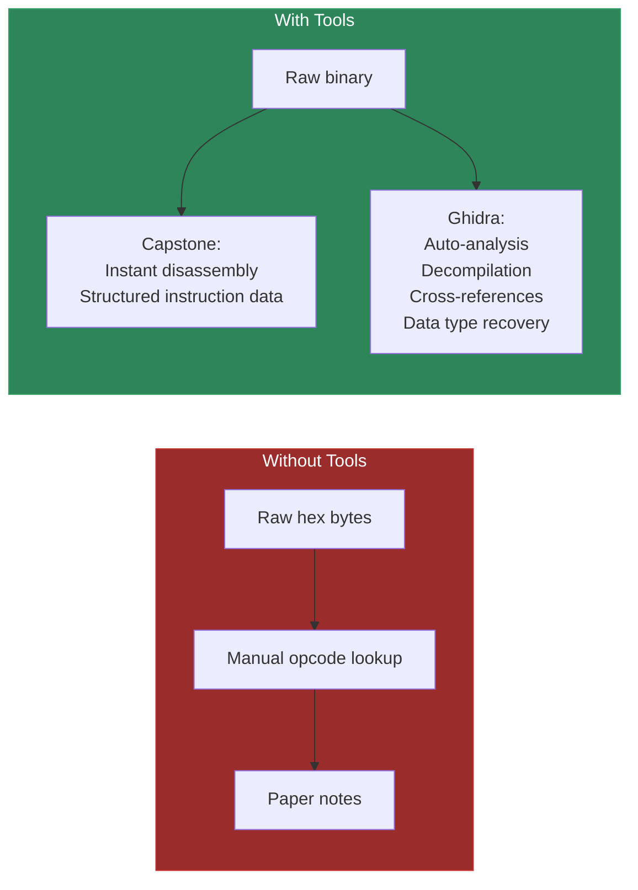
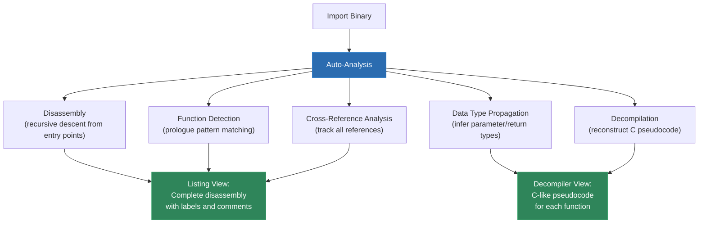
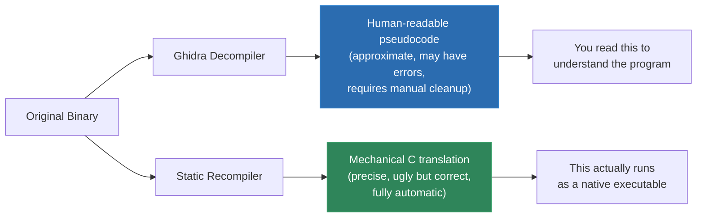
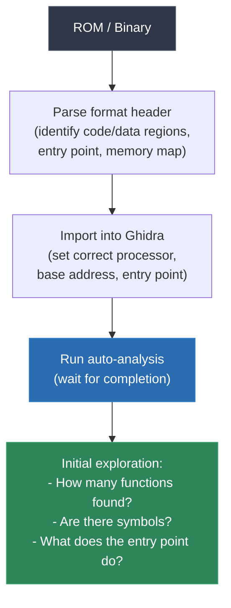
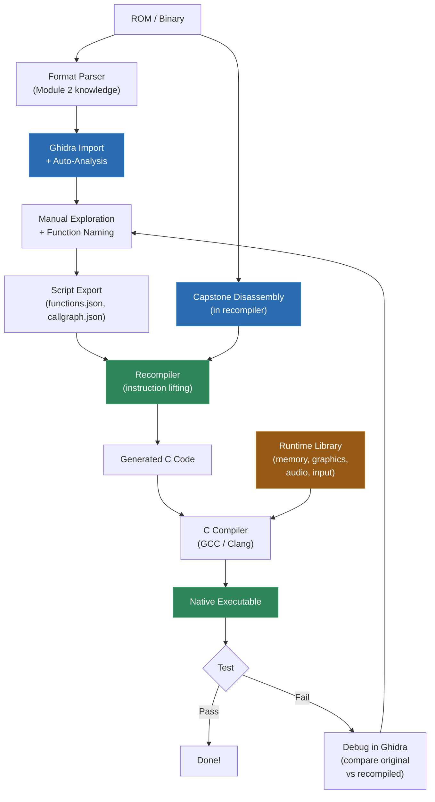

# Module 5: Tooling Deep Dive -- Ghidra and Capstone

Your recompiler does not exist in a vacuum. Before you write a single line of lifting code, you need to **see into the binary** -- understand its structure, identify functions, trace data flows, and extract the raw instruction stream for processing. The tools you use for this are the foundation everything else rests on.

This module covers the two tools you will use most heavily: **Capstone** (a multi-architecture disassembly framework you embed directly in your recompiler) and **Ghidra** (an interactive reverse engineering suite you use for analysis, exploration, and verification). We will also touch on the broader tooling ecosystem and build a complete recompilation-oriented analysis workflow.

By the end of this module, you will be able to:
- Write a multi-architecture disassembler with Capstone in under 100 lines of Python
- Navigate Ghidra's interface confidently and use its decompiler output to understand functions
- Script Ghidra to automate bulk function extraction
- Run Ghidra in headless mode for batch processing in a recompilation pipeline
- Know when to use which tool and why

---

## 1. Why Tooling Matters

Let us start with a scenario. You have a Game Boy ROM -- 1 megabyte of raw binary data. Somewhere in those bytes are the game's functions, its data tables, its sprite graphics, its music data. Your job is to find the code, understand it, and translate it to C.

Without tools, you are staring at a hex dump:

```
00000000: 00 c3 50 01 ce ed 66 66 cc 0d 00 0b 03 73 00 83
00000010: 00 0c 00 0d 00 08 11 1f 88 89 00 0e dc cc 6e e6
00000020: dd dd d9 99 bb bb 67 63 6e 0e ec cc dd dc 99 9f
...
```

You could decode this by hand using opcode tables. People used to do exactly that in the 1980s, with pencil and paper. But we have better options now.

Tools give you:



The difference between a recompilation project that takes weeks and one that takes months is often the quality of your tooling setup. Invest time here -- it pays back tenfold.

---

## 2. Capstone Deep Dive

### What Capstone Is

[Capstone](https://www.capstone-engine.org/) is a lightweight, multi-architecture disassembly framework. It takes raw bytes and an architecture specification, and produces structured instruction data. It is **not** a full reverse engineering suite like Ghidra -- it does not do control flow analysis, it does not track cross-references, it does not decompile. It does exactly one thing: turn bytes into instructions. And it does that one thing extremely well.

Capstone supports the architectures we care about:
- x86 (16-bit, 32-bit, 64-bit)
- MIPS (32-bit, 64-bit, big/little endian)
- ARM (32-bit, Thumb, ARM64/AArch64)
- PowerPC (32-bit, 64-bit, big endian)
- M68K (used in Genesis/Mega Drive -- not in our course but available)

It does **not** support Z80/SM83 or 65816 natively. For those architectures, you will write your own decoder (which is straightforward for simple ISAs) or use architecture-specific tools. But for MIPS, PowerPC, ARM, and x86, Capstone is the standard choice and what most recompilation projects use as their disassembly engine.

### Why Capstone for Recompilation

You might wonder: if Ghidra can disassemble binaries, why do you need Capstone? The answer is that Capstone is a **library** you embed in your recompiler, while Ghidra is an **application** you use interactively.

Your recompiler needs to process every instruction in the binary programmatically -- decode it, examine its operands, determine its semantics, and emit C code. Capstone gives you a clean API for this:

```python
# This is the core loop of a simple recompiler's front end
from capstone import *
from capstone.mips import *

md = Cs(CS_ARCH_MIPS, CS_MODE_MIPS32 + CS_MODE_BIG_ENDIAN)
md.detail = True  # Enable detailed operand information

for insn in md.disasm(code_bytes, start_address):
    if insn.id == MIPS_INS_ADDIU:
        # Handle ADDIU instruction
        rd = insn.operands[0].reg
        rs = insn.operands[1].reg
        imm = insn.operands[2].imm
        emit_c(f"ctx->r[{rd}] = ctx->r[{rs}] + {imm};")
    elif insn.id == MIPS_INS_LW:
        # Handle LW instruction
        # ...
```

You cannot do this with Ghidra's GUI. You *can* do it with Ghidra scripting (and we will cover that), but Capstone is faster, lighter, and easier to integrate into a build pipeline.

### Architecture and Mode Configuration

Capstone is configured with an **architecture** and a **mode**:

```python
from capstone import *

# x86 32-bit (DOS/Xbox)
md_x86_32 = Cs(CS_ARCH_X86, CS_MODE_32)

# x86 16-bit (DOS real mode)
md_x86_16 = Cs(CS_ARCH_X86, CS_MODE_16)

# MIPS 32-bit big-endian (N64)
md_mips = Cs(CS_ARCH_MIPS, CS_MODE_MIPS32 + CS_MODE_BIG_ENDIAN)

# MIPS 32-bit little-endian (PS2 -- note: R5900 has custom instructions
# that Capstone may not fully support)
md_mips_le = Cs(CS_ARCH_MIPS, CS_MODE_MIPS32 + CS_MODE_LITTLE_ENDIAN)

# ARM 32-bit (GBA)
md_arm = Cs(CS_ARCH_ARM, CS_MODE_ARM)

# ARM Thumb mode (GBA -- most code runs in Thumb)
md_thumb = Cs(CS_ARCH_ARM, CS_MODE_THUMB)

# PowerPC 32-bit big-endian (GameCube/Wii)
md_ppc32 = Cs(CS_ARCH_PPC, CS_MODE_32 + CS_MODE_BIG_ENDIAN)

# PowerPC 64-bit big-endian (Xbox 360 -- Xenon runs in 32-bit mode
# but some tools analyze it as 64-bit PPC)
md_ppc64 = Cs(CS_ARCH_PPC, CS_MODE_64 + CS_MODE_BIG_ENDIAN)
```

Common mistake: forgetting to set the endianness. MIPS and PowerPC are big-endian on our target consoles (N64, GameCube, Xbox 360). If you decode big-endian bytes in little-endian mode, you will get garbage output. The disassembler will not crash -- it will happily decode the byte-swapped values into nonsensical instructions.

### The C API

Capstone has bindings for many languages, but its native API is C. If your recompiler is written in C or C++, you use the C API directly:

```c
#include <capstone/capstone.h>

void disassemble_mips(const uint8_t *code, size_t code_size, uint64_t address) {
    csh handle;
    cs_insn *insn;
    size_t count;

    // Initialize Capstone for MIPS 32-bit big-endian
    if (cs_open(CS_ARCH_MIPS, CS_MODE_MIPS32 | CS_MODE_BIG_ENDIAN, &handle) != CS_ERR_OK) {
        fprintf(stderr, "Failed to initialize Capstone\n");
        return;
    }

    // Enable detailed instruction information
    cs_option(handle, CS_OPT_DETAIL, CS_OPT_ON);

    // Disassemble all instructions
    count = cs_disasm(handle, code, code_size, address, 0, &insn);
    if (count > 0) {
        for (size_t i = 0; i < count; i++) {
            printf("0x%08" PRIx64 ":  %-8s %s\n",
                   insn[i].address, insn[i].mnemonic, insn[i].op_str);
        }
        cs_free(insn, count);
    } else {
        fprintf(stderr, "Failed to disassemble\n");
    }

    cs_close(&handle);
}
```

Key points about the C API:
- `cs_open()` initializes a handle with architecture and mode
- `cs_option()` with `CS_OPT_DETAIL` enables operand-level information (off by default for performance)
- `cs_disasm()` decodes instructions; the last parameter `0` means "decode all possible instructions"
- `cs_free()` releases the instruction array -- do not forget this or you leak memory
- `cs_close()` releases the handle

For a production recompiler, you typically decode one instruction at a time using `cs_disasm_iter()`, which avoids allocating an array:

```c
cs_insn *insn = cs_malloc(handle);
const uint8_t *code_ptr = code;
size_t code_remaining = code_size;
uint64_t addr = start_address;

while (cs_disasm_iter(handle, &code_ptr, &code_remaining, &addr, insn)) {
    // Process insn
    switch (insn->id) {
        case MIPS_INS_ADDIU:
            lift_addiu(insn);
            break;
        case MIPS_INS_LW:
            lift_lw(insn);
            break;
        // ... hundreds more cases
    }
}

cs_free(insn, 1);
```

This is the pattern N64Recomp and similar tools use: iterate one instruction at a time, dispatch to the appropriate lifter based on the instruction ID.

### Python Bindings

For prototyping, scripting, and analysis tools, the Python bindings are more convenient:

```python
from capstone import *

def disassemble(arch, mode, code, address):
    md = Cs(arch, mode)
    md.detail = True

    for insn in md.disasm(code, address):
        print(f"0x{insn.address:08x}:  {insn.mnemonic:8s} {insn.op_str}")
        if md.detail:
            for op in insn.operands:
                if op.type == CS_OP_REG:
                    print(f"    Register: {insn.reg_name(op.reg)}")
                elif op.type == CS_OP_IMM:
                    print(f"    Immediate: {op.imm}")
                elif op.type == CS_OP_MEM:
                    print(f"    Memory: base={insn.reg_name(op.mem.base)}, "
                          f"disp={op.mem.disp}")
```

### Accessing Operand Details

With `detail = True`, each instruction provides structured operand information. This is what you use to build a lifter:

```python
from capstone import *
from capstone.mips import *

md = Cs(CS_ARCH_MIPS, CS_MODE_MIPS32 + CS_MODE_BIG_ENDIAN)
md.detail = True

# Example: addiu $sp, $sp, -32 (bytes: 27 BD FF E0)
code = bytes.fromhex('27BDFFE0')

for insn in md.disasm(code, 0x80040000):
    print(f"Instruction: {insn.mnemonic} {insn.op_str}")
    print(f"ID: {insn.id} (MIPS_INS_ADDIU = {MIPS_INS_ADDIU})")
    print(f"Number of operands: {len(insn.operands)}")

    for i, op in enumerate(insn.operands):
        if op.type == MIPS_OP_REG:
            print(f"  Operand {i}: register {insn.reg_name(op.reg)} "
                  f"(id={op.reg})")
        elif op.type == MIPS_OP_IMM:
            # Note: immediate is sign-extended for ADDIU
            print(f"  Operand {i}: immediate {op.imm} "
                  f"(0x{op.imm & 0xFFFF:04x})")
        elif op.type == MIPS_OP_MEM:
            print(f"  Operand {i}: memory base={insn.reg_name(op.mem.base)} "
                  f"disp={op.mem.disp}")
```

Output:
```
Instruction: addiu $sp, $sp, -0x20
ID: 25 (MIPS_INS_ADDIU = 25)
Number of operands: 3
  Operand 0: register sp (id=31)
  Operand 1: register sp (id=31)
  Operand 2: immediate -32 (0xffe0)
```

For memory operands (loads and stores), the structure is different:

```python
# Example: lw $ra, 0x1c($sp)  (bytes: 8F BF 00 1C)
code = bytes.fromhex('8FBF001C')

for insn in md.disasm(code, 0x80040004):
    # insn.operands[0] is the destination register ($ra)
    # insn.operands[1] is the memory operand (base=$sp, disp=0x1c)
    mem_op = insn.operands[1]
    print(f"Load {insn.reg_name(insn.operands[0].reg)} from "
          f"[{insn.reg_name(mem_op.mem.base)} + {mem_op.mem.disp}]")
```

Output:
```
Load ra from [sp + 28]
```

### Instruction Groups

Capstone categorizes instructions into groups, which is useful for control flow analysis:

```python
from capstone import *

md = Cs(CS_ARCH_MIPS, CS_MODE_MIPS32 + CS_MODE_BIG_ENDIAN)
md.detail = True

for insn in md.disasm(code, address):
    if CS_GRP_JUMP in insn.groups:
        print(f"  -> Branch/Jump instruction")
    if CS_GRP_CALL in insn.groups:
        print(f"  -> Function call")
    if CS_GRP_RET in insn.groups:
        print(f"  -> Return instruction")
    if CS_GRP_INT in insn.groups:
        print(f"  -> Interrupt/System call")
```

Groups are architecture-independent, which is helpful if you are building a multi-architecture analysis tool. `CS_GRP_JUMP` covers both conditional and unconditional branches on any architecture.

### Capstone Limitations

Capstone is a disassembler, not an analyzer. It has specific limitations you should be aware of:

1. **No control flow tracking**: Capstone decodes linearly. It does not follow branches or build a control flow graph. You must implement that yourself.

2. **No cross-reference tracking**: Capstone does not know what references what. If an instruction loads from address `0x80060000`, Capstone tells you the address but does not tell you what is at that address.

3. **No data type recovery**: Capstone does not distinguish code from data. If you feed it data bytes, it will try to decode them as instructions and may succeed (producing meaningless results).

4. **Architecture coverage gaps**: Some architecture extensions are not fully supported. The PS2's R5900 has custom multimedia instructions (MMI) that Capstone may not decode. The Xbox 360's VMX128 extensions may not be fully covered. Always check Capstone's coverage for your specific target.

5. **No symbol resolution**: Capstone does not read symbol tables, ELF/PE headers, or debug information. It only processes raw bytes. You must feed it the right bytes at the right addresses.

These limitations are by design -- Capstone is meant to be a building block, not a complete solution. You combine it with your own control flow analysis, memory mapping, and symbol resolution to build a complete recompiler front end.

---

## 3. Writing a Multi-Architecture Disassembler with Capstone

Let us build something practical: a complete multi-architecture disassembler in Python that can handle any of our target platforms. This is the kind of tool you will use constantly during recompilation development.

```python
#!/usr/bin/env python3
"""
multi_disasm.py -- Multi-architecture disassembler for static recompilation.
Supports N64 (MIPS), GameCube (PPC), Xbox (x86), DOS (x86-16), GBA (ARM/Thumb).
"""

import sys
import struct
from capstone import *
from capstone.mips import *
from capstone.ppc import *
from capstone.x86 import *
from capstone.arm import *

# Architecture configurations
ARCH_CONFIGS = {
    'n64': {
        'arch': CS_ARCH_MIPS,
        'mode': CS_MODE_MIPS32 + CS_MODE_BIG_ENDIAN,
        'description': 'Nintendo 64 (MIPS III, big-endian)',
        'insn_size': 4,
    },
    'ps2': {
        'arch': CS_ARCH_MIPS,
        'mode': CS_MODE_MIPS32 + CS_MODE_LITTLE_ENDIAN,
        'description': 'PlayStation 2 (MIPS R5900, little-endian)',
        'insn_size': 4,
    },
    'gamecube': {
        'arch': CS_ARCH_PPC,
        'mode': CS_MODE_32 + CS_MODE_BIG_ENDIAN,
        'description': 'GameCube/Wii (PowerPC Gekko/Broadway)',
        'insn_size': 4,
    },
    'xbox360': {
        'arch': CS_ARCH_PPC,
        'mode': CS_MODE_32 + CS_MODE_BIG_ENDIAN,
        'description': 'Xbox 360 (PowerPC Xenon)',
        'insn_size': 4,
    },
    'xbox': {
        'arch': CS_ARCH_X86,
        'mode': CS_MODE_32,
        'description': 'Original Xbox (x86 32-bit)',
        'insn_size': None,  # Variable length
    },
    'dos': {
        'arch': CS_ARCH_X86,
        'mode': CS_MODE_16,
        'description': 'DOS (x86 16-bit real mode)',
        'insn_size': None,  # Variable length
    },
    'gba_arm': {
        'arch': CS_ARCH_ARM,
        'mode': CS_MODE_ARM,
        'description': 'GBA ARM mode (32-bit instructions)',
        'insn_size': 4,
    },
    'gba_thumb': {
        'arch': CS_ARCH_ARM,
        'mode': CS_MODE_THUMB,
        'description': 'GBA Thumb mode (16-bit instructions)',
        'insn_size': 2,
    },
}


def disassemble_region(code, address, arch_name, max_insns=0):
    """Disassemble a region of code and return structured instruction data."""
    config = ARCH_CONFIGS[arch_name]
    md = Cs(config['arch'], config['mode'])
    md.detail = True

    results = []
    count = 0

    for insn in md.disasm(code, address):
        info = {
            'address': insn.address,
            'size': insn.size,
            'mnemonic': insn.mnemonic,
            'op_str': insn.op_str,
            'bytes': insn.bytes,
            'id': insn.id,
            'is_branch': CS_GRP_JUMP in insn.groups,
            'is_call': CS_GRP_CALL in insn.groups,
            'is_return': CS_GRP_RET in insn.groups,
            'operands': [],
        }

        for op in insn.operands:
            if op.type == CS_OP_REG:
                info['operands'].append({
                    'type': 'reg',
                    'reg': insn.reg_name(op.reg),
                    'reg_id': op.reg,
                })
            elif op.type == CS_OP_IMM:
                info['operands'].append({
                    'type': 'imm',
                    'value': op.imm,
                })
            elif op.type == CS_OP_MEM:
                info['operands'].append({
                    'type': 'mem',
                    'base': insn.reg_name(op.mem.base) if op.mem.base else None,
                    'index': insn.reg_name(op.mem.index) if op.mem.index else None,
                    'disp': op.mem.disp,
                })

        results.append(info)
        count += 1
        if max_insns and count >= max_insns:
            break

    return results


def print_disassembly(instructions, show_bytes=True):
    """Pretty-print disassembly output."""
    for insn in instructions:
        # Format raw bytes
        byte_str = ''
        if show_bytes:
            byte_str = ' '.join(f'{b:02x}' for b in insn['bytes'])
            byte_str = f'{byte_str:24s}'

        # Mark control flow instructions
        marker = ''
        if insn['is_call']:
            marker = '  ; <-- CALL'
        elif insn['is_return']:
            marker = '  ; <-- RETURN'
        elif insn['is_branch']:
            marker = '  ; <-- BRANCH'

        print(f"  0x{insn['address']:08x}:  {byte_str}"
              f"{insn['mnemonic']:8s} {insn['op_str']}{marker}")


def find_functions_heuristic(instructions, arch_name):
    """
    Simple heuristic function finder based on common prologue patterns.
    Returns a list of (address, description) tuples.
    """
    functions = []

    for i, insn in enumerate(instructions):
        # MIPS: addiu $sp, $sp, -N  (stack frame allocation)
        if arch_name in ('n64', 'ps2'):
            if (insn['mnemonic'] == 'addiu' and
                len(insn['operands']) == 3 and
                insn['operands'][0].get('reg') == 'sp' and
                insn['operands'][1].get('reg') == 'sp' and
                insn['operands'][2].get('value', 0) < 0):
                frame_size = -insn['operands'][2]['value']
                functions.append((insn['address'],
                                  f"MIPS function (frame size: {frame_size})"))

        # PowerPC: stwu r1, -N(r1)  (stack frame allocation)
        elif arch_name in ('gamecube', 'xbox360'):
            if (insn['mnemonic'] == 'stwu' and
                'r1' in insn['op_str'] and
                '-' in insn['op_str']):
                functions.append((insn['address'],
                                  "PPC function (stwu prologue)"))

        # x86: push ebp / mov ebp, esp
        elif arch_name in ('xbox',):
            if (insn['mnemonic'] == 'push' and
                insn['op_str'] == 'ebp' and
                i + 1 < len(instructions) and
                instructions[i+1]['mnemonic'] == 'mov' and
                instructions[i+1]['op_str'] == 'ebp, esp'):
                functions.append((insn['address'],
                                  "x86 function (push ebp prologue)"))

    return functions


def main():
    if len(sys.argv) < 4:
        print("Usage: multi_disasm.py <arch> <file> <address_hex> [max_insns]")
        print(f"Architectures: {', '.join(ARCH_CONFIGS.keys())}")
        sys.exit(1)

    arch_name = sys.argv[1]
    filename = sys.argv[2]
    address = int(sys.argv[3], 16)
    max_insns = int(sys.argv[4]) if len(sys.argv) > 4 else 100

    if arch_name not in ARCH_CONFIGS:
        print(f"Unknown architecture: {arch_name}")
        print(f"Available: {', '.join(ARCH_CONFIGS.keys())}")
        sys.exit(1)

    config = ARCH_CONFIGS[arch_name]
    print(f"Architecture: {config['description']}")

    with open(filename, 'rb') as f:
        code = f.read()

    print(f"File size: {len(code)} bytes")
    print(f"Disassembling from 0x{address:08x}:\n")

    instructions = disassemble_region(code, address, arch_name, max_insns)
    print_disassembly(instructions)

    # Find potential function boundaries
    functions = find_functions_heuristic(instructions, arch_name)
    if functions:
        print(f"\nPotential functions found: {len(functions)}")
        for addr, desc in functions:
            print(f"  0x{addr:08x}: {desc}")


if __name__ == '__main__':
    main()
```

This is a practical starting point. You can extend it with:
- ROM format parsers (to extract the code section from a Game Boy ROM, N64 ROM, etc.)
- Recursive descent disassembly (follow branches to discover more code)
- Jump table detection (recognize the range-check + indexed-load + indirect-jump pattern)
- Symbol resolution (read symbol tables from ELF/PE files)

### Integrating Capstone into a Recompiler (C)

For a production recompiler written in C, the integration pattern looks like this:

```c
#include <capstone/capstone.h>
#include <stdio.h>
#include <stdlib.h>

typedef struct {
    uint32_t r[32];     // General-purpose registers
    uint32_t hi, lo;    // Multiply/divide result
    uint32_t pc;        // Program counter
    uint8_t *memory;    // Flat memory
} MIPSContext;

// Forward declarations for lifter functions
void lift_addiu(FILE *out, cs_insn *insn);
void lift_lw(FILE *out, cs_insn *insn);
void lift_sw(FILE *out, cs_insn *insn);
void lift_beq(FILE *out, cs_insn *insn, cs_insn *delay_slot);
void lift_jal(FILE *out, cs_insn *insn, cs_insn *delay_slot);
// ... many more

void recompile_function(const uint8_t *code, size_t size,
                        uint64_t address, FILE *out) {
    csh handle;
    cs_insn *insn;

    cs_open(CS_ARCH_MIPS, CS_MODE_MIPS32 | CS_MODE_BIG_ENDIAN, &handle);
    cs_option(handle, CS_OPT_DETAIL, CS_OPT_ON);

    insn = cs_malloc(handle);
    const uint8_t *ptr = code;
    size_t remaining = size;
    uint64_t addr = address;

    fprintf(out, "void func_%08llx(MIPSContext *ctx) {\n", address);

    while (cs_disasm_iter(handle, &ptr, &remaining, &addr, insn)) {
        fprintf(out, "  // 0x%08llx: %s %s\n",
                insn->address, insn->mnemonic, insn->op_str);

        switch (insn->id) {
            case MIPS_INS_ADDIU: lift_addiu(out, insn); break;
            case MIPS_INS_LW:    lift_lw(out, insn);    break;
            case MIPS_INS_SW:    lift_sw(out, insn);     break;
            case MIPS_INS_JR:
                // Check if this is JR $ra (return)
                if (insn->detail->mips.operands[0].reg == MIPS_REG_RA) {
                    // Handle delay slot, then return
                    cs_insn delay;
                    // ... decode next instruction as delay slot ...
                    fprintf(out, "  return;\n");
                }
                break;
            // ... handle all MIPS instructions
            default:
                fprintf(out, "  // TODO: unhandled instruction %s\n",
                        insn->mnemonic);
                break;
        }
    }

    fprintf(out, "}\n\n");

    cs_free(insn, 1);
    cs_close(&handle);
}
```

This is a simplified skeleton. A real recompiler has hundreds of instruction handlers, delay slot management, label generation for branch targets, and much more. But the structure is always the same: iterate instructions with Capstone, dispatch by instruction ID, emit C code.

---

## 4. Ghidra Fundamentals

### What Ghidra Is

[Ghidra](https://ghidra-sre.org/) is an open-source software reverse engineering suite developed by the NSA and released to the public in 2019. It provides:

- Multi-architecture disassembly (even more architectures than Capstone)
- A powerful decompiler that reconstructs C-like pseudocode
- Cross-reference tracking (who calls this function? who reads this variable?)
- Data type management and structure definition
- Scriptable via Python (Jython) and Java
- Headless (command-line) mode for batch processing
- A plugin architecture for custom extensions

Ghidra is not what your recompiler runs at build time -- it is what **you** use to understand the binary before and during development. Think of it as your workbench, your microscope, your reference manual.

### Project Creation and Binary Import

When you first open Ghidra, you create a **project** (a container for one or more binaries and their analysis databases).

1. **File > New Project** -- choose a directory and name
2. **File > Import File** -- select your binary (ROM, EXE, ELF, etc.)
3. **Choose the format and architecture**:

Ghidra auto-detects many formats. For common ones:

| Binary Type | Ghidra Format | Language/Processor |
|-------------|---------------|-------------------|
| N64 ROM (.z64) | Raw Binary | MIPS:BE:32:default |
| Game Boy ROM (.gb) | Raw Binary | SM83 (via Ghidra plugin) |
| GameCube DOL | Raw Binary or DOL loader plugin | PowerPC:BE:32:default |
| Xbox XBE | PE | x86:LE:32:default |
| Xbox 360 XEX | Raw (after decryption) | PowerPC:BE:64:default |
| PS2 ELF | ELF | MIPS:LE:32:default |
| PS3 ELF | ELF | PowerPC:BE:64:default |
| DOS MZ | MZ Executable | x86:LE:16:Real Mode |
| Windows PE | PE | x86:LE:32:default |
| GBA ROM | Raw Binary | ARM:LE:32:v4t |

For raw binary formats (ROMs without a standard executable header), you need to tell Ghidra:
- The processor architecture and endianness
- The base address (where the ROM is mapped in memory)
- The entry point (where execution starts)

For N64 ROMs, the base address is typically `0x80000000` (the start of kseg0), and the entry point is specified in the ROM header at offset `0x08`. For Game Boy ROMs, the base address is `0x0000` and the entry point is `0x0100` (or more precisely, `0x0150` after the header).

### Auto-Analysis

After importing, Ghidra offers to run **auto-analysis**. Say yes. This is where Ghidra does the heavy lifting:



Auto-analysis can take anywhere from seconds (Game Boy ROMs) to hours (large Xbox 360 executables). For a typical N64 game ROM (8-16 MB), expect a few minutes.

What auto-analysis finds:
- **Functions**: Ghidra identifies function boundaries by following calls and recognizing prologue patterns. It typically finds 80-95% of functions automatically.
- **Cross-references**: Every branch, call, load, and store that references a known address is tracked.
- **Data types**: Ghidra infers basic types (int, float, pointer) from how values are used.
- **Strings**: ASCII and Unicode strings are automatically identified and labeled.
- **Switch tables**: Ghidra recognizes many jump table patterns and creates proper switch structures.

What auto-analysis misses:
- **Functions only reached via indirect calls** (function pointers, vtables)
- **Code in data sections** (hand-written assembly embedded in data)
- **Complex data structures** (Ghidra can identify that offset +8 is accessed but does not know it is `player->health`)
- **Architecture-specific quirks** (paired singles on GameCube, VMX128 on Xbox 360)

### The CodeBrowser

The CodeBrowser is Ghidra's main analysis window. It has several panels:

**Listing View** (center): The disassembly listing. This is where you read the assembly code. It shows:
- Addresses on the left
- Raw bytes
- Disassembled instructions
- Labels and function names
- Comments and annotations
- Cross-reference markers

**Decompiler View** (typically right panel): The decompiled C pseudocode for the currently selected function. This updates as you navigate the listing.

**Program Trees** (left panel): Shows the binary's section structure.

**Symbol Tree** (left panel): Lists all identified symbols: functions, labels, imports, exports.

**Data Type Manager** (lower panel): Shows all defined data types, structures, and enums.

**Function Graph** (alternative view): Shows the control flow graph of the current function as a visual diagram of basic blocks connected by edges.

### Navigation

The most important navigation shortcuts:
- **G**: Go to address (type an address to jump there)
- **Double-click** on any address reference: navigate to that address
- **Alt+Left Arrow**: go back (like browser back button)
- **Ctrl+Shift+F**: search for a string in the binary
- **Ctrl+E**: search for bytes (hex pattern)
- **X** (on a symbol): show all cross-references to that symbol

Learning to navigate efficiently is as important as understanding the disassembly itself. You will spend a lot of time jumping between functions, following cross-references, and switching between the listing and decompiler views.

---

## 5. Ghidra's Decompiler vs What We Do

This distinction is critical and comes up constantly in discussions about recompilation. Let us be very clear about it.

### Ghidra's Decompiler Goal

Ghidra's decompiler attempts to **recover the original source code structure**. It tries to:
- Identify local variables and give them meaningful types
- Reconstruct `if/else`, `while`, `for`, and `switch` statements
- Eliminate goto statements where possible
- Infer function signatures with typed parameters
- Produce code that a human can read and understand

The output looks like something a programmer might have written:

```c
// Ghidra decompiler output for an N64 function
void update_player_position(Player *player, float dt) {
    float new_x = player->x + player->vel_x * dt;
    float new_y = player->y + player->vel_y * dt;

    if (new_x < 0.0f) {
        new_x = 0.0f;
        player->vel_x = -player->vel_x * 0.8f;
    }

    player->x = new_x;
    player->y = new_y;
}
```

This is incredibly useful for **understanding** what the code does. But it is not what a static recompiler produces.

### What a Static Recompiler Produces

A static recompiler performs **mechanical instruction-by-instruction translation**. It does not try to recover structure. It translates each assembly instruction into its C equivalent:

```c
// Static recompiler output for the same function
void func_80040200(MIPSContext *ctx) {
    // addiu sp, sp, -24
    ctx->r[29] = ctx->r[29] + (-24);
    // sw ra, 20(sp)
    mem_write32(ctx->memory, ctx->r[29] + 20, ctx->r[31]);
    // lwc1 f4, 0(a0)
    ctx->f[4] = mem_read_float(ctx->memory, ctx->r[4] + 0);
    // lwc1 f6, 16(a0)
    ctx->f[6] = mem_read_float(ctx->memory, ctx->r[4] + 16);
    // mul.s f8, f6, f12
    ctx->f[8] = ctx->f[6] * ctx->f[12];
    // add.s f10, f4, f8
    ctx->f[10] = ctx->f[4] + ctx->f[8];
    // ... many more instructions ...
}
```

This is not readable in the same way. But it has two properties the decompiler output does not:

1. **Guaranteed semantic equivalence**: Every instruction is translated by a verified rule. The output is correct by construction (assuming the lifter is correct).
2. **Fully automatic**: No human intervention required. The recompiler processes the entire binary without needing someone to define variable names, struct types, or function signatures.

### The Relationship



In practice, you use both:
- **Ghidra's decompiler** helps you understand what a function does, so you can verify your recompiler's output and build runtime library implementations
- **Your recompiler's output** is what actually runs as the final native executable

Some advanced recompilation projects try to incorporate decompiler-like techniques to produce cleaner output -- recovering local variables, eliminating unnecessary flag computations, reconstructing structured control flow. But the core translation is always mechanical. The cleaner output is an optimization on top.

---

## 6. Using Ghidra for Recompilation

Here is how you actually use Ghidra in a recompilation project, step by step.

### Identifying Functions

Ghidra's auto-analysis finds most functions, but not all. For recompilation, you want complete coverage -- every function in the binary identified and labeled. Here is the process:

1. **Run auto-analysis** and let it finish completely
2. **Check the function list** (Window > Functions): How many did Ghidra find?
3. **Look for uncategorized code**: Navigate to code regions that are not inside any function. Right-click and select "Create Function" to manually define them.
4. **Check for functions reached only via indirect calls**: Look for function-pointer tables, vtables, and jump tables. The code at those target addresses may not have been identified as functions.

For N64 games, Ghidra typically finds 80-90% of functions automatically. The remaining 10-20% are reached through function pointers (common in object-oriented game code that uses vtables for actor update functions).

### Cross-References for Understanding Call Graphs

Once functions are identified, cross-references tell you the call graph:

- **Select a function** in the listing
- **Press X** to see all callers (who calls this function?)
- **Look at outgoing calls** within the function to see what it calls

For recompilation, the call graph helps you:
- Identify the "hot path" (main loop, update functions, rendering pipeline)
- Find entry points that need runtime library implementations (hardware I/O, graphics commands)
- Understand which functions can be grouped into compilation units

### Data Types and Structures

Ghidra lets you define struct types and apply them to memory regions and function parameters:

1. **Open the Data Type Manager** (Window > Data Type Manager)
2. **Create a new structure**: Right-click > New > Structure
3. **Add fields** with appropriate types and offsets
4. **Apply the structure** to function parameters by right-clicking the parameter in the decompiler view and selecting "Retype Variable"

For example, if you determine that register `$a0` in an N64 function always points to a player struct:

```c
struct Player {       // Offset
    float x;          // 0x00
    float y;          // 0x04
    float z;          // 0x08
    float vel_x;      // 0x0C
    float vel_y;      // 0x10
    float vel_z;      // 0x14
    int32_t health;   // 0x18
    int32_t state;    // 0x1C
};
```

After applying this type, Ghidra's decompiler will show `player->health` instead of `*(int *)(param_1 + 0x18)`. This makes the decompiler output dramatically more readable and helps you understand the game's data model.

For recompilation, you do not strictly need this (your recompiler translates mechanically regardless of types), but it is invaluable for:
- Building the runtime library (you need to know struct layouts to implement hardware interaction)
- Debugging recompiled output (understanding what the original code expects helps you find translation bugs)
- Documenting the binary (for other contributors on the project)

### Finding Entry Points

Every recompilation project needs to identify key entry points:

- **Program entry point**: Where execution begins (reset vector, main function)
- **Interrupt handlers**: Hardware interrupt service routines
- **Main loop**: The primary game loop that runs every frame
- **Graphics entry points**: Functions that submit display lists, draw primitives, or interact with the GPU
- **Audio entry points**: Functions that update the sound system

In Ghidra, you find these by:
1. Starting at the entry point and tracing the call graph forward
2. Looking for hardware register accesses (cross-reference known I/O addresses)
3. Searching for string references (games often contain debug strings that name functions)
4. Looking for characteristic patterns (N64 display list commands, GameCube GX calls)

---

## 7. Ghidra Scripting (Python/Jython)

Ghidra includes a built-in scripting environment using Jython (Python 2.7 running on the JVM). You can automate analysis tasks, extract data in bulk, and build custom tools.

### Running Scripts

In Ghidra's CodeBrowser:
1. **Window > Script Manager** opens the script browser
2. You can run built-in scripts or create new ones
3. Scripts have access to the full Ghidra API through predefined variables:
   - `currentProgram` -- the currently open program
   - `currentAddress` -- the currently selected address
   - `monitor` -- a task monitor for progress reporting

### Bulk Function Export

Here is a script that exports all function addresses and names -- useful for building a recompiler's function table:

```python
# export_functions.py -- Ghidra script to export function list
# Run from Ghidra's Script Manager

import json

program = currentProgram
listing = program.getListing()
func_manager = program.getFunctionManager()

functions = []
func_iter = func_manager.getFunctions(True)  # True = forward iterator

while func_iter.hasNext():
    func = func_iter.next()
    entry = func.getEntryPoint()

    # Get function size (sum of all body ranges)
    body = func.getBody()
    size = 0
    for rng in body:
        size += rng.getLength()

    # Get calling convention info
    params = []
    for p in func.getParameters():
        params.append({
            'name': p.getName(),
            'type': str(p.getDataType()),
            'storage': str(p.getVariableStorage()),
        })

    functions.append({
        'address': '0x{:08x}'.format(entry.getOffset()),
        'name': func.getName(),
        'size': size,
        'param_count': len(params),
        'params': params,
        'return_type': str(func.getReturnType()),
        'is_thunk': func.isThunk(),
        'calling_convention': str(func.getCallingConventionName()),
    })

# Write to file
output_path = '/tmp/functions.json'  # Change path as needed
with open(output_path, 'w') as f:
    json.dump(functions, f, indent=2)

print("Exported {} functions to {}".format(len(functions), output_path))
```

This produces a JSON file like:

```json
[
  {
    "address": "0x80040100",
    "name": "FUN_80040100",
    "size": 128,
    "param_count": 2,
    "params": [
      {"name": "param_1", "type": "int", "storage": "a0"},
      {"name": "param_2", "type": "int *", "storage": "a1"}
    ],
    "return_type": "int",
    "is_thunk": false,
    "calling_convention": "__stdcall"
  },
  ...
]
```

Your recompiler can read this JSON to know the addresses and sizes of all functions in the binary, along with type information that Ghidra inferred.

### Cross-Reference Extraction

This script extracts the call graph (who calls whom):

```python
# export_callgraph.py -- Ghidra script to export function call graph

func_manager = currentProgram.getFunctionManager()
ref_manager = currentProgram.getReferenceManager()

callgraph = {}

func_iter = func_manager.getFunctions(True)
while func_iter.hasNext():
    func = func_iter.next()
    entry_addr = '0x{:08x}'.format(func.getEntryPoint().getOffset())
    callgraph[entry_addr] = {
        'name': func.getName(),
        'calls': [],     # Functions this function calls
        'callers': [],   # Functions that call this function
    }

    # Find outgoing calls
    called = func.getCalledFunctions(monitor)
    for called_func in called:
        callgraph[entry_addr]['calls'].append(
            '0x{:08x}'.format(called_func.getEntryPoint().getOffset()))

    # Find incoming calls
    calling = func.getCallingFunctions(monitor)
    for calling_func in calling:
        callgraph[entry_addr]['callers'].append(
            '0x{:08x}'.format(calling_func.getEntryPoint().getOffset()))

output_path = '/tmp/callgraph.json'
with open(output_path, 'w') as f:
    json.dump(callgraph, f, indent=2)

print("Exported call graph with {} functions".format(len(callgraph)))
```

### Annotating the Binary

You can also use scripts to **add** information to Ghidra's database. This is useful when you have external knowledge (from an emulator trace, a debug build, or a symbol map) that Ghidra does not have:

```python
# import_symbols.py -- Import function names from a symbol map

import json
from ghidra.program.model.symbol import SourceType

# Load symbol map (format: {"0x80040100": "update_player", ...})
with open('/tmp/symbols.json', 'r') as f:
    symbols = json.load(f)

func_manager = currentProgram.getFunctionManager()
listing = currentProgram.getListing()

renamed = 0
created = 0

for addr_str, name in symbols.items():
    addr = currentProgram.getAddressFactory().getAddress(addr_str)

    # Check if a function exists at this address
    func = func_manager.getFunctionAt(addr)
    if func is None:
        # Try to create a function here
        cmd = ghidra.app.cmd.function.CreateFunctionCmd(addr)
        cmd.applyTo(currentProgram)
        func = func_manager.getFunctionAt(addr)
        if func:
            created += 1

    if func:
        func.setName(name, SourceType.USER_DEFINED)
        renamed += 1

print("Renamed {} functions, created {} new functions".format(
    renamed, created))
```

This is extremely powerful for N64 recompilation projects. Many N64 games have been partially reverse-engineered, and symbol maps exist in the community. Importing those symbols into Ghidra makes the decompiler output much more readable.

### Extracting Instruction Bytes Per Function

For feeding into your recompiler, you might want to extract the raw bytes of each function:

```python
# export_function_bytes.py -- Export raw bytes of each function

import struct

func_manager = currentProgram.getFunctionManager()
memory = currentProgram.getMemory()

func_iter = func_manager.getFunctions(True)
while func_iter.hasNext():
    func = func_iter.next()
    entry = func.getEntryPoint()
    body = func.getBody()

    # Read bytes for each range in the function body
    all_bytes = bytearray()
    for rng in body:
        start = rng.getMinAddress()
        length = rng.getLength()
        buf = bytearray(length)
        memory.getBytes(start, buf)  # Jython: works with Java byte arrays
        all_bytes.extend(buf)

    addr_hex = '0x{:08x}'.format(entry.getOffset())
    name = func.getName()
    size = len(all_bytes)

    # Write to individual files or a single output
    output_path = '/tmp/funcs/{}.bin'.format(addr_hex)
    with open(output_path, 'wb') as f:
        f.write(bytes(all_bytes))

    print("{} {} ({} bytes)".format(addr_hex, name, size))
```

---

## 8. Ghidra Headless Mode

For large-scale recompilation projects, you do not want to open the GUI for every binary. Ghidra's **headless analyzer** (`analyzeHeadless`) lets you run analysis and scripts from the command line.

### Basic Usage

```bash
# Create a new project and import a binary with full analysis
analyzeHeadless /path/to/project ProjectName \
    -import /path/to/binary.z64 \
    -processor "MIPS:BE:32:default" \
    -cspec "default" \
    -loader BinaryLoader \
    -loader-baseAddr 0x80000000 \
    -postScript export_functions.py

# Run a script on an existing project
analyzeHeadless /path/to/project ProjectName \
    -process binary.z64 \
    -noanalysis \
    -postScript my_script.py
```

Key options:
- `-import`: Import a new file and analyze it
- `-process`: Run on an already-imported file
- `-processor`: Specify the processor architecture
- `-loader`: Specify the binary loader (BinaryLoader for raw ROMs)
- `-loader-baseAddr`: Set the base address for raw binaries
- `-preScript`: Run a script before analysis
- `-postScript`: Run a script after analysis
- `-noanalysis`: Skip auto-analysis (useful for re-running scripts)
- `-scriptPath`: Add directories to the script search path

### Batch Processing Pipeline

Here is how you might integrate Ghidra headless mode into a recompilation build pipeline:

```bash
#!/bin/bash
# recomp_pipeline.sh -- Full recompilation pipeline using Ghidra headless

ROM="$1"
PROJECT_DIR="./ghidra_projects"
PROJECT_NAME="recomp_analysis"
OUTPUT_DIR="./recomp_output"

mkdir -p "$OUTPUT_DIR"

echo "Step 1: Import and analyze ROM in Ghidra..."
analyzeHeadless "$PROJECT_DIR" "$PROJECT_NAME" \
    -import "$ROM" \
    -processor "MIPS:BE:32:default" \
    -loader BinaryLoader \
    -loader-baseAddr 0x80000000 \
    -postScript export_functions.py "$OUTPUT_DIR/functions.json" \
    -postScript export_callgraph.py "$OUTPUT_DIR/callgraph.json" \
    -deleteProject  # Clean up after export

echo "Step 2: Run recompiler..."
./recompiler \
    --rom "$ROM" \
    --functions "$OUTPUT_DIR/functions.json" \
    --callgraph "$OUTPUT_DIR/callgraph.json" \
    --output "$OUTPUT_DIR/recompiled.c"

echo "Step 3: Compile recompiled code..."
gcc -O2 -o game_recompiled \
    "$OUTPUT_DIR/recompiled.c" \
    runtime/memory.c \
    runtime/graphics.c \
    runtime/audio.c \
    runtime/input.c \
    -lSDL2 -lm

echo "Done. Output: game_recompiled"
```

This is a simplified version, but it shows the pattern: Ghidra analyzes the binary and exports metadata, the recompiler uses that metadata plus Capstone-based disassembly to generate C code, and then a standard C compiler builds the final executable.

### Headless Mode for N64 ROMs

N64Recomp does not actually use Ghidra in its pipeline (it has its own ELF parser and MIPS disassembler), but for projects that want Ghidra's analysis, here is how you would set it up for an N64 ROM:

```bash
# Import N64 ROM (big-endian MIPS)
analyzeHeadless ./projects N64Game \
    -import game.z64 \
    -processor "MIPS:BE:32:R4000" \
    -loader BinaryLoader \
    -loader-baseAddr 0x80000000 \
    -postScript n64_analysis.py
```

The `R4000` processor variant gives you the most accurate MIPS III instruction decoding for the VR4300.

### Headless Mode for GameCube DOLs

```bash
# Import GameCube DOL (big-endian PowerPC)
analyzeHeadless ./projects GCGame \
    -import game.dol \
    -processor "PowerPC:BE:32:default" \
    -postScript ppc_analysis.py
```

If you have a DOL loader plugin installed, Ghidra can parse the DOL header automatically and set up the correct memory map with all text and data sections.

---

## 9. Other Tools in the Ecosystem

Ghidra and Capstone are our primary tools, but they are not the only options. Here is a brief tour of the broader ecosystem and why we focus on what we focus on.

### Binary Ninja

[Binary Ninja](https://binary.ninja/) is a commercial reverse engineering platform. Key features:
- Clean, modern UI
- Excellent intermediate language (BNIL) with multiple abstraction levels
- Strong API for automation
- Good decompiler (newer addition)

Binary Ninja's BNIL (Binary Ninja Intermediate Language) is architecturally interesting for recompilation because it provides a multi-level IR:
- **Lifted IL**: Direct instruction-by-instruction translation (closest to what a recompiler does)
- **Low Level IL (LLIL)**: Simplified but still instruction-level
- **Medium Level IL (MLIL)**: Variable-level, SSA-form
- **High Level IL (HLIL)**: Closest to C pseudocode

If you are building a recompiler with sophisticated optimization passes, Binary Ninja's IL could serve as inspiration for your own intermediate representation. However, Binary Ninja is not free, and Ghidra covers our needs.

### radare2 / rizin / iaito

[radare2](https://rada.re/n/) (and its fork [rizin](https://rizin.re/)) is a command-line reverse engineering framework. [iaito](https://github.com/rizinorg/iaito) is its GUI.

Strengths:
- Runs everywhere (lightweight, no JVM dependency)
- Excellent command-line scripting
- Good for quick analysis without opening a heavy GUI
- Active development community

Weaknesses for our purposes:
- Decompiler is less mature than Ghidra's (though improving with r2ghidra plugin)
- Steeper learning curve (command-line-centric interface)
- Less automatic analysis out of the box

radare2 is great as a secondary tool for quick checks. You can disassemble a function at a specific address faster with `r2 -A binary.rom -c "pdf @ 0x80040100"` than by opening Ghidra.

### IDA Pro

[IDA Pro](https://hex-rays.com/ida-pro/) is the industry standard for binary analysis. It is commercial (expensive) and has been the dominant tool for decades.

Strengths:
- Most mature and accurate analysis engine
- Hex-Rays decompiler is the best in the industry
- Enormous plugin ecosystem
- FLIRT signatures for automatic library function identification
- Widest architecture support

Weaknesses for our purposes:
- Expensive (IDA Pro + decompiler costs thousands of dollars)
- Not open-source (hard to integrate into open-source recompilation projects)
- Ghidra has closed the quality gap significantly since 2019

Many professional reverse engineers still use IDA, and if you have access to it, it is an excellent tool. But Ghidra is free, open-source, and good enough for everything in this course. The recompilation community has largely standardized on Ghidra for public projects because everyone can use it.

### Why This Course Focuses on Ghidra and Capstone

The decision is practical:

1. **Ghidra is free and open-source.** Every student can use it. Every recompilation project can include it in their toolchain without licensing concerns.

2. **Capstone is free, open-source, and embeddable.** You can include it as a library in your recompiler. N64Recomp, XenonRecomp, and other major projects use Capstone (or equivalent embedded disassemblers).

3. **Both are actively maintained** with good community support.

4. **Together, they cover all our needs.** Ghidra for interactive analysis and understanding. Capstone for programmatic disassembly in the recompiler itself.

5. **Skills transfer.** If you learn Ghidra, you can pick up IDA or Binary Ninja quickly -- the concepts are the same, only the UI differs. If you learn Capstone, you can use any disassembly library.

### Architecture-Specific Tools

Some architectures have specialized tools worth knowing about:

**Game Boy:**
- **[mgbdis](https://github.com/mattcurrie/mgbdis)**: A Game Boy disassembler that produces reassemblable output. Useful for understanding the complete code/data layout.
- **[BGB](https://bgb.bircd.org/)**: A Game Boy emulator with an excellent built-in debugger. Essential for tracing execution to verify your recompiler's output.

**N64:**
- **[N64Recomp's built-in analysis](https://github.com/N64Recomp/N64Recomp)**: N64Recomp includes its own ELF parser and MIPS analyzer that handles N64-specific patterns like the PIC (position-independent code) relocation model.
- **[Ares](https://ares-emu.net/)** / **[simple64](https://simple64.github.io/)**: N64 emulators with debugging capabilities for verifying behavior.

**SNES:**
- **[DiztinGUIsh](https://github.com/IsoFrieze/DiztinGUIsh)**: A specialized SNES ROM disassembler that handles the 65816's variable-width register modes.
- **[Gilgamesh](https://github.com/AndreaOrru/gilgamesh)** by Andrea Orru: Both a SNES reverse engineering toolkit and a recompilation framework.

**Xbox 360:**
- **[XenonRecomp](https://github.com/hedge-dev/XenonRecomp)**: Skyth's recompiler includes its own PowerPC analyzer tailored for Xenon binaries with VMX128 support.
- **[Xenia](https://xenia.jp/)**: Xbox 360 emulator with debugging support.

---

## 10. Building a Recomp-Oriented Analysis Workflow

Let us put it all together. You have a ROM. You want to end up with a function list, type information, and enough understanding to build a runtime library. Here is the complete workflow.

### Phase 1: Initial Import and Exploration



1. **Parse the ROM format** to understand the memory layout. For a Game Boy ROM, read the header to determine the MBC type, ROM size, and entry point. For an N64 ROM, read the header for the entry point and boot code.

2. **Import into Ghidra** with the correct settings. This is where knowing the binary format (Module 2) and CPU architecture (Module 3) pays off -- you need to tell Ghidra exactly what it is looking at.

3. **Run auto-analysis** and let it complete fully. Check the Analysis Log for warnings or errors.

4. **Initial exploration**: Open the function list. How many functions did Ghidra find? For a typical N64 game, you might see 500-2000 functions. For a Game Boy game, 50-300. If the number seems very low, Ghidra may have missed the code -- check that the base address and processor settings are correct.

### Phase 2: Function Census

5. **Review the function list** for completeness. Sort by address and look for gaps -- large regions between functions that might contain unidentified code.

6. **Identify key functions** by tracing from the entry point:
   - The main game loop (usually a function called from main that runs forever)
   - The rendering pipeline (functions that write to display list buffers or GPU registers)
   - The audio update function (called periodically to fill audio buffers)
   - Input handling functions (read controller state)
   - Memory management (malloc/free equivalents)

7. **Name the functions you identify.** Even rough names like `main_loop`, `render_frame`, `update_audio` are enormously helpful for later navigation.

### Phase 3: Data Structure Recovery

8. **Identify major data structures** by observing memory access patterns:
   - Look at functions that access many offsets from the same base pointer -- these are struct operations
   - Look for arrays of identical-sized elements (consecutive accesses with a stride)
   - Look for pointer tables (arrays of addresses that point to other structures)

9. **Define struct types in Ghidra** and apply them to function parameters. This makes the decompiler output much more readable.

10. **Identify global variables** by looking at references to fixed addresses. Name them descriptively: `g_player_count`, `g_frame_counter`, `g_current_level`, etc.

### Phase 4: Export for Recompilation

11. **Run export scripts** to extract:
    - Function list with addresses, sizes, and names (JSON)
    - Call graph (JSON)
    - Known data types and struct definitions
    - Symbol map (address -> name)

12. **Export the raw code bytes** for each function (or the entire code section).

13. **Document any manual findings**: functions that are only reached via indirect calls, unusual code patterns, self-modifying code locations, hardware-specific behavior.

### Phase 5: Iterative Recompilation

14. **Feed the exports into your recompiler** along with the raw binary.

15. **Compile and test.** When something breaks:
    - Find the failing function in the recompiled output
    - Look up the corresponding address in Ghidra
    - Compare the original disassembly with your recompiler's C output
    - Find the discrepancy and fix your lifter

16. **Iterate.** Go back to Ghidra to investigate functions you did not understand before. Update struct definitions as you learn more. Re-export and re-recompile.

### The Complete Workflow Diagram



### Real-World Example: How N64Recomp Does It

N64Recomp by Mr-Wiseguy (Wiseguy) takes a somewhat different approach than the generic workflow above, and it is worth understanding why:

1. **N64Recomp works with ELF files**, not raw ROMs. The N64 development toolchain produces ELF binaries, and many N64 games have been reverse-engineered enough that their ELF structure is known. The ELF format provides function symbols, section information, and relocation data -- much of what you would otherwise need Ghidra to discover.

2. **It includes its own MIPS disassembler and analyzer**, rather than using Ghidra headless mode. This keeps the build pipeline fast and self-contained.

3. **It uses relocation information** from the ELF to handle position-independent code correctly. When a MIPS instruction loads an address via `lui` + `addiu`, the relocation table tells you exactly what symbol it references.

4. **Function boundaries come from the ELF symbol table**, not from heuristic detection.

This works because the N64 ecosystem has mature reverse engineering. For less-studied platforms (Dreamcast, original Xbox), you rely more heavily on Ghidra's analysis because you do not have the luxury of pre-existing symbol tables.

### Real-World Example: How gb-recompiled Does It

gb-recompiled by arcanite24 takes yet another approach suited to the Game Boy:

1. **It uses a custom SM83 disassembler** (Capstone does not support SM83).

2. **It performs recursive descent disassembly** from known entry points (the reset vector at `0x0100`, interrupt vectors, and identified function entry points).

3. **It handles bank switching** by tracking which ROM bank is active at each call site, resolving cross-bank function references.

4. **For the hard problem of JP HL** (indirect jumps), it uses trace-guided analysis: run the game in an emulator, record what addresses HL takes at each JP HL site, and feed that information to the recompiler. This is a clever hybrid of static and dynamic analysis.

5. **It does not rely on Ghidra** for analysis because Game Boy ROMs are small enough and simple enough that a custom analyzer covers the needs.

The lesson: there is no single "right" workflow. The tools and approach depend on your target architecture, the available prior reverse engineering, and the complexity of the binary.

---

## Summary

The tools you use determine how effectively you can work. Here is what to remember:

**Capstone** is your programmatic disassembly engine:
- Embed it in your recompiler to decode instructions on the fly
- Use its structured operand data (not string parsing) to build your lifter
- Supports x86, MIPS, ARM, PowerPC -- covers most of our target architectures
- Does not support Z80/SM83 or 65816 -- you will write custom decoders for those
- It is a decoder, not an analyzer -- you build the analysis on top

**Ghidra** is your interactive analysis workbench:
- Use it to understand the binary before and during recompilation
- Its decompiler helps you understand what functions do (but produces different output than your recompiler)
- Cross-references are your primary navigation tool
- Script it to automate exports for your recompilation pipeline
- Headless mode enables batch processing in CI/CD pipelines

**The workflow**: Parse the format, import into Ghidra, analyze, explore, export metadata, feed to your Capstone-based recompiler, compile, test, debug in Ghidra, iterate.

**The ecosystem**: IDA Pro and Binary Ninja are alternatives to Ghidra. radare2 is useful for quick command-line analysis. Architecture-specific tools (mgbdis, DiztinGUIsh, BGB) complement the general-purpose tools for specific targets.

The next unit puts all of this into practice as we build a complete Game Boy recompiler from scratch.

---

**Next: [Module 6 -- Control-Flow Recovery](../../unit-2-core-techniques/module-06-control-flow-recovery/lecture.md)**
