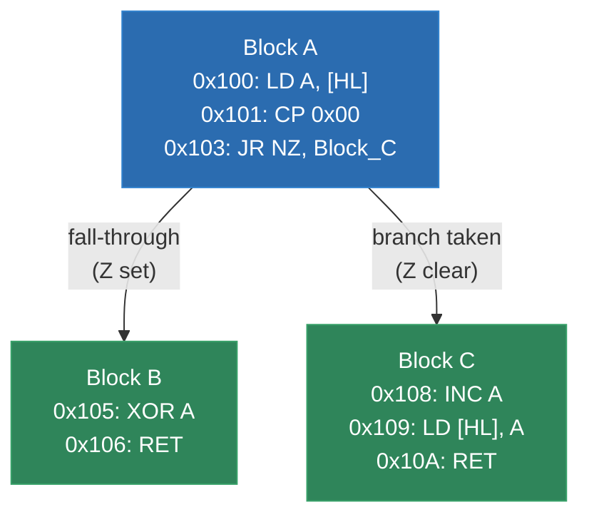
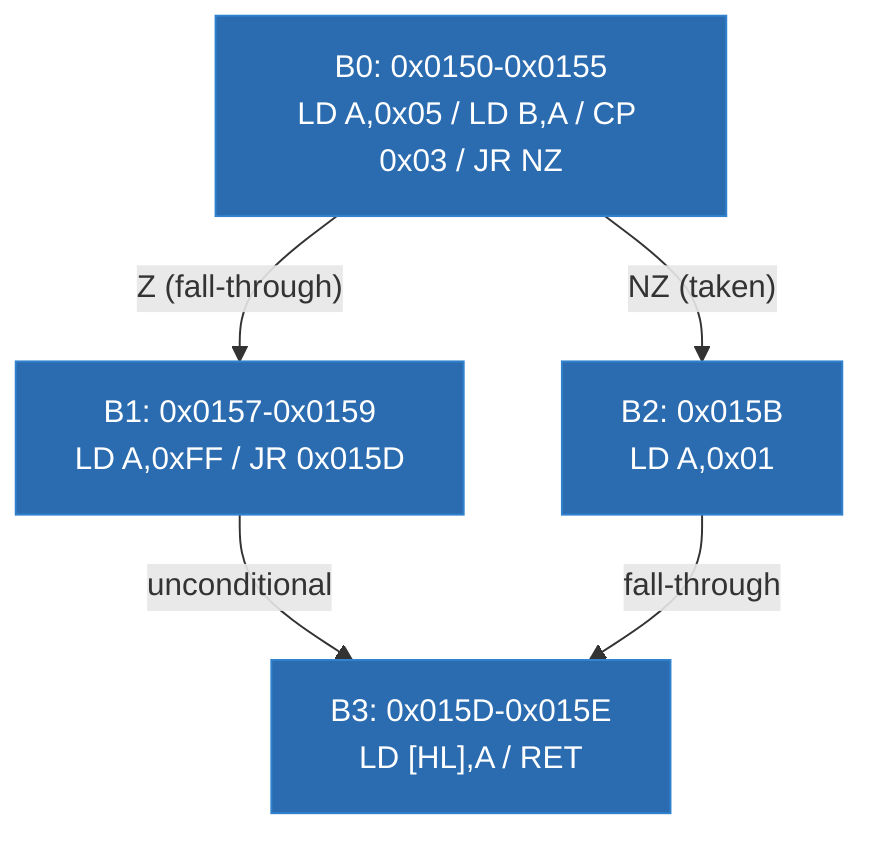
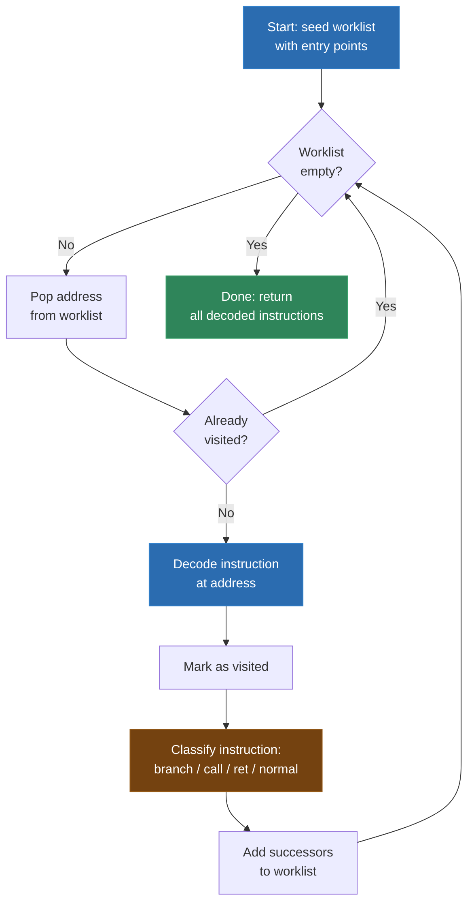
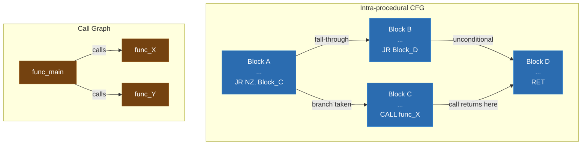
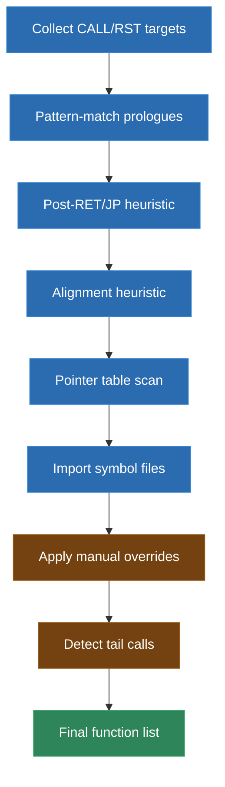
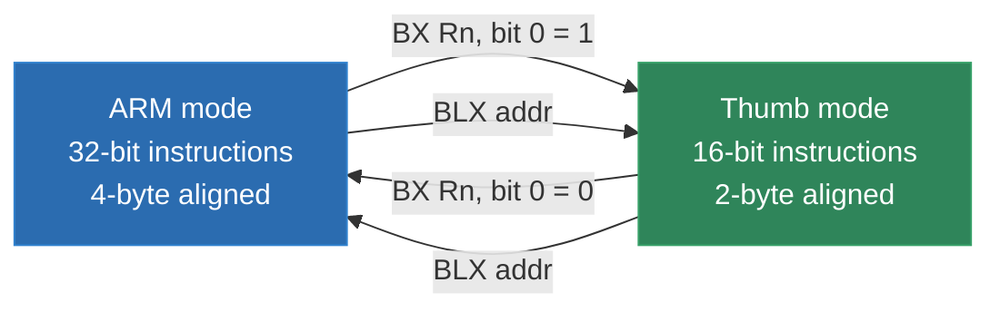
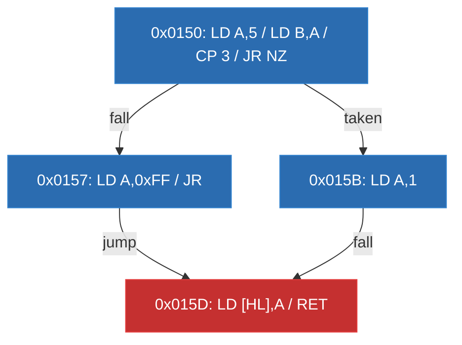

# Module 6: Control-Flow Recovery

Control-flow recovery is where your recompiler stops seeing a binary as a bag of bytes and starts seeing it as a program. This module is the analytical backbone of everything that follows. Without a correct control-flow graph, your lifter will emit wrong code, your function boundaries will be wrong, and the whole recompilation falls apart.

If the binary format parsing from Module 2 told you *where* the bytes are, and the CPU architecture knowledge from Module 3 told you *what* those bytes mean one at a time, then control-flow recovery tells you *how they fit together*. Which instruction runs after which? Where do branches go? Where do functions begin and end? What's code and what's data?

These questions sound simple. They are not. In fact, several of them are provably undecidable in the general case. But "undecidable in the general case" does not mean "impossible in practice." Real binaries are written by real compilers (or real humans) following real conventions, and we can exploit those conventions to recover control flow with high accuracy.

Let's dig in.

---

## 1. What Is a Control-Flow Graph?

A control-flow graph (CFG) is a directed graph that represents all the possible paths execution can take through a program. Each node in the graph is a **basic block** -- a straight-line sequence of instructions with no branches in and no branches out except at the boundaries. Each edge represents a possible transfer of control: a branch taken, a branch not taken (fall-through), a function call, or a return.



Why does the recompiler need a CFG? Several reasons:

**You need to know what to translate.** Without a CFG, you don't know which bytes are instructions and which are data. Translate data as code and you get garbage. Skip code and you get missing behavior.

**You need to know the structure.** The lifter in Module 7 will emit C code for each basic block. The connections between blocks determine whether the C code uses `if/else`, `goto`, `while`, `switch`, or function calls. Without edges, you're just emitting disconnected fragments.

**You need to detect functions.** Most recompilers emit one C function per guest function. Detecting function boundaries requires understanding call/return edges in the CFG.

**You need to handle indirect control flow.** When a `JR` or `JP` instruction takes its target from a register, you can't know the destination just by reading the instruction. The CFG must account for these computed branches somehow, or your recompiled code will be incomplete.

**Optimization depends on it.** Even in a straightforward lifter, knowing the CFG lets you avoid emitting dead code, identify loops, and produce better output.

In a sense, the CFG is the recompiler's internal model of the program. Get it right, and everything downstream works. Get it wrong, and everything downstream is wrong.

### CFGs in Real Recompiler Projects

Every serious recompilation project builds CFGs internally. The N64 decomp projects (Super Mario 64, Zelda: Ocarina of Time) use tools like `splat` and `asm-differ` that depend heavily on correct CFG construction. The `gb-recompiled` project builds per-function CFGs to determine how to structure its C output. Even the IDO recompilation project for IRIX compilers constructs CFGs to understand compiler-generated code patterns.

The representation varies -- some projects use explicit graph data structures, others encode the CFG implicitly in their instruction lists using labels and branch annotations -- but the concept is universal. You cannot recompile without it.

---

## 2. Basic Blocks: The Atoms of Control Flow

A basic block is a maximal sequence of instructions such that:

1. **The only way to enter the block is at the first instruction.** No instruction in the middle of the block is the target of any branch.
2. **The only way to leave the block is at the last instruction.** No instruction in the middle of the block is a branch (conditional or unconditional), a call, or a return.

In other words, if the first instruction of a basic block executes, every instruction in the block executes, in order, exactly once. There are no shortcuts in and no early exits.

This property is what makes basic blocks useful. You can analyze them as units. You can lift them as units. You can optimize within them freely because you know exactly what executes and in what order.

### The Leaders Algorithm

The classic algorithm for identifying basic blocks is the **leaders algorithm**, described in every compiler textbook (Aho, Sethi, and Ullman's "Dragon Book" has the canonical description). A "leader" is the first instruction of a basic block. The algorithm:

1. The entry point of the program is a leader.
2. Any instruction that is the target of a branch (conditional or unconditional) is a leader.
3. Any instruction immediately following a branch or a call is a leader (because the branch might not be taken, or the call might return).
4. Any instruction immediately following a return is a leader (it could be reached from a different call site's fall-through, or it might be the start of a new function).

Once you have identified all leaders, each basic block consists of a leader and all subsequent instructions up to (but not including) the next leader.

Let's work through a concrete example with SM83 assembly:

```asm
; Address  Opcode    Instruction
  0x0150:  3E 05     LD A, 0x05       ; <-- Leader (entry point)
  0x0152:  47        LD B, A
  0x0153:  FE 03     CP 0x03
  0x0155:  20 04     JR NZ, 0x015B    ; Branch instruction

  0x0157:  3E FF     LD A, 0xFF       ; <-- Leader (follows a branch)
  0x0159:  18 02     JR 0x015D        ; Unconditional branch

  0x015B:  3E 01     LD A, 0x01       ; <-- Leader (branch target)

  0x015D:  77        LD [HL], A       ; <-- Leader (branch target)
  0x015E:  C9        RET
```

Applying the leaders algorithm:

- `0x0150` is a leader (entry point).
- `0x0157` is a leader (follows the conditional branch at `0x0155`).
- `0x015B` is a leader (target of the `JR NZ` at `0x0155`).
- `0x015D` is a leader (target of the `JR` at `0x0159`, and also follows the instruction at `0x015B` since `0x015B` is the only instruction in its block and falls through).

This gives us four basic blocks:

| Block | Address Range | Instructions |
|-------|--------------|-------------|
| B0 | 0x0150 - 0x0155 | LD A, 0x05; LD B, A; CP 0x03; JR NZ, 0x015B |
| B1 | 0x0157 - 0x0159 | LD A, 0xFF; JR 0x015D |
| B2 | 0x015B - 0x015B | LD A, 0x01 |
| B3 | 0x015D - 0x015E | LD [HL], A; RET |



Notice something important: B2 falls through into B3 even though there is no explicit branch. The last instruction of B2 (`LD A, 0x01`) is not a branch, so execution continues at the next address. This fall-through edge is just as real as any branch edge, and your CFG must include it.

### Block Size in Practice

In real-world code, basic blocks are surprisingly small. Studies of compiled code consistently show average block sizes of 4-6 instructions. Hand-written assembly (common in Game Boy and SNES games) tends to have slightly larger blocks because humans write more straight-line code and fewer conditional branches per unit of logic.

This means a function with 50 instructions might have 10-15 basic blocks. A whole Game Boy ROM with ~30,000 instructions might have ~6,000-8,000 basic blocks. That's a lot of nodes in your graph, but modern machines handle it easily.

### Practical Considerations

In theory, the leaders algorithm is clean. In practice, you run into complications:

**You need to have already disassembled the code** to apply the leaders algorithm. But disassembly itself depends on knowing what's code and what's data -- a chicken-and-egg problem we'll address in the next sections.

**Not all "follows a branch" locations are reachable.** If an unconditional jump has no fall-through (because the branch is always taken), the instruction after it might be data, or the start of a different function, or unreachable code. You need to be careful about assuming it's a leader.

**Calls complicate things.** Should a `CALL` instruction end a basic block? Strictly speaking, yes -- the call transfers control elsewhere, and the instruction after the call only executes when the callee returns. Most recompilers split at calls. But some don't, especially when they're inlining callees or when the callee is known to always return. There's a school of thought that says calls should not split basic blocks because, from the caller's perspective, a call-and-return is like a single (very complex) instruction. Both approaches work; just be consistent.

**Exception-generating instructions.** On some architectures, any instruction can cause an exception (division by zero, memory access violation). Strictly speaking, this means every instruction is a potential block terminator. In practice, recompilers ignore this possibility and treat exceptions as non-local control flow handled by the runtime.

---

## 3. Linear Sweep Disassembly

Before you can build a CFG, you need to disassemble the binary -- turn raw bytes into instructions. There are two fundamental approaches: linear sweep and recursive descent. Let's start with linear sweep.

Linear sweep is the simplest disassembly algorithm. It starts at the beginning of a code section and decodes instructions sequentially, one after another, until it reaches the end of the section.

```python
def linear_sweep(code_bytes, start_addr, end_addr):
    """Disassemble by sweeping linearly through the code section."""
    instructions = []
    offset = 0
    while start_addr + offset < end_addr:
        insn = decode_instruction(code_bytes, offset)
        insn.address = start_addr + offset
        instructions.append(insn)
        offset += insn.length
    return instructions
```

That's it. That's the whole algorithm. Start at the top, decode, advance by the instruction's length, repeat.

### Strengths

**Simplicity.** Linear sweep is easy to implement and easy to understand. You don't need to follow branches or maintain a worklist. Just start at the top and go. The code above is essentially production-ready (modulo error handling).

**Coverage.** Linear sweep visits every byte in the code section. If there's code there, it will find it (assuming the first instruction is correctly aligned and nothing is data).

**Speed.** One pass through the code, no backtracking, no worklist management. Linear sweep is the fastest disassembly algorithm.

**Works well for architectures with fixed-length instructions.** On MIPS (4-byte instructions) or ARM (4-byte in ARM mode), linear sweep almost always produces correct results because instructions are always aligned. You can't get "out of sync" the way you can with variable-length encodings. Even if you decode a data word as an instruction, the next word is still correctly aligned.

### The Data-in-Code Problem

Linear sweep's fatal weakness is the **data-in-code problem**. Many architectures and compilers place data directly in the code section. Jump tables, string literals, constant pools, padding bytes -- all of these can appear interleaved with instructions.

When linear sweep encounters data, it tries to decode it as an instruction. This produces garbage. Worse, on variable-length architectures, a misinterpreted data byte can cause the decoder to become misaligned, producing garbage for many subsequent instructions until it happens to re-synchronize.

Consider this x86 scenario:

```
0x1000:  E8 05 00 00 00    CALL 0x100A       ; 5-byte instruction
0x1005:  48 65 6C 6C 6F    "Hello"           ; ASCII string data!
0x100A:  55                PUSH EBP          ; Function prologue
0x100B:  89 E5             MOV EBP, ESP
```

Linear sweep would decode the string "Hello" as x86 instructions:

```
0x1005:  48                DEC EAX           ; 'H' misinterpreted
0x1006:  65 6C             GS INSB           ; 'el' misinterpreted
0x1008:  6C                INSB              ; 'l' misinterpreted
0x1009:  6F                OUTSD             ; 'o' misinterpreted
```

In this case, we get "lucky" -- the decoder stays aligned and the real code at `0x100A` is disassembled correctly. But on x86, instruction lengths vary from 1 to 15 bytes, so a data region could easily desynchronize the decoder. If a 5-byte data chunk is decoded as a 3-byte instruction followed by a 4-byte instruction, the decoder is now 2 bytes off and will misinterpret real code.

On fixed-width architectures like MIPS, the problem is different but still real. Data words in the code section will decode as valid (but meaningless) instructions. The disassembly will be wrong, but at least the decoder won't become misaligned.

For Game Boy ROMs, linear sweep actually works surprisingly well for the main code areas because most games keep data in separate ROM regions. But jump tables embedded in code are common enough to cause problems, and the variable-length instruction encoding (1-3 bytes) means misalignment can cascade.

### A Concrete Desynchronization Example on SM83

Here's what happens when a jump table in a Game Boy ROM throws off linear sweep:

```
; Real code and data layout:
  0x3000:  E9           JP (HL)            ; Indirect jump (dispatch)
  0x3001:  00 40        ; Jump table entry: 0x4000
  0x3003:  10 40        ; Jump table entry: 0x4010
  0x3005:  20 40        ; Jump table entry: 0x4020
  0x3007:  3E 42        LD A, 0x42         ; Real code resumes here
  0x3009:  C9           RET
```

Linear sweep decodes the jump table entries as instructions:

```
  0x3001:  00           NOP                ; 0x00 happens to be NOP
  0x3002:  40           LD B, B            ; 0x40 happens to be LD B,B
  0x3003:  10 40        STOP               ; 0x10 is STOP (takes next byte)
  0x3005:  20 40        JR NZ, 0x3047      ; 0x20 is JR NZ with offset 0x40
  0x3007:  3E 42        LD A, 0x42         ; Back in sync by luck!
```

In this case, the decoder re-synchronized at `0x3007` because the data bytes happened to consume the right number of bytes. But we were lucky. If the table had different values, the decoder might have consumed `0x3E` (the `LD A, imm8` opcode at `0x3007`) as part of a previous "instruction" and never recovered.

### Who Uses Linear Sweep?

`objdump` uses linear sweep by default. It works well for its intended purpose -- disassembling object files produced by known compilers, where code and data sections are cleanly separated by the linker. The compiler told the assembler what's code and what's data, and the assembler told the linker, so the section boundaries are reliable.

For recompilation of arbitrary binaries (especially ROM images, which are flat blobs with no section metadata), linear sweep is usually not sufficient on its own. But it's still useful as a supplement to recursive descent, as we'll discuss later.

### Linear Sweep Implementation for SM83

Here's a more complete linear sweep for the Game Boy's SM83, with instruction length tables and invalid opcode detection:

```python
# SM83 instruction lengths, indexed by opcode byte.
# 0 means the opcode is invalid/unused.
SM83_INSN_LENGTHS = [
    # 0x0_  1  2  3  4  5  6  7  8  9  A  B  C  D  E  F
      1, 3, 1, 1, 1, 1, 2, 1, 3, 1, 1, 1, 1, 1, 2, 1,  # 0x0_
      1, 3, 1, 1, 1, 1, 2, 1, 2, 1, 1, 1, 1, 1, 2, 1,  # 0x1_
      2, 3, 1, 1, 1, 1, 2, 1, 2, 1, 1, 1, 1, 1, 2, 1,  # 0x2_
      2, 3, 1, 1, 1, 1, 2, 1, 2, 1, 1, 1, 1, 1, 2, 1,  # 0x3_
      1, 1, 1, 1, 1, 1, 1, 1, 1, 1, 1, 1, 1, 1, 1, 1,  # 0x4_
      1, 1, 1, 1, 1, 1, 1, 1, 1, 1, 1, 1, 1, 1, 1, 1,  # 0x5_
      1, 1, 1, 1, 1, 1, 1, 1, 1, 1, 1, 1, 1, 1, 1, 1,  # 0x6_
      1, 1, 1, 1, 1, 1, 1, 1, 1, 1, 1, 1, 1, 1, 1, 1,  # 0x7_
      1, 1, 1, 1, 1, 1, 1, 1, 1, 1, 1, 1, 1, 1, 1, 1,  # 0x8_
      1, 1, 1, 1, 1, 1, 1, 1, 1, 1, 1, 1, 1, 1, 1, 1,  # 0x9_
      1, 1, 1, 1, 1, 1, 1, 1, 1, 1, 1, 1, 1, 1, 1, 1,  # 0xA_
      1, 1, 1, 1, 1, 1, 1, 1, 1, 1, 1, 1, 1, 1, 1, 1,  # 0xB_
      1, 1, 3, 3, 3, 1, 2, 1, 1, 1, 3, 2, 3, 3, 2, 1,  # 0xC_
      1, 1, 3, 0, 3, 1, 2, 1, 1, 1, 3, 0, 3, 0, 2, 1,  # 0xD_
      2, 1, 1, 0, 0, 1, 2, 1, 2, 1, 3, 0, 0, 0, 2, 1,  # 0xE_
      2, 1, 1, 1, 0, 1, 2, 1, 2, 1, 3, 1, 0, 0, 2, 1,  # 0xF_
]

SM83_INVALID_OPCODES = {
    0xD3, 0xDB, 0xDD, 0xE3, 0xE4, 0xEB, 0xEC, 0xED, 0xF4, 0xFC, 0xFD
}

def linear_sweep_sm83(rom_bytes, start, end):
    """Linear sweep disassembly for SM83."""
    instructions = []
    pc = start

    while pc < end:
        opcode = rom_bytes[pc]

        # Check for CB prefix (bit operations)
        if opcode == 0xCB:
            length = 2
        else:
            length = SM83_INSN_LENGTHS[opcode]
            if length == 0:
                # Invalid opcode -- we've hit data or a bug
                print(f"WARNING: Invalid opcode 0x{opcode:02X} at 0x{pc:04X}")
                pc += 1
                continue

        # Bounds check
        if pc + length > end:
            print(f"WARNING: Instruction at 0x{pc:04X} extends past end")
            break

        insn_bytes = rom_bytes[pc:pc + length]
        instructions.append({
            'address': pc,
            'opcode': opcode,
            'bytes': insn_bytes,
            'length': length,
        })
        pc += length

    return instructions
```

---

## 4. Recursive Descent Disassembly

Recursive descent is the smarter sibling of linear sweep. Instead of blindly decoding bytes in order, recursive descent follows the control flow of the program. It starts at known entry points and only disassembles code that is reachable.

### The Algorithm

```python
def recursive_descent(code_bytes, entry_points):
    """Disassemble by following control flow from known entry points."""
    visited = set()
    worklist = list(entry_points)
    instructions = {}

    while worklist:
        addr = worklist.pop()
        if addr in visited:
            continue
        visited.add(addr)

        # Bounds check
        offset = addr - base_address
        if offset < 0 or offset >= len(code_bytes):
            continue

        # Decode the instruction at this address
        insn = decode_instruction(code_bytes, offset)
        insn.address = addr
        instructions[addr] = insn

        # Determine successors based on instruction type
        if is_unconditional_branch(insn):
            target = get_branch_target(insn)
            if target is not None:  # Not an indirect branch
                worklist.append(target)
            # No fall-through for unconditional branches
        elif is_conditional_branch(insn):
            target = get_branch_target(insn)
            if target is not None:
                worklist.append(target)
            worklist.append(addr + insn.length)  # Fall-through
        elif is_call(insn):
            target = get_branch_target(insn)
            if target is not None:
                worklist.append(target)  # Call target (new function)
            worklist.append(addr + insn.length)  # Return address
        elif is_return(insn) or is_halt(insn):
            pass  # No successors -- end of path
        else:
            worklist.append(addr + insn.length)  # Normal fall-through

    return instructions
```

### How It Works

You maintain a **worklist** of addresses to disassemble. You start with known entry points -- the ROM's reset vector, interrupt handlers, or the `main()` function in an ELF binary.

For each address in the worklist:
1. If you've already visited it, skip it.
2. Decode the instruction at that address.
3. Determine its successors (where control can go next).
4. Add those successors to the worklist.

This naturally follows the control flow of the program. It only disassembles bytes that are reachable from a known entry point, which means it naturally avoids data embedded in code sections.



### Entry Points for Common Targets

Where you seed the worklist depends on the platform:

**Game Boy (SM83):** The entry point is always `0x0100` (the ROM header points here, though it usually immediately jumps to `0x0150` or similar). Interrupt handlers are at fixed addresses: `0x0040` (VBlank), `0x0048` (STAT), `0x0050` (Timer), `0x0058` (Serial), `0x0060` (Joypad). RST targets: `0x0000`, `0x0008`, `0x0010`, `0x0018`, `0x0020`, `0x0028`, `0x0030`, `0x0038`. That gives you up to 14 seed addresses for a Game Boy ROM before you've even started analyzing.

**N64 (MIPS):** The boot code starts at `0x80000400` (after the IPL3 bootloader copies it to RAM). Additional entry points come from the game's thread table and the OS exception vectors.

**x86 (DOS .COM):** Entry point is `0x0100` (the PSP is at `0x0000-0x00FF`, code starts at `0x0100`). Interrupt handlers may be installed anywhere.

**x86 (PE/EXE):** The PE header specifies the `AddressOfEntryPoint`. DLLs also have `DllMain`. Exported functions in the export table are additional entry points.

**ELF:** The ELF header has `e_entry`. The `.init` and `.fini` sections contain initialization/finalization code. The symbol table (if present) lists all named functions.

### Strengths

**Avoids the data-in-code problem.** Recursive descent only visits addresses that are reachable through control flow. If a block of data is embedded between two functions, recursive descent will skip over it because no branch targets it. This is the single biggest advantage over linear sweep.

**Produces a CFG as a side effect.** Every time you follow a branch or fall-through, you're implicitly recording a CFG edge. You get the disassembly and the CFG from the same pass. No separate CFG construction step is needed (though you'll want to formalize it into a proper data structure).

**Handles variable-length encodings correctly.** Because you always start decoding at a known-good instruction boundary (a branch target or fall-through from a previously decoded instruction), you can't become misaligned. The x86 alignment problem that plagues linear sweep is a non-issue here.

### Weaknesses

**Coverage depends on entry points.** If you don't know about a function -- because it's only called through a function pointer or a jump table -- recursive descent will never visit it. You can miss significant portions of the code. In some Game Boy games, 10-20% of functions are reached only through indirect calls.

**Indirect branches are opaque.** When you encounter `JP (HL)` on SM83 or `jr $t0` on MIPS, you don't know where control is going. The worklist gets no new entries from that instruction, so any code reachable only through that indirect branch is invisible.

**Requires more bookkeeping.** You need to track visited addresses, maintain the worklist, and handle the various instruction types. It's more complex than linear sweep, though not dramatically so -- the code above is about 30 lines.

### The Coverage Problem in Detail

The fundamental limitation of recursive descent is that it can only find code it can reach. Consider a jump table dispatch:

```asm
; SM83: State machine dispatcher
; A register holds the current state (0, 1, 2, ...)
  0x2000:  LD A, [state_var]     ; Load state index
  0x2003:  ADD A, A              ; A = A * 2 (each entry is 2 bytes)
  0x2004:  LD L, A
  0x2005:  LD H, 0x00
  0x2007:  LD DE, state_table
  0x200A:  ADD HL, DE
  0x200B:  LD A, [HL+]           ; Low byte of target
  0x200C:  LD H, [HL]            ; High byte of target
  0x200D:  LD L, A
  0x200E:  JP (HL)               ; Jump to handler -- INDIRECT!

; State handler table (data, not code)
  state_table:
  0x200F:  20 20                 ; State 0 -> 0x2020
  0x2011:  30 20                 ; State 1 -> 0x2030
  0x2013:  40 20                 ; State 2 -> 0x2040

; State handlers (code, only reachable through the table)
  0x2020:  ...  ; handle_state_0
  0x2030:  ...  ; handle_state_1
  0x2040:  ...  ; handle_state_2
```

Recursive descent will disassemble `0x2000` through `0x200E` and then stop dead. It sees `JP (HL)` and has no idea what `HL` contains at runtime. The three handler functions at `0x2020`, `0x2030`, and `0x2040` are completely invisible unless you find and parse the jump table.

This pattern is extremely common in games. State machines, command dispatchers, menu systems, entity AI handlers -- all of them typically use jump tables. In a Game Boy RPG, a significant chunk of the game's logic might be reachable only through jump tables.

### Hybrid Approaches

Most practical recompilers don't use purely one strategy or the other. The most common approach:

1. **Run recursive descent from all known entry points.** This gives you the core code with high confidence. Everything you find this way is definitely code, and the CFG edges are definitely real.

2. **Recover jump tables.** When recursive descent encounters an indirect branch, try to identify the jump table pattern and parse the table entries. Add all table entries as new entry points and run recursive descent again.

3. **Analyze the gaps.** Look at regions of the code section not reached by recursive descent.

4. **Try linear sweep in the gaps.** If a gap contains valid-looking instructions (no invalid opcodes, branch targets are reasonable, function-prologue-like patterns), it's probably code that's only reachable through indirect calls.

5. **Cross-reference with data references.** If something in the code loads the address of a gap region, that gap might contain a function.

This layered approach catches most of the code in a typical binary. The remaining unreachable functions are typically found through testing -- they cause crashes or missing behavior when the recompiled program tries to call them.

---

## 5. Building the CFG: Edges from Branches, Calls, and Fall-Throughs

Once you have a set of disassembled instructions (from recursive descent, linear sweep, or both), building the CFG is straightforward. You identify basic blocks using the leaders algorithm, then add edges based on the control-flow semantics of each block's terminating instruction.

### Edge Types

There are four kinds of edges in a CFG:

**Fall-through edges.** When a basic block's last instruction is not a branch (or is a conditional branch that might not be taken), execution falls through to the next instruction. This is the most common edge type.

**Branch-taken edges.** When a basic block ends with a conditional or unconditional branch, there's an edge to the branch target. For conditional branches, there are two outgoing edges: taken and fall-through.

**Call edges.** When a basic block ends with a `CALL` instruction, there's an edge to the callee's entry point. Whether you represent this in the intra-procedural CFG or in a separate call graph depends on your design.

**Return edges.** When a `RET` instruction executes, control returns to the instruction after the corresponding `CALL`. These edges are context-sensitive -- the destination depends on which call site invoked the function -- so they're typically represented in the call graph rather than the per-function CFG.



### Implementing CFG Construction

Here's a practical implementation in Python:

```python
class BasicBlock:
    def __init__(self, start_addr):
        self.start_addr = start_addr
        self.instructions = []
        self.successors = []      # (target_addr, edge_type) pairs
        self.predecessors = []    # back-references

    @property
    def end_addr(self):
        if not self.instructions:
            return self.start_addr
        last = self.instructions[-1]
        return last.address + last.length

    @property
    def last_insn(self):
        return self.instructions[-1] if self.instructions else None

    def __repr__(self):
        n = len(self.instructions)
        return f"Block(0x{self.start_addr:04X}, {n} insns)"


class CFG:
    def __init__(self):
        self.blocks = {}  # start_addr -> BasicBlock
        self.edges = []   # (src_addr, dst_addr, edge_type)

    def build_from_instructions(self, instructions, leaders):
        """Build basic blocks and edges from a sorted instruction list.

        `instructions` is a dict: address -> instruction object
        `leaders` is a set of addresses that start basic blocks
        """
        sorted_leaders = sorted(leaders)

        # Step 1: Create blocks
        for i, leader_addr in enumerate(sorted_leaders):
            block = BasicBlock(leader_addr)

            # Find the boundary: next leader or end of instructions
            next_leader = (sorted_leaders[i + 1]
                          if i + 1 < len(sorted_leaders) else float('inf'))

            # Collect instructions belonging to this block
            addr = leader_addr
            while addr < next_leader and addr in instructions:
                insn = instructions[addr]
                block.instructions.append(insn)

                # Stop at terminators (even if next leader is further)
                if (is_unconditional_branch(insn) or is_return(insn)
                        or is_halt(insn)):
                    break
                if is_conditional_branch(insn) or is_call(insn):
                    break

                addr = insn.address + insn.length

            if block.instructions:
                self.blocks[leader_addr] = block

        # Step 2: Add edges based on block terminators
        for addr, block in self.blocks.items():
            last = block.last_insn
            if last is None:
                continue

            if is_unconditional_branch(last):
                target = get_branch_target(last)
                if target is not None and target in self.blocks:
                    self.add_edge(addr, target, 'branch')

            elif is_conditional_branch(last):
                target = get_branch_target(last)
                if target is not None and target in self.blocks:
                    self.add_edge(addr, target, 'branch_taken')
                # Fall-through edge
                fall = last.address + last.length
                if fall in self.blocks:
                    self.add_edge(addr, fall, 'fall_through')

            elif is_return(last):
                pass  # Return edges go in the call graph, not the CFG

            elif is_call(last):
                # After a call, execution continues at the next instruction
                fall = last.address + last.length
                if fall in self.blocks:
                    self.add_edge(addr, fall, 'call_return')
                # The call target itself goes in the call graph

            else:
                # Non-terminating instruction at the end of a block
                # This happens when the next instruction is a leader
                fall = last.address + last.length
                if fall in self.blocks:
                    self.add_edge(addr, fall, 'fall_through')

    def add_edge(self, src, dst, edge_type):
        self.edges.append((src, dst, edge_type))
        if src in self.blocks:
            self.blocks[src].successors.append((dst, edge_type))
        if dst in self.blocks:
            self.blocks[dst].predecessors.append((src, edge_type))

    def get_entry_block(self):
        """Return the block with no predecessors (function entry)."""
        for addr, block in self.blocks.items():
            if not block.predecessors:
                return block
        # Fallback: return the block with the lowest address
        if self.blocks:
            return self.blocks[min(self.blocks.keys())]
        return None

    def reachable_from(self, start_addr):
        """Find all blocks reachable from the given start address."""
        visited = set()
        worklist = [start_addr]
        while worklist:
            addr = worklist.pop()
            if addr in visited:
                continue
            visited.add(addr)
            if addr in self.blocks:
                for succ_addr, _ in self.blocks[addr].successors:
                    worklist.append(succ_addr)
        return visited
```

### Handling Calls in the CFG: Design Choices

There's a design choice every recompiler must make: do you build one big CFG for the entire program, or per-function CFGs connected by a call graph?

**Whole-program CFG (interprocedural):** One graph for everything. Calls are just edges like any other. Simple but produces huge graphs and makes function-level code generation harder.

**Per-function CFGs (intraprocedural) + call graph:** Each function gets its own CFG. A separate call graph records which functions call which others. This is what most recompilers use because it maps naturally to the output -- one C function per guest function.

For Game Boy recompilation, the per-function approach is standard. For N64 recompilation, both the decomp projects and `n64recomp` use per-function CFGs, typically guided by symbol maps. For architectures where function boundaries are ambiguous (some DOS programs, heavily optimized code), you might start with a whole-program CFG and then partition it into functions.

### Edge Cases (Literally)

**Overlapping instructions (x86).** The same bytes can decode differently from different starting offsets. Rare in game code, but a headache if you encounter it.

**Unreachable code.** Dead code that no branch targets. Recursive descent skips it. Whether you include it in the CFG depends on your goals -- for recompilation, skipping it is usually fine.

**Non-returning calls.** Functions like `exit()` or a game's `panic()` routine never return. Omit the fall-through edge after calls to known non-returning functions.

**Tail calls.** `JP` to a known function entry is a tail call. It should be a call graph edge, not an intra-procedural branch edge. Misidentifying it merges two functions.

**Self-modifying code.** Some programs modify their own instructions at runtime. Static analysis can't handle this. Flag it and move on -- it's a fundamental limitation of the approach.

---

## 6. Function Boundary Detection

Detecting where functions begin and end is critical. Your recompiler emits one C function per guest function, so the boundaries determine the structure of your entire output.

### Why Function Boundaries Matter

When you emit C code, each guest function becomes a C function. If you merge two guest functions into one C function, the output still works but is harder to read and verify. If you split one guest function into two C functions, the output might not compile at all (blocks referencing labels in the other half, stack operations that don't balance within either half).

Getting boundaries right means your output mirrors the original program's structure, which makes verification, debugging, and modification all easier.

### Call Targets: The Primary Signal

The most reliable function-start indicator: every `CALL addr` instruction tells you that `addr` is almost certainly a function entry point.

```python
def find_call_targets(instructions):
    """Find all direct call targets -- these are likely function starts."""
    targets = set()
    for insn in instructions.values():
        if is_call(insn):
            target = get_branch_target(insn)
            if target is not None:
                targets.add(target)
        # SM83: RST instructions are single-byte calls
        if is_rst(insn):
            targets.add(get_rst_target(insn))
    return targets
```

On the Game Boy, `CALL`, `CALL NZ`, `CALL Z`, `CALL NC`, `CALL C`, and the eight `RST` instructions all provide call targets. For a typical Game Boy game, this finds 60-80% of all functions on the first pass.

### Prologue/Epilogue Pattern Matching

Many architectures have recognizable function prologues and epilogues:

**x86 function prologue:**
```asm
55                PUSH EBP
89 E5             MOV EBP, ESP
83 EC xx          SUB ESP, <frame_size>
```

**MIPS function prologue:**
```asm
27BDFFE0          ADDIU $sp, $sp, -32      ; allocate frame
AFBF001C          SW $ra, 28($sp)          ; save return address
AFB00018          SW $s0, 24($sp)          ; save callee-saved reg
```

**PowerPC function prologue:**
```asm
7C0802A6          MFLR r0                  ; link register -> r0
90010004          STW r0, 4(r1)            ; save return address
9421FFD0          STWU r1, -48(r1)         ; allocate frame
```

**SM83 (Game Boy):** No standard prologue exists. However, a sequence of `PUSH` instructions at a `CALL` target is a strong signal:

```asm
; Common pattern: save registers, do work, restore, return
PUSH BC          ; 0xC5
PUSH DE          ; 0xD5
; ... function body ...
POP DE           ; 0xD1
POP BC           ; 0xC1
RET              ; 0xC9
```

For SM83, prologue matching is a supplement, not a primary strategy. The small register set means many functions don't need to save any registers.

### Heuristic Detection

**Post-return heuristic.** If a `RET` or unconditional `JP` is followed by a valid instruction sequence that isn't targeted by any known intra-function branch, it's probably a new function. This catches functions only reachable through indirect calls.

```python
def find_functions_after_returns(instructions, known_branch_targets):
    """Find potential function starts after RET/JP instructions."""
    candidates = []
    sorted_addrs = sorted(instructions.keys())

    for i, addr in enumerate(sorted_addrs):
        insn = instructions[addr]
        if not (is_return(insn) or is_unconditional_branch(insn)):
            continue

        # Look at the next instruction
        if i + 1 >= len(sorted_addrs):
            continue
        next_addr = sorted_addrs[i + 1]

        # Skip if it's already a known branch target (intra-function branch)
        if next_addr in known_branch_targets:
            continue

        # This looks like a function boundary
        candidates.append(next_addr)

    return candidates
```

**Alignment heuristic.** MIPS functions are often 4-byte or 8-byte aligned. x86 functions compiled by MSVC are often 16-byte aligned. If you see NOP padding (or `0xCC` bytes on x86) followed by valid code, that's probably a function boundary.

**Pointer table cross-referencing.** Tables of 16-bit (SM83) or 32-bit (MIPS, x86) pointers into the code section are probably function pointer tables. Each entry is a function start. Game Boy games use these constantly for state machines, entity handlers, and menu systems.

```python
def scan_for_pointer_tables(rom_bytes, code_start, code_end, ptr_size=2):
    """Scan for tables of pointers into the code region."""
    min_table_size = 3  # At least 3 entries to count as a table
    tables = []
    current_run = []

    for addr in range(0, len(rom_bytes) - ptr_size + 1):
        if ptr_size == 2:
            ptr = rom_bytes[addr] | (rom_bytes[addr + 1] << 8)
        elif ptr_size == 4:
            ptr = (rom_bytes[addr] | (rom_bytes[addr+1] << 8)
                   | (rom_bytes[addr+2] << 16) | (rom_bytes[addr+3] << 24))

        if code_start <= ptr < code_end:
            if not current_run or addr == current_run[-1][0] + ptr_size:
                current_run.append((addr, ptr))
            else:
                if len(current_run) >= min_table_size:
                    tables.append(current_run[:])
                current_run = [(addr, ptr)]
        else:
            if len(current_run) >= min_table_size:
                tables.append(current_run[:])
            current_run = []

    if len(current_run) >= min_table_size:
        tables.append(current_run)

    return tables
```

**Symbol tables.** If you have them, use them. The N64 decomp community has provided function lists for dozens of games. Some Game Boy games have been documented by the community with complete function maps. `gb-recompiled` can import symbol files to bypass heuristic detection entirely.

### Tail Call Detection

Tail calls are one of the trickiest issues in function boundary detection. When function A ends with `JP addr` and `addr` is also a `CALL` target from elsewhere, it's almost certainly a tail call.

```python
def detect_tail_calls(instructions, call_targets):
    """Identify JP instructions that are tail calls to known functions."""
    tail_calls = []
    for addr, insn in instructions.items():
        if is_unconditional_branch(insn) and not is_call(insn):
            target = get_branch_target(insn)
            if target is not None and target in call_targets:
                tail_calls.append((addr, target))
    return tail_calls
```

Without tail call detection, you'll merge functions incorrectly. With it, you correctly identify the `JP` as a cross-function transfer rather than an intra-function branch.

### Manual Override: The Escape Hatch

No heuristic is perfect. Every recompiler that works on real binaries needs a manual override mechanism. This is typically a configuration file that lists function boundaries, data regions, and other annotations:

```toml
# overrides.toml -- Manual corrections to auto-analysis

[functions]
# Format: address = "function_name"
0x0150 = "main_loop"
0x2020 = "handle_state_0"
0x2030 = "handle_state_1"
0x2040 = "handle_state_2"

[data_regions]
# Regions that should NOT be disassembled as code
0x200F = { end = 0x2015, type = "jump_table" }
0x7000 = { end = 0x7FFF, type = "tile_data" }

[tail_calls]
# JP instructions that are tail calls, not intra-function branches
0x1FFE = 0x2050  # JP 0x2050 at 0x1FFE is a tail call
```



---

## 7. Handling Computed Branches and Indirect Jumps

This is where control-flow recovery gets genuinely hard. A computed branch is any branch whose target is determined at runtime. You can't determine the target statically just by reading the instruction.

Module 14 covers this topic in full depth. Here we introduce the problem and the most common solutions.

### Types of Indirect Control Flow

**Register jumps.** `JP (HL)` on SM83, `jr $t0` on MIPS, `bx r4` on ARM, `JMP EAX` on x86. The target is in a register.

**Jump tables.** The most common pattern. Load an index, look up a target from a table, branch to it. Used for `switch` statements, state machines, and dispatch tables.

**Indirect calls.** Function pointers. On SM83, you don't have `CALL (HL)`, so instead you see patterns like storing a function pointer and then using `CALL` with a trampoline, or `JP (HL)` from a context that makes it logically a call.

**Stack manipulation.** `PUSH addr; RET` is a sneaky way to do an unconditional jump. The `RET` pops the pushed address and jumps there. On the Game Boy, this is actually used as an optimization because `PUSH BC; RET` (2 bytes, 4+4 cycles) can be faster than `JP addr` (3 bytes, 4 cycles) in certain contexts where BC already holds the target.

### Why This Is Hard

Determining the runtime value of a register at a specific instruction is equivalent to the halting problem in the general case. But real programs are not arbitrary -- they use indirect branches in recognizable patterns. The trick is pattern recognition.

### Jump Table Recovery

Jump tables are the bread and butter of indirect control flow. Here's the recovery process:

**Step 1: Identify the pattern.** When you hit a `JP (HL)` (SM83) or `JR $t0` (MIPS), walk backwards through the preceding instructions looking for the characteristic table-lookup sequence: index scaling, base address loading, and memory access.

**Step 2: Extract the table base address.** This is usually an immediate value loaded into a register.

**Step 3: Determine table bounds.** Look for:
- A bounds check before the dispatch (e.g., `CP max; JR NC, default`)
- Known table entry count from the program's data structures
- Table entries that don't look like valid code addresses (end of table)

**Step 4: Read entries and add them as targets.**

Here's a complete jump table recovery routine for SM83:

```python
def recover_sm83_jump_table(rom_bytes, instructions, jp_hl_addr):
    """
    Attempt to recover a jump table for a JP (HL) instruction.
    Returns a list of target addresses, or None if no table found.
    """
    # Walk backwards from JP (HL) looking for the table base
    addr = jp_hl_addr
    table_base = None
    max_lookback = 20  # Don't search too far

    for _ in range(max_lookback):
        # Find previous instruction
        addr = find_prev_instruction(instructions, addr)
        if addr is None:
            break

        insn = instructions[addr]

        # Look for "LD HL, <immediate>" or "LD DE, <immediate>"
        # which loads the table base address
        if (insn.opcode == 0x21 or    # LD HL, imm16
            insn.opcode == 0x11):      # LD DE, imm16
            imm = insn.bytes[1] | (insn.bytes[2] << 8)
            table_base = imm
            break

    if table_base is None:
        return None  # Couldn't find table base

    # Now look for a bounds check to determine table size
    max_index = None
    addr = jp_hl_addr
    for _ in range(max_lookback):
        addr = find_prev_instruction(instructions, addr)
        if addr is None:
            break
        insn = instructions[addr]

        # Look for "CP <imm8>" which is a typical bounds check
        if insn.opcode == 0xFE:  # CP imm8
            max_index = insn.bytes[1]
            break

    # Read table entries
    entries = []
    limit = max_index if max_index is not None else 32  # default cap

    for i in range(limit):
        entry_addr = table_base + i * 2
        if entry_addr + 2 > len(rom_bytes):
            break

        target = rom_bytes[entry_addr] | (rom_bytes[entry_addr + 1] << 8)

        # Sanity check: is this a plausible code address?
        if target < 0x0100 or target >= 0x8000:
            break  # Probably past the end of the table

        entries.append(target)

    if len(entries) < 2:
        return None  # Too few entries to be a real table

    return entries
```

### Value Set Analysis (Preview)

For indirect branches that don't follow the jump table pattern, **value set analysis (VSA)** is the heavy-duty approach. VSA tracks the set of possible values each register can hold at each program point. At the indirect branch, the register's value set tells you the possible targets.

This is covered fully in Module 14. The short version: VSA is an abstract interpretation technique where, instead of executing the program, you propagate abstract values (sets, intervals, strided intervals) through the CFG. It's expensive and imprecise, but when it works, it can resolve indirect branches that no pattern matcher would catch.

For most Game Boy recompilation, pattern matching on jump tables is sufficient. For more complex targets (N64, Xbox), VSA becomes more important.

### The Punt-and-Patch Strategy

When static analysis fails to resolve an indirect branch, you can emit a runtime dispatch that logs unknown targets:

```c
/* Generated code for an unresolved JP (HL) */
void dispatch_0x200E(gb_state *ctx) {
    switch (ctx->HL) {
        case 0x2020: func_2020(ctx); return;
        case 0x2030: func_2030(ctx); return;
        case 0x2040: func_2040(ctx); return;
        default:
            log_unknown_target("JP (HL)", 0x200E, ctx->HL);
            /* Could also: abort, break to interpreter, etc. */
            abort();
    }
}
```

During testing, every time the `default` case fires, you've found a target your analysis missed. Add it to the dispatch table, recompile, and test again. Iterate until no new targets appear.

This approach is used by real projects. `n64recomp` uses runtime dispatch for indirect jumps it can't resolve statically. `gb-recompiled` does the same. It's not elegant, but it converges reliably toward a complete program.

---

## 8. Data vs. Code Discrimination

Telling data apart from code is one of the oldest problems in binary analysis. When data lives in the code section, your disassembler produces garbage. Getting this right is critical.

### Why Data Ends Up in Code Sections

**Jump tables.** Tables of branch target addresses, placed right after the dispatch code.

**String literals.** Text strings embedded inline, especially in older code and hand-written assembly. On Game Boy, dialogue text is often interleaved with the code that processes it.

**Constant pools.** ARM literal pools. Game Boy lookup tables for math operations, tile indices, or palette data.

**Alignment padding.** NOPs (0x00 on SM83, 0x90 on x86) or INT3 bytes (0xCC on x86) between functions.

**Level data and graphics.** In ROM-based systems, space is precious. Data gets packed wherever it fits, including code banks.

### Discrimination Strategies

**Strategy 1: Recursive descent (avoidance).** The best solution to data-in-code is not to encounter it. Recursive descent only decodes reachable code, naturally skipping data regions. This should be your primary defense.

**Strategy 2: Invalid opcode detection.** SM83's ten unused opcodes (0xD3, 0xDB, 0xDD, 0xE3, 0xE4, 0xEB, 0xEC, 0xED, 0xF4, 0xFC, 0xFD) are definitive data markers. If your decoder encounters one, you're in data territory. Not all architectures have unused opcodes -- MIPS and ARM encode all 32-bit patterns as valid instructions -- but when they exist, use them.

```python
SM83_INVALID_OPCODES = {
    0xD3, 0xDB, 0xDD, 0xE3, 0xE4, 0xEB, 0xEC, 0xED, 0xF4, 0xFC, 0xFD
}

def validate_instruction_stream(instructions):
    """Check for invalid opcodes that indicate data-in-code."""
    data_regions = []
    for addr, insn in sorted(instructions.items()):
        if insn.opcode in SM83_INVALID_OPCODES:
            data_regions.append(addr)
            print(f"DATA at 0x{addr:04X}: invalid opcode 0x{insn.opcode:02X}")
    return data_regions
```

**Strategy 3: Cross-reference analysis.** Build a database of all references. If code loads an address from within the code section as data (`LD HL, 0x3100` followed by `LD A, [HL]`), the referenced address is probably data. If code branches to an address, it's code.

**Strategy 4: Gap analysis.** After recursive descent, examine the gaps. For each gap:
- Try decoding it as SM83 instructions. Any invalid opcodes? Suspicious patterns?
- Check if anything references the gap as data (pointer loads).
- Check if anything references the gap as code (branches, call targets).
- Compute byte entropy. High entropy suggests compressed data. Low entropy with ASCII-range bytes suggests text.

**Strategy 5: Heuristic scoring.** Assign each gap region a "code-likeness" score based on multiple signals:

```python
def code_likelihood_score(rom_bytes, start, end):
    """Score how likely a region is to be code vs data (0.0 to 1.0)."""
    score = 0.5  # Start neutral
    region = rom_bytes[start:end]
    length = end - start

    if length == 0:
        return 0.0

    # Check for invalid opcodes (strong data signal)
    invalid_count = sum(1 for b in region if b in SM83_INVALID_OPCODES)
    if invalid_count > 0:
        score -= 0.3 * (invalid_count / length)

    # Check for RET instructions (strong code signal)
    ret_count = sum(1 for b in region if b == 0xC9)
    if ret_count > 0:
        score += 0.1

    # Check for common code patterns
    # PUSH/POP pairs suggest function code
    push_count = sum(1 for b in region if b in (0xC5, 0xD5, 0xE5, 0xF5))
    pop_count = sum(1 for b in region if b in (0xC1, 0xD1, 0xE1, 0xF1))
    if push_count > 0 and pop_count > 0:
        score += 0.15

    # Check byte entropy
    from collections import Counter
    import math
    counts = Counter(region)
    entropy = -sum((c/length) * math.log2(c/length) for c in counts.values())
    # Code entropy is typically 4.0-6.0
    # Text entropy is typically 3.0-4.5
    # Random/compressed data is typically 7.0-8.0
    if 4.0 <= entropy <= 6.5:
        score += 0.1  # Looks like code
    elif entropy > 7.0:
        score -= 0.2  # Looks like compressed data

    # Check for ASCII text
    ascii_count = sum(1 for b in region if 0x20 <= b <= 0x7E)
    if ascii_count / length > 0.7:
        score -= 0.3  # Probably text

    return max(0.0, min(1.0, score))
```

### Practical Example: Game Boy ROM Analysis

Here's how you'd put it all together for a Game Boy ROM:

```python
def analyze_rom(rom_bytes):
    """Complete analysis: find code, data, and function boundaries."""

    # Step 1: Seed entry points
    entry_points = {0x0100}  # Main entry
    # Interrupt vectors
    for vec in [0x0040, 0x0048, 0x0050, 0x0058, 0x0060]:
        entry_points.add(vec)
    # RST targets
    for rst in range(0x0000, 0x0040, 0x0008):
        entry_points.add(rst)

    # Step 2: Recursive descent
    instructions = recursive_descent_sm83(rom_bytes, entry_points)
    print(f"Pass 1: Found {len(instructions)} instructions")

    # Step 3: Find call targets -> more entry points
    call_targets = find_call_targets(instructions)
    new_instructions = recursive_descent_sm83(
        rom_bytes, call_targets - set(instructions.keys()))
    instructions.update(new_instructions)
    print(f"Pass 2: Total {len(instructions)} instructions")

    # Step 4: Recover jump tables
    for addr, insn in list(instructions.items()):
        if is_indirect_jump(insn):
            table_entries = recover_sm83_jump_table(
                rom_bytes, instructions, addr)
            if table_entries:
                new = recursive_descent_sm83(
                    rom_bytes, set(table_entries) - set(instructions.keys()))
                instructions.update(new)
                print(f"Jump table at 0x{addr:04X}: "
                      f"{len(table_entries)} entries, "
                      f"{len(new)} new instructions")

    # Step 5: Analyze gaps
    code_addrs = set(instructions.keys())
    gaps = identify_data_gaps(0x0000, len(rom_bytes), code_addrs)
    for gap_start, gap_end in gaps:
        score = code_likelihood_score(rom_bytes, gap_start, gap_end)
        if score > 0.7:
            print(f"Gap 0x{gap_start:04X}-0x{gap_end:04X}: "
                  f"likely CODE (score={score:.2f})")
        elif score < 0.3:
            print(f"Gap 0x{gap_start:04X}-0x{gap_end:04X}: "
                  f"likely DATA (score={score:.2f})")

    return instructions
```

---

## 9. Architecture-Specific Complications

Every architecture brings its own headaches to control-flow recovery. Here are the ones that will cost you the most debugging time.

### MIPS: Delay Slots

On MIPS, the instruction immediately after a branch always executes, regardless of whether the branch is taken. This is the **branch delay slot**.

```asm
; MIPS
  BNE $t0, $zero, target    ; Branch if $t0 != 0
  ADDIU $v0, $zero, 1       ; THIS ALWAYS EXECUTES (delay slot)
  ; ... fall-through code ...

target:
  ; ... branch-taken code ...
```

The execution order is:
1. Evaluate the branch condition (`$t0 != 0?`)
2. Execute the delay slot instruction (`$v0 = 1`)
3. Transfer control (or not)

For your CFG:
- The basic block includes the branch AND its delay slot as the last two instructions.
- The fall-through address is `branch_addr + 8` (past both the branch and the delay slot), not `branch_addr + 4`.
- The branch target sees the effects of the delay slot.

```python
def get_mips_block_successors(branch_insn, delay_slot_insn):
    """Compute successors for a MIPS branch with delay slot."""
    branch_addr = branch_insn.address
    fall_through = branch_addr + 8  # Past branch + delay slot

    if is_unconditional_branch(branch_insn):
        target = get_branch_target(branch_insn)
        return [(target, 'branch')]
    elif is_conditional_branch(branch_insn):
        target = get_branch_target(branch_insn)
        return [(target, 'branch_taken'), (fall_through, 'fall_through')]
    elif is_branch_likely(branch_insn):
        # Branch-likely: delay slot only executes if branch taken
        target = get_branch_target(branch_insn)
        return [(target, 'branch_taken'), (fall_through, 'fall_through')]
    elif is_return(branch_insn):  # JR $ra
        return []  # No successors
```

**Branch-likely instructions** (`BEQL`, `BNEL`, etc.) are an additional complication. The delay slot only executes if the branch is taken. If not taken, the delay slot is nullified. This means the delay slot's effects are conditional, which complicates lifting (you need to emit the delay slot inside an `if` block in the C output).

The SH-4 (Dreamcast) also has delay slots, but SH-4 instructions are 16 bits wide. Same concept, different instruction sizes.

### ARM: Thumb Interworking

ARM processors switch between ARM mode (32-bit instructions) and Thumb mode (16-bit instructions). The mode affects how bytes are decoded.



Your disassembler must track the current processor mode at every address. When following a `BX` or `BLX` instruction, check bit 0 of the target to determine the new mode. Decode subsequent instructions accordingly.

For GBA recompilation, most game code is Thumb (smaller code density, important for the 16-bit bus). BIOS code and some libraries are ARM. Your CFG must annotate each block with its processor mode.

### x86: Variable-Length Encoding

x86 instructions range from 1 to 15 bytes, with prefix bytes, ModR/M bytes, SIB bytes, and variable-length displacements and immediates. This makes x86 the hardest architecture to disassemble correctly.

**Key issues for CFG construction:**

1. **Misalignment cascades.** Start decoding one byte off and you can produce valid-looking but completely wrong instructions for hundreds of bytes before resynchronizing.

2. **Prefix stacking.** Instructions can have multiple prefixes (REP, LOCK, segment override, operand size, address size). Each prefix is one byte and modifies the following instruction.

3. **Mode-dependent decoding.** In 64-bit mode, the REX prefix bytes (0x40-0x4F) have completely different meanings than in 32-bit mode (where they're INC/DEC register instructions). You must know the CPU mode.

For recompiling DOS games (16-bit real mode), original Xbox games (32-bit protected mode), or Xbox 360 launcher code (32-bit), you need Capstone or an equivalent industrial-strength decoder. Don't write your own x86 decoder -- it's hundreds of pages of specification.

### SM83: Bank Switching

The Game Boy maps ROM bank 0 at `0x0000-0x3FFF` permanently. A switchable bank is mapped at `0x4000-0x7FFF`. The active bank is selected by writing to the MBC (memory bank controller) registers, typically in the `0x2000-0x3FFF` address range.

For CFG construction:
- Addresses in `0x0000-0x3FFF` are unambiguous (always bank 0).
- Addresses in `0x4000-0x7FFF` are ambiguous -- they depend on the active bank.
- You need bank-qualified addresses: `(bank, addr)` pairs.
- Bank switches must be detected (writes to MBC registers) and tracked.

```python
class BankedAddress:
    def __init__(self, bank, addr):
        self.bank = bank
        self.addr = addr

    def __hash__(self):
        return hash((self.bank, self.addr))

    def __eq__(self, other):
        return self.bank == other.bank and self.addr == other.addr

    def __repr__(self):
        if self.addr < 0x4000:
            return f"0x{self.addr:04X}"  # Bank 0, no qualifier needed
        return f"bank{self.bank}:0x{self.addr:04X}"

def resolve_address(addr, current_bank):
    """Convert a raw address to a bank-qualified address."""
    if addr < 0x4000:
        return BankedAddress(0, addr)      # Always bank 0
    elif addr < 0x8000:
        return BankedAddress(current_bank, addr)  # Current switchable bank
    else:
        return BankedAddress(0, addr)      # RAM, not banked for code purposes
```

The `gb-recompiled` project handles this by running its analysis per-bank and using trampolines for cross-bank calls.

### 65816 (SNES): Variable-Width Registers Affect Instruction Length

The SNES CPU's M and X flags control accumulator and index register widths. This changes the length of immediate-operand instructions:

```asm
; M flag SET (8-bit accumulator):
  A9 42         LDA #$42       ; 2 bytes

; M flag CLEAR (16-bit accumulator):
  A9 34 12      LDA #$1234     ; 3 bytes
```

Same opcode (`0xA9`), different lengths. Your disassembler must track M and X flag state to determine instruction lengths. `SEP` and `REP` instructions modify the flags:

```asm
  E2 20         SEP #$20       ; Set M flag -> 8-bit accumulator
  C2 10         REP #$10       ; Clear X flag -> 16-bit index registers
```

When the flag state is unknown (function entry from an unknown caller, or after a conditional path where flags might differ), you have a problem. Options:
1. Assume a default flag state (e.g., 8-bit accumulator is most common in SNES games).
2. Track all possible states through the CFG and fork if they diverge.
3. Require manual annotation.

This is one of the hardest problems in SNES recompilation. The `snesrecomp` project allows manual flag annotations at function boundaries.

---

## 10. Working with Capstone and Ghidra to Build CFGs

You don't have to write everything from scratch. Two excellent tools handle much of the heavy lifting.

### Capstone: Lightweight Disassembly Library

Capstone is a disassembly library (not a standalone tool) that supports x86, ARM, MIPS, PowerPC, and more. You call it from your code. It handles the complex instruction decoding so you can focus on CFG construction logic.

```python
from capstone import *

# Set up for MIPS big-endian (N64)
md = Cs(CS_ARCH_MIPS, CS_MODE_MIPS32 + CS_MODE_BIG_ENDIAN)
md.detail = True  # Need this for instruction groups and operands

# Example: Disassemble a MIPS function prologue
code = bytes([
    0x27, 0xBD, 0xFF, 0xE0,  # ADDIU $sp, $sp, -32
    0xAF, 0xBF, 0x00, 0x1C,  # SW $ra, 28($sp)
    0xAF, 0xB0, 0x00, 0x18,  # SW $s0, 24($sp)
    0x0C, 0x00, 0x10, 0x00,  # JAL 0x00040000
    0x00, 0x00, 0x00, 0x00,  # NOP (delay slot)
])

for insn in md.disasm(code, 0x80001000):
    groups = []
    if insn.group(CS_GRP_JUMP): groups.append("JUMP")
    if insn.group(CS_GRP_CALL): groups.append("CALL")
    if insn.group(CS_GRP_RET):  groups.append("RET")
    group_str = f"  [{', '.join(groups)}]" if groups else ""

    print(f"0x{insn.address:08X}:  {insn.mnemonic:8s} {insn.op_str}{group_str}")
```

Output:
```
0x80001000:  addiu    $sp, $sp, -0x20
0x80001004:  sw       $ra, 0x1c($sp)
0x80001008:  sw       $s0, 0x18($sp)
0x8000100C:  jal      0x40000  [CALL]
0x80001010:  nop
```

Capstone doesn't support SM83, so for Game Boy work you'll write your own decoder (the SM83 is simple enough that this is reasonable -- about 300 lines of Python). But for MIPS, x86, ARM, and PowerPC, Capstone saves enormous effort.

### Ghidra: Full Analysis Framework

Ghidra provides everything: disassembly, CFG construction, function detection, cross-references, decompilation. It's the right tool for initial binary exploration and for validating your own analysis.

**Ghidra script to export function list and CFG data:**

```python
# Run in Ghidra's Script Manager (Jython)
import json

def export_analysis():
    """Export Ghidra's analysis results for use by a recompiler."""
    func_manager = currentProgram.getFunctionManager()
    listing = currentProgram.getListing()

    functions = {}
    for func in func_manager.getFunctions(True):
        entry = func.getEntryPoint()
        body = func.getBody()

        func_info = {
            'name': func.getName(),
            'entry': entry.getOffset(),
            'size': body.getNumAddresses(),
            'calls': [],
            'called_by': [],
        }

        # Get outgoing calls
        ref_manager = currentProgram.getReferenceManager()
        for block_range in body:
            addr = block_range.getMinAddress()
            while addr is not None and addr.compareTo(block_range.getMaxAddress()) <= 0:
                insn = listing.getInstructionAt(addr)
                if insn is not None:
                    flow = insn.getFlowType()
                    if flow.isCall():
                        for ref in insn.getReferencesFrom():
                            if ref.getReferenceType().isCall():
                                func_info['calls'].append(ref.getToAddress().getOffset())
                    addr = insn.getMaxAddress().next()
                else:
                    addr = addr.next()

        functions[entry.getOffset()] = func_info

    return functions

result = export_analysis()
output_path = askFile("Save analysis", "Save")
with open(str(output_path), 'w') as f:
    json.dump(result, f, indent=2)
println("Exported %d functions" % len(result))
```

### Practical Workflow

For a typical recompilation project:

1. **Load the binary into Ghidra.** Run auto-analysis. Browse the results to get a feel for the code structure.

2. **Export Ghidra's function list.** Use a script to dump function addresses and names. This is your ground truth for function boundaries.

3. **Build your own analysis pipeline** using Capstone (for supported architectures) or a custom decoder (for SM83). Your pipeline needs to produce the same results as Ghidra, plus any recompiler-specific annotations.

4. **Validate against Ghidra.** Compare your function list, CFG structure, and instruction decode against Ghidra's. Fix any discrepancies.

5. **Integrate into your build.** Your recompiler runs your analysis pipeline, not Ghidra (which is too heavy for automated builds). Ghidra is the reference, not the production tool.

| Scenario | Use Capstone | Use Ghidra | Use Custom Decoder |
|----------|-------------|------------|-------------------|
| SM83 (Game Boy) | N/A (not supported) | Exploration only | Primary tool |
| MIPS (N64) | Primary decoder | Validation + exploration | Alternative |
| x86 (DOS/Xbox) | Primary decoder | Validation + exploration | Avoid (too complex) |
| ARM/Thumb (GBA) | Primary decoder | Validation + exploration | Avoid |
| PowerPC (360/GC) | Primary decoder | Validation + exploration | Avoid |
| SH-4 (Dreamcast) | Supported | Validation | Alternative |

---

## 11. Visualizing CFGs with DOT and Mermaid

Visualization is not optional. When your CFG has a bug -- and it will -- you need to see the graph to understand what went wrong.

### DOT (Graphviz)

DOT is the industry standard for graph visualization. Write a `.dot` file, render it with Graphviz.

```python
def cfg_to_dot(cfg, function_name="unknown"):
    """Convert a CFG to DOT format for Graphviz rendering."""
    lines = [f'digraph "func_{function_name}" {{']
    lines.append('  rankdir=TB;')
    lines.append('  node [shape=box, fontname="Courier New", fontsize=10];')
    lines.append('  edge [fontsize=9, fontname="Arial"];')
    lines.append('')

    for addr, block in sorted(cfg.blocks.items()):
        # Build the label: one line per instruction
        label_lines = [f"0x{addr:04X}"]
        for insn in block.instructions:
            asm = f"{insn.mnemonic} {insn.op_str}".strip()
            # Escape DOT special characters
            asm = asm.replace('"', '\\"').replace('<', '\\<').replace('>', '\\>')
            label_lines.append(f"  {asm}")
        label = "\\l".join(label_lines) + "\\l"

        # Color by block role
        if not block.predecessors:
            color, fontcolor = "#38a169", "white"  # Green: entry
        elif block.last_insn and is_return(block.last_insn):
            color, fontcolor = "#c53030", "white"  # Red: exit
        elif block.last_insn and is_call(block.last_insn):
            color, fontcolor = "#d69e2e", "black"  # Yellow: call site
        else:
            color, fontcolor = "#2b6cb0", "white"  # Blue: normal

        lines.append(f'  block_{addr:04X} [label="{label}", '
                     f'fillcolor="{color}", style=filled, '
                     f'fontcolor={fontcolor}];')

    lines.append('')

    for src, dst, edge_type in cfg.edges:
        attrs = []
        if edge_type == "branch_taken":
            attrs.extend(['color="#38a169"', 'label="T"', 'penwidth=2'])
        elif edge_type == "fall_through":
            attrs.extend(['color="#e53e3e"', 'label="F"'])
        elif edge_type == "branch":
            attrs.extend(['color="#2b6cb0"', 'penwidth=2'])
        elif edge_type == "call_return":
            attrs.extend(['color="#a0aec0"', 'style=dashed', 'label="ret"'])

        lines.append(f'  block_{src:04X} -> block_{dst:04X} [{", ".join(attrs)}];')

    lines.append("}")
    return "\n".join(lines)
```

Render with:
```bash
dot -Tsvg func_0150.dot -o func_0150.svg
dot -Tpng func_0150.dot -o func_0150.png
```

For large functions, use `sfdp` (force-directed layout) instead of `dot`:
```bash
sfdp -Tsvg -Goverlap=false large_func.dot -o large_func.svg
```

### Mermaid

Mermaid renders in GitHub, GitLab, and Markdown preview tools. Great for documentation and quick sharing.



```python
def cfg_to_mermaid(cfg):
    """Convert a CFG to Mermaid format for Markdown embedding."""
    lines = ["```mermaid", "graph TD"]

    for addr, block in sorted(cfg.blocks.items()):
        insns = " / ".join(
            f"{i.mnemonic} {i.op_str}".strip() for i in block.instructions
        ).replace('"', "'")
        lines.append(f'    B{addr:04X}["0x{addr:04X}: {insns}"]')

    for src, dst, edge_type in cfg.edges:
        if edge_type == "branch_taken":
            lines.append(f'    B{src:04X} -->|"taken"| B{dst:04X}')
        elif edge_type == "fall_through":
            lines.append(f'    B{src:04X} -->|"fall"| B{dst:04X}')
        elif edge_type == "branch":
            lines.append(f'    B{src:04X} --> B{dst:04X}')
        elif edge_type == "call_return":
            lines.append(f'    B{src:04X} -.->|"ret"| B{dst:04X}')

    for addr, block in cfg.blocks.items():
        if block.last_insn and is_return(block.last_insn):
            lines.append(f'    style B{addr:04X} fill:#c53030,color:#fff')
        elif not block.predecessors:
            lines.append(f'    style B{addr:04X} fill:#38a169,color:#fff')
        else:
            lines.append(f'    style B{addr:04X} fill:#2b6cb0,color:#fff')

    lines.append("```")
    return "\n".join(lines)
```

### Integration: --dump-cfg Flag

Add visualization output to your recompiler pipeline:

```python
import os

def dump_cfgs_for_debugging(functions, output_dir):
    """Write DOT files for all functions. Called when --dump-cfg is set."""
    os.makedirs(output_dir, exist_ok=True)

    for func_addr, cfg in functions.items():
        dot = cfg_to_dot(cfg, f"0x{func_addr:04X}")
        path = os.path.join(output_dir, f"func_{func_addr:04X}.dot")
        with open(path, 'w') as f:
            f.write(dot)

    # Write an index file listing all functions
    index_path = os.path.join(output_dir, "index.txt")
    with open(index_path, 'w') as f:
        for addr in sorted(functions.keys()):
            cfg = functions[addr]
            n_blocks = len(cfg.blocks)
            n_insns = sum(len(b.instructions) for b in cfg.blocks.values())
            f.write(f"0x{addr:04X}: {n_blocks} blocks, {n_insns} insns\n")

    print(f"Dumped {len(functions)} CFGs to {output_dir}/")
    print(f"Render with: for f in {output_dir}/*.dot; "
          f"do dot -Tsvg $f -o ${{f%.dot}}.svg; done")
```

For large programs (thousands of functions), you won't look at every CFG. You'll look at specific ones when debugging. The per-function files make this easy: identify the broken function, open its DOT file, render it, and trace the problem.

---

## 12. Common Pitfalls and Debugging Strategies

Here's a field guide to what goes wrong in control-flow recovery and how to fix it.

### Pitfall 1: Missing Code (Incomplete Coverage)

**Symptom:** The recompiled program crashes at a `default:` case in an indirect branch dispatch, or calls a function that was never translated.

**Cause:** Recursive descent missed functions reachable only through indirect branches.

**Fix:** Log every indirect branch target at runtime. Add missing targets to your entry point list. Iterate until convergence.

### Pitfall 2: Data Decoded as Code

**Symptom:** Nonsensical C output. Branches to invalid addresses. The C compiler rejects generated code.

**Cause:** Jump table data, string literals, or other non-code bytes decoded as instructions.

**Fix:** Check for invalid opcodes in your disassembly output. Cross-reference against Ghidra. Mark identified data regions for exclusion.

### Pitfall 3: Wrong Function Boundaries

**Symptom:** Functions are too big (two functions merged) or too small (one function split).

**Cause:** Tail calls misidentified as intra-function branches. Shared tails. Fall-through between functions.

**Fix:** Detect tail calls by checking if `JP` targets are known `CALL` targets. Support manual overrides for persistent edge cases.

### Pitfall 4: Delay Slot Errors (MIPS/SH-4)

**Symptom:** Wrong computation results around branches. Off-by-one errors in branch targets.

**Cause:** Delay slot instruction assigned to wrong block. Fall-through calculated as `branch + 4` instead of `branch + 8`.

**Fix:** Always include delay slot in the branch's block. Test against a reference emulator or disassembler.

### Pitfall 5: Bank Confusion (Game Boy/SNES)

**Symptom:** Code from the wrong bank is translated for a given address.

**Cause:** Bank tracking lost or incorrect.

**Fix:** Use bank-qualified addresses everywhere: `(bank, addr)` tuples. Track bank switches through MBC register writes.

### Pitfall 6: Infinite Analysis Loop

**Symptom:** Analysis never terminates.

**Cause:** Visited-set bug (addresses not marked as visited). Or, decoding into invalid memory that happens to look like valid instructions with branches back into the code region.

**Fix:** Strict bounds checking. Hard instruction limit with a warning. Verify visited-set logic.

### Debugging Strategy: Differential Testing

Compare your analysis against a trusted tool (Ghidra, IDA, or a well-tested open-source disassembler). If they find different functions, different block boundaries, or different edges, investigate.

```python
def compare_function_lists(ours, reference):
    """Compare our detected functions against a reference."""
    our_set = set(ours)
    ref_set = set(reference)

    print(f"Ours: {len(our_set)} functions")
    print(f"Reference: {len(ref_set)} functions")
    print(f"Both: {len(our_set & ref_set)}")
    print(f"Only ours: {len(our_set - ref_set)}")
    print(f"Only reference: {len(ref_set - our_set)}")

    if ref_set - our_set:
        print("\nMissing (in reference but not ours):")
        for addr in sorted(ref_set - our_set)[:20]:
            print(f"  0x{addr:04X}")

    if our_set - ref_set:
        print("\nExtra (in ours but not reference):")
        for addr in sorted(our_set - ref_set)[:20]:
            print(f"  0x{addr:04X}")
```

### Debugging Strategy: Emulator Trace Comparison

Run the original program in an emulator with instruction tracing. The trace is ground truth: every PC value that actually occurred during execution. Compare against your CFG.

```python
def validate_cfg_against_trace(cfg_addresses, trace_pcs):
    """Every traced PC should be in our CFG."""
    traced = set(trace_pcs)
    covered = traced & cfg_addresses
    missing = traced - cfg_addresses

    coverage = len(covered) / len(traced) * 100 if traced else 0
    print(f"Trace coverage: {coverage:.1f}% "
          f"({len(covered)}/{len(traced)} executed addresses in CFG)")

    if missing:
        print(f"Missing {len(missing)} executed addresses:")
        for addr in sorted(missing)[:20]:
            print(f"  0x{addr:04X}")
    else:
        print("Perfect coverage.")
```

### Debugging Strategy: Statistics Sanity Check

Compute basic statistics about your CFG and check them against expectations:

- **Average block size** should be 3-7 instructions. If it's 1, you're splitting too aggressively. If it's 20+, you're missing branches.
- **Function count** should be reasonable for the ROM size. A 256KB Game Boy ROM typically has 200-800 functions.
- **Edge-to-block ratio** should be around 1.5-2.0. Each block has 1-2 outgoing edges on average.
- **Unreachable blocks** should be zero (or close to it) within each function CFG.

```python
def cfg_sanity_check(functions):
    """Print aggregate statistics for sanity checking."""
    total_blocks = sum(len(f.blocks) for f in functions.values())
    total_edges = sum(len(f.edges) for f in functions.values())
    total_insns = sum(
        sum(len(b.instructions) for b in f.blocks.values())
        for f in functions.values()
    )

    print(f"Functions:     {len(functions)}")
    print(f"Total blocks:  {total_blocks}")
    print(f"Total edges:   {total_edges}")
    print(f"Total insns:   {total_insns}")
    if total_blocks > 0:
        print(f"Avg insns/block: {total_insns/total_blocks:.1f}")
        print(f"Avg edges/block: {total_edges/total_blocks:.2f}")
    if len(functions) > 0:
        print(f"Avg blocks/func: {total_blocks/len(functions):.1f}")
```

---

## Summary

Control-flow recovery is the foundation that everything else in the recompilation pipeline rests on. We covered:

- **Basic blocks** as the atoms of control flow, identified by the leaders algorithm
- **Linear sweep** disassembly: simple, fast, but fragile with data-in-code
- **Recursive descent** disassembly: follows control flow, naturally avoids data, limited by entry point knowledge
- **CFG construction** from basic blocks and edges: fall-throughs, branches, calls, returns
- **Function boundary detection** through call targets, prologue patterns, heuristics, and manual overrides
- **Indirect branches** and jump table recovery as the practical solution
- **Data vs. code discrimination** with multiple complementary strategies
- **Architecture-specific complications**: delay slots (MIPS/SH-4), Thumb interworking (ARM), variable-length encoding (x86), bank switching (Game Boy), variable-width registers (SNES)
- **Practical tooling** with Capstone and Ghidra
- **Visualization** with DOT and Mermaid for debugging
- **Common pitfalls** and how to systematically debug them

In Module 7, we'll take the CFGs you built here and start turning them into C code -- the instruction lifting process. The quality of your CFG directly determines the quality of your lifted output, so make sure you're comfortable with everything in this module before moving on.

Get the CFG right first. If your CFG is wrong, your C code will be wrong, and no amount of clever lifting can fix it.
