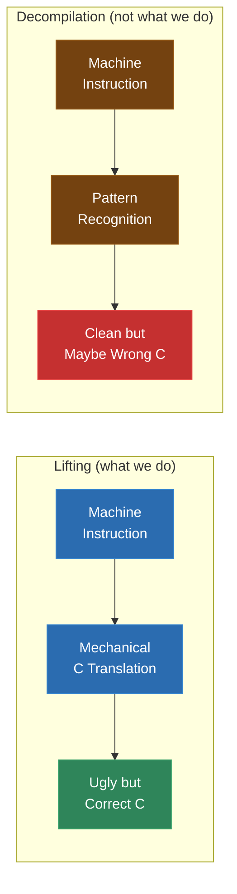
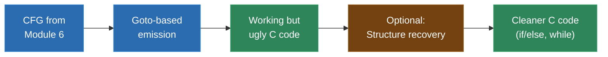
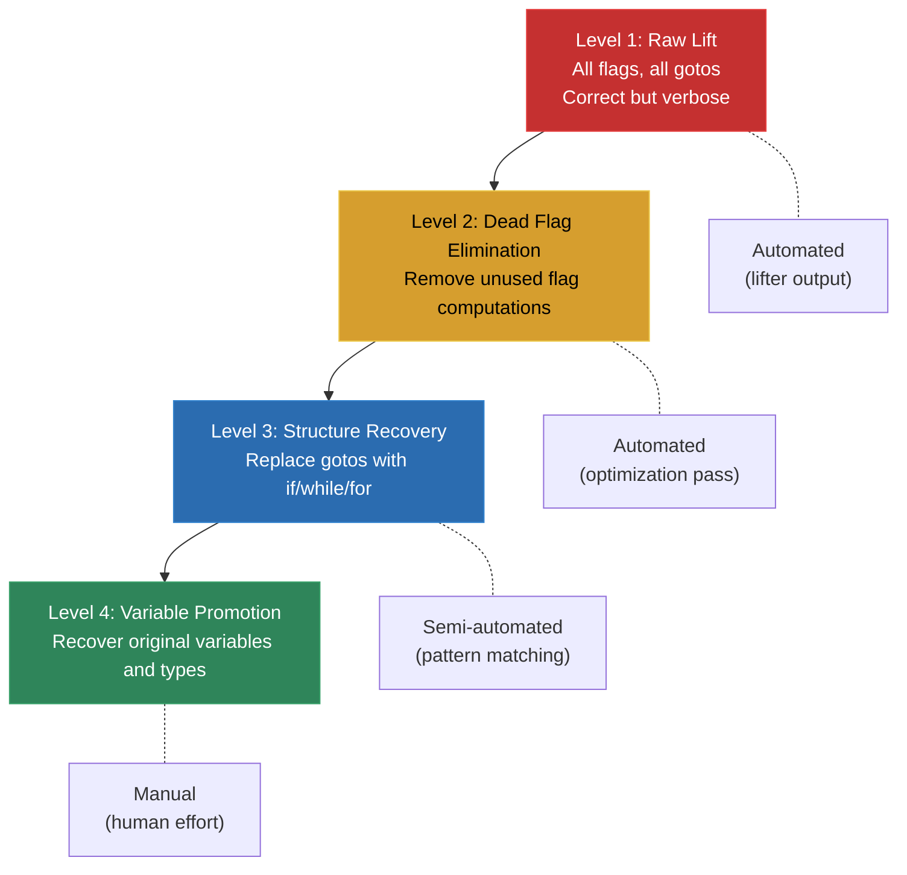
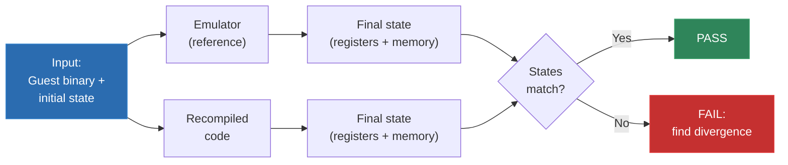

# Module 7: Instruction Lifting Fundamentals

This is where the recompiler actually does its core job: turning machine instructions into C code. Everything up to this point -- binary parsing, architecture knowledge, control-flow recovery -- was preparation. Lifting is the main event.

The term "lifting" means raising the abstraction level of code. You're taking raw machine instructions (registers, flags, memory addresses) and expressing the same computation in a higher-level language (C). The instructions go up; hence, "lifting."

This module covers the theory, mechanics, and design decisions of instruction lifting. We'll look at how to represent the guest CPU's state in C, how to translate each category of instruction, and how to handle the thorny problems that make lifting harder than it first appears. By the end, you'll understand the complete process well enough to implement a lifter for any architecture -- and in Module 8, you'll do exactly that by hand for the SM83.

---

## 1. What Lifting Is and Isn't

Let's be precise about what we mean by "lifting," because the term gets confused with "decompilation" and they are very different things.

### Lifting: Mechanical Translation

Lifting is the mechanical, instruction-by-instruction translation of machine code into C (or another high-level language). Each guest instruction becomes one or more C statements that produce exactly the same effect on the guest CPU state.

For example, the SM83 instruction `ADD A, B` becomes:

```c
{
    uint16_t result = (uint16_t)ctx->A + (uint16_t)ctx->B;
    ctx->F_Z = ((result & 0xFF) == 0);
    ctx->F_N = 0;
    ctx->F_H = ((ctx->A & 0x0F) + (ctx->B & 0x0F)) > 0x0F;
    ctx->F_C = (result > 0xFF);
    ctx->A = (uint8_t)result;
}
```

That's it. One instruction in, several C statements out. The C code is ugly, verbose, and full of casts -- but it's correct. It computes the same result, sets the same flags, and updates the same register. The C compiler can optimize the verbosity away.

### Decompilation: Recovering Intent

Decompilation is the recovery of the programmer's original intent from the compiled binary. A decompiler tries to produce C code that looks like what a human would write:

```c
// Decompiled: recognizes this as a simple addition with overflow check
a += b;
```

Decompilation requires understanding data types (is this byte an unsigned integer, a signed integer, a character, a boolean?), recognizing idioms (is this a loop? a function call through a vtable? a string copy?), and recovering control structures (if/else, while, for, switch).

Lifting doesn't do any of that. Lifting is dumb and mechanical. And that's its strength.

### Why Lifting Is the Right Approach for Recompilation

**Correctness is provable.** Each lifted instruction can be verified in isolation: does the C code produce the same register state as the original instruction? If yes, the lift is correct. You don't need to understand the program's overall logic.

**It's automatable.** Because lifting is mechanical, you can write a lifter that handles every instruction in the ISA and then apply it to any program for that architecture. A decompiler needs to understand program-level patterns, which vary between programs.

**The C compiler does the optimization.** Your lifted code will be verbose and ugly, but GCC and Clang are extremely good at optimizing away redundant operations, folding constants, eliminating dead code, and simplifying expressions. The C compiler effectively does much of the "decompilation" for you.

**It's correct by default.** Decompilation can introduce errors by misidentifying a pattern. Lifting can only be incorrect if the per-instruction template is wrong, which is easy to test.

The trade-off: lifted code is much less readable than decompiled code. But for recompilation, correctness matters more than readability. You can always clean up the output later.



### The Spectrum in Practice

In real recompiler projects, the output often sits between pure lifting and full decompilation. You might:

- Lift mechanically for correctness
- Apply peephole optimizations to clean up common patterns
- Let the C compiler optimize further
- Optionally, apply higher-level transformations (loop recovery, type inference) as a post-processing step

The `gb-recompiled` project lifts mechanically. The N64 decomp projects start from lifted output and then manually clean it up to produce decompilation-quality code (but they have the luxury of hundreds of contributors doing manual work over years). For your recompiler, start with pure lifting. You can always add optimizations later.

---

## 2. The Register Model in C

The first big design decision in any lifter is: how do you represent the guest CPU's registers in C?

Every guest instruction reads from and writes to registers. Your C code needs somewhere to put those register values. There are three common approaches, and each has trade-offs.

### Approach 1: Global Variables

The simplest approach. Each register is a global variable.

```c
/* Global register state */
uint8_t reg_A, reg_B, reg_C, reg_D, reg_E, reg_H, reg_L;
uint8_t flag_Z, flag_N, flag_H, flag_C;
uint16_t reg_SP, reg_PC;

/* Lifted code uses globals directly */
void func_0150(void) {
    reg_A = 0x05;     /* LD A, 0x05 */
    reg_B = reg_A;    /* LD B, A */
    /* ... */
}
```

**Pros:**
- Dead simple. No pointer dereferencing, no struct access, just bare variable names.
- Easy to read in the generated code.
- The C compiler can optimize global accesses well on most platforms.

**Cons:**
- No reentrancy. You can't have two instances of the guest CPU running simultaneously.
- Makes multithreading impossible without thread-local storage.
- If you want to save/restore state (for save states, debugging), you have to copy each variable individually.
- On some compilers, global variable access is slower than local variable access (because the compiler must assume globals can be modified by any function call).

**Best for:** Simple, single-threaded recompilations. Game Boy and SNES recompilers where there's exactly one CPU to emulate.

### Approach 2: Context Struct (Pointer Parameter)

Pack all registers into a struct and pass a pointer to every function.

```c
/* CPU state struct */
typedef struct {
    uint8_t A, B, C, D, E, H, L;
    uint8_t F_Z, F_N, F_H, F_C;
    uint16_t SP, PC;
    uint8_t memory[0x10000];  /* Could also be separate */
} gb_cpu_state;

/* Every function takes a context pointer */
void func_0150(gb_cpu_state *ctx) {
    ctx->A = 0x05;     /* LD A, 0x05 */
    ctx->B = ctx->A;   /* LD B, A */
    /* ... */
}
```

**Pros:**
- Reentrant. Multiple CPU instances can coexist.
- Easy save/restore: just `memcpy` the struct.
- Clean separation between CPU state and other program state.
- The C compiler can often keep the context pointer in a register for the duration of a function, making member access fast.

**Cons:**
- Slightly more verbose generated code (`ctx->A` instead of `A`).
- Every function has an extra parameter.
- The compiler might not optimize struct member access as aggressively as local variables in some cases.

**Best for:** Production recompilers. This is the most common approach and the one we'll use throughout this course.

### Approach 3: Local Variables with Sync

Map registers to local variables within each function, and synchronize with a shared state struct at function boundaries.

```c
void func_0150(gb_cpu_state *ctx) {
    /* Load registers from context at function entry */
    uint8_t A = ctx->A;
    uint8_t B = ctx->B;
    /* ... */

    A = 0x05;     /* LD A, 0x05 */
    B = A;        /* LD B, A */
    /* ... */

    /* Store registers back to context at function exit */
    ctx->A = A;
    ctx->B = B;
    /* ... */
}
```

**Pros:**
- The C compiler can keep local variables in host registers, which is the fastest possible access.
- The generated code within a function is very clean -- just bare variable names.
- The compiler has maximum optimization freedom because locals don't alias anything.

**Cons:**
- You must synchronize at every function call (store all locals to the struct before the call, reload after).
- If a function modifies registers that the caller doesn't expect, you need to track which registers are live.
- More complex code generation logic.

**Best for:** Performance-critical lifters where you've already validated correctness with a simpler approach.

### What Real Projects Use

`gb-recompiled` uses the context struct approach. Most N64 recompilers use context structs. The Cell SPU recompiler for PS3 uses a struct with 128-bit SIMD registers. Some x86 recompilers use a combination: a context struct for the main state, with frequently-accessed registers promoted to locals within hot functions.

For this course, we'll use the context struct approach exclusively. It's the right balance of simplicity, correctness, and performance.

### Designing the Context Struct

The struct should mirror the guest CPU's register file. Here's a complete SM83 context:

```c
#include <stdint.h>

typedef struct {
    /* 8-bit registers */
    uint8_t A, B, C, D, E, H, L;

    /* Flags (stored individually for easy access) */
    uint8_t F_Z;   /* Zero flag */
    uint8_t F_N;   /* Subtract flag */
    uint8_t F_H;   /* Half-carry flag */
    uint8_t F_C;   /* Carry flag */

    /* 16-bit registers */
    uint16_t SP;   /* Stack pointer */
    uint16_t PC;   /* Program counter */

    /* Interrupt state */
    uint8_t IME;   /* Interrupt master enable */
    uint8_t halted; /* CPU is halted (waiting for interrupt) */

    /* Memory (64KB address space) */
    uint8_t *memory;

    /* Bank tracking */
    uint8_t current_rom_bank;
    uint8_t current_ram_bank;

} gb_state;

/* 16-bit register pair accessors */
static inline uint16_t get_BC(gb_state *ctx) {
    return ((uint16_t)ctx->B << 8) | ctx->C;
}
static inline void set_BC(gb_state *ctx, uint16_t val) {
    ctx->B = (val >> 8) & 0xFF;
    ctx->C = val & 0xFF;
}
static inline uint16_t get_DE(gb_state *ctx) {
    return ((uint16_t)ctx->D << 8) | ctx->E;
}
static inline void set_DE(gb_state *ctx, uint16_t val) {
    ctx->D = (val >> 8) & 0xFF;
    ctx->E = val & 0xFF;
}
static inline uint16_t get_HL(gb_state *ctx) {
    return ((uint16_t)ctx->H << 8) | ctx->L;
}
static inline void set_HL(gb_state *ctx, uint16_t val) {
    ctx->H = (val >> 8) & 0xFF;
    ctx->L = val & 0xFF;
}
static inline uint16_t get_AF(gb_state *ctx) {
    uint8_t F = (ctx->F_Z << 7) | (ctx->F_N << 6)
              | (ctx->F_H << 5) | (ctx->F_C << 4);
    return ((uint16_t)ctx->A << 8) | F;
}
static inline void set_AF(gb_state *ctx, uint16_t val) {
    ctx->A = (val >> 8) & 0xFF;
    ctx->F_Z = (val >> 7) & 1;
    ctx->F_N = (val >> 6) & 1;
    ctx->F_H = (val >> 5) & 1;
    ctx->F_C = (val >> 4) & 1;
}
```

Notice that we store flags individually (`F_Z`, `F_N`, `F_H`, `F_C`) rather than packing them into a single `F` register byte. This makes flag reads and writes trivial in the lifted code -- you just assign 0 or 1. The packing/unpacking only happens when something reads or writes the `AF` register pair, which is rare (mainly `PUSH AF` / `POP AF`).

### A MIPS Context for Comparison

For N64 recompilation, the context is larger but follows the same pattern:

```c
typedef struct {
    /* 32 general-purpose registers */
    int64_t gpr[32];  /* $zero through $ra (64-bit for MIPS III) */

    /* Multiply/divide result registers */
    int64_t HI, LO;

    /* 32 floating-point registers */
    double fpr[32];    /* Can also be accessed as float pairs */

    /* Program counter */
    uint32_t PC;

    /* FPU control/status register */
    uint32_t fcr31;

    /* Memory pointer */
    uint8_t *rdram;    /* Physical RAM (4-8 MB) */
    uint32_t rdram_size;

} n64_state;

/* $zero is always 0 -- enforce this after any write */
#define GPR_WRITE(ctx, reg, val) do { \
    (ctx)->gpr[(reg)] = (val);        \
    (ctx)->gpr[0] = 0;                \
} while(0)
```

---

## 3. The Memory Model

The guest CPU sees memory through its own address space. Your C code needs to represent that address space in a way that's correct and efficient.

### Flat Array: The Simplest Model

For architectures with a small, flat address space (Game Boy: 64KB, SNES: 16MB), you can represent memory as a single byte array:

```c
/* 64KB flat address space for Game Boy */
uint8_t memory[0x10000];

/* Memory read */
static inline uint8_t mem_read(gb_state *ctx, uint16_t addr) {
    return ctx->memory[addr];
}

/* Memory write */
static inline void mem_write(gb_state *ctx, uint16_t addr, uint8_t val) {
    ctx->memory[addr] = val;
}
```

This works perfectly for simple loads and stores. But it doesn't handle the Game Boy's special memory regions: ROM (read-only), memory-mapped I/O (writes trigger hardware behavior), and bank-switched regions.

### Memory-Mapped I/O: The Complication

On almost every console, certain memory addresses aren't just memory -- they're hardware registers. Writing to address `0xFF40` on Game Boy sets the LCD control register. Writing to `0x2000` changes the ROM bank. Reading from `0xFF44` returns the current scanline.

Your memory access functions need to intercept these:

```c
static inline uint8_t mem_read(gb_state *ctx, uint16_t addr) {
    /* ROM area: straightforward read */
    if (addr < 0x4000) {
        return ctx->rom_bank0[addr];
    }
    /* Switchable ROM bank */
    else if (addr < 0x8000) {
        return ctx->rom_banks[ctx->current_rom_bank][addr - 0x4000];
    }
    /* VRAM */
    else if (addr < 0xA000) {
        return ctx->vram[addr - 0x8000];
    }
    /* External RAM (battery-backed save) */
    else if (addr < 0xC000) {
        return ctx->ext_ram[ctx->current_ram_bank][addr - 0xA000];
    }
    /* Work RAM */
    else if (addr < 0xE000) {
        return ctx->wram[addr - 0xC000];
    }
    /* I/O registers */
    else if (addr >= 0xFF00 && addr < 0xFF80) {
        return io_register_read(ctx, addr);
    }
    /* High RAM */
    else if (addr >= 0xFF80 && addr < 0xFFFF) {
        return ctx->hram[addr - 0xFF80];
    }
    /* Interrupt enable register */
    else if (addr == 0xFFFF) {
        return ctx->IE;
    }
    /* Echo RAM, OAM, etc. */
    else {
        return ctx->memory[addr];
    }
}

static inline void mem_write(gb_state *ctx, uint16_t addr, uint8_t val) {
    /* ROM area: writes go to the MBC (bank switching) */
    if (addr < 0x2000) {
        mbc_ram_enable(ctx, val);
    }
    else if (addr < 0x4000) {
        mbc_select_rom_bank(ctx, val);
    }
    else if (addr < 0x6000) {
        mbc_select_ram_bank(ctx, val);
    }
    else if (addr < 0x8000) {
        mbc_select_mode(ctx, val);
    }
    /* VRAM */
    else if (addr < 0xA000) {
        ctx->vram[addr - 0x8000] = val;
    }
    /* I/O registers */
    else if (addr >= 0xFF00 && addr < 0xFF80) {
        io_register_write(ctx, addr, val);
    }
    /* High RAM */
    else if (addr >= 0xFF80 && addr < 0xFFFF) {
        ctx->hram[addr - 0xFF80] = val;
    }
    /* ... other regions ... */
    else {
        ctx->memory[addr] = val;
    }
}
```

### Endianness

The guest and host might have different byte orders. The Game Boy (SM83) is little-endian for 16-bit values in memory. MIPS (N64) is big-endian. Your x86 or ARM host is (almost always) little-endian.

For 16-bit reads/writes on SM83 (little-endian on a little-endian host), you could just use `*(uint16_t *)&memory[addr]`. But this assumes the host is also little-endian and the address is aligned. Safer to be explicit:

```c
/* Little-endian 16-bit read (SM83) */
static inline uint16_t mem_read16(gb_state *ctx, uint16_t addr) {
    uint8_t lo = mem_read(ctx, addr);
    uint8_t hi = mem_read(ctx, addr + 1);
    return (uint16_t)lo | ((uint16_t)hi << 8);
}

/* Little-endian 16-bit write (SM83) */
static inline void mem_write16(gb_state *ctx, uint16_t addr, uint16_t val) {
    mem_write(ctx, addr, val & 0xFF);
    mem_write(ctx, addr + 1, (val >> 8) & 0xFF);
}

/* Big-endian 32-bit read (MIPS) */
static inline uint32_t mem_read32_be(n64_state *ctx, uint32_t addr) {
    uint32_t offset = addr & 0x00FFFFFF;  /* Physical address mask */
    uint8_t *p = &ctx->rdram[offset];
    return ((uint32_t)p[0] << 24) | ((uint32_t)p[1] << 16)
         | ((uint32_t)p[2] << 8)  | (uint32_t)p[3];
}
```

### Bank-Switched Memory

On the Game Boy, the ROM region `0x4000-0x7FFF` can contain any of the ROM's banks. The SNES has a more complex 24-bit address space with many bank configurations. The key principle:

**The memory model must reflect the guest's view of memory, not the host's physical layout.**

When the guest reads address `0x5000`, your memory read function must know which bank is currently mapped at that address and return the correct byte. The bank state is part of the CPU context.

For the recompiled code, memory accesses look the same regardless of banking:

```c
/* This lifted code works regardless of which bank is active,
   because mem_read() handles the bank lookup internally. */
ctx->A = mem_read(ctx, 0x5000);  /* LD A, [0x5000] */
```

The complexity is hidden inside `mem_read()` and `mem_write()`. The lifted code doesn't need to know about banks -- it just accesses addresses.

### N64 Memory Model: Address Translation

The N64's MIPS CPU uses virtual addresses that map to physical RAM through different segments:

```c
static inline uint32_t virt_to_phys(uint32_t vaddr) {
    /* kseg0: cached, unmapped (0x80000000-0x9FFFFFFF) */
    if (vaddr >= 0x80000000 && vaddr < 0xA0000000) {
        return vaddr - 0x80000000;
    }
    /* kseg1: uncached, unmapped (0xA0000000-0xBFFFFFFF) */
    else if (vaddr >= 0xA0000000 && vaddr < 0xC0000000) {
        return vaddr - 0xA0000000;
    }
    /* kuseg: user space, TLB-mapped (0x00000000-0x7FFFFFFF) */
    else {
        return tlb_translate(vaddr);  /* Rarely used by games */
    }
}

static inline uint32_t n64_mem_read32(n64_state *ctx, uint32_t vaddr) {
    uint32_t paddr = virt_to_phys(vaddr);

    /* RDRAM */
    if (paddr < ctx->rdram_size) {
        return read32_be(&ctx->rdram[paddr]);
    }
    /* Memory-mapped I/O (RSP, RDP, MI, VI, AI, PI, SI) */
    else if (paddr >= 0x04000000 && paddr < 0x05000000) {
        return mmio_read(ctx, paddr);
    }
    /* Cartridge ROM */
    else if (paddr >= 0x10000000 && paddr < 0x1FC00000) {
        return read32_be(&ctx->cart_rom[paddr - 0x10000000]);
    }

    return 0;  /* Open bus */
}
```

---

## 4. Lifting Arithmetic Instructions

Arithmetic instructions are the bread and butter of any lifter. They're also where you first encounter the flag computation problem.

### Simple Cases: ADD, SUB

On SM83, `ADD A, B` adds register B to register A, storing the result in A and updating all four flags:

```c
/* SM83: ADD A, B (opcode 0x80) */
{
    uint16_t result = (uint16_t)ctx->A + (uint16_t)ctx->B;
    ctx->F_Z = ((result & 0xFF) == 0);                       /* Zero */
    ctx->F_N = 0;                                             /* Not subtract */
    ctx->F_H = ((ctx->A & 0x0F) + (ctx->B & 0x0F)) > 0x0F;  /* Half-carry */
    ctx->F_C = (result > 0xFF);                               /* Carry */
    ctx->A = (uint8_t)result;
}
```

Notice:
- We use `uint16_t` for the intermediate result so we can detect carry (overflow past 8 bits).
- The half-carry flag requires checking carry from bit 3 to bit 4, which means masking to the lower nibble.
- The flags are computed from the operands and result, not from the stored value of A (we compute flags before truncating).

`SUB B` (subtract B from A) is similar:

```c
/* SM83: SUB B (opcode 0x90) */
{
    uint16_t result = (uint16_t)ctx->A - (uint16_t)ctx->B;
    ctx->F_Z = ((result & 0xFF) == 0);
    ctx->F_N = 1;                                              /* Subtract */
    ctx->F_H = ((ctx->A & 0x0F) - (ctx->B & 0x0F)) < 0;      /* Half-borrow */
    ctx->F_C = (ctx->B > ctx->A);                              /* Borrow */
    ctx->A = (uint8_t)result;
}
```

### Add/Subtract with Carry: ADC, SBC

These use the carry flag as an additional input:

```c
/* SM83: ADC A, B (opcode 0x88) */
{
    uint8_t carry = ctx->F_C;
    uint16_t result = (uint16_t)ctx->A + (uint16_t)ctx->B + carry;
    ctx->F_Z = ((result & 0xFF) == 0);
    ctx->F_N = 0;
    ctx->F_H = ((ctx->A & 0x0F) + (ctx->B & 0x0F) + carry) > 0x0F;
    ctx->F_C = (result > 0xFF);
    ctx->A = (uint8_t)result;
}
```

### 16-bit Arithmetic

SM83 has 16-bit add instructions: `ADD HL, BC`, `ADD HL, DE`, etc. These update only the N, H, and C flags (Z is unaffected):

```c
/* SM83: ADD HL, BC (opcode 0x09) */
{
    uint16_t hl = get_HL(ctx);
    uint16_t bc = get_BC(ctx);
    uint32_t result = (uint32_t)hl + (uint32_t)bc;
    ctx->F_N = 0;
    ctx->F_H = ((hl & 0x0FFF) + (bc & 0x0FFF)) > 0x0FFF;  /* Carry from bit 11 */
    ctx->F_C = (result > 0xFFFF);
    set_HL(ctx, (uint16_t)result);
    /* Note: F_Z is NOT affected by 16-bit ADD */
}
```

### INC and DEC

These are special because they don't affect the carry flag:

```c
/* SM83: INC B (opcode 0x04) */
{
    uint8_t result = ctx->B + 1;
    ctx->F_Z = (result == 0);
    ctx->F_N = 0;
    ctx->F_H = ((ctx->B & 0x0F) + 1) > 0x0F;
    /* F_C is NOT affected */
    ctx->B = result;
}

/* SM83: DEC B (opcode 0x05) */
{
    uint8_t result = ctx->B - 1;
    ctx->F_Z = (result == 0);
    ctx->F_N = 1;
    ctx->F_H = (ctx->B & 0x0F) == 0;  /* Borrow from bit 4 */
    /* F_C is NOT affected */
    ctx->B = result;
}
```

### MIPS Arithmetic: Simpler (No Flags!)

MIPS doesn't have a flags register. Arithmetic instructions just compute results:

```c
/* MIPS: ADDU $t0, $t1, $t2 */
ctx->gpr[8] = (int32_t)((int32_t)ctx->gpr[9] + (int32_t)ctx->gpr[10]);
ctx->gpr[0] = 0;  /* $zero is always 0 */

/* MIPS: ADDIU $t0, $t1, 0x100 */
ctx->gpr[8] = (int32_t)((int32_t)ctx->gpr[9] + 0x100);
ctx->gpr[0] = 0;

/* MIPS: MULTU $t0, $t1 -- result goes to HI:LO */
{
    uint64_t result = (uint64_t)(uint32_t)ctx->gpr[8]
                    * (uint64_t)(uint32_t)ctx->gpr[9];
    ctx->LO = (int32_t)(result & 0xFFFFFFFF);
    ctx->HI = (int32_t)(result >> 32);
}
```

The absence of flags makes MIPS much easier to lift than SM83 or x86. There's no flag computation boilerplate -- just the actual computation.

### x86 Arithmetic: The Worst Case

x86 has the most complex flag behavior. A single `ADD EAX, EBX` instruction updates six flags (CF, PF, AF, ZF, SF, OF), each with different computation rules:

```c
/* x86: ADD EAX, EBX */
{
    uint32_t a = ctx->eax;
    uint32_t b = ctx->ebx;
    uint64_t result64 = (uint64_t)a + (uint64_t)b;
    uint32_t result = (uint32_t)result64;

    ctx->CF = (result64 > 0xFFFFFFFF);              /* Carry */
    ctx->PF = parity_table[result & 0xFF];           /* Parity of low byte */
    ctx->AF = ((a & 0x0F) + (b & 0x0F)) > 0x0F;     /* Auxiliary carry */
    ctx->ZF = (result == 0);                          /* Zero */
    ctx->SF = (result >> 31) & 1;                     /* Sign */
    ctx->OF = ((a ^ result) & (b ^ result)) >> 31;    /* Overflow */

    ctx->eax = result;
}
```

Six flags, each with a different formula. And every arithmetic and logic instruction updates some subset of them. This is why x86 is the hardest architecture to lift correctly.

---

## 5. The Flag Problem

CPU flags are the single biggest headache in instruction lifting. Let's look at why, and what you can do about it.

### Why Flags Are Hard

Most architectures have a flags/status register that tracks metadata about the last arithmetic or logic operation: was the result zero? Did it overflow? Was there a carry? Was there a borrow from bit 3 to bit 4?

The problem is threefold:

**Every instruction sets flags.** On SM83, almost every arithmetic and logic instruction updates some or all of the Z, N, H, and C flags. On x86, it's even worse -- most instructions update six flags.

**Flags are usually dead.** Most of the time, the flags set by an instruction are never used. The next arithmetic instruction will overwrite them. But you can't know this without liveness analysis, and even then you need to be conservative.

**Flags are hard to compute.** The half-carry flag on SM83 requires checking carry between specific bit positions. The parity flag on x86 requires counting set bits in the low byte. The overflow flag on x86 requires checking whether two's complement overflow occurred, which has a non-obvious formula.

### Strategy 1: Compute Everything (Brute Force)

The simplest strategy: compute every flag for every instruction, every time. This is what the code examples above do.

```c
/* Every ADD instruction computes all four flags */
ctx->F_Z = ((result & 0xFF) == 0);
ctx->F_N = 0;
ctx->F_H = ((ctx->A & 0x0F) + (ctx->B & 0x0F)) > 0x0F;
ctx->F_C = (result > 0xFF);
```

**Pros:** Always correct. Simple to implement.

**Cons:** Wastes computation. If the next instruction also sets all flags, the flag computation for this instruction was pointless.

**Reality check:** The C compiler is very good at dead code elimination. If you compute `ctx->F_Z` and nothing reads it before it's overwritten, the compiler will optimize away the computation. So in practice, the "waste" is often eliminated automatically.

This is the recommended approach for a first implementation. Let the compiler optimize. Only get clever if profiling shows flag computation is actually a bottleneck (it rarely is).

### Strategy 2: Lazy Flag Evaluation

Instead of computing flags immediately, store the operands and compute flags only when they're actually read.

```c
/* Instead of computing flags, store the operation info */
typedef struct {
    uint8_t op_type;     /* ADD, SUB, INC, DEC, etc. */
    uint16_t operand_a;
    uint16_t operand_b;
    uint16_t result;
} lazy_flags;

/* On ADD: */
ctx->lazy.op_type = OP_ADD;
ctx->lazy.operand_a = ctx->A;
ctx->lazy.operand_b = ctx->B;
ctx->lazy.result = ctx->A + ctx->B;
ctx->A = (uint8_t)ctx->lazy.result;

/* On flag read (e.g., JR Z): */
static inline uint8_t get_Z_flag(gb_state *ctx) {
    switch (ctx->lazy.op_type) {
        case OP_ADD:
        case OP_SUB:
            return (ctx->lazy.result & 0xFF) == 0;
        case OP_INC:
            return (ctx->lazy.result & 0xFF) == 0;
        /* ... */
    }
}
```

**Pros:** Only computes flags that are actually used. Can be faster for architectures with many flags (x86).

**Cons:** Complex implementation. The flag-read function has a switch statement that the compiler can't easily optimize. Each flag-reading instruction incurs overhead from the dispatch. Not worth it for SM83 (only 4 flags, cheap to compute).

**Best for:** x86 recompilers where computing 6 flags for every instruction is genuinely expensive and most flags are dead.

### Strategy 3: Dead Flag Elimination (Static Analysis)

Analyze the CFG to determine which flag computations are dead (overwritten before being read). Only emit flag computation code when the flag is actually live.

```python
def dead_flag_elimination(cfg, flag_name):
    """Remove flag computations where the flag is dead."""
    for block in cfg.blocks.values():
        # Walk instructions backward
        flag_live = False  # Is the flag live at this point?

        for insn in reversed(block.instructions):
            if reads_flag(insn, flag_name):
                flag_live = True
            if writes_flag(insn, flag_name):
                if not flag_live:
                    mark_flag_computation_dead(insn, flag_name)
                flag_live = False
```

**Pros:** Produces cleaner, faster output. No runtime overhead.

**Cons:** Requires liveness analysis, which requires a correct CFG. Must be conservative at function boundaries (assume all flags are live on entry and exit because the caller might read them).

**Best for:** Optimization pass after the initial lift is working. Don't start with this -- start with Strategy 1 and add this later.

### The Half-Carry Flag: SM83's Unique Headache

The SM83's half-carry flag (H) tracks carry from bit 3 to bit 4. No modern CPU exposes this natively, so it must always be computed explicitly:

```c
/* Half-carry for ADD */
ctx->F_H = ((ctx->A & 0x0F) + (operand & 0x0F)) > 0x0F;

/* Half-carry for SUB */
ctx->F_H = (ctx->A & 0x0F) < (operand & 0x0F);

/* Half-carry for INC */
ctx->F_H = (ctx->B & 0x0F) == 0x0F;  /* Lower nibble was 0xF, incrementing carries */

/* Half-carry for DEC */
ctx->F_H = (ctx->B & 0x0F) == 0x00;  /* Lower nibble was 0x0, decrementing borrows */
```

The half-carry flag is primarily used by the `DAA` (Decimal Adjust Accumulator) instruction, which converts the result of binary arithmetic into BCD (binary-coded decimal). If the game doesn't use BCD, the H flag computations are almost always dead. But you can't know that without analyzing the whole program, so you compute them anyway (and let the C compiler dead-code-eliminate them if possible).

---

## 6. Lifting Loads and Stores

Memory access instructions move data between registers and the guest's address space.

### Simple Loads

```c
/* SM83: LD A, [HL] -- Load byte from address in HL into A */
ctx->A = mem_read(ctx, get_HL(ctx));

/* SM83: LD A, [0xFF10] -- Load from absolute address */
ctx->A = mem_read(ctx, 0xFF10);

/* SM83: LD A, [BC] -- Load from address in BC */
ctx->A = mem_read(ctx, get_BC(ctx));

/* SM83: LD A, [HL+] -- Load from HL, then increment HL */
{
    uint16_t addr = get_HL(ctx);
    ctx->A = mem_read(ctx, addr);
    set_HL(ctx, addr + 1);
}

/* SM83: LD A, [HL-] -- Load from HL, then decrement HL */
{
    uint16_t addr = get_HL(ctx);
    ctx->A = mem_read(ctx, addr);
    set_HL(ctx, addr - 1);
}
```

### Simple Stores

```c
/* SM83: LD [HL], A -- Store A at address in HL */
mem_write(ctx, get_HL(ctx), ctx->A);

/* SM83: LD [0xC000], A -- Store A at absolute address */
mem_write(ctx, 0xC000, ctx->A);

/* SM83: LD [HL], 0x42 -- Store immediate at address in HL */
mem_write(ctx, get_HL(ctx), 0x42);
```

### 16-bit Loads and Stores

```c
/* SM83: LD BC, 0x1234 -- Load 16-bit immediate */
set_BC(ctx, 0x1234);

/* SM83: LD SP, HL -- Copy HL to SP */
ctx->SP = get_HL(ctx);

/* SM83: LD [0xC100], SP -- Store SP at address (16-bit store) */
mem_write16(ctx, 0xC100, ctx->SP);
```

### MIPS Loads and Stores

MIPS loads and stores have alignment requirements. `LW` (load word) requires 4-byte alignment. `LH` (load halfword) requires 2-byte alignment. Unaligned access causes an exception.

```c
/* MIPS: LW $t0, 16($sp) -- Load 32-bit word from stack */
{
    uint32_t addr = (uint32_t)((int32_t)ctx->gpr[29] + 16);  /* $sp + 16 */
    ctx->gpr[8] = (int32_t)n64_mem_read32(ctx, addr);
    ctx->gpr[0] = 0;
}

/* MIPS: LBU $t0, 0($a0) -- Load unsigned byte */
{
    uint32_t addr = (uint32_t)ctx->gpr[4];  /* $a0 */
    ctx->gpr[8] = (int64_t)(uint8_t)n64_mem_read8(ctx, addr);
    ctx->gpr[0] = 0;
}

/* MIPS: SW $ra, 28($sp) -- Store 32-bit word to stack */
{
    uint32_t addr = (uint32_t)((int32_t)ctx->gpr[29] + 28);
    n64_mem_write32(ctx, addr, (uint32_t)ctx->gpr[31]);  /* $ra */
}

/* MIPS: SH $t0, 0($a0) -- Store halfword */
{
    uint32_t addr = (uint32_t)ctx->gpr[4];
    n64_mem_write16(ctx, addr, (uint16_t)ctx->gpr[8]);
}
```

### LDH: High-RAM Access on Game Boy

The SM83 has special instructions for accessing the 0xFF00-0xFFFF range (I/O registers and high RAM):

```c
/* SM83: LDH A, [0xFF00+n] -- also written as LD A, [$FF00+n] */
ctx->A = mem_read(ctx, 0xFF00 + imm8);

/* SM83: LDH [0xFF00+n], A */
mem_write(ctx, 0xFF00 + imm8, ctx->A);

/* SM83: LD A, [0xFF00+C] -- also written as LDH A, [C] */
ctx->A = mem_read(ctx, 0xFF00 + ctx->C);

/* SM83: LD [0xFF00+C], A */
mem_write(ctx, 0xFF00 + ctx->C, ctx->A);
```

These are important because they're the primary way to access I/O hardware -- the joypad, serial port, timer, interrupt flags, sound registers, and LCD controller.

---

## 7. Lifting Branches and Control Flow

Control flow is where the lifted code takes shape. The guest program's branches, jumps, and conditional execution must be expressed in C.

### Approach 1: Goto-Based Emission

The most straightforward approach: translate every branch into a `goto`. Each basic block gets a label. Branch instructions become `goto label;` and conditional branches become `if (condition) goto label;`.

```c
void func_0150(gb_state *ctx) {
block_0150:
    ctx->A = 0x05;                              /* LD A, 0x05 */
    ctx->B = ctx->A;                            /* LD B, A */
    {   /* CP 0x03 */
        uint16_t result = (uint16_t)ctx->A - 3;
        ctx->F_Z = ((result & 0xFF) == 0);
        ctx->F_N = 1;
        ctx->F_H = (ctx->A & 0x0F) < (3 & 0x0F);
        ctx->F_C = (3 > ctx->A);
    }
    if (!ctx->F_Z) goto block_015B;             /* JR NZ, 0x015B */

block_0157:
    ctx->A = 0xFF;                              /* LD A, 0xFF */
    goto block_015D;                            /* JR 0x015D */

block_015B:
    ctx->A = 0x01;                              /* LD A, 0x01 */
    /* fall through to block_015D */

block_015D:
    mem_write(ctx, get_HL(ctx), ctx->A);        /* LD [HL], A */
    return;                                      /* RET */
}
```

**Pros:**
- Correct by construction. Every branch becomes a goto, every fall-through is implicit.
- Maps directly to the CFG structure.
- Easy to generate mechanically.
- The C compiler handles the rest -- it can convert goto-based code to structured code (if/else, loops) during optimization.

**Cons:**
- The generated code looks ugly with all the goto statements.
- Some C compilers (especially older ones) optimize goto-heavy code less well than structured code.
- Static analysis tools and code reviewers may complain about goto usage.

**This is the recommended approach for a first implementation.** It's simple, correct, and the C compiler optimizes it well. Don't try to recover structured control flow until you have a working goto-based lifter.

### Conditional Branch Patterns

SM83 has four condition codes: Z (zero), NZ (not zero), C (carry), NC (not carry).

```c
/* JR Z, offset -- Jump if zero flag set */
if (ctx->F_Z) goto target_label;

/* JR NZ, offset -- Jump if zero flag clear */
if (!ctx->F_Z) goto target_label;

/* JR C, offset -- Jump if carry flag set */
if (ctx->F_C) goto target_label;

/* JR NC, offset -- Jump if carry flag clear */
if (!ctx->F_C) goto target_label;

/* JP Z, addr -- same conditions, absolute jump */
if (ctx->F_Z) goto target_label;

/* CALL NZ, addr -- conditional call */
if (!ctx->F_Z) { func_target(ctx); }

/* RET Z -- conditional return */
if (ctx->F_Z) return;
```

### Approach 2: Structured Emission (Advanced)

Instead of emitting gotos, try to recover structured control flow (if/else, while, for, switch) from the CFG. This produces more readable output.

```c
/* Structured version of the same code */
void func_0150(gb_state *ctx) {
    ctx->A = 0x05;
    ctx->B = ctx->A;
    /* CP 0x03 + flag computation */

    if (ctx->F_Z) {
        ctx->A = 0xFF;
    } else {
        ctx->A = 0x01;
    }

    mem_write(ctx, get_HL(ctx), ctx->A);
}
```

This is much nicer to read, but recovering the structure requires:
- Dominator tree computation on the CFG
- Loop detection (back edges in the dominator tree)
- If/else pattern matching (diamond shapes in the CFG)
- Switch statement detection (multi-way branches)

This is a significant amount of work, and it's not necessary for correctness. Treat it as an optimization pass you add later, not a requirement for the first version.



### Handling Indirect Jumps in Lifted Code

When the CFG contains an indirect branch with known targets (from jump table recovery), emit a `switch`:

```c
/* JP (HL) with recovered jump table targets */
{
    uint16_t target = get_HL(ctx);
    switch (target) {
        case 0x2020: goto block_2020;
        case 0x2030: goto block_2030;
        case 0x2040: goto block_2040;
        default:
            /* Unknown target -- runtime error or fallback */
            fprintf(stderr, "Unknown JP (HL) target: 0x%04X\n", target);
            abort();
    }
}
```

---

## 8. Lifting Function Calls and Returns

Function calls involve several coordinated operations: saving the return address, transferring control, and (on return) restoring the program counter.

### SM83 CALL and RET

```c
/* SM83: CALL 0x1234 */
{
    /* Push return address (address after the CALL instruction) */
    ctx->SP -= 2;
    mem_write16(ctx, ctx->SP, 0x0158);  /* Address of next instruction */
    /* Transfer control to target */
    func_1234(ctx);
}

/* SM83: RET */
{
    /* Pop return address from stack */
    /* (In goto-based code, this is just 'return') */
    return;
}
```

Wait -- should the CALL push the return address and then call the C function? Or should the C function just be a regular C function call?

This depends on your calling convention model:

**Option A: Inline stack push, then C function call.**

```c
/* CALL 0x1234: push return address, then call */
ctx->SP -= 2;
mem_write16(ctx, ctx->SP, RETURN_ADDR);
func_1234(ctx);
/* When func_1234 returns (via its C 'return'), execution continues here */
```

This models the stack faithfully. The guest function's `RET` doesn't actually need to pop the stack -- it just does a C `return`. But wait, that means RET doesn't match the semantics. If the guest code does `POP` before `RET`, the stack pointer will be wrong.

**Option B: Let the guest function manage its own stack.**

```c
/* CALL 0x1234 */
ctx->SP -= 2;
mem_write16(ctx, ctx->SP, RETURN_ADDR);
func_1234(ctx);
/* func_1234 internally does RET, which pops the return address */
/* But we don't use the popped address -- we just return to C caller */
```

Inside `func_1234`:

```c
void func_1234(gb_state *ctx) {
    /* ... function body ... */

    /* RET: pop the return address (discarded) and return to C caller */
    ctx->SP += 2;  /* Pop the 16-bit return address */
    return;
}
```

This approach is used by `gb-recompiled`. The `CALL` pushes the return address and calls the C function. The `RET` pops the return address (adjusting SP) and does a C `return`. The popped value isn't used for control flow (the C calling convention handles that), but SP is kept in sync.

### Conditional Calls and Returns

```c
/* SM83: CALL NZ, 0x1234 */
if (!ctx->F_Z) {
    ctx->SP -= 2;
    mem_write16(ctx, ctx->SP, RETURN_ADDR);
    func_1234(ctx);
}

/* SM83: RET Z */
if (ctx->F_Z) {
    ctx->SP += 2;  /* Pop return address */
    return;
}
```

### RST: Fast Calls to Fixed Addresses

```c
/* SM83: RST 0x38 */
ctx->SP -= 2;
mem_write16(ctx, ctx->SP, RETURN_ADDR);
func_0038(ctx);  /* RST targets are at fixed addresses */
```

### MIPS Function Calls

MIPS uses `JAL` (jump and link) which stores the return address in the `$ra` register (register 31), not on the stack:

```c
/* MIPS: JAL 0x80004000 */
ctx->gpr[31] = 0x80001008;  /* Return address (PC + 8, past delay slot) */
/* Execute delay slot instruction here */
func_80004000(ctx);

/* MIPS: JR $ra (return) */
return;
```

The MIPS calling convention has the callee save `$ra` to the stack if it makes further calls. The recompiler doesn't need to model this explicitly -- the lifted code for the callee will contain the `SW $ra, offset($sp)` and `LW $ra, offset($sp)` instructions that handle it.

### Stack Frame Management

On SM83, there's no frame pointer convention. The stack pointer is used directly:

```c
/* Prologue: save registers */
ctx->SP -= 2;
mem_write16(ctx, ctx->SP, get_BC(ctx));  /* PUSH BC */
ctx->SP -= 2;
mem_write16(ctx, ctx->SP, get_DE(ctx));  /* PUSH DE */

/* Epilogue: restore registers */
set_DE(ctx, mem_read16(ctx, ctx->SP));   /* POP DE */
ctx->SP += 2;
set_BC(ctx, mem_read16(ctx, ctx->SP));   /* POP BC */
ctx->SP += 2;
```

On MIPS, stack frames are more structured:

```c
/* MIPS function prologue */
ctx->gpr[29] = (int32_t)ctx->gpr[29] - 32;          /* ADDIU $sp, $sp, -32 */
n64_mem_write32(ctx, (uint32_t)ctx->gpr[29] + 28,
                (uint32_t)ctx->gpr[31]);               /* SW $ra, 28($sp) */
n64_mem_write32(ctx, (uint32_t)ctx->gpr[29] + 24,
                (uint32_t)ctx->gpr[16]);               /* SW $s0, 24($sp) */

/* MIPS function epilogue */
ctx->gpr[31] = (int32_t)n64_mem_read32(ctx,
                (uint32_t)ctx->gpr[29] + 28);          /* LW $ra, 28($sp) */
ctx->gpr[16] = (int32_t)n64_mem_read32(ctx,
                (uint32_t)ctx->gpr[29] + 24);          /* LW $s0, 24($sp) */
ctx->gpr[29] = (int32_t)ctx->gpr[29] + 32;            /* ADDIU $sp, $sp, 32 */
ctx->gpr[0] = 0;
return;                                                 /* JR $ra */
```

---

## 9. Handling Special Instructions

Every ISA has instructions that don't fit neatly into the arithmetic/logic/branch/memory categories. Here's how to handle the common ones.

### NOP (No Operation)

```c
/* SM83: NOP (opcode 0x00) */
/* Nothing. Emit nothing or emit a comment. */
/* nop */

/* MIPS: NOP (encoded as SLL $zero, $zero, 0) */
/* Nothing. Often used in delay slots. */
```

NOPs produce no output. You might want to emit a comment for debugging, but in production output, skip them entirely.

### HALT

```c
/* SM83: HALT (opcode 0x76) */
/* CPU stops executing until an interrupt occurs */
ctx->halted = 1;
return;  /* Control returns to the main loop, which checks for interrupts */
```

In a recompiled game, `HALT` means "wait for the next VBlank interrupt." Your runtime loop needs to handle this:

```c
/* Main loop */
while (running) {
    if (!ctx->halted) {
        /* Call the current function */
        dispatch(ctx);
    }

    /* Process interrupts (VBlank, timer, etc.) */
    if (interrupt_pending(ctx)) {
        ctx->halted = 0;
        handle_interrupt(ctx);
    }

    /* Advance frame timing */
    advance_timing(ctx);
}
```

### DI and EI (Disable/Enable Interrupts)

```c
/* SM83: DI -- Disable interrupts */
ctx->IME = 0;

/* SM83: EI -- Enable interrupts (effective after the next instruction) */
ctx->IME_pending = 1;  /* Actually enables after the next instruction */
```

The "effective after the next instruction" behavior of `EI` is a subtlety that many emulators get wrong. For recompilation, you need to track this delayed enable.

### STOP

```c
/* SM83: STOP (opcode 0x10) -- Enter low-power mode */
/* On original hardware, this waits for a button press */
/* On CGB, it's used to switch CPU speed */
ctx->stopped = 1;
handle_stop(ctx);  /* Runtime-specific behavior */
```

### System Calls (MIPS)

```c
/* MIPS: SYSCALL -- Trigger a system call exception */
handle_syscall(ctx);

/* MIPS: BREAK -- Trigger a breakpoint exception */
handle_break(ctx);
```

On N64, SYSCALL is used by the OS for thread management, memory allocation, and other kernel services. Your runtime needs to implement the relevant OS calls.

### Coprocessor Instructions

MIPS has coprocessor instructions for the FPU (COP1) and the system coprocessor (COP0):

```c
/* MIPS: MFC0 $t0, $Count -- Read the cycle counter */
ctx->gpr[8] = (int32_t)ctx->cop0_count;
ctx->gpr[0] = 0;

/* MIPS: MTC0 $t0, $Status -- Write the status register */
ctx->cop0_status = (uint32_t)ctx->gpr[8];
handle_status_change(ctx);  /* May affect interrupt behavior */
```

### DAA (Decimal Adjust Accumulator) on SM83

This is one of the trickiest instructions. It adjusts the accumulator after a BCD arithmetic operation:

```c
/* SM83: DAA */
{
    int16_t a = ctx->A;

    if (ctx->F_N) {
        /* After subtraction */
        if (ctx->F_H) a -= 0x06;
        if (ctx->F_C) a -= 0x60;
    } else {
        /* After addition */
        if (ctx->F_H || (a & 0x0F) > 0x09) a += 0x06;
        if (ctx->F_C || a > 0x9F) {
            a += 0x60;
            ctx->F_C = 1;
        }
    }

    ctx->A = (uint8_t)(a & 0xFF);
    ctx->F_Z = (ctx->A == 0);
    ctx->F_H = 0;
    /* F_N is not affected */
    /* F_C is set above if adjustment crossed 0x99 */
}
```

DAA depends on the N and H flags from the previous operation. This is one of the few places where the half-carry flag is actually consumed, which means you can't skip its computation.

### SWAP (SM83 CB-prefix)

Swaps the upper and lower nibbles of a register:

```c
/* SM83: SWAP A (opcode CB 37) */
ctx->A = ((ctx->A & 0x0F) << 4) | ((ctx->A & 0xF0) >> 4);
ctx->F_Z = (ctx->A == 0);
ctx->F_N = 0;
ctx->F_H = 0;
ctx->F_C = 0;
```

---

## 10. The Generated Code Quality Spectrum

Not all lifted code is created equal. There's a spectrum from "correct but ugly" to "readable and optimized," and where you land depends on how much effort you put into post-processing.

### Level 1: Raw Lift (Correct but Ugly)

Every instruction is translated literally. All flags are computed. No optimization.

```c
void func_0200(gb_state *ctx) {
block_0200:
    ctx->A = 0x00;                          /* XOR A */
    ctx->F_Z = 1;
    ctx->F_N = 0;
    ctx->F_H = 0;
    ctx->F_C = 0;
    ctx->B = 0x0A;                          /* LD B, 0x0A */
block_0204:
    {                                       /* ADD A, B */
        uint16_t r = (uint16_t)ctx->A + (uint16_t)ctx->B;
        ctx->F_Z = ((r & 0xFF) == 0);
        ctx->F_N = 0;
        ctx->F_H = ((ctx->A & 0x0F) + (ctx->B & 0x0F)) > 0x0F;
        ctx->F_C = (r > 0xFF);
        ctx->A = (uint8_t)r;
    }
    {                                       /* DEC B */
        uint8_t r = ctx->B - 1;
        ctx->F_Z = (r == 0);
        ctx->F_N = 1;
        ctx->F_H = (ctx->B & 0x0F) == 0;
        ctx->B = r;
    }
    if (!ctx->F_Z) goto block_0204;         /* JR NZ */
    return;                                  /* RET */
}
```

This is a loop that computes `A = 10 + 9 + 8 + ... + 1 = 55`. The raw lift is correct but obscures the intent completely.

### Level 2: Dead Flag Elimination

Remove flag computations that are never used:

```c
void func_0200(gb_state *ctx) {
block_0200:
    ctx->A = 0x00;
    ctx->B = 0x0A;
block_0204:
    ctx->A = ctx->A + ctx->B;               /* Flags from ADD are dead */
    ctx->B = ctx->B - 1;
    ctx->F_Z = (ctx->B == 0);               /* Only Z flag from DEC is live */
    if (!ctx->F_Z) goto block_0204;
    return;
}
```

### Level 3: Structure Recovery

Convert gotos to structured control flow:

```c
void func_0200(gb_state *ctx) {
    ctx->A = 0x00;
    ctx->B = 0x0A;
    do {
        ctx->A = ctx->A + ctx->B;
        ctx->B = ctx->B - 1;
    } while (ctx->B != 0);
    return;
}
```

### Level 4: Variable Promotion (Manual or Advanced Analysis)

Replace register accesses with meaningful local variables:

```c
uint8_t sum_1_to_10(void) {
    uint8_t sum = 0;
    uint8_t i = 10;
    do {
        sum += i;
        i--;
    } while (i != 0);
    return sum;
}
```

Level 4 is essentially decompilation. Reaching it automatically is very hard; reaching it manually (as the N64 decomp projects do) takes enormous human effort. For recompilation, Level 1 or Level 2 is perfectly adequate -- the C compiler optimizes the rest.



### What the C Compiler Does for You

A key insight: the C compiler is already an incredible optimizer. Feed it Level 1 code and it produces machine code comparable to Level 2 or Level 3. The compiler:

- **Eliminates dead stores.** Flag computations that are overwritten before being read are removed.
- **Propagates constants.** If `ctx->A = 0x05` is followed by code that reads `ctx->A`, the compiler substitutes 5 directly.
- **Folds expressions.** `(uint16_t)ctx->A + (uint16_t)ctx->B` is optimized to a single ADD instruction on the host.
- **Recognizes patterns.** The compiler can convert goto-based loops into native loops with proper loop optimizations.

This is why lifting to C is so powerful. You don't need a perfect lifter -- you need a correct one, and the C compiler handles the rest.

---

## 11. Testing Lifted Code

How do you know your lifted code is correct? By comparing it against a known-good reference -- an emulator.

### The Testing Strategy



1. Choose a guest function (or a short instruction sequence).
2. Set up initial CPU state (register values, memory contents).
3. Execute the function in a trusted emulator (BGB for Game Boy, Project64 for N64).
4. Execute the same function in your recompiled C code.
5. Compare the final CPU state: all registers, all flags, and any memory that was written.
6. If they match, the lift is correct. If not, find the first divergence.

### Per-Instruction Testing

The most granular test: execute one instruction at a time and compare state after each.

```c
#include <assert.h>
#include <string.h>

typedef struct {
    uint8_t A, B, C, D, E, H, L;
    uint8_t F_Z, F_N, F_H, F_C;
    uint16_t SP;
} cpu_snapshot;

void snapshot(gb_state *ctx, cpu_snapshot *snap) {
    snap->A = ctx->A;
    snap->B = ctx->B;
    snap->C = ctx->C;
    snap->D = ctx->D;
    snap->E = ctx->E;
    snap->H = ctx->H;
    snap->L = ctx->L;
    snap->F_Z = ctx->F_Z;
    snap->F_N = ctx->F_N;
    snap->F_H = ctx->F_H;
    snap->F_C = ctx->F_C;
    snap->SP = ctx->SP;
}

int compare_snapshots(cpu_snapshot *a, cpu_snapshot *b) {
    return memcmp(a, b, sizeof(cpu_snapshot)) == 0;
}

void test_add_a_b(void) {
    /* Test ADD A, B with various inputs */
    struct { uint8_t a, b, expect_a, expect_z, expect_n, expect_h, expect_c; } tests[] = {
        { 0x00, 0x00,  0x00, 1, 0, 0, 0 },  /* 0 + 0 = 0 */
        { 0x0F, 0x01,  0x10, 0, 0, 1, 0 },  /* Half-carry */
        { 0xFF, 0x01,  0x00, 1, 0, 1, 1 },  /* Full carry + zero */
        { 0x50, 0x50,  0xA0, 0, 0, 0, 0 },  /* No flags */
        { 0x80, 0x80,  0x00, 1, 0, 0, 1 },  /* Carry + zero */
    };

    for (int i = 0; i < sizeof(tests)/sizeof(tests[0]); i++) {
        gb_state ctx = {0};
        ctx.A = tests[i].a;
        ctx.B = tests[i].b;

        /* Execute lifted ADD A, B */
        {
            uint16_t result = (uint16_t)ctx.A + (uint16_t)ctx.B;
            ctx.F_Z = ((result & 0xFF) == 0);
            ctx.F_N = 0;
            ctx.F_H = ((ctx.A & 0x0F) + (ctx.B & 0x0F)) > 0x0F;
            ctx.F_C = (result > 0xFF);
            ctx.A = (uint8_t)result;
        }

        assert(ctx.A == tests[i].expect_a);
        assert(ctx.F_Z == tests[i].expect_z);
        assert(ctx.F_N == tests[i].expect_n);
        assert(ctx.F_H == tests[i].expect_h);
        assert(ctx.F_C == tests[i].expect_c);

        printf("  ADD A,B test %d: PASS (0x%02X + 0x%02X = 0x%02X)\n",
               i, tests[i].a, tests[i].b, tests[i].expect_a);
    }
}
```

### Function-Level Testing with Emulator Comparison

For testing whole functions, use an emulator as the oracle:

```python
# Python test harness using a Game Boy emulator (e.g., PyBoy or custom)
import subprocess
import json

def test_function(func_addr, initial_state, rom_path):
    """Test a recompiled function against an emulator."""

    # Run emulator with initial state, execute until RET
    emu_result = run_emulator(rom_path, func_addr, initial_state)

    # Run recompiled function with same initial state
    recomp_result = run_recompiled(func_addr, initial_state)

    # Compare
    differences = []
    for reg in ['A', 'B', 'C', 'D', 'E', 'H', 'L', 'F_Z', 'F_N', 'F_H', 'F_C', 'SP']:
        emu_val = emu_result[reg]
        rec_val = recomp_result[reg]
        if emu_val != rec_val:
            differences.append(f"  {reg}: emulator=0x{emu_val:02X} recomp=0x{rec_val:02X}")

    if differences:
        print(f"FAIL: func_0x{func_addr:04X}")
        for d in differences:
            print(d)
        return False
    else:
        print(f"PASS: func_0x{func_addr:04X}")
        return True
```

### Fuzz Testing

Generate random initial states and compare emulator vs. recompiled output:

```python
import random

def fuzz_test_instruction(instruction_lifter, emulator, opcode, num_tests=10000):
    """Fuzz test a single instruction's lifting."""
    failures = 0

    for _ in range(num_tests):
        # Random initial state
        state = {
            'A': random.randint(0, 255),
            'B': random.randint(0, 255),
            'C': random.randint(0, 255),
            'F_Z': random.randint(0, 1),
            'F_N': random.randint(0, 1),
            'F_H': random.randint(0, 1),
            'F_C': random.randint(0, 1),
        }

        emu_state = emulator.execute_one(opcode, state.copy())
        lift_state = instruction_lifter.execute_one(opcode, state.copy())

        if emu_state != lift_state:
            failures += 1
            if failures <= 5:  # Print first 5 failures
                print(f"FAIL: opcode=0x{opcode:02X} input={state}")
                print(f"  emu:  {emu_state}")
                print(f"  lift: {lift_state}")

    print(f"Opcode 0x{opcode:02X}: {num_tests - failures}/{num_tests} passed")
    return failures == 0
```

This is extremely effective at finding flag computation bugs. Run 10,000 random inputs through each instruction and you'll catch almost every edge case.

---

## 12. Real Examples from gb-recompiled and snesrecomp

Let's look at how real recompiler projects implement lifting.

### gb-recompiled: SM83 Lifter Output

The `gb-recompiled` project by Matt Currie generates C code from Game Boy ROMs. Here's representative output from its lifter (simplified):

```c
/* gb-recompiled output for a typical Game Boy function.
   This function reads a joypad button state and processes input. */
void func_028A(gb_state *ctx) {
label_028A:
    /* 028A: LD A, [0xFF00+0x00] -- read joypad register */
    ctx->A = mem_read(ctx, 0xFF00);

    /* 028C: CPL -- complement A (flip all bits) */
    ctx->A = ~ctx->A;
    ctx->F_N = 1;
    ctx->F_H = 1;

    /* 028D: AND 0x0F -- mask lower nibble (d-pad bits) */
    ctx->A = ctx->A & 0x0F;
    ctx->F_Z = (ctx->A == 0);
    ctx->F_N = 0;
    ctx->F_H = 1;
    ctx->F_C = 0;

    /* 028F: SWAP A -- swap nibbles */
    ctx->A = ((ctx->A & 0x0F) << 4) | ((ctx->A >> 4) & 0x0F);
    ctx->F_Z = (ctx->A == 0);
    ctx->F_N = 0;
    ctx->F_H = 0;
    ctx->F_C = 0;

    /* 0291: LD B, A -- save in B */
    ctx->B = ctx->A;

    /* 0292: LD A, [0xFF00+0x00] -- read joypad again */
    ctx->A = mem_read(ctx, 0xFF00);

    /* 0294: CPL */
    ctx->A = ~ctx->A;
    ctx->F_N = 1;
    ctx->F_H = 1;

    /* 0295: AND 0x0F */
    ctx->A = ctx->A & 0x0F;
    ctx->F_Z = (ctx->A == 0);
    ctx->F_N = 0;
    ctx->F_H = 1;
    ctx->F_C = 0;

    /* 0297: OR B -- combine d-pad and button bits */
    ctx->A = ctx->A | ctx->B;
    ctx->F_Z = (ctx->A == 0);
    ctx->F_N = 0;
    ctx->F_H = 0;
    ctx->F_C = 0;

    /* 0298: LD [0xFFA0], A -- store combined joypad state */
    mem_write(ctx, 0xFFA0, ctx->A);

    /* 029B: RET */
    ctx->SP += 2;
    return;
}
```

Notice:
- Every instruction produces explicit flag updates.
- Memory accesses go through `mem_read`/`mem_write`.
- The code is verbose but obviously correct -- each line maps to one instruction.
- A C compiler will optimize away the dead flag computations (the flags from AND at 0x028D are immediately overwritten by SWAP at 0x028F).

### snesrecomp: 65816 Lifter Output

The SNES lifter has additional complexity from variable-width registers. Here's a simplified example:

```c
/* snesrecomp output for a 65816 function.
   M flag is set (8-bit accumulator), X flag is set (8-bit index). */
void func_008000(snes_state *ctx) {
    /* 008000: SEP #$30 -- Set M and X flags (8-bit mode) */
    ctx->P_M = 1;
    ctx->P_X = 1;

    /* 008002: LDA #$00 -- Load 8-bit immediate */
    ctx->A = (ctx->A & 0xFF00) | 0x00;  /* Only modify low byte */
    ctx->P_Z = ((ctx->A & 0xFF) == 0);
    ctx->P_N = ((ctx->A & 0x80) != 0);

    /* 008004: STA $7E0010 -- Store to absolute long address */
    mem_write_long(ctx, 0x7E, 0x0010, (uint8_t)(ctx->A & 0xFF));

    /* 008007: REP #$20 -- Clear M flag (16-bit accumulator) */
    ctx->P_M = 0;

    /* 008009: LDA #$1234 -- Load 16-bit immediate (M flag clear) */
    ctx->A = 0x1234;
    ctx->P_Z = (ctx->A == 0);
    ctx->P_N = ((ctx->A & 0x8000) != 0);

    /* 00800C: STA $7E0020 -- Store 16-bit to long address */
    mem_write16_long(ctx, 0x7E, 0x0020, ctx->A);

    /* 00800F: RTL -- Return long */
    /* Pop 24-bit return address */
    ctx->SP += 3;
    return;
}
```

Key differences from SM83:
- The `SEP`/`REP` instructions change register widths, affecting subsequent instruction behavior.
- `LDA` in 8-bit mode only modifies the low byte of A, preserving the high byte.
- `LDA` in 16-bit mode writes the full 16-bit register.
- The lifter must track the M and X flag state to emit the correct code.
- Long addressing (24-bit: bank + 16-bit address) requires a different memory access model.

### N64 Recompilation: MIPS Lifter Output

From N64 recompilation projects (simplified):

```c
/* Recompiled MIPS function: simple loop computing a checksum */
void func_80040000(n64_state *ctx) {
    /* 80040000: ADDIU $sp, $sp, -24 */
    ctx->gpr[29] = (int32_t)((int32_t)ctx->gpr[29] + (-24));

    /* 80040004: SW $ra, 20($sp) */
    n64_mem_write32(ctx, (uint32_t)ctx->gpr[29] + 20, (uint32_t)ctx->gpr[31]);

    /* 80040008: SW $s0, 16($sp) */
    n64_mem_write32(ctx, (uint32_t)ctx->gpr[29] + 16, (uint32_t)ctx->gpr[16]);

    /* 8004000C: MOVE $s0, $a0 -- actually OR $s0, $a0, $zero */
    ctx->gpr[16] = ctx->gpr[4] | ctx->gpr[0];  /* $s0 = $a0 */

    /* 80040010: MOVE $v0, $zero */
    ctx->gpr[2] = 0;

    /* 80040014: MOVE $t0, $zero */
    ctx->gpr[8] = 0;

label_80040018:
    /* 80040018: SLTI $at, $t0, 256 */
    ctx->gpr[1] = ((int32_t)ctx->gpr[8] < 256) ? 1 : 0;

    /* 8004001C: BEQ $at, $zero, label_80040034 */
    /* 80040020: NOP (delay slot) */
    if (ctx->gpr[1] == 0) goto label_80040034;

    /* 80040024: ADDU $t1, $s0, $t0 */
    ctx->gpr[9] = (int32_t)((int32_t)ctx->gpr[16] + (int32_t)ctx->gpr[8]);

    /* 80040028: LBU $t1, 0($t1) */
    ctx->gpr[9] = (int64_t)(uint8_t)n64_mem_read8(ctx, (uint32_t)ctx->gpr[9]);

    /* 8004002C: ADDU $v0, $v0, $t1 */
    ctx->gpr[2] = (int32_t)((int32_t)ctx->gpr[2] + (int32_t)ctx->gpr[9]);

    /* 80040030: BNE $zero, $zero, label_80040018 -- actually J */
    /* (simplified: ADDIU $t0, $t0, 1 in delay slot) */
    ctx->gpr[8] = (int32_t)((int32_t)ctx->gpr[8] + 1);
    goto label_80040018;

label_80040034:
    /* 80040034: LW $ra, 20($sp) */
    ctx->gpr[31] = (int32_t)n64_mem_read32(ctx, (uint32_t)ctx->gpr[29] + 20);

    /* 80040038: LW $s0, 16($sp) */
    ctx->gpr[16] = (int32_t)n64_mem_read32(ctx, (uint32_t)ctx->gpr[29] + 16);

    /* 8004003C: JR $ra */
    /* 80040040: ADDIU $sp, $sp, 24 (delay slot) */
    ctx->gpr[29] = (int32_t)((int32_t)ctx->gpr[29] + 24);
    ctx->gpr[0] = 0;
    return;
}
```

Notice:
- No flag computation at all (MIPS has no flags register).
- Delay slot instructions are emitted before the branch/return they're associated with.
- `$zero` (gpr[0]) is explicitly zeroed after any write (the `GPR_WRITE` macro handles this in production code).
- The code is relatively clean compared to SM83 output because there are no flags to clutter things up.

---

## Summary

Instruction lifting is the mechanical core of static recompilation. We covered:

1. **Lifting vs. decompilation** -- lifting is mechanical and correct by construction; decompilation tries to recover intent and can be wrong.

2. **Register models** -- global variables (simple but not reentrant), context structs (the standard approach), and local variables with sync (performance optimization).

3. **Memory models** -- flat arrays for simple architectures, memory-mapped I/O handlers for hardware access, bank switching for larger ROMs, endianness conversion.

4. **Arithmetic lifting** -- translating ADD, SUB, MUL, DIV across architectures, with a focus on getting the intermediate types right for overflow detection.

5. **The flag problem** -- the biggest headache in lifting. Strategies: compute everything (simple, let compiler optimize), lazy evaluation (complex, good for x86), dead flag elimination (best of both worlds, requires analysis).

6. **Loads and stores** -- memory access through handler functions that deal with banking, I/O, and endianness.

7. **Branches and control flow** -- goto-based emission as the correct and simple first approach, with structured emission as a later optimization.

8. **Function calls and returns** -- modeling the guest's call/return convention while using C's native calling convention for the actual control transfer.

9. **Special instructions** -- NOP, HALT, DI/EI, DAA, SWAP, STOP, system calls, coprocessor operations.

10. **Code quality spectrum** -- from raw lift (correct but ugly) through dead flag elimination and structure recovery to full decompilation.

11. **Testing** -- per-instruction tests, function-level emulator comparison, fuzz testing.

12. **Real examples** from gb-recompiled, snesrecomp, and N64 recompilation projects showing actual lifter output.

In Module 8, you'll apply everything from this module by hand, translating SM83 assembly to C line by line. Before you can automate the lifting process, you need to internalize it -- and the best way to do that is to do it yourself, with no tools except a reference manual and a C compiler.
