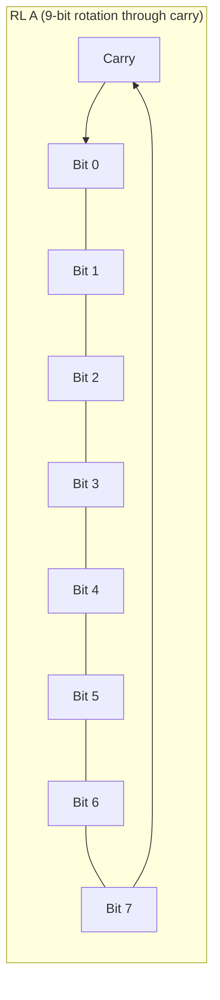
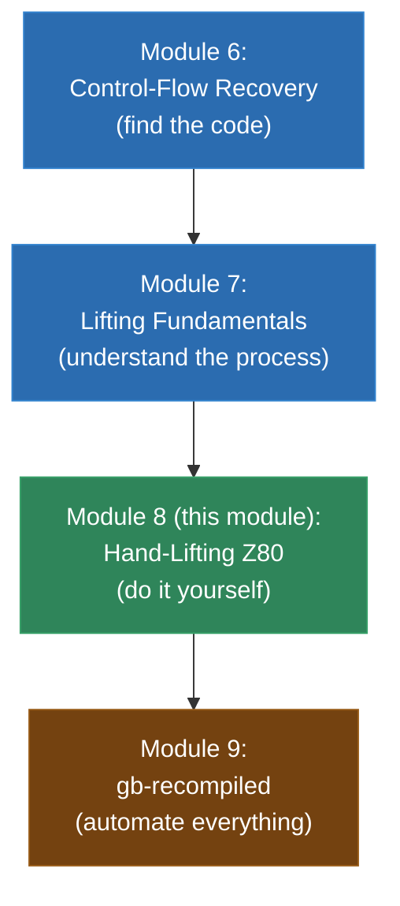

# Module 8: Your First Lift -- Hand-Translating Z80

This is the module where you put down the theory and pick up a pencil. No tools, no automation, no recompiler framework. Just you, an SM83 instruction reference, and a C compiler.

You are going to hand-translate real Game Boy assembly into C, instruction by instruction, and then compile and run it. The goal is to internalize the mechanical process of lifting so deeply that when you later write an automated lifter, you'll know exactly what it needs to do -- because you've done it yourself, dozens of times, by hand.

This is not busywork. Every single person who has built a working static recompiler will tell you the same thing: you need to do this by hand first. The automated tool is only as good as your understanding of what it's supposed to produce, and that understanding comes from doing it manually.

We'll work through five walkthroughs of increasing complexity, then translate a complete function from a real Game Boy ROM, compile it, run it, and verify it against an emulator.

Let's go.

---

## 1. Why We Start By Hand

You might be wondering: if the whole point of a recompiler is to automate this process, why spend a module doing it manually?

Three reasons.

**First, you need to understand the target before you automate it.** An automated lifter is a code generator -- it writes C code for you. But if you've never written that C code yourself, how do you know the generator is producing correct output? How do you debug it when something goes wrong? You can't evaluate output you don't understand.

**Second, hand-lifting reveals the patterns.** After translating 20 or 30 instructions by hand, you'll start to see the repetition. Every `ADD A, r` instruction follows the same template. Every conditional branch has the same structure. Every `LD` instruction is trivial. These patterns are exactly what the automated lifter will encode as templates. You'll see them naturally, without anyone having to point them out.

**Third, hand-lifting reveals the edge cases.** Not every instruction is straightforward. `DAA` is weird. `HALT` needs special handling. `LD SP, HL` has different flag behavior than `LD A, B`. CB-prefix bit operations have their own quirks. You'll encounter these edge cases one at a time, in context, which is the best way to learn them.

The N64 decomp community -- hundreds of people who have collectively decompiled millions of lines of MIPS code -- started by hand-matching functions one at a time. The `gb-recompiled` project was developed by someone who first translated Game Boy functions by hand to understand the process before automating it. This is the path.

---

## 2. Setting Up the C Runtime

Before we can translate any instructions, we need the C infrastructure that represents the Game Boy's CPU and memory. This is the "runtime" that our hand-lifted code will execute against.

### The Register Struct

```c
/* gb_runtime.h -- Minimal Game Boy CPU runtime for hand-lifting exercises */

#ifndef GB_RUNTIME_H
#define GB_RUNTIME_H

#include <stdint.h>
#include <stdio.h>
#include <stdlib.h>
#include <string.h>

/* CPU state */
typedef struct {
    /* 8-bit registers */
    uint8_t A;
    uint8_t B, C;     /* BC pair */
    uint8_t D, E;     /* DE pair */
    uint8_t H, L;     /* HL pair */

    /* Flags (stored individually) */
    uint8_t F_Z;      /* Zero */
    uint8_t F_N;      /* Subtract */
    uint8_t F_H;      /* Half-carry */
    uint8_t F_C;      /* Carry */

    /* 16-bit registers */
    uint16_t SP;      /* Stack pointer */
    uint16_t PC;      /* Program counter */

    /* Interrupt state */
    uint8_t IME;      /* Interrupt master enable */

    /* Memory: 64KB address space */
    uint8_t memory[0x10000];
} gb_state;

#endif /* GB_RUNTIME_H */
```

### 16-Bit Register Pair Helpers

The SM83 uses register pairs (BC, DE, HL, AF) for 16-bit operations. These helpers make the lifted code cleaner:

```c
/* 16-bit register pair accessors */
static inline uint16_t get_BC(gb_state *ctx) {
    return ((uint16_t)ctx->B << 8) | ctx->C;
}
static inline void set_BC(gb_state *ctx, uint16_t val) {
    ctx->B = (val >> 8) & 0xFF;
    ctx->C = val & 0xFF;
}

static inline uint16_t get_DE(gb_state *ctx) {
    return ((uint16_t)ctx->D << 8) | ctx->E;
}
static inline void set_DE(gb_state *ctx, uint16_t val) {
    ctx->D = (val >> 8) & 0xFF;
    ctx->E = val & 0xFF;
}

static inline uint16_t get_HL(gb_state *ctx) {
    return ((uint16_t)ctx->H << 8) | ctx->L;
}
static inline void set_HL(gb_state *ctx, uint16_t val) {
    ctx->H = (val >> 8) & 0xFF;
    ctx->L = val & 0xFF;
}

static inline uint16_t get_AF(gb_state *ctx) {
    uint8_t F = (ctx->F_Z << 7) | (ctx->F_N << 6)
              | (ctx->F_H << 5) | (ctx->F_C << 4);
    return ((uint16_t)ctx->A << 8) | F;
}
static inline void set_AF(gb_state *ctx, uint16_t val) {
    ctx->A = (val >> 8) & 0xFF;
    ctx->F_Z = (val >> 7) & 1;
    ctx->F_N = (val >> 6) & 1;
    ctx->F_H = (val >> 5) & 1;
    ctx->F_C = (val >> 4) & 1;
}
```

### Memory Access Helpers

For these exercises, we'll use simple memory access. In a full recompiler, these would handle bank switching and memory-mapped I/O, but for hand-lifting practice, direct array access is fine:

```c
/* Memory read */
static inline uint8_t mem_read(gb_state *ctx, uint16_t addr) {
    return ctx->memory[addr];
}

/* Memory write */
static inline void mem_write(gb_state *ctx, uint16_t addr, uint8_t val) {
    ctx->memory[addr] = val;
}

/* 16-bit memory read (little-endian) */
static inline uint16_t mem_read16(gb_state *ctx, uint16_t addr) {
    return (uint16_t)ctx->memory[addr] | ((uint16_t)ctx->memory[addr + 1] << 8);
}

/* 16-bit memory write (little-endian) */
static inline void mem_write16(gb_state *ctx, uint16_t addr, uint16_t val) {
    ctx->memory[addr] = val & 0xFF;
    ctx->memory[addr + 1] = (val >> 8) & 0xFF;
}
```

### Stack Helpers

Push and pop are common enough to deserve helpers:

```c
/* Push 16-bit value onto the stack */
static inline void stack_push16(gb_state *ctx, uint16_t val) {
    ctx->SP -= 2;
    mem_write16(ctx, ctx->SP, val);
}

/* Pop 16-bit value from the stack */
static inline uint16_t stack_pop16(gb_state *ctx) {
    uint16_t val = mem_read16(ctx, ctx->SP);
    ctx->SP += 2;
    return val;
}
```

### Flag Computation Macros

These encapsulate the flag logic for common operations so you don't have to retype it every time:

```c
/* Flag computation for 8-bit ADD */
#define COMPUTE_ADD_FLAGS(ctx, a, b, result) do { \
    (ctx)->F_Z = (((result) & 0xFF) == 0);       \
    (ctx)->F_N = 0;                                \
    (ctx)->F_H = (((a) & 0x0F) + ((b) & 0x0F)) > 0x0F; \
    (ctx)->F_C = ((result) > 0xFF);                \
} while(0)

/* Flag computation for 8-bit SUB */
#define COMPUTE_SUB_FLAGS(ctx, a, b, result) do { \
    (ctx)->F_Z = (((result) & 0xFF) == 0);       \
    (ctx)->F_N = 1;                                \
    (ctx)->F_H = ((a) & 0x0F) < ((b) & 0x0F);    \
    (ctx)->F_C = ((b) > (a));                      \
} while(0)

/* Flag computation for 8-bit INC */
#define COMPUTE_INC_FLAGS(ctx, old_val, new_val) do { \
    (ctx)->F_Z = ((new_val) == 0);                \
    (ctx)->F_N = 0;                                \
    (ctx)->F_H = (((old_val) & 0x0F) == 0x0F);   \
    /* F_C not affected */                         \
} while(0)

/* Flag computation for 8-bit DEC */
#define COMPUTE_DEC_FLAGS(ctx, old_val, new_val) do { \
    (ctx)->F_Z = ((new_val) == 0);                \
    (ctx)->F_N = 1;                                \
    (ctx)->F_H = (((old_val) & 0x0F) == 0x00);   \
    /* F_C not affected */                         \
} while(0)
```

### Putting the Runtime Together

Save everything above as `gb_runtime.h`. We'll include it in every exercise file. Here's a template for your hand-lifting exercises:

```c
/* exercise_XX.c -- Hand-lifted Game Boy function */
#include "gb_runtime.h"

/* The hand-lifted function goes here */
void lifted_function(gb_state *ctx) {
    /* Your translated code */
}

/* Test harness */
int main(void) {
    gb_state ctx;
    memset(&ctx, 0, sizeof(ctx));

    /* Set up initial state */
    ctx.SP = 0xFFFE;  /* Standard initial SP */
    /* ... set registers, load memory as needed ... */

    /* Run the lifted function */
    lifted_function(&ctx);

    /* Print results */
    printf("A=0x%02X B=0x%02X C=0x%02X D=0x%02X E=0x%02X H=0x%02X L=0x%02X\n",
           ctx.A, ctx.B, ctx.C, ctx.D, ctx.E, ctx.H, ctx.L);
    printf("F: Z=%d N=%d H=%d C=%d\n",
           ctx.F_Z, ctx.F_N, ctx.F_H, ctx.F_C);
    printf("SP=0x%04X\n", ctx.SP);

    return 0;
}
```

Compile with: `gcc -O2 -o exercise_XX exercise_XX.c`

---

## 3. Walkthrough 1: A Simple Subroutine

Let's start with the simplest possible function: load some values, do arithmetic, store the result, return.

### The Assembly

```asm
; Function: add_values
; Loads two bytes from memory, adds them, stores the result.
; Inputs: HL points to the first byte; second byte is at HL+1
; Output: result stored at HL+2
;
; Address  Bytes    Instruction
  0x0200:  2A       LD A, [HL+]        ; Load first byte, increment HL
  0x0201:  46       LD B, [HL]         ; Load second byte (HL now points to +1)
  0x0202:  80       ADD A, B           ; Add them
  0x0203:  23       INC HL             ; Point HL to +2 (the output location)
  0x0204:  77       LD [HL], A         ; Store result
  0x0205:  C9       RET                ; Return
```

### Step-by-Step Translation

**Instruction 1: `LD A, [HL+]` (opcode 0x2A)**

This loads the byte at address HL into A, then increments HL. Two operations in one instruction.

```c
/* 0x0200: LD A, [HL+] */
{
    uint16_t addr = get_HL(ctx);
    ctx->A = mem_read(ctx, addr);
    set_HL(ctx, addr + 1);
}
```

No flags are affected by `LD A, [HL+]`. Load instructions on the SM83 generally don't affect flags (with the exception of `POP AF` which restores flags from the stack).

**Instruction 2: `LD B, [HL]` (opcode 0x46)**

Load the byte at address HL into B.

```c
/* 0x0201: LD B, [HL] */
ctx->B = mem_read(ctx, get_HL(ctx));
```

Simple. No flags affected.

**Instruction 3: `ADD A, B` (opcode 0x80)**

Add B to A, storing result in A. All four flags are updated.

```c
/* 0x0202: ADD A, B */
{
    uint16_t result = (uint16_t)ctx->A + (uint16_t)ctx->B;
    ctx->F_Z = ((result & 0xFF) == 0);
    ctx->F_N = 0;
    ctx->F_H = ((ctx->A & 0x0F) + (ctx->B & 0x0F)) > 0x0F;
    ctx->F_C = (result > 0xFF);
    ctx->A = (uint8_t)result;
}
```

Note the order: compute flags from the original values of A and B, then update A. If you update A first, you lose the original value needed for flag computation.

Or, using our helper macro:

```c
/* 0x0202: ADD A, B (using macro) */
{
    uint16_t result = (uint16_t)ctx->A + (uint16_t)ctx->B;
    COMPUTE_ADD_FLAGS(ctx, ctx->A, ctx->B, result);
    ctx->A = (uint8_t)result;
}
```

**Instruction 4: `INC HL` (opcode 0x23)**

Increment the 16-bit register pair HL. Important: 16-bit INC does NOT affect any flags.

```c
/* 0x0203: INC HL */
set_HL(ctx, get_HL(ctx) + 1);
/* No flags affected by 16-bit INC */
```

This is a common gotcha. `INC B` (8-bit) affects Z, N, and H flags. `INC HL` (16-bit) affects nothing. Make sure you know which one you're dealing with.

**Instruction 5: `LD [HL], A` (opcode 0x77)**

Store A at the address in HL.

```c
/* 0x0204: LD [HL], A */
mem_write(ctx, get_HL(ctx), ctx->A);
```

**Instruction 6: `RET` (opcode 0xC9)**

Pop the return address from the stack and return. In our lifting model, the stack pop is for SP adjustment (the actual return is handled by C's `return`):

```c
/* 0x0205: RET */
ctx->SP += 2;  /* Pop return address (adjusts SP) */
return;
```

### The Complete Lifted Function

```c
void func_0200(gb_state *ctx) {
    /* 0x0200: LD A, [HL+] */
    {
        uint16_t addr = get_HL(ctx);
        ctx->A = mem_read(ctx, addr);
        set_HL(ctx, addr + 1);
    }

    /* 0x0201: LD B, [HL] */
    ctx->B = mem_read(ctx, get_HL(ctx));

    /* 0x0202: ADD A, B */
    {
        uint16_t result = (uint16_t)ctx->A + (uint16_t)ctx->B;
        ctx->F_Z = ((result & 0xFF) == 0);
        ctx->F_N = 0;
        ctx->F_H = ((ctx->A & 0x0F) + (ctx->B & 0x0F)) > 0x0F;
        ctx->F_C = (result > 0xFF);
        ctx->A = (uint8_t)result;
    }

    /* 0x0203: INC HL */
    set_HL(ctx, get_HL(ctx) + 1);

    /* 0x0204: LD [HL], A */
    mem_write(ctx, get_HL(ctx), ctx->A);

    /* 0x0205: RET */
    ctx->SP += 2;
    return;
}
```

### Test Harness

```c
int main(void) {
    gb_state ctx;
    memset(&ctx, 0, sizeof(ctx));
    ctx.SP = 0xFFFE;

    /* Set up: HL points to memory with two values to add */
    ctx.H = 0xC0;
    ctx.L = 0x00;  /* HL = 0xC000 */
    ctx.memory[0xC000] = 25;   /* First value */
    ctx.memory[0xC001] = 17;   /* Second value */
    ctx.memory[0xC002] = 0;    /* Result location (should become 42) */

    /* Push a fake return address so RET's SP adjustment works */
    ctx.SP -= 2;
    mem_write16(&ctx, ctx.SP, 0x0000);

    /* Run */
    func_0200(&ctx);

    /* Check result */
    printf("Result at 0xC002: %d (expected 42)\n", ctx.memory[0xC002]);
    printf("A=%d (should be 42)\n", ctx.A);
    printf("HL=0x%04X (should be 0xC002)\n", get_HL(&ctx));

    if (ctx.memory[0xC002] == 42) {
        printf("PASS!\n");
    } else {
        printf("FAIL!\n");
    }

    return 0;
}
```

Compile and run:
```bash
gcc -O2 -o walkthrough1 walkthrough1.c && ./walkthrough1
```

Expected output:
```
Result at 0xC002: 42 (expected 42)
A=42 (should be 42)
HL=0xC002 (should be 0xC002)
PASS!
```

You just hand-lifted your first function. Let's make it harder.

---

## 4. Walkthrough 2: A Loop with Conditional Branching

### The Assembly

```asm
; Function: sum_array
; Sums B bytes starting at address HL.
; Input: HL = array start, B = count
; Output: A = sum (wrapping 8-bit)
;
; Address  Bytes      Instruction
  0x0300:  AF         XOR A              ; A = 0 (and clear flags)
  0x0301:  B0         OR B               ; Check if B is zero
  0x0302:  C8         RET Z              ; Return if count is zero
  0x0303:  86         ADD A, [HL]        ; Add current byte to sum
  0x0304:  23         INC HL             ; Advance pointer
  0x0305:  05         DEC B              ; Decrement counter
  0x0306:  20 FB      JR NZ, 0x0303      ; Loop if counter not zero
  0x0308:  C9         RET                ; Return when done
```

This is our first loop. Address `0x0306` branches back to `0x0303` if B is not zero. In C, this becomes a `goto`.

### Step-by-Step Translation

**`XOR A` (opcode 0xAF):** XOR A with itself -- always produces zero. This is the standard idiom for clearing A.

```c
/* 0x0300: XOR A */
ctx->A = ctx->A ^ ctx->A;  /* Always 0 */
ctx->F_Z = 1;  /* Result is zero */
ctx->F_N = 0;
ctx->F_H = 0;
ctx->F_C = 0;
```

You could simplify to `ctx->A = 0;` but the flags still need to be set. And technically the lifter should emit the XOR operation (the lifter doesn't know the operand is the same register).

**`OR B` (opcode 0xB0):** This is used as a "test if B is zero" idiom. OR A with B updates flags but since we just zeroed A, it effectively tests B.

```c
/* 0x0301: OR B */
ctx->A = ctx->A | ctx->B;
ctx->F_Z = (ctx->A == 0);
ctx->F_N = 0;
ctx->F_H = 0;
ctx->F_C = 0;
```

**`RET Z` (opcode 0xC8):** Conditional return -- return only if Z flag is set.

```c
/* 0x0302: RET Z */
if (ctx->F_Z) {
    ctx->SP += 2;
    return;
}
```

**`ADD A, [HL]` (opcode 0x86):** Add the byte at address HL to A.

```c
/* 0x0303: ADD A, [HL] */
{
    uint8_t val = mem_read(ctx, get_HL(ctx));
    uint16_t result = (uint16_t)ctx->A + (uint16_t)val;
    ctx->F_Z = ((result & 0xFF) == 0);
    ctx->F_N = 0;
    ctx->F_H = ((ctx->A & 0x0F) + (val & 0x0F)) > 0x0F;
    ctx->F_C = (result > 0xFF);
    ctx->A = (uint8_t)result;
}
```

**`INC HL` (opcode 0x23):** Already covered. No flag changes.

```c
/* 0x0304: INC HL */
set_HL(ctx, get_HL(ctx) + 1);
```

**`DEC B` (opcode 0x05):** Decrement B. Updates Z, N, H flags but NOT carry.

```c
/* 0x0305: DEC B */
{
    uint8_t old = ctx->B;
    ctx->B = old - 1;
    ctx->F_Z = (ctx->B == 0);
    ctx->F_N = 1;
    ctx->F_H = (old & 0x0F) == 0x00;  /* Borrow from bit 4 */
    /* F_C not affected */
}
```

**`JR NZ, 0x0303` (opcode 0x20, offset 0xFB):** Jump relative if not zero. The offset 0xFB is -5 in signed representation, which takes us back to 0x0303 (from 0x0308, the address after the JR instruction: 0x0308 + (-5) = 0x0303).

```c
/* 0x0306: JR NZ, 0x0303 */
if (!ctx->F_Z) goto block_0303;
```

**`RET` (opcode 0xC9):**

```c
/* 0x0308: RET */
ctx->SP += 2;
return;
```

### The Complete Lifted Function

Now we need to identify basic blocks and add labels. Using the leaders algorithm from Module 6:

- `0x0300` is a leader (function entry).
- `0x0303` is a leader (branch target of `JR NZ`).
- `0x0308` is a leader (follows the conditional branch `JR NZ`).

```c
void func_0300_sum_array(gb_state *ctx) {
/* block_0300: */
    /* 0x0300: XOR A */
    ctx->A = ctx->A ^ ctx->A;
    ctx->F_Z = 1;
    ctx->F_N = 0;
    ctx->F_H = 0;
    ctx->F_C = 0;

    /* 0x0301: OR B */
    ctx->A = ctx->A | ctx->B;
    ctx->F_Z = (ctx->A == 0);
    ctx->F_N = 0;
    ctx->F_H = 0;
    ctx->F_C = 0;

    /* 0x0302: RET Z */
    if (ctx->F_Z) {
        ctx->SP += 2;
        return;
    }

block_0303:
    /* 0x0303: ADD A, [HL] */
    {
        uint8_t val = mem_read(ctx, get_HL(ctx));
        uint16_t result = (uint16_t)ctx->A + (uint16_t)val;
        ctx->F_Z = ((result & 0xFF) == 0);
        ctx->F_N = 0;
        ctx->F_H = ((ctx->A & 0x0F) + (val & 0x0F)) > 0x0F;
        ctx->F_C = (result > 0xFF);
        ctx->A = (uint8_t)result;
    }

    /* 0x0304: INC HL */
    set_HL(ctx, get_HL(ctx) + 1);

    /* 0x0305: DEC B */
    {
        uint8_t old = ctx->B;
        ctx->B = old - 1;
        ctx->F_Z = (ctx->B == 0);
        ctx->F_N = 1;
        ctx->F_H = (old & 0x0F) == 0x00;
    }

    /* 0x0306: JR NZ, 0x0303 */
    if (!ctx->F_Z) goto block_0303;

/* block_0308: */
    /* 0x0308: RET */
    ctx->SP += 2;
    return;
}
```

### Test Harness

```c
int main(void) {
    gb_state ctx;
    memset(&ctx, 0, sizeof(ctx));
    ctx.SP = 0xFFFE;
    ctx.SP -= 2;  /* Push fake return address */

    /* Set up array at 0xC000: {10, 20, 30, 40, 50} */
    ctx.memory[0xC000] = 10;
    ctx.memory[0xC001] = 20;
    ctx.memory[0xC002] = 30;
    ctx.memory[0xC003] = 40;
    ctx.memory[0xC004] = 50;

    /* HL = array start, B = count */
    ctx.H = 0xC0;
    ctx.L = 0x00;
    ctx.B = 5;

    func_0300_sum_array(&ctx);

    printf("Sum: %d (expected 150)\n", ctx.A);
    printf("B: %d (expected 0)\n", ctx.B);
    printf("HL: 0x%04X (expected 0xC005)\n", get_HL(&ctx));

    if (ctx.A == 150 && ctx.B == 0) {
        printf("PASS!\n");
    } else {
        printf("FAIL!\n");
    }

    /* Test with zero count */
    memset(&ctx, 0, sizeof(ctx));
    ctx.SP = 0xFFFE;
    ctx.SP -= 2;
    ctx.H = 0xC0;
    ctx.L = 0x00;
    ctx.B = 0;

    func_0300_sum_array(&ctx);

    printf("\nZero count: A=%d (expected 0)\n", ctx.A);
    if (ctx.A == 0) {
        printf("PASS!\n");
    } else {
        printf("FAIL!\n");
    }

    return 0;
}
```

You've now lifted a function with a loop and conditional branching. The `goto` back to `block_0303` is the loop back-edge. The `RET Z` at the start is an early-exit guard for the zero-count case.

---

## 5. Walkthrough 3: Stack Operations (PUSH, POP, CALL, RET)

### The Assembly

```asm
; Function: save_and_modify
; Saves BC and DE, modifies them, calls a helper, restores them.
;
; Address  Bytes      Instruction
  0x0400:  C5         PUSH BC            ; Save BC
  0x0401:  D5         PUSH DE            ; Save DE
  0x0402:  06 42      LD B, 0x42         ; B = 0x42
  0x0404:  0E 00      LD C, 0x00         ; C = 0x00
  0x0406:  16 10      LD D, 0x10         ; D = 0x10
  0x0408:  1E 20      LD E, 0x20         ; E = 0x20
  0x040A:  CD 00 05   CALL 0x0500        ; Call helper function
  0x040D:  D1         POP DE             ; Restore DE
  0x040E:  C1         POP BC             ; Restore BC
  0x040F:  C9         RET

; Helper function that the above calls:
  0x0500:  78         LD A, B            ; A = B
  0x0501:  82         ADD A, D           ; A = A + D
  0x0502:  C9         RET
```

### Translation

**`PUSH BC` (opcode 0xC5):** Push the 16-bit value of BC onto the stack.

```c
/* 0x0400: PUSH BC */
stack_push16(ctx, get_BC(ctx));
```

Expanded (without the helper):
```c
ctx->SP -= 2;
mem_write16(ctx, ctx->SP, get_BC(ctx));
```

The stack grows downward on the SM83. `PUSH` decrements SP by 2 and writes the 16-bit value. `POP` reads the value and increments SP by 2.

**`PUSH DE` (opcode 0xD5):**

```c
/* 0x0401: PUSH DE */
stack_push16(ctx, get_DE(ctx));
```

**`LD B, 0x42` (opcode 0x06, immediate 0x42):**

```c
/* 0x0402: LD B, 0x42 */
ctx->B = 0x42;
```

**`LD C, 0x00`, `LD D, 0x10`, `LD E, 0x20`:** Same pattern.

```c
/* 0x0404: LD C, 0x00 */
ctx->C = 0x00;
/* 0x0406: LD D, 0x10 */
ctx->D = 0x10;
/* 0x0408: LD E, 0x20 */
ctx->E = 0x20;
```

**`CALL 0x0500` (opcode 0xCD, target 0x0500):** Push the return address (address of the next instruction: 0x040D) and jump to 0x0500.

```c
/* 0x040A: CALL 0x0500 */
stack_push16(ctx, 0x040D);  /* Push return address */
func_0500_helper(ctx);       /* Call the target function */
```

After `func_0500_helper` returns (via its `RET`), execution continues at 0x040D.

**`POP DE` (opcode 0xD1):** Pop 16-bit value from stack into DE.

```c
/* 0x040D: POP DE */
set_DE(ctx, stack_pop16(ctx));
```

**`POP BC` (opcode 0xC1):**

```c
/* 0x040E: POP BC */
set_BC(ctx, stack_pop16(ctx));
```

**`RET`:**

```c
/* 0x040F: RET */
ctx->SP += 2;
return;
```

### The Helper Function

```c
void func_0500_helper(gb_state *ctx) {
    /* 0x0500: LD A, B */
    ctx->A = ctx->B;

    /* 0x0501: ADD A, D */
    {
        uint16_t result = (uint16_t)ctx->A + (uint16_t)ctx->D;
        ctx->F_Z = ((result & 0xFF) == 0);
        ctx->F_N = 0;
        ctx->F_H = ((ctx->A & 0x0F) + (ctx->D & 0x0F)) > 0x0F;
        ctx->F_C = (result > 0xFF);
        ctx->A = (uint8_t)result;
    }

    /* 0x0502: RET */
    ctx->SP += 2;
    return;
}
```

### The Complete Main Function

```c
void func_0400_save_and_modify(gb_state *ctx) {
    /* 0x0400: PUSH BC */
    stack_push16(ctx, get_BC(ctx));

    /* 0x0401: PUSH DE */
    stack_push16(ctx, get_DE(ctx));

    /* 0x0402-0x0409: Load new values */
    ctx->B = 0x42;
    ctx->C = 0x00;
    ctx->D = 0x10;
    ctx->E = 0x20;

    /* 0x040A: CALL 0x0500 */
    stack_push16(ctx, 0x040D);
    func_0500_helper(ctx);

    /* 0x040D: POP DE */
    set_DE(ctx, stack_pop16(ctx));

    /* 0x040E: POP BC */
    set_BC(ctx, stack_pop16(ctx));

    /* 0x040F: RET */
    ctx->SP += 2;
    return;
}
```

### Test

```c
int main(void) {
    gb_state ctx;
    memset(&ctx, 0, sizeof(ctx));
    ctx.SP = 0xFFFE;
    ctx.SP -= 2;  /* Fake return address for outer function */

    /* Set initial BC and DE to known values */
    ctx.B = 0xAA;
    ctx.C = 0xBB;
    ctx.D = 0xCC;
    ctx.E = 0xDD;

    func_0400_save_and_modify(&ctx);

    /* A should be B+D from inside the call: 0x42 + 0x10 = 0x52 */
    printf("A=0x%02X (expected 0x52)\n", ctx.A);

    /* BC and DE should be restored to their original values */
    printf("B=0x%02X C=0x%02X (expected 0xAA, 0xBB)\n", ctx.B, ctx.C);
    printf("D=0x%02X E=0x%02X (expected 0xCC, 0xDD)\n", ctx.D, ctx.E);

    int pass = (ctx.A == 0x52 && ctx.B == 0xAA && ctx.C == 0xBB
                && ctx.D == 0xCC && ctx.E == 0xDD);
    printf("%s\n", pass ? "PASS!" : "FAIL!");

    return 0;
}
```

The key insight here is the **stack discipline**. PUSH saves values; POP restores them in reverse order. The CALL pushes a return address; the callee's RET pops it. Everything must balance. If you get the SP arithmetic wrong, the whole stack unwinds incorrectly.

---

## 6. Walkthrough 4: Bank Switching and Memory-Mapped I/O

### The Assembly

```asm
; Function: read_from_bank
; Switches to ROM bank 3, reads a byte, switches back to bank 1.
;
; Address  Bytes      Instruction
  0x0600:  3E 03      LD A, 0x03         ; Bank number 3
  0x0602:  EA 00 20   LD [0x2000], A     ; Write to MBC bank select register
  0x0605:  FA 00 40   LD A, [0x4000]     ; Read byte from bank 3 at 0x4000
  0x0608:  47         LD B, A            ; Save it in B
  0x0609:  3E 01      LD A, 0x01         ; Bank number 1
  0x060B:  EA 00 20   LD [0x2000], A     ; Switch back to bank 1
  0x060E:  78         LD A, B            ; Restore the read value to A
  0x060F:  C9         RET
```

### Translation Notes

This function writes to address `0x2000`, which on a Game Boy is the MBC bank select register. This doesn't write to RAM -- it tells the MBC (Memory Bank Controller) which ROM bank to map into the `0x4000-0x7FFF` window.

In a real recompiler, `mem_write` at addresses `0x2000-0x3FFF` would trigger bank switching logic. For this exercise, we'll implement a simple version:

```c
/* Enhanced memory write with MBC bank switching */
static inline void mem_write_mbc(gb_state *ctx, uint16_t addr, uint8_t val) {
    if (addr >= 0x2000 && addr < 0x4000) {
        /* MBC1/MBC3/MBC5: ROM bank select */
        ctx->current_rom_bank = val;
        if (ctx->current_rom_bank == 0) {
            ctx->current_rom_bank = 1;  /* Bank 0 is always mapped low */
        }
        printf("  [MBC] Switched to ROM bank %d\n", ctx->current_rom_bank);
    } else {
        ctx->memory[addr] = val;
    }
}
```

### The Complete Lifted Function

```c
void func_0600_read_from_bank(gb_state *ctx) {
    /* 0x0600: LD A, 0x03 */
    ctx->A = 0x03;

    /* 0x0602: LD [0x2000], A -- bank switch! */
    mem_write_mbc(ctx, 0x2000, ctx->A);

    /* 0x0605: LD A, [0x4000] -- read from banked ROM */
    ctx->A = mem_read(ctx, 0x4000);

    /* 0x0608: LD B, A */
    ctx->B = ctx->A;

    /* 0x0609: LD A, 0x01 */
    ctx->A = 0x01;

    /* 0x060B: LD [0x2000], A -- switch back */
    mem_write_mbc(ctx, 0x2000, ctx->A);

    /* 0x060E: LD A, B -- restore the value we read */
    ctx->A = ctx->B;

    /* 0x060F: RET */
    ctx->SP += 2;
    return;
}
```

### Why This Matters

Bank switching is one of the core challenges of Game Boy recompilation. In the original hardware, writing to `0x2000` physically changes which ROM chip pages are visible in the address window. In recompiled code, we need to intercept these writes and update our internal bank tracking.

For a full recompiler, the bank switch logic would also need to update any address resolution tables used by indirect jumps. If the game switches to bank 3 and then does `JP (HL)` where HL points into `0x4000-0x7FFF`, the target is in bank 3 -- and we need to dispatch to the bank 3 version of that address.

---

## 7. Walkthrough 5: CB-Prefix Bit Operations

The CB prefix gives the SM83 an additional 256 opcodes for bit manipulation: rotates, shifts, bit test, bit set, and bit reset.

### The Assembly

```asm
; Function: extract_bits
; Tests bit 7 of A (sign bit), sets bit 0, and rotates left through carry.
;
; Address  Bytes      Instruction
  0x0700:  CB 7F      BIT 7, A           ; Test bit 7 of A
  0x0702:  CB C7      SET 0, A           ; Set bit 0 of A
  0x0704:  CB 17      RL A               ; Rotate A left through carry
  0x0706:  CB 87      RES 0, A           ; Reset (clear) bit 0 of A
  0x0708:  C9         RET
```

### Step-by-Step Translation

**`BIT 7, A` (CB 7F):** Test bit 7 of A. Sets Z flag if bit 7 is 0, clears Z if bit 7 is 1. Also sets H flag and clears N flag. Does NOT modify A.

```c
/* 0x0700: BIT 7, A */
ctx->F_Z = !((ctx->A >> 7) & 1);  /* Z = 1 if bit is 0 */
ctx->F_N = 0;
ctx->F_H = 1;  /* BIT always sets H */
/* F_C not affected */
```

The BIT instruction is a non-destructive test. It's like AND but it only affects flags, not the register. This is commonly used to check status bits:

```asm
BIT 7, A        ; Is the sign bit set?
JR Z, positive  ; Jump if bit 7 was 0 (positive number)
; ... handle negative ...
```

**`SET 0, A` (CB C7):** Set bit 0 of A to 1. No flags affected.

```c
/* 0x0702: SET 0, A */
ctx->A = ctx->A | (1 << 0);  /* Set bit 0 */
/* No flags affected by SET */
```

**`RL A` (CB 17):** Rotate A left through carry. Bit 7 goes into carry. Old carry goes into bit 0. This is a 9-bit rotation through the carry flag.

```c
/* 0x0704: RL A */
{
    uint8_t old_carry = ctx->F_C;
    ctx->F_C = (ctx->A >> 7) & 1;   /* Bit 7 -> Carry */
    ctx->A = (ctx->A << 1) | old_carry;  /* Shift left, old carry -> bit 0 */
    ctx->F_Z = (ctx->A == 0);
    ctx->F_N = 0;
    ctx->F_H = 0;
}
```

Important: `RL A` (CB 17) is different from `RLA` (opcode 0x17). `RL A` sets the Z flag normally; `RLA` always clears Z. This is one of those SM83 gotchas that catches people.



**`RES 0, A` (CB 87):** Reset (clear) bit 0 of A. No flags affected.

```c
/* 0x0706: RES 0, A */
ctx->A = ctx->A & ~(1 << 0);  /* Clear bit 0 */
/* No flags affected by RES */
```

### The Complete Function

```c
void func_0700_extract_bits(gb_state *ctx) {
    /* 0x0700: BIT 7, A */
    ctx->F_Z = !((ctx->A >> 7) & 1);
    ctx->F_N = 0;
    ctx->F_H = 1;

    /* 0x0702: SET 0, A */
    ctx->A = ctx->A | 0x01;

    /* 0x0704: RL A */
    {
        uint8_t old_carry = ctx->F_C;
        ctx->F_C = (ctx->A >> 7) & 1;
        ctx->A = (ctx->A << 1) | old_carry;
        ctx->F_Z = (ctx->A == 0);
        ctx->F_N = 0;
        ctx->F_H = 0;
    }

    /* 0x0706: RES 0, A */
    ctx->A = ctx->A & 0xFE;

    /* 0x0708: RET */
    ctx->SP += 2;
    return;
}
```

### Test

```c
int main(void) {
    gb_state ctx;
    memset(&ctx, 0, sizeof(ctx));
    ctx.SP = 0xFFFE;
    ctx.SP -= 2;

    /* Test with A = 0b10110100 = 0xB4, carry = 0 */
    ctx.A = 0xB4;
    ctx.F_C = 0;

    func_0700_extract_bits(&ctx);

    /* Trace:
       BIT 7, A: A=0xB4, bit 7 is 1, so Z=0. H=1, N=0. C unchanged (0).
       SET 0, A: A = 0xB4 | 0x01 = 0xB5
       RL A:     carry_in=0, A=0xB5=10110101
                 new carry = bit 7 = 1
                 A = (0xB5 << 1) | 0 = 01101010 = 0x6A
                 Z = 0, N=0, H=0, C=1
       RES 0, A: A = 0x6A & 0xFE = 0x6A (bit 0 was already 0)
    */

    printf("A=0x%02X (expected 0x6A)\n", ctx.A);
    printf("F: Z=%d N=%d H=%d C=%d (expected 0,0,0,1)\n",
           ctx.F_Z, ctx.F_N, ctx.F_H, ctx.F_C);

    int pass = (ctx.A == 0x6A && ctx.F_C == 1 && ctx.F_Z == 0);
    printf("%s\n", pass ? "PASS!" : "FAIL!");

    return 0;
}
```

The CB-prefix operations are extensively used in Game Boy games for:
- Testing hardware status bits (BIT)
- Setting configuration flags (SET)
- Clearing status bits (RES)
- Bit-level data manipulation (rotates, shifts)
- Efficient multiplication/division by powers of 2 (SLA, SRA, SRL)

---

## 8. Putting It Together: A Complete Small Function from a Real ROM

Now let's translate a realistic function -- the kind of thing you'd actually encounter in a Game Boy game. This is a simplified version of a VBlank handler that updates a counter and copies a tile attribute to VRAM.

### The Assembly (17 Instructions)

```asm
; Function: vblank_update
; Called every VBlank. Increments a frame counter at 0xC100,
; reads a tile attribute from a table at 0xC200 (indexed by frame counter mod 4),
; and writes it to VRAM at 0x9800.
;
; Address  Bytes      Instruction
  0x0800:  C5         PUSH BC
  0x0801:  D5         PUSH DE
  0x0802:  E5         PUSH HL
  0x0803:  FA 00 C1   LD A, [0xC100]     ; Load frame counter
  0x0806:  3C         INC A               ; Increment it
  0x0807:  EA 00 C1   LD [0xC100], A     ; Store back
  0x080A:  E6 03      AND 0x03           ; A = A mod 4 (mask lower 2 bits)
  0x080C:  5F         LD E, A            ; E = index
  0x080D:  16 00      LD D, 0x00         ; D = 0 (DE = 16-bit index)
  0x080F:  21 00 C2   LD HL, 0xC200     ; HL = table base
  0x0812:  19         ADD HL, DE         ; HL = table_base + index
  0x0813:  7E         LD A, [HL]         ; Load attribute from table
  0x0814:  21 00 98   LD HL, 0x9800     ; HL = VRAM destination
  0x0817:  77         LD [HL], A         ; Write to VRAM
  0x0818:  E1         POP HL
  0x0819:  D1         POP DE
  0x081A:  C1         POP BC
  0x081B:  C9         RET
```

### Translation

This is a straight-line function (no branches), so there's only one basic block. Let's translate it:

```c
void func_0800_vblank_update(gb_state *ctx) {
    /* 0x0800: PUSH BC */
    stack_push16(ctx, get_BC(ctx));

    /* 0x0801: PUSH DE */
    stack_push16(ctx, get_DE(ctx));

    /* 0x0802: PUSH HL */
    stack_push16(ctx, get_HL(ctx));

    /* 0x0803: LD A, [0xC100] -- Load frame counter */
    ctx->A = mem_read(ctx, 0xC100);

    /* 0x0806: INC A */
    {
        uint8_t old = ctx->A;
        ctx->A = old + 1;
        ctx->F_Z = (ctx->A == 0);
        ctx->F_N = 0;
        ctx->F_H = ((old & 0x0F) == 0x0F);
        /* F_C not affected */
    }

    /* 0x0807: LD [0xC100], A -- Store incremented counter */
    mem_write(ctx, 0xC100, ctx->A);

    /* 0x080A: AND 0x03 -- Mask to get counter mod 4 */
    ctx->A = ctx->A & 0x03;
    ctx->F_Z = (ctx->A == 0);
    ctx->F_N = 0;
    ctx->F_H = 1;  /* AND always sets H on SM83 */
    ctx->F_C = 0;  /* AND always clears C */

    /* 0x080C: LD E, A */
    ctx->E = ctx->A;

    /* 0x080D: LD D, 0x00 */
    ctx->D = 0x00;

    /* 0x080F: LD HL, 0xC200 */
    set_HL(ctx, 0xC200);

    /* 0x0812: ADD HL, DE -- 16-bit addition */
    {
        uint16_t hl = get_HL(ctx);
        uint16_t de = get_DE(ctx);
        uint32_t result = (uint32_t)hl + (uint32_t)de;
        ctx->F_N = 0;
        ctx->F_H = ((hl & 0x0FFF) + (de & 0x0FFF)) > 0x0FFF;
        ctx->F_C = (result > 0xFFFF);
        set_HL(ctx, (uint16_t)result);
        /* F_Z NOT affected by 16-bit ADD */
    }

    /* 0x0813: LD A, [HL] */
    ctx->A = mem_read(ctx, get_HL(ctx));

    /* 0x0814: LD HL, 0x9800 */
    set_HL(ctx, 0x9800);

    /* 0x0817: LD [HL], A -- Write to VRAM */
    mem_write(ctx, get_HL(ctx), ctx->A);

    /* 0x0818: POP HL */
    set_HL(ctx, stack_pop16(ctx));

    /* 0x0819: POP DE */
    set_DE(ctx, stack_pop16(ctx));

    /* 0x081A: POP BC */
    set_BC(ctx, stack_pop16(ctx));

    /* 0x081B: RET */
    ctx->SP += 2;
    return;
}
```

### Test Harness

```c
int main(void) {
    gb_state ctx;
    memset(&ctx, 0, sizeof(ctx));
    ctx.SP = 0xFFFE;
    ctx.SP -= 2;  /* Fake return address */

    /* Set up initial register values (should be preserved) */
    ctx.B = 0x11; ctx.C = 0x22;
    ctx.D = 0x33; ctx.E = 0x44;
    ctx.H = 0x55; ctx.L = 0x66;

    /* Set up frame counter */
    ctx.memory[0xC100] = 5;  /* Will become 6, mod 4 = 2 */

    /* Set up attribute table */
    ctx.memory[0xC200] = 0xA0;  /* index 0 */
    ctx.memory[0xC201] = 0xB1;  /* index 1 */
    ctx.memory[0xC202] = 0xC2;  /* index 2 -- this should be selected */
    ctx.memory[0xC203] = 0xD3;  /* index 3 */

    func_0800_vblank_update(&ctx);

    /* Check frame counter was incremented */
    printf("Frame counter: %d (expected 6)\n", ctx.memory[0xC100]);

    /* Check VRAM write (index = 6 mod 4 = 2 -> attribute 0xC2) */
    printf("VRAM[0x9800]: 0x%02X (expected 0xC2)\n", ctx.memory[0x9800]);

    /* Check registers were preserved */
    printf("BC: 0x%02X%02X (expected 0x1122)\n", ctx.B, ctx.C);
    printf("DE: 0x%02X%02X (expected 0x3344)\n", ctx.D, ctx.E);
    printf("HL: 0x%02X%02X (expected 0x5566)\n", ctx.H, ctx.L);

    int pass = (ctx.memory[0xC100] == 6
                && ctx.memory[0x9800] == 0xC2
                && ctx.B == 0x11 && ctx.C == 0x22
                && ctx.D == 0x33 && ctx.E == 0x44
                && ctx.H == 0x55 && ctx.L == 0x66);
    printf("%s\n", pass ? "PASS!" : "FAIL!");

    return 0;
}
```

---

## 9. Compiling and Running Your Hand-Lifted Code

Let's make sure everything works end-to-end.

### File Organization

```
exercise/
  gb_runtime.h       -- The runtime header (from Section 2)
  walkthrough1.c     -- Simple subroutine
  walkthrough2.c     -- Loop with branching
  walkthrough3.c     -- Stack operations
  walkthrough4.c     -- Bank switching
  walkthrough5.c     -- CB-prefix operations
  complete_func.c    -- Complete VBlank handler
```

### Compiling

```bash
# Compile each exercise
gcc -O2 -Wall -Wextra -o wt1 walkthrough1.c
gcc -O2 -Wall -Wextra -o wt2 walkthrough2.c
gcc -O2 -Wall -Wextra -o wt3 walkthrough3.c
gcc -O2 -Wall -Wextra -o wt4 walkthrough4.c
gcc -O2 -Wall -Wextra -o wt5 walkthrough5.c
gcc -O2 -Wall -Wextra -o complete complete_func.c

# Run all
for exe in wt1 wt2 wt3 wt4 wt5 complete; do
    echo "=== $exe ==="
    ./$exe
    echo ""
done
```

### Common Compilation Issues

**"Warning: unused variable"** -- You'll get this for flag variables that are computed but never read within the function. This is expected and correct. The flags might be read by the caller. Use `-Wno-unused-variable` or `(void)` casts if the warnings bother you, but they're harmless.

**Integer promotion warnings** -- Expressions like `ctx->A + ctx->B` promote to `int` in C. The explicit `(uint16_t)` casts in the flag computation code are there to make the behavior clear and avoid compiler warnings.

**"Label 'block_XXXX' defined but not used"** -- If you define a label for a basic block that's only reached by fall-through (no goto targets it), the compiler will warn. This is harmless.

### Optimization Levels

Try compiling at different optimization levels to see how the compiler handles your lifted code:

```bash
# No optimization: direct translation, largest and slowest
gcc -O0 -o wt2_O0 walkthrough2.c

# Standard optimization: dead code eliminated, loops optimized
gcc -O2 -o wt2_O2 walkthrough2.c

# Aggressive optimization: may inline everything
gcc -O3 -o wt2_O3 walkthrough2.c
```

Look at the generated assembly with `-S`:

```bash
gcc -O2 -S -o wt2.s walkthrough2.c
```

You'll see that the compiler eliminates dead flag computations, optimizes the loop, and produces clean machine code. The verbosity of your hand-lifted C is largely erased by the optimizer.

---

## 10. Comparing Output Against an Emulator

The gold standard for verification: run the same code in an emulator and compare register state.

### Using BGB

BGB is the most precise Game Boy emulator for debugging. It has a built-in debugger with register display, memory viewer, and single-step execution.

To compare against your hand-lifted code:

1. **Load a ROM** containing the function you lifted (or create a minimal test ROM).
2. **Set a breakpoint** at the function's address.
3. **Set register values** to match your test case (using BGB's debugger commands).
4. **Single-step** through the function, recording register state after each instruction.
5. **Compare** each intermediate state against your C code's output.

### Using SameBoy

SameBoy is another high-accuracy emulator with a command-line debugger:

```
# SameBoy debugger commands
breakpoint 0x0300          # Set breakpoint at function start
registers                  # Show all registers
step                       # Execute one instruction
print A                    # Print register A
memory 0xC000 16           # Dump 16 bytes from 0xC000
```

### Automated Comparison

For automated testing, you can write a script that:

1. Runs your C test program and captures the output.
2. Runs an emulator in scripted/headless mode with the same initial state.
3. Compares the results.

```python
# compare_test.py -- Compare recompiled output against emulator
import subprocess
import re

def run_recompiled(executable):
    """Run the recompiled test and parse results."""
    result = subprocess.run([executable], capture_output=True, text=True)
    # Parse output like "A=0x42 B=0x00 ..."
    regs = {}
    for match in re.finditer(r'([A-Z_]+)=0x([0-9A-Fa-f]+)', result.stdout):
        regs[match.group(1)] = int(match.group(2), 16)
    return regs, result.stdout

def compare(recompiled_regs, emulator_regs):
    """Compare register states."""
    all_match = True
    for reg in sorted(set(recompiled_regs.keys()) | set(emulator_regs.keys())):
        rec = recompiled_regs.get(reg, '?')
        emu = emulator_regs.get(reg, '?')
        match = (rec == emu)
        if not match:
            print(f"  MISMATCH {reg}: recomp=0x{rec:02X} emu=0x{emu:02X}")
            all_match = False
    return all_match
```

### What to Do When They Disagree

When your lifted code produces different results from the emulator, the bug is in your lifting. Here's how to find it:

1. **Single-step both** (emulator and your C code). Find the first instruction where the state diverges.
2. **Check flag computation.** The most common bug is wrong flag behavior. Double-check the flag formula against the SM83 reference.
3. **Check operand order.** Is your SUB computing `A - B` or `B - A`? The SM83's SUB always computes `A - operand`.
4. **Check 16-bit vs 8-bit.** Does `INC HL` affect flags? (No.) Does `INC B` affect flags? (Yes, but not carry.) These are the gotchas.
5. **Check instruction confusion.** `RL A` (CB 17) vs `RLA` (17) have different Z flag behavior. `RLC A` (CB 07) vs `RLCA` (07) -- same deal. Make sure you're implementing the right instruction.

---

## 11. What You'd Want to Automate

After hand-lifting five functions, the patterns are painfully obvious. Here's what's repetitive:

### Pattern 1: Load Instructions Are Trivial

Every `LD r, r'` is a one-line assignment. Every `LD r, [addr]` is a `mem_read`. Every `LD [addr], r` is a `mem_write`. There are dozens of load instruction variants, but they all follow the same template. This is the first thing to automate.

```python
# Pseudocode for automated load lifting
def lift_ld(dst, src):
    if is_register(dst) and is_register(src):
        return f"ctx->{dst} = ctx->{src};"
    elif is_register(dst) and is_memory(src):
        return f"ctx->{dst} = mem_read(ctx, {src_addr});"
    elif is_memory(dst) and is_register(src):
        return f"mem_write(ctx, {dst_addr}, ctx->{src});"
    # ... more variants
```

### Pattern 2: Arithmetic Flag Computation Is Boilerplate

Every ADD, SUB, ADC, SBC, INC, DEC instruction has the same flag computation code. Only the operands change. This is the second thing to automate -- generate the flag code from a template.

```python
def lift_add(a_name, b_expr):
    return f"""
{{
    uint16_t result = (uint16_t)ctx->{a_name} + (uint16_t)({b_expr});
    ctx->F_Z = ((result & 0xFF) == 0);
    ctx->F_N = 0;
    ctx->F_H = ((ctx->{a_name} & 0x0F) + (({b_expr}) & 0x0F)) > 0x0F;
    ctx->F_C = (result > 0xFF);
    ctx->{a_name} = (uint8_t)result;
}}"""
```

### Pattern 3: Branch Translation Is Mechanical

Every `JR NZ, offset` becomes `if (!ctx->F_Z) goto block_XXXX;`. Every `JP addr` becomes `goto block_XXXX;`. Every `RET` becomes `ctx->SP += 2; return;`. The condition and target change, but the structure is fixed.

### Pattern 4: CB-Prefix Operations Are Regular

The 256 CB-prefix opcodes follow a strict pattern:
- Upper 2 bits: operation (00=rotate/shift, 01=BIT, 10=RES, 11=SET)
- Middle 3 bits: bit number (for BIT/RES/SET)
- Lower 3 bits: register (B, C, D, E, H, L, [HL], A)

This regularity means you can generate all 256 CB handlers with a few nested loops.

### What a Lifter Is

An automated lifter is nothing more than a systematic application of these patterns:

```python
def lift_instruction(insn):
    """Lift a single SM83 instruction to C code."""
    opcode = insn.opcode

    if opcode == 0x00:  # NOP
        return "/* NOP */"
    elif opcode in range(0x40, 0x80) and opcode != 0x76:  # LD r, r'
        dst = REGISTER_TABLE[(opcode >> 3) & 7]
        src = REGISTER_TABLE[opcode & 7]
        return lift_ld(dst, src)
    elif opcode in range(0x80, 0x88):  # ADD A, r
        src = REGISTER_TABLE[opcode & 7]
        return lift_add('A', f'ctx->{src}')
    elif opcode in range(0x88, 0x90):  # ADC A, r
        src = REGISTER_TABLE[opcode & 7]
        return lift_adc('A', f'ctx->{src}')
    # ... hundreds more cases, but each is a template application
```

The entire SM83 lifter is about 500-800 lines of Python. After hand-lifting five functions, you understand exactly what those 800 lines need to produce.

### What You Still Need Humans For

Even with a complete automated lifter, some things require human judgment:

- **Function boundaries** that heuristics get wrong (Module 6).
- **Jump table identification** when the pattern doesn't match templates.
- **Memory-mapped I/O behavior** that depends on the specific game's hardware usage.
- **Bank switching logic** that varies by MBC type (MBC1 vs MBC3 vs MBC5).
- **Overall program structure** -- how to organize the runtime, how to integrate with a graphics library, how to handle timing.

The lifter handles the mechanical translation. Everything else is engineering.

---

## 12. Bridge to Module 9: How gb-recompiled Automates This

Everything you just did by hand is exactly what `gb-recompiled` does automatically. Let's preview the connection:

### What gb-recompiled Does

1. **Parses the ROM** (Module 2) to extract the header, determine the MBC type, and locate code regions.

2. **Disassembles using recursive descent** (Module 6) starting from the entry point and interrupt vectors.

3. **Builds the CFG** (Module 6) and identifies basic blocks and function boundaries.

4. **Recovers jump tables** (Module 6/14) when it encounters `JP (HL)` patterns.

5. **Lifts each instruction to C** (Module 7 + this module) using exactly the templates you've been writing by hand.

6. **Emits one C function per guest function** with goto-based control flow between basic blocks.

7. **Generates the runtime** -- the context struct, memory access functions, MBC emulation, and I/O handling.

8. **Compiles everything** with GCC/Clang to produce a native executable.

### The Code You Wrote Is the Code It Generates

Look at the lifted VBlank handler from Section 8. That code -- with its `PUSH`/`POP` pairs, flag computations, `mem_read`/`mem_write` calls, and `goto` labels -- is exactly what `gb-recompiled` generates. The only differences:

- `gb-recompiled` generates it automatically from the ROM bytes.
- `gb-recompiled` handles all 512 opcodes, not just the ones in our examples.
- `gb-recompiled` generates the runtime and build system too.

When you look at `gb-recompiled`'s output in Module 9, you won't see magic. You'll see automated versions of exactly what you've been doing by hand. And because you've done it by hand, you'll understand every line.

### What Module 9 Adds

Module 9 goes beyond the mechanical lifting to cover the full Game Boy recompilation pipeline:

- **ROM parsing and bank handling** at scale (not just one function, but the entire ROM).
- **Memory-mapped I/O emulation** for the PPU, APU, timer, joypad, and serial port.
- **Graphics integration** -- rendering the PPU's output to a window using SDL or similar.
- **Audio integration** -- running the APU and outputting sound.
- **Timing** -- making the recompiled game run at the correct speed.
- **Input handling** -- mapping keyboard/controller input to Game Boy buttons.

The lifting is the core, and you now understand it. Module 9 adds the shell around it that makes a complete playable game.

### The Progression



You've completed the hardest part. You can take any SM83 instruction, look up its semantics, and write the corresponding C code. The rest is automation and integration.

---

## Quick Reference: SM83 Instruction Lifting Cheat Sheet

Here's a compact reference for the most common SM83 instructions. Keep this handy as you work through the exercises.

### Loads (no flag changes unless noted)

```c
LD r, r'        ctx->R = ctx->R2;
LD r, imm8      ctx->R = imm;
LD r, [HL]      ctx->R = mem_read(ctx, get_HL(ctx));
LD [HL], r      mem_write(ctx, get_HL(ctx), ctx->R);
LD [HL], imm8   mem_write(ctx, get_HL(ctx), imm);
LD A, [rr]      ctx->A = mem_read(ctx, get_RR(ctx));  /* rr = BC or DE */
LD [rr], A      mem_write(ctx, get_RR(ctx), ctx->A);
LD A, [imm16]   ctx->A = mem_read(ctx, imm16);
LD [imm16], A   mem_write(ctx, imm16, ctx->A);
LD rr, imm16    set_RR(ctx, imm16);
LD SP, HL       ctx->SP = get_HL(ctx);
LD A, [HL+]     ctx->A = mem_read(ctx, get_HL(ctx)); set_HL(ctx, get_HL(ctx)+1);
LD A, [HL-]     ctx->A = mem_read(ctx, get_HL(ctx)); set_HL(ctx, get_HL(ctx)-1);
LD [HL+], A     mem_write(ctx, get_HL(ctx), ctx->A); set_HL(ctx, get_HL(ctx)+1);
LD [HL-], A     mem_write(ctx, get_HL(ctx), ctx->A); set_HL(ctx, get_HL(ctx)-1);
LDH [n], A      mem_write(ctx, 0xFF00+n, ctx->A);
LDH A, [n]      ctx->A = mem_read(ctx, 0xFF00+n);
```

### Arithmetic

```c
ADD A, r        result16 = A + r;         flags: Z=zero N=0 H=half C=carry; A = lo8
SUB r           result16 = A - r;         flags: Z=zero N=1 H=borrow4 C=borrow; A = lo8
ADC A, r        result16 = A + r + Fc;    flags: Z=zero N=0 H=half+c C=carry; A = lo8
SBC A, r        result16 = A - r - Fc;    flags: Z=zero N=1 H=borrow4-c C=borrow; A = lo8
AND r           A = A & r;                flags: Z=zero N=0 H=1 C=0
OR r            A = A | r;                flags: Z=zero N=0 H=0 C=0
XOR r           A = A ^ r;                flags: Z=zero N=0 H=0 C=0
CP r            (same as SUB but A not modified, only flags)
INC r           r++;                      flags: Z=zero N=0 H=half; C unchanged
DEC r           r--;                      flags: Z=zero N=1 H=borrow4; C unchanged
INC rr          rr++;                     NO flag changes
DEC rr          rr--;                     NO flag changes
ADD HL, rr      HL += rr;                 flags: N=0 H=carry11 C=carry15; Z unchanged
```

### Control Flow

```c
JP imm16        goto block_XXXX;
JP cc, imm16    if (condition) goto block_XXXX;
JR offset       goto block_XXXX;
JR cc, offset   if (condition) goto block_XXXX;
CALL imm16      stack_push16(ctx, return_addr); func_XXXX(ctx);
CALL cc, imm16  if (condition) { stack_push16(...); func_XXXX(ctx); }
RET             ctx->SP += 2; return;
RET cc          if (condition) { ctx->SP += 2; return; }
RST n           stack_push16(ctx, return_addr); func_00XX(ctx);
```

### Stack

```c
PUSH rr         stack_push16(ctx, get_RR(ctx));
POP rr          set_RR(ctx, stack_pop16(ctx));
POP AF          set_AF(ctx, stack_pop16(ctx));  /* Restores flags! */
```

### CB-Prefix Bit Operations

```c
BIT n, r        F_Z = !((r >> n) & 1);  F_N = 0; F_H = 1; /* C unchanged, r unchanged */
SET n, r        r = r | (1 << n);       /* No flag changes */
RES n, r        r = r & ~(1 << n);      /* No flag changes */
RL r            old_c = F_C; F_C = bit7(r); r = (r<<1)|old_c; Z=zero N=0 H=0
RR r            old_c = F_C; F_C = bit0(r); r = (r>>1)|(old_c<<7); Z=zero N=0 H=0
RLC r           F_C = bit7(r); r = (r<<1)|F_C; Z=zero N=0 H=0
RRC r           F_C = bit0(r); r = (r>>1)|(F_C<<7); Z=zero N=0 H=0
SLA r           F_C = bit7(r); r = r<<1; Z=zero N=0 H=0
SRA r           F_C = bit0(r); r = (r>>1)|(r&0x80); Z=zero N=0 H=0  /* preserves bit 7 */
SRL r           F_C = bit0(r); r = r>>1; Z=zero N=0 H=0
SWAP r          r = (r<<4)|(r>>4); Z=zero N=0 H=0 C=0
```

---

## Summary

You've hand-lifted SM83 assembly to C across five walkthroughs of increasing complexity:

1. **Simple subroutine** -- loads, arithmetic, stores, return.
2. **Loop with conditional branching** -- goto-based control flow, DEC/JR NZ loop pattern.
3. **Stack operations** -- PUSH/POP register preservation, CALL/RET mechanics.
4. **Bank switching** -- memory-mapped I/O writes that change ROM bank state.
5. **CB-prefix bit operations** -- BIT, SET, RES, and rotations with their flag behaviors.

Then you translated a complete 17-instruction function, compiled it, ran it, and verified the output.

The key takeaways:

- **Lifting is mechanical.** Every instruction has a fixed translation template. The templates are simple (usually 1-5 lines of C per instruction).
- **Flags are the hard part.** Each arithmetic/logic instruction sets flags differently, and you must get every flag right. The half-carry flag is especially tricky.
- **16-bit vs 8-bit matters.** `INC B` and `INC HL` are completely different in terms of flag behavior. Know which one you're lifting.
- **The C compiler optimizes for you.** Your verbose, flag-heavy lifted code compiles down to efficient native code. Don't worry about optimization at the lifting stage.
- **Testing against an emulator is the ground truth.** When in doubt, single-step both and compare.

You now have the muscle memory for lifting. In Module 9, we'll see how `gb-recompiled` automates everything you just did, scaling from a single function to an entire Game Boy ROM.
