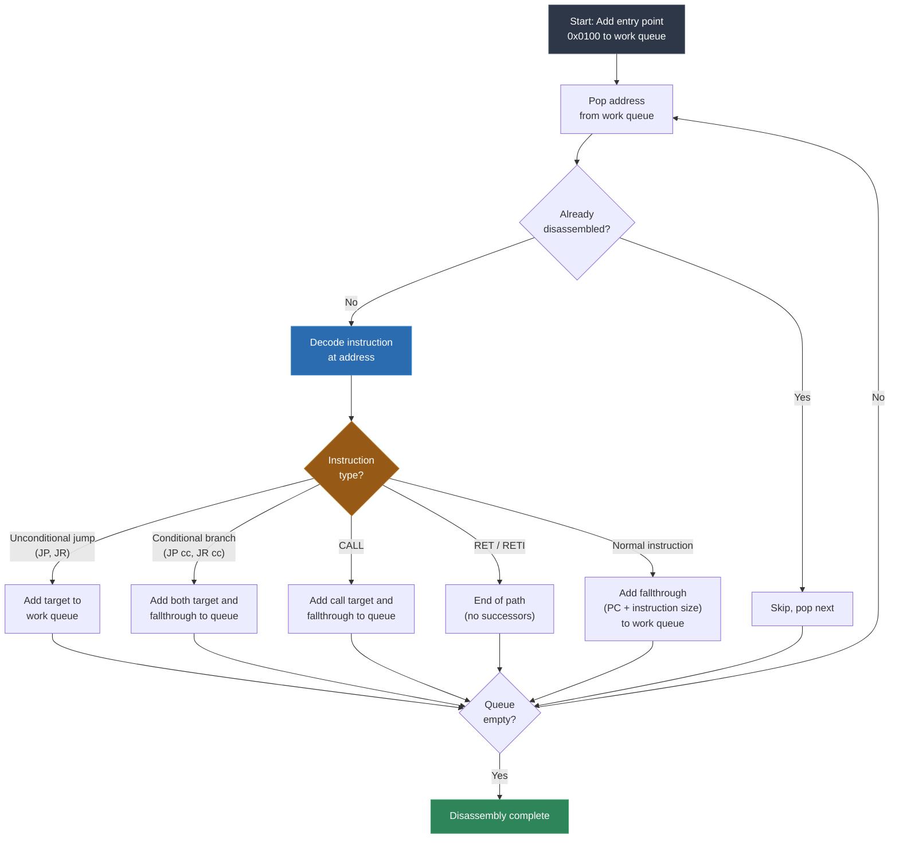
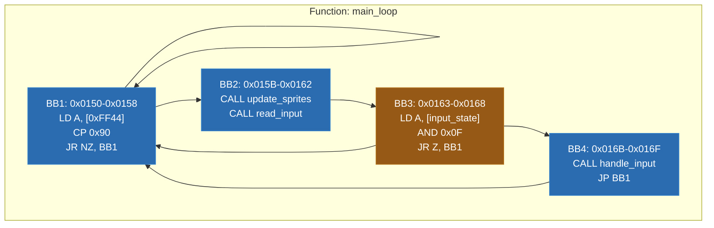
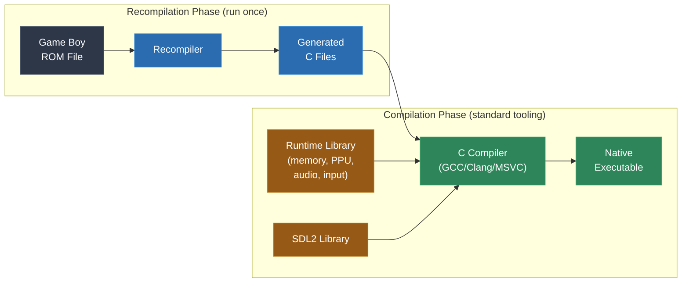

# Module 4: Your First Recompilation -- Game Boy

This module is where theory becomes practice. You will walk through the complete static recompilation pipeline on the simplest commercially relevant architecture: the Sharp SM83 processor used in the Game Boy. By the end, you will understand every stage of the pipeline not as an abstract concept, but as concrete code that turns a Game Boy ROM into a native executable.

The Game Boy is the ideal first target. It is 8-bit, has a small and well-documented instruction set, a straightforward memory map, and a library of thousands of games that exercised the hardware in creative ways. If you can recompile a Game Boy game, you have the foundation to tackle anything.

---

## 1. Why Start with Game Boy?

The Game Boy's SM83 processor is the simplest commercially relevant CPU you will encounter in this course. That simplicity is not a weakness -- it is an asset. Every concept in the static recompilation pipeline is present here, but none of them are obscured by architectural complexity.

Consider the alternatives. The SNES uses the 65816, which has variable-width registers controlled by runtime flags -- you cannot even know the size of an operand without tracking processor state. The N64 uses MIPS with delay slots and 64-bit operations. The Xbox uses x86, the most irregular instruction set in common use. Each of these adds layers of complexity that can distract from the core pipeline.

The Game Boy gives you:

- **A fixed 8-bit data path.** Every register is 8 bits (with 16-bit pairs for addressing). No ambiguity about operand size.
- **A small instruction set.** 256 base opcodes plus 256 CB-prefixed opcodes, most of which are regular and predictable.
- **A flat-ish memory map.** 16-bit address space (64KB), with bank switching handled by a memory bank controller (MBC) that operates at well-defined addresses.
- **Extensive documentation.** The Game Boy has been studied and documented by hobbyists for over 30 years. The Pan Docs, GBEDG, and countless other references describe every hardware register, timing detail, and edge case.
- **Real results quickly.** You can have a fully recompiled, playable Game Boy game in far less code than any other platform would require.

The point is not that Game Boy recompilation is trivial. It is not -- you will encounter real challenges with bank switching, indirect jumps, and hardware integration. But those challenges are tractable, and solving them will prepare you for the harder versions that appear in later modules.

---

## 2. The SM83 Instruction Set

The SM83 (sometimes incorrectly called "Z80" or "GBZ80") is a custom Sharp processor that borrows from both the Intel 8080 and Zilog Z80 but is neither. It has its own instruction encoding, its own flag behavior, and its own quirks.

### Registers

The SM83 has the following registers:

| Register | Size | Purpose |
|---|---|---|
| A | 8-bit | Accumulator -- destination for most arithmetic |
| F | 8-bit | Flags: Z (zero), N (subtract), H (half-carry), C (carry) |
| B, C | 8-bit each | General purpose; BC forms a 16-bit pair |
| D, E | 8-bit each | General purpose; DE forms a 16-bit pair |
| H, L | 8-bit each | General purpose; HL forms a 16-bit pair, often used as memory pointer |
| SP | 16-bit | Stack pointer |
| PC | 16-bit | Program counter |

The flag register F only uses the upper 4 bits. Bit 7 is the zero flag (Z), bit 6 is the subtract flag (N), bit 5 is the half-carry flag (H), and bit 4 is the carry flag (C). The lower 4 bits are always zero.

### Instruction Categories

The 512 total opcodes (256 base + 256 CB-prefixed) fall into these categories:

**Loads** -- Moving data between registers, between registers and memory, loading immediate values. Examples: `LD A, B`, `LD A, [HL]`, `LD [HL], 0x42`, `LD SP, HL`.

**Arithmetic** -- 8-bit and 16-bit addition, subtraction, increment, decrement, with and without carry. Examples: `ADD A, B`, `ADC A, [HL]`, `SUB 0x10`, `INC HL`, `DEC B`.

**Logic** -- AND, OR, XOR, complement. Examples: `AND B`, `OR [HL]`, `XOR A`, `CPL`.

**Control Flow** -- Jumps (absolute and relative), calls, returns, conditional variants. Examples: `JP 0x1234`, `JR NZ, offset`, `CALL 0x4000`, `RET Z`, `RST 0x38`.

**Bit Operations (CB-prefixed)** -- Test, set, and reset individual bits. Rotates and shifts. Examples: `BIT 7, A`, `SET 3, [HL]`, `RES 0, B`, `SRL A`, `SWAP A`.

**Miscellaneous** -- `NOP`, `HALT`, `STOP`, `DI`, `EI`, `DAA`, `SCF`, `CCF`.

### Encoding Structure

The base opcode space is highly regular. The upper two bits of the opcode byte select the instruction group, and the lower six bits encode source and destination registers in a predictable pattern. This regularity makes the disassembler straightforward to implement -- most instructions can be decoded with a few bit masks rather than a 256-entry lookup table.

The CB prefix introduces a second opcode byte. All 256 CB-prefixed instructions operate on a single register (or the memory location [HL]) and perform bit manipulation: rotates, shifts, bit test, bit set, and bit reset. The upper two bits select the operation, the middle three bits select the bit number (for BIT/SET/RES), and the lower three bits select the register.

---

## 3. Pipeline Walkthrough

This section walks through every stage of recompiling a Game Boy ROM, from the raw binary file to a compiled native executable. This is not pseudocode or theory -- this is the actual process.

### Step 1: ROM Parsing

A Game Boy ROM file is a flat binary image that maps directly into the Game Boy's address space. The first 16KB (bank 0) is always mapped at `0x0000-0x3FFF`. Additional 16KB banks are switched into `0x4000-0x7FFF` by the memory bank controller.

The ROM header occupies `0x0100-0x014F` and contains:

| Offset | Size | Field |
|---|---|---|
| 0x0100-0x0103 | 4 bytes | Entry point (usually `NOP` + `JP 0x0150`) |
| 0x0104-0x0133 | 48 bytes | Nintendo logo (used for boot ROM validation) |
| 0x0134-0x0143 | 16 bytes | Title (ASCII) |
| 0x0147 | 1 byte | Cartridge type (MBC type) |
| 0x0148 | 1 byte | ROM size code |
| 0x0149 | 1 byte | RAM size code |
| 0x014A | 1 byte | Destination code |
| 0x014D | 1 byte | Header checksum |

The cartridge type byte at `0x0147` tells you which memory bank controller the cartridge uses. This is critical because it determines how bank switching works:

- `0x00`: No MBC (32KB ROM only)
- `0x01-0x03`: MBC1
- `0x0F-0x13`: MBC3
- `0x19-0x1E`: MBC5

The ROM size code at `0x0148` tells you the total ROM size: `0x00` = 32KB (2 banks), `0x01` = 64KB (4 banks), up to `0x08` = 8MB (512 banks).

Your parser reads this header, validates the checksum, determines the MBC type and ROM size, and prepares the raw code bytes for disassembly.

### Step 2: Disassembly

Disassembly begins with recursive descent from the entry point at `0x0100`. The algorithm is:



In addition to the entry point, you should seed the work queue with:

- **Interrupt vectors**: `0x0040` (VBlank), `0x0048` (LCD STAT), `0x0050` (Timer), `0x0058` (Serial), `0x0060` (Joypad). These are code entry points that the hardware jumps to, not reachable through normal control flow.
- **RST targets**: `0x0000`, `0x0008`, `0x0010`, `0x0018`, `0x0020`, `0x0028`, `0x0030`, `0x0038`. The RST instruction is a one-byte call to these fixed addresses.

Bank switching complicates disassembly. Code in bank 0 (`0x0000-0x3FFF`) is always accessible, but code at `0x4000-0x7FFF` depends on which ROM bank is currently switched in. The disassembler must track which bank is active to correctly resolve addresses in the banked region. In practice, this means maintaining a mapping of (bank, address) pairs and disassembling each bank's code separately.

### Step 3: Control Flow Analysis

Once all instructions are disassembled, group them into basic blocks. A basic block starts at any address that is:

- The entry point
- The target of any jump or call
- The instruction immediately following a conditional branch (the fallthrough path)

A basic block ends at any instruction that is:

- An unconditional jump (JP, JR)
- A conditional branch (JP cc, JR cc, CALL cc)
- A return (RET, RETI)
- A call (CALL) -- because the callee might not return, or might modify state

Connect the basic blocks with edges to form the control flow graph:



The control flow graph is the foundation for everything that follows. It tells the code generator how to structure the output -- which blocks form loops, which are conditionally executed, and where function boundaries likely are.

### Step 4: Instruction Lifting

This is the heart of the recompiler. Every SM83 instruction is translated into one or more lines of C code. The CPU state is represented as a struct:

```c
typedef struct {
    uint8_t a, b, c, d, e, h, l;
    uint8_t flag_z, flag_n, flag_h, flag_c;
    uint16_t sp, pc;
} SM83Context;
```

Here are the lifting rules for key instruction groups:

| SM83 Instruction | Generated C Code | Notes |
|---|---|---|
| `LD A, B` | `ctx->a = ctx->b;` | Register-to-register load |
| `LD A, [HL]` | `ctx->a = mem_read(ctx->h << 8 \| ctx->l);` | Memory read via HL |
| `LD [HL], A` | `mem_write(ctx->h << 8 \| ctx->l, ctx->a);` | Memory write via HL |
| `LD A, 0x42` | `ctx->a = 0x42;` | Immediate load |
| `ADD A, B` | `result = ctx->a + ctx->b;`<br>`ctx->flag_z = (result & 0xFF) == 0;`<br>`ctx->flag_n = 0;`<br>`ctx->flag_h = ((ctx->a & 0xF) + (ctx->b & 0xF)) > 0xF;`<br>`ctx->flag_c = result > 0xFF;`<br>`ctx->a = result & 0xFF;` | Full flag computation |
| `SUB B` | Similar to ADD with subtraction | N flag set to 1 |
| `AND B` | `ctx->a &= ctx->b;`<br>`ctx->flag_z = ctx->a == 0;`<br>`ctx->flag_n = 0; ctx->flag_h = 1; ctx->flag_c = 0;` | H flag always set for AND |
| `INC B` | `ctx->b++;`<br>`ctx->flag_z = ctx->b == 0;`<br>`ctx->flag_n = 0;`<br>`ctx->flag_h = (ctx->b & 0xF) == 0;` | Carry flag unaffected |
| `JP 0x1234` | `goto label_0x1234;` | Direct jump becomes goto |
| `JR NZ, offset` | `if (!ctx->flag_z) goto label_target;` | Conditional relative jump |
| `CALL 0x4000` | `func_0x4000(ctx);` | Call becomes C function call |
| `RET` | `return;` | Return from C function |
| `PUSH BC` | `ctx->sp -= 2;`<br>`mem_write(ctx->sp + 1, ctx->b);`<br>`mem_write(ctx->sp, ctx->c);` | Stack grows downward |
| `POP BC` | `ctx->c = mem_read(ctx->sp);`<br>`ctx->b = mem_read(ctx->sp + 1);`<br>`ctx->sp += 2;` | Pop in little-endian order |
| `BIT 7, A` | `ctx->flag_z = !(ctx->a & 0x80);`<br>`ctx->flag_n = 0; ctx->flag_h = 1;` | Test bit, carry unaffected |
| `RL A` | `carry = ctx->flag_c;`<br>`ctx->flag_c = (ctx->a >> 7) & 1;`<br>`ctx->a = (ctx->a << 1) \| carry;`<br>`ctx->flag_z = ctx->a == 0;`<br>`ctx->flag_n = 0; ctx->flag_h = 0;` | Rotate left through carry |

These rules are mechanical. Every instruction in the SM83 set gets a rule, and the lifter applies the appropriate rule for each opcode it encounters. The complexity is not in any individual rule but in getting all of them correct -- particularly the flag behavior, where subtle errors cause cascading failures downstream.

### Step 5: Memory Bus

The Game Boy has a 16-bit address space divided into well-defined regions. Your runtime must implement the full memory map:

```
+------------------+-------+----------------------------------------+
| Address Range    | Size  | Region                                 |
+------------------+-------+----------------------------------------+
| 0x0000 - 0x3FFF | 16 KB | ROM Bank 0 (fixed)                     |
| 0x4000 - 0x7FFF | 16 KB | ROM Bank 1-N (switchable)              |
| 0x8000 - 0x9FFF |  8 KB | VRAM (Video RAM)                       |
| 0xA000 - 0xBFFF |  8 KB | External RAM (cartridge, switchable)    |
| 0xC000 - 0xCFFF |  4 KB | WRAM Bank 0                            |
| 0xD000 - 0xDFFF |  4 KB | WRAM Bank 1 (switchable on CGB)        |
| 0xE000 - 0xFDFF |       | Echo RAM (mirror of 0xC000-0xDDFF)     |
| 0xFE00 - 0xFE9F |       | OAM (Object Attribute Memory)          |
| 0xFEA0 - 0xFEFF |       | Unusable                               |
| 0xFF00 - 0xFF7F |       | I/O Registers                          |
| 0xFF80 - 0xFFFE |       | High RAM (HRAM)                        |
| 0xFFFF          | 1 byte| Interrupt Enable register              |
+------------------+-------+----------------------------------------+
```

The `mem_read` and `mem_write` functions in the runtime dispatch to the correct backing memory based on the address. Writes to `0x0000-0x7FFF` do not write to ROM -- they are intercepted by the MBC and interpreted as bank switch commands or RAM enable signals.

I/O registers at `0xFF00-0xFF7F` are especially important. Writing to `0xFF40` (LCDC) controls whether the LCD is on and how tiles and sprites are displayed. Writing to `0xFF46` (DMA) triggers an OAM DMA transfer. Reading `0xFF44` (LY) returns the current scanline. The runtime must emulate each of these with correct side effects.

### Step 6: PPU Integration

The Pixel Processing Unit (PPU) is the Game Boy's video hardware. It renders 160x144 pixel frames at approximately 60Hz, drawing the screen one scanline at a time.

For a static recompilation runtime, you have two choices:

**Scanline rendering**: Render each scanline when the recompiled code reads or writes PPU-related registers. This is simpler and sufficient for most games. After each scanline, update an internal framebuffer. At VBlank (when the PPU finishes all 144 visible scanlines), present the framebuffer to the screen.

**Cycle-accurate PPU**: Emulate the PPU's pixel pipeline exactly, including mid-scanline register changes. This is necessary only for games that use advanced PPU tricks (scanline effects, window wobble, etc.) and is significantly more complex.

For your first recompilation, scanline rendering is the right choice. The runtime tracks the current scanline counter and, when the recompiled code enters a VBlank wait loop, advances the PPU state and renders the pending scanlines.

The key PPU-related I/O registers your runtime must handle:

| Register | Address | Purpose |
|---|---|---|
| LCDC | 0xFF40 | LCD control: display enable, tile data area, window enable, etc. |
| STAT | 0xFF41 | LCD status: current mode, coincidence flag, interrupt enables |
| SCY | 0xFF42 | Background scroll Y |
| SCX | 0xFF43 | Background scroll X |
| LY | 0xFF44 | Current scanline (read-only, 0-153) |
| LYC | 0xFF45 | Scanline compare value |
| BGP | 0xFF47 | Background palette |
| OBP0 | 0xFF48 | Object palette 0 |
| OBP1 | 0xFF49 | Object palette 1 |
| WY | 0xFF4A | Window Y position |
| WX | 0xFF4B | Window X position |

### Step 7: Bank Switching

The Game Boy's 16-bit address space can only address 64KB, but cartridges can hold up to 8MB of ROM. The memory bank controller (MBC) extends addressing by allowing different 16KB ROM banks to be mapped into the `0x4000-0x7FFF` address range.

The three most common MBCs:

**MBC1**: The simplest banking scheme. Writing a value to `0x2000-0x3FFF` selects the ROM bank for `0x4000-0x7FFF`. Supports up to 2MB ROM and 32KB RAM. Has a quirk where bank 0 cannot be selected (writing 0 selects bank 1 instead).

**MBC3**: Adds a real-time clock. Writing to `0x2000-0x3FFF` selects the ROM bank (7-bit value, up to 128 banks). Writing to `0x4000-0x5FFF` selects the RAM bank or maps an RTC register.

**MBC5**: The most straightforward. Writing to `0x2000-0x2FFF` sets the lower 8 bits of the bank number, and writing to `0x3000-0x3FFF` sets bit 8. This allows addressing up to 512 banks (8MB). Unlike MBC1, bank 0 can be selected normally.

For the recompiler, bank switching means that code at address `0x4000` could be from any bank. You must track which bank is active to know which code is actually executing. There are two approaches:

**Static bank tracking**: Analyze the code to determine which bank is switched in at each call site. If a function in bank 0 writes bank number 3 to the MBC and then calls address `0x4000`, you know it is calling code in bank 3. This works well for most cases.

**Runtime bank dispatch**: When the bank cannot be determined statically, emit code that checks the current bank number at runtime and dispatches to the correct function. This handles dynamic bank switching patterns.

---

## 4. The Indirect Jump Fallback

Most Game Boy programs use direct jumps and calls -- `JP 0x1234` or `CALL 0x4000` -- where the target address is encoded in the instruction. These are straightforward: the recompiler knows exactly where execution goes and can translate them to `goto` or function calls.

But the SM83 also supports `JP HL` and `CALL` to computed addresses via self-modifying code or other tricks. With `JP HL`, the target address is in the HL register, computed at runtime. The recompiler cannot know at compile time what value HL will hold.

For your first recompiler, the simplest solution is a fallback mechanism: when the recompiled code encounters an indirect jump that cannot be statically resolved, it falls back to an interpreter that can handle any target address. The interpreter executes instructions one at a time until it reaches a known address, at which point control returns to the recompiled code.

This is not the only solution, and it is not the best solution -- but it works, and it gets your first recompilation running. Module 7 is dedicated entirely to the indirect call problem and covers the full range of solutions, from static analysis to dispatch tables to the three-tier architecture used in production recompilers.

On the Game Boy, indirect jumps are relatively rare. Most games use `JP HL` only in a few well-known patterns (jump tables, callback dispatchers), and these can often be resolved through data flow analysis. You may find that for your first target ROM, every indirect jump can be resolved statically, making the fallback unnecessary in practice -- but you should still implement it, because the next architecture you tackle will not be so forgiving.

---

## 5. Putting It Together

The complete build process has two phases: the recompilation phase (which you run once) and the compilation phase (which produces the final executable).



The recompiler reads the ROM, performs disassembly and control flow analysis, lifts every instruction to C, and writes out one or more `.c` files containing the recompiled code. It also generates a header file declaring all the recompiled functions.

The runtime library is written by hand. It provides `mem_read`, `mem_write`, the PPU renderer, audio mixing, input handling, and the main loop that drives execution. It uses SDL2 for cross-platform window creation, rendering, audio output, and input.

The C compiler takes the generated code and the runtime, compiles and links them together, and produces a native executable. This executable is fully standalone -- it does not need the original ROM file at runtime (the ROM data is embedded in the generated C code as arrays or compiled into the binary).

The generated C files will look something like this (simplified):

```c
// recompiled_bank0.c -- generated by recompiler
#include "runtime.h"

void func_0x0150(SM83Context *ctx) {
    // BB1: 0x0150
    ctx->a = mem_read(0xFF44);
    cp_update_flags(ctx, ctx->a, 0x90);
    if (!ctx->flag_z) goto label_0x0150;
    // BB2: 0x0156
    func_0x1A00(ctx);  // update_sprites
    func_0x1B00(ctx);  // read_input
    // BB3: 0x015A
    ctx->a = mem_read(0xC100);
    ctx->a &= 0x0F;
    ctx->flag_z = ctx->a == 0;
    ctx->flag_n = 0;
    ctx->flag_h = 1;
    ctx->flag_c = 0;
    if (ctx->flag_z) goto label_0x0150;
    // BB4: 0x0162
    func_0x0800(ctx);  // handle_input
    goto label_0x0150;
label_0x0150:
    // (loop back)
    func_0x0150(ctx);
}
```

This is mechanically generated, not hand-written. It is not pretty, but it is correct, portable, and compiles to fast native code.

---

## 6. Real-World Reference

Two projects demonstrate Game Boy static recompilation at production quality:

**gb-recompiled** by sp00nznet is a general-purpose Game Boy recompilation toolkit. It implements the full pipeline described in this module: ROM parsing, recursive descent disassembly with bank tracking, SM83-to-C lifting, and a runtime with PPU rendering, audio, and input. It handles MBC1, MBC3, and MBC5 cartridges and has been used to recompile multiple commercial Game Boy titles into standalone native executables.

**LinksAwakening** by sp00nznet is a specific application of Game Boy recompilation to *The Legend of Zelda: Link's Awakening DX*. This project demonstrates the additional complexity that a full commercial game introduces: large ROM with many banks, extensive use of bank switching for both code and data, interrupt-driven audio, and hardware-dependent rendering tricks. It also demonstrates the modifiability advantage of static recompilation -- once the code is in C, enhancements like widescreen rendering and high-resolution output become possible.

Studying these projects will give you a concrete reference for every concept in this module. The code structure, the lifting rules, the runtime architecture -- all of it is implemented and working.

---

## Labs

The following labs accompany this module:

- **Lab 1** -- SM83 disassembler: Build a recursive descent disassembler for Game Boy ROMs
- **Lab 4** -- SM83 instruction lifter: Implement the lifting rules for the full SM83 instruction set
- **Lab 5** -- Game Boy memory bus: Build the runtime memory map with MBC support
- **Lab 6** -- Full Game Boy recompilation: Combine all components into a working recompiler and runtime

---

**Next: [Module 5 -- SNES: 65816 and Hardware Integration](../module-05-snes/lecture.md)**
