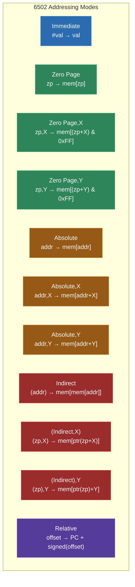
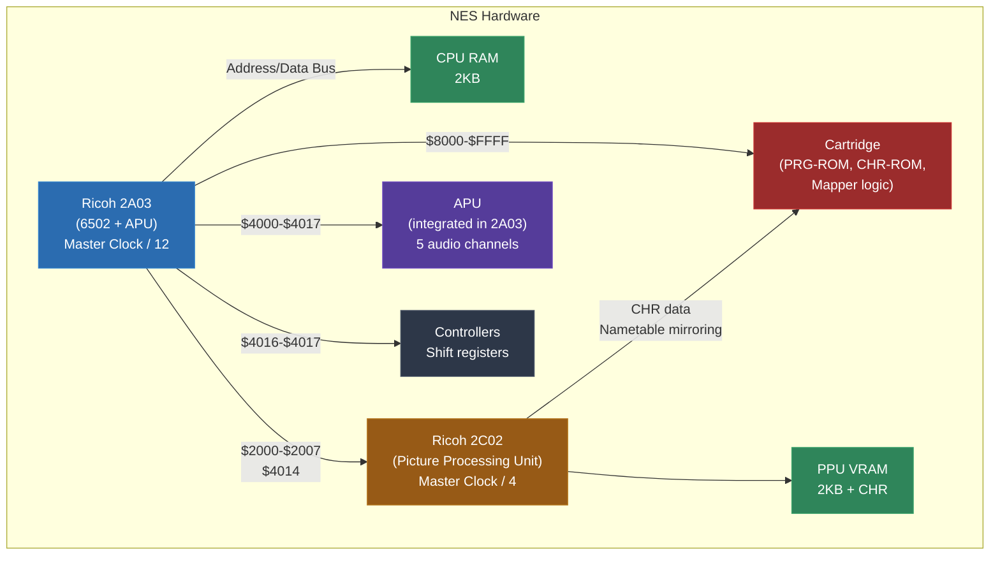
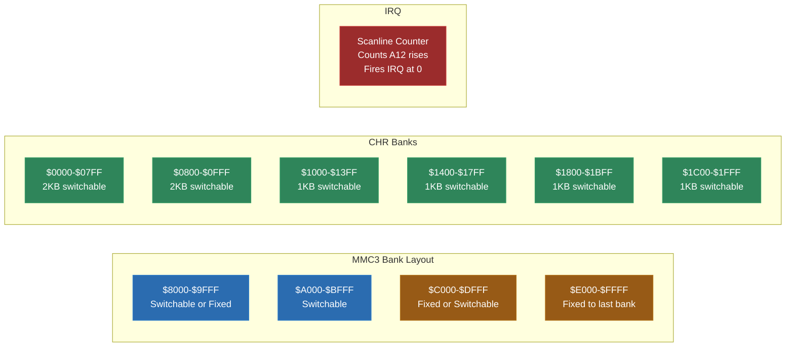
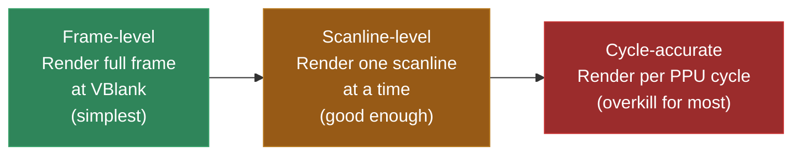
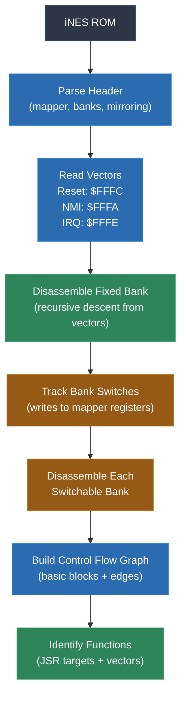

# Module 10: NES -- 6502 Recompilation

The Nintendo Entertainment System is the natural next step after the Game Boy. You have already built a complete recompilation pipeline for an 8-bit handheld. Now you are going to apply that same pipeline to a different 8-bit architecture -- one that is simultaneously simpler in some ways (the 6502 instruction set is smaller and more regular than the SM83) and more complex in others (the NES PPU is a significantly more capable and more finicky piece of hardware, and the mapper ecosystem adds a layer of bank switching complexity that makes Game Boy MBCs look straightforward).

The MOS 6502 is one of the most studied processors in computing history. It powered the Apple II, the Commodore 64, the Atari 2600, and the NES. If you understand the 6502, you have a foothold in an enormous chunk of computing history. And if you can recompile NES games, you have a second architecture under your belt, which means you are starting to see the patterns that are universal to static recompilation -- the things that stay the same regardless of the target.

This module covers the 6502 CPU in detail, the NES hardware model, the mapper system, PPU integration for recompilation, and the full pipeline from iNES ROM to native executable.

---

## 1. Why the NES After Game Boy?

If you have completed Module 9, you have a working Game Boy recompiler. You understand recursive descent disassembly, basic block construction, instruction lifting, memory bus emulation, and PPU shimming. Everything you learned there applies here -- but the NES forces you to handle each of those stages with a slightly different set of constraints.

Here is why the NES is the right second target:

**Different CPU family.** The SM83 in the Game Boy is loosely related to the Intel 8080/Z80 lineage. The 6502 in the NES is a completely different design philosophy. Where the SM83 has named register pairs (BC, DE, HL) and a rich set of CB-prefixed bit operations, the 6502 has just three general-purpose registers (A, X, Y), a zero page that acts as an extension of the register file, and a much simpler -- but also more subtle -- instruction set. Writing a lifter for a second CPU architecture teaches you what is universal about lifting and what is architecture-specific.

**More complex PPU.** The Game Boy PPU renders 160x144 pixels with a 4-shade palette, one background layer, a window layer, and 40 sprites. The NES PPU renders 256x240 pixels with a 64-color master palette (though only 25 colors are visible at once), two nametable layers of background tiles, and 64 sprites with per-sprite palette selection. It supports hardware scrolling across nametables, and games exploit PPU timing to achieve effects like split-screen scrolling and mid-frame palette changes. Shimming the NES PPU for a recompiled game is a real engineering challenge.

**The mapper ecosystem.** The Game Boy has a handful of MBC types (MBC1, MBC3, MBC5) that are well-understood and relatively uniform. The NES has over 250 documented mapper types, though most games use one of about 10 common ones. Some mappers (like MMC3) have IRQ counters that fire mid-frame, some (like MMC5) add extra RAM and graphics capabilities, and some are weird one-off designs for a single game. Your recompiler needs to handle at least the major mappers, and the mapper abstraction must be flexible enough to add new ones.

**Huge library.** The NES library contains roughly 2,500 licensed games (and many more unlicensed). This is a massive corpus of software that spans a decade of game design, from simple single-screen games to complex RPGs with extensive bank switching. If your recompiler can handle the NES library, it can handle a lot.

**Bridge to the SNES.** The SNES CPU (65816) is a direct descendant of the 6502. If you learn the 6502 thoroughly here, the 65816 in Module 11 will feel like an extension of what you already know -- because it literally is.

---

## 2. The MOS 6502 CPU

The MOS Technology 6502 was designed in 1975 by Chuck Peddle and a small team who had left Motorola. It was designed to be cheap -- at $25, it was a fraction of the cost of competing processors like the Motorola 6800 ($175) and Intel 8080 ($150). That low price made it the engine of the personal computer revolution.

The 6502 used in the NES is technically the Ricoh 2A03 (NTSC) or 2A07 (PAL), which is a 6502 core with the BCD (Binary-Coded Decimal) mode disabled and an integrated audio processing unit (APU). For recompilation purposes, it is a standard 6502 minus BCD, plus some memory-mapped APU registers.

### Registers

The 6502 has a tiny register set compared to most processors. This is both a strength (less state to track) and a weakness (programs are constantly shuffling data through the accumulator).

| Register | Size | Purpose |
|---|---|---|
| A | 8-bit | Accumulator -- the only register that can do arithmetic and logic |
| X | 8-bit | Index register X -- used for indexed addressing, loop counters |
| Y | 8-bit | Index register Y -- used for indexed addressing, loop counters |
| SP | 8-bit | Stack pointer -- points into page 1 (0x0100-0x01FF) |
| PC | 16-bit | Program counter |
| P | 8-bit | Processor status (flags) |

That is it. Three 8-bit working registers, an 8-bit stack pointer (the stack is fixed to page 1, so you only need the low byte), a 16-bit program counter, and a flags register.

The processor status register P contains the following flags:

```
  Bit 7   Bit 6   Bit 5   Bit 4   Bit 3   Bit 2   Bit 1   Bit 0
+-------+-------+-------+-------+-------+-------+-------+-------+
|   N   |   V   |   -   |   B   |   D   |   I   |   Z   |   C   |
+-------+-------+-------+-------+-------+-------+-------+-------+
  Neg.    Over.   (unused)  Break   Dec.    IRQ     Zero    Carry
                            flag    mode    dis.
```

- **N (Negative)**: Set when the result of an operation has bit 7 set. This is the sign bit in two's complement.
- **V (Overflow)**: Set when a signed arithmetic operation produces a result that does not fit in a signed byte (-128 to 127).
- **B (Break)**: Not a real flag in the register -- it exists only in the copy pushed to the stack by BRK and PHP. Hardware interrupts push P with B=0; BRK pushes P with B=1. This is how interrupt handlers distinguish between BRK and IRQ.
- **D (Decimal)**: Enables BCD mode for ADC and SBC. On the NES, this flag can be set but has no effect -- the Ricoh 2A03 omitted the BCD circuitry.
- **I (Interrupt Disable)**: When set, maskable interrupts (IRQ) are ignored. NMI is not affected.
- **Z (Zero)**: Set when the result of an operation is zero.
- **C (Carry)**: Set on unsigned overflow from addition, or unsigned "no borrow" from subtraction. Also used as the bit shifted in/out by rotate instructions.

### The Zero Page

Here is where the 6502 gets interesting. The first 256 bytes of memory (addresses 0x0000-0x00FF) are called the "zero page." The 6502 has special addressing modes that access the zero page with a single-byte address instead of a two-byte address. This makes zero page accesses faster (one fewer cycle) and smaller (one fewer byte in the instruction).

In practice, programmers use the zero page as an extension of the register file. Since the 6502 only has three working registers, storing frequently-used variables in the zero page is essential. NES games typically have a well-defined layout of zero page variables: pointer pairs for indirect addressing, loop counters, temporary values, game state flags.

For the recompiler, this matters because zero page accesses are extremely common and should be efficient. You might consider lifting zero page locations to C local variables or struct fields rather than routing every access through the general memory bus. This can produce significantly faster generated code.

```c
// Naive approach: all memory through the bus
ctx->a = mem_read(0x0010);  // LDA $10

// Optimized approach: zero page as struct fields
ctx->a = ctx->zp[0x10];    // LDA $10 (direct array access, no bus dispatch)
```

### Addressing Modes

The 6502 has 13 addressing modes. This is more than the SM83 and more than most RISC architectures, but they follow a logical pattern. Understanding them is essential for writing the lifter.

**Implied / Accumulator** -- The instruction operates on a fixed register or has no operand.
```
CLC          ; Clear carry flag (implied)
TAX          ; Transfer A to X (implied)
ASL A        ; Arithmetic shift left on accumulator
ROR A        ; Rotate right on accumulator
```

**Immediate** -- An 8-bit constant follows the opcode.
```
LDA #$42     ; Load 0x42 into A
CMP #$00     ; Compare A with 0
AND #$0F     ; AND A with 0x0F
```

**Zero Page** -- An 8-bit address in the zero page.
```
LDA $10      ; Load byte at address 0x0010
STA $20      ; Store A at address 0x0020
INC $30      ; Increment byte at address 0x0030
```

**Zero Page,X** -- Zero page address plus X register (wraps within page).
```
LDA $10,X    ; Load from address (0x10 + X) & 0xFF
STA $20,X    ; Store to address (0x20 + X) & 0xFF
```

**Zero Page,Y** -- Zero page address plus Y register (wraps within page). Only used by LDX and STX.
```
LDX $10,Y    ; Load X from address (0x10 + Y) & 0xFF
STX $20,Y    ; Store X to address (0x20 + Y) & 0xFF
```

**Absolute** -- A full 16-bit address.
```
LDA $4015    ; Load from address 0x4015 (APU status)
STA $2007    ; Store to address 0x2007 (PPU data)
JMP $C000    ; Jump to address 0xC000
JSR $8000    ; Call subroutine at 0x8000
```

**Absolute,X** -- 16-bit address plus X register.
```
LDA $0200,X  ; Load from address 0x0200 + X
STA $0300,X  ; Store to address 0x0300 + X
```

**Absolute,Y** -- 16-bit address plus Y register.
```
LDA $0200,Y  ; Load from address 0x0200 + Y
STA $0300,Y  ; Store to address 0x0300 + Y
```

**Indirect** -- Used only by JMP. The operand is an address that contains the target address.
```
JMP ($FFFC)  ; Jump to the address stored at 0xFFFC/0xFFFD
```
This mode has a famous bug: if the pointer crosses a page boundary (e.g., `JMP ($02FF)`), the 6502 reads the low byte from `$02FF` and the high byte from `$0200` instead of `$0300`. The hardware wraps within the page. Your lifter must replicate this bug.

**Indexed Indirect (X)** -- Also called "(Indirect,X)" or "pre-indexed indirect." Adds X to a zero page address, then reads a 16-bit pointer from that zero page location.
```
LDA ($20,X)  ; effective_addr = read16(($20 + X) & 0xFF); A = read(effective_addr)
```
The zero page addition wraps. If X=4 and the base is $FE, it reads the pointer from $02/$03, not from $0102/$0103. This mode is relatively rare in NES games.

**Indirect Indexed (Y)** -- Also called "(Indirect),Y" or "post-indexed indirect." Reads a 16-bit pointer from a zero page address, then adds Y.
```
LDA ($20),Y  ; base_addr = read16($20); A = read(base_addr + Y)
```
This is the most common way to do pointer-based memory access on the 6502. A pair of zero page bytes holds a 16-bit base address, and Y provides the offset. NES games use this pattern constantly for accessing data tables, sprite data, map tiles, and text strings.

**Relative** -- Used only by branch instructions. A signed 8-bit offset from the current PC.
```
BEQ $FE      ; Branch to PC + signed_offset if zero flag set
BNE $10      ; Branch to PC + 16 if zero flag clear
```
The range is -128 to +127 bytes from the instruction following the branch. This means branches cannot reach very far -- for long conditional jumps, you need to branch over a JMP.

Here is a summary diagram of how the addressing modes resolve to effective addresses:



---

## 3. The 6502 Instruction Set

The 6502 has 56 official instructions that combine with the addressing modes to produce 151 valid opcodes (out of a possible 256). The remaining 105 opcode slots are "undocumented" instructions -- we will discuss those later.

Let me walk through the instruction categories. You need to understand all of these to write the lifter.

### Load and Store

These move data between registers and memory. Simple, but they are the most common instructions in any 6502 program.

| Instruction | Operation | Flags Affected |
|---|---|---|
| LDA | A = memory | N, Z |
| LDX | X = memory | N, Z |
| LDY | Y = memory | N, Z |
| STA | memory = A | none |
| STX | memory = X | none |
| STY | memory = Y | none |

Load instructions set the N and Z flags based on the value loaded. Store instructions do not affect flags. This is consistent and easy to lift:

```c
// LDA absolute
void lift_lda_abs(FILE *out, uint16_t addr) {
    fprintf(out, "    ctx->a = mem_read(0x%04X);\n", addr);
    fprintf(out, "    ctx->flag_z = (ctx->a == 0);\n");
    fprintf(out, "    ctx->flag_n = (ctx->a >> 7) & 1;\n");
}

// STA zero page
void lift_sta_zp(FILE *out, uint8_t zp_addr) {
    fprintf(out, "    mem_write(0x%04X, ctx->a);\n", zp_addr);
    // No flag updates
}
```

### Transfer Instructions

Move data between registers. No memory access involved.

| Instruction | Operation | Flags Affected |
|---|---|---|
| TAX | X = A | N, Z |
| TAY | Y = A | N, Z |
| TXA | A = X | N, Z |
| TYA | A = Y | N, Z |
| TSX | X = SP | N, Z |
| TXS | SP = X | none |

Note that TXS (transfer X to stack pointer) does not affect flags. This is the only transfer that does not update N and Z. TXS is typically used during initialization to set up the stack.

### Arithmetic

The 6502 has only two arithmetic instructions: ADC (add with carry) and SBC (subtract with borrow). There is no "plain add" or "plain subtract" -- you must always account for the carry flag.

**ADC (Add with Carry):**
```
A = A + operand + C
```
Sets N, Z, C, V flags.

**SBC (Subtract with Borrow):**
```
A = A - operand - (1 - C)
```
Or equivalently: `A = A + ~operand + C` (subtract is add with one's complement).
Sets N, Z, C, V flags. C is set when there is no borrow (the unsigned result is >= 0).

The carry flag behavior is the single most common source of bugs in 6502 recompilers. Let me be very clear about how it works:

For ADC:
- C is set if the unsigned result exceeds 255 (unsigned overflow)
- V is set if the signed result is outside -128 to 127 (signed overflow)

For SBC:
- C is **cleared** if there is a borrow (unsigned underflow). C is **set** if there is no borrow.
- This is the opposite of what you might expect if you are coming from x86 or ARM, where the carry flag after subtraction indicates a borrow.

Here is the complete ADC lifting code:

```c
void lift_adc(FILE *out, const char *operand_expr) {
    fprintf(out, "    {\n");
    fprintf(out, "        uint8_t operand = %s;\n", operand_expr);
    fprintf(out, "        uint16_t sum = (uint16_t)ctx->a + (uint16_t)operand + (uint16_t)ctx->flag_c;\n");
    fprintf(out, "        ctx->flag_v = (~(ctx->a ^ operand) & (ctx->a ^ (uint8_t)sum) & 0x80) ? 1 : 0;\n");
    fprintf(out, "        ctx->flag_c = (sum > 0xFF) ? 1 : 0;\n");
    fprintf(out, "        ctx->a = (uint8_t)sum;\n");
    fprintf(out, "        ctx->flag_z = (ctx->a == 0);\n");
    fprintf(out, "        ctx->flag_n = (ctx->a >> 7) & 1;\n");
    fprintf(out, "    }\n");
}
```

And SBC:

```c
void lift_sbc(FILE *out, const char *operand_expr) {
    fprintf(out, "    {\n");
    fprintf(out, "        uint8_t operand = %s;\n", operand_expr);
    fprintf(out, "        uint16_t diff = (uint16_t)ctx->a - (uint16_t)operand - (uint16_t)(1 - ctx->flag_c);\n");
    fprintf(out, "        ctx->flag_v = ((ctx->a ^ operand) & (ctx->a ^ (uint8_t)diff) & 0x80) ? 1 : 0;\n");
    fprintf(out, "        ctx->flag_c = (diff < 0x100) ? 1 : 0;\n");
    fprintf(out, "        ctx->a = (uint8_t)diff;\n");
    fprintf(out, "        ctx->flag_z = (ctx->a == 0);\n");
    fprintf(out, "        ctx->flag_n = (ctx->a >> 7) & 1;\n");
    fprintf(out, "    }\n");
}
```

The overflow flag formula `(~(A ^ operand) & (A ^ result) & 0x80)` for addition (and `((A ^ operand) & (A ^ result) & 0x80)` for subtraction) is a classic bit trick. It checks whether the inputs had the same sign (for add) or different signs (for subtract) and the result has a different sign from A. If that happens, signed overflow occurred.

**CMP, CPX, CPY (Compare):**

Compare is just subtraction without storing the result. It sets N, Z, and C but not V.

```c
// CMP immediate
void lift_cmp_imm(FILE *out, uint8_t imm) {
    fprintf(out, "    {\n");
    fprintf(out, "        uint16_t result = (uint16_t)ctx->a - (uint16_t)0x%02X;\n", imm);
    fprintf(out, "        ctx->flag_c = (ctx->a >= 0x%02X) ? 1 : 0;\n", imm);
    fprintf(out, "        ctx->flag_z = ((result & 0xFF) == 0);\n");
    fprintf(out, "        ctx->flag_n = (result >> 7) & 1;\n");
    fprintf(out, "    }\n");
}
```

Note: CMP does not use the carry flag as input (unlike SBC). It always computes `A - operand` directly.

### Increment and Decrement

| Instruction | Operation | Flags Affected |
|---|---|---|
| INC | memory++ | N, Z |
| DEC | memory-- | N, Z |
| INX | X++ | N, Z |
| DEX | X-- | N, Z |
| INY | Y++ | N, Z |
| DEY | Y-- | N, Z |

These are straightforward. Note that INC and DEC operate on memory, not on A. There is no "INA" or "DEA" on the original 6502 (the 65C02 added those later). This means incrementing the accumulator requires `CLC; ADC #$01` or the equivalent.

```c
// INX
fprintf(out, "    ctx->x = (ctx->x + 1) & 0xFF;\n");
fprintf(out, "    ctx->flag_z = (ctx->x == 0);\n");
fprintf(out, "    ctx->flag_n = (ctx->x >> 7) & 1;\n");

// DEC zero page
fprintf(out, "    {\n");
fprintf(out, "        uint8_t val = mem_read(0x%04X);\n", zp_addr);
fprintf(out, "        val = (val - 1) & 0xFF;\n");
fprintf(out, "        mem_write(0x%04X, val);\n", zp_addr);
fprintf(out, "        ctx->flag_z = (val == 0);\n");
fprintf(out, "        ctx->flag_n = (val >> 7) & 1;\n");
fprintf(out, "    }\n");
```

### Logic Operations

| Instruction | Operation | Flags Affected |
|---|---|---|
| AND | A = A & operand | N, Z |
| ORA | A = A \| operand | N, Z |
| EOR | A = A ^ operand | N, Z |
| BIT | test A & operand | N, Z, V |

AND, ORA, and EOR are simple. BIT is special: it sets Z based on `A & operand`, but sets N and V from bits 7 and 6 of the *operand*, not the result. This is used to test hardware registers without modifying the accumulator.

```c
// BIT absolute
fprintf(out, "    {\n");
fprintf(out, "        uint8_t operand = mem_read(0x%04X);\n", addr);
fprintf(out, "        ctx->flag_z = ((ctx->a & operand) == 0);\n");
fprintf(out, "        ctx->flag_n = (operand >> 7) & 1;\n");
fprintf(out, "        ctx->flag_v = (operand >> 6) & 1;\n");
fprintf(out, "    }\n");
```

### Shifts and Rotates

| Instruction | Operation | Flags Affected |
|---|---|---|
| ASL | Shift left (bit 7 to C, 0 to bit 0) | N, Z, C |
| LSR | Shift right (bit 0 to C, 0 to bit 7) | N, Z, C |
| ROL | Rotate left through carry (bit 7 to C, C to bit 0) | N, Z, C |
| ROR | Rotate right through carry (bit 0 to C, C to bit 7) | N, Z, C |

These can operate on either the accumulator or a memory location.

```c
// ASL accumulator
fprintf(out, "    ctx->flag_c = (ctx->a >> 7) & 1;\n");
fprintf(out, "    ctx->a = (ctx->a << 1) & 0xFF;\n");
fprintf(out, "    ctx->flag_z = (ctx->a == 0);\n");
fprintf(out, "    ctx->flag_n = (ctx->a >> 7) & 1;\n");

// ROL memory
fprintf(out, "    {\n");
fprintf(out, "        uint8_t val = mem_read(0x%04X);\n", addr);
fprintf(out, "        uint8_t old_carry = ctx->flag_c;\n");
fprintf(out, "        ctx->flag_c = (val >> 7) & 1;\n");
fprintf(out, "        val = ((val << 1) | old_carry) & 0xFF;\n");
fprintf(out, "        mem_write(0x%04X, val);\n", addr);
fprintf(out, "        ctx->flag_z = (val == 0);\n");
fprintf(out, "        ctx->flag_n = (val >> 7) & 1;\n");
fprintf(out, "    }\n");
```

### Branch Instructions

The 6502 has eight conditional branch instructions, each testing a single flag:

| Instruction | Condition | Meaning |
|---|---|---|
| BEQ | Z = 1 | Branch if equal (zero) |
| BNE | Z = 0 | Branch if not equal (not zero) |
| BCS | C = 1 | Branch if carry set |
| BCC | C = 0 | Branch if carry clear |
| BMI | N = 1 | Branch if minus (negative) |
| BPL | N = 0 | Branch if plus (positive) |
| BVS | V = 1 | Branch if overflow set |
| BVC | V = 0 | Branch if overflow clear |

All branches use relative addressing with a signed 8-bit offset. They are two bytes (opcode + offset) and take 2 cycles if not taken, 3 if taken (within the same page), or 4 if taken and crossing a page boundary.

For the lifter, branches become if-goto:

```c
// BNE target_label
fprintf(out, "    if (!ctx->flag_z) goto label_0x%04X;\n", target_addr);

// BCS target_label
fprintf(out, "    if (ctx->flag_c) goto label_0x%04X;\n", target_addr);
```

### Jump and Subroutine

| Instruction | Operation | Notes |
|---|---|---|
| JMP abs | PC = addr | Unconditional jump |
| JMP (ind) | PC = mem[addr] | Indirect jump (has page-crossing bug) |
| JSR abs | Push PC-1, PC = addr | Call subroutine |
| RTS | Pull PC, PC = PC+1 | Return from subroutine |
| RTI | Pull P, Pull PC | Return from interrupt |
| BRK | Push PC+1, Push P, PC = mem[0xFFFE] | Software interrupt |

JSR pushes the address of the *last byte of the JSR instruction* (PC-1), not the address of the next instruction. RTS pulls this address and adds 1. This off-by-one is a detail that does not matter for the lifter (JSR becomes a function call, RTS becomes return), but it matters if you ever need to interpret stack contents.

RTI is different from RTS: it pulls the processor status register P first, then the full return address (without the off-by-one adjustment). RTI is used to return from interrupt handlers.

### Stack Operations

| Instruction | Operation | Flags Affected |
|---|---|---|
| PHA | Push A | none |
| PLA | Pull A | N, Z |
| PHP | Push P | none |
| PLP | Pull P | all (directly loaded) |

The 6502 stack lives at addresses 0x0100-0x01FF. SP is an 8-bit offset into this page, and it decrements on push (grows downward). The stack is small -- only 256 bytes -- so deep call stacks or heavy stack usage can cause wraparound.

PLP is important for the recompiler because it directly loads the processor status register, changing all flags at once. You need to unpack the pulled byte into the individual flag fields:

```c
// PLP
fprintf(out, "    {\n");
fprintf(out, "        uint8_t p = mem_read(0x0100 + (++ctx->sp & 0xFF));\n");
fprintf(out, "        ctx->flag_c = (p >> 0) & 1;\n");
fprintf(out, "        ctx->flag_z = (p >> 1) & 1;\n");
fprintf(out, "        ctx->flag_i = (p >> 2) & 1;\n");
fprintf(out, "        ctx->flag_d = (p >> 3) & 1;\n");
fprintf(out, "        ctx->flag_v = (p >> 6) & 1;\n");
fprintf(out, "        ctx->flag_n = (p >> 7) & 1;\n");
fprintf(out, "    }\n");
```

### Flag Manipulation

| Instruction | Operation |
|---|---|
| CLC | C = 0 |
| SEC | C = 1 |
| CLD | D = 0 |
| SED | D = 1 |
| CLI | I = 0 |
| SEI | I = 1 |
| CLV | V = 0 |

These are trivial to lift. CLC before ADC gives you plain addition. SEC before SBC gives you plain subtraction. SEI disables interrupts. CLD/SED control decimal mode (which has no effect on the NES).

### Miscellaneous

| Instruction | Operation |
|---|---|
| NOP | No operation |
| BRK | Software interrupt |

NOP generates no code (or a comment in the output). BRK triggers a software interrupt, which is rarely used in NES games -- it pushes PC+1 and P to the stack and jumps through the IRQ vector at 0xFFFE.

---

## 4. 6502 Quirks That Affect Lifting

The 6502 is a well-behaved processor for the most part, but there are several quirks that will bite you if you are not aware of them.

### No 16-Bit Registers

The 6502 has no 16-bit general-purpose registers. Every 16-bit operation (16-bit addition, pointer arithmetic, address calculation) must be done in two steps: operate on the low byte, then operate on the high byte with carry.

```asm
; 16-bit addition: add 0x0020 to the pointer at zp $10/$11
CLC
LDA $10          ; Load low byte
ADC #$20         ; Add low byte of value
STA $10          ; Store low byte result
LDA $11          ; Load high byte
ADC #$00         ; Add carry from low byte addition
STA $11          ; Store high byte result
```

For the lifter, this means 16-bit operations appear as sequences of 8-bit operations connected by the carry flag. If you want to optimize the generated code, you can detect these patterns and replace them with a single 16-bit operation in C. But for correctness, lifting each instruction individually works fine -- the carry flag propagation takes care of it.

### Page-Crossing Penalties

Several addressing modes take an extra cycle when the computed effective address crosses a page boundary (when the low byte wraps from 0xFF to 0x00). This affects Absolute,X, Absolute,Y, and (Indirect),Y addressing.

For recompilation, cycle accuracy is not usually the goal, so you can ignore the timing difference. But the page-crossing behavior does matter for one case: the `JMP (indirect)` bug mentioned earlier. If the indirect address is at the end of a page (e.g., `$02FF`), the 6502 reads the low byte from `$02FF` and the high byte from `$0200`, not `$0300`. This is a hardware bug, and some NES games trigger it (intentionally or not). Your lifter must handle this.

```c
// JMP (indirect) with page-crossing bug
uint16_t ptr_addr = operand;
uint8_t lo = mem_read(ptr_addr);
uint8_t hi = mem_read((ptr_addr & 0xFF00) | ((ptr_addr + 1) & 0x00FF));
uint16_t target = (hi << 8) | lo;
```

### BCD Mode on the NES

The Ricoh 2A03 disabled the BCD circuitry. The D flag can still be set and cleared, but ADC and SBC always perform binary arithmetic regardless of the D flag state. This simplifies the lifter -- you do not need to implement BCD mode for NES targets. However, you should be aware that if you ever want to recompile software for other 6502 platforms (Apple II, Commodore 64), you will need full BCD support.

### Undocumented Opcodes

Of the 256 possible opcodes, only 151 are documented. The remaining 105 are "undocumented," "illegal," or "unofficial" -- but they do have defined behavior on the real hardware, and some NES games use them.

The most commonly used undocumented opcodes in NES games:

| Opcode | Mnemonic | Operation | Used By |
|---|---|---|---|
| $4B | ALR | AND #imm, then LSR A | Various |
| $0B | ANC | AND #imm, copy bit 7 to C | Various |
| $6B | ARR | AND #imm, then ROR A (weird flag behavior) | Rare |
| $CB | AXS | X = (A & X) - imm (no borrow) | Rare |
| $A3,$A7,$AF,$B3,$B7,$BF | LAX | Load A and X with same value | Several games |
| $83,$87,$8F,$97 | SAX | Store A & X | Several games |
| $C3,$C7,$CF,$D3,$D7,$DF | DCP | DEC memory, then CMP with A | Some games |
| $E3,$E7,$EF,$F3,$F7,$FF | ISC | INC memory, then SBC from A | Some games |
| $23,$27,$2F,$33,$37,$3F | RLA | ROL memory, then AND with A | Some games |
| $63,$67,$6F,$73,$77,$7F | RRA | ROR memory, then ADC to A | Some games |
| $03,$07,$0F,$13,$17,$1F | SLO | ASL memory, then ORA with A | Some games |
| $43,$47,$4F,$53,$57,$5F | SRE | LSR memory, then EOR with A | Some games |
| $1A,$3A,$5A,$7A,$DA,$FA | NOP | Multi-byte NOPs | Various |

LAX and SAX are the most common. LAX loads both A and X from a single memory read. SAX stores the AND of A and X. These are used by games and also commonly generated by C compilers targeting the 6502 (cc65, for example).

DCP, ISC, RLA, RRA, SLO, and SRE combine a read-modify-write operation on memory with an accumulator operation. They are essentially two instructions fused into one. Some games use them for code size optimization, and some NES development tools generate them.

For the lifter, these are straightforward to implement -- they are just compound operations. But you need to handle them or your recompiler will fail on games that use them. A reasonable first pass is to treat unrecognized opcodes as errors and add support as you encounter them in real ROMs.

```c
// LAX zero page (opcode $A7)
void lift_lax_zp(FILE *out, uint8_t zp_addr) {
    fprintf(out, "    ctx->a = mem_read(0x%04X);\n", zp_addr);
    fprintf(out, "    ctx->x = ctx->a;\n");
    fprintf(out, "    ctx->flag_z = (ctx->a == 0);\n");
    fprintf(out, "    ctx->flag_n = (ctx->a >> 7) & 1;\n");
}

// DCP absolute (opcode $CF): DEC then CMP
void lift_dcp_abs(FILE *out, uint16_t addr) {
    fprintf(out, "    {\n");
    fprintf(out, "        uint8_t val = mem_read(0x%04X);\n", addr);
    fprintf(out, "        val = (val - 1) & 0xFF;\n");
    fprintf(out, "        mem_write(0x%04X, val);\n", addr);
    fprintf(out, "        uint16_t result = (uint16_t)ctx->a - (uint16_t)val;\n");
    fprintf(out, "        ctx->flag_c = (ctx->a >= val) ? 1 : 0;\n");
    fprintf(out, "        ctx->flag_z = ((result & 0xFF) == 0);\n");
    fprintf(out, "        ctx->flag_n = (result >> 7) & 1;\n");
    fprintf(out, "    }\n");
}
```

### The BRK/IRQ Ambiguity

When the 6502 enters an interrupt handler (via the vector at 0xFFFE), it could be because of a hardware IRQ or a BRK instruction. The only way to tell is to check bit 4 (the B flag) in the copy of P that was pushed to the stack. Hardware interrupts push P with B=0; BRK pushes P with B=1.

For NES recompilation, BRK is almost never used by games. But IRQs are used by mappers like MMC3 (which generates scanline-counting IRQs) and by the APU. Your runtime needs to handle IRQ delivery correctly.

---

## 5. NES Hardware Model

The NES hardware is a system of interconnected components that communicate primarily through memory-mapped I/O. Understanding how they fit together is essential for building the runtime that your recompiled code will run against.



### CPU: Ricoh 2A03

The heart of the NES is the Ricoh 2A03 (NTSC) or 2A07 (PAL). It contains:
- A 6502 CPU core (without BCD support)
- An Audio Processing Unit (APU) with 5 channels
- A DMA controller for sprite data transfers (OAM DMA)
- Controller port interface

The CPU runs at 1.789773 MHz (NTSC) or 1.662607 MHz (PAL). This is the master clock divided by 12.

### PPU: Ricoh 2C02

The PPU runs at three times the CPU clock rate (5.369318 MHz NTSC). It renders the display scanline by scanline, producing a 256x240 pixel image (though NTSC TVs typically crop this to about 256x224). Each scanline takes 341 PPU cycles (about 113.67 CPU cycles).

The PPU has its own address space (separate from the CPU) for pattern tables, nametables, and palettes. The CPU communicates with the PPU through eight memory-mapped registers at $2000-$2007, plus the OAM DMA register at $4014.

### APU

The APU provides five audio channels:
- Two pulse/square wave channels with variable duty cycle
- One triangle wave channel
- One noise channel
- One delta modulation channel (DPCM, for low-quality sampled audio)

The APU registers are mapped at $4000-$4013 and $4015. Audio is a significant piece of the NES experience, but for recompilation purposes, the APU can often be handled by existing emulator code (similar to how SNES recompilation leverages LakeSnes).

### Controllers

Controller input is read through $4016 (controller 1) and $4017 (controller 2). Writing $01 then $00 to $4016 latches the button state into the controllers' shift registers. Then reading $4016 repeatedly returns the button states one bit at a time: A, B, Select, Start, Up, Down, Left, Right.

```c
// Controller read implementation
uint8_t controller_read(NESContext *ctx) {
    uint8_t result = (ctx->controller_shift >> ctx->controller_bit) & 1;
    ctx->controller_bit++;
    return result | 0x40;  // Open bus bits
}
```

---

## 6. NES Memory Map

The NES CPU has a 16-bit address space (64KB), divided as follows:

```
+-------------------+-------+------------------------------------------+
| Address Range     | Size  | Region                                   |
+-------------------+-------+------------------------------------------+
| $0000 - $07FF     | 2 KB  | Internal RAM                             |
| $0800 - $1FFF     | 6 KB  | Mirrors of $0000-$07FF                   |
| $2000 - $2007     | 8 B   | PPU Registers                            |
| $2008 - $3FFF     |       | Mirrors of $2000-$2007 (repeating)       |
| $4000 - $4017     | 24 B  | APU and I/O Registers                    |
| $4018 - $401F     | 8 B   | APU test registers (normally disabled)   |
| $4020 - $FFFF     | ~49KB | Cartridge space (PRG-ROM, PRG-RAM, mapper)|
+-------------------+-------+------------------------------------------+
```

### Internal RAM ($0000-$07FF)

Two kilobytes of RAM, mirrored three times up to $1FFF. This means writing to $0000 is the same as writing to $0800, $1000, or $1800.

The RAM is organized by convention (not hardware):

| Range | Convention |
|---|---|
| $0000-$00FF | Zero page (fast access variables) |
| $0100-$01FF | Stack (grows downward from $01FF) |
| $0200-$02FF | Often used for OAM (sprite) data (shadow copy) |
| $0300-$07FF | General-purpose RAM |

### PPU Registers ($2000-$2007)

These eight registers are the CPU's only window into the PPU:

| Address | Register | R/W | Purpose |
|---|---|---|---|
| $2000 | PPUCTRL | W | NMI enable, sprite size, BG pattern table, nametable select |
| $2001 | PPUMASK | W | Color emphasis, sprite/BG enable, left column masking |
| $2002 | PPUSTATUS | R | VBlank flag, sprite 0 hit, sprite overflow |
| $2003 | OAMADDR | W | OAM address for $2004 access |
| $2004 | OAMDATA | R/W | OAM data read/write |
| $2005 | PPUSCROLL | W (x2) | Scroll position (first write = X, second write = Y) |
| $2006 | PPUADDR | W (x2) | PPU address for $2007 access (high byte first, then low) |
| $2007 | PPUDATA | R/W | PPU data read/write at current PPUADDR |

$2005 and $2006 are "double-write" registers -- they accept two sequential writes, toggled by an internal latch (the "w" register). The first write goes to one internal register, the second to another. Reading $2002 resets this latch. This double-write mechanism is one of the trickiest parts of the NES PPU to emulate correctly.

### APU and I/O ($4000-$4017)

| Address | Register | Purpose |
|---|---|---|
| $4000-$4003 | Pulse 1 | Duty, envelope, sweep, timer, length |
| $4004-$4007 | Pulse 2 | Same as Pulse 1 |
| $4008-$400B | Triangle | Linear counter, timer, length |
| $400C-$400F | Noise | Envelope, mode, period, length |
| $4010-$4013 | DMC | Flags, rate, direct load, address, length |
| $4014 | OAMDMA | Write: start OAM DMA transfer from CPU page XX |
| $4015 | Status | R: channel status / W: channel enable |
| $4016 | Controller 1 | W: strobe / R: serial data |
| $4017 | Controller 2/Frame | R: serial data / W: APU frame counter mode |

### Cartridge Space ($4020-$FFFF)

Everything above $4020 is controlled by the cartridge's mapper hardware. The simplest configuration (NROM) maps PRG-ROM directly:

- $8000-$BFFF: First 16KB PRG-ROM bank (or mirror of single bank)
- $C000-$FFFF: Last 16KB PRG-ROM bank

More complex mappers divide this space into switchable banks and may include PRG-RAM (battery-backed for save games) at $6000-$7FFF.

The last six bytes of the address space hold the interrupt vectors:

| Address | Vector |
|---|---|
| $FFFA-$FFFB | NMI handler address |
| $FFFC-$FFFD | Reset handler address |
| $FFFE-$FFFF | IRQ/BRK handler address |

For the recompiler, the memory map translates directly into the `mem_read`/`mem_write` dispatch logic:

```c
uint8_t mem_read(NESContext *ctx, uint16_t addr) {
    if (addr < 0x2000) {
        return ctx->ram[addr & 0x07FF];
    } else if (addr < 0x4000) {
        return ppu_register_read(ctx, 0x2000 + (addr & 0x07));
    } else if (addr < 0x4020) {
        return apu_io_read(ctx, addr);
    } else {
        return mapper_read(ctx, addr);
    }
}

void mem_write(NESContext *ctx, uint16_t addr, uint8_t val) {
    if (addr < 0x2000) {
        ctx->ram[addr & 0x07FF] = val;
    } else if (addr < 0x4000) {
        ppu_register_write(ctx, 0x2000 + (addr & 0x07), val);
    } else if (addr < 0x4020) {
        apu_io_write(ctx, addr, val);
    } else {
        mapper_write(ctx, addr, val);
    }
}
```

---

## 7. Mappers: The NES Bank Switching System

If the Game Boy's MBC system is bank switching 101, the NES mapper ecosystem is the graduate seminar. The NES used a simple cartridge interface with a relatively small address space, and over its lifetime, cartridge manufacturers added increasingly sophisticated hardware to extend the system's capabilities. That hardware is collectively called "mappers."

There are over 250 documented mapper numbers, but the overwhelming majority of commercial NES games use one of about 10 mappers. For your recompiler, supporting these 10 will cover most of the library.

### NROM (Mapper 0)

The simplest possible mapper. No bank switching at all.

- PRG-ROM: 16KB or 32KB, mapped at $8000-$FFFF
- CHR-ROM: 8KB, mapped directly into PPU pattern tables
- No PRG-RAM

If the ROM is 16KB, it is mirrored: $8000-$BFFF and $C000-$FFFF contain the same data.

Games using NROM: *Donkey Kong*, *Super Mario Bros.*, *Balloon Fight*, *Ice Climber*.

For the recompiler, NROM is trivial. There is no bank switching logic to track.

### UNROM (Mapper 2)

Adds switchable PRG-ROM banks.

- PRG-ROM: 16KB banks, up to 256KB total
- Bank at $8000-$BFFF is switchable
- Bank at $C000-$FFFF is fixed to the last bank
- CHR-RAM: 8KB (writable pattern tables)
- Bank select: write to any address in $8000-$FFFF, low bits select the bank

```c
// Mapper 2 bank switch
void mapper2_write(NESContext *ctx, uint16_t addr, uint8_t val) {
    if (addr >= 0x8000) {
        ctx->prg_bank = val & (ctx->num_prg_banks - 1);
    }
}

uint8_t mapper2_read(NESContext *ctx, uint16_t addr) {
    if (addr >= 0xC000) {
        // Fixed to last bank
        return ctx->prg_rom[(ctx->num_prg_banks - 1) * 0x4000 + (addr - 0xC000)];
    } else if (addr >= 0x8000) {
        // Switchable bank
        return ctx->prg_rom[ctx->prg_bank * 0x4000 + (addr - 0x8000)];
    }
    return 0;
}
```

Games using UNROM: *Mega Man*, *Castlevania*, *Contra*, *DuckTales*.

### MMC1 (Mapper 1)

Nintendo's first sophisticated mapper. Uses a serial interface for register writes.

- PRG-ROM: 16KB or 32KB switching modes
- CHR-ROM/RAM: 4KB or 8KB switching modes
- PRG-RAM: 8KB at $6000-$7FFF (battery-backed for saves)
- Nametable mirroring: software-controlled (horizontal, vertical, single-screen)

The serial interface is the distinctive feature of MMC1. To write a 5-bit value to a mapper register, you write one bit at a time to any address in $8000-$FFFF. After five writes, the accumulated value is written to the target register (selected by bits 14-13 of the address).

```c
void mmc1_write(NESContext *ctx, uint16_t addr, uint8_t val) {
    if (addr < 0x8000) return;

    if (val & 0x80) {
        // Reset: bit 7 set resets the shift register
        ctx->mmc1_shift = 0x10;
        ctx->mmc1_ctrl |= 0x0C;  // Reset to mode 3 (fix last bank)
        return;
    }

    // Shift in bit 0
    ctx->mmc1_shift = (ctx->mmc1_shift >> 1) | ((val & 1) << 4);
    ctx->mmc1_write_count++;

    if (ctx->mmc1_write_count == 5) {
        // Five bits accumulated -- write to target register
        uint8_t reg = (addr >> 13) & 0x03;
        switch (reg) {
            case 0: ctx->mmc1_ctrl = ctx->mmc1_shift; break;
            case 1: ctx->mmc1_chr0 = ctx->mmc1_shift; break;
            case 2: ctx->mmc1_chr1 = ctx->mmc1_shift; break;
            case 3: ctx->mmc1_prg = ctx->mmc1_shift; break;
        }
        ctx->mmc1_shift = 0x10;
        ctx->mmc1_write_count = 0;
        mmc1_update_banks(ctx);
    }
}
```

Games using MMC1: *The Legend of Zelda*, *Metroid*, *Final Fantasy*, *Mega Man 2* (some versions), *Dragon Warrior*.

For the recompiler, MMC1 bank switching requires careful tracking. The serial write pattern means five consecutive writes to $8000-$FFFF must be tracked to determine which bank is active. Static analysis can often resolve this, but you may need runtime dispatch for complex cases.

### MMC3 (Mapper 4)

The most popular advanced mapper. Used by a huge number of late NES games.

- PRG-ROM: 8KB bank switching (two switchable banks, two fixed)
- CHR-ROM: 1KB and 2KB bank switching for fine-grained pattern table control
- PRG-RAM: 8KB at $6000-$7FFF with write protect
- **Scanline counter IRQ**: generates an IRQ after a programmable number of scanlines

The scanline counter is the big feature. Games use it for split-screen scrolling (scrolling the playfield while keeping the status bar fixed), screen-shaking effects, and timed mid-frame PPU register changes.



The MMC3 scanline counter works by counting rising edges on the PPU address line A12. During rendering, A12 toggles as the PPU switches between the two pattern table halves (one for background tiles, one for sprites, or vice versa). Each scanline produces exactly one A12 transition, so counting these transitions counts scanlines.

For the recompiler, the MMC3 IRQ means you need to deliver interrupts to the recompiled code at the right time. The IRQ handler address is read from the vector at $FFFE-$FFFF, and the recompiled IRQ handler function must be callable from the runtime's PPU timing code. This is a point where the recompiled code and the runtime need tight integration.

Games using MMC3: *Super Mario Bros. 2*, *Super Mario Bros. 3*, *Kirby's Adventure*, *Mega Man 3-6*, *Batman*, *Double Dragon II*.

### Other Notable Mappers

**CNROM (Mapper 3)**: Like NROM but with switchable CHR-ROM banks. The PRG-ROM is fixed (16KB or 32KB) but the CHR-ROM can be bank-switched. Games: *Gradius*, *Arkanoid*.

**AxROM (Mapper 7)**: Switchable 32KB PRG-ROM banks with single-screen nametable mirroring. Games: *Battletoads*, *Marble Madness*.

**MMC5 (Mapper 5)**: The most complex NES mapper. Adds extra RAM, extended attributes for finer color control, a multiplier, and more. Only a handful of games use it: *Castlevania III*, *Uncharted Waters*, *Romance of the Three Kingdoms II*.

**VRC6/VRC7 (Mappers 24/85)**: Konami mappers that add extra audio channels. VRC6 adds two pulse channels and a sawtooth. VRC7 adds an FM synthesis chip. Games: *Castlevania III (Japan)*, *Lagrange Point*.

### Mapper Abstraction for the Recompiler

The mapper is a cartridge-side concept, but it affects the recompiler in two critical ways:

1. **Bank tracking during disassembly**: When disassembling code in the switchable PRG-ROM region ($8000-$BFFF for UNROM, or $8000-$9FFF/$A000-$BFFF for MMC3), the recompiler must know which bank is active to determine what code is actually there.

2. **Runtime bank dispatch**: When the recompiled code switches banks and then calls or jumps to an address in the banked region, the runtime must dispatch to the correct function for the current bank.

The mapper abstraction in the runtime should look something like this:

```c
typedef struct {
    void (*write)(NESContext *ctx, uint16_t addr, uint8_t val);
    uint8_t (*read)(NESContext *ctx, uint16_t addr);
    void (*scanline)(NESContext *ctx);  // For mappers with scanline counters
    int (*get_prg_bank)(NESContext *ctx, uint16_t addr);  // Current bank for address
} MapperInterface;
```

Each supported mapper implements this interface. The runtime selects the mapper based on the iNES header when loading the ROM.

---

## 8. The NES PPU for Recompilation

The PPU is the most complex part of NES recompilation. It is a real-time rendering pipeline that produces pixels on a strict timing schedule. Games exploit the PPU's timing to achieve effects that are only possible because the CPU and PPU run in lockstep.

For recompilation, you need to decide how much PPU accuracy you need. There is a spectrum:



For most games, scanline-level rendering is the right choice. Let me explain what the PPU does and what your shim needs to handle.

### Pattern Tables

The PPU has 8KB of pattern table space, divided into two 4KB tables. Each table holds 256 8x8 pixel tiles. Each tile is stored as two bit planes:

```
Tile data for an 8x8 tile (16 bytes total):
  Plane 0 (8 bytes): bit 0 of each pixel
  Plane 1 (8 bytes): bit 1 of each pixel

Combined: each pixel is 2 bits (0-3), selecting from a 4-color palette.
```

Pattern tables can come from CHR-ROM (read-only, on the cartridge) or CHR-RAM (writable, the game can create tiles dynamically). The mapper controls which CHR banks are mapped into the PPU's pattern table space.

### Nametables

The NES has 2KB of VRAM for nametables. A nametable is a 32x30 grid of tile indices (960 bytes) plus 64 bytes of attribute data that select palettes for 2x2 groups of tiles. Two full nametables fit in the 2KB of VRAM.

The four nametable addresses ($2000, $2400, $2800, $2C00) are mapped to the two physical nametables through mirroring, controlled by the cartridge (or mapper):

| Mirroring | $2000 | $2400 | $2800 | $2C00 | Use |
|---|---|---|---|---|---|
| Horizontal | A | A | B | B | Side-scrolling games |
| Vertical | A | B | A | B | Vertically-scrolling games |
| Single A | A | A | A | A | Fixed-screen games |
| Single B | B | B | B | B | Alternate fixed-screen |
| Four-screen | A | B | C | D | Extra VRAM on cartridge |

For the recompiler's PPU shim, you need to implement nametable mirroring based on the mapper configuration.

### Attribute Tables

Each nametable has a 64-byte attribute table that assigns palettes to tiles. Each attribute byte controls a 4x4 tile area (32x32 pixels), divided into four 2x2 tile quadrants. Two bits per quadrant select one of four background palettes.

```
Attribute byte layout for a 4x4 tile area:
  Bits 0-1: Top-left 2x2 tiles
  Bits 2-3: Top-right 2x2 tiles
  Bits 4-5: Bottom-left 2x2 tiles
  Bits 6-7: Bottom-right 2x2 tiles
```

This is one of the NES's biggest graphical limitations -- you can only change palette every 16x16 pixels in the background. It is also why NES games have that distinctive look with color "blocks" that do not align perfectly with the art.

### Palettes

The NES has 32 bytes of palette RAM:

- 16 bytes for background palettes (4 palettes of 4 colors each)
- 16 bytes for sprite palettes (4 palettes of 4 colors each)

Color 0 in each palette is transparent (for sprites) or the universal background color (for backgrounds -- all four background palettes share the same color 0).

Each palette entry is a 6-bit index into the NES master palette of 64 colors (though some colors are duplicates, yielding about 54 unique colors). The master palette produces specific NTSC or RGB colors that you map to your SDL2 display.

### OAM (Object Attribute Memory)

The PPU has 256 bytes of OAM for 64 sprites. Each sprite entry is 4 bytes:

| Byte | Purpose |
|---|---|
| 0 | Y position (sprite is displayed at Y+1) |
| 1 | Tile index |
| 2 | Attributes: palette, priority, flip H, flip V |
| 3 | X position |

The PPU can display 8x8 or 8x16 sprites (controlled by PPUCTRL bit 5). Only 8 sprites per scanline are supported -- if more than 8 sprites overlap on a scanline, the extras are not drawn (and the sprite overflow flag in PPUSTATUS is set, though it is buggy on real hardware).

OAM is populated by OAM DMA: writing a page number to $4014 triggers a 256-byte DMA transfer from CPU memory page XX ($XX00-$XXFF) to OAM. This takes 513 or 514 CPU cycles. Most games keep a shadow copy of OAM in CPU RAM (conventionally at $0200-$02FF) and DMA it to the PPU every frame during VBlank.

### Scrolling

NES scrolling is implemented by the PPU's internal scroll registers, which determine which pixel of the nametable space appears in the top-left corner of the screen. The PPUSCROLL register ($2005) accepts two writes: the first sets the horizontal scroll, the second sets the vertical scroll.

Simple scrolling (the whole screen scrolls uniformly) is straightforward for the PPU shim. Complex scrolling -- where different parts of the screen scroll independently -- requires more careful handling.

The most common technique is **split-screen scrolling**, used by games like *Super Mario Bros. 3*: the status bar at the top is fixed, and the playfield below scrolls. This is achieved by changing the scroll registers mid-frame (typically during the HBlank after the status bar scanlines). With an MMC3 scanline counter IRQ, the game can precisely time when to change the scroll.

For the PPU shim, split-screen scrolling means you need to track scroll register changes on a per-scanline basis. At each scanline, render with the current scroll values. When the recompiled code writes to PPUSCROLL or PPUCTRL (which also affects scrolling), record the change and apply it to subsequent scanlines.

### PPU Shim Architecture

Here is how the PPU shim fits into the recompilation runtime:

```c
typedef struct {
    // PPU registers
    uint8_t ctrl;       // $2000
    uint8_t mask;       // $2001
    uint8_t status;     // $2002
    uint8_t oam_addr;   // $2003
    uint8_t scroll_x;   // $2005 first write
    uint8_t scroll_y;   // $2005 second write
    uint16_t vram_addr; // $2006
    uint8_t write_latch; // Toggle for $2005/$2006 double writes

    // PPU memory
    uint8_t vram[0x800];     // 2KB nametable VRAM
    uint8_t palette[0x20];   // 32 bytes palette RAM
    uint8_t oam[0x100];      // 256 bytes OAM
    uint8_t *chr;            // CHR-ROM or CHR-RAM pointer

    // Rendering state
    int scanline;
    int cycle;
    uint32_t framebuffer[256 * 240];  // RGBA output

    // Scroll tracking for mid-frame changes
    uint8_t scanline_scroll_x[240];
    uint8_t scanline_scroll_y[240];
} PPUState;
```

The scanline renderer walks through each scanline, reading tile data from the nametable and pattern tables, applying the current scroll position, compositing sprites, and writing pixels to the framebuffer. At the end of frame (after scanline 239), the framebuffer is presented to the SDL2 window.

---

## 9. Lifting 6502 to C

Now let me put together the complete lifting model for NES recompilation. You have seen the individual instruction lifting rules earlier in this module -- now let me show how they fit into the overall generated code structure.

### The CPU Context

```c
typedef struct {
    // Registers
    uint8_t a;          // Accumulator
    uint8_t x;          // Index X
    uint8_t y;          // Index Y
    uint8_t sp;         // Stack pointer (offset into page 1)

    // Flags (stored individually for speed)
    uint8_t flag_c;     // Carry
    uint8_t flag_z;     // Zero
    uint8_t flag_i;     // Interrupt disable
    uint8_t flag_d;     // Decimal mode (ignored on NES)
    uint8_t flag_v;     // Overflow
    uint8_t flag_n;     // Negative

    // Memory
    uint8_t ram[0x800]; // 2KB internal RAM
    PPUState ppu;
    APUState apu;
    MapperState mapper;

    // Controller state
    uint8_t controller1_state;
    uint8_t controller2_state;
    uint8_t controller1_shift;
    uint8_t controller2_shift;
} NESContext;
```

Storing flags as individual bytes (rather than packed into a single byte) makes flag reads and writes a simple assignment instead of bit manipulation. The packed representation is only needed when pushing P to the stack (PHP, BRK, interrupt) or pulling it (PLP, RTI).

```c
// Pack flags into P register byte
uint8_t pack_flags(NESContext *ctx) {
    return (ctx->flag_c << 0) |
           (ctx->flag_z << 1) |
           (ctx->flag_i << 2) |
           (ctx->flag_d << 3) |
           (1 << 5) |            // Unused bit, always 1
           (ctx->flag_v << 6) |
           (ctx->flag_n << 7);
}

// Unpack P register byte into individual flags
void unpack_flags(NESContext *ctx, uint8_t p) {
    ctx->flag_c = (p >> 0) & 1;
    ctx->flag_z = (p >> 1) & 1;
    ctx->flag_i = (p >> 2) & 1;
    ctx->flag_d = (p >> 3) & 1;
    ctx->flag_v = (p >> 6) & 1;
    ctx->flag_n = (p >> 7) & 1;
}
```

### Handling the Status Register

The status register is the single trickiest part of 6502 lifting. Every arithmetic and logic instruction updates some subset of the flags, and the rules are different for each instruction. Bugs in flag computation cause cascading failures because branches depend on flags, and wrong branches mean wrong everything.

The key insight is that N and Z are almost always set the same way:
- Z = (result == 0)
- N = (result >> 7) & 1

Only ADC, SBC, CMP, ASL, LSR, ROL, ROR, and BIT affect C. Only ADC, SBC, and BIT affect V. This means you can factor out common flag update patterns:

```c
static inline void update_nz(NESContext *ctx, uint8_t val) {
    ctx->flag_z = (val == 0);
    ctx->flag_n = (val >> 7) & 1;
}
```

Then most instructions just call `update_nz(ctx, result)` and add any extra flag updates.

### Generated Code Structure

The generated C code follows the same pattern as Game Boy recompilation: one function per subroutine, with labels for branch targets and goto for intra-function jumps.

```c
// Generated: function at $C000 (in bank 0, fixed)
void func_C000(NESContext *ctx) {
label_C000:
    // LDA #$00
    ctx->a = 0x00;
    update_nz(ctx, ctx->a);

    // STA $2001  (PPUMASK - disable rendering)
    mem_write(ctx, 0x2001, ctx->a);

    // LDX #$FF
    ctx->x = 0xFF;
    update_nz(ctx, ctx->x);

    // TXS (set stack pointer)
    ctx->sp = ctx->x;

    // JSR $C100 (call init routine)
    func_C100(ctx);

label_C010:
    // LDA $2002  (wait for VBlank)
    ctx->a = ppu_register_read(ctx, 0x2002);
    update_nz(ctx, ctx->a);

    // BPL $C010  (loop until bit 7 set)
    if (!ctx->flag_n) goto label_C010;

    // JSR $C200  (main game loop body)
    func_C200(ctx);

    // JMP $C010  (loop forever)
    goto label_C010;
}
```

### Bank-Switched Functions

For code in switchable banks, each bank gets its own set of functions. The naming convention includes the bank number:

```c
// Bank 3, function at $8000
void func_bank3_8000(NESContext *ctx) {
    // ...
}

// Bank 7, function at $8000 (different code!)
void func_bank7_8000(NESContext *ctx) {
    // ...
}
```

When the recompiled code in the fixed bank calls into the switchable region, the generated code must dispatch based on the current bank:

```c
// JSR $8000 -- target is in switchable bank
void dispatch_8000(NESContext *ctx) {
    switch (ctx->mapper.current_prg_bank) {
        case 0: func_bank0_8000(ctx); break;
        case 1: func_bank1_8000(ctx); break;
        case 2: func_bank2_8000(ctx); break;
        case 3: func_bank3_8000(ctx); break;
        // ... etc
        default: fprintf(stderr, "Unknown bank %d at $8000\n",
                         ctx->mapper.current_prg_bank); break;
    }
}
```

If static analysis can determine which bank is active at a particular call site, you can bypass the dispatch and call the specific bank's function directly. This is the preferred approach when possible.

### Indirect Jumps on the 6502

The 6502 has two forms of indirect jumps:

1. **JMP (indirect)**: `JMP ($addr)` -- reads a 16-bit target address from memory and jumps to it.
2. **Computed JSR/JMP via RTS trick**: Push a modified return address on the stack and execute RTS to jump to it. This is a common 6502 idiom for jump tables.

The RTS trick is worth understanding because it appears in many NES games:

```asm
; Jump table using RTS trick
; Input: A = table index (0, 1, 2, ...)
jump_table:
    ASL A              ; Multiply by 2 (each entry is 2 bytes)
    TAX                ; X = table offset
    LDA table+1,X      ; High byte of target (pushed first)
    PHA
    LDA table,X        ; Low byte of target
    PHA
    RTS                ; "Return" to the address we just pushed

table:
    .word handler_0-1  ; Entries are target address minus 1
    .word handler_1-1  ; because RTS adds 1 to the pulled address
    .word handler_2-1
```

For the lifter, both JMP (indirect) and the RTS trick are cases where you need either static analysis to determine the possible targets or a runtime dispatch mechanism. If you can determine the contents of the jump table statically (which you often can, since the table is in ROM), you can emit a switch statement:

```c
// RTS-based jump table with known entries
void jump_table_dispatch(NESContext *ctx) {
    switch (ctx->a >> 1) {  // A was already ASL'd
        case 0: func_handler_0(ctx); break;
        case 1: func_handler_1(ctx); break;
        case 2: func_handler_2(ctx); break;
        default: fallback_interpret(ctx); break;
    }
}
```

---

## 10. Pipeline Walkthrough

Let me walk through the complete pipeline for recompiling an NES ROM, from the raw file to a running native executable.

### Step 1: iNES Header Parsing

The standard NES ROM format is iNES (or its successor, NES 2.0). The file begins with a 16-byte header:

```
Offset  Size   Field
0-3     4      "NES" + $1A (magic bytes)
4       1      PRG-ROM size in 16KB units
5       1      CHR-ROM size in 8KB units (0 = CHR-RAM)
6       1      Flags 6: mapper low nibble, mirroring, battery, trainer
7       1      Flags 7: mapper high nibble, VS/Playchoice, NES 2.0 ID
8       1      Flags 8: PRG-RAM size (rarely used in iNES 1.0)
9       1      Flags 9: TV system
10      1      Flags 10: TV system, PRG-RAM
11-15   5      Padding (should be zero)
```

The mapper number is split: the high nibble of byte 6 is the low nibble of the mapper number, and the high nibble of byte 7 is the high nibble. So `mapper = (flags7 & 0xF0) | (flags6 >> 4)`.

After the header, there is an optional 512-byte trainer (if flags6 bit 2 is set -- this is rare). Then the PRG-ROM data, then the CHR-ROM data.

```c
typedef struct {
    uint8_t prg_rom_banks;  // Number of 16KB PRG-ROM banks
    uint8_t chr_rom_banks;  // Number of 8KB CHR-ROM banks (0 = CHR-RAM)
    uint8_t mapper_number;
    uint8_t mirroring;      // 0 = horizontal, 1 = vertical
    uint8_t has_battery;
    uint8_t has_trainer;
    uint8_t *prg_rom;       // PRG-ROM data
    uint8_t *chr_rom;       // CHR-ROM data (or NULL for CHR-RAM)
} NESRom;

NESRom *parse_ines(const char *filename) {
    FILE *f = fopen(filename, "rb");
    uint8_t header[16];
    fread(header, 1, 16, f);

    // Validate magic
    if (header[0] != 'N' || header[1] != 'E' ||
        header[2] != 'S' || header[3] != 0x1A) {
        fprintf(stderr, "Not a valid iNES file\n");
        return NULL;
    }

    NESRom *rom = calloc(1, sizeof(NESRom));
    rom->prg_rom_banks = header[4];
    rom->chr_rom_banks = header[5];
    rom->mapper_number = (header[7] & 0xF0) | (header[6] >> 4);
    rom->mirroring = header[6] & 0x01;
    rom->has_battery = (header[6] >> 1) & 0x01;
    rom->has_trainer = (header[6] >> 2) & 0x01;

    // Skip trainer if present
    if (rom->has_trainer) fseek(f, 512, SEEK_CUR);

    // Read PRG-ROM
    size_t prg_size = rom->prg_rom_banks * 16384;
    rom->prg_rom = malloc(prg_size);
    fread(rom->prg_rom, 1, prg_size, f);

    // Read CHR-ROM
    if (rom->chr_rom_banks > 0) {
        size_t chr_size = rom->chr_rom_banks * 8192;
        rom->chr_rom = malloc(chr_size);
        fread(rom->chr_rom, 1, chr_size, f);
    }

    fclose(f);
    return rom;
}
```

### Step 2: Disassembly

Recursive descent disassembly of 6502 code follows the same algorithm as Game Boy, but with different seed points.

**Seed the work queue with:**
1. The reset vector: read the 16-bit address at $FFFC-$FFFD. This is where execution starts.
2. The NMI vector: read $FFFA-$FFFB. This is the VBlank interrupt handler -- called every frame.
3. The IRQ/BRK vector: read $FFFE-$FFFF. For games using mapper IRQs (MMC3), this is called mid-frame.

For banked ROMs, disassemble the fixed bank first, then follow bank-switch patterns to disassemble each switchable bank.



The 6502 has fixed-length instruction encoding in the sense that you can determine the instruction length from the opcode byte alone (1, 2, or 3 bytes depending on the addressing mode). This makes disassembly more reliable than architectures with variable-length instructions or ambiguous encodings.

```c
// 6502 instruction lengths by addressing mode
int instruction_length(uint8_t opcode) {
    // Look up addressing mode from opcode
    switch (addressing_mode[opcode]) {
        case ADDR_IMPLIED:
        case ADDR_ACCUMULATOR:
            return 1;
        case ADDR_IMMEDIATE:
        case ADDR_ZERO_PAGE:
        case ADDR_ZERO_PAGE_X:
        case ADDR_ZERO_PAGE_Y:
        case ADDR_INDIRECT_X:
        case ADDR_INDIRECT_Y:
        case ADDR_RELATIVE:
            return 2;
        case ADDR_ABSOLUTE:
        case ADDR_ABSOLUTE_X:
        case ADDR_ABSOLUTE_Y:
        case ADDR_INDIRECT:
            return 3;
        default:
            return 1;  // Unknown opcode, treat as 1-byte
    }
}
```

### Step 3: Control Flow Analysis

Group disassembled instructions into basic blocks. On the 6502, basic block boundaries occur at:

**Block starts:**
- Reset vector target
- NMI vector target
- IRQ vector target
- Any JSR target
- Any JMP target
- Any branch target (BEQ, BNE, BCS, BCC, BMI, BPL, BVS, BVC)
- Instruction following a conditional branch (fallthrough path)

**Block ends:**
- JMP (unconditional jump)
- RTS (return from subroutine)
- RTI (return from interrupt)
- Conditional branches (the block has two successors: taken and fallthrough)
- JSR (the block continues at the next instruction, but the call may not return)

### Step 4: Instruction Lifting

Apply the lifting rules covered in Sections 3 and 9 to generate C code for each basic block. The output is one `.c` file per bank (or a single file for NROM) plus a header declaring all functions.

### Step 5: Shim Authoring

Write the runtime components:
- Memory bus (`mem_read`, `mem_write`) with PPU register handling, APU register handling, and mapper dispatch
- PPU shim (scanline renderer, nametable/pattern table decoding, sprite rendering)
- APU shim (channel emulation or integration with existing APU emulator)
- Controller input (SDL2 keyboard/gamepad to NES controller mapping)
- Mapper implementation for the target ROM's mapper
- Main loop (run recompiled code, advance PPU per scanline, present frames)

### Step 6: Native Build

Compile everything with a standard C compiler:

```bash
gcc -O2 -o game \
    generated/recompiled_bank0.c \
    generated/recompiled_bank1.c \
    generated/recompiled_bank2.c \
    runtime/memory.c \
    runtime/ppu.c \
    runtime/apu.c \
    runtime/mapper_mmc3.c \
    runtime/input.c \
    runtime/main.c \
    -lSDL2
```

The result is a standalone native executable. The original ROM data is embedded in the generated C code (as arrays of byte literals or included as binary data). No ROM file is needed at runtime.

---

## 11. NES-Specific Challenges

Beyond the general challenges of static recompilation, the NES presents several platform-specific issues.

### Mapper State Tracking

The recompiler needs to know which PRG-ROM bank is active at every point in the program to correctly disassemble and lift banked code. For simple mappers (UNROM), this is a single register write. For MMC1, it requires tracking five serial writes. For MMC3, it requires tracking the bank select register and the bank data register.

Static analysis can resolve most bank switching. The common pattern is:

```asm
LDA #bank_number    ; Load bank number
STA $8000           ; Write to mapper (UNROM)
JSR $8000           ; Call function in new bank
```

or for MMC1:

```asm
LDA #bank_number
STA $8000           ; Shift bit 0
LSR A
STA $8000           ; Shift bit 1
LSR A
STA $8000           ; Shift bit 2
LSR A
STA $8000           ; Shift bit 3
LSR A
STA $8000           ; Shift bit 4 -- triggers register write
JSR $8000
```

When the bank number is loaded from a variable rather than an immediate, static analysis may not be able to determine the bank. In that case, you need runtime dispatch (the switch statement approach shown earlier).

### Mid-Frame PPU Manipulation

Many NES games change PPU registers mid-frame to achieve effects that would not be possible with a single set of PPU settings:

- **Split-screen scrolling**: Change scroll position after rendering the status bar. Used by *Super Mario Bros. 3*, *Kirby's Adventure*, almost every platformer with a HUD.
- **Palette cycling**: Change palette entries mid-frame for water/lava animation effects.
- **CHR bank switching mid-frame**: Swap pattern table banks between scanlines to use more than 512 unique tiles per frame. Used by *Battletoads*, *Castlevania III*.
- **Sprite 0 hit**: The PPU sets a flag when sprite 0's non-transparent pixel overlaps a non-transparent background pixel. Games use this as a timing mechanism -- they busy-wait for sprite 0 hit, then know exactly which scanline they are on and can safely change PPU registers.

For the PPU shim, handling mid-frame changes means rendering scanline by scanline and checking for PPU register writes between scanlines. When the recompiled code writes to PPUSCROLL, PPUCTRL, or PPUMASK, the shim records the change and applies it starting at the next scanline.

The sprite 0 hit is particularly important. If your PPU shim does not set the sprite 0 hit flag at the correct scanline, games that wait for it will hang in an infinite loop. You need to predict (or detect) which scanline sprite 0 will hit and set the flag at the right time.

```c
// Sprite 0 hit detection
void check_sprite0_hit(PPUState *ppu, int scanline) {
    uint8_t sprite0_y = ppu->oam[0] + 1;  // OAM byte 0 is Y-1
    if (scanline == sprite0_y) {
        // Check if sprite 0 pixel overlaps a background pixel
        // (simplified -- full implementation checks per-pixel)
        uint8_t sprite0_x = ppu->oam[3];
        if (sprite0_x < 255 && (ppu->mask & 0x18)) {
            ppu->status |= 0x40;  // Set sprite 0 hit flag
        }
    }
}
```

### Self-Modifying Code in RAM

The NES has 2KB of RAM at $0000-$07FF. While code normally runs from ROM ($8000-$FFFF), it is possible to copy code into RAM and execute it there. This is relatively rare but appears in:

- **Bankswitch trampolines**: A small routine in RAM that switches banks and jumps to the new bank. This avoids the chicken-and-egg problem of switching away from the bank that contains the switch code.
- **Decompression routines**: Some games decompress code or data into RAM.
- **Copy protection**: A few games execute code from RAM as an anti-piracy measure.

For the recompiler, code in RAM is a challenge because:
1. The code is not present in the ROM -- it is generated at runtime.
2. The code might change depending on game state.

The bankswitch trampoline is the most common case and can usually be handled by recognizing the pattern and replacing it with a direct mapper call in the runtime. For other cases of RAM execution, you may need an interpreter fallback.

```c
// Common NES bankswitch trampoline pattern:
// The game copies this to RAM and calls it:
//   STA $8000    ; Write desired bank to mapper
//   JMP ($target) ; Jump to address stored in zero page

// In the recompiler, replace with:
void bankswitch_trampoline(NESContext *ctx, uint8_t bank, uint16_t target) {
    mapper_write(ctx, 0x8000, bank);
    dispatch_to_address(ctx, target);
}
```

### NMI Handling

The NES PPU generates a Non-Maskable Interrupt (NMI) at the start of VBlank (after the last visible scanline). Unlike IRQ, NMI cannot be disabled by the I flag -- but it can be disabled by clearing bit 7 of PPUCTRL ($2000).

Most NES games are structured around the NMI:

```
Main loop:
    Wait for NMI flag
    Process game logic
    Update OAM shadow
    Set "ready for NMI" flag
    Loop back to wait

NMI handler:
    If "ready for NMI" flag not set, return immediately
    OAM DMA ($4014)
    Update PPUSCROLL
    Update palette if needed
    Clear "ready for NMI" flag
    Return (RTI)
```

For the recompiler, the NMI needs to be delivered at the right time. The runtime's main loop should:
1. Run the recompiled main game code
2. When the code enters a VBlank wait loop (polling $2002 for bit 7 or waiting on a flag set by the NMI handler), advance the PPU to VBlank
3. Call the recompiled NMI handler
4. Continue the main loop

Detecting the VBlank wait loop is important. If the recompiled code is spinning on `LDA $2002; BPL loop`, the runtime needs to recognize this and fast-forward the PPU rather than executing the loop millions of times.

---

## 12. Comparison with Game Boy Recompilation

Having done both Game Boy and NES recompilation, you can now see the patterns that are universal and the details that are platform-specific.

### What is the Same

| Aspect | Game Boy | NES | Universal? |
|---|---|---|---|
| Pipeline stages | ROM → disasm → lift → shim → build | ROM → disasm → lift → shim → build | Yes |
| Recursive descent disassembly | From entry point + vectors | From reset + NMI + IRQ vectors | Yes |
| Basic block construction | Same algorithm | Same algorithm | Yes |
| Instruction lifting pattern | Opcode → C code template | Opcode → C code template | Yes |
| Memory bus dispatch | Address → handler | Address → handler | Yes |
| Bank switching | MBC write → track bank | Mapper write → track bank | Yes |
| PPU shimming | Register-based rendering | Register-based rendering | Yes |

### What is Different

| Aspect | Game Boy (SM83) | NES (6502) |
|---|---|---|
| Register count | 7 (A, B, C, D, E, H, L) | 3 (A, X, Y) |
| Register pairs | BC, DE, HL (16-bit addressing) | None (use zero page pointers) |
| Addressing modes | ~10 | 13 |
| Instruction count | 512 (256 + 256 CB-prefix) | 151 official + undocumented |
| Zero page | No equivalent | Critical for performance |
| Flag register | 4 flags (Z, N, H, C) | 6 flags (N, V, B, D, I, Z, C) |
| Overflow flag | None | Yes (signed overflow on ADC/SBC) |
| Carry on subtract | Borrow (C=1 means borrow) | No-borrow (C=0 means borrow) |
| Bank switching | MBC (3-4 types) | Mappers (250+ types, ~10 common) |
| Interrupts | VBlank, LCD STAT, Timer, Serial, Joypad | NMI (VBlank), IRQ (mapper/APU) |
| PPU complexity | Simple (4 shades, 1 BG layer) | Moderate (64 colors, scrolling, attributes) |
| Audio | 4 channels (simple) | 5 channels (including DPCM) |
| Sprite limit | 40 total, 10 per line | 64 total, 8 per line |

### Key Takeaways

1. **The pipeline is the same.** This is the most important lesson. Whether you are recompiling 6502, SM83, Z80, ARM, MIPS, or x86, the pipeline is: parse binary → disassemble → build CFG → lift → shim hardware → compile. The details change, but the architecture does not.

2. **Flag handling is the main per-architecture work.** Each CPU has its own set of flags with its own update rules. Getting these right is where most of the debugging time goes. The 6502's signed overflow flag (V) adds complexity that the SM83 did not have.

3. **Bank switching complexity varies wildly.** Game Boy MBCs are straightforward. NES mappers range from trivial (NROM) to extremely complex (MMC5). Your mapper abstraction needs to be flexible.

4. **PPU complexity scales with the hardware.** The Game Boy PPU is simple enough to implement from scratch in a few hundred lines. The NES PPU is more complex but still manageable. As you move to SNES and beyond, PPU complexity will become a major factor in deciding whether to implement from scratch or integrate with an existing emulator.

---

## 13. Real-World NES Recompilation Projects and Preservation

### Existing Projects

NES recompilation is less common than Game Boy or N64 recompilation in the public scene, partly because NES emulation is so mature and performant that the performance motivation is weak. The preservation and modifiability motivations are stronger: having NES game code in C allows porting to platforms without emulators, adding enhancements (widescreen, HD rendering, network multiplayer), and studying the code.

**ZELDA-NES-RECOMP** and similar projects have demonstrated that NES recompilation is feasible for major titles. The key challenges are always the same: mapper support, PPU timing, and handling the handful of indirect jumps and RAM-executed code that each game uses.

The NES homebrew community has also contributed to recompilation tooling. Tools like **da65** (from the cc65 suite) provide excellent 6502 disassembly, and the extensive documentation at **NESdev Wiki** (nesdev.org) provides the hardware reference needed to build accurate PPU and APU shims.

### Leveraging Existing Emulator Infrastructure

Just as SNES recompilation can leverage LakeSnes, NES recompilation can leverage existing NES emulator code for the PPU and APU. Several clean, well-structured NES emulators are available as reference or integration targets:

- **SimpleNES** and similar minimal emulators provide clean PPU implementations
- The PPU and APU components can be extracted and used as the rendering and audio backend for your recompiled code
- The recompiled 6502 code replaces the emulator's CPU interpreter, giving you native performance for the game logic while maintaining hardware-accurate video and audio

This integration pattern -- recompiled CPU driving emulated hardware -- is the same pattern described in Module 11 for SNES recompilation. It works well for any platform where the CPU is separable from the rest of the hardware.

### Preservation Value

The NES library represents a critical era of game design. Many NES games exist only as ROM images, playable only through emulators. Static recompilation offers an alternative preservation path: convert the game to portable C code that can be compiled for any platform, now and in the future. The resulting executable does not require an emulator framework -- it is a self-contained program.

This matters for long-term preservation because emulators are themselves software that must be maintained. If the emulator stops being maintained, the games become inaccessible again. Recompiled C code, on the other hand, can be compiled by any C compiler on any platform -- and C compilers will exist as long as there are computers.

---

## Labs

The following labs accompany this module:

- **Lab 9** -- 6502 disassembler: Build a recursive descent disassembler for NES ROMs with iNES header parsing and mapper-aware bank tracking
- **Lab 10** -- 6502 instruction lifter: Implement the lifting rules for the full 6502 instruction set including flag computation and undocumented opcodes

---

**Next: [Module 11 -- SNES: 65816 and Hardware Integration](../module-11-snes/lecture.md)**
