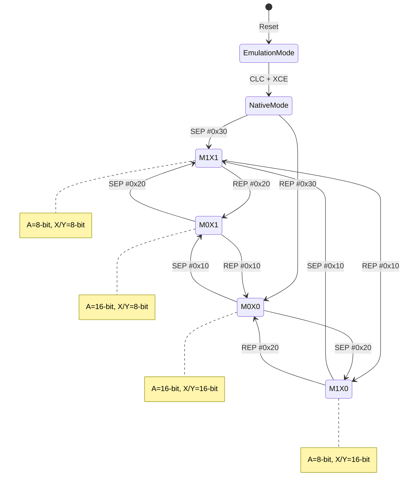
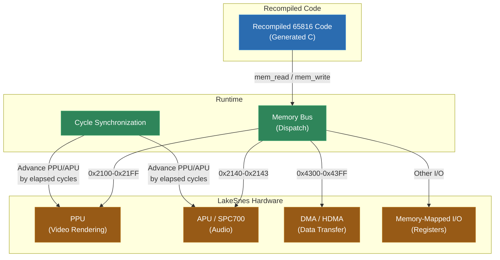

# Module 11: SNES -- 65816 and Hardware Integration

The Super Nintendo Entertainment System is the first major step up in complexity from the Game Boy. Its CPU, the Ricoh 5A22 (based on the Western Design Center 65816), introduces a concept that will haunt you through the rest of this course: **variable-width registers controlled by runtime state**. The size of an operand is not encoded in the instruction -- it depends on flags in the processor status register that can change at any point during execution. The recompiler must know the state of these flags at every instruction, or it cannot even determine how many bytes an instruction occupies.

This module covers the 65816's unique challenges, the strategy for tracking register width at recompile time, the SNES memory map, and a powerful integration pattern: using the recompiled CPU code to drive an existing emulator's hardware implementation.

---

## 1. The 65816 Challenge

The 65816 is a 16-bit extension of the 6502, the legendary 8-bit processor used in the NES, Apple II, and Commodore 64. It maintains full backward compatibility with the 6502 while adding:

- A 24-bit address bus (16MB address space, vs. the 6502's 64KB)
- 16-bit accumulator and index registers (when enabled)
- New addressing modes and instructions
- Bank registers that extend the address space

The backward compatibility is both a strength and a source of complexity. The processor can operate in "emulation mode" (behaving like a 6502) or "native mode" (using the full 65816 feature set). SNES games run almost entirely in native mode, but the boot process starts in emulation mode and switches.

The defining challenge of the 65816 is the **M and X flags** in the processor status register (P register). These two bits control the width of the processor's data registers:

- **M flag (bit 5)**: When set, the accumulator (A) is 8-bit. When clear, A is 16-bit.
- **X flag (bit 4)**: When set, index registers (X, Y) are 8-bit. When clear, X and Y are 16-bit.

This means that the same opcode can operate on either 8-bit or 16-bit data depending on the current state of these flags. The instruction `LDA #imm` loads a 1-byte immediate when M=1 or a 2-byte immediate when M=0. The instruction itself does not encode which size is in use -- the processor just knows based on the current P register.

For a disassembler, this is a fundamental problem. You cannot even determine the size of an instruction without knowing the M/X state. If you get it wrong, you will read the wrong number of bytes for the immediate operand and every subsequent instruction in the stream will be misaligned. One wrong flag assumption can cascade into an entirely incorrect disassembly.

---

## 2. M/X Flag Tracking

The recompiler must track the M and X flag state at every instruction. This is a static analysis problem: given the control flow graph, determine what values M and X can hold at each point in the program.

### How M/X State Changes

Only two instructions modify the M and X flags:

- **SEP #imm** (Set Processor Status): Sets the bits specified by the immediate operand. `SEP #0x20` sets the M flag (8-bit accumulator). `SEP #0x10` sets the X flag (8-bit index registers). `SEP #0x30` sets both.
- **REP #imm** (Reset Processor Status): Clears the bits specified by the immediate operand. `REP #0x20` clears M (16-bit accumulator). `REP #0x10` clears X (16-bit index). `REP #0x30` clears both.

The PLP (Pull Processor Status) instruction also modifies M/X by loading the entire P register from the stack, but the value pulled is usually deterministic if you track what was pushed.

### Static Analysis Strategy

The analysis propagates known M/X state through the control flow graph:



The algorithm works as follows:

1. Start at the entry point. The SNES boots in emulation mode; after the game's initialization code runs `CLC; XCE` to switch to native mode, M and X are typically set to known values by an immediate SEP or REP.
2. At each instruction, check whether it is SEP, REP, or PLP. If so, update the known M/X state.
3. At branch points, propagate the current state to both targets.
4. At merge points (where two control flow paths converge), check whether the incoming states agree. If both paths arrive with M=1, then M=1 at the merge. If one path has M=1 and the other has M=0, the state is **ambiguous**.
5. Iterate until the analysis reaches a fixed point (no more changes propagate).

### Handling Ambiguity

When the static analysis cannot determine the M/X state, the recompiler has two options:

**Option A: Emit runtime checks.** Generate C code that reads the M/X flags at runtime and branches to the correct implementation:

```c
if (ctx->p & 0x20) {
    // M=1: 8-bit accumulator
    ctx->a = (ctx->a & 0xFF00) | (mem_read(addr) & 0xFF);
} else {
    // M=0: 16-bit accumulator
    ctx->a = mem_read(addr) | (mem_read(addr + 1) << 8);
}
```

This is correct but adds overhead. Every ambiguous instruction becomes a branch.

**Option B: Require annotations.** Fail the recompilation and ask the user to provide the M/X state at the ambiguous point. This produces cleaner output but requires human intervention.

In practice, most SNES games follow disciplined patterns -- they set M/X at the top of functions and do not change them across function calls in unpredictable ways. Ambiguity is uncommon in well-structured game code, and when it occurs, it is usually at a small number of points that can be annotated.

---

## 3. LakeSnes Integration

A SNES game is more than its CPU. The SNES has:

- **PPU (Picture Processing Unit)**: Two PPU chips that handle backgrounds (up to 4 layers), sprites, rotation/scaling (Mode 7), and color math.
- **APU (Audio Processing Unit)**: The Sony SPC700 processor and its DSP, running independently with its own 64KB of RAM. Communicates with the main CPU through four 8-bit I/O ports.
- **DMA/HDMA**: Direct Memory Access for bulk data transfer and Horizontal-blanking DMA for per-scanline register updates.

Reimplementing all of this hardware from scratch would be an enormous effort. There is a better approach: **use the recompiled CPU as an orchestrator that drives an existing emulator's hardware**.

LakeSnes is a clean, well-structured SNES emulator written in C. Its architecture separates the CPU from the rest of the hardware cleanly -- the CPU communicates with other components through memory-mapped reads and writes. This separation makes it an ideal candidate for integration.

The pattern works like this:



The recompiled CPU code replaces LakeSnes's CPU interpreter. When the recompiled code reads or writes a memory address in the I/O range, the memory bus routes that access to LakeSnes's PPU, APU, or DMA implementation. A synchronization layer tracks how many cycles the recompiled code has consumed and advances the PPU and APU accordingly.

The advantages of this approach are significant:

- **Pixel-perfect graphics** without reimplementing the SNES PPU (which is extremely complex, with mode 7 affine transformations, color windowing, mosaic effects, and dozens of edge cases).
- **Accurate audio** without reimplementing the SPC700 DSP.
- **Reduced development time**: You write the recompiler and a thin integration layer, not an entire hardware emulation stack.
- **Proven correctness**: LakeSnes has been tested against hundreds of games and test ROMs. Its PPU and APU implementations are known to be accurate.

The main challenge is cycle synchronization. The SNES PPU and APU run concurrently with the CPU and expect to be advanced at a specific rate. If the recompiled code runs a large block of instructions without yielding to the PPU, mid-frame rendering effects will break. The synchronization layer must insert yield points where the recompiled code "catches up" the hardware to the current cycle count.

---

## 4. SNES Memory Map

The SNES has a 24-bit address space organized into 256 banks of 64KB each. The mapping varies depending on the cartridge type.

### LoROM

In LoROM mapping, ROM data occupies the upper half of banks `0x00-0x7F`:

| Bank Range | Address Range | Maps To |
|---|---|---|
| 0x00-0x3F | 0x0000-0x1FFF | WRAM (first 8KB, mirrored) |
| 0x00-0x3F | 0x2000-0x5FFF | Hardware registers (PPU, APU, DMA) |
| 0x00-0x3F | 0x6000-0x7FFF | Expansion (rarely used) |
| 0x00-0x3F | 0x8000-0xFFFF | ROM (lower 32KB of ROM bank) |
| 0x40-0x6F | 0x0000-0x7FFF | ROM (upper range, varies) |
| 0x40-0x6F | 0x8000-0xFFFF | ROM |
| 0x70-0x7D | 0x0000-0x7FFF | SRAM |
| 0x7E | 0x0000-0xFFFF | WRAM (first 64KB) |
| 0x7F | 0x0000-0xFFFF | WRAM (second 64KB) |
| 0x80-0xFF | | Mirror of 0x00-0x7F |

### HiROM

HiROM maps the full 64KB of each bank to ROM, with hardware registers accessible only through bank 0x00-0x3F:

| Bank Range | Address Range | Maps To |
|---|---|---|
| 0x00-0x3F | 0x0000-0x1FFF | WRAM (first 8KB, mirrored) |
| 0x00-0x3F | 0x2000-0x5FFF | Hardware registers |
| 0x00-0x3F | 0x6000-0x7FFF | Expansion / SRAM |
| 0x00-0x3F | 0x8000-0xFFFF | ROM (same as bank 0x40-0x7D) |
| 0x40-0x7D | 0x0000-0xFFFF | ROM (full 64KB banks) |
| 0x7E-0x7F | 0x0000-0xFFFF | WRAM (128KB) |
| 0x80-0xFF | | Mirror of 0x00-0x7F |

### ExHiROM

ExHiROM extends the address space for ROMs larger than 4MB, using banks `0x40-0x7D` and `0xC0-0xFF` for ROM data. Only a handful of games use this mapping (notably *Tales of Phantasia* and *Star Ocean*).

### DMA and HDMA

**DMA (Direct Memory Access)** transfers blocks of data between any two addresses at high speed, bypassing the CPU. It is commonly used to transfer tile data, palettes, and tilemaps to VRAM during VBlank. The CPU is halted during DMA.

**HDMA (Horizontal-blank DMA)** transfers small amounts of data automatically at the start of each scanline. It is used for per-scanline effects: gradient backgrounds, wavy distortion, parallax scrolling, and color math changes across the screen. HDMA is configured once per frame and runs autonomously.

For the recompiler, DMA is relatively straightforward -- it is a bulk memory copy triggered by writing to specific I/O registers. HDMA is more involved because it operates on a per-scanline basis and the integration layer must ensure it fires at the correct times relative to the PPU's rendering.

---

## 5. Instruction Lifting Specifics

The 65816 has approximately 256 opcodes, but many of them change behavior based on the M/X flags. The lifter must generate width-dependent code.

### Width-Dependent Operations

A simple load instruction changes based on M flag state:

```c
// LDA #imm with M=1 (8-bit accumulator)
ctx->a = (ctx->a & 0xFF00) | imm8;
update_nz_8(ctx, imm8);

// LDA #imm with M=0 (16-bit accumulator)
ctx->a = imm16;
update_nz_16(ctx, imm16);
```

Note that when the accumulator is in 8-bit mode, the high byte of A (sometimes called "B" or the "hidden" byte) is preserved. This is a common source of bugs in recompilers that treat 8-bit mode as simply using a uint8_t.

### ADC and SBC with Decimal Mode

The 65816 supports BCD (Binary-Coded Decimal) arithmetic via the D flag. When the D flag is set, ADC and SBC treat their operands as packed BCD values. This means `0x09 + 0x01 = 0x10` rather than `0x0A`.

```c
// ADC in decimal mode (8-bit)
void adc_decimal_8(Context65816 *ctx, uint8_t operand) {
    uint8_t al = (ctx->a & 0x0F) + (operand & 0x0F) + ctx->flag_c;
    if (al > 9) al += 6;
    uint8_t ah = (ctx->a >> 4) + (operand >> 4) + (al > 0x0F ? 1 : 0);
    if (ah > 9) ah += 6;
    ctx->flag_c = ah > 0x0F;
    ctx->a = (ctx->a & 0xFF00) | ((ah << 4) | (al & 0x0F));
    update_nz_8(ctx, ctx->a & 0xFF);
}
```

Most SNES games do not use decimal mode, but some do (notably sports games for score display). The lifter must handle it correctly.

### MVN and MVP: Block Move Instructions

The 65816 has two block move instructions that copy a range of memory:

- **MVN (Move Negative)**: Copies C+1 bytes from source to destination, incrementing addresses. Used for forward copies.
- **MVP (Move Positive)**: Copies C+1 bytes from source to destination, decrementing addresses. Used for backward copies (when source and destination overlap).

These instructions are unusual because they modify the program counter to re-execute themselves until the byte count (in C register) reaches `0xFFFF`. In the original hardware, the CPU fetches and decodes the same instruction repeatedly.

For the recompiler, the simplest approach is to emit a loop:

```c
// MVN: Move block negative (forward copy)
// src_bank and dst_bank come from the instruction operands
ctx->db = dst_bank;
do {
    uint8_t byte = mem_read((src_bank << 16) | ctx->x);
    mem_write((dst_bank << 16) | ctx->y, byte);
    ctx->x++;
    ctx->y++;
    ctx->a--;  // A is used as the counter (actually C register)
} while (ctx->a != 0xFFFF);
```

This is semantically equivalent to the hardware behavior but executes in a single pass rather than refetching the instruction each iteration.

---

## 6. Real-World Reference

**snesrecomp** by sp00nznet is a static recompilation framework for SNES games. It implements M/X flag tracking, the full 65816 instruction lifter with width-dependent code generation, and integration with LakeSnes hardware components. It handles LoROM and HiROM cartridges and has been tested against multiple commercial titles.

**mk** by sp00nznet applies SNES recompilation to a specific game, demonstrating how the general framework handles a real commercial ROM with complex bank switching, DMA-heavy graphics updates, and audio integration through the SPC700.

These projects demonstrate that the integration pattern described in this module -- recompiled CPU driving emulated hardware -- is practical and produces playable results. The recompiled CPU runs faster than an interpreted or even JIT-compiled CPU, while the emulated PPU and APU provide hardware-accurate video and audio.

---

## Lab

The following lab accompanies this module:

- **Lab 7** -- SNES recompilation: Build a 65816 lifter with M/X flag tracking, integrate with LakeSnes for hardware, and recompile a SNES ROM

---

**Next: [Module 6 -- DOS: 16-bit x86 and Real Mode](../module-06-dos/lecture.md)**
