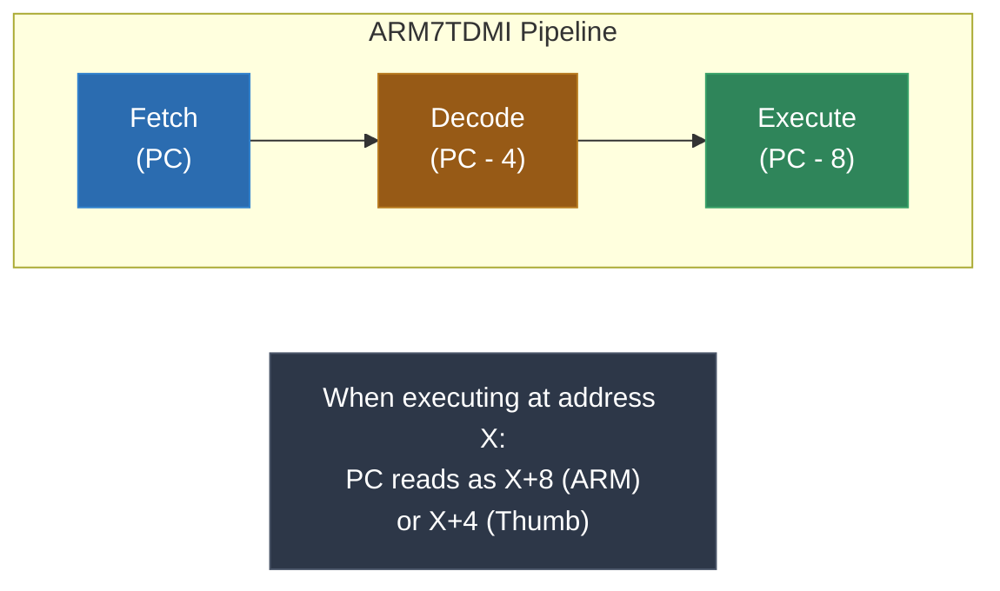
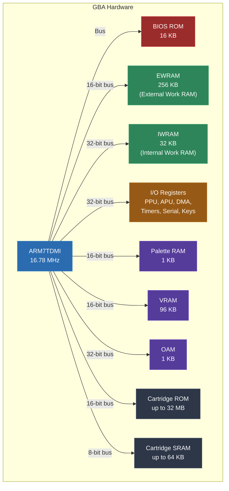
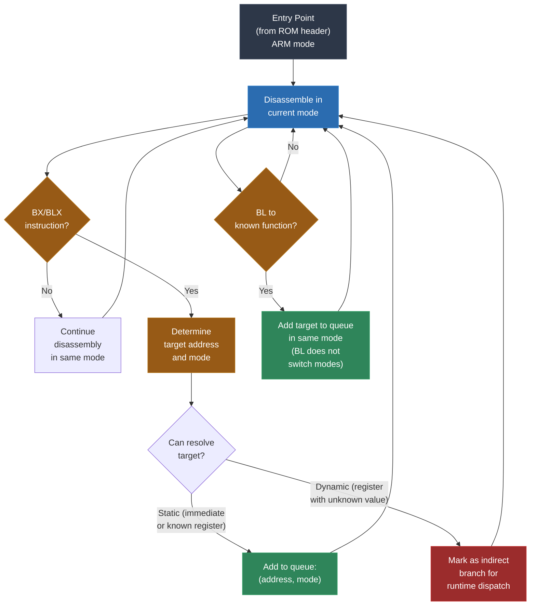
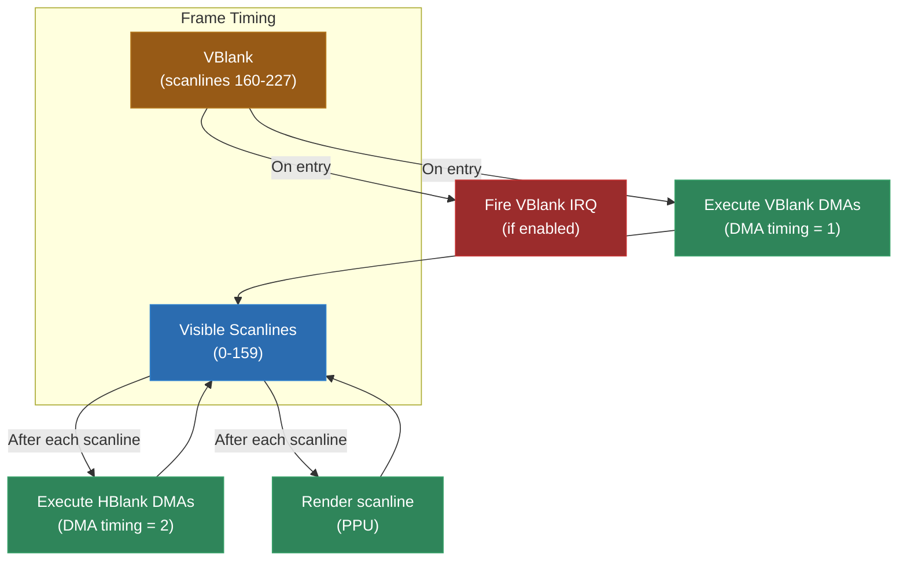
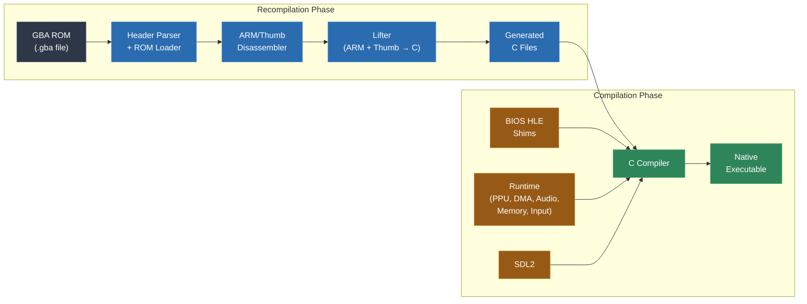

# Module 12: GBA -- ARM7TDMI Recompilation

Welcome to 32-bit territory. Everything you have done up to this point -- Game Boy, NES, SNES, DOS -- has been 8-bit or 16-bit. The Game Boy Advance changes the game. It runs an ARM7TDMI processor, a 32-bit RISC core from the ARM architecture family. ARM is not some obscure retro curiosity -- it is the most widely deployed instruction set architecture in the world. The phone in your pocket, the Raspberry Pi on your desk, the Apple silicon in modern Macs: all ARM. Learning to recompile ARM code for the GBA teaches you skills that transfer directly to modern platforms.

The GBA is also a fascinating recompilation target because it introduces dual instruction sets (32-bit ARM and 16-bit Thumb), conditional execution on every instruction, software interrupts for BIOS services, and DMA-driven hardware. These are patterns you will encounter again when working with DS, 3DS, and other ARM-based platforms.

This module covers the ARM7TDMI architecture in depth, the GBA hardware model, the challenges of lifting ARM and Thumb code to C, BIOS HLE (high-level emulation), and the complete pipeline from GBA ROM to native executable.

---

## 1. Why the GBA Matters

The GBA occupies a unique position in both gaming history and in this course.

**First 32-bit target.** Every architecture you have seen so far has been 8-bit (SM83, 6502) or 16-bit (65816, x86-16). The GBA's ARM7TDMI is a full 32-bit processor with 32-bit registers, a 32-bit data bus (internally), and a 32-bit instruction set. This means your lifting code now deals with `uint32_t` everywhere instead of `uint8_t` or `uint16_t`. The arithmetic is different (32-bit overflow, 32-bit shifts), the address space is larger (though still 32-bit, the GBA only uses parts of it), and the code density is different.

**Introduces ARM.** ARM is the instruction set you are most likely to encounter in modern recompilation work. The Nintendo DS uses ARM7 and ARM9. The 3DS uses ARM11. Many mobile games and embedded systems use ARM. The GBA is the simplest ARM platform to start with -- one CPU, no operating system, no memory management unit, no cache coherency issues. It is ARM with training wheels.

**Dual instruction sets.** The ARM7TDMI supports two instruction sets: 32-bit ARM (every instruction is 4 bytes) and 16-bit Thumb (every instruction is 2 bytes). Games switch between them freely, often using ARM mode for performance-critical code and Thumb mode for everything else (because Thumb code is smaller and the GBA's narrow cartridge bus makes smaller code faster). Your disassembler and lifter must handle both.

**Conditional execution.** In ARM mode, every instruction has a 4-bit condition field. Any instruction can be made conditional -- not just branches. `ADDEQ r0, r1, r2` adds only if the zero flag is set. `MOVNE r3, #0` moves only if the zero flag is clear. This is elegant and efficient on hardware, but it creates interesting challenges for lifting, because you need to represent these conditions in the generated C code.

**Software interrupts for BIOS.** GBA games call BIOS routines through the `SWI` (software interrupt) instruction. These routines handle things like division, square root, decompression, and audio mixing. On real hardware, the BIOS is a 16KB ROM built into the chip. For recompilation, you need to provide HLE (high-level emulation) replacements for every BIOS call the game uses.

**Bridge to N64/DS/3DS.** After the GBA, the course moves to MIPS (N64) and more advanced ARM platforms. The GBA is the bridge -- it teaches you the ARM fundamentals without the added complexity of dual processors, 3D graphics, or operating systems.

---

## 2. ARM7TDMI Architecture

The ARM7TDMI is a 3-stage pipelined processor core designed by ARM Holdings (now ARM Ltd.). The acronym tells you its capabilities:

- **ARM7**: Seventh generation ARM core design
- **T**: Thumb instruction set support
- **D**: Debug support (JTAG)
- **M**: Enhanced multiplier (fast 32x32 multiply)
- **I**: Embedded ICE (In-Circuit Emulator) support

The "T" is the important one for us. It means the processor supports both the 32-bit ARM instruction set and the 16-bit Thumb instruction set.

### Registers

The ARM7TDMI has 16 general-purpose 32-bit registers, plus the Current Program Status Register (CPSR) and several banked registers for different processor modes.

| Register | Alias | Purpose |
|---|---|---|
| r0 | - | General purpose / first function argument |
| r1 | - | General purpose / second function argument |
| r2 | - | General purpose / third function argument |
| r3 | - | General purpose / fourth function argument |
| r4-r11 | - | General purpose (callee-saved by convention) |
| r12 | IP | Intra-procedure scratch register |
| r13 | SP | Stack pointer |
| r14 | LR | Link register (return address) |
| r15 | PC | Program counter |

Some important notes:

**The PC is a general-purpose register.** On ARM, r15 is the program counter, but it can be read and written like any other register. You can add to it, subtract from it, load it from memory. Writing to the PC is a jump. This is elegant but makes control flow analysis harder -- any instruction that writes to r15 is potentially a jump.

**The PC is ahead of the current instruction.** Due to the 3-stage pipeline, when you read r15, it returns the address of the current instruction plus 8 (in ARM mode) or plus 4 (in Thumb mode). This means `MOV r0, PC` loads r0 with the address of the MOV instruction plus 8, not the address of the MOV instruction itself. This pipeline offset affects every instruction that uses the PC as an operand, and your lifter must account for it.

**The link register stores the return address.** When you execute `BL label` (branch with link), the processor stores the address of the next instruction in r14 (LR), then jumps to the target. A subroutine returns by executing `MOV PC, LR` or `BX LR`. This is different from the 6502 and SM83, where return addresses go on the stack. On ARM, the stack is only used for return addresses when functions need to call other functions (leaf functions can just use LR).

### The CPSR (Current Program Status Register)

```
 31   30   29   28   27   26-8   7    6    5    4-0
+----+----+----+----+----+------+----+----+----+------+
| N  | Z  | C  | V  | Q  | Res  | I  | F  | T  | Mode |
+----+----+----+----+----+------+----+----+----+------+
```

The condition flags in the upper four bits:

| Flag | Meaning | Set When |
|---|---|---|
| N (Negative) | Result is negative | Bit 31 of result is 1 |
| Z (Zero) | Result is zero | Result is 0 |
| C (Carry) | Carry/borrow | Unsigned overflow (add) or no borrow (sub) |
| V (Overflow) | Signed overflow | Signed result does not fit in 32 bits |

The control bits:

| Field | Purpose |
|---|---|
| I | IRQ disable (1 = disabled) |
| F | FIQ disable (1 = disabled) |
| T | Thumb state (0 = ARM mode, 1 = Thumb mode) |
| Mode | Processor mode (User, FIQ, IRQ, Supervisor, etc.) |

**The T bit is critical.** It determines which instruction set the processor is currently executing. You cannot change it directly -- it is changed by the BX (Branch and Exchange) instruction, which reads bit 0 of the target address. If bit 0 is 1, the processor switches to Thumb mode. If bit 0 is 0, it switches to ARM mode. The actual jump address has bit 0 cleared (it is just used as a mode flag).

### The Pipeline

The ARM7TDMI has a simple 3-stage pipeline: Fetch, Decode, Execute. This means:

1. While the current instruction is executing, the next instruction is being decoded, and the one after that is being fetched.
2. The PC always points to the instruction being fetched, which is 2 instructions ahead of the one executing.
3. This is why PC reads return current_instruction + 8 (ARM) or current_instruction + 4 (Thumb).

For recompilation, the pipeline itself does not matter (we are not trying to be cycle-accurate), but the PC offset does matter because games use PC-relative addressing to access data embedded in the code stream.



### Processor Modes

The ARM7TDMI has seven processor modes. Each mode has its own banked copies of certain registers (so switching modes instantly gives you a different stack pointer, for example):

| Mode | Purpose | Banked Registers |
|---|---|---|
| User (USR) | Normal program execution | None (base set) |
| FIQ | Fast interrupt handling | r8-r14, SPSR |
| IRQ | Normal interrupt handling | r13-r14, SPSR |
| Supervisor (SVC) | Software interrupts (SWI) | r13-r14, SPSR |
| Abort (ABT) | Memory access faults | r13-r14, SPSR |
| Undefined (UND) | Undefined instruction traps | r13-r14, SPSR |
| System (SYS) | Privileged user mode | Same as User |

GBA games run in User mode most of the time. When a SWI is executed, the processor switches to Supervisor mode. When an IRQ fires, it switches to IRQ mode. The mode-specific banked registers ensure that interrupt handlers do not corrupt the main program's stack pointer and link register.

For recompilation, you mostly care about User mode. The mode switches during SWI and IRQ are handled by your BIOS HLE and interrupt shim, so you do not need to emulate the full mode-switching mechanism.

---

## 3. ARM Instruction Set

ARM instructions are 32 bits (4 bytes) each, always aligned to 4-byte boundaries. The most distinctive feature of the ARM instruction set is conditional execution.

### Conditional Execution

The top 4 bits of every ARM instruction encode a condition:

| Code | Suffix | Condition | Flags |
|---|---|---|---|
| 0000 | EQ | Equal / Zero | Z=1 |
| 0001 | NE | Not equal / Not zero | Z=0 |
| 0010 | CS/HS | Carry set / Unsigned >= | C=1 |
| 0011 | CC/LO | Carry clear / Unsigned < | C=0 |
| 0100 | MI | Minus / Negative | N=1 |
| 0101 | PL | Plus / Positive or zero | N=0 |
| 0110 | VS | Overflow set | V=1 |
| 0111 | VC | Overflow clear | V=0 |
| 1000 | HI | Unsigned higher | C=1 and Z=0 |
| 1001 | LS | Unsigned lower or same | C=0 or Z=1 |
| 1010 | GE | Signed >= | N=V |
| 1011 | LT | Signed < | N!=V |
| 1100 | GT | Signed > | Z=0 and N=V |
| 1101 | LE | Signed <= | Z=1 or N!=V |
| 1110 | AL | Always (unconditional) | - |
| 1111 | NV | Never (reserved) | - |

This means `ADD r0, r1, r2` and `ADDEQ r0, r1, r2` are the same instruction except for the condition field. The unconditional form uses condition code AL (1110). Every instruction in a disassembly listing technically has a condition -- you just do not write it when it is AL.

For the lifter, conditional execution means wrapping the generated C code in an if statement:

```c
// ADDEQ r0, r1, r2  (add only if Z=1)
if (ctx->flag_z) {
    ctx->r[0] = ctx->r[1] + ctx->r[2];
}

// MOVNE r3, #0  (move only if Z=0)
if (!ctx->flag_z) {
    ctx->r[3] = 0;
}

// ADDAL r0, r1, r2  (always -- no condition needed)
ctx->r[0] = ctx->r[1] + ctx->r[2];
```

The condition check function:

```c
int check_condition(GBAContext *ctx, uint8_t cond) {
    switch (cond) {
        case 0x0: return ctx->flag_z;                                    // EQ
        case 0x1: return !ctx->flag_z;                                   // NE
        case 0x2: return ctx->flag_c;                                    // CS
        case 0x3: return !ctx->flag_c;                                   // CC
        case 0x4: return ctx->flag_n;                                    // MI
        case 0x5: return !ctx->flag_n;                                   // PL
        case 0x6: return ctx->flag_v;                                    // VS
        case 0x7: return !ctx->flag_v;                                   // VC
        case 0x8: return ctx->flag_c && !ctx->flag_z;                    // HI
        case 0x9: return !ctx->flag_c || ctx->flag_z;                    // LS
        case 0xA: return ctx->flag_n == ctx->flag_v;                     // GE
        case 0xB: return ctx->flag_n != ctx->flag_v;                     // LT
        case 0xC: return !ctx->flag_z && (ctx->flag_n == ctx->flag_v);   // GT
        case 0xD: return ctx->flag_z || (ctx->flag_n != ctx->flag_v);    // LE
        case 0xE: return 1;                                               // AL
        case 0xF: return 0;                                               // NV (reserved)
        default: return 0;
    }
}
```

### The Barrel Shifter

ARM's defining computational feature is the barrel shifter. The second operand of most data processing instructions can be shifted or rotated before being used. This means a single ARM instruction can do what takes two instructions on most other architectures.

The shift types:

| Shift | Operation | Notation |
|---|---|---|
| LSL | Logical Shift Left | `Rm, LSL #n` or `Rm, LSL Rs` |
| LSR | Logical Shift Right | `Rm, LSR #n` or `Rm, LSR Rs` |
| ASR | Arithmetic Shift Right | `Rm, ASR #n` or `Rm, ASR Rs` |
| ROR | Rotate Right | `Rm, ROR #n` or `Rm, ROR Rs` |
| RRX | Rotate Right Extended (through carry) | `Rm, RRX` (always by 1) |

The shift amount can be an immediate value (0-31) or the value in another register.

Examples:
```asm
ADD r0, r1, r2, LSL #2    ; r0 = r1 + (r2 << 2)  -- multiply r2 by 4 and add
MOV r0, r1, ASR #16        ; r0 = r1 >> 16 (arithmetic -- sign-extends)
CMP r0, r1, ROR #8         ; compare r0 with r1 rotated right by 8
SUB r0, r1, r2, LSR r3     ; r0 = r1 - (r2 >> r3)
```

For the lifter, the barrel shifter adds a layer to every data processing instruction. You need to compute the shifted operand first:

```c
// Compute shifted operand for data processing instructions
uint32_t apply_shift(GBAContext *ctx, uint32_t rm, uint8_t shift_type,
                      uint8_t shift_amount, uint8_t *carry_out) {
    *carry_out = ctx->flag_c;  // Default: carry unchanged

    switch (shift_type) {
        case 0: // LSL
            if (shift_amount == 0) return rm;
            if (shift_amount < 32) {
                *carry_out = (rm >> (32 - shift_amount)) & 1;
                return rm << shift_amount;
            }
            *carry_out = (shift_amount == 32) ? (rm & 1) : 0;
            return 0;

        case 1: // LSR
            if (shift_amount == 0) shift_amount = 32;  // LSR #0 encodes as LSR #32
            if (shift_amount < 32) {
                *carry_out = (rm >> (shift_amount - 1)) & 1;
                return rm >> shift_amount;
            }
            *carry_out = (shift_amount == 32) ? ((rm >> 31) & 1) : 0;
            return 0;

        case 2: // ASR
            if (shift_amount == 0) shift_amount = 32;  // ASR #0 encodes as ASR #32
            if (shift_amount >= 32) {
                *carry_out = (rm >> 31) & 1;
                return (int32_t)rm >> 31;  // Sign-extend
            }
            *carry_out = (rm >> (shift_amount - 1)) & 1;
            return (int32_t)rm >> shift_amount;

        case 3: // ROR (or RRX if amount is 0)
            if (shift_amount == 0) {
                // RRX: rotate right by 1 through carry
                *carry_out = rm & 1;
                return (ctx->flag_c << 31) | (rm >> 1);
            }
            shift_amount &= 31;
            if (shift_amount == 0) {
                *carry_out = (rm >> 31) & 1;
                return rm;
            }
            *carry_out = (rm >> (shift_amount - 1)) & 1;
            return (rm >> shift_amount) | (rm << (32 - shift_amount));
    }
    return rm;
}
```

The barrel shifter also interacts with the carry flag. If the S (set flags) bit is set on a data processing instruction, the carry output from the shifter becomes the new carry flag (for logical operations like MOV, AND, ORR, EOR -- but not for arithmetic operations like ADD, SUB, which compute carry from the arithmetic result).

### Data Processing Instructions

ARM has 16 data processing operations, all sharing the same instruction format:

| Opcode | Mnemonic | Operation | Notes |
|---|---|---|---|
| 0000 | AND | Rd = Rn & Op2 | Logical AND |
| 0001 | EOR | Rd = Rn ^ Op2 | Exclusive OR |
| 0010 | SUB | Rd = Rn - Op2 | Subtract |
| 0011 | RSB | Rd = Op2 - Rn | Reverse subtract |
| 0100 | ADD | Rd = Rn + Op2 | Add |
| 0101 | ADC | Rd = Rn + Op2 + C | Add with carry |
| 0110 | SBC | Rd = Rn - Op2 - !C | Subtract with carry |
| 0111 | RSC | Rd = Op2 - Rn - !C | Reverse subtract with carry |
| 1000 | TST | Rn & Op2 | Test (AND, no write) |
| 1001 | TEQ | Rn ^ Op2 | Test equivalence (EOR, no write) |
| 1010 | CMP | Rn - Op2 | Compare (SUB, no write) |
| 1011 | CMN | Rn + Op2 | Compare negated (ADD, no write) |
| 1100 | ORR | Rd = Rn \| Op2 | Logical OR |
| 1101 | MOV | Rd = Op2 | Move (Rn ignored) |
| 1110 | BIC | Rd = Rn & ~Op2 | Bit clear |
| 1111 | MVN | Rd = ~Op2 | Move NOT |

TST, TEQ, CMP, and CMN are the "test" variants -- they compute the result and set flags but do not write the result to any register. They always have the S bit set.

The S bit (bit 20) controls whether flags are updated. `ADD r0, r1, r2` does not update flags. `ADDS r0, r1, r2` does. This is different from most other architectures where arithmetic always updates flags.

```c
// ADDS r0, r1, r2 (add with flag update)
{
    uint32_t rn = ctx->r[1];
    uint32_t op2 = ctx->r[2];
    uint64_t result64 = (uint64_t)rn + (uint64_t)op2;
    uint32_t result = (uint32_t)result64;
    ctx->r[0] = result;
    // Update flags
    ctx->flag_n = (result >> 31) & 1;
    ctx->flag_z = (result == 0);
    ctx->flag_c = (result64 >> 32) & 1;
    ctx->flag_v = ((~(rn ^ op2) & (rn ^ result)) >> 31) & 1;
}

// ADD r0, r1, r2 (add without flag update)
ctx->r[0] = ctx->r[1] + ctx->r[2];
```

### Load/Store Instructions

ARM is a load/store architecture -- you cannot operate on memory directly. Data must be loaded into registers, processed, and stored back.

**Single register transfer:**
```asm
LDR r0, [r1]          ; r0 = mem32[r1]
LDR r0, [r1, #4]      ; r0 = mem32[r1 + 4]
LDR r0, [r1, r2]      ; r0 = mem32[r1 + r2]
LDR r0, [r1, r2, LSL #2]  ; r0 = mem32[r1 + (r2 << 2)]
LDR r0, [r1, #4]!     ; r1 += 4; r0 = mem32[r1]  (pre-increment with writeback)
LDR r0, [r1], #4      ; r0 = mem32[r1]; r1 += 4  (post-increment)
STR r0, [r1]           ; mem32[r1] = r0
LDRB r0, [r1]          ; r0 = mem8[r1] (zero-extended)
STRB r0, [r1]          ; mem8[r1] = r0 (low byte)
LDRH r0, [r1]          ; r0 = mem16[r1] (zero-extended, halfword)
LDRSH r0, [r1]         ; r0 = sign_extend(mem16[r1]) (signed halfword)
LDRSB r0, [r1]         ; r0 = sign_extend(mem8[r1]) (signed byte)
```

The addressing modes with writeback (! suffix for pre-indexed, implicit for post-indexed) update the base register. This is commonly used for walking through arrays:

```c
// LDR r0, [r1], #4  (post-increment)
ctx->r[0] = mem_read_32(ctx, ctx->r[1]);
ctx->r[1] += 4;

// LDR r0, [r1, #8]!  (pre-increment with writeback)
ctx->r[1] += 8;
ctx->r[0] = mem_read_32(ctx, ctx->r[1]);
```

**Block transfer (LDM/STM):**

Load Multiple and Store Multiple transfer a set of registers to/from consecutive memory addresses. They are used for function prologues/epilogues and block memory copies.

```asm
STMFD SP!, {r4-r11, LR}   ; Push callee-saved registers and LR (function entry)
LDMFD SP!, {r4-r11, PC}   ; Pop and return (function exit -- loading PC = return)
LDMIA r0!, {r1-r4}         ; Load 4 registers from [r0], increment r0 after each
STMDB r0!, {r1-r4}         ; Store 4 registers to [r0], decrement r0 before each
```

The suffix indicates the direction and timing:

| Suffix | Meaning | Aliases |
|---|---|---|
| IA | Increment After | FD (Full Descending) for loads |
| IB | Increment Before | ED (Empty Descending) for loads |
| DA | Decrement After | FA (Full Ascending) for loads |
| DB | Decrement Before | FD (Full Descending) for stores |

The register list is encoded as a 16-bit bitmap -- one bit per register. If bit N is set, register N is included in the transfer.

For the lifter, LDM/STM expand into multiple loads or stores:

```c
// STMFD SP!, {r4, r5, r6, r7, LR}  (push 5 registers)
ctx->r[13] -= 20;  // SP -= 5 * 4
mem_write_32(ctx, ctx->r[13] + 0, ctx->r[4]);
mem_write_32(ctx, ctx->r[13] + 4, ctx->r[5]);
mem_write_32(ctx, ctx->r[13] + 8, ctx->r[6]);
mem_write_32(ctx, ctx->r[13] + 12, ctx->r[7]);
mem_write_32(ctx, ctx->r[13] + 16, ctx->r[14]);  // LR

// LDMFD SP!, {r4, r5, r6, r7, PC}  (pop 5 registers, return)
ctx->r[4] = mem_read_32(ctx, ctx->r[13] + 0);
ctx->r[5] = mem_read_32(ctx, ctx->r[13] + 4);
ctx->r[6] = mem_read_32(ctx, ctx->r[13] + 8);
ctx->r[7] = mem_read_32(ctx, ctx->r[13] + 12);
uint32_t new_pc = mem_read_32(ctx, ctx->r[13] + 16);
ctx->r[13] += 20;
// Loading PC = branch (return from function)
return;  // or dispatch to new_pc if it is not a simple return
```

When LDM loads the PC, it is a branch. If the loaded value has bit 0 set, it also switches to Thumb mode (on ARMv4T and later). This is a common return-from-function pattern.

### Branch Instructions

```asm
B label         ; Branch (unconditional if AL, conditional with other codes)
BL label        ; Branch with Link (save return address in LR)
BX Rm           ; Branch and Exchange (switch ARM/Thumb based on bit 0)
```

B and BL use a 24-bit signed offset (shifted left by 2), giving a range of +/- 32MB from the current instruction. BL stores the return address in LR before branching.

BX is the instruction that switches between ARM and Thumb modes. Bit 0 of the register value determines the mode:
- Bit 0 = 0: Switch to ARM mode, jump to address (with bit 0 cleared)
- Bit 0 = 1: Switch to Thumb mode, jump to address (with bit 0 cleared)

```c
// BX r0
void lift_bx(FILE *out, int rm) {
    fprintf(out, "    {\n");
    fprintf(out, "        uint32_t target = ctx->r[%d];\n", rm);
    fprintf(out, "        ctx->thumb_mode = target & 1;\n");
    fprintf(out, "        target &= ~1;\n");
    fprintf(out, "        // Dispatch to target address\n");
    fprintf(out, "        dispatch(ctx, target);\n");
    fprintf(out, "        return;\n");
    fprintf(out, "    }\n");
}
```

### Multiply Instructions

```asm
MUL Rd, Rm, Rs       ; Rd = Rm * Rs (low 32 bits)
MLA Rd, Rm, Rs, Rn   ; Rd = Rm * Rs + Rn (multiply-accumulate)
UMULL RdLo, RdHi, Rm, Rs  ; 64-bit unsigned multiply
SMULL RdLo, RdHi, Rm, Rs  ; 64-bit signed multiply
UMLAL RdLo, RdHi, Rm, Rs  ; 64-bit unsigned multiply-accumulate
SMLAL RdLo, RdHi, Rm, Rs  ; 64-bit signed multiply-accumulate
```

The long multiplies (UMULL, SMULL) produce a 64-bit result in two registers. These are used for fixed-point math, which GBA games use extensively (the ARM7TDMI has no floating-point unit).

```c
// UMULL r0, r1, r2, r3  (unsigned 64-bit multiply)
{
    uint64_t result = (uint64_t)ctx->r[2] * (uint64_t)ctx->r[3];
    ctx->r[0] = (uint32_t)(result & 0xFFFFFFFF);        // Low 32 bits
    ctx->r[1] = (uint32_t)((result >> 32) & 0xFFFFFFFF); // High 32 bits
}
```

### SWP (Swap)

```asm
SWP Rd, Rm, [Rn]    ; Rd = mem32[Rn]; mem32[Rn] = Rm (atomic read-modify-write)
SWPB Rd, Rm, [Rn]   ; Same but byte-sized
```

SWP atomically reads a memory location and writes a new value. On the GBA (single-core, no shared memory), atomicity is not a concern, so this is just a load followed by a store:

```c
// SWP r0, r1, [r2]
{
    uint32_t old = mem_read_32(ctx, ctx->r[2]);
    mem_write_32(ctx, ctx->r[2], ctx->r[1]);
    ctx->r[0] = old;
}
```

---

## 4. Thumb Instruction Set

The Thumb instruction set is a compressed 16-bit encoding of a subset of ARM instructions. Every Thumb instruction has an equivalent ARM instruction, but the encoding is different and more restricted. Thumb instructions are 2 bytes each, always aligned to 2-byte boundaries.

### Why Thumb Exists

The GBA has a 32-bit internal bus but only a 16-bit external bus for the cartridge (ROM). This means fetching a 32-bit ARM instruction from ROM takes two bus cycles, but fetching a 16-bit Thumb instruction takes only one. For code running from ROM (which is most GBA game code), Thumb is effectively twice as fast for instruction fetch.

Code running from internal WRAM (IWRAM) uses a 32-bit bus, so ARM mode is faster there. This is why games often put performance-critical routines in IWRAM using ARM mode, while keeping the bulk of the code in ROM using Thumb mode.

### Thumb Register Access

Thumb instructions can only access r0-r7 for most operations. The "high" registers r8-r15 are accessible only through a few specific instructions (MOV, CMP, ADD between high and low registers, and BX).

This restriction does not limit what Thumb code can do -- it just means the compiler must be more careful about register allocation. And for the lifter, it means fewer encoding variations to handle.

### Thumb Instruction Categories

**Shifted register operations:**
```asm
LSL r0, r1, #5      ; r0 = r1 << 5
LSR r0, r1, #8      ; r0 = r1 >> 8
ASR r0, r1, #16     ; r0 = (int32_t)r1 >> 16
```

**Add/subtract (3 operands):**
```asm
ADD r0, r1, r2       ; r0 = r1 + r2
SUB r0, r1, r2       ; r0 = r1 - r2
ADD r0, r1, #3       ; r0 = r1 + 3 (3-bit immediate)
SUB r0, r1, #3       ; r0 = r1 - 3
```

**Move/compare/add/subtract (immediate, 2 operands):**
```asm
MOV r0, #42          ; r0 = 42 (8-bit immediate)
CMP r0, #42          ; compare r0 with 42
ADD r0, #42          ; r0 += 42
SUB r0, #42          ; r0 -= 42
```

**ALU operations (2 operands):**
```asm
AND r0, r1           ; r0 &= r1
EOR r0, r1           ; r0 ^= r1
LSL r0, r1           ; r0 <<= r1
LSR r0, r1           ; r0 >>= r1
ASR r0, r1           ; r0 = (int32_t)r0 >> r1
ADC r0, r1           ; r0 += r1 + C
SBC r0, r1           ; r0 -= r1 + !C
ROR r0, r1           ; r0 = rotate_right(r0, r1)
TST r0, r1           ; test r0 & r1 (set flags only)
NEG r0, r1           ; r0 = -r1
CMP r0, r1           ; compare r0 - r1
CMN r0, r1           ; compare r0 + r1
ORR r0, r1           ; r0 |= r1
MUL r0, r1           ; r0 *= r1
BIC r0, r1           ; r0 &= ~r1
MVN r0, r1           ; r0 = ~r1
```

**Load/store (multiple addressing modes):**
```asm
LDR r0, [r1, r2]     ; r0 = mem32[r1 + r2]
STR r0, [r1, r2]     ; mem32[r1 + r2] = r0
LDR r0, [r1, #20]    ; r0 = mem32[r1 + 20] (5-bit immediate * 4)
LDR r0, [SP, #40]    ; r0 = mem32[SP + 40]
LDR r0, [PC, #40]    ; r0 = mem32[(PC & ~2) + 40] (PC-relative)
LDRB r0, [r1, r2]    ; r0 = mem8[r1 + r2]
LDRH r0, [r1, r2]    ; r0 = mem16[r1 + r2]
LDRSB r0, [r1, r2]   ; r0 = sign_extend(mem8[r1 + r2])
LDRSH r0, [r1, r2]   ; r0 = sign_extend(mem16[r1 + r2])
```

**Push/pop:**
```asm
PUSH {r4, r5, r6, LR}   ; Push registers and LR
POP {r4, r5, r6, PC}     ; Pop registers and return (PC load)
```

**Branch:**
```asm
B label              ; Unconditional branch (11-bit offset)
BEQ label            ; Conditional branch (8-bit offset)
BL label             ; Branch with link (encoded as two 16-bit instructions)
BX r0                ; Branch and exchange (switch ARM/Thumb)
```

The Thumb BL is special -- it is the only Thumb instruction that is 32 bits (encoded as two consecutive 16-bit instructions). The first instruction loads the high part of the offset into LR, and the second instruction adds the low part and performs the branch.

### Thumb Lifting

Thumb lifting is simpler than ARM lifting in most ways:
- No conditional execution (except for conditional branches)
- No barrel shifter on most instructions
- Fewer addressing mode variations
- Always updates flags on arithmetic (no S bit option)

But Thumb code is denser, so there is more of it per ROM byte. A Thumb function might have twice as many instructions as its ARM equivalent.

```c
// Thumb: ADD r0, r1, r2
ctx->r[0] = ctx->r[1] + ctx->r[2];
ctx->flag_n = (ctx->r[0] >> 31) & 1;
ctx->flag_z = (ctx->r[0] == 0);
ctx->flag_c = ((uint64_t)ctx->r[1] + (uint64_t)ctx->r[2]) >> 32;
ctx->flag_v = ((~(ctx->r[1] ^ ctx->r[2]) & (ctx->r[1] ^ ctx->r[0])) >> 31) & 1;

// Thumb: LDR r0, [r1, #8]
ctx->r[0] = mem_read_32(ctx, ctx->r[1] + 8);

// Thumb: PUSH {r4, r5, LR}
ctx->r[13] -= 12;
mem_write_32(ctx, ctx->r[13] + 0, ctx->r[4]);
mem_write_32(ctx, ctx->r[13] + 4, ctx->r[5]);
mem_write_32(ctx, ctx->r[13] + 8, ctx->r[14]);
```

---

## 5. GBA Hardware Model

The GBA is a more capable machine than anything you have worked with so far. But it is still simple by modern standards -- no operating system, no virtual memory, no multithreading. Just a CPU, some memory, and hardware peripherals.



### Display

The GBA has a 240x160 pixel LCD. The PPU supports six display modes:

**Tile modes (modes 0-2):**

| Mode | BG Layers | Features |
|---|---|---|
| Mode 0 | BG0-BG3 | All regular (no rotation/scaling). Most common. |
| Mode 1 | BG0-BG2 | BG0-BG1 regular, BG2 affine (rotation/scaling) |
| Mode 2 | BG2-BG3 | Both affine. Used for Mode 7-style effects. |

Each background layer is a grid of 8x8 pixel tiles, drawn from tile data in VRAM. Tiles can be 4bpp (16 colors from a 16-color palette) or 8bpp (256 colors from the full palette). Each background can independently scroll, and in affine modes, rotate and scale.

**Bitmap modes (modes 3-5):**

| Mode | Resolution | Color Depth | Buffering |
|---|---|---|---|
| Mode 3 | 240x160 | 15-bit direct color | Single buffer |
| Mode 4 | 240x160 | 8-bit paletted | Double buffer |
| Mode 5 | 160x128 | 15-bit direct color | Double buffer |

Bitmap modes are simpler to understand but use more VRAM and are less flexible. They are used by some games for FMV playback or photo-realistic backgrounds.

**Sprites:** The GBA supports 128 hardware sprites with sizes from 8x8 to 64x64 pixels, with affine (rotation/scaling) support. Sprite data is stored in OAM (1KB, 128 entries of 8 bytes each).

### DMA

The GBA has four DMA channels (DMA0-DMA3) with different priorities and capabilities:

| Channel | Priority | Special Features |
|---|---|---|
| DMA0 | Highest | General purpose |
| DMA1 | High | Sound FIFO A (auto-triggered by audio) |
| DMA2 | Medium | Sound FIFO B (auto-triggered by audio) |
| DMA3 | Lowest | General purpose, ROM access |

DMA channels can be triggered immediately, at VBlank, at HBlank, or by special conditions (sound FIFO request). When a DMA is active, the CPU is paused.

Games use DMA heavily:
- **DMA3** for copying data from ROM to VRAM (tile data, maps, palettes)
- **DMA1/DMA2** for streaming audio samples to the sound FIFOs
- **DMA0** for HBlank DMA effects (per-scanline background manipulation)

For the runtime, DMA must be emulated as a block memory copy that happens at the correct timing. Immediate DMA is simple -- just copy the data. HBlank DMA needs to happen at each scanline boundary.

```c
typedef struct {
    uint32_t src;
    uint32_t dst;
    uint16_t count;
    uint16_t control;
} DMAChannel;

void execute_dma(GBAContext *ctx, int channel) {
    DMAChannel *dma = &ctx->dma[channel];
    uint16_t ctrl = dma->control;

    if (!(ctrl & 0x8000)) return;  // DMA not enabled

    int word_size = (ctrl & 0x0400) ? 4 : 2;  // 32-bit or 16-bit
    int count = dma->count;
    if (count == 0) count = (channel == 3) ? 0x10000 : 0x4000;

    int src_inc = (ctrl & 0x0080) ? -word_size :
                  (ctrl & 0x0100) ? 0 : word_size;  // dec/fixed/inc
    int dst_inc = (ctrl & 0x0020) ? -word_size :
                  (ctrl & 0x0040) ? 0 : word_size;  // dec/fixed/inc

    for (int i = 0; i < count; i++) {
        if (word_size == 4) {
            mem_write_32(ctx, dma->dst, mem_read_32(ctx, dma->src));
        } else {
            mem_write_16(ctx, dma->dst, mem_read_16(ctx, dma->src));
        }
        dma->src += src_inc;
        dma->dst += dst_inc;
    }

    if (!(ctrl & 0x0200)) {
        dma->control &= ~0x8000;  // Disable after completion (unless repeat)
    }
}
```

### Timers

The GBA has four 16-bit timers (TM0-TM3). Each timer can count at one of four rates (1, 64, 256, or 1024 CPU cycles per tick) or can be cascaded from the previous timer (overflow of timer N-1 increments timer N).

Timers are used for:
- Game timing
- Audio sample rate generation
- Profiling

For recompilation, timers usually do not need cycle-accurate emulation. Approximate timing is sufficient for most games.

### Sound

The GBA has two audio systems:

1. **PSG (Programmable Sound Generator)**: Four channels inherited from the Game Boy (2 square waves, 1 custom wave, 1 noise). Same registers as the original Game Boy, mapped at 0x04000060-0x04000084.

2. **Direct Sound**: Two 8-bit DAC channels (FIFO A and FIFO B) fed by DMA. Games stream PCM audio samples to these channels for high-quality sound. This is how most GBA games produce their music and sound effects.

For recompilation, audio can be handled by:
- Using SDL2 audio output
- Emulating the PSG channels (reuse Game Boy APU code)
- Implementing the Direct Sound FIFOs with DMA-triggered sample streaming
- Mixing all channels and outputting to SDL2

### Input

The GBA has 10 buttons: A, B, L, R, Start, Select, Up, Down, Left, Right. Their state is read from the KEYINPUT register (0x04000130). Each bit corresponds to a button, and the bits are **active low** (0 = pressed, 1 = not pressed).

```c
// Read key state
uint16_t read_keyinput(GBAContext *ctx) {
    uint16_t keys = 0x03FF;  // All buttons released
    const uint8_t *keyboard = SDL_GetKeyboardState(NULL);

    if (keyboard[SDL_SCANCODE_Z]) keys &= ~0x0001;      // A
    if (keyboard[SDL_SCANCODE_X]) keys &= ~0x0002;      // B
    if (keyboard[SDL_SCANCODE_BACKSPACE]) keys &= ~0x0004;  // Select
    if (keyboard[SDL_SCANCODE_RETURN]) keys &= ~0x0008;  // Start
    if (keyboard[SDL_SCANCODE_RIGHT]) keys &= ~0x0010;   // Right
    if (keyboard[SDL_SCANCODE_LEFT]) keys &= ~0x0020;    // Left
    if (keyboard[SDL_SCANCODE_UP]) keys &= ~0x0040;      // Up
    if (keyboard[SDL_SCANCODE_DOWN]) keys &= ~0x0080;    // Down
    if (keyboard[SDL_SCANCODE_S]) keys &= ~0x0100;       // R
    if (keyboard[SDL_SCANCODE_A]) keys &= ~0x0200;       // L

    return keys;
}
```

---

## 6. GBA Memory Map

The GBA has a 32-bit address space, but only a fraction of it is used:

```
+--------------------+--------+-----------------------------------------+
| Address Range      | Size   | Region                                  |
+--------------------+--------+-----------------------------------------+
| 0x00000000-0x00003FFF | 16 KB  | BIOS ROM (readable only during BIOS)  |
| 0x02000000-0x0203FFFF | 256 KB | EWRAM (External Work RAM, 16-bit bus) |
| 0x03000000-0x03007FFF | 32 KB  | IWRAM (Internal Work RAM, 32-bit bus) |
| 0x04000000-0x040003FE | ~1 KB  | I/O Registers                         |
| 0x05000000-0x050003FF | 1 KB   | Palette RAM (BG + OBJ palettes)       |
| 0x06000000-0x06017FFF | 96 KB  | VRAM                                  |
| 0x07000000-0x070003FF | 1 KB   | OAM (Object Attribute Memory)         |
| 0x08000000-0x09FFFFFF | 32 MB  | Game Pak ROM (Wait State 0)           |
| 0x0A000000-0x0BFFFFFF | 32 MB  | Game Pak ROM (Wait State 1, mirror)   |
| 0x0C000000-0x0DFFFFFF | 32 MB  | Game Pak ROM (Wait State 2, mirror)   |
| 0x0E000000-0x0E00FFFF | 64 KB  | Game Pak SRAM (8-bit bus)             |
+--------------------+--------+-----------------------------------------+
```

Key observations:

**IWRAM is fast, EWRAM is slow.** IWRAM (at 0x03000000) has a 32-bit bus and is accessed in one cycle. EWRAM (at 0x02000000) has a 16-bit bus and takes 2-3 cycles per access. Games put performance-critical code and data in IWRAM.

**ROM is mirrored three times.** The ROM appears at 0x08000000, 0x0A000000, and 0x0C000000, each with different wait state settings. Most games use 0x08000000. The mirrors with different wait states are used by games that configure the wait state controller for faster ROM access.

**No bank switching!** Unlike the Game Boy and NES, the GBA has a large enough address space (32MB for ROM) that bank switching is unnecessary for most games. The entire ROM is accessible at once. This is a significant simplification for the recompiler -- you do not need to track bank state.

**BIOS is protected.** The BIOS ROM at 0x00000000 can only be read while executing BIOS code. If the game tries to read it during normal execution, it gets the last BIOS instruction that was fetched (an anti-piracy measure). This does not matter for recompilation -- you replace the BIOS with HLE anyway.

For the runtime, the memory map is implemented as a dispatch function:

```c
uint32_t mem_read_32(GBAContext *ctx, uint32_t addr) {
    switch (addr >> 24) {
        case 0x02: return *(uint32_t *)&ctx->ewram[addr & 0x3FFFF];
        case 0x03: return *(uint32_t *)&ctx->iwram[addr & 0x7FFF];
        case 0x04: return io_read_32(ctx, addr & 0x3FF);
        case 0x05: return *(uint32_t *)&ctx->palette[addr & 0x3FF];
        case 0x06: {
            uint32_t offset = addr & 0x1FFFF;
            if (offset >= 0x18000) offset -= 0x8000;  // VRAM mirror
            return *(uint32_t *)&ctx->vram[offset];
        }
        case 0x07: return *(uint32_t *)&ctx->oam[addr & 0x3FF];
        case 0x08: case 0x09:
        case 0x0A: case 0x0B:
        case 0x0C: case 0x0D:
            return *(uint32_t *)&ctx->rom[(addr & 0x1FFFFFF)];
        case 0x0E: return ctx->sram[addr & 0xFFFF];
        default: return 0;  // Open bus
    }
}
```

---

## 7. ARM/Thumb Interworking: The Lifting Challenge

The ARM/Thumb interworking is the single most important GBA-specific challenge for the recompiler. Games constantly switch between ARM and Thumb mode, and your disassembler and lifter must track the current mode to correctly decode instructions.

### How Mode Switches Happen

Mode switches occur through:

1. **BX Rm**: The Branch and Exchange instruction. Bit 0 of the register value determines the new mode.
2. **BLX Rm** (ARMv5 and later -- not on GBA's ARMv4T, but some assemblers generate it as BX after storing LR): Branch with Link and Exchange.
3. **Loading PC from memory** (LDR PC, [...] or LDM with PC in the register list): On ARMv4T, bit 0 of the loaded value determines the mode.
4. **Exception entry/return**: Entering an exception handler switches to ARM mode. Returning (via MOVS PC, LR or SUBS PC, LR, #4) restores the previous mode.

The BX instruction is by far the most common. A typical ARM-to-Thumb transition looks like:

```asm
; ARM code
LDR r0, =thumb_function+1   ; Load address with bit 0 set (Thumb flag)
BX r0                         ; Switch to Thumb mode and jump

; Thumb code
thumb_function:
    PUSH {LR}
    ...
    POP {PC}                  ; Return (bit 0 in the pushed LR determines mode)
```

And Thumb-to-ARM:
```asm
; Thumb code
LDR r0, =arm_function       ; Load address with bit 0 clear (ARM flag)
BX r0                        ; Switch to ARM mode and jump

; ARM code
arm_function:
    STMFD SP!, {LR}
    ...
    LDMFD SP!, {PC}          ; Return
```

### Tracking Mode in the Disassembler

The disassembler must know whether each address contains ARM or Thumb code. You cannot decode an ARM instruction as Thumb or vice versa -- they have completely different encodings.



The work queue entries need to include the mode:

```c
typedef struct {
    uint32_t address;
    int thumb_mode;  // 0 = ARM, 1 = Thumb
} DisasmWorkItem;
```

Seeding the work queue:
- The GBA ROM entry point (from the ROM header at offset 0) is always in ARM mode.
- Function addresses found in the code may be in either mode -- check bit 0 of the address constant.
- Known BIOS return targets are in the mode specified by the calling code.

### Lifting Strategy for Interworking

There are two approaches to handling ARM/Thumb interworking in the generated code:

**Approach 1: Unified function signatures.** All functions use the same C calling convention regardless of whether the original code was ARM or Thumb. The lifter tracks the mode per-function and generates the appropriate instruction decoding, but the generated C functions look the same:

```c
// Originally ARM code
void func_08001000(GBAContext *ctx) {
    // Lifted from ARM instructions
    ctx->r[0] = ctx->r[1] + ctx->r[2];
    // ...
}

// Originally Thumb code
void func_08002000(GBAContext *ctx) {
    // Lifted from Thumb instructions
    ctx->r[0] = ctx->r[1] + ctx->r[2];
    // ...
}

// BX call site: mode does not matter in C
func_08002000(ctx);  // Same calling convention either way
```

This is the simplest approach and works well for most cases.

**Approach 2: Mode-annotated dispatch.** Track the mode at each call site and verify it matches the target function's mode. This is useful for debugging but adds overhead:

```c
void dispatch(GBAContext *ctx, uint32_t target) {
    int thumb = target & 1;
    target &= ~1;
    // Look up function and verify mode matches
    // ...
}
```

Approach 1 is recommended for production recompilers. The mode is a disassembly/lifting concern, not a runtime concern -- once the code is lifted to C, it is all just C.

---

## 8. The BIOS Problem

GBA games call BIOS routines through the SWI (Software Interrupt) instruction. On real hardware, SWI triggers a processor exception that jumps to the BIOS code at address 0x00000008. The BIOS reads the SWI number from the instruction encoding and dispatches to the appropriate function.

For recompilation, you cannot use the real BIOS (it is copyrighted Nintendo code). You need HLE -- high-level emulation replacements that provide the same functionality.

### Common BIOS Calls

| SWI # | Name | Description |
|---|---|---|
| 0x00 | SoftReset | Reset the GBA |
| 0x01 | RegisterRamReset | Clear specified regions of memory |
| 0x02 | Halt | Low-power halt until interrupt |
| 0x03 | Stop | Deep halt (LCD off) |
| 0x04 | IntrWait | Wait for specific interrupt |
| 0x05 | VBlankIntrWait | Wait for VBlank interrupt |
| 0x06 | Div | Signed division: r0/r1 |
| 0x07 | DivArm | Signed division: r1/r0 (swapped) |
| 0x08 | Sqrt | Square root (integer) |
| 0x09 | ArcTan | Arctangent |
| 0x0A | ArcTan2 | Arctangent of r0/r1 |
| 0x0B | CpuSet | Memory copy/fill (word or halfword) |
| 0x0C | CpuFastSet | Fast memory copy/fill (32 bytes at a time) |
| 0x0D | GetBiosChecksum | Return BIOS checksum |
| 0x0E | BgAffineSet | Calculate affine background parameters |
| 0x0F | ObjAffineSet | Calculate affine sprite parameters |
| 0x10 | BitUnPack | Bit unpacking decompression |
| 0x11 | LZ77UnCompReadNormalByVram | LZ77 decompression (VRAM-safe) |
| 0x12 | LZ77UnCompReadByCallbackByVram | LZ77 decompression (callback) |
| 0x13 | HuffUnCompReadNormal | Huffman decompression |
| 0x14 | RLUnCompReadNormalByVram | Run-length decompression (VRAM-safe) |
| 0x15 | RLUnCompReadByCallbackByVram | Run-length decompression (callback) |
| 0x16 | Diff8bitUnFilterWrite8bit | Differential filter (8-bit) |
| 0x17 | Diff8bitUnFilterWrite16bit | Differential filter (16-bit) |
| 0x18 | Diff16bitUnFilter | Differential filter (16-bit data) |
| 0x19 | SoundBias | Set sound bias |
| 0x1F | MidiKey2Freq | MIDI key to frequency conversion |
| 0x25 | MultiBoot | Multiboot protocol |

### Implementing HLE

The most commonly called BIOS functions in GBA games are:

**Division (SWI 0x06):** Almost every game calls this. The ARM7TDMI has no hardware divide instruction, so division must be done in software. The BIOS provides an optimized division routine.

```c
void hle_div(GBAContext *ctx) {
    if (ctx->r[1] == 0) {
        // Division by zero: BIOS behavior varies, but typically returns 0
        ctx->r[0] = 0;
        ctx->r[1] = 0;
        ctx->r[3] = 0;
        return;
    }
    int32_t numerator = (int32_t)ctx->r[0];
    int32_t denominator = (int32_t)ctx->r[1];
    ctx->r[0] = (uint32_t)(numerator / denominator);   // Quotient
    ctx->r[1] = (uint32_t)(numerator % denominator);    // Remainder
    ctx->r[3] = (uint32_t)(numerator < 0 ? -numerator / denominator
                                          : numerator / denominator);  // Abs quotient
}
```

**VBlankIntrWait (SWI 0x05):** Halts the CPU until the next VBlank interrupt. This is where you advance the PPU to the end of the current frame and present it.

```c
void hle_vblank_intr_wait(GBAContext *ctx) {
    // Clear the VBlank interrupt flag
    ctx->io_regs[0x0202 >> 1] &= ~0x0001;  // IF &= ~VBLANK

    // Advance PPU to end of frame
    ppu_render_frame(ctx);

    // Present frame to SDL2
    present_frame(ctx);

    // Set VBlank interrupt flag
    ctx->io_regs[0x0202 >> 1] |= 0x0001;

    // Call user VBlank handler if registered
    if (ctx->irq_handler) {
        call_irq_handler(ctx);
    }
}
```

**LZ77 Decompression (SWI 0x11):** Many games compress graphics and other data with LZ77. The BIOS provides hardware-accelerated (well, firmware-accelerated) decompression.

```c
void hle_lz77_decompress(GBAContext *ctx) {
    uint32_t src = ctx->r[0];
    uint32_t dst = ctx->r[1];

    uint32_t header = mem_read_32(ctx, src);
    src += 4;
    uint32_t decomp_size = header >> 8;

    uint32_t bytes_written = 0;
    while (bytes_written < decomp_size) {
        uint8_t flags = mem_read_8(ctx, src++);
        for (int i = 7; i >= 0 && bytes_written < decomp_size; i--) {
            if (flags & (1 << i)) {
                // Compressed: reference to previous data
                uint8_t byte1 = mem_read_8(ctx, src++);
                uint8_t byte2 = mem_read_8(ctx, src++);
                uint16_t length = ((byte1 >> 4) & 0x0F) + 3;
                uint16_t offset = ((byte1 & 0x0F) << 8) | byte2;
                offset += 1;
                for (uint16_t j = 0; j < length && bytes_written < decomp_size; j++) {
                    uint8_t val = mem_read_8(ctx, dst - offset + j);
                    mem_write_8(ctx, dst++, val);
                    bytes_written++;
                }
            } else {
                // Uncompressed: literal byte
                mem_write_8(ctx, dst++, mem_read_8(ctx, src++));
                bytes_written++;
            }
        }
    }
}
```

**CpuSet and CpuFastSet (SWI 0x0B, 0x0C):** Memory copy and fill operations. CpuFastSet is optimized for 32-byte aligned blocks.

```c
void hle_cpu_set(GBAContext *ctx) {
    uint32_t src = ctx->r[0];
    uint32_t dst = ctx->r[1];
    uint32_t cnt = ctx->r[2];

    uint32_t count = cnt & 0x1FFFFF;
    int fill_mode = (cnt >> 24) & 1;
    int word_size = (cnt >> 26) & 1;  // 0 = halfword, 1 = word

    if (word_size) {
        // 32-bit transfer
        uint32_t fill_val = fill_mode ? mem_read_32(ctx, src) : 0;
        for (uint32_t i = 0; i < count; i++) {
            uint32_t val = fill_mode ? fill_val : mem_read_32(ctx, src + i * 4);
            mem_write_32(ctx, dst + i * 4, val);
        }
    } else {
        // 16-bit transfer
        uint16_t fill_val = fill_mode ? mem_read_16(ctx, src) : 0;
        for (uint32_t i = 0; i < count; i++) {
            uint16_t val = fill_mode ? fill_val : mem_read_16(ctx, src + i * 2);
            mem_write_16(ctx, dst + i * 2, val);
        }
    }
}
```

**AffineSet functions (SWI 0x0E, 0x0F):** Calculate the affine transformation matrices for background and sprite rotation/scaling. These involve fixed-point trigonometry.

### SWI Dispatch in Generated Code

The lifter replaces SWI instructions with calls to the HLE functions:

```c
// SWI 0x06 (Div)
hle_div(ctx);

// SWI 0x05 (VBlankIntrWait)
hle_vblank_intr_wait(ctx);

// SWI 0x11 (LZ77UnCompReadNormalByVram)
hle_lz77_decompress(ctx);
```

If you encounter a SWI number that you have not implemented, you have two options:
1. Log a warning and continue (the game may crash later, but at least you see which BIOS call is needed)
2. Fail the recompilation with an error explaining which SWI needs to be implemented

In practice, most games use only a handful of BIOS calls. Division, VBlankIntrWait, LZ77 decompression, and CpuSet/CpuFastSet cover the vast majority of games.

---

## 9. DMA and Hardware Timing

DMA is the GBA's workhorse for data transfer. Games use it constantly -- for loading graphics into VRAM, streaming audio, and performing per-scanline effects. Understanding how DMA interacts with the CPU and PPU is important for building a correct runtime.

### DMA Timing Modes

Each DMA channel has a timing field that controls when the transfer starts:

| Timing | Value | Description |
|---|---|---|
| Immediate | 0 | Start as soon as the DMA is enabled |
| VBlank | 1 | Start at the beginning of VBlank |
| HBlank | 2 | Start at the beginning of each HBlank |
| Special | 3 | Channel-dependent (sound FIFO for DMA1/DMA2, video capture for DMA3) |

**Immediate DMA** is straightforward -- execute the copy when the game writes the DMA control register with the enable bit set.

**VBlank DMA** fires once per frame, at the start of VBlank. This is commonly used for updating VRAM, palettes, and OAM with new frame data.

**HBlank DMA** fires once per scanline, during the horizontal blanking period. This is used for per-scanline effects:
- Changing background scroll values each scanline (parallax scrolling)
- Updating palette entries each scanline (gradient effects)
- Changing affine transformation parameters each scanline (wavy distortion)

**Sound FIFO DMA** (DMA1/DMA2 with Special timing) fires automatically when the sound hardware needs more sample data. This is how games stream audio -- the sound FIFO drains, triggers a DMA, and the DMA refills it.

### DMA in the Runtime

The runtime needs to execute DMA transfers at the appropriate times:



For sound DMA, the runtime needs to track the sound FIFO level and trigger DMA1/DMA2 when it needs more samples. This timing does not need to be cycle-accurate -- it just needs to keep the audio buffer from underrunning.

---

## 10. Lifting ARM to C: The Complete Model

Let me put together the complete lifting model for ARM mode instructions.

### The Register Context

```c
typedef struct {
    uint32_t r[16];     // r0-r15 (r13=SP, r14=LR, r15=PC)

    // CPSR flags
    uint8_t flag_n;     // Negative
    uint8_t flag_z;     // Zero
    uint8_t flag_c;     // Carry
    uint8_t flag_v;     // Overflow
    uint8_t thumb_mode; // T bit

    // Memory regions
    uint8_t *ewram;     // 256 KB
    uint8_t *iwram;     // 32 KB
    uint8_t *palette;   // 1 KB
    uint8_t *vram;      // 96 KB
    uint8_t *oam;       // 1 KB
    uint8_t *rom;       // Up to 32 MB
    uint8_t *sram;      // Up to 64 KB

    // I/O registers
    uint16_t io_regs[0x200];

    // DMA channels
    DMAChannel dma[4];

    // Timer state
    TimerState timers[4];

    // Audio state
    AudioState audio;

    // Display
    uint16_t framebuffer[240 * 160];  // 15-bit color output
} GBAContext;
```

### Flag Update Functions

```c
static inline void update_flags_logical(GBAContext *ctx, uint32_t result, uint8_t carry) {
    ctx->flag_n = (result >> 31) & 1;
    ctx->flag_z = (result == 0);
    ctx->flag_c = carry;
    // V is unaffected by logical operations
}

static inline void update_flags_add(GBAContext *ctx, uint32_t a, uint32_t b, uint32_t result) {
    ctx->flag_n = (result >> 31) & 1;
    ctx->flag_z = (result == 0);
    ctx->flag_c = ((uint64_t)a + (uint64_t)b) >> 32;
    ctx->flag_v = ((~(a ^ b) & (a ^ result)) >> 31) & 1;
}

static inline void update_flags_sub(GBAContext *ctx, uint32_t a, uint32_t b, uint32_t result) {
    ctx->flag_n = (result >> 31) & 1;
    ctx->flag_z = (result == 0);
    ctx->flag_c = a >= b;  // No borrow
    ctx->flag_v = (((a ^ b) & (a ^ result)) >> 31) & 1;
}
```

### Example: Complete ARM Instruction Lifting

Here is how a sequence of ARM instructions lifts to C:

```asm
; ARM function: calculate dot product of two 3D vectors
; r0 = pointer to vector A, r1 = pointer to vector B
; Returns result in r0
dot_product:
    STMFD   SP!, {r4-r6, LR}     ; Save registers
    LDR     r2, [r0, #0]          ; A.x
    LDR     r3, [r1, #0]          ; B.x
    MUL     r4, r2, r3            ; A.x * B.x
    LDR     r2, [r0, #4]          ; A.y
    LDR     r3, [r1, #4]          ; B.y
    MLA     r4, r2, r3, r4        ; A.y * B.y + previous
    LDR     r2, [r0, #8]          ; A.z
    LDR     r3, [r1, #8]          ; B.z
    MLA     r0, r2, r3, r4        ; A.z * B.z + previous -> result
    LDMFD   SP!, {r4-r6, PC}      ; Restore and return
```

Lifted to C:

```c
void func_dot_product(GBAContext *ctx) {
    // STMFD SP!, {r4-r6, LR}
    ctx->r[13] -= 16;
    mem_write_32(ctx, ctx->r[13] + 0, ctx->r[4]);
    mem_write_32(ctx, ctx->r[13] + 4, ctx->r[5]);
    mem_write_32(ctx, ctx->r[13] + 8, ctx->r[6]);
    mem_write_32(ctx, ctx->r[13] + 12, ctx->r[14]);

    // LDR r2, [r0, #0]
    ctx->r[2] = mem_read_32(ctx, ctx->r[0] + 0);
    // LDR r3, [r1, #0]
    ctx->r[3] = mem_read_32(ctx, ctx->r[1] + 0);
    // MUL r4, r2, r3
    ctx->r[4] = ctx->r[2] * ctx->r[3];
    // LDR r2, [r0, #4]
    ctx->r[2] = mem_read_32(ctx, ctx->r[0] + 4);
    // LDR r3, [r1, #4]
    ctx->r[3] = mem_read_32(ctx, ctx->r[1] + 4);
    // MLA r4, r2, r3, r4
    ctx->r[4] = ctx->r[2] * ctx->r[3] + ctx->r[4];
    // LDR r2, [r0, #8]
    ctx->r[2] = mem_read_32(ctx, ctx->r[0] + 8);
    // LDR r3, [r1, #8]
    ctx->r[3] = mem_read_32(ctx, ctx->r[1] + 8);
    // MLA r0, r2, r3, r4
    ctx->r[0] = ctx->r[2] * ctx->r[3] + ctx->r[4];

    // LDMFD SP!, {r4-r6, PC}
    ctx->r[4] = mem_read_32(ctx, ctx->r[13] + 0);
    ctx->r[5] = mem_read_32(ctx, ctx->r[13] + 4);
    ctx->r[6] = mem_read_32(ctx, ctx->r[13] + 8);
    // PC load = return
    ctx->r[13] += 16;
    return;
}
```

Notice that loading PC from the stack becomes a `return` in C. The actual return address is managed by the C calling convention, not by the ARM LR. The push/pop of r4-r6 is technically unnecessary in the generated C code (since the C compiler manages register allocation), but including it maintains correctness -- the stack pointer must be in the right place if any callee inspects it.

An optimizing recompiler could detect that the stack frame is only used for register saves and eliminate the memory operations entirely, since the C compiler handles callee-saved registers. But for a first implementation, literal lifting is correct and debuggable.

---

## 11. Lifting Thumb to C

Lifting Thumb instructions follows the same patterns as ARM, but with the restrictions of the Thumb encoding.

### Key Differences from ARM Lifting

1. **Always update flags.** In Thumb mode, most arithmetic operations always update the CPSR flags. There is no S-bit option (except for CMP/CMN/TST, which always update flags, and MOV/ADD involving high registers, which never do).

2. **No conditional execution.** Only branch instructions can be conditional. All other Thumb instructions execute unconditionally. This simplifies the lifter -- no condition checks needed.

3. **Limited register access.** Most Thumb instructions can only access r0-r7. The few instructions that access r8-r15 have special encoding.

4. **PC-relative loads.** Thumb uses `LDR Rd, [PC, #imm]` extensively to load 32-bit constants from a "literal pool" embedded near the code. The literal pool is a block of 32-bit values placed after the function code. The assembler generates these automatically.

```c
// Thumb: LDR r0, [PC, #offset]
// PC is aligned down to 4 bytes, then offset is added
uint32_t pc_aligned = (current_instruction_address + 4) & ~2;
ctx->r[0] = mem_read_32(ctx, pc_aligned + (offset * 4));
```

### Example: Thumb Function Lifting

```asm
; Thumb function: multiply and clamp to 255
; r0 = value A, r1 = value B
; Returns clamped result in r0
multiply_clamp:
    PUSH    {LR}
    MUL     r0, r1           ; r0 = r0 * r1
    CMP     r0, #255
    BLE     .no_clamp
    MOV     r0, #255
.no_clamp:
    POP     {PC}             ; Return
```

Lifted:

```c
void func_multiply_clamp(GBAContext *ctx) {
    // PUSH {LR}
    ctx->r[13] -= 4;
    mem_write_32(ctx, ctx->r[13], ctx->r[14]);

    // MUL r0, r1 (always updates flags in Thumb)
    ctx->r[0] = ctx->r[0] * ctx->r[1];
    ctx->flag_n = (ctx->r[0] >> 31) & 1;
    ctx->flag_z = (ctx->r[0] == 0);
    // C and V are architecturally undefined after MUL on ARM7TDMI

    // CMP r0, #255
    {
        uint32_t result = ctx->r[0] - 255;
        ctx->flag_n = (result >> 31) & 1;
        ctx->flag_z = (result == 0);
        ctx->flag_c = ctx->r[0] >= 255;
        ctx->flag_v = (((ctx->r[0] ^ 255) & (ctx->r[0] ^ result)) >> 31) & 1;
    }

    // BLE .no_clamp
    if (!(ctx->flag_z || (ctx->flag_n != ctx->flag_v))) {
        // MOV r0, #255
        ctx->r[0] = 255;
    }
    // .no_clamp:

    // POP {PC} = return
    ctx->r[13] += 4;
    return;
}
```

---

## 12. Pipeline Walkthrough

The complete GBA recompilation pipeline, from ROM to native executable.

### Step 1: GBA ROM Header Parsing

GBA ROM files are flat binary images. The first 192 bytes are the ROM header:

| Offset | Size | Field |
|---|---|---|
| 0x00 | 4 | ARM branch instruction (entry point, branches to 0x08000000 + offset) |
| 0x04 | 156 | Nintendo logo (compressed bitmap, used for boot validation) |
| 0xA0 | 12 | Game title (ASCII) |
| 0xAC | 4 | Game code (ASCII) |
| 0xB0 | 2 | Maker code |
| 0xB2 | 1 | Fixed value (0x96) |
| 0xB3 | 1 | Main unit code |
| 0xB4 | 1 | Device type |
| 0xBD | 1 | Header checksum |

The entry point is encoded as the first 4 bytes of the ROM, which is an ARM branch instruction that jumps past the header to the game's initialization code. Parse this to determine the actual start address:

```c
uint32_t parse_entry_point(uint8_t *rom) {
    uint32_t instruction = *(uint32_t *)rom;
    // ARM branch: 0xEA000000 | (offset >> 2)
    // Offset is signed, shifted left by 2, relative to PC (which is instruction + 8)
    int32_t offset = (int32_t)(instruction << 8) >> 6;  // Sign-extend and shift
    return 0x08000000 + 8 + offset;  // Base + PC offset + branch offset
}
```

### Step 2: Disassembly

Start recursive descent disassembly from the entry point in ARM mode. Track BX instructions to detect ARM/Thumb transitions. Build the work queue with (address, mode) pairs.

The GBA ROM has no bank switching, so the entire ROM is accessible at once. This simplifies disassembly significantly compared to Game Boy or NES. You do not need to track bank state at all.

However, GBA ROMs can be large (up to 32MB), and the code may include data sections intermixed with code. The recursive descent approach handles this naturally -- it only disassembles addresses reachable through control flow, not the entire ROM.

### Step 3: Control Flow Analysis

Build the control flow graph. For ARM mode, account for conditional execution -- a conditionally-executed instruction that writes to PC is a conditional branch. For both modes, LDM/POP with PC in the register list is a return (or an indirect branch if the loaded value is not a known return address).

### Step 4: Lifting

Apply the ARM and Thumb lifting rules to generate C code. Each function in the ROM becomes a C function. Conditional ARM instructions are wrapped in if-statements. SWI instructions become calls to HLE functions.

### Step 5: BIOS HLE Shims

Implement the BIOS functions that the game uses. Start with Division, VBlankIntrWait, and LZ77 decompression -- these cover most games. Add others as needed based on the specific game.

### Step 6: Runtime

Build the runtime components:
- Memory bus (dispatch reads/writes to the correct memory region)
- PPU (tile mode and/or bitmap mode rendering, sprite rendering)
- DMA controller (immediate, VBlank, HBlank, and sound FIFO timing)
- Audio (PSG channels + Direct Sound FIFOs via SDL2)
- Input (SDL2 keyboard/gamepad to GBA button mapping)
- Timer emulation
- Main loop (run recompiled code, advance PPU per scanline, present frames)

### Step 7: Native Build

```bash
gcc -O2 -o game \
    generated/recompiled_arm.c \
    generated/recompiled_thumb.c \
    runtime/memory.c \
    runtime/ppu.c \
    runtime/dma.c \
    runtime/audio.c \
    runtime/bios_hle.c \
    runtime/input.c \
    runtime/timers.c \
    runtime/main.c \
    -lSDL2
```



---

## 13. GBA Graphics Shimming

The PPU shim is where you spend a lot of your time on any recompilation project. The GBA PPU is more capable than the NES or Game Boy PPUs, but it is also well-documented and follows logical rules.

### Bitmap Modes (Easy)

Bitmap modes (3, 4, 5) are the simplest to shim because the game writes pixels directly to VRAM, and you just need to copy that framebuffer to your SDL2 display.

**Mode 3** (240x160, 15-bit color, single buffer):
```c
void render_mode3(GBAContext *ctx) {
    for (int y = 0; y < 160; y++) {
        for (int x = 0; x < 240; x++) {
            uint16_t pixel = *(uint16_t *)&ctx->vram[(y * 240 + x) * 2];
            // Convert 15-bit GBA color (xBBBBBGGGGGRRRRR) to 32-bit RGBA
            uint8_t r = (pixel & 0x1F) << 3;
            uint8_t g = ((pixel >> 5) & 0x1F) << 3;
            uint8_t b = ((pixel >> 10) & 0x1F) << 3;
            ctx->display_buffer[y * 240 + x] = (0xFF << 24) | (r << 16) | (g << 8) | b;
        }
    }
}
```

**Mode 4** (240x160, 8-bit paletted, double buffer):
```c
void render_mode4(GBAContext *ctx) {
    // DISPCNT bit 4 selects the active frame buffer
    uint32_t base = (ctx->io_regs[0] & 0x0010) ? 0xA000 : 0x0000;

    for (int y = 0; y < 160; y++) {
        for (int x = 0; x < 240; x++) {
            uint8_t index = ctx->vram[base + y * 240 + x];
            uint16_t color = *(uint16_t *)&ctx->palette[index * 2];
            // Convert to 32-bit RGBA (same as above)
            uint8_t r = (color & 0x1F) << 3;
            uint8_t g = ((color >> 5) & 0x1F) << 3;
            uint8_t b = ((color >> 10) & 0x1F) << 3;
            ctx->display_buffer[y * 240 + x] = (0xFF << 24) | (r << 16) | (g << 8) | b;
        }
    }
}
```

Mode 5 is like Mode 3 but at 160x128 with double buffering. Same approach, different dimensions.

### Tile Modes (Harder)

Tile modes (0, 1, 2) are more complex because the PPU composites multiple layers of tiles, each with its own scroll position, size, and (for affine layers) rotation/scaling parameters.

**Background layer rendering (regular, non-affine):**

Each background is defined by a set of I/O registers:
- BGxCNT: priority, tile data base, map data base, size, color depth
- BGxHOFS: horizontal scroll offset
- BGxVOFS: vertical scroll offset

The background is a grid of tiles. Each map entry is 16 bits:
- Bits 0-9: Tile number
- Bit 10: Horizontal flip
- Bit 11: Vertical flip
- Bits 12-15: Palette number (4bpp mode only)

```c
void render_bg_regular(GBAContext *ctx, int bg_num, int scanline,
                        uint16_t *line_buffer) {
    uint16_t bgcnt = ctx->io_regs[0x08/2 + bg_num];
    uint16_t hofs = ctx->io_regs[0x10/2 + bg_num * 2];
    uint16_t vofs = ctx->io_regs[0x12/2 + bg_num * 2];

    uint32_t tile_base = ((bgcnt >> 2) & 3) * 0x4000;
    uint32_t map_base = ((bgcnt >> 8) & 0x1F) * 0x800;
    int color_256 = (bgcnt >> 7) & 1;  // 0=16/16, 1=256/1

    int map_width = (bgcnt & 0x4000) ? 64 : 32;   // tiles
    int map_height = (bgcnt & 0x8000) ? 64 : 32;   // tiles

    int y = (scanline + vofs) % (map_height * 8);

    for (int screen_x = 0; screen_x < 240; screen_x++) {
        int x = (screen_x + hofs) % (map_width * 8);

        int tile_x = x / 8;
        int tile_y = y / 8;
        int pixel_x = x % 8;
        int pixel_y = y % 8;

        // Handle map wrapping for 64-wide maps (split into 32x32 blocks)
        uint32_t map_offset = map_base;
        if (tile_x >= 32) { map_offset += 0x800; tile_x -= 32; }
        if (tile_y >= 32) { map_offset += (map_width >= 64) ? 0x1000 : 0x800; tile_y -= 32; }

        uint16_t map_entry = *(uint16_t *)&ctx->vram[map_offset + (tile_y * 32 + tile_x) * 2];
        int tile_num = map_entry & 0x3FF;
        int h_flip = (map_entry >> 10) & 1;
        int v_flip = (map_entry >> 11) & 1;
        int palette_num = (map_entry >> 12) & 0xF;

        if (h_flip) pixel_x = 7 - pixel_x;
        if (v_flip) pixel_y = 7 - pixel_y;

        uint8_t color_index;
        if (color_256) {
            // 8bpp: one byte per pixel
            color_index = ctx->vram[tile_base + tile_num * 64 + pixel_y * 8 + pixel_x];
        } else {
            // 4bpp: one nibble per pixel
            uint8_t byte = ctx->vram[tile_base + tile_num * 32 + pixel_y * 4 + pixel_x / 2];
            color_index = (pixel_x & 1) ? (byte >> 4) : (byte & 0xF);
            if (color_index) color_index += palette_num * 16;
        }

        if (color_index == 0) {
            line_buffer[screen_x] = 0x8000;  // Transparent marker
        } else {
            line_buffer[screen_x] = *(uint16_t *)&ctx->palette[color_index * 2];
        }
    }
}
```

**Affine backgrounds** (used in modes 1 and 2) add rotation and scaling. The PPU uses four parameters (PA, PB, PC, PD) that define a 2x2 affine transformation matrix, plus reference point coordinates (X, Y). For each pixel on the scanline:

```
texture_x = PA * screen_x + PB * screen_y + X_ref
texture_y = PC * screen_x + PD * screen_y + Y_ref
```

These are fixed-point calculations (8.8 for the parameters, 19.8 for the reference points). The lifter does not need to handle this math -- it is the PPU shim's job.

**Sprite rendering** follows similar principles to background rendering but with per-sprite positioning, sizing, and optional affine transforms. The OAM contains 128 sprite entries, each with position, size, tile number, palette, priority, and affine parameters.

**Compositing** combines the background layers and sprites according to their priorities. Lower priority numbers are drawn on top. The GBA supports two special effects: alpha blending between layers and brightness increase/decrease. These are controlled by the BLDCNT, BLDALPHA, and BLDY registers.

### Integration with Existing Emulator Code

Just as SNES recompilation benefits from integrating with LakeSnes, GBA recompilation can benefit from integrating with an existing GBA emulator's PPU implementation. Several clean GBA emulators exist (mGBA is excellent but complex; simpler emulators provide more accessible PPU code).

The pattern is the same: your recompiled ARM/Thumb code replaces the emulator's CPU interpreter, while the emulator's PPU, DMA, and audio code provides hardware-accurate rendering. The memory bus routes I/O register accesses to the emulator's hardware implementations.

---

## 14. Comparison with Previous Targets

Having now seen four architectures (SM83, 6502, 65816, and ARM7TDMI), you can see how the recompilation challenges evolve.

### What is Harder on GBA

| Challenge | Earlier Targets | GBA |
|---|---|---|
| Instruction set size | 151-512 opcodes | ~200 ARM + ~100 Thumb formats |
| Register count | 3-8 registers | 16 registers (r0-r15) |
| Instruction width | 1-3 bytes, variable | 4 bytes (ARM) or 2 bytes (Thumb) |
| Dual instruction sets | None | ARM + Thumb with mode switching |
| Conditional execution | Branch-only | Every ARM instruction |
| BIOS dependency | None (hardware only) | SWI calls for division, decompression, etc. |
| Barrel shifter | None | Full barrel shifter on second operand |
| Multiply | 8-bit only | 32x32 and 64-bit multiply |
| DMA complexity | Simple or none | 4 channels with multiple timing modes |
| Audio complexity | Simple channels | PSG + Direct Sound DMA streaming |

### What is Easier on GBA

| Aspect | Earlier Targets | GBA |
|---|---|---|
| Bank switching | Yes (complex on NES) | None (flat 32MB ROM space) |
| Instruction encoding | Irregular (x86, 6502) | Very regular (ARM is beautifully structured) |
| Addressing modes | Many quirky modes | Clean load/store with simple offsets |
| Flag computation | 6 flags (x86), BCD modes | 4 flags (N, Z, C, V), no BCD |
| Self-modifying code | Common (DOS, NES) | Rare (Harvard-like architecture discourages it) |
| PPU timing | Cycle-level tricks | Most games use standard VBlank timing |
| Memory map | Bank-switched, mirrored | Flat, well-defined regions |

### Patterns That Carry Over

1. **The pipeline is still the same.** Parse ROM, disassemble, build CFG, lift, shim, compile. Every target follows this pattern.

2. **Memory bus dispatch is universal.** Every target has a memory map that your `mem_read`/`mem_write` must implement.

3. **PPU shimming scales with hardware complexity.** Game Boy < NES < GBA < SNES for PPU complexity. The shim approach is the same; only the rendering code changes.

4. **Indirect jumps remain the hard problem.** On ARM, function pointers and virtual dispatch tables create the same indirect call challenge as jump tables on the 6502 or computed jumps on the SM83.

5. **The runtime is where the work lives.** The lifter is mechanical. The runtime -- memory bus, PPU, audio, input, timing -- is where you spend your debugging time.

6. **Leveraging existing emulator code is smart.** You are not trying to build a complete emulator from scratch. Use existing, tested PPU and audio code when available. Focus your effort on the recompilation-specific parts.

### Looking Ahead

After the GBA, the course moves to N64 (MIPS) and more advanced platforms. The ARM experience you build here transfers directly:
- The load/store architecture pattern (ARM, MIPS, and later ARM targets are all load/store)
- The barrel shifter concept (MIPS has shift instructions, and understanding how shifts interact with other operations is universal)
- The BIOS/HLE pattern (N64 has HLE requirements for its microcode, 3DS has OS service calls)
- The dual instruction set concept (ARM/Thumb on GBA, MIPS32/MIPS16 on some platforms, ARM/Thumb2 on DS/3DS)

The GBA is your bridge from retro 8/16-bit systems to the 32-bit world. Once you cross it, you are ready for anything.

---

## Labs

The following labs accompany this module:

- **Lab 11** -- ARM/Thumb disassembler: Build a recursive descent disassembler that handles both ARM and Thumb mode with BX-based mode tracking
- **Lab 12** -- ARM instruction lifter: Implement lifting rules for ARM data processing, load/store, and branch instructions with conditional execution and barrel shifter support
- **Lab 13** -- GBA BIOS HLE: Implement HLE replacements for the most common BIOS calls (Division, VBlankIntrWait, LZ77 decompression, CpuSet)

---

**Next: [Module 13 -- DOS: 16-bit x86 and Real Mode](../module-13-dos/lecture.md)**
