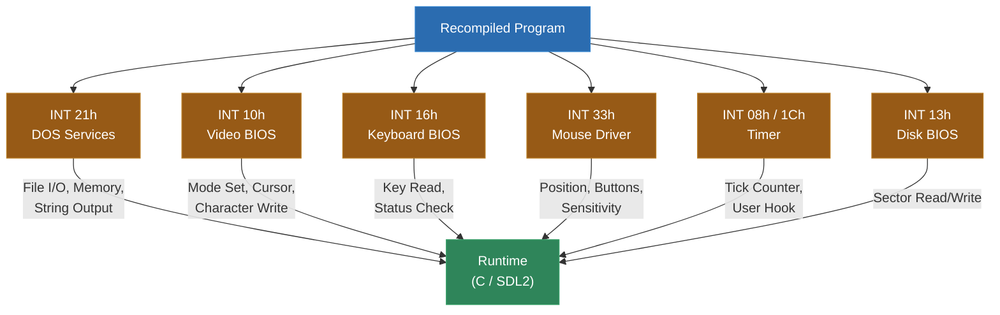
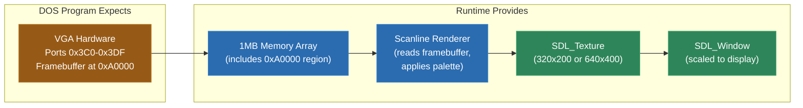

# Module 13: DOS -- 16-bit x86 and Real Mode

DOS software represents one of the most historically significant categories of trapped software. Thousands of games, productivity applications, educational programs, and creative tools were written for MS-DOS and its compatible environments between 1981 and the mid-1990s. Most of this software assumes it has direct access to hardware through x86 real mode -- segmented memory, port-mapped I/O, and BIOS/DOS interrupt services. None of these concepts exist on a modern operating system.

Static recompilation offers a path to preserve this software as native executables. The recompiled code replaces the x86 real mode CPU, while a runtime built on SDL2 provides the hardware abstraction that these programs expect. This module covers the unique challenges of 16-bit x86 recompilation: segmented memory, the MZ executable format, interrupt service shimming, and the complexities of x86 flag computation.

---

## 1. Why DOS?

DOS software is worth preserving for reasons beyond nostalgia:

**Historical significance.** MS-DOS was the dominant personal computing platform for over a decade. The software written for it includes groundbreaking games (DOOM, Civilization, SimCity, Wing Commander), essential productivity tools (WordPerfect, Lotus 1-2-3, dBASE), educational software (Microsoft Encarta, Oregon Trail, Carmen Sandiego), and creative tools (Deluxe Paint, Scream Tracker). This is cultural heritage.

**The real mode problem.** DOS programs run in x86 real mode, which gives them direct access to physical memory and hardware ports. Modern operating systems run in protected mode and do not allow user programs to access hardware directly. You cannot simply run a DOS executable on a modern OS -- the memory model is fundamentally incompatible.

**Existing solutions are imperfect.** DOSBox is an excellent emulator, but it interprets or dynamically recompiles x86 instructions at runtime, carrying overhead. It also treats the program as a black box -- you cannot modify the code, fix bugs, or add modern features. Static recompilation produces modifiable C source code and native performance.

**SDL2 as universal hardware.** Modern SDL2 provides cross-platform access to video, audio, input, and timers. By mapping DOS hardware abstractions (VGA, Sound Blaster, keyboard ports) to SDL2 calls, the runtime makes recompiled DOS programs run on Windows, macOS, Linux, and even WebAssembly.

---

## 2. Real Mode Memory

x86 real mode uses a segmented memory model that is fundamentally different from the flat address spaces used by every other architecture in this course.

### Segment:Offset Addressing

Every memory reference in real mode is specified as a segment:offset pair. The physical address is computed as:

```
physical_address = (segment * 16) + offset
```

Both segment and offset are 16-bit values, so the maximum addressable physical address is `0xFFFF * 16 + 0xFFFF = 0x10FFEF`, slightly over 1MB. The first 1MB (`0x00000-0xFFFFF`) is the standard real mode address space. The small region above 1MB (`0x100000-0x10FFEF`) is the "High Memory Area" (HMA), accessible with the A20 gate enabled.

The same physical address can be represented by multiple segment:offset pairs. For example, physical address `0x00400` can be expressed as `0x0040:0x0000`, `0x0000:0x0400`, `0x003F:0x0010`, or any other combination where `segment * 16 + offset = 0x400`. This aliasing is a recurring source of complexity.

### Memory Map

```
+-------------------+----------+------------------------------------------+
| Physical Address  | Size     | Region                                   |
+-------------------+----------+------------------------------------------+
| 0x00000 - 0x003FF |   1 KB   | Interrupt Vector Table (IVT)             |
| 0x00400 - 0x004FF | 256 bytes| BIOS Data Area (BDA)                     |
| 0x00500 - 0x9FFFF | ~638 KB  | Conventional Memory (program space)      |
| 0xA0000 - 0xAFFFF |  64 KB   | VGA Graphics Memory (Mode 13h framebuf)  |
| 0xB0000 - 0xB7FFF |  32 KB   | Monochrome Text Video Memory             |
| 0xB8000 - 0xBFFFF |  32 KB   | Color Text Video Memory                  |
| 0xC0000 - 0xC7FFF |  32 KB   | VGA BIOS ROM                             |
| 0xC8000 - 0xEFFFF | ~160 KB  | Adapter ROMs / Expansion area            |
| 0xF0000 - 0xFFFFF |  64 KB   | System BIOS ROM                          |
+-------------------+----------+------------------------------------------+
```

For the recompiler runtime, the memory is implemented as a flat 1MB+ array. The `mem_read` and `mem_write` functions take a physical address (computed from segment:offset) and access the appropriate byte. Special handling is needed for:

- **VGA memory** (`0xA0000-0xBFFFF`): Writes may trigger display updates or interact with VGA register state (planar modes, write modes).
- **BIOS Data Area** (`0x00400-0x004FF`): Contains hardware state that the program may read (keyboard buffer, timer tick count, video mode).
- **Port I/O**: Not memory-mapped in the traditional sense -- x86 uses separate IN/OUT instructions for port access. The runtime must intercept these and route them to the appropriate hardware shim.

---

## 3. MZ Executable Format

DOS executables use the MZ format (named for Mark Zbikowski, one of the original DOS developers). The file begins with the signature bytes `4D 5A` ("MZ") followed by a header that describes the executable's memory requirements and relocation table.

### MZ Header Structure

| Offset | Size | Field |
|---|---|---|
| 0x00 | 2 bytes | Signature: "MZ" (0x5A4D) |
| 0x02 | 2 bytes | Bytes on last page |
| 0x04 | 2 bytes | Pages in file (512 bytes per page) |
| 0x06 | 2 bytes | Number of relocation entries |
| 0x08 | 2 bytes | Header size in paragraphs (16 bytes each) |
| 0x0A | 2 bytes | Minimum extra paragraphs needed |
| 0x0C | 2 bytes | Maximum extra paragraphs needed |
| 0x0E | 2 bytes | Initial SS (relative to load segment) |
| 0x10 | 2 bytes | Initial SP |
| 0x12 | 2 bytes | Checksum |
| 0x14 | 2 bytes | Initial IP |
| 0x16 | 2 bytes | Initial CS (relative to load segment) |
| 0x18 | 2 bytes | Offset of relocation table |
| 0x1A | 2 bytes | Overlay number (0 for main executable) |

### Relocations

When DOS loads an MZ executable, it places the program at whatever segment address is available (the "load segment"). Segment references within the code need to be adjusted to reflect the actual load address. The relocation table lists the file offsets of every segment reference that needs patching.

Each relocation entry is a segment:offset pair pointing to a 16-bit value in the executable that should have the load segment added to it. For example, if the program contains `MOV AX, 0x1000` and that `0x1000` is a segment reference, and the program is loaded at segment `0x2000`, the relocation patches it to `MOV AX, 0x3000`.

For the recompiler, relocations are handled at recompile time. Since the recompiled code uses a flat memory model, segment references are resolved to fixed addresses during the lifting phase. The recompiler reads the relocation table, identifies every segment reference, and replaces them with their resolved values.

### EXEPACK

Some DOS executables are compressed with EXEPACK, a compression tool that reduces executable size. An EXEPACK-compressed executable has a small decompression stub that runs first, unpacks the real program into memory, and then transfers control to it.

The recompiler must detect EXEPACK-compressed executables (identifiable by the string "RB" at specific offsets in the header or by the decompression stub's signature) and decompress them before disassembly. The decompression algorithm is well-documented and straightforward to implement -- it uses simple run-length encoding.

### Overlays

Large DOS programs often use overlays -- separate sections of code that are loaded into the same memory region on demand, like a manual form of bank switching. Only one overlay occupies the overlay region at a time. The main program loads the needed overlay from disk before calling into it.

For the recompiler, overlays are analogous to Game Boy bank switching. Each overlay is disassembled and lifted separately, and the runtime maintains the overlay state to dispatch calls to the correct code.

---

## 4. INT Handlers and DOS Services

DOS programs do not call operating system functions through a standard calling convention. Instead, they use software interrupts. The `INT` instruction triggers a software interrupt, which on real hardware transfers control to a handler whose address is stored in the Interrupt Vector Table at the bottom of memory. In a recompiled program, each INT must be intercepted and routed to a shim that provides the expected behavior.

### The Major Interrupt Services



### INT 21h: DOS Services

INT 21h is the primary DOS API. The function number is passed in AH. The most commonly used subfunctions:

| AH | Function | Description |
|---|---|---|
| 0x02 | Display Character | Write character in DL to stdout |
| 0x09 | Display String | Write $-terminated string at DS:DX |
| 0x0E | Set Default Drive | Set current drive to DL |
| 0x19 | Get Default Drive | Return current drive in AL |
| 0x25 | Set Interrupt Vector | Set handler for interrupt AL to DS:DX |
| 0x30 | Get DOS Version | Return DOS version in AL.AH |
| 0x35 | Get Interrupt Vector | Return handler for interrupt AL in ES:BX |
| 0x3C | Create File | Create/truncate file, name at DS:DX |
| 0x3D | Open File | Open existing file, name at DS:DX |
| 0x3E | Close File | Close file handle in BX |
| 0x3F | Read File | Read CX bytes from handle BX to DS:DX |
| 0x40 | Write File | Write CX bytes from DS:DX to handle BX |
| 0x42 | Seek File | Move file pointer for handle BX |
| 0x48 | Allocate Memory | Allocate BX paragraphs |
| 0x49 | Free Memory | Free block at ES |
| 0x4A | Resize Memory | Resize block at ES to BX paragraphs |
| 0x4C | Terminate Program | Exit with return code in AL |

The runtime shims these to standard C library calls (fopen, fread, fwrite, fseek, malloc, exit). File paths need translation from DOS format (`C:\GAME\DATA.DAT`) to the host filesystem.

### INT 10h: Video BIOS

Controls video mode and text output. The most important subfunctions:

| AH | Function | Description |
|---|---|---|
| 0x00 | Set Video Mode | Set mode in AL (0x03 = 80x25 text, 0x13 = 320x200 256-color) |
| 0x02 | Set Cursor Position | Move cursor to DH=row, DL=column |
| 0x0E | Write Character (TTY) | Write character in AL with TTY behavior |
| 0x10 | Palette Functions | Subfunctions for VGA palette manipulation |

Mode 13h (320x200, 256 colors, linear framebuffer at `0xA0000`) is by far the most common graphics mode for DOS games. The runtime maps this to an SDL2 texture that is scaled to the window size.

### INT 16h: Keyboard BIOS

| AH | Function | Description |
|---|---|---|
| 0x00 | Read Key | Block until a key is pressed, return scancode in AH, ASCII in AL |
| 0x01 | Check Key Status | Non-blocking check, ZF=1 if no key available |
| 0x02 | Get Shift Flags | Return shift/ctrl/alt status in AL |

### INT 33h: Mouse Driver

| AX | Function | Description |
|---|---|---|
| 0x00 | Reset/Detect | Check if mouse driver is installed |
| 0x01 | Show Cursor | Make mouse cursor visible |
| 0x02 | Hide Cursor | Make mouse cursor invisible |
| 0x03 | Get Position | Return button status in BX, X in CX, Y in DX |
| 0x04 | Set Position | Move cursor to CX, DX |
| 0x07 | Set X Range | Set horizontal bounds |
| 0x08 | Set Y Range | Set vertical bounds |

---

## 5. Lifting x86-16

The x86 architecture, even in its 16-bit real mode form, is the most complex instruction set you will encounter in this course. It is a CISC architecture with variable-length instructions, irregular encoding, and a flag register with more bits than any other architecture covered here.

### Segment Register Handling

Every memory access in x86 real mode uses a segment register. The default segment depends on the context:

- **CS** for instruction fetch
- **DS** for most data access
- **SS** for stack operations (PUSH, POP, and accesses relative to BP)
- **ES** for string destination operations (STOSB, MOVSB destination)

Segment override prefixes can change the default. The generated C code must compute the correct physical address for every memory access:

```c
// MOV AX, [BX]  (default segment: DS)
ctx->ax = mem_read_16((ctx->ds << 4) + ctx->bx);

// MOV AX, ES:[BX]  (segment override: ES)
ctx->ax = mem_read_16((ctx->es << 4) + ctx->bx);

// MOV AX, [BP+4]  (default segment: SS, because BP-relative)
ctx->ax = mem_read_16((ctx->ss << 4) + ctx->bp + 4);

// PUSH AX  (always SS:SP)
ctx->sp -= 2;
mem_write_16((ctx->ss << 4) + ctx->sp, ctx->ax);
```

### Flag Computation

The x86 FLAGS register has six arithmetic flags that are updated by most ALU operations:

| Flag | Bit | Set When |
|---|---|---|
| CF (Carry) | 0 | Unsigned overflow/underflow |
| PF (Parity) | 2 | Low byte of result has even number of set bits |
| AF (Auxiliary) | 4 | Carry from bit 3 to bit 4 (BCD operations) |
| ZF (Zero) | 6 | Result is zero |
| SF (Sign) | 8 | Most significant bit of result is set |
| OF (Overflow) | 11 | Signed overflow |

The parity flag is particularly annoying -- it requires counting the set bits in the low byte of the result for almost every arithmetic and logic instruction. Many recompilers use a 256-entry lookup table for this:

```c
static const uint8_t parity_table[256] = {
    1, 0, 0, 1, 0, 1, 1, 0, 0, 1, 1, 0, 1, 0, 0, 1, // 0x00-0x0F
    // ... (256 entries, 1 = even parity, 0 = odd parity)
};
ctx->flag_pf = parity_table[result & 0xFF];
```

The auxiliary carry flag (AF) is used only by the DAA and DAS (decimal adjust) instructions, but it must be computed by every ADD/SUB/INC/DEC because the program might check it later with LAHF or PUSHF.

### Lazy Flag Evaluation

Computing all six flags for every arithmetic instruction is expensive. A common optimization is **lazy flag evaluation**: instead of computing flags immediately, store the operands and operation type, and only compute the actual flag values when they are read.

```c
// Instead of computing all flags for ADD AX, BX:
ctx->lazy_op = LAZY_ADD_16;
ctx->lazy_result = ctx->ax + ctx->bx;
ctx->lazy_src = ctx->bx;
ctx->lazy_dst = ctx->ax;
ctx->ax = ctx->lazy_result;

// When a flag is actually needed (e.g., JZ reads ZF):
uint16_t get_zf(Context *ctx) {
    return (ctx->lazy_result & 0xFFFF) == 0;
}
```

This avoids computing flags that are never read, which is the common case -- most arithmetic results only check one or two flags before the next arithmetic instruction overwrites them all.

### REP/String Operations

The x86 string instructions (MOVSB, MOVSW, STOSB, STOSW, CMPSB, LODSB, SCASB) operate on blocks of memory when prefixed with REP, REPE, or REPNE. They use SI as the source index, DI as the destination index, CX as the counter, and the direction flag to determine whether the indices increment or decrement.

```c
// REP MOVSB: copy CX bytes from DS:SI to ES:DI
while (ctx->cx != 0) {
    uint8_t byte = mem_read((ctx->ds << 4) + ctx->si);
    mem_write((ctx->es << 4) + ctx->di, byte);
    if (ctx->flag_df) { ctx->si--; ctx->di--; }
    else              { ctx->si++; ctx->di++; }
    ctx->cx--;
}
```

### Self-Modifying Code

Some DOS programs modify their own code at runtime. This is rare in games but appears in:

- **Copy protection**: Code decryption routines that overwrite themselves with the real program
- **Performance optimization**: Patching instruction operands to avoid repeated computation
- **Compression stubs**: Decompression code that overwrites itself with the decompressed program

Static recompilation fundamentally assumes that code does not change. When self-modifying code is detected (writes to addresses in the code segment), the recompiler must fall back to interpretation for those sections. In practice, self-modifying code in DOS programs is usually limited to initialization (decompression, copy protection checks) and can be handled by pre-processing: run the initial code in an interpreter until it finishes modifying itself, then recompile the final state.

---

## 6. SDL2 as Hardware Abstraction

The runtime uses SDL2 to replace the hardware that DOS programs expect. This mapping is clean and covers all major subsystems.

### Video Mode Emulation



**Mode 13h** (320x200, 256 colors): The framebuffer is a linear array of 64,000 bytes at physical address `0xA0000`. Each byte is a palette index. The runtime maintains a 256-entry palette (set via INT 10h or VGA port writes) and renders the framebuffer to an SDL2 texture each frame.

**VGA text mode** (80x25 or 80x50): The text framebuffer at `0xB8000` contains character/attribute pairs. Each cell is 2 bytes: the character code and an attribute byte (foreground color, background color, blink). The runtime renders text to the SDL2 texture using a built-in VGA font.

**Planar VGA modes** (Mode 12h, 640x480 16-color, and others): These use VGA's planar memory architecture where the framebuffer is split across four bit planes. Reads and writes are controlled by VGA sequencer and graphics controller registers. These modes are more complex to emulate but follow well-documented rules.

### Keyboard Input

DOS programs read keyboard input through:
- INT 16h (BIOS keyboard services)
- INT 09h (hardware keyboard interrupt handler, for direct scancode access)
- Port 0x60 (keyboard data port, for games that read the hardware directly)

The runtime maps SDL2 keyboard events to the DOS keyboard model. SDL2's `SDL_SCANCODE_*` values are translated to IBM PC keyboard scancodes. The runtime maintains a keyboard buffer (matching the BIOS keyboard buffer at `0x40:0x1E-0x40:0x3D`) and a key state array for programs that check individual key states.

### Mouse Input

INT 33h mouse driver calls are mapped to SDL2 mouse state. `SDL_GetMouseState` provides the current position and button state. The runtime scales the mouse position to match the expected coordinate system (the DOS mouse driver reports coordinates in a virtual coordinate space, typically 640x200 for Mode 13h).

### Timer

The DOS timer tick (INT 08h) fires approximately 18.2 times per second. Many games reprogram the Programmable Interval Timer (PIT, port 0x40-0x43) to fire at higher rates for music playback or precise timing.

The runtime uses SDL2's timer facilities or a high-resolution system clock to fire the timer callback at the requested rate. The BIOS tick counter at `0x40:0x6C` is incremented on each tick, and any user-installed INT 1Ch handler is called.

---

## 7. Real-World Reference

**civ** by sp00nznet is a static recompilation of *Sid Meier's Civilization* for DOS. This project demonstrates handling a complex DOS application with extensive INT 21h file I/O, multiple video modes (text mode for menus, Mode 13h for the map), mouse input, and timer-driven game logic. It illustrates how the full set of DOS service shims comes together to support a real program.

**encarta** by sp00nznet recompiles portions of *Microsoft Encarta*, showcasing how static recompilation can preserve educational software. This project involves complex file I/O patterns, multimedia playback, and extensive text rendering.

**pcrecomp** by sp00nznet is a general-purpose DOS recompilation toolkit. It implements the MZ parser, x86-16 disassembler and lifter, and the full runtime with SDL2 hardware abstraction. It serves as the foundation for game-specific DOS recompilation projects and demonstrates the complete pipeline described in this module.

These projects show that DOS static recompilation is practical for real-world software. The segmented memory model and interrupt-based API add complexity compared to console targets, but the underlying pipeline is the same: parse the binary, disassemble the code, lift instructions to C, and provide a runtime that replaces the original hardware.

---

## Lab

The following lab accompanies this module:

- **Lab 8** -- DOS recompilation: Build an x86-16 lifter with segment handling, implement INT 21h and INT 10h shims, and recompile a DOS executable using SDL2 for display and input

---

**Next: [Module 7 -- The Indirect Call Problem](../module-07-indirect-calls/lecture.md)**
