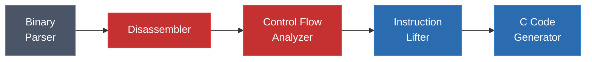
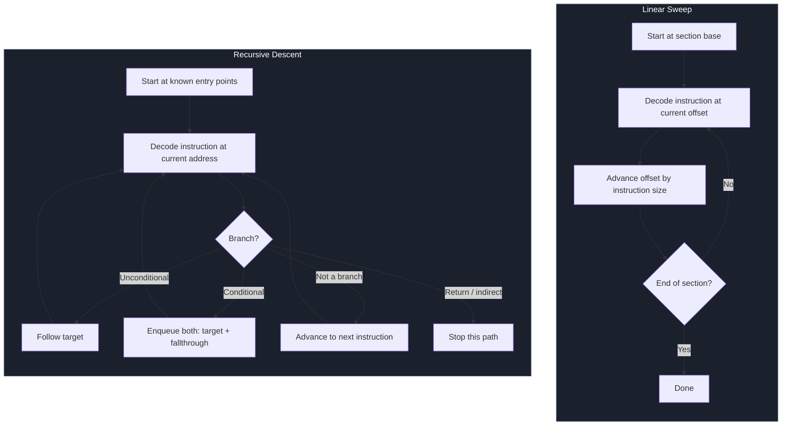
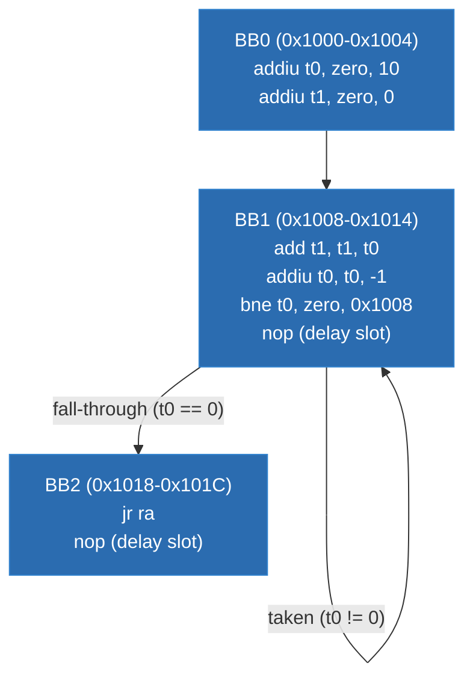
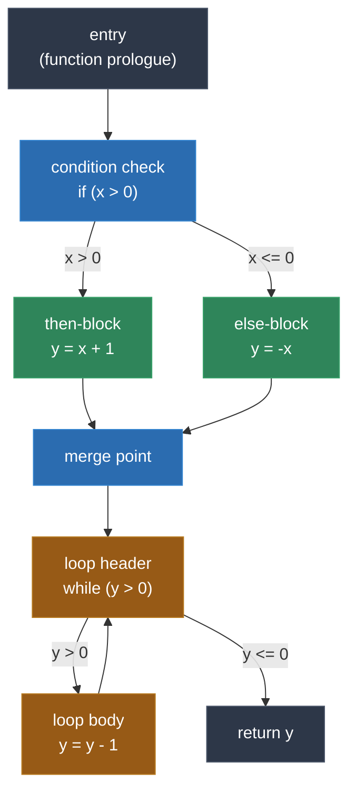

# Module 8: Disassembly and Control Flow Analysis

Disassembly is the first real transformation in the static recompilation pipeline. It converts raw bytes -- the machine code sitting in a ROM or executable -- into a structured stream of instructions that every subsequent stage depends on. The quality of your disassembly determines the quality of everything downstream: get it wrong, and the lifter will translate garbage, the CFG will be incomplete, and the recompiled binary will crash or produce incorrect behavior.

This module covers the two fundamental disassembly strategies, walks through the recursive descent algorithm in detail, and then shows how to build the data structures -- basic blocks and control flow graphs -- that the rest of the recompiler consumes.

---

## 1. The Role of Disassembly in the Pipeline

In the full recompilation pipeline, disassembly sits immediately after binary parsing:



The binary parser has already extracted the code and data sections and determined the entry point. The disassembler's job is to take those raw code bytes and produce an ordered list of instructions, each with:

- **Address**: where the instruction lives in the original address space
- **Opcode**: the operation (ADD, LOAD, BRANCH, etc.)
- **Operands**: registers, immediates, memory references
- **Size**: how many bytes the instruction occupies (critical for variable-length ISAs like x86)

This instruction stream is the input to control flow analysis, which groups instructions into basic blocks and connects them into a control flow graph. Together, disassembly and control flow analysis form the analytical front-end of the recompiler. Everything after this point -- lifting, code generation, runtime linking -- operates on the structured representation these stages produce, never on raw bytes.

The distinction between "getting most of the code" and "getting all of the code" matters enormously. A single missed function means a crash at runtime. A single misidentified data byte decoded as an instruction can corrupt the entire block structure downstream. This is why disassembly strategy matters.

---

## 2. Linear Sweep vs Recursive Descent

There are two fundamental approaches to disassembly. Every practical disassembler uses one or the other as its foundation, sometimes combining elements of both.



### Linear Sweep

Linear sweep is the simplest possible approach: start at the beginning of a code section and decode every byte sequentially, advancing by the size of each decoded instruction.

Advantages:
- Trivial to implement
- Guaranteed to visit every byte in the section
- Works perfectly when the section contains nothing but contiguous code

Disadvantages:
- Cannot distinguish code from data. If a jump table, string literal, or alignment padding appears in the code section, linear sweep will attempt to decode those bytes as instructions. On variable-length ISAs like x86, this desynchronizes the decoder -- one misidentified byte shifts all subsequent instruction boundaries.
- On fixed-width ISAs (MIPS, PPC, SM83), the damage is more contained because instruction alignment is guaranteed, but data bytes still produce nonsensical instructions that pollute the output.

Tools like objdump use linear sweep by default. It is adequate for quick inspection but unsuitable as the sole strategy for a static recompiler.

### Recursive Descent

Recursive descent follows the actual control flow of the program. It starts from known entry points -- the reset vector, exported function symbols, interrupt handler addresses -- and decodes instructions along execution paths. When it encounters a branch, it follows the target (and the fall-through path for conditional branches). When it encounters a return, an indirect jump, or an invalid opcode, it stops that path and moves on to the next queued address.

Advantages:
- Only decodes bytes that are actually reachable as code
- Naturally avoids data embedded in code sections
- Produces accurate results for all code it can reach

Disadvantages:
- Misses code that is only reachable through indirect jumps (function pointers, jump tables, computed gotos)
- Requires knowing at least one valid entry point
- More complex to implement correctly

### What Real Recompilers Use

Most static recompilers use recursive descent as the primary strategy, augmented with heuristics and manual annotations to fill in the gaps:

- **N64Recomp** uses recursive descent from the ELF symbol table, with relocation information to resolve jump tables
- **gb-recompiled** uses recursive descent from the reset vector and interrupt vectors, with bank-aware address tracking
- **xboxrecomp** uses recursive descent from PE export table entries, with additional heuristic scanning for function prologues
- **pcrecomp** combines recursive descent with prologue pattern matching for DOS executables that lack symbol information

The pattern is consistent: recursive descent first, then additional techniques to recover what recursive descent missed.

---

## 3. Recursive Descent in Detail

The core of recursive descent disassembly is a work queue algorithm. Here is the logic in pseudocode:

```
function disassemble_recursive(entry_points, code_bytes):
    work_queue = Queue()
    visited = Set()
    instructions = Map()   // address -> decoded instruction

    // Seed the queue with all known entry points
    for addr in entry_points:
        work_queue.enqueue(addr)

    while not work_queue.empty():
        addr = work_queue.dequeue()

        // Skip if we have already visited this address
        if addr in visited:
            continue

        // Decode the instruction at this address
        insn = decode(code_bytes, addr)
        if insn is invalid:
            continue

        visited.add(addr)
        instructions[addr] = insn

        // Determine what to do based on instruction type
        if insn.is_unconditional_jump():
            if insn.target is known:
                work_queue.enqueue(insn.target)
            // Do NOT enqueue addr + insn.size (no fall-through)

        else if insn.is_conditional_branch():
            work_queue.enqueue(insn.target)          // taken path
            work_queue.enqueue(addr + insn.size)      // fall-through

        else if insn.is_call():
            work_queue.enqueue(insn.target)           // callee
            work_queue.enqueue(addr + insn.size)      // return site

        else if insn.is_return() or insn.is_indirect_jump():
            // Stop: we cannot statically determine the target
            pass

        else:
            // Normal instruction: continue to next
            work_queue.enqueue(addr + insn.size)

    return instructions
```

### Key Design Decisions

**Entry points.** The more entry points you seed, the more complete your disassembly. Common sources:
- Reset vector / program entry point
- Interrupt and exception handler addresses (from vector tables)
- Exported function symbols (from ELF symbol table, PE export table)
- Addresses referenced by relocation entries
- Function addresses found in jump tables (if you can identify them)

**Visited set.** This prevents infinite loops when the code contains cycles (which it almost always does -- loops are cycles). Without it, the algorithm would revisit the same instructions forever.

**Stopping conditions.** The algorithm stops a path when it encounters:
- A return instruction (RET, JR $ra, BLR, etc.)
- An indirect jump whose target cannot be determined statically
- An invalid opcode (likely data, not code)
- An address outside the known code section

**Indirect jumps.** When the algorithm encounters an instruction like `JR $t0` (MIPS) or `JMP [eax]` (x86), it cannot determine where execution goes. This is the fundamental limitation of recursive descent and the reason Module 7 is dedicated entirely to indirect calls and jump tables.

---

## 4. Basic Block Construction

Once the instruction stream has been recovered, the next step is to group instructions into **basic blocks**.

### Definition

A basic block is a maximal sequence of instructions with:
- **One entry point**: execution can only enter at the first instruction
- **One exit point**: execution can only leave at the last instruction
- **No internal branches**: no instruction in the middle is a branch target or a branch source

This means that if any instruction in a basic block executes, all of them execute, in order. This property is enormously valuable for the lifter and code generator: each basic block can be translated as a straight-line sequence of C statements with no internal control flow.

### How to Identify Split Points

Basic block boundaries occur at two types of locations:

1. **After any branch, jump, call, or return instruction** -- the instruction after such an instruction starts a new block (it could be the target of some other branch, or the fall-through of a conditional branch).

2. **At any address that is the target of a branch** -- if instruction X branches to address Y, then Y starts a new block, even if the instruction before Y is not a branch.

Consider this MIPS example:

```asm
0x1000:  addiu  $t0, $zero, 10    ; loop counter = 10
0x1004:  addiu  $t1, $zero, 0     ; sum = 0
0x1008:  add    $t1, $t1, $t0     ; sum += counter    <-- branch target
0x100C:  addiu  $t0, $t0, -1      ; counter--
0x1010:  bne    $t0, $zero, 0x1008 ; if counter != 0, goto 0x1008
0x1014:  nop                       ; delay slot
0x1018:  jr     $ra                ; return
0x101C:  nop                       ; delay slot
```

The split points are:
- Before `0x1008` (it is a branch target)
- After `0x1010`/`0x1014` (the BNE + delay slot is a branch)
- After `0x1018`/`0x101C` (the JR + delay slot is a return)

This produces three basic blocks:



BB0 is the function prologue. BB1 is the loop body -- note the self-loop edge. BB2 is the function epilogue / return.

### Implementation

In practice, basic block construction runs as a second pass over the instruction list produced by recursive descent:

1. Collect all addresses that are branch targets into a set `leaders`.
2. Also add the address after every branch/jump/call/return to `leaders`.
3. Also add every entry point to `leaders`.
4. Sort the leader addresses.
5. Each basic block spans from one leader to the next (exclusive), ending at or just before the next leader.

---

## 5. Control Flow Graph (CFG)

The control flow graph is built by connecting basic blocks with edges that represent the possible flow of execution.

### Edge Types

| Edge Type | Meaning | Example |
|---|---|---|
| **Fall-through** | Execution continues to the next sequential block | After a conditional branch when the condition is false |
| **Taken branch** | Conditional branch target when the condition is true | `BNE $t0, $zero, target` when `$t0 != 0` |
| **Unconditional jump** | Always transfers to the target | `J target`, `B target` |
| **Call** | Function call; execution will (usually) return | `JAL func`, `CALL func`, `BL func` |
| **Return** | Back to the caller (edge target is not known statically) | `JR $ra`, `RET`, `BLR` |

### Example CFG

Consider a function with an if/else structure and a loop:



The CFG reveals the program's structure:
- The diamond pattern (COND -> THEN/ELSE -> MERGE) is an if/else
- The cycle (LOOP_HEAD -> LOOP_BODY -> LOOP_HEAD) is a while loop
- The single exit (EXIT) is the return

### Why the CFG Matters

The CFG is the central data structure for the entire recompiler. It is consumed by:

- **The lifter**: needs to know which blocks exist and how they connect to generate correct C control flow (gotos, if statements, loops)
- **The code generator**: uses the CFG to decide how to organize C functions -- which blocks go into which function, where to place labels
- **Optimization passes**: dead block elimination, unreachable code detection, loop detection all operate on the CFG
- **Indirect jump resolution**: Module 7's techniques for resolving jump tables and function pointers feed new edges back into the CFG

A correct, complete CFG is what separates a working recompiler from one that crashes on real binaries.

---

## 6. Function Boundary Detection

Real binaries often lack symbol information. Stripped ELF binaries, raw ROM images, and many console executables provide no function names and no function boundary markers. The recompiler must infer where functions begin and end.

### Why Function Boundaries Matter

Function boundaries determine how the recompiler groups basic blocks into C functions. If a function boundary is placed in the wrong location:
- Stack frame management may be incorrect (local variables leak between functions)
- The calling convention may be misapplied (wrong registers saved/restored)
- Intra-function branches may be misidentified as inter-function calls

### Detection Strategies

**CALL target analysis.** The simplest and most reliable strategy: every address that is the target of a CALL instruction (JAL on MIPS, BL on ARM/PPC, CALL on x86) is likely a function entry point. This is effective but misses functions that are only reached through tail calls (jumps) or function pointers.

**Prologue pattern matching.** Many compilers emit recognizable function prologues:

| Architecture | Common Prologue Pattern |
|---|---|
| x86 | `push ebp; mov ebp, esp` or `sub esp, N` |
| MIPS | `addiu $sp, $sp, -N; sw $ra, offset($sp)` |
| PPC | `stwu r1, -N(r1); mflr r0; stw r0, M(r1)` |
| SM83 | `push af; push bc` (register saves) |
| SH-4 | `mov.l r14, @-r15; sts.l pr, @-r15` |

Scanning for these patterns can identify functions that no CALL instruction references. However, hand-written assembly and some optimizing compilers do not follow these patterns.

**Alignment heuristics.** Many compilers align function entry points to 4-byte, 8-byte, or 16-byte boundaries. NOP sleds or zero padding between functions can suggest boundaries. This is a weak signal on its own but useful in combination with other heuristics.

**Return analysis.** Every return instruction ends a function (or at least a path through a function). The instruction immediately after a return (if it is not already identified as part of another function) may be the start of a new function. This is especially useful for identifying functions that are laid out sequentially in memory.

### Architecture-Specific Considerations

**MIPS** has particularly clean function boundaries because `$ra` (the return address register) is explicitly saved and restored. The pattern `addiu $sp, $sp, -framesize` / `sw $ra, offset($sp)` at the start and `lw $ra, offset($sp)` / `jr $ra` / `addiu $sp, $sp, framesize` at the end is nearly universal in compiler-generated MIPS code. N64Recomp exploits this heavily.

**x86** is harder because the instruction set is variable-length and calling conventions vary. The classic `push ebp; mov ebp, esp` prologue is common but not universal -- leaf functions may omit the frame pointer, and optimized code may use different patterns.

**SM83 (Game Boy)** has no hardware call stack -- CALL pushes the return address onto the memory stack and jumps. Function boundaries are identified primarily by CALL targets and by recognizing register save/restore patterns at function boundaries.

---

## 7. Special Cases

Several architectural features and code patterns create complications for disassembly and control flow analysis that go beyond the basic algorithm.

### Delay Slots (MIPS, SH-4)

On MIPS and SH-4, the instruction immediately after a branch executes **before** the branch takes effect. This is a pipeline artifact of the original hardware.

```asm
; MIPS: the ADDIU executes before the branch to 0x1008
0x1000:  bne    $t0, $zero, 0x1008
0x1004:  addiu  $t1, $t1, 1        ; <-- delay slot, executes regardless
0x1008:  ...
```

For the disassembler, this means:
- The delay slot instruction is logically part of the branch, not of the following block
- Basic block boundaries must account for delay slots: the block ends after the delay slot instruction, not after the branch
- The lifter must emit the delay slot instruction's effect before the branch condition check

SH-4 also has delay slots, but with an additional twist: some SH-4 branch instructions have delay slots and others do not (the "delayed" vs "non-delayed" branch variants).

### Compressed Instruction Sets (Thumb, MIPS16)

Some architectures support multiple instruction encodings at different widths. ARM has 32-bit ARM mode and 16-bit Thumb mode. MIPS has the MIPS16 extension. The processor can switch between modes at runtime.

The disassembler must track which mode is active at each point in the code. A mode switch typically happens at a branch instruction (the BX instruction on ARM, for example, switches modes based on the low bit of the target address). The disassembler must decode the instructions following the branch in the correct mode.

This is rarely a concern for the architectures most commonly targeted by game recompilation (MIPS R4300i, PPC, SM83, SH-4 in 32-bit mode), but it matters for GBA (ARM7TDMI with frequent Thumb switching) and DS targets.

### Overlays

Many console games use overlays: multiple code modules that are loaded into the same address range at different times. The game loads overlay A, runs it, then replaces it with overlay B at the same addresses.

For the disassembler, this means:
- The same address can contain different code at different times
- Each overlay must be disassembled separately
- Cross-overlay references must be tracked (overlay A might call a function in the base code, which later calls into overlay B)
- N64 games use overlays extensively; N64Recomp handles this with explicit overlay tables

### Cross-Module References

Console executables often have import tables (like the Xbox PE format) or dynamic linking tables that reference functions in the OS kernel or shared libraries. These references are resolved at load time on the original hardware, but the recompiler must resolve them at compile time by linking against shim implementations.

The disassembler must parse these import/export tables and create appropriate stubs or references for each imported function.

---

## 8. Real-World Challenges

### Self-Modifying Code

Self-modifying code writes new instructions into memory and then executes them. This is fundamentally incompatible with static recompilation: the recompiler analyzes code at disassembly time, but self-modifying code changes after that analysis.

Strategies for handling self-modifying code:
- **Avoidance**: many programs only self-modify during initialization (unpacking, decompression). If the modified code is stable after init, disassemble the post-modification state.
- **Interpreter fallback**: for sections of code that genuinely modify themselves at runtime, fall back to an interpreter. The recompiled code calls into an interpreter for those regions.
- **Manual intervention**: identify the self-modifying patterns and handle them case by case with custom code in the runtime.

DOS programs are the most common source of self-modifying code in recompilation targets. Some DOS games use runtime code generation for performance-critical rendering loops. The pcrecomp project handles these with a combination of pre-analysis (disassembling the generated code patterns) and interpreter fallback.

### Data Embedded in Code Sections

Compilers sometimes emit data -- jump tables, string literals, constant pools -- in the middle of code sections. Linear sweep will misinterpret this data as instructions. Recursive descent avoids this naturally (it will not reach data bytes through control flow), but it may fail to disassemble code that is only reachable through a jump table embedded in the data.

The solution is to identify the data regions explicitly:
- Jump tables can be detected by pattern (a sequence of addresses following a computed jump)
- String literals can be detected by content (sequences of printable ASCII bytes)
- Constant pools (common in ARM code) follow a predictable layout relative to the instructions that reference them

### Hand-Written Assembly

Compiler-generated code follows predictable patterns. Hand-written assembly does not. It may:
- Use unconventional register allocation
- Interleave function bodies (one function falls through into another)
- Use self-referential tricks (computing addresses relative to the current PC)
- Intentionally alias code and data (the same bytes serve as both an instruction and a data constant)

Hand-written assembly appears in performance-critical sections of console games (inner loops of software renderers, audio mixing routines, etc.) and in OS/kernel code. The recompiler must handle it correctly, which often requires manual annotations or special-case handling.

### Project-Specific Approaches

Different recompilation projects handle these challenges differently:

- **pcrecomp** maintains a database of known self-modifying patterns in DOS games and handles each one with a targeted patch in the runtime
- **360tools** uses XEX section headers to distinguish code from data, and uses the Xbox 360's relocation tables to identify jump table entries
- **gb-recompiled** relies on the Game Boy's relatively clean separation of code and data across ROM banks, with manual annotations for the few edge cases

The common thread is that fully automatic disassembly is not always possible. Real recompilation projects combine automatic analysis with manual annotation, project-specific knowledge, and sometimes educated guessing.

---

## Summary

Disassembly and control flow analysis form the analytical foundation of the static recompilation pipeline. The key concepts from this module:

1. **Recursive descent** is the preferred disassembly strategy for recompilers, following control flow from known entry points rather than decoding bytes linearly.

2. **Basic blocks** are the atomic units of control flow -- maximal straight-line instruction sequences with one entry and one exit.

3. **The control flow graph (CFG)** connects basic blocks with edges representing branches, fall-throughs, calls, and returns. It is the central data structure consumed by all downstream stages.

4. **Function boundary detection** uses CALL targets, prologue patterns, and architecture-specific heuristics to group basic blocks into functions.

5. **Special cases** -- delay slots, overlays, self-modifying code, embedded data -- require architecture-specific handling and sometimes manual intervention.

---

## Labs

- **Lab 10 (snesrecomp Build and Run)**: Apply the disassembly concepts from this module to observe how snesrecomp handles 65816 code, including bank-crossing branches and mode switches.
- **Lab 11 (DOS Header Parsing)**: Parse an MZ executable, map its segments, and identify code vs. data regions -- a prerequisite for correct disassembly of DOS binaries.

---

**Next: [Module 9 -- Instruction Lifting: Assembly to C](../module-09-lifting/lecture.md)**
