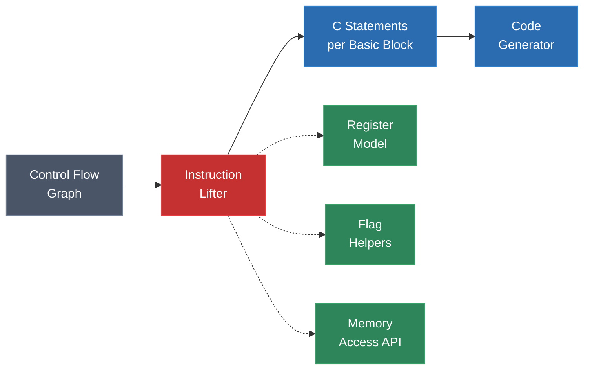
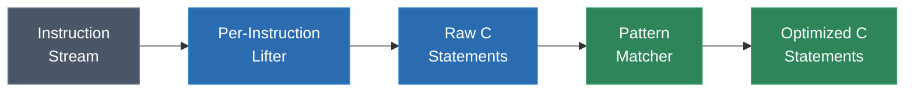

# Module 9: Instruction Lifting -- Assembly to C

Instruction lifting is the heart of the static recompiler. It is the stage where machine code -- opaque bytes that only the original CPU can execute -- becomes portable C source code that any modern compiler can turn into a native binary. Every other stage in the pipeline exists to support this one: disassembly recovers the instructions, control flow analysis organizes them, the code generator formats the output, and the runtime makes it run. But lifting is where the actual translation happens.

This module covers how to translate individual assembly instructions into semantically equivalent C statements, how to model CPU state in C, how to handle the thorny problem of flag computation, and how real recompilers approach lifting across five different architectures.

---

## 1. What Is Lifting?

Lifting is the process of converting each assembly instruction into one or more C statements that reproduce its exact behavior. The word "exact" is critical: the generated C must be **semantically equivalent** to the original machine code. This means:

- Every register write must produce the same value
- Every flag update must produce the same result
- Every memory access must hit the same address with the same data
- Every side effect (I/O, interrupts, state changes) must occur in the same order

Lifting is not decompilation. Decompilation attempts to recover the original source code -- variable names, data types, high-level control structures. Lifting makes no such attempt. The output of lifting is mechanistic, verbose, and often ugly. A lifted `ADD` instruction may produce five lines of C (the addition itself plus four flag updates). That is acceptable. The goal is correctness, not readability.

The relationship between lifting and the surrounding pipeline stages:



The lifter consumes the CFG (which provides basic blocks and their instruction sequences) and produces C statements for each block. It depends on three supporting components: the register model (how CPU registers are represented in C), flag helpers (functions or macros that compute processor flags), and the memory access API (how loads and stores are translated).

---

## 2. The Register Model

The first design decision in building a lifter is how to represent CPU registers in C. There are three main approaches, each with distinct trade-offs.

### Approach 1: Global Variables

Each CPU register becomes a global C variable:

```c
// SM83 register model -- global variables
uint8_t reg_a, reg_b, reg_c, reg_d, reg_e, reg_h, reg_l;
uint16_t reg_sp, reg_pc;
uint8_t flag_z, flag_n, flag_h, flag_c;
```

A lifted instruction accesses these directly:

```c
// LD A, B
reg_a = reg_b;
```

This is the simplest approach. It works well for single-threaded recompilation of simple architectures. gb-recompiled uses a variation of this for the SM83.

Drawbacks: global state makes it difficult to support multiple instances (e.g., two Game Boy CPUs running simultaneously), complicates threading, and inhibits compiler optimizations because the compiler must assume any function call might modify any global.

### Approach 2: Context Struct

All registers are fields in a struct, and a pointer to this struct is passed to every generated function:

```c
// MIPS register model -- context struct
typedef struct {
    uint32_t gpr[32];   // general-purpose registers $0-$31
    uint32_t hi, lo;    // multiplication result registers
    uint32_t pc;        // program counter
    float    fpr[32];   // floating-point registers
    uint32_t fcr31;     // FP control/status register
} MipsContext;

// Lifted instruction: add $t0, $t1, $t2
void func_00401000(MipsContext *ctx) {
    ctx->gpr[8] = ctx->gpr[9] + ctx->gpr[10];  // $t0 = $t1 + $t2
}
```

This is the most widely used approach. N64Recomp, XenonRecomp, and ps3recomp all use context structs. The advantages are significant:

- Clean separation of CPU state from generated code
- Easy to support multiple contexts (save states, multi-core)
- The compiler can reason about the struct pointer and optimize field accesses
- Natural fit for function signatures: every generated function takes `ctx` as its first parameter

### Approach 3: Local Variables with SSA-Like Handling

Registers are represented as local variables within each function, with explicit load/store at function boundaries:

```c
void func_00401000(MipsContext *ctx) {
    // Load live-in registers
    uint32_t t0 = ctx->gpr[8];
    uint32_t t1 = ctx->gpr[9];
    uint32_t t2 = ctx->gpr[10];

    // Lifted code uses locals
    t0 = t1 + t2;

    // Store live-out registers
    ctx->gpr[8] = t0;
}
```

This gives the C compiler maximum freedom to optimize (locals can be placed in host registers, dead stores can be eliminated), but requires liveness analysis to determine which registers are live at function entry and exit. It is the most complex approach and is used in more advanced recompilers or as an optimization pass on top of the context struct approach.

### Comparison

| Aspect | Global Variables | Context Struct | Local Variables |
|---|---|---|---|
| Implementation complexity | Low | Medium | High |
| Optimization potential | Low | Medium | High |
| Multi-instance support | No | Yes | Yes |
| Thread safety | No | Yes (per-context) | Yes |
| Liveness analysis needed | No | No | Yes |
| Used by | gb-recompiled | N64Recomp, XenonRecomp, ps3recomp | Advanced/optimizing recompilers |

For most recompilation projects, the context struct is the right choice. It balances simplicity with correctness and gives the C compiler enough information to optimize effectively.

---

## 3. Flag Computation

Flag computation is often the most tedious and error-prone part of the lifter. Architectures like x86 and SM83 update status flags (zero, carry, overflow, etc.) on nearly every arithmetic instruction. Getting flags wrong causes conditional branches to take the wrong path, which means the recompiled program diverges from the original.

### The Challenge

Consider x86's `ADD` instruction. A single `add eax, ebx` updates **six** flags:

| Flag | Condition |
|---|---|
| ZF (Zero) | Result is zero |
| SF (Sign) | Result has its high bit set (is negative in two's complement) |
| CF (Carry) | Unsigned overflow occurred |
| OF (Overflow) | Signed overflow occurred |
| AF (Adjust) | Carry from bit 3 to bit 4 (used for BCD) |
| PF (Parity) | Low byte of result has even number of set bits |

Every one of these must be computed correctly, because any subsequent instruction might read any of them.

### Strategy 1: Eager Evaluation

Compute all flags after every instruction that affects them:

```c
// x86: add eax, ebx -- eager flag evaluation
uint32_t result = ctx->eax + ctx->ebx;
ctx->flags.zf = (result == 0);
ctx->flags.sf = (result >> 31) & 1;
ctx->flags.cf = (result < ctx->eax);  // unsigned overflow
ctx->flags.of = ((ctx->eax ^ ctx->ebx ^ 0x80000000) & (ctx->eax ^ result)) >> 31;
ctx->flags.af = ((ctx->eax ^ ctx->ebx ^ result) >> 4) & 1;
ctx->flags.pf = __builtin_parity(~(result & 0xFF));  // even parity
ctx->eax = result;
```

This is correct but generates a lot of code. If the next instruction is another ADD that overwrites all flags, the previous flag computations were wasted work. On flag-heavy architectures like x86, eager evaluation can double or triple the size of the generated code.

### Strategy 2: Lazy Evaluation

Store the operands and operation type, and compute flags only when they are actually read:

```c
// x86: add eax, ebx -- lazy flag evaluation
ctx->eax = ctx->eax + ctx->ebx;
ctx->lazy_op = LAZY_ADD;
ctx->lazy_a = old_eax;    // operand A (saved before the add)
ctx->lazy_b = ctx->ebx;   // operand B
ctx->lazy_result = ctx->eax;

// ... later, when a conditional branch reads ZF:
static inline int get_zf(Context *ctx) {
    switch (ctx->lazy_op) {
        case LAZY_ADD: return ctx->lazy_result == 0;
        case LAZY_SUB: return ctx->lazy_result == 0;
        case LAZY_AND: return ctx->lazy_result == 0;
        // ... etc
    }
}
```

Lazy evaluation reduces code size significantly -- most flag computations are never needed because the flags are overwritten before being read. However, the lazy dispatch adds complexity and can be slower for the common case where flags are read immediately after being set (e.g., `CMP` followed by `JE`).

### Strategy 3: Hybrid (Analysis-Guided)

Analyze the code to determine which flags are actually read after each instruction, and only compute those:

```c
// x86: add eax, ebx
// Analysis determined: only ZF and CF are read before next flag-setting instruction
uint32_t old_eax = ctx->eax;
ctx->eax = old_eax + ctx->ebx;
ctx->flags.zf = (ctx->eax == 0);
ctx->flags.cf = (ctx->eax < old_eax);
// SF, OF, AF, PF: not computed (dead)
```

This produces the most efficient code but requires dataflow analysis over the CFG to determine flag liveness. Some recompilers implement this as an optimization pass: first generate eager flag code, then run a dead-code elimination pass that removes unused flag computations.

### Flag Helpers

Regardless of strategy, most recompilers use helper functions or macros for flag computation to avoid duplicating the logic at every instruction site:

```c
// Helper for SM83 ADD flags
static inline void add_flags_u8(Context *ctx, uint8_t a, uint8_t b) {
    uint16_t full = (uint16_t)a + (uint16_t)b;
    ctx->flags.z = ((full & 0xFF) == 0);
    ctx->flags.n = 0;
    ctx->flags.h = ((a & 0x0F) + (b & 0x0F)) > 0x0F;
    ctx->flags.c = full > 0xFF;
}
```

These helpers make the lifter code cleaner and reduce the chance of flag computation bugs. They also provide a single point of correction if a flag formula is wrong.

---

## 4. Memory Access

Every load and store instruction in the original program becomes a call to a memory access function in the generated C code. These functions are part of the runtime, but the lifter must generate the correct calls.

### Basic Pattern

```c
// MIPS: lw $t0, 0x10($sp)  -- load word
ctx->gpr[8] = mem_read_u32(ctx->gpr[29] + 0x10);

// MIPS: sw $t0, 0x10($sp)  -- store word
mem_write_u32(ctx->gpr[29] + 0x10, ctx->gpr[8]);

// SM83: LD A, [HL]  -- load byte
ctx->a = mem_read_u8(ctx->hl);
```

The `mem_read` and `mem_write` functions are not simple array accesses. They implement the original hardware's memory map, which may include:

- **ROM banking**: the same address range maps to different physical ROM pages depending on a bank register (Game Boy, SNES)
- **Memory-mapped I/O**: reads and writes to certain addresses trigger hardware side effects (PPU registers, audio registers, timer registers)
- **Mirroring**: multiple address ranges map to the same physical memory
- **Protection**: some regions are read-only, some are write-only

### Endianness

If the original architecture and the host architecture have different endianness, memory access functions must byte-swap:

```c
// Big-endian source (MIPS, PPC) running on little-endian host (x86-64)
static inline uint32_t mem_read_u32(uint32_t addr) {
    uint32_t raw = *(uint32_t *)(memory_base + addr);
    return __builtin_bswap32(raw);  // byte-swap
}
```

N64 (big-endian MIPS) and GameCube/Wii (big-endian PPC) recompilations always need byte-swapping when running on x86-64 hosts. SM83 and x86 targets do not (both are little-endian, or byte-width accesses make endianness irrelevant).

### Alignment

Some architectures require aligned memory accesses:
- **MIPS**: a `lw` (load word) must access a 4-byte-aligned address; unaligned access causes an exception
- **PPC**: similar alignment requirements, though some instructions allow unaligned access
- **x86**: no alignment requirement (hardware handles unaligned access transparently, with a performance penalty)

The memory access functions may need to check alignment and raise an exception (or handle it gracefully) for architectures that require it. In practice, most recompilers trust that the original program was correct and performed aligned accesses; alignment checks are usually added only during debugging.

### Memory-Mapped I/O

This is where the lifter intersects with the runtime. A write to a video register does not just store a value -- it changes what appears on screen. A read from a controller register returns the current button state. The memory access functions must detect these special addresses and call into the appropriate runtime handler:

```c
static inline void mem_write_u8(uint16_t addr, uint8_t val) {
    if (addr >= 0xFF00 && addr <= 0xFF7F) {
        io_write(addr, val);   // hardware I/O registers
    } else if (addr >= 0x8000 && addr <= 0x9FFF) {
        vram_write(addr, val); // video RAM (may have restrictions)
    } else {
        memory[addr] = val;    // normal RAM
    }
}
```

---

## 5. Floating Point and SIMD

Floating point and SIMD (Single Instruction, Multiple Data) instructions add significant complexity to the lifter. Each architecture has its own floating point model with distinct precision characteristics, rounding modes, and special-value handling.

### x87 FPU (x86)

The x87 floating point unit uses a stack-based model: eight 80-bit registers organized as a stack (ST(0) through ST(7)). Instructions push and pop values on this stack.

Lifting x87 code requires tracking the stack pointer and mapping stack positions to explicit register names:

```c
// x87: FADD ST(0), ST(1)
// The lifter must track the current stack top
ctx->fpu_stack[ctx->fpu_top] += ctx->fpu_stack[(ctx->fpu_top + 1) & 7];
```

The 80-bit extended precision of x87 is another headache. Modern C compilers use 64-bit `double` for most floating point operations. If the original program depends on 80-bit precision (and some do), the lifter must use `long double` or a software 80-bit implementation.

### VMX/Altivec (PowerPC) and VMX128 (Xenon)

PowerPC's VMX (also called Altivec) provides 128-bit SIMD registers with operations on vectors of integers and floats. The Xbox 360's Xenon extends this with VMX128, adding more registers and additional operations.

Lifting VMX instructions typically maps to SSE intrinsics on x86-64 hosts:

```c
// PPC VMX: vaddfp v3, v4, v5  (vector add float, 4 x float32)
ctx->vr[3] = _mm_add_ps(ctx->vr[4], ctx->vr[5]);
```

For portability across host architectures, some recompilers use [SIMDE](https://github.com/simd-everywhere/simde) (SIMD Everywhere), which provides SSE/NEON/Altivec intrinsics as portable C macros.

### Paired Singles (GameCube Gekko)

The Gekko processor has a unique "paired singles" mode where each floating point register holds two 32-bit floats that can be operated on simultaneously. This is used heavily in GameCube and Wii games for geometry processing.

```c
// Gekko: ps_add f3, f4, f5  (paired single add)
ctx->ps[3].ps0 = ctx->ps[4].ps0 + ctx->ps[5].ps0;
ctx->ps[3].ps1 = ctx->ps[4].ps1 + ctx->ps[5].ps1;
```

### SPU 128-bit Operations (PS3 Cell)

Each SPE in the Cell processor has 128 128-bit registers and operates exclusively on 128-bit values. Every SPU instruction is a SIMD operation:

```c
// SPU: fa rt, ra, rb  (floating add, 4 x float32)
ctx->spu_reg[rt] = _mm_add_ps(ctx->spu_reg[ra], ctx->spu_reg[rb]);
```

### Precision Differences

A persistent challenge is that floating point results on the original hardware may differ slightly from results on the host. Causes include:
- Different rounding modes (the original hardware may default to round-toward-zero; the host defaults to round-to-nearest)
- Fused multiply-add (FMA) on PPC produces different results than separate multiply and add on x86
- Denormal handling varies between architectures

For most games, these differences are imperceptible. For physics-heavy games where small errors accumulate (racing games, flight simulators), the lifter may need to force specific rounding modes or disable certain compiler optimizations (`-ffp-contract=off`, `-fno-fast-math`).

---

## 6. The Five-Architecture Showcase

The best way to understand lifting is to see the same conceptual operation translated from five different architectures. In each case, we add two registers and store the result, showing the full C output including all flag/status updates.

### SM83: `ADD A, B`

The SM83 (Game Boy CPU) adds the B register to the A register and updates four flags.

```c
// SM83: ADD A, B
{
    uint8_t old_a = ctx->a;
    uint8_t result = old_a + ctx->b;
    ctx->flags.z = (result == 0);             // zero flag
    ctx->flags.n = 0;                          // subtract flag (cleared)
    ctx->flags.h = ((old_a & 0x0F) + (ctx->b & 0x0F)) > 0x0F;  // half-carry
    ctx->flags.c = ((uint16_t)old_a + (uint16_t)ctx->b) > 0xFF; // carry
    ctx->a = result;
}
```

Four flags, all computed eagerly. The SM83 has few enough flag-setting instructions that eager evaluation is practical.

### 65816: `ADC #$1234`

The 65816 (SNES CPU) adds an immediate value to the accumulator with carry. The accumulator width depends on the M flag (8-bit or 16-bit mode).

```c
// 65816: ADC #$1234 (assuming 16-bit accumulator mode, M=0)
if (!(ctx->p & FLAG_M)) {
    // 16-bit mode
    uint32_t result = (uint32_t)ctx->a + 0x1234 + (ctx->p & FLAG_C ? 1 : 0);
    ctx->p = (ctx->p & ~(FLAG_Z | FLAG_N | FLAG_C | FLAG_V));
    if ((result & 0xFFFF) == 0)       ctx->p |= FLAG_Z;
    if (result & 0x8000)              ctx->p |= FLAG_N;
    if (result > 0xFFFF)              ctx->p |= FLAG_C;
    // signed overflow: both operands same sign, result different sign
    if (~(ctx->a ^ 0x1234) & (ctx->a ^ result) & 0x8000)
                                       ctx->p |= FLAG_V;
    ctx->a = result & 0xFFFF;
} else {
    // 8-bit mode
    uint16_t result = (uint16_t)(ctx->a & 0xFF) + 0x34 + (ctx->p & FLAG_C ? 1 : 0);
    ctx->p = (ctx->p & ~(FLAG_Z | FLAG_N | FLAG_C | FLAG_V));
    if ((result & 0xFF) == 0)         ctx->p |= FLAG_Z;
    if (result & 0x80)                ctx->p |= FLAG_N;
    if (result > 0xFF)                ctx->p |= FLAG_C;
    if (~((ctx->a & 0xFF) ^ 0x34) & ((ctx->a & 0xFF) ^ result) & 0x80)
                                       ctx->p |= FLAG_V;
    ctx->a = (ctx->a & 0xFF00) | (result & 0xFF);
}
```

The 65816's variable-width accumulator makes lifting significantly more complex than a fixed-width architecture. The M flag must be checked at every arithmetic instruction, and the lifter must generate code for both widths.

### MIPS: `add $t0, $t1, $t2`

MIPS is clean and simple. The `add` instruction performs signed addition and traps on overflow. Most recompilers use `addu` semantics (no trap) since the original program presumably never triggered the overflow trap.

```c
// MIPS: add $t0, $t1, $t2
ctx->gpr[8] = ctx->gpr[9] + ctx->gpr[10];  // $t0 = $t1 + $t2
```

That is the entire lifted output. MIPS has no flags register -- conditional branches compare registers directly (`beq`, `bne`, `slt`). This makes MIPS one of the easiest architectures to lift.

### PPC: `add r3, r4, r5` (and `add. r3, r4, r5`)

PowerPC's `add` instruction comes in two forms: without record bit (no flag update) and with record bit (updates CR0).

```c
// PPC: add r3, r4, r5  (no record bit)
ctx->gpr[3] = ctx->gpr[4] + ctx->gpr[5];

// PPC: add. r3, r4, r5  (with record bit -- updates CR0)
ctx->gpr[3] = ctx->gpr[4] + ctx->gpr[5];
// Update CR0 based on result compared to 0
if ((int32_t)ctx->gpr[3] < 0)
    ctx->cr0 = CR_LT;
else if ((int32_t)ctx->gpr[3] > 0)
    ctx->cr0 = CR_GT;
else
    ctx->cr0 = CR_EQ;
// SO (summary overflow) bit is copied from XER[SO]
ctx->cr0 |= (ctx->xer & XER_SO) ? CR_SO : 0;
```

PPC's condition register has eight 4-bit fields (CR0-CR7), each with LT, GT, EQ, and SO bits. The record-bit variants update CR0; explicit `cmp` instructions can target any CR field. The lifter must track which CR field each instruction modifies.

### x86: `add eax, ebx`

x86 is the most flag-intensive. A single `add` updates six flags:

```c
// x86: add eax, ebx
{
    uint32_t old_eax = ctx->eax;
    uint32_t result = old_eax + ctx->ebx;

    // Zero flag: result is zero
    ctx->flags.zf = (result == 0);

    // Sign flag: high bit of result
    ctx->flags.sf = (result >> 31) & 1;

    // Carry flag: unsigned overflow
    ctx->flags.cf = (result < old_eax);

    // Overflow flag: signed overflow
    // Set when both operands have the same sign but result has different sign
    ctx->flags.of = (((old_eax ^ ctx->ebx ^ 0x80000000u) &
                       (old_eax ^ result)) >> 31) & 1;

    // Adjust flag: carry from bit 3 to bit 4
    ctx->flags.af = ((old_eax ^ ctx->ebx ^ result) >> 4) & 1;

    // Parity flag: even parity of low byte
    ctx->flags.pf = !(__builtin_parity(result & 0xFF));

    ctx->eax = result;
}
```

This is why x86 is considered one of the harder architectures to lift. Every arithmetic instruction carries this flag baggage. The lifter for an x86 target must get all six formulas right, and the flag helpers must handle every instruction that sets flags (ADD, SUB, AND, OR, XOR, CMP, TEST, INC, DEC, NEG, SHL, SHR, SAR, ROL, ROR, and more).

---

## 7. Pattern-Based Lifting

While the basic lifter translates each instruction independently, many common instruction sequences map to higher-level constructs. Recognizing these patterns produces cleaner, more optimizable C output.

### Compare and Branch

The most common pattern across all architectures:

```asm
; MIPS
slt   $t0, $a0, $a1    ; set $t0 = 1 if $a0 < $a1
bne   $t0, $zero, target ; branch if $t0 != 0

; SM83
cp    B                 ; compare A with B (sets flags)
jr    nz, target        ; jump if not zero

; x86
cmp   eax, ebx         ; compare (sets flags via subtraction)
jl    target            ; jump if less (signed)
```

A naive lifter translates each instruction separately. A pattern-aware lifter recognizes the sequence and emits a single `if` statement:

```c
// Pattern-matched: compare + branch -> if statement
if (ctx->gpr[4] < ctx->gpr[5]) goto target;  // MIPS
if (ctx->a != ctx->b) goto target;            // SM83
if ((int32_t)ctx->eax < (int32_t)ctx->ebx) goto target;  // x86
```

### Function Call Sequences

On x86, function calls involve pushing arguments onto the stack, calling the function, and cleaning up the stack:

```asm
push  ebx          ; argument 2
push  eax          ; argument 1
call  some_func    ; call
add   esp, 8       ; clean up stack (cdecl)
```

A pattern-aware lifter can recognize this as a two-argument function call and emit:

```c
some_func(ctx->eax, ctx->ebx);
```

This is a more aggressive optimization and requires understanding the calling convention. Most recompilers do not attempt this level of pattern matching, preferring correctness over readability.

### Peephole Opportunities



Common peephole optimizations on lifted code:

| Pattern | Optimization |
|---|---|
| `x = x + 0` | Eliminate (no-op) |
| `x = x; flags = compute(x, x)` | Eliminate the assignment, keep flag computation |
| Flag set followed by flag set (no read between) | Eliminate the first flag computation |
| `goto next_sequential_label` | Eliminate (fall-through) |
| `x = a + b; if (x == 0)` | Combine into `if (a + b == 0)` with temp |

These optimizations are nice-to-have for code size and compile time, but the C compiler will perform most of them anyway at -O2. The lifter's primary job remains correctness.

---

## 8. Code Generation Output

The lifter produces C statements, but those statements must be organized into compilable source files. The code generator handles this final formatting step.

### One Function Per Original Function

The most common approach: each function in the original binary becomes a C function in the output.

```c
// Generated: func_80401000.c
#include "context.h"
#include "memory.h"
#include "helpers.h"

void func_80401000(MipsContext *ctx) {
    // Basic block at 0x80401000
    ctx->gpr[29] = ctx->gpr[29] - 32;         // addiu $sp, $sp, -32
    mem_write_u32(ctx->gpr[29] + 28, ctx->gpr[31]); // sw $ra, 28($sp)

    // Basic block at 0x80401008
    ctx->gpr[4] = ctx->gpr[5] + ctx->gpr[6];  // add $a0, $a1, $a2
    func_80402000(ctx);                         // jal 0x80402000

    // Basic block at 0x80401014
    ctx->gpr[31] = mem_read_u32(ctx->gpr[29] + 28); // lw $ra, 28($sp)
    ctx->gpr[29] = ctx->gpr[29] + 32;         // addiu $sp, $sp, 32
    return;                                     // jr $ra
}
```

### Function Naming

Without symbols, functions are named by their entry address:

| Naming Scheme | Example | Used By |
|---|---|---|
| `func_ADDR` | `func_80401000` | N64Recomp, most recompilers |
| `sub_ADDR` | `sub_00401000` | IDA-style, some recompilers |
| Symbol name (if available) | `osCreateThread` | N64Recomp (with symbol map) |
| `FUN_ADDR` | `FUN_80401000` | Ghidra-style |

When symbol information is available (from debug symbols, a manually created symbol map, or a decompilation project), the generated code uses meaningful names. N64Recomp can consume a TOML configuration file that maps addresses to function names.

### Header Structure

A typical recompilation project generates several header files:

```
generated/
    context.h        -- CPU context struct definition
    memory.h         -- Memory read/write function declarations
    helpers.h        -- Flag computation helpers, utility macros
    functions.h      -- Forward declarations of all generated functions
    func_80401000.c  -- Generated function
    func_80402000.c  -- Generated function
    ...
```

### Scale Considerations

Real recompilation targets produce enormous amounts of generated code:

- A Game Boy game: hundreds of functions, tens of thousands of lines of C
- An N64 game: thousands of functions, hundreds of thousands of lines of C
- An Xbox or PS3 game: tens of thousands of functions, millions of lines of C

At this scale, compilation time becomes a concern. Strategies to manage it:
- **Parallel compilation**: each generated .c file is an independent compilation unit (this is a natural consequence of the one-function-per-file approach)
- **Precompiled headers**: the context, memory, and helper headers do not change between builds
- **Unity builds**: concatenating multiple .c files into larger compilation units can reduce overhead from repeated header parsing
- **Incremental builds**: only recompile functions that changed (useful during iterative development of the lifter)

The generated code must also be correct C that compiles without warnings at high warning levels. Shadowed variables, unused variables, implicit conversions, and other common issues must be avoided in the code generator.

---

## Summary

Instruction lifting is the core transformation of static recompilation. The key concepts from this module:

1. **Semantic equivalence** is the goal: the generated C must reproduce every register write, flag update, and memory access of the original instruction.

2. **The context struct** is the standard approach for representing CPU state in C -- all registers in a struct, passed by pointer to every generated function.

3. **Flag computation** is the hardest part of lifting for flag-heavy architectures. Eager, lazy, and hybrid strategies trade off code size against runtime performance.

4. **Memory access** goes through runtime functions that implement the original hardware's memory map, handling banking, MMIO, mirroring, and endianness.

5. **Different architectures have vastly different lifting complexity**: MIPS is clean (no flags, fixed-width instructions), x86 is complex (six flags per arithmetic instruction, variable-width), and the 65816 adds mode-dependent behavior on top.

6. **Pattern-based lifting** and peephole optimization can improve the generated code, but correctness always comes first.

---

## Labs

- **Lab 4 (Hand-Lifting Exercise)**: Translate 20 lines of annotated SM83 assembly into C by hand, applying the lifting techniques from this module.
- **Lab 12 (INT 21h Shim)**: Implement DOS interrupt shims that work with lifted x86-16 code, connecting the lifter output to the runtime.
- **Lab 13 (Jump Table Recovery)**: Recover jump table targets from a MIPS binary, an exercise that requires understanding how lifted indirect jumps interact with the CFG.

---

**Next: [Module 10 -- Runtime Libraries and Hardware Shims](../module-10-runtime/lecture.md)**
