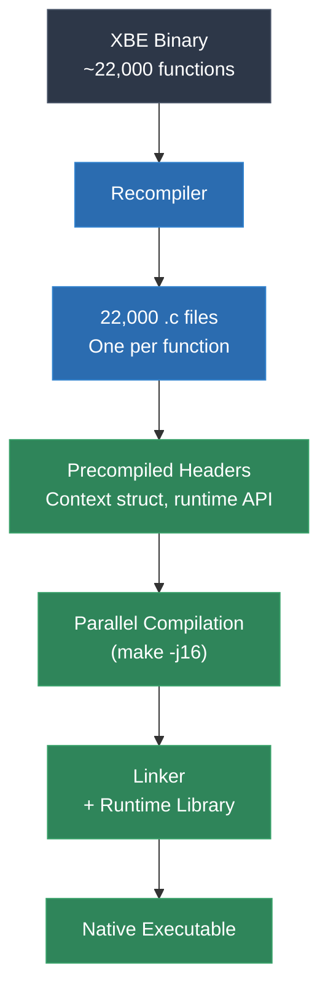

# Module 13: Original Xbox and Win32

The original Xbox is the strangest target in static recompilation -- not because the hardware is exotic, but because it is not. The Xbox runs an Intel Pentium III. Your development PC runs an Intel or AMD x86-64 processor. Same instruction set family. Same endianness. You might expect this to make recompilation trivial. The reality is the opposite: same-ISA recompilation introduces a class of problems that cross-architecture recompilation avoids entirely.

This module explains the same-ISA paradox, the Xbox hardware and software platform, the global register model used to bridge x86-32 and x86-64, the 147 kernel imports that must be shimmed, and the D3D8-to-D3D11 graphics translation layer.

---

## 1. The Same-ISA Paradox

When you recompile MIPS to C, there is no ambiguity about what needs translating. Every instruction is foreign. Every register is a context variable. The recompiler is clearly transforming one world into another.

When you recompile x86-32 to x86-64, the boundary blurs. The instruction set is the same family, but:

- **Register widths change.** x86-32 has 8 general-purpose registers (EAX, EBX, ECX, EDX, ESI, EDI, EBP, ESP), each 32 bits. x86-64 has 16 general-purpose registers (RAX-R15), each 64 bits. The original code was compiled assuming 32-bit registers.
- **Calling conventions change.** x86-32 Windows uses `__stdcall` and `__cdecl` (arguments on the stack). x86-64 Windows uses the Microsoft x64 calling convention (first 4 arguments in RCX, RDX, R8, R9; rest on stack). You cannot simply call a recompiled function from native x64 code without bridging this gap.
- **Memory model changes.** x86-32 uses 32-bit addresses. The original Xbox game allocates memory, stores pointers, and dereferences them all as 32-bit values. On x86-64, pointers are 64 bits. A 32-bit pointer stored in a game data structure will be truncated if used directly.
- **The ABI is incompatible.** Structure layouts, stack frame organization, exception handling mechanisms, and TLS (thread-local storage) all differ between x86-32 and x86-64.

You cannot simply reassemble the original instructions for x86-64. You cannot run the original binary in a compatibility layer (the Xbox has no Windows compatibility). You must recompile -- and the recompilation must handle all the subtle differences between two generations of the same architecture.

---

## 2. The Xbox Platform

### Hardware

The original Xbox, released in 2001, was built from commodity PC components:

- **CPU**: Custom Intel Pentium III (Coppermine) at 733 MHz
- **RAM**: 64 MB unified DDR SDRAM (shared between CPU and GPU)
- **GPU**: Custom NVIDIA NV2A (related to GeForce 3/4)
- **Storage**: 8-10 GB hard drive (every Xbox has one)
- **Optical**: DVD-ROM drive
- Little-endian byte ordering (same as PC)

The NV2A GPU supports vertex and pixel shaders (shader model 1.1-equivalent), hardware transform and lighting, and a register combiner system for fixed-function paths. It implements a D3D8-variant API with NVIDIA-specific extensions.

### Software Environment

The Xbox runs a custom operating system derived from Windows 2000. It is not Windows -- it has no Win32 subsystem, no user-mode DLLs, no registry. But it shares kernel architecture and data structures with Windows 2000. The kernel exports exactly **147 functions** that games can call, covering:

- Memory management (virtual memory, physical memory mapping)
- Threading (thread creation, synchronization, scheduling)
- File I/O (reading from DVD and hard drive)
- Device access (USB controllers, audio hardware)
- Cryptographic functions (SHA-1, RC4, for save game protection)

### XBE Executable Format

Xbox executables use the XBE (Xbox Executable) format, a modified PE (Portable Executable):

```
XBE Layout
===================================================================

 Offset     Content
-------------------------------------------------------------------
 0x0000     XBE Header
             - Magic: "XBEH"
             - Base address (typically 0x00010000)
             - Entry point (encrypted)
             - Section headers offset
             - Library versions
             - TLS directory

 0x0178+    Section Headers
             - .text (code)
             - .data (initialized data)
             - .rdata (read-only data)
             - .bss (uninitialized data)
             - Custom sections (varies by game)

 Varies     Section Data
             - Raw code and data
===================================================================
```

The XBE entry point is encrypted with a known key (the Xbox security has been fully reversed). Section layout is similar to standard PE but with Xbox-specific flags and addresses. Games are loaded at a fixed base address, typically `0x00010000`, and are not position-independent.

---

## 3. The Global Register Model

This is the central architectural decision in Xbox static recompilation. Since the original x86-32 code uses registers in ways that are incompatible with x86-64, the recompiler models all original registers as **global variables**.

### Why Not Translate Register-to-Register?

Consider a simple x86-32 instruction:

```asm
    mov     eax, [ecx + 0x10]     ; load 32-bit value from memory
```

You might think you can emit:

```c
    eax = *(uint32_t*)(ecx + 0x10);
```

But this breaks for several reasons:

1. `ecx` contains a **32-bit address** from the original Xbox memory space. On x86-64, this address is meaningless -- the recompiled program's memory is laid out differently.
2. The original code expects `eax` to be exactly 32 bits. On x86-64, if `eax` is the lower 32 bits of a 64-bit register, writing to it zero-extends to 64 bits -- which may or may not match what subsequent code expects.
3. The original calling convention passes arguments on the stack at known offsets from ESP. The recompiled code uses a different calling convention.

### The Solution: Global Register Context

The recompiler emits all register accesses as reads and writes to a global context structure:

```c
typedef struct {
    uint32_t eax, ebx, ecx, edx;
    uint32_t esi, edi, ebp, esp;
    uint32_t eflags;
    // x87 FPU state
    double st[8];
    int st_top;
    // SSE state (if used)
    __m128 xmm[8];
    // Memory base for address translation
    uint8_t* mem_base;
} X86Context;

X86Context ctx;
```

Every instruction becomes an operation on this context:

```c
// mov eax, [ecx + 0x10]
ctx.eax = *(uint32_t*)(ctx.mem_base + ctx.ecx + 0x10);

// add eax, ebx
{
    uint32_t result = ctx.eax + ctx.ebx;
    // Update flags
    ctx.eflags = compute_flags_add(ctx.eax, ctx.ebx, result);
    ctx.eax = result;
}

// push eax
ctx.esp -= 4;
*(uint32_t*)(ctx.mem_base + ctx.esp) = ctx.eax;
```

The `mem_base` pointer translates Xbox virtual addresses (32-bit) into host addresses (64-bit). The Xbox game's memory space is allocated as a contiguous block, and `mem_base` points to its start. All memory accesses add `mem_base` to the original 32-bit address.

```mermaid
flowchart LR
    subgraph Original["Original Xbox (x86-32)"]
        direction TB
        ORegs["8 GPRs (32-bit)\nEAX-ESP"]
        OMem["64MB Address Space\n0x00000000 - 0x03FFFFFF"]
        OCall["__stdcall / __cdecl\nArgs on stack"]
    end

    subgraph Recompiled["Recompiled (x86-64)"]
        direction TB
        RRegs["Global Context Struct\nctx.eax, ctx.ebx, ..."]
        RMem["mem_base + 32-bit offset\nMapped into 64-bit space"]
        RCall["Native x64 ABI\nContext passed by pointer"]
    end

    Original -->|"Static\nRecompilation"| Recompiled

    style Original fill:#2b6cb0,stroke:#3182ce,color:#fff
    style Recompiled fill:#2f855a,stroke:#38a169,color:#fff
    style ORegs fill:#2b6cb0,stroke:#3182ce,color:#fff
    style OMem fill:#2b6cb0,stroke:#3182ce,color:#fff
    style OCall fill:#2b6cb0,stroke:#3182ce,color:#fff
    style RRegs fill:#2f855a,stroke:#38a169,color:#fff
    style RMem fill:#2f855a,stroke:#38a169,color:#fff
    style RCall fill:#2f855a,stroke:#38a169,color:#fff
```



### Performance Implications

The global register model means the C compiler cannot keep original "registers" in actual CPU registers -- they are memory accesses through a struct pointer. This sounds slow, but in practice:

- The context struct fits entirely in L1 cache
- Modern C compilers are good at promoting frequently-accessed struct members to registers within a basic block
- The alternative (trying to map x86-32 registers to x86-64 registers directly) would require solving the calling convention mismatch, which is harder

---

## 4. 147 Kernel Imports

The Xbox kernel exports exactly 147 functions. Every one that a game calls must be shimmed -- replaced with an implementation that provides equivalent behavior on the host PC.

### Most Commonly Used Kernel Functions

| Ordinal | Function | Purpose | Shim Strategy |
|---|---|---|---|
| 0x00B2 | NtAllocateVirtualMemory | Virtual memory allocation | Map to VirtualAlloc |
| 0x00BA | NtCreateFile | File handle creation | Map to CreateFileW |
| 0x00C8 | NtReadFile | File reading | Map to ReadFile |
| 0x0042 | ExAllocatePool | Pool memory allocation | Map to malloc/HeapAlloc |
| 0x006B | KeSetTimer | Kernel timer | Map to CreateTimerQueueTimer |
| 0x0066 | KeQuerySystemTime | System time | Map to GetSystemTimeAsFileTime |
| 0x0043 | ExFreePool | Pool deallocation | Map to free/HeapFree |
| 0x0031 | DbgPrint | Debug output | Map to OutputDebugStringA |
| 0x006F | KeStallExecutionProcessor | Busy-wait delay | Map to spin loop |
| 0x00A1 | MmAllocateContiguousMemory | Contiguous physical memory | Map to VirtualAlloc (aligned) |

### Categories of Kernel Functions

**Thin wrappers** (~40% of the 147): Functions that have direct Win32 equivalents. `NtCreateFile` maps to `CreateFileW`. `NtReadFile` maps to `ReadFile`. These are straightforward.

**Careful reimplementation** (~30%): Functions where the semantics differ enough to require thought. `NtAllocateVirtualMemory` on Xbox has different alignment guarantees and address range constraints than on Windows. `KeInitializeEvent` creates kernel event objects that must behave identically to Xbox kernel events under all synchronization scenarios.

**Hardware-specific** (~15%): Functions that interact with Xbox hardware that does not exist on PC. `HalReadSMBusValue` reads the System Management Bus (temperature sensors, fan control). `HalReturnToFirmware` reboots the console. These are typically stubbed to return success.

**Cryptographic** (~10%): `XcSHAInit`, `XcRC4Key`, `XcHMAC`, etc. Used for save game encryption and Xbox Live authentication. These must be reimplemented correctly if the game encrypts/decrypts save data.

**Never called in practice** (~5%): Some kernel exports are reserved, deprecated, or only used by the Xbox dashboard. These can be stubbed.

---

## 5. D3D8 to D3D11 Translation

Xbox games use a variant of Direct3D 8 that is close to -- but not identical to -- the PC D3D8 API. The NV2A GPU supports features not in standard D3D8, and the Xbox API exposes them through extensions.

### Key Translation Challenges

**Vertex declarations to input layouts.** D3D8 uses `SetVertexShader` with an FVF (Flexible Vertex Format) code or a vertex declaration. D3D11 uses input layouts bound to vertex shaders. The translation layer must convert FVF codes into D3D11 input element descriptions.

**Fixed-function pipeline to shaders.** D3D8 supports a fixed-function transformation and lighting pipeline. D3D11 does not -- everything must go through programmable shaders. The runtime must generate vertex and pixel shaders that replicate the fixed-function behavior for each combination of render states.

**Texture formats.** The NV2A supports swizzled texture formats that differ from standard D3D8 PC texture formats. Linear and swizzled layouts must be detected and converted.

**Push buffers.** The Xbox D3D8 API supports "push buffers" -- direct command buffer construction that bypasses the D3D8 runtime and talks directly to the NV2A. Games that use push buffers require a low-level command translator.

**Render states and texture stage states.** D3D8 has a large set of render states (alpha blending, Z-buffer modes, fog) and texture stage states (combiners). Each must map to its D3D11 equivalent -- blend state objects, depth-stencil state objects, and shader constants.

### NV2A-Specific Extensions

The Xbox exposes NV2A features not in standard D3D8:

- **Register combiners**: A more flexible version of D3D8 texture stage combiners, offering more inputs and operations per stage
- **Texture shader stages**: Programmable texture coordinate generation (dot product mapping, dependent texture reads)
- **Compressed Z-buffer**: The NV2A uses a proprietary Z-buffer compression scheme

These require custom handling in the translation layer. Register combiners map to pixel shader code; texture shader stages become additional shader logic.

---

## 6. Scale: 22,000 Functions

A large Xbox game can have approximately 22,000 functions in its code section. This scale introduces practical engineering challenges beyond the algorithmic challenges of recompilation.

### Compilation Time

22,000 functions generate roughly 500,000-800,000 lines of C code. Compiling this with optimizations enabled takes significant time:

- **MSVC /O2**: 8-15 minutes on a modern PC
- **GCC -O2**: 6-12 minutes
- **Clang -O2**: 5-10 minutes

Without mitigation strategies, every change to the runtime triggers a full rebuild.

### Mitigation Strategies

**One function per file.** Each recompiled function is emitted as its own `.c` file. This maximizes incremental build parallelism -- changing one function only recompiles one file.

**Precompiled headers.** The context structure and runtime headers are included in every file. Precompiling them eliminates redundant parsing.

**Parallel compilation.** With one function per file and 22,000 files, the build is embarrassingly parallel. A 16-core build machine can compile all files simultaneously.

**Unity builds for release.** For final release builds, concatenating groups of generated files into "unity" translation units reduces linker overhead while maintaining full optimization.



---

## 7. Real-World Projects

### xboxrecomp

The general framework for Xbox static recompilation. It provides:

- XBE parser
- x86-32 disassembler with function identification
- Instruction lifter to C (global register model)
- Runtime framework with kernel shims and D3D8 translation

All other Xbox recompilation projects build on this framework.

### burnout3 (Burnout 3: Takedown)

Burnout 3 is one of the most ambitious Xbox recompilation targets:

- **Approximately 22,000 functions** -- one of the largest Xbox codebases encountered
- Extremely performance-sensitive: the game runs at 60 FPS with aggressive LOD streaming
- Heavy use of SSE/SSE2 instructions (the Pentium III in the Xbox supports SSE)
- Complex audio system with real-time mixing of engine sounds, crashes, and music
- Vertex and pixel shaders for visual effects (heat haze, motion blur)

### pcrecomp

A related project that targets PC x86-32 executables rather than Xbox XBE files. It shares the same global register model and code generation approach but skips the kernel shimming (PC games use Win32 directly). This demonstrates that the same-ISA recompilation technique generalizes beyond the Xbox.

### sof (Soldier of Fortune)

Soldier of Fortune on Xbox:

- **Approximately 14,000 functions**
- Quake III engine derivative -- well-understood codebase structure
- Tests the D3D8 translation layer with a wide range of rendering techniques
- Network code (originally Xbox Live-enabled) requires stubbing

### xwa (X-Wing Alliance)

An interesting case -- X-Wing Alliance is a PC game that was never on Xbox, but uses the same pcrecomp pipeline for x86-32 to x86-64 recompilation:

- **Approximately 8,000 functions**
- DOS/Win9x-era code with DirectDraw and Direct3D immediate mode
- Legacy API translation challenges (DirectDraw to modern D3D)

### Lessons Learned

1. **Same ISA does not mean easy.** The ABI mismatch between x86-32 and x86-64 creates problems that are different from, but no less difficult than, cross-architecture recompilation. The global register model is essential.

2. **The 147 kernel functions are tractable.** Having a fixed, documented API surface makes the shimming problem bounded. You know exactly what you need to implement. Compare this to Xbox 360, where the system API surface is much larger.

3. **D3D8 translation is the long pole.** Getting the CPU code to run is achievable in weeks. Getting the graphics to render correctly takes months. Every game uses a different subset of D3D8 features, and each subset reveals new edge cases in the translation layer.

4. **Build system engineering matters.** At 22,000 functions, the build system is not an afterthought -- it is a core component that directly affects developer productivity. Getting incremental builds right saves hours per day during development.

---

## Lab Reference

**Lab 14** guides you through examining an XBE binary, running the xboxrecomp pipeline on a subset of functions, inspecting the global register model in the generated C code, and building a minimal native executable that exercises several kernel shims.

---

## Next Module

[Module 14: GameCube, Dreamcast, and PS2](../module-14-gc-dc-ps2/lecture.md) -- Three consoles from the same generation, three completely different architectures. PowerPC with Paired Singles, SH-4 with delay slots, and the 128-bit Emotion Engine.
