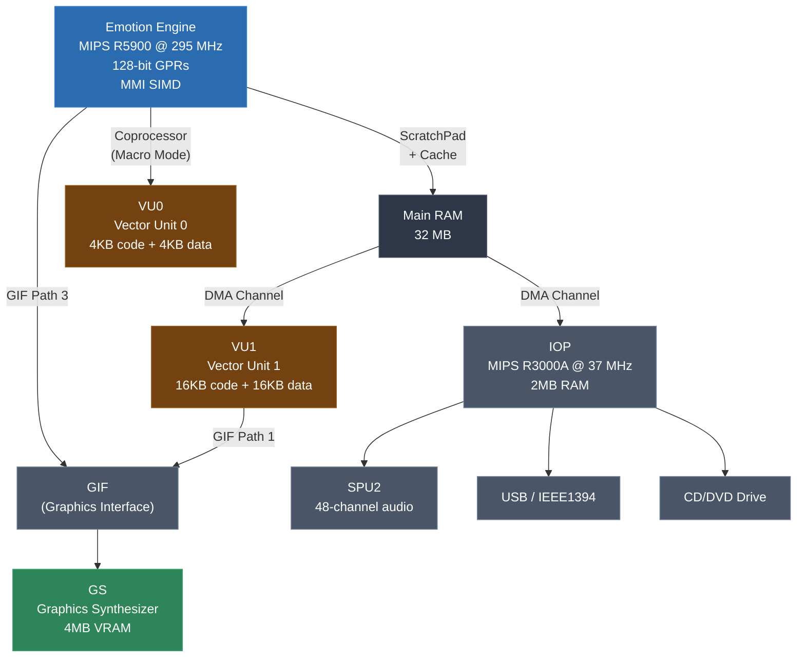
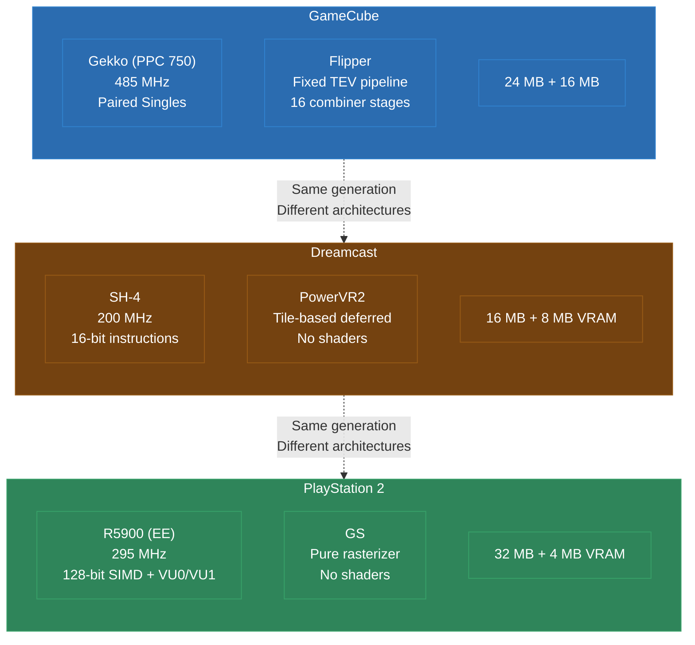

# Module 14: GameCube, Dreamcast, and PS2

The sixth console generation -- roughly 1998 to 2006 -- produced three platforms that share a release era but have almost nothing else in common architecturally. The GameCube uses a PowerPC derivative with a unique paired-singles floating-point unit. The Dreamcast uses a Hitachi SH-4 with 16-bit instructions and tile-based rendering. The PS2 uses a 128-bit MIPS variant with dedicated vector units and no programmable GPU shaders. Each presents distinct recompilation challenges, and each teaches lessons that apply to every other platform.

This module covers all three architectures, their recompilation toolchains, and the cross-cutting patterns that emerge when you work across multiple platforms in the same generation.

---

## 1. GameCube -- Gekko and Paired Singles

### Hardware

The Nintendo GameCube, released in 2001, uses an IBM Gekko processor -- a PowerPC 750 (G3) derivative with custom extensions:

- **IBM Gekko** at 485 MHz (PowerPC 750 core)
- **24 MB main RAM** (1T-SRAM) + **16 MB auxiliary RAM** (A-RAM, slower DRAM)
- **GPU**: ATI Flipper (fixed-function TEV pipeline, no programmable shaders)
- **Audio DSP**: Custom Macronix DSP for audio mixing
- Big-endian byte ordering

The Gekko processor has the standard PowerPC feature set -- 32 GPRs, 32 FPRs, condition register, link register, count register -- plus a custom extension called **Paired Singles**.

### Paired Singles

Paired Singles is a floating-point extension unique to the Gekko (and its Wii successor, the Broadway). Each 64-bit floating-point register is divided into two 32-bit single-precision floats, called ps0 (high half) and ps1 (low half):

```
Standard FPR (double-precision):
+---------------------------------------------------------------+
|                    64-bit double value                         |
+---------------------------------------------------------------+

Paired Singles FPR:
+-------------------------------+-------------------------------+
|    ps0 (32-bit float)         |    ps1 (32-bit float)         |
+-------------------------------+-------------------------------+
```

Paired Singles instructions operate on both halves simultaneously, providing 2-wide SIMD for single-precision floating-point math. Common operations include:

- `ps_add` -- add corresponding pairs
- `ps_mul` -- multiply corresponding pairs
- `ps_madd` -- multiply-add (fused)
- `ps_merge00`, `ps_merge01`, `ps_merge10`, `ps_merge11` -- shuffle between pairs
- `psq_l` / `psq_st` -- paired singles quantized load/store (dequantizes fixed-point data to float)

GameCube games use Paired Singles extensively for:

- 3D math (dot products, cross products via merge + madd chains)
- Matrix operations (4x4 matrix multiply using paired operations)
- Vertex transformation in software (some games transform vertices on the CPU)
- Animation blending

### DOL Executable Format

GameCube executables use the DOL (Dolphin) format, a simple container:

```
DOL Layout
===================================================================

 Offset      Content
-------------------------------------------------------------------
 0x0000      DOL Header (0x100 bytes)
              - 7 text section offsets + sizes + load addresses
              - 11 data section offsets + sizes + load addresses
              - BSS address and size
              - Entry point address

 Varies      Text sections (code) -- up to 7
 Varies      Data sections -- up to 11
===================================================================
```

The DOL format is straightforward to parse. There is no compression, no encryption, no import tables. The entry point and section layout are in the header in plain form. This makes GameCube one of the easier platforms for the initial parsing stage.

### GX Graphics and TEV

The GameCube GPU (Flipper) uses a fixed-function pipeline with a programmable stage called the **TEV** (Texture Environment). The TEV has up to 16 stages, each performing a configurable color/alpha combine operation on texture samples, vertex colors, and constants.


Each TEV stage computes:

```
output.rgb = (d + lerp(a, b, c) + bias) * scale
output.a   = (d + lerp(a, b, c) + bias) * scale

Where a, b, c, d are selected from:
  - Previous stage output
  - Texture sample (up to 8 textures)
  - Rasterized color (vertex color/lighting)
  - Constant color registers
```

For recompilation, TEV stages must be translated into pixel shaders. Each unique TEV configuration becomes a shader permutation. The translation is mechanical but produces a large number of shader variants.

---

## 2. GameCube Recompilation

### DOL Parsing

Parsing a DOL file is straightforward:

1. Read the 0x100-byte header
2. Extract the 7 text section descriptors (file offset, load address, size)
3. Extract the 11 data section descriptors
4. Load each section into the appropriate address in the emulated memory space
5. Note the entry point from the header

Not all 7 text sections and 11 data sections are used -- many have zero size. A typical game uses 1-3 text sections and 3-6 data sections.

### Paired Singles Lifting

The core challenge in GameCube recompilation is translating Paired Singles instructions. Each FPR must be modeled as a pair of floats:

```c
typedef struct {
    float ps0;
    float ps1;
} PairedSingle;

typedef struct {
    uint32_t gpr[32];
    PairedSingle fpr[32];
    // ... CR, LR, CTR, etc.
} GekkoContext;
```

Example translations:

```c
// ps_madd f3, f1, f2, f4
// f3.ps0 = f1.ps0 * f2.ps0 + f4.ps0
// f3.ps1 = f1.ps1 * f2.ps1 + f4.ps1
ctx->fpr[3].ps0 = ctx->fpr[1].ps0 * ctx->fpr[2].ps0 + ctx->fpr[4].ps0;
ctx->fpr[3].ps1 = ctx->fpr[1].ps1 * ctx->fpr[2].ps1 + ctx->fpr[4].ps1;

// ps_merge01 f5, f3, f4
// f5.ps0 = f3.ps0
// f5.ps1 = f4.ps1
ctx->fpr[5].ps0 = ctx->fpr[3].ps0;
ctx->fpr[5].ps1 = ctx->fpr[4].ps1;
```

On x86 hosts, these can be optimized with SSE intrinsics -- packing ps0 and ps1 into an `__m128` and using `_mm_add_ps`, `_mm_mul_ps`, etc. The compiler may do this automatically if the struct layout is favorable.

### Quantized Load/Store

The `psq_l` and `psq_st` instructions load and store paired singles with an optional quantization step. They can load 8-bit or 16-bit fixed-point values from memory and convert them to float on the fly, using a scale factor from the GQR (Graphics Quantization Registers). This is used extensively for compressed vertex data:

```c
// psq_l f1, 0(r3), 0, qr4
// Loads two values from memory, dequantizes using GQR4 settings
float scale = get_gqr_scale(ctx->gqr[4]);
int type = get_gqr_type(ctx->gqr[4]);  // u8, s8, u16, s16, or float
ctx->fpr[1].ps0 = dequantize(read_mem(ctx->r[3] + 0), type, scale);
ctx->fpr[1].ps1 = dequantize(read_mem(ctx->r[3] + size), type, scale);
```

### gcrecomp

The gcrecomp project applies the static recompilation pipeline to GameCube titles. It handles DOL parsing, PowerPC disassembly (with Paired Singles support), and C code generation with the Gekko context model.

---

## 3. Dreamcast -- SH-4

### Hardware

The Sega Dreamcast, released in 1998 (Japan) and 1999 (worldwide), was the first of the sixth generation:

- **Hitachi SH-4** at 200 MHz
- **16 MB main RAM** + **8 MB video RAM** + **2 MB sound RAM**
- **GPU**: NEC PowerVR2 (tile-based deferred renderer)
- **Sound**: Yamaha AICA (ARM7 core + 64-channel DSP)
- Little-endian byte ordering (configurable, but all games use LE)

### SH-4 Architecture

The SH-4 is a 32-bit RISC processor with some unusual characteristics:

- **16-bit fixed-width instructions** -- very compact encoding
- **16 general-purpose registers** (R0-R15), 32 bits each
- **Banked registers**: R0-R7 have bank 0 and bank 1 copies, switched by the MD/RB bits in the status register. Interrupt handlers use the alternate bank.
- **Delay slots**: Like MIPS, branch instructions have a single delay slot
- **FPSCR (Floating-Point Status/Control Register)**: Controls FPU precision mode (single vs. double) and rounding. Games switch between modes.
- **FR/XF/DR register naming**: The 16 FPU registers can be accessed as 16 singles (FR0-FR15), 8 doubles (DR0-DR14), or 4 4-element vectors (FV0, FV4, FV8, FV12)
- **FMAC (Floating-point Multiply-Accumulate)**: Hardware matrix multiply via `FTRV` instruction (transforms a 4-vector by a 4x4 matrix in a single instruction)

### SH-4 Instruction Encoding

The 16-bit fixed-width encoding makes disassembly straightforward -- there is no ambiguity about instruction boundaries. Every two bytes is exactly one instruction.

```
SH-4 Instruction Encoding Examples:

MOV     Rm, Rn     : 0110 nnnn mmmm 0011  (16 bits)
ADD     Rm, Rn     : 0011 nnnn mmmm 1100  (16 bits)
MOV.L   @(disp,Rm), Rn : 0101 nnnn mmmm dddd (16 bits)
BRA     label      : 1010 dddd dddd dddd  (16 bits, 12-bit displacement)
```

Compare this to x86, where instructions range from 1 to 15 bytes, or to ARM, where you must handle both ARM (32-bit) and Thumb (16-bit) modes. SH-4 disassembly is essentially a lookup table.

### SH-4 to C Translation

```c
// MOV.L @(disp, R4), R5
// Loads a 32-bit value from R4 + (disp * 4)
ctx->r[5] = *(uint32_t*)(ctx->mem_base + ctx->r[4] + disp * 4);

// FTRV XMTRX, FV0
// Transforms 4-vector FV0 by the 4x4 matrix stored in XMTRX bank
{
    float v0 = ctx->fr[0], v1 = ctx->fr[1], v2 = ctx->fr[2], v3 = ctx->fr[3];
    ctx->fr[0] = ctx->xf[0]*v0 + ctx->xf[4]*v1 + ctx->xf[8]*v2  + ctx->xf[12]*v3;
    ctx->fr[1] = ctx->xf[1]*v0 + ctx->xf[5]*v1 + ctx->xf[9]*v2  + ctx->xf[13]*v3;
    ctx->fr[2] = ctx->xf[2]*v0 + ctx->xf[6]*v1 + ctx->xf[10]*v2 + ctx->xf[14]*v3;
    ctx->fr[3] = ctx->xf[3]*v0 + ctx->xf[7]*v1 + ctx->xf[11]*v2 + ctx->xf[15]*v3;
}

// BRA target (with delay slot: ADD R0, R1)
{
    int cond = 1;  // unconditional
    ctx->r[1] = ctx->r[0] + ctx->r[1];  // delay slot
    goto target;
}
```

---

## 4. Dreamcast Recompilation

### SH-4 Lifting Challenges

**Banked registers.** R0-R7 have two physical copies. When the SR.RB bit flips (typically during interrupt handling), the register bank switches. The recompiler must model both banks:

```c
typedef struct {
    uint32_t r[16];        // current bank R0-R15
    uint32_t r_bank[8];    // alternate bank R0_BANK - R7_BANK
    uint32_t sr;           // status register (contains RB bit)
    // ...
} SH4Context;
```

When code writes SR with RB toggled, the recompiler must emit a bank swap. In practice, games rarely switch banks outside of interrupt handlers, and interrupt handlers are typically replaced with runtime-native code.

**FPSCR mode switching.** The SH-4 FPU can operate in single-precision or double-precision mode, controlled by the FPSCR.PR bit. Some games switch modes within a single function. The recompiler must track the FPSCR state and emit the correct precision operations:

```c
// FMOV FR4, FR5 in single-precision mode (PR=0)
ctx->fr[5] = ctx->fr[4];  // 32-bit copy

// FMOV DR4, DR6 in double-precision mode (PR=1)
ctx->dr[3] = ctx->dr[2];  // 64-bit copy (DR4 = pair index 2, DR6 = pair index 3)
```

### PowerVR2 Display List Translation

The Dreamcast GPU uses **tile-based deferred rendering** (TBDR). Instead of rendering triangles as they are submitted, the PowerVR2 bins triangles into screen-space tiles and renders each tile independently. The game submits geometry as **display lists** organized into three categories:

- **Opaque polygons**: rendered first, front-to-back (for early Z rejection)
- **Punch-through polygons**: alpha-tested, rendered after opaque
- **Translucent polygons**: rendered last, back-to-front

The display list format includes vertex data, texture descriptors, and rendering parameters. The recompilation runtime must translate these into modern draw calls, handling the tile-based rendering order implicitly (modern GPUs handle this differently).

### crazytaxi

The crazytaxi project recompiles Crazy Taxi for the Dreamcast:

- SH-4 code with heavy use of FTRV for 3D math
- PowerVR2 display lists with numerous texture formats
- Audio through the AICA (requires ARM7 sound driver reimplementation or HLE)
- Open-world streaming of city geometry

---

## 5. PS2 -- Emotion Engine

### Hardware

The PlayStation 2, released in 2000, has the most complex architecture of any console in this course:

- **Emotion Engine (EE)**: MIPS R5900 core at 294.912 MHz with 128-bit SIMD extensions
- **VU0**: Vector Unit 0 (coprocessor, macro mode accessible from EE)
- **VU1**: Vector Unit 1 (independent microprocessor, handles vertex transformation)
- **GS (Graphics Synthesizer)**: Fixed-function rasterizer, no programmable shaders
- **IOP (I/O Processor)**: MIPS R3000A at 36.864 MHz, handles I/O, audio, and backward compatibility
- **32 MB main RAM** (EE) + **4 MB video RAM** (GS) + **2 MB IOP RAM** + **16 KB VU0 data + 4 KB VU0 code** + **16 KB VU1 data + 16 KB VU1 code**
- Little-endian byte ordering



### Emotion Engine: R5900 + 128-bit Extensions

The EE core is a MIPS R5900 -- a MIPS III derivative extended to 128 bits. Each of the 32 general-purpose registers is **128 bits wide**. The lower 64 bits are used for standard MIPS operations; the full 128 bits are used by MMI (Multimedia Instructions):

```
128-bit GPR Layout:
+---------------+---------------+---------------+---------------+
|   Word 3      |   Word 2      |   Word 1      |   Word 0      |
|   (bits 127-96) | (bits 95-64)  | (bits 63-32)  | (bits 31-0)   |
+---------------+---------------+---------------+---------------+
                                 |<-- Standard MIPS uses bits 63-0 -->|
|<------------- MMI uses all 128 bits ----------->|
```

MMI instructions operate on these 128-bit registers as packed integers:

- `PADDW` -- packed add 4 x 32-bit
- `PMULTH` -- packed multiply 8 x 16-bit (results in HI/LO)
- `PAND`, `POR`, `PXOR` -- 128-bit logical operations
- `PCPYLD`, `PCPYUD` -- copy lower/upper doubleword between registers

### Vector Units (VU0 and VU1)

VU0 and VU1 are independent SIMD processors with their own instruction set. Each VU has:

- 32 floating-point vector registers (4 x 32-bit float each)
- 16 integer registers (16-bit)
- A separate instruction set from the EE (VFPU instructions)

**VU0** can operate in two modes:
- **Macro mode**: VU0 instructions are issued inline by the EE core, as coprocessor 2 (COP2) instructions
- **Micro mode**: VU0 runs its own microprogram independently

**VU1** always runs in micro mode -- the EE uploads a microprogram to VU1's instruction memory and triggers execution. VU1 is the primary vertex processing unit; it transforms vertices, computes lighting, and sends the results to the GS via the GIF.

### GS (Graphics Synthesizer)

The GS is a pure rasterizer with no programmable shaders and no vertex processing. It receives pre-transformed vertices from VU1 (or directly from the EE) and rasterizes them. It handles:

- Triangle rasterization and Z-buffering
- Texture mapping (multiple formats, bilinear filtering)
- Alpha blending
- CLUT (Color Look-Up Table) textures
- 4 MB of dedicated VRAM organized as a 2D page array

The GS is controlled via GS packets sent through the GIF. These packets contain register writes that set up rendering state, vertex data, and drawing commands.

---

## 6. PS2 Recompilation

### R5900 Extensions

Lifting the EE core's standard MIPS instructions is similar to N64 recompilation (Module 11), with the same delay slot handling and HI/LO register modeling. The 128-bit MMI instructions add complexity:

```c
// PADDW rd, rs, rt
// Packed add 4 x 32-bit words
{
    for (int i = 0; i < 4; i++) {
        ctx->gpr[rd].w[i] = ctx->gpr[rs].w[i] + ctx->gpr[rt].w[i];
    }
}

// PCPYLD rd, rs, rt
// Copy lower doubleword of rs to upper doubleword of rd,
// lower doubleword of rt to lower doubleword of rd
ctx->gpr[rd].dw[1] = ctx->gpr[rs].dw[0];
ctx->gpr[rd].dw[0] = ctx->gpr[rt].dw[0];
```

On x86 hosts, MMI operations map naturally to SSE2 intrinsics -- `PADDW` becomes `_mm_add_epi32`, and 128-bit logicals map directly.

### VU Microcode

VU microcode can be handled in two ways:

1. **Recompilation**: The VU microprogram is statically recompiled to C, just like the EE code. This is feasible because VU programs are small (4-16 KB of instructions) and self-contained. The challenge is the VFPU instruction set, which has unique operations (EFU -- Elementary Function Unit for sin/cos/sqrt/rsqrt).

2. **Interpretation/HLE**: An interpreter runs the VU microcode at runtime, or known VU programs are identified by signature and replaced with high-level equivalents. This is simpler to implement but slower.

For static recompilation projects, option 1 is preferred when the VU programs are known. Option 2 is a fallback for games with dynamic VU code loading.

### GS Command Translation

GS packets must be translated into modern rendering commands. The GS has no concept of shaders, vertex buffers, or draw calls in the modern sense. Translation involves:

- Collecting vertex data from GS packets into vertex buffers
- Converting GS texture formats to GPU-native formats
- Mapping GS blend modes and alpha test settings to pipeline states
- Handling GS-specific features like CLUT animation (games that modify the palette every frame)

### reo

The reo project applies static recompilation to PS2 titles, handling the EE core (with MMI), VU0 macro mode, and GS command translation. VU1 microprograms are handled per-game.

---

## 7. Cross-Architecture Patterns

Working across three platforms in the same generation reveals patterns that apply regardless of the specific hardware.

### The Universal Runtime Checklist

Every console recompilation project needs these runtime components:

| Component | GameCube | Dreamcast | PS2 |
|---|---|---|---|
| **Display list translation** | GX/TEV to shaders | PowerVR2 lists to draw calls | GS packets to draw calls |
| **Audio bridge** | ADPCM DSP to PCM | AICA/ARM7 to PCM | SPU2 to PCM |
| **Input mapping** | GC controller to modern | DC controller to modern | DS2 controller to modern |
| **Memory card / save** | Memory card image to file | VMU save to file | Memory card image to file |
| **Timer / vsync** | 60Hz/50Hz frame pacing | 60Hz frame pacing | 50Hz/60Hz frame pacing |

### The Runtime Is Always the Hard Part

Across all three platforms, the same pattern holds: getting the CPU code to compile and run correctly takes 20-30% of the effort. Getting the runtime -- graphics, audio, input, system services -- to work correctly takes 70-80%.

This ratio is consistent across every platform in this course. It is the fundamental truth of static recompilation: instruction lifting is a solved problem with known techniques. Runtime recreation is an open-ended engineering challenge that varies with every game.

### Architecture Comparison



### Lessons That Apply Regardless of Architecture

1. **Fixed-function GPU translation is harder than programmable shaders.** Ironically, older GPUs without programmable shaders are harder to translate than newer ones with them. The TEV, PowerVR2, and GS each have unique fixed-function behavior that must be reverse-engineered and reimplemented as shaders. A programmable shader can be translated mechanically; a fixed-function pipeline must be understood.

2. **Audio is always the forgotten subsystem.** All three platforms have dedicated audio hardware with its own processor (DSP, ARM7, or SPU2). Audio recompilation or HLE is a project unto itself for each platform.

3. **Coprocessor microcode is the wild card.** GameCube has a simpler coprocessor story (the Gekko handles most math). The Dreamcast has a separate ARM7 for audio. The PS2 has two vector units running their own microprograms. The more independent processors a console has, the more work the runtime must do.

4. **Start with the simplest game.** Each platform has games that exercise a minimal subset of hardware features. Use these for initial bring-up. Move to complex titles only after the basics work.

---

## Lab Reference

**Lab 18** has three parts, one for each platform. You will parse a DOL file and inspect Paired Singles code generation (GameCube), examine SH-4 disassembly and delay slot handling (Dreamcast), and trace a GS packet through the PS2 rendering pipeline. Each part builds on the shared recompilation concepts from earlier modules while highlighting platform-specific differences.

---

## Next Module

[Module 15](../../unit-5-extreme-targets/module-15-cell-broadband/lecture.md) moves to the most extreme target in this course -- the Cell Broadband Engine in the PlayStation 3, where 6 independent SPU cores running their own programs push static recompilation to its limits.
