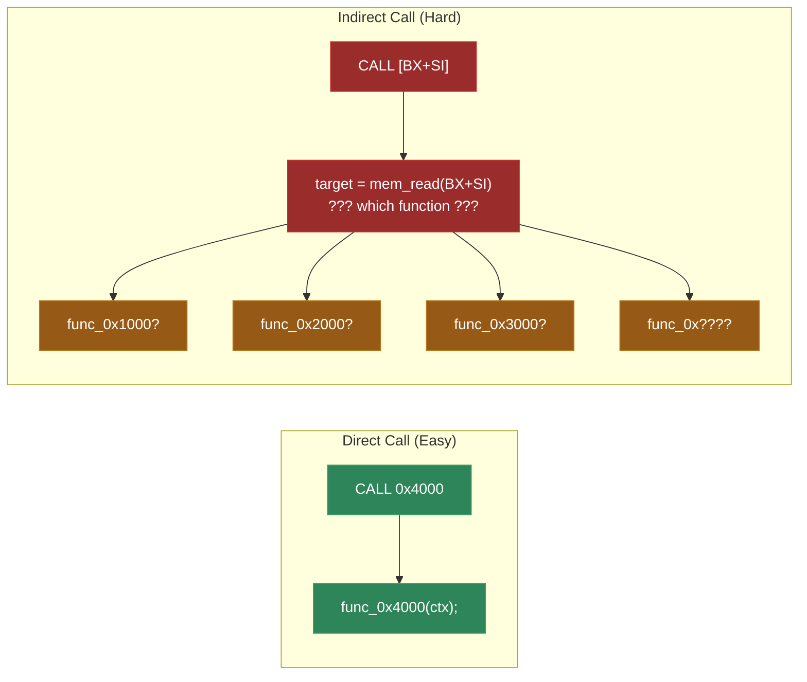
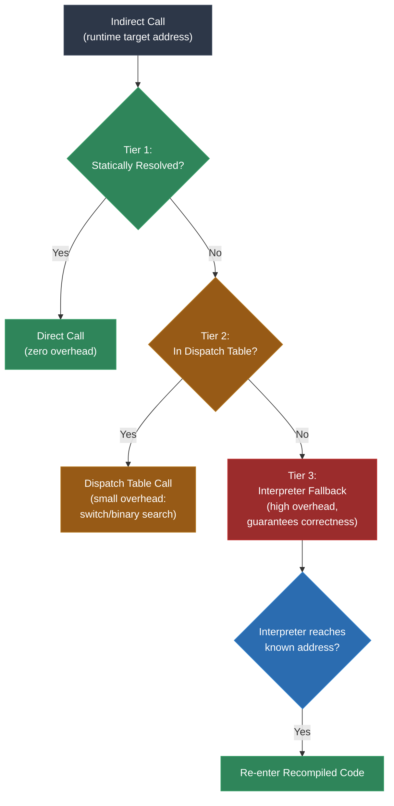

# Module 14: The Indirect Call Problem

This module addresses the single most difficult problem in static recompilation. Every architecture has it. Every project must solve it. If you have followed this course through Modules 4, 5, and 6, you have already encountered it in passing -- `JP HL` on the Game Boy, computed branches on the 65816, indirect calls in x86. Now we confront it directly.

The indirect call problem is this: static recompilation translates code ahead of time, generating a C function for each known code address. But when a program computes a jump or call target at runtime, the recompiler does not know which C function to invoke. The target is a number in a register, and that number could be anything. If the recompiler guesses wrong or fails to handle the case, the program crashes. If it handles every case conservatively, performance suffers.

There is no perfect solution. There are only tradeoffs. This module presents the full landscape of solutions, from compile-time static analysis to runtime dispatch tables to interpreter fallback, and introduces the three-tier architecture that production recompilers use to balance correctness and performance.

---

## 1. The Fundamental Problem

In a statically recompiled program, every known code address maps to a C function or a label within a function. A direct call like `CALL 0x4000` becomes `func_0x4000(ctx);` in the generated code. The target is known at compile time, the function exists, and the C compiler resolves it normally.

An indirect call or jump computes its target at runtime. The target is stored in a register, loaded from memory, or calculated from an expression. At compile time, the recompiler sees an instruction like:

- **Game Boy**: `JP HL` -- jump to the address in the HL register
- **SNES**: `JMP (addr)` -- jump to the address stored at memory location `addr`
- **x86**: `CALL [BX+SI]` -- call the address stored at the memory location computed from BX+SI
- **MIPS**: `JR $t0` -- jump to the address in register $t0
- **PowerPC**: `BCTR` -- branch to the address in the Count Register

In every case, the recompiler must emit code that somehow resolves the runtime value to the correct C function. The problem is that there are potentially thousands of valid targets, and the recompiler may not know all of them.



---

## 2. Why This Is Hard

The difficulty of indirect calls stems from a fundamental mismatch between the original machine and the recompiled representation.

**The original machine has a flat code space.** Every address is a valid jump target. The program counter is just a number, and the hardware does not care how it got that value -- it fetches and executes whatever bytes are at that address. If a register contains `0x4000`, the CPU jumps to `0x4000` and starts executing.

**The recompiled program has discrete functions.** Each known code address is a separate C function. There is no flat code space -- there is a collection of named functions. To call one, you need to know its name (or have a function pointer to it). A raw integer `0x4000` means nothing to the C compiler.

This gap creates several specific problems:

**Missing targets.** If the recompiler does not know that address `0x5000` is a valid code entry point, it will not generate `func_0x5000`. If the program then tries to call `0x5000` at runtime, there is nothing to call. This is a crash.

**Combinatorial explosion.** An indirect call could theoretically target any address in the code space. On a system with 64KB of code, that is up to 65,536 possible targets. Most of these are not actually valid function entries, but the recompiler cannot easily prove which ones are and which are not.

**Performance cost of runtime resolution.** Even if all targets are known, resolving an indirect call at runtime requires a lookup -- a switch/case, a hash table, or a binary search. This adds overhead to what would otherwise be a single instruction. If indirect calls are frequent (as in C++ programs with virtual methods), this overhead is significant.

**Data-dependent targets.** Some indirect call targets depend on user input, file contents, or other runtime data. No amount of static analysis can predict these values. The recompiler must have a fallback for truly unpredictable targets.

---

## 3. Solution 1: Static Analysis

The first line of defense is compile-time analysis. Before generating any runtime dispatch code, try to determine the possible targets of each indirect call through analysis of the program's data flow and structure.

### Data Flow Analysis

Track the value of the register or memory location used in the indirect call backward through the control flow graph. If the value is loaded from a known address, and that address contains a constant, the target is resolved.

Example (Game Boy):

```asm
    LD HL, jump_table    ; HL = address of jump table
    LD A, [some_var]     ; A = index (0, 1, 2, ...)
    ADD A, A             ; A = index * 2 (each entry is 2 bytes)
    ADD A, L
    LD L, A              ; HL now points to jump_table + index * 2
    LD A, [HL+]          ; Low byte of target
    LD H, [HL]           ; High byte of target
    LD L, A
    JP HL                ; Jump to target
```

By analyzing this sequence, the recompiler can determine that `JP HL` targets an entry in `jump_table`. If the jump table is in ROM (constant data), all possible targets are known. The recompiler reads the jump table, extracts every target address, and either resolves the indirect jump to a switch/case over the known targets or, if possible, to a computed goto.

### Switch Table Pattern Recognition

Jump tables (switch/case implementations) are the most common source of indirect jumps. They follow recognizable patterns on every architecture:

1. Load an index value
2. Bounds-check the index (optional but common)
3. Use the index to look up an address from a table in memory
4. Jump to that address

The recompiler can recognize these patterns through structural analysis of the code surrounding the indirect jump. Once the table is identified, all entries are known targets.

### Vtable Reconstruction

In C++ programs (common on Xbox and Xbox 360), indirect calls often go through virtual method tables (vtables). The pattern is:

1. Load the object pointer
2. Load the vtable pointer from the first field of the object
3. Load the method pointer from a fixed offset in the vtable
4. Call the method

If the recompiler can identify all vtables in the binary (usually by finding the constructors that initialize them), it can determine all possible targets for each vtable slot.

### Limits of Static Analysis

Static analysis works well for deterministic patterns -- jump tables with constant entries, vtables initialized by known constructors, function pointer arrays in read-only data. It fails for:

- **Runtime-computed addresses**: When the target depends on user input or external data.
- **Obfuscated code**: When the jump table is encrypted, compressed, or constructed at runtime.
- **Highly dynamic dispatch**: When the program uses a general-purpose dispatch mechanism that can call any function.

Static analysis is always the preferred solution when it works, because it has zero runtime cost -- the indirect call is resolved at compile time and becomes a direct call (or a small switch over known targets).

---

## 4. Solution 2: Dispatch Tables

When static analysis narrows the targets but cannot resolve a single one, or when the set of possible targets is known but the specific target varies at runtime, a **dispatch table** bridges the gap.

The idea: collect all known function addresses, generate a lookup mechanism, and emit code that maps the runtime address value to the correct C function.

### Implementation

The recompiler generates a dispatch function that takes an address and calls the corresponding recompiled function:

```c
void dispatch_call(CPUContext *ctx, uint32_t target_addr) {
    switch (target_addr) {
        case 0x0150: func_0x0150(ctx); break;
        case 0x0800: func_0x0800(ctx); break;
        case 0x1A00: func_0x1A00(ctx); break;
        case 0x1B00: func_0x1B00(ctx); break;
        case 0x2000: func_0x2000(ctx); break;
        case 0x4000: func_0x4000(ctx); break;
        // ... every known function entry point
        default:
            fprintf(stderr, "Unknown call target: 0x%04X\n", target_addr);
            abort();
    }
}
```

Every indirect call in the generated code becomes:

```c
// Original: CALL [BX+SI]
uint16_t target = mem_read_16((ctx->ds << 4) + ctx->bx + ctx->si);
dispatch_call(ctx, target);
```

### Optimization: Binary Search or Hash Table

For programs with thousands of known function entries, a linear switch/case is not ideal. The C compiler will often optimize small switch statements into jump tables, but for very large ones, an explicit binary search or hash table may be faster:

```c
// Binary search dispatch (sorted by address)
typedef struct { uint32_t addr; void (*func)(CPUContext*); } DispatchEntry;

static const DispatchEntry dispatch_table[] = {
    { 0x0150, func_0x0150 },
    { 0x0800, func_0x0800 },
    { 0x1A00, func_0x1A00 },
    // ... sorted by address
};

void dispatch_call(CPUContext *ctx, uint32_t target) {
    int lo = 0, hi = DISPATCH_TABLE_SIZE - 1;
    while (lo <= hi) {
        int mid = (lo + hi) / 2;
        if (dispatch_table[mid].addr == target) {
            dispatch_table[mid].func(ctx);
            return;
        } else if (dispatch_table[mid].addr < target) {
            lo = mid + 1;
        } else {
            hi = mid - 1;
        }
    }
    // Target not found -- fall through to interpreter
    interpreter_fallback(ctx, target);
}
```

### Populating the Dispatch Table

The dispatch table must contain every address that could be a valid indirect call target. Sources include:

- Every function entry point found by the disassembler
- Every target found in jump tables and switch tables
- Every address stored in vtables
- Every address stored in function pointer arrays in the data sections
- Addresses provided by manual annotation

Missing an entry means a potential crash at runtime. Including too many entries wastes a small amount of memory but is otherwise harmless. It is better to over-include than under-include.

---

## 5. Solution 3: Interpreter Fallback

For truly unknown targets -- addresses that no static analysis can predict and that are not in the dispatch table -- the last resort is an interpreter. The recompiled program includes a simple interpreter for the original architecture that can execute instructions one at a time starting from any address.

When the dispatch table fails to find a target, it invokes the interpreter:

```c
void interpreter_fallback(CPUContext *ctx, uint32_t start_addr) {
    ctx->pc = start_addr;
    while (1) {
        // Check if we have returned to a known address
        if (is_known_function(ctx->pc)) {
            dispatch_call(ctx, ctx->pc);
            return;
        }
        // Interpret one instruction
        interpret_single(ctx);
    }
}
```

The interpreter runs until the program counter reaches a known address (one that has a corresponding recompiled function), at which point control returns to the recompiled code. This hybrid approach guarantees correctness: if the recompiled code cannot handle a target, the interpreter can, and it hands control back to the recompiled code as soon as possible.

The performance cost is significant -- interpreted execution is 10-100x slower than recompiled code. But if the fallback is rarely triggered, the overall impact is negligible. The key insight is that most programs spend the vast majority of their time in a small number of hot loops and functions, all of which are statically resolved. The interpreter handles the rare edge cases.

---

## 6. The Three-Tier Dispatch Architecture

Production recompilers combine all three solutions into a layered architecture:



**Tier 1: Static Resolution** is applied at compile time. If the recompiler can determine the target through data flow analysis, pattern recognition, or annotation, it emits a direct call. This is the best case -- zero runtime overhead, the indirect call becomes indistinguishable from a direct call in the generated code.

**Tier 2: Dispatch Table** handles calls where the target is one of several known possibilities but the specific choice is determined at runtime. The dispatch table lookup adds a small overhead (a switch/case or binary search), but it is predictable and fast. Most indirect calls that escape Tier 1 are caught by Tier 2.

**Tier 3: Interpreter Fallback** is the safety net. It handles any target that the recompiler did not anticipate. It is slow but correct. In a well-analyzed program, Tier 3 should be triggered rarely or never. When it is triggered during testing, it is a signal that the recompiler's analysis should be improved -- the target should be added to the dispatch table or resolved statically.

### The Development Workflow

In practice, the three-tier architecture drives an iterative development workflow:

1. **Initial recompilation**: Many indirect calls fall to Tier 3. The interpreter logs every unknown target it encounters.
2. **Analysis pass**: Review the logged targets. Determine which ones are reachable through static analysis (add to Tier 1), which are valid function entries (add to Tier 2), and which are bugs in the recompiler's analysis.
3. **Iterate**: Re-run the recompilation with improved analysis. Fewer calls reach Tier 3.
4. **Release quality**: All calls are handled by Tier 1 or Tier 2 in normal execution. Tier 3 remains as a safety net for edge cases.

This workflow transforms the indirect call problem from a blocking issue ("the recompiler crashes on unknown targets") into a quality metric ("what percentage of indirect calls are statically resolved?"). A mature recompilation project typically achieves 95-100% static resolution.

---

## 7. Architecture-Specific Challenges

The indirect call problem manifests differently on each architecture, because each architecture has different mechanisms for computed control flow.

| Architecture | Indirect Mechanisms | Typical Count | Difficulty |
|---|---|---|---|
| **Game Boy (SM83)** | JP HL | Very few (1-10 per game) | Low |
| **SNES (65816)** | JMP (addr), JML [addr], JSR (addr,X) | Few to moderate (10-50) | Low-Medium |
| **DOS (x86-16)** | CALL [mem], JMP [mem], INT with modified IVT | Moderate (20-100) | Medium |
| **N64 (MIPS)** | JR $reg, JALR $reg | Moderate (50-200) | Medium |
| **Xbox (x86-32)** | CALL [EAX+offset] (vtables), JMP [table+reg*4] | Many (500-5000) | High |
| **Xbox 360 (PPC)** | BCTR, BCTRL | Many (500-5000) | High |
| **PS3 (Cell PPU)** | BCTR, BCTRL, plus SPU indirect branches | Very many (1000-10000) | Very High |

### Game Boy: JP HL

On the Game Boy, `JP HL` is the only indirect jump mechanism. It appears rarely -- typically in jump table dispatchers (which are easy to analyze) and occasionally in callback systems. Most Game Boy games have fewer than 10 indirect jumps total, and most of those can be fully resolved through data flow analysis of the jump table.

The low count and simple patterns make the Game Boy an ideal first target for practicing indirect call resolution. If you can resolve all `JP HL` instances in a Game Boy game, you have the skills to tackle the harder cases.

### Xbox: Vtables in C++ Code

Xbox games are compiled from C++, which means extensive use of virtual method calls. A single `CALL [EAX+0x1C]` instruction might dispatch to any class that inherits from a given base class. A game with 200 classes might have 50 vtable slots each, producing thousands of potential indirect call targets.

The saving grace is that vtables are structured. Each vtable is a constant array of function pointers stored in the read-only data section. The recompiler can:

1. Find all vtables by scanning for arrays of valid code pointers in the data sections.
2. Determine which vtable slot each indirect call accesses (from the offset in `CALL [EAX+offset]`).
3. Collect all functions that appear at that slot across all vtables.
4. Generate a dispatch table containing only the valid targets for that specific slot.

This per-slot approach dramatically reduces the dispatch table size and can sometimes reduce it to a single target (when only one class implements a given virtual method), enabling full static resolution.

### Xbox 360: CTR-Based Branches

The PowerPC architecture used in the Xbox 360 (Xenon) uses the Count Register (CTR) for indirect branches. The `BCTR` instruction branches to the address in CTR, and `BCTRL` calls the address in CTR.

The CTR is loaded by `MTCTR` (Move To Count Register), which copies a general-purpose register into CTR. The recompiler must trace the value in that general-purpose register backward to determine the target. This often leads through load instructions from function pointer tables, vtables, or computed addresses.

Additionally, Xbox 360 games make heavy use of VMX128 (the SIMD extension) and frequently use function pointers for optimized inner loops, increasing the count of indirect calls compared to scalar code.

---

## 8. Real-World Reference

### gb-recompiled

Game Boy games typically have very few indirect jumps. In gb-recompiled, most `JP HL` instances are resolved through jump table analysis (Tier 1). The dispatch table (Tier 2) handles the remainder. The interpreter fallback (Tier 3) exists but is rarely invoked in practice.

### xboxrecomp

Xbox recompilation encounters the full force of C++ vtable dispatch. xboxrecomp by sp00nznet implements vtable reconstruction by scanning the executable's read-only data sections for arrays of valid code pointers. Per-slot dispatch tables reduce the search space. In a typical Xbox game, approximately 80-90% of indirect calls are resolved through vtable analysis (Tier 1), 5-15% through the dispatch table (Tier 2), and under 5% require the interpreter (Tier 3).

### burnout3

The *Burnout 3* recompilation (Xbox) demonstrates a high indirect call count due to the game's heavy use of virtual methods for vehicle physics, rendering, and AI. The project uses aggressive vtable analysis and manual annotation for the remaining cases. It achieves full Tier 1/2 coverage with zero Tier 3 fallback in normal gameplay.

### 360tools

Xbox 360 recompilation tools by sp00nznet handle the CTR-based indirect branch pattern. The tools implement backward data flow analysis from every `BCTR`/`BCTRL` instruction to find the corresponding `MTCTR` and trace the source register to its origin. Combined with function pointer table scanning, this resolves the majority of indirect branches statically.

### Statistics from Real Projects

Across sp00nznet's recompilation portfolio, the following patterns emerge:

- **8-bit systems** (Game Boy): 95-100% of indirect calls resolved at Tier 1.
- **16-bit systems** (SNES, DOS): 85-95% at Tier 1, remainder at Tier 2.
- **32-bit RISC** (N64, GameCube): 80-95% at Tier 1, 5-15% at Tier 2, under 5% at Tier 3.
- **Modern consoles** (Xbox, Xbox 360, PS3): 70-90% at Tier 1, 10-25% at Tier 2, under 5% at Tier 3.

The trend is clear: as architectures and programs grow more complex, more indirect calls escape static analysis. But the dispatch table catches most of what static analysis misses, and the interpreter fallback handles the long tail. The three-tier architecture scales across all architectures.

---

## Lab

The following lab accompanies this module:

- **Lab 9** -- Indirect call resolution: Implement jump table recognition, dispatch table generation, and interpreter fallback for multiple architectures. Test against programs with known indirect call patterns and verify correct resolution at each tier.

---

**Next: [Module 8 -- N64: MIPS and the Reality Signal Processor](../module-08-n64/lecture.md)**
