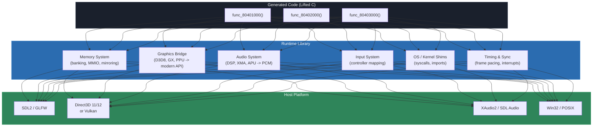
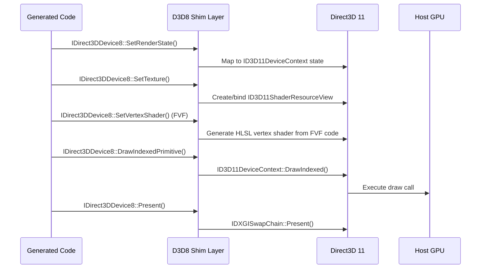
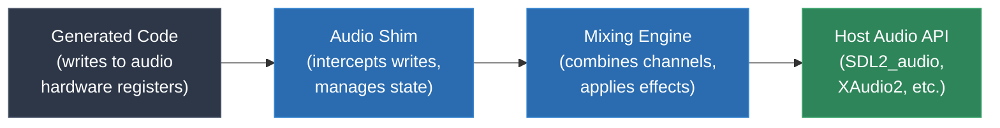

# Module 15: Runtime Libraries and Hardware Shims

The generated C code from the lifter does not run in a vacuum. It calls `mem_read`, `mem_write`, and dozens of other functions that do not exist in any standard library. It expects a memory layout that matches the original hardware. It issues graphics commands that target hardware that no longer exists. It reads controller input from registers at fixed addresses. The **runtime library** is what makes all of this work.

If the lifter is the brain of a static recompiler, the runtime is the body. It provides the environment that the generated code expects -- reproducing the original hardware's memory map, translating graphics commands into modern API calls, converting audio output to PCM, mapping input devices, and shimming OS/kernel functions. In nearly every real recompilation project, the runtime is larger, more complex, and more time-consuming to write than the recompiler itself.

---

## 1. What the Runtime Provides

The runtime is everything the generated code calls into that is not itself generated code. It bridges the gap between the original hardware environment and the modern host.



The generated code knows nothing about the host platform. It calls `mem_read_u32(0x04000000)`, and the runtime decides what that means -- on a GameCube target, that might be a GX register read; on a Game Boy, it might be a PPU register. The generated code calls `kernel_import_42(ctx)`, and the runtime decides whether that maps to `CreateThread`, `malloc`, or something else entirely.

This separation is deliberate. The generated C code is portable and architecture-neutral. All platform-specific behavior lives in the runtime. You can swap runtimes to target different host platforms (Windows, Linux, macOS, even consoles) without regenerating the lifted code.

### Scale

To set expectations: in real projects, the runtime consistently dwarfs the recompiler.

| Project | Recompiler (lines) | Runtime (lines) | Ratio |
|---|---|---|---|
| gb-recompiled | ~2,000 | ~5,000 | 1:2.5 |
| N64Recomp | ~8,000 | ~30,000+ | 1:4 |
| xboxrecomp | ~5,000 | ~20,000+ | 1:4 |
| ps3recomp | ~10,000 | ~80,000+ | 1:8 |

The ps3recomp ratio is extreme because the PS3 runtime must implement 93 HLE (High-Level Emulation) modules covering hundreds of system functions. But even for simpler targets, the runtime is where the majority of development time goes.

---

## 2. Memory Layout Reproduction

The original program was compiled for a specific memory layout. Addresses are baked into the code -- literal pointers, stack addresses, global variable locations. The runtime must ensure that every address the generated code uses resolves to the correct data.

### Techniques

**Fixed-address mapping (mmap).** On Linux and other POSIX systems, `mmap` with `MAP_FIXED` can allocate memory at a specific virtual address. If the original program expects its code at `0x80000000` and its data at `0x80100000`, the runtime can mmap those exact addresses. This is the most transparent approach -- pointer values in the generated code just work.

```c
// Allocate memory at the exact address the N64 program expects
void *rdram = mmap((void *)0x80000000, 4 * 1024 * 1024,
                   PROT_READ | PROT_WRITE,
                   MAP_PRIVATE | MAP_ANONYMOUS | MAP_FIXED,
                   -1, 0);
```

Drawbacks: the host OS may already have something mapped at those addresses (especially on 32-bit hosts or when ASLR is aggressive). This technique is most practical on 64-bit hosts where the low-address space is usually free.

**Base address + offset translation.** The runtime allocates memory at whatever address the OS provides, then translates every address from the original space to the host space by adding an offset:

```c
static uint8_t *memory_base;  // allocated at runtime

static inline uint32_t mem_read_u32(uint32_t addr) {
    return *(uint32_t *)(memory_base + (addr - ORIGINAL_BASE));
}
```

This requires the generated code to go through the memory access functions for every load and store (no raw pointer dereferences), but it works on any host regardless of address space layout.

**Full address space simulation.** For architectures with small address spaces (Game Boy: 16-bit / 64KB, SNES: 24-bit / 16MB), the runtime can allocate the entire address space as a flat array:

```c
// SM83: entire 64KB address space
uint8_t memory[0x10000];

static inline uint8_t mem_read_u8(uint16_t addr) {
    if (addr >= 0xFF00) return io_read(addr);  // I/O registers
    if (addr >= 0xA000 && addr < 0xC000) return sram_read(addr);  // external RAM
    return memory[addr];
}
```

This is simple and fast, but only works when the original address space is small enough to fit comfortably in host memory.

### Memory-Mapped I/O

Most console hardware uses memory-mapped I/O: specific address ranges are not backed by RAM but instead correspond to hardware registers. Reading or writing these addresses has side effects.

Examples:
- **Game Boy (0xFF00-0xFF7F)**: PPU registers, timer, joypad, serial, interrupt flags
- **SNES (0x2100-0x213F)**: PPU registers (background mode, scroll, layer control)
- **N64 (0x04000000-0x04FFFFFF)**: RSP/RDP registers, audio/video interface
- **GameCube (0x0C000000+)**: GX, AI, DI, SI, EXI registers
- **Xbox (memory-mapped NV2A GPU, APU, USB controllers)**: PCI device registers

The runtime must intercept reads and writes to these regions and call the appropriate hardware emulation code. This is where the runtime intersects with the graphics, audio, and input systems.

---

## 3. OS/Kernel Shims

Console and PC programs call into the operating system or kernel for services: memory allocation, file I/O, threading, synchronization, network access. The runtime must provide implementations of these services.

### Original Xbox Kernel Imports

The original Xbox runs a minimal kernel (ntos/xboxkrnl) that exports 379 functions. Xbox executables (XBE format) import these functions by ordinal number. The runtime must provide an implementation for every import that the specific game uses.

Common Xbox kernel imports and their runtime shim implementations:

| Ordinal | Kernel Function | Runtime Shim |
|---|---|---|
| 14 | `ExAllocatePool` | `malloc` / `VirtualAlloc` |
| 15 | `ExFreePool` | `free` / `VirtualFree` |
| 102 | `IoCreateFile` | `fopen` / `CreateFileW` |
| 190 | `NtCreateEvent` | `CreateEvent` (Win32) or `pthread_cond_t` |
| 218 | `NtCreateThread` | `CreateThread` / `pthread_create` |
| 296 | `RtlEnterCriticalSection` | `EnterCriticalSection` / `pthread_mutex_lock` |
| 325 | `XeLoadSection` | Custom section loader |

Not every kernel function needs a faithful implementation. Many games use only a subset of the available imports. The runtime starts with stubs (functions that log their call and return success) and adds real implementations as needed to get each game running. xboxrecomp's kernel shim layer grows game by game.

### PS3 System Calls and HLE Modules

The PS3's operating system (CellOS / LV2) is far more complex. It provides:
- Over 300 syscalls (memory management, threading, synchronization, file I/O, networking)
- 93 PRX modules (shared libraries) covering everything from audio (libmixer, libatrac) to networking (libnet, libhttp) to font rendering (libfont)

ps3recomp implements these as HLE modules: C functions that provide the same interface as the PS3's library functions but run natively on the host:

```c
// HLE implementation of cellGcmSetFlipMode
int cellGcmSetFlipMode(uint32_t mode) {
    // Store the flip mode for later use by the graphics bridge
    g_gcm_state.flip_mode = mode;
    return CELL_OK;
}
```

The scale of this effort is enormous. Each HLE module is essentially a miniature reimplementation of a PS3 system library.

### DOS Interrupt Handlers

DOS programs communicate with the OS through software interrupts, primarily INT 21h (DOS services) and INT 10h (BIOS video).

```c
// Runtime shim for INT 21h, AH=09h (print string)
void int21_handler(DosContext *ctx) {
    switch (ctx->ah) {
        case 0x09: {
            // Print '$'-terminated string at DS:DX
            uint16_t addr = (ctx->ds << 4) + ctx->dx;
            while (dos_memory[addr] != '$') {
                putchar(dos_memory[addr++]);
            }
            break;
        }
        case 0x3D: // Open file
            ctx->ax = dos_open_file(ctx);
            break;
        case 0x3F: // Read file
            ctx->ax = dos_read_file(ctx);
            break;
        // ... dozens more subfunctions
    }
}
```

pcrecomp implements a DOS environment shim that handles file I/O (mapping DOS paths to host filesystem paths), memory allocation (INT 21h/AH=48h), text and graphics output, timer interrupts, and mouse/keyboard input.

### The Shim Philosophy

The runtime does not need to be a complete OS reimplementation. It needs to be faithful enough for the specific program being recompiled. This is a crucial difference from emulation, where the OS implementation must be general-purpose:

- An emulator implements `NtCreateThread` correctly for all possible inputs
- A recompiler's shim implements `NtCreateThread` correctly for the specific ways the target game calls it

This means the shim layer can start minimal and grow incrementally, driven by testing: run the game, see what crashes, implement that function, repeat.

---

## 4. Graphics Translation

Graphics translation is typically the largest and most complex component of the runtime. The original hardware has a custom GPU with a unique command interface. The runtime must translate those commands into modern graphics API calls.

### D3D8 to D3D11 (Original Xbox)

The original Xbox uses a modified Direct3D 8 API backed by an NV2A GPU (a custom NVIDIA chip). xboxrecomp and the burnout3 project translate D3D8 calls into D3D11:



Key translation challenges:
- **Vertex shaders**: D3D8 uses a different shader bytecode than D3D11. Fixed-function vertex processing (FVF codes) must be translated to vertex shaders.
- **Pixel shaders**: D3D8 pixel shaders (ps_1_1 through ps_1_4) must be translated to HLSL for D3D11. Many Xbox games use register combiners instead of pixel shaders, which must be emulated in shader code.
- **Render states**: D3D8 has render states that map to D3D11 state objects (blend state, rasterizer state, depth-stencil state). The mapping is not always one-to-one.
- **Texture formats**: the NV2A supports swizzled textures and compressed formats that must be decoded or translated for D3D11.

### GX to Modern API (GameCube)

The GameCube's GX graphics pipeline is fundamentally different from PC graphics APIs. GX uses a fixed-function pipeline with TEV (Texture Environment) stages for color/alpha blending:

```c
// GX display list command: set TEV stage 0 color operation
// This is a hardware register write, not an API call
// TEV stages must be translated to pixel shader operations

// Runtime translation:
void gx_set_tev_color_op(int stage, int op, int bias, int scale,
                          int clamp, int out_reg) {
    // Record the TEV configuration
    g_gx_state.tev[stage].color_op = op;
    g_gx_state.tev[stage].color_bias = bias;
    g_gx_state.tev[stage].color_scale = scale;
    // When draw is issued, generate a pixel shader from accumulated TEV state
}
```

gcrecomp must translate up to 16 TEV stages into a single pixel shader at draw time. This is essentially a shader compiler that runs at runtime, converting GX's fixed-function description into programmable shader code.

### RSX/GCM to Modern API (PS3)

The PS3's RSX GPU is driven by libGCM, which provides low-level command buffer access. The game writes GPU commands directly into a command buffer that the RSX consumes. The runtime must:

1. Intercept command buffer writes
2. Parse the RSX command stream
3. Translate each command to the equivalent modern API call

This is closer to GPU emulation than API translation, because libGCM operates at a lower level than D3D or OpenGL.

### DOS VGA to SDL2

DOS graphics are comparatively simple but still require translation:

```c
// Mode 13h: 320x200, 256 colors, linear framebuffer at 0xA0000
void vga_update_screen(void) {
    // Convert 8-bit indexed color to 32-bit RGBA using the current palette
    for (int i = 0; i < 320 * 200; i++) {
        uint8_t index = dos_memory[0xA0000 + i];
        framebuffer[i] = palette[index];  // palette: 256 entries of RGBA
    }
    // Upload to SDL texture and present
    SDL_UpdateTexture(texture, NULL, framebuffer, 320 * 4);
    SDL_RenderCopy(renderer, texture, NULL, NULL);
    SDL_RenderPresent(renderer);
}
```

The runtime must handle VGA mode switching (text mode, Mode 13h, Mode X, VESA modes), palette manipulation, and VGA register access (CRT controller, sequencer, graphics controller, attribute controller).

---

## 5. Audio Translation

Audio hardware varies more across platforms than almost any other component. Each console has its own sound chip with unique capabilities, sample formats, and programming interfaces.

### Common Runtime Pattern

Despite the hardware differences, the runtime pattern for audio is consistent:



1. The generated code writes to audio hardware registers (or calls audio API functions)
2. The audio shim intercepts these operations and updates internal state (which channels are playing, at what frequency, with what samples)
3. A mixing engine combines all active channels into a single PCM stream
4. The PCM stream is fed to the host audio API via a callback

### Platform-Specific Audio

**Game Boy (SM83 APU):** Four channels -- two square waves (with sweep and envelope), one programmable waveform, one noise. The APU is controlled through memory-mapped registers at 0xFF10-0xFF3F. The runtime synthesizes these waveforms in software and mixes them into a PCM buffer.

**SNES (SPC700 + BRR):** A dedicated Sony SPC700 processor runs independently, processing BRR (Bit Rate Reduction) compressed samples through eight voices with ADSR envelopes, pitch modulation, echo, and FIR filtering. The runtime either emulates the SPC700 or intercepts high-level audio commands from the main CPU.

**GameCube (AI + DSP):** The audio interface streams PCM data from a ring buffer. A dedicated DSP processes compressed ADPCM samples and applies effects. The runtime typically intercepts the AI DMA setup and the DSP microcode uploads.

**Xbox (DirectSound + XMA):** Uses DirectSound (based on DirectSound3D and Microsoft's APU). The runtime translates DirectSound buffer creation and playback into XAudio2 or SDL audio calls.

**Xbox 360 (XMA):** Uses XMA (Xbox Media Audio) compression. The runtime must decode XMA-compressed audio to PCM. XMA2 decoding requires understanding a proprietary format (though open-source decoders now exist).

**PS3 (MultiStream, libatrac, Cell SPE audio):** Some games process audio on the SPEs for maximum performance. The runtime must either run the SPE audio code (translated to host SIMD) or replace it with equivalent host-side processing.

### Resampling

The original hardware may output audio at a different sample rate than the host. The Game Boy outputs at approximately 22,050 Hz. Modern audio hardware typically runs at 44,100 Hz or 48,000 Hz. The runtime must resample. SDL2's audio subsystem can handle resampling automatically when the format is specified correctly, but for best quality, a dedicated resampler (e.g., libsamplerate) may be preferred.

---

## 6. Input and Timing

### Input Mapping

The original hardware has specific input devices: a Game Boy has a D-pad and four buttons; a GameCube has an analog stick, C-stick, D-pad, triggers, and face buttons; an Xbox controller has two analog sticks, triggers, D-pad, and ten buttons.

The runtime maps modern input devices to the original controller layout:

```c
// GameCube controller mapping via SDL2
void update_input(GCContext *ctx) {
    SDL_GameController *pad = g_controller;
    if (!pad) return;

    uint16_t buttons = 0;
    if (SDL_GameControllerGetButton(pad, SDL_CONTROLLER_BUTTON_A))
        buttons |= GC_BUTTON_A;
    if (SDL_GameControllerGetButton(pad, SDL_CONTROLLER_BUTTON_B))
        buttons |= GC_BUTTON_B;
    if (SDL_GameControllerGetButton(pad, SDL_CONTROLLER_BUTTON_X))
        buttons |= GC_BUTTON_X;
    if (SDL_GameControllerGetButton(pad, SDL_CONTROLLER_BUTTON_Y))
        buttons |= GC_BUTTON_Y;
    // ... triggers, sticks (with deadzone and range scaling)

    // Write to the memory-mapped controller register
    mem_write_u32(SI_CHANNEL0_IN, buttons << 16 | stick_x << 8 | stick_y);
}
```

For analog inputs, the runtime must scale values between the original hardware's range and the host controller's range. GameCube analog sticks report values in [-128, 127]; SDL2 gamepad axes report in [-32768, 32767]. The runtime must rescale and apply deadzones.

For keyboard input (DOS games, or when no gamepad is available), the runtime maps keys to buttons and optionally provides configurable remapping.

### Frame Timing

Original hardware runs at fixed clock rates and draws frames at fixed intervals:
- Game Boy: 59.73 Hz
- SNES: 60.10 Hz (NTSC) or 50.07 Hz (PAL)
- N64: 60 Hz (NTSC) or 50 Hz (PAL)
- GameCube: 60 Hz (NTSC) or 50 Hz (PAL)
- Xbox / Xbox 360: typically 30 or 60 Hz
- PS3: typically 30 or 60 Hz

The recompiled code runs as fast as the host CPU allows, which is far faster than the original hardware. Without timing control, the game would run at hundreds or thousands of frames per second.

The runtime must pace execution:

```c
// Frame timing with SDL2
void frame_end(void) {
    static uint64_t last_frame_time = 0;
    uint64_t target_frame_time = 1000000 / 60;  // 60 fps in microseconds

    uint64_t now = get_microseconds();
    uint64_t elapsed = now - last_frame_time;

    if (elapsed < target_frame_time) {
        // Sleep for the remaining time
        precise_sleep(target_frame_time - elapsed);
    }

    last_frame_time = get_microseconds();
}
```

More sophisticated runtimes use vsync (presenting to the display at the monitor's refresh rate) or a combination of sleep and spin-wait for precise timing.

### Timer Interrupts

Some platforms use periodic timer interrupts that the program relies on:
- **DOS (INT 08h):** Fires 18.2 times per second by default; games often reprogram the PIT (Programmable Interval Timer) for higher rates
- **Game Boy (Timer):** Configurable timer at 0xFF05-0xFF07, fires an interrupt when it overflows
- **N64 (VI interrupt):** Fires once per video frame

The runtime must simulate these interrupts by calling the appropriate handler at the correct rate. For the recompiled code, this typically means inserting check points at function boundaries or loop back-edges where the runtime can inject an interrupt handler call if one is pending.

---

## 7. Debugging the Runtime

Most bugs in a static recompilation project are in the runtime, not in the generated code. The lifter is deterministic: once it is correct for an instruction, it is correct forever. The runtime is where subtle hardware behaviors, timing dependencies, and API translation errors hide.

### Logging and Tracing

The most effective debugging tool is comprehensive logging:

```c
// Memory access logging
uint32_t mem_read_u32_logged(uint32_t addr) {
    uint32_t val = mem_read_u32_internal(addr);
    if (g_log_memory) {
        fprintf(g_log, "R32 [%08X] = %08X\n", addr, val);
    }
    return val;
}

// Function call tracing
void func_80401000(MipsContext *ctx) {
    if (g_log_calls) {
        fprintf(g_log, "CALL func_80401000 (a0=%08X a1=%08X a2=%08X a3=%08X)\n",
                ctx->gpr[4], ctx->gpr[5], ctx->gpr[6], ctx->gpr[7]);
    }
    // ... generated code ...
}
```

These logs can be compared against an emulator's trace output to find the first point of divergence. When the recompiled program crashes or behaves incorrectly, the trace log usually reveals the root cause: a memory read returning the wrong value, a kernel shim returning an unexpected error code, or a function being called with arguments that the shim does not handle.

### Graphics Debugging

For graphics bugs (rendering artifacts, missing geometry, incorrect colors), specialized tools are invaluable:

- **RenderDoc**: captures a frame of D3D11/D3D12/Vulkan rendering and lets you inspect every draw call, shader, texture, and render target
- **PIX**: Microsoft's GPU debugging tool for D3D12 (and D3D11 via older versions)
- **apitrace**: captures OpenGL call streams for replay and analysis

The typical debugging workflow:
1. Capture a frame with RenderDoc
2. Find the draw call that produces incorrect output
3. Inspect the input state (vertex buffers, textures, shader constants, render states)
4. Compare against what the original hardware would have received
5. Fix the graphics bridge code

### Comparison Testing

The gold standard for validating a runtime is comparison testing against a known-good emulator:

1. Run the game in an emulator with trace logging enabled
2. Run the recompiled binary with trace logging enabled
3. Compare the traces to find the first divergence
4. Fix the runtime to match the emulator's behavior
5. Repeat

For graphics, this can be automated with screenshot comparison: capture a frame from the emulator and from the recompiled binary at the same game state, and diff the images. Pixel-perfect matching is usually not required (floating point differences will cause minor variations), but structural differences (missing geometry, wrong colors, broken textures) are immediately visible.

### Common Runtime Bug Categories

| Category | Symptom | Typical Cause |
|---|---|---|
| Endianness | Corrupted textures, garbled text | Missing byte-swap in memory access |
| MMIO | Hang at boot, missing display | Hardware register not implemented |
| Kernel shim | Crash in OS function | Missing or incorrect shim |
| Timing | Game runs too fast/slow, audio glitches | Frame pacing not implemented |
| Graphics state | Rendering artifacts | D3D/GX state not properly translated |
| Audio format | No sound, distorted sound | Sample rate or format mismatch |
| Input | No response to controls | Controller register not mapped |

---

## 8. Real-World Scale

### xboxrecomp Runtime

The xboxrecomp runtime must implement:
- **D3D8 translation layer**: thousands of lines translating D3D8 API calls to D3D11, including vertex/pixel shader translation, texture format conversion, and render state mapping
- **Kernel shims**: implementations for Xbox kernel imports covering memory management, file I/O, threading, synchronization, and system time
- **Audio shims**: DirectSound buffer management and mixing through XAudio2
- **Input**: XInput controller mapping (straightforward since Xbox controllers are well-supported on modern Windows)
- **XBE loader**: parsing the Xbox executable format and setting up the memory map

The burnout3 project extends this further with networking stubs (the game has online multiplayer code that must be gracefully disabled) and title-specific patches for behaviors that differ between the original hardware and the emulated environment.

### ps3recomp Runtime

ps3recomp is the most extreme example of runtime complexity:
- **93 HLE modules**: each module implements a PS3 system library (cellSysutil, cellGcm, cellAudio, cellFs, cellPad, cellSysmodule, sceNp, etc.)
- **Hundreds of individual function implementations**: each function in each module needs a shim
- **Cell SPE management**: scheduling SPE tasks, managing local store DMA transfers, synchronizing SPE and PPE execution
- **RSX graphics**: translating GCM command buffers to modern GPU commands
- **Threading model**: the PS3 uses a different threading and synchronization model than POSIX/Win32; the runtime must bridge them

This runtime is essentially a PS3 operating system reimplementation, focused on the subset that games actually use. It represents tens of thousands of lines of code and months of development effort.

### gcrecomp Runtime

The gcrecomp runtime handles:
- **GX graphics pipeline**: TEV stage translation, display list parsing, vertex format conversion
- **Audio interface**: DSP ADPCM decoding, audio DMA management
- **DVD interface**: reading from ISO/GCM images
- **Controller input**: GameCube controller to SDL2 gamepad mapping
- **OS functions**: the GameCube has a minimal OS (apploader + SDK libraries) that must be shimmed

### The Runtime IS the Hard Part

A common misconception is that the hard part of static recompilation is the lifter -- translating instructions to C. In practice, the lifter is largely mechanical. Once you have correct lifting rules for each instruction (which requires care but is bounded work), the lifter produces correct code.

The runtime is unbounded. Every game uses hardware and OS features differently. Every game has different graphics commands, different audio requirements, different timing sensitivities. The runtime must be extended and refined for each new target game. Two Xbox games might both use D3D8, but they use it differently -- different render states, different shader techniques, different vertex formats.

This is why static recompilation projects are often organized around a shared recompiler (which works for all games on a platform) and game-specific runtime extensions (which handle the unique behaviors of each title).

---

## Summary

The runtime library is the indispensable companion to the generated code. The key concepts from this module:

1. **The runtime provides everything the generated code needs**: memory layout, OS services, graphics translation, audio, input, and timing.

2. **Memory layout reproduction** uses fixed-address mapping, base+offset translation, or flat array simulation depending on the target architecture's address space.

3. **OS/kernel shims** implement the original platform's system calls and library functions, ranging from simple (DOS INT 21h) to massive (PS3's 93 HLE modules).

4. **Graphics translation** is typically the largest runtime component, converting original GPU commands (D3D8, GX, GCM, VGA) into modern API calls (D3D11, Vulkan, SDL2).

5. **Audio, input, and timing** are smaller but essential: audio requires sample format conversion and mixing, input requires controller mapping and range scaling, and timing requires frame pacing to match the original hardware's refresh rate.

6. **Most bugs are in the runtime**, and debugging relies on logging, trace comparison against emulators, and graphics debugging tools.

7. **The runtime is almost always larger than the recompiler itself**, and grows with each new game target.

---

## Labs

- **Lab 14 (Dispatch Table)**: Build a runtime dispatch mechanism for indirect calls -- a core runtime component that bridges generated code with dynamically resolved function targets.
- **Lab 15 (SDL2 Framebuffer)**: Write a minimal SDL2 application that displays a raw framebuffer from a recompiled binary, implementing the simplest possible graphics runtime.

---

**Next: [Module 16 -- Semester 1 Mini-Project](../module-16-semester1-project/lecture.md)**
