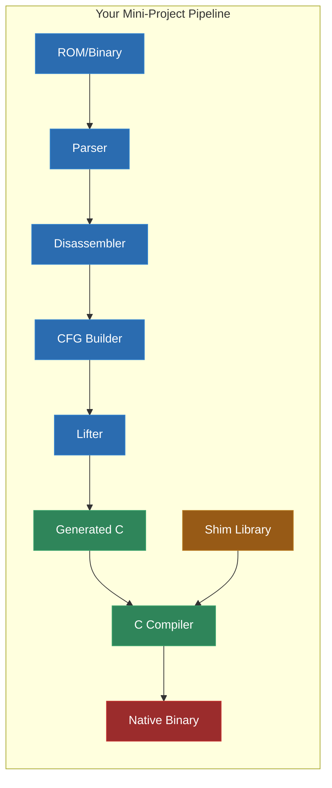
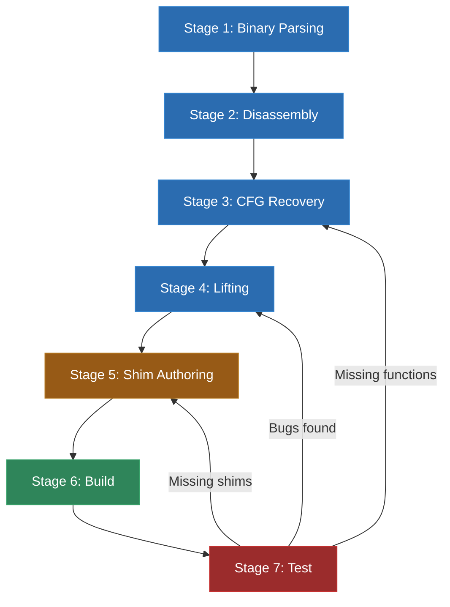
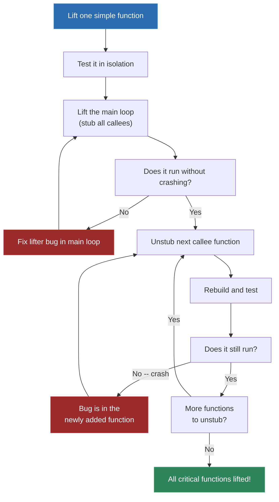

# Module 16: Semester 1 Mini-Project

You have spent fifteen modules learning how to tear binary code apart and reassemble it as portable C. You have parsed ROMs, decoded instruction sets, built control flow graphs, lifted assembly to C, written hardware shims, and solved the indirect call problem. You have worked with the Game Boy's SM83, the NES's 6502, the SNES's 65C816, the GBA's ARM7TDMI, and DOS x86 real mode. You know what the pipeline looks like. You have seen it in pieces.

Now you are going to do the whole thing, start to finish, on a target of your choosing. Not a lab exercise where half the code is provided. Not a walkthrough where every step is scripted. This is your first complete, independent recompilation -- and while it is guided, the decisions are yours.

The goal is not perfection. The goal is to walk through the full pipeline once, end to end, and come out the other side with something that boots, runs a main loop, and responds to input. You will hit walls. You will debug for hours. You will question whether you really understood Module 7 as well as you thought. That is the point -- this project consolidates everything you have learned by forcing you to use it all at once, with no scaffolding.

---

## 1. What the Mini-Project Is

The Semester 1 Mini-Project is a guided but independent end-to-end static recompilation. You will pick one of the five target platforms covered in Units 2 and 3 (Game Boy, NES, SNES, GBA, or DOS), select a small ROM or binary, and build a complete recompilation pipeline that produces a native executable.

"Complete" does not mean "production-ready." It means every stage of the pipeline exists and works:

1. **Binary parsing** -- you can read the ROM format, extract code and data sections, and identify entry points.
2. **Disassembly** -- you can decode the instruction stream into structured instruction representations.
3. **CFG recovery** -- you can identify function boundaries and build control flow graphs.
4. **Lifting** -- you can translate the original ISA into compilable C code.
5. **Shim authoring** -- you can provide the runtime functions (memory access, I/O, graphics, input) that the generated code calls into.
6. **Build** -- you can compile the generated C and shim library into a native binary.
7. **Test** -- you can run the result and verify it does something recognizable.

"Guided" means this module gives you the framework: the project structure, the checklist, the debugging strategies, and the common pitfalls. But you make the choices. You pick the target. You pick the ROM. You decide how to structure your lifter. You debug your own mistakes.



### What This Is Not

This is not a lab where you fill in blanks. Previous labs gave you starter code, test harnesses, and expected outputs. Here, you start from your own project directory and build up.

This is also not the capstone project from Module 32. The capstone is open-ended and expects you to tackle a challenging target with minimal guidance. The mini-project is deliberately scoped to a simple target with extensive handholding. Think of it as the difference between a supervised driving test and a cross-country road trip.

### Why Now

The timing is deliberate. You have covered all the fundamentals. You know what each pipeline stage does, and you have implemented each one in isolation. But you have never had to make them all work together on a single target without lab scaffolding handling the glue. The mini-project exposes the integration problems that individual labs cannot: data format mismatches between stages, edge cases that only appear when the full pipeline runs, and the sheer organizational challenge of managing a multi-component project.

You will learn more from this one project than from the next five modules of lectures. The lectures teach you how the pieces work. The project teaches you how to make them fit together.

---

## 2. Choosing Your Target

You have five options, and each has genuine tradeoffs. There is no objectively "best" choice -- it depends on your comfort level, your interests, and how much challenge you want.

### Game Boy (SM83)

**Pros:**
- The simplest instruction set you have worked with. 8-bit registers, no complex addressing modes, no variable-width operands.
- The most complete tooling ecosystem. Ghidra has excellent SM83 support. Pan Docs is comprehensive. gb-recompiled by Matt Currie exists as a reference implementation you can study (but not copy from -- you learn by building, not by reading someone else's solution).
- Small address space (64KB) means your memory shims are trivial -- a flat array with MMIO dispatch.
- The lab from Module 9 already gave you a working disassembler and partial lifter. You are not starting from zero.
- The ROM format is simple: 32KB fixed bank + switchable banks, header at 0x0100-0x014F.

**Cons:**
- Bank switching adds real complexity. If your ROM uses an MBC (Memory Bank Controller), you need to handle bank-switched regions in both your memory model and your control flow analysis.
- The PPU (graphics) is register-based and requires frame-accurate shim behavior for anything beyond the simplest games.
- If you pick a game that uses interrupts heavily (timer interrupts, VBlank handlers), you need to model the interrupt dispatch mechanism.

**Best for:** Students who want the highest chance of success and are comfortable building on what they did in Module 9.

**Ideal target ROMs:** Simple homebrew games (gb-mines, Adjustris), or commercial games with simple main loops (Tetris, Dr. Mario).

### NES (6502)

**Pros:**
- The 6502 is one of the most well-documented CPUs in computing history. Every instruction, every cycle, every edge case has been written up somewhere.
- The instruction set is small (56 base instructions, ~150 with addressing modes) and reasonably regular.
- Massive community knowledge base. NESdev wiki is one of the best hardware documentation resources on the internet.
- The NES memory map is well-understood and consistent across most games.

**Cons:**
- The 6502 has some lifting quirks: the decimal mode flag affects ADD/SUB behavior, the zero-page addressing mode means many addresses are 8-bit, and the lack of a multiply instruction means games use lookup tables and shift-add loops that can confuse CFG analysis.
- The NES uses mapper chips for bank switching, and there are dozens of different mappers. Your ROM choice determines which mapper you need to support.
- The PPU (Picture Processing Unit) is significantly more complex than the Game Boy's, with nametables, attribute tables, scrolling registers, and sprite DMA.

**Best for:** Students who enjoy the 6502 and want to work with a CPU that has extremely deep community documentation.

**Ideal target ROMs:** Simple homebrew (NES-BASIC programs, Pong clones), or commercial games with NROM mapper (no bank switching) like Donkey Kong or Balloon Fight.

### SNES (65C816)

**Pros:**
- If you successfully recompile a SNES game, you have tackled one of the most architecturally challenging 16-bit systems. That is genuinely impressive for a first project.
- The 65C816 stretches your lifter in interesting ways -- the variable-width register handling (M and X flags) and the 24-bit address space force you to think carefully about state tracking.
- Several SNES games have full disassemblies available (Super Metroid, A Link to the Past, EarthBound), which you can use as cross-references when debugging.

**Cons:**
- The 65C816 is significantly harder to lift than the SM83 or 6502. The M and X flags change the width of the accumulator and index registers at runtime, which means your lifter must either track processor state or emit defensive code that handles both widths.
- The SNES has complex hardware: Mode 7 graphics, multiple DMA channels, the SPC700 audio coprocessor (which is essentially a second CPU with its own instruction set).
- Fewer reference implementations exist for SNES recompilation compared to Game Boy or N64.

**Best for:** Students who want a real challenge and are confident in their lifting skills. Not recommended unless you are very comfortable with the material from Modules 4-11.

**Ideal target ROMs:** Simple homebrew (SNES-SDK examples, PVSnesLib demos), or commercial games with well-documented disassemblies where you can cross-reference.

### GBA (ARM7TDMI)

**Pros:**
- The ARM7TDMI is a 32-bit processor, which means lifting is in some ways simpler -- no 8-bit or 16-bit register gymnastics, no zero-page hacks, no bank switching. Registers are uniformly 32-bit.
- The GBA feels "modern" compared to the other options. It has a flat 32-bit address space (though with distinct memory regions), DMA hardware, and a graphics system that is powerful but well-documented.
- ARM is a RISC architecture with fixed-width instructions (in ARM mode) or a compact 16-bit encoding (in Thumb mode). Both are straightforward to decode.
- The GBA homebrew scene is active and well-tooled. devkitARM/devkitPro, libtonc, and GBATEK documentation are all excellent.

**Cons:**
- The GBA has two instruction sets: 32-bit ARM and 16-bit Thumb. Most games use both, switching between them with BX instructions. Your disassembler and lifter need to handle both encodings.
- The conditional execution on every ARM instruction (the top 4 bits are a condition code) means your lifter needs to wrap almost every instruction in a condition check.
- The GBA's graphics hardware (multiple background layers, affine transformations, sprite system) requires substantial shim work for anything visual.
- Fewer recompilation references exist for GBA specifically, though ARM recompilation is well-studied in other contexts (and the skills transfer directly).

**Best for:** Students who prefer 32-bit architectures and want experience with ARM, which is relevant far beyond retro gaming.

**Ideal target ROMs:** Homebrew games (Celeste Classic GBA, various GBA jam entries), or commercial games with simple graphics requirements.

### DOS (x86 Real Mode)

**Pros:**
- x86 is the most commercially relevant ISA on the planet. Experience lifting x86, even in real mode, builds skills that transfer directly to modern reverse engineering and security work.
- DOS programs are self-contained: no operating system in the way (just DOS interrupts, which are well-documented). A .COM file is literally raw code loaded at offset 0x0100. There is something beautifully simple about that.
- The DOS ecosystem has enormous nostalgia value, and there is something deeply satisfying about recompiling a DOS game to run natively on modern hardware without DOSBox.
- INT 21h (DOS services) is thoroughly documented, and most programs use only a handful of the available functions.

**Cons:**
- x86 is a variable-length instruction set with irregular encoding. Your disassembler must handle prefixes, ModR/M bytes, SIB bytes, and multiple instruction lengths. This is more work than any of the other targets' decode logic.
- Real mode segmentation (segment:offset addressing) is a lifting headache. You need to decide whether to flatten the address space or preserve segment semantics.
- Self-modifying code is common in DOS programs (copy protection, graphical effects, memory managers). If your target does this, you are in for a rough time.
- The DOS graphics landscape is fragmented: CGA, EGA, VGA, SVGA all have different register interfaces and memory layouts.

**Best for:** Students who are interested in x86 and want the unique challenge of dealing with segmentation and variable-length instructions.

**Ideal target ROMs:** Simple .COM programs (text adventures, small utilities, small games), FreeDOS utilities, or shareware titles with straightforward Mode 13h graphics.

### Decision Matrix

| Factor | Game Boy | NES | SNES | GBA | DOS |
|---|---|---|---|---|---|
| ISA complexity | Low | Low-Med | High | Medium | High |
| Memory model complexity | Medium (banking) | Medium (mappers) | High (24-bit) | Low (flat) | High (segments) |
| Graphics shim effort | Medium | High | Very High | High | Medium-High |
| Available references | Excellent | Excellent | Good | Good | Good |
| Existing recomp projects | gb-recompiled | Limited | Limited | Limited | Limited |
| Recommended for first project | Yes | Yes | With caution | Yes | With caution |

If you are unsure, pick Game Boy. It has the shortest path to a working result, the most reference material, and the most forgiving architecture. There is no shame in starting easy -- the point is to complete the pipeline, not to impress anyone with your target choice.

---

## 3. Project Planning

Before you write a single line of code, spend time planning. This is not busywork -- every hour of planning saves you three hours of debugging later.

### Selecting Your ROM/Binary

Your choice of target ROM is as important as your choice of platform. Pick wrong, and you will spend the entire project fighting edge cases instead of learning the pipeline.

**What makes a good mini-project ROM:**

1. **Small code size.** Under 32KB of code is ideal. Under 64KB is workable. Over 128KB is too much for a first project.
2. **Simple main loop.** You want a game or program that initializes hardware, enters a loop, reads input, updates state, renders a frame, and repeats. Avoid games with complex state machines, cutscenes, or level loading.
3. **Minimal hardware features.** Avoid games that use exotic hardware (SNES Mode 7, GBA rotation/scaling, NES expansion audio). Stick to basic tiles, sprites, and simple scrolling.
4. **Available source or disassembly.** If source code exists (homebrew) or a community disassembly is available (commercial), you can cross-reference when debugging. This is a huge advantage.
5. **Deterministic behavior.** Games with random number generators seeded by timing are harder to test. Prefer games where the same input always produces the same output, at least for the first few seconds.

**What makes a bad mini-project ROM:**

- Anything with a complex mapper/MBC (NES MMC5, Game Boy MBC5 with rumble)
- Games that rely on cycle-accurate timing (racing the beam, mid-scanline effects)
- Programs with self-modifying code
- Titles that use coprocessors (SNES Super FX, SNES DSP-1)
- Games larger than 256KB (you will drown in generated code)

### Initial Analysis

Before you start building tools, spend an hour with Ghidra (or your disassembler of choice) just looking at the binary. You are not trying to understand every function -- you are trying to answer these questions:

1. **Where does execution start?** Find the entry point. On Game Boy, it is 0x0100 (the header jump). On NES, it is the RESET vector at 0xFFFC-0xFFFD. On GBA, it is 0x08000000. On DOS .COM files, it is 0x0100.

2. **What is the main loop?** Follow execution from the entry point through initialization until you find a loop that does not exit. This is your main loop. Mark it in Ghidra.

3. **How many functions are there?** Get a rough count. Under 100 functions is comfortable. 100-500 is manageable. Over 500, consider a smaller ROM.

4. **What hardware does it access?** Look for reads and writes to known I/O addresses. On Game Boy, check for accesses to 0xFF00-0xFF7F. On NES, check 0x2000-0x2007 (PPU) and 0x4000-0x4017 (APU/controller). This tells you what shims you will need.

5. **Are there indirect jumps?** Search for JP HL (Game Boy), JMP (indirect) (6502/65816), BX reg (ARM), or CALL [reg] (x86). Each one is a problem you will need to solve.

6. **How is data organized?** Look for tile data, text strings, lookup tables. Understanding the data layout helps you distinguish code from data during disassembly.

### Identifying Scope

Based on your initial analysis, set a realistic scope for your project. You are aiming for:

- **Minimum viable recompilation:** The program boots, initializes, enters the main loop, and responds to at least one input.
- **Not full gameplay:** You do not need sound. You do not need every graphical effect. You do not need to handle every edge case.
- **Demonstrable correctness:** Side-by-side with an emulator, your recompiled version should produce recognizably similar output for the first few seconds of execution.

Write down your scope. Put it in a README.md in your project directory. When you are tempted to add features, check the scope document first. Scope creep has killed more hobby projects than technical difficulty ever has.

---

## 4. The Pipeline Checklist

This is the concrete, step-by-step checklist for your mini-project. Print it out, tape it to your monitor, check off each item as you complete it. Every working recompilation project has gone through these stages, whether or not the author wrote them down.

### Stage 1: Binary Parsing

- [ ] Read the ROM/binary file into memory
- [ ] Parse the header (if applicable) and extract metadata
- [ ] Identify code regions vs. data regions
- [ ] Handle bank switching or segment layout (if applicable)
- [ ] Output: structured representation of the binary (sections, entry points, metadata)

**Verification:** Print the parsed metadata. Does the title match? Is the ROM size correct? Are the entry points where you expect them?

### Stage 2: Disassembly

- [ ] Implement or reuse a disassembler for your target ISA
- [ ] Disassemble from the entry point using recursive descent
- [ ] Handle all instruction types your ROM uses (you do not need to handle every opcode in the ISA -- just the ones that appear in your target)
- [ ] Resolve direct branch/call targets
- [ ] Identify data references (loads from known addresses)
- [ ] Output: list of instructions with addresses, opcodes, and operands

**Verification:** Compare your disassembly against Ghidra's output. Do the instructions match? Are the branch targets correct?

### Stage 3: CFG Recovery

- [ ] Identify function boundaries (entry points from calls, vector tables)
- [ ] Build basic blocks (sequences of instructions ending in branches/jumps/returns)
- [ ] Connect blocks with edges (fall-through, taken branch, call)
- [ ] Handle indirect jumps (jump tables, computed targets) -- at least identify them, even if you solve them with a dispatch table
- [ ] Output: control flow graph with functions containing basic blocks

**Verification:** Count your functions. Does the number roughly match Ghidra's function list? Are the biggest functions in the right places?

### Stage 4: Lifting

- [ ] Define a CPU context structure in C (registers, flags, memory)
- [ ] Implement a lifter that translates each instruction type to C
- [ ] Generate one C function per original function
- [ ] Handle memory access through shim functions (mem_read_u8, mem_write_u8, etc.)
- [ ] Handle flag updates for arithmetic/logic instructions
- [ ] Emit the dispatch table for indirect jumps
- [ ] Output: compilable C files containing the lifted functions

**Verification:** Pick one simple function. Manually trace through the original assembly and the generated C with the same input values. Do they produce the same output?

### Stage 5: Shim Authoring

- [ ] Implement the memory system (flat array or banked, with MMIO dispatch)
- [ ] Implement input reading (keyboard to controller mapping via SDL2)
- [ ] Implement basic graphics output (framebuffer to SDL2 window)
- [ ] Stub all other I/O (audio, serial, etc.) with logging
- [ ] Write main() that initializes the runtime and calls the entry point
- [ ] Output: shim library source files

**Verification:** Does the shim library compile on its own? Can you call mem_read/mem_write and get sensible values back?

### Stage 6: Build

- [ ] Write CMakeLists.txt that compiles generated code and shims
- [ ] Link against SDL2 (and any other dependencies)
- [ ] Resolve all undefined symbols (missing shims, missing dispatch entries)
- [ ] Output: native executable

**Verification:** Does `cmake --build` complete without errors? (Warnings are expected at first, but errors must be zero.)

### Stage 7: Test

- [ ] Run the executable -- does it crash immediately?
- [ ] If it crashes, use trace logging to find the divergence point
- [ ] Compare output side-by-side with an emulator
- [ ] Verify the main loop executes
- [ ] Verify at least one input produces a visible response
- [ ] Output: a working (if imperfect) recompilation

**Verification:** Can you demonstrate the program running to someone else and explain what it is doing?



Notice the feedback arrows from Stage 7. This is not a waterfall process. You will iterate. You will discover in testing that your lifter mishandled an instruction, go back and fix it, regenerate, rebuild, and test again. That is normal. That is the process. Real recompilation projects live in this loop for months.

---

## 5. Setting Up Your Project Repository

Good project structure saves you hours of confusion later. Here is the directory layout I recommend for any recompilation project, regardless of target:

```
my-recomp-project/
├── CMakeLists.txt           # Top-level build file
├── README.md                # Project description, target info, scope
├── rom/                     # Your target ROM (gitignored if commercial)
│   └── target.gb            # (or .nes, .sfc, .gba, .com)
├── tools/                   # Your recompilation tools
│   ├── parser.py            # Binary parser (ROM format reader)
│   ├── disassembler.py      # Disassembler
│   ├── cfg_builder.py       # CFG recovery
│   └── lifter.py            # Lifter (ISA -> C)
├── generated/               # Output from the lifter (gitignored or committed)
│   ├── functions.c          # Lifted functions
│   ├── functions.h          # Function declarations
│   ├── dispatch.c           # Indirect call dispatch table
│   └── rom_data.c           # Constant data from the ROM
├── shims/                   # Hand-written runtime library
│   ├── memory.c             # Memory system
│   ├── memory.h
│   ├── graphics.c           # Graphics output (SDL2)
│   ├── graphics.h
│   ├── input.c              # Controller input
│   ├── input.h
│   ├── audio.c              # Audio (stub for now)
│   ├── audio.h
│   ├── cpu_context.h        # CPU state structure
│   └── platform.h           # Platform-specific includes
├── runtime/                 # Main program entry point
│   └── main.c               # Initializes runtime, calls entry point
├── tests/                   # Test scripts and expected outputs
│   └── trace_compare.py     # Compare traces against emulator
└── build/                   # Build output (gitignored)
```

This structure separates concerns cleanly. The `tools/` directory contains everything that runs at build time (your recompilation pipeline). The `generated/` directory contains the output of those tools. The `shims/` directory contains your hand-written runtime code. The `runtime/` directory contains the main entry point that ties everything together.

You can put the tools in whatever language you prefer. Python is the most common choice for hobbyist recompilation tools because it is fast to write and easy to iterate on. C or C++ works too if you prefer, and some people use Rust. The important thing is that the tools produce C output in the `generated/` directory.

### CMakeLists.txt Template

Here is a starter CMakeLists.txt that works for any of the five targets:

```cmake
cmake_minimum_required(VERSION 3.16)
project(my-recomp C)

set(CMAKE_C_STANDARD 11)

# Find SDL2 for graphics/input/audio output
find_package(SDL2 REQUIRED)

# Generated code from the lifter
set(GENERATED_SOURCES
    generated/functions.c
    generated/dispatch.c
    generated/rom_data.c
)

# Hand-written shim library
set(SHIM_SOURCES
    shims/memory.c
    shims/graphics.c
    shims/input.c
    shims/audio.c
)

# Runtime entry point
set(RUNTIME_SOURCES
    runtime/main.c
)

add_executable(recomp
    ${GENERATED_SOURCES}
    ${SHIM_SOURCES}
    ${RUNTIME_SOURCES}
)

target_include_directories(recomp PRIVATE
    ${SDL2_INCLUDE_DIRS}
    shims/
    generated/
)

target_link_libraries(recomp PRIVATE
    ${SDL2_LIBRARIES}
)

# Debug build with trace logging
target_compile_definitions(recomp PRIVATE
    $<$<CONFIG:Debug>:TRACE_ENABLED=1>
)

# Optimize the generated code -- it can be large
if(CMAKE_C_COMPILER_ID MATCHES "GNU|Clang")
    set_source_files_properties(${GENERATED_SOURCES}
        PROPERTIES COMPILE_FLAGS "-O2"
    )
endif()
```

A few things worth noting about this template:

- The `TRACE_ENABLED` define is only active in Debug builds. This lets you compile a Release build without trace overhead when you want to test performance.
- The generated sources get `-O2` even in debug builds because unoptimized generated code is painfully slow. The shim code can stay at `-O0` for easier debugging.
- SDL2 is found via `find_package`. On Windows, you may need to set `SDL2_DIR` to point to your SDL2 installation. On Linux, `apt install libsdl2-dev` is usually enough. On macOS, `brew install sdl2`.

### The CPU Context Structure

Every target needs a CPU context structure that holds the processor's register state. This is the central data structure that flows through every lifted function. Here are templates for each platform:

**Game Boy (SM83):**

```c
// shims/cpu_context.h
#pragma once
#include <stdint.h>

typedef struct {
    // 8-bit registers
    uint8_t a, f, b, c, d, e, h, l;
    // 16-bit registers
    uint16_t sp, pc;
    // Interrupt state
    uint8_t ime;      // Interrupt Master Enable
    uint8_t halted;   // CPU halted (waiting for interrupt)
} SM83Context;

// Flag accessors -- the SM83 stores flags in the upper nibble of F
#define FLAG_Z(ctx) (((ctx)->f >> 7) & 1)
#define FLAG_N(ctx) (((ctx)->f >> 6) & 1)
#define FLAG_H(ctx) (((ctx)->f >> 5) & 1)
#define FLAG_C(ctx) (((ctx)->f >> 4) & 1)

#define SET_FLAG_Z(ctx, v) ((ctx)->f = ((ctx)->f & 0x7F) | ((v) << 7))
#define SET_FLAG_N(ctx, v) ((ctx)->f = ((ctx)->f & 0xBF) | ((v) << 6))
#define SET_FLAG_H(ctx, v) ((ctx)->f = ((ctx)->f & 0xDF) | ((v) << 5))
#define SET_FLAG_C(ctx, v) ((ctx)->f = ((ctx)->f & 0xEF) | ((v) << 4))

// 16-bit register pair accessors
#define REG_BC(ctx) (((uint16_t)(ctx)->b << 8) | (ctx)->c)
#define REG_DE(ctx) (((uint16_t)(ctx)->d << 8) | (ctx)->e)
#define REG_HL(ctx) (((uint16_t)(ctx)->h << 8) | (ctx)->l)
#define REG_AF(ctx) (((uint16_t)(ctx)->a << 8) | (ctx)->f)

#define SET_BC(ctx, v) do { (ctx)->b = (v) >> 8; (ctx)->c = (v) & 0xFF; } while(0)
#define SET_DE(ctx, v) do { (ctx)->d = (v) >> 8; (ctx)->e = (v) & 0xFF; } while(0)
#define SET_HL(ctx, v) do { (ctx)->h = (v) >> 8; (ctx)->l = (v) & 0xFF; } while(0)
```

**NES (6502):**

```c
typedef struct {
    uint8_t a;        // Accumulator
    uint8_t x, y;     // Index registers
    uint8_t sp;       // Stack pointer (8-bit, offset from 0x0100)
    uint16_t pc;      // Program counter
    // Flags stored individually for easy access in generated code
    uint8_t flag_c;   // Carry
    uint8_t flag_z;   // Zero
    uint8_t flag_i;   // Interrupt disable
    uint8_t flag_d;   // Decimal mode
    uint8_t flag_v;   // Overflow
    uint8_t flag_n;   // Negative
} M6502Context;
```

**GBA (ARM7TDMI):**

```c
typedef struct {
    uint32_t r[16];   // r0-r15 (r13=SP, r14=LR, r15=PC)
    uint32_t cpsr;    // Current Program Status Register
    uint32_t spsr;    // Saved Program Status Register
    // Banked registers for different CPU modes (simplified)
    uint32_t sp_irq, lr_irq, spsr_irq;
    uint32_t sp_svc, lr_svc, spsr_svc;
} ARM7Context;

#define ARM_FLAG_N(ctx) (((ctx)->cpsr >> 31) & 1)
#define ARM_FLAG_Z(ctx) (((ctx)->cpsr >> 30) & 1)
#define ARM_FLAG_C(ctx) (((ctx)->cpsr >> 29) & 1)
#define ARM_FLAG_V(ctx) (((ctx)->cpsr >> 28) & 1)
#define ARM_THUMB_MODE(ctx) (((ctx)->cpsr >> 5) & 1)
```

**SNES (65C816):**

```c
typedef struct {
    uint16_t a;       // Accumulator (16-bit, but width depends on M flag)
    uint16_t x, y;    // Index registers (width depends on X flag)
    uint16_t sp;      // Stack pointer
    uint16_t dp;      // Direct page register
    uint8_t  dbr;     // Data bank register
    uint8_t  pbr;     // Program bank register
    uint16_t pc;      // Program counter
    uint8_t  p;       // Processor status (flags)
    uint8_t  emulation; // Emulation mode flag
} W65816Context;

// The M and X flags control register widths -- this is the hard part
#define FLAG_M(ctx) (((ctx)->p >> 5) & 1)  // 1 = 8-bit accumulator
#define FLAG_X(ctx) (((ctx)->p >> 4) & 1)  // 1 = 8-bit index registers
```

**DOS (x86 Real Mode):**

```c
typedef struct {
    // General purpose registers stored as 16-bit with byte access
    union { uint16_t ax; struct { uint8_t al, ah; }; };
    union { uint16_t bx; struct { uint8_t bl, bh; }; };
    union { uint16_t cx; struct { uint8_t cl, ch; }; };
    union { uint16_t dx; struct { uint8_t dl, dh; }; };
    uint16_t si, di, bp, sp;
    // Segment registers
    uint16_t cs, ds, es, ss;
    // Instruction pointer
    uint16_t ip;
    // Flags register
    uint16_t flags;
} X86RealContext;

#define X86_FLAG_CF(ctx) ((ctx)->flags & 0x0001)
#define X86_FLAG_ZF(ctx) (((ctx)->flags >> 6) & 1)
#define X86_FLAG_SF(ctx) (((ctx)->flags >> 7) & 1)
#define X86_FLAG_OF(ctx) (((ctx)->flags >> 11) & 1)
```

### Shim Library Skeleton

Start with stub implementations that log every call. You will fill these in as you discover what your target actually needs. The logging is not optional for a first project -- it is your primary debugging tool.

```c
// shims/memory.c
#include "memory.h"
#include <stdio.h>
#include <string.h>

// Adjust size for your target:
// Game Boy: 0x10000 (64KB), NES: 0x10000, GBA: much larger (multiple regions)
static uint8_t memory[0x10000];

void mem_init(const uint8_t *rom_data, size_t rom_size) {
    memset(memory, 0, sizeof(memory));
    // Copy ROM into the appropriate region
    // Game Boy: 0x0000-0x7FFF (first 32KB, more with banking)
    // NES: 0x8000-0xFFFF (PRG ROM area)
    // DOS .COM: 0x0100-onwards (loaded at CS:0100)
    memcpy(&memory[ROM_BASE], rom_data,
           rom_size < sizeof(memory) - ROM_BASE ? rom_size : sizeof(memory) - ROM_BASE);
}

uint8_t mem_read_u8(uint16_t addr) {
    // Check for MMIO regions first
    if (addr >= IO_BASE && addr <= IO_END) {
        return io_read(addr);
    }
    return memory[addr];
}

void mem_write_u8(uint16_t addr, uint8_t value) {
    if (addr >= IO_BASE && addr <= IO_END) {
        io_write(addr, value);
        return;
    }
    // Check for read-only regions (ROM)
    if (addr < ROM_END) {
        #ifdef TRACE_ENABLED
        printf("WARNING: Write to ROM address 0x%04X = 0x%02X\n", addr, value);
        #endif
        // On Game Boy, writes to ROM region are MBC commands
        // You may need to handle bank switching here
        return;
    }
    memory[addr] = value;
}

uint16_t mem_read_u16(uint16_t addr) {
    // Little-endian read (correct for SM83, 6502, x86, ARM)
    return (uint16_t)mem_read_u8(addr) | ((uint16_t)mem_read_u8(addr + 1) << 8);
}

void mem_write_u16(uint16_t addr, uint16_t value) {
    mem_write_u8(addr, value & 0xFF);
    mem_write_u8(addr + 1, value >> 8);
}
```

```c
// shims/graphics.c
#include "graphics.h"
#include <SDL2/SDL.h>

static SDL_Window *window;
static SDL_Renderer *renderer;
static SDL_Texture *framebuffer_tex;

// Screen dimensions -- adjust for your target
// Game Boy: 160x144, NES: 256x240, SNES: 256x224, GBA: 240x160, DOS VGA: 320x200
#define SCREEN_W 160
#define SCREEN_H 144
#define SCALE 3

static uint32_t pixels[SCREEN_W * SCREEN_H];

int graphics_init(void) {
    if (SDL_Init(SDL_INIT_VIDEO) < 0) {
        fprintf(stderr, "SDL_Init failed: %s\n", SDL_GetError());
        return -1;
    }

    window = SDL_CreateWindow("Recompiled",
        SDL_WINDOWPOS_CENTERED, SDL_WINDOWPOS_CENTERED,
        SCREEN_W * SCALE, SCREEN_H * SCALE, 0);
    if (!window) return -1;

    renderer = SDL_CreateRenderer(window, -1, SDL_RENDERER_ACCELERATED);
    if (!renderer) return -1;

    framebuffer_tex = SDL_CreateTexture(renderer, SDL_PIXELFORMAT_ARGB8888,
        SDL_TEXTUREACCESS_STREAMING, SCREEN_W, SCREEN_H);
    if (!framebuffer_tex) return -1;

    return 0;
}

void graphics_present(void) {
    SDL_UpdateTexture(framebuffer_tex, NULL, pixels, SCREEN_W * sizeof(uint32_t));
    SDL_RenderClear(renderer);
    SDL_RenderCopy(renderer, framebuffer_tex, NULL, NULL);
    SDL_RenderPresent(renderer);
}

void graphics_set_pixel(int x, int y, uint32_t color) {
    if (x >= 0 && x < SCREEN_W && y >= 0 && y < SCREEN_H) {
        pixels[y * SCREEN_W + x] = color;
    }
}

void graphics_shutdown(void) {
    if (framebuffer_tex) SDL_DestroyTexture(framebuffer_tex);
    if (renderer) SDL_DestroyRenderer(renderer);
    if (window) SDL_DestroyWindow(window);
    SDL_Quit();
}
```

```c
// shims/input.c
#include "input.h"
#include <SDL2/SDL.h>
#include <stdlib.h>

// Button state -- active low on many consoles (0xFF = all released)
static uint8_t button_state = 0xFF;

void input_update(void) {
    SDL_Event event;
    while (SDL_PollEvent(&event)) {
        if (event.type == SDL_QUIT) {
            exit(0);  // Clean exit on window close
        }
        if (event.type == SDL_KEYDOWN || event.type == SDL_KEYUP) {
            int pressed = (event.type == SDL_KEYDOWN);
            // Map keyboard to console buttons
            // Adjust bit positions for your target's button layout
            switch (event.key.keysym.scancode) {
                case SDL_SCANCODE_Z:      /* A */      break;
                case SDL_SCANCODE_X:      /* B */      break;
                case SDL_SCANCODE_RETURN: /* Start */  break;
                case SDL_SCANCODE_RSHIFT: /* Select */ break;
                case SDL_SCANCODE_UP:     /* Up */     break;
                case SDL_SCANCODE_DOWN:   /* Down */   break;
                case SDL_SCANCODE_LEFT:   /* Left */   break;
                case SDL_SCANCODE_RIGHT:  /* Right */  break;
                default: break;
            }
            (void)pressed; // TODO: update button_state bits
        }
    }
}

uint8_t input_get_state(void) {
    return button_state;
}
```

```c
// runtime/main.c
#include "cpu_context.h"
#include "memory.h"
#include "graphics.h"
#include "input.h"
#include <stdio.h>
#include <stdlib.h>

// Declare the entry point function (generated by your lifter)
// Adjust the name and context type for your target
extern void func_entry(void *ctx);

int main(int argc, char *argv[]) {
    if (argc < 2) {
        fprintf(stderr, "Usage: %s <rom_file>\n", argv[0]);
        return 1;
    }

    // Load ROM
    FILE *f = fopen(argv[1], "rb");
    if (!f) { perror("Failed to open ROM"); return 1; }
    fseek(f, 0, SEEK_END);
    size_t rom_size = ftell(f);
    fseek(f, 0, SEEK_SET);
    uint8_t *rom_data = malloc(rom_size);
    fread(rom_data, 1, rom_size, f);
    fclose(f);

    printf("Loaded ROM: %zu bytes\n", rom_size);

    // Initialize subsystems
    mem_init(rom_data, rom_size);
    if (graphics_init() < 0) {
        fprintf(stderr, "Failed to initialize graphics\n");
        return 1;
    }

    // Initialize CPU context to post-boot values
    // (Adjust for your target -- these are Game Boy post-boot values)
    // SM83Context ctx = {0};
    // ctx.a = 0x01; ctx.f = 0xB0;  // Post-boot: A=01, F=B0 (Z=1,N=0,H=1,C=1)
    // ctx.b = 0x00; ctx.c = 0x13;
    // ctx.d = 0x00; ctx.e = 0xD8;
    // ctx.h = 0x01; ctx.l = 0x4D;
    // ctx.sp = 0xFFFE;
    // ctx.pc = 0x0100;  // Entry point

    printf("Starting recompiled execution...\n");

    // Call the entry point function
    // func_entry(&ctx);

    // Cleanup
    graphics_shutdown();
    free(rom_data);
    return 0;
}
```

---

## 6. Analysis Phase Walkthrough

This section walks through the analysis process using a Game Boy ROM as the example, but the approach applies to any target. Adapt the addresses and register names to your platform.

### Loading in Ghidra

1. Open Ghidra, create a new project, and import your ROM file.
2. For Game Boy ROMs, select the "SM83" processor (Ghidra labels it "GameBoy" in recent versions). For NES, select "6502". For SNES, select "65816". For GBA, select "ARM:LE:32:v4t" (which covers the ARM7TDMI). For DOS .COM files, select "x86:LE:16:Real Mode".
3. Let Ghidra perform its initial auto-analysis. This will identify many functions automatically, though it will miss some and misidentify others. Ghidra is a starting point, not the final word.
4. Navigate to the entry point.

### Finding the Main Loop

On the Game Boy, execution starts at 0x0100 with a jump instruction. Follow it.

```asm
; Entry point at 0x0100
0100: NOP
0101: JP 0x0150        ; Jump to actual start of program

; At 0x0150: initialization code
0150: DI               ; Disable interrupts
0151: LD SP, 0xFFFE    ; Set stack pointer
0154: CALL 0x0300      ; init_hardware -- set up LCD, palettes, etc.
0157: CALL 0x0400      ; init_game -- set up game state in RAM
015A: EI               ; Enable interrupts

; Main loop starts here
015B: HALT             ; Wait for VBlank interrupt
015C: NOP              ; (HALT bug: NOP after HALT is standard practice)
015D: CALL 0x0500      ; read_input
0160: CALL 0x0600      ; update_game
0163: CALL 0x0700      ; render_frame
0166: JP 0x015B        ; Loop back to HALT
```

That `JP 0x015B` at the end is your main loop. Mark it in Ghidra. This is the heartbeat of the program. Everything else is called from within this loop (or from interrupt handlers that fire during the HALT).

On the NES, the pattern is different -- the main loop is usually driven by the NMI (VBlank) interrupt handler rather than a HALT instruction:

```asm
; RESET vector handler
reset:
    SEI             ; Disable IRQs
    CLD             ; Clear decimal mode
    ; ... initialization ...
    CLI             ; Enable IRQs

forever:
    JMP forever     ; Spin -- all work happens in NMI

; NMI vector handler (called every VBlank)
nmi:
    PHA             ; Save registers
    TXA
    PHA
    JSR read_input
    JSR update_game
    JSR render
    PLA             ; Restore registers
    TAX
    PLA
    RTI             ; Return from interrupt
```

On the GBA, the main loop is typically a simple while loop:

```asm
; Entry at 0x08000000
    B main          ; Branch to main function

main:
    BL init_hardware
    BL init_game
loop:
    BL vsync_wait   ; Wait for VBlank
    BL read_input
    BL update
    BL render
    B loop           ; Loop forever
```

The structure is always the same: initialize, then loop (wait, input, update, render). Find that loop in your target.

### Identifying Key Functions

From the main loop, you can see the key functions. Examine each one in Ghidra to understand what it accesses:

- **Input function**: Should read from the input register or port. On Game Boy, look for reads from 0xFF00. On NES, look for reads from 0x4016/0x4017. On GBA, look for reads from 0x04000130 (KEYINPUT). On DOS, look for INT 16h or port reads from 0x60.
- **Update function**: This is the game logic. It will be the most complex function. For your mini-project, you mostly just need it to not crash -- perfect behavior comes later.
- **Render function**: This writes to VRAM or graphics registers. On Game Boy, look for writes to 0x8000-0x9FFF (tile data / tile maps). On NES, look for writes to PPU registers (0x2006/0x2007 for VRAM access). On DOS, look for writes to 0xA000:0000 (Mode 13h framebuffer).

### Identifying Hardware Access Patterns

Search the disassembly for reads and writes to I/O addresses. Here is what to look for on each platform:

**Game Boy I/O Map (0xFF00-0xFF7F):**

| Address | Register | Purpose | Shim Priority |
|---|---|---|---|
| 0xFF00 | P1/JOYP | Joypad input | High -- connect to your input shim |
| 0xFF04 | DIV | Divider register (increments at 16384 Hz) | Medium -- return incrementing value |
| 0xFF05-0xFF07 | TIMA/TMA/TAC | Timer | Low unless game uses timer interrupts |
| 0xFF0F | IF | Interrupt flags | High if using interrupts |
| 0xFF40 | LCDC | LCD control | Medium -- track on/off state |
| 0xFF41 | STAT | LCD status | Medium if game reads it |
| 0xFF42-0xFF43 | SCY/SCX | Background scroll | Needed for graphics |
| 0xFF44 | LY | Current scanline | High -- many games poll this |
| 0xFF47 | BGP | Background palette | Needed for correct colors |
| 0xFF48-0xFF49 | OBP0/OBP1 | Sprite palettes | Needed for sprite colors |
| 0xFFFF | IE | Interrupt enable | High if using interrupts |

**NES I/O Map:**

| Address | Register | Purpose | Shim Priority |
|---|---|---|---|
| 0x2000 | PPUCTRL | PPU control | High |
| 0x2001 | PPUMASK | PPU rendering mask | Medium |
| 0x2002 | PPUSTATUS | PPU status (VBlank flag) | High -- games poll this |
| 0x2005 | PPUSCROLL | Scroll position | Needed for graphics |
| 0x2006-0x2007 | PPUADDR/PPUDATA | VRAM access | High |
| 0x4014 | OAMDMA | OAM DMA transfer | High for sprites |
| 0x4016-0x4017 | Controllers | Input | High |

**GBA I/O Registers (0x04000000+):**

| Offset | Register | Purpose | Shim Priority |
|---|---|---|---|
| 0x000 | DISPCNT | Display control | High |
| 0x004 | DISPSTAT | Display status / VBlank | High |
| 0x006 | VCOUNT | Current scanline | High |
| 0x130 | KEYINPUT | Button input | High |

**DOS (interrupt-based):**

| Interrupt | Purpose | Shim Priority |
|---|---|---|
| INT 10h | Video BIOS | High for any graphical program |
| INT 16h | Keyboard BIOS | High for input |
| INT 21h | DOS services | High (file I/O, exit, print) |
| Port 0x60 | Keyboard data port | High if direct keyboard access |
| Port 0x3C0-0x3CF | VGA registers | Medium-High for VGA programs |

### Counting and Categorizing Functions

Go through Ghidra's function list and categorize each function:

- **Critical path**: Functions called from the main loop or its direct callees. These must be lifted correctly.
- **Initialization**: Functions called once at startup. These need to work but are less sensitive to edge cases.
- **Interrupt handlers**: If your game uses interrupts, these are called asynchronously. On Game Boy, check addresses 0x0040 (VBlank), 0x0048 (STAT), 0x0050 (Timer), 0x0058 (Serial), 0x0060 (Joypad).
- **Library/utility**: Math functions, memcpy-like operations, lookup table accessors. Often simple and easy to lift.
- **Unreachable**: Functions that Ghidra identified but that are never actually called (dead code, unused debug routines). You can skip these entirely.

For a well-chosen mini-project ROM, you should have roughly:
- 5-20 critical path functions
- 3-10 initialization functions
- 0-3 interrupt handlers
- 10-50 utility functions
- Some number of unreachable functions (ignore these)

If your count is much higher than this, you may have picked too large a ROM. That is fine -- pick a different one. Better to discover this now than after you have written half a lifter.

---

## 7. Incremental Development

The single most important strategy for this project: **do not try to recompile everything at once.** Start with one function, get it working, then add more. This is not a suggestion. This is the difference between finishing the project and drowning in it.

### The One-Function Test

Pick the simplest function in your critical path. Often this is a utility function -- something that takes inputs in registers, does a computation, and stores a result, without touching hardware I/O.

1. Lift that one function to C by hand (or with your lifter tool).
2. Write a tiny test harness that calls it with known inputs and checks the output.
3. Run the same function in an emulator with the same inputs and compare.
4. When the outputs match, you have verified your lifting for at least those instruction types.

```c
// test_harness.c -- testing a single lifted function
#include "cpu_context.h"
#include "functions.h"
#include <stdio.h>

int main(void) {
    SM83Context ctx = {0};

    // Set up inputs (register values the original function expects)
    ctx.a = 0x05;
    ctx.b = 0x03;

    // Call the lifted function
    func_0x0200(&ctx);

    // Check outputs
    printf("A after func_0x0200: 0x%02X (expected: 0x08)\n", ctx.a);
    printf("Zero flag: %d (expected: 0)\n", FLAG_Z(&ctx));
    printf("Carry flag: %d (expected: 0)\n", FLAG_C(&ctx));

    return 0;
}
```

This might seem like a lot of work for one function, but it catches lifter bugs early. A subtle mistake in flag computation or sign extension will propagate through every function you lift. Finding it now, in isolation, is trivial. Finding it later, buried under 200 other functions, is a nightmare.

### Expanding Coverage

Once your one-function test works, expand outward following the call graph:

1. **Lift the main loop function.** It will call other functions that do not exist yet. Stub them -- declare them as `void func_0xNNNN(Context *ctx) { /* TODO */ }` and move on.

2. **Lift the functions called from the main loop**, one at a time. Each time you add a function, rebuild and test. Does it still run? Does it crash? If it crashes, you know the bug is in the function you just added (or in the interaction between it and the functions you already lifted).

3. **Replace stubs with real implementations** as you go. Each time you unstub a function, you get a little more behavior.

This incremental approach turns debugging from "something is wrong somewhere in 5000 lines of generated code" into "something is wrong in the 50 lines I just added." That is an enormous difference.



### The Scaffold-and-Fill Pattern

Here is a concrete example of how this works in practice. Suppose your main loop calls three functions:

```c
// First pass: everything is scaffolded with stubs
void func_main_loop(SM83Context *ctx) {
    while (1) {
        func_read_input(ctx);
        func_update_game(ctx);
        func_render_frame(ctx);
        graphics_present();   // Shim: push framebuffer to screen
        input_update();       // Shim: poll SDL events
    }
}

void func_read_input(SM83Context *ctx) {
    #ifdef TRACE_ENABLED
    printf("STUB: func_read_input called\n");
    #endif
}

void func_update_game(SM83Context *ctx) {
    #ifdef TRACE_ENABLED
    printf("STUB: func_update_game called\n");
    #endif
}

void func_render_frame(SM83Context *ctx) {
    #ifdef TRACE_ENABLED
    printf("STUB: func_render_frame called\n");
    #endif
}
```

This compiles. It runs. It shows a blank window and prints "STUB" messages to the console. That is progress. Now fill in one function at a time:

**Second pass:** Replace `func_read_input` with real lifted code. Now the program reads your keyboard input and stores button state somewhere in memory.

**Third pass:** Replace `func_update_game`. Now the game logic runs, updating state based on the input.

**Fourth pass:** Replace `func_render_frame`. Now you see something on screen.

Each step is independently testable. Each step makes the result a little more complete.

### Handling Functions That Call Other Functions

When you unstub a function, it may call sub-functions that you have not lifted yet. You have two choices:

1. **Stub the sub-functions too** and come back to them later. This is the safe choice.
2. **Lift the sub-functions first** (depth-first). This is faster if the sub-functions are simple, but you risk going deep down a call chain and losing track.

For the mini-project, I recommend a breadth-first approach: stub everything at the current depth, get the current level working, then go one level deeper. This keeps you closer to a runnable program at all times.

---

## 8. Shim Development Strategy

The shim library is where you will spend the most time during this project. That is true of every recompilation project -- as we covered in Module 15, the runtime consistently dwarfs the recompiler in size and complexity. The strategy: **stub everything first, implement as needed, and always log.**

### The Stub-First Approach

When your lifted code calls `mem_read_u8(0xFF44)`, you need that function to exist or the program will not link. But you do not need it to return the correct value right away. Start with stubs that return reasonable defaults and log their calls:

```c
uint8_t io_read(uint16_t addr) {
    switch (addr) {
        case 0xFF00:  // Joypad
            #ifdef TRACE_ENABLED
            printf("IO READ: Joypad (0xFF00) -> returning 0xFF (all released)\n");
            #endif
            return 0xFF;

        case 0xFF44:  // LY (scanline counter)
            #ifdef TRACE_ENABLED
            printf("IO READ: LY (0xFF44) -> returning 0x90 (VBlank)\n");
            #endif
            return 0x90;  // Pretend we are always in VBlank -- safe default

        case 0xFF40:  // LCDC (LCD control)
            #ifdef TRACE_ENABLED
            printf("IO READ: LCDC (0xFF40) -> returning 0x91 (LCD on, BG on)\n");
            #endif
            return 0x91;

        default:
            #ifdef TRACE_ENABLED
            printf("IO READ: Unknown register 0x%04X -> returning 0x00\n", addr);
            #endif
            return 0x00;
    }
}

void io_write(uint16_t addr, uint8_t value) {
    #ifdef TRACE_ENABLED
    printf("IO WRITE: 0x%04X = 0x%02X\n", addr, value);
    #endif
    // For now, just log. Implement as needed.
}
```

The trace logging is not optional for a first project. When the program misbehaves, the logs tell you which shims are being called and what values they are returning. You can then prioritize implementing the most important ones.

### Prioritizing Shim Implementation

Implement shims in this order of priority:

1. **Memory system** (basic read/write to RAM and ROM). Without this, literally nothing works. This is your first shim.

2. **Input** (joypad/controller reading). Without this, you cannot interact with the program, and many games will not leave their title screen because they wait for a button press during the boot sequence.

3. **Timing registers** (VBlank flag, scanline counter, frame counter). Many games use these to synchronize their main loop. If the scanline counter always returns the same value, the game may spin forever waiting for VBlank, or it may skip its rendering entirely because it thinks it is always in the wrong phase.

4. **Basic graphics output** (enough to see something on screen). This does not need to be pixel-perfect. Even a rough framebuffer dump showing tile data or background colors is enough to verify the program is producing output.

5. **Everything else** (audio, serial, link cable, save RAM, real-time clock, etc.). Stub these and implement only if your specific target needs them to not crash.

### When a Stub Is Not Enough

Sometimes a stub causes the program to hang or crash. Here are the common symptoms and their fixes:

**Infinite loop waiting for a register value.** The program reads a register in a loop, waiting for a specific bit pattern. If your stub always returns the same value, the loop never exits.

```c
// This is what the game is doing (lifted code):
void wait_vblank(SM83Context *ctx) {
    // while ((LY) < 144) -- wait until VBlank
    while (1) {
        uint8_t ly = mem_read_u8(0xFF44);
        if (ly >= 144) break;
    }
}
```

If `io_read(0xFF44)` always returns 0x00, this loops forever. Fix: make LY increment on each read, or return a value >= 144 to skip the wait:

```c
static uint8_t fake_ly = 0;

case 0xFF44:  // LY
    fake_ly = (fake_ly + 1) % 154;  // 0-153, wrapping
    return fake_ly;
```

**Crash after checking a return value.** The program reads a status register, checks a condition, and branches to code you have not handled. Fix: return a value that takes the "normal" path.

**Write to control register with no effect.** The program writes a configuration value (like enabling sprites or setting a graphics mode) and then expects subsequent reads or behavior to reflect that configuration. Fix: store the written value and have your read shim return something consistent:

```c
static uint8_t lcdc_value = 0x91;  // Default: LCD on, BG enabled

void io_write(uint16_t addr, uint8_t value) {
    switch (addr) {
        case 0xFF40:
            lcdc_value = value;
            break;
        // ...
    }
}

uint8_t io_read(uint16_t addr) {
    switch (addr) {
        case 0xFF40:
            return lcdc_value;
        // ...
    }
}
```

### The "Just Enough" Principle

You do not need to implement a full PPU. You do not need cycle-accurate timing. You do not need audio. You need just enough shim behavior to keep the program from crashing and to produce some observable output.

For graphics, "just enough" might mean:
- Tracking which tiles are loaded into VRAM
- Reading the background tile map
- Rendering tiles as colored rectangles to an SDL window
- Not handling scrolling, sprites, or window layer at all

That is enough to see that the program is running and producing output. You can refine later if you choose to.

---

## 9. Debugging Strategies

You will debug. A lot. Here are the strategies that actually work for recompilation projects, ranked from most to least effective.

### Strategy 1: Trace Comparison

The most powerful debugging technique for recompilation is **trace comparison**: log the CPU state at function boundaries in both an emulator and your recompiled program, then diff the logs.

Add a trace macro to every lifted function:

```c
#ifdef TRACE_ENABLED
#define TRACE_FUNC(name, ctx) \
    printf("TRACE %s: A=%02X F=%02X BC=%04X DE=%04X HL=%04X SP=%04X\n", \
        name, (ctx)->a, (ctx)->f, \
        REG_BC(ctx), REG_DE(ctx), REG_HL(ctx), (ctx)->sp)
#else
#define TRACE_FUNC(name, ctx) ((void)0)
#endif

void func_0x0200(SM83Context *ctx) {
    TRACE_FUNC("func_0x0200", ctx);
    // ... lifted code ...
}
```

On the emulator side, add similar logging at the same function entry addresses. Most emulators with debugger support (BGB, Mesen, mGBA) allow you to set breakpoints that log register state. Some even have trace logging built in.

Then run both with the same ROM and diff the output:

```bash
# Redirect trace output to files
./recompiled target.gb 2>&1 | grep "^TRACE" > recomp_trace.txt
# (Get emulator trace separately)
diff recomp_trace.txt emulator_trace.txt | head -40
```

The first line that differs tells you exactly which function produced the wrong state, and which register diverged. From there, you examine the lifted code for that specific function and find the bug.

This is so effective that it is worth spending an hour setting up trace logging even if you think you do not need it. You will need it.

### Strategy 2: Printf Debugging Within Functions

When trace comparison points you to a specific function, add more detailed logging inside that function to find the exact instruction that went wrong:

```c
void func_0x0200(SM83Context *ctx) {
    TRACE_FUNC("func_0x0200 ENTRY", ctx);

    // LD A, [HL]
    ctx->a = mem_read_u8(REG_HL(ctx));
    #ifdef TRACE_ENABLED
    printf("  0x0200: LD A,[HL] -> A=%02X (HL=%04X)\n", ctx->a, REG_HL(ctx));
    #endif

    // ADD A, B
    uint16_t result = (uint16_t)ctx->a + (uint16_t)ctx->b;
    #ifdef TRACE_ENABLED
    printf("  0x0201: ADD A,B -> %02X + %02X = %04X\n", ctx->a, ctx->b, result);
    #endif
    SET_FLAG_Z(ctx, (uint8_t)result == 0 ? 1 : 0);
    SET_FLAG_N(ctx, 0);
    SET_FLAG_H(ctx, ((ctx->a & 0xF) + (ctx->b & 0xF)) > 0xF ? 1 : 0);
    SET_FLAG_C(ctx, result > 0xFF ? 1 : 0);
    ctx->a = (uint8_t)result;

    TRACE_FUNC("func_0x0200 EXIT", ctx);
}
```

This is tedious but effective. Once you find and fix the bug, remove the per-instruction logging and keep only the function-level traces.

### Strategy 3: Emulator Side-by-Side

Run your recompiled program and an emulator side by side with the same ROM. Visual comparison catches issues that traces miss:

- Wrong colors? Palette shim issue.
- Misaligned tiles? Scroll register shim issue.
- Missing sprites? OAM handling issue.
- Flickering? Timing issue.
- Correct graphics but wrong position? Coordinate system mismatch.
- Black screen but no crash? Graphics shim not presenting, or rendering to wrong buffer.

Recommended emulators with debugging features:
- **Game Boy**: BGB (Windows, excellent debugger), SameBoy (cross-platform, also excellent)
- **NES**: Mesen (outstanding debugger, PPU viewer, trace logger)
- **SNES**: bsnes (accuracy), Mesen-S (debugging features)
- **GBA**: mGBA (good debugger, memory viewer, I/O register viewer)
- **DOS**: DOSBox Debugger build (step through code, view memory)

### Strategy 4: Bisecting Functions

If you have many lifted functions and something goes wrong but trace comparison does not immediately point to the cause (maybe the divergence is gradual, not sudden), use bisection:

1. Stub out the second half of your lifted functions. Does the bug still appear?
2. If yes, the bug is in the first half. Stub out the second quarter of the first half. Repeat.
3. If no, the bug is in the second half. Restore them, stub the first half. Repeat.

This binary search narrows down the faulty function in O(log n) steps. For 100 functions, that is about 7 iterations.

### Common Bug Patterns

These are the bugs you will hit most often. Learn to recognize their symptoms:

**1. Wrong flag computation (half-carry is the usual culprit):**

```c
// WRONG: Half-carry computed from the wrong bits
SET_FLAG_H(ctx, (result >> 4) & 1);  // This checks bit 4 of the result, not the carry from bit 3

// RIGHT: Half-carry is the carry out of bit 3
SET_FLAG_H(ctx, ((ctx->a & 0xF) + (operand & 0xF)) > 0xF ? 1 : 0);
```

Symptom: conditional branches take the wrong path intermittently. Hard to spot without trace comparison.

**2. Missing sign extension:**

```c
// WRONG: 8-bit signed relative jump offset treated as unsigned
ctx->pc += offset;  // If offset is 0xFE, this jumps forward by 254

// RIGHT: Sign-extend the 8-bit offset to a signed value
ctx->pc += (int8_t)offset;  // If offset is 0xFE (-2), this jumps backward by 2
```

Symptom: branches go to wildly wrong addresses. Usually crashes immediately.

**3. Endianness confusion:**

```c
// WRONG on little-endian host for big-endian target (N64, GameCube, etc.):
uint16_t value = *(uint16_t *)(memory + addr);

// RIGHT: explicit byte-order handling
// For little-endian targets (Game Boy, NES, GBA, x86):
uint16_t value = (uint16_t)memory[addr] | ((uint16_t)memory[addr + 1] << 8);
// For big-endian targets (N64, GC, etc.):
uint16_t value = ((uint16_t)memory[addr] << 8) | (uint16_t)memory[addr + 1];
```

Symptom: 16-bit values are byte-swapped. Addresses and counters behave erratically. Textures may appear garbled.

**4. Off-by-one in stack operations:**

```c
// 6502 stack: SP post-decrements on push, pre-increments on pull
// SM83 stack: SP pre-decrements on push, post-increments on pop

// SM83 PUSH (pre-decrement):
ctx->sp--;
mem_write_u8(ctx->sp, high_byte);
ctx->sp--;
mem_write_u8(ctx->sp, low_byte);

// SM83 POP (post-increment):
low_byte = mem_read_u8(ctx->sp);
ctx->sp++;
high_byte = mem_read_u8(ctx->sp);
ctx->sp++;
```

Symptom: functions return to wrong addresses. Program "wanders" after the first CALL/RET pair.

**5. Missing MMIO side effects:**

```c
// WRONG: Writing to the DMA register treated as a normal memory write
memory[0xFF46] = value;

// RIGHT: Writing to 0xFF46 triggers OAM DMA transfer (160 bytes)
if (addr == 0xFF46) {
    uint16_t src = (uint16_t)value << 8;
    for (int i = 0; i < 160; i++) {
        oam[i] = mem_read_u8(src + i);
    }
}
```

Symptom: sprites missing or all at position (0,0). Screen partially corrupted.

---

## 10. Deliverables

Here is what "done" looks like for the mini-project. You do not need to achieve everything on this list, but aim for all of the required deliverables and at least one or two of the nice-to-haves.

### Required Deliverables

1. **A working pipeline tool** (Python or language of choice) that:
   - Parses the ROM format for your chosen target
   - Disassembles the code sections
   - Builds a control flow graph (at least basic blocks and function boundaries)
   - Lifts the instructions to C
   - Outputs compilable .c and .h files

2. **A shim library** that provides:
   - Memory read/write with basic MMIO dispatch
   - Input handling (keyboard to controller mapping via SDL2)
   - Enough I/O shims for the program to not crash
   - Trace logging for debugging

3. **A build system** (CMakeLists.txt) that compiles generated code + shims into a native binary

4. **A native binary** that:
   - Boots without immediate crash
   - Enters and executes the main loop (verified by trace output)
   - Responds to at least one input (you press a button and something changes in the trace output, memory state, or on screen)

5. **A README.md** documenting:
   - Your target platform and ROM choice (and why you chose it)
   - How to build and run
   - What works and what does not (be honest -- partial results are fine)
   - Key decisions you made and why

### Nice-to-Have Deliverables

6. **Visual output** -- something appears on screen (even if it is wrong colors or misaligned)
7. **Trace comparison** showing your recompiled execution matches the emulator for at least the first N function calls
8. **Multiple critical-path functions lifted** beyond just the main loop
9. **Clean project structure** following the directory layout from Section 5

### What Success Looks Like

When your mini-project works, the experience goes something like this:

You run the executable. A window opens. For a second, nothing happens -- or maybe it is just a black rectangle. Then something appears. Maybe it is a title screen with tiles in the wrong palette. Maybe it is just a blinking cursor. Maybe it is the first frame of gameplay with half the sprites missing.

But it is there. And it came from your pipeline. Your parser read the ROM. Your disassembler decoded the instructions. Your lifter translated them to C. Your shims provided the hardware environment. The C compiler tied it all together into a native binary. And that binary just produced output from code that was originally written for completely different hardware.

It will not be perfect. The colors might be wrong. Input might only partly work. Timing will be off. That is all fine. You completed the pipeline. You proved you can do this.

That is the moment when static recompilation stops being theoretical and becomes real. And once you have done it once, you can do it again -- faster, better, on harder targets. That is what the rest of the course is about.

---

## 11. Common Pitfalls and How to Avoid Them

These are the mistakes that trip up nearly every student on their first end-to-end project. Read this section before you start, bookmark it, and re-read it when you get stuck.

### Pitfall 1: Trying to Lift Everything at Once

**The mistake:** You run your lifter on the entire ROM, generate 10,000 lines of C, try to compile it, get 500 errors, and spend three days fixing compiler errors without even knowing if your approach is fundamentally sound.

**The fix:** Start with one function. Get it compiling and running correctly. Add the next function. Repeat. See Section 7. This is the most important piece of advice in this entire module.

### Pitfall 2: Ignoring Compiler Warnings

**The mistake:** Your lifter produces C code with 200 compiler warnings. You ignore them because the code compiles and links. Half of those warnings are telling you about real bugs -- implicit integer conversions that lose data, signed/unsigned comparison mismatches, variables used before initialization.

**The fix:** Compile with `-Wall -Wextra`. Treat every warning as a potential bug. In generated code, most warnings ARE bugs. A signed/unsigned mismatch in a comparison is exactly the kind of subtle error that causes conditional branches to go the wrong way.

### Pitfall 3: Perfect Graphics Before Correct Logic

**The mistake:** You spend two weeks implementing a pixel-perfect PPU/graphics renderer before you have verified that your lifted game logic even executes correctly.

**The fix:** Get the logic right first. Use trace logging to verify that the correct functions are being called with the correct register values. A printf that says "update_game called with A=05 B=03" is more valuable than a beautiful but incorrect tile renderer. Graphics come last.

### Pitfall 4: Not Using an Emulator as Ground Truth

**The mistake:** You try to debug your recompiled program by staring at the lifted C code and reasoning about what it should do. This is incredibly slow and error-prone because you are essentially trying to be a human CPU.

**The fix:** Run the same ROM in an emulator with debugging features. Set breakpoints at the same addresses. Compare register values. The emulator is your oracle -- it tells you what the correct behavior is. Your job is to make your recompiled version match.

### Pitfall 5: Skipping Bank Switching

**The mistake:** Your ROM uses bank switching (MBC1 on Game Boy, mapper on NES), but you load the ROM as a flat blob and ignore bank boundaries. Everything looks fine until the program tries to access a bank-switched region and reads data from the wrong bank.

**The fix:** Check the ROM header for the MBC type / mapper number before you start. If the ROM uses any form of bank switching, implement it in your memory shim before testing. For Game Boy MBC1, that means intercepting writes to 0x0000-0x7FFF and changing which portion of the ROM is visible at 0x4000-0x7FFF.

### Pitfall 6: Forgetting About the Stack

**The mistake:** Your lifter handles CALL and RET instructions, but the stack pointer math is wrong. Maybe it pre-decrements when it should post-decrement, or vice versa. Functions return to wrong addresses, and the program goes off the rails. The really insidious version of this bug is when it works for the first few calls but eventually corrupts the stack and crashes much later.

**The fix:** Test your PUSH/POP and CALL/RET implementations with a simple test case: one function that calls another function that returns. Check that SP has the same value before and after the call, and that the return lands at the correct address.

### Pitfall 7: Not Handling Interrupts

**The mistake:** Your target uses VBlank interrupts, but you did not implement interrupt dispatch. The main loop executes a HALT instruction and waits for an interrupt that never fires.

**The fix:** Check whether your target ROM enables interrupts. On Game Boy, check the IE register (0xFFFF) and whether the HALT instruction appears in the main loop. On NES, check whether the NMI vector points to meaningful code.

For the mini-project, a simple approach works: after each iteration of the main loop, fire the VBlank interrupt if interrupts are enabled. This is not cycle-accurate, but it is enough to unblock the HALT-based loop that many games use.

```c
void simulate_vblank(SM83Context *ctx) {
    if (!ctx->ime) return;  // Interrupts disabled

    uint8_t ie = mem_read_u8(0xFFFF);
    if (!(ie & 0x01)) return;  // VBlank interrupt not enabled

    // Set the VBlank interrupt flag
    uint8_t if_reg = mem_read_u8(0xFF0F);
    mem_write_u8(0xFF0F, if_reg | 0x01);

    // Dispatch: disable interrupts, push PC, jump to handler
    ctx->ime = 0;
    ctx->sp -= 2;
    mem_write_u16(ctx->sp, ctx->pc);

    // VBlank handler is at 0x0040
    // Call the lifted function for 0x0040
    func_0x0040(ctx);

    // After the handler returns (via RETI), re-enable interrupts
    ctx->ime = 1;

    // Clear the VBlank flag
    if_reg = mem_read_u8(0xFF0F);
    mem_write_u8(0xFF0F, if_reg & ~0x01);
}
```

### Pitfall 8: Scope Creep

**The mistake:** You get the basic recompilation working (boots, runs main loop) and then spend three weeks adding sound support, save states, a configuration menu, and controller rumble support instead of polishing and documenting your core pipeline.

**The fix:** Refer to your scope document. The goal of the mini-project is a complete pipeline, not a complete product. Sound and save states are stretch goals. The graded deliverables are the pipeline tool, the shim library, the build system, and the running binary. Everything else is bonus.

---

## 12. Stretch Goals for Ambitious Students

If you finish the required deliverables and have time and energy left, here are directions to explore. Each one teaches you something new and makes your project more impressive.

### Stretch Goal 1: Full Visual Output

Implement enough of the graphics system to display recognizable game graphics. For Game Boy, this means:
- Background tile rendering: read tile data from VRAM (0x8000-0x97FF), map through the background tile map (0x9800-0x9BFF or 0x9C00-0x9FFF), apply the BGP palette
- Sprite rendering: read OAM at 0xFE00-0xFE9F, draw 8x8 or 8x16 sprites at the correct screen positions
- Scrolling: apply SCX/SCY offsets to the background

For NES, this means implementing the nametable renderer and sprite evaluation. For GBA, rendering at least one background layer from VRAM. For DOS, reading the Mode 13h framebuffer at 0xA000:0000 and blitting it to SDL.

This is a substantial amount of work, but it is deeply satisfying to see actual game graphics appear from code that your pipeline generated.

### Stretch Goal 2: Sound

Implement basic audio output. For Game Boy, the sound hardware has four channels (two pulse, one wave, one noise). Even implementing a single pulse channel and outputting it through SDL2 audio is a real achievement.

For NES, the APU has five channels (two pulse, triangle, noise, DMC). For DOS, PC speaker output or AdLib/Sound Blaster emulation are both interesting challenges.

Sound is hard to get right, but even rough output adds dramatically to the "wow factor" of a recompilation demo.

### Stretch Goal 3: Automated Trace Testing

Build a test harness that:
1. Runs the recompiled program for N frames (or N function calls)
2. Captures the CPU state at each function boundary
3. Runs the same ROM in an emulator for N frames with identical input
4. Compares the two traces and reports the first divergence

This is the foundation of the regression testing approach covered in Module 18. Having it for your mini-project means you can make changes to your lifter and immediately verify that you did not break something that was working.

### Stretch Goal 4: Multiple ROMs

Try your pipeline on a second ROM for the same platform. This is the real test of generality:
- Does your lifter handle instructions and patterns it has not seen before?
- Does your memory shim work for a different ROM size or MBC/mapper type?
- Does your CFG builder handle different function call patterns?

If your pipeline works on two ROMs, it is probably close to working on many ROMs for that platform. That is the transition from "a recompilation" to "a recompiler."

### Stretch Goal 5: Cross-Platform Build

Make your project build and run on both Windows and Linux (or macOS). This requires:
- Abstracting any platform-specific code behind `#ifdef _WIN32` / `#ifdef __linux__`
- Ensuring your CMakeLists.txt finds SDL2 correctly on multiple platforms
- Testing that your generated code compiles with both MSVC and GCC/Clang

Cross-platform support is a real-world requirement for recompilation projects. N64Recomp, for instance, produces binaries that run on Windows, Linux, and macOS.

### Stretch Goal 6: Performance Measurement

Add timing instrumentation to measure:
- How long the recompiled program takes to execute 1000 main loop iterations
- How this compares to the same ROM running in an interpreter-based emulator
- Where the time is spent (generated code vs. shims vs. graphics)

Static recompilation should be significantly faster than interpretation. Verify it. If it is not, the bottleneck is probably in your shim layer (SDL calls, memory access functions) rather than in the generated code itself.

---

## Final Thoughts

The mini-project is the turning point of this course. Before it, you learned techniques. After it, you have experience. The difference is enormous, and it cannot be shortcut by reading more lectures.

You will get frustrated. You will debug something for hours and discover it was a one-character typo in your lifter. You will find that your understanding of an instruction's flag behavior was subtly wrong, and that subtle wrongness cascades through everything. You will discover that your memory shim has a bug that only manifests when the game accesses a specific address range that you did not test. This is normal. This is what recompilation development is actually like.

The community that builds recompilation tools -- the people behind N64Recomp, gb-recompiled, xboxrecomp, ps3recomp, and dozens of other projects -- went through exactly this process. They started with a target, built a pipeline, hit walls, debugged for days, and eventually got something running. The only difference between them and you is that they did it without a course to guide them.

You have the course. You have the pipeline checklist. You have the debugging strategies. You have the shim templates. Now go build something.

Good luck. You will need it -- but you will also be fine.