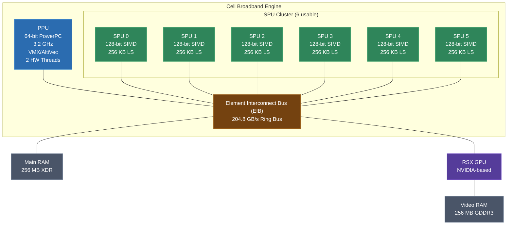
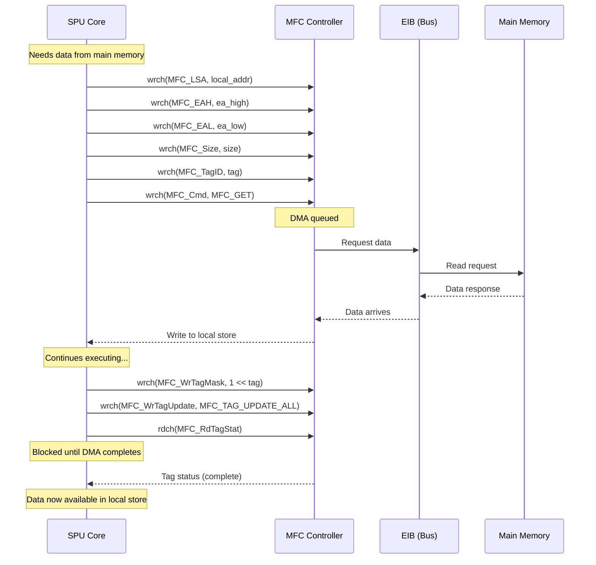
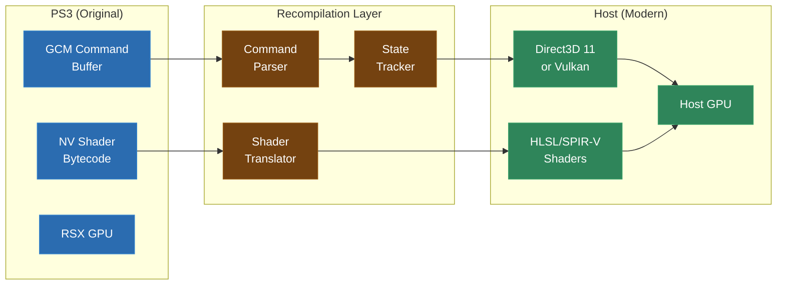
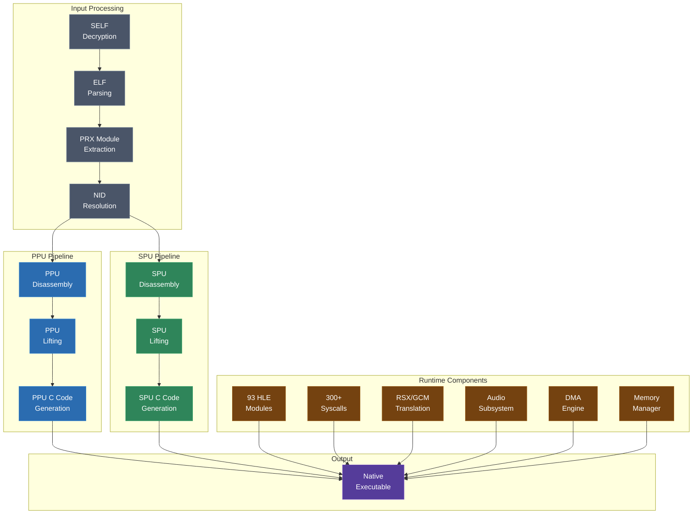

# Module 15: PS3 and Cell Broadband Engine

The PlayStation 3 represents the most architecturally complex target you will encounter in this course -- or, arguably, in the entire field of static recompilation. Its Cell Broadband Engine is a heterogeneous multiprocessor with two completely different instruction set architectures running simultaneously. Recompiling PS3 software means building two separate recompilation pipelines, implementing hundreds of high-level emulation functions, translating a proprietary graphics API, and coordinating all of it through a runtime that faithfully reproduces one of the most unusual memory and execution models ever shipped in a consumer device.

This module covers every aspect of that challenge. If you can recompile Cell, you can recompile anything.

---

## 1. The Cell Broadband Engine

The Cell Broadband Engine was designed jointly by Sony, Toshiba, and IBM. It shipped in the PlayStation 3 in 2006 and was, at the time, one of the most powerful processors available to consumers. Its design philosophy was radical: instead of multiple identical cores (as in the Xbox 360's Xenon), Cell paired one general-purpose core with multiple specialized compute cores, each with its own local memory.

### Architecture Overview

- **1 PPU (PowerPC Processing Unit)**: A 64-bit PowerPC core running at 3.2 GHz, with VMX (AltiVec) SIMD extensions. This is the main processor -- it runs the game's primary logic, manages threads, and orchestrates the SPUs. The PPU is dual-threaded (two hardware threads on one core).

- **6 usable SPUs (Synergistic Processing Units)**: Out of 8 physical SPUs on the die, 1 is reserved for the hypervisor and 1 is disabled for yield purposes, leaving 6 available to games. Each SPU is a 128-bit SIMD-only processor with 128 registers and a 256 KB local store. SPUs run a completely different instruction set from the PPU.

- **EIB (Element Interconnect Bus)**: A ring bus connecting the PPU, all SPUs, the memory controller, and the I/O interfaces. It provides 204.8 GB/s of aggregate bandwidth.

- **256 MB main RAM (XDR)** + **256 MB video RAM (GDDR3)**: Split memory architecture, with main RAM accessible to PPU and SPUs, and video RAM primarily used by the RSX GPU.



The key architectural fact for recompilation is this: **Cell is a dual-ISA processor**. PPU code is 64-bit PowerPC. SPU code is a completely different instruction set with different register files, different memory models, and different execution semantics. A PS3 recompiler must handle both.

---

## 2. SELF/ELF Parsing

PS3 executables are not plain ELF files. They are wrapped in a proprietary container called SELF (Signed ELF), which adds encryption, signing, and compression layers on top of the standard ELF format.

### The SELF Container

```
PS3 SELF File Layout
===================================================================

 Component          Description
-------------------------------------------------------------------
 SCE Header         Magic (0x53434500), version, key type, category
 App Info           Auth ID, vendor ID, application type
 ELF Header         Standard 64-bit ELF header (encrypted)
 Program Headers    ELF program headers (encrypted)
 Section Info       Per-segment encryption metadata
 SCE Version Info   SDK version, flags
 Control Info       Digest, NPDRM info (for PSN titles)
 Encrypted Data     The actual ELF segments (encrypted + compressed)
```

The decryption process works as follows:

1. Parse the SCE header to determine key revision and category (application, isolated SPU module, etc.)
2. Use the appropriate keyset to decrypt the metadata sections
3. Extract ELF headers and program headers
4. For each segment: decrypt with the segment-specific key, then decompress (zlib) if the compression flag is set
5. Reconstruct the plain ELF from the decrypted segments

For recompilation purposes, you need the decrypted ELF. Tools like `scetool` and `TrueAncestor` handle SELF decryption. The output is a standard 64-bit big-endian ELF that you can parse with the techniques from Module 2.

### PRX Modules

In addition to the main executable (EBOOT.BIN), PS3 games use PRX modules -- dynamically loaded libraries analogous to DLLs on Windows or shared objects on Linux. PRX files are also SELF-wrapped ELFs. A typical game loads dozens of PRX modules, both from its own distribution and from the system firmware.

Each PRX exports functions identified by NIDs (covered in Section 8) and may contain both PPU and SPU code. The recompiler must process every PRX that the game loads.

### Segment Types

PS3 ELFs use several segment types relevant to recompilation:

| Type | Value | Purpose |
|---|---|---|
| `PT_LOAD` | 1 | Loadable code/data segments |
| `PT_SCE_PPURELA` | 0x700000A4 | PPU relocation entries |
| `PT_SCE_SEGSYM` | 0x700000A8 | Segment symbols |
| `PT_SCE_COMMENT` | 0x6FFFFF00 | SCE-specific metadata |
| `PT_SCE_LIBIDENT` | 0x6FFFFF01 | Library identification |

---

## 3. PPU Recompilation

The PPU runs standard 64-bit PowerPC code with VMX (AltiVec) extensions. If you have completed Module 12 on PowerPC recompilation, much of this will be familiar -- but there are important differences.

### PPU vs. Xbox 360 PPC

| Feature | Xbox 360 (Xenon) | PS3 (PPU) |
|---|---|---|
| Word size | 64-bit | 64-bit |
| Cores | 3 symmetric cores | 1 core, 2 HW threads |
| SIMD | VMX128 (extended) | VMX (standard AltiVec) |
| Byte order | Big-endian | Big-endian |
| Privilege model | Hypervisor-based | Hypervisor-based (LV1/LV2) |
| Page table | Standard PPC HTAB | Standard PPC HTAB |

### Register Set

The PPU has the standard 64-bit PowerPC register file:

- **32 GPRs** (r0-r31): 64-bit general purpose
- **32 FPRs** (f0-f31): 64-bit floating point
- **128 VRs** (v0-v127): 128-bit VMX vector registers
- **CR**: Condition Register (8 x 4-bit fields)
- **LR, CTR**: Link Register, Count Register
- **XER**: Fixed-point exception register
- **FPSCR**: Floating-point status and control
- **SPRs**: Various special-purpose registers (TB, DEC, etc.)

### Lifting PPU Code

PPU instruction lifting follows the same patterns as Module 12:

```c
// PPU add instruction: add r3, r4, r5
ctx->r[3] = ctx->r[4] + ctx->r[5];

// PPU load word: lwz r3, 0x10(r4)
ctx->r[3] = (uint32_t)mem_read32(ctx->r[4] + 0x10);

// PPU VMX: vaddfp v3, v4, v5
ctx->v[3].f[0] = ctx->v[4].f[0] + ctx->v[5].f[0];
ctx->v[3].f[1] = ctx->v[4].f[1] + ctx->v[5].f[1];
ctx->v[3].f[2] = ctx->v[4].f[2] + ctx->v[5].f[2];
ctx->v[3].f[3] = ctx->v[4].f[3] + ctx->v[5].f[3];
```

The 64-bit address space is the main complication versus 32-bit PowerPC targets. All pointer arithmetic, memory accesses, and address calculations must use 64-bit types. The PS3's effective address space is 32-bit for user-mode games (addresses in the 0x00000000-0x3FFFFFFF range), but the underlying implementation is 64-bit and some system-level code uses the full range.

### Privilege and System State

PS3 games run under a two-level hypervisor:

- **LV1**: The hypervisor itself (highest privilege)
- **LV2**: The GameOS kernel (runs on top of LV1)
- **User mode**: Where games execute

For recompilation, you only need to handle user-mode code. System calls transition from user mode to LV2, which the runtime intercepts through the syscall table (Section 7).

---

## 4. SPU Recompilation -- The Hard Part

If PPU recompilation is a familiar exercise with 64-bit complications, SPU recompilation is an entirely different discipline. The SPU is not a general-purpose processor. It is a SIMD compute engine with a unique instruction set, a tiny local memory, and no direct access to main RAM. Recompiling SPU code is the single most technically challenging task in this course.

### The SPU Register File

The SPU has **128 registers**, each **128 bits** wide. There are no scalar registers. There are no separate integer and floating-point register files. Every register holds a 128-bit vector, and every instruction operates on 128-bit data.

When a game performs a "scalar" operation on the SPU -- say, adding two integers -- it is actually performing a 128-bit vector operation and extracting the result from the **preferred slot** (the leftmost 32-bit or 64-bit element, depending on the data type). This is a critical concept: the SPU has no notion of scalar types at the ISA level.

### The Local Store

Each SPU has exactly **256 KB of local store (LS)**. This is not a cache. It is the SPU's entire memory:

- Instructions are fetched from local store
- Data is read from and written to local store
- The stack lives in local store
- There is no virtual memory, no page table, no TLB
- Addresses are 18 bits (0x00000 to 0x3FFFF), wrapping at 256 KB

The SPU cannot access main RAM directly. The only way to move data between the local store and main memory is through DMA (Section 5).

### SPU Instruction Set

The SPU ISA has approximately 200 instructions. They operate exclusively on 128-bit registers and fall into several categories:

| Category | Examples | Description |
|---|---|---|
| Integer arithmetic | `a`, `ah`, `ai`, `sf` | Add/subtract words, halfwords |
| Floating point | `fa`, `fm`, `fma`, `fnms` | Single-precision vector math |
| Double precision | `dfa`, `dfm` | Double-precision vector math |
| Logical | `and`, `or`, `xor`, `nand` | Bitwise operations on 128-bit vectors |
| Shift/rotate | `shl`, `shlh`, `rot`, `rotm` | Per-element shifts and rotates |
| Shuffle | `shufb` | Arbitrary byte permutation |
| Compare | `ceq`, `cgt`, `clgt` | Element-wise comparison |
| Branch | `br`, `bra`, `bi`, `brsl` | Relative, absolute, indirect, with link |
| Channel | `rdch`, `wrch`, `rchcnt` | SPU channel I/O (DMA, events, etc.) |
| Load/store | `lqd`, `lqx`, `stqd`, `stqx` | 16-byte aligned quadword load/store |

### Translating SPU Instructions to C

SPU instructions map naturally to SSE/NEON intrinsics because both are 128-bit SIMD. Here are representative translations:

```c
// SPU: a rt, ra, rb  (add word elements)
// Adds four 32-bit integers element-wise
ctx->r[rt] = _mm_add_epi32(ctx->r[ra], ctx->r[rb]);

// SPU: fm rt, ra, rb  (floating multiply)
// Multiplies four single-precision floats
ctx->r[rt] = _mm_mul_ps(ctx->r[ra], ctx->r[rb]);

// SPU: fma rt, ra, rb, rc  (fused multiply-add)
// rt = ra * rb + rc, element-wise single-precision
ctx->r[rt] = _mm_add_ps(_mm_mul_ps(ctx->r[ra], ctx->r[rb]), ctx->r[rc]);

// SPU: shufb rt, ra, rb, rc  (shuffle bytes)
// Arbitrary byte permutation using rc as control mask
// This is the most powerful and most complex SPU instruction
ctx->r[rt] = spu_shufb(ctx->r[ra], ctx->r[rb], ctx->r[rc]);

// SPU: lqd rt, imm(ra)  (load quadword d-form)
// Loads 16 bytes from local store, address must be 16-byte aligned
uint32_t addr = (spu_extract_u32(ctx->r[ra], 0) + (imm << 4)) & 0x3FFF0;
ctx->r[rt] = *((__m128i*)(ctx->local_store + addr));

// SPU: bi ra  (branch indirect)
// Jump to address in preferred slot of ra
ctx->pc = spu_extract_u32(ctx->r[ra], 0) & 0x3FFFC;
```

### The shufb Problem

The `shufb` instruction deserves special attention. It performs an arbitrary byte-level permutation of two source vectors, controlled by a third vector that specifies, for each byte of the output, which byte of the input to select. It can also insert constant zero or 0xFF bytes.

`shufb` is the Swiss Army knife of the SPU. Games use it for:
- Byte swapping
- Vector element extraction and insertion
- Data format conversion
- Table lookups
- Implementing operations that other architectures have dedicated instructions for

Translating `shufb` efficiently is one of the key challenges of SPU recompilation. A naive implementation requires a 16-iteration byte loop. Optimized implementations use a combination of SSE `pshufb` (which handles most cases) with special handling for the constant-insertion modes.

---

## 5. DMA -- The SPU's Lifeline

Because the SPU cannot access main memory directly, all data exchange between an SPU and the rest of the system goes through DMA transfers managed by the MFC (Memory Flow Controller). Each SPU has its own MFC that processes DMA commands independently.

### MFC Commands

| Command | Opcode | Description |
|---|---|---|
| `MFC_GET` | 0x40 | Transfer from main memory to local store |
| `MFC_PUT` | 0x20 | Transfer from local store to main memory |
| `MFC_GETL` | 0x44 | List GET (scatter/gather from main memory) |
| `MFC_PUTL` | 0x24 | List PUT (scatter/gather to main memory) |
| `MFC_GETB` | 0x41 | GET with barrier |
| `MFC_PUTB` | 0x21 | PUT with barrier |
| `MFC_SNDSIG` | 0xA0 | Send signal to another SPU |

### DMA Transfer Parameters

Every DMA command requires:

- **Local store address**: Where in the 256 KB local store the data lives (or will go)
- **Effective address**: The main memory address (as seen by the PPU)
- **Size**: Transfer size in bytes (16 to 16,384, must be a multiple of 16)
- **Tag**: A 5-bit tag (0-31) used to track completion
- **Command opcode**: Which DMA operation to perform

### Alignment and Size Constraints

DMA transfers have strict requirements:

- Both the local store address and the effective address must be **16-byte aligned**
- Transfer size must be 1, 2, 4, 8, or a multiple of 16 bytes
- Maximum single transfer size: **16 KB**
- For transfers larger than 16 KB, use DMA lists (scatter/gather)

### DMA Flow



### Recompiling DMA

In the recompiled runtime, DMA operations become memory copies. The runtime maintains a simulated local store (a 256 KB buffer) for each SPU context. A `MFC_GET` becomes a `memcpy` from the host memory region corresponding to the effective address into the local store buffer. A `MFC_PUT` copies in the reverse direction.

The subtlety is in DMA completion semantics. On real hardware, DMA is asynchronous -- the SPU issues a DMA command and continues executing while the transfer happens in the background. The SPU later checks (or waits for) completion using tag masks. In a recompiled environment, you must decide whether to:

1. **Execute DMA synchronously**: Simplest approach. The `memcpy` happens immediately when the command is issued. Tag completion checks always succeed instantly. This works for most games.

2. **Simulate asynchronous DMA**: More accurate but more complex. Transfers are queued and executed on a separate thread or deferred until the SPU checks for completion. Required for games that overlap DMA with computation for performance.

---

## 6. The 93 HLE Modules

The PS3's system software (firmware) exposes functionality to games through approximately 93 modules. Each module is a PRX that provides a set of functions. When recompiling, you cannot run the original firmware modules -- they contain PPU and SPU code that itself would need to be recompiled, creating a chicken-and-egg problem. Instead, you provide **high-level emulation (HLE)** implementations: native code that reproduces the behavior of each firmware function.

### Critical HLE Modules

| Module | Function Count (approx.) | Purpose |
|---|---|---|
| `cellGcmSys` | 80+ | Graphics command buffer management (RSX/GCM) |
| `cellAudio` | 30+ | Audio output and mixing |
| `cellFs` | 40+ | Filesystem access |
| `cellSysutil` | 100+ | System utilities (save data, trophies, on-screen keyboard) |
| `cellGame` | 50+ | Game data management (title, version, content paths) |
| `cellSpurs` | 70+ | SPU task scheduling framework |
| `cellPngDec` | 15+ | PNG image decoding |
| `cellJpgDec` | 15+ | JPEG image decoding |
| `cellFont` | 40+ | Font rendering |
| `cellPad` | 20+ | Controller input |
| `cellKb` | 10+ | Keyboard input |
| `cellMouse` | 10+ | Mouse input |
| `cellNetCtl` | 15+ | Network control and status |
| `cellSysmodule` | 5+ | Module loading/unloading |
| `cellRtc` | 20+ | Real-time clock |
| `cellL10n` | 30+ | Localization and character encoding |
| `cellSync` | 20+ | Synchronization primitives (mutex, barrier, queue) |
| `cellSync2` | 25+ | Enhanced synchronization primitives |
| `cellResc` | 15+ | Resolution and scaling |
| `cellUsbd` | 20+ | USB device access |

### cellSpurs: The Scheduling Monster

`cellSpurs` deserves special mention because it is the most complex HLE module and one of the most common. SPURS (SPU Runtime System) is Sony's framework for scheduling tasks across SPUs. It provides:

- **Task sets**: Groups of tasks that share SPU resources
- **Job chains**: Sequences of SPU programs to execute
- **Work queues**: Producer-consumer queues for distributing work
- **Event flags**: Synchronization between PPU and SPU tasks

Most PS3 games use SPURS extensively. Reimplementing it requires understanding both the PPU-side API and the SPU-side kernel that SPURS loads onto SPUs. This is one of the largest single implementation efforts in any recompilation runtime.

---

## 7. 300+ Syscalls

Beyond the HLE modules, PS3 games make direct system calls to the LV2 kernel. There are over 300 defined syscalls, though a typical game uses a subset of 50-100. Each syscall is identified by a numeric ID.

### Key Syscall Categories

| Category | Examples | Description |
|---|---|---|
| Memory | `sys_memory_allocate` (348), `sys_memory_free` (349) | Heap memory management |
| Threading | `sys_ppu_thread_create` (41), `sys_ppu_thread_join` (44) | PPU thread lifecycle |
| Mutex | `sys_mutex_create` (100), `sys_mutex_lock` (101) | Mutual exclusion |
| Cond | `sys_cond_create` (105), `sys_cond_signal` (108) | Condition variables |
| RWLock | `sys_rwlock_create` (112), `sys_rwlock_rlock` (114) | Reader-writer locks |
| Event | `sys_event_queue_create` (128), `sys_event_queue_receive` (130) | Event queues |
| Semaphore | `sys_semaphore_create` (90), `sys_semaphore_wait` (91) | Counting semaphores |
| SPU | `sys_spu_thread_group_create` (170), `sys_spu_thread_write_ls` (181) | SPU management |
| Filesystem | `sys_fs_open` (801), `sys_fs_read` (802), `sys_fs_close` (804) | File I/O |
| Timer | `sys_timer_create` (70), `sys_time_get_system_time` (141) | Timing |
| PRX | `sys_prx_load_module` (480), `sys_prx_start_module` (484) | Dynamic module loading |
| TTY | `sys_tty_write` (403) | Debug output |

### Implementation Strategy

Some syscalls are straightforward translations to host OS calls:

```c
// sys_fs_open: translate to host fopen
int32_t sys_fs_open(PPUContext* ctx, const char* path, int flags, int* fd, int mode) {
    // Map PS3 path (/dev_hdd0/game/...) to host filesystem path
    std::string host_path = translate_path(path);

    // Map PS3 open flags to host flags
    int host_flags = translate_flags(flags);

    // Open on host
    int host_fd = open(host_path.c_str(), host_flags, mode);
    if (host_fd < 0) return CELL_ENOENT;

    // Assign a PS3 file descriptor
    *fd = allocate_ps3_fd(host_fd);
    return CELL_OK;
}
```

Others require significant reimplementation. The SPU thread management syscalls, for example, must create actual host threads, set up simulated local stores, and coordinate SPU execution with the PPU -- all while maintaining the correct synchronization semantics.

---

## 8. NID Resolution

PS3 module imports and exports are identified not by name strings but by **NIDs** (Name IDs) -- 32-bit hashes derived from the function name.

### NID Calculation

The NID for a function is computed as follows:

```
NID = first 4 bytes of SHA-1(function_name + suffix)
```

The suffix varies by firmware version and module. For most modules, the suffix is a known constant. For example:

```
Function: "cellGcmSetFlipMode"
SHA-1("cellGcmSetFlipMode" + suffix) = 0xA4 0x14 0xEC 0x22 ...
NID = 0xA414EC22
```

### The NID Database

To know what functions a game imports, you need a database mapping NIDs back to function names. This database is built from:

- Firmware analysis (extracting export tables from system PRX modules)
- SDK documentation and header files
- Community reverse engineering efforts
- The RPCS3 emulator's NID database (which is extensive)

A typical NID database contains 10,000+ entries. When the recompiler encounters an import with NID `0xA414EC22` from module `cellGcmSys`, it looks up the NID to determine that the game is calling `cellGcmSetFlipMode`, then routes the call to your HLE implementation of that function.

### Undocumented NIDs

Not all NIDs are documented. Some firmware functions were used by games but never appeared in public SDK headers. For these, you must:

1. Reverse engineer the firmware PRX to understand the function's behavior
2. Check the RPCS3 source for existing analysis
3. Use dynamic analysis (running the game in an emulator with logging) to observe what the function does
4. Assign a descriptive name and implement accordingly

---

## 9. Graphics: RSX/GCM Translation

The PS3's GPU is the RSX (Reality Synthesizer), an NVIDIA chip closely related to the GeForce 7800 GTX. Games access it through GCM (Graphics Command Manager), a low-level command buffer interface that is significantly more bare-metal than modern graphics APIs.

### GCM Command Buffers

Games write sequences of commands into a memory buffer that the RSX reads. These commands include:

- Setting render targets and viewports
- Binding textures and samplers
- Configuring blend, depth, and stencil state
- Setting vertex and fragment shader programs
- Issuing draw calls
- Executing GPU-side semaphore operations

The command buffer format uses NV-class method calls, inherited from NVIDIA's internal command format:

```
Command format: [method | subchannel | count] [data...]
- method: 13-bit register offset
- subchannel: 3-bit object binding
- count: 13-bit parameter count
```

### Shader Programs

RSX uses NVIDIA's proprietary shader bytecode format (NV fragment/vertex programs). These are not GLSL or HLSL -- they are a low-level ISA specific to the NV4x/G70 architecture:

- **Vertex programs**: NV vertex program ISA, register-based, up to 512 instructions
- **Fragment programs**: NV fragment program ISA, supports dependent texture reads, up to 1024 instructions

For recompilation, these shader programs must be translated to a modern shading language (HLSL for Direct3D, GLSL for Vulkan/OpenGL). This is itself a miniature recompilation problem: parsing the NV shader bytecode, lifting it to an intermediate representation, and emitting modern shader code.

### Graphics Pipeline Translation



### Key Translation Challenges

**Render target formats**: RSX supports surface formats that have no direct equivalent in modern APIs. Some require swizzling or format conversion at bind time.

**Fixed-function blending**: RSX has fixed-function blend modes inherited from the GeForce 7 series. Most map directly to D3D11/Vulkan blend states, but a few require shader-based workarounds.

**Tiled memory**: RSX can use tiled memory regions for render targets, where the GPU stores pixels in a cache-friendly tile pattern rather than linearly. The runtime must handle detiling when reading back render target contents.

**Zcull**: RSX has a hardware occlusion tracking system called Zcull that some games rely on for performance. Replicating its behavior requires careful use of the host GPU's occlusion query features.

---

## 10. Putting It All Together

Recompiling a PS3 game brings together every concept in this course -- and adds several more. The complete pipeline looks like this:



### Dual-ISA Compilation

The PPU and SPU pipelines run independently. PPU code is recompiled into C functions that operate on a PPU context structure. SPU code is recompiled into separate C functions that operate on SPU context structures (including the 256 KB local store). The two sets of generated code are compiled together but remain logically separate.

At runtime, PPU threads call into SPU code through the SPU thread management layer. When a PPU thread creates an SPU thread group and starts it, the runtime:

1. Allocates a simulated local store (256 KB buffer)
2. Loads the SPU ELF image into the local store
3. Creates a host thread for the SPU
4. Begins executing the recompiled SPU function on that host thread
5. Handles DMA requests from the SPU by copying data between the local store and the main memory buffer

### Memory Management

The runtime reproduces the PS3's split memory architecture:

- **256 MB main memory region**: Backed by a host allocation, mapped at a fixed base address. PPU code and SPU DMA both access this region.
- **256 MB video memory region**: Another host allocation, used by the graphics translation layer for render targets, textures, and command buffers.
- **SPU local stores**: One 256 KB allocation per active SPU context.

Memory allocation syscalls (`sys_memory_allocate`, `sys_memory_container_create`) manage regions within the 256 MB main memory space, using a simple allocator that tracks PS3 virtual addresses.

### The Scale

To put the PS3 recompilation effort in perspective:

| Component | Approximate Scope |
|---|---|
| PPU recompiler | Full 64-bit PPC + VMX instruction support |
| SPU recompiler | Full SPU ISA (~200 instructions) |
| HLE modules | ~93 modules, 1000+ total functions |
| Syscalls | 300+ implementations |
| Graphics | RSX command parser + NV shader translator |
| Audio | Multi-channel audio mixing and output |
| Input | Controller, keyboard, mouse support |
| Filesystem | Path translation, trophy support, save data |

This is the largest runtime of any static recompilation project. It dwarfs the N64 runtime (which has perhaps 50-100 HLE functions) by an order of magnitude. It is a team-scale effort, and projects like ps3recomp represent years of cumulative work.

But the architecture is the same one you have been learning throughout this course. It is the same pipeline -- parse, disassemble, lift, generate, runtime -- applied at greater scale and to more complex hardware. Every skill you have built in the preceding 14 modules applies here.

---

## What Comes Next

Labs 19 and 20 will put this knowledge into practice. Lab 19 focuses on SPU recompilation: you will recompile a small SPU program, implement DMA in your runtime, and verify correct execution. Lab 20 is a PPU + SPU integration exercise that brings both pipelines together with HLE stubs.

In Module 16, the capstone project, you will apply everything you have learned to a target of your choosing.
