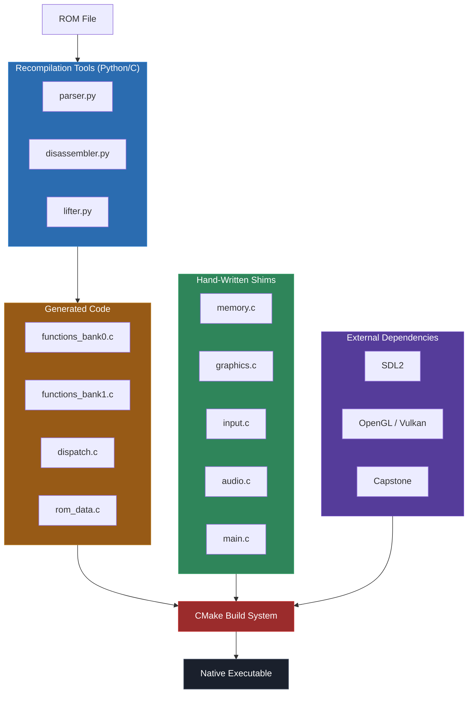

# Module 17: Build Systems, Linking, and Project Structure

A static recompilation project is not one program. It is at least three: the recompilation tools (parser, disassembler, lifter), the generated code (the C output from the lifter), and the runtime library (shims, memory system, graphics bridge, input handling). These three components are written in different ways, at different times, by different processes, and they all need to come together into a single executable that actually works.

The build system is what makes that happen. It is the part of your project that nobody wants to write, that nobody gets excited about, and that will cost you entire days of frustration if you get it wrong. It is also the part that determines whether your project is something only you can build on your specific machine, or something that anyone can clone and compile.

This module covers build systems for recompilation projects specifically. The problems you face are different from a typical C project: you have thousands of generated source files, you mix generated code with hand-written code, you need to manage external dependencies like SDL2 and Capstone, and you need to support debug builds with trace logging alongside optimized release builds. General-purpose CMake tutorials do not cover any of this.

---

## 1. Why Build Systems Matter for Recompilation

In a normal C project, you have some .c files, some .h files, and a Makefile or CMakeLists.txt that compiles them. The source files are all hand-written, they change when you edit them, and the build system's job is straightforward: compile what changed, link everything together.

A recompilation project is different in several important ways:

**You have generated code.** The lifter produces .c files -- potentially hundreds or thousands of them. These files are not hand-written; they are the output of a tool. They may be regenerated frequently as you improve the lifter. The build system must handle these files efficiently, because regenerating and recompiling thousands of files on every change is painfully slow.

**You have hand-written code that the generated code depends on.** The shim library (memory system, graphics bridge, input handling) is hand-written C that the generated code calls into. The generated code references functions like `mem_read_u8`, `graphics_present`, and `dispatch_call` that are defined in the shims. The build system must compile both and link them together.

**You may have external dependencies.** SDL2 for windowing and input. Capstone for disassembly (if your tools are in C). Platform-specific libraries for graphics APIs. These need to be found, included, and linked correctly.

**You need multiple build configurations.** A debug build with trace logging enabled, full symbol information, and no optimization (so you can step through generated code in a debugger). A release build with optimization, no logging, and stripped symbols. Possibly a test build with additional instrumentation.

**You want cross-platform support.** The whole point of static recompilation is running code on different hardware. Your build system should handle at least Windows and Linux, ideally macOS too.



The build system sits at the center of all of this. Get it right, and iteration is fast -- you change a shim, rebuild in seconds, and test. Get it wrong, and every change triggers a full rebuild that takes minutes, or worse, the build breaks on a platform you forgot to test.

---

## 2. CMake Fundamentals for Recompilation Projects

CMake is the de facto standard build system generator for C and C++ projects. Nearly every major recompilation project uses it: N64Recomp, the Zelda reverse-engineering projects (HackerSM64, Shipwright), and most homebrew toolchains. If you are going to work in this space, you need to know CMake.

I am not going to teach you all of CMake -- that would be its own course. Instead, I will cover the CMake concepts that matter specifically for recompilation projects.

### Targets

In CMake, a **target** is something that gets built. The two kinds you care about are:

- **Executables**: `add_executable(my_recomp ...)` -- your final recompiled binary.
- **Libraries**: `add_library(shims STATIC ...)` -- collections of object files that get linked into the executable.

For a recompilation project, I recommend splitting your code into at least two targets: a static library for the generated code, and the final executable that links the library, shims, and dependencies.

```cmake
# Generated code as a static library
add_library(generated_code STATIC
    generated/functions_bank0.c
    generated/functions_bank1.c
    generated/dispatch.c
    generated/rom_data.c
)

# Shim library
add_library(shims STATIC
    shims/memory.c
    shims/graphics.c
    shims/input.c
    shims/audio.c
)

# Final executable
add_executable(recomp runtime/main.c)
target_link_libraries(recomp PRIVATE generated_code shims SDL2::SDL2)
```

Why separate libraries? Two reasons. First, you can apply different compile flags to each: the generated code gets `-O2` because it is large and benefits from optimization, while the shim code stays at the default for the build type so you can debug it easily. Second, CMake only recompiles the library that changed -- if you modify a shim, only the shims library recompiles, and the generated code library is relinked from its cached object files.

### Include Directories

Generated code needs to find shim headers (for `mem_read_u8`, etc.), and shims need to find generated headers (for function declarations, dispatch tables):

```cmake
target_include_directories(generated_code PRIVATE
    ${CMAKE_SOURCE_DIR}/shims
    ${CMAKE_SOURCE_DIR}/generated
)

target_include_directories(shims PRIVATE
    ${CMAKE_SOURCE_DIR}/shims
    ${CMAKE_SOURCE_DIR}/generated
    ${SDL2_INCLUDE_DIRS}
)
```

The `PRIVATE` keyword means these include paths apply only to the specified target, not to anything that links against it. For most recompilation projects, `PRIVATE` is what you want.

### Compile Definitions

Build-time defines control behavior like trace logging:

```cmake
# Debug builds get trace logging
target_compile_definitions(generated_code PRIVATE
    $<$<CONFIG:Debug>:TRACE_ENABLED=1>
    $<$<CONFIG:Debug>:TRACE_VERBOSE=1>
)

target_compile_definitions(shims PRIVATE
    $<$<CONFIG:Debug>:TRACE_ENABLED=1>
)
```

The `$<$<CONFIG:Debug>:...>` syntax is a CMake generator expression. It means "only apply this definition when building in Debug configuration." In Release builds, `TRACE_ENABLED` is not defined, so all your `#ifdef TRACE_ENABLED` blocks compile to nothing.

### Finding Dependencies

SDL2 is the most common dependency for recompilation projects. CMake finds it differently depending on the platform:

```cmake
# Modern CMake: use find_package with CONFIG mode
find_package(SDL2 REQUIRED)

# If that fails (older SDL2 installations), try module mode
if(NOT TARGET SDL2::SDL2)
    find_package(SDL2 REQUIRED MODULE)
endif()

# Link against SDL2
target_link_libraries(recomp PRIVATE SDL2::SDL2)

# On Windows, you may also need SDL2main for the WinMain entry point
if(WIN32)
    target_link_libraries(recomp PRIVATE SDL2::SDL2main)
endif()
```

If CMake cannot find SDL2, you will get an error like "Could not find package SDL2." On Windows, the fix is usually to set `SDL2_DIR` to point at your SDL2 development library installation:

```bash
cmake -DSDL2_DIR=C:/libs/SDL2-2.28.5/cmake ..
```

On Linux, install the development package (`sudo apt install libsdl2-dev` on Debian/Ubuntu, `sudo dnf install SDL2-devel` on Fedora). On macOS, `brew install sdl2`.

---

## 3. Organizing a Recompilation Project

Project structure is one of those things that seems unimportant until you are six months in, have 200 files, and cannot find anything. Here is the structure I recommend, based on what works in real recompilation projects:

```
project-root/
├── CMakeLists.txt              # Top-level build configuration
├── README.md                   # How to build and run
├── .gitignore                  # Ignore build/, generated/ (maybe), *.o, etc.
│
├── tools/                      # Recompilation pipeline tools
│   ├── parser.py               # Binary format parser
│   ├── disassembler.py         # ISA disassembler
│   ├── cfg_builder.py          # Control flow graph recovery
│   ├── lifter.py               # ISA-to-C lifter
│   └── generate.py             # Master script: runs the full pipeline
│
├── generated/                  # Output from the lifter (machine-produced C)
│   ├── CMakeLists.txt          # Build rules for generated code
│   ├── functions.h             # Declarations of all lifted functions
│   ├── functions_bank0.c       # Lifted functions from ROM bank 0
│   ├── functions_bank1.c       # Lifted functions from ROM bank 1
│   ├── dispatch.c              # Indirect call dispatch table
│   └── rom_data.c              # Constant data extracted from ROM
│
├── shims/                      # Hand-written runtime library
│   ├── CMakeLists.txt          # Build rules for shim library
│   ├── cpu_context.h           # CPU state structure definition
│   ├── memory.h / memory.c     # Memory system (RAM, ROM, MMIO)
│   ├── graphics.h / graphics.c # Display output (SDL2)
│   ├── input.h / input.c       # Controller/keyboard input
│   ├── audio.h / audio.c       # Audio output (stub or real)
│   ├── timer.h / timer.c       # Timing and synchronization
│   └── platform.h              # Platform abstraction macros
│
├── runtime/                    # Application entry point and glue
│   ├── CMakeLists.txt
│   └── main.c                  # Initializes everything, starts execution
│
├── assets/                     # Non-code resources
│   └── (ROM files, test inputs, reference screenshots)
│
├── tests/                      # Test infrastructure
│   ├── trace_compare.py        # Compare recomp traces vs emulator
│   ├── screenshot_diff.py      # Pixel-diff screenshots
│   └── test_functions.c        # Unit tests for individual lifted functions
│
└── build/                      # Build output (gitignored)
    ├── Debug/
    └── Release/
```

### Why This Structure

**tools/ is separate from the compiled code.** Your recompilation tools (parser, disassembler, lifter) are build-time tools. They run before the C compiler, not as part of the C compilation. Keeping them in their own directory makes this clear. Some projects put tools in a `scripts/` directory instead -- the name does not matter, the separation does.

**generated/ contains only machine-produced files.** Nothing in this directory is hand-edited. If you find yourself editing a file in `generated/`, you are doing it wrong -- the edit should be in the lifter, which then regenerates the output. This discipline ensures that the pipeline is always reproducible: run the tools, get the same generated code.

Some projects gitignore the generated directory entirely (regenerate on build). Others commit it (so the project can be built without running the tools). Both approaches work. Committing generated code makes the project easier to build from a clone but creates noisy diffs. Gitignoring it keeps the repo clean but requires running the pipeline before building. For a mini-project or early-stage project, I lean toward committing the generated code. For a mature project with CI, gitignore it and regenerate in the build pipeline.

**shims/ is the hand-written runtime.** This is where most of your development time goes, and it changes frequently. Keeping it separate from generated code means you can recompile just the shims (fast) without touching the generated code (slow to recompile).

**runtime/ contains only the entry point.** The `main()` function and any top-level glue code. This is typically a small file that initializes subsystems and calls the lifted entry point. Keeping it separate avoids mixing infrastructure code with shim implementations.

**assets/ holds non-code files.** ROM files (gitignored if commercial), reference screenshots for testing, input recordings for replay testing. Keeping these out of the source tree avoids accidentally including multi-megabyte binaries in your compile commands.

**tests/ holds everything related to testing.** Trace comparison scripts, screenshot diffing tools, unit test harnesses. Separate from the shims so that test code does not accidentally end up in the release binary.

### Subdirectory CMakeLists.txt

With subdirectories, the top-level CMakeLists.txt becomes a coordinator:

```cmake
# Top-level CMakeLists.txt
cmake_minimum_required(VERSION 3.16)
project(my-recomp C)

set(CMAKE_C_STANDARD 11)
set(CMAKE_C_STANDARD_REQUIRED ON)

# Find dependencies
find_package(SDL2 REQUIRED)

# Add subdirectories
add_subdirectory(generated)
add_subdirectory(shims)
add_subdirectory(runtime)
```

Each subdirectory has its own CMakeLists.txt:

```cmake
# generated/CMakeLists.txt
add_library(generated_code STATIC
    functions_bank0.c
    functions_bank1.c
    dispatch.c
    rom_data.c
)

target_include_directories(generated_code PUBLIC
    ${CMAKE_CURRENT_SOURCE_DIR}
)

target_include_directories(generated_code PRIVATE
    ${CMAKE_SOURCE_DIR}/shims
)

# Generated code benefits from optimization even in debug builds
if(CMAKE_C_COMPILER_ID MATCHES "GNU|Clang")
    target_compile_options(generated_code PRIVATE -O2)
elseif(MSVC)
    target_compile_options(generated_code PRIVATE /O2)
endif()

# Trace logging in debug builds
target_compile_definitions(generated_code PRIVATE
    $<$<CONFIG:Debug>:TRACE_ENABLED=1>
)
```

```cmake
# shims/CMakeLists.txt
add_library(shims STATIC
    memory.c
    graphics.c
    input.c
    audio.c
    timer.c
)

target_include_directories(shims PUBLIC
    ${CMAKE_CURRENT_SOURCE_DIR}
)

target_link_libraries(shims PUBLIC SDL2::SDL2)

target_compile_definitions(shims PRIVATE
    $<$<CONFIG:Debug>:TRACE_ENABLED=1>
)
```

```cmake
# runtime/CMakeLists.txt
add_executable(recomp main.c)

target_link_libraries(recomp PRIVATE
    generated_code
    shims
)

# On Windows, SDL2main provides WinMain
if(WIN32)
    target_link_libraries(recomp PRIVATE SDL2::SDL2main)
endif()
```

---

## 4. Compiling Generated C: Handling Thousands of Files

When you recompile a large ROM -- say, a 2MB N64 game with 5,000 functions -- the lifter may produce hundreds or thousands of .c files. Compiling all of them is slow. Recompiling all of them on every change is slower. This section covers strategies for managing large generated codebases.

### The Problem

Consider a game with 3,000 lifted functions. If each function goes in its own .c file (which is the simplest approach for the lifter), that is 3,000 compilation units. On a fast machine with parallel compilation, this might take 2-3 minutes. On a slower machine, 10 minutes. Every time you regenerate (because you fixed a lifter bug), all 3,000 files change and all 3,000 need recompilation.

### Strategy 1: Group Functions into Files

Instead of one function per file, group functions by their original address range, by ROM bank, or by call graph proximity:

```python
# In your lifter: group functions into files of ~100 functions each
def write_grouped_files(functions, output_dir, functions_per_file=100):
    for i in range(0, len(functions), functions_per_file):
        group = functions[i:i+functions_per_file]
        filename = f"functions_{i:05d}.c"
        with open(os.path.join(output_dir, filename), 'w') as f:
            f.write('#include "functions.h"\n')
            f.write('#include "memory.h"\n')
            f.write('#include "cpu_context.h"\n\n')
            for func in group:
                f.write(func.to_c())
                f.write('\n\n')
```

Grouping by ROM bank is natural for banked architectures (Game Boy, NES, SNES):

```python
# Group by ROM bank
def write_banked_files(functions, output_dir):
    banks = {}
    for func in functions:
        bank = func.address // BANK_SIZE
        banks.setdefault(bank, []).append(func)

    for bank_num, bank_funcs in sorted(banks.items()):
        filename = f"functions_bank{bank_num:02d}.c"
        with open(os.path.join(output_dir, filename), 'w') as f:
            f.write('#include "functions.h"\n')
            f.write('#include "memory.h"\n\n')
            for func in bank_funcs:
                f.write(func.to_c())
                f.write('\n\n')
```

Grouping reduces the number of compilation units from thousands to tens or hundreds, which speeds up the build significantly. The tradeoff is that changing one function forces recompilation of its entire group. But since all generated files change together anyway (when you regenerate), this tradeoff costs nothing.

### Strategy 2: Unity Builds

A **unity build** (also called a jumbo build or amalgamation) takes grouping to its logical extreme: combine all generated files into one compilation unit.

```c
// generated/unity_build.c
#include "functions_bank00.c"
#include "functions_bank01.c"
#include "functions_bank02.c"
#include "functions_bank03.c"
// ... every generated .c file
#include "dispatch.c"
#include "rom_data.c"
```

Yes, you `#include` .c files. It feels wrong, but it is a well-established technique used by SQLite (the "amalgamation"), the Lua reference implementation, and many game engines.

Benefits:
- **One compilation unit means one compiler invocation.** No per-file overhead (opening files, parsing headers, initializing the optimizer).
- **The compiler can see all functions at once**, enabling cross-function inlining and better optimization of the generated code.
- **Link time is essentially zero** because there is only one object file for the generated code.

Drawbacks:
- **Any change recompiles everything.** For generated code that changes as a unit, this is not a problem. For hand-written code, it would be terrible.
- **Memory usage during compilation can be extreme.** Compiling a unity build with 100,000 lines of generated C may need several gigabytes of RAM.
- **Compilation errors are harder to locate** because the compiler reports line numbers in the unity file, not in the original source file. Using `#line` directives mitigates this.

CMake 3.16+ has built-in unity build support:

```cmake
# Enable unity build for generated code
set_target_properties(generated_code PROPERTIES
    UNITY_BUILD ON
    UNITY_BUILD_BATCH_SIZE 50  # Combine up to 50 files per unity chunk
)
```

This is a good default for recompilation projects. It gives you most of the speed benefit without the extreme memory usage of a single compilation unit.

### Strategy 3: Precompiled Headers

If your generated code includes the same headers in every file (it does -- `cpu_context.h`, `memory.h`, `functions.h`), a precompiled header avoids reparsing them for each compilation unit:

```cmake
# Precompile the common header
target_precompile_headers(generated_code PRIVATE
    shims/cpu_context.h
    shims/memory.h
    generated/functions.h
)
```

On GCC and Clang, this saves significant time -- parsing a complex header once instead of 3,000 times. On MSVC, the benefit is usually smaller because MSVC already has efficient header caching.

### Strategy 4: Parallel Compilation

Make sure you are using parallel compilation. CMake does not do this by default with the `make` generator:

```bash
# Build with 8 parallel jobs
cmake --build build --parallel 8

# Or set this in your CMakeLists.txt
set(CMAKE_BUILD_PARALLEL_LEVEL 8)
```

With Ninja (the best generator for build speed), parallelism is automatic:

```bash
# Use the Ninja generator instead of Makefiles
cmake -G Ninja -B build
cmake --build build
```

Ninja is faster than Make for large projects because it has lower per-job overhead and better dependency tracking. If you are not already using Ninja, switch now. The difference on a project with hundreds of source files is dramatic.

### Practical Recommendations

For a mini-project (under 100 functions): do not worry about build performance. One file per bank or one big file is fine. Builds will take seconds either way.

For a medium project (100-1,000 functions): group into files of 50-100 functions, use Ninja, enable parallel builds. Builds should take under 30 seconds.

For a large project (1,000+ functions): use unity builds, precompiled headers, and Ninja. Consider splitting the generated code into multiple static libraries (one per ROM segment) so that incremental rebuilds only recompile the changed segment.

| Project Size | Functions | Strategy | Expected Build Time |
|---|---|---|---|
| Mini (Game Boy) | 20-100 | One file per bank | 2-5 seconds |
| Medium (NES/GBA) | 100-1,000 | Grouped files + Ninja | 10-30 seconds |
| Large (N64/Xbox) | 1,000-10,000 | Unity build + PCH + Ninja | 30-120 seconds |
| Huge (PS3) | 10,000+ | Segmented unity + PCH + Ninja | 2-10 minutes |

---

## 5. Unity Builds in Depth

Unity builds deserve a deeper look because they are genuinely transformative for recompilation projects and they are not widely understood outside of the game development world.

### How It Works

The compiler processes source files one at a time (one "translation unit" per .c file). Each translation unit starts from scratch: it parses all included headers, builds a symbol table, and generates code. For a project with 500 generated .c files that all include the same 5 headers, that means parsing those headers 500 times.

A unity build combines multiple .c files into one translation unit by including them from a master file. The headers are parsed once, and all the functions are compiled together.

```c
// generated/unity_all.c
// This file is the single compilation unit for all generated code

// Common headers -- parsed once
#include "cpu_context.h"
#include "memory.h"
#include "functions.h"

// All generated source files
#include "functions_bank00.c"
#include "functions_bank01.c"
#include "functions_bank02.c"
// ...
```

### Practical Issues

**Static symbol collisions.** If two .c files both define a `static` function or variable with the same name, combining them into one translation unit creates a conflict. In generated code, this is easy to avoid -- your lifter controls the naming. Use the original address in every name (`static uint32_t temp_0x1234`, not `static uint32_t temp`).

**Macro pollution.** If one .c file defines a macro that affects a later file, you get unexpected behavior. Again, generated code should avoid this -- do not define macros in generated .c files. Put all macros in headers.

**Error messages.** When the compiler reports an error on line 8432 of `unity_all.c`, you need to figure out which original file that corresponds to. Using `#line` directives in the unity file fixes this:

```c
// In your lifter or unity build generator:
#line 1 "functions_bank00.c"
// ... contents of functions_bank00.c ...
#line 1 "functions_bank01.c"
// ... contents of functions_bank01.c ...
```

CMake's built-in unity build support handles the `#line` directives automatically.

### When to Use Unity Builds

- **Always use** for generated code in release builds. The optimization benefit alone (cross-function visibility for the compiler) justifies it.
- **Consider using** for generated code in debug builds. It is faster to compile, but debugging can be harder because the debugger shows the unity file rather than individual source files.
- **Never use** for hand-written shim code during development. You want fast incremental builds when you change a single shim file, and a unity build would recompile all shims on every change.

---

## 6. Linking Generated Code Against Shim Libraries

Linking is where the generated code and the shim library come together. The linker resolves every function call in the generated code to an actual implementation -- whether that implementation is another generated function or a hand-written shim.

### Symbol Resolution

When the generated code calls `mem_read_u8(addr)`, the compiler emits a reference to the symbol `mem_read_u8`. The linker must find a definition of that symbol somewhere in the linked libraries. If it cannot, you get an "undefined reference" error.

The most common linking errors in a recompilation project:

**1. Missing shim function:**
```
undefined reference to `mem_read_u8'
```
You forgot to compile memory.c, or you forgot to link the shims library. Fix: check your CMakeLists.txt.

**2. Missing generated function:**
```
undefined reference to `func_0x1234'
```
The dispatch table references a function that the lifter did not generate -- maybe it is in a ROM bank you did not lift, or the lifter skipped it because it could not determine the function boundary. Fix: either lift the missing function or add a stub.

**3. Duplicate symbol:**
```
multiple definition of `func_0x1000'
```
Two generated files both define the same function. This happens if your lifter generates overlapping files or if you accidentally included the same file twice. Fix: check your lifter's file generation logic.

**4. Missing library:**
```
undefined reference to `SDL_CreateWindow'
```
SDL2 is not linked. Fix: add `target_link_libraries(recomp PRIVATE SDL2::SDL2)` to your CMakeLists.txt.

### Stub Generation for Missing Functions

When you are developing incrementally, you will have generated code that calls functions you have not lifted yet. Rather than fixing every undefined reference by hand, generate stubs automatically:

```python
# In your lifter: generate stubs for all known-but-not-yet-lifted functions
def generate_stubs(all_known_addresses, lifted_addresses, output_file):
    missing = all_known_addresses - lifted_addresses
    with open(output_file, 'w') as f:
        f.write('#include "cpu_context.h"\n')
        f.write('#include <stdio.h>\n\n')
        for addr in sorted(missing):
            f.write(f'void func_0x{addr:04X}(CPUContext *ctx) {{\n')
            f.write(f'    #ifdef TRACE_ENABLED\n')
            f.write(f'    fprintf(stderr, "STUB: func_0x{addr:04X} called\\n");\n')
            f.write(f'    #endif\n')
            f.write(f'}}\n\n')
```

Add `stubs.c` to your generated code library, and every undefined reference disappears. As you lift more functions, the stubs file shrinks. Eventually, it is empty.

### Link Order

On most modern linkers (especially on Windows with MSVC), link order does not matter. But on older GCC/binutils setups, the order you list libraries matters:

```cmake
# Libraries should be listed in dependency order:
# recomp depends on generated_code and shims
# generated_code depends on shims (calls mem_read, etc.)
# shims depends on SDL2
target_link_libraries(recomp PRIVATE
    generated_code
    shims
    SDL2::SDL2
)
```

If you get mysterious undefined references that go away when you reorder libraries, add `--start-group` / `--end-group` to the linker flags:

```cmake
if(CMAKE_C_COMPILER_ID MATCHES "GNU")
    target_link_options(recomp PRIVATE
        "LINKER:--start-group"
        generated_code
        shims
        "LINKER:--end-group"
    )
endif()
```

This tells the linker to make multiple passes through the libraries until all symbols are resolved, regardless of order.

---

## 7. Cross-Platform Builds

A recompilation project that only builds on your machine is a recompilation project that only you can use. Cross-platform support is not just nice-to-have -- it is core to the mission. The original code ran on one platform; the recompiled code should run on many.

### Platform Abstraction in CMake

CMake provides variables that tell you what platform you are building for:

```cmake
if(WIN32)
    # Windows-specific settings
    target_compile_definitions(shims PRIVATE PLATFORM_WINDOWS=1)
    target_link_libraries(recomp PRIVATE winmm)  # Windows multimedia library
elseif(APPLE)
    # macOS-specific settings
    target_compile_definitions(shims PRIVATE PLATFORM_MACOS=1)
    find_library(COCOA_LIB Cocoa)
    target_link_libraries(recomp PRIVATE ${COCOA_LIB})
elseif(UNIX)
    # Linux/BSD settings
    target_compile_definitions(shims PRIVATE PLATFORM_LINUX=1)
    target_link_libraries(recomp PRIVATE pthread m)  # pthreads and math library
endif()
```

### Platform Abstraction in C

Your shim code should isolate platform-specific code behind a thin abstraction layer:

```c
// shims/platform.h
#pragma once

#ifdef PLATFORM_WINDOWS
    #define WIN32_LEAN_AND_MEAN
    #include <windows.h>
    typedef LARGE_INTEGER PlatformTimer;
#elif defined(PLATFORM_LINUX) || defined(PLATFORM_MACOS)
    #include <time.h>
    typedef struct timespec PlatformTimer;
#endif

// Platform-independent timing API
void platform_timer_start(PlatformTimer *timer);
double platform_timer_elapsed_ms(PlatformTimer *timer);
uint64_t platform_get_ticks_ms(void);
void platform_sleep_ms(uint32_t ms);
```

```c
// shims/platform.c
#include "platform.h"

#ifdef PLATFORM_WINDOWS
void platform_timer_start(PlatformTimer *timer) {
    QueryPerformanceCounter(timer);
}

double platform_timer_elapsed_ms(PlatformTimer *timer) {
    LARGE_INTEGER now, freq;
    QueryPerformanceCounter(&now);
    QueryPerformanceFrequency(&freq);
    return (double)(now.QuadPart - timer->QuadPart) * 1000.0 / (double)freq.QuadPart;
}

uint64_t platform_get_ticks_ms(void) {
    return GetTickCount64();
}

void platform_sleep_ms(uint32_t ms) {
    Sleep(ms);
}
#else
void platform_timer_start(PlatformTimer *timer) {
    clock_gettime(CLOCK_MONOTONIC, timer);
}

double platform_timer_elapsed_ms(PlatformTimer *timer) {
    struct timespec now;
    clock_gettime(CLOCK_MONOTONIC, &now);
    return (now.tv_sec - timer->tv_sec) * 1000.0 +
           (now.tv_nsec - timer->tv_nsec) / 1000000.0;
}

uint64_t platform_get_ticks_ms(void) {
    struct timespec ts;
    clock_gettime(CLOCK_MONOTONIC, &ts);
    return (uint64_t)ts.tv_sec * 1000 + ts.tv_nsec / 1000000;
}

void platform_sleep_ms(uint32_t ms) {
    struct timespec ts = { ms / 1000, (ms % 1000) * 1000000 };
    nanosleep(&ts, NULL);
}
#endif
```

SDL2 already abstracts most platform differences for windowing, input, and audio. Use it. Do not write your own windowing code unless SDL2 genuinely cannot do what you need. The platform abstraction layer above is for things SDL2 does not cover (high-resolution timing, file system paths, etc.).

### Compiler-Specific Settings

GCC, Clang, and MSVC have different flags. CMake lets you handle this cleanly:

```cmake
# Warning flags
if(MSVC)
    target_compile_options(shims PRIVATE /W4)
    target_compile_options(generated_code PRIVATE /W2)  # Generated code is noisy
else()
    target_compile_options(shims PRIVATE -Wall -Wextra -Wpedantic)
    target_compile_options(generated_code PRIVATE -Wall -Wno-unused-variable -Wno-unused-but-set-variable)
endif()

# Optimization for generated code
if(MSVC)
    target_compile_options(generated_code PRIVATE /O2)
else()
    target_compile_options(generated_code PRIVATE -O2)
endif()
```

Note the selective warning suppression for generated code: `-Wno-unused-variable` and `-Wno-unused-but-set-variable` suppress warnings that are common in generated code (temporary variables for flag computations that the compiler might optimize away, registers that are written but not read before the function returns). You do NOT want to suppress these warnings for hand-written shim code.

### Testing Cross-Platform Builds

If you develop on Windows, test on Linux (and vice versa). The easiest way is a GitHub Actions workflow that builds on both:

```yaml
# .github/workflows/build.yml
name: Build
on: [push, pull_request]

jobs:
  build:
    strategy:
      matrix:
        os: [ubuntu-latest, windows-latest, macos-latest]
    runs-on: ${{ matrix.os }}

    steps:
      - uses: actions/checkout@v4

      - name: Install SDL2 (Ubuntu)
        if: matrix.os == 'ubuntu-latest'
        run: sudo apt-get install -y libsdl2-dev

      - name: Install SDL2 (macOS)
        if: matrix.os == 'macos-latest'
        run: brew install sdl2

      - name: Configure
        run: cmake -B build -DCMAKE_BUILD_TYPE=Release

      - name: Build
        run: cmake --build build --parallel
```

This catches platform-specific issues before they reach anyone else. It is an hour of setup that saves days of "works on my machine" debugging.

---

## 8. Dependency Management

Beyond SDL2, recompilation projects often depend on other libraries. Here is how to manage them.

### SDL2

SDL2 is the workhorse dependency. It provides windowing, input, audio output, and basic 2D rendering. Nearly every recompilation project uses it.

```cmake
find_package(SDL2 REQUIRED)
target_link_libraries(recomp PRIVATE SDL2::SDL2)
```

On Windows, you have two options for providing SDL2:
1. **Download the development libraries** from libsdl.org and point `SDL2_DIR` at them.
2. **Use vcpkg**: `vcpkg install sdl2` and then `cmake -DCMAKE_TOOLCHAIN_FILE=<vcpkg>/scripts/buildsystems/vcpkg.cmake ...`

### Capstone (Disassembly Library)

If your recompilation tools are in C/C++ rather than Python, Capstone provides multi-architecture disassembly:

```cmake
find_package(capstone REQUIRED)
target_link_libraries(my_disassembler PRIVATE capstone::capstone)
```

For Python tools, `pip install capstone` is all you need.

### OpenGL / Vulkan (Advanced Graphics)

For targets that need 3D graphics translation (N64, PS1, GameCube), you will need a graphics API:

```cmake
# OpenGL
find_package(OpenGL REQUIRED)
target_link_libraries(recomp PRIVATE OpenGL::GL)

# Or if using GLEW for extension loading
find_package(GLEW REQUIRED)
target_link_libraries(recomp PRIVATE GLEW::GLEW OpenGL::GL)
```

For the mini-project and simple targets, SDL2's built-in 2D rendering is sufficient. You do not need OpenGL or Vulkan for 2D tile-based systems.

### FetchContent: Downloading Dependencies at Build Time

CMake's `FetchContent` module can download and build dependencies automatically:

```cmake
include(FetchContent)

# Download SDL2 if not found
FetchContent_Declare(
    SDL2
    GIT_REPOSITORY https://github.com/libsdl-org/SDL.git
    GIT_TAG release-2.28.5
)
FetchContent_MakeAvailable(SDL2)

target_link_libraries(recomp PRIVATE SDL2::SDL2)
```

This is convenient for reproducible builds -- anyone who clones your repo gets the exact same SDL2 version without manual installation. The downside is that it adds time to the first build (downloading and compiling SDL2 from source) and increases your build directory size.

### Vendoring (Including Dependencies in Your Repo)

Some projects include small dependencies directly in their repository (called "vendoring"):

```
project-root/
├── third_party/
│   ├── miniaudio/          # Single-header audio library
│   │   └── miniaudio.h
│   ├── stb/                # stb single-header libraries
│   │   ├── stb_image.h
│   │   └── stb_image_write.h
│   └── cJSON/              # JSON parser (for config files)
│       ├── cJSON.h
│       └── cJSON.c
```

This works well for small, single-file libraries. Do not vendor large libraries like SDL2 -- use `find_package` or `FetchContent` instead.

---

## 9. Build Configurations

A recompilation project needs at least three build configurations, each serving a different purpose.

### Debug

The debug build is for development and debugging. It enables trace logging, keeps full debug symbols, and minimizes optimization of hand-written code:

```cmake
# These are typically set by CMAKE_BUILD_TYPE=Debug, but you can customize:
target_compile_definitions(recomp PRIVATE
    $<$<CONFIG:Debug>:TRACE_ENABLED=1>
    $<$<CONFIG:Debug>:DEBUG_ASSERTS=1>
    $<$<CONFIG:Debug>:MMIO_LOG_READS=1>
    $<$<CONFIG:Debug>:MMIO_LOG_WRITES=1>
)
```

In a debug build, your trace logging is active:

```c
#ifdef TRACE_ENABLED
#define TRACE_FUNC(name, ctx) do { \
    fprintf(trace_file, "TRACE %s: A=%02X F=%02X BC=%04X DE=%04X HL=%04X SP=%04X\n", \
        name, (ctx)->a, (ctx)->f, REG_BC(ctx), REG_DE(ctx), REG_HL(ctx), (ctx)->sp); \
} while(0)
#else
#define TRACE_FUNC(name, ctx) ((void)0)
#endif
```

Even in debug mode, the generated code should be compiled with `-O1` or `-O2`. Unoptimized generated code is extremely slow (it does thousands of memory accesses and flag computations per frame), and debugging generated code at `-O0` is not useful anyway -- you debug by trace comparison, not by stepping through the generated C.

### Release

The release build is for distribution and performance testing. Full optimization, no logging, stripped symbols:

```cmake
target_compile_definitions(recomp PRIVATE
    $<$<CONFIG:Release>:NDEBUG>
)

# Release-specific optimization
if(CMAKE_C_COMPILER_ID MATCHES "GNU|Clang")
    target_compile_options(recomp PRIVATE
        $<$<CONFIG:Release>:-O3>
        $<$<CONFIG:Release>:-flto>     # Link-time optimization
    )
    target_link_options(recomp PRIVATE
        $<$<CONFIG:Release>:-flto>
    )
elseif(MSVC)
    target_compile_options(recomp PRIVATE
        $<$<CONFIG:Release>:/O2>
        $<$<CONFIG:Release>:/GL>       # Whole program optimization
    )
    target_link_options(recomp PRIVATE
        $<$<CONFIG:Release>:/LTCG>     # Link-time code generation
    )
endif()
```

Link-time optimization (LTO) is particularly valuable for recompilation projects because it lets the compiler optimize across the boundary between generated code and shims. A `mem_read_u8` call in the generated code can be inlined into the caller, eliminating the function call overhead for the most frequently called function in the entire program.

### Test / Instrumented

A test build adds instrumentation for automated testing -- extra logging, state checksumming, screenshot capture:

```cmake
# Add a custom build type for testing
set(CMAKE_C_FLAGS_TEST "${CMAKE_C_FLAGS_RELWITHDEBINFO}")
target_compile_definitions(recomp PRIVATE
    $<$<CONFIG:Test>:TESTING=1>
    $<$<CONFIG:Test>:TRACE_ENABLED=1>
    $<$<CONFIG:Test>:CAPTURE_SCREENSHOTS=1>
    $<$<CONFIG:Test>:CHECKSUM_STATE=1>
)
```

In the test build, your code periodically captures state for comparison:

```c
#ifdef CHECKSUM_STATE
static uint32_t checksum_cpu_state(const SM83Context *ctx) {
    uint32_t hash = 0;
    hash = hash * 31 + ctx->a;
    hash = hash * 31 + ctx->f;
    hash = hash * 31 + ctx->b;
    hash = hash * 31 + ctx->c;
    hash = hash * 31 + ctx->d;
    hash = hash * 31 + ctx->e;
    hash = hash * 31 + ctx->h;
    hash = hash * 31 + ctx->l;
    hash = hash * 31 + ctx->sp;
    hash = hash * 31 + ctx->pc;
    return hash;
}
#endif
```

### Switching Between Configurations

```bash
# Debug build (for development)
cmake -B build-debug -DCMAKE_BUILD_TYPE=Debug
cmake --build build-debug

# Release build (for distribution / performance testing)
cmake -B build-release -DCMAKE_BUILD_TYPE=Release
cmake --build build-release

# On Windows with multi-config generators (Visual Studio):
cmake -B build
cmake --build build --config Debug
cmake --build build --config Release
```

---

## 10. Continuous Integration

CI is what turns a hobby project into a reliable project. It catches build breaks before they reach anyone else, runs your tests automatically, and gives you confidence that the project works on platforms you do not personally use.

### GitHub Actions for Recompilation Projects

Here is a complete CI workflow for a recompilation project:

```yaml
# .github/workflows/ci.yml
name: CI

on:
  push:
    branches: [main, master]
  pull_request:
    branches: [main, master]

jobs:
  build-and-test:
    strategy:
      fail-fast: false
      matrix:
        include:
          - os: ubuntu-latest
            compiler: gcc
          - os: ubuntu-latest
            compiler: clang
          - os: windows-latest
            compiler: msvc
          - os: macos-latest
            compiler: clang

    runs-on: ${{ matrix.os }}

    steps:
      - uses: actions/checkout@v4

      # Install dependencies per platform
      - name: Install dependencies (Ubuntu)
        if: runner.os == 'Linux'
        run: sudo apt-get update && sudo apt-get install -y libsdl2-dev

      - name: Install dependencies (macOS)
        if: runner.os == 'macOS'
        run: brew install sdl2

      - name: Install dependencies (Windows)
        if: runner.os == 'Windows'
        run: |
          vcpkg install sdl2:x64-windows

      # Configure
      - name: Configure (GCC)
        if: matrix.compiler == 'gcc'
        run: cmake -B build -DCMAKE_BUILD_TYPE=Release -DCMAKE_C_COMPILER=gcc

      - name: Configure (Clang)
        if: matrix.compiler == 'clang'
        run: cmake -B build -DCMAKE_BUILD_TYPE=Release -DCMAKE_C_COMPILER=clang

      - name: Configure (MSVC)
        if: matrix.compiler == 'msvc'
        run: cmake -B build -DCMAKE_TOOLCHAIN_FILE=$env:VCPKG_INSTALLATION_ROOT/scripts/buildsystems/vcpkg.cmake

      # Build
      - name: Build
        run: cmake --build build --parallel --config Release

      # Test (if you have automated tests)
      - name: Run tests
        run: ctest --test-dir build --output-on-failure --config Release
```

### What CI Catches

CI catches these problems automatically:

- **Platform-specific code that breaks on other platforms.** You used `windows.h` without an ifdef. You called `mmap` without checking for Windows. You used a GCC extension that Clang does not support.

- **Missing includes.** Your code compiles on your machine because a transitive include pulls in the header you need, but on another platform or compiler, it fails.

- **Dependency issues.** You accidentally depend on a library version that is not available everywhere.

- **Warnings that escalate to errors.** Different compilers warn about different things. MSVC catches issues that GCC misses, and vice versa.

### CTest Integration

CMake has a built-in test runner called CTest. You can register your tests in CMakeLists.txt:

```cmake
enable_testing()

# Register a test that runs the recompiled binary for 100 frames
add_test(
    NAME boot_test
    COMMAND recomp --test-mode --frames 100 --trace-output boot_trace.txt
    WORKING_DIRECTORY ${CMAKE_BINARY_DIR}
)

# Register a test that compares traces
add_test(
    NAME trace_comparison
    COMMAND python3 ${CMAKE_SOURCE_DIR}/tests/trace_compare.py
        boot_trace.txt
        ${CMAKE_SOURCE_DIR}/tests/expected_traces/boot_expected.txt
    WORKING_DIRECTORY ${CMAKE_BINARY_DIR}
)
set_tests_properties(trace_comparison PROPERTIES DEPENDS boot_test)
```

---

## 11. Real-World Build System Examples

Let us look at how actual recompilation projects structure their builds. These are real projects you can study on GitHub.

### N64Recomp

N64Recomp (the recompiler tool itself) is a C++ project that uses CMake. Its structure:

```
N64Recomp/
├── CMakeLists.txt
├── include/                 # Public headers
├── src/                     # Recompiler source code
├── lib/                     # Third-party libraries (vendored)
│   ├── ELFIO/              # ELF parser
│   └── rabbitizer/         # MIPS disassembler
└── RSPRecomp/              # Separate tool for RSP recompilation
```

The generated output from N64Recomp (the game-specific recompiled code) is a separate project that includes N64Recomp as a build dependency. This separation is clean: the recompiler is a tool, and the recompiled game is a product of that tool.

The games recompiled with N64Recomp (like the Zelda: Majora's Mask port) have their own build systems that compile the generated C code alongside a large runtime library providing N64 hardware emulation (graphics via RT64, audio, input, etc.).

Key takeaways from N64Recomp's approach:
- **The recompiler and the recompiled game are separate projects.** The recompiler is a general-purpose tool. Each game's recompiled output plus runtime constitutes a separate project.
- **Heavy use of vendored dependencies.** ELFIO and rabbitizer are included directly rather than found via find_package.
- **The runtime is the bulk of the code.** The RT64 graphics runtime alone is larger than the recompiler.

### gcrecomp (GameCube Recompiler)

gcrecomp follows a similar pattern: the recompiler tool is separate from any specific game's runtime. The build system:

```
gcrecomp/
├── CMakeLists.txt
├── src/
│   ├── recompiler/          # The recompilation engine
│   ├── analysis/            # Binary analysis passes
│   └── codegen/             # C code generation
├── include/
└── third_party/
    ├── capstone/            # Disassembly library
    └── fmt/                 # Formatting library
```

GameCube recompilation targets PowerPC, which means the generated code uses a different calling convention and register set than the N64's MIPS. The build system handles this by letting the code generator produce C that is portable across host architectures.

### xboxrecomp

xboxrecomp targets the original Xbox's x86 code. Its build is interesting because the runtime must implement Xbox kernel functions:

```
xboxrecomp/
├── CMakeLists.txt
├── src/
│   ├── recompiler/          # x86-to-x86_64 recompilation
│   └── kernel/              # Xbox kernel function implementations
│       ├── ex.c             # ExAllocatePool, ExFreePool, ...
│       ├── io.c             # IoCreateFile, IoDeleteDevice, ...
│       ├── nt.c             # NtCreateThread, NtCreateEvent, ...
│       ├── rtl.c            # RtlEnterCriticalSection, ...
│       └── hal.c            # HalReturnToFirmware, ...
├── include/
│   └── xboxkrnl.h          # Xbox kernel function declarations
└── third_party/
```

The kernel shim layer is organized by module (Executive, I/O, NT, RTL, HAL), mirroring the structure of the original Xbox kernel. Each file provides implementations of the kernel functions that games import by ordinal number. This is the same organizational principle you should use for your shim library: group by subsystem, not by function.

### Common Patterns Across Projects

Looking at these real projects, several patterns emerge:

1. **Separate recompiler tool from runtime.** The recompiler is a build-time dependency, not linked into the final binary.
2. **Vendor small dependencies, find_package large ones.** Small single-file libraries go in `third_party/`. SDL2, OpenGL, and other system libraries are found via CMake.
3. **Runtime organized by subsystem.** Memory, graphics, audio, input, and OS/kernel functions each get their own source files and headers.
4. **Generated code is a build artifact.** It is produced by running the recompiler tool, then compiled as part of the final build. Some projects have CMake custom commands that run the recompiler automatically; others require you to run it manually.

---

## 12. Packaging and Distribution

Once your recompilation works, you may want to distribute it. This section covers producing a shippable binary.

### What Users Need

A user of your recompiled game needs:
1. The executable binary
2. Any shared libraries it depends on (SDL2.dll on Windows, etc.)
3. Any runtime assets (shader files, configuration files)
4. The original ROM/binary (which you cannot distribute for commercial games)

### CPack: CMake's Packaging Tool

CMake includes CPack for generating distributable packages:

```cmake
# At the end of your top-level CMakeLists.txt
set(CPACK_PACKAGE_NAME "my-recomp")
set(CPACK_PACKAGE_VERSION "1.0.0")
set(CPACK_PACKAGE_DESCRIPTION "Static recompilation of [Game Name]")

if(WIN32)
    set(CPACK_GENERATOR "ZIP")
elseif(APPLE)
    set(CPACK_GENERATOR "DragNDrop")
else()
    set(CPACK_GENERATOR "TGZ")
endif()

include(CPack)

# Install the executable
install(TARGETS recomp RUNTIME DESTINATION bin)

# Install SDL2 DLL on Windows
if(WIN32)
    install(FILES $<TARGET_FILE:SDL2::SDL2> DESTINATION bin)
endif()
```

Build the package:

```bash
cmake --build build --config Release
cd build && cpack
```

This produces a .zip (Windows), .dmg (macOS), or .tar.gz (Linux) containing your executable and its dependencies.

### Bundling DLLs on Windows

On Windows, the most common distribution problem is missing DLLs. The user runs your .exe and gets "SDL2.dll not found." Fix this by copying the required DLLs next to the executable:

```cmake
# Copy SDL2.dll to the build output directory (Windows)
if(WIN32)
    add_custom_command(TARGET recomp POST_BUILD
        COMMAND ${CMAKE_COMMAND} -E copy_if_different
            $<TARGET_FILE:SDL2::SDL2>
            $<TARGET_FILE_DIR:recomp>
        COMMENT "Copying SDL2.dll to output directory"
    )
endif()
```

### Static Linking

Alternatively, link SDL2 statically to avoid DLL dependencies entirely:

```cmake
# Static linking (if SDL2 static library is available)
find_package(SDL2 REQUIRED COMPONENTS SDL2-static)
target_link_libraries(recomp PRIVATE SDL2::SDL2-static)
```

Static linking produces a larger executable but eliminates the "missing DLL" problem entirely. This is what most distributed recompilation projects do.

### The ROM Question

For commercial games, you cannot distribute the ROM. The standard approach is:

1. The user provides their own ROM file (legally dumped from their own cartridge or disc).
2. Your executable takes the ROM path as a command-line argument or looks for it in a specific directory.
3. You can optionally verify the ROM by checking its checksum against known good dumps:

```c
#include <stdint.h>

uint32_t crc32(const uint8_t *data, size_t len) {
    uint32_t crc = 0xFFFFFFFF;
    for (size_t i = 0; i < len; i++) {
        crc ^= data[i];
        for (int j = 0; j < 8; j++) {
            crc = (crc >> 1) ^ (0xEDB88320 & -(crc & 1));
        }
    }
    return ~crc;
}

int verify_rom(const uint8_t *rom_data, size_t rom_size) {
    uint32_t crc = crc32(rom_data, rom_size);
    if (crc != EXPECTED_CRC32) {
        fprintf(stderr, "ROM CRC32 mismatch: expected 0x%08X, got 0x%08X\n",
                EXPECTED_CRC32, crc);
        fprintf(stderr, "This recompilation was built for a specific ROM version.\n");
        return 0;
    }
    return 1;
}
```

This does not prevent piracy (nothing can), but it does prevent users from trying to run your recompilation with the wrong version of the ROM and filing bug reports about crashes.

For homebrew games with open-source licenses, you can bundle the ROM directly -- this makes distribution much simpler.

---

## Summary

Build systems are not glamorous, but they are the infrastructure that makes everything else possible. A well-structured build system lets you iterate quickly (change a shim, rebuild in seconds), collaborate with others (clone and build on any platform), and produce distributable binaries.

The key principles for recompilation project build systems:

1. **Separate generated code from hand-written code.** Different compile flags, different change frequencies, different purposes.
2. **Use CMake with Ninja.** It is the standard, it is cross-platform, and Ninja is the fastest build backend.
3. **Group generated files and consider unity builds.** Thousands of small files compile slowly. Grouping and unity builds fix this.
4. **Support multiple build configurations.** Debug with tracing, Release with optimization, Test with instrumentation.
5. **Handle dependencies cleanly.** Use `find_package` for system libraries, vendor small libraries, use `FetchContent` for reproducible builds.
6. **Set up CI early.** A GitHub Actions workflow takes an hour to set up and catches platform-specific issues before they become problems.
7. **Plan for distribution from the start.** Know how your executable, its dependencies, and the ROM will be delivered to end users.

The build system is the skeleton of your project. Get it right once, and you can focus on the interesting parts -- the lifter, the shims, and the debugging. Get it wrong, and every change is a fight with the build.