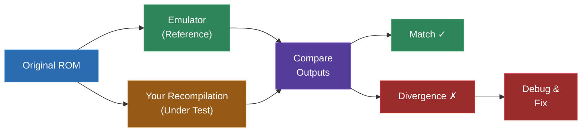
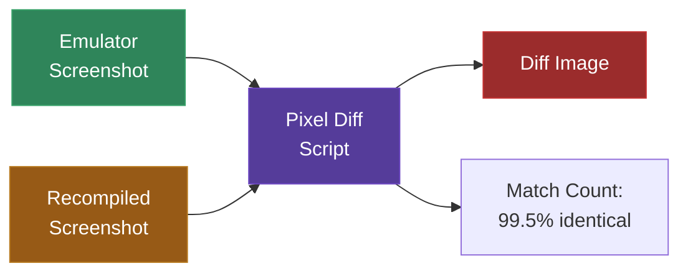
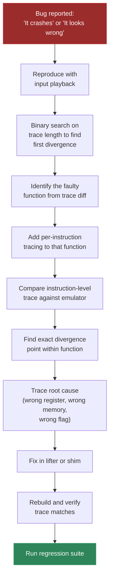
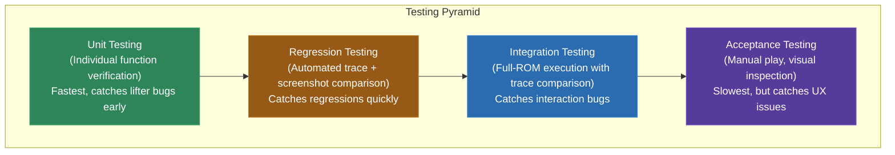

# Module 18: Testing and Validation

How do you know your recompilation is correct?

This is not a philosophical question. It is the most practical question in the entire recompilation pipeline. You have parsed a binary, disassembled it, built a control flow graph, lifted the instructions to C, written shims for the hardware, compiled everything, and produced a native executable. It runs. Something appears on screen. But is it right?

"Right" in recompilation means the recompiled program behaves identically to the original program running on the original hardware (or a cycle-accurate emulator). Every register, every memory write, every pixel, every audio sample should match. In practice, perfect identity is rarely achievable or even necessary -- but you need to know where your recompilation diverges from the original and whether those divergences matter.

This module covers the full spectrum of testing techniques, from quick manual checks to fully automated regression testing. You will learn how to build a trace logger, compare CPU state between your recompilation and an emulator, diff screenshots pixel by pixel, replay recorded input for deterministic testing, and systematically hunt down the source of any divergence.

Testing is not something you do at the end. It is something you do continuously, from the first lifted function to the final release build. The earlier you catch a bug, the easier it is to fix. A flag computation error caught during single-function testing takes five minutes to fix. The same error caught during full-game testing, after it has cascaded through a thousand function calls, takes five hours.

---

## 1. The Testing Problem

Static recompilation faces a unique testing challenge that most software does not have: the specification is not a document, it is a running program. There is no requirements document that says "when the player presses A, the character should jump 32 pixels." The specification is the behavior of the original binary running on the original hardware.

This means testing is fundamentally comparative. You are not testing whether your program does what a specification says -- you are testing whether your program does what another program does.



The comparison can happen at multiple levels:

- **CPU state**: Do the registers have the same values after executing the same function?
- **Memory state**: Does RAM contain the same bytes after the same sequence of operations?
- **Visual output**: Does the screen look the same?
- **Audio output**: Does the audio sound the same?
- **Behavioral output**: Does the program respond to the same inputs in the same way?

Each level catches different kinds of bugs, and each has different tradeoffs in terms of setup effort and diagnostic value.

### Why Emulators Are Ground Truth

An accurate emulator running the same ROM is your reference implementation. It executes the original instructions on a faithful model of the original hardware, producing correct behavior (assuming the emulator is accurate, which for well-tested emulators on well-documented hardware, it is).

You might wonder: why not compare against actual hardware? You can, but it is much harder. Real hardware does not have a "log CPU state" button. You cannot easily pause it, inspect registers, or replay input deterministically. Emulators give you all of these capabilities. For testing purposes, a well-tested emulator IS the hardware.

Recommended reference emulators:

| Platform | Emulator | Why |
|---|---|---|
| Game Boy | BGB, SameBoy | Cycle-accurate, excellent debuggers, trace logging |
| NES | Mesen | Outstanding accuracy, built-in trace logger, PPU viewer |
| SNES | bsnes, Mesen-S | bsnes is near-perfect accuracy; Mesen-S has great debugging |
| GBA | mGBA | Accurate, good debugger, I/O register logging |
| DOS | DOSBox Debugger | Built-in debugger, memory viewer |
| N64 | Ares | High accuracy for N64 testing |

### Levels of Testing

Testing a recompilation project happens at four levels, each building on the last:

1. **Unit testing**: Test individual lifted functions in isolation with known inputs. Fast, precise, catches lifter bugs early.
2. **Integration testing**: Test the full pipeline running a ROM. Catches interaction bugs between functions and between generated code and shims.
3. **Regression testing**: Automated tests that verify previously working behavior stays working after changes. Catches regressions.
4. **Acceptance testing**: Manual comparison of the running recompilation against the emulator. Catches user-visible issues.

The rest of this module covers techniques for each level.

---

## 2. Reference Implementation: Using an Emulator as Ground Truth

The first step in testing is setting up your reference implementation. You need an emulator that can produce detailed logs of its execution -- CPU state at function boundaries, memory writes, I/O register accesses.

### Setting Up Trace Logging in an Emulator

Most debugging-capable emulators support some form of trace logging. Here is how to set it up for common platforms:

**BGB (Game Boy):**
BGB's debugger can log CPU state on every instruction or at specific breakpoints. Use the "trace log" feature:
1. Open the debugger (Escape key or Debug menu)
2. Right-click in the debugger and select "trace log"
3. Configure the log format to include registers: `%AF %BC %DE %HL %SP %PC`
4. Set breakpoints at function entry addresses to log only at function boundaries (not every instruction -- that generates enormous files)

**Mesen (NES):**
Mesen has a built-in trace logger:
1. Debug > Trace Logger
2. Configure format: include CPU registers (A, X, Y, SP, P, PC)
3. Start logging, run the game, stop logging
4. Export the trace to a text file

**mGBA (GBA):**
mGBA supports logging through its scripting interface:
1. Use the Lua scripting console
2. Set callbacks at function addresses that log register state
3. Export to a file

For any emulator, the key configuration is: **log CPU state at function entry points, not at every instruction.** Instruction-level traces are useful for deep debugging but generate gigabytes of data for even a few seconds of execution. Function-level traces are manageable and sufficient for most testing.

### Building Your Own Reference Logger

If the emulator does not have adequate trace logging, you can often modify an open-source emulator to add it. For example, adding function-entry logging to a simple Game Boy emulator:

```c
// In the emulator's instruction execution loop:
void cpu_step(GB_CPU *cpu) {
    uint16_t pc = cpu->pc;

    // Check if this PC is a known function entry point
    if (is_function_entry(pc)) {
        fprintf(trace_file, "TRACE func_0x%04X: A=%02X F=%02X BC=%04X DE=%04X HL=%04X SP=%04X\n",
            pc, cpu->a, cpu->f,
            (cpu->b << 8) | cpu->c,
            (cpu->d << 8) | cpu->e,
            (cpu->h << 8) | cpu->l,
            cpu->sp);
    }

    // Execute the instruction
    execute_instruction(cpu);
}
```

The `is_function_entry` check uses the same function list that your disassembler/CFG builder produced. This ensures you are logging at exactly the same points in both the emulator and the recompiled code.

---

## 3. Register Trace Comparison

Register trace comparison is the most powerful testing technique in your toolkit. It answers the question: "Does my recompiled code produce the same CPU state as the original code at every function boundary?"

### How It Works

1. Run the ROM in an emulator with trace logging enabled. The emulator logs the CPU register state every time execution enters a known function.
2. Run the recompiled binary with trace logging enabled. The generated code logs the CPU register state at the start of every lifted function.
3. Diff the two trace files line by line. The first line that differs tells you exactly which function produced the wrong state and which register diverged.

```
# Emulator trace:
TRACE func_0x0150: A=01 F=B0 BC=0013 DE=00D8 HL=014D SP=FFFE
TRACE func_0x0300: A=01 F=B0 BC=0013 DE=00D8 HL=014D SP=FFFC
TRACE func_0x0350: A=00 F=80 BC=0013 DE=00D8 HL=9800 SP=FFFC
TRACE func_0x0400: A=00 F=80 BC=0013 DE=00D8 HL=9800 SP=FFFC
TRACE func_0x0500: A=91 F=80 BC=0013 DE=00D8 HL=9800 SP=FFFC

# Recompiled trace:
TRACE func_0x0150: A=01 F=B0 BC=0013 DE=00D8 HL=014D SP=FFFE
TRACE func_0x0300: A=01 F=B0 BC=0013 DE=00D8 HL=014D SP=FFFC
TRACE func_0x0350: A=00 F=80 BC=0013 DE=00D8 HL=9800 SP=FFFC
TRACE func_0x0400: A=00 F=80 BC=0013 DE=00D8 HL=9800 SP=FFFC
TRACE func_0x0500: A=91 F=00 BC=0013 DE=00D8 HL=9800 SP=FFFC
                          ^^^ --- F register differs: expected 0x80, got 0x00
```

In this example, the traces match through `func_0x0400` but diverge at `func_0x0500`. The F register is wrong: the emulator has `0x80` (zero flag set) and the recompilation has `0x00` (no flags set). This tells you that somewhere between the entry to `func_0x0400` and the entry to `func_0x0500`, a flag computation went wrong.

Now you know exactly where to look. Examine the lifted code for `func_0x0400` (or whatever function executes between these two trace points) and find the flag computation bug.

### Implementing Trace Logging in Generated Code

Your lifter should emit trace logging at the start of every generated function:

```python
# In your lifter (Python)
def emit_function(self, func):
    lines = []
    lines.append(f'void func_0x{func.address:04X}(SM83Context *ctx) {{')
    lines.append(f'    TRACE_FUNC("func_0x{func.address:04X}", ctx);')
    # ... emit lifted instructions ...
    lines.append('}')
    return '\n'.join(lines)
```

The `TRACE_FUNC` macro was defined in Module 16. Here it is again for reference:

```c
#ifdef TRACE_ENABLED
extern FILE *trace_file;  // Opened in main()

#define TRACE_FUNC(name, ctx) \
    fprintf(trace_file, "TRACE %s: A=%02X F=%02X BC=%04X DE=%04X HL=%04X SP=%04X\n", \
        name, (ctx)->a, (ctx)->f, \
        REG_BC(ctx), REG_DE(ctx), REG_HL(ctx), (ctx)->sp)
#else
#define TRACE_FUNC(name, ctx) ((void)0)
#endif
```

For ARM (GBA), the trace would log different registers:

```c
#define TRACE_FUNC_ARM(name, ctx) \
    fprintf(trace_file, "TRACE %s: R0=%08X R1=%08X R2=%08X R3=%08X " \
        "R4=%08X R5=%08X SP=%08X LR=%08X PC=%08X CPSR=%08X\n", \
        name, (ctx)->r[0], (ctx)->r[1], (ctx)->r[2], (ctx)->r[3], \
        (ctx)->r[4], (ctx)->r[5], (ctx)->r[13], (ctx)->r[14], \
        (ctx)->r[15], (ctx)->cpsr)
```

### Automating Trace Comparison

Write a script that compares traces and reports the first divergence with context:

```python
#!/usr/bin/env python3
# tests/trace_compare.py
import sys

def compare_traces(recomp_file, emu_file, context_lines=3):
    with open(recomp_file) as f:
        recomp_lines = [l.strip() for l in f if l.startswith('TRACE')]
    with open(emu_file) as f:
        emu_lines = [l.strip() for l in f if l.startswith('TRACE')]

    min_len = min(len(recomp_lines), len(emu_lines))
    print(f"Recomp trace: {len(recomp_lines)} entries")
    print(f"Emulator trace: {len(emu_lines)} entries")
    print(f"Comparing first {min_len} entries...\n")

    for i in range(min_len):
        if recomp_lines[i] != emu_lines[i]:
            print(f"DIVERGENCE at entry {i}:")
            print()

            # Show context (preceding matching lines)
            start = max(0, i - context_lines)
            for j in range(start, i):
                print(f"  [OK]  {recomp_lines[j]}")

            print(f"  [EMU] {emu_lines[i]}")
            print(f"  [REC] {recomp_lines[i]}")
            print()

            # Highlight which fields differ
            emu_parts = emu_lines[i].split()
            rec_parts = recomp_lines[i].split()
            diffs = []
            for e, r in zip(emu_parts, rec_parts):
                if e != r:
                    diffs.append(f"  {e} (emu) vs {r} (recomp)")
            if diffs:
                print("Differences:")
                for d in diffs:
                    print(d)

            return 1

    if len(recomp_lines) != len(emu_lines):
        print(f"WARNING: Trace lengths differ ({len(recomp_lines)} vs {len(emu_lines)})")
        return 1

    print(f"All {min_len} trace entries match!")
    return 0

if __name__ == '__main__':
    if len(sys.argv) != 3:
        print(f"Usage: {sys.argv[0]} <recomp_trace> <emulator_trace>")
        sys.exit(1)
    sys.exit(compare_traces(sys.argv[1], sys.argv[2]))
```

Run it:

```bash
python tests/trace_compare.py recomp_trace.txt emulator_trace.txt
```

Output:

```
Recomp trace: 15234 entries
Emulator trace: 15234 entries
Comparing first 15234 entries...

DIVERGENCE at entry 847:

  [OK]  TRACE func_0x0800: A=05 F=20 BC=0003 DE=0010 HL=C100 SP=FFFA
  [OK]  TRACE func_0x0820: A=05 F=20 BC=0003 DE=0010 HL=C100 SP=FFF8
  [OK]  TRACE func_0x0850: A=08 F=00 BC=0003 DE=0010 HL=C100 SP=FFF8
  [EMU] TRACE func_0x0500: A=08 F=00 BC=0003 DE=0010 HL=C108 SP=FFFA
  [REC] TRACE func_0x0500: A=08 F=00 BC=0003 DE=0010 HL=C100 SP=FFFA

Differences:
  HL=C108 (emu) vs HL=C100 (recomp)
```

Now you know: at entry 847, after `func_0x0850` returns and `func_0x0500` is entered, the HL register is wrong. The emulator has HL=C108, the recompilation has HL=C100. The L register was not incremented by 8 somewhere in `func_0x0850`. Go look at the lifted code for `func_0x0850` and find the bug.

---

## 4. Building a Trace Logger

Let us build a proper trace logging system that works for both the recompiled code and can be adapted for emulators.

### Requirements

A good trace logger for recompilation testing needs:

1. **Configurable verbosity**: Function-entry only, or instruction-level, or memory-access level
2. **Low overhead when disabled**: Zero cost in release builds
3. **Deterministic output**: Same input produces same trace, regardless of timing
4. **Efficient I/O**: Writing millions of trace lines must not be the bottleneck
5. **Parseable format**: Easy to diff and process with scripts

### Implementation

```c
// shims/trace.h
#pragma once

#include <stdio.h>
#include <stdint.h>

#ifdef TRACE_ENABLED

// Trace verbosity levels
#define TRACE_LEVEL_NONE     0
#define TRACE_LEVEL_FUNC     1   // Function entry/exit
#define TRACE_LEVEL_BRANCH   2   // Branch decisions
#define TRACE_LEVEL_INSTR    3   // Every instruction
#define TRACE_LEVEL_MEMORY   4   // Every memory access

extern FILE *trace_file;
extern int trace_level;
extern uint64_t trace_count;       // Total trace entries written
extern uint64_t trace_limit;       // Stop tracing after this many entries (0 = unlimited)

void trace_init(const char *filename, int level, uint64_t limit);
void trace_shutdown(void);

// Function-level trace (most commonly used)
#define TRACE_FUNC(name, ctx) do { \
    if (trace_level >= TRACE_LEVEL_FUNC && \
        (trace_limit == 0 || trace_count < trace_limit)) { \
        trace_count++; \
        fprintf(trace_file, "TRACE %s: A=%02X F=%02X BC=%04X DE=%04X HL=%04X SP=%04X\n", \
            name, (ctx)->a, (ctx)->f, \
            REG_BC(ctx), REG_DE(ctx), REG_HL(ctx), (ctx)->sp); \
    } \
} while(0)

// Memory access trace
#define TRACE_MEM_READ(addr, val) do { \
    if (trace_level >= TRACE_LEVEL_MEMORY && \
        (trace_limit == 0 || trace_count < trace_limit)) { \
        trace_count++; \
        fprintf(trace_file, "MEM_R 0x%04X -> 0x%02X\n", (uint16_t)(addr), (uint8_t)(val)); \
    } \
} while(0)

#define TRACE_MEM_WRITE(addr, val) do { \
    if (trace_level >= TRACE_LEVEL_MEMORY && \
        (trace_limit == 0 || trace_count < trace_limit)) { \
        trace_count++; \
        fprintf(trace_file, "MEM_W 0x%04X <- 0x%02X\n", (uint16_t)(addr), (uint8_t)(val)); \
    } \
} while(0)

// Branch decision trace
#define TRACE_BRANCH(addr, taken) do { \
    if (trace_level >= TRACE_LEVEL_BRANCH && \
        (trace_limit == 0 || trace_count < trace_limit)) { \
        trace_count++; \
        fprintf(trace_file, "BRANCH 0x%04X %s\n", (uint16_t)(addr), (taken) ? "TAKEN" : "NOT_TAKEN"); \
    } \
} while(0)

#else  // !TRACE_ENABLED

#define TRACE_FUNC(name, ctx) ((void)0)
#define TRACE_MEM_READ(addr, val) ((void)0)
#define TRACE_MEM_WRITE(addr, val) ((void)0)
#define TRACE_BRANCH(addr, taken) ((void)0)

static inline void trace_init(const char *f, int l, uint64_t lim) { (void)f; (void)l; (void)lim; }
static inline void trace_shutdown(void) {}

#endif
```

```c
// shims/trace.c
#include "trace.h"

#ifdef TRACE_ENABLED

FILE *trace_file = NULL;
int trace_level = TRACE_LEVEL_FUNC;
uint64_t trace_count = 0;
uint64_t trace_limit = 0;

void trace_init(const char *filename, int level, uint64_t limit) {
    if (filename) {
        trace_file = fopen(filename, "w");
        if (!trace_file) {
            fprintf(stderr, "WARNING: Could not open trace file '%s', using stderr\n", filename);
            trace_file = stderr;
        }
    } else {
        trace_file = stderr;
    }
    trace_level = level;
    trace_limit = limit;
    trace_count = 0;

    // Use a large buffer for trace output to reduce I/O overhead
    if (trace_file != stderr) {
        setvbuf(trace_file, NULL, _IOFBF, 1024 * 1024);  // 1MB buffer
    }
}

void trace_shutdown(void) {
    if (trace_file && trace_file != stderr) {
        fprintf(trace_file, "# Total trace entries: %llu\n", (unsigned long long)trace_count);
        fclose(trace_file);
        trace_file = NULL;
    }
}

#endif
```

### Instrumenting the Emulator

To get a matching trace from the emulator, you need to instrument it at the same points. If you are using an open-source emulator, add trace logging at function entry:

```c
// In the emulator's CPU step function:
void cpu_execute(CPU *cpu) {
    // Before executing the instruction at the current PC:
    if (is_function_entry(cpu->pc)) {
        fprintf(trace_file, "TRACE func_0x%04X: A=%02X F=%02X BC=%04X DE=%04X HL=%04X SP=%04X\n",
            cpu->pc, cpu->a, cpu->f,
            (cpu->b << 8) | cpu->c,
            (cpu->d << 8) | cpu->e,
            (cpu->h << 8) | cpu->l,
            cpu->sp);
    }

    // Execute the instruction
    // ...
}
```

The function entry point list (`is_function_entry`) should come from your disassembler/CFG builder. Export it as a simple text file or binary table that both the emulator and the recompilation can use:

```python
# Generate function_entries.txt from your CFG builder
with open('function_entries.txt', 'w') as f:
    for addr in sorted(function_addresses):
        f.write(f'0x{addr:04X}\n')
```

```c
// Load function entries for the emulator's trace logger
int load_function_entries(const char *filename) {
    FILE *f = fopen(filename, "r");
    char line[32];
    while (fgets(line, sizeof(line), f)) {
        uint32_t addr;
        if (sscanf(line, "0x%X", &addr) == 1) {
            function_entry_set[addr] = 1;  // Mark as function entry
        }
    }
    fclose(f);
    return 0;
}
```

### Trace File Size Management

Trace files get large fast. At function-level tracing, a game that calls 1000 functions per frame at 60fps generates 60,000 trace lines per second. At ~80 bytes per line, that is about 5MB per second. A minute of tracing produces 300MB.

Strategies for managing trace size:

1. **Limit trace duration**: Only trace the first N seconds of execution, or the first M function calls.
2. **Trace specific functions**: Only log entries for functions you are actively debugging.
3. **Use binary format**: Instead of text, write a compact binary trace (4 bytes per register instead of 2 hex chars + separator).
4. **Compress on the fly**: Pipe trace output through gzip: `trace_file = popen("gzip > trace.gz", "w");`

For most debugging, tracing the first 10,000-100,000 function entries is more than enough to find divergences.

---

## 5. Frame-by-Frame Screenshot Comparison

Register traces tell you whether the CPU state is correct. Screenshot comparison tells you whether the visible output is correct. Both are necessary -- you can have correct CPU state but wrong graphics (shim bug), or correct graphics but wrong CPU state (errors that have not yet affected the display).

### Capturing Screenshots

Add a screenshot capture function to your graphics shim:

```c
// shims/graphics.c
#include <SDL2/SDL.h>

// Capture current framebuffer to a raw pixel buffer
void graphics_capture_frame(uint32_t *output_pixels, int width, int height) {
    // Copy the current framebuffer pixels
    memcpy(output_pixels, pixels, width * height * sizeof(uint32_t));
}

// Save framebuffer as BMP (no external library needed)
void graphics_save_screenshot(const char *filename) {
    SDL_Surface *surface = SDL_CreateRGBSurfaceFrom(
        pixels, SCREEN_W, SCREEN_H, 32, SCREEN_W * 4,
        0x00FF0000, 0x0000FF00, 0x000000FF, 0xFF000000);
    SDL_SaveBMP(surface, filename);
    SDL_FreeSurface(surface);
}

#ifdef CAPTURE_SCREENSHOTS
static int frame_number = 0;

void graphics_present(void) {
    // Normal present...
    SDL_UpdateTexture(framebuffer_tex, NULL, pixels, SCREEN_W * sizeof(uint32_t));
    SDL_RenderClear(renderer);
    SDL_RenderCopy(renderer, framebuffer_tex, NULL, NULL);
    SDL_RenderPresent(renderer);

    // Capture every Nth frame
    if (frame_number % 60 == 0) {  // Every 60 frames (once per second)
        char filename[256];
        snprintf(filename, sizeof(filename), "screenshots/frame_%06d.bmp", frame_number);
        graphics_save_screenshot(filename);
    }
    frame_number++;
}
#endif
```

To get reference screenshots from the emulator, use the emulator's screenshot feature (most have one) at the same frame numbers, or capture the emulator window externally.

### Pixel Diffing

Compare screenshots pixel by pixel to find visual differences:

```python
#!/usr/bin/env python3
# tests/screenshot_diff.py
from PIL import Image
import sys
import os

def diff_images(img1_path, img2_path, output_path=None, threshold=0):
    """Compare two images pixel by pixel. Returns number of differing pixels."""
    img1 = Image.open(img1_path).convert('RGB')
    img2 = Image.open(img2_path).convert('RGB')

    if img1.size != img2.size:
        print(f"Size mismatch: {img1.size} vs {img2.size}")
        return -1

    pixels1 = img1.load()
    pixels2 = img2.load()
    width, height = img1.size

    diff_count = 0
    diff_img = Image.new('RGB', (width, height), (0, 0, 0))
    diff_pixels = diff_img.load()

    for y in range(height):
        for x in range(width):
            r1, g1, b1 = pixels1[x, y]
            r2, g2, b2 = pixels2[x, y]

            dr = abs(r1 - r2)
            dg = abs(g1 - g2)
            db = abs(b1 - b2)

            if dr > threshold or dg > threshold or db > threshold:
                diff_count += 1
                # Highlight differences in red on the diff image
                diff_pixels[x, y] = (255, 0, 0)
            else:
                # Matching pixels shown at reduced brightness
                diff_pixels[x, y] = (r1 // 3, g1 // 3, b1 // 3)

    total_pixels = width * height
    pct = (diff_count / total_pixels) * 100

    print(f"Compared {total_pixels} pixels: {diff_count} differ ({pct:.2f}%)")

    if output_path and diff_count > 0:
        diff_img.save(output_path)
        print(f"Diff image saved to {output_path}")

    return diff_count

if __name__ == '__main__':
    if len(sys.argv) < 3:
        print(f"Usage: {sys.argv[0]} <image1> <image2> [diff_output]")
        sys.exit(1)

    output = sys.argv[3] if len(sys.argv) > 3 else None
    diff_count = diff_images(sys.argv[1], sys.argv[2], output)
    sys.exit(0 if diff_count == 0 else 1)
```

The diff image is extremely useful for diagnosing visual issues. A diff that shows red pixels in a horizontal band usually means a scroll register is wrong. Red pixels in 8x8 blocks usually means tile data is being read from the wrong address. Red pixels everywhere usually means the palette is wrong.



### Practical Considerations

- **Color space matters.** If the emulator and your recompilation use different palette mappings (e.g., slightly different shades of gray for the Game Boy's 4-color palette), every pixel will differ even if the graphics are structurally correct. Normalize palettes before comparing, or use a threshold in the pixel diff.

- **Timing affects frame content.** If your recompilation runs frames at a slightly different rate than the emulator, frame N in the recompilation may not correspond to frame N in the emulator. Use input playback (Section 6) to ensure both execute the same sequence of frames.

- **Sub-pixel differences are normal.** On systems with anti-aliasing or interpolated scaling, small sub-pixel differences are expected and not bugs. Use a threshold of 1-2 in the pixel diff to ignore these.

---

## 6. Input Playback

Deterministic testing requires deterministic input. If you test by manually pressing buttons, you cannot reproduce the exact same test twice. Input playback solves this: record a sequence of inputs, then replay them in both the emulator and the recompilation.

### Recording Input

Add input recording to your input shim:

```c
// shims/input.h
typedef struct {
    uint32_t frame;     // Frame number when this input event occurred
    uint8_t button;     // Button identifier
    uint8_t pressed;    // 1 = pressed, 0 = released
} InputEvent;

void input_start_recording(const char *filename);
void input_stop_recording(void);
void input_start_playback(const char *filename);
int  input_is_playing_back(void);
```

```c
// shims/input.c
#include "input.h"
#include <stdio.h>
#include <stdlib.h>

static FILE *recording_file = NULL;
static InputEvent *playback_events = NULL;
static int playback_count = 0;
static int playback_index = 0;
static uint32_t current_frame = 0;
static uint8_t button_state = 0xFF;

void input_start_recording(const char *filename) {
    recording_file = fopen(filename, "wb");
    // Write header
    const char header[] = "INPUT_V1";
    fwrite(header, 1, 8, recording_file);
}

void input_stop_recording(void) {
    if (recording_file) {
        fclose(recording_file);
        recording_file = NULL;
    }
}

void input_update(void) {
    current_frame++;

    if (input_is_playing_back()) {
        // Apply all events for this frame
        while (playback_index < playback_count &&
               playback_events[playback_index].frame == current_frame) {
            InputEvent *ev = &playback_events[playback_index];
            if (ev->pressed) {
                button_state &= ~(1 << ev->button);  // Active low
            } else {
                button_state |= (1 << ev->button);
            }
            playback_index++;
        }
        return;  // Do not poll real input during playback
    }

    // Normal input polling
    SDL_Event event;
    while (SDL_PollEvent(&event)) {
        if (event.type == SDL_QUIT) exit(0);

        if (event.type == SDL_KEYDOWN || event.type == SDL_KEYUP) {
            int pressed = (event.type == SDL_KEYDOWN);
            int button = -1;

            switch (event.key.keysym.scancode) {
                case SDL_SCANCODE_Z:      button = 0; break;  // A
                case SDL_SCANCODE_X:      button = 1; break;  // B
                case SDL_SCANCODE_RETURN: button = 2; break;  // Start
                case SDL_SCANCODE_RSHIFT: button = 3; break;  // Select
                case SDL_SCANCODE_UP:     button = 4; break;
                case SDL_SCANCODE_DOWN:   button = 5; break;
                case SDL_SCANCODE_LEFT:   button = 6; break;
                case SDL_SCANCODE_RIGHT:  button = 7; break;
                default: break;
            }

            if (button >= 0) {
                if (pressed) {
                    button_state &= ~(1 << button);
                } else {
                    button_state |= (1 << button);
                }

                // Record the event
                if (recording_file) {
                    InputEvent ev = { current_frame, (uint8_t)button, (uint8_t)pressed };
                    fwrite(&ev, sizeof(ev), 1, recording_file);
                }
            }
        }
    }
}

void input_start_playback(const char *filename) {
    FILE *f = fopen(filename, "rb");
    if (!f) return;

    // Skip header
    fseek(f, 8, SEEK_SET);

    // Read all events
    fseek(f, 0, SEEK_END);
    long size = ftell(f) - 8;
    fseek(f, 8, SEEK_SET);

    playback_count = size / sizeof(InputEvent);
    playback_events = malloc(playback_count * sizeof(InputEvent));
    fread(playback_events, sizeof(InputEvent), playback_count, f);
    fclose(f);

    playback_index = 0;
    current_frame = 0;
    button_state = 0xFF;
}

int input_is_playing_back(void) {
    return playback_events != NULL && playback_index < playback_count;
}

uint8_t input_get_state(void) {
    return button_state;
}
```

### Using Input Playback for Testing

The workflow:

1. **Record**: Play the game in the recompiled build (or emulator) and press buttons. The input events are saved to a file.
2. **Replay in recompilation**: Run the recompiled build with input playback. Since the same inputs are applied at the same frames, the execution should be deterministic.
3. **Replay in emulator**: Feed the same input recording to the emulator (you may need a simple adapter script to convert the format).
4. **Compare**: Both should produce the same trace output and screenshots.

```bash
# Record input during manual play
./recomp --record-input test_input.bin rom.gb

# Replay in recompilation with trace logging
./recomp --playback-input test_input.bin --trace recomp_trace.txt rom.gb

# Convert input format for emulator (if needed)
python tests/convert_input.py test_input.bin emulator_input.txt

# Replay in emulator with trace logging
# (emulator-specific command)

# Compare traces
python tests/trace_compare.py recomp_trace.txt emulator_trace.txt
```

### Determinism Requirements

Input playback only produces deterministic results if your recompilation is deterministic. This means:

- **No uninitialized memory reads.** If the program reads memory that was never written, the value must be consistent between runs. Initialize all memory to zero (or a known value) at startup.
- **No timing-dependent behavior in shims.** If your VBlank handler uses `clock()` or `SDL_GetTicks()` to determine timing, the results will vary between runs. Use a fixed frame counter instead.
- **No random seeds from system state.** If the original program seeds its RNG from a timer register, provide a fixed seed during testing.

---

## 7. Automated Regression Testing

Once you have trace comparison, screenshot comparison, and input playback working, you can combine them into an automated regression test suite. This is what separates a project that stays working from a project that breaks every time you change something.

### Test Harness Design

A regression test consists of:

1. A ROM file (the target)
2. An input recording (the test case)
3. Expected trace output (the expected behavior)
4. Expected screenshots at specific frames (the expected visual output)

```
tests/
├── test_boot.py                    # Test: boot to title screen
├── test_gameplay.py                # Test: play for 30 seconds
├── fixtures/
│   ├── test_boot_input.bin         # Input: no buttons pressed (just boot)
│   ├── test_boot_trace.txt         # Expected trace for boot sequence
│   ├── test_boot_frame060.bmp      # Expected screenshot at frame 60
│   ├── test_gameplay_input.bin     # Input: specific button sequence
│   ├── test_gameplay_trace.txt     # Expected trace for gameplay
│   └── test_gameplay_frame300.bmp  # Expected screenshot at frame 300
```

```python
#!/usr/bin/env python3
# tests/test_boot.py
"""Regression test: verify boot sequence matches expected trace."""

import subprocess
import sys
import os

RECOMP_BIN = os.path.join('build', 'recomp')
ROM_FILE = os.path.join('rom', 'target.gb')
INPUT_FILE = os.path.join('tests', 'fixtures', 'test_boot_input.bin')
EXPECTED_TRACE = os.path.join('tests', 'fixtures', 'test_boot_trace.txt')
EXPECTED_SCREENSHOT = os.path.join('tests', 'fixtures', 'test_boot_frame060.bmp')

def run_test():
    # Run the recompiled binary with input playback and tracing
    result = subprocess.run([
        RECOMP_BIN,
        ROM_FILE,
        '--playback-input', INPUT_FILE,
        '--trace', 'test_output_trace.txt',
        '--screenshot-at', '60', 'test_output_frame060.bmp',
        '--max-frames', '120',  # Stop after 120 frames
        '--headless',           # No window (CI-friendly)
    ], capture_output=True, text=True, timeout=30)

    if result.returncode != 0:
        print(f"FAIL: Recompiled binary crashed (exit code {result.returncode})")
        print(f"stderr: {result.stderr}")
        return False

    # Compare trace
    from trace_compare import compare_traces
    trace_result = compare_traces('test_output_trace.txt', EXPECTED_TRACE)
    if trace_result != 0:
        print("FAIL: Trace divergence detected")
        return False

    # Compare screenshot
    from screenshot_diff import diff_images
    diff_count = diff_images('test_output_frame060.bmp', EXPECTED_SCREENSHOT)
    if diff_count > 0:
        print(f"FAIL: Screenshot differs ({diff_count} pixels)")
        return False

    print("PASS: Boot sequence matches expected behavior")
    return True

if __name__ == '__main__':
    success = run_test()
    # Clean up temp files
    for f in ['test_output_trace.txt', 'test_output_frame060.bmp']:
        if os.path.exists(f):
            os.remove(f)
    sys.exit(0 if success else 1)
```

### Generating Expected Output

The first time you run a test, there is no expected output to compare against. You generate it:

1. Run the emulator with the same ROM and input recording.
2. Capture the trace and screenshots.
3. Save them as the expected output fixtures.
4. Verify manually that the expected output looks correct (the emulator's output should be trusted, but sanity-check it).

After that, every subsequent test run compares against these fixtures. If you intentionally change behavior (fixing a bug, for example), you regenerate the expected output.

### Expected Output Checksums

For large traces, comparing text files line by line is slow. An alternative is to checksum the expected output and compare only the checksum:

```python
import hashlib

def checksum_trace(filename):
    """Compute SHA-256 of a trace file, ignoring comments and empty lines."""
    h = hashlib.sha256()
    with open(filename) as f:
        for line in f:
            line = line.strip()
            if line and not line.startswith('#'):
                h.update(line.encode('utf-8'))
                h.update(b'\n')
    return h.hexdigest()

# In the test:
expected_checksum = "a1b2c3d4..."  # Pre-computed from reference trace
actual_checksum = checksum_trace('test_output_trace.txt')
if actual_checksum != expected_checksum:
    print(f"FAIL: Trace checksum mismatch")
    print(f"  Expected: {expected_checksum}")
    print(f"  Actual:   {actual_checksum}")
    # Fall back to line-by-line comparison for diagnostics
    compare_traces('test_output_trace.txt', EXPECTED_TRACE)
```

This makes the pass/fail check nearly instantaneous. You only do the expensive line-by-line comparison when the test fails.

### CI Integration

Register your regression tests with CTest:

```cmake
# In your top-level CMakeLists.txt
enable_testing()

add_test(
    NAME regression_boot
    COMMAND ${CMAKE_COMMAND} -E env
        python3 ${CMAKE_SOURCE_DIR}/tests/test_boot.py
    WORKING_DIRECTORY ${CMAKE_BINARY_DIR}
)

add_test(
    NAME regression_gameplay
    COMMAND ${CMAKE_COMMAND} -E env
        python3 ${CMAKE_SOURCE_DIR}/tests/test_gameplay.py
    WORKING_DIRECTORY ${CMAKE_BINARY_DIR}
)
```

Now `ctest` in your CI pipeline runs all regression tests automatically.

---

## 8. Common Recompilation Bugs and Their Symptoms

This section is a field guide. When something goes wrong, the symptoms often point directly to the category of bug. Learn to read the symptoms and you will find bugs faster.

### Endianness Errors

**Cause:** Reading multi-byte values with the wrong byte order. Common when recompiling big-endian targets (N64, GameCube) on a little-endian host (x86), or when using raw pointer casts instead of explicit byte manipulation.

**Symptoms:**
- Textures appear garbled or scrambled (RGBA channels swapped or interleaved wrong)
- 16-bit or 32-bit values are nonsensical (e.g., a counter reads 0x0100 instead of 0x0001)
- Addresses computed from multi-byte loads are wrong, causing memory accesses to random locations
- Palette colors are wrong (e.g., blue and red channels swapped)

**Example:**

```c
// WRONG: Direct cast assumes host byte order matches target
uint16_t value = *(uint16_t *)&memory[addr];

// RIGHT for little-endian target (Game Boy, NES, GBA, x86):
uint16_t value = (uint16_t)memory[addr] | ((uint16_t)memory[addr + 1] << 8);

// RIGHT for big-endian target (N64, GameCube, PS3):
uint16_t value = ((uint16_t)memory[addr] << 8) | (uint16_t)memory[addr + 1];
```

**Diagnostic:** Trace comparison will show register values that are byte-swapped versions of the expected values. If expected HL=0x4080 and actual HL=0x8040, you have an endianness bug.

### Sign Extension Mistakes

**Cause:** Treating a signed 8-bit or 16-bit value as unsigned (or vice versa) when extending it to a wider type. Extremely common in relative branch offset calculations.

**Symptoms:**
- Relative branches jump to wildly wrong addresses (forward by 200 instead of backward by 2)
- Signed arithmetic produces wrong results (negative numbers become large positive numbers)
- Comparisons with negative values fail (a value that should be -1 compares as 255)

**Example:**

```c
// WRONG: unsigned extension of a signed relative offset
uint16_t new_pc = ctx->pc + offset;  // If offset is 0xFE (signed: -2), this adds 254

// RIGHT: sign-extend before adding
int8_t signed_offset = (int8_t)offset;
uint16_t new_pc = ctx->pc + signed_offset;  // Correctly subtracts 2
```

**Diagnostic:** Trace comparison shows the PC diverging after a conditional branch. The recompiled code takes the branch to a much higher address instead of a nearby lower address.

### Flag Computation Errors

**Cause:** Computing CPU flags incorrectly. The most common specific error is the half-carry flag (carry from bit 3 to bit 4), which is easy to get wrong because the formula is non-obvious.

**Symptoms:**
- Conditional branches sometimes take the wrong path (intermittent, hard to reproduce)
- BCD (binary-coded decimal) arithmetic produces wrong results
- The DAA instruction (decimal adjust) produces wrong results (if your target uses BCD)
- Subtraction and comparison produce wrong flags (subtraction half-carry formula is different from addition)

**Example:**

```c
// Addition half-carry: carry from bit 3
// WRONG:
int half_carry = (result >> 4) & 1;  // This is bit 4 of the result, not the carry

// RIGHT:
int half_carry = ((a & 0x0F) + (b & 0x0F)) > 0x0F;

// Subtraction half-carry: borrow from bit 4 into bit 3
// WRONG (using addition formula):
int half_carry = ((a & 0x0F) + (b & 0x0F)) > 0x0F;

// RIGHT:
int half_carry = (a & 0x0F) < (b & 0x0F);
```

**Diagnostic:** Trace comparison shows the F register (flags) diverging. Often, the first divergence is subtle (one flag bit wrong), but it causes a branch to go the wrong way, which cascades into completely different execution paths.

### Off-by-One in Memory Maps

**Cause:** Bank boundaries, region boundaries, or mirror addresses are off by one byte. The most subtle version is when a multi-byte read crosses a bank boundary and the second byte comes from the wrong bank.

**Symptoms:**
- Crashes near bank boundaries (address just below or above a power-of-two boundary)
- Data corruption that only appears when the game accesses certain ROM banks
- Correct behavior for simple tests, but wrong behavior for games that use the full address space
- Memory mirrors (same data visible at multiple address ranges) not working

**Example (Game Boy bank switching):**

```c
// WRONG: Off-by-one in bank boundary check
uint8_t mem_read(uint16_t addr) {
    if (addr < 0x4000) {
        return rom[addr];                          // Bank 0 (fixed)
    } else if (addr < 0x7FFF) {                    // BUG: should be 0x8000
        return rom[current_bank * 0x4000 + (addr - 0x4000)];  // Switchable bank
    }
    // ...
}

// RIGHT:
uint8_t mem_read(uint16_t addr) {
    if (addr < 0x4000) {
        return rom[addr];                          // Bank 0 (fixed): 0x0000-0x3FFF
    } else if (addr < 0x8000) {                    // Correct boundary
        return rom[current_bank * 0x4000 + (addr - 0x4000)];  // Switchable: 0x4000-0x7FFF
    }
    // ...
}
```

**Diagnostic:** Memory-level tracing (TRACE_LEVEL_MEMORY) shows reads from the wrong address or returning wrong values. The error only manifests when the game accesses addresses near bank boundaries.

### Missing Shim Implementations

**Cause:** The generated code calls a shim function that is stubbed (returns a default value) when it needs a real implementation. Often the stub's return value is "close enough" that the program does not crash, but it produces silently wrong behavior.

**Symptoms:**
- Silent corruption: the program runs but produces wrong output without any obvious error
- Specific features do not work (sound is missing, input does not respond, save data is lost)
- The program "mostly works" but with subtle glitches that are hard to pin down

**Example:**

```c
// Stub that causes silent corruption:
uint8_t io_read(uint16_t addr) {
    switch (addr) {
        case 0xFF44:  // LY register (current scanline)
            return 0;  // Always returns 0 -- game thinks it is always at scanline 0
        // ...
    }
}

// The game's rendering code depends on LY to know when to update VRAM:
// if (LY < 144) { /* visible scanline, don't touch VRAM */ }
// else { /* VBlank, safe to update VRAM */ }
// With LY always 0, the game never enters VBlank handling, and VRAM is never updated.
```

**Diagnostic:** IO trace logging (the `IO READ/WRITE` messages from your stub) shows which shims are being called. If a shim is called frequently and always returns the same value, it probably needs a real implementation. Check whether the original hardware register's value changes over time.

### Stack Corruption

**Cause:** PUSH/POP or CALL/RET operations that increment or decrement the stack pointer by the wrong amount, or that read/write the return address at the wrong stack offset.

**Symptoms:**
- Functions return to wrong addresses (program "wanders" unpredictably)
- Crashes that happen after a CALL/RET pair but not during the called function itself
- The program works for a while then suddenly jumps to an address that is not code
- Stack pointer value diverges in traces

**Example (6502 stack bug):**

```c
// WRONG: 6502 stack pointer pre-decrements on push (it should post-decrement)
void push_byte(M6502Context *ctx, uint8_t value) {
    ctx->sp--;
    mem_write_u8(0x0100 + ctx->sp, value);  // Write to wrong location
}

// RIGHT: 6502 stack pointer: write at current SP, then decrement
void push_byte(M6502Context *ctx, uint8_t value) {
    mem_write_u8(0x0100 + ctx->sp, value);
    ctx->sp--;
}

// And the corresponding pull:
// WRONG:
uint8_t pull_byte(M6502Context *ctx) {
    uint8_t value = mem_read_u8(0x0100 + ctx->sp);
    ctx->sp++;
    return value;
}

// RIGHT: 6502 pull: increment first, then read
uint8_t pull_byte(M6502Context *ctx) {
    ctx->sp++;
    return mem_read_u8(0x0100 + ctx->sp);
}
```

**Diagnostic:** Trace comparison shows the SP register diverging by 1, then the PC diverging on the next function return. Add memory-level tracing and check that the stack region (0x0100-0x01FF on 6502, 0xFF80-0xFFFE on SM83) contains the expected return addresses.

---

## 9. Debugging Workflow: From "It Crashes" to "I Found the Bad Instruction"

Here is the complete debugging workflow for a recompilation bug, from initial symptom to root cause.

### Step 1: Reproduce Consistently

If the bug is intermittent, make it reproducible:
- Use input playback to eliminate input variability
- Set a fixed RNG seed
- Run in headless mode to eliminate timing variability from graphics

### Step 2: Narrow the Time Window

When does the bug manifest? Use binary search on the trace:

```bash
# Does the bug appear in the first 1000 function calls?
./recomp --max-calls 1000 --trace trace.txt rom.gb
python tests/trace_compare.py trace.txt expected.txt
# If match: bug is after call 1000
# If mismatch: bug is before call 1000

# Narrow further: first 500?
./recomp --max-calls 500 --trace trace.txt rom.gb
python tests/trace_compare.py trace.txt expected.txt
```

After O(log N) iterations, you know the exact function call where the first divergence occurs.

### Step 3: Identify the Faulty Function

The trace comparison tells you which function's entry state is wrong. But the bug is in the function that PRODUCED that wrong state -- which is the function that executed immediately before the divergence point.

```
Entry 847: func_0x0500 -- HL=C108 (emu) vs HL=C100 (recomp)
Entry 846: func_0x0850 -- all registers match

Therefore: the bug is in func_0x0850 (or in a function it calls).
```

### Step 4: Add Per-Instruction Tracing

Now zoom into the faulty function. Add instruction-level tracing:

```c
void func_0x0850(SM83Context *ctx) {
    TRACE_FUNC("func_0x0850 ENTRY", ctx);

    // 0x0850: LD A, [HL]
    ctx->a = mem_read_u8(REG_HL(ctx));
    TRACE_INSTR("0x0850: LD A,[HL] -> A=%02X", ctx->a);

    // 0x0851: ADD A, 0x08
    uint16_t result = (uint16_t)ctx->a + 0x08;
    TRACE_INSTR("0x0851: ADD A,0x08 -> %02X + 08 = %04X", ctx->a, result);
    SET_FLAG_Z(ctx, (uint8_t)result == 0);
    SET_FLAG_N(ctx, 0);
    SET_FLAG_H(ctx, ((ctx->a & 0xF) + (0x08 & 0xF)) > 0xF);
    SET_FLAG_C(ctx, result > 0xFF);
    ctx->a = (uint8_t)result;

    // 0x0853: LD L, A
    ctx->l = ctx->a;
    TRACE_INSTR("0x0853: LD L,A -> L=%02X", ctx->l);

    TRACE_FUNC("func_0x0850 EXIT", ctx);
}
```

Compare the per-instruction trace against the emulator's instruction-by-instruction execution (set a breakpoint at 0x0850 in the emulator and step through).

### Step 5: Find the Divergence Point

The instruction-level trace shows exactly where the recompiled code first produces a different value:

```
RECOMP: 0x0851: ADD A,0x08 -> 00 + 08 = 0008
  EMU:  0x0851: ADD A,0x08 -> 08 + 08 = 0010
```

The A register was wrong before the ADD -- the LD A,[HL] at 0x0850 loaded 0x00 instead of 0x08. Why? Because HL points to the wrong address, or the memory at that address contains the wrong value.

### Step 6: Trace the Root Cause

Work backward:
- HL was wrong at entry to func_0x0850? Check the trace -- no, HL was correct at entry. So HL was modified within this function (or HL is correct but the memory at [HL] is wrong).
- Memory at [HL] was wrong? Add a memory read trace and check: `MEM_R 0xC100 -> 0x00 (expected 0x08)`. Yes, the memory is wrong.
- Who wrote to 0xC100? Enable memory write tracing and search for `MEM_W 0xC100`. Either nobody wrote to it (it was not initialized) or something wrote the wrong value.

### Step 7: Fix and Verify

Fix the root cause. Regenerate the generated code (if the bug is in the lifter) or fix the shim (if the bug is in the runtime). Rebuild. Run the trace comparison again.

```bash
# After fix:
python tests/trace_compare.py recomp_trace.txt emulator_trace.txt
# Output: All 15234 trace entries match!
```

Run the full regression suite to make sure your fix did not break anything else.



---

## 10. Differential Debugging: Bisecting the Instruction Stream

Sometimes the divergence is not in a single function -- it is a slow drift where small errors accumulate over thousands of instructions until the state is unrecoverably wrong. Differential debugging handles this case.

### The Concept

Instead of comparing traces at function boundaries (coarse granularity), compare the full CPU state at every Nth instruction. Then binary-search through the instruction stream to find the exact first instruction where the state diverges.

### Implementation

Add an instruction counter and periodic state dump:

```c
static uint64_t instruction_count = 0;
static uint64_t dump_interval = 1000;  // Dump state every 1000 instructions

// In every lifted instruction sequence:
#ifdef DIFFERENTIAL_DEBUG
    instruction_count++;
    if (instruction_count % dump_interval == 0) {
        fprintf(trace_file, "STATE @%llu: A=%02X F=%02X BC=%04X DE=%04X HL=%04X SP=%04X PC=%04X\n",
            (unsigned long long)instruction_count,
            ctx->a, ctx->f, REG_BC(ctx), REG_DE(ctx), REG_HL(ctx), ctx->sp, ctx->pc);
    }
#endif
```

Add the same instrumentation to the emulator, counting instructions at the same granularity.

### The Bisection Process

1. Run both with dump_interval=1000. Find the first STATE entry that diverges. Say it is at instruction 847000.
2. Re-run with dump_interval=100, starting from instruction 846000. Find the first divergence. Say it is at 846300.
3. Re-run with dump_interval=10, starting from 846200. Divergence at 846270.
4. Re-run with dump_interval=1 (every instruction), starting from 846260. Divergence at 846267.

In four iterations, you have narrowed from "somewhere in 850,000 instructions" to "instruction 846267." Now examine that exact instruction in the lifted code.

### Automated Bisection Script

```python
#!/usr/bin/env python3
# tests/bisect_divergence.py
"""Find the first diverging instruction using binary search."""

import subprocess
import os

def run_with_interval(binary, rom, start_instr, interval, max_instrs, trace_out):
    """Run the recompiled binary with specific dump parameters."""
    subprocess.run([
        binary, rom,
        '--diff-debug',
        '--diff-start', str(start_instr),
        '--diff-interval', str(interval),
        '--diff-max', str(max_instrs),
        '--trace', trace_out,
        '--headless',
    ], timeout=60)

def find_first_divergence(recomp_trace, emu_trace):
    """Compare two state dump files, return the instruction count of first divergence."""
    with open(recomp_trace) as f:
        recomp_lines = {l.split(':')[0]: l for l in f if l.startswith('STATE')}
    with open(emu_trace) as f:
        emu_lines = {l.split(':')[0]: l for l in f if l.startswith('STATE')}

    for key in sorted(recomp_lines.keys()):
        if key in emu_lines and recomp_lines[key] != emu_lines[key]:
            count = int(key.split('@')[1])
            return count
    return None

def bisect(binary, rom, emu_binary, total_instructions):
    """Binary search for the first diverging instruction."""
    low = 0
    high = total_instructions
    interval = max(1, (high - low) // 100)

    while interval > 1:
        print(f"Searching range [{low}, {high}] with interval {interval}...")

        run_with_interval(binary, rom, low, interval, high - low, '/tmp/recomp_diff.txt')
        run_with_interval(emu_binary, rom, low, interval, high - low, '/tmp/emu_diff.txt')

        divergence = find_first_divergence('/tmp/recomp_diff.txt', '/tmp/emu_diff.txt')

        if divergence is None:
            print(f"No divergence found in [{low}, {high}]")
            return None

        # Narrow the search window
        high = divergence
        low = max(0, divergence - interval)
        interval = max(1, (high - low) // 100)

    print(f"First divergence at instruction {divergence}")
    return divergence
```

This technique is invaluable for bugs that only manifest after extensive execution -- the kind where "it works for a few seconds then goes wrong." Without bisection, finding the root cause in a stream of millions of instructions would be nearly impossible.

---

## 11. Unit Testing Individual Lifted Functions

Unit testing catches lifter bugs before they can cascade. Test each lifted function in isolation with known inputs and expected outputs derived from the emulator.

### Test Harness Design

```c
// tests/test_functions.c
#include "cpu_context.h"
#include "memory.h"
#include "functions.h"
#include <stdio.h>
#include <string.h>
#include <assert.h>

// Simple test framework
static int tests_run = 0;
static int tests_passed = 0;
static int tests_failed = 0;

#define TEST_START(name) do { \
    tests_run++; \
    printf("TEST: %s ... ", name); \
} while(0)

#define TEST_PASS() do { \
    tests_passed++; \
    printf("PASS\n"); \
} while(0)

#define TEST_FAIL(msg, ...) do { \
    tests_failed++; \
    printf("FAIL: " msg "\n", ##__VA_ARGS__); \
} while(0)

#define ASSERT_REG(ctx, reg, expected) do { \
    if ((ctx)->reg != (expected)) { \
        TEST_FAIL(#reg " = 0x%02X, expected 0x%02X", (ctx)->reg, (expected)); \
        return; \
    } \
} while(0)

#define ASSERT_REG16(ctx, expr, expected) do { \
    uint16_t _actual = (expr); \
    if (_actual != (expected)) { \
        TEST_FAIL(#expr " = 0x%04X, expected 0x%04X", _actual, (expected)); \
        return; \
    } \
} while(0)

// Helper: set up a clean context with specified values
SM83Context make_context(uint8_t a, uint8_t f, uint8_t b, uint8_t c,
                         uint8_t d, uint8_t e, uint8_t h, uint8_t l,
                         uint16_t sp) {
    SM83Context ctx = {0};
    ctx.a = a; ctx.f = f;
    ctx.b = b; ctx.c = c;
    ctx.d = d; ctx.e = e;
    ctx.h = h; ctx.l = l;
    ctx.sp = sp;
    return ctx;
}

// Test: func_0x0200 (simple addition function)
void test_func_0x0200_basic(void) {
    TEST_START("func_0x0200 basic case");

    // Set up initial state (from emulator observation)
    SM83Context ctx = make_context(
        0x05, 0x00,   // A=5, F=0
        0x03, 0x00,   // B=3, C=0
        0x00, 0x00,   // D=0, E=0
        0xC1, 0x00,   // H=C1, L=00
        0xFFF8        // SP
    );

    // Pre-load memory if the function reads from memory
    mem_write_u8(0xC100, 0x42);

    // Call the lifted function
    func_0x0200(&ctx);

    // Verify output state (from emulator observation)
    ASSERT_REG(&ctx, a, 0x08);      // A = 5 + 3
    ASSERT_REG16(&ctx, REG_HL(&ctx), 0xC100);  // HL unchanged
    // Flags: Z=0, N=0, H=1 (carry from bit 3: 5+3=8), C=0
    ASSERT_REG(&ctx, f, 0x20);      // Only H flag set

    TEST_PASS();
}

// Test: func_0x0200 with zero result
void test_func_0x0200_zero(void) {
    TEST_START("func_0x0200 zero result");

    SM83Context ctx = make_context(
        0x00, 0x00, 0x00, 0x00,
        0x00, 0x00, 0xC1, 0x00,
        0xFFF8
    );
    mem_write_u8(0xC100, 0x00);

    func_0x0200(&ctx);

    ASSERT_REG(&ctx, a, 0x00);
    // Z flag should be set (result is zero)
    if (!(FLAG_Z(&ctx))) {
        TEST_FAIL("Zero flag should be set for result 0x00");
        return;
    }

    TEST_PASS();
}

// Test: func_0x0200 with carry
void test_func_0x0200_carry(void) {
    TEST_START("func_0x0200 carry case");

    SM83Context ctx = make_context(
        0xFF, 0x00, 0x01, 0x00,
        0x00, 0x00, 0xC1, 0x00,
        0xFFF8
    );

    func_0x0200(&ctx);

    ASSERT_REG(&ctx, a, 0x00);      // 0xFF + 0x01 = 0x100, truncated to 0x00
    // Z=1 (zero result), C=1 (carry), H=1 (half-carry)
    if (!(FLAG_Z(&ctx))) {
        TEST_FAIL("Zero flag should be set");
        return;
    }
    if (!(FLAG_C(&ctx))) {
        TEST_FAIL("Carry flag should be set");
        return;
    }

    TEST_PASS();
}

int main(void) {
    // Initialize memory system
    mem_init(NULL, 0);

    // Run all tests
    test_func_0x0200_basic();
    test_func_0x0200_zero();
    test_func_0x0200_carry();
    // ... more tests ...

    printf("\n--- Results: %d/%d passed, %d failed ---\n",
           tests_passed, tests_run, tests_failed);
    return tests_failed > 0 ? 1 : 0;
}
```

### Generating Test Cases from the Emulator

Manually writing test cases is tedious. Automate it: run the emulator, capture register state before and after each function call, and generate C test cases:

```python
#!/usr/bin/env python3
# tests/generate_test_cases.py
"""Generate unit test cases from emulator trace data."""

def generate_test(func_addr, entry_state, exit_state, memory_reads):
    """Generate a C test function from observed emulator behavior."""
    lines = []
    lines.append(f'void test_func_0x{func_addr:04X}_auto(void) {{')
    lines.append(f'    TEST_START("func_0x{func_addr:04X} auto-generated");')
    lines.append(f'')
    lines.append(f'    SM83Context ctx = make_context(')
    lines.append(f'        0x{entry_state["a"]:02X}, 0x{entry_state["f"]:02X},')
    lines.append(f'        0x{entry_state["b"]:02X}, 0x{entry_state["c"]:02X},')
    lines.append(f'        0x{entry_state["d"]:02X}, 0x{entry_state["e"]:02X},')
    lines.append(f'        0x{entry_state["h"]:02X}, 0x{entry_state["l"]:02X},')
    lines.append(f'        0x{entry_state["sp"]:04X}')
    lines.append(f'    );')

    # Set up memory that the function reads
    for addr, value in memory_reads:
        lines.append(f'    mem_write_u8(0x{addr:04X}, 0x{value:02X});')

    lines.append(f'')
    lines.append(f'    func_0x{func_addr:04X}(&ctx);')
    lines.append(f'')

    # Check exit state
    for reg in ['a', 'f', 'b', 'c', 'd', 'e', 'h', 'l']:
        if entry_state[reg] != exit_state[reg]:
            lines.append(f'    ASSERT_REG(&ctx, {reg}, 0x{exit_state[reg]:02X});')

    lines.append(f'')
    lines.append(f'    TEST_PASS();')
    lines.append(f'}}')
    return '\n'.join(lines)
```

This approach generates test cases that reflect actual program behavior. If the emulator runs `func_0x0200` with A=5, B=3 and produces A=8, the generated test verifies that your lifted `func_0x0200` does the same.

### Integration with CTest

```cmake
# Register the function unit tests
add_executable(test_functions
    tests/test_functions.c
)
target_link_libraries(test_functions PRIVATE generated_code shims)

add_test(NAME unit_tests COMMAND test_functions)
```

---

## 12. Real-World Testing Approaches

Let us look at how actual recompilation projects handle testing. These are not theoretical -- these are the approaches used by projects that ship working recompiled games.

### N64Recomp

N64Recomp's testing approach centers on visual comparison. The recompiled game's output is compared frame-by-frame against a reference emulator (Ares). The testing workflow:

1. Record a TAS (Tool-Assisted Speedrun) input file that exercises the game's features.
2. Play back the input in both the recompiled build and the emulator.
3. Compare frame hashes. If a frame hash differs, dump both frames and pixel-diff them.
4. Investigate differences -- many are acceptable (floating-point precision differences in the graphics pipeline, timing differences in audio mixing) and some are bugs.

N64Recomp does NOT do instruction-level trace comparison, because the N64's MIPS pipeline and the recompiled x86 code have fundamentally different execution patterns. Instead, they test at the semantic level: does the same input produce the same visual output?

Key insight from N64Recomp: **for complex targets, visual comparison is more practical than instruction-level comparison.** The instruction traces will always differ (different ISA, different execution order due to compiler optimization), but the observable behavior should match.

### gb-recompiled

gb-recompiled by Matt Currie takes a more rigorous approach possible because of the Game Boy's simplicity. It can do full CPU state comparison because the SM83 is simple enough that every instruction can be verified:

1. Use BGB's debugger to generate an instruction-level trace.
2. The recompiled code generates a matching trace format.
3. Diff the traces to find any divergence.
4. Fix and re-verify.

The Game Boy's deterministic timing (no pipeline, no out-of-order execution, no caches) makes instruction-level comparison feasible. Every instruction takes a known number of cycles, and the same input always produces the same execution trace.

### Testing Strategy by Target Complexity

| Target | Recommended Testing Strategy |
|---|---|
| Game Boy | Full instruction-level trace comparison (feasible due to simple CPU) |
| NES | Function-level trace comparison + frame screenshot comparison |
| SNES | Function-level trace + visual comparison (CPU too complex for instruction-level) |
| GBA | Function-level trace comparison for ARM code, visual comparison for graphics |
| DOS | Function-level trace + INT 21h call comparison + visual comparison |
| N64 | Visual comparison + semantic behavior comparison (instruction traces impractical) |
| Xbox | Visual comparison + kernel call comparison (too complex for CPU-level traces) |

### The Testing Pyramid for Recompilation



Start at the bottom. Unit tests are fast to write, fast to run, and catch the most common bugs. Build up to integration tests once the individual functions are verified. Add regression tests as you stabilize features. Manual acceptance testing is for the final check.

Do not skip the bottom of the pyramid and go straight to manual testing. You will spend hours manually testing what a unit test could verify in milliseconds.

---

## Summary

Testing a recompilation is fundamentally a comparison problem: does your code do what the original code does? The emulator is your oracle. Trace comparison is your primary tool. Everything else -- screenshot diffing, input playback, unit tests, regression suites -- supports and automates that comparison.

The key techniques, in order of importance:

1. **Register trace comparison at function boundaries.** This is non-negotiable. If you only do one testing technique, do this one. It catches 80% of bugs and tells you exactly where to look.

2. **Input playback for deterministic reproduction.** Without deterministic input, you cannot have reproducible tests. Record once, replay forever.

3. **Automated regression tests.** Encode your trace comparisons as automated tests. Run them on every change. Never ship a regression.

4. **Screenshot comparison for visual verification.** Register traces can match perfectly while the graphics are wrong (shim bug). Screenshots catch what traces miss.

5. **Unit testing for individual functions.** Fast feedback loop. Catches lifter bugs before they propagate.

6. **Differential debugging for hard bugs.** When the divergence is gradual and trace comparison does not immediately pinpoint the cause, bisect the instruction stream.

Testing is not the fun part of recompilation. Writing the lifter is fun. Getting the first frame on screen is fun. Testing is the part that makes the difference between a demo that works on one ROM and a tool that works reliably. Every production recompilation project has a testing story, and the projects that succeed are the ones that took testing seriously from the beginning.