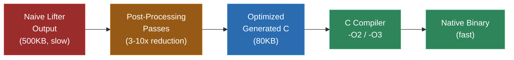
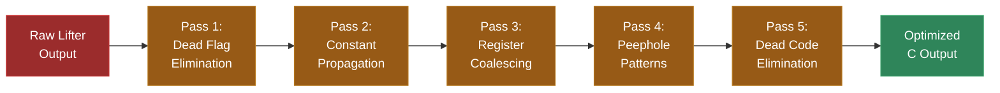

# Module 19: Optimization and Post-Processing Generated C

The C code that comes out of a lifter is correct. It is also, in most cases, terrible. Not wrong -- terrible in the way that machine-translated prose is terrible. Every word is technically right, but no human would ever write it that way. The lifter translates each instruction faithfully, one at a time, without understanding the programmer's intent. The result is code that works but that the C compiler struggles to optimize, that is 10-50x larger than hand-written equivalent code, and that runs slower than it needs to.

Here is a real example. A simple Game Boy function that adds two 8-bit numbers and stores the result:

```asm
; Original SM83 assembly (4 instructions, 5 bytes)
    LD A, [HL]      ; Load value from memory
    ADD A, B        ; Add B to A
    LD [HL], A      ; Store result
    RET             ; Return
```

A naive lifter produces this:

```c
// Naive lifted C (24 lines)
void func_0x0200(SM83Context *ctx) {
    // LD A, [HL]
    uint16_t hl_0 = ((uint16_t)ctx->h << 8) | ctx->l;
    ctx->a = mem_read_u8(hl_0);

    // ADD A, B
    uint8_t old_a = ctx->a;
    uint16_t result = (uint16_t)ctx->a + (uint16_t)ctx->b;
    ctx->a = (uint8_t)result;
    ctx->f = (ctx->f & 0x00);  // Clear all flags
    if (ctx->a == 0) ctx->f |= 0x80;  // Z flag
    // N flag = 0 (already cleared)
    if (((old_a & 0x0F) + (ctx->b & 0x0F)) > 0x0F) ctx->f |= 0x20;  // H flag
    if (result > 0xFF) ctx->f |= 0x10;  // C flag

    // LD [HL], A
    uint16_t hl_1 = ((uint16_t)ctx->h << 8) | ctx->l;
    mem_write_u8(hl_1, ctx->a);

    // RET
    uint16_t ret_addr = mem_read_u8(ctx->sp);
    ret_addr |= (uint16_t)mem_read_u8(ctx->sp + 1) << 8;
    ctx->sp += 2;
    ctx->pc = ret_addr;
}
```

A human would write this:

```c
// Hand-optimized equivalent (3 lines of logic)
void func_0x0200(SM83Context *ctx) {
    uint16_t addr = REG_HL(ctx);
    mem_write_u8(addr, mem_read_u8(addr) + ctx->b);
}
```

The naive version computes flags that will never be read (the next instruction is a store, which does not check flags, and the RET does not check flags either). It recomputes HL twice (it did not change between the two uses). It includes a full RET implementation even though the function's caller will handle the return. And it uses 24 lines to express 3 lines of logic.

This module is about bridging that gap. Not by hand -- you do not want to manually optimize thousands of generated functions. By teaching you how to build optimization passes that automatically clean up lifter output, and by understanding what the C compiler can and cannot do for you.

---

## 1. Why Optimization Matters

You might be thinking: "The C compiler is an amazing optimizer. Why not just let it handle everything?" That is a reasonable question, and the answer is: the C compiler DOES handle a lot, but generated code has patterns that defeat standard compiler optimizations.

### What the Compiler Can Do

Modern C compilers (GCC, Clang, MSVC) are extraordinary optimizers. Given well-structured code, they can:

- **Eliminate dead stores**: If a variable is written and never read, the write is removed.
- **Constant fold**: If both operands of an operation are known at compile time, the operation is computed at compile time.
- **Inline functions**: Small, frequently called functions are inlined into their callers.
- **Register allocate**: Translate C local variables into CPU registers efficiently.
- **Vectorize loops**: Recognize loops that can use SIMD instructions.
- **Simplify control flow**: Eliminate redundant branches, merge basic blocks.

### What the Compiler Cannot Do

But the compiler cannot:

- **Eliminate dead flag computations when flags are in a struct member**: If the lifter writes `ctx->f` (the flags register) and no subsequent code reads `ctx->f` before the next write, the compiler can theoretically eliminate the dead store. But because `ctx` is a pointer to a struct, the compiler often cannot prove that `ctx->f` is not aliased -- some other pointer might read it. The flag computation survives.

- **Recognize that HL was not modified between two uses**: The compiler sees two separate computations of `((uint16_t)ctx->h << 8) | ctx->l`. It could combine them (common subexpression elimination), and often does. But if there is a `mem_write_u8` call between them, the compiler may not be able to prove that the memory write does not modify `ctx->h` or `ctx->l` through an alias. So it recomputes HL.

- **Understand that a sequence of instructions implements memcpy**: The lifter produces a loop that reads one byte at a time and writes it to another address. A human recognizes this as `memcpy`. The compiler might too, if the loop is structured cleanly -- but generated code loops are often structured as a series of conditional jumps translated literally from assembly, which the compiler's pattern recognizer does not handle.

- **Remove entire functions that are never called**: Dead code elimination at the function level requires whole-program analysis. With separate compilation (each .c file compiled independently), the compiler cannot know that a function in one file is never called from any other file. The linker can sometimes do this (`--gc-sections` on GCC/Clang), but it is not always effective.

### The Optimization Opportunity

The gap between naive lifter output and well-optimized C is enormous. In a Game Boy recompilation, the generated code might be 500KB where a hand-written equivalent would be 50KB. In an N64 recompilation, the generated code might be 50MB where hand-optimized code would be 5MB. This matters for:

- **Compile time**: More code takes longer to compile. 50MB of C can take minutes to compile even with unity builds.
- **Cache performance**: Larger code footprint means more instruction cache misses, which means slower execution.
- **Binary size**: A 50MB executable is harder to distribute and load than a 5MB one.
- **Readability**: If you ever need to debug the generated code, smaller and cleaner is easier to understand.

The optimizations in this module typically achieve a 3-10x reduction in generated code size and a 2-5x improvement in execution speed, on top of what the C compiler provides. Combined with C compiler optimization at `-O2` or `-O3`, the result is often within 2x of hand-written C for the same logic.



---

## 2. What the C Compiler Already Does for You

Before writing any optimization passes, understand what the compiler gives you for free. This avoids duplicating work and helps you focus on the optimizations that actually matter.

### Constant Folding and Propagation

```c
// Generated code (lifter computes these at lift time but emits as runtime ops):
uint16_t addr = 0x0040;  // LY register address
uint8_t val = mem_read_u8(addr);

// The compiler folds this to:
uint8_t val = mem_read_u8(0x0040);
```

The compiler handles all constant arithmetic. You do not need to pre-compute `0x4000 + 0x200` in your lifter -- the compiler will.

### Dead Store Elimination (Local Variables)

```c
// Generated code with an unused temporary:
uint8_t temp = ctx->a;  // Save old A for flag computation
ctx->a = (uint8_t)(ctx->a + ctx->b);
// temp is never used after this point

// The compiler eliminates the temp variable entirely.
```

For local variables, the compiler is good at dead store elimination. The problem is that lifters often write to struct members (`ctx->f`, `ctx->a`) rather than local variables, which is harder for the compiler to analyze.

### Common Subexpression Elimination

```c
// Generated code recomputes HL multiple times:
uint16_t hl1 = ((uint16_t)ctx->h << 8) | ctx->l;
ctx->a = mem_read_u8(hl1);
uint16_t hl2 = ((uint16_t)ctx->h << 8) | ctx->l;
mem_write_u8(hl2, ctx->a + 1);

// IF the compiler can prove nothing changed h or l between uses,
// it combines to one computation.
```

The compiler does this when it can prove safety. The `restrict` keyword (Section 11) helps the compiler prove safety more often.

### Branch Simplification

```c
// Generated code with a trivially true condition:
if (1) {
    // ... code ...
}

// The compiler removes the branch entirely.
```

### What the Compiler Struggles With

The compiler struggles with optimizations that require understanding the semantics of the original program:

1. **Flag liveness**: Does the Z flag set by this ADD ever get tested before the next instruction that sets Z? The compiler does not know what "flags" are -- it just sees struct member writes.

2. **Memory aliasing**: Does `mem_write_u8(addr, val)` modify `ctx->h`? The compiler does not know -- `mem_write_u8` is an opaque function call that could do anything.

3. **Cross-function patterns**: Is this sequence of 5 functions actually a `memcpy` loop? The compiler optimizes within functions but has limited cross-function visibility (LTO helps but is not a panacea).

4. **Redundant context access**: The generated code reads `ctx->a`, modifies it, writes it back, then immediately reads it again. The compiler should optimize this, but aliasing concerns often prevent it.

These are the problems your optimization passes should target.

---

## 3. Dead Code Elimination

Dead code elimination (DCE) removes functions and code paths that can never be reached during execution. In a recompilation project, DCE is valuable because the lifter often generates functions for every address that looks like a function entry point, including functions that are never actually called.

### Function-Level DCE

The simplest form: remove generated functions that no other generated function calls and that are not in the dispatch table.

```python
# In your lifter or post-processor
def eliminate_dead_functions(functions, entry_points, dispatch_targets):
    """Remove functions that are never called."""
    # Build a call graph
    called = set(entry_points) | set(dispatch_targets)
    changed = True
    while changed:
        changed = False
        for func in functions:
            if func.address in called:
                for target in func.call_targets:
                    if target not in called:
                        called.add(target)
                        changed = True

    # Remove uncalled functions
    live = [f for f in functions if f.address in called]
    dead = [f for f in functions if f.address not in called]

    print(f"DCE: {len(dead)} dead functions removed, {len(live)} remain")
    return live
```

This is a simple reachability analysis on the call graph, starting from the entry points and dispatch table targets. Any function not reachable from these roots is dead.

### Unreachable Code Within Functions

Within a function, some basic blocks may be unreachable -- they exist in the original binary (maybe as error handling or debug code) but no control flow path reaches them:

```c
void func_0x1000(SM83Context *ctx) {
    if (ctx->a == 0) {
        // ... handle zero case ...
        return;
    }
    // ... handle non-zero case ...
    return;

    // Unreachable: the original binary had code here, but both paths above return
    ctx->b = 0xFF;  // Dead code
    mem_write_u8(0xC000, ctx->b);
}
```

The C compiler handles this if the unreachability is obvious (code after an unconditional return). But if the unreachability depends on invariants that only hold in the original program (e.g., "A is never 5 at this point"), the compiler cannot prove it and keeps the dead code.

### Data DCE

The lifter may emit data tables (ROM data, jump tables) that are never referenced by the live code. After function-level DCE, scan the remaining code for data references and remove unreferenced data:

```python
def eliminate_dead_data(data_sections, live_functions):
    """Remove data that is not referenced by any live function."""
    referenced_addrs = set()
    for func in live_functions:
        for ref in func.data_references:
            referenced_addrs.add(ref)

    live_data = [d for d in data_sections if d.address in referenced_addrs]
    dead_data = [d for d in data_sections if d.address not in referenced_addrs]

    total_dead = sum(d.size for d in dead_data)
    print(f"Data DCE: {len(dead_data)} sections removed ({total_dead} bytes)")
    return live_data
```

---

## 4. Flag Computation Elimination

This is the single most impactful optimization for generated code from CISC and 8-bit architectures. On the SM83, 6502, and x86, nearly every arithmetic and logic instruction updates the flags register. But most of those flag updates are never read -- the next instruction that sets flags overwrites them.

### The Problem

Consider this sequence:

```asm
    ADD A, B        ; Sets Z, N, H, C flags
    LD [HL], A      ; Does not read or set any flags
    LD A, [DE]      ; Does not read or set any flags
    CP A, 0x10      ; Sets Z, N, H, C flags (overwrites the ADD's flags)
    JR Z, label     ; Reads Z flag (from the CP, not the ADD)
```

The ADD instruction sets four flags. None of them are ever read -- the CP instruction overwrites all four before any branch checks them. The lifter does not know this (it processes one instruction at a time), so it emits the full flag computation for both ADD and CP:

```c
// Naive: 8 lines of flag computation for ADD, all dead
uint8_t old_a = ctx->a;
uint16_t result = (uint16_t)ctx->a + (uint16_t)ctx->b;
ctx->a = (uint8_t)result;
ctx->f = 0;
if (ctx->a == 0) ctx->f |= 0x80;  // Z -- DEAD, overwritten by CP
if (((old_a & 0xF) + (ctx->b & 0xF)) > 0xF) ctx->f |= 0x20;  // H -- DEAD
if (result > 0xFF) ctx->f |= 0x10;  // C -- DEAD

// ... LD [HL], A (no flag changes) ...
// ... LD A, [DE] (no flag changes) ...

// CP A, 0x10 -- overwrites all flags
ctx->f = 0;
if (ctx->a == 0x10) ctx->f |= 0x80;  // Z -- LIVE (read by JR Z)
ctx->f |= 0x40;  // N=1 for subtraction
if ((ctx->a & 0xF) < (0x10 & 0xF)) ctx->f |= 0x20;  // H
if (ctx->a < 0x10) ctx->f |= 0x10;  // C

// JR Z, label
if (ctx->f & 0x80) goto label;
```

Those 4 lines of flag computation for the ADD are pure waste. In typical generated code, **60-80% of flag computations are dead**. Removing them reduces code size by 30-50% and noticeably improves performance.

### Flag Liveness Analysis

To determine which flag computations are dead, perform backward liveness analysis across the instruction stream:

```python
class FlagLivenessAnalyzer:
    """Determine which flag computations are actually read."""

    # For each instruction, which flags it reads and which it writes
    # (This is ISA-specific -- here's SM83)
    FLAG_EFFECTS = {
        'ADD':  {'reads': set(),           'writes': {'Z', 'N', 'H', 'C'}},
        'SUB':  {'reads': set(),           'writes': {'Z', 'N', 'H', 'C'}},
        'AND':  {'reads': set(),           'writes': {'Z', 'N', 'H', 'C'}},
        'OR':   {'reads': set(),           'writes': {'Z', 'N', 'H', 'C'}},
        'XOR':  {'reads': set(),           'writes': {'Z', 'N', 'H', 'C'}},
        'CP':   {'reads': set(),           'writes': {'Z', 'N', 'H', 'C'}},
        'INC':  {'reads': set(),           'writes': {'Z', 'N', 'H'}},  # C unchanged
        'DEC':  {'reads': set(),           'writes': {'Z', 'N', 'H'}},
        'RL':   {'reads': {'C'},           'writes': {'Z', 'N', 'H', 'C'}},
        'RR':   {'reads': {'C'},           'writes': {'Z', 'N', 'H', 'C'}},
        'JR_Z': {'reads': {'Z'},           'writes': set()},
        'JR_NZ':{'reads': {'Z'},           'writes': set()},
        'JR_C': {'reads': {'C'},           'writes': set()},
        'JR_NC':{'reads': {'C'},           'writes': set()},
        'RET_Z':{'reads': {'Z'},           'writes': set()},
        'ADC':  {'reads': {'C'},           'writes': {'Z', 'N', 'H', 'C'}},
        'SBC':  {'reads': {'C'},           'writes': {'Z', 'N', 'H', 'C'}},
        'DAA':  {'reads': {'N', 'H', 'C'},'writes': {'Z', 'H', 'C'}},
        'SCF':  {'reads': set(),           'writes': {'N', 'H', 'C'}},
        'CCF':  {'reads': {'C'},           'writes': {'N', 'H', 'C'}},
        'PUSH_AF': {'reads': {'Z','N','H','C'}, 'writes': set()},
        'POP_AF':  {'reads': set(),        'writes': {'Z', 'N', 'H', 'C'}},
        # LD, CALL, RET, JP, HALT, NOP, etc. neither read nor write flags
    }

    def analyze_block(self, instructions):
        """Backward pass: determine which flag writes are live."""
        live_flags = set()  # Flags that are live at the current point

        # Walk backward through the block
        for instr in reversed(instructions):
            effects = self.FLAG_EFFECTS.get(instr.mnemonic, {'reads': set(), 'writes': set()})

            # This instruction reads some flags -- those are live before this point
            live_flags |= effects['reads']

            # This instruction writes some flags -- mark whether the write is live
            for flag in effects['writes']:
                instr.flag_live[flag] = flag in live_flags

            # After writing, those flags are no longer live (this instruction provides them)
            live_flags -= effects['writes']

        return live_flags  # Flags that are live at block entry (needed from predecessors)
```

### Applying the Analysis

Once you know which flag writes are dead, the lifter (or a post-processing pass) skips the dead computations:

```c
// After flag liveness analysis: only Z flag from CP is live
// ADD A, B -- all flags dead, skip flag computation entirely
uint16_t result = (uint16_t)ctx->a + (uint16_t)ctx->b;
ctx->a = (uint8_t)result;
// (no flag computation)

// ... LD [HL], A ...
// ... LD A, [DE] ...

// CP A, 0x10 -- Z flag is live (read by JR Z)
// Only compute Z flag, skip N, H, C
uint8_t z_flag = (ctx->a == 0x10) ? 1 : 0;
SET_FLAG_Z(ctx, z_flag);

// JR Z, label
if (FLAG_Z(ctx)) goto label;
```

The 8 lines of dead flag computation become 0 lines. The CP's flag computation drops from 4 computations to 1. This is a dramatic reduction.

### Cross-Block Analysis

The analysis above works within a basic block. For cross-block analysis (flag set in one block, read in another), you need to propagate liveness information through the CFG:

```python
def analyze_function_flags(function):
    """Whole-function flag liveness analysis using iterative dataflow."""
    blocks = function.basic_blocks

    # Initialize: live_out for each block is empty
    live_out = {block.id: set() for block in blocks}

    # Iterate until stable
    changed = True
    while changed:
        changed = False
        for block in blocks:
            # live_out = union of live_in of all successors
            new_live_out = set()
            for succ in block.successors:
                new_live_out |= analyze_block_live_in(succ, live_out[succ.id])

            if new_live_out != live_out[block.id]:
                live_out[block.id] = new_live_out
                changed = True

    # Now annotate each instruction with flag liveness
    for block in blocks:
        annotate_block_flags(block, live_out[block.id])
```

This is standard dataflow analysis from compiler theory, applied specifically to flag registers. It converges quickly (usually 2-3 iterations) because flag liveness does not have long dependency chains.

### Impact

In practice, flag computation elimination removes 60-80% of flag-related code from the generated output. For 8-bit targets (Game Boy, NES), where flags are updated by almost every instruction, this is a 30-50% reduction in total generated code size. For 32-bit RISC targets (ARM, MIPS), the impact is smaller because fewer instructions affect flags.

---

## 5. Register Coalescing

The naive lifter creates a new temporary variable for every intermediate result. Register coalescing reduces these temporaries by tracking which values are still needed (live) and which can be reused.

### The Problem

```c
// Naive: new temporary for every step
uint8_t temp_1 = ctx->a;              // Save A before operation
uint16_t temp_2 = (uint16_t)temp_1 + (uint16_t)ctx->b;  // Compute result
uint8_t temp_3 = (uint8_t)temp_2;     // Truncate to 8 bits
ctx->a = temp_3;                       // Store back to A
uint8_t temp_4 = ctx->a;              // Load A for next operation (same as temp_3!)
uint16_t temp_5 = (uint16_t)temp_4 + 0x01;  // Another add
ctx->a = (uint8_t)temp_5;
```

Three of these temporaries are unnecessary: `temp_3` is just the truncated `temp_2`, `temp_4` is the same as `temp_3` (which is the same as `ctx->a` which was just written). The compiler will likely optimize these away, but the generated code is noisy and hard to read.

### The Solution

Track which temporaries hold the same value and eliminate duplicates:

```c
// After coalescing:
uint16_t result1 = (uint16_t)ctx->a + (uint16_t)ctx->b;
ctx->a = (uint8_t)result1;
uint16_t result2 = (uint16_t)ctx->a + 1;
ctx->a = (uint8_t)result2;
```

Or even more aggressively, if you know A is not read between the two operations through any alias:

```c
// Fully coalesced:
ctx->a = (uint8_t)((uint16_t)ctx->a + (uint16_t)ctx->b);
ctx->a = ctx->a + 1;
```

### Implementation

Register coalescing in a lifter works by maintaining a value map:

```python
class ValueTracker:
    """Track which C variable currently holds the value of each register."""

    def __init__(self):
        self.reg_to_var = {}  # register name -> C variable name

    def get_register(self, reg):
        """Get the C expression for a register's current value."""
        if reg in self.reg_to_var:
            return self.reg_to_var[reg]
        return f'ctx->{reg}'

    def set_register(self, reg, expr):
        """Record that a register now holds the value of this expression."""
        self.reg_to_var[reg] = expr

    def invalidate(self, reg):
        """A function call or memory write may have changed this register via alias."""
        if reg in self.reg_to_var:
            del self.reg_to_var[reg]

    def invalidate_all(self):
        """A function call invalidates all tracked values."""
        self.reg_to_var.clear()
```

When the lifter encounters a `CALL` instruction (which might modify any register) or a `mem_write` (which might modify memory that backs a register on some architectures), it invalidates the affected tracked values, forcing subsequent code to re-read from `ctx`.

---

## 6. Memory Access Optimization

Generated code often accesses memory one byte at a time, even when the original hardware supports wider accesses. This is because the lifter treats each byte access independently.

### Byte-at-a-Time Pattern

The original code loads a 16-bit value from memory:

```asm
; Load 16-bit value from [HL] (little-endian)
LD A, [HL+]     ; Load low byte, increment HL
LD H, [HL]      ; Load high byte
LD L, A         ; HL now contains the 16-bit value from memory
```

The naive lifter produces three separate memory accesses:

```c
// Naive: three separate operations
ctx->a = mem_read_u8(REG_HL(ctx));
uint16_t hl = REG_HL(ctx);
SET_HL(ctx, hl + 1);
ctx->h = mem_read_u8(REG_HL(ctx));
ctx->l = ctx->a;
```

### Optimized Version

Recognize the pattern and emit a single 16-bit read:

```c
// Optimized: one 16-bit read
uint16_t addr = REG_HL(ctx);
uint16_t value = mem_read_u16(addr);
SET_HL(ctx, value);
```

This is both smaller and faster: `mem_read_u16` can be implemented as a single 16-bit memory access on the host, rather than two separate byte accesses with function call overhead.

### Pattern Recognition for Memory Idioms

Common memory access patterns to recognize and optimize:

**16-bit load (little-endian):**
```
LD A, [addr]      ->   uint16_t val = mem_read_u16(addr);
LD B, [addr+1]         ctx->b = val >> 8; ctx->a = val & 0xFF;
```

**Block copy (memcpy idiom):**
```
.loop:
    LD A, [HL+]     ->   memcpy(dest_base + DE, src_base + HL, count);
    LD [DE], A
    INC DE
    DEC BC
    JR NZ, .loop
```

**Block fill (memset idiom):**
```
.loop:
    LD [HL+], A     ->   memset(base + HL, ctx->a, count);
    DEC BC
    JR NZ, .loop
```

### Implementation: Peephole Pattern Matcher

A peephole optimizer examines small windows of instructions and replaces known patterns:

```python
class PeepholeOptimizer:
    """Replace known instruction patterns with optimized equivalents."""

    def __init__(self):
        self.patterns = [
            self.match_memcpy_loop,
            self.match_memset_loop,
            self.match_16bit_load,
            self.match_16bit_store,
        ]

    def optimize(self, instructions):
        """Apply all peephole patterns to the instruction list."""
        i = 0
        result = []
        while i < len(instructions):
            matched = False
            for pattern_fn in self.patterns:
                match_len, replacement = pattern_fn(instructions, i)
                if match_len > 0:
                    result.extend(replacement)
                    i += match_len
                    matched = True
                    break
            if not matched:
                result.append(instructions[i])
                i += 1
        return result

    def match_memcpy_loop(self, instrs, i):
        """Detect LD A,[HL+] / LD [DE],A / INC DE / DEC BC / JR NZ pattern."""
        if i + 4 >= len(instrs):
            return 0, []

        if (instrs[i].mnemonic == 'LD' and instrs[i].dst == 'A' and instrs[i].src == '[HL+]' and
            instrs[i+1].mnemonic == 'LD' and instrs[i+1].dst == '[DE]' and instrs[i+1].src == 'A' and
            instrs[i+2].mnemonic == 'INC' and instrs[i+2].dst == 'DE' and
            instrs[i+3].mnemonic == 'DEC' and instrs[i+3].dst == 'BC' and
            instrs[i+4].mnemonic == 'JR' and instrs[i+4].condition == 'NZ' and
            instrs[i+4].target == instrs[i].address):
            # This is a memcpy loop
            return 5, [SyntheticInstruction('MEMCPY', dst='DE', src='HL', count='BC')]

        return 0, []
```

The synthetic `MEMCPY` instruction is then emitted as a direct `memcpy` call in the generated C:

```c
// Emitted for the MEMCPY synthetic instruction:
{
    uint16_t count = REG_BC(ctx);
    for (uint16_t i = 0; i < count; i++) {
        mem_write_u8(REG_DE(ctx) + i, mem_read_u8(REG_HL(ctx) + i));
    }
    SET_HL(ctx, REG_HL(ctx) + count);
    SET_DE(ctx, REG_DE(ctx) + count);
    SET_BC(ctx, 0);
}
```

Or, if you are confident the memory regions are contiguous and non-overlapping, a real `memcpy`:

```c
memcpy(&memory[REG_DE(ctx)], &memory[REG_HL(ctx)], REG_BC(ctx));
SET_HL(ctx, REG_HL(ctx) + REG_BC(ctx));
SET_DE(ctx, REG_DE(ctx) + REG_BC(ctx));
SET_BC(ctx, 0);
```

---

## 7. Pattern Recognition: Replacing Common Instruction Sequences

Beyond memory idioms, many instruction sequences in original binaries implement operations that have direct C equivalents. Recognizing and replacing these produces cleaner, faster generated code.

### Multiplication by Shift-Add

8-bit CPUs without multiply instructions implement multiplication using shifts and adds:

```asm
; Multiply A by 5 using shift-add
LD B, A         ; B = A (save original)
SLA A           ; A = A * 2
SLA A           ; A = A * 4
ADD A, B        ; A = A * 4 + A = A * 5
```

The naive lifter produces 4 separate operations with full flag computation. The optimized version:

```c
ctx->a = ctx->a * 5;
```

### Division by Shift

```asm
; Divide A by 8
SRA A           ; A = A >> 1 (arithmetic)
SRA A           ; A = A >> 2
SRA A           ; A = A >> 3 = A / 8
```

Optimized:

```c
ctx->a = (int8_t)ctx->a >> 3;  // Arithmetic right shift preserves sign
```

### 16-bit Arithmetic on 8-bit Registers

On 8-bit CPUs, 16-bit operations are done as pairs of 8-bit operations with carry:

```asm
; 16-bit addition: HL = HL + DE
ADD A, E        ; Low byte: A = L + E
LD L, A
LD A, H
ADC A, D        ; High byte with carry: A = H + D + carry
LD H, A
```

Wait -- this is actually wrong as written. The Game Boy has `ADD HL, DE` as a single instruction. But on 6502 and other architectures without 16-bit add, this pattern is common:

```asm
; 6502: 16-bit addition of two zero-page addresses
CLC             ; Clear carry for addition
LDA $10         ; Load low byte of first operand
ADC $12         ; Add low byte of second operand
STA $10         ; Store low byte of result
LDA $11         ; Load high byte of first operand
ADC $13         ; Add high byte of second operand (with carry from low byte)
STA $11         ; Store high byte of result
```

Optimized:

```c
uint16_t val1 = mem_read_u16(0x10);
uint16_t val2 = mem_read_u16(0x12);
uint16_t result = val1 + val2;
mem_write_u16(0x10, result);
// Set carry flag from the 16-bit addition
SET_FLAG_C(ctx, (uint32_t)val1 + (uint32_t)val2 > 0xFFFF);
```

### Loop Counter Detection

Many loops use a register as a counter, decrementing it and branching until zero:

```asm
    LD B, 10        ; Counter = 10
.loop:
    ; ... loop body ...
    DEC B           ; Counter--
    JR NZ, .loop    ; Loop if counter != 0
```

Naive lifter: emits a backward goto with flag computation on every DEC. Optimized: emit a C for-loop:

```c
for (int _counter = 10; _counter > 0; _counter--) {
    ctx->b = _counter;
    // ... loop body ...
}
ctx->b = 0;
```

This is cleaner, and the C compiler can vectorize or unroll the loop if the body is suitable.

---

## 8. Constant Folding Across Lifted Instructions

The lifter processes one instruction at a time and may not realize that a value is constant across multiple instructions. A post-processing pass can propagate constants through the generated code.

### Example

```c
// Generated (lifter does not track that A=0x00 after XOR A):
ctx->a = ctx->a ^ ctx->a;           // XOR A,A -> A = 0
// ... (A is not written between here and the next use) ...
uint16_t result = (uint16_t)ctx->a + 0x42;  // ADD A, 0x42
ctx->a = (uint8_t)result;
```

After constant propagation:

```c
ctx->a = 0;                          // XOR A,A is always 0
// ... (propagate the constant) ...
ctx->a = 0x42;                       // 0 + 0x42 = 0x42 (folded at lift time)
```

### Implementation

Constant propagation tracks which registers hold known values:

```python
class ConstantPropagator:
    def __init__(self):
        self.known_values = {}  # register -> value (if constant)

    def process_instruction(self, instr):
        if instr.mnemonic == 'XOR' and instr.dst == instr.src:
            # XOR R,R always produces 0
            self.known_values[instr.dst] = 0
            return f'ctx->{instr.dst} = 0;'

        elif instr.mnemonic == 'LD' and instr.src_type == 'immediate':
            # LD R, imm
            self.known_values[instr.dst] = instr.immediate
            return f'ctx->{instr.dst} = 0x{instr.immediate:02X};'

        elif instr.mnemonic == 'ADD' and instr.dst in self.known_values:
            if instr.src_type == 'immediate':
                # Both operands are known
                old_val = self.known_values[instr.dst]
                new_val = (old_val + instr.immediate) & 0xFF
                self.known_values[instr.dst] = new_val
                return f'ctx->{instr.dst} = 0x{new_val:02X};'
            elif instr.src in self.known_values:
                old_val = self.known_values[instr.dst]
                src_val = self.known_values[instr.src]
                new_val = (old_val + src_val) & 0xFF
                self.known_values[instr.dst] = new_val
                return f'ctx->{instr.dst} = 0x{new_val:02X};'

        # Any instruction we cannot constant-fold invalidates the destination
        if hasattr(instr, 'dst'):
            self.known_values.pop(instr.dst, None)

        # Function calls invalidate everything
        if instr.mnemonic in ('CALL', 'RST'):
            self.known_values.clear()

        return None  # No optimization applied, emit normally
```

### Limitations

Constant propagation across basic block boundaries requires the same iterative dataflow analysis as flag liveness. Within a single basic block, it is straightforward. Across blocks, you need to handle merge points (where two paths with different known values converge, the value is no longer known).

For most practical purposes, intra-block constant propagation is sufficient and catches the most common cases (initialization sequences, hard-coded addresses, loop setup).

---

## 9. Function Signature Recovery

The naive lifter gives every function the same signature: `void func_0xNNNN(CPUContext *ctx)`. All values are passed through the context struct. This defeats many compiler optimizations because the compiler cannot track individual values through struct member accesses as effectively as it can track function parameters.

### The Opportunity

Many original functions have simple calling conventions:

```asm
; Function that takes A as input and returns result in A
; (Common on Game Boy: A is the accumulator, used for most function parameters)
func_add_offset:
    ADD A, 0x10     ; A = A + 16
    RET
```

The naive lifter:

```c
void func_add_offset(SM83Context *ctx) {
    uint16_t result = (uint16_t)ctx->a + 0x10;
    ctx->a = (uint8_t)result;
    // ... flag computation ...
}
```

With signature recovery:

```c
uint8_t func_add_offset(uint8_t a) {
    return a + 0x10;
}
```

The optimized version is not only smaller -- it is fundamentally better for the compiler. The compiler can inline it, compute it at compile time if the argument is constant, and keep the value in a register instead of writing it to and reading it from the context struct.

### Analysis Required

To recover function signatures, you need to know:

1. **Which registers are inputs** (read before being written within the function)
2. **Which registers are outputs** (written within the function and read by the caller after return)
3. **Which registers are preserved** (not modified, or saved and restored)

```python
def analyze_function_signature(func, instructions):
    """Determine input and output registers for a function."""
    read_before_write = set()   # Inputs
    written = set()              # Modified registers
    all_registers = {'a', 'b', 'c', 'd', 'e', 'h', 'l', 'f'}

    for instr in instructions:
        # Track which registers are read before being written
        for reg in instr.reads:
            if reg in all_registers and reg not in written:
                read_before_write.add(reg)
        for reg in instr.writes:
            if reg in all_registers:
                written.add(reg)

    # Outputs: registers that are written and potentially read by caller
    # (Requires analysis of call sites -- for now, assume A is the return register)
    inputs = read_before_write
    outputs = written  # Conservative: everything written is potentially an output

    return inputs, outputs
```

Full signature recovery requires analyzing call sites to determine which registers the caller actually reads after the function returns. This is more complex but can dramatically improve code quality for frequently called utility functions.

### Gradual Adoption

You do not have to recover signatures for every function. Start with leaf functions (functions that do not call other functions) -- they are simplest to analyze. Then move to utility functions that are called frequently. Leave complex functions with their generic `(CPUContext *ctx)` signatures.

Even recovering signatures for 20% of functions (the frequently called utilities) can improve overall performance significantly, because those functions account for a disproportionate share of execution time.

---

## 10. Post-Processing Passes

Rather than implementing all optimizations inside the lifter, many projects use a separate post-processing step that cleans up the lifter's output. This keeps the lifter simple (focused on correctness) and the optimizer separate (focused on quality).

### Pass Architecture



Each pass takes the instruction-level IR (intermediate representation) as input and produces a modified IR as output. Passes can be run in sequence, and each pass's output feeds the next.

### Pass Ordering Matters

The order of passes affects the result:

1. **Dead flag elimination first**: Removes the largest amount of code, making subsequent passes faster.
2. **Constant propagation second**: Constants exposed by flag elimination (e.g., loading a constant that was previously obscured by dead flag stores) can now be folded.
3. **Register coalescing third**: After dead code and constants are handled, the remaining temporaries can be coalesced.
4. **Peephole patterns fourth**: With cleaner code from the previous passes, peephole patterns match more reliably.
5. **Dead code elimination last**: A final sweep removes anything that earlier passes made dead.

You can run multiple iterations (passes 1-5, then repeat) because each pass may enable further optimization by the others. In practice, 2-3 iterations are enough to reach a fixed point.

### Operating on an IR vs. Operating on C Text

There are two approaches to post-processing:

**IR-level optimization (recommended):** The lifter produces an intermediate representation (list of structured instruction objects), the optimizer transforms the IR, and then the code generator emits C from the optimized IR.

```python
# IR-level: optimizer sees structured data
class Instruction:
    def __init__(self, opcode, dst, src, flags_written, flags_read):
        self.opcode = opcode
        self.dst = dst
        self.src = src
        self.flags_written = flags_written
        self.flags_read = flags_read
        self.is_dead = False  # Set by DCE pass
```

**C-text-level optimization (simpler but limited):** The lifter produces C source code directly, and a post-processor performs text transformations (regex replacements, line deletion). This is simpler to implement but less powerful:

```python
# Text-level: optimizer sees strings
import re

def remove_dead_flag_stores(c_code):
    """Remove flag computation lines that are immediately overwritten."""
    lines = c_code.split('\n')
    result = []
    i = 0
    while i < len(lines):
        # Check if this is a flag store followed by another flag store
        if re.match(r'\s*ctx->f\s*=', lines[i]):
            # Look ahead: is the next non-whitespace, non-comment line also a flag store?
            j = i + 1
            while j < len(lines) and lines[j].strip() == '':
                j += 1
            if j < len(lines) and re.match(r'\s*ctx->f\s*=', lines[j]):
                # Skip this line (dead store)
                i += 1
                continue
        result.append(lines[i])
        i += 1
    return '\n'.join(result)
```

IR-level optimization is strictly more powerful and is what production projects use. Text-level optimization is a quick-and-dirty fallback when you do not have a proper IR.

---

## 11. Compiler Hints

Once your generated C code is as clean as your optimization passes can make it, you can add hints to help the C compiler optimize further.

### __builtin_expect (Branch Prediction)

If you know that a branch is almost always taken (or almost never taken), tell the compiler:

```c
// In the dispatch table: the "unknown target" case should never happen
if (__builtin_expect(target_addr == 0x1000, 1)) {
    func_0x1000(ctx);
} else if (__builtin_expect(target_addr == 0x2000, 1)) {
    func_0x2000(ctx);
} else {
    // This should rarely execute
    fprintf(stderr, "Unknown target: 0x%04X\n", target_addr);
}
```

More practically, use it for error checks:

```c
uint8_t mem_read_u8(uint16_t addr) {
    if (__builtin_expect(addr >= 0xFF00, 0)) {
        return io_read(addr);  // MMIO access -- rare compared to normal memory
    }
    return memory[addr];
}
```

### restrict (Pointer Aliasing)

The `restrict` qualifier tells the compiler that a pointer does not alias with any other pointer. This is enormously valuable for generated code because it allows the compiler to optimize struct member accesses:

```c
// Without restrict: compiler must assume mem_read_u8 might modify ctx->h or ctx->l
void func_0x0200(SM83Context *ctx) {
    uint16_t hl = REG_HL(ctx);
    ctx->a = mem_read_u8(hl);      // After this call, compiler cannot trust ctx->h, ctx->l
    mem_write_u8(hl, ctx->a + 1);  // Must re-read hl from ctx -- cannot reuse the local
}

// With restrict on the mem_ functions:
uint8_t mem_read_u8_r(uint16_t addr);  // Does not modify any CPUContext
void mem_write_u8_r(uint16_t addr, uint8_t val);  // Does not modify any CPUContext

// Now the compiler can reuse the local `hl` across the calls
```

Even better, declare the context pointer as restrict:

```c
void func_0x0200(SM83Context * restrict ctx) {
    // The compiler knows no other pointer aliases ctx
    // All ctx-> accesses can be cached in registers
}
```

### inline for Hot Functions

Small, frequently called shim functions benefit from `inline`:

```c
static inline uint8_t mem_read_u8(uint16_t addr) {
    if (addr < 0x8000) return rom[addr];
    if (addr < 0xA000) return vram[addr - 0x8000];
    // ...
    return memory[addr];
}
```

With LTO (link-time optimization), the compiler can inline across translation units even without the `inline` keyword. But explicit `inline` helps when LTO is not enabled (debug builds, for example).

### __attribute__((hot)) and __attribute__((cold))

GCC and Clang support attributes that hint about function hotness:

```c
// The main loop is hot -- optimize aggressively
__attribute__((hot))
void func_main_loop(SM83Context *ctx) {
    // ...
}

// Error handlers are cold -- do not waste code cache on them
__attribute__((cold))
void handle_unknown_opcode(uint8_t opcode) {
    fprintf(stderr, "Unknown opcode: 0x%02X\n", opcode);
    abort();
}
```

The compiler places `hot` functions in a separate section that stays in the instruction cache, and places `cold` functions far away where they do not pollute the cache.

For generated code, you can automatically determine hotness by profiling (Section 12) and annotating the top 10% of functions as hot.

---

## 12. Profile-Guided Optimization

Profile-guided optimization (PGO) uses runtime profiling data to make better optimization decisions. For recompilation projects, PGO is surprisingly effective because the execution profile is highly predictable (the same functions are called in the same patterns every frame).

### How PGO Works

1. **Instrumented build**: Compile with profiling instrumentation (`-fprofile-generate` on GCC/Clang, `/GL` + `/GENPROFILE` on MSVC). This adds counters to every branch and function call.
2. **Profile run**: Run the instrumented binary with a representative workload (play the game for a few minutes, or replay an input recording).
3. **Optimized build**: Recompile with the profile data (`-fprofile-use` on GCC/Clang, `/USEPROFILE` on MSVC). The compiler uses the profiling data to:
   - Inline hot functions more aggressively
   - Optimize hot paths and de-optimize cold paths
   - Improve branch prediction hints
   - Lay out basic blocks for better cache behavior

### CMake Integration

```cmake
# PGO support
option(PGO_GENERATE "Build with PGO instrumentation" OFF)
option(PGO_USE "Build with PGO optimization (requires profile data)" OFF)

if(PGO_GENERATE)
    if(CMAKE_C_COMPILER_ID MATCHES "GNU|Clang")
        add_compile_options(-fprofile-generate=${CMAKE_BINARY_DIR}/profdata)
        add_link_options(-fprofile-generate=${CMAKE_BINARY_DIR}/profdata)
    elseif(MSVC)
        add_compile_options(/GL)
        add_link_options(/LTCG /GENPROFILE)
    endif()
elseif(PGO_USE)
    if(CMAKE_C_COMPILER_ID MATCHES "GNU|Clang")
        add_compile_options(-fprofile-use=${CMAKE_BINARY_DIR}/profdata)
        add_link_options(-fprofile-use=${CMAKE_BINARY_DIR}/profdata)
    elseif(MSVC)
        add_compile_options(/GL)
        add_link_options(/LTCG /USEPROFILE)
    endif()
endif()
```

Usage:

```bash
# Step 1: Instrumented build
cmake -B build-pgo -DPGO_GENERATE=ON -DCMAKE_BUILD_TYPE=Release
cmake --build build-pgo

# Step 2: Profile run (play the game or replay input)
./build-pgo/recomp --playback-input test_input.bin rom.gb

# Step 3: Optimized build using profile data
cmake -B build-pgo -DPGO_GENERATE=OFF -DPGO_USE=ON -DCMAKE_BUILD_TYPE=Release
cmake --build build-pgo
```

### Impact

PGO typically provides a 10-30% performance improvement on top of `-O2` for recompiled code. The improvement comes primarily from:
- **Better inlining decisions**: The compiler knows which functions are called millions of times (inline them) vs. called once during initialization (do not inline).
- **Better branch layout**: Hot branches are fall-through; cold branches are jumps. This improves instruction cache utilization.
- **Better function layout**: Hot functions are placed close together in the binary, improving locality.

For a recompilation project where the execution profile is very stable (the game loop calls the same functions every frame), PGO is particularly effective.

---

## 13. When NOT to Optimize

This section is short and important.

**Do not optimize until you are correct.** If your recompilation has bugs, optimizing will make them harder to find. Dead flag elimination removes flag computations -- but what if one of the flags you "eliminated" was actually needed on a code path your liveness analysis missed? Constant propagation folds values -- but what if the value is not actually constant due to a memory-mapped register you forgot about?

**Always have a way to disable optimizations.** Every optimization pass should be individually toggleable:

```python
# In your lifter configuration:
OPTIMIZE_FLAGS = True          # Dead flag elimination
OPTIMIZE_CONSTANTS = True      # Constant propagation
OPTIMIZE_REGISTERS = True      # Register coalescing
OPTIMIZE_PEEPHOLE = True       # Peephole pattern matching
OPTIMIZE_DCE = True            # Dead code elimination
```

When you encounter a bug in the recompiled code, the first debugging step is to disable all optimization passes and verify that the unoptimized output is correct. If the bug disappears, the bug is in one of your optimization passes. Binary search through the passes to find which one.

**Correctness is more valuable than performance.** A recompiled game that runs at 200fps but has a subtle rendering glitch is worse than one that runs at 60fps but is pixel-perfect. Users tolerate slow. Users do not tolerate wrong.

**Measure before optimizing.** Before spending a week implementing flag elimination, profile the generated code. Is flag computation actually the bottleneck? If 90% of execution time is in `mem_read_u8` (the memory access function), optimizing flags will produce negligible speedup. Profile first, then optimize the actual bottleneck.

---

## 14. Measuring Performance

You need to measure performance to know whether your optimizations are working and to identify where the real bottlenecks are.

### Basic Frame Timing

```c
// In your main loop:
#include <SDL2/SDL.h>

uint64_t frame_start, frame_end;
uint64_t total_frames = 0;
uint64_t total_time_ms = 0;

void main_loop(SM83Context *ctx) {
    while (1) {
        frame_start = SDL_GetPerformanceCounter();

        // Run one frame of the recompiled game
        run_frame(ctx);

        frame_end = SDL_GetPerformanceCounter();
        uint64_t elapsed = (frame_end - frame_start) * 1000 / SDL_GetPerformanceFrequency();
        total_time_ms += elapsed;
        total_frames++;

        if (total_frames % 600 == 0) {  // Every 10 seconds at 60fps
            double avg_ms = (double)total_time_ms / (double)total_frames;
            double fps = 1000.0 / avg_ms;
            printf("Performance: %.1f fps (%.2f ms/frame)\n", fps, avg_ms);
        }

        // Frame pacing: wait if we are ahead of real time
        if (elapsed < 16) {
            SDL_Delay(16 - (uint32_t)elapsed);
        }
    }
}
```

### Profiling with Platform Tools

**Linux:** `perf` is the best profiling tool for understanding where time is spent:

```bash
# Record profile data
perf record -g ./recomp rom.gb

# View the profile
perf report
```

`perf` shows you which functions take the most time, which call paths are hottest, and where cache misses occur. This is invaluable for identifying bottlenecks.

**Windows:** Visual Studio's built-in profiler or Intel VTune:

```bash
# Visual Studio: open the project, Debug > Performance Profiler > CPU Usage
# Or from command line with VS developer tools:
VSDiagnostics.exe start mySession /launch:recomp.exe /launchArgs:"rom.gb"
```

**macOS:** Instruments (Xcode's profiler):

```bash
xcrun xctrace record --template "Time Profiler" --launch ./recomp rom.gb
```

### What to Look For

Typical bottleneck profile for a recompilation project:

| Component | Typical Time Share | Notes |
|---|---|---|
| `mem_read_u8` / `mem_write_u8` | 30-50% | Memory access dominates. Inline these! |
| Flag computation | 10-30% | Eliminated by flag DCE pass |
| Dispatch table lookups | 5-15% | For indirect calls |
| Generated code (logic) | 10-20% | The actual translated instructions |
| Graphics rendering | 5-20% | SDL texture updates, pixel writes |
| SDL event polling | 1-5% | Usually not a bottleneck |

If `mem_read_u8` is 40% of execution time, the single most impactful optimization is inlining it (declare it `static inline` or use LTO). If flag computation is 25%, flag elimination is your highest-priority pass. If the dispatch table is 15%, consider using a hash map instead of a switch statement (or ensure the switch is compiled as a jump table).

### Benchmarking: Recompiled vs Emulated vs Original

The ultimate performance comparison is recompiled code vs. an interpreter-based emulator vs. original hardware:

```
Target: Game Boy Tetris
Platform: Intel i7-12700K, Windows 11

Original Game Boy:         4.19 MHz (1.0x reference)
Interpreter emulator:      ~500 MHz effective (120x)
Static recompilation:      ~2000 MHz effective (480x)
```

Static recompilation should be 2-10x faster than a well-written interpreter emulator for the same target, because:
1. No instruction decode overhead at runtime (done at compile time)
2. The C compiler optimizes the generated code (register allocation, branch prediction)
3. Memory access patterns are known to the compiler (can prefetch, cache efficiently)

If your recompilation is SLOWER than an emulator, something is wrong -- probably excessive function call overhead (inline your memory functions), or the dispatch table is being hit too often (improve static resolution of indirect calls), or your generated code is so large it thrashes the instruction cache (enable DCE and flag elimination).

---

## Summary

Optimization of generated code is a spectrum from "naive but correct" to "highly optimized and still correct." The key techniques, in order of impact:

1. **Flag computation elimination** (30-50% code reduction on 8-bit targets). The biggest win for the smallest effort. Implement this first.

2. **Dead code elimination** (removes 10-40% of generated functions). Simple reachability analysis removes functions that are never called.

3. **Memory access optimization** (recognizing memcpy, memset, 16-bit loads). Reduces function call overhead and enables wider host memory accesses.

4. **Constant propagation and folding** (reduces computation and code size). Straightforward to implement within basic blocks.

5. **Compiler hints** (restrict, inline, hot/cold attributes). Free performance for minimal effort. Just annotate your shim functions.

6. **Profile-guided optimization** (10-30% improvement). No code changes needed, just a profiling workflow.

7. **Register coalescing and function signature recovery** (cleaner code, better compiler optimization). More complex to implement, but improves both performance and readability.

And the most important rule: **correctness first, always.** Every optimization pass should be individually disableable. Every optimization should be tested by running the full regression suite before and after. Never ship an optimization that you cannot back out.

The generated code from your lifter will never look like hand-written C. That is fine. It does not need to be beautiful -- it needs to be correct and fast enough. With the techniques in this module, "fast enough" means within 2x of hand-written performance, at a fraction of the development cost. That is the whole value proposition of static recompilation: you trade some runtime performance for a massive reduction in development time. The optimization passes in this module make that tradeoff more favorable.