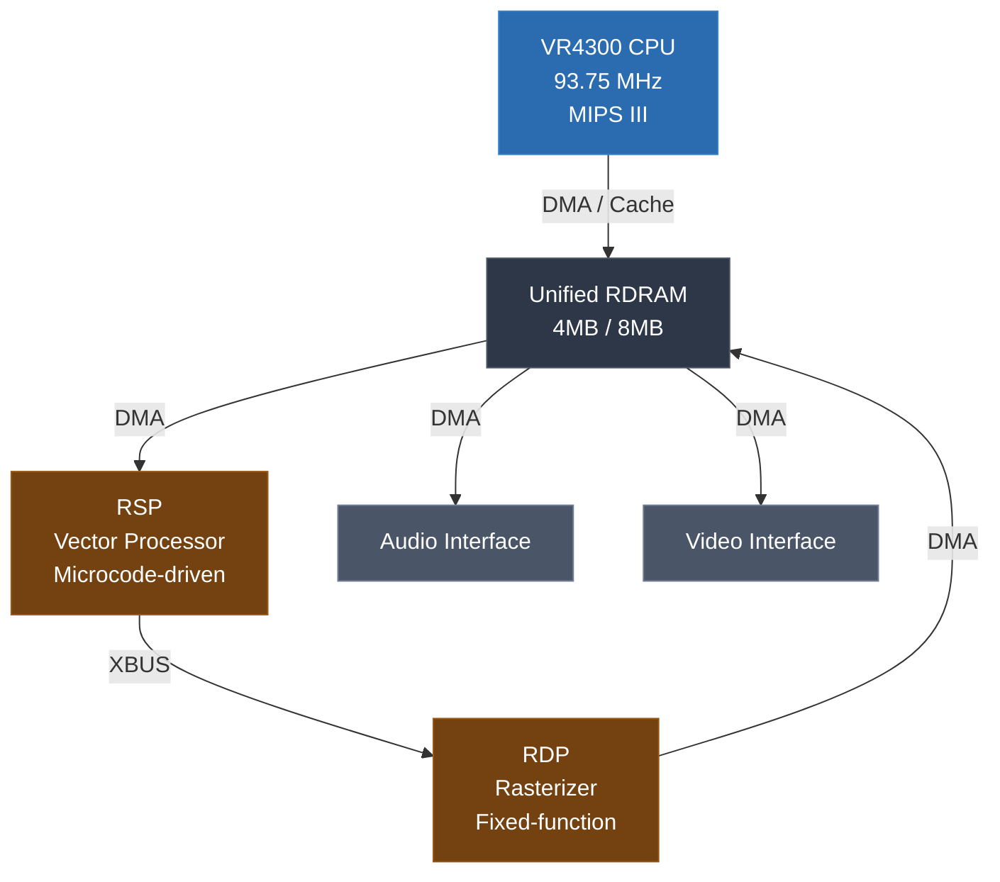
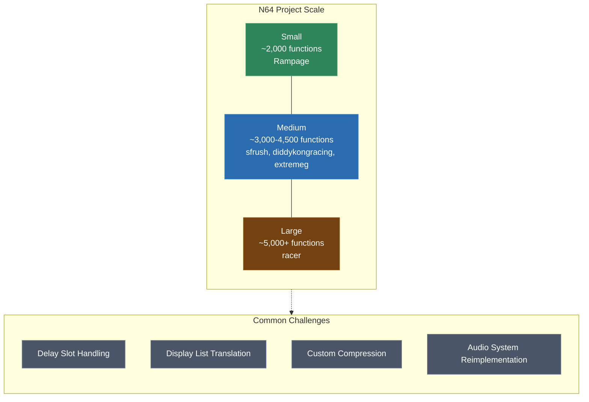

# Module 20: N64 and MIPS

The Nintendo 64 is a landmark platform for static recompilation. Its MIPS R4300i CPU produces clean, analyzable code, but its Reality Coprocessor -- a combination vector processor and rasterizer -- introduces complexity that goes far beyond instruction lifting. N64 recompilation is where this technique proved it could scale to real 3D games, and the tooling that emerged around it has become the most mature in the static recompilation ecosystem.

This module covers the N64 hardware, the MIPS-specific challenges that affect code generation, the N64Recomp tool ecosystem, graphics translation via RT64, and lessons learned from real shipping projects.

---

## 1. The N64 Platform

The Nintendo 64 was released in 1996 with hardware that was ambitious for its era and idiosyncratic in ways that matter deeply for recompilation.

### CPU: MIPS R4300i (VR4300)

The VR4300 is a 64-bit MIPS III processor clocked at 93.75 MHz. In practice, nearly all N64 games run in 32-bit mode -- they use 32-bit addresses and 32-bit integer operations almost exclusively. The 64-bit capability exists but is rarely exercised beyond a few kernel-level routines.

Key characteristics:

- **5-stage pipeline** with branch delay slots
- **32 general-purpose registers** (R0 is hardwired to zero)
- **32 floating-point registers** (used as 32 singles or 16 doubles)
- **HI/LO registers** for multiply and divide results
- **TLB** with 32 entries for virtual memory (used by some games)
- Big-endian byte ordering

### Memory

The system has 4MB of unified RDRAM, expandable to 8MB with the Expansion Pak. There is no separate VRAM -- the framebuffer, Z-buffer, textures, and audio buffers all compete for the same memory pool. This unified memory model means the CPU, RSP, and RDP all share a single address space, which simplifies DMA but creates bandwidth pressure.

### Reality Coprocessor (RCP)

The RCP is the heart of what makes N64 recompilation challenging. It contains two sub-processors:



**RSP (Reality Signal Processor)**: A custom vector processor running at 62.5 MHz with its own 4KB instruction memory (IMEM) and 4KB data memory (DMEM). The RSP executes **microcode** -- small programs loaded by each game to perform vertex transformation, lighting, clipping, audio mixing, and other tasks. There is no single standard microcode; Nintendo provided several (Fast3D, F3DEX, F3DEX2), but games could and did ship custom microcode.

**RDP (Reality Display Processor)**: A fixed-function rasterizer that receives commands from the RSP. It handles triangle rasterization, texture mapping, color combining, blending, and Z-buffering. The RDP command format is well-documented and consistent across games.

### No Standard OS

The N64 has no operating system in the traditional sense. Nintendo provided a library called libultra (later libnusys) that games linked against statically. Each game is a self-contained binary that boots directly on the hardware. There are no system calls, no dynamic linking, no shared libraries. This is actually helpful for recompilation -- every function the game uses is present in the ROM.

---

## 2. MIPS-Specific Recompilation Challenges

MIPS is one of the cleanest RISC architectures to recompile, but it has several features that require careful handling in the instruction lifter.

### Delay Slots

Every branch and jump instruction on MIPS has a **delay slot**: the instruction immediately following the branch is always executed, regardless of whether the branch is taken. This is a pipeline artifact -- the instruction after the branch has already been fetched and entered the pipeline by the time the branch resolves.

Consider this assembly:

```asm
    BNE     $t0, $zero, target   ; branch to 'target' if $t0 != 0
    ADDIU   $t1, $t1, 1          ; delay slot: ALWAYS executes
    ; falls through here if branch not taken
```

The `ADDIU` executes whether or not the branch is taken. A naive recompiler that emits the branch as a C `if` statement and then emits the delay slot instruction after it will produce incorrect code. The delay slot must be emitted **before** the branch condition is evaluated (or the branch condition must be captured before the delay slot executes).

The standard approach in N64Recomp-style tooling is to evaluate the branch condition first, store it, execute the delay slot, and then branch:

```c
// BNE $t0, $zero, target
// ADDIU $t1, $t1, 1          (delay slot)
{
    int cond = (ctx->r.t0 != 0);    // evaluate condition first
    ctx->r.t1 = ctx->r.t1 + 1;      // execute delay slot
    if (cond) goto target;            // branch after delay slot
}
```

### Branch Likely

MIPS also has "branch likely" variants (BEQL, BNEL, etc.) where the delay slot is **annulled** if the branch is not taken -- that is, the delay slot only executes if the branch is taken. This requires different codegen:

```c
// BNEL $t0, $zero, target
// ADDIU $t1, $t1, 1          (delay slot, only if branch taken)
{
    if (ctx->r.t0 != 0) {
        ctx->r.t1 = ctx->r.t1 + 1;  // delay slot only on taken
        goto target;
    }
}
```

### Unaligned Load/Store (LWL/LWR)

MIPS requires aligned memory access for standard loads and stores. To handle unaligned data, MIPS provides paired instructions: LWL (Load Word Left) and LWR (Load Word Right), which each load part of a word and merge it into the destination register. These are always used together:

```asm
    LWL     $t0, 3($t1)    ; load left portion
    LWR     $t0, 0($t1)    ; load right portion, completing the word
```

The recompiler must recognize these pairs and emit a single unaligned load in C, or use platform-specific unaligned access if the host supports it.

### HI/LO Registers

MIPS multiply and divide instructions store their results in two special registers, HI and LO:

- `MULT $a, $b` stores the high 32 bits of the 64-bit product in HI and the low 32 bits in LO
- `DIV $a, $b` stores the quotient in LO and the remainder in HI
- `MFHI` and `MFLO` move the results into general-purpose registers

The recompiler must model HI and LO as part of the CPU context. They cannot be optimized away because game code may read them at arbitrary points after the multiply/divide.

### TLB-Based Virtual Memory

Some N64 games (notably those using the Expansion Pak for 8MB) configure the TLB to map virtual addresses to physical addresses. The recompiler must understand the game's TLB configuration to correctly resolve memory accesses. In practice, most games use a simple flat mapping, but a few use more complex configurations that require runtime address translation in the generated code.

---

## 3. N64Recomp Tooling

[N64Recomp](https://github.com/N64Recomp/N64Recomp), created by **Mr-Wiseguy** (Wiseguy), is the primary static recompilation tool for N64 games. It takes a ROM image, disassembles the MIPS code, lifts it to C, and produces a build system that compiles the result into a native executable. Wiseguy's design philosophy is pragmatic: each MIPS instruction is translated literally into C, letting the host compiler handle optimization. An experienced developer can set up a new N64 title in roughly two days using the toolchain.

### Configuration: .recomp.toml

Each project is configured with a TOML file that specifies the ROM, its properties, and recompilation parameters:

```toml
[rom]
path = "baserom.z64"
entry_point = 0x80000400
byte_order = "big"  # z64 format

[functions]
symbol_file = "symbols.txt"
```

The configuration file drives the entire pipeline: which ROM to parse, where symbols are defined, which functions to recompile, and how to handle special cases.

### ROM Parsing

N64 ROMs come in three byte orderings, as covered in Module 2. N64Recomp detects the byte ordering by examining the first four bytes and normalizes to big-endian (z64 format) internally. The ROM header provides the entry point and boot code location.

The parser extracts code and data regions based on the memory map. N64 games typically load at virtual address `0x80000000` (KSEG0, which maps to physical address `0x00000000` with caching). The parser must understand this mapping to correctly place code and data.

### Symbol Files and Function Identification

Since N64 ROMs are stripped binaries with no symbol tables, function boundaries must be identified through analysis. N64Recomp supports symbol files that specify known function names and addresses:

```
func_80000400 = 0x80000400;
func_800004A0 = 0x800004A0;
osInitialize = 0x80001234;
```

Function identification combines several strategies:

- **JAL targets**: Every `JAL` (Jump And Link) instruction in the ROM identifies a function entry point
- **Symbol files**: Manual annotations from reverse engineering
- **Library signatures**: Known libultra functions can be identified by matching instruction patterns
- **Heuristic boundary detection**: Functions typically end with `JR $ra` (return)

### RSP Microcode Handling

The RSP presents a unique challenge. Its microcode runs on a separate processor with its own instruction set (a MIPS-like vector ISA). N64Recomp does not recompile RSP microcode directly. Instead, the runtime interprets RSP display lists using a high-level emulation (HLE) approach -- recognizing known microcode types (F3DEX2, S2DEX, etc.) and translating their output (display lists) into modern rendering commands.

```mermaid
flowchart LR
    ROM["N64 ROM\n(.z64)"] --> Parser["ROM Parser\nByte order detection\nHeader extraction"]
    Parser --> Disasm["MIPS Disassembler\nFunction identification\nSymbol resolution"]
    Disasm --> Lifter["Instruction Lifter\nDelay slot handling\nHI/LO modeling"]
    Lifter --> CodeGen["C Code Generator\nOne .c per function\nContext struct access"]
    CodeGen --> Build["C Compiler\n(GCC / Clang / MSVC)"]
    Build --> Exe["Native Executable\n+ RT64 Runtime"]

    style ROM fill:#2d3748,stroke:#4a5568,color:#fff
    style Parser fill:#2b6cb0,stroke:#3182ce,color:#fff
    style Disasm fill:#2b6cb0,stroke:#3182ce,color:#fff
    style Lifter fill:#2b6cb0,stroke:#3182ce,color:#fff
    style CodeGen fill:#2b6cb0,stroke:#3182ce,color:#fff
    style Build fill:#2f855a,stroke:#38a169,color:#fff
    style Exe fill:#2f855a,stroke:#38a169,color:#fff
```



---

## 4. RT64 Graphics

[RT64](https://github.com/rt64/rt64), created by **Dario Samo** (@dariosamo), is the modern rendering backend used with N64Recomp projects. It replaces the RSP and RDP with a real-time renderer that translates N64 display lists into D3D12/Vulkan/Metal GPU commands. RT64 started as a ray-tracing mod for Super Mario 64 and evolved into a general-purpose N64 renderer. Its design principle is accuracy-first with zero per-game hacks -- if a game looks wrong, the fix goes into the renderer, not a game-specific workaround.

### The Translation Problem

N64 games do not issue draw calls in the way modern APIs expect. Instead, the CPU builds a **display list** -- a sequence of commands for the RSP/RDP that describes geometry, textures, render states, and drawing operations. These display lists are specific to the microcode variant the game uses.

RT64 intercepts these display lists at the high level and translates them into modern rendering:

| N64 Concept | RT64 Translation |
|---|---|
| Display list commands | Draw call batches |
| Texture loads (LoadBlock, LoadTile) | GPU texture uploads |
| Color combiner settings | Pixel shader generation |
| Vertex data (position, color, UV) | Vertex buffer objects |
| Matrix stack operations | Uniform buffer updates |
| RDP render modes | Pipeline state objects |

### Color Combiner to Shader Translation

The N64's RDP has a programmable **color combiner** that blends up to four inputs (primitive color, shade color, texture color, environment color) using a configurable formula. Each combiner mode becomes a unique pixel shader:

```
Combiner formula: (A - B) * C + D

Where A, B, C, D are selected from:
  - Combined (previous cycle result)
  - Texel0 / Texel1 (texture samples)
  - Primitive / Shade / Environment colors
  - Constants (1, 0)
```

RT64 generates shader permutations on the fly based on the combiner modes each game actually uses. This avoids the need for a massive pre-generated shader table while ensuring pixel-accurate rendering.

### Texture Handling

N64 textures use formats unique to the hardware: 4-bit CI (color-indexed), 8-bit CI, 16-bit RGBA (5551), 32-bit RGBA, and IA (intensity-alpha). RT64 decodes these into standard GPU formats and handles the N64's tile descriptor system, which allows sub-regions of texture memory to be addressed independently.

---

## 5. Compressed ROM Handling

Many N64 games use internal compression to fit more data into the limited ROM space. This compression is applied by the game's own code -- it is not a feature of the N64 hardware.

### Common Compression Formats

- **MIO0**: A simple LZ-based format used in many first-party Nintendo games (Super Mario 64, Mario Kart 64). Has a recognizable header starting with the ASCII string "MIO0".
- **Yaz0**: A more sophisticated LZ variant used in later Nintendo titles. Header starts with "Yaz0".
- **Custom schemes**: Many third-party games use proprietary compression. San Francisco Rush, for example, uses a custom LZSS variant for its track data.

### Recompilation Strategy

Compressed data does not need to be decompressed during recompilation -- the recompiler only needs to lift the CPU code, which is not compressed. However, the **decompression routines themselves** are functions in the ROM that must be recompiled correctly. The recompiled decompression code will run at native speed on the host, handling asset decompression at runtime just as the original game did.

For asset extraction and modding workflows, separate tools decompress ROM data offline, but this is distinct from the recompilation pipeline itself.

---

## 6. Real-World Projects

sp00nznet has recompiled multiple N64 titles, each presenting different challenges and scale. These projects demonstrate the maturity and breadth of the N64 recompilation toolchain.

### sfrush (San Francisco Rush)

San Francisco Rush is an arcade racing game ported to the N64. Key characteristics:

- **Approximately 3,200 functions** identified in the ROM
- Heavy use of fixed-point arithmetic for physics (the game predates widespread floating-point confidence on N64)
- Custom asset compression requiring per-game decompression support
- Audio system uses a custom mixer rather than standard libultra audio

### diddykongracing

Diddy Kong Racing is a first-party Rare title with sophisticated engine technology for its era:

- **Approximately 4,500 functions** -- larger than typical N64 games due to multiple game modes
- Uses the Expansion Pak in some configurations, exercising TLB-mapped memory
- Complex display list construction with multiple microcode modes
- Heavy use of DMA for streaming assets during gameplay

### extremeg and racer

Extreme-G and Star Wars Episode I: Racer are high-speed racing games that stress different parts of the pipeline:

- **extremeg**: ~2,800 functions, aggressive use of the RSP for particle effects
- **racer**: ~5,100 functions, one of the larger N64 codebases, complex track streaming system

### Rampage

Rampage: World Tour on N64 is a simpler game but illustrative of the baseline effort:

- **Approximately 2,000 functions** -- on the smaller end for N64
- Straightforward display list usage (F3DEX microcode)
- Good first project for understanding the full pipeline

### Scale Summary

| Project | Functions | Notable Challenge |
|---|---|---|
| sfrush | ~3,200 | Custom compression, fixed-point math |
| diddykongracing | ~4,500 | TLB usage, multiple microcode modes |
| extremeg | ~2,800 | RSP particle effects |
| racer | ~5,100 | Large codebase, streaming assets |
| Rampage | ~2,000 | Clean baseline project |



### Lessons Learned

1. **Symbol files are the bottleneck.** Identifying and naming functions in a stripped MIPS binary takes more time than writing the recompiler. Investing in automated function signature matching pays off across projects.

2. **Graphics are the hard part.** Getting the CPU code to run correctly is straightforward once the lifter handles delay slots and HI/LO registers. Getting the graphics to look right requires understanding each game's display list format and microcode variant.

3. **Audio is underestimated.** N64 audio runs on the RSP with its own microcode. Reimplementing the audio pipeline is a separate project-within-a-project.

4. **Fixed-point math is fragile.** Games that use fixed-point arithmetic (common in early N64 titles) rely on exact overflow and truncation behavior. The C code must replicate this exactly or physics simulations diverge.

---

## Lab Reference

**Lab 16** guides you through recompiling a small N64 ROM using N64Recomp. You will configure a `.recomp.toml`, generate C output, inspect the delay slot handling in the generated code, and build a native executable linked against a minimal runtime.

---

## Next Module

[Module 21: N64 Deep Dive -- RSP & RDP](../module-21-n64-rsp-rdp/lecture.md) -- Now that you can recompile the CPU side, it is time to tackle the Reality Coprocessor: RSP microcode, display lists, and the RDP rendering pipeline.
