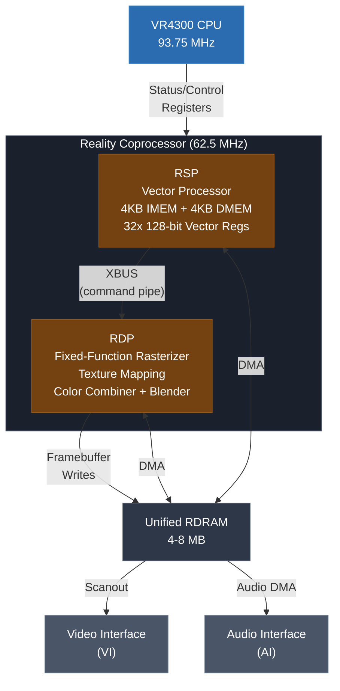
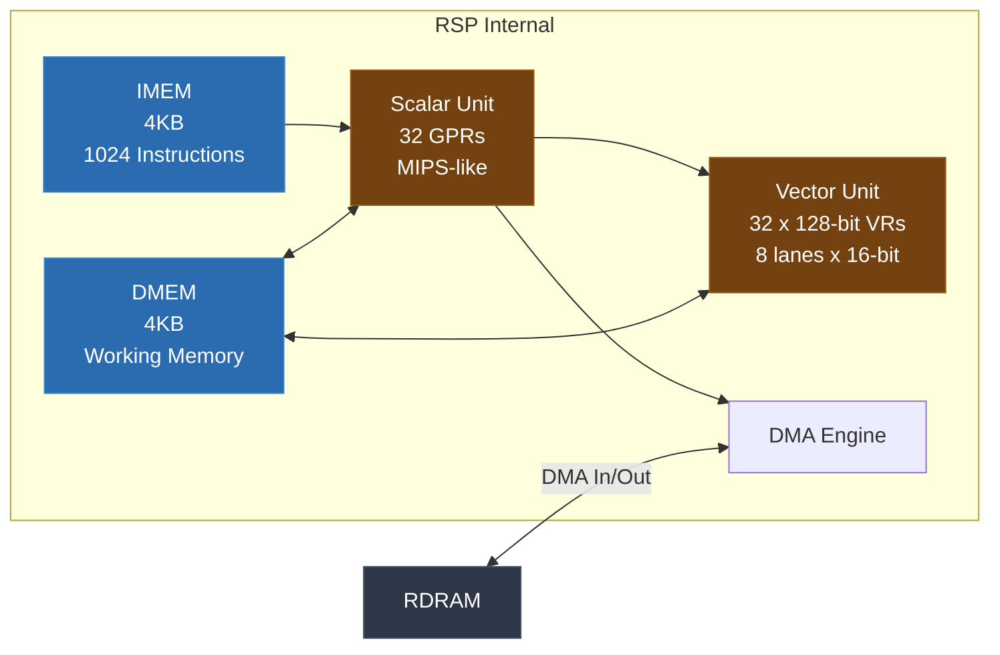
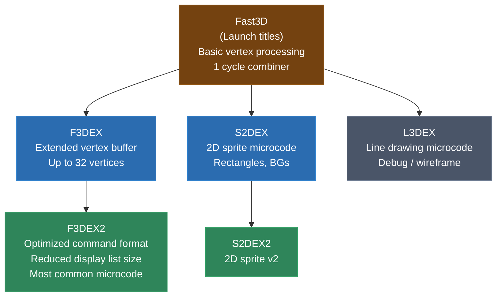
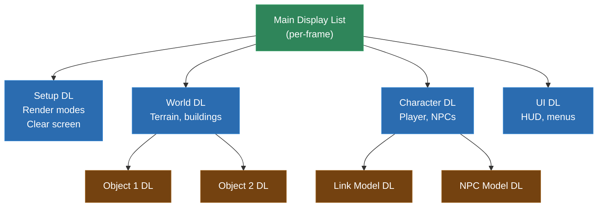
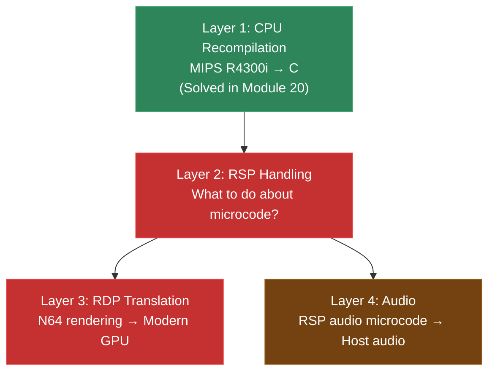
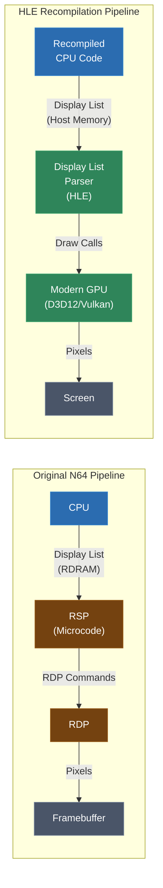
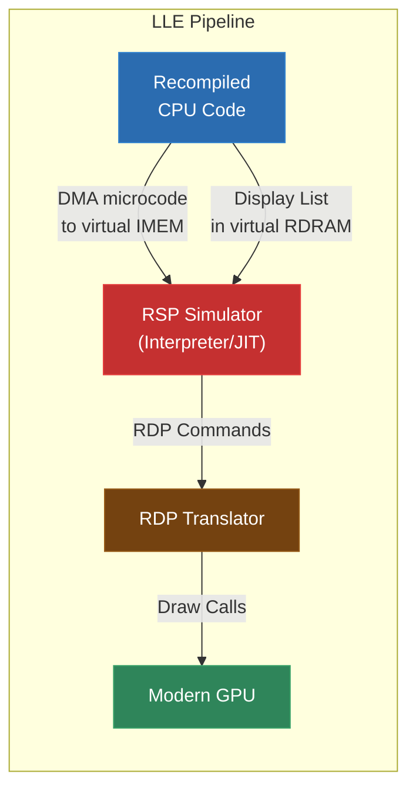
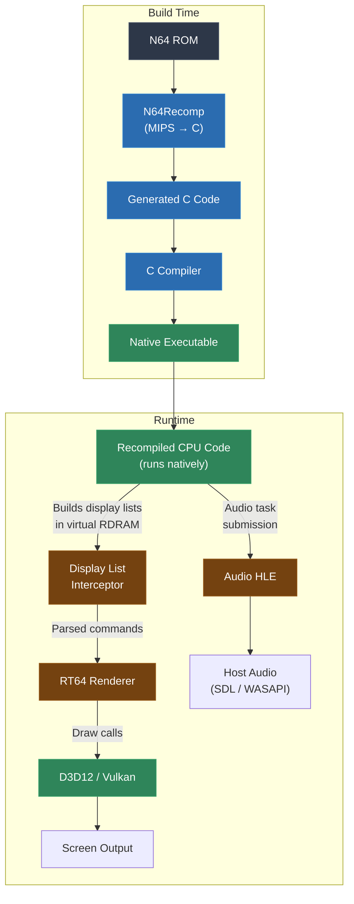
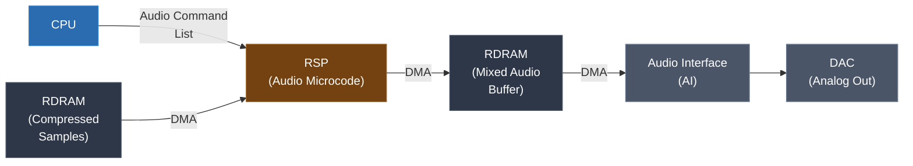
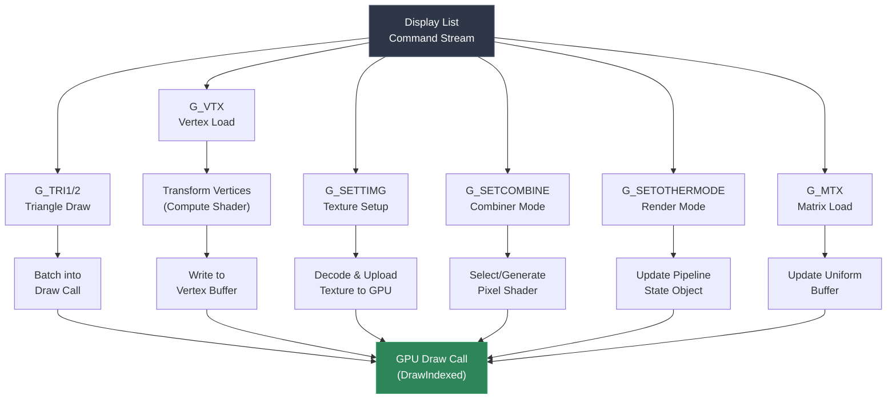

# Module 21: N64 Deep Dive -- RSP Microcode and the RDP

In Module 20, we covered the N64's MIPS R4300i CPU and how to lift its instructions to C. That's the easy part. The hard part -- the part that separates N64 recompilation from every other target in this course -- is the Reality Coprocessor. The RCP contains two sub-processors that handle all graphics and audio: the RSP (Reality Signal Processor) and the RDP (Reality Display Processor). These aren't just hardware peripherals you can stub out. They are the reason the game produces any output at all.

This module goes deep on both processors, the microcode that drives the RSP, the display list format that connects CPU to graphics pipeline, and the techniques that make N64 recompilation practical -- particularly High-Level Emulation (HLE) of the RSP and display list translation via RT64.

If you've been following along, you already know the N64 has unified RDRAM shared by everything. You know the CPU builds display lists in memory. Now we're going to understand what happens to those display lists, how the RSP chews through them, what the RDP does with the results, and how we intercept and translate the whole pipeline for modern hardware.

---

## 1. The Reality Coprocessor (RCP)

The Reality Coprocessor is a single chip manufactured by NEC that contains both the RSP and the RDP. SGI designed it -- the same SGI that made the Onyx and Indigo2 workstations. The N64 is, in a very real sense, a budget SGI workstation in a console form factor.

The RCP runs at 62.5 MHz, two-thirds of the CPU's clock speed. It sits between the CPU and RDRAM on the memory bus, and it has its own DMA engine for moving data between RDRAM and its internal memories.



### Why Two Processors?

The split exists because graphics processing naturally divides into two phases:

1. **Geometry processing** (vertex transformation, lighting, clipping, projection) -- this is computationally intensive and benefits from parallel/vector operations. The RSP handles this.

2. **Rasterization** (filling triangles with pixels, applying textures, blending) -- this is memory-bandwidth intensive and benefits from fixed-function hardware. The RDP handles this.

The CPU's job is to set up the scene: determine which objects are visible, compute their world-space positions, build a list of rendering commands (the display list), and hand that list to the RSP. The CPU never touches individual pixels.

### How They Communicate

The CPU communicates with the RSP through memory-mapped registers at `0xA4040000`-`0xA404001F` (RSP status and DMA control) and by writing display list pointers into RDRAM. The typical flow is:

1. CPU builds a display list in RDRAM
2. CPU loads appropriate microcode into RSP's IMEM (if not already loaded)
3. CPU writes the display list address to a known DMEM location
4. CPU sets the RSP's status register to start execution
5. RSP processes the display list, performing vertex math and generating RDP commands
6. RSP sends RDP commands either via XBUS (direct internal bus) or writes them to RDRAM for the RDP to DMA in
7. RDP rasterizes triangles, writes pixels to the framebuffer in RDRAM
8. RSP signals completion via an interrupt
9. Video Interface (VI) scans out the framebuffer to the TV

This pipeline is key to understanding why N64 recompilation is structured the way it is. We're not recompiling one program -- we're recompiling the CPU program and then separately handling the RSP/RDP pipeline.

---

## 2. RSP Architecture

The RSP is the most unusual processor you'll encounter in this course until we get to the Cell SPU in Module 30. It's a MIPS-based core with vector extensions, operating entirely out of small local memories.

### The Scalar Unit

The RSP's scalar unit is a simplified MIPS R4000 core:
- 32 general-purpose registers (r0 hardwired to zero, same as MIPS)
- No multiplier hardware for 64-bit multiply (it has a simpler one)
- No floating-point unit whatsoever
- No TLB, no cache -- just direct access to IMEM and DMEM
- All addresses are 12 bits (4KB address space for each memory)

The scalar unit handles control flow, addressing calculations, DMA setup, and orchestrating vector operations. It's the "brain" that tells the vector unit what to do.

### The Vector Unit

This is where the RSP's real power lives. The vector unit has:

- **32 vector registers (VR00-VR31)**, each 128 bits wide
- Each vector register holds **8 signed 16-bit elements** (called "lanes" or "slices")
- **3 vector control registers**: VCC (carry), VCO (compare), VCE (clip)
- **Vector accumulator**: 48 bits per element (3 x 16-bit: high, mid, low), 8 elements wide

The 16-bit element size is not arbitrary. It matches the precision of N64 vertex coordinates, color components, and texture coordinates. SGI designed this processor specifically for the fixed-point math that 3D graphics of this era required. You don't need float32 when your output is a 320x240 framebuffer with 16-bit color.

### Vector Instruction Format

RSP vector instructions operate on all 8 lanes simultaneously:

```
VADD    vd, vs, vt[e]    ; vd[i] = vs[i] + vt[element] for all 8 lanes
VMULF   vd, vs, vt[e]    ; fractional multiply (signed, result >> 16)
VMACF   vd, vs, vt[e]    ; fractional multiply-accumulate
VAND    vd, vs, vt[e]    ; bitwise AND per lane
VMOV    vd[de], vt[e]    ; move single element
```

The `[e]` field is a broadcast selector -- it picks which element(s) of `vt` to use across all lanes. This is how you do scalar-vector operations: load a scalar value into one element and broadcast it.

Here's an example of a 4x4 matrix-vector multiply, the core operation for vertex transformation:

```asm
; Multiply vertex position by modelview matrix
; Vertex in VR01 (x, y, z, w in elements 0-3)
; Matrix rows in VR08-VR11

; Row 0: dot product of matrix row 0 with vertex
VMUDH   $v20, $v08, $v01[0]      ; vr20 = row0 * x (high)
VMADH   $v20, $v09, $v01[1]      ; vr20 += row1 * y
VMADH   $v20, $v10, $v01[2]      ; vr20 += row2 * z
VMADH   $v20, $v11, $v01[3]      ; vr20 += row3 * w
; Result: transformed vertex in VR20
```

### IMEM and DMEM

The RSP has two separate 4KB SRAM banks:

- **IMEM** (Instruction Memory, `0xA4001000`-`0xA4001FFF`): Holds the currently loaded microcode. At 4 bytes per instruction, IMEM can hold exactly 1024 instructions. That's not a lot -- microcode authors had to be incredibly creative with code size.

- **DMEM** (Data Memory, `0xA4000000`-`0xA4000FFF`): Working memory for the RSP. Display list commands are DMA'd in from RDRAM, processed, and results are DMA'd back out or sent to the RDP. DMEM also holds vertex buffers, matrix stacks, lighting parameters, and other state.

The 4KB limits are absolute constraints. The RSP cannot access RDRAM directly -- it must DMA data in and out through explicit transfers. This is similar to the SPU local store on PS3's Cell (Module 30), though much smaller.



### DMA Transfers

RSP DMA is configured through the scalar unit by writing to special addresses in DMEM:

```asm
; Set up DMA: copy 128 bytes from RDRAM address 0x80100000 to DMEM offset 0x000
LUI     $t0, 0x8010          ; RDRAM source address
ORI     $t0, $t0, 0x0000
SW      $t0, SP_DRAM_ADDR    ; write to DMA RDRAM address register
ORI     $t1, $zero, 0x0000
SW      $t1, SP_MEM_ADDR     ; write to DMA DMEM address register
ORI     $t2, $zero, 127       ; length - 1
SW      $t2, SP_RD_LEN       ; start DMA (RDRAM -> DMEM)
; DMA runs asynchronously -- must poll or stall before using data
```

This explicit DMA model is something you'll see again with the PS3 SPU. It means the RSP code is a mixture of actual computation and DMA management, and the microcode has to carefully double-buffer data to keep the pipeline full.

---

## 3. RSP Microcode

Here's the crucial insight that makes N64 recompilation different from almost every other target: **the RSP doesn't have firmware burned into it.** The game loads a program -- the microcode -- into IMEM, and that program defines what the RSP does. Different microcodes implement different graphics features. Some games even load different microcodes for graphics versus audio processing.

### What Microcode Does

Graphics microcode typically implements:
- **Vertex loading**: DMA vertex data from RDRAM into DMEM
- **Matrix multiplication**: Transform vertices by modelview and projection matrices
- **Lighting**: Calculate vertex colors based on lights and normals
- **Clipping**: Clip triangles against the view frustum
- **Projection**: Apply perspective divide
- **Triangle command generation**: Package processed vertices into RDP triangle commands
- **Texture coordinate generation**: Compute and scale texture coordinates
- **Display list parsing**: Read and dispatch display list commands from RDRAM

Audio microcode implements:
- **ADPCM decoding**: Decompress audio samples
- **Resampling**: Convert between sample rates
- **Envelope processing**: Apply volume envelopes
- **Mixing**: Combine multiple audio channels
- **Effects**: Reverb, chorus, and other DSP effects
- **Output buffering**: Prepare final audio data for the Audio Interface

### Nintendo's Microcode Family Tree

Nintendo and SGI developed several microcode versions over the N64's lifetime:



**Fast3D** was the launch microcode. It shipped with early titles like Super Mario 64 and Pilotwings 64. It supports a vertex buffer of only 16 vertices and uses a simpler command encoding. It's the microcode with the most documentation because it was the first one reverse-engineered.

**F3DEX** ("Fast3D Extended") doubled the vertex buffer to 32 vertices and added support for more complex geometry. Many mid-generation titles use this.

**F3DEX2** is the most common microcode. It's an optimized rewrite with a different command encoding that reduces display list size. Ocarina of Time and Majora's Mask use F3DEX2. Most N64 recompilation projects target F3DEX2 as the primary microcode.

**S2DEX / S2DEX2** are specialized 2D sprite microcodes. They handle background planes, scaled/rotated sprites, and other 2D operations. Some games switch between F3DEX2 for 3D content and S2DEX2 for UI or 2D sections.

**L3DEX** is a line-drawing microcode used mainly for debug wireframe views. You'll almost never encounter it in retail games.

### The Microcode Loading Process

When a game boots, it typically:

1. Copies the graphics microcode from ROM into RDRAM during initialization
2. On each frame (or when switching modes), DMAs the microcode from RDRAM into the RSP's IMEM
3. Loads initial parameters (screen dimensions, segment addresses) into DMEM
4. Starts the RSP

Many games load microcode once and leave it resident. Others swap microcodes per-frame or per-scene. The Zelda games, for instance, load F3DEX2 for 3D rendering and may load S2DEX2 for certain 2D overlay effects.

The CPU signals the RSP to start by writing to the RSP status register:

```c
// Pseudocode for starting RSP execution
void rsp_run_display_list(u32 dl_address) {
    // Wait for RSP to be idle
    while (IO_READ(SP_STATUS_REG) & SP_STATUS_HALT) == 0) {
        // RSP is still running
    }

    // DMA microcode into IMEM (if not already loaded)
    IO_WRITE(SP_MEM_ADDR_REG, 0x1000);  // IMEM start
    IO_WRITE(SP_DRAM_ADDR_REG, (u32)gfx_ucode & 0x1FFFFFFF);
    IO_WRITE(SP_RD_LEN_REG, 0xFFF);     // 4KB

    // Wait for DMA to complete
    while (IO_READ(SP_DMA_BUSY_REG)) ;

    // Write display list pointer to DMEM task structure
    IO_WRITE(SP_MEM_ADDR_REG, 0x0000);  // DMEM start
    IO_WRITE(SP_DRAM_ADDR_REG, (u32)&task_header & 0x1FFFFFFF);
    IO_WRITE(SP_RD_LEN_REG, sizeof(OSTask) - 1);

    // Wait for DMA
    while (IO_READ(SP_DMA_BUSY_REG)) ;

    // Clear halt and set run
    IO_WRITE(SP_STATUS_REG, SP_CLR_HALT | SP_CLR_BROKE);
}
```

### Custom Microcode

Some games ship their own custom microcode:
- **Factor 5** (Rogue Squadron, Indiana Jones) wrote entirely custom RSP microcode to achieve effects beyond what Nintendo's standard microcodes could do
- **Rare** modified Nintendo's microcodes for their titles (GoldenEye, Perfect Dark)
- **Boss Game Studios** (World Driver Championship) wrote custom microcode for their engine

Custom microcode is the biggest challenge for HLE-based approaches. If the microcode isn't one of the known variants, HLE can't recognize and translate it. This is a real problem -- it's one reason certain N64 games are harder to emulate/recompile than others.

---

## 4. Display Lists

Display lists are the lingua franca between the N64 CPU and the RSP. The CPU builds them; the RSP consumes them. Understanding their format is essential for recompilation because display list interception is the primary mechanism by which we redirect N64 graphics to modern hardware.

### Display List Structure

A display list is a sequence of 64-bit (8-byte) commands stored in RDRAM. Each command has a 1-byte opcode and 7 bytes of parameters. The opcodes differ between microcode versions, but the general structure is consistent:

```
Byte:  [  0  ][  1  ][  2  ][  3  ][  4  ][  5  ][  6  ][  7  ]
       [opcode][ parameters (7 bytes)                           ]
```

For F3DEX2, here are some common commands:

```c
// Display list command opcodes (F3DEX2)
#define G_VTX           0x01    // Load vertices
#define G_TRI1          0x05    // Draw one triangle
#define G_TRI2          0x06    // Draw two triangles
#define G_DL            0xDE    // Call/branch to sub-display list
#define G_ENDDL         0xDF    // End display list
#define G_SETOTHERMODE_L 0xE2   // Set RDP render mode (low)
#define G_SETOTHERMODE_H 0xE3   // Set RDP render mode (high)
#define G_TEXTURE       0xD7    // Set texture parameters
#define G_MTX           0xDA    // Load matrix
#define G_GEOMETRYMODE  0xD9    // Set geometry mode flags
#define G_SETCOMBINE    0xFC    // Set color combiner mode
#define G_SETTIMG       0xFD    // Set texture image source
#define G_LOADBLOCK     0xF3    // Load texture into TMEM
#define G_SETTILE       0xF5    // Configure texture tile
#define G_SETTILESIZE   0xF2    // Set texture tile dimensions
#define G_RDPSETOTHERMODE 0xEF  // Direct RDP mode setting
```

### Building a Display List

In a typical N64 game (using libultra/libnusys), the CPU builds display lists using macros that expand into the 64-bit command format:

```c
// Game code building a display list
Gfx* gfx = display_list_buffer;

// Set up the projection matrix
gSPMatrix(gfx++, &projection_matrix,
    G_MTX_PROJECTION | G_MTX_LOAD | G_MTX_NOPUSH);

// Set up the modelview matrix
gSPMatrix(gfx++, &modelview_matrix,
    G_MTX_MODELVIEW | G_MTX_LOAD | G_MTX_NOPUSH);

// Load a texture
gDPSetTextureImage(gfx++, G_IM_FMT_RGBA, G_IM_SIZ_16b, 32, texture_addr);
gDPSetTile(gfx++, G_IM_FMT_RGBA, G_IM_SIZ_16b, 8, 0,
    G_TX_LOADTILE, 0, 0, 0, 0, 0, 0, 0);
gDPLoadSync(gfx++);
gDPLoadBlock(gfx++, G_TX_LOADTILE, 0, 0, 32*32-1, 0);
gDPSetTile(gfx++, G_IM_FMT_RGBA, G_IM_SIZ_16b, 8, 0,
    G_TX_RENDERTILE, 0, 0, 0, 0, 0, 0, 0);
gDPSetTileSize(gfx++, G_TX_RENDERTILE, 0, 0, 31 << 2, 31 << 2);

// Load vertices (8 vertices from RDRAM)
gSPVertex(gfx++, vertex_buffer, 8, 0);

// Draw triangles (indices into vertex buffer)
gSP2Triangles(gfx++, 0, 1, 2, 0, 3, 4, 5, 0);
gSP1Triangle(gfx++, 0, 6, 7, 0);

// Set color combiner (modulate texture with shade color)
gDPSetCombineMode(gfx++, G_CC_MODULATERGBA, G_CC_MODULATERGBA);

// End the display list
gSPEndDisplayList(gfx++);
```

Each `gSPxxx` and `gDPxxx` macro expands to one or two 64-bit words written to the display list buffer. The `gSP` prefix means "Signal Processor" (RSP commands), while `gDP` means "Display Processor" (RDP commands passed through the RSP).

### Display List Hierarchy

Display lists can be nested. The `G_DL` command calls a sub-display list, and the RSP follows the pointer to continue processing. This is how games organize their rendering:



There are two variants of `G_DL`:
- **Call**: Push the return address and jump to the sub-list (like a function call). When the sub-list ends, execution returns to the caller.
- **Branch**: Jump to the sub-list without saving a return address (like a goto). The sub-list's `G_ENDDL` ends the entire rendering pass.

### Segment Addresses

N64 display lists use a segmented addressing scheme. Instead of full 32-bit RDRAM addresses, pointers in display lists use an 8-bit segment number and a 24-bit offset:

```
Address format: 0xSSoooooo
  SS     = Segment number (0x00-0x0F)
  oooooo = Offset within segment
```

The RSP maintains a segment table in DMEM that maps segment numbers to physical RDRAM addresses. The `G_MOVEWORD` command updates this table:

```c
// Set segment 6 to point to RDRAM address 0x80200000
gSPSegment(gfx++, 0x06, 0x80200000);

// Now address 0x06000100 means RDRAM 0x80200100
```

This indirection layer allows the game to relocate data without rebuilding display lists. It also means any display list interceptor must maintain the segment table to resolve addresses.

---

## 5. The RDP (Reality Display Processor)

The RDP is the fixed-function rasterizer at the end of the N64 graphics pipeline. It receives commands from the RSP (or directly from RDRAM in some configurations) and renders triangles, rectangles, and other primitives into the framebuffer.

### What the RDP Does

The RDP performs:
1. **Triangle rasterization**: Edge walking and span generation
2. **Texture mapping**: Perspective-correct texturing with bilinear filtering
3. **Color combining**: Programmable blend of up to 4 color inputs per cycle
4. **Alpha combining**: Separate alpha blend formula
5. **Blending**: Framebuffer blending for transparency and anti-aliasing
6. **Z-buffering**: Depth testing and writing
7. **Coverage**: Sub-pixel coverage for anti-aliasing

### RDP Command Format

RDP commands use the same 64-bit format as RSP commands, but with different opcodes. Some important ones:

```c
// RDP command opcodes
#define G_FILL_TRI        0x08  // Filled triangle
#define G_SHADE_TRI       0x0C  // Shaded triangle
#define G_TXTR_TRI        0x0A  // Textured triangle
#define G_SHADE_TXTR_TRI  0x0E  // Shaded + textured triangle
#define G_FILL_ZBUF_TRI   0x09  // Filled triangle with Z-buffer
#define G_FILL_RECT       0xF6  // Filled rectangle
#define G_TEX_RECT        0xE4  // Textured rectangle
#define G_SET_COMBINE      0xFC  // Color combiner settings
#define G_SET_COLOR_IMAGE 0xFF  // Set framebuffer target
#define G_SET_Z_IMAGE     0xFE  // Set Z-buffer target
#define G_SET_FILL_COLOR  0xF7  // Set fill color
#define G_SET_PRIM_COLOR  0xFA  // Set primitive color
#define G_SET_ENV_COLOR   0xFB  // Set environment color
```

### The Triangle Command

RDP triangle commands are the core of rendering. They're much more complex than a simple "draw triangle" call -- each triangle command encodes edge coefficients, color gradients, texture gradients, and Z gradients:

```
Fill Triangle:          8 bytes  (just edges)
Shaded Triangle:       +16 bytes (color interpolation coefficients)
Textured Triangle:     +24 bytes (texture coordinate coefficients)
Shaded+Textured+Zbuf:  +all of the above = 176 bytes per triangle!
```

The RSP microcode does all the work of converting vertices into these edge/gradient coefficients. The RDP doesn't know about vertices or matrices -- it only sees pre-computed rasterization parameters.

### The Color Combiner

The color combiner is one of the N64's most distinctive features. It's a two-cycle programmable blending unit that computes:

```
output = (A - B) * C + D
```

Where A, B, C, and D are each selected from a set of color sources:

| Input | Options |
|-------|---------|
| A | Combined, Texel0, Texel1, Primitive, Shade, Environment, 1, Noise, 0 |
| B | Combined, Texel0, Texel1, Primitive, Shade, Environment, Center, K4, 0 |
| C | Combined, Texel0, Texel1, Primitive, Shade, Environment, Scale, Combined_Alpha, Texel0_Alpha, Texel1_Alpha, Primitive_Alpha, Shade_Alpha, Environment_Alpha, LOD_Fraction, Prim_LOD_Fraction, K5, 0 |
| D | Combined, Texel0, Texel1, Primitive, Shade, Environment, 1, 0 |

This creates a huge space of possible blending operations. Common modes include:

```c
// MODULATERGBA: output = texture * shade_color
// A=Texel0, B=0, C=Shade, D=0
// Result: (Texel0 - 0) * Shade + 0 = Texel0 * Shade

// DECALRGBA: output = texture (ignore vertex color)
// A=Texel0, B=0, C=0, D=Texel0... (simplified)

// Terrain blending: blend two textures based on vertex alpha
// Cycle 1: (Texel0 - Texel1) * Shade_Alpha + Texel1
// Cycle 2: (Combined - 0) * Shade + 0
```

The two-cycle mode allows even more complex operations: cycle 1's output ("Combined") can be used as an input to cycle 2.

For recompilation, each unique combiner configuration encountered in a game's display lists must be translated into a pixel shader. RT64 does this dynamically -- it generates shader permutations as new combiner modes are encountered at runtime.

### The Blender

After the color combiner, the blender handles framebuffer operations:
- **Alpha blending**: Blend the incoming pixel with the existing framebuffer content
- **Anti-aliasing**: Use coverage values to smooth edges
- **Fog**: Blend with fog color based on depth

The blender is also programmable with a formula:

```
pixel_out = (P * A + M * B) / (A + B)

Where:
  P = pixel source (incoming color or blend color)
  A = alpha source (incoming alpha, fog alpha, etc.)
  M = memory source (framebuffer color or blend color)
  B = blend factor
```

### Render Modes

The `G_SETOTHERMODE_L` and `G_SETOTHERMODE_H` commands configure the RDP's pipeline behavior through a set of mode flags:

```c
// Common render modes
#define G_RM_OPA_SURF      // Opaque surface (no blending, Z-buffer write)
#define G_RM_AA_OPA_SURF   // Anti-aliased opaque surface
#define G_RM_XLU_SURF      // Translucent surface (alpha blending)
#define G_RM_AA_XLU_SURF   // Anti-aliased translucent surface
#define G_RM_ZB_OPA_SURF   // Z-buffered opaque surface
#define G_RM_ZB_XLU_SURF   // Z-buffered translucent surface
#define G_RM_ZB_OPA_DECAL  // Z-buffered opaque decal (Z-test but no Z-write)
```

Each render mode sets the blender formula, Z-buffer behavior, coverage behavior, and alpha compare mode. Accurately reproducing these modes is critical for correct rendering.

---

## 6. The Recompilation Challenge

Now you can see why N64 recompilation is fundamentally different from, say, Game Boy or SNES recompilation. On those platforms, the CPU directly controls the PPU through register writes, and the PPU behavior is fixed. On the N64, the graphics pipeline is driven by a separate programmable processor running arbitrary microcode.

This creates a layered problem:



Layer 1 is well-understood. We covered it in Module 20. The MIPS instruction lifter is mature and reliable.

Layer 2 is the crux: what do we do about the RSP? We have two fundamental approaches -- HLE and LLE.

Layer 3 depends on Layer 2: however we handle the RSP, we need to get RDP-equivalent rendering commands to a modern GPU.

Layer 4 is often overlooked but equally important: the RSP also processes audio, and we need that working too.

### What This Means for Your Recompilation Project

When you're recompiling an N64 game, you need to decide early: are you going to intercept at the display list level (HLE) or execute the RSP microcode (LLE)? This decision affects your entire architecture. Let's look at both approaches in detail before diving into the specifics.

The decision tree is roughly:

1. Does the game use standard Nintendo microcode (Fast3D, F3DEX, F3DEX2, S2DEX)? If yes, **HLE is almost certainly the right choice**. The display list formats are well-documented, the vertex processing is straightforward, and the performance advantage is enormous.

2. Does the game use custom microcode? If yes, you have three sub-options:
   - Reverse-engineer the custom microcode enough to HLE it (labor-intensive but high-performance)
   - LLE the custom microcode specifically, while HLE-ing the standard parts (hybrid approach)
   - LLE everything (simplest to implement correctly, but slowest)

3. Do you need cycle-accurate RSP behavior for any reason? This is extremely rare for recompilation. If you're building a general emulator, maybe. For a targeted recompilation of a specific game, almost never.

Most N64 games -- roughly 90% of the commercial library -- use F3DEX or F3DEX2. If your target game is among them, you don't need to think about LLE at all. Focus on HLE and move on to the harder problems (audio, framebuffer effects, timing).

---

## 7. HLE (High-Level Emulation)

High-Level Emulation is the approach that makes N64 recompilation practical. Instead of running the RSP microcode, we recognize which microcode the game uses, and reimplement its functionality directly in host code.

### The Key Insight

All the standard Nintendo microcodes (Fast3D, F3DEX, F3DEX2, S2DEX, S2DEX2) implement the same abstract pipeline: they parse display lists, transform vertices, and emit RDP commands. The display list format is the contract between the CPU code and the RSP microcode.

If we intercept the display list before the RSP processes it, we can:
1. Parse the display list commands ourselves
2. Perform the vertex transformations on the host CPU (or GPU)
3. Generate equivalent modern rendering commands instead of RDP commands

The RSP microcode becomes irrelevant. We never need to execute it.



### How HLE Works in Practice

The HLE display list parser is essentially a big switch statement:

```c
void hle_process_display_list(uint32_t* dl_ptr, RenderState* state) {
    while (1) {
        uint32_t w0 = *dl_ptr++;
        uint32_t w1 = *dl_ptr++;
        uint8_t opcode = (w0 >> 24) & 0xFF;

        switch (opcode) {
            case G_VTX: {
                // Load vertices from RDRAM equivalent
                int num_verts = ((w0 >> 12) & 0xFF);
                int dest_idx  = ((w0 >> 1) & 0x7F) - num_verts;
                uint32_t addr = segment_resolve(w1);
                load_vertices(state, addr, num_verts, dest_idx);
                break;
            }

            case G_TRI1: {
                // Draw one triangle
                int v0 = ((w0 >> 16) & 0xFF) / 2;
                int v1 = ((w0 >> 8)  & 0xFF) / 2;
                int v2 = ((w0 >> 0)  & 0xFF) / 2;
                draw_triangle(state, v0, v1, v2);
                break;
            }

            case G_TRI2: {
                // Draw two triangles
                int v0 = ((w0 >> 16) & 0xFF) / 2;
                int v1 = ((w0 >> 8)  & 0xFF) / 2;
                int v2 = ((w0 >> 0)  & 0xFF) / 2;
                int v3 = ((w1 >> 16) & 0xFF) / 2;
                int v4 = ((w1 >> 8)  & 0xFF) / 2;
                int v5 = ((w1 >> 0)  & 0xFF) / 2;
                draw_triangle(state, v0, v1, v2);
                draw_triangle(state, v3, v4, v5);
                break;
            }

            case G_MTX: {
                // Load and apply matrix
                uint32_t addr = segment_resolve(w1);
                uint8_t params = w0 & 0xFF;
                load_matrix(state, addr, params);
                break;
            }

            case G_SETCOMBINE: {
                // Configure color combiner
                state->combiner.mux0 = w0 & 0x00FFFFFF;
                state->combiner.mux1 = w1;
                update_shader(state);
                break;
            }

            case G_DL: {
                // Call sub-display list
                uint32_t addr = segment_resolve(w1);
                uint8_t flag = (w0 >> 16) & 0xFF;
                if (flag == G_DL_PUSH) {
                    hle_process_display_list((uint32_t*)addr, state);
                } else {
                    dl_ptr = (uint32_t*)addr;  // branch (no return)
                }
                break;
            }

            case G_ENDDL:
                return;

            case G_SETTIMG: {
                // Set texture image source
                state->texture.format = (w0 >> 21) & 0x7;
                state->texture.size   = (w0 >> 19) & 0x3;
                state->texture.width  = (w0 & 0xFFF) + 1;
                state->texture.addr   = segment_resolve(w1);
                break;
            }

            // ... many more commands ...

            default:
                // Unknown command -- log and skip
                log_warning("Unknown DL command: 0x%02X", opcode);
                break;
        }
    }
}
```

This is simplified, but it shows the pattern. Each display list command is decoded and translated into equivalent operations using the host CPU and GPU.

### HLE Vertex Processing

One of the major operations the RSP performs is vertex transformation. In HLE mode, we do this on the host CPU (or potentially compute shader):

```c
void load_vertices(RenderState* state, uint32_t addr, int count, int dest) {
    // Read N64 vertex format from memory
    for (int i = 0; i < count; i++) {
        N64Vertex* src = (N64Vertex*)(rdram + addr + i * sizeof(N64Vertex));
        TransformedVertex* dst = &state->vertex_buffer[dest + i];

        // N64 vertex format:
        //   int16_t x, y, z;     // position
        //   uint16_t flag;       // unused
        //   int16_t s, t;        // texture coordinates
        //   uint8_t r, g, b, a;  // color or normal

        float pos[4] = {
            (float)src->x, (float)src->y, (float)src->z, 1.0f
        };

        // Transform by modelview-projection matrix
        float clip[4];
        matrix_multiply_vec4(state->mvp_matrix, pos, clip);

        dst->x = clip[0];
        dst->y = clip[1];
        dst->z = clip[2];
        dst->w = clip[3];

        // Perspective divide for screen coordinates
        if (clip[3] != 0.0f) {
            float inv_w = 1.0f / clip[3];
            dst->screen_x = clip[0] * inv_w * state->viewport.scale_x
                          + state->viewport.translate_x;
            dst->screen_y = clip[1] * inv_w * state->viewport.scale_y
                          + state->viewport.translate_y;
            dst->screen_z = clip[2] * inv_w * state->viewport.scale_z
                          + state->viewport.translate_z;
        }

        // Apply lighting if enabled
        if (state->geometry_mode & G_LIGHTING) {
            apply_lighting(state, src->normal, &dst->r, &dst->g, &dst->b);
        } else {
            dst->r = src->r / 255.0f;
            dst->g = src->g / 255.0f;
            dst->b = src->b / 255.0f;
        }
        dst->a = src->a / 255.0f;

        // Texture coordinates (fixed-point to float conversion)
        dst->s = (float)src->s / 32.0f;  // 5.10 fixed-point to float
        dst->t = (float)src->t / 32.0f;

        // Clipping flags
        dst->clip_flags = compute_clip_flags(clip);
    }
}
```

### Microcode Detection

The HLE approach needs to know which microcode is loaded to correctly decode display list commands (the opcode encoding changes between microcode versions). Detection works by checking the microcode binary:

```c
MicrocodeType detect_microcode(uint32_t ucode_addr, uint32_t ucode_size) {
    // Common approach: check for known CRC or string signature
    uint32_t crc = crc32(rdram + ucode_addr, ucode_size);

    switch (crc) {
        case 0x3A1CBAC3: return UCODE_F3DEX2;
        case 0x5D1D6781: return UCODE_F3DEX;
        case 0x8805B41A: return UCODE_FAST3D;
        case 0x1A62DC2F: return UCODE_S2DEX2;
        // ... more known CRCs ...
    }

    // Fallback: check the text string embedded in the data segment
    // Nintendo microcodes contain an identifying string like
    // "RSP Gfx ucode F3DEX2      fifo 2.08  Yoshitaka Yasumoto 1999"
    char* ucode_data = (char*)(rdram + ucode_data_addr);
    if (strstr(ucode_data, "F3DEX2")) return UCODE_F3DEX2;
    if (strstr(ucode_data, "F3DEX"))  return UCODE_F3DEX;
    if (strstr(ucode_data, "S2DEX"))  return UCODE_S2DEX;

    return UCODE_UNKNOWN;  // Will need LLE or custom handling
}
```

### HLE Lighting

The RSP also handles lighting calculations. When geometry mode has `G_LIGHTING` enabled, vertex colors are computed from surface normals and light directions rather than using per-vertex colors directly. The HLE implementation must replicate this:

```c
void apply_lighting(RenderState* state, int8_t* normal,
                    float* out_r, float* out_g, float* out_b) {
    // Start with ambient light
    float r = state->ambient_light.r / 255.0f;
    float g = state->ambient_light.g / 255.0f;
    float b = state->ambient_light.b / 255.0f;

    // Transform normal by modelview matrix (upper 3x3)
    float nx = normal[0] / 127.0f;
    float ny = normal[1] / 127.0f;
    float nz = normal[2] / 127.0f;

    float tnx = state->mv_matrix[0][0] * nx + state->mv_matrix[1][0] * ny
              + state->mv_matrix[2][0] * nz;
    float tny = state->mv_matrix[0][1] * nx + state->mv_matrix[1][1] * ny
              + state->mv_matrix[2][1] * nz;
    float tnz = state->mv_matrix[0][2] * nx + state->mv_matrix[1][2] * ny
              + state->mv_matrix[2][2] * nz;

    // Normalize
    float len = sqrtf(tnx * tnx + tny * tny + tnz * tnz);
    if (len > 0.0f) {
        tnx /= len;  tny /= len;  tnz /= len;
    }

    // Apply each directional light
    for (int i = 0; i < state->num_lights; i++) {
        Light* light = &state->lights[i];
        float dot = tnx * light->dir_x + tny * light->dir_y + tnz * light->dir_z;

        if (dot > 0.0f) {
            r += dot * (light->color_r / 255.0f);
            g += dot * (light->color_g / 255.0f);
            b += dot * (light->color_b / 255.0f);
        }
    }

    // Clamp to [0, 1]
    *out_r = fminf(r, 1.0f);
    *out_g = fminf(g, 1.0f);
    *out_b = fminf(b, 1.0f);
}
```

Lighting is an area where HLE accuracy matters. If the normal transformation doesn't match the RSP's fixed-point calculation exactly, lighting can look subtly different. In practice, the floating-point host computation is close enough that differences are invisible, but if you're targeting pixel-perfect accuracy, you'd need to use the same fixed-point math the RSP uses (16-bit fractional values).

### HLE Clipping

Another RSP function that HLE must replicate is frustum clipping. The RSP clips triangles against the view frustum before sending them to the RDP. In HLE mode, we need to do this ourselves (or rely on the GPU's hardware clipping, which works differently):

```c
// Clip codes for each vertex (Cohen-Sutherland style)
#define CLIP_LEFT    0x01
#define CLIP_RIGHT   0x02
#define CLIP_BOTTOM  0x04
#define CLIP_TOP     0x08
#define CLIP_NEAR    0x10
#define CLIP_FAR     0x20

uint8_t compute_clip_flags(float clip[4]) {
    uint8_t flags = 0;
    if (clip[0] < -clip[3]) flags |= CLIP_LEFT;
    if (clip[0] >  clip[3]) flags |= CLIP_RIGHT;
    if (clip[1] < -clip[3]) flags |= CLIP_BOTTOM;
    if (clip[1] >  clip[3]) flags |= CLIP_TOP;
    if (clip[2] < -clip[3]) flags |= CLIP_NEAR;
    if (clip[2] >  clip[3]) flags |= CLIP_FAR;
    return flags;
}

bool triangle_needs_clipping(TransformedVertex* v0, TransformedVertex* v1,
                              TransformedVertex* v2) {
    // If all vertices are inside, no clipping needed
    if ((v0->clip_flags | v1->clip_flags | v2->clip_flags) == 0)
        return false;

    // If all vertices are on the same side of a plane, trivially rejected
    if (v0->clip_flags & v1->clip_flags & v2->clip_flags)
        return false;  // Actually, this means reject entirely

    return true;  // Need to clip
}
```

Most HLE implementations let the GPU handle clipping via its built-in clip hardware, since the math is equivalent. But there's a subtlety: the N64 RSP clips in clip space before the perspective divide, while some GPU drivers may clip differently. For most games this doesn't matter, but a few titles (especially those that push geometry right to the screen edges) may show differences.

### Fog Implementation

N64 fog is computed per-vertex by the RSP and then interpolated across the triangle by the RDP. The fog factor is derived from the vertex's Z depth:

```c
void compute_fog(TransformedVertex* v, RenderState* state) {
    if (!(state->geometry_mode & G_FOG)) {
        v->fog = 0.0f;
        return;
    }

    // Fog is computed from the clip-space W coordinate
    // The fog multiplier and offset are set by the game
    float fog_z = v->w * state->fog_multiplier + state->fog_offset;

    // Clamp to [0, 255] range (N64 fog is an 8-bit value)
    fog_z = fmaxf(0.0f, fminf(255.0f, fog_z));

    v->fog = fog_z / 255.0f;
}
```

In the RDP, fog is blended using the blender:
```
pixel_out = fog_alpha * fog_color + (1 - fog_alpha) * pixel_color
```

When translating to modern shaders, fog becomes a simple lerp in the fragment shader:
```glsl
// GLSL fog implementation matching N64 behavior
vec3 apply_n64_fog(vec3 pixel_color, float fog_factor, vec3 fog_color) {
    return mix(pixel_color, fog_color, fog_factor);
}
```

### Advantages of HLE

1. **Performance**: No RSP emulation overhead. Display list parsing is trivial compared to vector processing.
2. **Quality**: We can render at higher resolutions, with better filtering, even with ray tracing -- the RSP's limitations don't apply.
3. **Simplicity**: The display list format is well-documented. Parsing 64-bit commands is straightforward.
4. **Enhancement**: Since we're doing vertex processing on the host, we can add widescreen support, high-poly models, or other enhancements at the display list level.

### Disadvantages of HLE

1. **Incompatibility with custom microcode**: If the game uses non-standard microcode, HLE can't handle it without custom support.
2. **Accuracy**: Subtle differences in vertex processing or rasterization can produce visual artifacts.
3. **Maintenance**: Each microcode variant needs its own command table and handling code.

---

## 8. LLE (Low-Level Emulation)

The alternative to HLE is to actually execute the RSP microcode -- either by interpreting it, JIT-compiling it, or statically recompiling it. This is the Low-Level Emulation approach.

### How LLE Works

In LLE mode:
1. The CPU code writes to the RSP control registers as normal
2. The recompilation runtime actually loads the microcode into a virtual IMEM
3. The RSP instructions are executed (interpreted or compiled)
4. The resulting RDP commands are captured and translated to modern GPU commands



### RSP Interpreter

A basic RSP interpreter looks like this:

```c
typedef struct {
    int32_t  gpr[32];           // Scalar registers
    int16_t  vpr[32][8];        // Vector registers (32 x 8 elements)
    int16_t  vacc[3][8];        // Vector accumulator (high, mid, low)
    uint16_t vcc, vco, vce;     // Vector control registers
    uint32_t pc;                // Program counter (12-bit)
    uint8_t  imem[4096];        // Instruction memory
    uint8_t  dmem[4096];        // Data memory
    int      halted;
} RSPState;

void rsp_execute(RSPState* rsp) {
    rsp->halted = 0;

    while (!rsp->halted) {
        uint32_t instr = *(uint32_t*)(rsp->imem + rsp->pc);
        rsp->pc = (rsp->pc + 4) & 0xFFF;  // 12-bit wrap

        uint8_t op = (instr >> 26) & 0x3F;

        switch (op) {
            case 0x00:  // SPECIAL
                rsp_execute_special(rsp, instr);
                break;

            case 0x12:  // COP2 (vector operations)
                rsp_execute_cop2(rsp, instr);
                break;

            case 0x32:  // LWC2 (vector load)
                rsp_execute_lwc2(rsp, instr);
                break;

            case 0x3A:  // SWC2 (vector store)
                rsp_execute_swc2(rsp, instr);
                break;

            case 0x09:  // ADDIU
                rsp->gpr[RT(instr)] = rsp->gpr[RS(instr)] + (int16_t)(instr & 0xFFFF);
                break;

            case 0x0D:  // BREAK
                rsp->halted = 1;
                signal_rsp_interrupt();
                break;

            // ... all scalar MIPS instructions ...
        }

        rsp->gpr[0] = 0;  // r0 always zero
    }
}
```

The vector operations are where it gets complex:

```c
void rsp_vadd(RSPState* rsp, int vd, int vs, int vt, int element) {
    for (int i = 0; i < 8; i++) {
        int sel = element_select(element, i);
        int32_t result = (int32_t)rsp->vpr[vs][i] + (int32_t)rsp->vpr[vt][sel];

        // Add carry from VCO
        result += (rsp->vco >> i) & 1;

        // Clamp to 16-bit signed
        rsp->vacc[2][i] = (int16_t)clamp16(result);
        rsp->vpr[vd][i] = (int16_t)clamp16(result);

        // Update carry
        // ...
    }
    rsp->vco = 0;
}
```

### Static RSP Recompilation

The most interesting LLE variant for this course is **static recompilation of RSP microcode itself**. Since the microcode is a fixed program loaded from ROM, we can recompile it just like we recompile CPU code:

```c
// Statically recompiled RSP microcode (conceptual)
void rsp_ucode_f3dex2_recompiled(RSPState* rsp) {
    // Address 0x000: microcode entry point
    // LUI $t0, 0x0400
    rsp->gpr[8] = 0x04000000;

    // ORI $t0, $t0, 0x0010
    rsp->gpr[8] = rsp->gpr[8] | 0x0010;

    // ... hundreds of recompiled instructions ...

    // The main loop: fetch display list command, dispatch, repeat
    label_main_loop:
    // LW $t1, 0($t0)  -- load from DMEM
    rsp->gpr[9] = *(int32_t*)(rsp->dmem + (rsp->gpr[8] & 0xFFF));

    // SRL $t2, $t1, 24  -- extract opcode
    rsp->gpr[10] = (uint32_t)rsp->gpr[9] >> 24;

    // ... dispatch based on opcode ...
}
```

This is conceptually identical to what we do for the main CPU, but with the RSP's instruction set. The Ares emulator project has explored this approach, and some N64 emulators support RSP recompilation (both static and dynamic).

### Vector Accumulator Precision

The RSP vector accumulator is one of the hardest parts to emulate correctly. Each lane has a 48-bit accumulator (3 x 16-bit segments: high, mid, low). Multiply instructions write to different parts of the accumulator:

```c
// VMULF: Signed fractional multiply
void rsp_vmulf(RSPState* rsp, int vd, int vs, int vt, int element) {
    for (int i = 0; i < 8; i++) {
        int sel = element_select(element, i);
        int32_t product = (int32_t)rsp->vpr[vs][i] * (int32_t)rsp->vpr[vt][sel];

        // Shift left by 1 (fractional multiply convention)
        int64_t shifted = ((int64_t)product << 1) + 0x8000;  // Round

        // Write to 48-bit accumulator
        rsp->vacc_hi[i] = (int16_t)(shifted >> 32);
        rsp->vacc_md[i] = (int16_t)(shifted >> 16);
        rsp->vacc_lo[i] = (int16_t)(shifted);

        // Output is clamped mid
        int32_t result = (int32_t)(shifted >> 16);
        if (result < -32768) result = -32768;
        if (result > 32767) result = 32767;
        rsp->vpr[vd][i] = (int16_t)result;
    }
}

// VMACF: Signed fractional multiply-accumulate
void rsp_vmacf(RSPState* rsp, int vd, int vs, int vt, int element) {
    for (int i = 0; i < 8; i++) {
        int sel = element_select(element, i);
        int32_t product = (int32_t)rsp->vpr[vs][i] * (int32_t)rsp->vpr[vt][sel];
        int64_t shifted = (int64_t)product << 1;

        // Accumulate into 48-bit accumulator
        int64_t acc = ((int64_t)(int16_t)rsp->vacc_hi[i] << 32)
                    | ((int64_t)(uint16_t)rsp->vacc_md[i] << 16)
                    | ((int64_t)(uint16_t)rsp->vacc_lo[i]);

        acc += shifted;

        rsp->vacc_hi[i] = (int16_t)(acc >> 32);
        rsp->vacc_md[i] = (int16_t)(acc >> 16);
        rsp->vacc_lo[i] = (int16_t)(acc);

        // Output is clamped mid
        int32_t result = (int32_t)(acc >> 16);
        if (result < -32768) result = -32768;
        if (result > 32767) result = 32767;
        rsp->vpr[vd][i] = (int16_t)result;
    }
}
```

Getting the accumulator behavior wrong causes subtle errors -- vertex positions may be off by one pixel, or colors may be slightly shifted. For HLE, this doesn't matter because we do the math in float. For LLE, it's critical.

### RSP Static Recompilation: The Frontier

One exciting area of development is **statically recompiling the RSP microcode itself**. Since the microcode is loaded from ROM and is a fixed program (typically under 1024 instructions), it's an ideal target for static recompilation. The Ares emulator project has demonstrated this approach:

1. Disassemble the RSP microcode from the ROM
2. Analyze control flow (loops, branches, conditionals)
3. Lift each RSP instruction to C (similar to what we do for the main CPU)
4. The scalar operations translate straightforwardly
5. Vector operations become loops over 8 lanes or explicit SIMD intrinsics

The output is a C function that does exactly what the microcode does, but runs natively on the host. This gives you LLE accuracy with near-HLE performance -- the best of both worlds, at least for the RSP processing.

```c
// Example: statically recompiled RSP microcode fragment
// Original RSP code: vertex transformation inner loop
void rsp_vtx_transform_loop(RSPRecompState* rsp) {
    // Equivalent of 20 RSP instructions doing matrix-vector multiply
    for (int lane = 0; lane < 8; lane++) {
        int32_t x = rsp->vpr[1][lane];
        int32_t y = rsp->vpr[2][lane];
        int32_t z = rsp->vpr[3][lane];
        int32_t w = rsp->vpr[4][lane];

        // Multiply-accumulate with matrix rows
        int32_t out_x = (x * rsp->vpr[8][0] + y * rsp->vpr[8][1]
                       + z * rsp->vpr[8][2] + w * rsp->vpr[8][3]) >> 16;
        // ... similar for out_y, out_z, out_w ...

        rsp->vpr[20][lane] = clamp16(out_x);
    }
}
```

The challenge is that RSP microcode uses self-modifying techniques (writing new instructions to IMEM) in some cases, and the tight coupling between scalar and vector units makes control flow analysis harder. But for the standard Nintendo microcodes, static RSP recompilation is feasible and has been demonstrated.

### Advantages of LLE

1. **Universal compatibility**: Works with any microcode, including custom ones
2. **Accuracy**: Faithfully reproduces the RSP's behavior
3. **No reverse engineering needed**: Don't need to understand what the microcode does

### Disadvantages of LLE

1. **Performance**: Interpreting or emulating the RSP is expensive
2. **Still need RDP translation**: Even with perfect RSP emulation, the RDP commands still need to go to a modern GPU
3. **Complexity**: The RSP vector unit is tricky to emulate correctly (accumulator precision, clamp behavior, etc.)

### The Hybrid Approach

A few projects have explored hybrid approaches: HLE for known microcodes, falling back to LLE for unknown ones. This gives you the performance of HLE for 90% of games and the compatibility of LLE for the remaining 10%. The switchover can even happen within a single game if it loads different microcodes for different scenes.

```c
void process_rsp_task(RSPTask* task) {
    MicrocodeType type = detect_microcode(task->ucode_addr);

    if (type != UCODE_UNKNOWN) {
        // Fast path: HLE
        hle_process_display_list(task->data_addr, type);
    } else {
        // Slow path: LLE
        log_info("Unknown microcode at 0x%08X, falling back to LLE",
                 task->ucode_addr);
        rsp_load_and_execute(task->ucode_addr, task->data_addr);
    }
}
```

---

## 9. How N64Recomp Handles the RSP: RT64

N64Recomp takes the HLE approach, and its rendering backend is **RT64** by Dario Samo. RT64 is a modern renderer specifically designed for N64 display list translation. Let's look at how the whole pipeline fits together in a real N64Recomp project.

### Architecture Overview



### The Interception Point

When the recompiled CPU code calls `osSpTaskStart()` (the libultra function that starts RSP execution), the recompilation runtime intercepts this call. Instead of starting an RSP, it:

1. Reads the task structure from virtual RDRAM to determine the task type (graphics or audio)
2. For graphics tasks: passes the display list pointer to RT64
3. For audio tasks: passes the audio task to the audio HLE module

```c
// Runtime shim for osSpTaskStart
void osSpTaskStart_recomp(CPUContext* ctx) {
    OSTask* task = (OSTask*)(rdram + ctx->r.a0);

    if (task->type == M_GFXTASK) {
        // Graphics task -- send to RT64
        uint32_t dl_addr = task->data_ptr;
        uint32_t ucode_addr = task->ucode;

        rt64_process_display_list(dl_addr, ucode_addr);

    } else if (task->type == M_AUDTASK) {
        // Audio task -- send to audio HLE
        audio_hle_process_task(task);
    }
}
```

### RT64's Internal Pipeline

RT64 processes display lists through several stages:

1. **Command parsing**: Decode each 64-bit command, maintaining RSP state (matrices, geometry mode, texture state, etc.)

2. **Vertex processing**: Transform vertices using the current matrix stack. RT64 does this on the GPU via compute shaders for parallelism.

3. **State tracking**: Track the current color combiner, render mode, texture bindings, and other RDP state. Group consecutive triangles with the same state into batches.

4. **Shader generation**: Generate or look up a pixel shader matching the current combiner/blender configuration.

5. **Draw call emission**: Submit batched draw calls to D3D12 or Vulkan.

6. **Framebuffer management**: Handle render target switches, Z-buffer management, and resolve the final image for presentation.

### RT64's Design Philosophy

Dario Samo's design principles for RT64:

- **No per-game hacks**: If a game renders incorrectly, the fix goes into the renderer's general-purpose handling, not a game-specific workaround. This ensures that fixing one game doesn't break others.

- **Accuracy first**: RT64 aims to match the N64's pixel output exactly when run at native resolution. Enhancements (higher resolution, filtering, ray tracing) are layered on top of an accurate base.

- **Shader compilation caching**: Combiner-mode-to-shader compilation happens once per unique mode and is cached. Subsequent frames with the same modes hit the cache.

- **Parallel RDP accuracy**: For RDP operations that are hard to reproduce with rasterization (certain blending modes, coverage calculation), RT64 can use compute shader-based RDP emulation.

### Handling Multiple Microcodes in One Game

Some games switch between microcodes during a frame. Ocarina of Time, for example, uses F3DEX2 for 3D world rendering and might use S2DEX for certain screen effects. RT64 handles this by detecting the microcode switch (via the task's ucode pointer) and adjusting its display list parser accordingly:

```c
void rt64_process_display_list(uint32_t dl_addr, uint32_t ucode_addr) {
    MicrocodeType type = detect_microcode(ucode_addr);

    switch (type) {
        case UCODE_F3DEX2:
            parse_f3dex2_display_list(dl_addr);
            break;
        case UCODE_S2DEX2:
            parse_s2dex2_display_list(dl_addr);
            break;
        case UCODE_F3DEX:
            parse_f3dex_display_list(dl_addr);
            break;
        default:
            log_error("Unsupported microcode at 0x%08X", ucode_addr);
            break;
    }
}
```

---

## 10. Audio Processing

Audio on the N64 is often overlooked in discussions of recompilation, but it's just as important as graphics -- a game with no sound is a broken game.

### RSP Audio Pipeline

The N64's audio pipeline uses the RSP with different microcode. When the CPU has audio work to do, it:

1. Loads audio microcode into IMEM (replacing the graphics microcode, or interleaving tasks)
2. Sets up an audio command list in RDRAM (similar to a display list, but for audio operations)
3. Starts the RSP to process the audio commands
4. The RSP processes audio data in DMEM, performing ADPCM decoding, resampling, mixing, and effects
5. The processed audio is DMA'd back to RDRAM
6. The Audio Interface (AI) DMA's the final audio buffer to the DAC



### Audio Command List

The audio command list uses a format similar to display lists but with audio-specific opcodes:

```c
// Common audio microcode commands
#define A_ADPCM     0x01    // Decode ADPCM compressed audio
#define A_CLEARBUFF 0x02    // Clear audio buffer in DMEM
#define A_ENVMIXER  0x03    // Envelope/volume mixer
#define A_LOADBUFF  0x04    // Load samples from RDRAM to DMEM
#define A_RESAMPLE  0x05    // Resample audio (change pitch/rate)
#define A_SAVEBUFF  0x06    // Save processed audio to RDRAM
#define A_SETBUFF   0x07    // Set buffer pointers
#define A_SETLOOP   0x08    // Set loop point for sample
#define A_SETVOL    0x09    // Set volume
#define A_DMEMMOVE  0x0A    // Copy within DMEM
#define A_INTERLEAVE 0x0B   // Interleave stereo samples
#define A_MIXER     0x0C    // Mix two buffers
```

### ADPCM Audio

N64 audio samples are typically compressed using ADPCM (Adaptive Differential Pulse-Code Modulation). This 4:1 compression was essential given the limited RDRAM. The RSP audio microcode decodes ADPCM to 16-bit PCM in DMEM:

```c
// Simplified ADPCM decode (audio HLE)
void adpcm_decode(int16_t* output, const uint8_t* input,
                  int16_t* book, int16_t* state, int count) {
    for (int i = 0; i < count; i++) {
        uint8_t header = input[0];
        int scale = 1 << (header >> 4);
        int predictor = header & 0x0F;

        int16_t* coeff = &book[predictor * 16];

        for (int j = 0; j < 8; j++) {
            // Extract 4-bit nibble
            int nibble;
            if (j & 1)
                nibble = input[1 + j/2] & 0x0F;
            else
                nibble = (input[1 + j/2] >> 4) & 0x0F;

            // Sign-extend 4-bit to 16-bit
            if (nibble >= 8) nibble -= 16;

            // Scale and apply prediction
            int32_t sample = nibble * scale;
            sample += coeff[j] * state[0] + coeff[j+8] * state[1];
            sample >>= 11;

            // Clamp
            if (sample > 32767) sample = 32767;
            if (sample < -32768) sample = -32768;

            output[j] = (int16_t)sample;
            state[1] = state[0];
            state[0] = (int16_t)sample;
        }
    }
}
```

### Audio HLE in Recompilation

Audio HLE works the same way as graphics HLE: intercept the audio task submission, parse the audio command list, and process it on the host CPU:

```c
void audio_hle_process_task(OSTask* task) {
    uint32_t* cmd_list = (uint32_t*)(rdram + task->data_ptr);
    uint32_t cmd_count = task->data_size / 8;  // 8 bytes per command

    // DMEM simulation buffer (4KB, same as hardware)
    int16_t dmem_audio[2048];  // 4KB as 16-bit samples

    for (uint32_t i = 0; i < cmd_count; i++) {
        uint32_t w0 = cmd_list[i * 2];
        uint32_t w1 = cmd_list[i * 2 + 1];
        uint8_t cmd = (w0 >> 24) & 0xFF;

        switch (cmd) {
            case A_ADPCM:
                hle_adpcm_decode(dmem_audio, rdram, w0, w1);
                break;
            case A_RESAMPLE:
                hle_resample(dmem_audio, w0, w1);
                break;
            case A_ENVMIXER:
                hle_envelope_mix(dmem_audio, w0, w1);
                break;
            case A_SAVEBUFF:
                hle_save_to_rdram(dmem_audio, rdram, w0, w1);
                break;
            // ... etc ...
        }
    }
}
```

The N64 audio system typically runs at 32 kHz, producing stereo 16-bit samples. The AI DMA controller feeds these to the DAC at a regular rate. In recompilation, we buffer the decoded audio and feed it to the host audio system (SDL audio, WASAPI, etc.) at the appropriate sample rate.

### Audio Timing

Audio timing is one of the trickier aspects of N64 recompilation. The original hardware processes audio at a fixed rate determined by the AI DMA timing. In recompilation, audio and video may run at different rates. The common approach is:

1. Process audio tasks as they're submitted by the recompiled CPU code
2. Buffer the output in a ring buffer
3. Let the host audio system consume from the buffer at its own rate
4. Use the buffer fill level to throttle or speed up the main emulation loop

This adaptive approach prevents audio underruns (which cause crackling) and overruns (which cause latency).

### Audio Libraries on N64

Different N64 games use different audio libraries, and this affects how audio HLE works:

**libultra audio (AL)**: Nintendo's standard audio library. Uses a sequence player (MIDI-like) and a synthesis driver. The sequence data drives a software synthesizer running on the RSP. Most first-party and many third-party games use this.

**MusyX**: Factor 5's proprietary audio engine, used in Rogue Squadron, Indiana Jones and the Infernal Machine, and others. MusyX uses custom RSP audio microcode that's significantly different from Nintendo's standard audio microcode.

**n_audio**: A simplified version of the libultra audio system used in some later titles. Similar command list format but different internal processing.

Each audio library produces a different audio command list format. Your audio HLE needs to detect which library the game uses and parse the commands accordingly -- the same way graphics HLE detects which graphics microcode is loaded.

### Audio Command Details

Let's look at the key audio commands in more detail:

**A_RESAMPLE** resamples audio from one rate to another. This is how the N64 achieves pitch shifting (for musical instruments) and sample rate conversion:

```c
void hle_resample(int16_t* dmem, uint32_t w0, uint32_t w1) {
    uint16_t flags = (w0 >> 16) & 0xFF;
    uint16_t pitch = w0 & 0xFFFF;  // 16-bit fixed-point pitch ratio

    uint16_t in_offset = (w1 >> 16) & 0xFFFF;
    uint16_t out_offset = w1 & 0xFFFF;

    // Pitch is in 16.16 fixed-point relative to native rate
    // 0x10000 = same rate, 0x20000 = double rate (one octave up)
    float pitch_ratio = (float)pitch / 65536.0f;

    int16_t* input = (int16_t*)(dmem + in_offset / 2);
    int16_t* output = (int16_t*)(dmem + out_offset / 2);

    float position = 0.0f;
    int out_count = 0;

    // Linear interpolation resampling
    while (out_count < 160) {  // Typical output buffer size
        int idx = (int)position;
        float frac = position - idx;

        // Interpolate between samples
        float sample = input[idx] * (1.0f - frac) + input[idx + 1] * frac;
        output[out_count++] = (int16_t)clampf(sample, -32768.0f, 32767.0f);

        position += pitch_ratio;
    }
}
```

**A_ENVMIXER** is the most complex audio command. It applies volume envelopes, panning, and effects sends to an audio buffer:

```c
void hle_envelope_mixer(int16_t* dmem, uint32_t w0, uint32_t w1,
                        EnvMixerState* state) {
    uint16_t in_offset = (w0 >> 16) & 0xFFFF;
    uint16_t count = w0 & 0xFFFF;

    int16_t* input = (int16_t*)((uint8_t*)dmem + in_offset);

    for (int i = 0; i < count; i++) {
        float sample = (float)input[i];

        // Apply volume envelope
        float left  = sample * state->vol_left  / 32768.0f;
        float right = sample * state->vol_right / 32768.0f;

        // Apply target interpolation (smooth volume changes)
        state->vol_left  += (state->vol_left_target  - state->vol_left)  * state->vol_ramp;
        state->vol_right += (state->vol_right_target - state->vol_right) * state->vol_ramp;

        // Write to dry (main) and wet (effects) buffers
        state->dry_left[i]  += (int16_t)left;
        state->dry_right[i] += (int16_t)right;

        // Effects send (reverb)
        state->wet_left[i]  += (int16_t)(left  * state->wet_send);
        state->wet_right[i] += (int16_t)(right * state->wet_send);
    }
}
```

### Audio Reverb

Many N64 games use reverb effects processed on the RSP. The reverb is implemented as a simple delay line with feedback:

```c
typedef struct {
    int16_t delay_buffer[8192];  // Circular delay buffer
    int     write_pos;
    int     delay_samples;       // Delay length in samples
    float   feedback;            // Feedback coefficient (0.0 - 0.99)
    float   wet_mix;             // Wet/dry mix
} ReverbState;

void apply_reverb(ReverbState* reverb, int16_t* buffer, int count) {
    for (int i = 0; i < count; i++) {
        // Read from delay buffer
        int read_pos = (reverb->write_pos - reverb->delay_samples + 8192) % 8192;
        float delayed = (float)reverb->delay_buffer[read_pos];

        // Mix with input
        float output = buffer[i] + delayed * reverb->wet_mix;

        // Write to delay buffer with feedback
        reverb->delay_buffer[reverb->write_pos] =
            (int16_t)(buffer[i] + delayed * reverb->feedback);

        buffer[i] = (int16_t)clampf(output, -32768.0f, 32767.0f);

        reverb->write_pos = (reverb->write_pos + 1) % 8192;
    }
}
```

---

## 11. Display List Interception and Translation

Let's get into the details of how display list commands are translated into modern GPU API calls. This is where the rubber meets the road in N64 recompilation.

### The Translation Pipeline

Each display list command maps to one or more operations in the modern rendering pipeline:



### State Tracking

The display list is a stateful command stream. Commands like `G_SETCOMBINE` and `G_SETOTHERMODE` change the render state, and subsequent triangles use that state until it changes again. The translator must track all this state:

```c
typedef struct {
    // Matrix state
    float modelview[4][4];
    float projection[4][4];
    float mvp[4][4];  // combined
    int matrix_stack_depth;

    // Geometry mode
    uint32_t geometry_mode;  // G_SHADE, G_LIGHTING, G_CULL_BACK, etc.

    // Texture state
    struct {
        uint32_t addr;      // RDRAM address of texture data
        uint8_t  format;    // RGBA, IA, CI, I
        uint8_t  size;      // 4, 8, 16, 32 bit
        uint16_t width;     // Texture width
        uint16_t height;    // Texture height
        int      enabled;
        float    scale_s, scale_t;
    } texture;

    // TMEM state (texture tiles)
    struct {
        uint16_t tmem_addr;
        uint8_t  format;
        uint8_t  size;
        uint16_t line;      // Line stride in TMEM
        uint16_t s_lo, t_lo, s_hi, t_hi;  // Tile rectangle
        uint8_t  clamp_s, clamp_t;
        uint8_t  mirror_s, mirror_t;
        uint8_t  mask_s, mask_t;
        uint8_t  shift_s, shift_t;
    } tiles[8];

    // Color combiner
    struct {
        uint32_t mux0, mux1;  // Raw combiner settings
    } combiner;

    // RDP mode
    uint32_t other_mode_h;  // Pipeline, cycle type, texture filter, etc.
    uint32_t other_mode_l;  // Blend mode, Z-mode, etc.

    // Colors
    uint8_t prim_color[4];
    uint8_t env_color[4];
    uint8_t fog_color[4];
    uint8_t fill_color[4];
    uint8_t blend_color[4];
    uint16_t prim_lod_frac;

    // Segment table
    uint32_t segments[16];

    // Viewport
    struct {
        float scale_x, scale_y, scale_z;
        float translate_x, translate_y, translate_z;
    } viewport;

    // Vertex buffer
    TransformedVertex vertex_buffer[64];

    // Lights
    Light lights[8];
    int num_lights;

} DisplayListState;
```

### Batching

Modern GPUs achieve peak performance when you minimize draw calls and maximize the geometry per call. N64 games, however, submit triangles one or two at a time via `G_TRI1` and `G_TRI2`. A naive translator would emit one draw call per triangle -- that would be disastrously slow.

The solution is batching: accumulate triangles as long as the render state hasn't changed, then emit a single draw call for the entire batch:

```c
typedef struct {
    TransformedVertex vertices[4096];
    uint16_t indices[8192];
    int vertex_count;
    int index_count;

    // State at start of batch
    uint64_t combiner_key;
    uint32_t render_mode;
    GPUTexture* bound_texture;
    uint32_t geometry_flags;
} DrawBatch;

void add_triangle_to_batch(DrawBatch* batch, DisplayListState* state,
                           int v0, int v1, int v2) {
    // Check if state has changed
    uint64_t current_key = make_combiner_key(state);
    if (current_key != batch->combiner_key ||
        state->other_mode_l != batch->render_mode ||
        get_current_texture(state) != batch->bound_texture) {
        // State changed -- flush current batch
        flush_batch(batch);
        // Start new batch with current state
        batch->combiner_key = current_key;
        batch->render_mode = state->other_mode_l;
        batch->bound_texture = get_current_texture(state);
    }

    // Add triangle to batch
    batch->indices[batch->index_count++] = add_vertex(batch, &state->vertex_buffer[v0]);
    batch->indices[batch->index_count++] = add_vertex(batch, &state->vertex_buffer[v1]);
    batch->indices[batch->index_count++] = add_vertex(batch, &state->vertex_buffer[v2]);
}
```

### Dealing with Render Order

N64 games expect strict ordering of rendering operations. Translucent surfaces must be drawn back-to-front, and the N64's RDP processes everything in display list order. Modern GPUs can reorder within a draw call but respect ordering between draw calls.

RT64 handles this by maintaining strict batch ordering -- batches are flushed and drawn in the order they appear in the display list. This preserves the visual ordering the game expects.

---

## 12. Texture Handling

N64 textures are small, oddly formatted, and stored in a dedicated texture memory (TMEM) inside the RDP. Converting them to modern GPU textures requires understanding several N64-specific concepts.

### TMEM (Texture Memory)

The RDP has 4KB of internal texture memory called TMEM. Textures must be loaded from RDRAM into TMEM before they can be used for rendering. The small size means textures are tiny by modern standards -- a 32x32 RGBA16 texture uses 2KB, half of TMEM.

TMEM is organized as two 2KB banks (low and high), and it can hold up to 8 texture tiles simultaneously. The tile descriptors define how regions of TMEM are interpreted.

### N64 Texture Formats

The N64 supports several texture formats, each designed for memory efficiency:

| Format | BPP | Description | Typical Use |
|--------|-----|-------------|-------------|
| RGBA16 | 16 | 5-5-5-1 (R-G-B-A) | General textures |
| RGBA32 | 32 | 8-8-8-8 (R-G-B-A) | High-quality textures (rare, uses lots of TMEM) |
| CI4 | 4 | 4-bit color-indexed (16-color palette) | Memory-efficient textures |
| CI8 | 8 | 8-bit color-indexed (256-color palette) | Moderate-quality indexed textures |
| IA16 | 16 | 8-8 (Intensity-Alpha) | Grayscale with transparency |
| IA8 | 8 | 4-4 (Intensity-Alpha) | Small grayscale textures |
| IA4 | 4 | 3-1 (Intensity-Alpha) | Very small grayscale textures |
| I8 | 8 | 8-bit intensity | Grayscale without alpha |
| I4 | 4 | 4-bit intensity | Very small grayscale |

### Texture Conversion

Each format needs to be decoded to a modern format (typically RGBA8888 or the GPU's native texture format):

```c
void decode_rgba16(uint8_t* output, const uint16_t* input, int width, int height) {
    for (int i = 0; i < width * height; i++) {
        uint16_t pixel = bswap16(input[i]);  // N64 is big-endian

        // RGBA 5-5-5-1 to RGBA 8-8-8-8
        output[i*4 + 0] = ((pixel >> 11) & 0x1F) * 255 / 31;  // R
        output[i*4 + 1] = ((pixel >>  6) & 0x1F) * 255 / 31;  // G
        output[i*4 + 2] = ((pixel >>  1) & 0x1F) * 255 / 31;  // B
        output[i*4 + 3] = (pixel & 0x01) ? 255 : 0;            // A (1 bit)
    }
}

void decode_ci4(uint8_t* output, const uint8_t* input,
                const uint16_t* palette, int width, int height) {
    for (int i = 0; i < width * height; i++) {
        uint8_t byte = input[i / 2];
        uint8_t index;
        if (i & 1)
            index = byte & 0x0F;
        else
            index = (byte >> 4) & 0x0F;

        // Palette entries are RGBA16
        uint16_t color = bswap16(palette[index]);
        output[i*4 + 0] = ((color >> 11) & 0x1F) * 255 / 31;
        output[i*4 + 1] = ((color >>  6) & 0x1F) * 255 / 31;
        output[i*4 + 2] = ((color >>  1) & 0x1F) * 255 / 31;
        output[i*4 + 3] = (color & 0x01) ? 255 : 0;
    }
}

void decode_ia8(uint8_t* output, const uint8_t* input, int width, int height) {
    for (int i = 0; i < width * height; i++) {
        uint8_t byte = input[i];
        uint8_t intensity = (byte >> 4) & 0x0F;
        uint8_t alpha     = byte & 0x0F;

        intensity = intensity * 255 / 15;
        alpha     = alpha * 255 / 15;

        output[i*4 + 0] = intensity;
        output[i*4 + 1] = intensity;
        output[i*4 + 2] = intensity;
        output[i*4 + 3] = alpha;
    }
}
```

### TMEM Deep Dive

TMEM deserves more attention because its management is one of the trickiest parts of the display list translation. The 4KB is divided into two 2KB halves:

- **Low TMEM** (addresses 0x000-0x0FF in TMEM words): Used for the main texture (Texel0)
- **High TMEM** (addresses 0x100-0x1FF): Used for the secondary texture (Texel1) in two-cycle mode, or for CI palette data

When a game uses color-indexed textures (CI4/CI8), the palette is loaded into the upper half of TMEM, and the texture data goes in the lower half. This is why CI textures and two-texture modes can conflict -- they both want the upper half.

Tile descriptors define rectangular sub-regions of TMEM:

```c
typedef struct {
    uint16_t tmem_addr;     // Where in TMEM this tile starts (0-511)
    uint8_t  format;        // RGBA, YUV, CI, IA, I
    uint8_t  size;          // 4-bit, 8-bit, 16-bit, 32-bit per texel
    uint16_t line;          // Width of a row in TMEM in 64-bit words
    uint8_t  palette;       // Which palette (for CI format)
    uint8_t  clamp_t;       // Clamp in T direction
    uint8_t  mirror_t;      // Mirror in T direction
    uint8_t  mask_t;        // T coordinate mask (log2 of wrap size)
    uint8_t  shift_t;       // T coordinate shift
    uint8_t  clamp_s;       // Clamp in S direction
    uint8_t  mirror_s;      // Mirror in S direction
    uint8_t  mask_s;        // S coordinate mask
    uint8_t  shift_s;       // S coordinate shift
    uint16_t s_lo, t_lo;    // Tile origin in texture (10.2 fixed-point)
    uint16_t s_hi, t_hi;    // Tile end in texture (10.2 fixed-point)
} TileDescriptor;
```

The clamp, mirror, and mask fields control texture coordinate wrapping behavior. Each combination produces different behavior:

```c
// Texture coordinate wrapping logic
int wrap_texcoord(int coord, int mask, int mirror, int clamp, int size) {
    if (clamp) {
        // Clamp to tile boundaries
        if (coord < 0) return 0;
        if (coord >= size) return size - 1;
        return coord;
    }

    if (mask > 0) {
        int wrap_mask = (1 << mask) - 1;

        if (mirror) {
            // Mirror: flip direction every time we wrap
            int period = coord >> mask;
            if (period & 1) {
                // Odd period: mirror
                return wrap_mask - (coord & wrap_mask);
            } else {
                // Even period: normal
                return coord & wrap_mask;
            }
        } else {
            // Wrap: simple mask
            return coord & wrap_mask;
        }
    }

    return coord;
}
```

These wrapping modes must be correctly mapped to the host GPU's sampler state:

```c
// Translate N64 wrap modes to GPU sampler state
GPUSamplerAddressMode translate_wrap_mode(int clamp, int mirror) {
    if (clamp && mirror) return GPU_ADDRESS_MIRROR_ONCE;  // Clamp + mirror
    if (clamp)           return GPU_ADDRESS_CLAMP;
    if (mirror)          return GPU_ADDRESS_MIRROR_REPEAT;
    return GPU_ADDRESS_REPEAT;
}
```

### The LoadBlock vs. LoadTile Distinction

There are two ways to get texture data into TMEM:

**LoadBlock** (`G_LOADBLOCK`): Loads a contiguous block of data into TMEM. This is the simpler and more common method. The game specifies the RDRAM source address, the TMEM destination, and the number of texels to load. TMEM is treated as a linear array.

**LoadTile** (`G_LOADTILE`): Loads a rectangular sub-region of a larger texture into TMEM. This is used when the game has a texture atlas and wants to load only a portion of it. The game specifies the source rectangle in the texture, and the TMEM line stride determines how the data is arranged in TMEM.

The difference matters for the texture cache: with LoadBlock, the texture data is a simple linear blob. With LoadTile, you need to reconstruct the rectangular region from the source data, accounting for the stride.

```c
void handle_load_block(DisplayListState* state, uint32_t w0, uint32_t w1) {
    int tile = (w1 >> 24) & 0x7;
    int texels = (w1 >> 12) & 0xFFF;
    int dxt = w1 & 0xFFF;  // DXT counter for TMEM addressing

    // Simple linear copy from RDRAM to TMEM
    uint32_t src_addr = state->texture.addr;
    int bytes = compute_load_size(texels + 1, state->texture.size);

    memcpy(state->tmem + state->tiles[tile].tmem_addr * 8,
           rdram + src_addr, bytes);
}

void handle_load_tile(DisplayListState* state, uint32_t w0, uint32_t w1) {
    int tile = (w1 >> 24) & 0x7;
    int s_lo = (w0 >> 12) & 0xFFF;
    int t_lo = w0 & 0xFFF;
    int s_hi = (w1 >> 12) & 0xFFF;
    int t_hi = w1 & 0xFFF;

    // Rectangular copy: read rows from RDRAM, write to TMEM with line stride
    int src_width = state->texture.width;
    int tile_width = (s_hi - s_lo) / 4 + 1;
    int tile_height = (t_hi - t_lo) / 4 + 1;

    for (int y = 0; y < tile_height; y++) {
        int src_offset = ((t_lo / 4 + y) * src_width + s_lo / 4)
                       * bytes_per_texel(state->texture.size);
        int tmem_offset = state->tiles[tile].tmem_addr * 8
                        + y * state->tiles[tile].line * 8;
        int row_bytes = tile_width * bytes_per_texel(state->texture.size);

        memcpy(state->tmem + tmem_offset,
               rdram + state->texture.addr + src_offset, row_bytes);
    }
}
```

### Matrix Stack

The RSP maintains a matrix stack for hierarchical transformations. The `G_MTX` command pushes or loads matrices:

```c
void handle_matrix_command(DisplayListState* state, uint32_t w0, uint32_t w1) {
    uint32_t addr = segment_resolve(state, w1);
    uint8_t params = w0 & 0xFF;

    bool projection = (params & G_MTX_PROJECTION) != 0;
    bool load = (params & G_MTX_LOAD) != 0;
    bool push = !(params & G_MTX_NOPUSH);

    // Read the N64 matrix format (4x4, each element is two 16-bit halves)
    // N64 matrices are stored as fixed-point 16.16 in a peculiar interleaved format:
    // First 32 bytes: integer parts of each element
    // Next 32 bytes: fractional parts of each element
    float matrix[4][4];
    read_n64_matrix(rdram + addr, matrix);

    if (projection) {
        if (load) {
            memcpy(state->projection, matrix, sizeof(matrix));
        } else {
            float temp[4][4];
            matrix_multiply(temp, state->projection, matrix);
            memcpy(state->projection, temp, sizeof(temp));
        }
    } else {
        // Modelview
        if (push) {
            // Push current modelview onto stack
            if (state->matrix_stack_depth < MAX_MATRIX_STACK) {
                memcpy(state->matrix_stack[state->matrix_stack_depth],
                       state->modelview, sizeof(matrix));
                state->matrix_stack_depth++;
            }
        }

        if (load) {
            memcpy(state->modelview, matrix, sizeof(matrix));
        } else {
            float temp[4][4];
            matrix_multiply(temp, state->modelview, matrix);
            memcpy(state->modelview, temp, sizeof(temp));
        }
    }

    // Recompute MVP
    matrix_multiply(state->mvp, state->projection, state->modelview);
}
```

The N64 matrix format is worth understanding in detail because it trips up a lot of people. Each matrix element is a 32-bit fixed-point value (16.16 format), but they're stored in an interleaved layout:

```
Bytes  0-31:  Integer parts of all 16 elements (as int16_t[16])
Bytes 32-63:  Fractional parts of all 16 elements (as uint16_t[16])
```

To read the full matrix:

```c
void read_n64_matrix(const uint8_t* data, float matrix[4][4]) {
    const int16_t* integer_part = (const int16_t*)data;
    const uint16_t* frac_part = (const uint16_t*)(data + 32);

    for (int i = 0; i < 4; i++) {
        for (int j = 0; j < 4; j++) {
            int idx = i * 4 + j;
            int16_t int_val = bswap16(integer_part[idx]);
            uint16_t frac_val = bswap16(frac_part[idx]);

            // Combine: integer part + fractional part / 65536
            matrix[i][j] = (float)int_val + (float)frac_val / 65536.0f;
        }
    }
}
```

### G_POPMTX: Matrix Stack Pop

The `G_POPMTX` command pops one or more matrices from the modelview stack:

```c
void handle_pop_matrix(DisplayListState* state, uint32_t w0, uint32_t w1) {
    int num_to_pop = w1 / 64;  // Each matrix is 64 bytes in the stack

    for (int i = 0; i < num_to_pop; i++) {
        if (state->matrix_stack_depth > 0) {
            state->matrix_stack_depth--;
            memcpy(state->modelview,
                   state->matrix_stack[state->matrix_stack_depth],
                   sizeof(state->modelview));
        }
    }

    // Recompute MVP
    matrix_multiply(state->mvp, state->projection, state->modelview);
}
```

The matrix stack and push/pop operations are how hierarchical models work. A character's skeleton, for example, uses the matrix stack to transform each bone relative to its parent: push the parent transform, multiply by the child's local transform, draw the child's geometry, pop back to the parent.

### Texture Caching

Textures on the N64 are identified by their RDRAM address, format, and dimensions. Since the same texture data may be loaded into TMEM many times per frame (once for each object that uses it), a texture cache is essential:

```c
typedef struct {
    uint32_t address;
    uint8_t  format;
    uint8_t  size;
    uint16_t width;
    uint16_t height;
    uint32_t crc;          // CRC of texture data for invalidation
    GPUTexture* gpu_tex;   // Uploaded GPU texture handle
} TextureCacheEntry;

GPUTexture* get_or_create_texture(TextureCache* cache,
                                   uint32_t addr, uint8_t fmt, uint8_t size,
                                   uint16_t w, uint16_t h) {
    // Check cache
    uint32_t data_crc = crc32(rdram + addr, compute_texture_size(fmt, size, w, h));

    for (int i = 0; i < cache->count; i++) {
        if (cache->entries[i].address == addr &&
            cache->entries[i].format == fmt &&
            cache->entries[i].size == size &&
            cache->entries[i].width == w &&
            cache->entries[i].height == h &&
            cache->entries[i].crc == data_crc) {
            return cache->entries[i].gpu_tex;
        }
    }

    // Cache miss -- decode and upload
    uint8_t decoded[MAX_TEX_SIZE * 4];
    decode_texture(decoded, rdram + addr, fmt, size, w, h);

    GPUTexture* tex = gpu_create_texture(w, h, FORMAT_RGBA8);
    gpu_upload_texture(tex, decoded, w * 4);

    // Add to cache
    add_cache_entry(cache, addr, fmt, size, w, h, data_crc, tex);

    return tex;
}
```

### Texture Filtering

The N64 supports three texture filtering modes:
- **Point sampling** (nearest neighbor): Sharp pixels, "chunky" look
- **Bilinear filtering**: Smooth interpolation between texels
- **Median filtering** (3-sample): A unique N64 filter that isn't directly available on modern GPUs

For recompilation targeting enhanced graphics, most implementations use bilinear or trilinear filtering (with mipmaps generated on the host side). For pixel-accurate reproduction, the N64's specific filtering behavior must be emulated.

### Texture Rectangles

The N64 has dedicated rectangle-drawing commands (`G_FILL_RECT`, `G_TEX_RECT`) that don't go through the vertex pipeline. These are used for screen-space effects, UI elements, and screen clears. The translator must handle these separately:

```c
case G_TEX_RECT: {
    // Textured rectangle (screen-space coordinates)
    float x0 = ((w1 >> 12) & 0xFFF) / 4.0f;
    float y0 = ((w1 >>  0) & 0xFFF) / 4.0f;
    float x1 = ((w0 >> 12) & 0xFFF) / 4.0f;
    float y1 = ((w0 >>  0) & 0xFFF) / 4.0f;

    // Next two words contain texture coordinates and step
    uint32_t w2 = *dl_ptr++;
    uint32_t w3 = *dl_ptr++;
    float s = (int16_t)((w2 >> 16) & 0xFFFF) / 32.0f;
    float t = (int16_t)((w2 >>  0) & 0xFFFF) / 32.0f;
    float dsdx = (int16_t)((w3 >> 16) & 0xFFFF) / 1024.0f;
    float dtdy = (int16_t)((w3 >>  0) & 0xFFFF) / 1024.0f;

    draw_textured_rect(state, x0, y0, x1, y1, s, t, dsdx, dtdy);
    break;
}
```

---

## 13. Framebuffer Management

The N64 renders into a framebuffer stored in RDRAM. The Video Interface (VI) scans out this framebuffer to produce the analog video signal. Managing framebuffers in a recompilation context has its own set of challenges.

### N64 Framebuffer Formats

The N64 supports two framebuffer formats:
- **RGBA 16-bit (5-5-5-1)**: The most common format. At 320x240, this uses 150KB.
- **RGBA 32-bit (8-8-8-8)**: Higher quality but uses 300KB. Very few games use this due to memory pressure.

The Z-buffer is always 16-bit and takes another 150KB at 320x240. Combined with the framebuffer, that's 300-450KB of RDRAM dedicated just to rendering targets -- a significant chunk of the 4MB (or 8MB) total.

### VI Configuration

The Video Interface is configured through memory-mapped registers:

```c
// Key VI registers
#define VI_STATUS_REG   0xA4400000  // Format, AA, dither settings
#define VI_ORIGIN_REG   0xA4400004  // Framebuffer RDRAM address
#define VI_WIDTH_REG    0xA4400008  // Framebuffer width in pixels
#define VI_V_INTR_REG   0xA440000C  // Vertical interrupt line
#define VI_V_CURRENT_REG 0xA4400010 // Current scanline
#define VI_BURST_REG    0xA4400014  // Burst timing parameters
#define VI_V_SYNC_REG   0xA4400018  // Vertical sync
#define VI_H_SYNC_REG   0xA440001C  // Horizontal sync
#define VI_X_SCALE_REG  0xA4400030  // Horizontal scaling
#define VI_Y_SCALE_REG  0xA4400034  // Vertical scaling
```

Games typically set the VI origin to point at the framebuffer they just finished rendering, then start rendering the next frame into a different buffer (double-buffering). Some games use triple-buffering.

### Framebuffer Handling in Recompilation

In a recompiled N64 game, we're not rendering into RDRAM -- we're rendering into GPU textures/render targets. But the recompiled CPU code still expects to be able to read and write the framebuffer in RDRAM. This creates two problems:

1. **CPU reads from framebuffer**: Some games read the framebuffer directly for effects like screen transitions, blur, or color sampling. The recompiler must handle these reads by copying the GPU render target back to virtual RDRAM when the CPU accesses the framebuffer region.

2. **CPU writes to framebuffer**: Some games draw directly to the framebuffer by writing pixels to RDRAM (bypassing the RDP). The recompiler must detect these writes and upload the modified region to the GPU.

```c
// Framebuffer tracking
typedef struct {
    uint32_t rdram_addr;     // Where the game thinks the FB is
    uint16_t width, height;
    GPURenderTarget* gpu_rt;  // Where we actually render
    bool dirty_gpu;           // GPU has rendered but RDRAM not updated
    bool dirty_cpu;           // CPU has written to RDRAM copy
} FramebufferInfo;

void handle_rdram_read(uint32_t addr, FramebufferInfo* fb) {
    if (addr >= fb->rdram_addr &&
        addr < fb->rdram_addr + fb->width * fb->height * 2) {
        if (fb->dirty_gpu) {
            // GPU has rendered to this framebuffer but RDRAM copy is stale
            // Copy render target back to virtual RDRAM
            gpu_read_pixels(fb->gpu_rt, rdram + fb->rdram_addr);
            fb->dirty_gpu = false;
        }
    }
}
```

### Resolution Scaling

One of the biggest benefits of recompilation over original hardware is rendering at higher resolutions. Instead of 320x240, we can render at 1080p, 4K, or beyond. RT64 handles this by:

1. Creating render targets at the desired output resolution
2. Scaling all vertex coordinates from N64 screen space to the target resolution
3. Maintaining the N64's aspect ratio or stretching to widescreen
4. Optionally generating new viewport transforms for widescreen field-of-view

The tricky part is anything that uses fixed screen-space coordinates (texture rectangles, UI elements). These must be scaled differently to maintain correct positioning:

```c
// Scale 2D elements for higher resolution
void draw_textured_rect_scaled(DisplayListState* state,
                                float x0, float y0, float x1, float y1,
                                float s, float t, float dsdx, float dtdy) {
    float scale_x = (float)target_width / 320.0f;
    float scale_y = (float)target_height / 240.0f;

    x0 *= scale_x;  y0 *= scale_y;
    x1 *= scale_x;  y1 *= scale_y;

    // Texture coordinates remain the same (we're stretching the rect, not the texture)
    // But dsdx and dtdy need inverse scaling
    dsdx /= scale_x;
    dtdy /= scale_y;

    gpu_draw_rect(x0, y0, x1, y1, s, t, dsdx, dtdy);
}
```

### Presenting the Final Image

At the end of each frame, the recompiled game code writes to the VI origin register to set the framebuffer for scanout. The recompilation runtime intercepts this write and presents the corresponding GPU render target to the screen:

```c
void vi_write_origin(uint32_t addr) {
    // Find which render target corresponds to this RDRAM address
    FramebufferInfo* fb = find_framebuffer_by_address(addr);
    if (fb && fb->gpu_rt) {
        present_to_screen(fb->gpu_rt);
    }
}
```

---

## 14. Real-World Examples

### Zelda64Recomp

The most prominent N64 recompilation project is [Zelda64Recomp](https://github.com/Zelda64Recomp/Zelda64Recomp) by Mr-Wiseguy, which recompiles both Ocarina of Time and Majora's Mask into native PC executables. It demonstrates everything we've discussed in this module:

**CPU recompilation**: The MIPS R4300i code is lifted to C using N64Recomp and compiled natively. The recompiled code runs at native speed on the host CPU.

**Graphics via RT64**: Display lists are intercepted at the `osSpTaskStart` level and processed by RT64. The renderer supports:
- Native resolution up to 4K
- Widescreen support (expanding the field of view rather than stretching)
- Enhanced texture filtering
- Ray-traced lighting and reflections (optional)
- Accurate N64 rendering as a baseline

**Audio HLE**: The audio pipeline is handled through libultra audio function interception. ADPCM decoding, resampling, and mixing are done on the host CPU.

**Mod support**: Because the recompiled code is native C, the project supports runtime mods that can hook into game functions. The modding API allows mods written in C to be compiled and loaded as plugins. This is something no emulator-based approach can offer.

**Achievements and enhancements**: The native execution environment enables features impossible in emulation:
- Gyro aiming for the bow and hookshot
- Dual-analog control (independent camera control)
- Quick-swap item buttons
- HD UI elements

### Ship of Harkinian (SoH)

While not a static recompilation project in the N64Recomp sense (SoH is based on a hand-decompiled source code port), it's worth mentioning because it demonstrates the same display list translation approach. SoH intercepts Ocarina of Time's display lists and translates them to OpenGL/Vulkan/Metal/D3D12 using a renderer derived from the Fast3D microcode behavior.

The key difference is that SoH required the complete reverse-engineering of OoT's source code by the decomp community (years of effort by hundreds of contributors), while Zelda64Recomp automates the CPU code translation and only needs to handle the RSP/RDP separately.

### Perfect Dark Decompilation + Recomp

The Perfect Dark decompilation project is another example where the RSP/RDP pipeline is the main challenge. Perfect Dark uses a modified F3DEX microcode with custom extensions for its advanced lighting and effects. HLE support for these custom commands required careful reverse engineering of the microcode to understand what the extensions do.

### Lessons from Real Projects

1. **HLE is mandatory for practical results**: No shipping N64 recompilation project uses LLE for the RSP. The performance overhead is too high, and HLE is "good enough" for all games using standard microcodes.

2. **The display list format is the stable interface**: Even as microcodes evolved from Fast3D to F3DEX2, the fundamental display list concepts remained consistent. This is what makes HLE practical -- the interface between CPU and RSP is well-defined.

3. **Audio is the forgotten child**: Audio HLE bugs cause some of the most noticeable issues in recompiled games (crackling, wrong pitch, missing sounds). It deserves as much attention as graphics.

4. **Framebuffer effects are the long tail**: Most rendering works through display lists, but edge cases like framebuffer reads, screen transitions, and CPU-side pixel manipulation require special handling.

5. **Texture replacement is "free"**: Since the HLE approach already decodes textures, injecting high-resolution replacement textures is straightforward. Many recompilation projects support HD texture packs.

6. **The modding advantage is real**: Zelda64Recomp's mod system proves that static recompilation enables a modding ecosystem that emulation simply cannot. Mods can hook into any recompiled function, modify game behavior, add new features, and even replace entire subsystems. A community mod for Majora's Mask added a completely new fast-travel system by hooking into the scene transition functions -- something that would require a full decompilation or extensive emulator scripting in any other approach.

### Debugging Display List Issues

When your HLE implementation produces incorrect output, debugging can be challenging because the errors are visual rather than logical. Here are the most common categories of display list bugs and how to diagnose them:

**Wrong colors**: Usually a combiner mode translation error. Log every `G_SETCOMBINE` command and its parameters. Compare the combiner formula you're generating against a known-correct reference (Angrylion's RDP plugin is the gold standard for pixel-accurate RDP behavior).

**Missing geometry**: Usually a clipping or matrix error. Check that:
- The matrix stack is balanced (every push has a pop)
- The modelview-projection matrix is computed correctly
- Clip coordinates are computed before the perspective divide
- The viewport transform matches the game's VI settings

**Texture corruption**: Usually a TMEM management error. Verify that:
- LoadBlock/LoadTile commands correctly copy data to the simulated TMEM
- Tile descriptors point to the right TMEM addresses
- The texture format matches what was loaded (CI4 data interpreted as RGBA16 will look wrong)
- Byte-swapping is applied correctly (N64 is big-endian)

**Z-fighting / sorting artifacts**: Usually a render mode or Z-buffer configuration error. Check `G_SETOTHERMODE` parameters, especially the Z-source and Z-compare settings.

**Flickering**: Usually a framebuffer management issue. The game may be rendering to alternating framebuffers, and your VI origin tracking may not be keeping up.

```c
// Diagnostic: log all display list commands for a single frame
void debug_dump_display_list(uint32_t dl_addr, int max_depth) {
    uint32_t* dl = (uint32_t*)(rdram + dl_addr);
    int cmd_count = 0;

    printf("=== Display List at 0x%08X ===\n", dl_addr);

    while (1) {
        uint32_t w0 = dl[0], w1 = dl[1];
        uint8_t opcode = (w0 >> 24) & 0xFF;

        printf("[%4d] 0x%08X 0x%08X  ", cmd_count, w0, w1);
        print_command_name(opcode);  // Human-readable command name
        printf("\n");

        if (opcode == 0xDF) break;  // G_ENDDL

        if (opcode == 0xDE && max_depth > 0) {
            // G_DL: recurse into sub-display list
            uint32_t sub_addr = segment_resolve(NULL, w1);
            debug_dump_display_list(sub_addr, max_depth - 1);
        }

        dl += 2;
        cmd_count++;

        if (cmd_count > 10000) {
            printf("WARNING: Display list exceeded 10000 commands, aborting\n");
            break;
        }
    }
}
```

### Widescreen Implementation

One of the most requested enhancements in N64 recompilation projects is widescreen support. There are two approaches:

**Approach 1: Hor+** (expand the field of view horizontally)
- Modify the projection matrix to use a wider FOV
- More of the scene is visible on the sides
- No stretching or distortion
- 3D content looks correct, but 2D elements (UI, text) may need repositioning

```c
void apply_widescreen_projection(float matrix[4][4],
                                  float original_aspect, float target_aspect) {
    // Scale the horizontal FOV to match the wider aspect ratio
    float ratio = original_aspect / target_aspect;
    matrix[0][0] *= ratio;
    // matrix[1][1] stays the same (vertical FOV unchanged)
}
```

**Approach 2: Anamorphic** (stretch the 4:3 image to fill 16:9)
- Simplest to implement -- just stretch the final image
- Distorts the image (circles become ovals)
- Not recommended, but some players prefer it for certain genres

RT64's approach in Zelda64Recomp is Hor+: it detects projection matrix loads and adjusts the horizontal scale to match the target aspect ratio. 2D elements (textured rectangles) are anchored to their original positions so the HUD doesn't stretch.

```c
// RT64's widescreen matrix adjustment
void adjust_matrix_for_widescreen(float matrix[4][4]) {
    // Detect if this is a projection matrix (has perspective divide)
    if (matrix[3][2] != 0.0f && matrix[2][3] != 0.0f) {
        // This is a perspective projection
        float original_aspect = 4.0f / 3.0f;
        float target_aspect = (float)window_width / (float)window_height;

        if (target_aspect > original_aspect) {
            float scale = original_aspect / target_aspect;
            matrix[0][0] *= scale;
        }
    }
}
```

---

## 15. The Performance Advantage

Let's close with why all of this matters from a performance perspective, because the performance story of N64 recompilation via HLE is genuinely remarkable.

### Why HLE Is Fast

Consider what the original N64 does to draw a single frame:

1. CPU runs game logic (MIPS R4300i at 93.75 MHz) -- hundreds of thousands of instructions
2. CPU builds display list in RDRAM -- thousands of 64-bit commands
3. RSP loads and processes display list (62.5 MHz, 1024-instruction microcode) -- millions of vector operations for vertex transformation
4. RDP rasterizes triangles -- serial pixel processing at 62.5 MHz
5. VI scans out framebuffer

In the recompiled version:

1. CPU code runs natively on a modern CPU at 3+ GHz with superscalar execution -- the original game logic takes microseconds
2. Display list construction runs identically (it's just memory writes)
3. HLE display list parsing is a simple loop -- trivial CPU cost
4. Vertex transformation happens on the GPU via compute shaders -- massively parallel
5. Rasterization happens on the GPU -- orders of magnitude faster than the RDP
6. Presentation through the OS compositor

The RSP was the bottleneck on real hardware. A complex Zelda scene might take the RSP several milliseconds to process. The same work on a modern GPU takes microseconds. The RDP was another bottleneck -- its serial pixel pipeline could only fill so many pixels per frame. A modern GPU can fill millions of pixels per clock cycle.

### The Numbers

On a Raspberry Pi 4 (ARM Cortex-A72 at 1.5 GHz, VideoCore VI GPU):
- N64 emulation with JIT: struggles to maintain 30 fps in complex scenes
- Statically recompiled N64 game with HLE: solid 30 fps (original frame rate) with headroom to spare

On a modern desktop (any CPU from the last 5 years, any discrete GPU):
- Statically recompiled N64 game: locked 60 fps at 4K resolution, with ray tracing enabled

The static recompilation approach eliminates every source of overhead:
- No instruction decode loop (CPU code is native)
- No RSP simulation (HLE skips it entirely)
- No RDP emulation (modern GPU does the work)
- No block translation cache management (all translation is ahead-of-time)

### Comparison with Emulation

```
| Metric              | N64 Emulator (JIT)  | N64Recomp (HLE)    |
|---------------------|---------------------|--------------------|
| CPU overhead        | 2-5x                | ~1x (native)       |
| RSP handling        | Interpreter/JIT     | HLE (trivial cost) |
| RDP handling        | Software/Parallel   | GPU native          |
| Min. viable CPU     | ~2 GHz x86/ARM      | ~1 GHz ARM          |
| GPU requirement     | Optional             | Required (any)      |
| Resolution          | Native + upscale    | Arbitrary           |
| Modifiability       | None                 | Full                |
| Game compatibility  | Any N64 game         | Per-project setup   |
```

The trade-off is clear: emulators are general-purpose (run any game), while recompilation is per-game but produces vastly better results for the games it targets.

### Where the Time Goes

In a profiled frame of a recompiled N64 game, the time breakdown is typically:

- **Recompiled game logic**: 5-15% (the original CPU code, running natively)
- **Display list parsing**: 1-3% (HLE command decode loop)
- **GPU rendering**: 70-80% (vertex processing, rasterization, texture sampling)
- **Audio processing**: 2-5% (audio HLE)
- **OS/runtime overhead**: 5-10% (memory management, synchronization, presentation)

The game logic and display list parsing are negligible. The GPU does the heavy lifting, as it should. This is the natural result of translating a 1996 graphics pipeline to a 2024 GPU.

---

### What About Vulkan vs. D3D12?

RT64 supports both D3D12 and Vulkan (with Metal via MoltenVK on macOS). The choice of GPU API affects your rendering backend implementation:

**D3D12**: Primary API for Windows. RT64's D3D12 backend is the most mature. Shader compilation uses HLSL, and pipeline state management uses D3D12's explicit model. D3D12's ray tracing support (DXR) is used for RT64's optional RT features.

**Vulkan**: Cross-platform API (Windows, Linux, Android). Vulkan's shader compilation uses SPIR-V, which can be generated from GLSL or HLSL via shader compilers. Vulkan's explicit memory management and pipeline model is similar to D3D12 but with different terminology.

For a new N64 recompilation project, the recommendation is to use an abstraction layer (like SDL_gpu, wgpu, or a custom one) that supports both APIs, rather than committing to one. This maximizes portability without doubling your rendering code.

### Building Your Own N64 Recompilation Project

If you want to recompile a specific N64 game, here's the practical path:

**Step 1: Get the ROM working with N64Recomp**

N64Recomp handles the CPU recompilation. You provide the ROM and a symbol file (or let it auto-detect functions), and it produces C code. The generated code needs a runtime environment.

```bash
# Basic N64Recomp workflow
n64recomp config.toml           # Generate C code from ROM
cd build && cmake .. && make     # Compile the generated code
./recompiled_game               # Run with RT64 runtime
```

**Step 2: Identify the microcode**

Check what microcode your game uses. Run it in an emulator with RSP logging and look at the microcode strings:

```
RSP Gfx ucode F3DEX2      fifo 2.08  Yoshitaka Yasumoto 1999
RSP Gfx ucode S2DEX2      fifo 2.08  Yoshitaka Yasumoto 1999
```

If it's F3DEX2 or a standard variant, RT64 supports it out of the box.

**Step 3: Handle game-specific quirks**

Every game has a few quirks that need manual attention:
- Framebuffer effects that need special handling
- Hardware register accesses that need shimming
- Memory regions that need proper mapping
- Audio library identification

**Step 4: Test thoroughly**

Play through the entire game. Graphics bugs tend to appear in specific scenes or effects. Audio bugs may only occur in certain music tracks or sound effect combinations. Input handling bugs may only appear in specific control schemes.

**Step 5: Add enhancements**

Once the base game works, you can add:
- Widescreen support (modify projection matrices)
- High-resolution rendering (RT64 handles this)
- HD texture packs (intercept texture loads, substitute high-res versions)
- Control improvements (analog camera, gyro aiming)
- Mod support (function hooks, API extensions)

### The N64 Recompilation Ecosystem

The N64 recompilation ecosystem in 2026 is the most mature in the entire static recompilation field:

- **N64Recomp** by Mr-Wiseguy: The recompiler itself
- **RT64** by Dario Samo: The rendering backend
- **Zelda64Recomp**: The flagship project demonstrating the technology
- **N64ModernRuntime**: The runtime library that ties everything together
- Community contributions: Symbol databases, texture packs, mods

This ecosystem exists because a few talented individuals invested years of work into solving the hard problems. The result is that someone wanting to recompile a new N64 game today can leverage all of this existing infrastructure and focus on the game-specific challenges rather than rebuilding the entire stack from scratch.

---

## Summary

The N64's RSP and RDP are what make N64 recompilation both challenging and rewarding. The RSP is a programmable processor running microcode that varies by game, and the RDP is a fixed-function rasterizer with a programmable color combiner. Together, they implement a graphics pipeline that must be entirely replaced when recompiling for modern hardware.

The HLE approach -- intercepting display lists and translating them to modern GPU calls -- has proven to be the practical solution. It's fast (no RSP simulation overhead), high-quality (modern GPU capabilities exceed the RDP's), and enables enhancements (resolution scaling, widescreen, ray tracing) that aren't possible with hardware-accurate emulation.

RT64 is the state-of-the-art in N64 display list translation, and N64Recomp projects like Zelda64Recomp demonstrate that the combination of static CPU recompilation and HLE graphics produces results that no emulator can match -- native performance, full modifiability, and visual quality that exceeds the original hardware.

The key takeaway for your own projects: if your target platform has a programmable graphics processor, you'll face a similar choice between HLE and LLE. The N64 ecosystem has proven that HLE is the pragmatic path, as long as you can identify and handle the microcode variants your target games use. The display list format is the interface you must understand and reimplement -- everything else flows from there.
