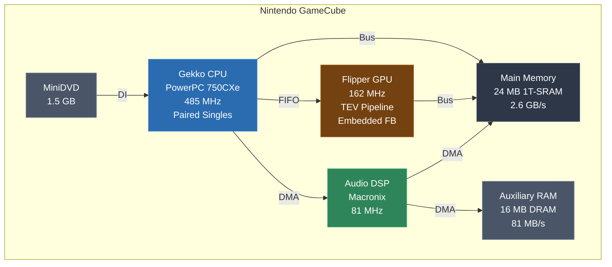
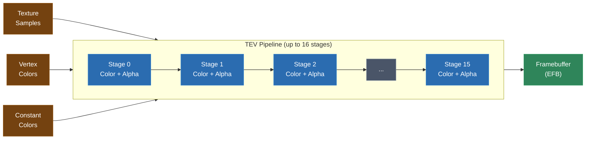
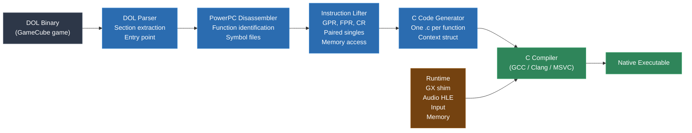
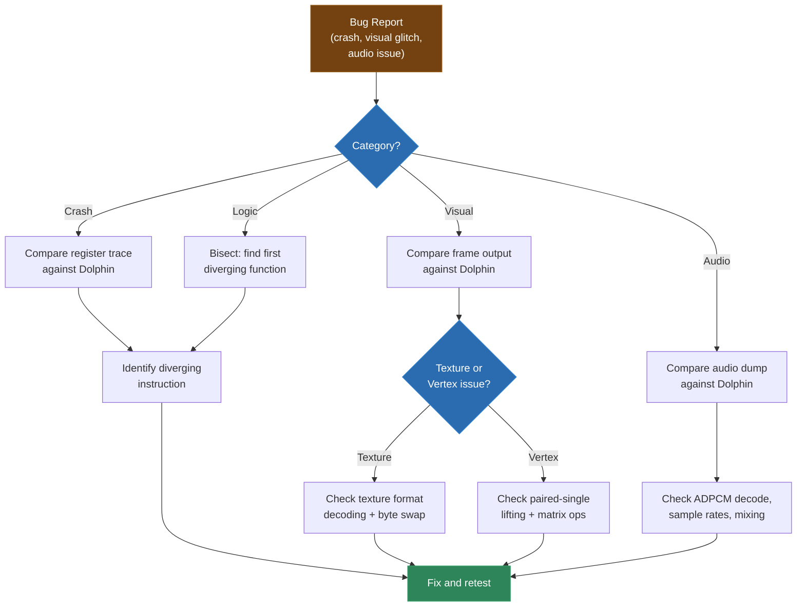

# Module 22: GameCube and PowerPC Recompilation

The Nintendo GameCube is where static recompilation steps into the PowerPC world -- and it is a very different world from the MIPS you worked with on the N64. The Gekko CPU is a real desktop-class PowerPC core with features you will not find on any other console: paired single-precision floating point operations that pack two floats into one register, a rich condition register system with eight independent fields, and a link register calling convention that eliminates the need for a return address stack in many cases. The hardware around it -- Flipper's integrated GPU, the 1T-SRAM main memory, the DSP-driven audio -- is tightly coupled and purpose-built in ways that make GameCube recompilation both rewarding and tricky.

This module covers the Gekko CPU in depth, the GameCube hardware platform, the DOL binary format, PowerPC instruction lifting with all its quirks, the GX graphics pipeline and how to shim it, and the gcrecomp toolchain that ties it all together. If you have been through the N64 module, you already know the shape of the pipeline. Now we are going to see how the same ideas apply to a fundamentally different architecture.

---

## 1. The GameCube Platform

The GameCube launched in 2001, entering a generation dominated by the PlayStation 2 and the original Xbox. Nintendo made aggressive hardware choices that resulted in a compact, efficient system with some genuinely unusual architectural decisions.

### System Overview

The GameCube's hardware was co-developed by Nintendo and several partners, resulting in a tightly integrated design where the CPU, GPU, and memory system were designed to work together rather than being commodity parts bolted together (like the Xbox).

| Component | Specification |
|---|---|
| CPU | IBM Gekko (PowerPC 750CXe derivative), 485 MHz |
| GPU | ATI/ArtX "Flipper", 162 MHz |
| Main Memory | 24 MB 1T-SRAM (Mosys), 2.6 GB/s |
| Auxiliary Memory | 16 MB DRAM ("A-RAM"), 81 MB/s |
| Audio DSP | Custom Macronix DSP, 81 MHz |
| Optical | MiniDVD (1.5 GB capacity) |
| Byte Order | Big-endian |

The system is big-endian throughout -- CPU, GPU command streams, memory layout, everything. This matters for recompilation because your host PC is almost certainly little-endian, and you will be doing a lot of byte swapping.



### Memory Architecture: 1T-SRAM and A-RAM

The GameCube's memory system is split into two pools with very different characteristics, and understanding this split is important for recompilation.

**Main RAM (24 MB 1T-SRAM)** is the primary working memory. 1T-SRAM is a MoSys technology that provides SRAM-like latency (no refresh cycles, low access latency) with DRAM-like density. The CPU and GPU both access this memory directly. Its bandwidth of 2.6 GB/s was high for the era and gave developers a lot of headroom. The physical address range for main RAM is `0x00000000` to `0x017FFFFF`.

**Auxiliary RAM (16 MB DRAM, "A-RAM")** is a secondary memory pool accessible only through DMA transfers via the audio DSP. The CPU cannot directly read or write A-RAM -- it must set up DMA transfers through the DSP interface to move data between main RAM and A-RAM. Games use A-RAM primarily for audio sample storage, but some games get creative and use it as overflow storage for textures or other data. A-RAM's physical address range is separate from main RAM.

For recompilation, the key implication is that you need to model both memory pools. Main RAM is straightforward -- it is where code and most data live. A-RAM requires shimming the DSP's DMA interface so that games can still move data in and out as they expect.

The GameCube's virtual memory map as seen by games (through the BAT registers):

```
GameCube Virtual Memory Map (typical game configuration)
===================================================================

 Virtual Address     Size      Maps To
-------------------------------------------------------------------
 0x80000000-0x817FFFFF  24 MB    Main RAM (cached)
 0xC0000000-0xC17FFFFF  24 MB    Main RAM (uncached)
 0xCC000000-0xCC00FFFF  64 KB    Hardware registers (Flipper)
 0xE0000000+            Varies   Embedded framebuffer (GPU)
===================================================================
```

Games see main RAM at virtual address `0x80000000` (cached access) or `0xC0000000` (uncached access, used for DMA and hardware register access). This is very similar to the MIPS KSEG0/KSEG1 split you saw on the N64 -- the upper bits of the address select the caching mode.

### No Operating System (Mostly)

Like the N64, the GameCube has no traditional operating system. Nintendo provided a set of libraries collectively called the "SDK" that games linked against statically:

- **libogc** (community equivalent: devkitPro's libogc) provides hardware abstraction
- **GX** is the graphics API -- a state-machine-based interface to Flipper's TEV pipeline
- **AI/DSP** libraries handle audio mixing and streaming
- **PAD** handles controller input
- **DVD** provides disc access
- **OS** provides basic threading, memory allocation, and exception handling

Every game is a self-contained DOL binary that boots directly on the hardware. There is no dynamic linking, no shared libraries, no system calls in the Unix sense. This means -- just like the N64 -- every function the game uses is present in the binary. No external dependencies to worry about.

However, the GameCube does have a small boot ROM (IPL) and a rudimentary kernel that sets up the hardware before handing control to the game. Your recompiler does not need to deal with this -- by the time the game's entry point is reached, the hardware is initialized and the game owns the machine.

---

## 2. The Gekko CPU: PowerPC 750CXe

The Gekko is the heart of the GameCube, and understanding it deeply is essential for building a correct instruction lifter. It is a modified IBM PowerPC 750CXe -- a single-issue, in-order, 32-bit PowerPC core with some Nintendo-specific additions.

### PowerPC Architecture Basics

If you are coming from MIPS (as most students in this course are at this point), PowerPC will feel both familiar and alien. Both are RISC architectures with fixed-width 32-bit instructions, load/store designs, and large register files. But the similarities end quickly.

PowerPC has a much richer set of special-purpose registers, a more complex branching model, and several features (like the condition register) that have no direct MIPS equivalent.

### General Purpose Registers (GPRs)

The Gekko has **32 general-purpose registers**, each 32 bits wide, named `r0` through `r31`. The calling convention assigns specific roles:

| Register(s) | Convention | Purpose |
|---|---|---|
| r0 | Volatile | Scratch (also used by some instructions as literal 0) |
| r1 | Dedicated | Stack pointer |
| r2 | Dedicated | Small data area pointer (rarely used in games) |
| r3-r10 | Volatile | Function arguments and return values |
| r11-r12 | Volatile | Scratch |
| r13 | Dedicated | Small data area 2 / TLS pointer |
| r14-r31 | Non-volatile | Callee-saved registers |

A critical quirk: `r0` is **not hardwired to zero** like MIPS `$zero`. It is a real register that can hold any value. However, some instructions treat `r0` specially -- for example, `addi r5, r0, 100` uses the literal value 0 instead of the contents of r0 for the base. This means `r0` acts as "zero" in some contexts and as a normal register in others. Your lifter must handle this per-instruction.

```c
// PowerPC: addi r5, r0, 100
// When r0 is used as rA in addi, it means literal 0, not the register
ctx->r[5] = 0 + 100;  // NOT ctx->r[0] + 100

// PowerPC: add r5, r0, r6
// In non-indexed instructions like add, r0 is a normal register
ctx->r[5] = ctx->r[0] + ctx->r[6];  // r0 IS the register here
```

This r0 ambiguity is one of the first things that trips people up when writing a PowerPC lifter. You need to check the instruction definition to know whether r0 means "register 0" or "literal zero."

### Floating Point Registers (FPRs)

The Gekko has **32 floating-point registers**, each 64 bits wide, named `f0` through `f31`. These support both single-precision and double-precision IEEE 754 operations. The calling convention passes floating-point arguments in `f1` through `f8` and returns floating-point values in `f1`.

Standard PowerPC floating-point instructions operate on these registers directly:

```c
// fadd f3, f1, f2
ctx->f[3] = ctx->f[1] + ctx->f[2];

// fmuls f4, f1, f2  (single-precision multiply)
ctx->f[4] = (double)((float)ctx->f[1] * (float)ctx->f[2]);

// fcmpu cr0, f1, f2  (compare, update CR0)
// This sets bits in the condition register -- we will get to that
```

The double-to-single conversion semantics matter. When a single-precision instruction executes, the result is rounded to single precision and then stored in the 64-bit FPR (with the upper bits being a double-precision representation of that single-precision value). Games rely on this precision behavior for deterministic physics.

### Paired Singles: The GameCube's SIMD

Here is where the Gekko gets interesting. Nintendo added a custom extension called **Paired Singles (PS)** to the PowerPC 750CXe. This extension reinterprets each 64-bit FPR as a pair of 32-bit single-precision floats and provides SIMD-like operations on them.

Each FPR, when used in paired-single mode, contains two floats:

```
FPR layout in paired-single mode:
[63:32] = ps0 (high float, "paired single 0")
[31: 0] = ps1 (low float, "paired single 1")
```

Paired single instructions operate on both floats simultaneously:

```asm
ps_add  f3, f1, f2    ; f3.ps0 = f1.ps0 + f2.ps0
                        ; f3.ps1 = f1.ps1 + f2.ps1

ps_mul  f4, f1, f2    ; f4.ps0 = f1.ps0 * f2.ps0
                        ; f4.ps1 = f1.ps1 * f2.ps1

ps_madd f5, f1, f2, f3 ; f5.ps0 = f1.ps0 * f2.ps0 + f3.ps0
                         ; f5.ps1 = f1.ps1 * f2.ps1 + f3.ps1
```

Games use paired singles extensively for geometry processing -- transforming vertices, computing lighting, interpolating animations. Two components of a 3D vector (say, X and Y) are packed into one register, and Z goes in another. This allows vector math to proceed at roughly double throughput compared to scalar float operations.

Lifting paired singles to C requires you to model the dual-float layout explicitly:

```c
typedef struct {
    float ps0;
    float ps1;
} PairedSingle;

typedef struct {
    // ...
    PairedSingle ps[32];  // 32 paired-single registers (overlapping FPRs)
    double f[32];          // 32 double-precision FPRs
    // Note: ps[i] and f[i] share the same physical register
    // You need a union or careful management
} GekkoContext;

// ps_add f3, f1, f2
ctx->ps[3].ps0 = ctx->ps[1].ps0 + ctx->ps[2].ps0;
ctx->ps[3].ps1 = ctx->ps[1].ps1 + ctx->ps[2].ps1;

// ps_madd f5, f1, f2, f3
ctx->ps[5].ps0 = ctx->ps[1].ps0 * ctx->ps[2].ps0 + ctx->ps[3].ps0;
ctx->ps[5].ps1 = ctx->ps[1].ps1 * ctx->ps[2].ps1 + ctx->ps[3].ps1;
```

The tricky part is that paired-single and standard floating-point instructions share the same register file. When a standard `fadd` writes to `f3`, it writes a double-precision result. When a subsequent `ps_add` reads `f3`, it reads two single-precision values from the same bits. Your context struct needs to handle this overlap correctly, typically with a union:

```c
typedef union {
    double d;
    struct {
        float ps0;
        float ps1;
    } ps;
    uint64_t raw;
} FPRegister;
```

Here is a real-world example of how a game uses paired singles for 3D vector operations. Consider transforming a 3D vertex by a 4x4 matrix. In scalar code, this is 16 multiplies and 12 adds. With paired singles, it takes roughly half as many instructions because each operation works on two floats at once:

```asm
; Matrix-vector multiply using paired singles
; Matrix is in f4-f11 (8 registers, 2 floats each = 16 floats = 4x4 matrix)
; Input vertex XY in f0, ZW in f1
; Output vertex XY in f2, ZW in f3

; Multiply by first column
ps_mul   f2, f4, f0     ; f2 = M[0,0]*X, M[1,0]*Y (column 0, rows 0-1)
ps_mul   f3, f5, f0     ; f3 = M[2,0]*X, M[3,0]*Y (column 0, rows 2-3)

; Multiply-add second column
ps_madd  f2, f6, f1, f2 ; f2 += M[0,1]*Z, M[1,1]*W
ps_madd  f3, f7, f1, f3 ; f3 += M[2,1]*Z, M[3,1]*W

; Continue for columns 2-3 with more ps_madd...
```

The key insight is that by packing two components into each register (X and Y, or Z and W), you effectively double the throughput of vertex processing. The Gekko can execute one paired-single instruction per clock cycle, so a full matrix-vector multiply takes about 8-10 cycles -- comparable to what a dedicated vector unit would achieve.

Common paired-single usage patterns you will see in GameCube code:

**3D Vector Addition/Subtraction**:
```c
// ps_add f3, f1, f2  -- adds two 2-component vectors
// If f1 = (x1, y1) and f2 = (x2, y2), then f3 = (x1+x2, y1+y2)
ctx->ps[3].ps0 = ctx->ps[1].ps0 + ctx->ps[2].ps0;
ctx->ps[3].ps1 = ctx->ps[1].ps1 + ctx->ps[2].ps1;
```

**Dot Product (partial)**:
```c
// ps_mul f3, f1, f2  -- element-wise multiply
// ps_sum0 f4, f3, f0, f0  -- sum ps0 and ps1 of f3 (dot product of 2D components)
ctx->ps[3].ps0 = ctx->ps[1].ps0 * ctx->ps[2].ps0;
ctx->ps[3].ps1 = ctx->ps[1].ps1 * ctx->ps[2].ps1;
ctx->ps[4].ps0 = ctx->ps[3].ps0 + ctx->ps[3].ps1;
ctx->ps[4].ps1 = ctx->ps[0].ps1;  // ps_sum0 copies ps1 from third operand
```

**Interpolation (for animation blending)**:
```c
// Linear interpolation: result = a + t * (b - a)
// ps_sub f4, f2, f1     -- f4 = b - a
// ps_madd f5, f3, f4, f1 -- f5 = a + t * (b - a), where f3 holds (t, t)
ctx->ps[4].ps0 = ctx->ps[2].ps0 - ctx->ps[1].ps0;
ctx->ps[4].ps1 = ctx->ps[2].ps1 - ctx->ps[1].ps1;
ctx->ps[5].ps0 = ctx->ps[1].ps0 + ctx->ps[3].ps0 * ctx->ps[4].ps0;
ctx->ps[5].ps1 = ctx->ps[1].ps1 + ctx->ps[3].ps1 * ctx->ps[4].ps1;
```

**Merge operations** (combining results from different registers):
```asm
ps_merge00  f3, f1, f2   ; f3.ps0 = f1.ps0, f3.ps1 = f2.ps0
ps_merge01  f3, f1, f2   ; f3.ps0 = f1.ps0, f3.ps1 = f2.ps1
ps_merge10  f3, f1, f2   ; f3.ps0 = f1.ps1, f3.ps1 = f2.ps0
ps_merge11  f3, f1, f2   ; f3.ps0 = f1.ps1, f3.ps1 = f2.ps1
```

```c
// ps_merge00 f3, f1, f2
ctx->ps[3].ps0 = ctx->ps[1].ps0;
ctx->ps[3].ps1 = ctx->ps[2].ps0;

// ps_merge01 f3, f1, f2
ctx->ps[3].ps0 = ctx->ps[1].ps0;
ctx->ps[3].ps1 = ctx->ps[2].ps1;

// ps_merge10 f3, f1, f2
ctx->ps[3].ps0 = ctx->ps[1].ps1;
ctx->ps[3].ps1 = ctx->ps[2].ps0;

// ps_merge11 f3, f1, f2
ctx->ps[3].ps0 = ctx->ps[1].ps1;
ctx->ps[3].ps1 = ctx->ps[2].ps1;
```

These merge instructions are used to rearrange vector components -- for example, swizzling (x,y) to (y,x) or combining the X from one vector with the Y from another. They are essential for the matrix multiply patterns described above.

There are also paired-single load and store instructions that load/store two floats at once:

```asm
psq_l   f3, 0(r4), 0, 0    ; load quantized pair from [r4]
psq_st  f3, 0(r4), 0, 0    ; store quantized pair to [r4]
```

The `psq_l` and `psq_st` instructions support **quantization** -- they can load data in various packed formats (uint8, int8, uint16, int16) and automatically convert to/from float. The quantization type is controlled by GQR (Graphics Quantize Registers), which are SPR (Special Purpose Registers). Games set up the GQR registers once and then use quantized loads/stores throughout. This is how games efficiently load vertex data from compressed formats.

```c
// psq_l f3, offset(rA), W, I
// W=0: load pair, W=1: load single (ps1 = 1.0)
// I: GQR index selecting quantization type
//
// Simplified for unquantized (float) case:
float *src = (float*)(ctx->mem_base + ctx->r[rA] + offset);
ctx->ps[3].ps0 = byte_swap_f32(src[0]);
if (W == 0) {
    ctx->ps[3].ps1 = byte_swap_f32(src[1]);
} else {
    ctx->ps[3].ps1 = 1.0f;
}
```

The quantization support means your lifter needs access to the GQR register values to know how to interpret the data being loaded. In practice, most games use a small number of quantization configurations, and you can often resolve them statically.

### The Condition Register (CR)

The PowerPC condition register is one of the most distinctive features of the architecture, and it is significantly more complex than MIPS branch conditions or x86 flags.

The CR is a 32-bit register divided into **8 fields** of 4 bits each (CR0 through CR7). Each field contains four condition bits:

| Bit | Name | Meaning |
|---|---|---|
| 0 | LT | Less than |
| 1 | GT | Greater than |
| 2 | EQ | Equal |
| 3 | SO | Summary overflow |

When a comparison instruction executes, it writes to a specific CR field:

```asm
cmpwi   cr0, r3, 0       ; compare r3 with 0, result in CR0
cmpwi   cr1, r4, 100     ; compare r4 with 100, result in CR1
cmpw    cr2, r5, r6      ; compare r5 with r6, result in CR2
```

Branch instructions can test any field:

```asm
beq     cr0, target       ; branch if CR0.EQ is set
blt     cr1, target       ; branch if CR1.LT is set
bge     cr2, target       ; branch if CR2.LT is clear
```

This is powerful because you can set up multiple comparisons and then branch on any of them later. Games use this for complex conditional logic without needing to re-evaluate conditions.

Additionally, certain instructions (those with `Rc=1`, denoted by a dot suffix like `add.`) automatically update CR0 based on the result:

```asm
add.    r3, r4, r5        ; r3 = r4 + r5, update CR0 based on result
                           ; CR0.LT = (result < 0)
                           ; CR0.GT = (result > 0)
                           ; CR0.EQ = (result == 0)
                           ; CR0.SO = copy of XER.SO
```

For lifting, you need to model all 8 CR fields:

```c
typedef struct {
    uint8_t lt, gt, eq, so;
} CRField;

typedef struct {
    // ...
    CRField cr[8];
} GekkoContext;

// cmpwi cr0, r3, 0
{
    int32_t a = (int32_t)ctx->r[3];
    int32_t b = 0;
    ctx->cr[0].lt = (a < b);
    ctx->cr[0].gt = (a > b);
    ctx->cr[0].eq = (a == b);
    ctx->cr[0].so = ctx->xer_so;
}

// beq cr0, target
if (ctx->cr[0].eq) goto target;

// blt cr1, target
if (ctx->cr[1].lt) goto target;
```

There are also **CR logical instructions** that perform boolean operations between CR bits:

```asm
crand   0, 2, 6           ; CR bit 0 = CR bit 2 AND CR bit 6
cror    4, 1, 5            ; CR bit 4 = CR bit 1 OR CR bit 5
```

These are used by compilers to combine conditions without branching. They operate on individual bits within the entire 32-bit CR, addressed as bit numbers 0-31. Bit 0 is CR0.LT, bit 1 is CR0.GT, bit 2 is CR0.EQ, bit 3 is CR0.SO, bit 4 is CR1.LT, and so on.

### Link Register and Branch-Link Conventions

PowerPC does not use a return address stack or a dedicated return instruction in the MIPS sense. Instead, it has the **Link Register (LR)** and the **Count Register (CTR)**.

When a **branch-and-link** instruction executes (`bl target`), the address of the instruction following the branch is stored in LR. The callee returns by branching to the link register (`blr`).

```asm
    bl      some_function     ; LR = address of next instruction
    ; execution continues here after some_function returns

some_function:
    ; ... function body ...
    blr                       ; branch to LR (return)
```

The CTR register is used for counted loops and indirect branches:

```asm
    mtctr   r3                ; CTR = r3 (function pointer)
    bctrl                     ; branch to CTR, set LR (indirect call)

    ; Or for counted loops:
    li      r3, 10
    mtctr   r3
loop:
    ; ... loop body ...
    bdnz    loop              ; decrement CTR, branch if CTR != 0
```

For lifting:

```c
// bl some_function
ctx->lr = current_pc + 4;
some_function(ctx);

// blr
return;  // caller already saved LR context

// mtctr r3
ctx->ctr = ctx->r[3];

// bctrl (indirect call through CTR)
ctx->lr = current_pc + 4;
dispatch_indirect(ctx, ctx->ctr);

// bdnz loop
ctx->ctr--;
if (ctx->ctr != 0) goto loop;
```

The `bctrl` instruction is the PowerPC equivalent of an indirect call, and it is the primary source of indirect call challenges on the GameCube. We will discuss handling strategies later in this module.

### Other Special Purpose Registers

Beyond LR and CTR, the Gekko has several other SPRs that matter for recompilation:

| SPR | Name | Purpose |
|---|---|---|
| XER | Fixed-Point Exception Register | Carry, overflow, summary overflow, byte count |
| FPSCR | FP Status and Control Register | FP exception flags, rounding mode |
| GQR0-7 | Graphics Quantize Registers | Paired-single quantization types |
| HID0-2 | Hardware Implementation Dependent | Cache control, paired-single enable |
| SRR0/SRR1 | Save/Restore Registers | Exception handling |
| TBL/TBU | Time Base Registers | Cycle counter (read-only to user) |

For most games, you need to model XER (for carry-based arithmetic), FPSCR (for rounding mode), GQR0-7 (for paired-single quantized loads/stores), and the time base registers (games read them for timing). The others can typically be stubbed.

---

## 3. The DOL Binary Format

GameCube games are distributed as DOL (Dolphin Object Loader) files. The DOL format is simple and well-documented -- refreshingly so compared to some of the formats you will encounter later in this course.

### DOL Header

The DOL header is exactly 256 bytes (0x100) and contains all the information needed to load the binary:

```
DOL Header (256 bytes)
===================================================================

 Offset     Size    Field
-------------------------------------------------------------------
 0x0000     0x1C    Text section file offsets (7 entries, 4 bytes each)
 0x001C     0x2C    Data section file offsets (11 entries, 4 bytes each)
 0x0048     0x1C    Text section load addresses (7 entries)
 0x0064     0x2C    Data section load addresses (11 entries)
 0x0090     0x1C    Text section sizes (7 entries)
 0x00AC     0x2C    Data section sizes (11 entries)
 0x00D8     0x04    BSS address
 0x00DC     0x04    BSS size
 0x00E0     0x04    Entry point
 0x00E4     0x1C    Padding (zeroes)
===================================================================
```

The format supports up to **7 text (code) sections** and **11 data sections**. Each section has a file offset (where the data lives in the DOL file), a load address (the virtual address where it should be placed in memory), and a size. The BSS section is described by address and size but has no file data -- it is zero-initialized at load time.

Parsing a DOL is straightforward:

```python
import struct

def parse_dol(data):
    """Parse a DOL header and return section information."""
    sections = []

    # 7 text sections
    for i in range(7):
        file_off = struct.unpack_from('>I', data, 0x00 + i * 4)[0]
        load_addr = struct.unpack_from('>I', data, 0x48 + i * 4)[0]
        size = struct.unpack_from('>I', data, 0x90 + i * 4)[0]
        if size > 0:
            sections.append({
                'type': 'text',
                'file_offset': file_off,
                'load_address': load_addr,
                'size': size,
                'data': data[file_off:file_off + size]
            })

    # 11 data sections
    for i in range(11):
        file_off = struct.unpack_from('>I', data, 0x1C + i * 4)[0]
        load_addr = struct.unpack_from('>I', data, 0x64 + i * 4)[0]
        size = struct.unpack_from('>I', data, 0xAC + i * 4)[0]
        if size > 0:
            sections.append({
                'type': 'data',
                'file_offset': file_off,
                'load_address': load_addr,
                'size': size,
                'data': data[file_off:file_off + size]
            })

    bss_addr = struct.unpack_from('>I', data, 0xD8)[0]
    bss_size = struct.unpack_from('>I', data, 0xDC)[0]
    entry_point = struct.unpack_from('>I', data, 0xE0)[0]

    return {
        'sections': sections,
        'bss_address': bss_addr,
        'bss_size': bss_size,
        'entry_point': entry_point
    }
```

Note the `>I` format specifier -- big-endian unsigned 32-bit integer. Everything in the DOL is big-endian.

### DOL vs. ELF

Some GameCube development tools and the Dolphin emulator can also work with ELF files. ELF provides richer metadata (symbol tables, debug info, section names) but is not the shipping format. If you are working with a retail game disc, you are working with a DOL. If you have access to a development build or a decompilation project's output, you might get ELF with symbols, which makes your job significantly easier.

The gcrecomp toolchain supports both formats but expects DOL for production use.

### REL and DLL Modules

Some GameCube games use **REL (Relocatable)** modules -- dynamically loaded code modules that are loaded and linked at runtime by the game's own loader. REL files have their own header format with relocation tables. Games like Paper Mario: The Thousand-Year Door and Pikmin 2 make heavy use of RELs.

For recompilation, REL modules need to be parsed and lifted separately, then linked into the final binary. The relocation tables tell you how addresses in the REL reference both the main DOL and other RELs:

```c
// REL relocation types
#define R_PPC_NONE       0
#define R_PPC_ADDR32     1   // 32-bit absolute address
#define R_PPC_ADDR24     2   // 26-bit field for branch targets
#define R_PPC_ADDR16_LO  4   // lower 16 bits
#define R_PPC_ADDR16_HI  5   // upper 16 bits
#define R_PPC_ADDR16_HA  6   // upper 16 bits, adjusted for signed lower
#define R_PPC_REL24     10   // 26-bit PC-relative (branch)
```

If your target game does not use RELs, you can ignore this entirely. If it does, you will need a REL parser and a way to resolve cross-module references in your generated code.

---

## 4. PowerPC Instruction Lifting

With the CPU architecture and binary format understood, we can now talk about the actual lifting process -- turning PowerPC machine code into C.

### Disassembly

PowerPC instructions are all 32 bits wide and 4-byte aligned. This makes disassembly significantly simpler than x86 (variable-length) or even SH-4 (16-bit with 32-bit mixed). You can linearly scan the text sections and decode every 4-byte word as an instruction.

The primary opcode is in the upper 6 bits (bits 0-5 in PowerPC bit numbering, which counts from the MSB). An extended opcode in the lower bits further specifies the operation:

```c
uint32_t insn = read_be32(code_ptr);
uint8_t opcode = (insn >> 26) & 0x3F;

switch (opcode) {
    case 14: // addi
        lift_addi(ctx, insn);
        break;
    case 15: // addis
        lift_addis(ctx, insn);
        break;
    case 16: // bc (conditional branch)
        lift_bc(ctx, insn);
        break;
    case 18: // b (unconditional branch)
        lift_b(ctx, insn);
        break;
    case 19: // CR operations, bclr, bcctr, etc.
        lift_op19(ctx, insn);
        break;
    case 31: // integer arithmetic/logic (extended opcode in bits 21-30)
        lift_op31(ctx, insn);
        break;
    case 59: // single-precision float (extended opcode)
        lift_op59(ctx, insn);
        break;
    case 63: // double-precision float (extended opcode)
        lift_op63(ctx, insn);
        break;
    // ... and so on for all primary opcodes
}
```

PowerPC has a clean, regular encoding. Most instructions follow one of a few formats:

```
I-Form:  [opcode:6][LI:24][AA:1][LK:1]           (branch)
B-Form:  [opcode:6][BO:5][BI:5][BD:14][AA:1][LK:1] (conditional branch)
D-Form:  [opcode:6][rD:5][rA:5][SIMM:16]          (arithmetic immediate)
X-Form:  [opcode:6][rD:5][rA:5][rB:5][XO:10][Rc:1] (register-register)
```

### Arithmetic and Logic

Integer arithmetic instructions are the bread and butter of any lifter. Here are the key ones:

```c
// addi rD, rA, SIMM  (add immediate)
// Note: if rA == 0, use literal 0 instead of r[0]
if (rA == 0)
    ctx->r[rD] = (int16_t)SIMM;  // sign-extended immediate
else
    ctx->r[rD] = ctx->r[rA] + (int16_t)SIMM;

// addis rD, rA, SIMM  (add immediate shifted)
// Same r0 rule applies
if (rA == 0)
    ctx->r[rD] = (int16_t)SIMM << 16;
else
    ctx->r[rD] = ctx->r[rA] + ((int16_t)SIMM << 16);

// add rD, rA, rB
ctx->r[rD] = ctx->r[rA] + ctx->r[rB];

// subf rD, rA, rB  (subtract from: rD = rB - rA, note the reversed order!)
ctx->r[rD] = ctx->r[rB] - ctx->r[rA];

// mullw rD, rA, rB  (multiply low word)
ctx->r[rD] = (int32_t)ctx->r[rA] * (int32_t)ctx->r[rB];

// divw rD, rA, rB  (divide word)
ctx->r[rD] = (int32_t)ctx->r[rA] / (int32_t)ctx->r[rB];

// and rD, rA, rB
ctx->r[rD] = ctx->r[rA] & ctx->r[rB];

// or rD, rA, rB
ctx->r[rD] = ctx->r[rA] | ctx->r[rB];

// rlwinm rD, rS, SH, MB, ME  (rotate left word immediate then AND with mask)
{
    uint32_t rotated = (ctx->r[rS] << SH) | (ctx->r[rS] >> (32 - SH));
    uint32_t mask = generate_mask(MB, ME);
    ctx->r[rD] = rotated & mask;
}
```

The `rlwinm` instruction deserves special attention. It is an incredibly versatile instruction that compilers use for bit extraction, shifts, and masking -- all in one instruction. The mask is defined by MB (Mask Begin) and ME (Mask End) bit positions, forming a contiguous range of 1-bits:

```c
uint32_t generate_mask(int MB, int ME) {
    uint32_t mask = 0;
    if (MB <= ME) {
        // Normal mask: bits MB through ME are set
        for (int i = MB; i <= ME; i++)
            mask |= (1u << (31 - i));
    } else {
        // Wrapped mask: bits 0-ME and MB-31 are set
        for (int i = 0; i <= ME; i++)
            mask |= (1u << (31 - i));
        for (int i = MB; i <= 31; i++)
            mask |= (1u << (31 - i));
    }
    return mask;
}
```

Games compiled with Metrowerks CodeWarrior (the standard GameCube compiler) use `rlwinm` extensively. You will see it used for:
- `rlwinm rD, rS, 0, MB, ME` -- extract bits (shift amount = 0, just mask)
- `rlwinm rD, rS, SH, 0, 31` -- pure rotate
- `rlwinm rD, rS, SH, 0, 31-SH` -- logical shift left by SH

There is a related instruction `rlwimi` (rotate left word immediate then mask insert) that inserts bits from one register into another without disturbing the rest:

```c
// rlwimi rA, rS, SH, MB, ME
// Insert rotated bits from rS into rA, only in the mask region
{
    uint32_t rotated = (ctx->r[rS] << SH) | (ctx->r[rS] >> (32 - SH));
    uint32_t mask = generate_mask(MB, ME);
    ctx->r[rA] = (rotated & mask) | (ctx->r[rA] & ~mask);
}
```

This shows up in bitfield manipulation code -- setting specific bit ranges without touching the surrounding bits. You will see it in hardware register configuration, packed color manipulation, and bitflag management.

### XER and Carry-Based Arithmetic

The XER (Fixed-Point Exception Register) contains three important bits: CA (carry), OV (overflow), and SO (summary overflow). Several PowerPC instructions use the carry bit for extended-precision arithmetic:

```c
// addc rD, rA, rB  (add carrying -- sets XER.CA)
{
    uint64_t result = (uint64_t)ctx->r[rA] + (uint64_t)ctx->r[rB];
    ctx->r[rD] = (uint32_t)result;
    ctx->xer_ca = (result >> 32) & 1;  // carry out
}

// adde rD, rA, rB  (add extended -- adds with carry in)
{
    uint64_t result = (uint64_t)ctx->r[rA] + (uint64_t)ctx->r[rB] + ctx->xer_ca;
    ctx->r[rD] = (uint32_t)result;
    ctx->xer_ca = (result >> 32) & 1;
}

// subfc rD, rA, rB  (subtract from carrying)
{
    uint64_t result = (uint64_t)ctx->r[rB] + (uint64_t)(~ctx->r[rA]) + 1;
    ctx->r[rD] = (uint32_t)result;
    ctx->xer_ca = (result >> 32) & 1;
}

// addze rD, rA  (add to zero extended -- adds carry to register)
{
    uint64_t result = (uint64_t)ctx->r[rA] + ctx->xer_ca;
    ctx->r[rD] = (uint32_t)result;
    ctx->xer_ca = (result >> 32) & 1;
}
```

These are used by the compiler for 64-bit arithmetic on the 32-bit Gekko. A 64-bit add compiles to `addc` (add low words with carry output) followed by `adde` (add high words with carry input). If you get carry propagation wrong, 64-bit math silently produces wrong results.

### Floating-Point Instruction Details

The Gekko's standard (non-paired-single) floating-point instructions follow the IEEE 754 standard for the most part. Here are the common ones and their lifting:

```c
// lfs frD, offset(rA)  (load float single)
// Loads a 32-bit float, converts to 64-bit double, stores in FPR
{
    uint32_t addr = ((rA == 0) ? 0 : ctx->r[rA]) + (int16_t)offset;
    float val = mem_read_f32(ctx, addr);
    ctx->fpr[frD].d = (double)val;
    // Also sets ps1 to the same value (paired-single behavior)
    ctx->fpr[frD].ps.ps0 = val;
    ctx->fpr[frD].ps.ps1 = val;  // both slots get the same value
}

// lfd frD, offset(rA)  (load float double)
// Loads a 64-bit double directly into FPR
{
    uint32_t addr = ((rA == 0) ? 0 : ctx->r[rA]) + (int16_t)offset;
    ctx->fpr[frD].raw = mem_read_u64(ctx, addr);
}

// stfs frS, offset(rA)  (store float single)
// Converts 64-bit double to 32-bit float, stores to memory
{
    uint32_t addr = ((rA == 0) ? 0 : ctx->r[rA]) + (int16_t)offset;
    float val = (float)ctx->fpr[frS].d;
    mem_write_f32(ctx, addr, val);
}

// stfd frS, offset(rA)  (store float double)
{
    uint32_t addr = ((rA == 0) ? 0 : ctx->r[rA]) + (int16_t)offset;
    mem_write_u64(ctx, addr, ctx->fpr[frS].raw);
}

// fadd frD, frA, frB  (float add double)
ctx->fpr[frD].d = ctx->fpr[frA].d + ctx->fpr[frB].d;

// fadds frD, frA, frB  (float add single)
// Result is computed in single precision and then stored as double
{
    float result = (float)ctx->fpr[frA].d + (float)ctx->fpr[frB].d;
    ctx->fpr[frD].d = (double)result;
}

// fmul frD, frA, frC  (float multiply -- note: uses frC, not frB!)
ctx->fpr[frD].d = ctx->fpr[frA].d * ctx->fpr[frC].d;

// fmadd frD, frA, frC, frB  (fused multiply-add: frA*frC + frB)
ctx->fpr[frD].d = ctx->fpr[frA].d * ctx->fpr[frC].d + ctx->fpr[frB].d;

// fnmsub frD, frA, frC, frB  (negative multiply-subtract: -(frA*frC - frB))
ctx->fpr[frD].d = -(ctx->fpr[frA].d * ctx->fpr[frC].d - ctx->fpr[frB].d);

// fabs frD, frB  (float absolute value)
ctx->fpr[frD].d = fabs(ctx->fpr[frB].d);

// fneg frD, frB  (float negate)
ctx->fpr[frD].d = -ctx->fpr[frB].d;

// fmr frD, frB  (float move register)
ctx->fpr[frD].raw = ctx->fpr[frB].raw;

// fcmpu crD, frA, frB  (float compare unordered, update CR field)
{
    double a = ctx->fpr[frA].d;
    double b = ctx->fpr[frB].d;
    if (isnan(a) || isnan(b)) {
        ctx->cr[crD].lt = 0; ctx->cr[crD].gt = 0;
        ctx->cr[crD].eq = 0; ctx->cr[crD].so = 1;
    } else if (a < b) {
        ctx->cr[crD].lt = 1; ctx->cr[crD].gt = 0;
        ctx->cr[crD].eq = 0; ctx->cr[crD].so = 0;
    } else if (a > b) {
        ctx->cr[crD].lt = 0; ctx->cr[crD].gt = 1;
        ctx->cr[crD].eq = 0; ctx->cr[crD].so = 0;
    } else {
        ctx->cr[crD].lt = 0; ctx->cr[crD].gt = 0;
        ctx->cr[crD].eq = 1; ctx->cr[crD].so = 0;
    }
}

// fctiwz frD, frB  (float convert to integer word, round toward zero)
{
    int32_t ival = (int32_t)ctx->fpr[frB].d;  // truncate toward zero
    // Store as integer in the lower 32 bits of the FPR
    ctx->fpr[frD].raw = 0;
    memcpy(&ctx->fpr[frD].raw, &ival, 4);
}
```

Pay attention to the multiply instruction encoding: `fmul` uses `frC` (not `frB`) as the second operand. This is a PowerPC encoding quirk -- the `frC` field is in a different bit position than `frB`. Getting this wrong means every floating-point multiply produces garbage.

The fused multiply-add instructions (`fmadd`, `fmsub`, `fnmadd`, `fnmsub`) are very common in compiled GameCube code. Metrowerks CodeWarrior aggressively fuses multiplies and adds into these instructions. Your lifter needs to handle all four variants.

A subtle precision issue: on the real Gekko, `fmadd` is truly fused -- the intermediate multiply result is not rounded before the add. In C, if you write `a * b + c`, the compiler may or may not fuse it. To ensure correctness, use the C `fma()` function if your host supports it:

```c
// fmadd frD, frA, frC, frB  (truly fused on Gekko)
#include <math.h>
ctx->fpr[frD].d = fma(ctx->fpr[frA].d, ctx->fpr[frC].d, ctx->fpr[frB].d);
```

For most games the difference between fused and unfused is invisible, but for games with numerically sensitive code (physics simulations, matrix decompositions), it can matter.

### String Instructions

PowerPC has a pair of string load/store instructions that deserve mention:

```c
// lswi rD, rA, NB  (load string word immediate)
// Loads NB bytes from memory into consecutive registers starting at rD
// Bytes are packed big-endian into each register
{
    uint32_t addr = (rA == 0) ? 0 : ctx->r[rA];
    int reg = rD;
    int bytes_loaded = 0;
    while (bytes_loaded < NB) {
        uint32_t val = 0;
        for (int b = 0; b < 4 && bytes_loaded < NB; b++, bytes_loaded++) {
            val |= (uint32_t)mem_read_u8(ctx, addr + bytes_loaded) << (24 - b*8);
        }
        ctx->r[reg] = val;
        reg = (reg + 1) % 32;
    }
}

// stswi rS, rA, NB  (store string word immediate)
// Reverse of lswi
```

These are rarely used by compilers but show up in hand-optimized string handling or BIOS code. They have complex behavior (wrapping around the register file) that you need to implement correctly.

### Load and Store

PowerPC uses explicit load and store instructions with various addressing modes:

```c
// lwz rD, offset(rA)  (load word and zero-extend)
{
    uint32_t addr = ((rA == 0) ? 0 : ctx->r[rA]) + (int16_t)offset;
    ctx->r[rD] = mem_read_u32(ctx, addr);
}

// stw rS, offset(rA)  (store word)
{
    uint32_t addr = ((rA == 0) ? 0 : ctx->r[rA]) + (int16_t)offset;
    mem_write_u32(ctx, addr, ctx->r[rS]);
}

// lbz rD, offset(rA)  (load byte and zero-extend)
// lhz rD, offset(rA)  (load halfword and zero-extend)
// lha rD, offset(rA)  (load halfword algebraic -- sign-extend)
// stb, sth variants for byte/halfword stores

// lwzx rD, rA, rB  (load word indexed: address = rA + rB)
{
    uint32_t addr = ((rA == 0) ? 0 : ctx->r[rA]) + ctx->r[rB];
    ctx->r[rD] = mem_read_u32(ctx, addr);
}

// lwzu rD, offset(rA)  (load word with update: rA = rA + offset after load)
{
    uint32_t addr = ctx->r[rA] + (int16_t)offset;
    ctx->r[rD] = mem_read_u32(ctx, addr);
    ctx->r[rA] = addr;  // update base register
}
```

The "update" forms (`lwzu`, `stwu`, etc.) modify the base register after the access. These are commonly used for stack frame setup:

```asm
stwu    r1, -0x20(r1)    ; allocate 32-byte stack frame
                           ; stores old SP, then SP = SP - 0x20
```

Remember: all memory accesses are big-endian. Your `mem_read_u32` function must byte-swap on little-endian hosts:

```c
uint32_t mem_read_u32(GekkoContext *ctx, uint32_t addr) {
    uint32_t phys = addr & 0x017FFFFF;  // mask to physical RAM range
    uint32_t val = *(uint32_t*)(ctx->mem_base + phys);
    return __builtin_bswap32(val);  // big-endian to little-endian
}
```

### Branches and Condition Register Updates

PowerPC branching is more expressive than MIPS or x86. The conditional branch instruction (`bc`) can test any bit in any CR field:

```asm
bc      BO, BI, target
```

The BO field encodes the branch condition type (always, if true, if false, with CTR decrement). The BI field specifies which CR bit to test (0-31).

In practice, you will mostly see the simplified mnemonics:

```c
// beq cr0, target  -> bc 12, 2, target (BO=12 means "branch if bit set", BI=2 is CR0.EQ)
if (ctx->cr[0].eq) goto target;

// bne cr0, target  -> bc 4, 2, target (BO=4 means "branch if bit clear")
if (!ctx->cr[0].eq) goto target;

// blt cr0, target  -> bc 12, 0, target
if (ctx->cr[0].lt) goto target;

// bge cr0, target  -> bc 4, 0, target
if (!ctx->cr[0].lt) goto target;

// bgt cr1, target  -> bc 12, 5, target (BI=5 is CR1.GT)
if (ctx->cr[1].gt) goto target;

// bdnz target  -> bc 16, 0, target (decrement CTR, branch if CTR != 0)
ctx->ctr--;
if (ctx->ctr != 0) goto target;
```

### No Delay Slots!

Here is a pleasant surprise after MIPS: **PowerPC has no delay slots**. When a branch is taken, the instruction after the branch is NOT executed. This simplifies your lifter significantly -- you do not need the condition-capture-then-execute-delay-slot dance that MIPS requires.

```c
// This is correct for PowerPC (no delay slot):
if (ctx->cr[0].eq) goto target;
// next instruction here is only reached if branch NOT taken
```

This is one of the reasons PowerPC code is often considered cleaner to lift than MIPS, despite having a more complex condition register system.

### Comparison Instruction Variants

PowerPC has a rich set of comparison instructions, and games use them all:

```c
// cmpwi crD, rA, SIMM  (compare word immediate, signed)
{
    int32_t a = (int32_t)ctx->r[rA];
    int32_t b = (int16_t)SIMM;
    ctx->cr[crD].lt = (a < b);
    ctx->cr[crD].gt = (a > b);
    ctx->cr[crD].eq = (a == b);
    ctx->cr[crD].so = ctx->xer_so;
}

// cmplwi crD, rA, UIMM  (compare logical word immediate, unsigned)
{
    uint32_t a = ctx->r[rA];
    uint32_t b = UIMM;
    ctx->cr[crD].lt = (a < b);
    ctx->cr[crD].gt = (a > b);
    ctx->cr[crD].eq = (a == b);
    ctx->cr[crD].so = ctx->xer_so;
}

// cmpw crD, rA, rB  (compare word, signed)
{
    int32_t a = (int32_t)ctx->r[rA];
    int32_t b = (int32_t)ctx->r[rB];
    ctx->cr[crD].lt = (a < b);
    ctx->cr[crD].gt = (a > b);
    ctx->cr[crD].eq = (a == b);
    ctx->cr[crD].so = ctx->xer_so;
}

// cmplw crD, rA, rB  (compare logical word, unsigned)
{
    uint32_t a = ctx->r[rA];
    uint32_t b = ctx->r[rB];
    ctx->cr[crD].lt = (a < b);
    ctx->cr[crD].gt = (a > b);
    ctx->cr[crD].eq = (a == b);
    ctx->cr[crD].so = ctx->xer_so;
}
```

The signed vs. unsigned distinction matters enormously. If you lift `cmplwi` as a signed comparison, unsigned values near `0xFFFFFFFF` will compare as negative rather than as large positive numbers. This kind of bug manifests as array bounds checks failing or loop termination conditions being wrong -- subtle and hard to debug.

### Switch Statements and bctr

Compilers generate switch statements on PowerPC using a pattern involving `bctr` (branch to count register):

```asm
; Switch statement with jump table
    cmpwi   cr0, r3, 5          ; check if index < 5
    bge     cr0, .default        ; if >= 5, go to default
    slwi    r3, r3, 2            ; index *= 4 (sizeof pointer)
    lis     r4, .jumptable@ha    ; load jump table address (high)
    addi    r4, r4, .jumptable@l ; load jump table address (low)
    lwzx    r4, r4, r3           ; load target from jump table
    mtctr   r4                   ; move to CTR
    bctr                         ; branch to CTR (indirect jump)

.jumptable:
    .4byte  .case0
    .4byte  .case1
    .4byte  .case2
    .4byte  .case3
    .4byte  .case4
```

Your lifter should recognize this pattern and generate a C `switch` statement instead of an indirect jump through the dispatch table. Pattern recognition for switch tables significantly improves readability and gives the C compiler much better optimization opportunities:

```c
// Recognized switch pattern:
switch (ctx->r[3]) {
    case 0: goto case0; break;
    case 1: goto case1; break;
    case 2: goto case2; break;
    case 3: goto case3; break;
    case 4: goto case4; break;
    default: goto default_case; break;
}
```

If you cannot recognize the pattern, the generic `dispatch_indirect(ctx, ctx->ctr)` fallback still works, but the generated code is harder to follow and the compiler cannot optimize the dispatch as effectively.

### The `addi` / `addis` Pattern for Constants

PowerPC does not have a single instruction to load a 32-bit immediate value into a register (the instruction is only 32 bits wide, and you need bits for the opcode and register specifier). Instead, compilers generate a two-instruction sequence:

```asm
lis     r3, 0x8034       ; load immediate shifted: r3 = 0x80340000
addi    r3, r3, 0x5678   ; add immediate: r3 = 0x80345678
```

`lis` is actually `addis rD, 0, SIMM` (add immediate shifted with r0 = literal 0). Your lifter should recognize this pattern and ideally combine them into a single constant load in the generated C:

```c
// Naive lifting (correct but verbose):
ctx->r[3] = 0x8034 << 16;        // lis r3, 0x8034
ctx->r[3] = ctx->r[3] + 0x5678;  // addi r3, r3, 0x5678

// Optimized (if your lifter can detect the lis+addi pattern):
ctx->r[3] = 0x80345678;
```

Pattern recognition like this is not required for correctness, but it makes the generated code much more readable and helps the C compiler optimize.

---

## 5. The GX Graphics Pipeline

The GameCube's Flipper GPU implements a graphics pipeline called **GX**, and understanding it is essential for the graphics translation layer in your recompilation runtime.

### TEV: The Texture Environment

The heart of GX is the **TEV (Texture Environment)** pipeline. TEV is a programmable color-combining system with up to **16 stages**. Each stage takes multiple color and alpha inputs, combines them with a configurable formula, and passes the result to the next stage.

This is conceptually similar to the N64's RDP color combiner but much more powerful -- 16 stages vs. 2 cycles, with more inputs and more complex operations per stage.



Each TEV stage computes:

```
Color output = (D + ((1-C) * A + C * B) + bias) * scale
Alpha output = (D + ((1-C) * A + C * B) + bias) * scale
```

Where A, B, C, D are selected from a set of sources including:
- Previous TEV stage output
- Texture color (from any of 8 texture units)
- Rasterized vertex color
- Constant color registers (4 constant color registers: C0, C1, C2, C3)
- Zero, half, one

The bias can be zero, +0.5, or -0.5. The scale can be 1x, 2x, 4x, or 0.5x. The result can be clamped to [0,1] or left unclamped for multi-pass effects.

For the recompilation shim, you need to translate these TEV configurations into modern GPU shaders. The approach is to generate fragment shaders dynamically based on the TEV state:

```c
// When the game configures TEV via GX API calls, record the configuration
typedef struct {
    uint8_t color_in_a, color_in_b, color_in_c, color_in_d;
    uint8_t alpha_in_a, alpha_in_b, alpha_in_c, alpha_in_d;
    uint8_t color_op;   // add, subtract
    uint8_t alpha_op;
    uint8_t color_bias;  // zero, add_half, sub_half
    uint8_t alpha_bias;
    uint8_t color_scale; // 1x, 2x, 4x, divide_by_2
    uint8_t alpha_scale;
    uint8_t color_clamp;
    uint8_t alpha_clamp;
    uint8_t color_dest;  // which register gets the output
    uint8_t alpha_dest;
} TEVStage;

typedef struct {
    TEVStage stages[16];
    int num_stages;
    // texture configuration, etc.
} TEVConfig;
```

When a draw call is issued, hash the current TEV configuration and look up (or generate) the corresponding shader:

```c
uint64_t tev_hash = hash_tev_config(&current_tev);
Shader *shader = shader_cache_lookup(tev_hash);
if (!shader) {
    char *glsl = generate_tev_fragment_shader(&current_tev);
    shader = compile_shader(glsl);
    shader_cache_insert(tev_hash, shader);
}
bind_shader(shader);
```

Here is what a generated fragment shader looks like for a simple two-stage TEV configuration (texture modulated by vertex color, with fog):

```glsl
// Auto-generated TEV fragment shader
#version 330 core

in vec4 v_color;       // vertex color (from rasterizer)
in vec2 v_texcoord0;   // texture coordinate 0

uniform sampler2D u_tex0;
uniform vec4 u_konst0;  // constant color register 0

out vec4 frag_color;

void main() {
    vec4 tex0 = texture(u_tex0, v_texcoord0);

    // TEV Stage 0: color = tex0 * vtx_color, alpha = tex0.a * vtx_color.a
    vec4 tev_prev;
    tev_prev.rgb = tex0.rgb * v_color.rgb;    // (A-B)*C+D = (tex-0)*vtx+0
    tev_prev.a   = tex0.a * v_color.a;

    // TEV Stage 1: blend with fog color (konst0)
    // color = mix(tev_prev, konst0, fog_factor)
    // Simplified: (konst0 - tev_prev) * fog + tev_prev
    tev_prev.rgb = mix(tev_prev.rgb, u_konst0.rgb, v_color.a);

    frag_color = clamp(tev_prev, 0.0, 1.0);
}
```

The shader generator needs to handle all the possible input sources, operations, biases, scales, and clamping modes. In practice, most games use relatively simple TEV configurations (1-4 stages), so the generated shaders are manageable. The edge cases come from games that use many stages for advanced effects like cel shading, multi-texture blending, or environment mapping.

### TEV Constant Color Registers

The GX API provides four constant color registers (GX_TEVKREG0 through GX_TEVKREG3) plus material colors (ambient, diffuse) that can be used as inputs to TEV stages. These are set by the game at runtime:

```c
// Game sets a constant color for cel-shading edge detection
GXSetTevKColor(GX_KCOLOR0, (GXColor){0, 0, 0, 128});
GXSetTevKColorSel(GX_TEVSTAGE2, GX_TEV_KCSEL_K0);

// In the shim:
void shim_GXSetTevKColor(int reg, GXColor color) {
    gx_state.konst[reg].r = color.r / 255.0f;
    gx_state.konst[reg].g = color.g / 255.0f;
    gx_state.konst[reg].b = color.b / 255.0f;
    gx_state.konst[reg].a = color.a / 255.0f;
}
```

### Indirect Texturing

One of the most powerful (and annoying to shim) GX features is **indirect texturing**. This allows a texture to be used to modify the texture coordinates of another texture lookup. It is used for effects like water distortion, heat haze, normal mapping, and environment mapping.

In indirect texturing, a "bump map" texture is sampled first, and its values are used to offset the texture coordinates for the primary texture. The GX API configures this through `GXSetTevIndirect` calls:

```c
// Game sets up indirect texturing for water distortion
GXSetTevIndirect(GX_TEVSTAGE0,         // which TEV stage
                 GX_INDTEXSTAGE0,       // which indirect texture stage
                 GX_ITF_8,              // format (8-bit)
                 GX_ITB_STU,            // bias (S, T, U components)
                 GX_ITM_0,              // matrix 0 (scale/rotate offsets)
                 GX_ITW_OFF,            // no wrap on S
                 GX_ITW_OFF,            // no wrap on T
                 GX_FALSE,              // no add previous texcoord
                 GX_FALSE,              // no LOD
                 GX_ITBA_OFF);          // no bump alpha
```

Implementing indirect texturing in your shader generator is complex. Each indirect texture stage adds dependent texture lookups to the generated shader, and the matrix, bias, and wrapping configurations create many permutations. This is one area where you may want to start with a basic implementation (no indirect texturing) and add it later when you encounter games that require it.

### Texture Formats and Decoding

GameCube textures use formats that need decoding before upload to a modern GPU:

| Format | Description | Block Size | Decoding |
|---|---|---|---|
| I4 | 4-bit intensity | 8x8 | Expand to RGBA (I,I,I,1) |
| I8 | 8-bit intensity | 8x4 | Expand to RGBA |
| IA4 | 4-bit intensity + 4-bit alpha | 8x4 | Expand to RGBA |
| IA8 | 8-bit intensity + 8-bit alpha | 4x4 | Expand to RGBA |
| RGB565 | 16-bit color | 4x4 | Convert to RGBA8 |
| RGB5A3 | 16-bit color + alpha | 4x4 | Two modes based on top bit |
| RGBA8 | 32-bit color | 4x4 | Direct, but block-swizzled |
| CI4 | 4-bit color indexed | 8x8 | Look up in palette (TLUT) |
| CI8 | 8-bit color indexed | 8x4 | Look up in palette |
| CI14x2 | 14-bit color indexed | 4x4 | Look up in palette |
| CMPR | DXT1-like S3TC compression | 8x8 | Decompress 4x4 sub-blocks |

All GameCube textures are stored in a **block/tile format** where the image is divided into fixed-size blocks. The blocks are stored sequentially, but within each block, pixels are in a specific order. This is different from the row-major layout that modern GPUs expect.

Here is the decoding for RGB5A3 (one of the trickiest because it has two modes):

```c
void decode_rgb5a3(uint16_t *src, uint32_t *dst, int width, int height) {
    int blocks_w = (width + 3) / 4;
    int blocks_h = (height + 3) / 4;

    for (int by = 0; by < blocks_h; by++) {
        for (int bx = 0; bx < blocks_w; bx++) {
            for (int py = 0; py < 4; py++) {
                for (int px = 0; px < 4; px++) {
                    int x = bx * 4 + px;
                    int y = by * 4 + py;
                    if (x >= width || y >= height) { src++; continue; }

                    uint16_t pixel = __builtin_bswap16(*src++);  // big-endian!
                    uint32_t rgba;

                    if (pixel & 0x8000) {
                        // RGB555 mode (no alpha, fully opaque)
                        uint8_t r = ((pixel >> 10) & 0x1F) * 255 / 31;
                        uint8_t g = ((pixel >> 5) & 0x1F) * 255 / 31;
                        uint8_t b = (pixel & 0x1F) * 255 / 31;
                        rgba = (255u << 24) | (b << 16) | (g << 8) | r;
                    } else {
                        // ARGB3444 mode (with alpha)
                        uint8_t a = ((pixel >> 12) & 0x07) * 255 / 7;
                        uint8_t r = ((pixel >> 8) & 0x0F) * 255 / 15;
                        uint8_t g = ((pixel >> 4) & 0x0F) * 255 / 15;
                        uint8_t b = (pixel & 0x0F) * 255 / 15;
                        rgba = (a << 24) | (b << 16) | (g << 8) | r;
                    }
                    dst[y * width + x] = rgba;
                }
            }
        }
    }
}
```

The CMPR format is particularly important -- it is the GameCube's version of S3TC/DXT1 compression and is used heavily by most games. It compresses 4x4 pixel blocks into 8 bytes, giving a 6:1 compression ratio for RGB. Modern GPUs can handle DXT1 natively (as BC1), so if you can detect CMPR textures and convert them to BC1 format, the GPU can decompress them in hardware with no CPU overhead.

```c
// CMPR to BC1 conversion (the block layout differs, but the encoding is compatible)
void decode_cmpr_to_bc1(uint8_t *src, uint8_t *dst, int width, int height) {
    // CMPR divides the image into 8x8 macro-blocks, each containing
    // four 4x4 DXT1 blocks in Z-order (top-left, top-right, bottom-left, bottom-right)
    int macro_w = (width + 7) / 8;
    int macro_h = (height + 7) / 8;

    for (int my = 0; my < macro_h; my++) {
        for (int mx = 0; mx < macro_w; mx++) {
            for (int sub = 0; sub < 4; sub++) {
                int sx = (sub & 1) ? 4 : 0;
                int sy = (sub & 2) ? 4 : 0;
                int bx = mx * 2 + (sub & 1);
                int by = my * 2 + ((sub >> 1) & 1);

                // Copy 8-byte DXT1 block, byte-swapping the color endpoints
                uint8_t block[8];
                memcpy(block, src, 8);
                // Swap 16-bit color values from big-endian to little-endian
                uint16_t c0 = (block[0] << 8) | block[1];
                uint16_t c1 = (block[2] << 8) | block[3];
                block[0] = c0 & 0xFF; block[1] = c0 >> 8;
                block[2] = c1 & 0xFF; block[3] = c1 >> 8;

                // Write to output in row-major block order
                int out_offset = (by * ((width + 3) / 4) + bx) * 8;
                memcpy(dst + out_offset, block, 8);
                src += 8;
            }
        }
    }
}
```

### GX Display Lists

GameCube games build **display lists** -- precompiled sequences of GX commands -- that can be called repeatedly. This is similar in concept to N64 display lists but the format is completely different.

GX display lists contain a mix of:
- **BP (Blitting Processor) commands**: Configure TEV, blending, Z-buffer, fog
- **CP (Command Processor) commands**: Configure vertex formats, matrix indices
- **XF (Transform Engine) commands**: Load matrices, configure lighting
- **Vertex data**: Raw vertex positions, normals, colors, texture coordinates

The command format uses 8-bit command bytes followed by variable-length data:

```
GX Command Format:
  0x08: NOP
  0x10: Load CP register
  0x20: Load XF register
  0x61: Load BP register
  0x80-0xB8: Draw primitive (with vertex type encoding)
```

For the shim, you need to intercept GX API calls and translate them to modern rendering calls. The two main approaches:

**High-level interception**: Replace the GX library functions (`GXSetTevOrder`, `GXSetTevColorIn`, `GXBegin`, `GXPosition3f32`, etc.) with your own implementations that record state and issue modern draw calls. This is the approach gcrecomp uses.

**Display list parsing**: Parse the raw display list bytes and translate them. This is necessary if the game builds display lists manually (writing bytes directly to memory) rather than through the GX API.

### Vertex Formats

GX supports flexible vertex formats where each vertex attribute can be:
- **Direct**: Data is inline in the vertex stream
- **Indexed (8-bit or 16-bit index)**: Data is looked up from an array
- **Not present**: Attribute is not included

The vertex descriptor tells you which attributes are present and how they are encoded:

```c
// Typical GX vertex descriptor configuration
GXSetVtxDesc(GX_VA_POS, GX_INDEX16);    // position: 16-bit indexed
GXSetVtxDesc(GX_VA_NRM, GX_INDEX16);    // normal: 16-bit indexed
GXSetVtxDesc(GX_VA_CLR0, GX_DIRECT);    // color 0: inline
GXSetVtxDesc(GX_VA_TEX0, GX_INDEX16);   // texcoord 0: 16-bit indexed

GXSetVtxAttrFmt(GX_VTXFMT0, GX_VA_POS, GX_POS_XYZ, GX_F32, 0);
GXSetVtxAttrFmt(GX_VTXFMT0, GX_VA_NRM, GX_NRM_XYZ, GX_S16, 14);
GXSetVtxAttrFmt(GX_VTXFMT0, GX_VA_CLR0, GX_CLR_RGBA, GX_RGBA8, 0);
GXSetVtxAttrFmt(GX_VTXFMT0, GX_VA_TEX0, GX_TEX_ST, GX_F32, 0);
```

This flexibility means your shim needs to dynamically construct vertex buffer layouts based on the current vertex descriptor state. You cannot use a single fixed vertex format for all draw calls.

### Embedded Framebuffer (EFB) and Textures

Flipper has an **Embedded Framebuffer (EFB)** -- a 2 MB on-chip memory that holds the current render target and Z-buffer. This is fast but small (typically 640x528 at 16-bit color, or smaller with Z-buffer enabled).

A unique feature of the GameCube is **EFB-to-texture copies**: games can copy a region of the EFB into a texture in main RAM, enabling render-to-texture effects, reflections, shadow maps, and post-processing. The GX API call is:

```c
GXCopyTex(dest_addr, GX_FALSE);  // copy EFB to texture at dest_addr
```

Your shim must handle EFB copies by rendering to a framebuffer object (FBO) and then copying the result into a texture that subsequent draw calls can sample. This is one of the trickiest parts of the graphics shim because the timing and format of EFB copies varies by game.

### Complete GX API Shim Architecture

The GX API is a state machine. Games call a sequence of state-setting functions, then issue draw calls. Your shim records all state changes and translates them into modern rendering when a draw is issued:

```c
// GX state tracking
typedef struct {
    // Geometry state
    uint8_t vtx_desc[GX_MAX_ATTR];    // per-attribute: NONE, DIRECT, INDEX8, INDEX16
    uint8_t vtx_attr_fmt[8][GX_MAX_ATTR]; // per-format per-attribute sizes
    uint32_t cur_vtx_fmt;             // currently active vertex format index

    // Vertex arrays (for indexed attributes)
    void *array_base[GX_MAX_ATTR];    // base pointer for each attribute array
    uint32_t array_stride[GX_MAX_ATTR]; // stride for each attribute array

    // Transform state
    float pos_mtx[64][3][4];          // position matrix table (64 entries of 3x4)
    float nrm_mtx[32][3][3];          // normal matrix table (32 entries of 3x3)
    float tex_mtx[10][3][4];          // texture matrix table
    uint32_t cur_pos_mtx;             // current position matrix index

    // TEV state
    TEVStage tev_stages[16];
    int num_tev_stages;
    GXColor konst[4];                 // TEV constant colors
    GXColor mat_color[2];             // material colors
    GXColor amb_color[2];             // ambient colors

    // Texture state
    struct {
        uint32_t addr;                // texture data address in main RAM
        uint16_t width, height;
        uint8_t format;               // I4, IA8, RGBA8, CMPR, etc.
        uint8_t wrap_s, wrap_t;
        uint8_t min_filter, mag_filter;
    } tex[8];                         // up to 8 texture units

    // Blending state
    uint8_t blend_src, blend_dst;
    uint8_t blend_op;
    uint8_t alpha_test_comp;
    uint8_t alpha_test_ref;

    // Depth state
    uint8_t z_enable;
    uint8_t z_write;
    uint8_t z_func;

    // Culling
    uint8_t cull_mode;                // none, front, back, both

    // Scissor
    uint16_t scissor_x, scissor_y;
    uint16_t scissor_w, scissor_h;

    // Current vertex being built (for GXBegin/GXEnd blocks)
    int prim_type;                    // triangles, tri-strip, tri-fan, quads, etc.
    int vertex_count;
    float pos[3];
    float nrm[3];
    float color[2][4];
    float texcoord[8][2];
} GXState;

GXState gx_state;
```

Each GX API function maps to a state change:

```c
void shim_GXSetCullMode(uint8_t mode) {
    gx_state.cull_mode = mode;
}

void shim_GXSetBlendMode(uint8_t type, uint8_t src, uint8_t dst, uint8_t op) {
    gx_state.blend_src = src;
    gx_state.blend_dst = dst;
    gx_state.blend_op = op;
}

void shim_GXSetZMode(uint8_t enable, uint8_t func, uint8_t write) {
    gx_state.z_enable = enable;
    gx_state.z_func = func;
    gx_state.z_write = write;
}

void shim_GXLoadPosMtxImm(float mtx[3][4], uint32_t id) {
    memcpy(gx_state.pos_mtx[id], mtx, sizeof(float) * 12);
}

void shim_GXSetCurrentMtx(uint32_t id) {
    gx_state.cur_pos_mtx = id;
}
```

Draw calls are the most complex part. When `GXBegin` is called, the shim starts collecting vertices. Each `GXPosition3f32`, `GXNormal3f32`, `GXColor4u8`, `GXTexCoord2f32` call adds data to the current vertex. When enough vertices have been submitted (based on the primitive type), the shim issues a modern draw call:

```c
void shim_GXBegin(uint8_t prim_type, uint8_t vtx_fmt, uint16_t num_verts) {
    gx_state.prim_type = prim_type;
    gx_state.vertex_count = 0;
    gx_state.cur_vtx_fmt = vtx_fmt;

    // Set up pipeline state based on current GX state
    apply_blend_state(&gx_state);
    apply_depth_state(&gx_state);
    apply_cull_state(&gx_state);

    // Generate and bind shader for current TEV configuration
    uint64_t tev_hash = hash_tev_config(gx_state.tev_stages, gx_state.num_tev_stages);
    Shader *shader = get_or_create_shader(tev_hash, &gx_state);
    bind_shader(shader);

    // Bind textures
    for (int i = 0; i < 8; i++) {
        if (gx_state.tex[i].addr != 0) {
            uint32_t tex_id = get_or_decode_texture(gx_state.tex[i].addr,
                                                    gx_state.tex[i].width,
                                                    gx_state.tex[i].height,
                                                    gx_state.tex[i].format);
            bind_texture(i, tex_id);
        }
    }

    begin_vertex_batch(num_verts);
}

void shim_GXPosition3f32(float x, float y, float z) {
    // Transform position by current matrix
    float *mtx = (float *)gx_state.pos_mtx[gx_state.cur_pos_mtx];
    float tx = mtx[0]*x + mtx[1]*y + mtx[2]*z + mtx[3];
    float ty = mtx[4]*x + mtx[5]*y + mtx[6]*z + mtx[7];
    float tz = mtx[8]*x + mtx[9]*y + mtx[10]*z + mtx[11];

    add_vertex_position(tx, ty, tz);
}

void shim_GXEnd(void) {
    flush_vertex_batch();
}
```

This high-level interception approach works well for games that use the GX API normally. The main challenge is making sure you handle every GX function the game calls and that your state tracking stays in sync with what the game expects.

### Texture Caching

Games reuse textures across many frames. Your shim should cache decoded textures to avoid decoding the same texture data every frame:

```c
typedef struct {
    uint32_t gc_addr;      // original GameCube memory address
    uint32_t hash;         // hash of the texture data
    uint32_t gpu_id;       // OpenGL/Vulkan texture ID
    int width, height;
    uint8_t format;
} TextureCacheEntry;

#define TEX_CACHE_SIZE 4096
TextureCacheEntry tex_cache[TEX_CACHE_SIZE];

uint32_t get_or_decode_texture(uint32_t addr, int w, int h, uint8_t fmt) {
    // Hash the texture data to detect changes
    uint32_t data_size = calc_texture_size(w, h, fmt);
    uint32_t hash = hash_memory(mem_base + (addr & 0x017FFFFF), data_size);

    // Look up in cache
    int slot = addr % TEX_CACHE_SIZE;
    if (tex_cache[slot].gc_addr == addr && tex_cache[slot].hash == hash) {
        return tex_cache[slot].gpu_id;  // cache hit
    }

    // Cache miss: decode and upload
    uint32_t *rgba = decode_texture(mem_base + (addr & 0x017FFFFF), w, h, fmt);
    uint32_t gpu_id = upload_texture(rgba, w, h);
    free(rgba);

    tex_cache[slot].gc_addr = addr;
    tex_cache[slot].hash = hash;
    tex_cache[slot].gpu_id = gpu_id;
    tex_cache[slot].width = w;
    tex_cache[slot].height = h;
    tex_cache[slot].format = fmt;

    return gpu_id;
}
```

The hash-based invalidation handles cases where the game modifies texture data in place (for animated textures, procedurally generated textures, or render-to-texture results).

---

## 6. Audio: The Macronix DSP

The GameCube's audio system is driven by a custom DSP manufactured by Macronix. It is a 16-bit fixed-point DSP clocked at 81 MHz with its own instruction RAM and data RAM.

### DSP Architecture

The audio DSP has:
- 16-bit fixed-point ALU
- 40-bit accumulator for multiply-accumulate operations
- 8 KB instruction RAM (IRAM)
- 8 KB data RAM (DRAM)
- DMA access to main RAM and A-RAM

Games load DSP microcode (called "ucode") into the DSP's instruction RAM. Nintendo provided several standard ucodes:

- **AX**: The standard audio mixing ucode, supporting up to 64 voices with ADPCM decoding, sample rate conversion, volume envelopes, and effects
- **AX + Zelda/JAudio**: Extended version with more sophisticated effects processing
- **Custom**: Some games (mostly by Factor 5) shipped entirely custom DSP ucodes

### Audio Shimming Strategy

For recompilation, you have two options:

**HLE (High-Level Emulation)**: Intercept the audio library calls (`AXSetVoiceAddr`, `AXSetVoiceSrc`, `AXSetVoiceVe`, etc.) and implement audio mixing on the host using a standard audio API. This is what most projects do, including Dolphin emulator and gcrecomp. It is faster and easier than running the DSP microcode.

**LLE (Low-Level Emulation)**: Actually execute the DSP microcode, either by interpreting it or by recompiling it (yes, recompiling the DSP microcode -- recompilation within recompilation). This is only necessary for games with custom DSP ucodes.

### AX Audio System in Detail

Most GameCube games use the **AX** audio library. AX manages up to 64 voices (96 in later SDK versions), each of which can play a sample with independent volume, panning, pitch, and effects send levels.

The AX voice lifecycle:

1. **Acquire voice**: `AXAcquireVoice(priority, callback, context)` -- reserves a voice slot
2. **Configure voice**: Set sample address, format, sample rate, volume, mixing parameters
3. **Start voice**: `AXSetVoiceState(voice, AX_VOICE_RUN)` -- begins playback
4. **Update during playback**: Games update volume, panning, pitch in real-time
5. **Stop voice**: `AXSetVoiceState(voice, AX_VOICE_STOP)` -- stops playback
6. **Free voice**: `AXFreeVoice(voice)` -- releases the voice slot

Key AX functions to shim:

```c
// Voice configuration
void shim_AXSetVoiceType(void *voice, uint16_t type);     // 0=normal, 1=stream
void shim_AXSetVoiceAddr(void *voice, void *addr_info);   // sample address and format
void shim_AXSetVoiceSrc(void *voice, void *src_info);     // sample rate ratio
void shim_AXSetVoiceVe(void *voice, void *ve_info);       // volume envelope
void shim_AXSetVoiceMix(void *voice, void *mix_info);     // mixing parameters
void shim_AXSetVoiceLoop(void *voice, uint16_t loop);     // loop enable
void shim_AXSetVoiceState(void *voice, uint16_t state);   // run/stop

// Global audio control
void shim_AXInit(void);         // initialize audio system
void shim_AXQuit(void);         // shutdown audio system
void shim_AXRegisterCallback(void (*callback)(void));  // per-frame audio callback
```

The GameCube ADPCM format uses 4-bit samples with two coefficients per block. Each block is 8 bytes: 1 byte header (predictor index and scale) + 14 nibbles of sample data. The decoder:

```c
// GameCube DSP-ADPCM decoder
void decode_gc_adpcm_block(uint8_t *block, int16_t *output,
                           int16_t *hist1, int16_t *hist2,
                           int16_t coefs[16]) {
    uint8_t header = block[0];
    int predictor = (header >> 4) & 0x7;  // coefficient pair index
    int scale = 1 << (header & 0x0F);

    int16_t c1 = coefs[predictor * 2];
    int16_t c2 = coefs[predictor * 2 + 1];

    for (int i = 0; i < 14; i++) {
        uint8_t byte = block[1 + i / 2];
        int nibble;
        if (i & 1)
            nibble = byte & 0x0F;
        else
            nibble = (byte >> 4) & 0x0F;

        // Sign-extend 4-bit to 32-bit
        if (nibble >= 8) nibble -= 16;

        // Decode: sample = nibble * scale + hist1 * c1 + hist2 * c2
        int32_t sample = (nibble * scale) +
                         ((*hist1) * c1 + (*hist2) * c2 + 1024) / 2048;

        // Clamp to 16-bit
        if (sample > 32767) sample = 32767;
        if (sample < -32768) sample = -32768;

        output[i] = (int16_t)sample;
        *hist2 = *hist1;
        *hist1 = (int16_t)sample;
    }
}
```

Each sample in the game's audio data comes with a set of ADPCM coefficients (stored in the sample header). These coefficients are generated during encoding and are necessary for correct decoding. They are typically stored at a fixed offset before the ADPCM data.

For the HLE approach, the shim looks something like this:

```c
// Intercept AX voice setup
void shim_AXSetVoiceAddr(void *voice, void *addr_info) {
    AXVoice *v = (AXVoice *)voice;
    // Extract sample address, format, loop info from addr_info
    v->sample_addr = extract_sample_addr(addr_info);
    v->format = extract_format(addr_info);  // ADPCM, PCM16, PCM8
    v->loop_addr = extract_loop_addr(addr_info);
}

// In the audio callback (called by SDL/WASAPI/CoreAudio):
void audio_callback(float *output, int num_frames) {
    memset(output, 0, num_frames * 2 * sizeof(float));
    for (int v = 0; v < MAX_VOICES; v++) {
        if (!voices[v].active) continue;
        mix_voice(&voices[v], output, num_frames);
    }
}
```

The ADPCM format used by the GameCube (4-bit ADPCM, also called DSP-ADPCM or Nintendo ADPCM) is well-documented and there are open-source decoders available. Each block of ADPCM data contains a header with predictor/scale information followed by compressed samples.

### Streaming Audio

Many GameCube games use streaming audio for music and cutscene dialog. Audio streams are typically stored in A-RAM (auxiliary memory) and played back through the DSP. The streaming system works like this:

1. The game loads a chunk of compressed audio data from disc into A-RAM via DMA
2. The DSP reads from A-RAM, decodes the audio, and outputs it
3. As the DSP consumes data, the game loads the next chunk from disc
4. This continues in a double-buffered loop

Your shim needs to handle A-RAM DMA transfers and DSP streaming:

```c
// A-RAM DMA shim
typedef struct {
    uint32_t main_ram_addr;   // source in main RAM
    uint32_t aram_addr;       // destination in A-RAM
    uint32_t length;          // transfer size
    int direction;            // 0 = main->ARAM, 1 = ARAM->main
} ARAMDMARequest;

uint8_t aram[16 * 1024 * 1024];  // 16 MB A-RAM

void shim_ARQPostRequest(ARAMDMARequest *req) {
    if (req->direction == 0) {
        // Main RAM -> A-RAM
        memcpy(aram + req->aram_addr,
               main_ram + (req->main_ram_addr & 0x017FFFFF),
               req->length);
    } else {
        // A-RAM -> Main RAM
        memcpy(main_ram + (req->main_ram_addr & 0x017FFFFF),
               aram + req->aram_addr,
               req->length);
    }
}
```

Some games use the **DSP streaming directly** for music, while others use higher-level music systems:

- **JAudio / JAI**: Nintendo's in-house music system used in Zelda, Mario, and other first-party titles. It supports MIDI-like sequenced music with DSP-ADPCM sample playback.
- **MusyX**: Factor 5's audio middleware, used in Rogue Squadron and other demanding audio titles. It pushes the DSP hardware to its limits with real-time effects processing.
- **Standard AX streaming**: The simplest approach -- just stream ADPCM data from disc and play it.

For HLE, you typically intercept at the music system level (JAudio/MusyX) rather than at the DSP level. This gives you meaningful audio commands (play sequence, set tempo, set instrument) rather than raw DSP microcode.

---

## 7. The gcrecomp Toolchain

gcrecomp is the static recompilation toolchain for GameCube games, modeled on the same philosophy as N64Recomp. It takes a DOL (or ELF) binary, disassembles the PowerPC code, lifts it to C, and produces a build system that compiles the result into a native executable.

### Pipeline Overview



### Configuration

Like N64Recomp, gcrecomp uses a TOML configuration file:

```toml
[binary]
path = "game.dol"
format = "dol"
entry_point = 0x80003100

[memory]
main_ram_size = 0x01800000    # 24 MB
aram_size = 0x01000000         # 16 MB
base_virtual = 0x80000000

[symbols]
file = "symbols.txt"

[output]
directory = "generated/"
one_file_per_function = true

[runtime]
gx_backend = "opengl"     # or "vulkan", "d3d12"
audio_backend = "sdl"
```

### Function Identification

Function boundaries in GameCube code are identified through:

1. **Branch-and-link targets**: Every `bl target` instruction identifies a function entry point at `target`
2. **Symbol files**: From decompilation projects or manual reverse engineering
3. **Prologue patterns**: GameCube functions typically start with `stwu r1, -N(r1)` (stack frame allocation) followed by `mflr r0` (save link register)
4. **Epilogue patterns**: Functions end with `mtlr r0` (restore LR) followed by `blr` (return)

```asm
; Typical GameCube function prologue (Metrowerks CodeWarrior)
stwu    r1, -0x30(r1)    ; allocate 48-byte stack frame
mflr    r0                ; move LR to r0
stw     r0, 0x34(r1)     ; save LR on stack (above frame)
stw     r31, 0x2C(r1)    ; save callee-saved register
stw     r30, 0x28(r1)    ; save callee-saved register

; ... function body ...

; Typical function epilogue
lwz     r30, 0x28(r1)    ; restore callee-saved register
lwz     r31, 0x2C(r1)    ; restore callee-saved register
lwz     r0, 0x34(r1)     ; load saved LR
mtlr    r0                ; restore LR
addi    r1, r1, 0x30     ; deallocate stack frame
blr                       ; return
```

These patterns are remarkably consistent across GameCube games because virtually all of them were compiled with Metrowerks CodeWarrior, which was the official (and only practical) compiler for the platform.

### Generated Code Example

Here is what the generated C looks like for a simple function:

```c
// Original PowerPC:
//   stwu    r1, -0x20(r1)
//   mflr    r0
//   stw     r0, 0x24(r1)
//   lwz     r3, 0x00(r3)
//   cmpwi   cr0, r3, 0
//   beq     cr0, .skip
//   bl      process_item
// .skip:
//   lwz     r0, 0x24(r1)
//   mtlr    r0
//   addi    r1, r1, 0x20
//   blr

void func_80045A30(GekkoContext *ctx) {
    // stwu r1, -0x20(r1)
    mem_write_u32(ctx, ctx->r[1] - 0x20, ctx->r[1]);
    ctx->r[1] -= 0x20;

    // mflr r0; stw r0, 0x24(r1)
    ctx->r[0] = ctx->lr;
    mem_write_u32(ctx, ctx->r[1] + 0x24, ctx->r[0]);

    // lwz r3, 0x00(r3)
    ctx->r[3] = mem_read_u32(ctx, ctx->r[3]);

    // cmpwi cr0, r3, 0
    {
        int32_t a = (int32_t)ctx->r[3];
        ctx->cr[0].lt = (a < 0);
        ctx->cr[0].gt = (a > 0);
        ctx->cr[0].eq = (a == 0);
        ctx->cr[0].so = ctx->xer_so;
    }

    // beq cr0, .skip
    if (!ctx->cr[0].eq) {
        // bl process_item
        ctx->lr = 0x80045A48;  // address after bl
        func_process_item(ctx);
    }

    // lwz r0, 0x24(r1); mtlr r0
    ctx->r[0] = mem_read_u32(ctx, ctx->r[1] + 0x24);
    ctx->lr = ctx->r[0];

    // addi r1, r1, 0x20
    ctx->r[1] += 0x20;

    // blr
    return;
}
```

### Optimization Opportunities

The raw lifted code is correct but verbose. Several optimizations are possible without changing correctness:

**Dead CR field elimination**: If a comparison updates CR0 but the next instruction that modifies CR0 comes before any instruction that reads it, the first comparison's CR update is dead code. This is common when the compiler emits comparison-heavy code.

**Prologue/epilogue folding**: The stack frame setup and teardown is boilerplate. Since the recompiled code uses native stack management, the original stack frame operations can often be simplified or eliminated.

**Constant propagation across `lis`/`addi` pairs**: As discussed earlier, combining immediate-load pairs into single constants.

**Paired-single to SIMD**: On hosts with SSE/NEON, paired-single operations can be lowered to native SIMD instructions rather than scalar float pairs:

```c
// Instead of:
ctx->ps[3].ps0 = ctx->ps[1].ps0 + ctx->ps[2].ps0;
ctx->ps[3].ps1 = ctx->ps[1].ps1 + ctx->ps[2].ps1;

// Emit (with SSE):
// Requires careful layout so ps0/ps1 are adjacent in memory
__m64 result = _mm_add_ps(load_ps(&ctx->ps[1]), load_ps(&ctx->ps[2]));
store_ps(&ctx->ps[3], result);
```

---

## 8. GameCube-Specific Challenges

### Byte Order Everywhere

The GameCube is big-endian. Your host is (almost certainly) little-endian. This means every memory access in the generated code needs byte swapping. This is not just a performance concern -- it is a correctness concern. If you get the byte order wrong on even one access, you get garbage data and the game crashes or corrupts its state.

The solution is to make your `mem_read` and `mem_write` functions handle byte swapping transparently:

```c
static inline uint32_t mem_read_u32(GekkoContext *ctx, uint32_t addr) {
    uint32_t *ptr = (uint32_t *)(ctx->mem_base + (addr & 0x017FFFFF));
    return __builtin_bswap32(*ptr);
}

static inline void mem_write_u32(GekkoContext *ctx, uint32_t addr, uint32_t val) {
    uint32_t *ptr = (uint32_t *)(ctx->mem_base + (addr & 0x017FFFFF));
    *ptr = __builtin_bswap32(val);
}

static inline uint16_t mem_read_u16(GekkoContext *ctx, uint32_t addr) {
    uint16_t *ptr = (uint16_t *)(ctx->mem_base + (addr & 0x017FFFFF));
    return __builtin_bswap16(*ptr);
}

// Paired-single load needs float byte swapping too
static inline float mem_read_f32(GekkoContext *ctx, uint32_t addr) {
    uint32_t raw = mem_read_u32(ctx, addr);
    float result;
    memcpy(&result, &raw, 4);
    return result;
}
```

On modern x86, `__builtin_bswap32` compiles to a single `bswap` instruction, so the cost is minimal. But if you forget it, you will spend hours debugging mysterious behavior where values are completely wrong.

### Paired-Single / Double Register Aliasing

As mentioned earlier, the paired-single registers and double-precision FPRs share the same physical register file. When code switches between scalar double operations and paired-single operations on the same register, you need to handle the bit-level aliasing correctly.

Consider this sequence:

```asm
lfd     f1, 0(r3)        ; load 64-bit double into f1
ps_add  f2, f1, f1       ; treat f1 as two 32-bit floats, add them
```

The `lfd` loads a 64-bit double-precision value. The `ps_add` then reinterprets those same 64 bits as two 32-bit floats. This is valid hardware behavior and games do it (sometimes intentionally, sometimes because the compiler generated it).

Your register representation must handle this. Using a union is the standard approach:

```c
typedef union {
    double d;
    struct { float ps0; float ps1; } ps;
    uint64_t raw;
} FPRegister;

// lfd f1, 0(r3) -- loads raw 64 bits
ctx->fpr[1].raw = mem_read_u64(ctx, ctx->r[3]);

// ps_add f2, f1, f1 -- reinterprets as paired singles
ctx->fpr[2].ps.ps0 = ctx->fpr[1].ps.ps0 + ctx->fpr[1].ps.ps0;
ctx->fpr[2].ps.ps1 = ctx->fpr[1].ps.ps1 + ctx->fpr[1].ps.ps1;
```

### Hardware Register Access

Games access Flipper's hardware registers through memory-mapped I/O at `0xCC000000-0xCC00FFFF`. These include:

- **Command Processor (CP)** registers at `0xCC000000`: FIFO control, vertex format
- **Pixel Engine (PE)** registers at `0xCC001000`: Z-buffer config, alpha config
- **Video Interface (VI)** registers at `0xCC002000`: Video output timing, framebuffer address
- **DSP Interface (DSP)** registers at `0xCC005000`: Audio DSP control, DMA
- **DVD Interface (DI)** registers at `0xCC006000`: Disc reading
- **Serial Interface (SI)** registers at `0xCC006400`: Controller input
- **External Interface (EXI)** registers at `0xCC006800`: Memory cards, broadband adapter

Your memory bus must intercept reads and writes to these addresses and route them to the appropriate hardware shim. This is the same pattern you saw in the Game Boy module, just with more registers and more complex peripherals.

```c
void mem_write_u32(GekkoContext *ctx, uint32_t addr, uint32_t val) {
    if (addr >= 0xCC000000 && addr < 0xCC010000) {
        hw_register_write(ctx, addr, val);
        return;
    }
    // Normal RAM write
    uint32_t phys = addr & 0x017FFFFF;
    uint32_t *ptr = (uint32_t *)(ctx->mem_base + phys);
    *ptr = __builtin_bswap32(val);
}
```

### Indirect Calls via CTR

The `bctrl` instruction (branch to CTR register and link) is the primary mechanism for indirect calls on the GameCube. It is used for:

- **Virtual function dispatch**: C++ vtable calls compile to loading a function pointer from a table, moving it to CTR, and executing `bctrl`
- **Function pointers**: Callback mechanisms, event handlers
- **Switch statement jump tables**: Some compilers use CTR for computed gotos

Handling `bctrl` requires the same techniques you learned in Module 14 (Indirect Calls). The dispatch table approach works well:

```c
// bctrl -- indirect call through CTR
void dispatch_indirect(GekkoContext *ctx, uint32_t target) {
    switch (target) {
        case 0x80045A30: func_80045A30(ctx); break;
        case 0x80045B00: func_80045B00(ctx); break;
        case 0x80045C20: func_80045C20(ctx); break;
        // ... all known function addresses ...
        default:
            fprintf(stderr, "Unknown indirect call target: 0x%08X\n", target);
            abort();
    }
}
```

In practice, you populate this dispatch table with every function entry point discovered during disassembly. For most games, this covers all indirect call targets. The few that are not covered are usually function pointers stored in tables that can be identified through data flow analysis.

### Thread-Local Storage and OS Functions

While the GameCube does not have a traditional OS, the SDK's OS library provides basic threading, memory management, and synchronization. Games use these functions for multi-threaded audio processing, background disc loading, and other tasks.

Key OS functions that need shimming:

```c
// Thread management
void OSCreateThread(OSThread *thread, void *func, void *arg,
                    void *stack, uint32_t stackSize, int priority, int detached);
void OSResumeThread(OSThread *thread);
void OSSleepThread(OSThreadQueue *queue);
void OSWakeupThread(OSThreadQueue *queue);

// Mutual exclusion
void OSInitMutex(OSMutex *mutex);
void OSLockMutex(OSMutex *mutex);
void OSUnlockMutex(OSMutex *mutex);

// Interrupts (used for synchronization)
int OSDisableInterrupts(void);
void OSRestoreInterrupts(int level);

// Memory allocation
void *OSAllocFromHeap(int heap, uint32_t size);
```

Your runtime needs to map these to host threading primitives (pthreads on Linux/macOS, Win32 threads on Windows, or C11 threads for portability). The interrupt enable/disable mechanism is typically shimmed as a global mutex or critical section.

---

## 9. Real-World GameCube Recompilation Projects

### gcrecomp Framework

The gcrecomp framework is the primary toolchain for GameCube static recompilation. It handles:
- DOL and ELF parsing with REL support
- Full PowerPC 750CXe instruction lifting including paired singles
- GX graphics shimming with OpenGL and Vulkan backends
- Audio HLE for standard Nintendo AX microcode
- Controller input via SDL2
- Memory card emulation

The framework is designed to be game-agnostic -- you point it at a DOL, provide a symbol file, and it produces the generated C code. The game-specific work is in providing accurate symbols and handling any game-specific quirks in the runtime.

### Community Decompilation Projects

The GameCube recompilation community benefits enormously from decompilation projects. Games like *The Wind Waker*, *Twilight Princess*, *Metroid Prime*, *Super Mario Sunshine*, *Paper Mario: TTYD*, and *Melee* have active decompilation efforts that produce symbol files, function names, and even matching C source code.

These decompilation projects provide:
- Complete function boundary information
- Meaningful function and variable names
- Data structure definitions
- Understanding of game-specific algorithms and data formats

If your target game has an active decompilation project, use it. The symbol files alone save weeks of work.

### Using Decompilation Symbols in gcrecomp

When a decompilation project provides symbol maps, you can import them directly:

```
# symbols.txt format for gcrecomp
# address = symbol_name [size]

0x80003100 = __start
0x80003268 = __init_hardware
0x800032E0 = __init_data
0x800034D0 = main
0x80004A10 = OSInit
0x80005B30 = DVDInit
0x80006120 = VIInit
0x80007030 = PADInit
0x80008200 = GXInit
0x80009410 = __OSInitAudioSystem
0x8000A550 = OSCreateThread
0x8000A710 = OSResumeThread
0x8000B200 = OSReport
0x8000C100 = GXSetVtxDesc
0x8000C230 = GXSetVtxAttrFmt
0x8000D400 = GXBegin
0x8000D510 = GXEnd
0x8000D600 = GXPosition3f32
0x8000D700 = GXNormal3f32
0x8000D800 = GXColor4u8
0x8000D900 = GXTexCoord2f32
# ... thousands more
```

Having named functions makes the generated C code much more readable:

```c
// With symbols:
void main(GekkoContext *ctx) {
    OSInit(ctx);
    DVDInit(ctx);
    VIInit(ctx);
    PADInit(ctx);
    GXInit(ctx);
    // ...
}

// Without symbols (just addresses):
void func_800034D0(GekkoContext *ctx) {
    func_80004A10(ctx);
    func_80005B30(ctx);
    func_80006120(ctx);
    func_80007030(ctx);
    func_80008200(ctx);
    // ...
}
```

More importantly, when a function is named `GXSetTevOrder` rather than `func_8000C100`, your shim system can automatically intercept it. The gcrecomp toolchain uses a shim table that maps function names to replacement implementations:

```c
// shim_table.c -- maps known SDK functions to shim implementations
ShimEntry shim_table[] = {
    { "GXInit",           shim_GXInit },
    { "GXSetVtxDesc",     shim_GXSetVtxDesc },
    { "GXSetVtxAttrFmt",  shim_GXSetVtxAttrFmt },
    { "GXBegin",          shim_GXBegin },
    { "GXEnd",            shim_GXEnd },
    { "GXPosition3f32",   shim_GXPosition3f32 },
    { "GXNormal3f32",     shim_GXNormal3f32 },
    { "GXColor4u8",       shim_GXColor4u8 },
    { "GXTexCoord2f32",   shim_GXTexCoord2f32 },
    { "GXSetTevOrder",    shim_GXSetTevOrder },
    { "GXSetTevColorIn",  shim_GXSetTevColorIn },
    { "GXSetTevAlphaIn",  shim_GXSetTevAlphaIn },
    { "GXLoadTexObj",     shim_GXLoadTexObj },
    { "PADRead",          shim_PADRead },
    { "DVDOpen",          shim_DVDOpen },
    { "DVDRead",          shim_DVDRead },
    { "DVDReadAsync",     shim_DVDReadAsync },
    { "DVDClose",         shim_DVDClose },
    { "AXInit",           shim_AXInit },
    { "AXAcquireVoice",   shim_AXAcquireVoice },
    { "AXSetVoiceAddr",   shim_AXSetVoiceAddr },
    { "AXSetVoiceState",  shim_AXSetVoiceState },
    { "OSCreateThread",   shim_OSCreateThread },
    { "OSResumeThread",   shim_OSResumeThread },
    { "VISetNextFrameBuffer", shim_VISetNextFrameBuffer },
    { "VIWaitForRetrace",     shim_VIWaitForRetrace },
    // ... hundreds more
    { NULL, NULL }
};
```

When the recompiler encounters a call to a function that has a shim, it generates a call to the shim instead of to the recompiled function. This means the GX, audio, input, and I/O libraries are never actually recompiled -- they are replaced entirely by native host implementations.

### Lessons from N64Recomp Applied

If you completed the N64 module, much of what you learned transfers directly:

| N64 Concept | GameCube Equivalent |
|---|---|
| MIPS delay slots | No delay slots (simpler!) |
| HI/LO registers | No equivalent (results go directly to GPRs) |
| N64 display lists (F3DEX2) | GX display lists (different format, same concept) |
| RSP microcode HLE | DSP audio ucode HLE |
| ROM byte order detection | Always big-endian (consistent) |
| TLB-mapped memory | BAT-mapped memory (simpler, static) |
| `.z64` ROM format | DOL binary format (simpler header) |

The biggest differences are the paired-single instructions (no MIPS equivalent), the condition register complexity (MIPS has simpler branch conditions), and the GX graphics pipeline (more complex than the N64 RDP, but also better documented).

---

## 10. The GameCube Disc Format

Before you can recompile anything, you need to get the binary off the disc. GameCube discs use a proprietary format based on MiniDVD (8 cm discs with approximately 1.5 GB capacity).

### GCM/ISO Format

GameCube disc images are typically distributed as GCM (GameCube Master) or ISO files. The format is:

```
GameCube Disc Layout
===================================================================

 Offset           Size        Description
-------------------------------------------------------------------
 0x00000000       0x0440      Disc header (game ID, title, DOL offset, FST offset)
 0x00000440       0x2000      Disc header information (debug info, region)
 0x00002440       Varies      Apploader (loads DOL and FST)
 DOL offset       Varies      Main DOL binary
 FST offset       Varies      File System Table
 Data area        Varies      Game data files (textures, models, audio, etc.)
===================================================================
```

The disc header at offset 0 contains critical information:

```c
typedef struct {
    char game_code[4];        // e.g., "GM8E" (Metroid Prime US)
    char maker_code[2];       // e.g., "01" (Nintendo)
    uint8_t disc_id;
    uint8_t version;
    uint8_t audio_streaming;
    uint8_t stream_buf_size;
    uint8_t padding[18];
    uint32_t dvd_magic;       // 0xC2339F3D
    char game_name[992];
    uint32_t debug_monitor_off;
    uint32_t debug_monitor_addr;
    uint8_t padding2[24];
    uint32_t dol_offset;      // file offset of the DOL binary
    uint32_t fst_offset;      // file offset of the FST
    uint32_t fst_size;
    uint32_t fst_max_size;
} GCDiscHeader;
```

### File System Table (FST)

The FST is a flat table listing all files on the disc. It uses a simple format:

```c
typedef struct {
    uint8_t  flags;            // 0 = file, 1 = directory
    uint8_t  filename_off[3];  // 24-bit offset into string table
    uint32_t file_offset;      // file: disc offset; dir: parent index
    uint32_t file_length;      // file: size in bytes; dir: next entry index
} FSTEntry;
```

Extracting files from a GCM image is straightforward: parse the FST, locate each file by its offset, and read the raw bytes. Tools like GCRebuilder and GameCube Swiss Army Knife handle this, but writing your own extractor is a useful exercise -- it is only about 100 lines of Python.

### Disc Access Shimming

At runtime, the recompiled game still calls DVD read functions to load its data files. Your runtime needs to intercept these and serve the files from the host filesystem:

```c
// Intercept DVDOpen
void shim_DVDOpen(GekkoContext *ctx, const char *filename, DVDFileInfo *info) {
    char host_path[256];
    snprintf(host_path, sizeof(host_path), "game_files/%s", filename);

    FILE *f = fopen(host_path, "rb");
    if (!f) {
        fprintf(stderr, "Warning: game tried to open '%s' which was not found\n", filename);
        info->length = 0;
        return;
    }
    fseek(f, 0, SEEK_END);
    info->length = ftell(f);
    info->handle = f;
}

// Intercept DVDReadAsync
void shim_DVDReadAsync(GekkoContext *ctx, DVDFileInfo *info,
                       void *buf, int length, int offset, void *callback) {
    FILE *f = (FILE *)info->handle;
    fseek(f, offset, SEEK_SET);
    fread(buf, 1, length, f);

    // Byte-swap if the game expects big-endian data
    // (depends on data type -- textures yes, audio sometimes, models yes)

    // Call completion callback
    if (callback) {
        // The callback expects to be called from an interrupt context,
        // but we can just call it directly for simplicity
        typedef void (*DVDCallback)(int32_t result, DVDFileInfo *info);
        ((DVDCallback)callback)(0, info);
    }
}
```

One tricky issue: the original DVD reads are asynchronous, and games often set up DMA transfers that complete later. If your shim reads synchronously (which is the simple approach), games that depend on overlapping disc reads with computation will behave differently. Most games handle this gracefully because they check a completion flag rather than relying on exact timing, but a few games will need attention.

---

## 11. Controller Input

### Video Interface (VI)

The Video Interface generates the video signal output. Games configure the VI to set the display resolution, interlacing mode, and framebuffer location:

```c
// VI configuration
void shim_VIConfigure(GXRModeObj *rmode) {
    // rmode contains display parameters:
    // - viTVMode: NTSC/PAL, interlaced/progressive
    // - fbWidth: framebuffer width (typically 640)
    // - xfbHeight: external framebuffer height (typically 480 for NTSC)
    // - viWidth: display width
    // - viHeight: display height
    display_config.width = rmode->fbWidth;
    display_config.height = rmode->xfbHeight;
    display_config.interlaced = (rmode->viTVMode & 1);
}

// VISetNextFrameBuffer tells the VI which EFB copy to display
void shim_VISetNextFrameBuffer(void *fb) {
    display_config.next_fb = fb;
}

// VIWaitForRetrace blocks until the next VBlank
void shim_VIWaitForRetrace(void) {
    // Present the current frame
    pvr_present_frame();
    SDL_GL_SwapWindow(window);

    // Throttle to ~60 FPS
    static uint32_t last_time = 0;
    uint32_t now = SDL_GetTicks();
    uint32_t elapsed = now - last_time;
    if (elapsed < 16) SDL_Delay(16 - elapsed);
    last_time = SDL_GetTicks();
}
```

The VI retrace wait is the primary frame synchronization point. When the game calls `VIWaitForRetrace`, your runtime presents the rendered frame and throttles execution to maintain the correct frame rate.

### Controller Input

The GameCube controller is connected through the Serial Interface (SI) at `0xCC006400`. It has:
- Analog stick (8-bit X/Y)
- C-stick (8-bit X/Y)
- Two analog triggers (L/R, 8-bit each)
- Digital buttons: A, B, X, Y, Start, D-pad (4 directions), Z

Games read the controller through the PAD library:

```c
// Standard PAD library call
PADStatus pads[4];
PADRead(pads);

// PADStatus structure
typedef struct {
    uint16_t button;     // bitfield of pressed buttons
    int8_t   stickX;     // analog stick X (-128 to 127)
    int8_t   stickY;     // analog stick Y (-128 to 127)
    int8_t   substickX;  // C-stick X
    int8_t   substickY;  // C-stick Y
    uint8_t  triggerL;   // left trigger (0-255)
    uint8_t  triggerR;   // right trigger (0-255)
    uint8_t  analogA;    // analog A button (rarely used)
    uint8_t  analogB;    // analog B button (rarely used)
    int8_t   err;        // error status
} PADStatus;
```

Your shim maps host controller input (via SDL2 game controller API) to the PADStatus structure:

```c
void shim_PADRead(GekkoContext *ctx, PADStatus *pads) {
    SDL_GameController *gc = SDL_GameControllerOpen(0);
    if (!gc) {
        pads[0].err = -1;  // no controller
        return;
    }

    pads[0].err = 0;
    pads[0].button = 0;

    // Map buttons
    if (SDL_GameControllerGetButton(gc, SDL_CONTROLLER_BUTTON_A))
        pads[0].button |= PAD_BUTTON_A;
    if (SDL_GameControllerGetButton(gc, SDL_CONTROLLER_BUTTON_B))
        pads[0].button |= PAD_BUTTON_B;
    if (SDL_GameControllerGetButton(gc, SDL_CONTROLLER_BUTTON_X))
        pads[0].button |= PAD_BUTTON_X;
    if (SDL_GameControllerGetButton(gc, SDL_CONTROLLER_BUTTON_Y))
        pads[0].button |= PAD_BUTTON_Y;
    if (SDL_GameControllerGetButton(gc, SDL_CONTROLLER_BUTTON_START))
        pads[0].button |= PAD_BUTTON_START;

    // D-pad
    if (SDL_GameControllerGetButton(gc, SDL_CONTROLLER_BUTTON_DPAD_UP))
        pads[0].button |= PAD_BUTTON_UP;
    if (SDL_GameControllerGetButton(gc, SDL_CONTROLLER_BUTTON_DPAD_DOWN))
        pads[0].button |= PAD_BUTTON_DOWN;
    if (SDL_GameControllerGetButton(gc, SDL_CONTROLLER_BUTTON_DPAD_LEFT))
        pads[0].button |= PAD_BUTTON_LEFT;
    if (SDL_GameControllerGetButton(gc, SDL_CONTROLLER_BUTTON_DPAD_RIGHT))
        pads[0].button |= PAD_BUTTON_RIGHT;

    // Analog sticks (SDL returns -32768 to 32767, GameCube uses -128 to 127)
    pads[0].stickX = SDL_GameControllerGetAxis(gc, SDL_CONTROLLER_AXIS_LEFTX) >> 8;
    pads[0].stickY = -(SDL_GameControllerGetAxis(gc, SDL_CONTROLLER_AXIS_LEFTY) >> 8);
    pads[0].substickX = SDL_GameControllerGetAxis(gc, SDL_CONTROLLER_AXIS_RIGHTX) >> 8;
    pads[0].substickY = -(SDL_GameControllerGetAxis(gc, SDL_CONTROLLER_AXIS_RIGHTY) >> 8);

    // Analog triggers (SDL: 0 to 32767, GameCube: 0 to 255)
    pads[0].triggerL = SDL_GameControllerGetAxis(gc, SDL_CONTROLLER_AXIS_TRIGGERLEFT) >> 7;
    pads[0].triggerR = SDL_GameControllerGetAxis(gc, SDL_CONTROLLER_AXIS_TRIGGERRIGHT) >> 7;
}
```

Note the Y-axis inversion -- the GameCube convention has positive Y pointing up, while SDL has positive Y pointing down.

### Memory Card Emulation

Games save data to memory cards through the CARD library. Memory cards are 512 KB to 16 MB flash devices connected through the EXI bus. Your runtime can emulate a memory card as a file on the host:

```c
#define MEMCARD_SIZE (512 * 1024)  // standard 59-block card

void shim_CARDWrite(GekkoContext *ctx, int channel, int file_no,
                    void *buf, int length, int offset) {
    char path[64];
    snprintf(path, sizeof(path), "memcard%d.raw", channel);
    FILE *f = fopen(path, "r+b");
    if (!f) f = fopen(path, "w+b");
    fseek(f, offset, SEEK_SET);
    fwrite(buf, 1, length, f);
    fclose(f);
}
```

---

## 12. Putting It All Together

Here is the complete workflow for recompiling a GameCube game:

1. **Extract the disc image**: Use a GameCube disc dumping tool to create a GCM/ISO image
2. **Extract the DOL and data files**: Parse the disc image to get 1ST_READ.DOL and all game data files
3. **Find or create a symbol file** -- check if a decompilation project exists for your game
4. **Configure gcrecomp** with the DOL path, memory layout, and symbol file
5. **Run the recompiler** to generate C code from the PowerPC instructions
6. **Build the generated code** with the runtime library (GX shim, audio HLE, input, memory bus)
7. **Extract and set up game data** on the host filesystem so DVD read shims can find the files
8. **Test and iterate** -- fix missing function shims, debug graphics issues, handle edge cases

### Debugging Workflow

When something goes wrong (and it will), here is the typical debugging process:

**CPU logic bugs**: Compare register state at known points against a Dolphin emulator trace. Dolphin can log register values at each instruction, and your recompiled code can do the same. Diff the traces to find the first divergence.

**Graphics bugs**: Compare frame output against Dolphin's software renderer. If a triangle is in the wrong position, the issue is likely in vertex transformation (paired-single code). If colors are wrong, the issue is in TEV shader generation. If textures are garbled, the issue is in texture decoding.

**Missing functions**: If the game calls a function at an unexpected address, it is either an indirect call you have not handled or a REL module you have not loaded. Check the dispatch table.

**Audio bugs**: Use Dolphin's audio dump feature to get reference audio. Compare with your audio HLE output to find missing voices, wrong sample rates, or ADPCM decoding errors.



### The typical effort for a new GameCube title

Assuming the gcrecomp toolchain is already set up:

- **With a decompilation project providing symbols**: 1-2 weeks to a playable state
- **With partial symbols (known library functions)**: 3-4 weeks
- **From scratch (no symbols)**: 6-8 weeks, with most time spent on function identification and graphics debugging

### Scale Comparison with Other Platforms

| Platform | Typical Function Count | Code Size | Lifter Complexity |
|---|---|---|---|
| Game Boy (SM83) | 200-500 | 32-256 KB | Low |
| SNES (65816) | 300-800 | 256 KB - 4 MB | Medium (variable-width regs) |
| N64 (MIPS) | 2,000-5,000 | 8-32 MB | Medium (delay slots) |
| **GameCube (PPC)** | **3,000-8,000** | **4-32 MB** | **Medium-High (CR, PS)** |
| Xbox (x86) | 8,000-22,000 | 4-32 MB | High (same-ISA, CISC) |

The GameCube sits in a sweet spot: complex enough to be interesting, well-documented enough to be tractable, and with a mature community that has done much of the reverse engineering groundwork.

The GameCube is a rewarding recompilation target. The PowerPC architecture is clean and regular (no delay slots!), the Metrowerks compiler generated predictable code patterns, and the community has invested heavily in understanding the hardware and software stack. If you have done N64 recompilation, GameCube is the natural next step -- same fundamental pipeline, more complex architecture, but also better tooling and community resources.

---

## Lab Reference

**Lab 17** walks you through setting up gcrecomp for a GameCube DOL, examining the paired-single lifting in the generated code, building a minimal GX shim that renders basic geometry, and running the result as a native executable.

---

## Next Module

[Module 23: Wii and Broadway](../module-23-wii-broadway/lecture.md) -- The Wii is architecturally a GameCube 1.5. The Broadway CPU is a slightly faster Gekko, the Hollywood GPU is an enhanced Flipper, and most of the recompilation techniques transfer directly. But the Wii adds new challenges: more memory, IOS (the ARM co-processor running the OS), Wii-specific peripherals, and a larger library of games with more diverse coding patterns.
