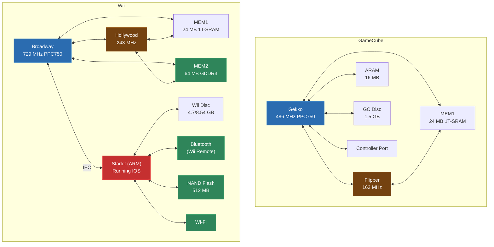
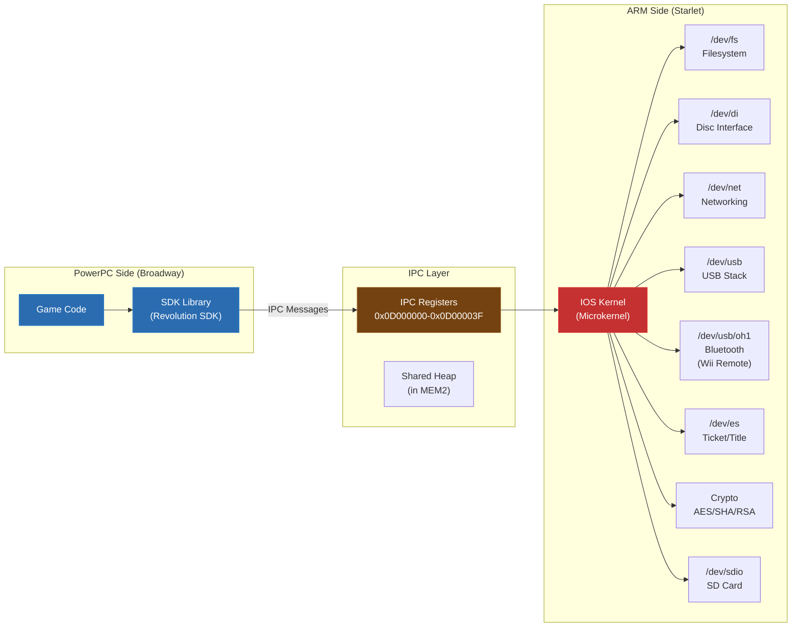
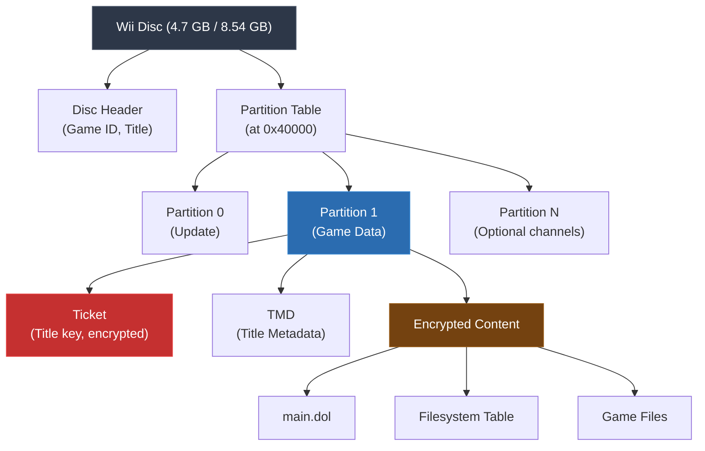
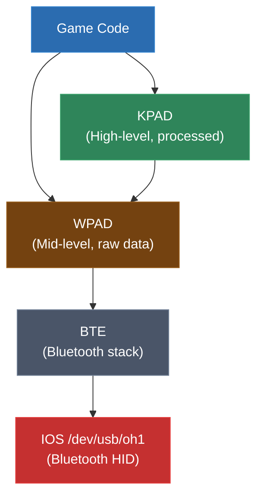
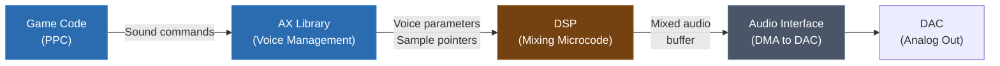
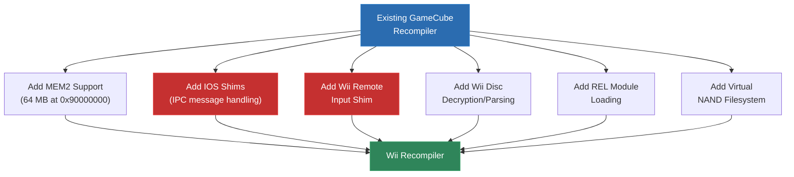

# Module 23: Wii / Broadway Recompilation

The Wii is, at its core, an overclocked GameCube with extra peripherals and a security layer. If you understood Module 22's GameCube/PowerPC recompilation, you already have 80% of what you need for the Wii. The CPU is the same architecture. The GPU is the same pipeline. The instruction set is identical.

What's different is everything around the edges: the IOS layer (an ARM-based security and I/O coprocessor), the Wii Remote (a Bluetooth HID device with motion sensing), the NAND filesystem, and the disc format. These differences are significant for recompilation because they introduce new system-level abstractions that the game code depends on, and those abstractions must be shimmed.

This module covers what changes when you extend a GameCube recompiler to handle Wii titles, how to shim the IOS layer, and how to deal with the Wii's unique input and storage hardware.

---

## 1. Wii vs. GameCube: What Changed

The Wii launched in 2006 as a deliberate evolution of the GameCube rather than a clean-sheet design. Nintendo chose backward compatibility and low cost over raw power. This was a business decision, but it has profound implications for recompilation: **if you can recompile GameCube code, you're 90% of the way to recompiling Wii code.**

### Hardware Comparison

| Component | GameCube | Wii |
|-----------|----------|-----|
| CPU | Gekko (PowerPC 750CXe) @ 486 MHz | Broadway (PowerPC 750CL) @ 729 MHz |
| GPU | Flipper @ 162 MHz | Hollywood @ 243 MHz |
| Main RAM | 24 MB 1T-SRAM (MEM1) | 24 MB 1T-SRAM (MEM1) + 64 MB GDDR3 (MEM2) |
| ARAM | 16 MB | (merged into MEM2) |
| Optical | 8 cm GameCube disc (1.5 GB) | 12 cm Wii disc (4.7/8.54 GB) |
| Storage | Memory cards (8 MB) | 512 MB NAND flash |
| I/O Processor | None (CPU handles everything) | Starlet (ARM926EJ-S) running IOS |
| Input | Controller port (wired) | Bluetooth (Wii Remote) + GC ports |
| Network | Broadband Adapter (optional) | Wi-Fi (802.11b/g) built-in |
| Video | Analog (480i/480p component) | Same + 480p via HDMI adapter |

### What's Actually the Same

For recompilation purposes, the similarities are more important than the differences:

- **Instruction set**: Broadway uses the same PowerPC 750 instruction set as Gekko -- same integer instructions, same floating-point instructions, same paired-single SIMD extensions. If your lifter handles Gekko, it handles Broadway with zero changes.

- **Graphics pipeline**: Hollywood's GPU (codenamed Vegas) is the same Flipper/TEV architecture with higher clocks. Same command processor, same vertex and pixel pipelines, same texture engine, same fixed-function TEV (Texture Environment) combiner stages. Your GX graphics shim works unchanged.

- **Memory map (MEM1)**: The first 24 MB of memory is laid out identically to the GameCube. Wii games that don't use MEM2 extensively have the same memory layout.

- **Boot process (for recomp purposes)**: Both platforms execute from a DOL binary format with the same structure. The game code starts at the same entry point.



The red-highlighted IOS processor and green-highlighted new hardware are what this module focuses on. The CPU and GPU recompilation are handled by your existing GameCube pipeline.

---

## 2. Broadway CPU

Broadway is a PowerPC 750CL clocked at 729 MHz -- exactly 1.5x the GameCube's Gekko clock speed. The "CL" variant is a lower-power revision of the same core design.

### Identical Instruction Set

Every instruction that works on Gekko works on Broadway. The paired-single extensions (ps_add, ps_mul, ps_madds0, etc.) that we covered in Module 22 are all present. The same quirks apply:

- **Paired singles**: Two 32-bit floats packed into one 64-bit FPR, used extensively for vertex math
- **Quantized load/store** (psq_l, psq_st): Hardware-accelerated dequantization for compressed vertex data
- **Cache control**: dcbi, dcbf, dcbst, icbi -- same cache management instructions
- **BAT registers**: Block Address Translation for memory-mapped I/O, same configuration

Your lifter doesn't need a single new instruction handler. If you've already built the GameCube PPC lifter from Module 22, it compiles Broadway code unchanged.

### What's Different at the CPU Level

The differences are minor and mostly invisible to recompilation:

1. **Clock speed**: 729 MHz vs 486 MHz. Irrelevant for recompilation -- we don't model cycle timing.

2. **L2 cache**: 256 KB on Broadway vs 256 KB on Gekko. Same size, slightly different timing. Irrelevant for recompilation.

3. **Bus clock**: 243 MHz vs 162 MHz. Affects memory bandwidth but not instruction behavior.

4. **Power management**: Broadway has additional power states. Games don't generally use these directly.

The one thing that matters is the **memory map**. Broadway can address both MEM1 (0x80000000-0x817FFFFF, 24 MB) and MEM2 (0x90000000-0x93FFFFFF, 64 MB). Your memory access shim needs to handle both regions:

```c
// Memory access for Wii (extends GameCube memory model)
uint32_t mem_read32(CPUContext* ctx, uint32_t addr) {
    // MEM1: same as GameCube
    if (addr >= 0x80000000 && addr < 0x81800000) {
        uint32_t phys = addr - 0x80000000;
        return *(uint32_t*)(mem1 + phys);
    }
    // MEM2: Wii-only
    if (addr >= 0x90000000 && addr < 0x94000000) {
        uint32_t phys = addr - 0x90000000;
        return *(uint32_t*)(mem2 + phys);
    }
    // Uncached mirror of MEM1
    if (addr >= 0xC0000000 && addr < 0xC1800000) {
        uint32_t phys = addr - 0xC0000000;
        return *(uint32_t*)(mem1 + phys);
    }
    // Uncached mirror of MEM2
    if (addr >= 0xD0000000 && addr < 0xD4000000) {
        uint32_t phys = addr - 0xD0000000;
        return *(uint32_t*)(mem2 + phys);
    }
    // Hardware registers
    if (addr >= 0xCC000000 && addr < 0xCD000000) {
        return hw_register_read(addr);
    }
    // IOS IPC registers
    if (addr >= 0x0D000000 && addr < 0x0D010000) {
        return ios_ipc_read(addr);
    }

    log_warning("Unmapped read: 0x%08X", addr);
    return 0;
}
```

### Paired Singles in Practice

Since the paired-single instruction set is identical between Gekko and Broadway, let's look at a real example of how Wii games use it (this applies to GameCube games too). Paired singles are the Wii's primary SIMD mechanism, and understanding them is essential for verifying your lifter output.

A common operation is transforming a 3D position by a 4x3 matrix (used for skeletal animation):

```asm
; Transform position (x, y, z) by 4x3 matrix
; f1 = {x, y}  (paired single)
; f2 = {z, 1}  (paired single)
; Matrix stored as three rows of 4 floats, loaded as paired singles:
; f4  = {m00, m01}    f5  = {m02, m03}
; f6  = {m10, m11}    f7  = {m12, m13}
; f8  = {m20, m21}    f9  = {m22, m23}

; Row 0: result_x = m00*x + m01*y + m02*z + m03*1
    ps_mul    f10, f4, f1          ; f10 = {m00*x, m01*y}
    ps_madd   f10, f5, f2, f10     ; f10 = {m00*x + m02*z, m01*y + m03*1}
    ps_sum0   f10, f10, f10, f10   ; f10.ps0 = f10.ps0 + f10.ps1 = result_x

; Row 1: result_y = m10*x + m11*y + m12*z + m13*1
    ps_mul    f11, f6, f1
    ps_madd   f11, f7, f2, f11
    ps_sum0   f11, f11, f11, f11

; Row 2: result_z = m20*x + m21*y + m22*z + m23*1
    ps_mul    f12, f8, f1
    ps_madd   f12, f9, f2, f12
    ps_sum0   f12, f12, f12, f12
```

The `ps_sum0` instruction is particularly important -- it sums both elements of a paired single, implementing the horizontal add needed for dot products. Your lifter needs to handle this correctly:

```c
// ps_sum0 fd, fa, fb, fc
// fd.ps0 = fa.ps0 + fb.ps1
// fd.ps1 = fc.ps1
void lift_ps_sum0(LiftContext* ctx, uint32_t instr) {
    int fd = (instr >> 21) & 0x1F;
    int fa = (instr >> 16) & 0x1F;
    int fb = (instr >> 11) & 0x1F;
    int fc = (instr >> 6) & 0x1F;

    emit(ctx, "{ float _tmp = ctx->fpr[%d].ps0 + ctx->fpr[%d].ps1;", fa, fb);
    emit(ctx, "  ctx->fpr[%d].ps1 = ctx->fpr[%d].ps1;", fd, fc);
    emit(ctx, "  ctx->fpr[%d].ps0 = _tmp; }", fd);
}
```

### Quantized Load/Store

The quantized load (psq_l) and store (psq_st) instructions are heavily used in Wii/GC games for vertex data. They perform hardware dequantization, converting compressed vertex data (int8, uint8, int16, uint16) to float:

```asm
; Load two int16 values, dequantize to float with scale factor
psq_l     f3, 0(r4), 0, GQR2    ; Load 2 values using GQR2 format
; GQR2 specifies: type=int16, scale=8 (divide by 256)
; Result: f3.ps0 = (float)mem16[r4+0] / 256.0
;         f3.ps1 = (float)mem16[r4+2] / 256.0
```

The GQR (Graphics Quantization Registers) control the data type and scale factor. There are 8 GQR registers, and games configure them during initialization:

```c
// GQR register format
typedef struct {
    uint8_t store_type;   // 0=float, 4=uint8, 5=int8, 6=uint16, 7=int16
    uint8_t store_scale;  // Scale factor (shift amount) for store
    uint8_t load_type;    // Same types as store
    uint8_t load_scale;   // Scale factor for load
} GQR;

void lift_psq_l(LiftContext* ctx, uint32_t instr) {
    int fd = (instr >> 21) & 0x1F;
    int ra = (instr >> 16) & 0x1F;
    int w = (instr >> 15) & 1;      // 0 = paired, 1 = single
    int gqr_idx = (instr >> 12) & 0x7;
    int16_t disp = instr & 0xFFF;
    if (disp & 0x800) disp |= 0xF000;  // Sign-extend

    emit(ctx, "psq_load(&ctx->fpr[%d], ctx->r[%d] + %d, %d, &ctx->gqr[%d]);",
         fd, ra, disp, w, gqr_idx);
}

// Runtime implementation
void psq_load(PairedSingle* dst, uint32_t addr, int single, GQR* gqr) {
    float scale = ldexpf(1.0f, -gqr->load_scale);

    switch (gqr->load_type) {
        case GQR_FLOAT:
            dst->ps0 = *(float*)(mem + addr);
            if (!single) dst->ps1 = *(float*)(mem + addr + 4);
            else dst->ps1 = 1.0f;
            break;
        case GQR_INT16:
            dst->ps0 = (float)(int16_t)bswap16(*(uint16_t*)(mem + addr)) * scale;
            if (!single) dst->ps1 = (float)(int16_t)bswap16(*(uint16_t*)(mem + addr + 2)) * scale;
            else dst->ps1 = 1.0f;
            break;
        case GQR_UINT8:
            dst->ps0 = (float)*(uint8_t*)(mem + addr) * scale;
            if (!single) dst->ps1 = (float)*(uint8_t*)(mem + addr + 1) * scale;
            else dst->ps1 = 1.0f;
            break;
        // ... other types ...
    }
}
```

### Compiler and ABI

Wii games use the same PowerPC EABI (Embedded Application Binary Interface) as GameCube games:
- r1 = stack pointer
- r2 = small data area pointer (SDA2)
- r3-r10 = argument registers (r3 also return value)
- r13 = small data area pointer (SDA)
- r14-r31 = callee-saved
- f1-f13 = FP argument registers
- f14-f31 = FP callee-saved
- LR = link register (return address)
- CTR = count register (loop counter, indirect calls)

The calling convention is identical. Your function boundary detection, argument analysis, and stack frame handling from the GameCube lifter apply directly.

---

## 3. The IOS Layer

Here's where the Wii diverges fundamentally from the GameCube. The Wii contains a second processor -- an ARM926EJ-S core codenamed **Starlet** -- that runs a microkernel operating system called **IOS** (Internal Operating System, also sometimes called "IOSU" for IOS-U). This processor controls all I/O hardware on the Wii.

### Why IOS Exists

Nintendo added IOS primarily for **security and DRM**. On the GameCube, the main CPU directly accessed the disc drive, memory cards, and controller ports. Any code running on the CPU had full hardware access, making the system easy to hack.

On the Wii, the game code (running on Broadway) cannot directly access:
- The disc drive
- The NAND filesystem
- The SD card slot
- The USB ports
- The Bluetooth radio (Wii Remote)
- The Wi-Fi module
- The crypto hardware (AES, SHA-1)

All of these are controlled exclusively by the ARM processor running IOS. The game must request I/O services from IOS via inter-processor communication (IPC).

### IOS Architecture



### IPC Protocol

IPC (Inter-Processor Communication) between Broadway and Starlet uses a simple message-passing protocol:

1. Broadway writes a message structure to MEM2 (shared memory)
2. Broadway writes the message address to the IPC register at 0x0D000000
3. Broadway triggers an interrupt to Starlet
4. Starlet reads the message, processes the I/O request
5. Starlet writes the result to the message structure
6. Starlet triggers an interrupt to Broadway
7. Broadway reads the result

The message structure looks like:

```c
typedef struct {
    uint32_t command;    // IOS_OPEN, IOS_CLOSE, IOS_READ, IOS_WRITE, IOS_IOCTL, IOS_IOCTLV
    int32_t  result;     // Filled in by IOS (return value / error code)
    int32_t  fd;         // File descriptor (from IOS_OPEN)
    union {
        struct {         // IOS_OPEN
            char* path;  // Device path (e.g., "/dev/di")
            uint32_t mode;
        } open;
        struct {         // IOS_READ
            void*    data;
            uint32_t length;
        } read;
        struct {         // IOS_WRITE
            void*    data;
            uint32_t length;
        } write;
        struct {         // IOS_IOCTL
            uint32_t ioctl;
            void*    input;
            uint32_t input_len;
            void*    output;
            uint32_t output_len;
        } ioctl;
        struct {         // IOS_IOCTLV
            uint32_t ioctl;
            uint32_t num_in;
            uint32_t num_out;
            IOVector* vectors;
        } ioctlv;
    };
} IPCMessage;
```

Games don't build these messages directly -- they use the Revolution SDK's library functions, which abstract the IPC mechanism. But the SDK functions end up calling into IPC, and your recompilation shim layer must handle them.

---

## 4. IOS Implications for Recompilation

The IOS layer is the single biggest difference between GameCube and Wii recompilation. You cannot ignore it -- if IPC calls aren't handled, the game cannot read its own disc, save data, or receive controller input.

### The Problem

The recompiled Wii game code will call SDK functions that eventually perform IPC to the ARM processor. We have three options:

1. **Emulate the ARM processor and IOS**: Run a full IOS emulation alongside the recompiled PPC code. This is what Dolphin does, and it's accurate but complex.

2. **Shim at the IPC level**: Intercept IPC messages before they reach the (non-existent) ARM processor and handle them directly on the host. This is the static recompilation approach.

3. **Shim at the SDK level**: Intercept the Revolution SDK library functions (higher level than IPC) and reimplement them using host OS APIs. This is the most practical approach for recompilation.

### SDK-Level Shimming

Most Wii games link statically against Nintendo's Revolution SDK. The SDK provides functions like:

```c
// Disc reading
DVDOpen(const char* filename, DVDFileInfo* fileinfo);
DVDReadAsyncPrio(DVDFileInfo* fileinfo, void* buffer, int length,
                 int offset, DVDCallback callback, int priority);

// Filesystem (NAND)
NANDOpen(const char* path, NANDFileInfo* info, uint8_t mode);
NANDRead(NANDFileInfo* info, void* buffer, uint32_t length);
NANDWrite(NANDFileInfo* info, const void* buffer, uint32_t length);

// Network
SOSocket(int domain, int type, int protocol);
SOConnect(int socket, const SOSockAddr* addr);
SOSend(int socket, const void* data, int len, int flags);
SORecv(int socket, void* data, int len, int flags);

// Wii Remote
WPADRead(int channel, WPADData* data);
WPADSetDataFormat(int channel, int format);
```

Since these functions are statically linked into the game binary, we can identify them (by symbol matching or signature scanning) and replace them with host implementations:

```c
// Shim for DVDOpen -- read from extracted disc image on host filesystem
int32_t DVDOpen_shim(CPUContext* ctx) {
    char* filename = (char*)(rdram + ctx->r.r3);
    DVDFileInfo* info = (DVDFileInfo*)(rdram + ctx->r.r4);

    // Map N64 filesystem path to host path
    char host_path[512];
    snprintf(host_path, sizeof(host_path), "%s/%s", disc_root, filename);

    // Open on host filesystem
    FILE* f = fopen(host_path, "rb");
    if (!f) {
        ctx->r.r3 = 0;  // Return FALSE
        return;
    }

    // Get file size
    fseek(f, 0, SEEK_END);
    info->length = ftell(f);
    fseek(f, 0, SEEK_SET);

    // Store host file handle in our tracking table
    int fd = register_open_file(f, filename);
    info->startAddr = fd;  // Repurpose this field to track our FD

    ctx->r.r3 = 1;  // Return TRUE
}

// Shim for DVDReadAsyncPrio -- synchronous read on host (async not needed)
void DVDReadAsyncPrio_shim(CPUContext* ctx) {
    DVDFileInfo* info = (DVDFileInfo*)(rdram + ctx->r.r3);
    void* buffer = (void*)(rdram + ctx->r.r4);
    int length = (int)ctx->r.r5;
    int offset = (int)ctx->r.r6;

    int fd = info->startAddr;
    FILE* f = get_open_file(fd);

    fseek(f, offset, SEEK_SET);
    int bytes_read = fread(buffer, 1, length, f);

    // Call the completion callback
    uint32_t callback_addr = ctx->r.r7;
    if (callback_addr) {
        // Set up callback arguments and call
        ctx->r.r3 = 0;  // result = success
        ctx->r.r4 = (uint32_t)info;
        call_function(ctx, callback_addr);
    }
}
```

### Identifying SDK Functions

The critical skill for SDK-level shimming is reliably identifying which functions in the stripped game binary correspond to which SDK functions. There are several techniques:

**Signature matching**: Revolution SDK functions have characteristic instruction patterns. For example, `DVDOpen` always starts by saving certain registers and calling an internal function to parse the FST. You can build a database of known function signatures:

```python
# Function signature database for Revolution SDK
SIGNATURES = {
    "DVDOpen": {
        "pattern": [
            0x9421FFE0,  # stwu r1, -0x20(r1)
            0x7C0802A6,  # mflr r0
            0x90010024,  # stw r0, 0x24(r1)
            0x93E1001C,  # stw r31, 0x1C(r1)
        ],
        "mask": [0xFFFFFFFF, 0xFFFFFFFF, 0xFFFFFFFF, 0xFFFFFFFF],
    },
    "OSReport": {
        "pattern": [
            0x9421FFD0,  # stwu r1, -0x30(r1)
            0x7C0802A6,  # mflr r0
            0xBFA10014,  # stmw r29, 0x14(r1)
        ],
        "mask": [0xFFFFFFFF, 0xFFFFFFFF, 0xFFFFFFFF],
    },
    # ... hundreds more ...
}

def scan_for_sdk_functions(binary_data, base_addr):
    matches = {}
    for name, sig in SIGNATURES.items():
        for offset in range(0, len(binary_data) - len(sig["pattern"]) * 4, 4):
            match = True
            for i, (pattern, mask) in enumerate(zip(sig["pattern"], sig["mask"])):
                word = struct.unpack(">I", binary_data[offset + i*4:offset + i*4 + 4])[0]
                if (word & mask) != pattern:
                    match = False
                    break
            if match:
                addr = base_addr + offset
                matches[name] = addr
                print(f"Found {name} at 0x{addr:08X}")
                break
    return matches
```

**String references**: SDK functions that produce error messages or log output contain string references that can identify them. `OSReport` calls reference format strings, `DVDOpen` error paths reference "DVD" or filename strings.

**Cross-reference analysis**: If you can identify one SDK function (say, `OSReport` from its format string handling), you can trace calls to and from it to identify other functions.

**Library order heuristic**: The linker typically places SDK functions in a predictable order within the binary. If you find one function from a particular SDK module, nearby functions are likely from the same module.

### Building a Shim Table

Once you've identified the SDK functions, build a table that maps their addresses to your host implementations:

```c
typedef struct {
    uint32_t game_address;    // Address of function in game binary
    void (*shim_function)(CPUContext*);  // Host implementation
    const char* name;         // For debugging
} ShimEntry;

ShimEntry shim_table[] = {
    { 0x80004A50, DVDOpen_shim,         "DVDOpen" },
    { 0x80004B20, DVDReadAsyncPrio_shim,"DVDReadAsyncPrio" },
    { 0x80004C00, DVDClose_shim,        "DVDClose" },
    { 0x80005100, NANDOpen_shim,        "NANDOpen" },
    { 0x80005200, NANDRead_shim,        "NANDRead" },
    { 0x80005300, NANDWrite_shim,       "NANDWrite" },
    { 0x80005400, NANDClose_shim,       "NANDClose" },
    { 0x80006000, WPADRead_shim,        "WPADRead" },
    { 0x80006100, WPADSetDataFormat_shim, "WPADSetDataFormat" },
    { 0x80007000, GXSetVtxDesc_shim,    "GXSetVtxDesc" },
    // ... many more ...
    { 0, NULL, NULL }
};

// During recompilation: for each function call, check if it's a shim target
void emit_function_call(LiftContext* ctx, uint32_t target_addr) {
    ShimEntry* shim = find_shim(target_addr);
    if (shim) {
        emit(ctx, "%s_shim(ctx);  // %s", shim->name, shim->name);
    } else {
        emit(ctx, "func_%08X(ctx);", target_addr);
    }
}
```

### Async I/O Handling

One tricky aspect of Wii SDK shimming is that many I/O functions are asynchronous. `DVDReadAsyncPrio`, for instance, starts a disc read and returns immediately, calling a callback when the read completes. In recompilation, we have two choices:

1. **Make everything synchronous**: Complete the I/O immediately and call the callback before returning. This is simpler but may break games that depend on the asynchronous behavior (e.g., games that do other work while waiting for disc reads).

2. **Emulate async behavior**: Start the I/O on a background thread and trigger the callback on the next frame. This is more accurate but requires managing callback queues.

Most recompilation projects start with synchronous shimming and only add true async behavior if a specific game requires it:

```c
void DVDReadAsyncPrio_shim(CPUContext* ctx) {
    DVDFileInfo* info = (DVDFileInfo*)(rdram + ctx->r.r3);
    void* buffer = (void*)(rdram + ctx->r.r4);
    int length = (int)ctx->r.r5;
    int offset = (int)ctx->r.r6;
    uint32_t callback_addr = ctx->r.r7;
    int priority = (int)ctx->r.r8;

    // Perform read synchronously
    int fd = info->startAddr;
    FILE* f = get_open_file(fd);
    fseek(f, offset, SEEK_SET);
    int bytes_read = fread(buffer, 1, length, f);

    // Call completion callback immediately
    if (callback_addr) {
        // Callback signature: void (*)(int32_t result, DVDFileInfo* info)
        CPUContext callback_ctx = *ctx;
        callback_ctx.r.r3 = bytes_read;  // result
        callback_ctx.r.r4 = ctx->r.r3;   // info pointer
        call_recompiled_function(&callback_ctx, callback_addr);
    }

    ctx->r.r3 = 1;  // Return TRUE (request accepted)
}
```

### IPC-Level Shimming

For games or SDK versions where SDK-level shimming isn't feasible (perhaps because you can't identify the SDK functions), you can shim at the IPC level instead. This is lower-level but more universal:

```c
void handle_ipc_message(IPCMessage* msg) {
    switch (msg->command) {
        case IOS_OPEN: {
            char* path = (char*)(rdram + (uint32_t)msg->open.path);

            if (strcmp(path, "/dev/di") == 0) {
                msg->fd = VIRTUAL_FD_DISC;
                msg->result = 0;  // Success
            } else if (strcmp(path, "/dev/fs") == 0) {
                msg->fd = VIRTUAL_FD_FS;
                msg->result = 0;
            } else if (strncmp(path, "/dev/usb/oh1", 12) == 0) {
                msg->fd = VIRTUAL_FD_BLUETOOTH;
                msg->result = 0;
            } else if (strcmp(path, "/dev/sdio/slot0") == 0) {
                msg->fd = VIRTUAL_FD_SDCARD;
                msg->result = 0;
            } else {
                log_warning("IOS_OPEN: unknown device %s", path);
                msg->result = -6;  // IOS_ENOENT
            }
            break;
        }

        case IOS_IOCTL: {
            switch (msg->fd) {
                case VIRTUAL_FD_DISC:
                    handle_disc_ioctl(msg);
                    break;
                case VIRTUAL_FD_FS:
                    handle_fs_ioctl(msg);
                    break;
                default:
                    log_warning("IOCTL on unknown FD %d", msg->fd);
                    msg->result = -4;  // IOS_EINVAL
            }
            break;
        }

        case IOS_READ:
            handle_ios_read(msg);
            break;

        case IOS_WRITE:
            handle_ios_write(msg);
            break;

        case IOS_CLOSE:
            msg->result = 0;
            break;
    }
}
```

The disc interface (/dev/di) handles IOCTLs for reading disc sectors:

```c
void handle_disc_ioctl(IPCMessage* msg) {
    switch (msg->ioctl.ioctl) {
        case DVD_IOCTL_READ: {
            // Read disc sectors
            uint32_t offset = *(uint32_t*)(rdram + (uint32_t)msg->ioctl.input);
            uint32_t length = *(uint32_t*)(rdram + (uint32_t)msg->ioctl.input + 4);
            void* output = (void*)(rdram + (uint32_t)msg->ioctl.output);

            // Read from host disc image
            disc_read(offset, length, output);
            msg->result = 0;
            break;
        }

        case DVD_IOCTL_GET_STATUS:
            // Report disc as inserted and ready
            *(uint32_t*)(rdram + (uint32_t)msg->ioctl.output) = 0;  // Ready
            msg->result = 0;
            break;

        // ... more IOCTLs ...
    }
}
```

---

## 5. Wii Disc Format

GameCube discs are relatively simple: a header, an apploader, the DOL executable, and the filesystem (FST). Wii discs are more complex due to encryption and partitioning.

### Wii Disc Structure



### Encryption

Each partition on a Wii disc is encrypted with AES-128-CBC. The title key (used for decryption) is stored in the partition's ticket, itself encrypted with a common key burned into the Wii's OTP (One-Time Programmable) memory.

For recompilation, you need the decrypted disc content. This means either:
- Using a tool like `wit` (Wiimms ISO Tools) or `wbfs_file` to decrypt and extract the disc
- Working from an already-extracted filesystem dump
- Implementing disc decryption in your extraction pipeline

```python
# Python snippet for Wii disc partition extraction (simplified)
import struct
from Crypto.Cipher import AES

def read_wii_partition(disc_file, partition_offset, title_key):
    """Read and decrypt a Wii disc partition."""
    disc_file.seek(partition_offset)

    # Read partition header
    ticket_data = disc_file.read(0x2A4)
    tmd_size = struct.unpack('>I', disc_file.read(4))[0]
    tmd_offset = struct.unpack('>I', disc_file.read(4))[0] << 2

    # Data offset within partition
    data_offset_raw = struct.unpack('>I', disc_file.read(4))[0]
    data_offset = data_offset_raw << 2

    # Decrypt title key from ticket
    encrypted_key = ticket_data[0x1BF:0x1CF]
    iv = ticket_data[0x1DC:0x1E4] + b'\x00' * 8
    cipher = AES.new(COMMON_KEY, AES.MODE_CBC, iv)
    decrypted_title_key = cipher.decrypt(encrypted_key)

    return decrypted_title_key, partition_offset + data_offset

def read_decrypted_block(disc_file, partition_data_offset,
                         block_index, title_key):
    """Read and decrypt a single 0x8000-byte block."""
    block_offset = partition_data_offset + block_index * 0x8000
    disc_file.seek(block_offset)
    raw_block = disc_file.read(0x8000)

    # First 0x400 bytes are the block header (hashes)
    # Remaining 0x7C00 bytes are encrypted data
    header = raw_block[:0x400]
    encrypted_data = raw_block[0x400:]

    # IV for data is bytes 0x3D0-0x3DF of the header
    iv = header[0x3D0:0x3E0]
    cipher = AES.new(title_key, AES.MODE_CBC, iv)
    decrypted_data = cipher.decrypt(encrypted_data)

    return decrypted_data
```

### WBFS Format

Many Wii disc images are stored in WBFS (Wii Backup File System) format, which only stores the used blocks from the disc, significantly reducing file size. Your extraction pipeline needs to handle this:

```python
def read_wbfs(wbfs_path):
    """Parse a WBFS file and extract the disc image."""
    with open(wbfs_path, 'rb') as f:
        # WBFS header
        magic = f.read(4)  # b'WBFS'
        assert magic == b'WBFS'

        num_sectors = struct.unpack('>I', f.read(4))[0]
        hd_sector_size_shift = struct.unpack('B', f.read(1))[0]
        wbfs_sector_size_shift = struct.unpack('B', f.read(1))[0]

        hd_sector_size = 1 << hd_sector_size_shift
        wbfs_sector_size = 1 << wbfs_sector_size_shift

        # WII disc header starts at offset 0x200
        f.seek(0x200)
        disc_header = f.read(0x100)
        game_id = disc_header[:6].decode('ascii')

        # WBFS block map follows
        # ... map WBFS sectors to disc sectors
```

### DOL Extraction

Once you have the decrypted partition, the game's main executable is a DOL file -- the same format as GameCube. Your existing DOL parser from Module 22 works unchanged:

```c
typedef struct {
    uint32_t text_offsets[7];     // File offsets for text sections
    uint32_t data_offsets[11];    // File offsets for data sections
    uint32_t text_addresses[7];  // Load addresses for text sections
    uint32_t data_addresses[11]; // Load addresses for data sections
    uint32_t text_sizes[7];      // Sizes of text sections
    uint32_t data_sizes[11];     // Sizes of data sections
    uint32_t bss_address;        // BSS start address
    uint32_t bss_size;           // BSS size
    uint32_t entry_point;        // Entry point address
    uint32_t padding[7];
} DOLHeader;
// Total: 0x100 bytes, same as GameCube
```

---

## 6. ELF and DOL Formats on Wii

Retail Wii games use DOL format, identical to GameCube. But the Wii ecosystem includes two other executable formats worth knowing about.

### REL (Relocatable Module)

Many Wii games use REL files for dynamically loaded code modules. REL is a simplified ELF-like format with relocation information:

```c
typedef struct {
    uint32_t id;            // Module ID
    uint32_t next;          // Linked list pointer (runtime)
    uint32_t prev;          // Linked list pointer (runtime)
    uint32_t num_sections;  // Number of sections
    uint32_t section_offset;// File offset to section table
    uint32_t name_offset;   // Module name (optional)
    uint32_t name_size;
    uint32_t version;       // REL format version
    uint32_t bss_size;
    uint32_t rel_offset;    // Relocation data offset
    uint32_t imp_offset;    // Import table offset
    uint32_t imp_size;
    uint8_t  prolog_section;// Section containing _prolog
    uint8_t  epilog_section;
    uint8_t  unresolved_section;
    uint8_t  bss_section;
    uint32_t prolog;        // _prolog function offset
    uint32_t epilog;        // _epilog function offset
    uint32_t unresolved;    // _unresolved function offset
    // ... more fields in v2/v3 ...
} RELHeader;
```

REL files are important for recompilation because they contain code that the main DOL loads at runtime. You must:
1. Extract all REL files from the disc
2. Parse their section tables and relocations
3. Apply relocations to determine final addresses
4. Include their code in your recompilation alongside the main DOL

```c
// Loading a REL module (conceptual, in the recomp pipeline)
void load_rel_module(const char* rel_path, uint32_t base_address) {
    RELHeader header;
    FILE* f = fopen(rel_path, "rb");
    fread(&header, sizeof(RELHeader), 1, f);

    // Load each section
    for (int i = 0; i < header.num_sections; i++) {
        RELSection section;
        fseek(f, header.section_offset + i * sizeof(RELSection), SEEK_SET);
        fread(&section, sizeof(RELSection), 1, f);

        if (section.size > 0 && section.offset > 0) {
            // Allocate at base_address + section.address
            uint32_t load_addr = base_address + section.address;
            fseek(f, section.offset, SEEK_SET);
            fread(virtual_memory + load_addr, 1, section.size, f);

            // Register this code region for recompilation
            register_code_region(load_addr, section.size);
        }
    }

    // Process relocations
    apply_rel_relocations(f, &header, base_address);

    fclose(f);
}
```

### ELF for Homebrew

Wii homebrew applications use standard ELF format, which you can parse with any standard ELF library. This is relevant if you're recompiling homebrew rather than retail titles. The Wii homebrew toolchain (devkitPPC) produces standard PowerPC ELF binaries.

### RSO (Relocatable Shared Object)

Some games use RSO format, which is similar to REL but with symbol name tables. RSOs are easier to work with for recompilation because they preserve function names:

```c
// RSO files have a string table with symbol names
// This is incredibly useful for recompilation -- we get real function names!
void parse_rso_symbols(const char* rso_path) {
    // ... parse RSO header ...

    // Symbol table
    for (int i = 0; i < num_symbols; i++) {
        RSOSymbol* sym = &symbol_table[i];
        const char* name = string_table + sym->name_offset;
        uint32_t address = sym->section_offset + section_base;

        printf("Found symbol: %s at 0x%08X\n", name, address);
        register_symbol(name, address);
    }
}
```

---

## 7. Wii-Specific Hardware

### Wii Remote (Wiimote)

The Wii Remote is a Bluetooth HID device that communicates with the Wii through the Bluetooth stack in IOS. From the game's perspective, it's accessed through the WPAD (Wii Pad) library:

```c
// Game code using WPAD
void update_input(void) {
    WPADData data;
    WPADRead(0, &data);  // Read controller 0

    // Button states
    if (data.btns_h & WPAD_BUTTON_A) {
        player_jump();
    }

    // Accelerometer data
    float accel_x = data.accel.x / 512.0f;
    float accel_y = data.accel.y / 512.0f;
    float accel_z = data.accel.z / 512.0f;

    // IR pointer (from sensor bar)
    if (data.ir.valid) {
        cursor_x = data.ir.dot[0].x;
        cursor_y = data.ir.dot[0].y;
    }

    // Extension controller (Nunchuk, Classic Controller)
    if (data.exp.type == WPAD_EXP_NUNCHUK) {
        float stick_x = data.exp.nunchuk.js.pos.x;
        float stick_y = data.exp.nunchuk.js.pos.y;
        move_player(stick_x, stick_y);
    }
}
```

The Wii Remote provides:
- **12 buttons**: A, B, 1, 2, +, -, Home, D-pad (4 directions)
- **3-axis accelerometer**: Tilt and shake detection
- **IR camera**: Tracks up to 4 IR dots from the sensor bar for pointer input
- **Speaker**: Small speaker for sound effects
- **Rumble**: Vibration motor
- **Extension port**: Nunchuk (stick + accelerometer + 2 buttons), Classic Controller (dual sticks + full button set), and others

### Shimming Wii Remote Input

For recompilation, you need to map the Wii Remote's input to something available on the host platform. The most common approach:

```c
typedef struct {
    // Map Wiimote inputs to keyboard/mouse/gamepad
    struct {
        int key;        // SDL_SCANCODE_*
        int gamepad;    // SDL_CONTROLLER_BUTTON_*
    } button_map[12];

    // IR pointer source
    enum { IR_MOUSE, IR_GYRO, IR_STICK } ir_mode;

    // Accelerometer source
    enum { ACCEL_GYRO, ACCEL_STICK, ACCEL_NONE } accel_mode;

    // Motion controls
    bool use_gyro_for_motion;
} WiimoteMapping;

void WPADRead_shim(CPUContext* ctx) {
    int channel = ctx->r.r3;
    WPADData* data = (WPADData*)(rdram + ctx->r.r4);

    memset(data, 0, sizeof(WPADData));
    data->err = WPAD_ERR_NONE;
    data->data_present = WPAD_DATA_BUTTONS | WPAD_DATA_ACCEL | WPAD_DATA_IR;

    // Read from host input system
    HostInputState host;
    poll_host_input(&host, channel);

    // Map buttons
    for (int i = 0; i < 12; i++) {
        if (host.key_state[mapping.button_map[i].key] ||
            host.gamepad_button[mapping.button_map[i].gamepad]) {
            data->btns_h |= (1 << i);
        }
    }

    // Map IR pointer
    switch (mapping.ir_mode) {
        case IR_MOUSE:
            data->ir.valid = 1;
            data->ir.dot[0].x = (host.mouse_x / (float)window_width) * 1024;
            data->ir.dot[0].y = (host.mouse_y / (float)window_height) * 768;
            break;
        case IR_STICK:
            data->ir.valid = 1;
            data->ir.dot[0].x = 512 + host.right_stick_x * 400;
            data->ir.dot[0].y = 384 + host.right_stick_y * 300;
            break;
        case IR_GYRO:
            // Use gamepad gyro for pointer
            data->ir.valid = 1;
            update_gyro_pointer(&data->ir.dot[0], &host);
            break;
    }

    // Map accelerometer
    if (mapping.accel_mode == ACCEL_GYRO && host.has_gyro) {
        data->accel.x = host.gyro_x;
        data->accel.y = host.gyro_y;
        data->accel.z = host.gyro_z;
    } else {
        // Default: report at rest (gravity on Y axis)
        data->accel.x = 512;
        data->accel.y = 512;
        data->accel.z = 616;  // ~1g
    }
}
```

### Motion Controls: The Hard Problem

Shimming button presses is easy. Shimming motion controls is genuinely hard. Games use the accelerometer and gyroscope for:

- **Pointer aiming**: Needs accurate cursor tracking (mouse works well)
- **Shake detection**: Sword swings in Zelda, etc. (can map to button press)
- **Tilt controls**: Mario Kart Wii steering (map to stick)
- **Complex gestures**: Wii Sports bowling/tennis (very difficult to map)
- **IR pointer**: Needs the cursor position, not just a direction

Games that rely heavily on motion controls (Wii Sports, Skyward Sword) are significantly harder to recompile for a traditional controller setup. Some approaches:

1. **Mouse for pointer**: The mouse naturally replaces the IR pointer. This works well for shooters and point-and-click games.

2. **Gyro controller**: Modern controllers (DualSense, Switch Pro) have gyroscopes. Map Wiimote gyro to controller gyro for motion-heavy games.

3. **Gesture recognition**: For shake-to-swing games, detect a button press + stick flick and synthesize accelerometer data that matches the expected gesture.

4. **Game-specific patches**: Some motion control schemes are so unique that the recompiled game needs per-game control patches. This is one area where the modifiability of recompiled code really shines -- you can patch the game's input handling at the C level.

### NAND Filesystem

The Wii's 512 MB NAND flash stores:
- System titles (IOS versions, system menu)
- Channel data (WiiWare, Virtual Console)
- Save data (per-game saves in `/title/00010000/<game-id>/data/`)
- Shared content and settings

For recompilation, you need to provide a virtual NAND that the game's save system can read from and write to:

```c
// Virtual NAND implementation
#define NAND_ROOT "wii_nand/"

int NAND_shim_open(const char* path, int mode) {
    char host_path[512];
    snprintf(host_path, sizeof(host_path), "%s%s", NAND_ROOT, path);

    // Create directories if needed
    ensure_parent_dirs(host_path);

    const char* fmode;
    if (mode & NAND_MODE_WRITE) {
        if (mode & NAND_MODE_READ)
            fmode = "r+b";
        else
            fmode = "wb";
    } else {
        fmode = "rb";
    }

    FILE* f = fopen(host_path, fmode);
    if (!f && (mode & NAND_MODE_WRITE)) {
        // File doesn't exist, create it
        f = fopen(host_path, "w+b");
    }

    if (!f) return -1;
    return register_nand_file(f);
}
```

### SD Card Access

Some Wii games read from or write to the SD card slot. The SD card interface goes through IOS's `/dev/sdio/slot0` device. For recompilation, map this to a host directory:

```c
void handle_sdio_ioctl(IPCMessage* msg) {
    switch (msg->ioctl.ioctl) {
        case SDIO_READ_SECTOR: {
            uint32_t sector = *(uint32_t*)(rdram + (uint32_t)msg->ioctl.input);
            void* buffer = (void*)(rdram + (uint32_t)msg->ioctl.output);

            // Read from host SD card image file
            fseek(sd_image, sector * 512, SEEK_SET);
            fread(buffer, 1, 512, sd_image);
            msg->result = 0;
            break;
        }
    }
}
```

---

## 8. Graphics on Wii

The Wii's GPU (Hollywood/Vegas) is the same TEV-based fixed-function pipeline as the GameCube's Flipper. If you've implemented GX graphics shimming for GameCube recompilation in Module 22, it works for Wii with minimal changes.

### What's the Same

- **GX API**: The same Graphics Extension library. Same function signatures, same state machine, same texture formats.
- **TEV stages**: Same 16-stage Texture Environment combiner pipeline.
- **Vertex format**: Same vertex descriptors, same attribute types.
- **Texture formats**: Same CMPR (S3TC-like), I4, I8, IA4, IA8, RGB565, RGB5A3, RGBA8, CI4, CI8, CI14x2.
- **Embedded Framebuffer (EFB)**: Same concept, same copy-to-texture operations.

### What's Different

1. **Resolution**: The Wii can output 480p (720x480) via component/HDMI, while the GameCube is limited to 640x480 in progressive mode. Some games render at wider internal resolutions.

2. **Memory**: MEM2's 64 MB gives games much more room for textures and frame buffers. GameCube games were constrained to 24 MB + 16 MB ARAM.

3. **XFB (External Framebuffer)**: The Wii handles the XFB slightly differently for VI output, but the GX commands are the same.

4. **Widescreen flag**: The Wii has a system-level widescreen setting. Games query this via `VIGetDTVStatus()` or `SCGetAspectRatio()` and adjust their projection matrices accordingly. Your shim should expose this setting.

### GX Shim Structure (Recap from Module 22)

The GX shim translates Nintendo's proprietary graphics API to modern GPU commands:

```c
// GX state tracking (same for GC and Wii)
typedef struct {
    // Vertex format
    GXVtxDesc vtx_desc[GX_MAX_VTXATTR];
    GXVtxAttrFmt vtx_fmt[GX_MAX_VTXFMT][GX_MAX_VTXATTR];

    // TEV stages
    struct {
        uint8_t color_in[4];
        uint8_t alpha_in[4];
        uint8_t color_op;
        uint8_t alpha_op;
        uint8_t tex_coord;
        uint8_t tex_map;
        uint8_t ras_color;
    } tev_stages[16];
    int num_tev_stages;

    // Textures
    GXTexObj textures[8];

    // Transform matrices
    float projection[4][4];
    float position_matrices[10][3][4];  // 3x4 matrices
    float normal_matrices[10][3][3];
    float tex_matrices[10][3][4];

    // Render state
    uint8_t cull_mode;
    uint8_t blend_mode;
    uint8_t z_mode;
    uint8_t alpha_compare;

    // Current primitive
    GXPrimitive current_primitive;
    int vertex_count;
} GXState;
```

### TEV Stage Translation

The TEV (Texture Environment) pipeline is the core of GX rendering. It's a fixed-function pipeline with up to 16 programmable stages, each computing:

```
output = D + ((1 - C) * A + C * B)     (linear interpolation mode)
   OR
output = D + ((A - B) * C)              (subtract mode)
```

Where A, B, C, D are selected from a set of inputs (texture colors, vertex colors, rasterized colors, constants, previous stage output, etc.).

Each TEV stage also has a separate alpha computation with its own formula and input selectors.

Translating TEV to modern GPU shaders is one of the most important parts of GX shimming. You need to generate a fragment shader for each unique TEV configuration the game uses:

```c
char* generate_tev_shader(GXState* state) {
    StringBuilder sb;
    sb_init(&sb);

    // Shader header
    sb_append(&sb, "#version 450\n");
    sb_append(&sb, "layout(location=0) in vec4 v_color0;\n");
    sb_append(&sb, "layout(location=1) in vec4 v_color1;\n");
    sb_append(&sb, "layout(location=2) in vec2 v_texcoord0;\n");
    sb_append(&sb, "layout(location=3) in vec2 v_texcoord1;\n");
    sb_append(&sb, "layout(location=0) out vec4 frag_color;\n");
    sb_append(&sb, "uniform sampler2D tex0, tex1, tex2, tex3;\n");
    sb_append(&sb, "uniform vec4 konst[4];\n");  // Constant colors
    sb_append(&sb, "uniform vec4 tev_color[4];\n");  // Color registers

    sb_append(&sb, "void main() {\n");
    sb_append(&sb, "    vec4 prev = vec4(0.0);\n");
    sb_append(&sb, "    vec4 texColor;\n");

    for (int i = 0; i < state->num_tev_stages; i++) {
        TEVStage* stage = &state->tev_stages[i];

        // Texture sample for this stage
        if (stage->tex_map < 4) {
            sb_appendf(&sb, "    texColor = texture(tex%d, v_texcoord%d);\n",
                       stage->tex_map, stage->tex_coord);
        }

        // Color computation
        const char* a = tev_color_input(stage->color_in[0], i);
        const char* b = tev_color_input(stage->color_in[1], i);
        const char* c = tev_color_input(stage->color_in[2], i);
        const char* d = tev_color_input(stage->color_in[3], i);

        // Formula: D + ((1-C)*A + C*B)  [for OP_ADD]
        sb_appendf(&sb, "    prev.rgb = %s.rgb + mix(%s.rgb, %s.rgb, %s.rgb);\n",
                   d, a, b, c);

        // Alpha computation (separate inputs)
        const char* aa = tev_alpha_input(stage->alpha_in[0], i);
        const char* ab = tev_alpha_input(stage->alpha_in[1], i);
        const char* ac = tev_alpha_input(stage->alpha_in[2], i);
        const char* ad = tev_alpha_input(stage->alpha_in[3], i);

        sb_appendf(&sb, "    prev.a = %s.a + mix(%s.a, %s.a, %s.a);\n",
                   ad, aa, ab, ac);

        // Clamp
        sb_append(&sb, "    prev = clamp(prev, 0.0, 1.0);\n");
    }

    sb_append(&sb, "    frag_color = prev;\n");
    sb_append(&sb, "}\n");

    return sb_finish(&sb);
}
```

The TEV shader generation is a solved problem -- Dolphin's source code has a comprehensive implementation that handles every TEV configuration. For your recompilation project, you can study Dolphin's `PixelShaderGen.cpp` as a reference.

### GX Command Processor

The GX library sends commands to the GPU through a command processor FIFO. Games write graphics commands (vertex data, state changes, draw commands) to a buffer, and the GPU reads from it asynchronously. In recompilation, you intercept these commands either at the GX API level (preferred) or at the FIFO level.

At the API level, each GX function call becomes a shim:

```c
void GXBegin_shim(CPUContext* ctx) {
    GXPrimitive type = (GXPrimitive)ctx->r.r3;
    int vtx_fmt = ctx->r.r4;
    int num_vertices = ctx->r.r5;

    gx_state.current_primitive = type;
    gx_state.current_vtx_fmt = vtx_fmt;
    gx_state.expected_vertices = num_vertices;
    gx_state.vertex_count = 0;

    // Prepare GPU vertex buffer
    begin_vertex_batch(type, num_vertices);
}

// GXPosition3f32, GXColor1u32, GXTexCoord2f32, etc.
// Each writes vertex attributes to the command FIFO
void GXPosition3f32_shim(CPUContext* ctx) {
    float x = ctx->fpr[1].ps0;  // f1
    float y = ctx->fpr[2].ps0;  // f2
    float z = ctx->fpr[3].ps0;  // f3

    current_vertex.position[0] = x;
    current_vertex.position[1] = y;
    current_vertex.position[2] = z;
    current_vertex.attr_mask |= VTX_POS;
}

void GXColor1u32_shim(CPUContext* ctx) {
    uint32_t rgba = ctx->r.r3;
    current_vertex.color[0] = ((rgba >> 24) & 0xFF) / 255.0f;
    current_vertex.color[1] = ((rgba >> 16) & 0xFF) / 255.0f;
    current_vertex.color[2] = ((rgba >> 8) & 0xFF) / 255.0f;
    current_vertex.color[3] = (rgba & 0xFF) / 255.0f;
    current_vertex.attr_mask |= VTX_CLR0;
}

void GXEnd_shim(CPUContext* ctx) {
    // Flush accumulated vertices to GPU
    flush_vertex_batch(&gx_state);
}
```

### EFB (Embedded Framebuffer) Operations

The GX GPU has an internal "Embedded Framebuffer" (EFB) that games use for render-to-texture effects:

```c
// Copy the EFB to a texture (used for reflections, motion blur, etc.)
void GXCopyTex_shim(CPUContext* ctx) {
    uint32_t dest_addr = ctx->r.r3;
    uint8_t mip_clear = ctx->r.r4;

    // On real hardware, this copies the EFB to a texture in main memory
    // In recompilation, we copy the current render target to a GPU texture
    // and register it at the given address for later use
    GPUTexture* tex = copy_render_target_to_texture(current_render_target);
    register_efb_copy(dest_addr, tex);
}

// Clear the EFB
void GXSetCopyClear_shim(CPUContext* ctx) {
    // Read the clear color from r3 (GXColor struct pointer)
    GXColor* color = (GXColor*)(rdram + ctx->r.r3);
    uint32_t clear_z = ctx->r.r4;

    gpu_set_clear_color(color->r / 255.0f, color->g / 255.0f,
                        color->b / 255.0f, color->a / 255.0f);
    gpu_set_clear_depth((float)clear_z / (float)0x00FFFFFF);
}
```

For the Wii, you add MEM2 as a valid source for texture and vertex data:

```c
void* resolve_gx_address(uint32_t addr) {
    if (addr >= 0x80000000 && addr < 0x81800000) {
        return mem1 + (addr - 0x80000000);
    }
    if (addr >= 0x90000000 && addr < 0x94000000) {
        return mem2 + (addr - 0x90000000);
    }
    // Uncached mirrors
    if (addr >= 0xC0000000 && addr < 0xC1800000) {
        return mem1 + (addr - 0xC0000000);
    }
    if (addr >= 0xD0000000 && addr < 0xD4000000) {
        return mem2 + (addr - 0xD0000000);
    }
    log_error("Invalid GX address: 0x%08X", addr);
    return NULL;
}
```

### Wii-Specific GX Features

While the core GX pipeline is identical, the Wii's larger memory enables some features that GameCube games couldn't use:

**Larger textures**: With 64 MB of MEM2, Wii games can use significantly larger textures. Some games load textures at sizes that would be impossible in the GameCube's 24 MB of main RAM.

**More vertex buffers**: Wii games often keep larger vertex arrays resident in MEM2, reducing the need for dynamic buffer management.

**Higher polygon counts**: The combination of faster GPU clock and more memory means Wii games tend to have more complex geometry. This doesn't change the GX API, but it means your GPU shim needs to handle larger batches efficiently.

### Wii-Specific Display Modes

The Wii supports more display modes than the GameCube:

```c
// Wii video modes
typedef enum {
    VI_NTSC_INTERLACED,   // 640x480i (standard NTSC)
    VI_NTSC_PROGRESSIVE,  // 640x480p (component/HDMI)
    VI_PAL_INTERLACED,    // 640x576i (standard PAL)
    VI_PAL_PROGRESSIVE,   // 640x576p (component/HDMI)
    VI_MPAL_INTERLACED,   // 640x480i (Brazilian PAL)
    VI_EURGB60_INTERLACED,// 640x480i (European 60Hz)
} VIMode;

// Shim for VIGetTvFormat
uint32_t VIGetTvFormat_shim(void) {
    // Return format based on user preference
    if (user_wants_progressive)
        return VI_NTSC_PROGRESSIVE;
    else
        return VI_NTSC_INTERLACED;
}
```

For recompilation, you typically always use progressive mode regardless of what the game requests, since modern displays don't benefit from interlacing.

---

## 8.5. Thread and OS Shimming

Wii games use the Revolution SDK's operating system layer for threading, memory management, and synchronization. These functions need shimming for the recompiled game to work correctly.

### OS Threading

The Revolution SDK provides a cooperative threading model similar to the GameCube's libogc threads:

```c
// Key threading functions that need shimming
OSCreateThread(OSThread* thread, void* (*entry)(void*), void* arg,
               void* stack, uint32_t stack_size, int priority, uint16_t flags);
OSResumeThread(OSThread* thread);
OSSuspendThread(OSThread* thread);
OSJoinThread(OSThread* thread, void** result);
OSSleepThread(OSThreadQueue* queue);
OSWakeupThread(OSThreadQueue* queue);
OSYieldThread(void);
```

For recompilation, you can map these to host OS threads:

```c
void OSCreateThread_shim(CPUContext* ctx) {
    OSThread* wii_thread = (OSThread*)(rdram + ctx->r.r3);
    uint32_t entry_addr = ctx->r.r4;
    uint32_t arg = ctx->r.r5;
    uint32_t stack = ctx->r.r6;
    uint32_t stack_size = ctx->r.r7;
    int priority = ctx->r.r8;

    // Create a host thread that runs the recompiled function
    HostThread* ht = create_host_thread();
    ht->entry_addr = entry_addr;
    ht->arg = arg;
    ht->wii_thread = wii_thread;
    ht->priority = priority;

    // Store host thread reference in Wii thread structure
    wii_thread->host_thread = (uint32_t)ht;
    wii_thread->state = THREAD_READY;

    ctx->r.r3 = 1;  // Success
}

void OSResumeThread_shim(CPUContext* ctx) {
    OSThread* wii_thread = (OSThread*)(rdram + ctx->r.r3);
    HostThread* ht = (HostThread*)(uintptr_t)wii_thread->host_thread;

    if (wii_thread->state == THREAD_READY) {
        wii_thread->state = THREAD_RUNNING;

        // Start the host thread
        // The thread function creates its own CPUContext and calls
        // the recompiled entry point
        start_host_thread(ht);
    } else if (wii_thread->state == THREAD_SUSPENDED) {
        wii_thread->state = THREAD_RUNNING;
        resume_host_thread(ht);
    }
}
```

However, many games use threads in simple patterns (one main thread + one audio thread + one loading thread), and you can often simplify by identifying the thread pattern and using a more targeted approach.

### Mutex and Semaphore Shimming

```c
void OSInitMutex_shim(CPUContext* ctx) {
    OSMutex* mutex = (OSMutex*)(rdram + ctx->r.r3);
    HostMutex* hm = create_host_mutex();
    mutex->host_mutex = (uint32_t)hm;
}

void OSLockMutex_shim(CPUContext* ctx) {
    OSMutex* mutex = (OSMutex*)(rdram + ctx->r.r3);
    HostMutex* hm = (HostMutex*)(uintptr_t)mutex->host_mutex;
    lock_host_mutex(hm);
}

void OSUnlockMutex_shim(CPUContext* ctx) {
    OSMutex* mutex = (OSMutex*)(rdram + ctx->r.r3);
    HostMutex* hm = (HostMutex*)(uintptr_t)mutex->host_mutex;
    unlock_host_mutex(hm);
}
```

### Memory Management

Wii games use the SDK's heap allocator for dynamic memory. The most common functions:

```c
// OSAlloc / OSFree -- simple arena allocator
void OSAlloc_shim(CPUContext* ctx) {
    uint32_t size = ctx->r.r3;

    // Allocate from virtual heap in MEM1 or MEM2
    uint32_t addr = virtual_heap_alloc(size);
    ctx->r.r3 = addr;
}

void OSFree_shim(CPUContext* ctx) {
    uint32_t addr = ctx->r.r3;
    virtual_heap_free(addr);
}

// MEMAllocFromExpHeapEx -- expanded heap (more sophisticated allocator)
void MEMAllocFromExpHeapEx_shim(CPUContext* ctx) {
    uint32_t heap_handle = ctx->r.r3;
    uint32_t size = ctx->r.r4;
    int alignment = (int)ctx->r.r5;

    uint32_t addr = virtual_heap_alloc_aligned(heap_handle, size, alignment);
    ctx->r.r3 = addr;
}
```

### Timer and System Clock

Games use OS timer functions for frame pacing and gameplay timing:

```c
void OSGetTime_shim(CPUContext* ctx) {
    // OSGetTime returns a 64-bit tick count
    // Wii ticks at 1/4 of the bus clock = 60.75 MHz
    // So 1 tick = ~16.46 nanoseconds

    uint64_t host_us = get_host_time_microseconds();
    uint64_t wii_ticks = (host_us * 60750000ULL) / 1000000ULL;

    // Return in r3 (high) and r4 (low) per PPC 64-bit return convention
    ctx->r.r3 = (uint32_t)(wii_ticks >> 32);
    ctx->r.r4 = (uint32_t)(wii_ticks & 0xFFFFFFFF);
}

void OSGetSystemTime_shim(CPUContext* ctx) {
    // Returns ticks since January 1, 2000 00:00:00
    // Used for RTC-based features (day/night cycles, daily events)
    time_t now = time(NULL);
    time_t epoch_2000 = 946684800;  // Unix timestamp of 2000-01-01
    uint64_t seconds_since_2000 = now - epoch_2000;
    uint64_t ticks = seconds_since_2000 * 60750000ULL;

    ctx->r.r3 = (uint32_t)(ticks >> 32);
    ctx->r.r4 = (uint32_t)(ticks & 0xFFFFFFFF);
}
```

---

## 9. Lifting Wii Code

Since the instruction set is identical to GameCube, the entire lifting pipeline from Module 22 applies unchanged. Let's recap the key points and note what's Wii-specific.

### DOL Parsing

Same format, same parser:

```python
def parse_dol(dol_path):
    with open(dol_path, 'rb') as f:
        header = struct.unpack('>7I 11I 7I 11I 7I 11I I I 7I', f.read(0x100))

        text_offsets   = header[0:7]
        data_offsets   = header[7:18]
        text_addresses = header[18:25]
        data_addresses = header[25:36]
        text_sizes     = header[36:43]
        data_sizes     = header[43:54]
        bss_address    = header[54]
        bss_size       = header[55]
        entry_point    = header[56]

    segments = []
    for i in range(7):
        if text_sizes[i] > 0:
            segments.append({
                'type': 'text',
                'file_offset': text_offsets[i],
                'load_address': text_addresses[i],
                'size': text_sizes[i],
            })
    for i in range(11):
        if data_sizes[i] > 0:
            segments.append({
                'type': 'data',
                'file_offset': data_offsets[i],
                'load_address': data_addresses[i],
                'size': data_sizes[i],
            })

    return entry_point, segments
```

### Instruction Lifting

Identical to GameCube. Every PowerPC instruction in the Wii game lifts the same way:

```c
// Example: paired-single multiply-add (common in Wii/GC games)
// ps_madds0 fd, fa, fc, fb
// fd.ps0 = fa.ps0 * fc.ps0 + fb.ps0
// fd.ps1 = fa.ps1 * fc.ps0 + fb.ps1
void lift_ps_madds0(LiftContext* ctx, uint32_t instr) {
    int fd = (instr >> 21) & 0x1F;
    int fa = (instr >> 16) & 0x1F;
    int fb = (instr >> 11) & 0x1F;
    int fc = (instr >> 6) & 0x1F;

    emit(ctx, "ctx->fpr[%d].ps0 = ctx->fpr[%d].ps0 * ctx->fpr[%d].ps0 "
              "+ ctx->fpr[%d].ps0;", fd, fa, fc, fb);
    emit(ctx, "ctx->fpr[%d].ps1 = ctx->fpr[%d].ps1 * ctx->fpr[%d].ps0 "
              "+ ctx->fpr[%d].ps1;", fd, fa, fc, fb);
}
```

### REL Module Handling

The main Wii-specific addition to the lifting pipeline is handling REL modules. The DOL is the primary executable, but REL files contain additional code that's loaded at runtime:

```python
def find_rel_modules(disc_root):
    """Find all REL files in the extracted disc."""
    rel_files = []
    for root, dirs, files in os.walk(disc_root):
        for f in files:
            if f.endswith('.rel'):
                rel_files.append(os.path.join(root, f))
    return rel_files

def process_wii_game(dol_path, disc_root):
    """Full Wii recompilation pipeline."""
    # Step 1: Parse and lift the main DOL
    entry, segments = parse_dol(dol_path)
    lift_segments(segments)

    # Step 2: Find and process REL modules
    for rel_path in find_rel_modules(disc_root):
        rel_segments = parse_rel(rel_path)
        apply_relocations(rel_segments)
        lift_segments(rel_segments)

    # Step 3: Link everything together
    link_all_modules(entry)
```

### Function Boundary Detection

Function boundary detection on Wii PPC code uses the same techniques as GameCube, but with some additional heuristics specific to the Revolution SDK:

```python
def detect_function_boundaries(code, base_addr):
    """Detect function boundaries in PPC code."""
    functions = []
    current_func_start = None

    for offset in range(0, len(code), 4):
        instr = struct.unpack('>I', code[offset:offset+4])[0]

        # Function prologue pattern: stwu r1, -N(r1)
        # This is the stack frame setup instruction
        if (instr & 0xFFFF0000) == 0x94210000:
            if current_func_start is not None:
                functions.append((current_func_start, base_addr + offset))
            current_func_start = base_addr + offset

        # Alternative prologue: stmw rN, offset(r1)
        # Used by functions that save many registers
        if (instr & 0xFC000000) == 0xBC000000 and current_func_start is None:
            current_func_start = base_addr + offset

        # Function epilogue: blr (return)
        if instr == 0x4E800020:
            if current_func_start is not None:
                functions.append((current_func_start, base_addr + offset + 4))
                current_func_start = None

    return functions

def detect_bl_targets(code, base_addr):
    """Find all bl (branch and link) targets -- these are function entries."""
    targets = set()

    for offset in range(0, len(code), 4):
        instr = struct.unpack('>I', code[offset:offset+4])[0]

        # bl (branch and link) instruction
        if (instr & 0xFC000003) == 0x48000001:
            # Extract signed 26-bit offset
            rel = instr & 0x03FFFFFC
            if rel & 0x02000000:
                rel |= 0xFC000000  # Sign extend

            target = base_addr + offset + rel
            targets.add(target)

    return targets
```

The combination of prologue detection and `bl` target analysis gives you a reliable set of function boundaries. Cross-referencing with SDK signature matching further improves accuracy.

### Handling Linker-Generated Stubs

The Revolution SDK linker generates small "stub" functions for cross-module calls. These are typically 2-3 instructions:

```asm
; Linker stub for calling a function in another section
lis     r12, target@ha       ; Load upper 16 bits of target
addi    r12, r12, target@l   ; Load lower 16 bits
mtctr   r12                  ; Move to count register
bctr                         ; Branch to count register
```

Your lifter needs to recognize these stubs and resolve them to their actual targets rather than treating them as separate functions. This is especially important for REL modules, where cross-module calls always go through stubs.

```c
// Detect and resolve linker stubs
bool is_linker_stub(uint32_t* code) {
    // Pattern: lis r12, imm; ori/addi r12, r12, imm; mtctr r12; bctr
    uint32_t i0 = code[0], i1 = code[1], i2 = code[2], i3 = code[3];

    if ((i0 & 0xFFE00000) != 0x3D800000) return false;  // lis r12, imm
    if ((i1 & 0xFFE00000) != 0x618C0000 &&               // ori r12, r12, imm
        (i1 & 0xFFE00000) != 0x398C0000) return false;   // addi r12, r12, imm
    if (i2 != 0x7D8903A6) return false;                   // mtctr r12
    if (i3 != 0x4E800420) return false;                   // bctr

    return true;
}

uint32_t resolve_linker_stub(uint32_t* code) {
    uint32_t hi = (code[0] & 0xFFFF) << 16;
    uint32_t lo;

    if ((code[1] & 0xFC000000) == 0x60000000) {
        // ori: zero-extend
        lo = code[1] & 0xFFFF;
    } else {
        // addi: sign-extend
        lo = (int16_t)(code[1] & 0xFFFF);
    }

    return hi + lo;
}
```

### Static Initialization

Wii games have static initialization code that runs before `main()`. This code is in the `.init` section of the DOL and handles:
- C++ static constructor calls
- SDK initialization (`OSInit`, `DVDInit`, `VIInit`, etc.)
- Memory allocator setup
- Thread system initialization

Your recompilation must either:
1. Recompile the `.init` section code and run it at startup (preserving original behavior)
2. Shim the initialization functions to set up your runtime environment instead

Option 2 is usually preferred because it lets you control the initialization order and substitute your shim implementations from the start:

```c
void initialize_wii_runtime(void) {
    // Initialize memory system
    mem1 = calloc(1, 24 * 1024 * 1024);   // 24 MB MEM1
    mem2 = calloc(1, 64 * 1024 * 1024);   // 64 MB MEM2

    // Initialize virtual hardware
    gx_init();          // Graphics
    ax_init();          // Audio
    wpad_init();        // Wii Remote
    ios_init();         // IOS shim layer
    nand_init();        // Virtual NAND

    // Set up SDK globals (these are at known addresses in the game binary)
    write32(OS_ARENA_LO, ARENA_LO_DEFAULT);
    write32(OS_ARENA_HI, ARENA_HI_DEFAULT);
    write32(OS_CONSOLE_TYPE, CONSOLE_RETAIL);

    // Call the game's main function
    call_recompiled_function(game_entry_point);
}
```

### Symbol Sources

Wii games have more potential symbol sources than GameCube:
- **Map files**: Some dev kits left .map files on the disc (check the FST)
- **RSO symbol tables**: RSO modules contain function names
- **SDK signature matching**: The Revolution SDK functions have known patterns
- **Debug symbols**: Some games have DWARF debug info in their DOL/REL files (rare but incredibly useful)

---

## 10. IOS Shim Design

Let's go deeper on the IOS shims, since this is the meat of what makes Wii recompilation different from GameCube.

### Filesystem Access (/dev/fs and ISFS)

The Wii's NAND filesystem is accessed through the ISFS (Internal Storage File System) API in the SDK, which goes through IOS:

```c
// ISFS API shims
int32_t ISFS_Open_shim(CPUContext* ctx) {
    const char* path = (const char*)(rdram + ctx->r.r3);
    uint32_t mode = ctx->r.r4;

    // Map ISFS paths to host filesystem
    // ISFS paths look like: /shared2/sys/SYSCONF
    //                       /title/00010000/524d4745/data/save.bin
    char host_path[512];
    map_isfs_path(path, host_path, sizeof(host_path));

    int fd = open_host_file(host_path, isfs_mode_to_host(mode));
    if (fd < 0) {
        ctx->r.r3 = ISFS_ERROR_NOEXISTS;
    } else {
        ctx->r.r3 = fd;
    }
}

void map_isfs_path(const char* isfs_path, char* host_path, size_t size) {
    // /title/XXXXXXXX/YYYYYYYY/data/file.bin
    // maps to: nand_root/title/XXXXXXXX/YYYYYYYY/data/file.bin
    snprintf(host_path, size, "%s%s", nand_root, isfs_path);

    // Convert forward slashes (they're already correct on Unix,
    // but on Windows we might need backslashes)
#ifdef _WIN32
    for (char* p = host_path; *p; p++) {
        if (*p == '/') *p = '\\';
    }
#endif
}
```

### Disc Interface (/dev/di)

The disc interface shim reads from an extracted disc image or filesystem:

```c
typedef struct {
    char disc_root[512];      // Path to extracted Wii disc contents
    FILE* disc_image;         // Alternative: raw disc image file
    bool use_extracted;       // true = extracted tree, false = raw image
} DiscState;

void handle_dvd_read(DiscState* disc, uint32_t offset, uint32_t length,
                     void* dest) {
    if (disc->use_extracted) {
        // For extracted disc: map offset to file in the FST
        FSTEntry* entry = find_fst_entry_by_offset(offset);
        if (entry) {
            char host_path[512];
            snprintf(host_path, sizeof(host_path), "%s/%s",
                     disc->disc_root, entry->name);
            FILE* f = fopen(host_path, "rb");
            if (f) {
                uint32_t file_offset = offset - entry->file_offset;
                fseek(f, file_offset, SEEK_SET);
                fread(dest, 1, length, f);
                fclose(f);
            }
        }
    } else {
        // For raw disc image: seek and read
        fseek(disc->disc_image, offset, SEEK_SET);
        fread(dest, 1, length, disc->disc_image);
    }
}
```

### Encryption Services

Some games use IOS's crypto hardware for save game encryption. You need to shim the ES (Encryption Service) and AES operations:

```c
// AES encryption shim using host crypto library
void ios_aes_decrypt(const uint8_t* key, const uint8_t* iv,
                     const uint8_t* input, uint8_t* output,
                     uint32_t length) {
    // Use OpenSSL / mbedtls / platform crypto
    AES_KEY aes_key;
    AES_set_decrypt_key(key, 128, &aes_key);

    uint8_t iv_copy[16];
    memcpy(iv_copy, iv, 16);

    AES_cbc_encrypt(input, output, length, &aes_key, iv_copy, AES_DECRYPT);
}

// SHA-1 shim
void ios_sha1(const void* data, uint32_t length, uint8_t* hash) {
    SHA1(data, length, hash);
}
```

### Network

Wii network access goes through IOS's `/dev/net/ip/top` and related devices. For recompilation, shim the SO (Socket) API to native sockets:

```c
int32_t SOSocket_shim(CPUContext* ctx) {
    int domain = ctx->r.r3;    // PF_INET
    int type = ctx->r.r4;      // SOCK_STREAM, SOCK_DGRAM
    int protocol = ctx->r.r5;  // IPPROTO_TCP, etc.

    // Map Wii socket constants to host constants
    int host_domain = (domain == WII_PF_INET) ? AF_INET : AF_INET6;
    int host_type = (type == WII_SOCK_STREAM) ? SOCK_STREAM : SOCK_DGRAM;

    int sock = socket(host_domain, host_type, protocol);
    if (sock < 0) {
        ctx->r.r3 = -1;
    } else {
        ctx->r.r3 = register_wii_socket(sock);
    }
}

int32_t SOConnect_shim(CPUContext* ctx) {
    int wii_sock = ctx->r.r3;
    SOSockAddr* wii_addr = (SOSockAddr*)(rdram + ctx->r.r4);

    int host_sock = get_host_socket(wii_sock);

    struct sockaddr_in addr;
    addr.sin_family = AF_INET;
    addr.sin_port = wii_addr->port;      // Already in network byte order
    addr.sin_addr.s_addr = wii_addr->addr; // Already in network byte order

    int result = connect(host_sock, (struct sockaddr*)&addr, sizeof(addr));
    ctx->r.r3 = result;
}
```

---

## 11. Wii Remote Shimming

We touched on this in Section 7, but let's go deeper on the practical challenges of Wii Remote shimming, because it's one of the most gameplay-critical aspects of Wii recompilation.

### The WPAD/KPAD API Hierarchy

Wii games access controller input through a layered API:



**KPAD** (K-Pad) is the high-level API. It provides processed input with dead zones applied, stick calibration, and gesture recognition (pointing angle computed from IR data). Many games use this.

**WPAD** is the mid-level API. It provides raw sensor data -- accelerometer values, IR dot positions, extension controller data.

**BTE** is the low-level Bluetooth stack. Games almost never call this directly.

For recompilation, you should shim at either the KPAD or WPAD level, depending on what the game uses. KPAD is easier to shim because the data is already processed.

### Practical Input Mapping Profiles

Different game genres need different mappings:

```c
// Profile: FPS game (Metroid Prime 3, Call of Duty)
WiimoteMapping fps_mapping = {
    .ir_mode = IR_MOUSE,      // Mouse controls aim/cursor
    .accel_mode = ACCEL_NONE, // No motion for basic actions
    .button_map = {
        [WPAD_BUTTON_A]     = { .key = SDL_SCANCODE_SPACE,  .gamepad = SDL_CONTROLLER_BUTTON_A },
        [WPAD_BUTTON_B]     = { .key = SDL_SCANCODE_UNKNOWN,.gamepad = SDL_CONTROLLER_AXIS_TRIGGERRIGHT },
        [WPAD_BUTTON_MINUS] = { .key = SDL_SCANCODE_TAB,    .gamepad = SDL_CONTROLLER_BUTTON_BACK },
        [WPAD_BUTTON_PLUS]  = { .key = SDL_SCANCODE_ESCAPE, .gamepad = SDL_CONTROLLER_BUTTON_START },
        // Nunchuk
        [NUNCHUK_C]         = { .key = SDL_SCANCODE_LSHIFT, .gamepad = SDL_CONTROLLER_BUTTON_LEFTSHOULDER },
        [NUNCHUK_Z]         = { .key = SDL_SCANCODE_LCTRL,  .gamepad = SDL_CONTROLLER_AXIS_TRIGGERLEFT },
    },
    .nunchuk_stick_to = STICK_LEFT,  // Nunchuk stick -> left analog
};

// Profile: Action/Adventure (Zelda: Twilight Princess)
WiimoteMapping action_mapping = {
    .ir_mode = IR_MOUSE,
    .accel_mode = ACCEL_BUTTON, // Shake = button press
    .shake_button = SDL_SCANCODE_F,
    .shake_gamepad = SDL_CONTROLLER_BUTTON_X,
    .button_map = {
        [WPAD_BUTTON_A]     = { .key = SDL_SCANCODE_E,      .gamepad = SDL_CONTROLLER_BUTTON_A },
        [WPAD_BUTTON_B]     = { .key = SDL_SCANCODE_Q,      .gamepad = SDL_CONTROLLER_BUTTON_B },
        // ...
    },
};

// Profile: Racing (Mario Kart Wii)
WiimoteMapping racing_mapping = {
    .ir_mode = IR_NONE,
    .accel_mode = ACCEL_STICK, // Tilt = left stick horizontal
    .tilt_axis = STICK_LEFT_X,
    .tilt_sensitivity = 1.5f,
    .button_map = {
        [WPAD_BUTTON_1]     = { .key = SDL_SCANCODE_SPACE,  .gamepad = SDL_CONTROLLER_BUTTON_A }, // Brake
        [WPAD_BUTTON_2]     = { .key = SDL_SCANCODE_UP,     .gamepad = SDL_CONTROLLER_AXIS_TRIGGERRIGHT }, // Accelerate
        // ...
    },
};
```

### Synthesizing Accelerometer Data

When mapping a button press to a "shake" gesture, you need to generate realistic accelerometer data that the game's gesture detection will accept:

```c
void synthesize_shake(WPADData* data, ShakeState* shake) {
    if (shake->active) {
        shake->frame++;

        // Typical shake gesture: rapid X-axis acceleration spike
        // Duration: ~8 frames (~133ms at 60fps)
        if (shake->frame < 3) {
            // Wind-up: small negative acceleration
            data->accel.x = 512 - 100;
            data->accel.y = 512;
            data->accel.z = 616;
        } else if (shake->frame < 5) {
            // Swing: large positive acceleration
            data->accel.x = 512 + 300;
            data->accel.y = 512 - 50;
            data->accel.z = 616 + 100;
        } else if (shake->frame < 8) {
            // Follow-through: returning to neutral
            data->accel.x = 512 + (8 - shake->frame) * 30;
            data->accel.y = 512;
            data->accel.z = 616;
        } else {
            // Done
            shake->active = false;
            data->accel.x = 512;
            data->accel.y = 512;
            data->accel.z = 616;
        }
    } else {
        // At rest: gravity on Z axis
        data->accel.x = 512;
        data->accel.y = 512;
        data->accel.z = 616;
    }
}
```

### GameCube Controller Support

The Wii also supports GameCube controllers through the built-in GC controller ports. Games that support GC controllers use the PAD library (same as GameCube). Your GameCube controller shim from Module 22 works unchanged:

```c
// Games often check both input systems
void game_update_input(void) {
    // Check Wii Remote first
    WPADData wpad;
    WPADRead(0, &wpad);
    if (wpad.err == WPAD_ERR_NONE) {
        process_wiimote_input(&wpad);
        return;
    }

    // Fall back to GameCube controller
    PADStatus pad;
    PADRead(&pad);
    if (pad.err == PAD_ERR_NONE) {
        process_gc_input(&pad);
    }
}
```

---

## 12. Audio Differences

The Wii's audio system is very similar to the GameCube's, with a few changes worth noting. Audio is one of the most critical aspects of game preservation -- a game that looks perfect but sounds wrong is immediately noticeable.

### Understanding the Wii/GC Audio Architecture

Both the Wii and GameCube use the same Macronix DSP for audio processing. The DSP is a 16-bit fixed-point processor with its own instruction set, running at 81 MHz. It has:
- 8 KB of instruction memory (IRAM)
- 8 KB of data memory (DRAM)
- 8 KB of coefficient memory (COEF)
- DMA access to main memory (MEM1/MEM2 on Wii)

The DSP runs microcode loaded by the game, similar to the N64's RSP. The microcode implements the audio mixing pipeline:



### DSP HLE Approach

Like the N64's RSP audio, the standard approach is HLE: intercept the audio commands before they reach the DSP and process them on the host CPU. The AX library provides a well-defined interface:

```c
// AX voice structure (simplified)
typedef struct {
    // Source
    uint32_t sample_addr;        // Address of sample data in main RAM
    uint32_t loop_addr;          // Loop point address
    uint32_t end_addr;           // End address
    uint16_t sample_format;      // ADPCM, PCM16, PCM8
    uint32_t current_position;   // Current playback position (fixed-point 32.16)

    // Pitch
    uint32_t ratio;              // Playback ratio (fixed-point, 1.0 = 0x10000)
    uint16_t src_type;           // Sample rate conversion type

    // Volume
    uint16_t volume_left;        // Left volume (0-0x8000)
    uint16_t volume_right;       // Right volume
    uint16_t volume_aux_left;    // Aux bus left volume (for effects)
    uint16_t volume_aux_right;
    int16_t  volume_delta_left;  // Volume ramp per sample
    int16_t  volume_delta_right;

    // ADPCM state
    int16_t  adpcm_coef[16];     // ADPCM prediction coefficients
    int16_t  adpcm_yn1;          // Previous sample (for ADPCM decode)
    int16_t  adpcm_yn2;          // Sample before previous

    // State
    uint8_t  state;              // RUNNING, STOPPED, etc.
    uint8_t  type;               // STREAM, NORMAL
} AXVoiceState;

// Process one audio frame (5ms = 160 samples at 32kHz)
void ax_hle_process_frame(AXVoiceState* voices, int num_voices,
                           int16_t* output_left, int16_t* output_right,
                           int num_samples) {
    // Clear output buffers
    memset(output_left, 0, num_samples * sizeof(int16_t));
    memset(output_right, 0, num_samples * sizeof(int16_t));

    for (int v = 0; v < num_voices; v++) {
        AXVoiceState* voice = &voices[v];
        if (voice->state != AX_VOICE_RUNNING) continue;

        for (int s = 0; s < num_samples; s++) {
            // Decode next sample
            int16_t sample;
            switch (voice->sample_format) {
                case AX_FMT_ADPCM:
                    sample = decode_adpcm_sample(voice);
                    break;
                case AX_FMT_PCM16:
                    sample = read_pcm16_sample(voice);
                    break;
                case AX_FMT_PCM8:
                    sample = (int16_t)read_pcm8_sample(voice) << 8;
                    break;
            }

            // Apply volume with ramp
            int32_t left = (int32_t)sample * voice->volume_left / 0x8000;
            int32_t right = (int32_t)sample * voice->volume_right / 0x8000;

            voice->volume_left += voice->volume_delta_left;
            voice->volume_right += voice->volume_delta_right;

            // Clamp volumes
            voice->volume_left = clamp16u(voice->volume_left);
            voice->volume_right = clamp16u(voice->volume_right);

            // Mix into output
            output_left[s] += (int16_t)clamp16(left);
            output_right[s] += (int16_t)clamp16(right);

            // Advance position
            voice->current_position += voice->ratio;

            // Check for loop/end
            if ((voice->current_position >> 16) >= voice->end_addr) {
                if (voice->loop_addr) {
                    voice->current_position =
                        ((uint32_t)voice->loop_addr) << 16;
                } else {
                    voice->state = AX_VOICE_STOPPED;
                    break;
                }
            }
        }
    }
}
```

### GameCube/Wii ADPCM Format

The ADPCM format used by GC/Wii games (called "AFC ADPCM" or "DSP ADPCM") is different from the N64's ADPCM. It uses 4-bit samples with prediction coefficients:

```c
// DSP ADPCM decode (GC/Wii format)
int16_t decode_gc_adpcm_sample(AXVoiceState* voice) {
    uint32_t byte_pos = (voice->current_position >> 16);
    int sample_in_frame = byte_pos % 14;  // 14 samples per frame
    int frame_start = (byte_pos / 14) * 8; // 8 bytes per frame

    if (sample_in_frame == 0) {
        // Read frame header
        uint8_t header = rdram[voice->sample_addr + frame_start];
        voice->adpcm_scale = 1 << (header & 0x0F);
        voice->adpcm_coef_idx = (header >> 4) & 0x07;
    }

    // Read 4-bit nibble
    int nibble_offset = sample_in_frame + 2;  // Skip header byte
    int byte_offset = frame_start + (nibble_offset / 2);
    uint8_t byte = rdram[voice->sample_addr + byte_offset];
    int nibble;
    if (nibble_offset & 1)
        nibble = byte & 0x0F;
    else
        nibble = (byte >> 4) & 0x0F;

    // Sign extend
    if (nibble >= 8) nibble -= 16;

    // Apply prediction
    int16_t coef1 = voice->adpcm_coef[voice->adpcm_coef_idx * 2];
    int16_t coef2 = voice->adpcm_coef[voice->adpcm_coef_idx * 2 + 1];

    int32_t sample = (nibble * voice->adpcm_scale)
                   + ((coef1 * voice->adpcm_yn1 + coef2 * voice->adpcm_yn2) >> 11);

    sample = clamp16(sample);

    voice->adpcm_yn2 = voice->adpcm_yn1;
    voice->adpcm_yn1 = (int16_t)sample;

    return (int16_t)sample;
}
```

### DSP (Digital Signal Processor)

Both systems use the same Macronix DSP for audio processing. It's a custom 16-bit DSP that handles:
- ADPCM decoding
- Sample rate conversion
- Volume and panning
- Reverb and chorus
- Mixing up to 96 voices (64 on GameCube)

The DSP has its own microcode (loaded from the game), similar in concept to the N64's RSP audio microcode. Your DSP HLE from the GameCube recompiler works on Wii.

### What Changed

1. **Audio streaming**: The Wii supports streaming audio from disc more efficiently. Games can use the AX (Audio eXtension) library for voice management and streaming.

2. **Wii Remote speaker**: The Wii Remote has a small speaker that receives compressed audio data via Bluetooth. Games use it for sound effects (Twilight Princess sword swoosh, bowling ball rolling). For recompilation, you can either ignore it (mute the speaker) or route the audio to the host's main speakers. The speaker receives 4-bit ADPCM audio at ~3000 Hz -- extremely low fidelity, since it's a tiny speaker designed for brief sound effects. The `WPADSendSpeakerData` function in the SDK handles sending audio data to the Wii Remote. Your shim can decode the ADPCM data and mix it into the main audio output at a higher sample rate, which actually sounds better than the original hardware.

3. **Sample rate**: The Wii's default audio output is 48 kHz stereo, compared to 32 kHz on GameCube. Some games use both rates.

4. **DSP microcode**: While the DSP is the same, the Wii SDK includes updated microcode variants. Your DSP HLE needs to handle both GameCube and Wii microcode versions.

### Audio Shim

```c
// AX library shim (simplified)
typedef struct {
    int16_t* samples;
    uint32_t num_samples;
    uint32_t sample_rate;
    float volume_left;
    float volume_right;
    bool looping;
    uint32_t loop_start;
    uint32_t current_pos;
} AXVoice;

AXVoice voices[96];
int active_voice_count = 0;

void AXSetVoiceState_shim(CPUContext* ctx) {
    int voice_id = ctx->r.r3;
    int state = ctx->r.r4;  // AX_VOICE_RUN, AX_VOICE_STOP

    if (state == AX_VOICE_RUN) {
        voices[voice_id].active = true;
    } else {
        voices[voice_id].active = false;
    }
}

// Mix all active voices into output buffer
void mix_audio(int16_t* output, int num_frames) {
    memset(output, 0, num_frames * 2 * sizeof(int16_t));  // Stereo

    for (int v = 0; v < 96; v++) {
        if (!voices[v].active) continue;

        for (int i = 0; i < num_frames; i++) {
            float sample = (float)voices[v].samples[voices[v].current_pos] / 32768.0f;

            output[i * 2 + 0] += (int16_t)(sample * voices[v].volume_left * 32767);
            output[i * 2 + 1] += (int16_t)(sample * voices[v].volume_right * 32767);

            voices[v].current_pos++;
            if (voices[v].current_pos >= voices[v].num_samples) {
                if (voices[v].looping) {
                    voices[v].current_pos = voices[v].loop_start;
                } else {
                    voices[v].active = false;
                    break;
                }
            }
        }
    }
}
```

---

## 13. Building on gcrecomp

If you've built a GameCube recompiler (as covered in Module 22), extending it to Wii is a straightforward engineering exercise. Here's the roadmap:

### Extension Checklist



### Step-by-Step

1. **Memory map extension**: Add MEM2 to your memory access functions. This is a 15-minute change if your memory system is already abstracted.

2. **Wii disc extraction**: Write or integrate a Wii disc extractor that handles the encrypted partition format. The `wit` (Wiimms ISO Tools) command-line tool can do this extraction for you -- you don't need to implement AES yourself unless you want to.

3. **DOL loading**: No changes needed -- same format.

4. **REL loading**: Add a REL parser that reads sections, applies relocations, and feeds the code to your lifter. This is maybe a day of work.

5. **IOS shims**: Implement the core IOS device handlers (/dev/di for disc, /dev/fs for NAND, WPAD for input). Start with disc reading -- that's required for every game. Add NAND for saves. Add network if the game needs it.

6. **Input shim**: Implement WPAD/KPAD shims with configurable input mapping. Start with button mapping, add IR pointer via mouse, add motion controls if the game requires them.

7. **Graphics**: No changes needed if your GX shim is complete.

8. **Audio**: Minor updates for Wii-specific DSP microcode variants.

### REL Relocation Details

The REL relocation format is worth understanding in detail because incorrect relocation application is one of the most common causes of recompilation failures on Wii:

```c
typedef struct {
    uint16_t offset;      // Offset from current position
    uint8_t  type;        // Relocation type
    uint8_t  section;     // Target section
    uint32_t addend;      // Value to add
} RELRelocation;

// REL relocation types (PowerPC specific)
#define R_PPC_NONE       0
#define R_PPC_ADDR32     1    // 32-bit absolute address
#define R_PPC_ADDR24     2    // 24-bit absolute address (for branch)
#define R_PPC_ADDR16_LO  4    // Lower 16 bits of address
#define R_PPC_ADDR16_HI  5    // Upper 16 bits of address
#define R_PPC_ADDR16_HA  6    // Upper 16 bits, adjusted for signed add
#define R_PPC_REL24      10   // 24-bit PC-relative (for branch)
#define R_PPC_REL14      11   // 14-bit PC-relative (for conditional branch)
#define R_RVL_NONE       201  // Internal: no relocation
#define R_RVL_SECT       202  // Internal: set current section
#define R_RVL_STOP       203  // Internal: stop processing

void apply_rel_relocations(FILE* rel_file, RELHeader* header,
                           uint32_t module_base) {
    fseek(rel_file, header->rel_offset, SEEK_SET);

    // Each import entry specifies which module the relocations target
    for (int imp = 0; imp < header->imp_size / 8; imp++) {
        uint32_t target_module = read_u32(rel_file);
        uint32_t rel_data_offset = read_u32(rel_file);

        long save_pos = ftell(rel_file);
        fseek(rel_file, rel_data_offset, SEEK_SET);

        uint32_t current_addr = 0;  // Running address within current section
        int current_section = 0;

        while (1) {
            uint16_t offset = read_u16(rel_file);
            uint8_t type = read_u8(rel_file);
            uint8_t section = read_u8(rel_file);
            uint32_t addend = read_u32(rel_file);

            if (type == R_RVL_STOP) break;

            if (type == R_RVL_SECT) {
                current_section = section;
                current_addr = get_section_address(header, current_section);
                continue;
            }

            if (type == R_RVL_NONE) {
                current_addr += offset;
                continue;
            }

            current_addr += offset;

            // Compute target address
            uint32_t target_addr;
            if (target_module == 0) {
                // Relocation against the main DOL
                target_addr = addend;  // Absolute address in DOL
            } else {
                // Relocation against another REL or self
                target_addr = get_section_address(header, section) + addend;
            }

            // Apply relocation
            apply_single_relocation(current_addr, target_addr, type);
        }

        fseek(rel_file, save_pos, SEEK_SET);
    }
}

void apply_single_relocation(uint32_t patch_addr, uint32_t target, uint8_t type) {
    uint32_t* word = (uint32_t*)(virtual_memory + patch_addr);

    switch (type) {
        case R_PPC_ADDR32:
            *word = target;
            break;

        case R_PPC_ADDR24:
            *word = (*word & ~0x03FFFFFC) | (target & 0x03FFFFFC);
            break;

        case R_PPC_ADDR16_LO:
            *(uint16_t*)word = target & 0xFFFF;
            break;

        case R_PPC_ADDR16_HI:
            *(uint16_t*)word = (target >> 16) & 0xFFFF;
            break;

        case R_PPC_ADDR16_HA:
            // "High adjusted": upper 16 bits, +1 if bit 15 is set
            *(uint16_t*)word = ((target >> 16) + ((target & 0x8000) ? 1 : 0)) & 0xFFFF;
            break;

        case R_PPC_REL24: {
            int32_t relative = target - patch_addr;
            *word = (*word & ~0x03FFFFFC) | (relative & 0x03FFFFFC);
            break;
        }

        case R_PPC_REL14: {
            int32_t relative = target - patch_addr;
            *word = (*word & ~0x0000FFFC) | (relative & 0x0000FFFC);
            break;
        }
    }
}
```

The `R_PPC_ADDR16_HA` relocation is particularly tricky and is the source of many bugs. PowerPC code loads 32-bit addresses using `lis` (load upper 16 bits) followed by `addi` or `ori` (add lower 16 bits). Since `addi` sign-extends, the upper 16 bits need to be adjusted if the lower 16 bits will be treated as negative. That's what the "+1 if bit 15 is set" logic does.

### Estimated Effort

| Component | Effort | Notes |
|-----------|--------|-------|
| Memory map | 1-2 hours | Add MEM2 region |
| Disc extraction | Use existing tool | wit / Wiimms ISO Tools |
| REL loader | 1-2 days | Parse REL format, apply relocations |
| IOS disc shim | 1-2 days | Read from extracted disc |
| IOS NAND shim | 1 day | Map to host filesystem |
| WPAD input | 2-3 days | Buttons + IR + motion |
| GX graphics | 0 (reuse GC) | Identical pipeline |
| Audio updates | 1 day | New DSP microcode variants |
| **Total** | **~1-2 weeks** | On top of working GC recompiler |

This is one of the most favorable effort-to-reward ratios in the course. The GameCube recompiler does 90% of the work, and the Wii additions are well-scoped engineering tasks with clear interfaces.

### Common Pitfalls

From real-world experience extending GameCube recompilers to Wii, here are the most common issues:

1. **MEM2 alignment**: MEM2 uses GDDR3 with different alignment requirements than MEM1's 1T-SRAM. Some games allocate data at non-4-byte boundaries in MEM2. If your memory access functions assume 4-byte alignment, you'll get crashes.

2. **IOS version differences**: Different IOS versions have subtly different IOCTL interfaces. A game built for IOS36 may use different IOCTL numbers than one built for IOS58. Check the game's TMD to see which IOS version it expects.

3. **Callback timing**: Games that use async I/O expect callbacks to fire at specific points in the frame. If you call callbacks immediately (synchronous shimming), some games may process the callback before they're ready, causing crashes or corruption.

4. **Thread synchronization**: Wii games use the Revolution SDK's threading primitives (OSCreateThread, OSJoinThread, etc.). These need to be mapped to host OS threads. Getting the thread scheduling right is important -- some games depend on specific thread priorities.

5. **Save data format**: Wii save data is encrypted with a per-console key. For recompilation, you either need to bypass the encryption (by shimming the crypto functions) or provide a pre-decrypted save file.

6. **Region detection**: Games query the system region via SYSCONF. Your shim must return the correct region or the game may refuse to boot or display the wrong language.

```c
// Region detection shim
uint8_t SYSCONF_GetArea_shim(void) {
    // Return the region matching the game disc
    switch (game_region) {
        case 'J': return SYSCONF_AREA_JPN;
        case 'E': return SYSCONF_AREA_USA;
        case 'P': return SYSCONF_AREA_EUR;
        case 'K': return SYSCONF_AREA_KOR;
        default:  return SYSCONF_AREA_USA;
    }
}

uint8_t SYSCONF_GetLanguage_shim(void) {
    return user_language_setting;  // Configurable in recomp settings
}
```

---

## 14. Backward Compatibility

The Wii's backward compatibility with GameCube games is relevant to recompilation in two ways.

### How the Wii Runs GC Games

When a GameCube disc is inserted, the Wii:
1. Detects the GC disc format
2. Configures Broadway to run at Gekko-compatible clock speeds (downclocked)
3. Disables MEM2
4. Disables IOS (the ARM processor goes to sleep)
5. Boots the DOL directly, just like a GameCube would

The Wii's backward compatibility is hardware-level -- it literally becomes a faster GameCube. There's no emulation involved.

### What This Means for Recomp

For our purposes, this backward compatibility means:

1. **A GameCube recompiler handles GC games on Wii hardware**: If someone gives you a GC disc extracted from a Wii (which is identical to a GC disc), your GC recompiler handles it.

2. **Some Wii games reuse GC code**: Games that are "enhanced ports" of GameCube titles may contain code paths that work in both modes. Your lifter handles this automatically since the instruction set is the same.

3. **Testing**: You can validate your GC recompiler output against Wii backward compatibility behavior. If the original hardware runs the game the same way in both modes, your recompilation should too.

### Wii Channels and WiiWare

Besides disc-based games, the Wii has downloadable titles:
- **WiiWare**: Original games distributed through the Wii Shop Channel
- **Virtual Console**: Emulated versions of classic console games
- **Channels**: System and third-party utilities

WiiWare and VC titles are stored on the NAND filesystem as encrypted WAD (Wii Archive Data) files. Recompiling a WiiWare title follows the same process as a disc game -- extract the DOL from the WAD, identify SDK functions, lift and shim. The main difference is that WiiWare titles tend to be smaller and simpler, making them good targets for testing your recompilation pipeline.

A WAD file has this structure:

```c
typedef struct {
    uint32_t header_size;     // Always 0x20
    uint32_t type;            // 0x49730000 ("Is\0\0")
    uint32_t cert_chain_size; // Certificate chain size
    uint32_t reserved;
    uint32_t ticket_size;     // Ticket size
    uint32_t tmd_size;        // Title Metadata size
    uint32_t content_size;    // Encrypted content size
    uint32_t footer_size;     // Footer/meta size
} WADHeader;

// Extracting the DOL from a WAD:
// 1. Parse the WAD header
// 2. Read the ticket (contains encrypted title key)
// 3. Decrypt the title key using the common key
// 4. Read and decrypt the content (the DOL/REL files)
// 5. The first content is usually the main executable
```

### Virtual Console

The Wii's Virtual Console (VC) adds another wrinkle. VC titles for NES, SNES, N64, Genesis, TurboGrafx, and Neo Geo run inside emulators that are themselves Wii PPC binaries. Recompiling a VC title means recompiling the emulator, not the original game. This is meta-recompilation -- recompiling an emulator that emulates another system.

While this sounds circular, it has practical value: you could recompile the official N64 VC emulator to run on modern hardware, getting Nintendo's own HLE implementation for free. In practice, dedicated N64 recompilation (Module 20-21) produces better results, but it's an interesting architectural observation.

### Save Game Handling

Wii save data is stored in the NAND filesystem under `/title/<title-id>/data/`. Save files are encrypted with a per-console AES key derived from the console's unique ID. This creates a preservation challenge: saves from one console can't be directly used on another (or in recompilation) without decryption.

For recompilation, you have several approaches:

1. **Bypass encryption entirely**: Shim the SDK's save functions to read/write unencrypted files on the host filesystem. This is the simplest approach and works for all games.

2. **Use a fixed encryption key**: Provide a known key in your shim so saves are still "encrypted" but with a key you control. This maintains compatibility with the game's expectations without requiring a real console key.

3. **Convert existing saves**: If a user has save data from their actual Wii, use tools like `savegame-manager` or `FE100` to extract and decrypt the saves before providing them to the recompiled game.

```c
// Save file shim: bypass encryption, write directly to host filesystem
int32_t NANDCreate_shim(CPUContext* ctx) {
    const char* path = (const char*)(rdram + ctx->r.r3);
    uint8_t perm = ctx->r.r4;
    uint8_t attr = ctx->r.r5;

    char host_path[512];
    snprintf(host_path, sizeof(host_path), "%s%s", nand_root, path);

    // Create parent directories if needed
    create_parent_directories(host_path);

    // Create the file
    FILE* f = fopen(host_path, "wb");
    if (f) {
        fclose(f);
        ctx->r.r3 = NAND_RESULT_OK;
    } else {
        ctx->r.r3 = NAND_RESULT_UNKNOWN;
    }
}
```

### Wii System Settings (SYSCONF)

Games query various system settings through the SYSCONF API:

```c
typedef enum {
    SYSCONF_SCREEN_RATIO,    // 4:3 or 16:9
    SYSCONF_SOUND_MODE,      // Mono or Stereo
    SYSCONF_LANGUAGE,        // System language
    SYSCONF_COUNTRY,         // Country code
    SYSCONF_EULA,            // EULA accepted flag
    SYSCONF_PARENT_CONTROL,  // Parental controls
    SYSCONF_SENSOR_BAR_POS,  // Above or below TV
} SYSCONFItem;

// Shim: return user-configurable settings
int32_t SYSCONF_Get_shim(CPUContext* ctx) {
    SYSCONFItem item = (SYSCONFItem)ctx->r.r3;
    void* output = (void*)(rdram + ctx->r.r4);

    switch (item) {
        case SYSCONF_SCREEN_RATIO:
            *(uint8_t*)output = user_settings.widescreen ? 1 : 0;
            break;
        case SYSCONF_SOUND_MODE:
            *(uint8_t*)output = 1;  // Stereo
            break;
        case SYSCONF_LANGUAGE:
            *(uint8_t*)output = user_settings.language;
            break;
        case SYSCONF_SENSOR_BAR_POS:
            *(uint8_t*)output = 0;  // Below TV
            break;
    }

    ctx->r.r3 = SYSCONF_OK;
}
```

The widescreen setting is particularly important -- many Wii games check this on boot and adjust their rendering accordingly. Your shim should default to widescreen (16:9) on modern displays.

---

## 15. Real-World Wii Preservation Efforts

### Dolphin Emulator

Dolphin is the gold standard for Wii emulation and provides the most complete reference implementation for Wii hardware behavior. While it's an emulator (JIT-based), not a recompiler, understanding how Dolphin handles IOS, Wiimote, and graphics is invaluable for building your recompilation shims.

Key Dolphin resources for recompilation developers:
- **IOS emulation code**: Shows exactly which IOCTLs each device supports and what data they return
- **Wiimote emulation**: Complete implementation of the Bluetooth HID protocol and sensor data processing
- **GX shader generation**: How TEV stages translate to GPU shaders
- **DSP HLE**: Complete audio microcode reimplementation

### WiiBrew Community

The WiiBrew community has extensively documented the Wii's hardware and IOS interface. Their wiki (wiibrew.org) is the primary reference for:
- IOS version differences
- IPC message formats
- Hardware register maps
- NAND filesystem structure
- Disc format details

### Decompilation Projects

Several Wii games have active decompilation projects that produce matching C/C++ source code. These are incredibly valuable for recompilation because they provide:
- Function names and boundaries for symbol files
- Understanding of SDK usage patterns
- Reference implementations for game-specific behavior

Notable Wii decompilation efforts include work on Wii Sports, Super Mario Galaxy, and Twilight Princess. Even partial decompilation results are useful -- a 30% matched decomp still gives you thousands of function names.

### Commercial Ports

Several commercial Wii games have received official PC ports or remasters (Twilight Princess HD on Wii U, Skyward Sword HD on Switch). Studying how these ports handle the Wii-to-modern transition can inform your recompilation approach, particularly for motion control mapping. Skyward Sword HD is particularly instructive -- it shows how Nintendo themselves remapped gyroscope-heavy sword combat to right-stick controls, providing a reference for how motion controls can be mapped to traditional input.

### The Wii Toolchain

The homebrew development toolchain for Wii (devkitPPC + libogc) is excellent documentation for how the hardware works. libogc is an open-source reimplementation of key Revolution SDK functionality:
- GX library (complete graphics API)
- WPAD/PAD library (controller input)
- Audio library (AX/DSP)
- Filesystem library (ISFS)
- Threading and synchronization

Studying libogc's source gives you concrete implementation details for every hardware subsystem. Even if you're targeting retail games (which use the official SDK), libogc shows you exactly what the SDK functions do.

### Testing Strategy

When building a Wii recompiler, use this testing progression:

1. **Start with a simple 2D game**: Something with minimal motion controls and no complex IOS usage. Wii Play is a reasonable first target -- it has simple graphics, uses standard GC-compatible controls for some minigames, and doesn't stress the IOS layer.

2. **Add a GC-backward-compatible game**: A Wii game that also supports GameCube controllers. This lets you validate your GC controller shim and ensures your GX pipeline handles Wii-resolution output.

3. **Tackle a motion-controlled game**: Something that uses the Wii Remote extensively but in a well-understood way. Twilight Princess (Wii version) is good because it has a well-documented control scheme and extensive community analysis.

4. **Try a game with heavy IOS usage**: Something that uses NAND saves, network access, or DLC. Super Smash Bros. Brawl exercises many IOS subsystems and has a large modding community that has documented its internals extensively.

5. **Attempt a motion-heavy game**: This is the final test. Wii Sports, Wii Sports Resort, or Skyward Sword. These games use motion controls as their primary input mechanism, and getting them working requires high-quality gyroscope mapping.

---

## Summary

The Wii is the easiest console architecture extension in this course. If you've built a GameCube PPC recompiler, adding Wii support is roughly two weeks of engineering work. The CPU is identical. The GPU is identical. The instruction set needs zero new handlers.

What you need to add:
1. **MEM2 support** (trivial memory map extension)
2. **IOS shims** (IPC message handling for disc, filesystem, networking)
3. **Wii Remote input** (button mapping, IR pointer via mouse, optional motion control)
4. **Wii disc decryption** (AES-128-CBC, handled by existing tools)
5. **REL module loading** (parse, relocate, lift alongside DOL)
6. **Virtual NAND** (map to host filesystem for saves)

The IOS layer is the most significant new concept. It introduces an inter-processor communication model that doesn't exist on GameCube, and every hardware access goes through it. But the shim approach -- intercepting SDK calls or IPC messages and handling them directly on the host -- is well-understood and the Dolphin and WiiBrew communities have documented every device interface in detail.

The Wii Remote is the wildcard. For games that use buttons and pointing, shimming is straightforward. For games that rely heavily on motion controls, you'll need game-specific input profiles and possibly game code patches. This is where the modifiability of statically recompiled code really pays off -- you can patch the game's input handling at the source level to work with traditional controllers.

If you're planning to build a multi-platform recompiler, start with GameCube and extend to Wii. The shared foundation saves enormous effort, and the Wii's larger game library (1,262 retail titles vs GameCube's 653) makes it a worthwhile target.

### Architectural Comparison: Wii Recomp vs. Other Targets

To put Wii recompilation in context within this course:

```
| Aspect              | Game Boy (M9) | N64 (M20-21) | Wii (M23)       | PS3 (M30)      |
|---------------------|---------------|--------------|-----------------|----------------|
| CPU complexity      | Very low      | Medium       | Medium          | Extreme        |
| GPU translation     | Simple PPU    | HLE display  | GX/TEV shim     | RSX (OpenGL-like)|
| Audio complexity    | Trivial       | Medium (HLE) | Medium (DSP HLE)| High (SPU)     |
| I/O shimming        | Minimal       | Low          | Medium (IOS)    | High (LV2)     |
| Input mapping       | Trivial       | Simple       | Complex (motion)| Simple          |
| Total effort        | ~2 weeks      | ~1-2 months  | ~2-3 weeks+GC   | ~6-12 months   |
```

The Wii sits in a sweet spot: it's complex enough to be interesting but not so complex that it's overwhelming. The IOS layer adds real system-level shimming challenges, the motion controls add input mapping challenges, and the GX pipeline adds GPU translation challenges -- but none of these are unsolved problems. The tools and documentation exist. The hardest part is the engineering discipline to implement all the shims correctly and test thoroughly.

### Looking Ahead

The Wii's architecture directly informs two other targets in this course:
- **Wii U** (not covered as a dedicated module, but worth mentioning): Uses a similar architecture with a more powerful GPU (GX2 instead of GX) and a more sophisticated OS. The CPU is a tri-core PowerPC (Espresso) with the same ISA.
- **GameCube** (Module 22): Obviously the direct predecessor. Any GC recompiler is a starting point for Wii work.

The skills you build here -- IPC shimming, motion control translation, disc format handling, REL module loading -- transfer directly to other console targets with similar architectural patterns. The PS3's LV2 system calls, for instance, follow a similar pattern to Wii IOS: the game makes system calls to a privileged layer that handles hardware access. The concepts are the same even if the details differ.
