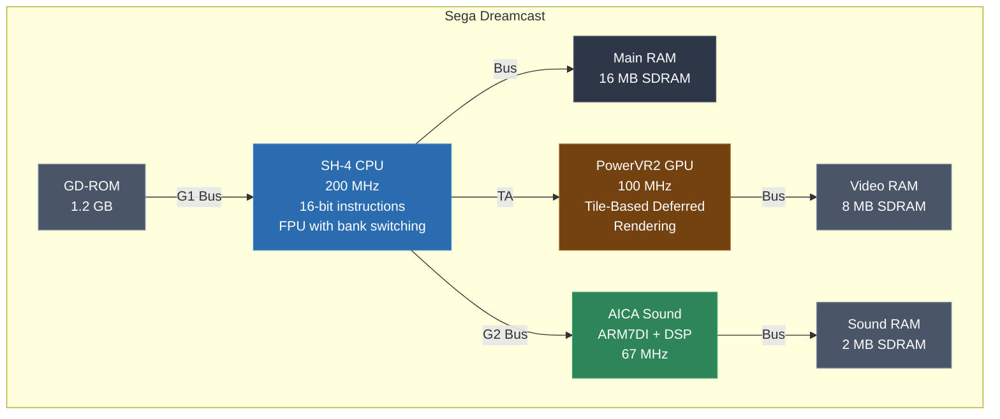
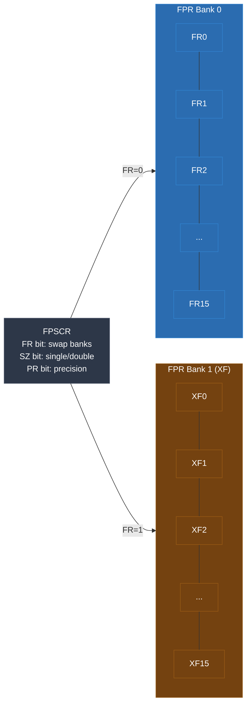
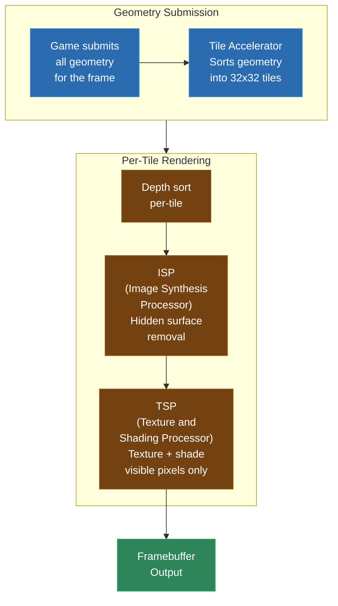
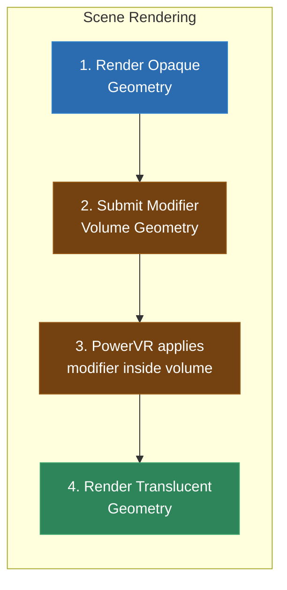
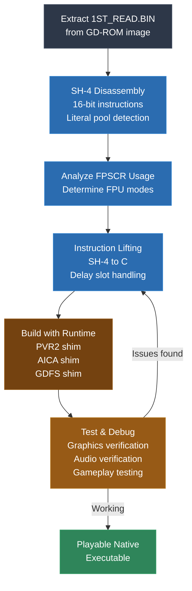

# Module 24: Dreamcast and SH-4 Recompilation

The Sega Dreamcast is one of the most fascinating recompilation targets in this course -- not because it is the most powerful (it is not), but because almost everything about it is unusual. The CPU is a Hitachi SH-4, an architecture you have probably never worked with. The GPU is a PowerVR2 that uses tile-based deferred rendering, a fundamentally different approach from every other console GPU you have seen. The audio processor is an ARM7-based chip with its own instruction set and local memory. And the disc format is GD-ROM, a proprietary format that adds wrinkles to even getting the binary data off the disc.

If you have been working through this course linearly, you have recompiled MIPS (N64), PowerPC (GameCube), and x86 (Xbox). SH-4 is none of those. It is a 32-bit RISC-ish architecture with 16-bit instructions, delay slots (like MIPS, but with more gotchas), an FPU that switches between two banks of registers, and addressing modes built for embedded systems. It will make you think about instruction lifting in new ways.

This module covers the SH-4 CPU in depth, the Dreamcast hardware platform, the binary format and boot process, SH-4 instruction lifting with all its quirks, PowerVR2 graphics shimming, AICA audio handling, and the real-world challenges that make Dreamcast recompilation both rewarding and maddening.

---

## 1. The Dreamcast Platform

The Sega Dreamcast launched in late 1998 in Japan and 1999 in North America -- technically the first console of its generation, beating the PS2 by over a year. Despite its commercial failure, it had remarkable hardware that was ahead of its time in several ways.

### System Overview

| Component | Specification |
|---|---|
| CPU | Hitachi SH-4 (SH7091), 200 MHz |
| GPU | NEC/VideoLogic PowerVR2 (CLX2), 100 MHz |
| Sound | Yamaha AICA (ARM7DI core + DSP), 67 MHz |
| Main RAM | 16 MB SDRAM |
| Video RAM | 8 MB SDRAM (dedicated to PowerVR2) |
| Sound RAM | 2 MB SDRAM (dedicated to AICA) |
| Optical | GD-ROM (1.2 GB capacity) |
| Byte Order | Little-endian (SH-4 configurable, Dreamcast uses LE) |

The Dreamcast is little-endian -- a relief after the GameCube's big-endian everything. However, the SH-4 is actually a bi-endian processor that can be configured for either byte order at boot. The Dreamcast's BIOS configures it for little-endian, and all games assume this configuration.



### Memory Map

The Dreamcast's memory map is more complex than most consoles because the SH-4 uses its MMU and address translation to provide different views of the same physical memory:

```
Dreamcast Memory Map
===================================================================

 Address Range          Size      Description
-------------------------------------------------------------------
 0x00000000-0x001FFFFF  2 MB      Boot ROM (BIOS)
 0x00200000-0x0021FFFF  128 KB    Flash memory (settings, saves)
 0x005F6800-0x005F69FF            GD-ROM registers
 0x005F6C00-0x005F6CFF            G1 bus control
 0x005F7000-0x005F70FF            G2 bus control (AICA, modem)
 0x005F7400-0x005F74FF            PVR control registers
 0x005F7C00-0x005F7CFF            PVR additional registers
 0x005F8000-0x005F9FFF            Tile Accelerator (TA) registers
 0x00700000-0x00707FFF  32 KB     AICA register space
 0x00710000-0x00710FFF            AICA RTC registers
 0x00800000-0x009FFFFF  2 MB      AICA sound RAM (directly mapped)
 0x0C000000-0x0CFFFFFF  16 MB     Main RAM (cached, P0 area)
 0x0D000000-0x0DFFFFFF  16 MB     Main RAM (cached, P0 area alt)
 0x10000000-0x107FFFFF  8 MB      Tile Accelerator command area
 0x10800000-0x10FFFFFF  8 MB      TA YUV conversion area
 0x11000000-0x117FFFFF  8 MB      Texture memory (bank 0, 64-bit)
 0x11800000-0x11FFFFFF  8 MB      Texture memory (bank 1, 64-bit)
 0xA0000000-0xA0FFFFFF  16 MB     Main RAM (uncached, P2 area)
===================================================================
```

Understanding this memory map is critical for building the memory bus shim. Every memory access in the generated code goes through your `mem_read` / `mem_write` functions, which must dispatch to the correct backing store based on the address.

A common mistake is to only handle the main RAM range (`0x0C000000-0x0CFFFFFF`) and forget about the uncached mirror (`0xA0000000-0xA0FFFFFF`). Both map to the same physical memory -- the only difference is caching behavior, which your recompiled code does not need to model. But the addresses are different, so your address translation must handle both:

```c
uint32_t translate_address(uint32_t addr) {
    // P0 cached: 0x0C000000 - 0x0CFFFFFF -> physical 0x00000000 - 0x00FFFFFF
    // P2 uncached: 0xA0000000 - 0xA0FFFFFF -> same physical memory
    // P1 cached: 0x80000000 - 0x80FFFFFF -> same physical memory

    // Strip the area bits to get physical address within 16 MB
    if ((addr & 0xFC000000) == 0x0C000000)
        return addr & 0x00FFFFFF;
    if ((addr & 0xFC000000) == 0xA0000000)
        return addr & 0x00FFFFFF;
    if ((addr & 0xFC000000) == 0x80000000)
        return addr & 0x00FFFFFF;
    if ((addr & 0xFC000000) == 0x8C000000)
        return addr & 0x00FFFFFF;
    if ((addr & 0xFC000000) == 0xAC000000)
        return addr & 0x00FFFFFF;

    // Not main RAM -- handle as special region
    return addr;
}
```

The `0x8C` prefix is the most common -- it is the cached P1 mapping that most games use for their code and data access. You will see `0x8C010000` as the typical load address in virtually every Dreamcast game.

The SH-4 has multiple address space areas (P0-P4) selected by the upper bits of the address:
- **P0 (0x00000000-0x7FFFFFFF)**: User-mode accessible, cacheable, TLB-translated
- **P1 (0x80000000-0x9FFFFFFF)**: Kernel-mode, cached, physical address = addr & 0x1FFFFFFF
- **P2 (0xA0000000-0xBFFFFFFF)**: Kernel-mode, uncached, physical address = addr & 0x1FFFFFFF
- **P3 (0xC0000000-0xDFFFFFFF)**: Kernel-mode, cached, TLB-translated
- **P4 (0xE0000000-0xFFFFFFFF)**: Kernel-mode, control registers, cache manipulation

Games running on bare metal (most Dreamcast games) typically use P0 cached access for main RAM at `0x0C000000` and P2 uncached access at `0xA0000000` for DMA and hardware register access. Games running under Windows CE use P0 with TLB translation (we will get to Windows CE games later).

### Boot Process

The Dreamcast boot sequence matters for recompilation because it determines where in memory the game code ends up:

1. **BIOS** loads from boot ROM at `0x00000000`. It initializes hardware, checks the disc, and reads the boot sector.
2. **IP.BIN** (Initial Program) is loaded from the GD-ROM's boot area. This is a ~32 KB bootstrap that sets up memory, initializes the GD-ROM driver, and loads the main executable.
3. **1ST_READ.BIN** is the main game executable, loaded by IP.BIN into main RAM (typically at `0x8C010000` or `0x0C010000`). This is the binary you will be recompiling.

The 1ST_READ.BIN file is a flat binary with no header -- it is just raw SH-4 code and data loaded to a fixed address. The entry point is specified in IP.BIN. Most games load at `0x8C010000`, giving them roughly 15.9 MB of RAM for code and data.

Some games compress 1ST_READ.BIN and include a decompression stub that runs first. You need to decompress these before recompilation.

---

## 2. The SH-4 CPU: Hitachi SuperH

The SH-4 is the most unusual CPU architecture in this course. It was designed by Hitachi for embedded applications -- digital cameras, printers, automotive systems -- and Sega chose it for the Dreamcast because it offered excellent performance per watt and per dollar. Understanding its quirks is essential for building a correct lifter.

### 16-Bit Instruction Encoding

Here is the first surprise: **SH-4 instructions are 16 bits wide**. Not 32 bits like MIPS, PowerPC, or ARM. Sixteen bits. This is the defining characteristic of the SuperH architecture, and it has major implications:

- The instruction set is compact. There is room for fewer operands and smaller immediate fields.
- Most instructions can only specify two registers (source and destination), not three.
- Immediate values are small (8-bit for most instructions, sometimes with a shift).
- Loading 32-bit constants requires a PC-relative load from a literal pool, not an immediate instruction.

```
SH-4 Instruction Formats (16 bits):

Format 0:  [opcode:4][Rn:4][Rm:4][func:4]      Register operations
Format I:  [opcode:4][Rn:4][imm:8]              Register + immediate
Format D:  [opcode:4][Rn:4][disp:4][size:4]     Register + displacement
Format P:  [opcode:8][disp:8]                    PC-relative
Format B:  [opcode:4][disp:12]                   Branch (12-bit displacement)
```

With only 16 bits per instruction, the SH-4 achieves higher code density than 32-bit RISC architectures. A GameCube game's code section might be 2 MB of 32-bit instructions. An equivalent Dreamcast game could fit the same logic in 1 MB of 16-bit instructions. This matters for the Dreamcast's relatively small 16 MB RAM.

### General Purpose Registers

The SH-4 has **16 general-purpose registers**, each 32 bits wide, named `R0` through `R15`:

| Register | Convention | Purpose |
|---|---|---|
| R0 | Volatile | Accumulator / function return value. Also has special addressing modes. |
| R1-R3 | Volatile | Scratch |
| R4-R7 | Volatile | Function arguments |
| R8-R13 | Non-volatile | Callee-saved |
| R14 | Non-volatile | Frame pointer (by convention) |
| R15 | Dedicated | Stack pointer |

R0 has special status in many instructions. Several addressing modes are available only with R0 as the source or destination. For example, `MOV.L @(disp, GBR), R0` can only load into R0 -- you cannot use another register as the destination. This means R0 shows up in lifted code much more frequently than other registers.

Here are all the R0-specific addressing modes:

```c
// R0-specific instructions -- these ONLY work with R0

// MOV.B @(disp, GBR), R0  -- GBR-relative byte load (R0 only!)
ctx->r[0] = (int8_t)mem_read_u8(ctx, ctx->gbr + disp);

// MOV.W @(disp, GBR), R0  -- GBR-relative word load (R0 only!)
ctx->r[0] = (int16_t)mem_read_u16(ctx, ctx->gbr + disp * 2);

// MOV.L @(disp, GBR), R0  -- GBR-relative long load (R0 only!)
ctx->r[0] = mem_read_u32(ctx, ctx->gbr + disp * 4);

// MOV.B R0, @(disp, GBR)  -- GBR-relative byte store (R0 only!)
mem_write_u8(ctx, ctx->gbr + disp, ctx->r[0]);

// MOV.B @(R0, Rm), Rn     -- indexed byte load (R0 as index)
ctx->r[n] = (int8_t)mem_read_u8(ctx, ctx->r[0] + ctx->r[m]);

// MOV.B Rm, @(R0, Rn)     -- indexed byte store (R0 as index)
mem_write_u8(ctx, ctx->r[0] + ctx->r[n], ctx->r[m]);

// AND.B #imm, @(R0, GBR)  -- atomic read-modify-write at GBR+R0
// OR.B #imm, @(R0, GBR)
// XOR.B #imm, @(R0, GBR)
// TST.B #imm, @(R0, GBR)  -- test bits at GBR+R0, set T
{
    uint32_t addr = ctx->r[0] + ctx->gbr;
    uint8_t val = mem_read_u8(ctx, addr);
    val &= imm;  // (for AND.B)
    mem_write_u8(ctx, addr, val);
}

// MOVA @(disp, PC), R0  -- load address of PC-relative data into R0
// Note: MOVA loads the ADDRESS, not the data!
ctx->r[0] = (current_pc & ~3) + 4 + disp * 4;
```

The `MOVA` instruction is particularly important for understanding how SH-4 code accesses data. It loads the address of a literal pool entry into R0, after which the code can use R0 as a base register for further accesses. This is how the compiler generates access to global variables and large data structures.

### Special Registers

| Register | Name | Purpose |
|---|---|---|
| PR | Procedure Register | Return address (like LR on PowerPC) |
| SR | Status Register | Processor status, including T-bit |
| GBR | Global Base Register | Base for GBR-relative addressing |
| VBR | Vector Base Register | Interrupt/exception vector table base |
| MACH/MACL | Multiply-Accumulate | High/low words of MAC result |
| FPSCR | FP Status/Control | FP mode bits, rounding, exception flags |
| FPUL | FP Communication | Transfer register between FPU and integer unit |
| PC | Program Counter | Current instruction address |

The **T-bit** in the Status Register is the SH-4's condition flag. It is a single bit, unlike PowerPC's 8-field condition register or x86's multi-flag EFLAGS. Almost all conditional operations set or test the T-bit:

```asm
CMP/EQ  R1, R2      ; T = (R1 == R2)
BT      target       ; branch if T == 1
BF      target       ; branch if T == 0
```

This single-bit condition system is simple to model:

```c
typedef struct {
    uint32_t r[16];     // R0-R15
    uint32_t pr;        // procedure register (return address)
    uint32_t sr;        // status register
    uint32_t t;         // T-bit (extracted from SR for convenience)
    uint32_t gbr;       // global base register
    uint32_t mach, macl; // multiply-accumulate
    uint32_t fpscr;     // FP status/control
    uint32_t fpul;      // FP communication register
    // FPU registers (see below)
} SH4Context;
```

### The GBR and GBR-Relative Addressing

The **Global Base Register (GBR)** is a feature specific to SuperH that you will not find on MIPS or PowerPC. It provides a base address for a set of addressing modes that allow fast access to global data without needing to load a full 32-bit address.

```asm
MOV.L   @(disp, GBR), R0    ; R0 = *(uint32_t*)(GBR + disp*4)
MOV.B   @(disp, GBR), R0    ; R0 = *(uint8_t*)(GBR + disp)
AND.B   #imm, @(R0, GBR)    ; byte at (R0+GBR) &= imm
```

Games set GBR to point at a frequently-accessed data structure (often the game's global state or I/O register block) and then use GBR-relative instructions throughout the code. For your lifter:

```c
// MOV.L @(disp, GBR), R0
ctx->r[0] = mem_read_u32(ctx, ctx->gbr + disp * 4);

// AND.B #imm, @(R0, GBR)
{
    uint32_t addr = ctx->r[0] + ctx->gbr;
    uint8_t val = mem_read_u8(ctx, addr);
    val &= imm;
    mem_write_u8(ctx, addr, val);
}
```

### FPU and Bank Switching

The SH-4's floating-point unit is the most unusual aspect of the CPU from a recompilation perspective. It has **16 single-precision floating-point registers** (FR0-FR15) organized into **two banks** of 8 registers each. The FPSCR register controls which bank is "active":

```
FPSCR.FR = 0:  FPR bank 0 is active (FR0-FR15 are FPR0_BANK0..FPR15_BANK0)
FPSCR.FR = 1:  Banks are swapped (FR0-FR15 are now FPR0_BANK1..FPR15_BANK1)
```

When the banks are swapped, what was FR0 becomes XF0 (extended float register) and vice versa. There are instructions that explicitly access the "other" bank:

```asm
FMOV    FR0, FR1            ; move within current bank
FSCHG                        ; toggle FPSCR.SZ (single/double size)
FRCHG                        ; toggle FPSCR.FR (swap FPU banks)
FMOV    XF0, FR1            ; move from other bank to current bank
```

Additionally, the FPSCR.SZ bit controls whether floating-point moves and loads operate on 32-bit singles or 64-bit doubles (pairs of registers):

```
FPSCR.SZ = 0:  FMOV operates on 32-bit floats
FPSCR.SZ = 1:  FMOV operates on 64-bit (pair of 32-bit floats)
```

This means the same instruction (`FMOV`) does different things depending on the FPSCR state at the time it executes. Your lifter cannot determine the operand size statically -- you need to track FPSCR.SZ and FPSCR.FR through the code.



The FPSCR.PR bit controls precision mode:
- **PR=0**: Single-precision (32-bit float) operations
- **PR=1**: Double-precision (64-bit double) operations

In double-precision mode, pairs of FP registers (DR0 = FR0:FR1, DR2 = FR2:FR3, etc.) hold 64-bit doubles. This changes the interpretation of register numbers in FP instructions.

For the context struct, you need to model all 32 physical floating-point registers (two banks of 16):

```c
typedef struct {
    // ...
    float fr[16];    // current bank FP registers
    float xf[16];    // other bank FP registers
    uint32_t fpscr;  // FP status/control register
    uint32_t fpul;   // FP/integer transfer register
} SH4Context;

// FRCHG -- swap FPU banks
void lift_frchg(SH4Context *ctx) {
    // Swap fr[] and xf[] arrays
    float temp[16];
    memcpy(temp, ctx->fr, sizeof(temp));
    memcpy(ctx->fr, ctx->xf, sizeof(ctx->fr));
    memcpy(ctx->xf, temp, sizeof(ctx->xf));
    ctx->fpscr ^= (1 << 21);  // toggle FR bit
}

// FADD FRm, FRn (single-precision, PR=0)
ctx->fr[n] = ctx->fr[n] + ctx->fr[m];

// FADD DRm, DRn (double-precision, PR=1)
// DR2n = FR(2n):FR(2n+1) as a double
double drn, drm;
memcpy(&drn, &ctx->fr[2*n], sizeof(double));  // careful with endianness
memcpy(&drm, &ctx->fr[2*m], sizeof(double));
drn = drn + drm;
memcpy(&ctx->fr[2*n], &drn, sizeof(double));
```

The bank switching is used by games for graphics calculations. A common pattern is:

1. Set up transformation matrices in one FPR bank
2. Switch banks
3. Load vertex data into the other bank
4. Use `FTRV` (matrix-vector multiply) to transform vertices
5. Switch back

The `FTRV` instruction is particularly interesting -- it multiplies a 4x4 matrix (stored in the "other" bank, XMTRX) by a 4-element vector (in the current bank), producing a 4-element result:

```asm
FTRV    XMTRX, FV0     ; FV0 = XMTRX * FV0
                         ; where FV0 = (FR0, FR1, FR2, FR3)
                         ; XMTRX = 4x4 matrix in XF0-XF15
```

```c
// FTRV XMTRX, FVn
// FVn is FR(n), FR(n+1), FR(n+2), FR(n+3)
// XMTRX is the 4x4 matrix in xf[0..15]
{
    float v0 = ctx->fr[n], v1 = ctx->fr[n+1];
    float v2 = ctx->fr[n+2], v3 = ctx->fr[n+3];

    ctx->fr[n]   = ctx->xf[0]*v0 + ctx->xf[4]*v1 + ctx->xf[8]*v2  + ctx->xf[12]*v3;
    ctx->fr[n+1] = ctx->xf[1]*v0 + ctx->xf[5]*v1 + ctx->xf[9]*v2  + ctx->xf[13]*v3;
    ctx->fr[n+2] = ctx->xf[2]*v0 + ctx->xf[6]*v1 + ctx->xf[10]*v2 + ctx->xf[14]*v3;
    ctx->fr[n+3] = ctx->xf[3]*v0 + ctx->xf[7]*v1 + ctx->xf[11]*v2 + ctx->xf[15]*v3;
}
```

This is the SH-4's built-in hardware matrix multiply, and it is heavily used by Dreamcast games for vertex transformation. Getting this right is critical for correct 3D rendering.

---

## 3. SH-4 Instruction Lifting

Now let us walk through the lifting process for SH-4 instructions. The 16-bit encoding makes decoding compact but also means you will encounter patterns that feel foreign if you are used to 32-bit RISC.

### Disassembly

SH-4 instructions are 16 bits and 2-byte aligned. Disassembly is simpler than x86 (no variable-length ambiguity) but requires awareness of a few things:

1. Some instructions are followed by a 32-bit literal (PC-relative loads use a constant pool embedded in the code stream)
2. Delay slots add complexity to control flow analysis
3. The FPU instruction behavior depends on FPSCR state

The primary opcode is typically in the upper 4 bits, with sub-operations encoded in various bit positions:

```c
uint16_t insn = *(uint16_t*)(code + pc);

uint8_t op = (insn >> 12) & 0xF;
uint8_t rn = (insn >> 8) & 0xF;
uint8_t rm = (insn >> 4) & 0xF;
uint8_t func = insn & 0xF;

switch (op) {
    case 0x0: decode_0xxx(insn); break;   // MOV, MUL, CMP variants
    case 0x1: decode_1xxx(insn); break;   // MOV.L @(disp,Rm), Rn
    case 0x2: decode_2xxx(insn); break;   // MOV, AND, OR, XOR, etc.
    case 0x3: decode_3xxx(insn); break;   // CMP, SUB, ADD
    case 0x4: decode_4xxx(insn); break;   // shifts, JMP, JSR, LDS
    case 0x6: decode_6xxx(insn); break;   // MOV with sign/zero extend
    case 0x7: // ADD #imm, Rn
        lift_add_imm(ctx, rn, (int8_t)(insn & 0xFF)); break;
    case 0x8: decode_8xxx(insn); break;   // BT, BF, CMP/EQ #imm
    case 0x9: // MOV.W @(disp,PC), Rn
        lift_mov_w_pc(ctx, rn, insn & 0xFF); break;
    case 0xA: // BRA disp
        lift_bra(ctx, insn & 0xFFF); break;
    case 0xB: // BSR disp
        lift_bsr(ctx, insn & 0xFFF); break;
    case 0xC: decode_Cxxx(insn); break;   // MOV.L @(disp,GBR), R0, etc.
    case 0xD: // MOV.L @(disp,PC), Rn
        lift_mov_l_pc(ctx, rn, insn & 0xFF); break;
    case 0xE: // MOV #imm, Rn
        lift_mov_imm(ctx, rn, (int8_t)(insn & 0xFF)); break;
    case 0xF: decode_Fxxx(insn); break;   // FPU instructions
}
```

### Loading 32-bit Constants: PC-Relative Literal Pools

Since instructions are only 16 bits, there is no room for a 32-bit immediate. Instead, the SH-4 uses **PC-relative loads** to fetch constants from literal pools embedded in the code:

```asm
MOV.L   @(disp, PC), R3     ; R3 = *(uint32_t*)(PC + 4 + disp * 4)
                              ; PC is aligned to 4 for this calculation
```

The assembler places 32-bit constants in the code stream (usually after a branch instruction so they do not get executed), and `MOV.L @(disp, PC), Rn` loads them. The displacement is 8 bits, giving a range of 256 words (1024 bytes) from the current PC.

This is critical for your disassembler: you must identify these literal pools and not try to disassemble them as instructions. A common approach is:

```python
def resolve_pc_literal(pc, disp, size):
    """Calculate the address of a PC-relative literal."""
    if size == 4:  # MOV.L
        addr = (pc & ~3) + 4 + disp * 4
    elif size == 2:  # MOV.W
        addr = pc + 4 + disp * 2
    return addr
```

When lifting, you can often resolve these loads at recompilation time and emit the constant directly:

```c
// MOV.L @(disp, PC), R3  where the literal pool contains 0x8C045000
// Resolved at recompilation time:
ctx->r[3] = 0x8C045000;
```

This is one of the nice things about 16-bit instructions -- the constant pool loads are easy to resolve statically, giving you immediate access to addresses and constants that would otherwise be opaque.

### Delay Slots

Like MIPS, the SH-4 has **delay slots** on branch instructions. The instruction immediately following a branch is always executed (for branches that have delay slots). This is familiar territory if you did the N64 module, but SH-4 has some additional wrinkles.

SH-4 branch instructions come in two flavors:

**With delay slot** (the instruction after the branch always executes):
```asm
BRA     target        ; unconditional branch with delay slot
ADD     R1, R2        ; delay slot: always executes

BT/S    target        ; branch if T=1, with delay slot
ADD     R1, R2        ; delay slot: always executes (even if branch not taken!)

BF/S    target        ; branch if T=0, with delay slot
ADD     R1, R2        ; delay slot: always executes

JMP     @Rn           ; indirect jump with delay slot
NOP                   ; delay slot

JSR     @Rn           ; indirect call with delay slot
NOP                   ; delay slot

RTS                   ; return with delay slot
NOP                   ; delay slot
```

**Without delay slot** (no delay slot instruction):
```asm
BT      target        ; branch if T=1, NO delay slot
BF      target        ; branch if T=0, NO delay slot
```

Note the critical difference: `BT` (without `/S`) has NO delay slot, but `BT/S` has a delay slot. Same for `BF` vs `BF/S`. This is different from MIPS, where all branches have delay slots.

Also important: **`RTS` has a delay slot**. The return instruction does not execute immediately -- the delay slot instruction runs first. This means you cannot simply emit `return;` for RTS. You need:

```c
// RTS
// ADD R1, R2  (delay slot)
{
    uint32_t return_addr = ctx->pr;  // capture return address
    ctx->r[2] = ctx->r[2] + ctx->r[1];  // execute delay slot
    return;  // now return (to address in PR, but we handle this at the call site)
}
```

The lifting pattern for delay slots is the same as MIPS: capture the branch condition or target, execute the delay slot instruction, then take the branch:

```c
// BT/S target
// ADD R1, R2  (delay slot)
{
    int cond = ctx->t;             // capture T-bit before delay slot
    ctx->r[2] += ctx->r[1];        // execute delay slot
    if (cond) goto target;          // take branch
}

// BF/S target
// MOV R3, R4  (delay slot)
{
    int cond = ctx->t;
    ctx->r[4] = ctx->r[3];
    if (!cond) goto target;
}
```

One subtle gotcha: the delay slot instruction must not be another branch instruction. The SH-4 specification says the behavior is undefined if you put a branch in a delay slot. In practice, no compiler generates this, but if you encounter hand-written assembly (and some Dreamcast games have hand-written asm), you should handle it gracefully (typically by raising an error during recompilation).

### Arithmetic and Logic

SH-4 arithmetic is two-operand: the result goes into the destination register, which is also one of the sources. This is different from three-operand MIPS/PowerPC:

```c
// ADD Rm, Rn  (Rn = Rn + Rm)
ctx->r[n] += ctx->r[m];

// ADD #imm, Rn  (Rn = Rn + sign_extend(imm8))
ctx->r[n] += (int8_t)imm;

// SUB Rm, Rn  (Rn = Rn - Rm)
ctx->r[n] -= ctx->r[m];

// AND Rm, Rn  (Rn = Rn & Rm)
ctx->r[n] &= ctx->r[m];

// OR Rm, Rn
ctx->r[n] |= ctx->r[m];

// XOR Rm, Rn
ctx->r[n] ^= ctx->r[m];

// NOT Rm, Rn  (Rn = ~Rm)
ctx->r[n] = ~ctx->r[m];

// NEG Rm, Rn  (Rn = -Rm, two's complement)
ctx->r[n] = -(int32_t)ctx->r[m];

// SHLL Rn  (shift left logical by 1)
ctx->t = (ctx->r[n] >> 31) & 1;  // T = shifted-out bit
ctx->r[n] <<= 1;

// SHLR Rn  (shift right logical by 1)
ctx->t = ctx->r[n] & 1;
ctx->r[n] >>= 1;

// SHAR Rn  (shift right arithmetic by 1)
ctx->t = ctx->r[n] & 1;
ctx->r[n] = (int32_t)ctx->r[n] >> 1;

// SHLL16 Rn  (shift left by 16)
ctx->r[n] <<= 16;
```

Note that single-bit shifts set the T-bit with the shifted-out bit. Multi-bit shifts (SHLL2, SHLL8, SHLL16, SHLR2, etc.) do not affect T.

### Comparison Instructions

All comparisons set the T-bit:

```c
// CMP/EQ Rm, Rn  (T = (Rn == Rm))
ctx->t = (ctx->r[n] == ctx->r[m]) ? 1 : 0;

// CMP/GE Rm, Rn  (T = (signed Rn >= signed Rm))
ctx->t = ((int32_t)ctx->r[n] >= (int32_t)ctx->r[m]) ? 1 : 0;

// CMP/GT Rm, Rn  (T = (signed Rn > signed Rm))
ctx->t = ((int32_t)ctx->r[n] > (int32_t)ctx->r[m]) ? 1 : 0;

// CMP/HI Rm, Rn  (T = (unsigned Rn > unsigned Rm))
ctx->t = (ctx->r[n] > ctx->r[m]) ? 1 : 0;

// CMP/HS Rm, Rn  (T = (unsigned Rn >= unsigned Rm))
ctx->t = (ctx->r[n] >= ctx->r[m]) ? 1 : 0;

// CMP/EQ #imm, R0  (T = (R0 == sign_extend(imm8)))
ctx->t = (ctx->r[0] == (uint32_t)(int8_t)imm) ? 1 : 0;

// CMP/PZ Rn  (T = (signed Rn >= 0))
ctx->t = ((int32_t)ctx->r[n] >= 0) ? 1 : 0;

// CMP/PL Rn  (T = (signed Rn > 0))
ctx->t = ((int32_t)ctx->r[n] > 0) ? 1 : 0;

// TST Rm, Rn  (T = ((Rn & Rm) == 0))
ctx->t = ((ctx->r[n] & ctx->r[m]) == 0) ? 1 : 0;
```

### Load and Store

SH-4 has several load/store addressing modes:

```c
// MOV.L Rm, @Rn  (store 32-bit: [Rn] = Rm)
mem_write_u32(ctx, ctx->r[n], ctx->r[m]);

// MOV.L @Rm, Rn  (load 32-bit: Rn = [Rm])
ctx->r[n] = mem_read_u32(ctx, ctx->r[m]);

// MOV.L Rm, @-Rn  (pre-decrement store: Rn -= 4; [Rn] = Rm)
ctx->r[n] -= 4;
mem_write_u32(ctx, ctx->r[n], ctx->r[m]);

// MOV.L @Rm+, Rn  (post-increment load: Rn = [Rm]; Rm += 4)
ctx->r[n] = mem_read_u32(ctx, ctx->r[m]);
if (n != m) ctx->r[m] += 4;  // no increment if Rm == Rn

// MOV.L @(disp, Rm), Rn  (displacement load: Rn = [Rm + disp*4])
ctx->r[n] = mem_read_u32(ctx, ctx->r[m] + disp * 4);

// MOV.L R0, @(disp, GBR)  (GBR-relative store)
mem_write_u32(ctx, ctx->gbr + disp * 4, ctx->r[0]);

// MOV.B, MOV.W variants follow the same patterns for 8-bit and 16-bit access
```

The pre-decrement and post-increment modes are used for stack push/pop:

```asm
MOV.L   R14, @-R15       ; push R14 (R15 -= 4; [R15] = R14)
MOV.L   R13, @-R15       ; push R13
; ...
MOV.L   @R15+, R13       ; pop R13 (R13 = [R15]; R15 += 4)
MOV.L   @R15+, R14       ; pop R14
```

### Multiply-Accumulate

The SH-4 has a multiply-accumulate unit that stores results in the MACH/MACL register pair:

```c
// MUL.L Rm, Rn  (MACL = Rn * Rm, 32-bit result)
ctx->macl = ctx->r[n] * ctx->r[m];

// DMULS.L Rm, Rn  (MACH:MACL = signed Rn * signed Rm, 64-bit result)
{
    int64_t result = (int64_t)(int32_t)ctx->r[n] * (int64_t)(int32_t)ctx->r[m];
    ctx->macl = (uint32_t)(result & 0xFFFFFFFF);
    ctx->mach = (uint32_t)(result >> 32);
}

// STS MACL, Rn  (Rn = MACL)
ctx->r[n] = ctx->macl;

// STS MACH, Rn  (Rn = MACH)
ctx->r[n] = ctx->mach;
```

### Division Instructions

The SH-4 has a unique approach to integer division. There is no single "divide" instruction. Instead, division is performed through a multi-step process using the `DIV0S`, `DIV0U`, and `DIV1` instructions:

```asm
; Signed 32-bit division: R1 / R2 -> result in R1
; This is a 16-step iterative division algorithm

DIV0S   R2, R1          ; initialize: set up T and Q/M bits from sign bits
.rept 32
DIV1    R2, R1          ; one step of the division algorithm
.endr
ROTCL   R1              ; rotate carry into result
```

The compiler generates these multi-instruction division sequences. Your lifter has two options:

1. **Lift each instruction literally**: Implement DIV0S, DIV0U, and DIV1 with their exact flag behavior. This is correct but verbose.

2. **Pattern-match the division sequence**: Recognize the DIV0S/DIV1 pattern and replace it with a single C division. This produces much cleaner output.

```c
// Pattern-matched approach (recommended):
// When you see DIV0S Rm, Rn followed by 32 DIV1 Rm, Rn followed by ROTCL:
ctx->r[1] = (int32_t)ctx->r[1] / (int32_t)ctx->r[2];

// Literal approach (for correctness verification):
// DIV0S Rm, Rn
ctx->sr_q = (ctx->r[n] >> 31) & 1;
ctx->sr_m = (ctx->r[m] >> 31) & 1;
ctx->t = ctx->sr_q ^ ctx->sr_m;

// DIV1 Rm, Rn (one iteration)
{
    uint32_t old_q = ctx->sr_q;
    ctx->sr_q = (ctx->r[n] >> 31) & 1;
    ctx->r[n] = (ctx->r[n] << 1) | ctx->t;
    if (old_q == ctx->sr_m) {
        ctx->r[n] -= ctx->r[m];
    } else {
        ctx->r[n] += ctx->r[m];
    }
    ctx->sr_q = (ctx->sr_q ^ ctx->sr_m) ^
                ((ctx->r[n] >> 31) & 1) ^ old_q;
    ctx->t = 1 - (ctx->sr_q ^ ctx->sr_m);
}
```

Most Dreamcast games were compiled with Hitachi's SH-4 compiler (part of the Hitachi development tools), which generates consistent patterns for division. Pattern matching is highly reliable in practice.

### SWAP and XTRCT Instructions

SH-4 has a few data manipulation instructions that do not have direct equivalents on most other architectures:

```c
// SWAP.B Rm, Rn  (swap lower 2 bytes of Rm, store in Rn)
// Used for byte-order conversion
{
    uint32_t val = ctx->r[m];
    ctx->r[n] = (val & 0xFFFF0000) |
                ((val & 0x00FF) << 8) |
                ((val & 0xFF00) >> 8);
}

// SWAP.W Rm, Rn  (swap upper and lower words)
{
    uint32_t val = ctx->r[m];
    ctx->r[n] = (val >> 16) | (val << 16);
}

// XTRCT Rm, Rn  (extract -- upper 16 of Rm || lower 16 of Rn)
ctx->r[n] = (ctx->r[n] >> 16) | (ctx->r[m] << 16);
```

`SWAP.B` shows up when games need to convert between big-endian and little-endian for individual 16-bit values. It is common in network code (the Dreamcast had a modem/broadband adapter) and when processing data loaded from external sources.

### Subroutine Calls and Returns

SH-4 uses the Procedure Register (PR) for return addresses:

```asm
BSR     target          ; PR = PC + 4; branch to target (with delay slot)
JSR     @Rn             ; PR = PC + 4; branch to [Rn] (with delay slot)
RTS                     ; branch to PR (with delay slot)
```

```c
// BSR target (direct call)
ctx->pr = current_pc + 4;  // 2 bytes for BSR + 2 bytes for delay slot
// (execute delay slot instruction here)
func_target(ctx);

// JSR @Rn (indirect call)
ctx->pr = current_pc + 4;
// (execute delay slot instruction here)
dispatch_indirect(ctx, ctx->r[n]);

// RTS (return)
// (execute delay slot instruction here)
return;
```

### Function Prologue and Epilogue Recognition

SH-4 functions follow consistent patterns generated by the Hitachi compiler:

```asm
; Typical SH-4 function prologue
STS.L   PR, @-R15        ; push PR (return address)
MOV.L   R14, @-R15       ; push callee-saved registers
MOV.L   R13, @-R15
MOV     R15, R14          ; set frame pointer
ADD     #-16, R15         ; allocate local variables

; ... function body ...

; Typical SH-4 function epilogue
MOV     R14, R15          ; restore stack pointer from frame pointer
MOV.L   @R15+, R13       ; pop callee-saved registers
MOV.L   @R15+, R14
LDS.L   @R15+, PR        ; pop PR (return address)
RTS                       ; return (with delay slot)
NOP                       ; delay slot (often NOP)
```

Recognizing these patterns is how you identify function boundaries during disassembly. The `STS.L PR, @-R15` (push PR) at the start and `LDS.L @R15+, PR` (pop PR) near the end are the most reliable indicators.

Some small functions ("leaf" functions that do not call other functions) omit the PR save/restore because they never clobber PR:

```asm
; Leaf function -- no PR save needed
ADD     R4, R5           ; just does computation
RTS                      ; returns immediately
MOV     R5, R0           ; delay slot: return value in R0
```

### Privileged Instructions

Some SH-4 instructions are privileged (kernel mode only). Most games run in privileged mode on the Dreamcast (there is no OS enforcing user/kernel separation for most games), so you will encounter these:

```c
// LDC Rn, SR  (load status register -- privileged)
ctx->sr = ctx->r[n];
ctx->t = (ctx->sr >> 0) & 1;
// Also updates interrupt mask, register bank select, etc.

// LDC Rn, VBR  (load vector base register -- privileged)
ctx->vbr = ctx->r[n];

// LDC Rn, GBR  (load global base register -- not actually privileged)
ctx->gbr = ctx->r[n];

// STC SR, Rn  (store status register)
ctx->r[n] = ctx->sr;

// SLEEP  (put CPU to sleep until interrupt)
// Shim: this is a power management instruction, stub it
```

For recompilation, you typically do not need to fully model privileged state changes. The key ones are GBR (used heavily), VBR (needed if you emulate interrupts), and SR (mainly for the T-bit and FPU mode bits).

---

## 4. PowerVR2 Graphics: Tile-Based Deferred Rendering

The PowerVR2 GPU in the Dreamcast uses an approach called **Tile-Based Deferred Rendering (TBDR)** that is fundamentally different from the immediate-mode rendering used by every other console GPU in this course (N64's RDP, GameCube's Flipper, PS2's GS, Xbox's NV2A).

### How TBDR Works

In a traditional immediate-mode renderer (like OpenGL or D3D on a PC GPU of this era), triangles are processed one at a time: transform, rasterize, shade, write to framebuffer. If two triangles overlap, both are shaded and the Z-buffer determines which pixel wins. This means you shade pixels that are never visible (overdraw).

TBDR takes a completely different approach:

1. **Binning**: All geometry for the frame is submitted to the GPU. The GPU sorts each triangle into the screen tiles (32x32 pixels each) it overlaps.
2. **Rendering**: For each tile, the GPU determines which triangle is closest at each pixel (using a depth sort). Only the front-most triangle at each pixel is shaded. Zero overdraw.



This is brilliant for the Dreamcast's era because it eliminates overdraw (the biggest performance killer on early 3D hardware) and allows the tile framebuffer to be stored in fast on-chip SRAM rather than external memory.

But for recompilation, it creates a fundamental problem: **you are shimming a TBDR pipeline onto modern immediate-mode hardware** (which, ironically, has come full circle -- modern mobile GPUs use TBDR, but desktop GPUs are still mostly immediate-mode).

### The Tile Accelerator (TA)

Games submit geometry to the PowerVR2 through the **Tile Accelerator (TA)**, which is a DMA-like interface at memory address `0x10000000-0x107FFFFF`. Games write vertex data and polygon headers to this address range, and the TA hardware bins the geometry into tiles.

The TA accepts geometry in several polygon formats:

```c
// PowerVR2 polygon header
typedef struct {
    uint32_t cmd;           // command word: polygon type, shading, etc.
    uint32_t mode1;         // ISP/TSP instruction word
    uint32_t mode2;         // TSP instruction word 2
    uint32_t tex_ctrl;      // texture control (format, address, size)
    float    face_color_a;  // face color alpha (for modifiers)
    float    face_color_r;  // face color red
    float    face_color_g;  // face color green
    float    face_color_b;  // face color blue
} PVRPolyHeader;

// PowerVR2 vertex (packed color)
typedef struct {
    float x, y, z;          // screen-space coordinates
    float u, v;             // texture coordinates
    uint32_t base_color;    // ARGB packed color
    uint32_t offset_color;  // ARGB offset/specular color
} PVRVertex;
```

Note that vertices are submitted in **screen space** (already transformed and projected). The PowerVR2 does not have a hardware transform engine like the N64's RSP or the GameCube's Flipper. Games do vertex transformation on the SH-4 CPU (using the FPU and FTRV instruction) and submit the already-projected screen-space vertices to the TA.

This actually simplifies the graphics shim in one way: you do not need to replicate a hardware transform pipeline. But it complicates it in another: the vertices you receive are already in screen coordinates, and you need to map them to your modern rendering context's coordinate system.

### Render Lists

The PowerVR2 renders geometry in a specific order based on **render lists**:

1. **Opaque list**: Rendered first, with full depth testing. Hidden surface removal eliminates overdraw.
2. **Punch-through list**: Alpha-tested geometry (pixels are either fully opaque or fully transparent). Rendered after opaque.
3. **Translucent list**: Alpha-blended geometry, rendered last. Sorted back-to-front per tile.

Games submit polygons to the appropriate list by setting bits in the polygon header. The TA accumulates all geometry, and then the ISP/TSP renders each list in order.

```c
// Polygon header command word bits
#define PVR_CMD_POLYHDR     0x80000000
#define PVR_LIST_OPAQUE     0x00000000
#define PVR_LIST_OPAQUEMOD  0x01000000
#define PVR_LIST_TRANS      0x02000000
#define PVR_LIST_TRANSMOD   0x03000000
#define PVR_LIST_PUNCHTHRU  0x04000000

#define PVR_CMD_EOS         0x00000000  // end of strip
#define PVR_CMD_ENDOFLIST   0x00000000  // end of list
```

### Shimming PowerVR2 to Modern Rendering

The graphics shim needs to:

1. **Intercept TA writes**: Capture the polygon headers and vertex data that games submit to `0x10000000`.
2. **Parse the geometry**: Extract vertices, texture references, blend modes, and shading parameters from the PVR format.
3. **Translate coordinates**: PVR vertices are in screen space. Map them to normalized device coordinates for the modern GPU.
4. **Handle textures**: Convert PVR texture formats (VQ-compressed, twiddled, palettized) to standard GPU formats.
5. **Render with correct ordering**: Opaque first, then punch-through, then translucent with alpha blending.

```c
// Coordinate translation: PVR screen space -> NDC
// PVR: (0,0) is top-left, X goes right, Y goes down
// OpenGL NDC: (-1,-1) is bottom-left, (1,1) is top-right
void pvr_to_ndc(float pvr_x, float pvr_y, float pvr_z,
                float *ndc_x, float *ndc_y, float *ndc_z,
                int screen_w, int screen_h) {
    *ndc_x = (pvr_x / screen_w) * 2.0f - 1.0f;
    *ndc_y = 1.0f - (pvr_y / screen_h) * 2.0f;  // flip Y
    *ndc_z = pvr_z;  // PVR uses 1/W for depth, need to handle this
}
```

The depth handling is tricky: the PowerVR2 stores `1/W` as the depth value, not Z. This means closer objects have larger depth values (inverse of the usual convention). Your shim needs to configure the depth test accordingly or convert the depth values.

Here is a more complete TA parser that handles the command stream:

```c
typedef struct {
    // Parsed polygon state
    int list_type;          // opaque, trans, punch-through
    int shading_type;       // flat, gouraud
    int texture_enabled;
    int depth_compare;
    int culling;
    int src_blend, dst_blend;

    // Texture state
    uint32_t tex_addr;      // address in VRAM
    int tex_width, tex_height;
    int tex_format;         // ARGB1555, RGB565, etc.
    int tex_twiddled;       // Morton order?
    int tex_vq;             // VQ compressed?
    int tex_filter;         // point, bilinear, trilinear

    // Vertex accumulation
    PVRVertex verts[65536]; // large enough for one frame
    int vert_count;
    int strip_start;        // start of current strip
} PVRRenderState;

void parse_ta_command_stream(SH4Context *ctx, uint8_t *data, size_t size) {
    uint8_t *ptr = data;
    PVRRenderState state = {0};

    while (ptr < data + size) {
        uint32_t cmd = *(uint32_t *)ptr;
        uint8_t pcw_type = (cmd >> 29) & 0x7;

        switch (pcw_type) {
            case 0: {
                // End of list
                flush_render_list(&state);
                ptr += 32;
                break;
            }
            case 4: {
                // Polygon/Modifier volume parameter
                parse_polygon_header(ptr, &state);
                ptr += 32;
                break;
            }
            case 5: {
                // Sprite header (axis-aligned quad)
                parse_sprite_header(ptr, &state);
                ptr += 32;
                break;
            }
            case 7: {
                // Vertex parameter
                uint8_t end_of_strip = (cmd >> 28) & 0x1;

                PVRVertex v;
                v.x = *(float *)(ptr + 4);
                v.y = *(float *)(ptr + 8);
                v.z = *(float *)(ptr + 12);

                if (state.texture_enabled) {
                    v.u = *(float *)(ptr + 16);
                    v.v = *(float *)(ptr + 20);
                    v.base_color = *(uint32_t *)(ptr + 24);
                    v.offset_color = *(uint32_t *)(ptr + 28);
                } else {
                    v.base_color = *(uint32_t *)(ptr + 24);
                    v.offset_color = 0;
                    v.u = v.v = 0;
                }

                state.verts[state.vert_count++] = v;

                if (end_of_strip) {
                    // Convert triangle strip to individual triangles
                    emit_strip_as_triangles(&state, state.strip_start, state.vert_count);
                    state.strip_start = state.vert_count;
                }

                ptr += 32;
                break;
            }
            default:
                ptr += 32;
                break;
        }
    }
}
```

### Blending Modes

The PowerVR2 supports configurable alpha blending with source and destination factors:

```c
// Blending mode from polygon header mode2 word
uint8_t src_blend = (mode2 >> 29) & 0x7;
uint8_t dst_blend = (mode2 >> 26) & 0x7;

// Map PVR blend factors to OpenGL
GLenum pvr_to_gl_blend(uint8_t pvr_blend) {
    switch (pvr_blend) {
        case 0: return GL_ZERO;
        case 1: return GL_ONE;
        case 2: return GL_DST_COLOR;
        case 3: return GL_ONE_MINUS_DST_COLOR;
        case 4: return GL_SRC_ALPHA;
        case 5: return GL_ONE_MINUS_SRC_ALPHA;
        case 6: return GL_DST_ALPHA;
        case 7: return GL_ONE_MINUS_DST_ALPHA;
        default: return GL_ONE;
    }
}
```

The translucent polygon list requires back-to-front sorting for correct transparency. The PowerVR2 does this per-tile automatically, but your shim needs to handle it globally (or use order-independent transparency techniques if available on your target GPU).

### PVR Texture Formats

PowerVR2 textures use formats not found in modern APIs:

| Format | Description | Shim Strategy |
|---|---|---|
| ARGB1555 | 16-bit with 1-bit alpha | Convert to RGBA8 |
| RGB565 | 16-bit, no alpha | Convert to RGBA8 |
| ARGB4444 | 16-bit with 4-bit alpha | Convert to RGBA8 |
| YUV422 | Luminance-chrominance | Convert to RGBA8 |
| VQ (Vector Quantization) | Compressed | Decompress to RGBA8 |
| Twiddled | Morton/Z-order layout | Un-twiddle to linear |
| Palettized | 4-bit or 8-bit indexed | Look up palette, convert |

**Twiddled textures** are stored in Morton order (Z-order curve), which is optimal for the PowerVR2's texture cache but incompatible with modern GPU texture layouts. You must un-twiddle them:

```c
// Morton/Z-order to linear coordinate conversion
uint32_t untwiddle(uint32_t x, uint32_t y) {
    // Interleave bits of x and y
    uint32_t result = 0;
    for (int i = 0; i < 16; i++) {
        result |= ((x & (1 << i)) << i) | ((y & (1 << i)) << (i + 1));
    }
    return result;
}

void untwiddle_texture(uint16_t *src, uint16_t *dst, int width, int height) {
    for (int y = 0; y < height; y++) {
        for (int x = 0; x < width; x++) {
            uint32_t twiddled_idx = untwiddle(x, y);
            dst[y * width + x] = src[twiddled_idx];
        }
    }
}
```

Here is a faster un-twiddling implementation using a lookup table for the bit interleaving:

```c
// Precomputed bit-interleave tables (much faster than the loop version)
static uint16_t twiddle_lut[1024];

void init_twiddle_lut() {
    for (int i = 0; i < 1024; i++) {
        uint16_t result = 0;
        for (int bit = 0; bit < 10; bit++) {
            if (i & (1 << bit))
                result |= (1 << (bit * 2));
        }
        twiddle_lut[i] = result;
    }
}

static inline uint32_t twiddle_fast(uint32_t x, uint32_t y) {
    return twiddle_lut[x] | (twiddle_lut[y] << 1);
}
```

This lookup-table approach is orders of magnitude faster than the bit-by-bit loop, and you will want it because texture decoding happens every time the game loads a new texture or you have a cache miss.

### Texture Caching

Dreamcast games frequently reuse textures across frames. Your shim should cache decoded textures to avoid re-decoding and re-uploading the same data:

```c
typedef struct {
    uint32_t vram_addr;      // address in PowerVR VRAM
    uint32_t data_hash;      // hash of the texture data
    uint32_t gpu_texture_id; // host GPU texture handle
    int width, height;
    int format;
    int twiddled;
} PVRTextureCacheEntry;

#define PVR_TEX_CACHE_SIZE 2048
PVRTextureCacheEntry pvr_tex_cache[PVR_TEX_CACHE_SIZE];

uint32_t pvr_get_texture(uint32_t vram_addr, int width, int height,
                         int format, int twiddled, int vq) {
    // Quick cache lookup
    int slot = (vram_addr >> 3) % PVR_TEX_CACHE_SIZE;
    PVRTextureCacheEntry *entry = &pvr_tex_cache[slot];

    int data_size = calc_pvr_tex_size(width, height, format, vq);
    uint32_t hash = hash_memory(vram + (vram_addr & 0x7FFFFF), data_size);

    if (entry->vram_addr == vram_addr && entry->data_hash == hash &&
        entry->width == width && entry->height == height) {
        return entry->gpu_texture_id;  // cache hit!
    }

    // Cache miss: decode texture
    uint32_t *rgba = NULL;
    uint8_t *src = vram + (vram_addr & 0x7FFFFF);

    if (vq) {
        rgba = decode_vq_texture(src, width, height, format);
    } else if (twiddled) {
        rgba = decode_twiddled_texture(src, width, height, format);
    } else {
        rgba = decode_linear_texture(src, width, height, format);
    }

    // Upload to GPU
    uint32_t tex_id = upload_rgba_texture(rgba, width, height);
    free(rgba);

    // Update cache
    entry->vram_addr = vram_addr;
    entry->data_hash = hash;
    entry->gpu_texture_id = tex_id;
    entry->width = width;
    entry->height = height;
    entry->format = format;
    entry->twiddled = twiddled;

    return tex_id;
}
```

Cache invalidation is important: some games render to textures (the PowerVR2 can render to VRAM and then use the result as a texture in a subsequent frame). When this happens, the texture data at a VRAM address changes without the CPU explicitly writing to it, so your cache hash will detect the change and re-decode.

**VQ (Vector Quantization)** compression is unique to PowerVR. It works by encoding 2x2 pixel blocks as indices into a codebook of 256 entries. Decompression is:

```c
void decompress_vq(uint8_t *src, uint16_t *dst, int width, int height) {
    // First 2048 bytes (256 entries * 4 pixels * 2 bytes) are the codebook
    uint16_t *codebook = (uint16_t *)src;
    uint8_t *indices = src + 2048;

    for (int ty = 0; ty < height / 2; ty++) {
        for (int tx = 0; tx < width / 2; tx++) {
            int idx = indices[ty * (width / 2) + tx];
            // Each codebook entry is a 2x2 block of pixels (twiddled order)
            dst[(ty*2)   * width + (tx*2)]     = codebook[idx * 4 + 0];
            dst[(ty*2)   * width + (tx*2) + 1] = codebook[idx * 4 + 2];
            dst[(ty*2+1) * width + (tx*2)]     = codebook[idx * 4 + 1];
            dst[(ty*2+1) * width + (tx*2) + 1] = codebook[idx * 4 + 3];
        }
    }
}
```

---

## 5. Handling the PowerVR2 Modifier Volumes

One of PowerVR2's distinctive features is **modifier volumes** -- 3D volumes defined by closed geometry that modify the rendering of objects inside them. Games use modifier volumes for real-time shadows (the shadow is a volume projected from the light source, and anything inside the volume gets darkened).



Shimming modifier volumes on modern hardware is challenging because modern GPUs do not have an equivalent feature. The common approach is:

1. Render the modifier volume geometry to a stencil buffer
2. Use the stencil to select between the "inside modifier" and "outside modifier" pixel colors
3. This requires a multi-pass approach that is more expensive than the PowerVR2's native implementation

Games that use modifier volumes extensively (Sonic Adventure, Sonic Adventure 2, several Sega first-party titles) will look wrong without this feature. Games that do not use them can ignore modifier volumes entirely.

### Video Output and Frame Presentation

The Dreamcast outputs video through registers at `0x005F8000-0x005F80FF`. The SPG (Sync Pulse Generator) controls the video timing, while the VO (Video Output) registers control the display format.

Key video registers:

```c
// Video output registers
#define SPG_HBLANK_INT  0x005F80CC  // HBlank interrupt line
#define SPG_VBLANK_INT  0x005F80D0  // VBlank interrupt line
#define SPG_CONTROL     0x005F80D8  // sync control (NTSC/PAL, interlace)
#define SPG_STATUS      0x005F810C  // sync status (current line, VBlank flag)
#define VO_BORDER_COL   0x005F8040  // border color
#define VO_STARTX       0x005F8050  // display start X
#define VO_STARTY       0x005F8054  // display start Y
#define FB_R_CTRL       0x005F8044  // framebuffer read control
#define FB_R_SOF1       0x005F8050  // framebuffer start of field 1
#define FB_R_SOF2       0x005F8054  // framebuffer start of field 2
#define FB_R_SIZE       0x005F805C  // framebuffer size
```

Games configure these registers to set up their display mode (320x240, 640x480, interlaced or progressive). For your shim, you need to know the display resolution and framebuffer format so you can present the rendered frame at the correct size.

Most Dreamcast games output either 640x480 interlaced or 320x240 non-interlaced (VGA-compatible games can output 640x480 progressive). The VGA box was a popular accessory that enabled progressive scan output, and many games support it by checking whether the VGA cable is connected (via a GPIO pin).

For your runtime, you can typically ignore the interlacing details and render at 640x480 progressive. Games that use interlacing for visual effects (field-based rendering) may need special handling, but these are uncommon.

### Fog and Alpha Test

The PowerVR2 supports per-vertex fog and alpha testing. Fog is computed per-vertex on the CPU (remember, the PowerVR2 has no vertex processing) and passed as part of the vertex data. Your shim reads the fog value from each vertex and applies it in the fragment shader.

Alpha test on the PowerVR2 is used for the "punch-through" render list -- polygons where each pixel is either fully opaque or fully transparent (no partial transparency). This maps directly to `discard` in GLSL or `clip()` in HLSL:

```glsl
// Fragment shader for punch-through polygons
if (frag_color.a < alpha_threshold)
    discard;
```

---

## 6. AICA Sound Processor

The Dreamcast's audio subsystem is a Yamaha AICA chip containing an **ARM7DI CPU core** running at 67 MHz with 2 MB of dedicated sound RAM. It also contains a 64-channel PCM/ADPCM synth with built-in DSP effects (reverb, chorus, delay).

### ARM7 as Audio CPU

The AICA's ARM7 core runs its own programs loaded by the SH-4 into sound RAM. These programs handle:
- Audio sample playback and mixing
- MIDI-like sequencing
- Stream decoding (ADPCM, MP3 via software)
- DSP effect configuration
- Timing and synchronization with the main CPU

The SH-4 communicates with the ARM7 through a shared memory interface at `0x00700000` (AICA registers) and `0x00800000` (sound RAM). The communication is typically mailbox-based: the SH-4 writes a command to a known location in sound RAM, triggers an interrupt on the ARM7, and the ARM7 processes the command.

### Shimming AICA Audio

For recompilation, you have three options:

**Option 1: Stub and silence.** Just ignore audio entirely. This gets you running quickly but obviously the result has no sound.

**Option 2: HLE the audio driver.** Identify the game's audio driver (most games use one of a few standard Sega-provided drivers) and intercept its high-level API calls. This is similar to the N64 audio HLE approach.

**Option 3: Recompile the ARM7 code.** Actually recompile the ARM7 audio program the same way you recompile the SH-4 main program. This is the most accurate approach but means you are building a second recompilation pipeline for a different architecture (ARM7).

For most projects, Option 2 is the pragmatic choice. The standard Sega audio drivers (AICA driver, ADX streaming) are well-documented. The shim intercepts commands written to the mailbox area and translates them into host audio API calls:

```c
// Intercept write to AICA mailbox area
void aica_mailbox_write(SH4Context *ctx, uint32_t addr, uint32_t val) {
    if (addr == AICA_CMD_PLAY_SAMPLE) {
        AICASample *sample = parse_sample_cmd(val);
        host_audio_play(sample->addr, sample->length, sample->format,
                       sample->sample_rate, sample->volume, sample->pan);
    }
    else if (addr == AICA_CMD_STOP_CHANNEL) {
        host_audio_stop(val & 0x3F);  // channel number
    }
    else if (addr == AICA_CMD_SET_VOLUME) {
        host_audio_set_volume(val >> 16, val & 0xFFFF);
    }
}
```

The AICA supports several sample formats:
- **16-bit PCM**: Standard linear PCM
- **8-bit PCM**: Unsigned 8-bit
- **4-bit ADPCM**: Yamaha ADPCM variant (similar to IMA ADPCM but with different coefficient tables)

The ADPCM decoder for AICA:

```c
int16_t aica_adpcm_decode(uint8_t nibble, int16_t *prev, int *step_idx) {
    static const int step_table[] = {
        230, 230, 230, 230, 307, 409, 512, 614,
        230, 230, 230, 230, 307, 409, 512, 614
    };
    static const int diff_table[] = {
        1, 3, 5, 7, 9, 11, 13, 15,
        -1, -3, -5, -7, -9, -11, -13, -15
    };

    int step = step_table[*step_idx];
    int diff = diff_table[nibble] * step / 8;
    int32_t sample = *prev + diff;

    // Clamp to 16-bit
    if (sample > 32767) sample = 32767;
    if (sample < -32768) sample = -32768;

    *prev = (int16_t)sample;
    *step_idx = (step_table[nibble] * (*step_idx)) >> 8;
    if (*step_idx < 0) *step_idx = 0;
    if (*step_idx > 88) *step_idx = 88;

    return (int16_t)sample;
}
```

---

## 6. GD-ROM and Disc Format

The Dreamcast uses **GD-ROM (Gigabyte Disc - Read Only Memory)**, a proprietary disc format developed by Yamaha for Sega. It is a hybrid format with a standard CD-ROM area (for audio tracks and basic data) and a high-density area (for the actual game data, holding approximately 1 GB).

### GD-ROM Structure

```
GD-ROM Disc Layout
===================================================================

 Area                    Description
-------------------------------------------------------------------
 Track 1 (LD area)       Standard CD-ROM density area
                          - Audio warning track
                          - Basic disc info
                          - Can be read by standard CD drives

 Track 2 (gap)           Ring of unreadable area between LD and HD

 Track 3+ (HD area)      High-density area (game data)
                          - IP.BIN (boot bootstrap)
                          - 1ST_READ.BIN (main executable)
                          - Game data files
                          - Cannot be read by standard CD drives
===================================================================
```

The two-density structure was designed as a copy-protection measure -- standard CD burners could not write the high-density area. This protection was eventually circumvented, leading to the Dreamcast's well-known piracy problems and, inadvertently, the preservation of its game library.

### IP.BIN Structure

The Initial Program (IP.BIN) contains bootstrap code and metadata about the disc. Key fields:

```c
typedef struct {
    char hardware_id[16];      // "SEGA SEGAKATANA "
    char maker_id[16];         // manufacturer code
    char device_info[16];      // "GD-ROM  "
    char area_symbols[8];      // region codes (J=Japan, U=USA, E=Europe)
    char peripherals[8];       // supported peripherals (controller, VMU, etc.)
    char product_no[10];       // game serial number
    char version[6];           // game version
    char release_date[16];     // YYYYMMDD
    char boot_filename[16];    // "1ST_READ.BIN    " (main executable name)
    char company_name[16];     // publisher
    char game_title[128];      // game title
} IPBIN_Header;
```

The `boot_filename` field tells you which binary to extract for recompilation. It is almost always "1ST_READ.BIN" but a few games use different names.

### Extraction for Recompilation

To recompile a Dreamcast game, you need to extract the files from the GD-ROM. Since standard CD drives cannot read the high-density area, extraction requires either:

1. **A GD-ROM drive** (Dreamcast drive or the rare standalone Yamaha drives)
2. **A disc image** (GDI format -- a set of raw track files with a TOC descriptor)
3. **A CDI image** (DiscJuggler format, common in the Dreamcast community)

The GDI format consists of a text file listing the tracks and their raw data files:

```
# game.gdi
4
1 0 4 2352 track01.raw 0
2 756 0 2352 track02.raw 0
3 45000 4 2352 track03.bin 0
4 45150 0 2352 track04.raw 0
```

Track 3 is typically the data track in the high-density area. It contains an ISO 9660 filesystem with the game's files. You extract 1ST_READ.BIN and any other needed files from this filesystem.

For the recompilation pipeline, once you have 1ST_READ.BIN extracted, the disc format no longer matters. You work with the flat binary. But your runtime will need to provide a filesystem shim so the game can still read its data files:

```c
// Shim for GD-ROM file access
// Games use GDFS library calls to read files
void *shim_gdfs_open(const char *filename) {
    // Map GD-ROM paths to host filesystem paths
    char host_path[256];
    snprintf(host_path, sizeof(host_path), "game_data/%s", filename);
    return fopen(host_path, "rb");
}

size_t shim_gdfs_read(void *handle, void *buf, size_t size) {
    return fread(buf, 1, size, (FILE *)handle);
}
```

---

## 7. Windows CE Games

Here is where Dreamcast recompilation gets really interesting (and difficult). Some Dreamcast games were developed using **Windows CE**, Microsoft's embedded operating system. Yes, the Dreamcast could run Windows CE. The compatibility was actually a selling point -- Sega marketed the Dreamcast as being "compatible with Windows CE" to attract PC game developers.

### How WinCE Games Differ

Windows CE games are fundamentally different from standard Dreamcast games:

| Aspect | Standard (KallistiOS/Katana) | Windows CE |
|---|---|---|
| OS | None (bare metal) or custom | Windows CE 2.x |
| Binary format | Flat binary (1ST_READ.BIN) | PE executable |
| API | Sega Katana SDK | Win32 API subset |
| Memory management | Direct hardware access | Virtual memory with MMU |
| Graphics API | PowerVR direct / libPVR | Direct3D (subset) or direct PVR |
| Boot process | IP.BIN loads 1ST_READ.BIN | IP.BIN loads WinCE kernel, which loads the game PE |
| Disc layout | ISO 9660 | ISO 9660 with WinCE DLLs |

When a WinCE game boots, the Dreamcast actually loads a Windows CE kernel from the disc, which then sets up the MMU, virtual memory, and the Win32 API subset, and finally loads the game's PE executable.

### Recompilation Implications

For recompiling WinCE games, you have several additional challenges:

1. **PE parsing**: The game executable is a PE (Portable Executable) file, not a flat binary. You need a PE parser to extract code and data sections.

2. **Win32 API shimming**: The game calls Win32 functions (CreateFile, ReadFile, CreateThread, Sleep, DirectInput, Direct3D). You need to shim these -- similar to what you did for the Xbox, but for the SH-4 architecture calling into WinCE rather than the Xbox kernel.

3. **DLLs**: WinCE games may use DLLs loaded from the disc. These need to be recompiled or shimmed along with the main executable.

4. **Virtual memory**: The game runs with TLB-based virtual memory. Your lifter needs to handle translated addresses.

5. **Direct3D**: Some WinCE games use Direct3D (a very early mobile variant) instead of the raw PowerVR API. You need a D3D translation layer.

In practice, WinCE games are significantly harder to recompile than standard Dreamcast games. They are a minority of the Dreamcast library -- most high-profile titles (Sonic Adventure, Shenmue, Jet Set Radio, Soul Calibur) use the standard Katana SDK on bare metal.

Notable WinCE titles include some early Capcom ports (Resident Evil 2, Resident Evil 3, Dino Crisis), some Sega Sports titles, and a few PC ports.

---

## 8. Dreamcast-Specific Challenges

### Challenge 1: Delay Slot Edge Cases

While the basic delay slot handling is the same as MIPS, the SH-4 adds wrinkles:

- `BT` and `BF` (without `/S`) have NO delay slot. `BT/S` and `BF/S` have delay slots. Your lifter must distinguish between these.
- `RTS` has a delay slot (this trips people up -- the function effectively returns one instruction late).
- `BRA` and `BSR` have delay slots.
- `JMP` and `JSR` have delay slots.
- Delay slots cannot contain other branches (undefined behavior if they do).

A common mistake is treating all branches the same way. You must check the specific instruction to know whether a delay slot is present:

```c
bool has_delay_slot(uint16_t insn) {
    // BRA, BSR: always have delay slot
    if ((insn & 0xF000) == 0xA000 || (insn & 0xF000) == 0xB000)
        return true;
    // JMP @Rn, JSR @Rn: always have delay slot
    if ((insn & 0xF0FF) == 0x402B || (insn & 0xF0FF) == 0x400B)
        return true;
    // RTS, RTE: always have delay slot
    if (insn == 0x000B || insn == 0x002B)
        return true;
    // BT/S, BF/S: have delay slot
    if ((insn & 0xFF00) == 0x8D00 || (insn & 0xFF00) == 0x8F00)
        return true;
    // BT, BF: NO delay slot
    if ((insn & 0xFF00) == 0x8900 || (insn & 0xFF00) == 0x8B00)
        return false;
    // BRAF, BSRF: have delay slot
    if ((insn & 0xF0FF) == 0x0023 || (insn & 0xF0FF) == 0x0003)
        return true;
    return false;
}
```

### Challenge 2: FPU Mode Tracking

The FPSCR register controls how FPU instructions behave. If FPSCR.PR (precision) or FPSCR.SZ (size) or FPSCR.FR (bank) changes, the same instruction does different things.

Most games set FPSCR once during initialization and leave it alone. But some games (particularly games with both single-precision gameplay math and double-precision cutscene rendering) switch modes during execution.

If your lifter generates code for a specific FPSCR mode, you need to either:
1. **Track FPSCR statically**: Determine which FPSCR mode is active at each code point and generate appropriate code
2. **Track FPSCR dynamically**: Generate code that checks FPSCR at runtime and branches to the correct implementation
3. **Assume a fixed mode**: Most games use PR=0, SZ=0. Generate code for that mode and add special handling if you find mode switches.

Option 3 is usually sufficient for a first pass. You can add dynamic tracking later if specific games require it.

### Challenge 3: Self-Modifying Code

Some Dreamcast games use self-modifying code, particularly in copy protection checks and custom decompression routines. The SH-4 has an instruction cache that must be explicitly flushed when code is modified, so self-modifying code is visible through cache flush instructions:

```asm
; Invalidate instruction cache (make modified code visible)
MOV     #0, R4
MOV.L   icache_ctrl, R5     ; 0xFFFFFE98 (CCR register)
MOV.L   R4, @R5             ; flush/invalidate cache
```

For recompilation, self-modifying code is a problem because the code you lifted at recompilation time is different from the code that will execute at runtime. The standard approach is to identify these patterns and handle them specially -- often the modified code is a simple patch (replacing a NOP with a branch, or vice versa) that can be modeled as a runtime flag.

### Challenge 4: GD-ROM Timing

Some games depend on GD-ROM read timing for copy protection or to synchronize loading with gameplay. Your filesystem shim reads files from the host disk (effectively instantaneous), which is orders of magnitude faster than GD-ROM. This can break:
- Loading screens that time out too quickly
- Copy protection checks that verify read timing
- Streaming systems that assume data arrives at a specific rate

The fix is usually to add artificial delays to the filesystem shim to simulate GD-ROM read speeds, or to patch out timing-dependent checks.

### Challenge 5: Modem and Broadband Adapter

The Dreamcast supported online play through a built-in modem (33.6 kbps or 56 kbps depending on model) and an optional broadband adapter (10 Mbps Ethernet). Some games used online features (Phantasy Star Online, Quake III Arena, ChuChu Rocket).

For recompilation, network functionality is typically either:
- **Stubbed**: Return "not connected" for all network queries. This works for games where online is optional.
- **Reimplemented**: Map the Dreamcast's network API to host sockets. This is complex but allows online-capable games to function.

The network stack is accessed through the G2 bus at `0x00600000-0x0060FFFF` (broadband adapter registers) or through the modem registers. Since most games check for network hardware presence before using it, stubbing the hardware detection is usually sufficient to prevent crashes.

### Challenge 6: SH-4 Cache Write-Back Behavior

The SH-4's data cache is write-back by default, meaning written data stays in the cache until explicitly flushed. When the CPU writes data that the DMA controller or PowerVR2 needs to read, the game must flush the cache:

```asm
; Flush data cache after writing vertex data
OCBWB   @R4        ; write-back cache line at R4 address
ADD     #32, R4    ; next cache line
OCBWB   @R4
; ... repeat for all modified cache lines
```

Your lifter does not need to emulate the cache itself (your host handles caching transparently), but you need to recognize and handle `OCBWB` (Operand Cache Block Write-Back) and `OCBI` (Operand Cache Block Invalidate) instructions. Typically these are no-ops in your generated code since your memory model does not have coherency issues.

However, if the original code uses `OCBP` (purge -- write-back and invalidate) as a way to zero memory by purging without write-back, you need to handle that case:

```c
// OCBWB @Rn -- operand cache block write-back
// No-op in recompilation (host handles cache coherency)

// OCBI @Rn -- operand cache block invalidate
// No-op in most cases, but if game relies on cache discard behavior, need care

// PREF @Rn -- prefetch cache line
// No-op (or map to __builtin_prefetch for performance)
```

### Challenge 7: KallistiOS Games

**KallistiOS (KOS)** is an open-source development library for the Dreamcast, created by the homebrew community. Some homebrew and indie games (and even a few commercial games in certain regions) use KOS instead of the official Sega SDK.

KOS-based games are actually easier to recompile because:
- KOS is open source, so you can study (and reuse) the library code
- KOS provides higher-level abstractions that are easier to shim
- The KOS API is well-documented
- KOS games are typically simpler and smaller than AAA titles

---

## 9. Real-World Dreamcast Recompilation Projects

### The State of Dreamcast Recompilation

Dreamcast static recompilation is less mature than N64 or GameCube recompilation. The SH-4 architecture is niche (few people have experience with it), the PowerVR2's TBDR approach requires a very different graphics shim from any other console, and the relatively small Dreamcast library (compared to PS2 or N64) means fewer people are working on it.

That said, the Dreamcast is a tractable target. The SH-4 is a clean architecture with regular instruction encoding. The 16-bit instruction size makes for compact code sections. And the TBDR approach, while different, is actually well-documented thanks to the PowerVR SDK and the KallistiOS project.

### dcrecomp

The dcrecomp framework is the primary toolchain for Dreamcast static recompilation. It provides:

- Binary parser for flat 1ST_READ.BIN files and WinCE PE executables
- SH-4 disassembler with delay slot awareness
- Instruction lifter handling all SH-4 modes (FPU bank switching, precision modes)
- PowerVR2 graphics shim with OpenGL backend
- AICA audio HLE
- GD-ROM filesystem shim
- Controller input via SDL2

### Dreamcast Emulator Heritage

The Dreamcast has excellent emulators (Flycast, Redream, Demul) whose source code provides invaluable reference material for recompilation:

- **Flycast** (open source): Its SH-4 interpreter and JIT can be cross-referenced with your lifter output to verify correctness. Its PowerVR2 renderer is the gold standard for understanding the TBDR pipeline.
- **Redream**: Demonstrates efficient SH-4 execution and PowerVR2 rendering.

These emulators are not recompilation tools, but their hardware emulation code is an essential reference when building your shims.

### Key Differences from N64/GameCube Recompilation

| Aspect | N64/GameCube | Dreamcast |
|---|---|---|
| Architecture familiarity | MIPS/PowerPC (well-known) | SH-4 (niche) |
| Instruction size | 32-bit | 16-bit |
| Delay slots | Yes (MIPS) / No (PPC) | Mixed (some branches yes, some no) |
| GPU type | Immediate mode | Tile-based deferred |
| Endianness | Big-endian | Little-endian |
| Audio CPU | Custom DSP | ARM7 general-purpose |
| Disc format | Standard (MiniDVD/cartridge) | Proprietary (GD-ROM) |
| WinCE games | N/A | Additional complexity layer |
| Community size | Large | Smaller |

### sp00nznet Dreamcast Work

sp00nznet has explored SH-4 recompilation as part of the broader multi-architecture recompilation effort. The SH-4 lifter development informed several insights about architecture-independent lifting patterns -- particularly around delay slot handling (which is similar to but subtly different from MIPS) and the challenges of dealing with CPU-mode-dependent instruction semantics (the FPU bank switching has parallels to the register bank switching in other architectures).

### Scale and Effort

Dreamcast games vary significantly in complexity:

| Game | Binary Size | Estimated Functions | Notable Challenges |
|---|---|---|---|
| Simple 2D game | 500 KB - 1 MB | 500-1,500 | Straightforward PVR usage |
| 3D action game | 1-3 MB | 2,000-5,000 | Full PVR pipeline, modifier volumes |
| RPG/adventure | 2-5 MB | 3,000-8,000 | Complex menu systems, cutscenes |
| WinCE title | 1-4 MB | 2,000-6,000 | PE parsing, Win32 API shims |
| Port from PC | 2-6 MB | 3,000-10,000 | May use D3D or custom rendering |

The typical effort for a new Dreamcast title, from scratch:

- **Simple game (2D, small codebase)**: 2-4 weeks
- **Standard 3D game**: 4-8 weeks
- **Complex game with modifier volumes and advanced PVR features**: 8-12 weeks
- **WinCE game**: 10-16 weeks (due to Win32 API shimming overhead)

---

## 10. Controller Input and VMU

The Dreamcast controller connects via the Maple Bus, a proprietary serial interface. The standard controller has:
- Analog stick (8-bit X/Y)
- Analog triggers (L/R, 8-bit)
- Digital buttons: A, B, X, Y, Start, D-pad
- Two expansion slots (for VMU, rumble pack, etc.)

```c
// Dreamcast controller state structure
typedef struct {
    uint16_t buttons;     // bitfield (active low -- 0 = pressed!)
    uint8_t  rtrigger;    // 0 = fully pressed, 255 = released
    uint8_t  ltrigger;
    uint8_t  joy_x;       // 0 = left, 128 = center, 255 = right
    uint8_t  joy_y;       // 0 = up, 128 = center, 255 = down
    uint8_t  joy2_x;      // second stick (if present)
    uint8_t  joy2_y;
} DCControllerState;

// Button bits (active LOW -- 0 means pressed)
#define DC_BTN_C       (1 << 0)
#define DC_BTN_B       (1 << 1)
#define DC_BTN_A       (1 << 2)
#define DC_BTN_START   (1 << 3)
#define DC_BTN_DPAD_UP (1 << 4)
#define DC_BTN_DPAD_DN (1 << 5)
#define DC_BTN_DPAD_LT (1 << 6)
#define DC_BTN_DPAD_RT (1 << 7)
#define DC_BTN_Z       (1 << 8)
#define DC_BTN_Y       (1 << 9)
#define DC_BTN_X       (1 << 10)
#define DC_BTN_D       (1 << 11)
```

The Dreamcast controller uses unique trigger conventions. The L and R triggers are fully analog (0-255), but unlike modern controllers, 255 means "fully released" and 0 means "fully pressed." This is the reverse of what you might expect and is an additional source of bugs.

Note also that Dreamcast buttons are **active low** -- the bit is 0 when pressed and 1 when released. This is the opposite of most other consoles and is an easy source of bugs if you forget. Your shim needs to invert the polarity when mapping from SDL:

### Rumble Pack (Purupuru)

The Dreamcast's rumble pack (called "Purupuru" in Japan) connects as a Maple sub-device. Games send vibration commands through the Maple Bus:

```c
// Rumble command: set vibration parameters
void shim_maple_purupuru_set(int port, uint8_t intensity, uint8_t duration) {
    // Map to SDL haptic
    SDL_GameController *gc = SDL_GameControllerOpen(port);
    if (gc) {
        // Dreamcast rumble is simpler than modern haptics
        // intensity: 0-7 (3 bits)
        // duration: in arbitrary units
        float strength = intensity / 7.0f;
        int ms = duration * 50;  // approximate mapping
        SDL_GameControllerRumble(gc,
            (uint16_t)(strength * 0xFFFF),  // low frequency
            (uint16_t)(strength * 0xFFFF),  // high frequency
            ms);
    }
}
```

### Light Gun Support

A few Dreamcast games support the light gun peripheral (used in House of the Dead 2, Confidential Mission, etc.). The light gun reports its position as screen coordinates through the Maple Bus. If you are recompiling a light gun game, you can map mouse position to light gun coordinates:

```c
void shim_maple_lightgun_read(SH4Context *ctx, int port, uint16_t *x, uint16_t *y) {
    int mx, my;
    SDL_GetMouseState(&mx, &my);

    // Map window coordinates to Dreamcast screen coordinates
    // DC screen is 640x480
    *x = (uint16_t)(mx * 640 / window_width);
    *y = (uint16_t)(my * 480 / window_height);
}
```

The SDL mapping:

```c
void shim_maple_controller_read(SH4Context *ctx, DCControllerState *state) {
    SDL_GameController *gc = SDL_GameControllerOpen(0);
    if (!gc) return;

    state->buttons = 0xFFFF;  // all bits set = all released

    // Clear bits for pressed buttons (active low!)
    if (SDL_GameControllerGetButton(gc, SDL_CONTROLLER_BUTTON_A))
        state->buttons &= ~DC_BTN_A;
    if (SDL_GameControllerGetButton(gc, SDL_CONTROLLER_BUTTON_B))
        state->buttons &= ~DC_BTN_B;
    if (SDL_GameControllerGetButton(gc, SDL_CONTROLLER_BUTTON_X))
        state->buttons &= ~DC_BTN_X;
    if (SDL_GameControllerGetButton(gc, SDL_CONTROLLER_BUTTON_Y))
        state->buttons &= ~DC_BTN_Y;
    if (SDL_GameControllerGetButton(gc, SDL_CONTROLLER_BUTTON_START))
        state->buttons &= ~DC_BTN_START;

    // Analog stick: SDL -32768..32767 -> DC 0..255
    int sx = SDL_GameControllerGetAxis(gc, SDL_CONTROLLER_AXIS_LEFTX);
    int sy = SDL_GameControllerGetAxis(gc, SDL_CONTROLLER_AXIS_LEFTY);
    state->joy_x = (uint8_t)((sx + 32768) >> 8);
    state->joy_y = (uint8_t)((sy + 32768) >> 8);

    // Triggers: SDL 0..32767 -> DC 255..0 (255 = released, 0 = pressed)
    int lt = SDL_GameControllerGetAxis(gc, SDL_CONTROLLER_AXIS_TRIGGERLEFT);
    int rt = SDL_GameControllerGetAxis(gc, SDL_CONTROLLER_AXIS_TRIGGERRIGHT);
    state->ltrigger = 255 - (uint8_t)(lt >> 7);
    state->rtrigger = 255 - (uint8_t)(rt >> 7);
}
```

### VMU (Visual Memory Unit)

The VMU is a removable memory card with its own LCD screen and CPU. Games save data to the VMU and some display mini-games or animations on its screen.

For recompilation, you mainly need to emulate VMU storage:

```c
#define VMU_SIZE (128 * 1024)  // 128 KB storage

void shim_vmu_read(int port, int unit, uint8_t *buf, int block, int count) {
    char path[64];
    snprintf(path, sizeof(path), "vmu_%d_%d.bin", port, unit);
    FILE *f = fopen(path, "rb");
    if (f) {
        fseek(f, block * 512, SEEK_SET);
        fread(buf, 512, count, f);
        fclose(f);
    }
}

void shim_vmu_write(int port, int unit, uint8_t *buf, int block, int count) {
    char path[64];
    snprintf(path, sizeof(path), "vmu_%d_%d.bin", port, unit);
    FILE *f = fopen(path, "r+b");
    if (!f) {
        f = fopen(path, "w+b");
        // Initialize with blank VMU filesystem header
        uint8_t blank[VMU_SIZE] = {0};
        fwrite(blank, 1, VMU_SIZE, f);
    }
    fseek(f, block * 512, SEEK_SET);
    fwrite(buf, 512, count, f);
    fclose(f);
}
```

The VMU LCD display can be stubbed (just ignore writes to it) unless you want the fun challenge of rendering a 48x32 pixel 1-bit display somewhere in your application window.

---

## 11. Maple Bus Protocol

The Maple Bus is the Dreamcast's peripheral communication bus. All controllers, VMUs, light guns, keyboards, mice, racing wheels, and arcade sticks connect through Maple. Understanding the protocol helps when shimming peripheral access.

The Maple Bus uses a command/response protocol:

```c
// Maple command structure
typedef struct {
    uint8_t  command;       // command type
    uint8_t  recipient;     // destination address (port << 6 | unit)
    uint8_t  sender;        // source address
    uint8_t  data_length;   // number of 32-bit words in data payload
    uint32_t data[256];     // command-specific data
} MaplePacket;

// Common Maple commands
#define MAPLE_CMD_INFO        0x01  // request device info
#define MAPLE_CMD_EXT_INFO    0x02  // request extended device info
#define MAPLE_CMD_RESET       0x03  // reset device
#define MAPLE_CMD_SHUTDOWN    0x04  // shutdown device
#define MAPLE_CMD_GET_COND    0x09  // get condition (read controller state)
#define MAPLE_CMD_GET_MEMINFO 0x0A  // get memory info (VMU)
#define MAPLE_CMD_READ_BLOCK  0x0B  // read memory block (VMU)
#define MAPLE_CMD_WRITE_BLOCK 0x0C  // write memory block (VMU)
#define MAPLE_CMD_SET_COND    0x0E  // set condition (rumble, etc.)
```

Games access the Maple Bus through DMA. They set up a Maple DMA transfer that sends a command packet and receives a response packet. Your shim intercepts the Maple DMA and processes the commands:

```c
void process_maple_dma(SH4Context *ctx, uint32_t dma_addr) {
    MaplePacket *cmd = (MaplePacket *)(ctx->mem_base + dma_addr);

    switch (cmd->command) {
        case MAPLE_CMD_INFO:
            // Return device info (controller type, VMU type, etc.)
            {
                int port = (cmd->recipient >> 6) & 3;
                MaplePacket response;
                response.command = 0x05;  // MAPLE_RESP_INFO
                fill_device_info(&response, port);
                write_maple_response(ctx, &response);
            }
            break;

        case MAPLE_CMD_GET_COND:
            // Read controller state
            {
                int port = (cmd->recipient >> 6) & 3;
                uint32_t func = cmd->data[0];  // function code (controller, VMU, etc.)

                if (func == 0x01000000) {
                    // Controller function
                    DCControllerState state;
                    shim_maple_controller_read(ctx, &state);
                    MaplePacket response;
                    response.command = 0x08;  // MAPLE_RESP_DATA
                    memcpy(&response.data[1], &state, sizeof(state));
                    write_maple_response(ctx, &response);
                }
            }
            break;

        case MAPLE_CMD_READ_BLOCK:
            // VMU read
            {
                int port = (cmd->recipient >> 6) & 3;
                int unit = cmd->recipient & 0x1F;
                int block = cmd->data[1] & 0xFF;
                shim_vmu_read(port, unit, response_buf, block, 1);
                // ... send response
            }
            break;
    }
}
```

The Maple Bus supports up to 4 ports, each with up to 5 units (1 main device + up to 4 expansion devices). Port 0 is controller port A, port 1 is B, etc. The VMU is typically unit 1 on a controller port.

---

## 12. SH-4 Instruction Timing and Optimization

While not strictly necessary for correctness, understanding SH-4 instruction timing helps you understand why the compiler generated certain instruction sequences and can guide optimization of your generated code.

The SH-4 has a 5-stage pipeline with two execution units that can issue certain instruction combinations in parallel:

| Instruction Type | Latency | Throughput | Pipeline |
|---|---|---|---|
| Integer ALU (ADD, AND, etc.) | 1 cycle | 1/cycle | EX |
| Integer multiply (MUL.L) | 2-4 cycles | varies | EX |
| Branch (BRA, BT, etc.) | 2 cycles | 1/2 cycles | BR |
| Load (MOV.L @Rm, Rn) | 1-2 cycles | 1/cycle | LS |
| Store (MOV.L Rm, @Rn) | 1 cycle | 1/cycle | LS |
| FP add/sub (FADD, FSUB) | 3-4 cycles | 1/cycle | FE |
| FP multiply (FMUL) | 3-4 cycles | 1/cycle | FE |
| FP divide (FDIV) | 10 cycles | 1/10 cycles | FE |
| FTRV (matrix-vector) | 4 cycles | 1/4 cycles | FE |

The compiler interleaves integer and floating-point instructions to keep both pipelines busy. When you see seemingly out-of-order instructions in disassembly, it is usually the compiler scheduling for the dual-issue pipeline.

For your lifted code, the C compiler on the host will handle its own instruction scheduling. But knowing about the original machine's timing helps you understand code patterns and confirms that seemingly odd instruction orderings are intentional optimizations, not bugs.

### Cache Effects and Memory Access Patterns

The SH-4 has:
- 8 KB instruction cache (256 lines of 32 bytes)
- 16 KB data cache (512 lines of 32 bytes)
- 16 KB operand cache can be configured as 8 KB cache + 8 KB scratchpad RAM

Some games configure part of the data cache as a scratchpad (OC RAM) for fast temporary storage. The OC RAM is mapped at `0x7C000000-0x7C001FFF` (8 KB). Your memory shim should handle this address range if the game uses it:

```c
uint32_t mem_read_u32(SH4Context *ctx, uint32_t addr) {
    // OC RAM (operand cache as RAM)
    if (addr >= 0x7C000000 && addr < 0x7C002000) {
        return *(uint32_t *)(ctx->oc_ram + (addr - 0x7C000000));
    }
    // Main RAM (various mirrors)
    if ((addr & 0x1C000000) == 0x0C000000) {
        uint32_t phys = addr & 0x00FFFFFF;
        return *(uint32_t *)(ctx->mem_base + phys);
    }
    // ... other address ranges
}
```

---

## 13. Generated Code Example

Here is what the generated C looks like for a typical SH-4 function. This is a simplified vertex transformation function:

```c
// Original SH-4 assembly:
//   STS.L   PR, @-R15       ; save return address
//   MOV.L   R14, @-R15      ; save frame pointer
//   FSCHG                    ; set FPSCR.SZ = 1 (64-bit FMOV)
//   FMOV    @R4+, DR0       ; load vertex X,Y
//   FMOV    @R4+, DR2       ; load vertex Z,W
//   FTRV    XMTRX, FV0      ; transform by matrix in other bank
//   FMOV    DR0, @R5         ; store transformed X,Y
//   ADD     #8, R5
//   FMOV    DR2, @R5         ; store transformed Z,W
//   FSCHG                    ; restore FPSCR.SZ = 0
//   MOV.L   @R15+, R14      ; restore frame pointer
//   LDS.L   @R15+, PR       ; restore return address
//   RTS                      ; return
//   NOP                      ; delay slot

void func_8c012a40(SH4Context *ctx) {
    // STS.L PR, @-R15
    ctx->r[15] -= 4;
    mem_write_u32(ctx, ctx->r[15], ctx->pr);

    // MOV.L R14, @-R15
    ctx->r[15] -= 4;
    mem_write_u32(ctx, ctx->r[15], ctx->r[14]);

    // FSCHG -- toggle FPSCR.SZ
    ctx->fpscr ^= (1 << 20);

    // FMOV @R4+, DR0  (64-bit load: DR0 = FR0:FR1)
    {
        uint64_t val = mem_read_u64(ctx, ctx->r[4]);
        memcpy(&ctx->fr[0], &val, 8);
        ctx->r[4] += 8;
    }

    // FMOV @R4+, DR2
    {
        uint64_t val = mem_read_u64(ctx, ctx->r[4]);
        memcpy(&ctx->fr[2], &val, 8);
        ctx->r[4] += 8;
    }

    // FTRV XMTRX, FV0
    {
        float v0 = ctx->fr[0], v1 = ctx->fr[1];
        float v2 = ctx->fr[2], v3 = ctx->fr[3];
        ctx->fr[0] = ctx->xf[0]*v0 + ctx->xf[4]*v1 + ctx->xf[8]*v2  + ctx->xf[12]*v3;
        ctx->fr[1] = ctx->xf[1]*v0 + ctx->xf[5]*v1 + ctx->xf[9]*v2  + ctx->xf[13]*v3;
        ctx->fr[2] = ctx->xf[2]*v0 + ctx->xf[6]*v1 + ctx->xf[10]*v2 + ctx->xf[14]*v3;
        ctx->fr[3] = ctx->xf[3]*v0 + ctx->xf[7]*v1 + ctx->xf[11]*v2 + ctx->xf[15]*v3;
    }

    // FMOV DR0, @R5
    {
        uint64_t val;
        memcpy(&val, &ctx->fr[0], 8);
        mem_write_u64(ctx, ctx->r[5], val);
    }

    // ADD #8, R5
    ctx->r[5] += 8;

    // FMOV DR2, @R5
    {
        uint64_t val;
        memcpy(&val, &ctx->fr[2], 8);
        mem_write_u64(ctx, ctx->r[5], val);
    }

    // FSCHG
    ctx->fpscr ^= (1 << 20);

    // MOV.L @R15+, R14
    ctx->r[14] = mem_read_u32(ctx, ctx->r[15]);
    ctx->r[15] += 4;

    // LDS.L @R15+, PR
    ctx->pr = mem_read_u32(ctx, ctx->r[15]);
    ctx->r[15] += 4;

    // RTS (with delay slot NOP)
    // NOP -- nothing to do
    return;
}
```

This is a hot loop candidate -- vertex transformation is called thousands of times per frame. On the host, the C compiler will optimize the FTRV calculation into efficient native instructions. If you target SSE, the 4x4 matrix multiply maps well to `_mm_mul_ps` and `_mm_add_ps` sequences, potentially outperforming the original SH-4 FTRV instruction.

Here is a more complex example showing integer control flow with mixed delay slot and non-delay-slot branches:

```c
// Original SH-4: Simple loop that searches an array for a value
//   MOV.L   @(disp, PC), R3    ; R3 = array pointer (from literal pool)
//   MOV     #0, R5              ; R5 = index = 0
//   MOV     #10, R6             ; R6 = count = 10
// loop:
//   MOV.L   @R3, R4             ; R4 = array[index]
//   CMP/EQ  R0, R4              ; T = (R4 == search_value)
//   BT      found               ; if found, branch (NO delay slot!)
//   ADD     #4, R3              ; advance pointer
//   ADD     #1, R5              ; increment index
//   CMP/GE  R6, R5              ; T = (index >= count)
//   BF      loop                ; if not done, loop (NO delay slot!)
//   BRA     not_found            ; not found, branch with delay slot
//   NOP                          ; delay slot
// found:
//   ...

void func_8c015200(SH4Context *ctx) {
    // MOV.L @(disp, PC), R3  -- resolved at recompilation time
    ctx->r[3] = 0x8C045000;  // array address from literal pool

    // MOV #0, R5
    ctx->r[5] = 0;

    // MOV #10, R6
    ctx->r[6] = 10;

loop:
    // MOV.L @R3, R4
    ctx->r[4] = mem_read_u32(ctx, ctx->r[3]);

    // CMP/EQ R0, R4
    ctx->t = (ctx->r[4] == ctx->r[0]) ? 1 : 0;

    // BT found  -- NO delay slot
    if (ctx->t) goto found;

    // ADD #4, R3
    ctx->r[3] += 4;

    // ADD #1, R5
    ctx->r[5] += 1;

    // CMP/GE R6, R5
    ctx->t = ((int32_t)ctx->r[5] >= (int32_t)ctx->r[6]) ? 1 : 0;

    // BF loop  -- NO delay slot
    if (!ctx->t) goto loop;

    // BRA not_found  -- WITH delay slot
    // NOP (delay slot)
    goto not_found;

found:
    ctx->r[0] = ctx->r[5];  // return index
    return;

not_found:
    ctx->r[0] = (uint32_t)-1;  // return -1
    return;
}
```

Notice how `BT` and `BF` (without the `/S` suffix) have no delay slots, while `BRA` does. This mixed delay-slot behavior is the single most common source of SH-4 lifting bugs. Always check whether the specific branch variant has a delay slot.

---

## 14. Debugging Dreamcast Recompilation

When debugging, Flycast is your best friend. It is open-source, well-maintained, and can serve as a reference implementation for almost every aspect of Dreamcast hardware.

### CPU Trace Comparison

Add tracing to your generated code and compare against Flycast's interpreter output:

```c
#ifdef TRACE_ENABLED
void trace_sh4(SH4Context *ctx, uint32_t pc, uint16_t insn) {
    fprintf(trace_file,
            "PC=%08X  R0=%08X R1=%08X R2=%08X R3=%08X "
            "R4=%08X R5=%08X R6=%08X R7=%08X "
            "R8=%08X R9=%08X R10=%08X R11=%08X "
            "R12=%08X R13=%08X R14=%08X R15=%08X "
            "PR=%08X T=%d GBR=%08X  INSN=%04X\n",
            pc,
            ctx->r[0], ctx->r[1], ctx->r[2], ctx->r[3],
            ctx->r[4], ctx->r[5], ctx->r[6], ctx->r[7],
            ctx->r[8], ctx->r[9], ctx->r[10], ctx->r[11],
            ctx->r[12], ctx->r[13], ctx->r[14], ctx->r[15],
            ctx->pr, ctx->t, ctx->gbr, insn);
}
#endif
```

Common divergence causes:
- Wrong delay slot handling (delay slot present when it should not be, or vice versa)
- Signed vs. unsigned comparison (CMP/GE is signed, CMP/HS is unsigned)
- R0 special addressing modes applied to wrong instructions
- FPU bank swap (FRCHG) missed or applied incorrectly
- Post-increment amount wrong (1 for byte, 2 for word, 4 for long, 8 for double)

### Graphics Debugging

When the PowerVR2 shim produces wrong output, dump the TA command stream and compare against Flycast:

```c
void dump_ta_stream(uint8_t *data, size_t size) {
    uint8_t *ptr = data;
    while (ptr < data + size) {
        uint32_t cmd = *(uint32_t *)ptr;
        uint8_t type = (cmd >> 29) & 0x7;

        switch (type) {
            case 0:  // end-of-list
                fprintf(ta_log, "END OF LIST\n");
                ptr += 32;
                break;
            case 4:  // polygon header
            case 5:  // modifier volume header
                dump_polygon_header(ptr);
                ptr += 32;
                break;
            case 7:  // vertex
                dump_vertex(ptr);
                ptr += 32;  // or 64 for sprites
                break;
            default:
                fprintf(ta_log, "UNKNOWN CMD %02X\n", type);
                ptr += 32;
                break;
        }
    }
}
```

### Common Graphics Issues

| Symptom | Likely Cause | Fix |
|---|---|---|
| All geometry at origin | Vertex coordinate conversion wrong | Check screen-space to NDC math |
| Textures scrambled | Un-twiddling incorrect | Verify Morton order decoding |
| Textures wrong color | Pixel format decoding wrong | Check ARGB1555/RGB565/ARGB4444 |
| Missing objects | Render list filtering wrong | Check opaque/punch-through/translucent list handling |
| Depth fighting | 1/W depth not handled | Invert depth test or convert depth values |
| Shadows missing | Modifier volumes not implemented | Add stencil-based modifier volume support |

---

## 15. Building a Dreamcast Recompilation Pipeline

Here is the step-by-step process for recompiling a Dreamcast game:

### Step 1: Extract the Binary

Extract 1ST_READ.BIN from the GD-ROM image. Determine the load address (usually `0x8C010000`). If the binary is compressed, decompress it.

### Step 2: Disassemble

Run the SH-4 disassembler starting from the entry point. Handle:
- 16-bit instruction decoding
- PC-relative literal pool identification (do not disassemble constants as instructions)
- Delay slot awareness in control flow analysis
- Function boundary detection (prologue: `MOV.L R14, @-R15` / `STS.L PR, @-R15`; epilogue: `LDS.L @R15+, PR` / `RTS`)

### Step 3: Determine FPSCR Mode

Scan the code for FPSCR writes (`LDS Rn, FPSCR`, `FSCHG`, `FRCHG`). Determine which FPU modes are used and where mode switches occur. For most games, this will be a single mode set at initialization.

### Step 4: Lift Instructions

Generate C code for each function. Handle:
- All integer instructions (arithmetic, logic, shifts, loads, stores)
- Delay slots (only for branch instructions that have them)
- T-bit updates for comparisons and shifts
- FPU instructions in the correct precision/size mode
- GBR-relative addressing
- MACH/MACL for multiply-accumulate
- PR for subroutine calls/returns

### Step 5: Build the Runtime

Implement:
- Memory bus with regions for RAM, VRAM (via TA), sound RAM, hardware registers
- PowerVR2 graphics shim (TA vertex parsing, texture conversion, render list management)
- AICA audio shim (sample playback, ADPCM decoding, mixing)
- GD-ROM filesystem shim (file access from host disk)
- Controller input (Dreamcast controller has analog trigger axes -- map appropriately)
- VMU (Visual Memory Unit) emulation if the game uses it for saves

### Step 6: Test and Debug

Common issues you will encounter:
- Byte order surprises (the Dreamcast is little-endian but some data formats within games are big-endian)
- FPU precision mismatches (single vs. double precision giving different results)
- Texture corruption from incorrect un-twiddling or VQ decompression
- Missing audio from unrecognized AICA commands
- Timing-dependent behavior from GD-ROM speed differences



The Dreamcast is a challenging but achievable target. The SH-4 is unfamiliar but regular. The PowerVR2 requires rethinking your graphics shim approach. And the AICA gives you a taste of multi-architecture recompilation (SH-4 main CPU + ARM7 audio CPU). All of these are skills that transfer to harder targets later in the course.

---

## 16. Runtime Architecture

Here is a complete overview of the runtime architecture for a Dreamcast recompilation project:

```c
// main.c -- Dreamcast recompilation runtime entry point

#include <SDL2/SDL.h>
#include "sh4_context.h"
#include "memory.h"
#include "pvr2_shim.h"
#include "aica_shim.h"
#include "maple_shim.h"
#include "gdfs_shim.h"
#include "generated_functions.h"

// Global CPU context
SH4Context g_ctx;

// Memory regions
uint8_t main_ram[16 * 1024 * 1024];    // 16 MB main RAM
uint8_t vram[8 * 1024 * 1024];          // 8 MB video RAM
uint8_t sound_ram[2 * 1024 * 1024];     // 2 MB sound RAM
uint8_t oc_ram[8 * 1024];               // 8 KB operand cache RAM
uint8_t boot_rom[2 * 1024 * 1024];      // 2 MB boot ROM

int main(int argc, char *argv[]) {
    // Initialize SDL
    SDL_Init(SDL_INIT_VIDEO | SDL_INIT_AUDIO | SDL_INIT_GAMECONTROLLER);
    SDL_Window *window = SDL_CreateWindow("DC Recomp",
        SDL_WINDOWPOS_CENTERED, SDL_WINDOWPOS_CENTERED,
        640, 480, SDL_WINDOW_OPENGL);
    SDL_GLContext gl = SDL_GL_CreateContext(window);

    // Initialize subsystems
    memory_init(main_ram, vram, sound_ram, oc_ram);
    pvr2_init(window);
    aica_init();
    maple_init();
    gdfs_init("game_files/");

    // Load game binary into RAM
    load_1st_read_bin("game_files/1ST_READ.BIN", main_ram, 0x00010000);

    // Initialize CPU context
    memset(&g_ctx, 0, sizeof(g_ctx));
    g_ctx.mem_base = main_ram;
    g_ctx.r[15] = 0x8C00F400;  // initial stack pointer
    g_ctx.gbr = 0;
    g_ctx.vbr = 0x8C000000;
    g_ctx.fpscr = 0x00040001;  // default FPSCR (DN=1, RM=0, SZ=0, PR=0, FR=0)

    // Main loop
    int running = 1;
    while (running) {
        // Process SDL events
        SDL_Event event;
        while (SDL_PollEvent(&event)) {
            if (event.type == SDL_QUIT) running = 0;
        }

        // Run recompiled code for one frame
        // The recompiled code will call pvr2_submit_frame() when VBlank occurs
        func_8c010000(&g_ctx);  // entry point function

        // Present the rendered frame
        pvr2_present_frame();
        SDL_GL_SwapWindow(window);
    }

    // Cleanup
    pvr2_shutdown();
    aica_shutdown();
    SDL_GL_DeleteContext(gl);
    SDL_DestroyWindow(window);
    SDL_Quit();

    return 0;
}
```

The main loop runs the recompiled game code, which calls into the various shims when it accesses hardware. The PVR2 shim accumulates geometry during the frame and renders it at VBlank. The AICA shim runs on a separate audio thread, mixing and playing samples independently of the main game thread. The Maple shim reads controller state when the game polls the Maple Bus.

### VBlank Synchronization

The Dreamcast renders at approximately 60 Hz (NTSC) or 50 Hz (PAL). Games synchronize to VBlank by polling a hardware register or waiting for a VBlank interrupt. Your runtime needs to detect these synchronization points and throttle execution:

```c
// VBlank detection: games typically poll SYNCSTAT or wait for interrupt
void hw_register_read(SH4Context *ctx, uint32_t addr, uint32_t *value) {
    switch (addr) {
        case 0x005F810C:  // SPG_STATUS (sync status register)
        {
            // Bit 13: VBlank flag
            static int vblank_counter = 0;
            vblank_counter++;
            if (vblank_counter >= CYCLES_PER_FRAME) {
                vblank_counter = 0;
                *value = (1 << 13);  // VBlank active

                // This is where we present the frame and throttle
                pvr2_present_frame();
                SDL_GL_SwapWindow(window);

                // Throttle to 60 FPS
                static uint32_t last_frame_time = 0;
                uint32_t now = SDL_GetTicks();
                uint32_t elapsed = now - last_frame_time;
                if (elapsed < 16) SDL_Delay(16 - elapsed);
                last_frame_time = SDL_GetTicks();
            } else {
                *value = 0;  // not in VBlank
            }
            break;
        }
        // ... other hardware registers
    }
}
```

The exact VBlank detection mechanism varies by game. Some games poll the sync status register in a tight loop. Others set up a VBlank interrupt handler through the VBR. Your runtime needs to handle both approaches.

### Interrupt Handling

The SH-4 supports hardware interrupts through the VBR (Vector Base Register). When an interrupt occurs, the CPU saves the PC and SR, then jumps to `VBR + offset` where the offset depends on the interrupt type:

```c
// Interrupt dispatch
void fire_interrupt(SH4Context *ctx, int irq_type) {
    // Save current state
    ctx->spc = ctx->pc;  // saved PC
    ctx->ssr = ctx->sr;  // saved SR

    // Jump to interrupt handler
    switch (irq_type) {
        case IRQ_VBLANK_IN:
            ctx->pc = ctx->vbr + 0x600;  // general interrupt vector
            break;
        case IRQ_VBLANK_OUT:
            ctx->pc = ctx->vbr + 0x600;
            break;
        // ... other interrupt types
    }

    // Call the interrupt handler function (recompiled code)
    dispatch_indirect(ctx, ctx->pc);
}
```

For most games, you only need to fire VBlank interrupts. Other interrupt types (serial, timer, GPU) can usually be handled through polling-based shims rather than true interrupt simulation.

---

## Lab Reference

**Lab 19** walks you through disassembling a small Dreamcast binary, implementing SH-4 delay slot handling in the lifter, lifting a function with FPU instructions, and building a minimal PowerVR2 shim that renders a textured quad.

---

## Next Module

[Module 25: PS2 and Emotion Engine](../module-25-ps2-ee/lecture.md) -- The PlayStation 2's Emotion Engine is the most complex single-console CPU architecture in this course. A MIPS R5900 core with 128-bit registers, two vector units with their own microcode, and a pure rasterizer GPU that does no vertex transformation at all.
