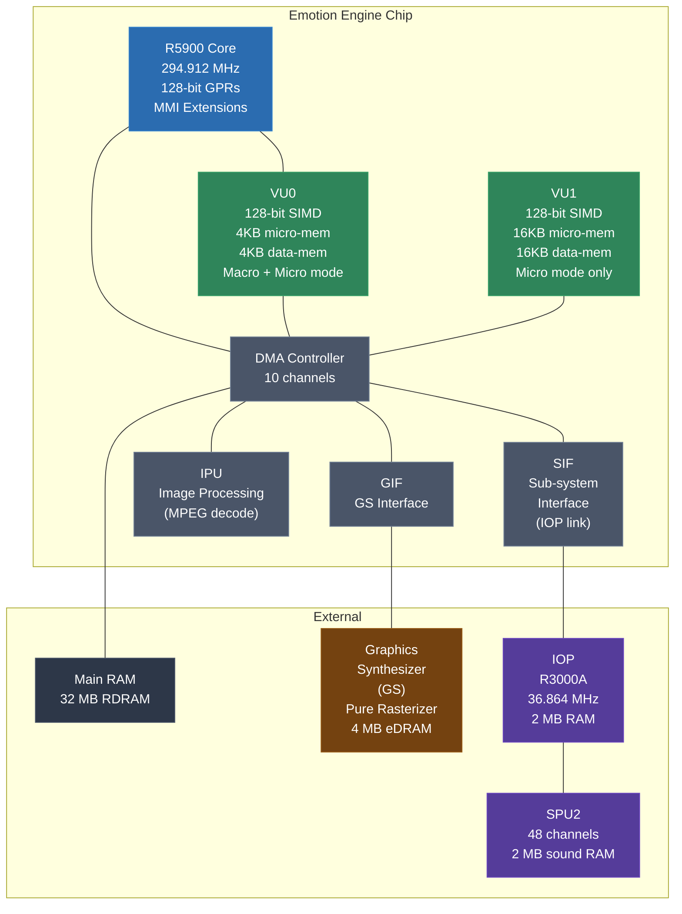
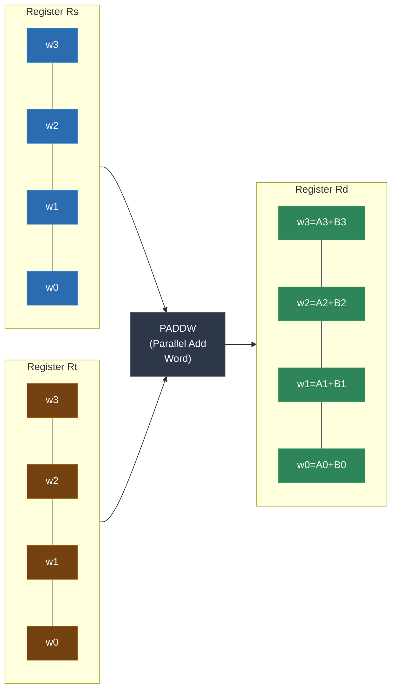
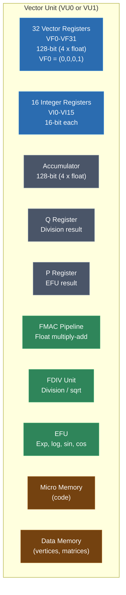
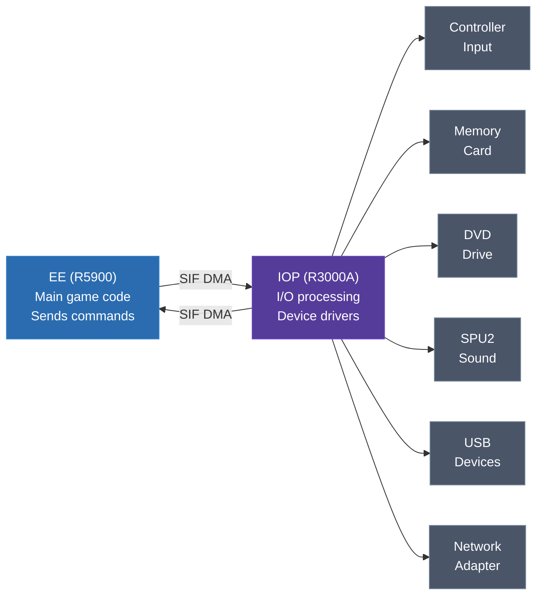
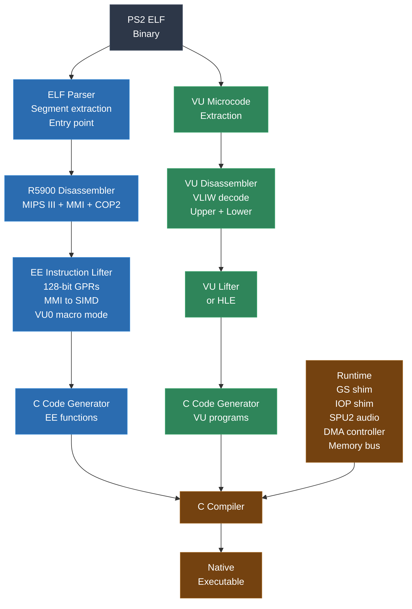
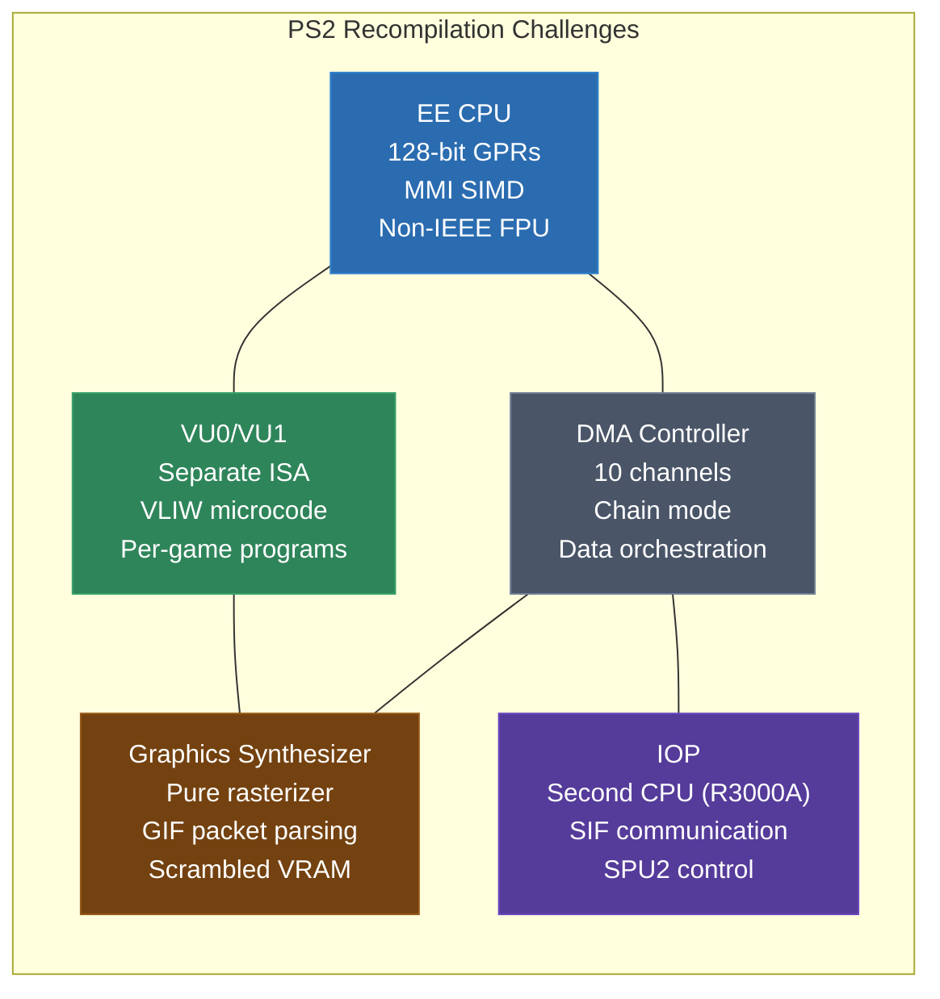

# Module 25: PS2 and Emotion Engine Recompilation

The PlayStation 2 is the most architecturally ambitious console you will encounter in this course before the PS3's Cell processor. Its Emotion Engine (EE) is not just a CPU -- it is a heterogeneous compute system on a single chip, combining a MIPS core with 128-bit extensions, two dedicated vector units with their own instruction sets, and a DMA controller that ties everything together. The Graphics Synthesizer (GS) that serves as its GPU is the opposite of what you would expect: it has no vertex transformation, no lighting, no T&L pipeline at all. It is a pure rasterizer. All the geometry math happens on the EE and its vector units. And then there is the IOP -- an entire PlayStation 1 CPU running the I/O subsystem.

If the N64 was where you learned that recompilation is more than just lifting instructions, the PS2 is where you learn that some machines are really multiple machines duct-taped together, and recompiling them means recompiling each piece and making them all talk to each other correctly.

This module covers the Emotion Engine CPU, the VU0 and VU1 vector units, the Graphics Synthesizer, the IOP, the ELF binary format, instruction lifting for the R5900's 128-bit extensions, GS shimming, VU microcode handling, and the many PS2-specific challenges that make this target uniquely difficult.

---

## 1. The PS2 Platform

The PlayStation 2 launched in 2000 and went on to become the best-selling console in history with over 155 million units sold. Its hardware was designed with raw compute throughput as the primary goal, resulting in an architecture that was powerful but notoriously difficult to program.

### System Overview

| Component | Specification |
|---|---|
| CPU | Emotion Engine (EE): MIPS R5900 core, 294.912 MHz |
| Vector Unit 0 | VU0: 128-bit SIMD, 4 KB micro-memory, 4 KB data memory |
| Vector Unit 1 | VU1: 128-bit SIMD, 16 KB micro-memory, 16 KB data memory |
| GPU | Graphics Synthesizer (GS): Pure rasterizer, 147.456 MHz |
| I/O Processor | IOP: MIPS R3000A (PS1 CPU), 36.864 MHz |
| Main RAM | 32 MB RDRAM |
| Video RAM | 4 MB embedded DRAM (in the GS) |
| IOP RAM | 2 MB |
| Sound | SPU2: 48 channels, 2 MB sound RAM |
| Byte Order | Little-endian |

The PS2 is little-endian, which is a departure from the N64 (big-endian MIPS) and a convenience for recompilation on x86/x64 hosts. However, the MIPS R5900 has many other surprises in store.



### Memory Map

The PS2's memory map is large and split across multiple subsystems:

```
PS2 EE Memory Map
===================================================================

 Address Range            Size      Description
-------------------------------------------------------------------
 0x00000000-0x01FFFFFF    32 MB     Main RAM (RDRAM)
 0x02000000-0x03FFFFFF    32 MB     Main RAM (uncached mirror)
 0x10000000-0x1000FFFF    64 KB     EE Registers (TIMER, INTC, DMAC, etc.)
 0x11000000-0x11000FFF    4 KB      VU0 Micro Memory
 0x11004000-0x11004FFF    4 KB      VU0 Data Memory
 0x11008000-0x11008FFF    16 KB     VU1 Micro Memory
 0x1100C000-0x1100FFFF    16 KB     VU1 Data Memory
 0x12000000-0x12001FFF    8 KB      GS Privileged Registers
 0x1C000000-0x1C1FFFFF    2 MB      IOP RAM (accessible from EE via SIF)
 0x1FC00000-0x1FC7FFFF    512 KB    Boot ROM (BIOS)
 0x70000000-0x70003FFF    16 KB     Scratchpad RAM (fast on-chip SRAM)
===================================================================
```

The **scratchpad RAM** at `0x70000000` is a 16 KB on-chip SRAM that the CPU can access with very low latency (1-2 cycles vs. ~20 cycles for main RDRAM). Games use it heavily as temporary storage for vertex transformation, DMA staging, and performance-critical data structures. Your memory shim needs to model scratchpad as a separate fast-access region.

### The BIOS and Kernel

Unlike the N64 and GameCube, the PS2 has a real kernel. The BIOS provides:
- Thread management (multi-threaded execution on the EE)
- Memory allocation
- File I/O (through the IOP)
- GS initialization
- Controller input (through the IOP)
- DMA management

Games link against Sony's SDK libraries, which call kernel functions through a syscall interface. The kernel runs in kernel mode; game code runs in user mode (at least in theory -- some games switch to kernel mode for performance).

For recompilation, you need to shim the kernel syscalls and SDK library functions. Sony's PS2 SDK had several versions, and games from different eras use different library versions with slightly different interfaces.

---

## 2. The R5900 CPU: MIPS with 128-Bit Extensions

The R5900 is at the heart of the Emotion Engine. It is based on the MIPS III instruction set (like the N64's VR4300), but Sony extended it in ways that make it significantly more complex to recompile.

### What is Familiar from N64

If you did Module 20 (N64 MIPS), you already know:
- 32 general-purpose registers (R0 is hardwired to zero)
- Delay slots on all branch instructions
- HI/LO registers for multiply/divide
- Load/store architecture with alignment requirements
- MIPS III instruction set (ADD, SUB, AND, OR, LW, SW, BEQ, BNE, JAL, JR, etc.)

All of this still applies. The R5900 is backward-compatible with MIPS III. Standard MIPS code works exactly as you would expect.

### What is Different: 128-Bit Registers

Here is the big change: **every general-purpose register is 128 bits wide**. Not 32 bits (N64's practical width), not 64 bits (MIPS III's architectural width), but 128 bits.

```
R5900 GPR Layout (128 bits each):
[127:96]  [95:64]  [63:32]  [31:0]
   w3       w2       w1       w0
```

Standard MIPS instructions operate on the lower 32 or 64 bits only. The upper 96 bits are accessed through Sony's custom **MMI (MultiMedia Instructions)** extension. This is essentially a SIMD instruction set that was bolted onto MIPS.

```c
typedef struct {
    // Each GPR is 128 bits
    union {
        uint128_t q;          // full 128-bit value
        uint64_t d[2];        // two 64-bit doublewords
        uint32_t w[4];        // four 32-bit words
        uint16_t h[8];        // eight 16-bit halfwords
        uint8_t  b[16];       // sixteen 8-bit bytes
        float    f[4];        // four 32-bit floats (for some MMI ops)
    } r[32];
    uint32_t pc;
    uint64_t hi, lo;         // also 64-bit on R5900
    uint64_t hi1, lo1;       // R5900 has a SECOND HI/LO pair!
    uint32_t sa;             // shift amount register (R5900-specific)
    // ... FPU registers (COP1), VU0 registers (COP2)
} R5900Context;
```

Yes, the R5900 has **two pairs of HI/LO registers** (HI/LO and HI1/LO1). Some MMI instructions write results to both pairs simultaneously. This is one of the many R5900-specific additions you need to model.

### The SA Register

The R5900 adds a **Shift Amount (SA) register**, a special-purpose register used by some funnel-shift instructions. It holds an intermediate shift amount:

```asm
MTSAB   R4, 0           ; SA = (R4 & 0xF) * 8  (byte shift amount)
QFSRV   R3, R1, R2      ; R3 = funnel shift R1:R2 right by SA bits
```

`QFSRV` is a 256-bit funnel shift (taking two 128-bit registers as a 256-bit value and shifting right). This is used for unaligned 128-bit memory access and data manipulation.

### MMI: MultiMedia Instructions

The MMI extension adds SIMD operations on the 128-bit registers. These instructions treat each register as a vector of smaller elements and operate on all elements in parallel:



Key MMI instruction categories:

**Parallel Arithmetic** -- operate on all vector lanes simultaneously:

```c
// PADDW Rd, Rs, Rt  (Parallel Add Word -- four 32-bit adds)
for (int i = 0; i < 4; i++)
    ctx->r[rd].w[i] = ctx->r[rs].w[i] + ctx->r[rt].w[i];

// PADDH Rd, Rs, Rt  (Parallel Add Halfword -- eight 16-bit adds)
for (int i = 0; i < 8; i++)
    ctx->r[rd].h[i] = ctx->r[rs].h[i] + ctx->r[rt].h[i];

// PADDB Rd, Rs, Rt  (Parallel Add Byte -- sixteen 8-bit adds)
for (int i = 0; i < 16; i++)
    ctx->r[rd].b[i] = ctx->r[rs].b[i] + ctx->r[rt].b[i];

// PSUBW, PSUBH, PSUBB -- parallel subtract variants
// PADDSW, PADDSH, PADDSB -- saturating add variants
// PSUBSW, PSUBSH, PSUBSB -- saturating subtract variants
```

**Parallel Comparison**:

```c
// PCGTW Rd, Rs, Rt  (Parallel Compare Greater Than Word)
// Sets each word lane to 0xFFFFFFFF if Rs > Rt, else 0x00000000
for (int i = 0; i < 4; i++)
    ctx->r[rd].w[i] = ((int32_t)ctx->r[rs].w[i] > (int32_t)ctx->r[rt].w[i])
                       ? 0xFFFFFFFF : 0x00000000;

// PCEQW Rd, Rs, Rt  (Parallel Compare Equal Word)
for (int i = 0; i < 4; i++)
    ctx->r[rd].w[i] = (ctx->r[rs].w[i] == ctx->r[rt].w[i])
                       ? 0xFFFFFFFF : 0x00000000;
```

**Pack/Unpack** -- convert between element sizes:

```c
// PPACW Rd, Rs, Rt  (Parallel Pack Word)
// Pack lower halfwords of each word from Rs and Rt into Rd
ctx->r[rd].w[0] = ctx->r[rt].w[0];
ctx->r[rd].w[1] = ctx->r[rt].w[2];
ctx->r[rd].w[2] = ctx->r[rs].w[0];
ctx->r[rd].w[3] = ctx->r[rs].w[2];

// PPACH Rd, Rs, Rt  (Parallel Pack Halfword)
// Pack lower bytes of each halfword
// ... similar packing pattern for halfwords
```

**Parallel Shift**:

```c
// PSLLW Rd, Rt, sa  (Parallel Shift Left Logical Word)
for (int i = 0; i < 4; i++)
    ctx->r[rd].w[i] = ctx->r[rt].w[i] << sa;

// PSRLW, PSRAW -- parallel shift right logical/arithmetic
// PSLLH, PSRLH, PSRAH -- halfword variants
```

**Quadword Load/Store**:

```c
// LQ Rt, offset(Rs)  (Load Quadword -- 128-bit aligned load)
{
    uint32_t addr = ctx->r[rs].w[0] + (int16_t)offset;
    addr &= ~0xF;  // force 16-byte alignment
    memcpy(&ctx->r[rt], ctx->mem_base + addr, 16);
}

// SQ Rt, offset(Rs)  (Store Quadword -- 128-bit aligned store)
{
    uint32_t addr = ctx->r[rs].w[0] + (int16_t)offset;
    addr &= ~0xF;
    memcpy(ctx->mem_base + addr, &ctx->r[rt], 16);
}
```

### Lifting MMI to C with SIMD Intrinsics

The MMI instructions map naturally to modern SIMD intrinsics (SSE on x86, NEON on ARM). This is one of the rare cases where the recompiled code can actually be *faster* than naive C, because you are translating one SIMD ISA to another:

```c
// PADDW Rd, Rs, Rt  -- using SSE2
#include <emmintrin.h>

__m128i rs_val = _mm_load_si128((__m128i*)&ctx->r[rs]);
__m128i rt_val = _mm_load_si128((__m128i*)&ctx->r[rt]);
__m128i result = _mm_add_epi32(rs_val, rt_val);
_mm_store_si128((__m128i*)&ctx->r[rd], result);

// PADDH Rd, Rs, Rt  -- using SSE2
__m128i result = _mm_add_epi16(rs_val, rt_val);

// PADDB Rd, Rs, Rt  -- using SSE2
__m128i result = _mm_add_epi8(rs_val, rt_val);

// PCGTW Rd, Rs, Rt  -- using SSE2
__m128i result = _mm_cmpgt_epi32(rs_val, rt_val);

// PCEQW Rd, Rs, Rt  -- using SSE2
__m128i result = _mm_cmpeq_epi32(rs_val, rt_val);

// PSLLW Rd, Rt, sa  -- using SSE2
__m128i result = _mm_slli_epi32(rt_val, sa);
```

If your target host does not have SSE2 (unlikely for any modern x86 system, but possible on ARM without NEON), you fall back to the scalar loop version. Either way, the lifted code is correct.

### R5900 vs. N64's VR4300: Key Differences

If you are coming from Module 20, here is what changes:

| Feature | VR4300 (N64) | R5900 (PS2) |
|---|---|---|
| GPR width | 64-bit (32-bit in practice) | 128-bit |
| Byte order | Big-endian | Little-endian |
| SIMD extensions | None | MMI (128-bit parallel ops) |
| HI/LO registers | 1 pair | 2 pairs (HI/LO + HI1/LO1) |
| FPU | 32 64-bit FPRs | 32 32-bit FPRs (single precision only!) |
| Clock speed | 93.75 MHz | 294.912 MHz |
| Coprocessor 2 | RCP (external) | VU0 (on-die, dual-use) |
| 128-bit loads | N/A | LQ/SQ instructions |
| Shift amount register | N/A | SA register |
| TLB | 32 entries | 48 entries |

A critical surprise: the R5900's FPU is **single-precision only**. Despite having 128-bit GPRs, the floating-point unit handles only 32-bit floats. There is no double-precision support. Games that need higher precision must use software emulation or integer math. This is unusual for a MIPS implementation and catches people off guard.

The FPU also has some non-standard behavior:
- Denormalized numbers are flushed to zero
- Rounding is always "round toward zero" (not IEEE 754 default of "round to nearest")
- Some edge cases (NaN handling, infinity) differ from IEEE 754

These deviations mean that using standard C `float` operations on your host might produce slightly different results. For most games this does not matter, but physics-heavy games can diverge if you do not replicate the R5900's exact FPU behavior.

### COP1 (FPU) Instructions

The R5900's FPU is accessed as Coprocessor 1 (COP1), same as standard MIPS. But it only supports single-precision:

```c
// ADD.S fd, fs, ft  (single-precision float add)
ctx->fpr[fd] = ctx->fpr[fs] + ctx->fpr[ft];

// SUB.S fd, fs, ft
ctx->fpr[fd] = ctx->fpr[fs] - ctx->fpr[ft];

// MUL.S fd, fs, ft
ctx->fpr[fd] = ctx->fpr[fs] * ctx->fpr[ft];

// DIV.S fd, fs, ft
if (ctx->fpr[ft] != 0.0f)
    ctx->fpr[fd] = ctx->fpr[fs] / ctx->fpr[ft];
else
    ctx->fpr[fd] = 0.0f;  // R5900 flushes div-by-zero to 0, not infinity!

// SQRT.S fd, ft
ctx->fpr[fd] = sqrtf(ctx->fpr[ft]);

// ABS.S fd, fs
ctx->fpr[fd] = fabsf(ctx->fpr[fs]);

// NEG.S fd, fs
ctx->fpr[fd] = -ctx->fpr[fs];

// C.EQ.S fs, ft  (compare, set FPU condition bit)
ctx->fpu_cond = (ctx->fpr[fs] == ctx->fpr[ft]);

// C.LT.S fs, ft
ctx->fpu_cond = (ctx->fpr[fs] < ctx->fpr[ft]);

// C.LE.S fs, ft
ctx->fpu_cond = (ctx->fpr[fs] <= ctx->fpr[ft]);

// BC1T target  (branch if FPU condition true)
// (standard MIPS delay slot applies)
if (ctx->fpu_cond) goto target;

// BC1F target  (branch if FPU condition false)
if (!ctx->fpu_cond) goto target;

// CVT.W.S fd, fs  (convert float to integer, truncate toward zero)
ctx->fpr_int[fd] = (int32_t)ctx->fpr[fs];

// CVT.S.W fd, fs  (convert integer to float)
ctx->fpr[fd] = (float)ctx->fpr_int[fs];

// MFC1 Rt, fs  (move from FPU to GPR -- bit copy)
memcpy(&ctx->r[rt].w[0], &ctx->fpr[fs], 4);

// MTC1 Rt, fd  (move from GPR to FPU -- bit copy)
memcpy(&ctx->fpr[fd], &ctx->r[rt].w[0], 4);

// LWC1 ft, offset(Rs)  (load word to FPU)
{
    uint32_t addr = ctx->r[rs].w[0] + (int16_t)offset;
    uint32_t raw = mem_read_u32(ctx, addr);
    memcpy(&ctx->fpr[ft], &raw, 4);
}

// SWC1 ft, offset(Rs)  (store word from FPU)
{
    uint32_t addr = ctx->r[rs].w[0] + (int16_t)offset;
    uint32_t raw;
    memcpy(&raw, &ctx->fpr[ft], 4);
    mem_write_u32(ctx, addr, raw);
}
```

The div-by-zero behavior is important: the R5900 returns 0.0 (or a large value, depending on the implementation) rather than IEEE infinity. If your C code generates infinity and the game later uses that value in arithmetic, you get NaN propagation that does not happen on real hardware. This has caused real bugs in PS2 emulators.

### MADD and MSUB (R5900 Extensions)

The R5900 adds multiply-add and multiply-subtract instructions to the base MIPS FPU:

```c
// MADD.S fd, fs, ft  (ACC = ACC + fs * ft; fd = ACC)
ctx->fpu_acc += ctx->fpr[fs] * ctx->fpr[ft];
ctx->fpr[fd] = ctx->fpu_acc;

// MSUB.S fd, fs, ft  (ACC = ACC - fs * ft; fd = ACC)
ctx->fpu_acc -= ctx->fpr[fs] * ctx->fpr[ft];
ctx->fpr[fd] = ctx->fpu_acc;

// MADDA.S fs, ft  (ACC = ACC + fs * ft; result stays in ACC)
ctx->fpu_acc += ctx->fpr[fs] * ctx->fpr[ft];

// MSUBA.S fs, ft
ctx->fpu_acc -= ctx->fpr[fs] * ctx->fpr[ft];

// MULA.S fs, ft  (ACC = fs * ft)
ctx->fpu_acc = ctx->fpr[fs] * ctx->fpr[ft];
```

These accumulator-based FPU instructions are the R5900's approach to fused multiply-add. The accumulator pattern (MULA + MADDA + MADDA + MADD) is used for dot products and matrix multiplication on the EE core when VU0 is not being used.

---

## 3. VU0 and VU1: Vector Units

The vector units are where the PS2 does its heavy geometric lifting. They are dedicated SIMD processors designed for vertex transformation, lighting, clipping, skinning, and particle effects. Understanding them is critical because a significant portion of the game's compute work happens here -- and they have their own instruction set.

### VU Architecture

Each VU has:
- **32 floating-point vector registers (VF0-VF31)**: Each is 128 bits (4 x 32-bit floats: x, y, z, w)
- **16 integer registers (VI0-VI15)**: Each is 16 bits
- **Micro memory**: Instruction storage (4 KB for VU0, 16 KB for VU1)
- **Data memory (VU Mem)**: Data storage (4 KB for VU0, 16 KB for VU1)
- **Q register**: For division/square root results
- **P register**: For EFU (Elementary Function Unit) results
- **ACC register**: Accumulator for multiply-accumulate
- **Status flags**: Overflow, underflow, zero, sign, etc.

VF0 is special: its x, y, z components are always 0.0, and its w component is always 1.0. This is the equivalent of MIPS R0 being zero but for vectors.



### Macro Mode vs. Micro Mode

VU0 can operate in two modes:

**Macro Mode**: VU0 is accessed as COP2 (Coprocessor 2) from the main R5900 CPU. The R5900 issues COP2 instructions that execute on VU0. This is inline -- the VU0 instruction executes as part of the R5900's instruction stream, and the R5900 stalls until the VU0 instruction completes.

```asm
; R5900 code using VU0 in macro mode (COP2 instructions)
VADD.xyzw  VF3, VF1, VF2       ; VF3 = VF1 + VF2 (4-component vector add)
VMUL.xyz   VF4, VF1, VF2       ; VF4.xyz = VF1.xyz * VF2.xyz (3-component multiply)
VDIV       Q, VF1x, VF2y       ; Q = VF1.x / VF2.y
```

For recompilation, macro mode COP2 instructions are handled like any other R5900 instruction -- they are part of the main instruction stream and can be lifted directly:

```c
// VADD.xyzw VF3, VF1, VF2
ctx->vf[3].x = ctx->vf[1].x + ctx->vf[2].x;
ctx->vf[3].y = ctx->vf[1].y + ctx->vf[2].y;
ctx->vf[3].z = ctx->vf[1].z + ctx->vf[2].z;
ctx->vf[3].w = ctx->vf[1].w + ctx->vf[2].w;

// VMUL.xyz VF4, VF1, VF2  (only x, y, z components -- w unchanged)
ctx->vf[4].x = ctx->vf[1].x * ctx->vf[2].x;
ctx->vf[4].y = ctx->vf[1].y * ctx->vf[2].y;
ctx->vf[4].z = ctx->vf[1].z * ctx->vf[2].z;
// ctx->vf[4].w is not modified
```

**Micro Mode**: VU0 or VU1 runs a self-contained program from its micro memory, independently of the R5900. The R5900 uploads a microprogram (VU microcode) into VU micro memory, uploads data into VU data memory, and then kicks off execution. The VU runs until it hits a special stop instruction, at which point results are in VU data memory (or have been sent to the GIF/GS via VU1's XGKICK instruction).

```asm
; R5900 code uploading and starting VU1 microcode
; Load microcode into VU1 micro memory at 0x11008000
; Load vertex data into VU1 data memory at 0x1100C000
; Start VU1 execution:
CTC2    R0, vi27           ; clear VU1 status
VCALLMS 0                  ; start VU1 microcode at address 0
```

Micro mode is where things get really challenging for recompilation. We will come back to this.

### VU Instruction Set

VU instructions come in pairs -- each VU clock cycle executes **two instructions simultaneously**:
- **Upper instruction**: Floating-point operation (FMAC: add, multiply, multiply-add, etc.)
- **Lower instruction**: Integer, memory access, branch, or special operation

This is a VLIW (Very Long Instruction Word) design. Each instruction pair is 64 bits:

```
VU Instruction Pair (64 bits):
[63:32] = Upper instruction (FMAC operation)
[31: 0] = Lower instruction (integer/memory/branch)
```

Upper instruction examples:

```c
// VADDi.xyzw VF3, VF1, I  (add I register broadcast to all components)
ctx->vf[3].x = ctx->vf[1].x + ctx->I;
ctx->vf[3].y = ctx->vf[1].y + ctx->I;
ctx->vf[3].z = ctx->vf[1].z + ctx->I;
ctx->vf[3].w = ctx->vf[1].w + ctx->I;

// VMUL.xyzw VF4, VF1, VF2
ctx->vf[4].x = ctx->vf[1].x * ctx->vf[2].x;
ctx->vf[4].y = ctx->vf[1].y * ctx->vf[2].y;
ctx->vf[4].z = ctx->vf[1].z * ctx->vf[2].z;
ctx->vf[4].w = ctx->vf[1].w * ctx->vf[2].w;

// VMADD.xyzw VF5, VF1, VF2  (ACC + VF1 * VF2)
ctx->vf[5].x = ctx->acc.x + ctx->vf[1].x * ctx->vf[2].x;
ctx->vf[5].y = ctx->acc.y + ctx->vf[1].y * ctx->vf[2].y;
ctx->vf[5].z = ctx->acc.z + ctx->vf[1].z * ctx->vf[2].z;
ctx->vf[5].w = ctx->acc.w + ctx->vf[1].w * ctx->vf[2].w;

// VMULAx.xyzw ACC, VF1, VF2x  (ACC = VF1 * VF2.x broadcast)
ctx->acc.x = ctx->vf[1].x * ctx->vf[2].x;
ctx->acc.y = ctx->vf[1].y * ctx->vf[2].x;
ctx->acc.z = ctx->vf[1].z * ctx->vf[2].x;
ctx->acc.w = ctx->vf[1].w * ctx->vf[2].x;
```

Lower instruction examples:

```c
// IADDIU VI3, VI1, imm  (integer add immediate unsigned)
ctx->vi[3] = ctx->vi[1] + imm;

// ILW.x VI3, offset(VI1)  (integer load word from VU data memory)
uint32_t addr = (ctx->vi[1] + offset) * 16;  // VU memory is 128-bit addressed
ctx->vi[3] = *(uint32_t*)(vu_data_mem + addr);

// XGKICK VI1  (transfer data from VU1 data memory to GIF)
// This sends geometry data to the GS for rendering
gif_transfer(vu_data_mem + ctx->vi[1] * 16, transfer_size);

// B target  (branch)
goto target;

// BAL VI15, target  (branch and link -- VI15 = return address)
ctx->vi[15] = current_pc + 2;  // +2 because of delay slot
goto target;
```

### Component Masking

A key feature of VU instructions is **component masking** (also called "destination masking" or "write masking"). Each instruction specifies which of the four components (x, y, z, w) are affected. Unmasked components remain unchanged:

```asm
VADD.xy  VF3, VF1, VF2     ; only x and y components are modified
                             ; z and w of VF3 remain unchanged
VMUL.w   VF4, VF1, VF2     ; only w component is modified
VADD.xyzw VF5, VF1, VF2    ; all four components modified
```

This is heavily used for matrix multiplication, where you build up a result component by component:

```asm
; Matrix-vector multiply: result = M * v
; M is stored column-major in VF10-VF13
; v is in VF1
; Result goes to VF2

VMULAx.xyzw  ACC, VF10, VF1x     ; ACC = M.col0 * v.x
VMADDAy.xyzw ACC, VF11, VF1y     ; ACC += M.col1 * v.y
VMADDAz.xyzw ACC, VF12, VF1z     ; ACC += M.col2 * v.z
VMADDw.xyzw  VF2, VF13, VF1w     ; VF2 = ACC + M.col3 * v.w
```

This four-instruction sequence is the standard PS2 matrix-vector multiply. You will see it everywhere in PS2 game code.

### VU Special Registers and Instructions

Beyond the basic arithmetic, the VU has several special-purpose instructions and registers:

**Q Register (division/sqrt result)**:
```c
// VDIV Q, VFs.x, VFt.y  (Q = VFs.x / VFt.y, takes 7 cycles)
ctx->q = ctx->vf[vs].x / ctx->vf[vt].y;

// VRSQRT Q, VFs.x, VFt.y  (Q = VFs.x / sqrt(VFt.y), takes 13 cycles)
ctx->q = ctx->vf[vs].x / sqrtf(ctx->vf[vt].y);

// VSQRT Q, VFt.y  (Q = sqrt(VFt.y), takes 7 cycles)
ctx->q = sqrtf(ctx->vf[vt].y);

// VMULq.xyzw VFd, VFs, Q  (multiply by Q)
ctx->vf[vd].x = ctx->vf[vs].x * ctx->q;
ctx->vf[vd].y = ctx->vf[vs].y * ctx->q;
ctx->vf[vd].z = ctx->vf[vs].z * ctx->q;
ctx->vf[vd].w = ctx->vf[vs].w * ctx->q;
```

**I Register (immediate float)**:
```c
// LOI imm  (load immediate float into I register)
// The immediate is embedded in the lower instruction slot
ctx->I = *(float *)&imm;

// VADDi.xyzw VFd, VFs, I  (add I broadcast to all components)
ctx->vf[vd].x = ctx->vf[vs].x + ctx->I;
ctx->vf[vd].y = ctx->vf[vs].y + ctx->I;
ctx->vf[vd].z = ctx->vf[vs].z + ctx->I;
ctx->vf[vd].w = ctx->vf[vs].w + ctx->I;
```

**Clip Flag**:
```c
// VCLIP VFs, VFt  (clip test: compare VFs.xyz against +/- VFt.w)
{
    float w = fabsf(ctx->vf[vt].w);
    uint32_t flags = 0;
    if (ctx->vf[vs].x > w)  flags |= 0x01;  // +x
    if (ctx->vf[vs].x < -w) flags |= 0x02;  // -x
    if (ctx->vf[vs].y > w)  flags |= 0x04;  // +y
    if (ctx->vf[vs].y < -w) flags |= 0x08;  // -y
    if (ctx->vf[vs].z > w)  flags |= 0x10;  // +z
    if (ctx->vf[vs].z < -w) flags |= 0x20;  // -z
    // Clip flag is shifted left and ORed in (accumulates over 4 vertices)
    ctx->clip_flag = (ctx->clip_flag << 6) | flags;
}

// FCGET VI1  (read clip flag into integer register)
ctx->vi[1] = ctx->clip_flag & 0xFFFFFF;
```

The clip flag is used for frustum clipping. Games submit 4 vertices, accumulate clip flags, then check if all four vertices are outside the same plane (indicating the triangle is completely off-screen and can be culled).

### VU Data Memory Layout

VU data memory is organized in 128-bit (16-byte) rows. Both loads and stores operate at this granularity. A typical data memory layout for a vertex transformation microprogram:

```
VU1 Data Memory Layout (example)
===================================================================

 Row     Content                    Size
-------------------------------------------------------------------
 0-3     Model-view-projection      4 rows (4x4 matrix)
         matrix                     = 64 bytes

 4-7     Normal matrix              4 rows (4x4 matrix)

 8       Light direction            1 row (4 floats)
 9       Light color                1 row (4 floats)
 10      Ambient color              1 row (4 floats)

 11-N    Input vertices             Variable (position + normal +
                                    texcoord + color per vertex)

 N+1-M   Output vertices            GIF-ready packets with
                                    GIF tags + RGBAQ + ST + XYZ2

 M+1     GIF tag for kick           1 row
===================================================================
```

The EE uploads input data to VU data memory via DMA, starts the VU microprogram, and the program transforms vertices in-place (or writes output to a separate area). When done, `XGKICK` sends the output directly to the GIF/GS.

---

## 4. The Graphics Synthesizer (GS)

The GS is unlike any other GPU you have encountered in this course. It is a **pure rasterizer** -- it draws pixels. That is all. There is no vertex transformation, no lighting computation, no clipping, no T&L pipeline. All geometry processing happens on the EE's CPU and vector units.

### What the GS Does

The GS receives pre-transformed, screen-space primitives through the **GIF (GS Interface)** and rasterizes them:

- Triangle rasterization with Gouraud shading
- Texture mapping (bilinear filtering, mipmapping)
- Alpha blending
- Depth testing
- Fog
- Anti-aliasing (multisampling)

It has 4 MB of embedded DRAM that holds the framebuffer, Z-buffer, textures, and CLUT (color look-up table) data. The eDRAM provides extremely high bandwidth (48 GB/s) but is relatively small.

### GIF Interface and GS Packets

Data reaches the GS through GIF packets. A GIF packet is a stream of 128-bit quadwords containing register writes and vertex data. The packet header specifies the format:

```c
// GIF tag (64-bit, but packed into a 128-bit quadword)
typedef struct {
    uint64_t NLOOP  : 15;  // number of loop iterations
    uint64_t EOP    : 1;   // end of packet
    uint64_t pad    : 30;
    uint64_t PRE    : 1;   // PRIM field enable
    uint64_t PRIM   : 11;  // primitive type and attributes
    uint64_t FLG    : 2;   // data format (PACKED, REGLIST, IMAGE)
    uint64_t NREG   : 4;   // number of register descriptors
    uint64_t REGS   : 64;  // register descriptors (4 bits each, up to 16)
} GIFTag;

// PRIM register values
#define GS_PRIM_POINT        0
#define GS_PRIM_LINE         1
#define GS_PRIM_LINE_STRIP   2
#define GS_PRIM_TRIANGLE     3
#define GS_PRIM_TRI_STRIP    4
#define GS_PRIM_TRI_FAN      5
#define GS_PRIM_SPRITE       6  // axis-aligned rectangle
```

GIF packets are submitted through DMA transfers from main RAM (or VU1 data memory) to the GIF. The DMA controller handles the actual data movement.

### GS Registers

The GS has a set of registers that control rendering state:

| Register | Purpose |
|---|---|
| PRIM | Primitive type and attributes (shading, texture, fog, etc.) |
| RGBAQ | Vertex color (R, G, B, A, Q for perspective-correct texturing) |
| ST | Texture coordinates (S, T) |
| UV | Texture coordinates (integer fixed-point) |
| XYZ2/XYZ3 | Vertex position (fixed-point screen coordinates) |
| TEX0 | Texture base pointer, format, width, height |
| TEX1 | Texture filtering (LOD, magnification, minification) |
| CLAMP | Texture coordinate clamping/wrapping |
| ALPHA | Alpha blending equation |
| TEST | Pixel test (alpha test, depth test, destination alpha) |
| FRAME | Framebuffer address, width, pixel format |
| ZBUF | Z-buffer address, format |
| SCISSOR | Scissor rectangle |

Vertices are submitted by writing to XYZ2 (or XYZ3). When a sufficient number of vertices have been submitted for the current primitive type (3 for triangles, 2 for lines, etc.), the GS rasterizes the primitive automatically. There is no explicit "draw" command -- the act of submitting the last vertex triggers rasterization.

### GIF Packet Parsing for Shimming

Your graphics shim needs to intercept GIF packets (either by intercepting the DMA transfer or by hooking the GIF interface) and translate them into modern draw calls:

```c
void process_gif_packet(uint8_t *data, size_t size) {
    uint8_t *ptr = data;

    while (ptr < data + size) {
        GIFTag tag;
        memcpy(&tag, ptr, sizeof(GIFTag));
        ptr += 16;  // GIF tag is 128 bits

        if (tag.FLG == 0) {
            // PACKED format: each register gets a 128-bit packed value
            for (int loop = 0; loop < tag.NLOOP; loop++) {
                for (int reg = 0; reg < tag.NREG; reg++) {
                    uint8_t reg_id = (tag.REGS >> (reg * 4)) & 0xF;
                    process_gs_register(reg_id, ptr);
                    ptr += 16;
                }
            }
        }
        else if (tag.FLG == 1) {
            // REGLIST format: each register gets a 64-bit value
            for (int loop = 0; loop < tag.NLOOP; loop++) {
                for (int reg = 0; reg < tag.NREG; reg++) {
                    uint8_t reg_id = (tag.REGS >> (reg * 4)) & 0xF;
                    process_gs_register_64(reg_id, ptr);
                    ptr += 8;
                }
            }
            // Align to 128 bits
            if ((tag.NLOOP * tag.NREG) & 1) ptr += 8;
        }
        else if (tag.FLG == 2) {
            // IMAGE format: raw pixel data transfer to GS local memory
            size_t image_size = tag.NLOOP * 16;
            process_gs_image_transfer(ptr, image_size);
            ptr += image_size;
        }

        if (tag.EOP) break;
    }
}

void process_gs_register(uint8_t reg_id, uint8_t *data) {
    switch (reg_id) {
        case 0x00: // PRIM
            gs_set_prim(*(uint64_t*)data);
            break;
        case 0x01: // RGBAQ
            gs_set_color(data);
            break;
        case 0x02: // ST
            gs_set_texcoord_st(data);
            break;
        case 0x04: // XYZ2 (vertex with drawing kick)
            gs_submit_vertex(data);
            break;
        case 0x05: // XYZ3 (vertex without drawing kick)
            gs_set_vertex_no_draw(data);
            break;
        case 0x06: // TEX0
            gs_set_texture(data);
            break;
        // ... more registers
    }
}
```

### Coordinate System

The GS uses fixed-point screen coordinates. Vertex positions in XYZ2/XYZ3 are specified as:
- X and Y: 12.4 fixed-point (12 integer bits + 4 fractional bits), relative to a configurable offset
- Z: 24-bit or 32-bit unsigned integer (depending on ZBUF format)

The offset is set via the XYOFFSET register. Games typically set it to center the drawing area.

For shimming, you need to convert these fixed-point screen coordinates to the floating-point NDC (Normalized Device Coordinates) your modern GPU expects:

```c
void gs_submit_vertex(uint8_t *data) {
    uint32_t x_fixed = *(uint32_t*)(data + 0) & 0xFFFF;
    uint32_t y_fixed = *(uint32_t*)(data + 4) & 0xFFFF;
    uint32_t z = *(uint32_t*)(data + 8);

    // Convert 12.4 fixed-point to float, subtract offset
    float x = (float)(x_fixed - gs_state.x_offset) / 16.0f;
    float y = (float)(y_fixed - gs_state.y_offset) / 16.0f;

    // Convert to NDC
    float ndc_x = (x / gs_state.width) * 2.0f - 1.0f;
    float ndc_y = 1.0f - (y / gs_state.height) * 2.0f;
    float ndc_z = (float)z / (float)((1u << gs_state.z_bits) - 1);

    add_vertex_to_batch(ndc_x, ndc_y, ndc_z, gs_state.current_color,
                        gs_state.current_texcoord);
}
```

### Alpha Blending

The GS has a unique alpha blending equation. Instead of the standard `src * srcFactor + dst * dstFactor`, the GS uses:

```
output = ((A - B) * C >> 7) + D
```

Where A, B, C, and D are selected from:
- A: source RGB, destination RGB, or zero
- B: source RGB, destination RGB, or zero
- C: source alpha, destination alpha, FIX value, or zero
- D: source RGB, destination RGB, or zero

This three-term formula is more flexible than standard blending but maps differently to modern GPU blending modes:

```c
// ALPHA register: A=0(src), B=1(dst), C=0(src_alpha), D=1(dst)
// = ((src - dst) * src_alpha >> 7) + dst
// = src * src_alpha + dst * (1 - src_alpha)  (standard alpha blend!)

// Common blending modes and their GL equivalents:
void apply_gs_alpha_blend(int A, int B, int C, int D, uint8_t FIX) {
    if (A == 0 && B == 1 && C == 0 && D == 1) {
        // Standard alpha blend
        glBlendFunc(GL_SRC_ALPHA, GL_ONE_MINUS_SRC_ALPHA);
    }
    else if (A == 0 && B == 2 && C == 0 && D == 1) {
        // Additive blend (src * src_alpha + dst)
        glBlendFunc(GL_SRC_ALPHA, GL_ONE);
    }
    else if (A == 0 && B == 1 && C == 2 && D == 1) {
        // Fixed alpha blend: ((src - dst) * FIX/128) + dst
        float fix_factor = FIX / 128.0f;
        glBlendColor(fix_factor, fix_factor, fix_factor, fix_factor);
        glBlendFunc(GL_CONSTANT_ALPHA, GL_ONE_MINUS_CONSTANT_ALPHA);
    }
    else {
        // Complex blend -- may need shader-based blending
        // or approximate with closest standard mode
        fprintf(stderr, "Unsupported blend: A=%d B=%d C=%d D=%d FIX=%d\n",
                A, B, C, D, FIX);
    }
}
```

Some GS alpha blending configurations do not map to any standard GL/D3D blend mode. For these, you may need to use shader-based blending (read the framebuffer in the shader and compute the blend manually). This is slower but correct.

### Render-to-Texture

The GS can render to any region of its 4 MB eDRAM. Games use this for:
- Shadow mapping (render the scene from the light's perspective)
- Environment mapping (render cubemap faces)
- Post-processing (render to a texture, then draw a full-screen quad with the texture, applying effects)
- Mini-maps (render a top-down view to a texture, display it in the UI)

To implement render-to-texture in your shim:

1. When the game changes the FRAME register to point to a different eDRAM address, create (or reuse) a framebuffer object targeting that region
2. When a TEX0 register references an eDRAM address that was previously used as a render target, bind the framebuffer texture instead of decoding from eDRAM

```c
// Track render targets
typedef struct {
    uint32_t gs_addr;      // GS eDRAM address (FBP)
    int width, height;
    uint32_t fbo_id;       // OpenGL framebuffer object
    uint32_t tex_id;       // OpenGL texture attached to FBO
} RenderTarget;

RenderTarget render_targets[32];
int num_render_targets = 0;

void gs_set_frame(uint32_t fbp, uint8_t fbw, uint8_t psm) {
    uint32_t gs_addr = fbp * 2048;  // FBP is in 2048-byte units

    // Check if this is a known render target
    for (int i = 0; i < num_render_targets; i++) {
        if (render_targets[i].gs_addr == gs_addr) {
            bind_framebuffer(render_targets[i].fbo_id);
            return;
        }
    }

    // New render target
    if (gs_addr != main_framebuffer_addr) {
        RenderTarget *rt = &render_targets[num_render_targets++];
        rt->gs_addr = gs_addr;
        rt->width = fbw * 64;
        rt->height = 256;  // estimate, may need adjustment
        create_fbo(&rt->fbo_id, &rt->tex_id, rt->width, rt->height);
        bind_framebuffer(rt->fbo_id);
    } else {
        bind_framebuffer(0);  // default framebuffer
    }
}

uint32_t gs_get_texture(uint32_t tbp) {
    uint32_t gs_addr = tbp * 256;  // TBP is in 256-byte units

    // Check if this texture address is a render target
    for (int i = 0; i < num_render_targets; i++) {
        if (render_targets[i].gs_addr == gs_addr) {
            return render_targets[i].tex_id;  // use FBO texture
        }
    }

    // Normal texture -- decode from simulated eDRAM
    return decode_gs_texture(gs_addr);
}
```

### GS Texture Formats

The GS supports several texture formats stored in its 4 MB eDRAM:

| Format | Description | BPP |
|---|---|---|
| PSMCT32 | 32-bit RGBA | 32 |
| PSMCT24 | 24-bit RGB (packed into 32-bit) | 32 |
| PSMCT16 | 16-bit RGBA (5:5:5:1) | 16 |
| PSMCT16S | 16-bit RGBA (signed, swapped) | 16 |
| PSMT8 | 8-bit palettized | 8 |
| PSMT4 | 4-bit palettized | 4 |
| PSMT8H | 8-bit palettized (from high bits of 32-bit) | 32 |
| PSMT4HL/HH | 4-bit palettized (from high/low nibble) | 32 |
| PSMZ32 | 32-bit Z-buffer | 32 |
| PSMZ24 | 24-bit Z-buffer | 32 |
| PSMZ16 | 16-bit Z-buffer | 16 |

The GS uses a **block/page/column** memory organization that is not linear. Texture data stored in GS memory is scrambled according to the pixel format. When uploading textures from main RAM (via GIF IMAGE transfers), the GS hardware handles the scrambling automatically. But when reading back textures or analyzing GS memory dumps, you need to understand the layout:

```c
// GS memory is organized in 8192-byte pages (32x64 pixels for PSMCT32)
// Within a page, pixels are arranged in columns and blocks

uint32_t gs_address_psmct32(int x, int y, int buffer_width) {
    // Simplified -- actual GS address calculation involves
    // page, block, column, and pixel lookups
    int page = (x / 64) + (y / 32) * (buffer_width / 64);
    int block = block_table_32[y % 32 / 8][x % 64 / 8];
    int column = y % 8;
    int pixel = x % 8;
    return page * 8192 + block * 256 + column * 32 + pixel * 4;
}
```

This scrambled layout means that when your shim needs to read back a texture from simulated GS memory (for example, for render-to-texture effects), you need to un-scramble it.

---

## 5. The IOP: PlayStation 1 Inside PlayStation 2

Here is one of the PS2's strangest design decisions: the I/O Processor is literally a **PlayStation 1 CPU** -- a MIPS R3000A running at 36.864 MHz with 2 MB of RAM. Sony repurposed the PS1's CPU to handle all I/O for the PS2:

- Controller input
- Memory card access
- USB
- Hard disk (if installed)
- Network (if adapter installed)
- DVD/CD drive control
- Sound (SPU2)
- IEEE 1394 (FireWire)

### IOP Architecture

The IOP runs its own programs (IOP modules, analogous to device drivers) loaded from the disc or from the PS2 BIOS. These modules are IRX (IOP Relocatable Executable) files -- PS1-style MIPS executables with relocation tables.

The EE and IOP communicate through the **SIF (Sub-system Interface)**, a DMA-based message passing system. The EE sends commands to the IOP, and the IOP sends data back:



### Handling the IOP in Recompilation

You have three strategies for dealing with the IOP:

**Option 1: Stub IOP calls.** Intercept SIF commands from the EE side and provide fake responses. This works for simple I/O:

```c
// When the EE sends a "read controller" SIF command:
void shim_sif_pad_read(R5900Context *ctx, uint32_t port) {
    // Read host controller state via SDL2
    SDL_GameControllerUpdate();
    PadState state = read_host_controller(port);

    // Write PS2 pad data to the EE's expected buffer
    PS2PadData pad;
    pad.buttons = map_buttons(state);
    pad.analog_lx = state.left_x;
    pad.analog_ly = state.left_y;
    pad.analog_rx = state.right_x;
    pad.analog_ry = state.right_y;

    memcpy(ctx->mem_base + ctx->pad_buffer_addr, &pad, sizeof(pad));
}
```

This is the simplest approach and works well for:
- Controller input
- Memory card (save/load)
- DVD file reading (redirect to host filesystem)

**Option 2: Recompile IOP code too.** Build a second recompilation pipeline for the R3000A (MIPS I) code running on the IOP. This is more work but gives you accurate behavior for:
- Custom IOP modules (some games write their own IOP drivers)
- SPU2 sound (the IOP controls the SPU2 directly)
- Timing-sensitive I/O

Since the R3000A is a simpler MIPS than the R5900 (32-bit only, no MMI, no 128-bit), the IOP recompiler is actually quite straightforward if you already have a MIPS lifter.

**Option 3: Run the IOP in an interpreter.** Since the IOP runs at only 36.864 MHz and its code is relatively simple, interpreting it in real-time is feasible on modern hardware. This is what most PS2 emulators do.

For most recompilation projects, Option 1 (stubbing) combined with Option 3 (interpreting SPU2 code) gives the best effort-to-quality ratio. You get correct I/O behavior without the complexity of a second full recompilation pipeline.

### SPU2 Audio

The SPU2 is the PS2's sound processor. It is controlled by the IOP (not the EE) and provides:
- 48 ADPCM voice channels
- 2 MB sound RAM
- Hardware reverb effects
- DMA streaming from main RAM (via IOP)

For recompilation, audio handling typically goes through the IOP shim. The EE sends high-level audio commands through SIF (play sound effect, start music stream, set volume), the IOP processes them, and the SPU2 plays audio.

Your shim intercepts the high-level audio commands and translates them to host audio API calls:

```c
// Intercept "play ADPCM sample" SIF command
void shim_spu2_play_voice(int channel, uint32_t sample_addr,
                          uint32_t loop_addr, int volume, int pitch) {
    // Decode PS2 ADPCM (VAG format) from sound RAM
    int16_t *pcm = decode_vag(spu2_ram + sample_addr, &sample_length);

    // Submit to host audio mixer
    host_audio_play_channel(channel, pcm, sample_length,
                           ps2_pitch_to_hz(pitch), volume);
}
```

The PS2's ADPCM format is called **VAG** (not to be confused with "vague" -- it is a Sony format name). Each block is 16 bytes containing a 1-byte header (shift/filter/flags) and 14 bytes of packed 4-bit ADPCM samples.

Here is a VAG decoder:

```c
// VAG ADPCM decoder
// Each block: 1 byte header + 14 bytes data (28 samples)
void decode_vag_block(uint8_t *block, int16_t *output,
                      double *hist1, double *hist2) {
    uint8_t shift = block[0] & 0x0F;
    uint8_t filter = (block[0] >> 4) & 0x0F;
    uint8_t flags = block[1];

    // VAG filter coefficients
    static const double coeffs[5][2] = {
        { 0.0,         0.0 },
        { 0.9375,      0.0 },
        { 1.796875,   -0.8125 },
        { 1.53125,    -0.859375 },
        { 1.90625,    -0.9375 }
    };

    double f0 = coeffs[filter][0];
    double f1 = coeffs[filter][1];

    for (int i = 0; i < 14; i++) {
        uint8_t byte = block[2 + i];

        // Two 4-bit samples per byte
        for (int nibble = 0; nibble < 2; nibble++) {
            int16_t sample;
            if (nibble == 0)
                sample = (int16_t)((byte & 0x0F) << 12) >> shift;
            else
                sample = (int16_t)((byte & 0xF0) << 8) >> shift;

            double result = (double)sample + (*hist1) * f0 + (*hist2) * f1;

            // Clamp to 16-bit
            if (result > 32767.0) result = 32767.0;
            if (result < -32768.0) result = -32768.0;

            *output++ = (int16_t)result;
            *hist2 = *hist1;
            *hist1 = result;
        }
    }
}

// Decode entire VAG stream
int16_t *decode_vag(uint8_t *data, int *out_length) {
    // Count blocks (skip 48-byte VAG header if present)
    uint8_t *start = data;
    if (memcmp(data, "VAGp", 4) == 0) {
        start = data + 48;  // skip VAG header
    }

    // Count blocks until end flag
    int num_blocks = 0;
    uint8_t *p = start;
    while (1) {
        uint8_t flags = p[1];
        num_blocks++;
        if (flags == 0x07 || flags == 0x01) break;  // end of stream
        p += 16;
    }

    int total_samples = num_blocks * 28;
    int16_t *pcm = malloc(total_samples * sizeof(int16_t));
    double hist1 = 0, hist2 = 0;

    p = start;
    int16_t *out = pcm;
    for (int b = 0; b < num_blocks; b++) {
        decode_vag_block(p, out, &hist1, &hist2);
        p += 16;
        out += 28;
    }

    *out_length = total_samples;
    return pcm;
}
```

### EE Kernel Syscalls

The PS2 BIOS provides kernel services through the SYSCALL instruction. Games call these for thread management, memory allocation, and inter-processor communication:

```c
// Common PS2 kernel syscalls
#define PS2_SYSCALL_RESET_EE             0x01
#define PS2_SYSCALL_CREATE_THREAD        0x20
#define PS2_SYSCALL_DELETE_THREAD        0x21
#define PS2_SYSCALL_START_THREAD         0x22
#define PS2_SYSCALL_EXIT_THREAD          0x23
#define PS2_SYSCALL_EXIT_DELETE_THREAD   0x24
#define PS2_SYSCALL_SLEEP_THREAD         0x32
#define PS2_SYSCALL_WAKEUP_THREAD        0x33
#define PS2_SYSCALL_CREATE_SEMA          0x40
#define PS2_SYSCALL_DELETE_SEMA          0x41
#define PS2_SYSCALL_SIGNAL_SEMA          0x42
#define PS2_SYSCALL_WAIT_SEMA            0x43
#define PS2_SYSCALL_SET_ALARM            0x50
#define PS2_SYSCALL_INTC_ADD             0x60
#define PS2_SYSCALL_ENABLE_DMAC          0x70
#define PS2_SYSCALL_DISABLE_DMAC         0x71
#define PS2_SYSCALL_GS_PUT_IMR           0x71
#define PS2_SYSCALL_SET_VSYNC_FLAG       0x73

// Shim the SYSCALL instruction
void handle_syscall(R5900Context *ctx) {
    uint8_t syscall_num = ctx->r[3].w[0];  // syscall number in v1 (r3)

    switch (syscall_num) {
        case PS2_SYSCALL_CREATE_THREAD: {
            // Create thread: a0 = thread params
            uint32_t params_addr = ctx->r[4].w[0];
            uint32_t func = mem_read_u32(ctx, params_addr + 0);
            uint32_t stack = mem_read_u32(ctx, params_addr + 4);
            uint32_t stack_size = mem_read_u32(ctx, params_addr + 8);
            int priority = mem_read_u32(ctx, params_addr + 16);

            int tid = host_create_thread(func, stack, stack_size, priority);
            ctx->r[2].d[0] = tid;  // return thread ID in v0
            break;
        }
        case PS2_SYSCALL_START_THREAD: {
            int tid = ctx->r[4].w[0];
            uint32_t arg = ctx->r[5].w[0];
            host_start_thread(tid, arg);
            break;
        }
        case PS2_SYSCALL_SLEEP_THREAD:
            host_sleep_current_thread();
            break;
        case PS2_SYSCALL_WAKEUP_THREAD: {
            int tid = ctx->r[4].w[0];
            host_wakeup_thread(tid);
            break;
        }
        case PS2_SYSCALL_CREATE_SEMA: {
            uint32_t params_addr = ctx->r[4].w[0];
            int init_count = mem_read_u32(ctx, params_addr + 0);
            int max_count = mem_read_u32(ctx, params_addr + 4);
            int sid = host_create_semaphore(init_count, max_count);
            ctx->r[2].d[0] = sid;
            break;
        }
        case PS2_SYSCALL_SIGNAL_SEMA:
            host_signal_semaphore(ctx->r[4].w[0]);
            break;
        case PS2_SYSCALL_WAIT_SEMA:
            host_wait_semaphore(ctx->r[4].w[0]);
            break;
        default:
            fprintf(stderr, "Unhandled syscall: 0x%02X\n", syscall_num);
            break;
    }
}
```

The threading model is important: PS2 games are often multi-threaded, with separate threads for game logic, rendering, audio, and I/O. Your runtime needs to support concurrent execution of these threads, which means your context structure and memory access functions must be thread-safe.

### SDK Library Functions

Beyond kernel syscalls, games call Sony SDK library functions that are statically linked into the ELF. Common libraries and their functions:

```c
// libgraph -- GS initialization and management
void shim_sceGsResetGraph(int mode, int inter, int omode, int ffmd) {
    // Initialize the GS subsystem
    // mode: NTSC=2, PAL=3
    // inter: interlaced=0, non-interlaced=1
    configure_gs_display(mode, inter, omode, ffmd);
}

// libdma -- DMA channel management
void shim_sceDmaReset(int channel) {
    dma_channels[channel].chcr = 0;
    dma_channels[channel].madr = 0;
    dma_channels[channel].qwc = 0;
}

void shim_sceDmaSend(int channel, void *addr, int qwc) {
    dma_channels[channel].madr = (uint32_t)((uintptr_t)addr - (uintptr_t)ctx->mem_base);
    dma_channels[channel].qwc = qwc;
    execute_dma_transfer(ctx, channel);
}

// libvu0 -- VU0 macro mode helpers
void shim_sceVu0CopyMatrix(void *dest, void *src) {
    memcpy(dest, src, 64);  // 4x4 float matrix = 64 bytes
}

void shim_sceVu0MulMatrix(void *result, void *m1, void *m2) {
    float *r = (float *)result;
    float *a = (float *)m1;
    float *b = (float *)m2;
    for (int i = 0; i < 4; i++) {
        for (int j = 0; j < 4; j++) {
            r[i*4+j] = 0;
            for (int k = 0; k < 4; k++) {
                r[i*4+j] += a[i*4+k] * b[k*4+j];
            }
        }
    }
}

// libpad -- Controller access
void shim_scePadRead(int port, int slot, void *data) {
    shim_pad_read(ctx, (PS2PadData *)data);
}

// libmc -- Memory card access
void shim_sceMcInit() {
    // Initialize memory card subsystem
    ensure_memcard_directory_exists();
}
```

Identifying which SDK functions a game uses and providing correct shims for them is a significant part of the PS2 recompilation effort. Fortunately, SDK function names and signatures are well-documented, and many decompilation projects provide function identification data.

---

## 6. PS2 ELF Format

PS2 game executables are standard **ELF (Executable and Linkable Format)** files, specifically 32-bit MIPS little-endian ELF. This is good news -- ELF is well-documented and widely supported by analysis tools.

### ELF Structure

```
PS2 ELF Layout
===================================================================

 Component          Description
-------------------------------------------------------------------
 ELF Header         Magic, class (32-bit), data (little-endian),
                     machine (MIPS), entry point, program header offset
 Program Headers    Segments: LOAD (code+data), NOTE, etc.
 Section Headers    Sections: .text, .data, .rodata, .bss, .symtab, etc.
 Code + Data        The actual program content
 Symbol Table       Function names (if not stripped -- rare for retail)
 String Table       Symbol name strings
===================================================================
```

Parsing PS2 ELFs is straightforward with any ELF library. The key fields:

```python
import struct

def parse_ps2_elf(data):
    # ELF header
    magic = data[0:4]  # b'\x7fELF'
    ei_class = data[4]  # 1 = 32-bit
    ei_data = data[5]   # 1 = little-endian
    e_machine = struct.unpack_from('<H', data, 18)[0]  # 8 = MIPS
    e_entry = struct.unpack_from('<I', data, 24)[0]     # entry point
    e_phoff = struct.unpack_from('<I', data, 28)[0]     # program header offset
    e_phnum = struct.unpack_from('<H', data, 44)[0]     # number of program headers

    segments = []
    for i in range(e_phnum):
        off = e_phoff + i * 32  # each program header is 32 bytes
        p_type = struct.unpack_from('<I', data, off)[0]
        p_offset = struct.unpack_from('<I', data, off + 4)[0]
        p_vaddr = struct.unpack_from('<I', data, off + 8)[0]
        p_filesz = struct.unpack_from('<I', data, off + 16)[0]
        p_memsz = struct.unpack_from('<I', data, off + 20)[0]
        p_flags = struct.unpack_from('<I', data, off + 24)[0]

        if p_type == 1:  # PT_LOAD
            segments.append({
                'vaddr': p_vaddr,
                'filesz': p_filesz,
                'memsz': p_memsz,
                'flags': p_flags,
                'data': data[p_offset:p_offset + p_filesz]
            })

    return {
        'entry_point': e_entry,
        'segments': segments
    }
```

### Retail vs. Debug ELFs

Retail PS2 games ship with stripped ELFs (no symbol table). Debug or prototype builds sometimes include symbols, which are incredibly valuable for recompilation -- they give you function names, variable names, and type information.

Some PS2 games have had their debug symbols leaked or recovered:
- Several first-party Sony titles have symbol maps available
- Some games included debug ELFs on the disc by accident
- Decompilation projects have reconstructed symbols for popular titles

If you can get symbols, always use them. They reduce the function identification work from weeks to hours.

### Overlay Loading

Some PS2 games use overlay systems where code modules are loaded and unloaded dynamically. The base ELF provides the core engine, and overlays provide level-specific or mode-specific code.

Overlays are typically loaded to a fixed address range and can overwrite each other. Your recompiler needs to:
1. Identify overlay loading calls in the base ELF
2. Extract each overlay file from the disc
3. Recompile each overlay separately
4. At runtime, swap in the correct recompiled overlay code when the game loads one

### PS2 Disc Format

PS2 games are distributed on DVD-ROM using a standard ISO 9660 filesystem (or UDF for dual-layer discs). This is much simpler than the Dreamcast's GD-ROM -- you can read PS2 disc images with any standard ISO extraction tool.

The disc layout typically contains:

```
PS2 Disc Layout
===================================================================

 Path                    Description
-------------------------------------------------------------------
 SYSTEM.CNF              Boot configuration (specifies main ELF)
 SLUS_xxx.yy             Main ELF binary (named by game serial)
 or SLES_xxx.yy
 or SCUS_xxx.yy
 ioprp*.img              IOP replacement module image (optional)
 modules/                IOP modules (IRX files)
 data/                   Game data files
 movies/                 FMV files (MPEG-2)
 sound/                  Audio files (VAG, streams)
===================================================================
```

The `SYSTEM.CNF` file specifies which ELF to boot:

```
BOOT2 = cdrom0:\SLUS_200.62;1
VER = 1.00
VMODE = NTSC
```

For recompilation, you extract the main ELF and all game data files. Your runtime provides a filesystem shim that redirects PS2 file operations to the host filesystem:

```c
// PS2 file I/O is handled through the IOP
// Games use sceCdRead or the fileio RPC to read from disc

// Shim for fileio open
int shim_fio_open(const char *path, int flags) {
    char host_path[512];

    // Convert PS2 paths to host paths
    // "cdrom0:\DATA\LEVEL01.BIN;1" -> "game_files/DATA/LEVEL01.BIN"
    if (strncmp(path, "cdrom0:", 7) == 0 || strncmp(path, "cdrom:", 6) == 0) {
        const char *rel = strchr(path, '\\');
        if (!rel) rel = strchr(path, '/');
        if (rel) rel++;
        else rel = path;

        // Remove ";1" version suffix
        snprintf(host_path, sizeof(host_path), "game_files/%s", rel);
        char *semi = strrchr(host_path, ';');
        if (semi) *semi = '\0';

        // Convert backslashes
        for (char *p = host_path; *p; p++)
            if (*p == '\\') *p = '/';
    }
    else if (strncmp(path, "host:", 5) == 0 || strncmp(path, "host0:", 6) == 0) {
        // Development host path (some debug builds use this)
        const char *rel = strchr(path, ':') + 1;
        snprintf(host_path, sizeof(host_path), "game_files/%s", rel);
    }
    else if (strncmp(path, "mc0:", 4) == 0 || strncmp(path, "mc1:", 4) == 0) {
        // Memory card access
        int mc_port = path[2] - '0';
        snprintf(host_path, sizeof(host_path), "memcard%d/%s", mc_port, path + 4);
    }
    else {
        snprintf(host_path, sizeof(host_path), "game_files/%s", path);
    }

    FILE *f = fopen(host_path, (flags & 0x02) ? "r+b" : "rb");
    if (!f && (flags & 0x0200)) {
        // O_CREAT
        f = fopen(host_path, "w+b");
    }

    if (!f) {
        fprintf(stderr, "File not found: %s (mapped to %s)\n", path, host_path);
        return -1;
    }

    return register_open_file(f);
}
```

The file I/O path parsing is one of those things that seems simple but has many edge cases. PS2 games use various path formats (with or without backslashes, with or without version suffixes, with different device prefixes), and getting all of them right takes some trial and error with your specific target game.

---

## 7. Lifting R5900 Code

The R5900 instruction lifter is an extension of the MIPS lifter you built for the N64. Everything from Module 20 still applies (delay slots, HI/LO, branch likely, unaligned loads), plus the 128-bit and MMI additions.

### Standard MIPS Instructions

These work exactly as they did on the N64, except the registers are wider:

```c
// ADD Rd, Rs, Rt  -- operates on lower 32 bits
ctx->r[rd].w[0] = (int32_t)ctx->r[rs].w[0] + (int32_t)ctx->r[rt].w[0];
// Sign-extend result to 64 bits (MIPS convention)
ctx->r[rd].d[0] = (int64_t)(int32_t)ctx->r[rd].w[0];
// Upper 64 bits (d[1]) are undefined for standard 32-bit ops

// LW Rt, offset(Rs)  -- load word, sign-extend
{
    uint32_t addr = ctx->r[rs].w[0] + (int16_t)offset;
    ctx->r[rt].d[0] = (int64_t)(int32_t)mem_read_u32(ctx, addr);
    // Upper 64 bits undefined
}

// SW Rt, offset(Rs)  -- store word
{
    uint32_t addr = ctx->r[rs].w[0] + (int16_t)offset;
    mem_write_u32(ctx, addr, ctx->r[rt].w[0]);
}
```

Important: standard MIPS instructions on the R5900 do not touch the upper 96 bits of the register. Only MMI and quadword instructions access the full 128 bits.

### 128-Bit Load and Store

```c
// LQ Rt, offset(Rs)  -- load quadword (128-bit, 16-byte aligned)
{
    uint32_t addr = (ctx->r[rs].w[0] + (int16_t)offset) & ~0xF;
    memcpy(&ctx->r[rt], ctx->mem_base + addr, 16);
}

// SQ Rt, offset(Rs)  -- store quadword
{
    uint32_t addr = (ctx->r[rs].w[0] + (int16_t)offset) & ~0xF;
    memcpy(ctx->mem_base + addr, &ctx->r[rt], 16);
}

// LQC2 Vt, offset(Rs)  -- load quadword to COP2 (VU0) register
{
    uint32_t addr = (ctx->r[rs].w[0] + (int16_t)offset) & ~0xF;
    memcpy(&ctx->vf[vt], ctx->mem_base + addr, 16);
}

// SQC2 Vt, offset(Rs)  -- store quadword from COP2 register
{
    uint32_t addr = (ctx->r[rs].w[0] + (int16_t)offset) & ~0xF;
    memcpy(ctx->mem_base + addr, &ctx->vf[vt], 16);
}
```

### COP2 (VU0 Macro Mode) Instructions

COP2 instructions are VU0 operations executed inline from the R5900:

```c
// CFC2 Rt, VIreg  -- copy from COP2 integer register
ctx->r[rt].w[0] = ctx->vi[vi_reg];
ctx->r[rt].d[0] = (int64_t)(int32_t)ctx->r[rt].w[0];

// CTC2 Rt, VIreg  -- copy to COP2 integer register
ctx->vi[vi_reg] = ctx->r[rt].w[0] & 0xFFFF;

// QMFC2 Rt, VFreg  -- move 128-bit from VU0 FP register to GPR
memcpy(&ctx->r[rt], &ctx->vf[vf_reg], 16);

// QMTC2 Rt, VFreg  -- move 128-bit from GPR to VU0 FP register
memcpy(&ctx->vf[vf_reg], &ctx->r[rt], 16);

// VADD.xyzw VFd, VFs, VFt  (inline VU0 vector add)
if (mask & 0x8) ctx->vf[vd].x = ctx->vf[vs].x + ctx->vf[vt].x;
if (mask & 0x4) ctx->vf[vd].y = ctx->vf[vs].y + ctx->vf[vt].y;
if (mask & 0x2) ctx->vf[vd].z = ctx->vf[vs].z + ctx->vf[vt].z;
if (mask & 0x1) ctx->vf[vd].w = ctx->vf[vs].w + ctx->vf[vt].w;
```

### The Dual HI/LO Problem

The R5900 has two HI/LO register pairs. Standard MIPS multiply/divide uses HI/LO. Some MMI instructions use HI1/LO1, and some use both pairs:

```c
// MULT Rs, Rt  -- standard multiply, uses HI/LO
{
    int64_t result = (int64_t)(int32_t)ctx->r[rs].w[0] *
                     (int64_t)(int32_t)ctx->r[rt].w[0];
    ctx->lo = (uint32_t)(result & 0xFFFFFFFF);
    ctx->hi = (uint32_t)(result >> 32);
    // Also writes Rd on R5900 (non-standard MIPS behavior!)
    ctx->r[rd].d[0] = (int64_t)(int32_t)ctx->lo;
}

// PMULTH Rd, Rs, Rt  -- parallel multiply halfword
// Multiplies 4 pairs of 16-bit halfwords, producing 4 32-bit results
// Results go to BOTH HI/LO and HI1/LO1
{
    int32_t p0 = (int16_t)ctx->r[rs].h[0] * (int16_t)ctx->r[rt].h[0];
    int32_t p1 = (int16_t)ctx->r[rs].h[1] * (int16_t)ctx->r[rt].h[1];
    int32_t p2 = (int16_t)ctx->r[rs].h[2] * (int16_t)ctx->r[rt].h[2];
    int32_t p3 = (int16_t)ctx->r[rs].h[3] * (int16_t)ctx->r[rt].h[3];

    // Lower results to LO, upper results to HI
    ctx->lo = ((uint64_t)(uint32_t)p1 << 32) | (uint32_t)p0;
    ctx->hi = ((uint64_t)(uint32_t)p3 << 32) | (uint32_t)p2;
    // Rd gets interleaved results
    ctx->r[rd].w[0] = p0;
    ctx->r[rd].w[1] = p1;
    ctx->r[rd].w[2] = p2;
    ctx->r[rd].w[3] = p3;
}

// MFHI1 Rd  -- move from HI1 (the SECOND HI register)
ctx->r[rd].d[0] = (int64_t)(int32_t)ctx->hi1;

// MFLO1 Rd  -- move from LO1
ctx->r[rd].d[0] = (int64_t)(int32_t)ctx->lo1;

// MTHI1 Rs  -- move to HI1
ctx->hi1 = ctx->r[rs].w[0];
```

### Delay Slots (Again)

Delay slot handling is the same as the N64 (see Module 20):

```c
// BNE Rs, Rt, target
// delay_slot_instruction
{
    int cond = (ctx->r[rs].w[0] != ctx->r[rt].w[0]);
    execute_delay_slot(ctx);  // always runs
    if (cond) goto target;
}

// BEQL Rs, Rt, target  (branch likely -- delay slot only on taken)
{
    if (ctx->r[rs].w[0] == ctx->r[rt].w[0]) {
        execute_delay_slot(ctx);
        goto target;
    }
    // delay slot NOT executed if branch not taken
}
```

### VIF (VU Interface)

Data reaches the VUs through the **VIF (VU Interface)** -- VIF0 for VU0 and VIF1 for VU1. The VIF unpacks data from compressed formats and writes it into VU data memory. This is how games efficiently transfer vertex data to the vector units.

VIF commands include:

```c
// VIF command types
#define VIFCMD_NOP       0x00  // no operation
#define VIFCMD_STCYCL    0x01  // set cycle register (write/skip)
#define VIFCMD_OFFSET    0x02  // set data offset
#define VIFCMD_BASE      0x03  // set base register
#define VIFCMD_ITOP      0x04  // set ITOP (integer TOP)
#define VIFCMD_STMOD     0x05  // set mode (add/normal)
#define VIFCMD_MSKPATH3  0x06  // mask PATH3 transfers
#define VIFCMD_MARK      0x07  // set mark register
#define VIFCMD_FLUSHE    0x10  // wait for VU1 to finish
#define VIFCMD_FLUSH     0x11  // wait for VU1 and PATH transfers
#define VIFCMD_FLUSHA    0x13  // wait for everything
#define VIFCMD_MSCAL     0x14  // call VU microprogram at address
#define VIFCMD_MSCNT     0x17  // continue VU microprogram
#define VIFCMD_STMASK    0x20  // set mask register
#define VIFCMD_STROW     0x30  // set row registers
#define VIFCMD_STCOL     0x31  // set column registers
#define VIFCMD_UNPACK    0x60  // unpack data to VU memory (various sub-formats)

// UNPACK sub-formats (bits [3:0] of command):
// V4-32:  4 components, 32 bits each (128 bits per element)
// V4-16:  4 components, 16 bits each (64 bits per element, expanded to 128)
// V4-8:   4 components, 8 bits each (32 bits per element, expanded to 128)
// V3-32:  3 components, 32 bits each (96 bits per element)
// V2-32:  2 components, 32 bits each (64 bits per element)
// V1-32:  1 component, 32 bits (32 bits per element)
// etc.
```

The UNPACK command is the key: it takes packed vertex data from main RAM and expands it into the 128-bit format expected by VU data memory. For example, `UNPACK V4-16` reads four 16-bit values and expands them to four 32-bit values (either as integers or with automatic integer-to-float conversion).

Your DMA/VIF shim needs to process VIF command streams:

```c
void process_vif_stream(R5900Context *ctx, uint8_t *data, size_t size, int vu_num) {
    uint8_t *ptr = data;

    while (ptr < data + size) {
        uint32_t cmd = *(uint32_t *)ptr;
        uint8_t vif_cmd = (cmd >> 24) & 0x7F;

        if (vif_cmd >= 0x60) {
            // UNPACK command
            int format = vif_cmd & 0x0F;
            int vn = (vif_cmd >> 6) & 0x3;     // number of components - 1
            int vl = (vif_cmd >> 4) & 0x3;     // component size (0=32, 1=16, 2=8)
            int num = cmd & 0xFF;               // number of elements
            int addr = (cmd >> 16) & 0x3FF;    // VU memory address (in 128-bit units)
            int usn = (cmd >> 14) & 1;         // unsigned flag

            ptr += 4;  // skip command word

            uint8_t *vu_mem = (vu_num == 0) ? vu0_data_mem : vu1_data_mem;
            unpack_data(ptr, vu_mem + addr * 16, format, num, usn);

            ptr += calc_unpack_size(format, num);
        }
        else if (vif_cmd == VIFCMD_MSCAL) {
            // Start VU microprogram at specified address
            int vu_addr = cmd & 0xFFFF;
            execute_vu_microprogram(ctx, vu_num, vu_addr);
            ptr += 4;
        }
        else {
            // Other VIF commands
            ptr += 4;  // most commands are 1 word
        }
    }
}
```

Understanding the VIF is important because it determines how vertex data gets into VU memory. If your VIF parser mishandles data unpacking, the VU microprogram will operate on garbage data, producing wrong geometry.

### EE Timers and VSync

The EE has four hardware timers (Timer 0-3) at registers `0x10000000-0x10000830`. Games use these for timing, animation, and frame rate control. Timer 0 and Timer 1 can be clocked by the horizontal blank signal (HBlank), making them useful for scanline-level timing.

```c
// Timer register structure
typedef struct {
    uint32_t count;     // current count value
    uint32_t mode;      // timer mode (clock source, gate, etc.)
    uint32_t comp;      // compare value (generates interrupt when count == comp)
    uint32_t hold;      // hold value (latched on external signal)
} EETimer;

// Timer shim
void timer_tick(R5900Context *ctx) {
    for (int i = 0; i < 4; i++) {
        if (!(ctx->timers[i].mode & 0x80))
            continue;  // timer not enabled

        ctx->timers[i].count++;

        // Check compare value
        if (ctx->timers[i].count == ctx->timers[i].comp) {
            if (ctx->timers[i].mode & 0x100) {
                // Compare interrupt enabled
                fire_ee_interrupt(ctx, IRQ_TIMER0 + i);
            }
            if (ctx->timers[i].mode & 0x40) {
                // Zero return on compare
                ctx->timers[i].count = 0;
            }
        }
    }
}
```

VSync is signaled through the GS's CSR (Control/Status Register). Games wait for VSync by polling the VSINT bit or by waiting for a VSync interrupt:

```c
// GS CSR VSync handling
uint64_t gs_read_csr(R5900Context *ctx) {
    static int frame_counter = 0;
    frame_counter++;

    uint64_t csr = 0;
    if (frame_counter % CYCLES_PER_FRAME == 0) {
        csr |= (1 << 3);  // VSINT (VSync interrupt)
        // Present frame and throttle
        gs_present_frame();
    }
    return csr;
}
```

---

## 8. VU Microcode: The Recompilation-Within-Recompilation Problem

VU microcode is the single biggest challenge in PS2 recompilation. Each game has its own set of VU microprograms -- custom code uploaded to VU0 and VU1 micro memory -- that performs geometry processing, lighting, skinning, particle effects, and more.

### Why VU Microcode is Hard

1. **Separate instruction set**: VU instructions are completely different from MIPS. You need a second disassembler and lifter.
2. **VLIW execution**: Two instructions execute per cycle (upper + lower). Dependencies between them are complex.
3. **Pipeline hazards**: VU instructions have multi-cycle latencies, and the code is written with these latencies in mind. The programmer explicitly schedules instructions to avoid stalls.
4. **Small code**: VU microprograms are small (4 KB for VU0, 16 KB for VU1) but incredibly dense and optimized. Every instruction matters.
5. **Per-game variation**: Each game has different VU programs. There is no standard library like the N64's F3DEX2 microcode.

### VU Microcode Recompilation

The ideal approach is to statically recompile VU microcode the same way you recompile EE code:

1. Disassemble the VU microprogram
2. Lift each VU instruction pair to C
3. Handle VU-specific features (pipeline latencies, XGKICK, branches)
4. Compile and link with the EE recompiled code

```c
// VU microcode example: perspective divide and vertex output
// Upper: VDIV Q, VF0w, VF1w    (Q = 1.0 / VF1.w)
// Lower: NOP
vu_ctx->q = 1.0f / vu_ctx->vf[1].w;  // actually takes ~7 cycles on real HW

// Upper: VMULq.xyz VF2, VF1, Q  (VF2.xyz = VF1.xyz * Q)
// Lower: NOP
vu_ctx->vf[2].x = vu_ctx->vf[1].x * vu_ctx->q;
vu_ctx->vf[2].y = vu_ctx->vf[1].y * vu_ctx->q;
vu_ctx->vf[2].z = vu_ctx->vf[1].z * vu_ctx->q;

// Upper: NOP
// Lower: XGKICK VI6  (send data from VU1 data memory to GIF)
gif_transfer(vu_data_mem + vu_ctx->vi[6] * 16, transfer_size);
```

### Pipeline Latency Modeling

On real VU hardware, instructions have specific latencies:
- FMAC operations (add, multiply, multiply-add): 4 cycles
- FDIV (division): 7 cycles
- SQRT: 7 cycles
- RSQRT: 13 cycles
- EFU operations: 7-29 cycles

VU programmers interleave independent instructions during these latency periods. For recompilation, you can ignore latencies in most cases -- the C compiler will handle instruction scheduling on the host. However, if the VU code has hazards that rely on the exact timing (reading a result before it is ready, intentionally getting the old value), you need to model that explicitly.

In practice, most VU code is written correctly (without hazard exploitation), and ignoring latencies produces correct results.

### VU Microcode Disassembly Example

Here is what a real VU1 vertex transformation microprogram looks like when disassembled. This is simplified but representative of what you will find in most PS2 games:

```asm
; VU1 Vertex Transformation Microprogram
; Transforms vertices by model-view-projection matrix
; Applies perspective divide and viewport scaling
; Outputs GIF-ready vertex data

; Data memory layout:
;   Row 0-3:    MVP matrix (column-major)
;   Row 4:      Viewport scale (x_scale, y_scale, z_scale, 0)
;   Row 5:      Viewport offset (x_off, y_off, z_off, 0)
;   Row 6:      GIF tag for output
;   Row 8+:     Input vertices (position xyzw per row)
;   Row 264+:   Output buffer (GIF packets)

        NOP                         LQ.xyzw VF10, 0(VI00)      ; load MVP column 0
        NOP                         LQ.xyzw VF11, 1(VI00)      ; load MVP column 1
        NOP                         LQ.xyzw VF12, 2(VI00)      ; load MVP column 2
        NOP                         LQ.xyzw VF13, 3(VI00)      ; load MVP column 3
        NOP                         LQ.xyzw VF14, 4(VI00)      ; load viewport scale
        NOP                         LQ.xyzw VF15, 5(VI00)      ; load viewport offset
        NOP                         IADDIU VI01, VI00, 8        ; input ptr = row 8
        NOP                         IADDIU VI02, VI00, 264      ; output ptr = row 264
        NOP                         IADDIU VI03, VI00, 0        ; vertex counter = 0
        NOP                         ILWR.x VI04, 7(VI00)       ; load vertex count

LOOP:
        ; Load input vertex position
        NOP                         LQ.xyzw VF01, 0(VI01)

        ; Transform: result = MVP * position
        MULAx.xyzw  ACC, VF10, VF01x   NOP
        MADDAy.xyzw ACC, VF11, VF01y   NOP
        MADDAz.xyzw ACC, VF12, VF01z   NOP
        MADDw.xyzw  VF02, VF13, VF01w  NOP

        ; Perspective divide: 1/w
        NOP                         DIV Q, VF00w, VF02w
        NOP                         WAITQ

        ; Apply perspective divide
        MULq.xyz VF03, VF02, Q      NOP

        ; Viewport transform
        MUL.xyz  VF04, VF03, VF14   NOP    ; scale
        ADD.xyz  VF04, VF04, VF15   NOP    ; offset

        ; Convert to fixed-point for GS
        FTOI4.xy VF05, VF04         NOP    ; 12.4 fixed-point XY
        FTOI0.z  VF05, VF04         NOP    ; integer Z

        ; Store output (RGBAQ + XYZ2 for GIF)
        NOP                         SQ.xyzw VF05, 1(VI02)     ; store XYZ2
        NOP                         IADDIU VI01, VI01, 1        ; advance input
        NOP                         IADDIU VI02, VI02, 2        ; advance output (2 rows per vert)
        NOP                         IADDIU VI03, VI03, 1        ; increment counter
        NOP                         IBNE VI03, VI04, LOOP       ; loop if more vertices
        NOP                         NOP

        ; Send output to GIF
        NOP                         XGKICK VI02                 ; GIF transfer
        NOP[E]                      NOP                          ; end program
```

When lifting this VU program, each pair of upper+lower instructions becomes C code:

```c
void vu1_transform_vertices(VUContext *vu) {
    // Load matrices and constants from data memory
    memcpy(&vu->vf[10], vu->data_mem + 0 * 16, 16);   // MVP col 0
    memcpy(&vu->vf[11], vu->data_mem + 1 * 16, 16);   // MVP col 1
    memcpy(&vu->vf[12], vu->data_mem + 2 * 16, 16);   // MVP col 2
    memcpy(&vu->vf[13], vu->data_mem + 3 * 16, 16);   // MVP col 3
    memcpy(&vu->vf[14], vu->data_mem + 4 * 16, 16);   // viewport scale
    memcpy(&vu->vf[15], vu->data_mem + 5 * 16, 16);   // viewport offset

    int in_ptr = 8;
    int out_ptr = 264;
    int count = *(int *)(vu->data_mem + 7 * 16);       // vertex count

    for (int i = 0; i < count; i++) {
        // Load input position
        float *pos = (float *)(vu->data_mem + in_ptr * 16);
        float px = pos[0], py = pos[1], pz = pos[2], pw = pos[3];

        // MVP transform
        float tx = vu->vf[10].x*px + vu->vf[11].x*py + vu->vf[12].x*pz + vu->vf[13].x*pw;
        float ty = vu->vf[10].y*px + vu->vf[11].y*py + vu->vf[12].y*pz + vu->vf[13].y*pw;
        float tz = vu->vf[10].z*px + vu->vf[11].z*py + vu->vf[12].z*pz + vu->vf[13].z*pw;
        float tw = vu->vf[10].w*px + vu->vf[11].w*py + vu->vf[12].w*pz + vu->vf[13].w*pw;

        // Perspective divide
        float inv_w = 1.0f / tw;
        tx *= inv_w; ty *= inv_w; tz *= inv_w;

        // Viewport transform
        tx = tx * vu->vf[14].x + vu->vf[15].x;
        ty = ty * vu->vf[14].y + vu->vf[15].y;
        tz = tz * vu->vf[14].z + vu->vf[15].z;

        // Convert to fixed-point and store
        int32_t fx = (int32_t)(tx * 16.0f);  // 12.4 fixed-point
        int32_t fy = (int32_t)(ty * 16.0f);
        int32_t fz = (int32_t)tz;

        // Write to output buffer
        int32_t *out = (int32_t *)(vu->data_mem + (out_ptr + 1) * 16);
        out[0] = fx; out[1] = fy; out[2] = fz; out[3] = 0;

        in_ptr += 1;
        out_ptr += 2;
    }

    // XGKICK: send output to GIF
    gif_transfer(vu->data_mem + 264 * 16, out_ptr * 16);
}
```

This is a significantly simplified version of what real games do (real programs also handle normals, texture coordinates, vertex colors, clipping, and lighting), but it shows the pattern. Each VU microprogram you encounter follows a similar structure: load parameters, loop over vertices, transform and output.

### HLE as an Alternative to VU Recompilation

For common VU tasks (vertex transformation, lighting), you can use **High-Level Emulation** instead of recompiling the VU code:

1. Identify what the VU program does (transform vertices, compute lighting, etc.)
2. Implement the equivalent operation using modern APIs (host SIMD, GPU vertex shaders)
3. Intercept the VU program upload and data submission, run your HLE implementation instead

This works well for standard operations but breaks for games with unusual VU code (custom particle systems, procedural geometry, physics on VU1).

```c
// HLE approach: intercept VU1 vertex transformation
void hle_vu1_transform(R5900Context *ctx) {
    // Read vertex data from VU1 data memory
    float *vertices = (float *)(vu1_data_mem);
    float *matrix = (float *)(vu1_data_mem + matrix_offset);

    // Perform transformation on host
    for (int i = 0; i < vertex_count; i++) {
        float x = vertices[i*4+0], y = vertices[i*4+1];
        float z = vertices[i*4+2], w = vertices[i*4+3];

        float tx = matrix[0]*x + matrix[4]*y + matrix[8]*z + matrix[12]*w;
        float ty = matrix[1]*x + matrix[5]*y + matrix[9]*z + matrix[13]*w;
        float tz = matrix[2]*x + matrix[6]*y + matrix[10]*z + matrix[14]*w;
        float tw = matrix[3]*x + matrix[7]*y + matrix[11]*z + matrix[15]*w;

        // Perspective divide
        float inv_w = 1.0f / tw;
        output[i*4+0] = tx * inv_w;
        output[i*4+1] = ty * inv_w;
        output[i*4+2] = tz * inv_w;
        output[i*4+3] = tw;
    }

    // Submit to GIF/GS shim
    submit_transformed_vertices(output, vertex_count);
}
```

### Practical Strategy

For a new PS2 recompilation project, the recommended approach is:

1. Start with the EE (R5900) recompilation -- get the main CPU code running
2. Stub VU microcode execution initially (the game will not render, but it will "run")
3. Identify the VU programs the game uses (usually a small number -- 5-15 programs)
4. Implement each VU program either by recompilation or HLE, starting with the vertex transformation program (which is needed for any rendering)
5. Add more VU programs as needed until the game looks correct

---

## 9. DMA Controller

The DMA controller is the glue that holds the PS2 together. It has 10 channels connecting the EE to various subsystems:

| Channel | Direction | Connection |
|---|---|---|
| 0 | From | VIF0 (VU0 interface) |
| 1 | From | VIF1 (VU1 interface) |
| 2 | To/From | GIF (to GS) |
| 3 | From | fromIPU (MPEG decoder output) |
| 4 | To | toIPU (MPEG decoder input) |
| 5 | To/From | SIF0 (from IOP) |
| 6 | To/From | SIF1 (to IOP) |
| 7 | To | SIF2 (to IOP, rarely used) |
| 8 | From | fromSPR (from scratchpad) |
| 9 | To | toSPR (to scratchpad) |

Games set up DMA transfers by writing to DMA control registers at `0x10008000-0x1000EFFF`. The DMA controller then moves data autonomously -- the CPU does not need to intervene.

For recompilation, you need to intercept DMA register writes and simulate the transfers:

```c
void dma_register_write(R5900Context *ctx, uint32_t addr, uint32_t val) {
    int channel = (addr >> 4) & 0xF;

    switch (addr & 0xF) {
        case 0x00:  // Dn_CHCR (channel control)
            dma_channels[channel].chcr = val;
            if (val & 0x100) {  // STR bit -- start transfer
                execute_dma_transfer(ctx, channel);
            }
            break;
        case 0x04:  // Dn_MADR (memory address)
            dma_channels[channel].madr = val;
            break;
        case 0x08:  // Dn_QWC (quadword count)
            dma_channels[channel].qwc = val;
            break;
        case 0x0C:  // Dn_TADR (tag address, for chain mode)
            dma_channels[channel].tadr = val;
            break;
    }
}

void execute_dma_transfer(R5900Context *ctx, int channel) {
    switch (channel) {
        case 2:  // GIF channel -- send data to GS
        {
            uint8_t *src = ctx->mem_base + dma_channels[2].madr;
            size_t size = dma_channels[2].qwc * 16;  // QWC is in quadwords
            process_gif_packet(src, size);
            break;
        }
        case 5:  // SIF0 -- data from IOP
            process_sif0_transfer(ctx);
            break;
        // ... handle other channels
    }
}
```

DMA can operate in several modes:
- **Normal mode**: Transfer a fixed number of quadwords from a contiguous source
- **Chain mode**: Follow a linked list of DMA tags, each specifying a source address and transfer count
- **Interleave mode**: Transfer data with gaps between blocks

Chain mode is the most common for GIF transfers. Each DMA tag is a 128-bit quadword:

```c
typedef struct {
    uint16_t qwc;      // number of quadwords to transfer
    uint16_t pad;
    uint32_t id : 3;   // tag type (refe, cnt, next, ref, refs, call, ret, end)
    uint32_t pad2 : 13;
    uint32_t addr : 16; // next tag address (or data address, depending on type)
    uint64_t data;      // optional data (can be a GIF tag)
} DMATag;
```

---

## 10. PS2-Specific Challenges and Practical Considerations

### Challenge 1: VU Microcode Variety

Every PS2 game has its own VU microprograms. Unlike the N64 (where a few standard microcode variants cover most games) or the GameCube (where the GX API abstracts the GPU), PS2 games interact directly with the VU hardware through custom microcode. This means:

- You cannot build one "universal VU shim" that works for all games
- Each game requires analysis of its VU programs
- Some games use VU0 and VU1 together (VU0 feeds data to VU1)
- Some games chain multiple VU programs in sequence for a single frame

This is the single biggest factor that makes PS2 recompilation harder than N64 or GameCube.

### Challenge 2: R5900 FPU Non-Compliance

The R5900's FPU deviates from IEEE 754:
- Denormals flushed to zero
- No infinity results (replaced with max float)
- NaN handling differs
- Always rounds toward zero

If you use standard C `float` operations, your host FPU (which follows IEEE 754) will produce different results in edge cases. For most games, the differences are invisible. For physics-heavy games (racing, fighting, simulation), they can cause visible divergence.

The fix is to configure the host FPU to match the R5900's behavior:

```c
// On x86 with SSE:
#include <xmmintrin.h>

void configure_fpu_for_r5900() {
    // Enable flush-to-zero (denormals become zero)
    _MM_SET_FLUSH_ZERO_MODE(_MM_FLUSH_ZERO_ON);
    // Enable denormals-are-zero (treat denormal inputs as zero)
    _MM_SET_DENORMALS_ZERO_MODE(_MM_DENORMALS_ZERO_ON);
    // Set rounding mode to truncate (round toward zero)
    _MM_SET_ROUNDING_MODE(_MM_ROUND_TOWARD_ZERO);
}
```

### Challenge 3: Scratchpad RAM Usage

The 16 KB scratchpad at `0x70000000` is used by games for performance-critical operations. It has very low latency, and games often DMA data into it, process it, and DMA results back to main RAM.

Your memory shim needs to handle scratchpad accesses differently from main RAM accesses. On the host, scratchpad can simply be a separate 16 KB allocation that you access by address:

```c
uint32_t mem_read_u32(R5900Context *ctx, uint32_t addr) {
    if (addr >= 0x70000000 && addr < 0x70004000) {
        // Scratchpad access
        return *(uint32_t*)(ctx->scratchpad + (addr - 0x70000000));
    }
    if (addr < 0x02000000) {
        // Main RAM access
        return *(uint32_t*)(ctx->mem_base + addr);
    }
    // ... hardware registers, etc.
}
```

### Challenge 4: Timing and Synchronization

The PS2 has multiple processors running simultaneously:
- EE (R5900) at 294.912 MHz
- VU0 and VU1 (running microprograms)
- GS (rasterizing)
- IOP (R3000A) at 36.864 MHz
- SPU2 (playing audio)
- DMA controller (moving data)

In real hardware, these all run in parallel with precise timing relationships. In recompilation, you need to decide how much timing fidelity you need:

- **Frame-level synchronization**: Run the EE until it hits a vsync, then present the frame. This is sufficient for most games.
- **DMA-level synchronization**: Wait for DMA transfers to complete before the EE reads the results. Most games handle this correctly with explicit wait loops.
- **Cycle-level synchronization**: Rarely needed, but some games have timing-sensitive code (audio streaming, video playback via IPU).

### Challenge 5: Comparison with N64 MIPS

Students often ask: "I already built an N64 MIPS recompiler. How much transfers to PS2?"

The answer is: the basic MIPS infrastructure transfers directly. Delay slot handling, HI/LO registers, branch conditions, load/store -- all the same. But you need significant additions:

| What Transfers | What is New |
|---|---|
| MIPS instruction decoding | 128-bit register file (MMI) |
| Delay slot handling | LQ/SQ quadword loads/stores |
| Branch lifting | COP2 (VU0 macro mode) |
| Basic arithmetic lifting | Dual HI/LO pairs |
| Load/store lifting | SA register, QFSRV |
| Function identification | VU microcode (entirely new) |
| Control flow analysis | GIF packet parsing (vs. N64 display lists) |
| Memory bus shim | DMA controller |
| | IOP (second CPU to handle) |
| | SPU2 audio |

You can reuse roughly 40-50% of your N64 MIPS lifter code. The remaining 50-60% is new PS2-specific work, with VU microcode being the largest new component.

---

## 11. Putting It All Together

### The ps2recomp Pipeline



### Effort Estimate

PS2 recompilation is the most labor-intensive target in this unit:

| Component | Effort | Notes |
|---|---|---|
| ELF parsing | 1-2 days | Standard format, well-tooled |
| R5900 lifter (MIPS base) | 1-2 weeks | Reuse from N64 lifter if available |
| MMI extensions | 1 week | 60+ new instructions |
| COP2 (VU0 macro) | 1 week | ~100 new instructions with component masking |
| GIF/GS shim | 2-3 weeks | Packet parsing, coordinate conversion, texture handling |
| VU microcode (per game) | 2-4 weeks | Depends on game complexity |
| DMA controller | 1 week | Chain mode is the complex part |
| IOP shim | 1-2 weeks | Stub approach; more if recompiling IOP code |
| SPU2 audio | 1-2 weeks | VAG decoding, voice management |
| Testing and debugging | 2-4 weeks | Most time spent on graphics accuracy |
| **Total** | **~3-4 months** | For a full game, from scratch |

If you have an existing MIPS lifter from N64 work, the EE lifting is faster. If the game has symbols, function identification is faster. If the game uses standard VU programs (basic transform + lighting), VU handling is faster.

### Real-World PS2 Recompilation

PS2 recompilation is an active area. The scale of the PS2 library (over 4,000 games), the architectural complexity, and the commercial interest in PS2 game preservation and porting make it a high-value target.

Key reference projects:
- **PCSX2** (emulator): Not a recompiler, but its source code is the definitive reference for PS2 hardware behavior. Every edge case, every timing quirk, every GS register behavior is documented in PCSX2's source.
- **PS2 decompilation projects**: Several PS2 games have active decompilation efforts providing symbols and matching C code.
- sp00nznet's PS2 exploration has focused on understanding the R5900 MMI and COP2 instruction sets and their mapping to modern SIMD, informing the instruction lifting strategy used in the course.

---

## 12. Controller Input and Memory Cards

### DualShock 2 Controller

The PS2's DualShock 2 controller connects through the IOP. The EE requests controller state via SIF, and the IOP reads the pad hardware and sends back a pad data structure:

```c
// PS2 pad data structure (from padlib)
typedef struct {
    uint8_t  pad_state;    // connection status
    uint8_t  pad_type;     // controller type (digital, analog, DualShock2)
    uint16_t buttons;      // button bitfield (active low!)
    uint8_t  right_x;     // right stick X (0-255, 128 = center)
    uint8_t  right_y;     // right stick Y
    uint8_t  left_x;      // left stick X
    uint8_t  left_y;      // left stick Y
    // Pressure-sensitive buttons (DualShock 2 specific)
    uint8_t  pressure_right;
    uint8_t  pressure_left;
    uint8_t  pressure_up;
    uint8_t  pressure_down;
    uint8_t  pressure_triangle;
    uint8_t  pressure_circle;
    uint8_t  pressure_cross;
    uint8_t  pressure_square;
    uint8_t  pressure_l1;
    uint8_t  pressure_r1;
    uint8_t  pressure_l2;
    uint8_t  pressure_r2;
} PS2PadData;

// Button bits (active LOW -- 0 = pressed)
#define PS2_BTN_SELECT   (1 << 0)
#define PS2_BTN_L3       (1 << 1)   // left stick click
#define PS2_BTN_R3       (1 << 2)   // right stick click
#define PS2_BTN_START    (1 << 3)
#define PS2_BTN_UP       (1 << 4)
#define PS2_BTN_RIGHT    (1 << 5)
#define PS2_BTN_DOWN     (1 << 6)
#define PS2_BTN_LEFT     (1 << 7)
#define PS2_BTN_L2       (1 << 8)
#define PS2_BTN_R2       (1 << 9)
#define PS2_BTN_L1       (1 << 10)
#define PS2_BTN_R1       (1 << 11)
#define PS2_BTN_TRIANGLE (1 << 12)
#define PS2_BTN_CIRCLE   (1 << 13)
#define PS2_BTN_CROSS    (1 << 14)
#define PS2_BTN_SQUARE   (1 << 15)
```

Like the Dreamcast, PS2 buttons are active low. Your shim must invert the polarity. The DualShock 2's unique feature is **pressure-sensitive face buttons** -- each of the face buttons (triangle, circle, cross, square) and shoulder buttons (L1, R1, L2, R2) reports a pressure value from 0 (not pressed) to 255 (fully pressed). Some games use this (Metal Gear Solid 2 uses pressure sensitivity for weapon aiming), while most games just check if the pressure is above a threshold.

```c
void shim_pad_read(R5900Context *ctx, PS2PadData *pad) {
    SDL_GameController *gc = SDL_GameControllerOpen(0);
    if (!gc) { pad->pad_state = 0; return; }

    pad->pad_state = 7;   // connected, stable
    pad->pad_type = 7;    // DualShock 2
    pad->buttons = 0xFFFF; // all released

    // Digital buttons (clear bits for pressed)
    if (SDL_GameControllerGetButton(gc, SDL_CONTROLLER_BUTTON_A))
        pad->buttons &= ~PS2_BTN_CROSS;
    if (SDL_GameControllerGetButton(gc, SDL_CONTROLLER_BUTTON_B))
        pad->buttons &= ~PS2_BTN_CIRCLE;
    if (SDL_GameControllerGetButton(gc, SDL_CONTROLLER_BUTTON_X))
        pad->buttons &= ~PS2_BTN_SQUARE;
    if (SDL_GameControllerGetButton(gc, SDL_CONTROLLER_BUTTON_Y))
        pad->buttons &= ~PS2_BTN_TRIANGLE;
    if (SDL_GameControllerGetButton(gc, SDL_CONTROLLER_BUTTON_START))
        pad->buttons &= ~PS2_BTN_START;
    if (SDL_GameControllerGetButton(gc, SDL_CONTROLLER_BUTTON_BACK))
        pad->buttons &= ~PS2_BTN_SELECT;

    // Analog sticks (SDL -32768..32767 -> PS2 0..255)
    pad->left_x = (SDL_GameControllerGetAxis(gc, SDL_CONTROLLER_AXIS_LEFTX) + 32768) >> 8;
    pad->left_y = (SDL_GameControllerGetAxis(gc, SDL_CONTROLLER_AXIS_LEFTY) + 32768) >> 8;
    pad->right_x = (SDL_GameControllerGetAxis(gc, SDL_CONTROLLER_AXIS_RIGHTX) + 32768) >> 8;
    pad->right_y = (SDL_GameControllerGetAxis(gc, SDL_CONTROLLER_AXIS_RIGHTY) + 32768) >> 8;

    // Pressure-sensitive buttons: SDL does not report pressure,
    // so use 0 (not pressed) or 255 (fully pressed)
    pad->pressure_cross = !(pad->buttons & PS2_BTN_CROSS) ? 255 : 0;
    pad->pressure_circle = !(pad->buttons & PS2_BTN_CIRCLE) ? 255 : 0;
    pad->pressure_square = !(pad->buttons & PS2_BTN_SQUARE) ? 255 : 0;
    pad->pressure_triangle = !(pad->buttons & PS2_BTN_TRIANGLE) ? 255 : 0;
}
```

### Memory Cards

PS2 memory cards are 8 MB flash devices. Games access them through the IOP's MC module. Your shim saves memory card data to a file on the host:

```c
void shim_mc_read(int port, int slot, const char *filename,
                  void *buf, int size) {
    char path[256];
    snprintf(path, sizeof(path), "memcard%d/BADATA-SYSTEM/%s", port, filename);
    FILE *f = fopen(path, "rb");
    if (f) {
        fread(buf, 1, size, f);
        fclose(f);
    }
}
```

---

## 13. The IPU: Hardware MPEG Decoder

The Emotion Engine includes a dedicated **Image Processing Unit (IPU)** that decodes MPEG-2 video in hardware. Games use the IPU for FMV (Full Motion Video) cutscenes. The IPU receives MPEG-2 bitstream data through DMA channel 4 (toIPU) and outputs decoded macroblocks through DMA channel 3 (fromIPU).

For recompilation, you have two options:

1. **Use a software MPEG-2 decoder**: Intercept IPU commands and decode the video stream using libmpeg2 or ffmpeg. This is the recommended approach.

2. **Stub the IPU**: Skip all video playback. This is acceptable for initial bring-up but obviously degrades the experience.

```c
// IPU command interception
void ipu_process_command(R5900Context *ctx, uint32_t cmd) {
    switch (cmd & 0xF0000000) {
        case 0x00000000:  // BCLR (bitstream reset)
            ipu_reset_bitstream();
            break;
        case 0x10000000:  // IDEC (decode macroblock)
            {
                uint8_t *bs_data = get_ipu_bitstream_data(ctx);
                decode_macroblock(bs_data, &ipu_output);
                write_macroblock_to_dma(ctx, &ipu_output);
            }
            break;
        case 0x20000000:  // BDEC (decode with dithering)
            // Similar to IDEC with dithering
            break;
        case 0x30000000:  // VDEC (variable-length decode)
            // Decode Huffman codes
            break;
        case 0x40000000:  // FDEC (fixed-length decode)
            break;
        case 0x50000000:  // SETIQ (set inverse quantization matrix)
            break;
        case 0x60000000:  // SETVQ (set VQCLUT)
            break;
        case 0x70000000:  // CSC (color space conversion YCbCr->RGBA)
            {
                convert_ycbcr_to_rgba(ipu_input, ipu_output, width, height);
                write_output_to_dma(ctx, ipu_output);
            }
            break;
    }
}
```

The CSC (Color Space Conversion) command is also used outside of video playback -- some games use it to convert JPEG-compressed textures from YCbCr to RGBA at load time.

---

## 14. Generated Code Example

Here is what lifted R5900 code looks like for a function that uses both standard MIPS and MMI instructions:

```c
// Original R5900 assembly:
// memcpy_128 -- copies data in 128-bit chunks using LQ/SQ
//   0x00100800: LQ    V0, 0(A0)        ; load 128-bit quadword from src
//   0x00100804: LQ    V1, 16(A0)       ; load next quadword
//   0x00100808: ADDIU A0, A0, 32       ; advance src pointer
//   0x0010080C: SQ    V0, 0(A1)        ; store to dst
//   0x00100810: SQ    V1, 16(A1)       ; store next
//   0x00100814: ADDIU A2, A2, -32      ; decrement count
//   0x00100818: ADDIU A1, A1, 32       ; advance dst pointer
//   0x0010081C: BGTZ  A2, 0x00100800   ; loop if count > 0
//   0x00100820: NOP                     ; delay slot
//   0x00100824: JR    RA               ; return
//   0x00100828: NOP                     ; delay slot

void func_00100800(R5900Context *ctx) {
loop_00100800:
    // LQ V0, 0(A0)
    {
        uint32_t addr = ctx->r[4].w[0] & ~0xF;
        memcpy(&ctx->r[2], ctx->mem_base + addr, 16);
    }

    // LQ V1, 16(A0)
    {
        uint32_t addr = (ctx->r[4].w[0] + 16) & ~0xF;
        memcpy(&ctx->r[3], ctx->mem_base + addr, 16);
    }

    // ADDIU A0, A0, 32
    ctx->r[4].d[0] = (int64_t)(int32_t)(ctx->r[4].w[0] + 32);

    // SQ V0, 0(A1)
    {
        uint32_t addr = ctx->r[5].w[0] & ~0xF;
        memcpy(ctx->mem_base + addr, &ctx->r[2], 16);
    }

    // SQ V1, 16(A1)
    {
        uint32_t addr = (ctx->r[5].w[0] + 16) & ~0xF;
        memcpy(ctx->mem_base + addr, &ctx->r[3], 16);
    }

    // ADDIU A2, A2, -32
    ctx->r[6].d[0] = (int64_t)(int32_t)(ctx->r[6].w[0] - 32);

    // ADDIU A1, A1, 32
    ctx->r[5].d[0] = (int64_t)(int32_t)(ctx->r[5].w[0] + 32);

    // BGTZ A2, loop  (with NOP delay slot)
    if ((int32_t)ctx->r[6].w[0] > 0) goto loop_00100800;

    // JR RA (with NOP delay slot)
    return;
}
```

And here is a more complex example using MMI and COP2:

```c
// Vector dot product using COP2 (VU0 macro mode)
// Computes dot(v1, v2) where v1 is in VF1 and v2 is in VF2
//
// Original:
//   VMULAx.xyzw ACC, VF1, VF2x     ; ACC = VF1 * VF2.x (broadcast)
//   VMADDAy.xyzw ACC, VF1, VF2y    ; ACC += VF1 * VF2.y
//   VMADDz.x VF3, VF1, VF2z       ; VF3.x = ACC.x + VF1.x * VF2.z

void func_cop2_dot_product(R5900Context *ctx) {
    // VMULAx.xyzw ACC, VF1, VF2x
    ctx->vu_acc.x = ctx->vf[1].x * ctx->vf[2].x;
    ctx->vu_acc.y = ctx->vf[1].y * ctx->vf[2].x;
    ctx->vu_acc.z = ctx->vf[1].z * ctx->vf[2].x;
    ctx->vu_acc.w = ctx->vf[1].w * ctx->vf[2].x;

    // VMADDAy.xyzw ACC, VF1, VF2y
    ctx->vu_acc.x += ctx->vf[1].x * ctx->vf[2].y;
    ctx->vu_acc.y += ctx->vf[1].y * ctx->vf[2].y;
    ctx->vu_acc.z += ctx->vf[1].z * ctx->vf[2].y;
    ctx->vu_acc.w += ctx->vf[1].w * ctx->vf[2].y;

    // VMADDz.x VF3, VF1, VF2z  (only x component!)
    ctx->vf[3].x = ctx->vu_acc.x + ctx->vf[1].x * ctx->vf[2].z;
    // y, z, w of VF3 unchanged
}
```

---

## 15. Debugging PS2 Recompilation

Debugging PS2 recompilation is harder than other platforms because of the multiple processing units. Here is a systematic approach:

### CPU Trace Comparison

PCSX2 can output detailed execution traces. Your recompiled code can do the same. Compare them:

```c
// Add tracing to generated code (debug build only)
#ifdef TRACE_ENABLED
void trace_instruction(R5900Context *ctx, uint32_t pc) {
    fprintf(trace_file, "PC=%08X R2=%08X_%08X_%08X_%08X R3=%08X R4=%08X R5=%08X\n",
            pc,
            ctx->r[2].w[3], ctx->r[2].w[2], ctx->r[2].w[1], ctx->r[2].w[0],
            ctx->r[3].w[0], ctx->r[4].w[0], ctx->r[5].w[0]);
}
#endif
```

When a divergence is found, you can narrow it down to the exact instruction that produced the wrong result. Common causes:
- MMI instruction with wrong element ordering
- COP2 component mask applied incorrectly
- Signed vs. unsigned confusion in MIPS extension instructions
- FPU non-compliance (denormal flush, rounding mode)

### GS Register Dumping

When graphics look wrong, dump the GS register state at each draw call and compare against PCSX2's GS plugin output:

```c
void dump_gs_state(const char *label) {
    fprintf(gs_log, "=== %s ===\n", label);
    fprintf(gs_log, "PRIM: type=%d gouraud=%d texture=%d\n",
            gs_state.prim_type, gs_state.gouraud, gs_state.texture);
    fprintf(gs_log, "TEX0: TBP=%05X TBW=%d PSM=%02X TW=%d TH=%d\n",
            gs_state.tex0_tbp, gs_state.tex0_tbw, gs_state.tex0_psm,
            gs_state.tex0_tw, gs_state.tex0_th);
    fprintf(gs_log, "ALPHA: A=%d B=%d C=%d D=%d FIX=%02X\n",
            gs_state.alpha_a, gs_state.alpha_b,
            gs_state.alpha_c, gs_state.alpha_d, gs_state.alpha_fix);
    fprintf(gs_log, "FRAME: FBP=%05X FBW=%d PSM=%02X\n",
            gs_state.frame_fbp, gs_state.frame_fbw, gs_state.frame_psm);
    fprintf(gs_log, "ZBUF: ZBP=%05X PSM=%02X ZMSK=%d\n",
            gs_state.zbuf_zbp, gs_state.zbuf_psm, gs_state.zbuf_zmsk);
}
```

### VU Microcode Verification

Run the VU microcode in both your recompiled version and PCSX2's VU interpreter. Compare the output data in VU data memory after execution:

```python
# Compare VU data memory dumps
def compare_vu_output(recomp_dump, pcsx2_dump):
    for i in range(0, len(recomp_dump), 16):
        r = recomp_dump[i:i+16]
        p = pcsx2_dump[i:i+16]
        if r != p:
            addr = i
            print(f"Divergence at VU mem offset 0x{addr:04X}:")
            print(f"  Recomp: {r.hex()}")
            print(f"  PCSX2:  {p.hex()}")
```

---

## 16. The Big Picture

### Challenge 6: Multi-Threaded Games

Many PS2 games run multiple threads on the EE. The kernel provides thread scheduling through the SYSCALL interface. Your runtime needs to map PS2 threads to host threads:

```c
typedef struct {
    int tid;                // PS2 thread ID
    uint32_t func_addr;     // entry point
    uint32_t stack_base;    // stack base address
    uint32_t stack_size;
    int priority;
    int state;              // running, sleeping, waiting
    R5900Context context;    // per-thread CPU state
    pthread_t host_thread;  // host thread handle
} PS2Thread;

PS2Thread threads[64];
int current_thread = 0;

void *thread_entry(void *arg) {
    PS2Thread *t = (PS2Thread *)arg;

    // Initialize the thread's context
    memset(&t->context, 0, sizeof(R5900Context));
    t->context.mem_base = main_mem;
    t->context.r[29].w[0] = t->stack_base + t->stack_size - 16;  // SP
    t->context.r[4].w[0] = t->func_addr;  // argument

    // Call the thread's entry function
    dispatch_function(&t->context, t->func_addr);

    t->state = THREAD_TERMINATED;
    return NULL;
}
```

Thread synchronization (semaphores, mutexes, event flags) must be faithfully translated. A common pattern is:

- Game thread A renders the current frame
- Game thread B processes audio
- Game thread C handles I/O (through SIF to IOP)
- VSync interrupt wakes the main thread to start the next frame

If your threading model is wrong, games deadlock, audio stutters, or I/O fails. Getting multi-threading right is one of the more time-consuming aspects of PS2 recompilation.

### Challenge 7: EE/VU Interlock

The EE can write to VU data memory while a VU microprogram is running. Some games exploit this for double-buffering: the EE writes vertex data to one buffer while the VU processes the other. The VCALLMS instruction (start VU microprogram) includes an implicit synchronization point, but games that use DMA to load VU data may not have explicit synchronization.

Your runtime needs to handle the case where the EE and a VU access VU data memory concurrently. In practice, games are well-behaved about this (they use DMA tags and VIF commands to ensure ordering), but you should be aware of the potential issue.

The PS2 is where static recompilation stops being "just" an instruction lifter and becomes a full systems engineering project. You are not just translating instructions -- you are rebuilding an entire heterogeneous compute platform. VU microcode, GS packet parsing, DMA chains, IOP communication -- each of these is its own sub-project.

To summarize the unique challenges compared to other targets:



But that is also what makes it rewarding. When you get a PS2 game running through static recompilation, you have demonstrated mastery of multi-ISA lifting, GPU shimming, audio processing, I/O virtualization, and system integration. Everything in this course comes together here.

If you are wondering which console to tackle after completing this module, consider this progression:

| If you liked... | Try next... | Why |
|---|---|---|
| MMI/SIMD lifting | Xbox 360 (VMX128) | Similar SIMD concepts, more powerful |
| VU microcode | PS3 (SPU programs) | SPUs are similar but more complex |
| GS shimming | Any 3D target | GS is actually simpler than most GPUs |
| IOP handling | PS3 (PPU + SPU split) | Same concept, more extreme |
| The whole thing | PS3 (Module 30) | The ultimate static recompilation target |

---

## Lab Reference

**Lab 20** walks you through parsing a PS2 ELF, lifting a function that uses MMI instructions (parallel add, parallel compare), implementing a minimal GIF packet parser that can render a colored triangle through your GS shim, and inspecting VU microcode disassembly.

---

## Next Module

[Module 26: Saturn / Dual SH-2](../../unit-7-advanced-targets/module-26-saturn-sh2/lecture.md) -- The Sega Saturn's dual SH-2 architecture is where multi-CPU recompilation begins. Two independent processors, VDP1+VDP2 graphics, and a 68K audio CPU -- all running concurrently.
