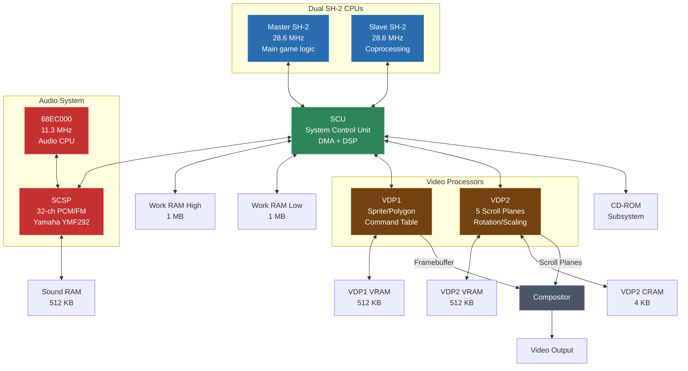
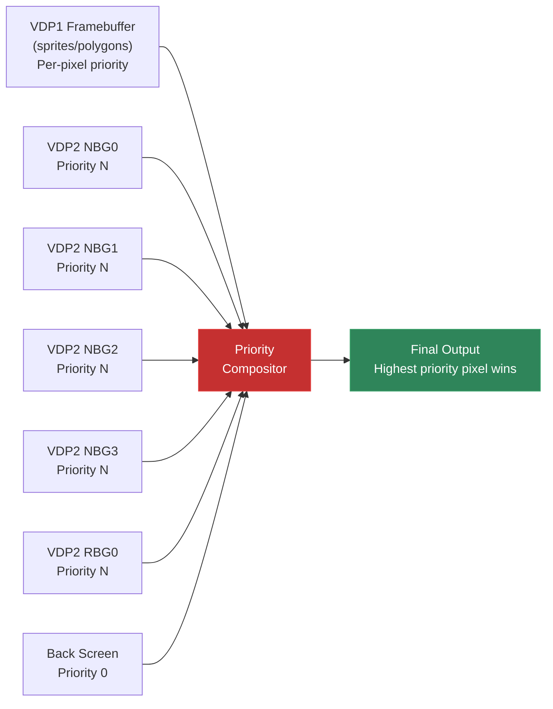
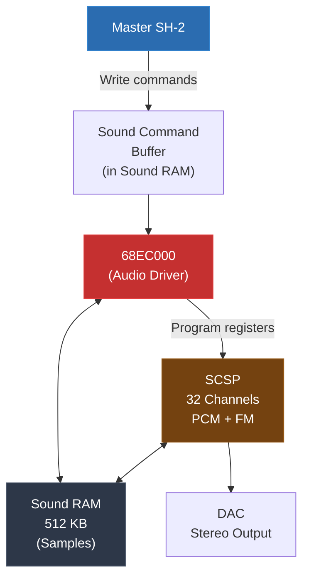

# Module 26: Saturn / Dual SH-2 Recompilation

The Sega Saturn is the most architecturally complex console of the 5th generation, and arguably the most challenging recompilation target in this entire course. It has two CPUs running simultaneously, two separate video display processors with overlapping responsibilities, a dedicated sound processor with its own CPU, a system control unit with a built-in DSP, and a CD-ROM subsystem. Recompiling a Saturn game means dealing with all of these -- not just one CPU and one graphics chip.

The Saturn was notoriously difficult for developers in 1994, and it's notoriously difficult for preservation engineers in 2026. But that's exactly what makes it interesting. If you can recompile Saturn code, you can handle almost anything.

This module covers the Saturn's hardware, the SH-2 instruction set and its recompilation quirks, the synchronization problem created by dual CPUs, the VDP1/VDP2 graphics pipeline, the SCSP audio system, and practical strategies for lifting all of it to modern hardware.

---

## 1. Why the Saturn Is Interesting (and Infamous)

### The Most Complex 5th-Gen Console

When Sega designed the Saturn, they were hedging their bets. They didn't know if 3D gaming would take off, so they built a machine that was world-class at 2D and could also do 3D. The result was a design-by-committee architecture with multiple processors that could theoretically deliver incredible performance but were fiendishly difficult to program.

Compare the processor counts:

| Console | CPUs | GPUs | Audio | Other | Total |
|---------|------|------|-------|-------|-------|
| PlayStation | 1 (R3000A) | 1 (GTE+GPU) | 1 (SPU) | 1 (MDEC) | 4 |
| Nintendo 64 | 1 (VR4300) | 1 (RCP: RSP+RDP) | (RSP) | -- | 2-3 |
| **Saturn** | **2 (SH-2 x2)** | **2 (VDP1+VDP2)** | **1 (SCSP+68K)** | **1 (SCU DSP)** | **7+** |

The Saturn has more than double the processor count of its competitors. Each processor has its own memory, its own programming model, and its own quirks. They communicate through shared memory with bus arbitration, DMA channels, and interrupt lines.

### Why Developers Struggled

The Saturn's dual-CPU architecture was ahead of its time -- and not in a good way. In 1994, parallel programming was barely understood even in academic circles. Game developers were being asked to write lock-free concurrent code on fixed-point RISC processors with 4KB of cache. Most developers used only the master SH-2 and treated the slave as a coprocessor for occasional tasks (if they used it at all).

VDP1 (the "3D" processor) was designed around sprites, not triangles. It could draw textured, shaded quadrilaterals and map textures onto them, but it couldn't do texture perspective correction, and its polygon edge calculations were imprecise. Games that pushed VDP1 hard (like Virtua Fighter 2) required extensive optimization tricks.

VDP2 was excellent for 2D -- five scrolling planes with rotation, scaling, and priority-based compositing -- but understanding how its output combined with VDP1's output was a puzzle that few developers fully mastered.

### Why It's Hard to Emulate/Recompile

For emulation and recompilation, the Saturn presents challenges at every level:

1. **Dual CPU synchronization**: The two SH-2s share memory and must be kept in sync. Getting the timing wrong causes subtle bugs -- race conditions, missed interrupts, corrupted data.

2. **VDP1 command processing**: VDP1 reads a command table from VRAM and processes it sequentially. The commands can modify each other's behavior, and timing matters.

3. **VDP1+VDP2 compositing**: The final image is a composite of VDP1's output (sprites/polygons) and VDP2's output (scroll planes). The compositing uses per-pixel priority values and is unlike anything on other consoles.

4. **SCU DSP**: The System Control Unit contains a programmable DSP that some games use for matrix math and DMA coordination. It has its own instruction set.

5. **SCSP**: The sound processor contains a Motorola 68EC000 CPU running its own program, alongside a Yamaha FM/PCM synthesis engine. Sound is essentially a third computer running inside the Saturn.



---

## 2. Saturn Hardware Overview

Let's go through each major component before diving into recompilation specifics.

### Master and Slave SH-2

Two Hitachi SH7604 processors (SH-2 cores), both running at 28.6363 MHz. The "master" and "slave" designation is a convention, not a hardware distinction -- both CPUs are identical chips. The master handles the primary game loop, and the slave is available for parallel work.

Both CPUs share access to Work RAM (2 MB total, split into High and Low banks), VDP registers, and SCU registers. Access is arbitrated by the SCU's bus controller.

### VDP1 (Video Display Processor 1)

VDP1 handles sprites and polygons. It has its own 512 KB of VRAM for storing a command table, textures, and a framebuffer. VDP1 draws into a framebuffer (separate from VDP2's output) and supports:
- Textured/untextured sprites
- Scaled sprites
- Distorted sprites (quadrilateral mapping -- the basis for 3D polygon rendering)
- Gouraud shading
- 16-bit or 8-bit color modes
- Clipping
- User clipping regions

### VDP2 (Video Display Processor 2)

VDP2 handles background layers. It has its own 512 KB of VRAM and 4 KB of Color RAM (CRAM). VDP2 provides:
- 5 scroll planes (NBG0-NBG3 + RBG0/RBG1)
- Per-plane scrolling, rotation, and scaling
- Bitmap or tile-based modes
- 16/256/2048/32768/16M color modes
- Line color screen and back screen
- Shadow/highlight effects
- Per-pixel priority for compositing with VDP1

### SCU (System Control Unit)

The SCU is the traffic cop. It manages:
- Bus arbitration between the two SH-2s and all peripherals
- Three DMA channels for bulk data transfer
- A programmable DSP (32-bit, 26 instructions, 256 words of program RAM)
- Interrupt routing
- Timer functions

### SCSP (Saturn Custom Sound Processor)

The SCSP is a Yamaha YMF292 that combines:
- 32-channel PCM playback (16-bit, up to 44.1 kHz)
- FM synthesis capability on each channel
- Built-in DSP effects (reverb, chorus, delay)
- 512 KB of dedicated sound RAM
- Controlled by a Motorola 68EC000 CPU at 11.2896 MHz

The 68EC000 runs its own program loaded by the SH-2 master. It handles audio sequencing, sample triggering, and DSP configuration.

### Memory Map

```
0x00000000 - 0x000FFFFF : Boot ROM (512 KB)
0x00100000 - 0x0017FFFF : SMPC registers
0x00180000 - 0x001FFFFF : Backup RAM (32 KB)
0x00200000 - 0x002FFFFF : Work RAM Low (1 MB)
0x00300000 - 0x003FFFFF : (Random data on read)
0x01000000 - 0x01FFFFFF : (Unused/mirrors)
0x02000000 - 0x03FFFFFF : A-Bus CS0 (cart)
0x04000000 - 0x04FFFFFF : A-Bus CS1
0x05000000 - 0x057FFFFF : A-Bus dummy
0x05800000 - 0x058FFFFF : A-Bus CS2 (CD-ROM)
0x05A00000 - 0x05AFFFFF : 68K Sound work area
0x05B00000 - 0x05BFFFFF : SCSP registers
0x05C00000 - 0x05C7FFFF : VDP1 VRAM (512 KB)
0x05C80000 - 0x05CFFFFF : VDP1 framebuffer
0x05D00000 - 0x05D7FFFF : VDP1 registers
0x05E00000 - 0x05EFFFFF : VDP2 VRAM (512 KB)
0x05F00000 - 0x05F7FFFF : VDP2 CRAM (4 KB)
0x05F80000 - 0x05FFFFFF : VDP2 registers
0x06000000 - 0x060FFFFF : SCU registers
0x06100000 - 0x07FFFFFF : (Unused)
0x20000000 - 0x23FFFFFF : Work RAM High (1 MB, mirrored, cached for SH-2)
0x24000000 - 0x27FFFFFF : Work RAM High (uncached mirror)
```

The SH-2 uses different address ranges for cached and uncached access to the same physical memory. This matters for recompilation because games use both, and the uncached access patterns are often used for DMA source/destination areas.

---

## 3. The SH-2 CPU

The Hitachi SH-2 (SH7604) is a 32-bit RISC processor with a distinctive feature: **16-bit instructions**. Unlike ARM Thumb (which is a subset of the full ARM instruction set), SH-2's 16-bit encoding is the only instruction format. Every instruction is exactly 2 bytes. This was a deliberate design choice to improve code density and reduce ROM/RAM costs.

### Register Model

```c
typedef struct {
    uint32_t r[16];       // General-purpose registers R0-R15
    uint32_t pc;          // Program counter
    uint32_t pr;          // Procedure register (return address, like LR on ARM)
    uint32_t sr;          // Status register (T-bit, interrupt mask, etc.)
    uint32_t gbr;         // Global Base Register (for GBR-relative addressing)
    uint32_t vbr;         // Vector Base Register (interrupt vector table base)
    uint32_t mach;        // MAC register high (multiply-accumulate)
    uint32_t macl;        // MAC register low (multiply-accumulate)
} SH2State;
```

Key registers:
- **R0**: General-purpose but also used as a source/destination for many special instructions (byte/word moves, GBR-relative access)
- **R15**: Used as stack pointer by convention (not hardwired like MIPS R0 or ARM SP)
- **PR** (Procedure Register): Stores the return address after `BSR` or `JSR`. Equivalent to ARM's LR.
- **GBR** (Global Base Register): Points to a global data area. Several instructions use GBR-relative addressing for fast access to global variables.
- **MACH/MACL**: The 64-bit multiply-accumulate result. `MAC.W` and `MAC.L` write to these.
- **SR**: Contains the **T-bit** (condition flag), interrupt mask, and processor mode bits.

### The T-Bit

The SH-2 has only one condition flag: the **T-bit** in the status register. All conditional operations use T:

```asm
CMP/EQ  R3, R4      ; T = (R3 == R4)
BT      label        ; Branch if T == 1
BF      label        ; Branch if T == 0
```

Compare instructions set T, and branch instructions test T. There are no separate zero/negative/carry/overflow flags like on x86 or ARM. This actually simplifies recompilation -- you only need to track one flag:

```c
// CMP/EQ R3, R4
ctx->sr_t = (ctx->r[3] == ctx->r[4]) ? 1 : 0;

// BT label
if (ctx->sr_t) goto label;
```

### Instruction Format

All SH-2 instructions are 16 bits, encoded in several formats:

```
Format 0: nnnn nnnn nnnn nnnn  (no operands)
Format n: xxxx nnnn mmmm xxxx  (register operands Rn, Rm)
Format d: xxxx nnnn dddd dddd  (register + displacement)
Format i: xxxx xxxx iiii iiii  (immediate)
```

The 16-bit encoding means the instruction set is compact but limited in immediate values. Most immediates are 8-bit, and constants larger than that require PC-relative loads.

### Commonly Used Instructions

Here's the subset of SH-2 instructions you'll encounter most in Saturn games:

```asm
; Data movement
MOV     Rm, Rn        ; Rn = Rm
MOV     #imm, Rn      ; Rn = sign_extend_8(imm)
MOV.L   @Rm, Rn       ; Rn = mem32[Rm]
MOV.L   Rm, @Rn       ; mem32[Rn] = Rm
MOV.L   @(disp, Rm), Rn  ; Rn = mem32[Rm + disp*4]
MOV.L   @Rm+, Rn      ; Rn = mem32[Rm]; Rm += 4

; Arithmetic
ADD     Rm, Rn        ; Rn = Rn + Rm
ADD     #imm, Rn      ; Rn = Rn + sign_extend_8(imm)
SUB     Rm, Rn        ; Rn = Rn - Rm
NEG     Rm, Rn        ; Rn = -Rm
MUL.L   Rm, Rn        ; MACL = Rm * Rn (32-bit result)
DMULS.L Rm, Rn        ; MACH:MACL = (signed)Rm * (signed)Rn (64-bit result)
MAC.W   @Rm+, @Rn+    ; MACH:MACL += mem16[Rm] * mem16[Rn]; Rm += 2; Rn += 2
MAC.L   @Rm+, @Rn+    ; MACH:MACL += mem32[Rm] * mem32[Rn]; Rm += 4; Rn += 4

; Logic
AND     Rm, Rn        ; Rn = Rn & Rm
OR      Rm, Rn        ; Rn = Rn | Rm
XOR     Rm, Rn        ; Rn = Rn ^ Rm
NOT     Rm, Rn        ; Rn = ~Rm

; Shifts
SHLL    Rn            ; T = Rn[31]; Rn <<= 1
SHLR    Rn            ; T = Rn[0]; Rn >>= 1 (logical)
SHAR    Rn            ; T = Rn[0]; Rn >>= 1 (arithmetic)
SHLL2   Rn            ; Rn <<= 2
SHLR2   Rn            ; Rn >>= 2
SHLL8   Rn            ; Rn <<= 8
SHLL16  Rn            ; Rn <<= 16

; Compare (sets T-bit)
CMP/EQ  Rm, Rn        ; T = (Rn == Rm)
CMP/GE  Rm, Rn        ; T = (Rn >= Rm) signed
CMP/GT  Rm, Rn        ; T = (Rn > Rm) signed
CMP/HI  Rm, Rn        ; T = (Rn > Rm) unsigned
CMP/HS  Rm, Rn        ; T = (Rn >= Rm) unsigned
CMP/PL  Rn            ; T = (Rn > 0) signed
CMP/PZ  Rn            ; T = (Rn >= 0) signed
CMP/EQ  #imm, R0      ; T = (R0 == sign_extend_8(imm))

; Branch
BT      label         ; if T: PC = label
BF      label         ; if !T: PC = label
BT/S    label         ; if T: PC = label (delayed)
BF/S    label         ; if !T: PC = label (delayed)
BRA     label         ; PC = label (delayed)
BSR     label         ; PR = PC + 4; PC = label (delayed)
JMP     @Rm           ; PC = Rm (delayed)
JSR     @Rm           ; PR = PC + 4; PC = Rm (delayed)
RTS                   ; PC = PR (delayed)

; System
TRAPA   #imm          ; Trap/syscall
RTE                   ; Return from exception
LDC     Rm, SR        ; SR = Rm
STC     SR, Rn        ; Rn = SR
```

---

## 4. SH-2 Instruction Set for Recompilation

The SH-2 presents several instruction-level challenges for the lifter.

### Delay Slots

Like MIPS, the SH-2 has delay slots on branch instructions. But there's a twist: **only some branch instructions have delay slots**. The non-delayed variants (`BT`, `BF`) have no delay slot, while the delayed variants (`BT/S`, `BF/S`, `BRA`, `BSR`, `JMP`, `JSR`, `RTS`, `RTE`) do.

This mixed model is actually easier to handle than MIPS's "everything has a delay slot" approach, because you can handle each case explicitly:

```c
void lift_instruction(SH2LiftContext* ctx, uint16_t instr) {
    uint8_t op = (instr >> 12) & 0xF;

    switch (op) {
        case 0x8: {
            uint8_t subop = (instr >> 8) & 0xF;
            if (subop == 0x9) {
                // BT label (NO delay slot)
                int8_t disp = instr & 0xFF;
                uint32_t target = ctx->pc + 4 + disp * 2;
                emit(ctx, "if (ctx->sr_t) goto L_%08X;", target);
            } else if (subop == 0xD) {
                // BT/S label (WITH delay slot)
                int8_t disp = instr & 0xFF;
                uint32_t target = ctx->pc + 4 + disp * 2;
                uint16_t delay_instr = read16(ctx->pc + 2);

                emit(ctx, "{");
                emit(ctx, "    int _cond = ctx->sr_t;");
                lift_instruction(ctx, delay_instr);  // emit delay slot
                emit(ctx, "    if (_cond) goto L_%08X;", target);
                emit(ctx, "}");

                ctx->pc += 2;  // skip delay slot (already emitted)
            }
            break;
        }

        case 0xA: {
            // BRA label (WITH delay slot)
            int16_t disp = (instr & 0xFFF);
            if (disp & 0x800) disp |= 0xF000;  // sign extend 12-bit
            uint32_t target = ctx->pc + 4 + disp * 2;

            uint16_t delay_instr = read16(ctx->pc + 2);
            lift_instruction(ctx, delay_instr);
            emit(ctx, "goto L_%08X;", target);
            ctx->pc += 2;
            break;
        }

        // ... etc ...
    }
}
```

### MOVA (PC-Relative Addressing)

The SH-2 uses PC-relative addressing to load constants and access data tables. The `MOVA` instruction computes a PC-relative address:

```asm
MOVA    @(disp, PC), R0   ; R0 = (PC & 0xFFFFFFFC) + disp * 4 + 4
```

And `MOV.L @(disp, PC), Rn` loads a 32-bit constant:

```asm
MOV.L   @(disp, PC), R3   ; R3 = mem32[(PC & 0xFFFFFFFC) + disp * 4 + 4]
```

The PC value used is the address of the instruction + 4 (accounting for the pipeline). The `& 0xFFFFFFFC` alignment is applied because 32-bit loads must be word-aligned.

For recompilation, PC-relative loads are constants that can be resolved at recompilation time:

```c
case 0xD: {
    // MOV.L @(disp, PC), Rn
    int rn = (instr >> 8) & 0xF;
    int disp = instr & 0xFF;
    uint32_t addr = ((ctx->pc + 4) & ~3) + disp * 4;
    uint32_t value = read32(addr);  // Resolve at recomp time

    emit(ctx, "ctx->r[%d] = 0x%08X;  // MOV.L @(0x%X, PC)", rn, value, addr);
    break;
}
```

This is one of the nice things about SH-2 recompilation: most constant loads become immediate assignments, making the generated C code much cleaner than on architectures that construct constants from multiple instructions.

### GBR-Relative Addressing

The GBR register enables fast access to global variables. Several instructions use it:

```asm
MOV.L   @(disp, GBR), R0   ; R0 = mem32[GBR + disp * 4]
MOV.L   R0, @(disp, GBR)   ; mem32[GBR + disp * 4] = R0
AND.B   #imm, @(R0, GBR)   ; mem8[GBR + R0] &= imm
OR.B    #imm, @(R0, GBR)   ; mem8[GBR + R0] |= imm
```

Note that GBR-relative byte operations always use R0 as the offset register. This is a constraint of the 16-bit instruction encoding -- there aren't enough bits to specify two arbitrary registers.

For recompilation, GBR-relative accesses are straightforward:

```c
// MOV.L @(disp, GBR), R0
emit(ctx, "ctx->r[0] = mem_read32(ctx->gbr + %d);", disp * 4);

// AND.B #imm, @(R0, GBR)
emit(ctx, "mem_write8(ctx->gbr + ctx->r[0], "
          "mem_read8(ctx->gbr + ctx->r[0]) & 0x%02X);", imm);
```

### MAC.W and MAC.L

The multiply-accumulate instructions are used for signal processing and fixed-point math. They auto-increment their address registers:

```asm
; Compute dot product of two 16-element int16 arrays
; R4 points to array A, R5 points to array B
MOV     #0, R0
LDS     R0, MACH        ; Clear accumulator high
LDS     R0, MACL        ; Clear accumulator low

; Each MAC.W does: MACH:MACL += mem16[R4] * mem16[R5]; R4 += 2; R5 += 2
MAC.W   @R4+, @R5+      ; element 0
MAC.W   @R4+, @R5+      ; element 1
MAC.W   @R4+, @R5+      ; element 2
; ... repeat 16 times ...
MAC.W   @R4+, @R5+      ; element 15

; Result in MACH:MACL
STS     MACL, R0         ; R0 = low 32 bits of result
```

Lifting MAC instructions:

```c
// MAC.W @Rm+, @Rn+
int rm = (instr >> 4) & 0xF;
int rn = (instr >> 8) & 0xF;

emit(ctx, "{");
emit(ctx, "    int16_t a = (int16_t)mem_read16(ctx->r[%d]);", rn);
emit(ctx, "    int16_t b = (int16_t)mem_read16(ctx->r[%d]);", rm);
emit(ctx, "    int64_t mac = ((int64_t)ctx->mach << 32) | (uint32_t)ctx->macl;");
emit(ctx, "    mac += (int32_t)a * (int32_t)b;");
// Note: with S-bit set in SR, MAC.W saturates to 48-bit range
emit(ctx, "    if (ctx->sr & SR_S_BIT) {");
emit(ctx, "        if (mac > 0x7FFFFFFFFFFF) mac = 0x7FFFFFFFFFFF;");
emit(ctx, "        if (mac < -0x800000000000) mac = -0x800000000000;");
emit(ctx, "    }");
emit(ctx, "    ctx->mach = (uint32_t)(mac >> 32);");
emit(ctx, "    ctx->macl = (uint32_t)(mac & 0xFFFFFFFF);");
emit(ctx, "    ctx->r[%d] += 2;", rn);
emit(ctx, "    ctx->r[%d] += 2;", rm);
emit(ctx, "}");
```

### The SWAP Instructions

The SH-2 has byte and word swap instructions that are heavily used for endianness handling and bit manipulation:

```c
// SWAP.B Rm, Rn: swap low two bytes
// Before: Rm = 0xAABBCCDD
// After:  Rn = 0xAABBDDCC
emit(ctx, "ctx->r[%d] = (ctx->r[%d] & 0xFFFF0000) | "
          "((ctx->r[%d] & 0xFF) << 8) | "
          "((ctx->r[%d] >> 8) & 0xFF);", rn, rm, rm, rm);

// SWAP.W Rm, Rn: swap high and low words
// Before: Rm = 0xAABBCCDD
// After:  Rn = 0xCCDDAABB
emit(ctx, "ctx->r[%d] = (ctx->r[%d] << 16) | ((uint32_t)ctx->r[%d] >> 16);",
     rn, rm, rm);
```

SWAP.B is commonly used for converting between big-endian and little-endian at the byte level within a halfword. The Saturn is big-endian, but some data formats (especially from CD-ROM) use little-endian encoding. You'll see SWAP.B paired with SWAP.W for full 32-bit endian conversion.

### EXTU and EXTS (Zero/Sign Extension)

These instructions are used constantly when loading byte or halfword values:

```c
// EXTU.B Rm, Rn: zero-extend byte to 32 bits
emit(ctx, "ctx->r[%d] = ctx->r[%d] & 0xFF;", rn, rm);

// EXTU.W Rm, Rn: zero-extend halfword to 32 bits
emit(ctx, "ctx->r[%d] = ctx->r[%d] & 0xFFFF;", rn, rm);

// EXTS.B Rm, Rn: sign-extend byte to 32 bits
emit(ctx, "ctx->r[%d] = (int32_t)(int8_t)(ctx->r[%d] & 0xFF);", rn, rm);

// EXTS.W Rm, Rn: sign-extend halfword to 32 bits
emit(ctx, "ctx->r[%d] = (int32_t)(int16_t)(ctx->r[%d] & 0xFFFF);", rn, rm);
```

### ROTCL and ROTCR (Rotate Through Carry)

The rotate-through-carry instructions are used for multi-precision arithmetic and bit manipulation:

```c
// ROTCL Rn: rotate left through carry (T-bit)
// T_old <- Rn[31], Rn[0] <- T_old, Rn <<= 1
emit(ctx, "{ uint32_t old_t = ctx->sr_t;");
emit(ctx, "  ctx->sr_t = (ctx->r[%d] >> 31) & 1;", rn);
emit(ctx, "  ctx->r[%d] = (ctx->r[%d] << 1) | old_t; }", rn, rn);
```

ROTCL is used at the end of division sequences (DIV0S + DIV1 x32) to extract the final quotient bit. It's also used in multi-word shift operations.

### ADDV and SUBV (Overflow Detection)

These arithmetic operations set the T-bit on overflow:

```c
// ADDV Rm, Rn: add and set T on overflow
emit(ctx, "{ int32_t a = (int32_t)ctx->r[%d];", rn);
emit(ctx, "  int32_t b = (int32_t)ctx->r[%d];", rm);
emit(ctx, "  int32_t result = a + b;");
emit(ctx, "  ctx->sr_t = ((a ^ result) & (b ^ result)) < 0 ? 1 : 0;");
emit(ctx, "  ctx->r[%d] = (uint32_t)result; }", rn);
```

### ADDC and SUBC (Add/Subtract with Carry)

Used for multi-precision arithmetic (64-bit add on a 32-bit CPU):

```c
// ADDC Rm, Rn: Rn = Rn + Rm + T; T = carry out
emit(ctx, "{ uint64_t result = (uint64_t)(uint32_t)ctx->r[%d]", rn);
emit(ctx, "                  + (uint64_t)(uint32_t)ctx->r[%d]", rm);
emit(ctx, "                  + (uint64_t)ctx->sr_t;");
emit(ctx, "  ctx->sr_t = (result >> 32) & 1;");
emit(ctx, "  ctx->r[%d] = (uint32_t)result; }", rn);
```

### DT (Decrement and Test)

The DT instruction is the SH-2's loop counter primitive. It decrements a register and sets T if the result is zero:

```c
// DT Rn: Rn--; T = (Rn == 0)
emit(ctx, "ctx->r[%d]--;", rn);
emit(ctx, "ctx->sr_t = (ctx->r[%d] == 0) ? 1 : 0;", rn);
```

It's almost always paired with BF (branch if T == 0) to create loops:

```asm
; Loop 100 times
    MOV     #100, R4
loop:
    ; ... loop body ...
    DT      R4          ; R4--; T = (R4 == 0)
    BF      loop        ; if (!T) goto loop
```

This pattern is extremely common and can be pattern-matched to generate cleaner C loops:

```c
// Pattern match: DT Rn followed by BF target
// Emit as: while (--ctx->r[rn] != 0) { ... }
if (detect_dt_bf_pattern(ctx)) {
    emit(ctx, "do {");
    // ... emit loop body ...
    emit(ctx, "    ctx->r[%d]--;", rn);
    emit(ctx, "} while (ctx->r[%d] != 0);", rn);
}
```

### Division

The SH-2 has a software-assisted division operation using the `DIV0S`, `DIV0U`, and `DIV1` instructions. These implement one step of a restoring division algorithm per `DIV1` instruction. A full 32/32 division requires `DIV0S` + 32 `DIV1` instructions:

```asm
; Signed division: R0 = R4 / R5
; Setup
MOV     R4, R0          ; Dividend in R0
MOV     R5, R3          ; Divisor in R3
DIV0S   R3, R0          ; Initialize T and Q flags for signed division

; 32 iterations of DIV1
DIV1    R3, R0           ; One step of division
DIV1    R3, R0
; ... (32 times total)
DIV1    R3, R0

; Result in R0 after rotating and adjusting
ROTCL   R0               ; Final rotation
```

This is tedious to recompile literally (32 `DIV1` instructions per division). A pattern-matching optimizer can detect this sequence and replace it with a single C division:

```c
// Pattern detector: DIV0S Rm, Rn followed by 32x DIV1 Rm, Rn
bool detect_division_pattern(uint16_t* code, int* rm, int* rn) {
    uint16_t first = code[0];
    if ((first & 0xF00F) != 0x2007) return false;  // DIV0S Rm, Rn

    *rm = (first >> 4) & 0xF;
    *rn = (first >> 8) & 0xF;

    // Check for 32 consecutive DIV1 instructions with same Rm, Rn
    for (int i = 1; i <= 32; i++) {
        uint16_t expected = 0x3004 | (*rm << 4) | (*rn << 8);  // DIV1 Rm, Rn
        if (code[i] != expected) return false;
    }

    return true;
}

// Optimized division emission
void emit_division(LiftContext* ctx, int rm, int rn) {
    emit(ctx, "// Optimized: DIV0S + 32x DIV1 -> single division");
    emit(ctx, "if (ctx->r[%d] != 0) {", rm);
    emit(ctx, "    ctx->r[%d] = (int32_t)ctx->r[%d] / (int32_t)ctx->r[%d];", rn, rn, rm);
    emit(ctx, "} else {");
    emit(ctx, "    ctx->r[%d] = 0;  // Division by zero", rn);
    emit(ctx, "}");
}
```

---

## 5. Dual-CPU Architecture

The Saturn's dual SH-2 configuration is the most significant architectural challenge for recompilation. Both CPUs run simultaneously, share memory, and communicate through shared data structures and interrupts.

### How Games Use the Slave SH-2

In practice, Saturn games use the slave CPU in several patterns:

**Pattern 1: Slave as vertex processor**
The master sends vertex data to a shared buffer, signals the slave, and the slave transforms vertices while the master handles game logic. This is the most common pattern in 3D games.

**Pattern 2: Slave as audio manager**
The slave handles audio mixing and sample management, freeing the master for gameplay and graphics.

**Pattern 3: Slave as background decompressor**
The slave decompresses assets (textures, levels) from CD-ROM while the master runs the game.

**Pattern 4: Slave unused**
Many games, especially 2D titles and early releases, don't use the slave SH-2 at all.

### The Synchronization Mechanism

The two CPUs synchronize through:

1. **Shared memory**: Both CPUs can read/write Work RAM. The game uses memory locations as flags and mailboxes.

2. **SCU interrupts**: The SCU can route interrupts to either or both CPUs. The master can trigger an interrupt on the slave and vice versa.

3. **SMPC**: The System Manager & Peripheral Controller provides inter-CPU communication registers.

```c
// Typical master-slave synchronization pattern
// In master's code:
void master_main_loop(void) {
    while (1) {
        // Prepare vertex data in shared buffer
        prepare_vertex_data(shared_vertex_buffer, vertex_count);

        // Signal slave to start processing
        volatile uint32_t* slave_command = (uint32_t*)SHARED_COMMAND_ADDR;
        *slave_command = CMD_PROCESS_VERTICES;

        // Do other work while slave processes
        update_game_logic();
        process_input();

        // Wait for slave to finish
        while (*slave_command != CMD_DONE) {
            // Spin-wait (or do more work)
        }

        // Use transformed vertices
        submit_to_vdp1(transformed_vertex_buffer);
    }
}

// In slave's code:
void slave_main_loop(void) {
    while (1) {
        volatile uint32_t* slave_command = (uint32_t*)SHARED_COMMAND_ADDR;

        // Wait for command from master
        while (*slave_command == CMD_IDLE) {
            // Spin-wait
        }

        if (*slave_command == CMD_PROCESS_VERTICES) {
            // Transform vertices
            transform_all_vertices(shared_vertex_buffer,
                                   transformed_vertex_buffer,
                                   vertex_count);

            // Signal completion
            *slave_command = CMD_DONE;
        }
    }
}
```

---

## 6. The Synchronization Problem

How do you recompile two CPUs that are supposed to run in parallel on a modern system that may be single-threaded (or where threading introduces its own synchronization challenges)?

### Strategy 1: Interleaved Execution

Run both CPUs on a single thread, alternating between them. Execute N instructions on the master, then N instructions on the slave, repeat.

```c
void run_saturn_frame_interleaved(SH2State* master, SH2State* slave) {
    int cycles_per_slice = 64;  // Execute 64 instructions per time slice
    int total_cycles = CYCLES_PER_FRAME;  // ~572,727 cycles at 28.6 MHz, 60 fps

    int cycles_run = 0;
    while (cycles_run < total_cycles) {
        // Run master for a slice
        sh2_execute(master, cycles_per_slice);

        // Run slave for a slice
        sh2_execute(slave, cycles_per_slice);

        cycles_run += cycles_per_slice;

        // Check for VDP events, interrupts, etc.
        check_system_events(cycles_run);
    }
}
```

**Pros**: Simple, deterministic, no threading bugs.
**Cons**: Doesn't model true parallelism. Some games depend on both CPUs making progress simultaneously, and interleaving can cause timing-sensitive code to behave differently.

### Strategy 2: Threaded Execution

Run each CPU on its own host thread.

```c
void* master_thread(void* arg) {
    SH2State* master = (SH2State*)arg;
    while (running) {
        // Execute until next sync point
        sh2_execute(master, CYCLES_PER_SYNC);

        // Wait at sync barrier
        pthread_barrier_wait(&sync_barrier);
    }
    return NULL;
}

void* slave_thread(void* arg) {
    SH2State* slave = (SH2State*)arg;
    while (running) {
        sh2_execute(slave, CYCLES_PER_SYNC);
        pthread_barrier_wait(&sync_barrier);
    }
    return NULL;
}

void run_saturn_threaded(SH2State* master, SH2State* slave) {
    pthread_barrier_init(&sync_barrier, NULL, 2);

    pthread_t t1, t2;
    pthread_create(&t1, NULL, master_thread, master);
    pthread_create(&t2, NULL, slave_thread, slave);

    pthread_join(t1, NULL);
    pthread_join(t2, NULL);
}
```

**Pros**: True parallelism, can use multiple host cores.
**Cons**: Shared memory access needs synchronization (mutexes or atomics), introduces potential for race conditions, harder to debug, non-deterministic.

### Strategy 3: Cooperative Model

In statically recompiled code, we know the structure of both programs at compile time. We can analyze the synchronization points (where one CPU waits for the other) and compile both into a cooperative model:

```c
// Recompiled master function with explicit sync points
void master_game_loop(MasterContext* master, SharedState* shared) {
    // Phase 1: Prepare data
    prepare_vertex_data(master, shared);

    // Signal slave and yield
    shared->slave_command = CMD_PROCESS_VERTICES;
    sync_point_yield(SYNC_MASTER_DONE_PREP);  // Let slave run

    // Phase 2: Game logic (runs while slave processes vertices)
    update_game_logic(master);

    // Wait for slave completion
    sync_point_wait(SYNC_SLAVE_DONE_VERTICES);

    // Phase 3: Submit to VDP
    submit_to_vdp1(shared);
}

// Recompiled slave function with explicit sync points
void slave_vertex_loop(SlaveContext* slave, SharedState* shared) {
    // Wait for command
    sync_point_wait(SYNC_MASTER_DONE_PREP);

    if (shared->slave_command == CMD_PROCESS_VERTICES) {
        transform_all_vertices(slave, shared);
        shared->slave_command = CMD_DONE;
    }

    sync_point_signal(SYNC_SLAVE_DONE_VERTICES);
}
```

**Pros**: No threading overhead, deterministic, can be optimized because we know both programs' structure.
**Cons**: Requires analysis of inter-CPU communication patterns, may need per-game tuning.

### Strategy 4: Event-Driven Synchronization

A more sophisticated approach identifies the specific synchronization points in the game code and uses them as natural boundaries:

```c
typedef enum {
    SYNC_NONE,
    SYNC_VBLANK_WAIT,      // Game is waiting for VBlank interrupt
    SYNC_SLAVE_WAIT,       // Master is waiting for slave to finish
    SYNC_MASTER_WAIT,      // Slave is waiting for command from master
    SYNC_DMA_WAIT,         // Waiting for DMA transfer to complete
    SYNC_CD_WAIT,          // Waiting for CD-ROM read
} SyncReason;

void master_execute_until_sync(MasterContext* master, SharedMemory* shared) {
    while (1) {
        uint16_t instr = read16(master->pc);
        execute_instruction(master, instr);

        // Check for synchronization patterns:

        // Pattern: polling a memory location (spin-wait)
        if (is_polling_loop(master, instr)) {
            uint32_t poll_addr = get_poll_address(master, instr);

            if (poll_addr == SLAVE_STATUS_ADDR) {
                // Master is waiting for slave to finish
                // Run slave until it signals completion
                run_slave_until_done(shared);
                continue;  // Re-check the poll
            }

            if (poll_addr == VBLANK_FLAG_ADDR) {
                // Master is waiting for VBlank
                return;  // Yield to frame manager
            }
        }

        // Pattern: writing to slave command register
        if (is_write_to(master, instr, SLAVE_COMMAND_ADDR)) {
            // Master just wrote a command for the slave
            // Give the slave a chance to process it
            run_slave_for(shared, 1000);  // Run slave for ~1000 cycles
        }
    }
}
```

This approach requires analysis of each game's synchronization patterns, but it produces the most natural execution behavior. It's particularly effective for games that use simple flag-based synchronization (which is most Saturn games).

### Interrupt Handling

The SCU distributes interrupts to both SH-2 CPUs. Key interrupts include:

```c
// SCU interrupt sources
#define SCU_INT_VBLANK_IN     0x0001  // V-blank start
#define SCU_INT_VBLANK_OUT    0x0002  // V-blank end
#define SCU_INT_HBLANK_IN     0x0004  // H-blank start
#define SCU_INT_TIMER0        0x0008  // Timer 0
#define SCU_INT_TIMER1        0x0010  // Timer 1
#define SCU_INT_DMA_END0      0x0020  // DMA channel 0 complete
#define SCU_INT_DMA_END1      0x0040  // DMA channel 1 complete
#define SCU_INT_DMA_END2      0x0080  // DMA channel 2 complete
#define SCU_INT_PAD_INT       0x0100  // Peripheral interrupt
#define SCU_INT_SPRITE_END    0x2000  // VDP1 sprite draw end
#define SCU_INT_DSP_END       0x4000  // SCU DSP program end
#define SCU_INT_SOUND_REQUEST 0x8000  // SCSP interrupt request

void deliver_interrupt(SH2State* cpu, int vector) {
    // Push SR and PC to stack
    cpu->r[15] -= 4;
    sh2_write32(cpu, cpu->r[15], cpu->sr);
    cpu->r[15] -= 4;
    sh2_write32(cpu, cpu->r[15], cpu->pc);

    // Set SR to disable lower-priority interrupts
    cpu->sr |= 0x000000F0;  // Mask interrupts

    // Jump to handler
    cpu->pc = sh2_read32(cpu, cpu->vbr + vector * 4);
}
```

In recompilation, interrupt handling is one of the areas where timing sensitivity matters most. VBlank interrupts drive the frame timing. If the master SH-2's VBlank handler doesn't run at the right point, the game's frame pacing will be wrong, and it may skip frames or run at the wrong speed.

### DMA (Direct Memory Access)

The SCU provides three DMA channels for bulk data transfers:

```c
typedef struct {
    uint32_t src_addr;   // Source address
    uint32_t dst_addr;   // Destination address
    uint32_t count;      // Transfer count
    uint32_t add_value;  // Address increment per transfer
    uint8_t  mode;       // Direct / Indirect, trigger source
    uint8_t  enable;     // Channel enable
} SCU_DMA_Channel;

void scu_dma_start(SCU_DMA_Channel* ch) {
    // Perform the DMA transfer
    for (uint32_t i = 0; i < ch->count; i++) {
        uint32_t data = saturn_read32(ch->src_addr);
        saturn_write32(ch->dst_addr, data);

        ch->src_addr += ch->add_value;
        ch->dst_addr += ch->add_value;
    }

    // Signal completion via interrupt
    signal_dma_complete_interrupt(ch);
}
```

DMA is used heavily for:
- Copying vertex data from Work RAM to VDP1 VRAM
- Loading texture data into VDP1 VRAM
- Copying tile data to VDP2 VRAM
- Transferring audio samples to sound RAM
- Moving data between Work RAM banks

In recompilation, DMA transfers can usually be implemented as simple memory copies. The only timing-critical case is when game code starts a DMA and then polls for completion -- your interleaved execution model must handle this correctly by completing the DMA before the polling code checks the status.

### Practical Recommendation

For most Saturn games, **interleaved execution with fine granularity** (32-64 instruction slices) works well enough. The few games that require precise dual-CPU timing typically use spin-wait synchronization patterns that naturally work with interleaving.

For games that heavily exploit parallelism (like some Sega first-party titles), the threaded approach with barrier synchronization at frame boundaries gives the best results but requires careful memory access protection.

---

## 7. VDP1: Sprite and Polygon Engine

VDP1 is the Saturn's primary rendering processor. Despite being called a "sprite" processor, it's responsible for all foreground graphics including 3D polygons. Understanding how it works is essential for writing a VDP1 shim.

### Command Table

VDP1 doesn't receive commands one at a time. Instead, the SH-2 builds a **command table** in VDP1 VRAM, and VDP1 processes the entire table during each frame. The command table is a linked list of 32-byte command entries:

```c
typedef struct {
    uint16_t control;     // Command type + flags
    uint16_t link;        // Next command address (or end marker)
    uint16_t color_mode;  // Color calculation mode
    uint16_t color_info;  // Color table address / Gouraud table
    int16_t  ax, ay;      // Vertex A coordinates
    int16_t  bx, by;      // Vertex B coordinates
    int16_t  cx, cy;      // Vertex C coordinates
    int16_t  dx, dy;      // Vertex D coordinates
    uint16_t grda;        // Gouraud shading data address
    uint16_t dummy;       // Unused
} VDP1Command;
```

### Command Types

```c
#define VDP1_CMD_NORMAL_SPRITE   0x0000  // Unscaled sprite
#define VDP1_CMD_SCALED_SPRITE   0x0001  // Scaled sprite
#define VDP1_CMD_DISTORTED_SPRITE 0x0002 // Quadrilateral (polygon!)
#define VDP1_CMD_POLYGON         0x0004  // Untextured polygon
#define VDP1_CMD_POLYLINE        0x0005  // Line strip
#define VDP1_CMD_LINE            0x0006  // Single line
#define VDP1_CMD_USER_CLIP_SET   0x0008  // Set clipping rectangle
#define VDP1_CMD_SYS_CLIP_SET    0x0009  // Set system clipping
#define VDP1_CMD_LOCAL_COORD_SET 0x000A  // Set coordinate origin
#define VDP1_CMD_END             0x8000  // End command table
```

The key insight: **"distorted sprite" is actually a textured quadrilateral**. This is how the Saturn renders 3D polygons -- it maps a texture onto a four-sided shape defined by four arbitrary screen-space vertices. It's not true polygon rendering in the 3D graphics sense; it's more like "warped sprites."

### Distorted Sprites (3D Polygons)

When a Saturn game renders a 3D scene, it:
1. Transforms 3D vertices to screen space on the SH-2 (no hardware transform)
2. Groups vertices into quads (not triangles!)
3. Writes distorted sprite commands with the screen-space vertex positions
4. VDP1 texture-maps the quad using affine (not perspective-correct) mapping

The affine texture mapping is one of the Saturn's most visible limitations. Without perspective correction, textures on surfaces that are sharply angled to the camera appear to "swim" or warp. PlayStation's GTE had the same issue but less pronounced because it used triangles (less distortion than quads).

```c
// Building a VDP1 distorted sprite command for a 3D quad
void submit_quad(VDP1Command* cmd, ScreenVertex* v,
                 uint16_t texture_addr, uint16_t color_mode) {
    cmd->control = VDP1_CMD_DISTORTED_SPRITE;
    cmd->link = 0;  // Will be set by command list builder
    cmd->color_mode = color_mode;
    cmd->color_info = texture_addr;

    cmd->ax = v[0].x;  cmd->ay = v[0].y;
    cmd->bx = v[1].x;  cmd->by = v[1].y;
    cmd->cx = v[2].x;  cmd->cy = v[2].y;
    cmd->dx = v[3].x;  cmd->dy = v[3].y;

    cmd->grda = 0;  // No Gouraud shading (or set address if enabled)
}
```

### Gouraud Shading

VDP1 supports per-vertex color interpolation (Gouraud shading) through a shading table in VRAM. Each polygon can reference a Gouraud table entry that specifies color offsets for each of its four vertices:

```c
typedef struct {
    uint16_t color_a;  // Color offset for vertex A
    uint16_t color_b;  // Color offset for vertex B
    uint16_t color_c;  // Color offset for vertex C
    uint16_t color_d;  // Color offset for vertex D
} GouraudTable;

// Gouraud color is added to/subtracted from the texture or polygon color
// Each component: bit 15 = sign, bits 14-10 = R, 9-5 = G, 4-0 = B
```

### VDP1 Framebuffer

VDP1 renders into its own framebuffer in VDP1 VRAM. The framebuffer can be:
- **512x256** at 16-bit color (256 KB)
- **512x256** at 8-bit color (128 KB)
- **1024x256** at 8-bit color (256 KB)
- Other configurations

VDP1 supports double-buffering: it can alternate between two framebuffers, drawing into one while displaying the other.

### VDP1 Color Modes

VDP1 supports several pixel color modes, selected per-command:

```c
// VDP1 color modes (bits 3-0 of color_mode field)
#define VDP1_COLOR_BANK_16    0x0  // 16-color bank mode (4-bit indexed)
#define VDP1_COLOR_LOOKUP_16  0x1  // 16-color lookup table
#define VDP1_COLOR_BANK_64    0x2  // 64-color bank mode
#define VDP1_COLOR_BANK_128   0x3  // 128-color bank mode
#define VDP1_COLOR_BANK_256   0x4  // 256-color bank mode
#define VDP1_COLOR_RGB        0x5  // 16-bit RGB (5-5-5-1)

// Decode a VDP1 pixel based on color mode
uint16_t decode_vdp1_pixel(uint16_t raw, uint16_t color_mode,
                            uint16_t color_info, uint16_t* cram) {
    switch (color_mode & 0x7) {
        case VDP1_COLOR_BANK_16: {
            // 4-bit index into color RAM bank
            uint16_t bank_offset = (color_info & 0xFFF0);
            return cram[bank_offset + (raw & 0x0F)];
        }
        case VDP1_COLOR_LOOKUP_16: {
            // 4-bit index into a 16-entry color table in VDP1 VRAM
            uint32_t table_addr = (color_info & 0xFFF0) * 8;
            uint16_t* table = (uint16_t*)(vdp1_vram + table_addr);
            return table[raw & 0x0F];
        }
        case VDP1_COLOR_RGB: {
            // Direct 16-bit RGB (5-5-5-1)
            return raw;
        }
        // ... other modes ...
    }
}
```

### VDP1 Transparency and Shadow

VDP1 has special transparency and shadow modes controlled per-command:

- **Transparent pixel code**: Pixels with value 0x0000 are transparent (drawn pixels must have MSB set or be non-zero, depending on mode)
- **Half-transparent**: Pixel color is averaged with the existing framebuffer color
- **Shadow**: Darkens the existing framebuffer pixel
- **Half-luminance**: Reduces the brightness of the pixel by half

These modes interact with VDP2's color calculation system during compositing:

```c
void vdp1_draw_pixel(VDP1State* vdp1, int x, int y,
                     uint16_t color, uint16_t cmd_control) {
    if (x < 0 || x >= vdp1->fb_width || y < 0 || y >= vdp1->fb_height)
        return;

    // Check for transparent pixel
    if (color == 0x0000) return;

    int idx = y * vdp1->fb_width + x;

    uint8_t sprite_type = (cmd_control >> 12) & 0x7;

    switch (sprite_type) {
        case 0: // Normal sprite
            vdp1->framebuffer[idx] = color;
            break;

        case 1: // Scaled sprite (same as normal)
            vdp1->framebuffer[idx] = color;
            break;

        case 4: // Half-transparent
            {
                uint16_t existing = vdp1->framebuffer[idx];
                // Average each color component
                uint16_t r = (((existing >> 10) & 0x1F) + ((color >> 10) & 0x1F)) / 2;
                uint16_t g = (((existing >> 5) & 0x1F) + ((color >> 5) & 0x1F)) / 2;
                uint16_t b = ((existing & 0x1F) + (color & 0x1F)) / 2;
                vdp1->framebuffer[idx] = (r << 10) | (g << 5) | b | 0x8000;
            }
            break;

        case 6: // Shadow
            {
                uint16_t existing = vdp1->framebuffer[idx];
                // Halve each color component
                uint16_t r = ((existing >> 10) & 0x1F) / 2;
                uint16_t g = ((existing >> 5) & 0x1F) / 2;
                uint16_t b = (existing & 0x1F) / 2;
                vdp1->framebuffer[idx] = (r << 10) | (g << 5) | b | 0x8000;
            }
            break;
    }

    // Store priority bits for compositing
    vdp1->priority_buffer[idx] = get_sprite_priority(cmd_control);
}
```

### VDP1 Rendering Order

Commands are processed in the order they appear in the command table. VDP1 has no Z-buffer -- rendering order determines which pixels are visible. This means games must sort their polygons from back to front (painter's algorithm) for correct rendering. This is another major difference from the PlayStation, which also lacked a Z-buffer but handled ordering differently.

### VDP1 Texture Mapping (Distorted Sprites)

The way VDP1 maps textures onto distorted sprites (quadrilaterals) is worth understanding because it directly affects rendering quality:

```c
// VDP1 distorted sprite rendering (affine texture mapping)
void render_distorted_sprite(VDP1State* vdp1, VDP1Command* cmd) {
    // Four corner vertices in screen space
    float x[4] = { cmd->ax, cmd->bx, cmd->cx, cmd->dx };
    float y[4] = { cmd->ay, cmd->by, cmd->cy, cmd->dy };

    // Texture is always rectangular: (0,0) to (tex_w-1, tex_h-1)
    int tex_w, tex_h;
    get_sprite_dimensions(cmd, &tex_w, &tex_h);

    // Texture corners map to quad corners:
    //   (0,0) -> A, (tex_w,0) -> B, (tex_w,tex_h) -> C, (0,tex_h) -> D

    // For each scanline in the quad's bounding box, interpolate
    // the quad edges and fill horizontally with textured pixels.
    // This is AFFINE mapping -- no perspective correction.

    int min_y = (int)fminf(fminf(y[0], y[1]), fminf(y[2], y[3]));
    int max_y = (int)fmaxf(fmaxf(y[0], y[1]), fmaxf(y[2], y[3]));

    for (int scan_y = min_y; scan_y <= max_y; scan_y++) {
        // Find left and right edges at this scanline
        float left_x, right_x, left_u, right_u, left_v, right_v;
        interpolate_quad_edges(x, y, tex_w, tex_h, scan_y,
                               &left_x, &right_x,
                               &left_u, &right_u,
                               &left_v, &right_v);

        // Fill the scanline
        float du = (right_u - left_u) / (right_x - left_x);
        float dv = (right_v - left_v) / (right_x - left_x);
        float u = left_u, v = left_v;

        for (int px = (int)left_x; px <= (int)right_x; px++) {
            int tex_x = (int)u % tex_w;
            int tex_y = (int)v % tex_h;
            if (tex_x < 0) tex_x += tex_w;
            if (tex_y < 0) tex_y += tex_h;

            uint16_t texel = read_vdp1_texture(vdp1, cmd, tex_x, tex_y);
            vdp1_draw_pixel(vdp1, px, scan_y, texel, cmd->control);

            u += du;
            v += dv;
        }
    }
}
```

The lack of perspective correction means that as a quad becomes more angled relative to the camera, the texture appears to "slide" across the surface. This is a fundamental limitation of the Saturn's 3D rendering and is visible in most 3D Saturn games. When recompiling, you can optionally add perspective correction in your GPU shader for improved visual quality.

---

## 8. VDP2: The Background Engine

VDP2 is the Saturn's background processor. It handles scrolling planes, tiled backgrounds, and bitmap layers. VDP2 is what makes the Saturn exceptional at 2D -- its scroll plane capabilities exceeded anything else available in 1994.

### Scroll Planes

VDP2 provides up to 5 scroll planes, each configurable independently:

| Plane | Name | Capabilities |
|-------|------|-------------|
| NBG0 | Normal Background 0 | Scroll, cell/bitmap, rotation (as RBG1) |
| NBG1 | Normal Background 1 | Scroll, cell/bitmap |
| NBG2 | Normal Background 2 | Scroll, cell only |
| NBG3 | Normal Background 3 | Scroll, cell only |
| RBG0 | Rotation Background 0 | Full rotation/scaling, cell/bitmap |

"Cell" mode means tile-based (like SNES backgrounds). "Bitmap" mode means a raw pixel array. "Rotation" mode enables affine transformation of the entire plane -- rotation, scaling, skewing.

### VDP2 Configuration

VDP2 is configured entirely through memory-mapped registers at 0x05F80000-0x05F8011F. The key registers:

```c
// VDP2 register definitions (partial)
#define VDP2_TVMD   0x05F80000  // TV mode (screen resolution, interlace)
#define VDP2_EXTEN  0x05F80002  // External signal enable
#define VDP2_TVSTAT 0x05F80004  // TV status (V-blank, H-blank)
#define VDP2_BGON   0x05F80020  // Background ON/OFF + transparency
#define VDP2_CHCTLA 0x05F80028  // Character control (NBG0/NBG1)
#define VDP2_CHCTLB 0x05F8002A  // Character control (NBG2/NBG3/RBG0)
#define VDP2_SCXN0  0x05F80070  // NBG0 X scroll
#define VDP2_SCYN0  0x05F80074  // NBG0 Y scroll
#define VDP2_SCXN1  0x05F80078  // NBG1 X scroll
#define VDP2_SCYN1  0x05F8007C  // NBG1 Y scroll
#define VDP2_PRINA  0x05F800F0  // Priority (NBG0/NBG1)
#define VDP2_PRINB  0x05F800F2  // Priority (NBG2/NBG3)
#define VDP2_PRIR   0x05F800F4  // Priority (RBG0)
```

### Tile-Based Backgrounds

In cell mode, each scroll plane is a grid of 8x8 or 16x16 pixel tiles:

```c
// Pattern Name data (tile map entry)
// For 1-word (16-bit) mode:
// Bit 15:    Priority
// Bit 14:    0
// Bit 13-12: Color calculation ratio
// Bit 11:    Vertical flip
// Bit 10:    Horizontal flip
// Bit 9-0:   Character (tile) number

typedef struct {
    uint16_t entries[64][64];  // 64x64 tile map (example size)
} PatternNameTable;

// Render a VDP2 cell-mode plane
void render_vdp2_cell_plane(VDP2State* vdp2, int plane_id,
                             uint32_t* output, int out_width, int out_height) {
    VDP2PlaneConfig* plane = &vdp2->planes[plane_id];

    int scroll_x = plane->scroll_x >> 8;  // Fixed-point to integer
    int scroll_y = plane->scroll_y >> 8;

    for (int y = 0; y < out_height; y++) {
        for (int x = 0; x < out_width; x++) {
            int map_x = (x + scroll_x) / plane->cell_width;
            int map_y = (y + scroll_y) / plane->cell_height;
            int cell_x = (x + scroll_x) % plane->cell_width;
            int cell_y = (y + scroll_y) % plane->cell_height;

            // Wrap around map
            map_x &= plane->map_width_mask;
            map_y &= plane->map_height_mask;

            // Get pattern name (tile number + attributes)
            uint16_t pattern = plane->pattern_table[map_y * plane->map_width + map_x];
            int tile_num = pattern & 0x3FF;
            int flip_h = (pattern >> 10) & 1;
            int flip_v = (pattern >> 11) & 1;
            int priority = (pattern >> 15) & 1;

            // Apply flip
            if (flip_h) cell_x = plane->cell_width - 1 - cell_x;
            if (flip_v) cell_y = plane->cell_height - 1 - cell_y;

            // Look up pixel in character data
            uint32_t pixel = get_tile_pixel(vdp2, tile_num, cell_x, cell_y,
                                            plane->color_depth);

            output[y * out_width + x] = pixel;
        }
    }
}
```

### Rotation Backgrounds

RBG0 (and NBG0 when configured as RBG1) support full 2D affine transformation. The rotation is specified by a coefficient table in VRAM:

```c
typedef struct {
    int32_t kx;    // X coefficient (16.16 fixed-point)
    int32_t ky;    // Y coefficient (16.16 fixed-point)
    int32_t xst;   // X start position
    int32_t yst;   // Y start position
    int32_t dx;    // X increment per pixel
    int32_t dy;    // Y increment per pixel
    int32_t dkx;   // X increment per line
    int32_t dky;   // Y increment per line
} RotationParams;
```

This enables Mode 7-like effects (SNES fans will recognize the concept): floor scrolling, sky rotation, world maps that rotate and scale. The Saturn's implementation is more flexible than the SNES's because it can apply rotation to multiple planes simultaneously.

---

## 9. VDP1 + VDP2 Compositing

This is the "priority puzzle" that makes Saturn graphics unique. The final image is a composite of VDP1's framebuffer and VDP2's scroll planes, and the compositing is controlled by per-pixel priority values.

### Priority System

Each pixel from both VDP1 and VDP2 has a priority value (0-7). The compositor compares priorities and displays the highest-priority pixel:



### How Priority Assignment Works

**VDP1 priority**: Each VDP1 sprite/polygon command specifies a priority through its color calculation mode. The priority bits come from a combination of the sprite's color data and the sprite priority register.

**VDP2 priority**: Each scroll plane has a priority register that sets its base priority. In cell mode, individual tiles can also modify their priority.

### The Compositing Challenge for Recompilation

The Saturn's compositor operates on a per-pixel basis, blending the outputs of two separate rendering pipelines. This is unlike any modern GPU architecture, where everything goes through a single pipeline.

For recompilation, you have several approaches:

**Approach 1: Render everything to one target with priority as depth**

```c
// Map Saturn priority to depth values
float priority_to_depth(int priority) {
    // Priority 0 = farthest (back), 7 = nearest (front)
    return 1.0f - (priority / 7.0f);
}

// Render VDP1 sprites with their priority as Z
void render_vdp1_to_unified(VDP1State* vdp1, GPURenderTarget* target) {
    for (int i = 0; i < vdp1->num_commands; i++) {
        VDP1Command* cmd = &vdp1->commands[i];
        float depth = priority_to_depth(cmd->priority);
        draw_sprite_with_depth(target, cmd, depth);
    }
}

// Render VDP2 planes with their priority as Z
void render_vdp2_to_unified(VDP2State* vdp2, GPURenderTarget* target) {
    for (int plane = 0; plane < 5; plane++) {
        if (vdp2->plane_enabled[plane]) {
            float depth = priority_to_depth(vdp2->plane_priority[plane]);
            draw_plane_with_depth(target, vdp2, plane, depth);
        }
    }
}
```

**Approach 2: Render to separate layers and composite on the CPU/GPU**

```c
// Render VDP1 and VDP2 separately
void render_frame(SaturnState* saturn, GPUOutput* output) {
    // Render VDP1 to its own framebuffer with per-pixel priority
    uint8_t  vdp1_priority[SCREEN_WIDTH * SCREEN_HEIGHT];
    uint32_t vdp1_pixels[SCREEN_WIDTH * SCREEN_HEIGHT];
    render_vdp1(saturn->vdp1, vdp1_pixels, vdp1_priority);

    // Render each VDP2 plane
    uint32_t vdp2_planes[5][SCREEN_WIDTH * SCREEN_HEIGHT];
    uint8_t  vdp2_priority[5];
    for (int i = 0; i < 5; i++) {
        if (saturn->vdp2->plane_enabled[i]) {
            render_vdp2_plane(saturn->vdp2, i, vdp2_planes[i]);
            vdp2_priority[i] = saturn->vdp2->plane_priority[i];
        }
    }

    // Composite per pixel
    for (int y = 0; y < SCREEN_HEIGHT; y++) {
        for (int x = 0; x < SCREEN_WIDTH; x++) {
            int idx = y * SCREEN_WIDTH + x;

            // Start with back screen color
            uint32_t final_color = saturn->vdp2->back_screen_color;
            int final_priority = 0;

            // Check each VDP2 plane
            for (int p = 0; p < 5; p++) {
                if (saturn->vdp2->plane_enabled[p] &&
                    vdp2_priority[p] > final_priority &&
                    vdp2_planes[p][idx] != TRANSPARENT) {
                    final_color = vdp2_planes[p][idx];
                    final_priority = vdp2_priority[p];
                }
            }

            // Check VDP1
            if (vdp1_pixels[idx] != TRANSPARENT &&
                vdp1_priority[idx] > final_priority) {
                final_color = vdp1_pixels[idx];
                final_priority = vdp1_priority[idx];
            }

            output->pixels[idx] = final_color;
        }
    }
}
```

### Color Calculation (Transparency)

VDP2 supports several color calculation (blending) modes:
- **Color add**: Add VDP1 and VDP2 colors (brightens)
- **Color subtract**: Subtract (darkens)
- **Half-transparent**: Blend at 50%
- **Per-sprite ratio**: Blend based on per-sprite coefficient
- **Extended color calculation**: Complex multi-layer blending

These blending operations happen during compositing and add another dimension of complexity. A fully accurate Saturn compositor needs to handle all of these modes:

```c
uint32_t color_calc(uint32_t top, uint32_t bottom, uint8_t mode, uint8_t ratio) {
    uint8_t tr = (top >> 16) & 0xFF, tg = (top >> 8) & 0xFF, tb = top & 0xFF;
    uint8_t br = (bottom >> 16) & 0xFF, bg = (bottom >> 8) & 0xFF, bb = bottom & 0xFF;

    switch (mode) {
        case CC_ADD:
            return make_rgb(min(tr + br, 255), min(tg + bg, 255), min(tb + bb, 255));

        case CC_HALF:
            return make_rgb((tr + br) / 2, (tg + bg) / 2, (tb + bb) / 2);

        case CC_RATIO:
            // ratio is 0-31, maps to 0.0 - 1.0
            return make_rgb(
                (tr * ratio + br * (31 - ratio)) / 31,
                (tg * ratio + bg * (31 - ratio)) / 31,
                (tb * ratio + bb * (31 - ratio)) / 31
            );

        default:
            return top;  // No blending
    }
}
```

---

## 10. SCU DSP

The SCU (System Control Unit) contains a programmable DSP that some games use for geometry processing. It's a relatively simple processor:

- **32-bit data path**
- **26 instructions**
- **256 words of program RAM**
- **Operates on 48-bit data (32-bit integer + guard bits)**
- **4 data banks of 64 words each**
- **Can perform DMA while the DSP executes**

### SCU DSP Instructions

The SCU DSP instruction set is compact:

```
MVI   imm, dest     ; Move immediate
MOV   src, dest     ; Move register
DMA   src, dst, cnt ; DMA transfer
JMP   addr          ; Unconditional jump
BTM                 ; Bottom of loop
LPS                 ; Loop start
END                 ; End program
AND   src           ; Bitwise AND
OR    src           ; Bitwise OR
ADD   src           ; Addition
SUB   src           ; Subtraction
AD2   src           ; Add to accumulator
MUL   src, src      ; Multiply (result in P register)
CLR   [flag]        ; Clear accumulator or flags
```

### SCU DSP Usage in Games

The most common use is matrix-vector multiplication for 3D vertex transformation:

```
; SCU DSP: Transform vertex by 4x4 matrix
; Matrix in data bank 0 (16 values)
; Vertex in data bank 1 (4 values: x, y, z, w)
; Output in data bank 2

; Row 0 dot product
MVI  #0, MC0           ; Clear multiply accumulator
MOV  M0[0], MUL        ; Load matrix[0][0]
MOV  M1[0], MUL        ; Load vertex[0] -> multiply starts
MOV  M0[1], MUL        ; Load matrix[0][1]
MOV  M1[1], MUL        ; Load vertex[1]
AD2  P                 ; Accumulate previous multiply result
MOV  M0[2], MUL
MOV  M1[2], MUL
AD2  P
MOV  M0[3], MUL
MOV  M1[3], MUL
AD2  P
AD2  P                 ; Final accumulate
MOV  ALU, M2[0]        ; Store result
; ... repeat for rows 1-3 ...
```

### SCU DSP in Recompilation

For recompilation, you have two options:

1. **Interpret the DSP program**: The DSP has only 256 instructions max. Interpreting it is fast enough.

2. **Statically recompile the DSP**: Since the program is loaded from the game, you can recompile it to C alongside the SH-2 code.

Most Saturn recompilation efforts interpret the SCU DSP because:
- Few games use it extensively
- The programs are very short (typically < 100 instructions)
- Interpretation overhead is negligible for such short programs

```c
void scu_dsp_execute(SCU_DSP* dsp) {
    while (!dsp->halted) {
        uint32_t instr = dsp->program[dsp->pc++];

        // Decode fields
        uint8_t op = (instr >> 26) & 0x3F;

        switch (op) {
            case DSP_MVI:
                dsp->data[dest] = immediate;
                break;
            case DSP_MUL:
                dsp->p_reg = (int64_t)dsp->data[src1] * (int64_t)dsp->data[src2];
                break;
            case DSP_AD2:
                dsp->alu += dsp->p_reg >> 16;
                break;
            case DSP_END:
                dsp->halted = 1;
                break;
            // ... etc ...
        }
    }
}
```

---

## 11. SCSP (Saturn Custom Sound Processor)

The Saturn's audio system is essentially a separate computer. It has its own CPU (68EC000), its own memory (512 KB), and a powerful synthesis/mixing chip (Yamaha YMF292/SCSP).

### 68EC000 Audio CPU

The Motorola 68EC000 runs at 11.2896 MHz and executes an audio driver program loaded by the master SH-2. This driver handles:
- Sound effect triggering (in response to commands from the SH-2)
- Music sequence playback (MIDI-like sequences or streamed audio)
- SCSP register programming (setting up voices, effects, etc.)
- Sample management (loading samples from sound RAM)



### SCSP Features

The SCSP provides 32 sound channels, each capable of:
- **PCM playback**: 16-bit or 8-bit samples, up to 44.1 kHz
- **FM synthesis**: 4-operator FM (like the YM2612 in the Genesis, but more capable)
- **Loop modes**: Forward, reverse, ping-pong
- **Envelope**: ADSR (Attack, Decay, Sustain, Release) per channel
- **LFO**: Low-frequency oscillator for vibrato and tremolo
- **Pan**: Full stereo panning per channel
- **Effects DSP**: 16-step effects chain with delays up to ~340ms

### Sound in Recompilation

The audio system presents two sub-problems:

**Sub-problem 1: The 68EC000**

You need to execute the audio driver program. Options:
- **Interpret the 68K code**: The Musashi or Cyclone 68K interpreters are well-tested and widely available.
- **Statically recompile the 68K code**: Like the SH-2 code, the audio driver can be lifted to C. However, audio driver code is often self-modifying or data-driven, making static recompilation harder.
- **HLE the audio driver**: If you can identify the audio format (MIDI, sequence, streamed PCM), skip the 68K entirely and play audio using host capabilities.

For practical recompilation, most projects interpret the 68K because:
- Audio drivers are small (typically < 32 KB of code)
- The 68K at 11 MHz is trivial to emulate at full speed on modern hardware
- Getting the audio driver behavior exactly right is important for correct sound

**Sub-problem 2: The SCSP**

SCSP emulation is well-understood thanks to emulators like Kronos (formerly Yabause) and Mednafen. The SCSP processes audio in 44.1 kHz sample blocks:

```c
typedef struct {
    // Per-channel state
    struct {
        uint32_t start_addr;   // Sample start address in sound RAM
        uint32_t loop_start;   // Loop point
        uint32_t loop_end;     // End address
        uint32_t current_pos;  // Current playback position (fixed-point)
        uint32_t step;         // Playback rate (fixed-point)
        int16_t  volume;       // Volume level
        int8_t   pan;          // Stereo pan (-15 to +15)
        uint8_t  key_on;       // Playing state
        // Envelope
        uint16_t env_level;    // Current envelope level
        uint8_t  env_phase;    // ADSR phase
        uint16_t attack_rate;
        uint16_t decay_rate;
        uint16_t sustain_level;
        uint16_t release_rate;
        // FM
        uint8_t  fm_enable;
        uint8_t  fm_connect;   // FM input connection
    } channels[32];

    uint8_t sound_ram[512 * 1024];  // 512 KB
} SCSPState;

void scsp_generate_samples(SCSPState* scsp, int16_t* output, int num_samples) {
    for (int s = 0; s < num_samples; s++) {
        int32_t left = 0, right = 0;

        for (int ch = 0; ch < 32; ch++) {
            if (!scsp->channels[ch].key_on) continue;

            // Get sample from sound RAM
            uint32_t addr = scsp->channels[ch].current_pos >> 16;
            int16_t sample;

            if (scsp->channels[ch].pcm_8bit) {
                sample = (int16_t)scsp->sound_ram[addr] << 8;
            } else {
                sample = *(int16_t*)&scsp->sound_ram[addr * 2];
            }

            // Apply envelope
            sample = (sample * scsp->channels[ch].env_level) >> 15;

            // Apply volume
            sample = (sample * scsp->channels[ch].volume) >> 15;

            // Pan
            int pan = scsp->channels[ch].pan;
            left  += (sample * (15 - max(pan, 0))) / 15;
            right += (sample * (15 + min(pan, 0))) / 15;

            // Advance position
            scsp->channels[ch].current_pos += scsp->channels[ch].step;

            // Handle loop
            if ((scsp->channels[ch].current_pos >> 16) >= scsp->channels[ch].loop_end) {
                scsp->channels[ch].current_pos =
                    scsp->channels[ch].loop_start << 16;
            }

            // Update envelope
            update_envelope(&scsp->channels[ch]);
        }

        // Clamp and output
        output[s * 2 + 0] = clamp16(left);
        output[s * 2 + 1] = clamp16(right);
    }
}
```

---

## 12. Saturn Disc Format

Saturn games ship on standard CD-ROMs with some Saturn-specific structures.

### Disc Layout

```
Track 1 (Data):
  - System area (16 sectors, starting at LBA 0)
    - IP.BIN: Initial Program (boot code + region string + metadata)
  - ISO 9660 filesystem
    - Game files (executables, data, audio data)

Track 2+ (Audio, optional):
  - Red Book audio tracks (CD-DA)
```

### IP.BIN (Initial Program)

The first 16 sectors of the disc contain the boot code. The header at the very start identifies the disc:

```c
typedef struct {
    char hardware_id[16];    // "SEGA SATURN     "
    char maker_id[16];       // Developer ID
    char product_number[10]; // Game product number
    char version[6];         // Version string
    char release_date[8];    // YYYYMMDD
    char device_info[8];     // "CD-1/1  " typically
    char region[10];         // "JT" (Japan), "U" (US), "E" (Europe)
    char reserved[6];
    char domestic_title[112];// Japanese title
    char overseas_title[112];// English title
    uint32_t first_read_addr;// Address to load first executable
    uint32_t first_read_size;// Size of first executable
    // ... more fields ...
} SaturnHeader;
```

### Region Locking

Saturn discs are region-locked through the region string in IP.BIN. The BIOS checks this against the console's region. For recompilation, region locking is irrelevant -- we're not running the BIOS, so we just parse the disc contents directly.

### CD-ROM Subsystem

The Saturn's CD-ROM subsystem is more complex than just reading files. It's managed by the SH-1 processor (a separate SH-1 CPU built into the CD block) running its own firmware. The CD block handles:

- Disc reading (data and audio tracks)
- Sector buffering (a dedicated 4KB sector buffer)
- Error correction (CIRC + Reed-Solomon)
- CD-DA (Red Book audio) playback
- Subcode reading (for CD+G and timing information)

Games communicate with the CD block through a set of commands:

```c
// CD block command interface
typedef enum {
    CD_CMD_GET_STATUS   = 0x00,
    CD_CMD_GET_TOC      = 0x02,
    CD_CMD_PLAY_CD_DA   = 0x10,  // Play CD audio track
    CD_CMD_STOP         = 0x04,
    CD_CMD_READ_SECTOR  = 0x06,  // Read data sector
    CD_CMD_SEEK         = 0x11,
    CD_CMD_GET_SECTOR   = 0x12,  // Get buffered sector data
    CD_CMD_SET_SECTOR_LENGTH = 0x60,
    CD_CMD_SET_CONNECT  = 0x30,  // Connect sector filter to buffer
} CDCommand;

// Shim for CD sector read
void cd_read_shim(CDState* cd, uint32_t start_fad, uint32_t num_sectors) {
    // FAD = Frame Address (1 frame = 1 sector = 2048 bytes for Mode 1)
    // Convert FAD to byte offset in disc image
    // Note: FAD includes 150-frame pregap (2 seconds of lead-in)
    uint32_t byte_offset = (start_fad - 150) * 2048;

    for (uint32_t i = 0; i < num_sectors; i++) {
        // Read sector from disc image
        fseek(cd->disc_image, byte_offset + i * 2048, SEEK_SET);
        fread(cd->sector_buffer + (i % cd->buffer_size) * 2048,
              1, 2048, cd->disc_image);
    }

    // Signal completion
    cd->status = CD_STATUS_COMPLETE;
    trigger_cd_interrupt();
}
```

Many Saturn games stream data from the CD-ROM during gameplay (audio, level data, FMV). Your CD shim needs to handle asynchronous reads -- the game starts a read and continues processing while the data loads. In recompilation, you can either:

1. Complete reads synchronously (simplest, may cause frame stutters)
2. Use background threads for disc reads (more accurate, more complex)

### CD Audio (CD-DA)

Many Saturn games use Red Book audio tracks for music. The CD block can play these tracks directly through the audio output, bypassing the SCSP entirely. In recompilation, you need to decode these audio tracks:

```c
void play_cd_audio(CDState* cd, int track_number) {
    // Locate the audio track in the CUE sheet
    CUETrack* track = &cd->cue_sheet.tracks[track_number];

    if (track->type != TRACK_AUDIO) {
        log_error("Track %d is not an audio track", track_number);
        return;
    }

    // Start streaming the audio track
    // The audio data is 16-bit stereo PCM at 44.1 kHz
    cd->audio_playing = true;
    cd->audio_track = track_number;
    cd->audio_position = track->start_byte;
    cd->audio_end = track->end_byte;

    // Feed audio to host mixer alongside SCSP output
    start_cdda_playback(cd);
}
```

### SMPC (System Manager & Peripheral Controller)

The SMPC handles:
- Controller input (digital pad, 3D analog pad, multitap)
- RTC (Real-Time Clock)
- Inter-CPU reset and control
- Region identification

For recompilation, the most important SMPC function is controller input:

```c
// SMPC controller data format
typedef struct {
    uint8_t id;        // Controller type ID
    uint8_t data_size; // Number of data bytes
    uint8_t buttons1;  // D-pad + Start
    uint8_t buttons2;  // A, B, C, X, Y, Z, L, R
    uint8_t right_x;   // Right trigger (analog, 3D pad only)
    uint8_t right_y;   // Y for analog (3D pad only)
    uint8_t left_x;    // X for analog
    uint8_t left_y;    // Y for analog
} ControllerData;

// Button bit definitions (active low on real hardware)
#define SATURN_UP      0x01
#define SATURN_DOWN    0x02
#define SATURN_LEFT    0x04
#define SATURN_RIGHT   0x08
#define SATURN_START   0x10
#define SATURN_A       0x01  // buttons2
#define SATURN_B       0x02
#define SATURN_C       0x04
#define SATURN_X       0x08
#define SATURN_Y       0x10
#define SATURN_Z       0x20
#define SATURN_L       0x40
#define SATURN_R       0x80

void smpc_read_controller(ControllerData* data, int port) {
    HostInputState host;
    poll_host_input(&host, port);

    data->id = 0x02;        // Standard digital pad
    data->data_size = 2;    // 2 bytes of button data

    // Map host buttons to Saturn buttons (active low)
    data->buttons1 = 0xFF;  // All released
    data->buttons2 = 0xFF;

    if (host.dpad_up    || host.left_stick_y < -0.5f) data->buttons1 &= ~SATURN_UP;
    if (host.dpad_down  || host.left_stick_y > 0.5f)  data->buttons1 &= ~SATURN_DOWN;
    if (host.dpad_left  || host.left_stick_x < -0.5f) data->buttons1 &= ~SATURN_LEFT;
    if (host.dpad_right || host.left_stick_x > 0.5f)  data->buttons1 &= ~SATURN_RIGHT;
    if (host.button_start)                              data->buttons1 &= ~SATURN_START;

    if (host.button_a) data->buttons2 &= ~SATURN_A;
    if (host.button_b) data->buttons2 &= ~SATURN_B;
    if (host.button_x) data->buttons2 &= ~SATURN_C;
    if (host.button_y) data->buttons2 &= ~SATURN_X;
    if (host.button_lb) data->buttons2 &= ~SATURN_Y;
    if (host.button_rb) data->buttons2 &= ~SATURN_Z;
    if (host.trigger_l > 0.5f) data->buttons2 &= ~SATURN_L;
    if (host.trigger_r > 0.5f) data->buttons2 &= ~SATURN_R;
}
```

The Saturn controller has 8 action buttons (A, B, C, X, Y, Z, L, R) plus D-pad and Start. The 3D Control Pad (shipped with NiGHTS) adds an analog stick and analog triggers. Mapping to a modern gamepad is straightforward -- the Saturn controller layout maps almost directly to an Xbox-style controller.

### Extracting Game Files

Saturn discs use ISO 9660 with some quirks. Standard tools (7-Zip, PowerISO, or the `bchunk` utility for BIN/CUE images) can extract the filesystem. The main executable is typically the file specified in IP.BIN's "first read" field, but many games load additional executables from disc during gameplay.

```python
def extract_saturn_disc(cue_path, output_dir):
    """Extract Saturn disc contents from BIN/CUE."""
    import subprocess

    # Convert BIN/CUE to ISO
    bin_path = cue_path.replace('.cue', '.bin')
    iso_path = cue_path.replace('.cue', '.iso')

    # bchunk converts BIN/CUE to ISO + WAV tracks
    subprocess.run(['bchunk', bin_path, cue_path, output_dir + '/track'],
                   check=True)

    # Extract ISO contents
    subprocess.run(['7z', 'x', output_dir + '/track01.iso',
                    '-o' + output_dir + '/files'],
                   check=True)

    # Parse IP.BIN for metadata
    with open(output_dir + '/track01.iso', 'rb') as f:
        header = f.read(256)
        title = header[96:208].decode('ascii', errors='replace').strip()
        region = header[64:74].decode('ascii', errors='replace').strip()
        print(f"Game: {title}")
        print(f"Region: {region}")
```

---

## 12.5. Fixed-Point Math on the Saturn

The Saturn has no floating-point hardware whatsoever. All 3D math -- vertex transformation, perspective projection, lighting -- is done in integer fixed-point arithmetic on the SH-2's integer unit (and optionally the SCU DSP). Understanding fixed-point math is essential for lifting Saturn code, because what looks like arbitrary integer arithmetic in the disassembly is actually careful fixed-point computation.

### Common Fixed-Point Formats

Saturn games typically use 16.16 fixed-point (16 integer bits, 16 fractional bits):

```c
// Fixed-point 16.16 arithmetic
typedef int32_t fixed32;  // 16.16 fixed-point

#define FIXED_SHIFT 16
#define FIXED_ONE   (1 << FIXED_SHIFT)   // 0x10000 = 1.0
#define FIXED_HALF  (1 << (FIXED_SHIFT-1)) // 0x8000 = 0.5

// Convert float to fixed
fixed32 float_to_fixed(float f) {
    return (fixed32)(f * FIXED_ONE);
}

// Convert fixed to float
float fixed_to_float(fixed32 f) {
    return (float)f / (float)FIXED_ONE;
}

// Fixed-point multiply (result = a * b in 16.16)
fixed32 fixed_mul(fixed32 a, fixed32 b) {
    // Need 64-bit intermediate to avoid overflow
    int64_t result = (int64_t)a * (int64_t)b;
    return (fixed32)(result >> FIXED_SHIFT);
}

// Fixed-point divide
fixed32 fixed_div(fixed32 a, fixed32 b) {
    int64_t temp = (int64_t)a << FIXED_SHIFT;
    return (fixed32)(temp / b);
}
```

### How This Appears in SH-2 Assembly

A fixed-point multiply in SH-2 assembly uses DMULS.L (64-bit signed multiply):

```asm
; fixed_mul(R4, R5) -> result in R0
; R4 and R5 are 16.16 fixed-point values

DMULS.L R4, R5      ; MACH:MACL = (signed)R4 * (signed)R5 (64-bit result)
STS     MACL, R0    ; R0 = low 32 bits
STS     MACH, R1    ; R1 = high 32 bits
SHLL16  R1          ; R1 <<= 16 (shift high bits into position)
SHLR16  R0          ; R0 >>= 16 (shift low bits down by 16)
OR      R1, R0      ; R0 = (R1 << 16) | (R0 >> 16) = result in 16.16
```

The lifter can pattern-match this sequence and emit a clean fixed-point multiply:

```c
// Detected fixed-point multiply pattern
ctx->r[0] = (int32_t)(((int64_t)ctx->r[4] * (int64_t)ctx->r[5]) >> 16);
```

### Matrix-Vector Multiply in Fixed-Point

A 4x4 matrix-vector multiply in 16.16 fixed-point on the SH-2 looks like this:

```asm
; Transform vertex (x, y, z, w) by 4x4 matrix
; Matrix rows pointed to by R8, vertex pointed to by R4
; Result in R0, R1, R2, R3

; Row 0: result_x = m[0][0]*x + m[0][1]*y + m[0][2]*z + m[0][3]*w
    MOV.L   @R4+, R5       ; R5 = x (16.16)
    MOV.L   @R8, R6        ; R6 = m[0][0]
    DMULS.L R5, R6          ; MACH:MACL = x * m[0][0]
    STS     MACH, R0
    STS     MACL, R7
    ; ... shift and combine to get 16.16 result ...

    MOV.L   @R4+, R5       ; R5 = y
    MOV.L   @(4, R8), R6   ; R6 = m[0][1]
    DMULS.L R5, R6
    ; ... accumulate into result ...
    ; ... repeat for z and w ...
```

This is tedious in assembly but mechanically translatable. The key insight for the lifter is that fixed-point values are still just integers -- you don't need to convert them to float in the generated C. The original game's integer arithmetic produces the correct result because the game was written to work with the specific fixed-point format.

However, if you want the recompiled game to render at higher precision (for higher resolution output), converting to float at the GPU boundary can improve visual quality. The tricky part is knowing where the integer-to-float boundary should be -- you need to understand which values are positions (in world space or screen space), which are texture coordinates, and which are color components.

### Recognizing Fixed-Point Patterns

Here's a table of common SH-2 instruction patterns and what they mean in fixed-point context:

| Pattern | Fixed-Point Operation |
|---------|----------------------|
| `DMULS.L` + `STS MACL` + `STS MACH` + shift | Fixed-point multiply |
| `SHLL16` + `SHLR16` | Extract 16.16 result from 32.32 product |
| `DIV0S` + 32x `DIV1` + `ROTCL` | Fixed-point divide (or integer divide) |
| `SHAR Rn` repeated | Right arithmetic shift (divide by power of 2) |
| `ADD #128, R0` followed by `SHAR R0` 8 times | Round and convert from 8.24 to 16.16 |
| `EXTS.W` after `STS MACL` | Clamp to 16-bit range (common for screen coordinates) |

---

## 13. Lifting SH-2 to C

Now let's put the SH-2 instruction set knowledge together with the recompilation pipeline to produce a working lifter.

### CPU Context Structure

```c
typedef struct {
    uint32_t r[16];      // General-purpose registers
    uint32_t pc;         // Program counter
    uint32_t pr;         // Procedure register (return address)
    uint32_t gbr;        // Global base register
    uint32_t vbr;        // Vector base register
    uint32_t mach;       // Multiply-accumulate high
    uint32_t macl;       // Multiply-accumulate low
    uint32_t sr;         // Status register
    uint32_t sr_t;       // T-bit (extracted for performance)

    // Memory access functions
    uint8_t* mem;        // Base memory pointer
} SH2Context;

// Memory access macros (handle endianness and address mapping)
static inline uint32_t sh2_read32(SH2Context* ctx, uint32_t addr) {
    addr = saturn_map_address(addr);
    uint8_t* p = ctx->mem + addr;
    return (p[0] << 24) | (p[1] << 16) | (p[2] << 8) | p[3];  // Big-endian
}

static inline void sh2_write32(SH2Context* ctx, uint32_t addr, uint32_t val) {
    addr = saturn_map_address(addr);
    uint8_t* p = ctx->mem + addr;
    p[0] = (val >> 24); p[1] = (val >> 16); p[2] = (val >> 8); p[3] = val;
}
```

### Lifter Implementation

Here's a more complete SH-2 lifter covering the most common instructions:

```c
void lift_sh2_instruction(LiftContext* ctx, uint16_t instr) {
    // Decode common fields
    int rn = (instr >> 8) & 0xF;
    int rm = (instr >> 4) & 0xF;
    int imm8 = instr & 0xFF;
    int disp = instr & 0xF;

    uint8_t op_hi = (instr >> 12) & 0xF;

    switch (op_hi) {
        case 0x0: {
            uint8_t op_lo = instr & 0xF;
            switch (op_lo) {
                case 0x2: // STC SR, Rn (and variants)
                    if (rm == 0) emit(ctx, "ctx->r[%d] = ctx->sr;", rn);
                    else if (rm == 1) emit(ctx, "ctx->r[%d] = ctx->gbr;", rn);
                    else if (rm == 2) emit(ctx, "ctx->r[%d] = ctx->vbr;", rn);
                    break;
                case 0x3:
                    if (rm == 0) emit(ctx, "// BSRF R%d", rn);
                    else if (rm == 2) emit(ctx, "// BRAF R%d", rn);
                    break;
                case 0x9: // NOP
                    emit(ctx, "// NOP");
                    break;
                case 0xB: // RTS
                    emit_delay_slot(ctx);
                    emit(ctx, "return;  // RTS");
                    break;
            }
            break;
        }

        case 0x1: // MOV.L Rm, @(disp, Rn)
            emit(ctx, "sh2_write32(ctx, ctx->r[%d] + %d, ctx->r[%d]);",
                 rn, disp * 4, rm);
            break;

        case 0x2: {
            uint8_t op_lo = instr & 0xF;
            switch (op_lo) {
                case 0x0: // MOV.B Rm, @Rn
                    emit(ctx, "sh2_write8(ctx, ctx->r[%d], ctx->r[%d]);", rn, rm);
                    break;
                case 0x1: // MOV.W Rm, @Rn
                    emit(ctx, "sh2_write16(ctx, ctx->r[%d], ctx->r[%d]);", rn, rm);
                    break;
                case 0x2: // MOV.L Rm, @Rn
                    emit(ctx, "sh2_write32(ctx, ctx->r[%d], ctx->r[%d]);", rn, rm);
                    break;
                case 0x6: // MOV.L Rm, @-Rn (pre-decrement)
                    emit(ctx, "ctx->r[%d] -= 4;", rn);
                    emit(ctx, "sh2_write32(ctx, ctx->r[%d], ctx->r[%d]);", rn, rm);
                    break;
                case 0x8: // TST Rm, Rn
                    emit(ctx, "ctx->sr_t = ((ctx->r[%d] & ctx->r[%d]) == 0) ? 1 : 0;",
                         rn, rm);
                    break;
                case 0x9: // AND Rm, Rn
                    emit(ctx, "ctx->r[%d] &= ctx->r[%d];", rn, rm);
                    break;
                case 0xA: // XOR Rm, Rn
                    emit(ctx, "ctx->r[%d] ^= ctx->r[%d];", rn, rm);
                    break;
                case 0xB: // OR Rm, Rn
                    emit(ctx, "ctx->r[%d] |= ctx->r[%d];", rn, rm);
                    break;
            }
            break;
        }

        case 0x3: {
            uint8_t op_lo = instr & 0xF;
            switch (op_lo) {
                case 0x0: // CMP/EQ Rm, Rn
                    emit(ctx, "ctx->sr_t = (ctx->r[%d] == ctx->r[%d]) ? 1 : 0;",
                         rn, rm);
                    break;
                case 0x2: // CMP/HS Rm, Rn (unsigned >=)
                    emit(ctx, "ctx->sr_t = ((uint32_t)ctx->r[%d] >= "
                              "(uint32_t)ctx->r[%d]) ? 1 : 0;", rn, rm);
                    break;
                case 0x3: // CMP/GE Rm, Rn (signed >=)
                    emit(ctx, "ctx->sr_t = ((int32_t)ctx->r[%d] >= "
                              "(int32_t)ctx->r[%d]) ? 1 : 0;", rn, rm);
                    break;
                case 0x6: // CMP/HI Rm, Rn (unsigned >)
                    emit(ctx, "ctx->sr_t = ((uint32_t)ctx->r[%d] > "
                              "(uint32_t)ctx->r[%d]) ? 1 : 0;", rn, rm);
                    break;
                case 0x7: // CMP/GT Rm, Rn (signed >)
                    emit(ctx, "ctx->sr_t = ((int32_t)ctx->r[%d] > "
                              "(int32_t)ctx->r[%d]) ? 1 : 0;", rn, rm);
                    break;
                case 0x8: // SUB Rm, Rn
                    emit(ctx, "ctx->r[%d] -= ctx->r[%d];", rn, rm);
                    break;
                case 0xC: // ADD Rm, Rn
                    emit(ctx, "ctx->r[%d] += ctx->r[%d];", rn, rm);
                    break;
            }
            break;
        }

        case 0x4: {
            uint8_t op_lo = instr & 0xF;
            switch (op_lo) {
                case 0x0:
                    if (rm == 0) { // SHLL Rn
                        emit(ctx, "ctx->sr_t = (ctx->r[%d] >> 31) & 1;", rn);
                        emit(ctx, "ctx->r[%d] <<= 1;", rn);
                    } else if (rm == 1) { // SHLR Rn
                        emit(ctx, "ctx->sr_t = ctx->r[%d] & 1;", rn);
                        emit(ctx, "ctx->r[%d] = (uint32_t)ctx->r[%d] >> 1;", rn, rn);
                    } else if (rm == 2) { // SHAR Rn
                        emit(ctx, "ctx->sr_t = ctx->r[%d] & 1;", rn);
                        emit(ctx, "ctx->r[%d] = (int32_t)ctx->r[%d] >> 1;", rn, rn);
                    }
                    break;
                case 0xB: // JSR @Rn
                    emit(ctx, "ctx->pr = 0x%08X;", ctx->pc + 4);
                    emit_delay_slot(ctx);
                    emit(ctx, "call_function(ctx, ctx->r[%d]);", rn);
                    break;
                case 0xE: // LDC Rm, SR
                    emit(ctx, "ctx->sr = ctx->r[%d] & 0x000003F3;", rn);
                    emit(ctx, "ctx->sr_t = (ctx->sr >> 0) & 1;");
                    break;
            }
            break;
        }

        case 0x5: // MOV.L @(disp, Rm), Rn
            emit(ctx, "ctx->r[%d] = sh2_read32(ctx, ctx->r[%d] + %d);",
                 rn, rm, disp * 4);
            break;

        case 0x6: {
            uint8_t op_lo = instr & 0xF;
            switch (op_lo) {
                case 0x0: // MOV.B @Rm, Rn
                    emit(ctx, "ctx->r[%d] = (int32_t)(int8_t)sh2_read8(ctx, ctx->r[%d]);",
                         rn, rm);
                    break;
                case 0x1: // MOV.W @Rm, Rn
                    emit(ctx, "ctx->r[%d] = (int32_t)(int16_t)sh2_read16(ctx, ctx->r[%d]);",
                         rn, rm);
                    break;
                case 0x2: // MOV.L @Rm, Rn
                    emit(ctx, "ctx->r[%d] = sh2_read32(ctx, ctx->r[%d]);", rn, rm);
                    break;
                case 0x3: // MOV Rm, Rn
                    emit(ctx, "ctx->r[%d] = ctx->r[%d];", rn, rm);
                    break;
                case 0x4: // MOV.B @Rm+, Rn
                    emit(ctx, "ctx->r[%d] = (int32_t)(int8_t)sh2_read8(ctx, ctx->r[%d]);",
                         rn, rm);
                    emit(ctx, "ctx->r[%d]++;", rm);
                    break;
                case 0x6: // MOV.L @Rm+, Rn
                    emit(ctx, "ctx->r[%d] = sh2_read32(ctx, ctx->r[%d]);", rn, rm);
                    emit(ctx, "ctx->r[%d] += 4;", rm);
                    break;
                case 0x8: // SWAP.B Rm, Rn (swap bytes in low word)
                    emit(ctx, "ctx->r[%d] = (ctx->r[%d] & 0xFFFF0000) | "
                              "((ctx->r[%d] & 0xFF) << 8) | "
                              "((ctx->r[%d] >> 8) & 0xFF);", rn, rm, rm, rm);
                    break;
                case 0x9: // SWAP.W Rm, Rn (swap words)
                    emit(ctx, "ctx->r[%d] = (ctx->r[%d] << 16) | "
                              "((uint32_t)ctx->r[%d] >> 16);", rn, rm, rm);
                    break;
                case 0xA: // NEGC Rm, Rn (negate with carry)
                    emit(ctx, "{ uint32_t tmp = 0 - ctx->r[%d] - ctx->sr_t;", rm);
                    emit(ctx, "  ctx->sr_t = (ctx->r[%d] > 0 || (ctx->sr_t && ctx->r[%d] == 0)) ? 1 : 0;", rm, rm);
                    emit(ctx, "  ctx->r[%d] = tmp; }", rn);
                    break;
                case 0xB: // NEG Rm, Rn
                    emit(ctx, "ctx->r[%d] = -(int32_t)ctx->r[%d];", rn, rm);
                    break;
                case 0xE: // EXTS.B Rm, Rn (sign-extend byte)
                    emit(ctx, "ctx->r[%d] = (int32_t)(int8_t)ctx->r[%d];", rn, rm);
                    break;
                case 0xF: // EXTS.W Rm, Rn (sign-extend word)
                    emit(ctx, "ctx->r[%d] = (int32_t)(int16_t)ctx->r[%d];", rn, rm);
                    break;
            }
            break;
        }

        case 0x7: // ADD #imm, Rn
            emit(ctx, "ctx->r[%d] += %d;", rn, (int8_t)imm8);
            break;

        case 0x8: {
            uint8_t subop = (instr >> 8) & 0xF;
            int8_t disp8 = (int8_t)(instr & 0xFF);
            switch (subop) {
                case 0x9: // BT label
                    emit(ctx, "if (ctx->sr_t) goto L_%08X;",
                         ctx->pc + 4 + disp8 * 2);
                    break;
                case 0xB: // BF label
                    emit(ctx, "if (!ctx->sr_t) goto L_%08X;",
                         ctx->pc + 4 + disp8 * 2);
                    break;
                case 0xD: // BT/S label (delayed)
                    emit(ctx, "{ int _cond = ctx->sr_t;");
                    emit_delay_slot(ctx);
                    emit(ctx, "  if (_cond) goto L_%08X; }",
                         ctx->pc + 4 + disp8 * 2);
                    break;
                case 0xF: // BF/S label (delayed)
                    emit(ctx, "{ int _cond = !ctx->sr_t;");
                    emit_delay_slot(ctx);
                    emit(ctx, "  if (_cond) goto L_%08X; }",
                         ctx->pc + 4 + disp8 * 2);
                    break;
            }
            break;
        }

        case 0x9: { // MOV.W @(disp, PC), Rn
            uint32_t addr = ctx->pc + 4 + (instr & 0xFF) * 2;
            int16_t value = (int16_t)read16_at(addr);
            emit(ctx, "ctx->r[%d] = %d;  // MOV.W @(0x%X, PC)", rn, (int32_t)value, addr);
            break;
        }

        case 0xA: { // BRA label (delayed)
            int16_t disp12 = instr & 0xFFF;
            if (disp12 & 0x800) disp12 |= 0xF000;
            uint32_t target = ctx->pc + 4 + disp12 * 2;
            emit_delay_slot(ctx);
            emit(ctx, "goto L_%08X;  // BRA", target);
            break;
        }

        case 0xB: { // BSR label (delayed)
            int16_t disp12 = instr & 0xFFF;
            if (disp12 & 0x800) disp12 |= 0xF000;
            uint32_t target = ctx->pc + 4 + disp12 * 2;
            emit(ctx, "ctx->pr = 0x%08X;", ctx->pc + 4);
            emit_delay_slot(ctx);
            emit(ctx, "func_%08X(ctx);  // BSR", target);
            break;
        }

        case 0xD: { // MOV.L @(disp, PC), Rn
            uint32_t addr = ((ctx->pc + 4) & ~3) + (instr & 0xFF) * 4;
            uint32_t value = read32_at(addr);
            emit(ctx, "ctx->r[%d] = 0x%08X;  // MOV.L @(0x%X, PC)", rn, value, addr);
            break;
        }

        case 0xE: // MOV #imm, Rn
            emit(ctx, "ctx->r[%d] = %d;", rn, (int32_t)(int8_t)imm8);
            break;

        default:
            emit(ctx, "// UNKNOWN: 0x%04X at 0x%08X", instr, ctx->pc);
            break;
    }
}
```

---

## 14. Recompiling Both CPUs

In practice, a Saturn game binary contains code for both the master and slave SH-2, and sometimes the code regions overlap (both CPUs execute from the same ROM/RAM). Here's how to organize the recompilation.

### Identifying Master vs. Slave Code

The master SH-2 starts executing from the reset vector at the beginning of the game binary. The slave SH-2 starts from a different vector that's set by the master during initialization.

```c
// Typical Saturn boot sequence (in the master SH-2):
void master_init(void) {
    // Set slave SH-2 entry point
    *(volatile uint32_t*)SLAVE_ENTRY_POINT_REG = (uint32_t)slave_main;

    // Start the slave
    *(volatile uint32_t*)SLAVE_CONTROL_REG = SLAVE_START;

    // Continue with master initialization
    master_main();
}
```

### Recompilation Structure

```c
// Generate two sets of recompiled functions
// master_functions.c -- functions called from master entry point
// slave_functions.c -- functions called from slave entry point
// shared_functions.c -- functions called by both (if any)

// Runtime harness
void saturn_main_loop(void) {
    MasterContext master = { .pc = MASTER_ENTRY };
    SlaveContext  slave  = { .pc = SLAVE_ENTRY };
    SharedMemory  shared = { 0 };

    // Initialize memory
    load_game_binary(shared.work_ram, game_binary);

    // Main loop
    while (running) {
        // Interleaved execution
        for (int slice = 0; slice < SLICES_PER_FRAME; slice++) {
            master_execute_slice(&master, &shared, CYCLES_PER_SLICE);
            slave_execute_slice(&slave, &shared, CYCLES_PER_SLICE);
        }

        // End of frame
        vdp1_process_command_table(&shared.vdp1);
        vdp2_render_planes(&shared.vdp2);
        composite_and_present(&shared.vdp1, &shared.vdp2);

        scsp_generate_frame(&shared.scsp);
        m68k_execute_frame(&shared.m68k, &shared.scsp);

        handle_vblank_interrupt(&master, &slave);
    }
}
```

### Handling Shared Memory

Both CPUs access the same Work RAM. In a single-threaded interleaved model, this is automatic -- there's only one memory buffer, and each CPU reads/writes it directly.

In a threaded model, you need to handle concurrent access:

```c
// Option 1: Atomic access for shared state variables
_Atomic uint32_t shared_command;

// Option 2: Lock-free communication (spin-wait, as games actually do)
// This naturally works because one CPU writes and the other reads

// Option 3: Mutex for complex shared data structures
pthread_mutex_t shared_data_mutex;

void master_write_shared(SharedMemory* shared, uint32_t addr, uint32_t value) {
    // Most shared writes are simple and don't need locking
    if (addr == SHARED_COMMAND_ADDR) {
        __atomic_store_n(&shared->command, value, __ATOMIC_RELEASE);
    } else {
        // Normal memory write
        *(uint32_t*)(shared->work_ram + addr) = value;
    }
}
```

---

## 15. VDP Shimming

Translating the Saturn's VDP1 and VDP2 output to modern GPU rendering requires understanding both processors' output formats and implementing the compositing logic.

### VDP1 Shim

VDP1 command tables can be translated to modern draw calls:

```c
void vdp1_shim_process_commands(VDP1State* vdp1, GPUContext* gpu) {
    uint32_t cmd_addr = 0;  // Start at beginning of command table

    while (cmd_addr < VDP1_VRAM_SIZE) {
        VDP1Command* cmd = (VDP1Command*)(vdp1->vram + cmd_addr);

        // Check for end
        if (cmd->control & VDP1_CMD_END) break;

        uint16_t cmd_type = cmd->control & 0x000F;

        switch (cmd_type) {
            case VDP1_CMD_NORMAL_SPRITE: {
                // Unscaled sprite -- draw textured quad at position
                int x = cmd->ax;
                int y = cmd->ay;
                int w = (cmd->bx >> 3) + 1;  // Width from size field
                int h = cmd->by + 1;         // Height from size field
                uint16_t tex_addr = cmd->color_info & 0x7FFF;

                GPUTexture* tex = decode_vdp1_texture(vdp1, tex_addr,
                                                       w, h, cmd->color_mode);
                gpu_draw_sprite(gpu, tex, x, y, w, h, get_priority(cmd));
                break;
            }

            case VDP1_CMD_DISTORTED_SPRITE: {
                // Textured quad (3D polygon)
                float vertices[4][2] = {
                    { cmd->ax, cmd->ay },
                    { cmd->bx, cmd->by },
                    { cmd->cx, cmd->cy },
                    { cmd->dx, cmd->dy }
                };

                uint16_t tex_addr = cmd->color_info & 0x7FFF;
                int tex_w, tex_h;
                get_texture_dimensions(cmd, &tex_w, &tex_h);

                GPUTexture* tex = decode_vdp1_texture(vdp1, tex_addr,
                                                       tex_w, tex_h,
                                                       cmd->color_mode);

                // Optional: Gouraud shading colors
                uint32_t gouraud_colors[4] = { 0xFFFFFF, 0xFFFFFF, 0xFFFFFF, 0xFFFFFF };
                if (cmd->grda) {
                    decode_gouraud_table(vdp1, cmd->grda, gouraud_colors);
                }

                gpu_draw_textured_quad(gpu, tex, vertices, gouraud_colors,
                                       get_priority(cmd));
                break;
            }

            case VDP1_CMD_POLYGON: {
                // Untextured flat-shaded polygon
                float vertices[4][2] = {
                    { cmd->ax, cmd->ay },
                    { cmd->bx, cmd->by },
                    { cmd->cx, cmd->cy },
                    { cmd->dx, cmd->dy }
                };

                uint32_t color = decode_vdp1_color(cmd->color_info, cmd->color_mode);
                gpu_draw_flat_quad(gpu, vertices, color, get_priority(cmd));
                break;
            }

            case VDP1_CMD_LOCAL_COORD_SET: {
                // Set coordinate origin for subsequent commands
                vdp1->local_x = cmd->ax;
                vdp1->local_y = cmd->ay;
                break;
            }

            case VDP1_CMD_USER_CLIP_SET: {
                // Set clipping rectangle
                gpu_set_scissor(gpu, cmd->ax, cmd->ay, cmd->cx, cmd->cy);
                break;
            }
        }

        // Follow link to next command
        if (cmd->link == 0) {
            cmd_addr += 32;  // Sequential
        } else {
            cmd_addr = cmd->link * 8;  // Jump to linked address
        }
    }
}
```

### VDP2 Shim

VDP2 planes are rendered as full-screen layers:

```c
void vdp2_shim_render(VDP2State* vdp2, GPUContext* gpu) {
    // Render back screen (lowest priority)
    gpu_clear(gpu, vdp2->back_screen_color);

    // Render each enabled plane in priority order
    // (lower priority planes rendered first so higher ones overlay)
    for (int priority = 0; priority <= 7; priority++) {
        for (int plane = 0; plane < 5; plane++) {
            if (!vdp2->plane_enabled[plane]) continue;
            if (vdp2->plane_priority[plane] != priority) continue;

            if (plane == 4 && vdp2->rbg0_rotation_enabled) {
                // Rotation background -- apply affine transform
                render_rotation_plane(gpu, vdp2, plane);
            } else {
                // Normal scrolling plane
                render_scroll_plane(gpu, vdp2, plane);
            }
        }
    }
}

void render_scroll_plane(GPUContext* gpu, VDP2State* vdp2, int plane_id) {
    VDP2PlaneConfig* plane = &vdp2->planes[plane_id];

    if (plane->bitmap_mode) {
        // Bitmap plane: render as a single textured quad
        GPUTexture* tex = decode_vdp2_bitmap(vdp2, plane);
        gpu_draw_scrolled_bitmap(gpu, tex,
                                  plane->scroll_x, plane->scroll_y,
                                  plane->priority);
    } else {
        // Tile plane: render tile map to texture, then draw
        GPUTexture* tex = render_tilemap_to_texture(vdp2, plane);
        gpu_draw_scrolled_bitmap(gpu, tex,
                                  plane->scroll_x, plane->scroll_y,
                                  plane->priority);
    }
}
```

---

## 16. Sound Shimming

### SCSP Emulation vs. HLE

For the SCSP, full emulation is the standard approach. The SCSP is well-documented and its behavior is predictable. The 68EC000 audio CPU and the SCSP synthesis engine can both be emulated accurately with minimal performance cost.

**Why not HLE for Saturn audio?**

Unlike the N64 where audio microcode follows known patterns (standard Nintendo audio microcode), Saturn audio drivers are highly varied. Each game may use a completely different audio format, sequencing approach, and SCSP configuration. HLE would require per-game audio driver analysis, which is more work than just emulating the 68K + SCSP.

### Integration

```c
void saturn_audio_frame(SaturnState* saturn) {
    // Run 68EC000 for one frame's worth of cycles
    // 11.2896 MHz / 60 fps = ~188,160 cycles per frame
    m68k_execute(&saturn->m68k, 188160);

    // Generate SCSP output
    // 44100 Hz / 60 fps = 735 samples per frame
    int16_t audio_buffer[735 * 2];  // Stereo
    scsp_generate_samples(&saturn->scsp, audio_buffer, 735);

    // Send to host audio system
    host_audio_queue(audio_buffer, 735);
}
```

### Command Interface

The SH-2 master communicates with the 68EC000 through a command buffer in sound RAM. The interface is typically:

1. SH-2 writes a command (e.g., "play sound effect #42") to a shared memory region
2. SH-2 triggers an interrupt to the 68EC000
3. 68EC000 reads the command and programs the SCSP accordingly

Your recompilation runtime needs to handle the SH-2's writes to sound RAM and trigger the 68EC000 interrupt mechanism:

```c
void saturn_write_sound_ram(SaturnState* saturn, uint32_t addr, uint16_t value) {
    // Sound RAM is at 0x05A00000-0x05AFFFFF in SH-2 address space
    uint32_t offset = addr - 0x05A00000;
    saturn->sound_ram[offset] = value >> 8;
    saturn->sound_ram[offset + 1] = value & 0xFF;
}

void saturn_trigger_sound_interrupt(SaturnState* saturn) {
    // Trigger 68K interrupt (from SH-2 side)
    m68k_set_irq(&saturn->m68k, 6);  // Level 6 interrupt
}
```

---

## 17. The Current State of Saturn Recompilation

### Emulation Landscape

Saturn emulation has improved dramatically in recent years. The key emulators are:

- **Kronos** (formerly uoYabause/Yabause): The most compatible Saturn emulator. Uses a combination of interpretation and dynamic recompilation for the SH-2s. Good accuracy.

- **Mednafen/Beetle Saturn**: High-accuracy emulation. Uses cycle-accurate SH-2 emulation, accurate VDP1/VDP2 emulation, and SCSP emulation. The reference for correctness.

- **SSF**: A Windows-only Saturn emulator that was for years the most compatible option. Closed-source.

### Recompilation Status

As of 2026, there is **no mature static recompilation toolchain for the Saturn** comparable to N64Recomp for the N64. This is because:

1. **Dual-CPU complexity**: The synchronization problem is genuinely hard to solve in a way that's general across all games.

2. **VDP1/VDP2 variety**: Each game uses the VDP hardware differently, and there's no high-level API (like N64's display lists) to intercept. The recompiler must handle raw VDP register writes.

3. **No standard SDK**: Unlike the N64 (libultra), GameCube/Wii (Revolution SDK), or PlayStation (PsyQ), the Saturn had multiple development environments. Sega provided the SGL (Sega Graphics Library) and SBL (Sega Basic Library), but many developers used their own low-level code.

4. **Small preservation community**: The Saturn has a smaller enthusiast community than the N64 or GameCube, so there are fewer people working on these tools.

### What a Saturn Recompiler Would Need

A practical Saturn static recompiler would require:

1. **SH-2 lifter**: The instruction set work shown in this module. This is the most straightforward part.

2. **Dual-CPU strategy**: Choose interleaved, threaded, or cooperative execution. Interleaved with 32-64 instruction slices works for most games.

3. **VDP1 software renderer or GPU translator**: Either render VDP1 commands on the CPU (accurate but slow at high resolutions) or translate to GPU draw calls (fast but requires per-command translation).

4. **VDP2 plane renderer**: Render tile maps and apply scrolling/rotation. This can be done efficiently on the GPU.

5. **VDP1+VDP2 compositor**: Implement the priority-based compositing, ideally as a GPU shader.

6. **SCSP + 68K subsystem**: Emulate (not recompile) the audio system. Existing open-source 68K emulators and SCSP emulators can be integrated.

7. **SCU DSP interpreter**: For the few games that use it.

8. **CD-ROM subsystem**: Handle disc reading and streaming.

### What Has Been Attempted

There have been a few partial efforts toward Saturn recompilation:

**SH-2 disassemblers and analysis tools**: Several SH-2 disassembly tools exist (Ghidra's SH-2 support, custom scripts for IDA Pro/Binary Ninja). These are essential for understanding game code structure before attempting recompilation.

**Standalone SH-2 lifters**: A few research projects have implemented SH-2-to-C lifters for non-Saturn purposes (SH-2 is also used in automotive ECUs and industrial controllers). These lifters handle the basic instruction set but not Saturn-specific I/O.

**Mednafen/Beetle Saturn as reference**: The Mednafen Saturn core is the most accurate Saturn emulator and serves as the definitive reference for hardware behavior. Any recompilation project should validate its output against Mednafen.

**Kronos (Yabause) as practical reference**: Kronos has more game compatibility than Mednafen (at the cost of some accuracy) and its source code documents many Saturn hardware quirks that aren't in official documentation.

### A Practical Roadmap for Saturn Recompilation

If you wanted to build a Saturn recompilation tool today, here's a realistic roadmap:

**Phase 1: SH-2 lifter (2-4 weeks)**
- Implement the SH-2 instruction set lifter (all 60+ instruction types)
- Handle delay slots correctly (only on delayed branch variants)
- Implement PC-relative constant resolution
- Build function boundary detection (look for RTS instructions and MOVA/JSR patterns)

**Phase 2: Single-CPU games (2-4 weeks)**
- Target a simple 2D game that uses only the master SH-2
- Implement VDP2 register shimming for basic scroll planes
- Implement minimal SCSP/68K support (or stub audio initially)
- Get the game booting and rendering something

**Phase 3: VDP1 shimming (4-8 weeks)**
- Implement VDP1 command table parsing
- Start with normal sprites, then add distorted sprites
- Implement the compositing priority system
- Handle color calculation modes

**Phase 4: Dual-CPU support (2-4 weeks)**
- Add interleaved slave SH-2 execution
- Implement SCU interrupt routing
- Test with a game that uses the slave for vertex processing

**Phase 5: Audio (2-4 weeks)**
- Integrate an existing 68EC000 emulator
- Integrate SCSP emulation (from Mednafen or Kronos)
- Get sound working

**Phase 6: Polish and compatibility (ongoing)**
- Handle edge cases in VDP1/VDP2 behavior
- Tune dual-CPU synchronization
- Add support for SCU DSP games
- Test across a broad library of games

Total estimated effort for a single experienced developer: **4-6 months** to get a small number of games working, **12+ months** for broad compatibility.

### Community Efforts

The Saturn decomp/recomp community is growing. Notable efforts include:

- SH-2 reverse engineering tools and disassemblers
- VDP register documentation projects
- Audio driver analysis for common Sega-published games
- Partial decompilations of several high-profile Saturn titles

If you're interested in contributing to Saturn preservation, this is a field with enormous room for impactful work. The foundational techniques are all in this course -- the Saturn just requires applying them simultaneously to more subsystems than any other target.

---

## 18. Comparison with Dreamcast (SH-4)

If you've covered Module 24 (Dreamcast / SH-4), you'll notice both systems use SuperH processors, but the architectural differences are substantial.

### SH-2 vs. SH-4

| Feature | SH-2 (Saturn) | SH-4 (Dreamcast) |
|---------|---------------|-------------------|
| Architecture | SuperH v2 | SuperH v4 |
| Clock | 28.6 MHz (x2) | 200 MHz (x1) |
| Pipeline | 5-stage | 5-stage superscalar |
| Instruction size | 16-bit fixed | 16-bit fixed |
| FPU | None | Full IEEE 754 FP |
| SIMD | None | 4x32-bit FMAC (FIPR, FTRV) |
| MMU | None | Full TLB-based MMU |
| Cache | 4 KB unified | 8 KB I + 16 KB D + Store queue |
| Registers | 16 GPR | 16 GPR + 16 FPR + 16 FPR bank |

### What Carries Over

- **Instruction encoding**: The core integer instruction format is the same. Many SH-2 instructions exist in the SH-4 ISA unchanged. Your SH-2 lifter is a starting point for SH-4.
- **Register model**: R0-R15, PR, GBR, VBR, MACH, MACL all exist on both.
- **T-bit**: Same single condition flag model.
- **Delay slots**: Same delayed branch behavior.

### What's New on SH-4

- **FPU**: The SH-4 adds 32 floating-point registers (two banks of 16) and full float/double operations. The Saturn has no FPU at all -- all math is integer/fixed-point.
- **FTRV**: The SH-4's killer instruction -- a 4x4 matrix-vector multiply in a single instruction. This replaces what takes dozens of multiply-accumulate steps on the SH-2.
- **Privileged mode**: The SH-4 has a proper privileged/user mode split with TLB. The SH-2 runs everything in privileged mode.
- **Store queue**: The SH-4's store queue enables burst writes to external memory. The SH-2 has no equivalent.

### Complexity Comparison

Despite the Dreamcast having a more powerful CPU, the Saturn is a harder recompilation target because:

1. **Dual CPUs vs. single CPU**: The Saturn's synchronization problem doesn't exist on the Dreamcast.
2. **No GPU abstraction**: The Dreamcast has the PowerVR2 with a tile-based rendering API. The Saturn has raw VDP register writes.
3. **Fixed-point vs. floating-point**: Fixed-point math on the SH-2 is harder to lift cleanly than floating-point on the SH-4, because the implicit scaling must be preserved.
4. **More subsystems**: The Saturn has more semi-independent processors to handle.

The Dreamcast is a more powerful system that's actually easier to recompile. If you're deciding between Saturn and Dreamcast as a project, the Dreamcast will give you faster results. The Saturn will give you a deeper understanding of multi-processor recompilation challenges that apply to even more complex targets like the PS3 (Module 30).

---

## Summary

The Sega Saturn is a recompilation challenge that tests everything you've learned in this course. Its dual SH-2 CPUs require solving the parallel execution problem. Its VDP1/VDP2 graphics pipeline has no modern equivalent -- you must either software-render or build a custom GPU translator. Its SCSP audio system is essentially a separate computer that must be emulated alongside the main CPUs.

The SH-2 instruction set itself is clean and relatively straightforward to lift. The 16-bit fixed instruction size makes disassembly unambiguous. The single T-bit condition flag simplifies flag modeling. PC-relative constant loads resolve at recompilation time. The main instruction-level challenges are delay slots (only on some branches), the software division sequence (which can be pattern-matched and optimized), and MAC register semantics.

The real complexity is in the system architecture:
- **Dual CPUs**: Interleaved execution with fine granularity works for most games. Threaded execution with barriers works for parallel-intensive titles.
- **VDP1**: Parse command tables, translate sprites and distorted-sprite polygons to GPU draw calls, handle Gouraud shading.
- **VDP2**: Render tile-based and bitmap scroll planes with scrolling and rotation, maintain priority values.
- **Compositing**: Per-pixel priority comparison between VDP1 and VDP2 output, with optional color calculation (blending).
- **SCSP + 68K**: Emulate the audio subsystem. Don't try to HLE it -- the driver variety is too high.
- **SCU DSP**: Interpret the small DSP programs. Very few games use this extensively.

No mature Saturn recompilation toolchain exists yet. This is an open frontier in preservation engineering. The techniques are all understood -- the work is in building the tooling and testing it against the Saturn's diverse game library. If you want to make a real contribution to preservation, the Saturn is one of the most impactful targets you could choose.
