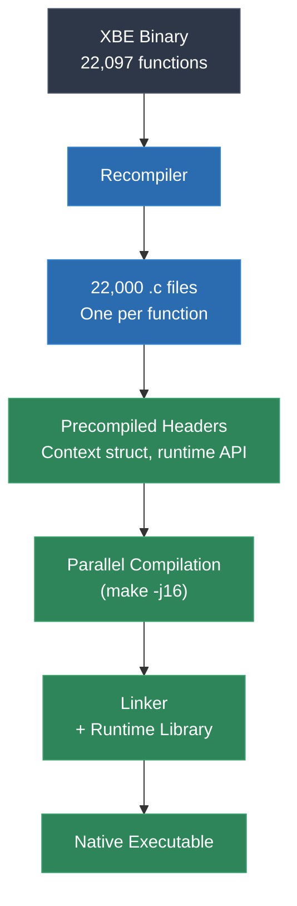

# Module 27: Original Xbox and Win32

The original Xbox is the strangest target in static recompilation -- not because the hardware is exotic, but because it is not. The Xbox runs an Intel Pentium III. Your development PC runs an Intel or AMD x86-64 processor. Same instruction set family. Same endianness. You might expect this to make recompilation trivial. The reality is the opposite: same-ISA recompilation introduces a class of problems that cross-architecture recompilation avoids entirely.

This module explains the same-ISA paradox, the Xbox hardware and software platform, the global register model used to bridge x86-32 and x86-64, the 147 kernel imports that must be shimmed, and the D3D8-to-D3D11 graphics translation layer.

---

## 1. The Same-ISA Paradox

When you recompile MIPS to C, there is no ambiguity about what needs translating. Every instruction is foreign. Every register is a context variable. The recompiler is clearly transforming one world into another.

When you recompile x86-32 to x86-64, the boundary blurs. The instruction set is the same family, but:

- **Register widths change.** x86-32 has 8 general-purpose registers (EAX, EBX, ECX, EDX, ESI, EDI, EBP, ESP), each 32 bits. x86-64 has 16 general-purpose registers (RAX-R15), each 64 bits. The original code was compiled assuming 32-bit registers.
- **Calling conventions change.** x86-32 Windows uses `__stdcall` and `__cdecl` (arguments on the stack). x86-64 Windows uses the Microsoft x64 calling convention (first 4 arguments in RCX, RDX, R8, R9; rest on stack). You cannot simply call a recompiled function from native x64 code without bridging this gap.
- **Memory model changes.** x86-32 uses 32-bit addresses. The original Xbox game allocates memory, stores pointers, and dereferences them all as 32-bit values. On x86-64, pointers are 64 bits. A 32-bit pointer stored in a game data structure will be truncated if used directly.
- **The ABI is incompatible.** Structure layouts, stack frame organization, exception handling mechanisms, and TLS (thread-local storage) all differ between x86-32 and x86-64.

You cannot simply reassemble the original instructions for x86-64. You cannot run the original binary in a compatibility layer (the Xbox has no Windows compatibility). You must recompile -- and the recompilation must handle all the subtle differences between two generations of the same architecture.

---

## 2. The Xbox Platform

### Hardware

The original Xbox, released in 2001, was built from commodity PC components:

- **CPU**: Custom Intel Pentium III (Coppermine) at 733 MHz
- **RAM**: 64 MB unified DDR SDRAM (shared between CPU and GPU)
- **GPU**: Custom NVIDIA NV2A (related to GeForce 3/4)
- **Storage**: 8-10 GB hard drive (every Xbox has one)
- **Optical**: DVD-ROM drive
- Little-endian byte ordering (same as PC)

The NV2A GPU supports vertex and pixel shaders (shader model 1.1-equivalent), hardware transform and lighting, and a register combiner system for fixed-function paths. It implements a D3D8-variant API with NVIDIA-specific extensions.

### Software Environment

The Xbox runs a custom operating system derived from Windows 2000. It is not Windows -- it has no Win32 subsystem, no user-mode DLLs, no registry. But it shares kernel architecture and data structures with Windows 2000. The kernel exports exactly **147 functions** that games can call, covering:

- Memory management (virtual memory, physical memory mapping)
- Threading (thread creation, synchronization, scheduling)
- File I/O (reading from DVD and hard drive)
- Device access (USB controllers, audio hardware)
- Cryptographic functions (SHA-1, RC4, for save game protection)

### XBE Executable Format

Xbox executables use the XBE (Xbox Executable) format, a modified PE (Portable Executable):

```
XBE Layout
===================================================================

 Offset     Content
-------------------------------------------------------------------
 0x0000     XBE Header
             - Magic: "XBEH"
             - Base address (typically 0x00010000)
             - Entry point (encrypted)
             - Section headers offset
             - Library versions
             - TLS directory

 0x0178+    Section Headers
             - .text (code)
             - .data (initialized data)
             - .rdata (read-only data)
             - .bss (uninitialized data)
             - Custom sections (varies by game)

 Varies     Section Data
             - Raw code and data
===================================================================
```

The XBE entry point is encrypted with a known key (the Xbox security has been fully reversed). Section layout is similar to standard PE but with Xbox-specific flags and addresses. Games are loaded at a fixed base address, typically `0x00010000`, and are not position-independent.

---

## 3. The Global Register Model

This is the central architectural decision in Xbox static recompilation. Since the original x86-32 code uses registers in ways that are incompatible with x86-64, the recompiler models all original registers as **global variables**.

### Why Not Translate Register-to-Register?

Consider a simple x86-32 instruction:

```asm
    mov     eax, [ecx + 0x10]     ; load 32-bit value from memory
```

You might think you can emit:

```c
    eax = *(uint32_t*)(ecx + 0x10);
```

But this breaks for several reasons:

1. `ecx` contains a **32-bit address** from the original Xbox memory space. On x86-64, this address is meaningless -- the recompiled program's memory is laid out differently.
2. The original code expects `eax` to be exactly 32 bits. On x86-64, if `eax` is the lower 32 bits of a 64-bit register, writing to it zero-extends to 64 bits -- which may or may not match what subsequent code expects.
3. The original calling convention passes arguments on the stack at known offsets from ESP. The recompiled code uses a different calling convention.

### The Solution: Global Register Context

The recompiler emits all register accesses as reads and writes to a global context structure:

```c
typedef struct {
    uint32_t eax, ebx, ecx, edx;
    uint32_t esi, edi, ebp, esp;
    uint32_t eflags;
    // x87 FPU state
    double st[8];
    int st_top;
    // SSE state (if used)
    __m128 xmm[8];
    // Memory base for address translation
    uint8_t* mem_base;
} X86Context;

X86Context ctx;
```

Every instruction becomes an operation on this context:

```c
// mov eax, [ecx + 0x10]
ctx.eax = *(uint32_t*)(ctx.mem_base + ctx.ecx + 0x10);

// add eax, ebx
{
    uint32_t result = ctx.eax + ctx.ebx;
    // Update flags
    ctx.eflags = compute_flags_add(ctx.eax, ctx.ebx, result);
    ctx.eax = result;
}

// push eax
ctx.esp -= 4;
*(uint32_t*)(ctx.mem_base + ctx.esp) = ctx.eax;
```

The `mem_base` pointer translates Xbox virtual addresses (32-bit) into host addresses (64-bit). The Xbox game's memory space is allocated as a contiguous block, and `mem_base` points to its start. All memory accesses add `mem_base` to the original 32-bit address.

```mermaid
flowchart LR
    subgraph Original["Original Xbox (x86-32)"]
        direction TB
        ORegs["8 GPRs (32-bit)\nEAX-ESP"]
        OMem["64MB Address Space\n0x00000000 - 0x03FFFFFF"]
        OCall["__stdcall / __cdecl\nArgs on stack"]
    end

    subgraph Recompiled["Recompiled (x86-64)"]
        direction TB
        RRegs["Global Context Struct\nctx.eax, ctx.ebx, ..."]
        RMem["mem_base + 32-bit offset\nMapped into 64-bit space"]
        RCall["Native x64 ABI\nContext passed by pointer"]
    end

    Original -->|"Static\nRecompilation"| Recompiled

    style Original fill:#2b6cb0,stroke:#3182ce,color:#fff
    style Recompiled fill:#2f855a,stroke:#38a169,color:#fff
    style ORegs fill:#2b6cb0,stroke:#3182ce,color:#fff
    style OMem fill:#2b6cb0,stroke:#3182ce,color:#fff
    style OCall fill:#2b6cb0,stroke:#3182ce,color:#fff
    style RRegs fill:#2f855a,stroke:#38a169,color:#fff
    style RMem fill:#2f855a,stroke:#38a169,color:#fff
    style RCall fill:#2f855a,stroke:#38a169,color:#fff
```



### Performance Implications

The global register model means the C compiler cannot keep original "registers" in actual CPU registers -- they are memory accesses through a struct pointer. This sounds slow, but in practice:

- The context struct fits entirely in L1 cache
- Modern C compilers are good at promoting frequently-accessed struct members to registers within a basic block
- The alternative (trying to map x86-32 registers to x86-64 registers directly) would require solving the calling convention mismatch, which is harder

---

## 4. 147 Kernel Imports

The Xbox kernel exports exactly 147 functions. Every one that a game calls must be shimmed -- replaced with an implementation that provides equivalent behavior on the host PC.

### Most Commonly Used Kernel Functions

| Ordinal | Function | Purpose | Shim Strategy |
|---|---|---|---|
| 0x00B2 | NtAllocateVirtualMemory | Virtual memory allocation | Map to VirtualAlloc |
| 0x00BA | NtCreateFile | File handle creation | Map to CreateFileW |
| 0x00C8 | NtReadFile | File reading | Map to ReadFile |
| 0x0042 | ExAllocatePool | Pool memory allocation | Map to malloc/HeapAlloc |
| 0x006B | KeSetTimer | Kernel timer | Map to CreateTimerQueueTimer |
| 0x0066 | KeQuerySystemTime | System time | Map to GetSystemTimeAsFileTime |
| 0x0043 | ExFreePool | Pool deallocation | Map to free/HeapFree |
| 0x0031 | DbgPrint | Debug output | Map to OutputDebugStringA |
| 0x006F | KeStallExecutionProcessor | Busy-wait delay | Map to spin loop |
| 0x00A1 | MmAllocateContiguousMemory | Contiguous physical memory | Map to VirtualAlloc (aligned) |

### Categories of Kernel Functions

**Thin wrappers** (~40% of the 147): Functions that have direct Win32 equivalents. `NtCreateFile` maps to `CreateFileW`. `NtReadFile` maps to `ReadFile`. These are straightforward.

**Careful reimplementation** (~30%): Functions where the semantics differ enough to require thought. `NtAllocateVirtualMemory` on Xbox has different alignment guarantees and address range constraints than on Windows. `KeInitializeEvent` creates kernel event objects that must behave identically to Xbox kernel events under all synchronization scenarios.

**Hardware-specific** (~15%): Functions that interact with Xbox hardware that does not exist on PC. `HalReadSMBusValue` reads the System Management Bus (temperature sensors, fan control). `HalReturnToFirmware` reboots the console. These are typically stubbed to return success.

**Cryptographic** (~10%): `XcSHAInit`, `XcRC4Key`, `XcHMAC`, etc. Used for save game encryption and Xbox Live authentication. These must be reimplemented correctly if the game encrypts/decrypts save data.

**Never called in practice** (~5%): Some kernel exports are reserved, deprecated, or only used by the Xbox dashboard. These can be stubbed.

---

## 5. D3D8 to D3D11 Translation

Xbox games use a variant of Direct3D 8 that is close to -- but not identical to -- the PC D3D8 API. The NV2A GPU supports features not in standard D3D8, and the Xbox API exposes them through extensions.

### Key Translation Challenges

**Vertex declarations to input layouts.** D3D8 uses `SetVertexShader` with an FVF (Flexible Vertex Format) code or a vertex declaration. D3D11 uses input layouts bound to vertex shaders. The translation layer must convert FVF codes into D3D11 input element descriptions.

**Fixed-function pipeline to shaders.** D3D8 supports a fixed-function transformation and lighting pipeline. D3D11 does not -- everything must go through programmable shaders. The runtime must generate vertex and pixel shaders that replicate the fixed-function behavior for each combination of render states.

**Texture formats.** The NV2A supports swizzled texture formats that differ from standard D3D8 PC texture formats. Linear and swizzled layouts must be detected and converted.

**Push buffers.** The Xbox D3D8 API supports "push buffers" -- direct command buffer construction that bypasses the D3D8 runtime and talks directly to the NV2A. Games that use push buffers require a low-level command translator.

**Render states and texture stage states.** D3D8 has a large set of render states (alpha blending, Z-buffer modes, fog) and texture stage states (combiners). Each must map to its D3D11 equivalent -- blend state objects, depth-stencil state objects, and shader constants.

### NV2A-Specific Extensions

The Xbox exposes NV2A features not in standard D3D8:

- **Register combiners**: A more flexible version of D3D8 texture stage combiners, offering more inputs and operations per stage
- **Texture shader stages**: Programmable texture coordinate generation (dot product mapping, dependent texture reads)
- **Compressed Z-buffer**: The NV2A uses a proprietary Z-buffer compression scheme

These require custom handling in the translation layer. Register combiners map to pixel shader code; texture shader stages become additional shader logic.

---

## 6. Scale: 22,000 Functions

*Burnout 3* has 22,097 functions in its code section. This scale introduces practical engineering challenges beyond the algorithmic challenges of recompilation.

### Compilation Time

22,000 functions generate roughly 500,000-800,000 lines of C code. Compiling this with optimizations enabled takes significant time:

- **MSVC /O2**: 8-15 minutes on a modern PC
- **GCC -O2**: 6-12 minutes
- **Clang -O2**: 5-10 minutes

Without mitigation strategies, every change to the runtime triggers a full rebuild.

### Mitigation Strategies

**One function per file.** Each recompiled function is emitted as its own `.c` file. This maximizes incremental build parallelism -- changing one function only recompiles one file.

**Precompiled headers.** The context structure and runtime headers are included in every file. Precompiling them eliminates redundant parsing.

**Parallel compilation.** With one function per file and 22,000 files, the build is embarrassingly parallel. A 16-core build machine can compile all files simultaneously.

**Unity builds for release.** For final release builds, concatenating groups of generated files into "unity" translation units reduces linker overhead while maintaining full optimization.



---

## 7. Real-World Projects

### [xboxrecomp](https://github.com/sp00nznet/xboxrecomp) -- the framework

XBE parsing, x86-32 disassembly and function identification, lifting to C on a global
register model, and a runtime with kernel shims and D3D8 translation. Everything else
in this section builds on it.

It is also the best-documented toolkit in the corpus. Before doing anything else, read
`docs/pipeline/` (six numbered files, XBE parsing through debugging) and
`docs/technical/` (nineteen files). Several of them are the primary source for other
modules: `indirect-calls.md` for Module 14, `register-model.md` for this module's
global-register discussion, `rtti-recovery.md`, `seh-handling.md`,
`memory-layout.md`, `conformance-testing.md`.

### [burnout3](https://github.com/sp00nznet/burnout3) -- what is real and what is harness

*Burnout 3: Takedown* (Criterion / EA, 2004). This is the largest Xbox effort in the
corpus, and it needs reading carefully, because the parts that are solid and the parts
that are scaffolding sit in the same repository.

**Verifiable from the code and the toolkit docs:**

- **22,097 functions** lifted from 2.73 MB of x86 and compiled into a native x86-64
  binary. The dispatch table in `xboxrecomp`'s `docs/technical/indirect-calls.md` is
  built from exactly this set.
- **147 kernel imports** mapped to Win32.
- The Xbox's **64 MB of RAM reproduced with `CreateFileMapping` and mirror views**, so
  guest pointers work at the addresses the guest expects.
- `src/game/main.c` is a real host: it loads the XBE, builds the Xbox memory layout,
  brings up the kernel replacement, D3D8→D3D11, DirectSound→XAudio2 and XInput, and then
  calls the game's recompiled entry point.
- The measured indirect-call work in Module 14 -- the garbage-pointer range check taking
  failures from 180 to 121 per 2-second window -- came from this game.

**Not what the screenshots show.** The README presents the main menu -- logo, all five
options, button prompts -- as recompiled output. Open `src/game/fe_menu.c` and it
describes itself:

> Renders a functional menu UI when the game is in frontend state. Detects menu state via
> camera pointer (`0x4D4008` = menus) and renders using the D3D8→D3D11 layer with textures
> from `Global.txd`.

The menu text is a hardcoded array in the harness:

```c
static const char *g_main_menu_labels[FE_MAIN_ITEMS] = { ... };
```

and the cursor movement and selection are hand-written too. The harness watches a game
state address, decides the game is "in menus," and **draws its own menu** using the real
game's textures. The screenshot is genuine pixels from genuine assets -- and the game's
own frontend code is not what put them there.

The same applies to most of `src/game/`: `rw_renderer.c` (1,919 lines), `rw_bridge.c`
(1,068), and the `txd_loader.c` / `awd_loader.c` / `track_loader.c` / `video_player.c`
family are a hand-written RenderWare renderer and asset pipeline. They read the game's
real files and draw them. That is a substantial achievement and it is **not the same
claim** as "the recompiled game renders its menu."

### How to tell, on any project, in about ten minutes

This is the generalisable skill, and it works on your own repo too.

**First, know what you are allowed to see.** Recompiled output from a commercial game is
a derived work and cannot be redistributed, so most game-port repositories deliberately
gitignore it. `LinksAwakening` ignores `rom.c` and `rom_rom.c`; `oracle-recompiled`
ignores `oracle_of_ages.c`; `lttp-recompiled` ignores `recomp_out/`. Those repos ship
only the harness, and that is the correct and legal choice.

The consequence matters: **for most ports, you cannot verify the headline numbers from
the repository at all.** "4.2 million lines of C" and "99.8% native" are claims about a
file that is not there. Treat them as reports, not evidence, and say so when you repeat
them.

Some projects do commit everything -- `diddykongracing` ships `RecompiledFuncs/funcs_0.c`
through `funcs_16.c`, megabytes of generated C, and is the most auditable port in the
corpus. When a project makes that choice, its claims are checkable and worth more.

So the test is:

1. **Check the `.gitignore` first.** It tells you whether the interesting half of the
   project is even present, and therefore what any other observation can prove.
2. **`ls src/` for hand-written names.** `fe_menu.c`, `rw_renderer.c`,
   `static_textures.c` are harness. Generated output is thousands of `sub_XXXXXXXX`
   functions in numbered files. **This is how burnout3 gives itself away** -- the
   generated code is gitignored, but the hand-written menu is committed.
3. **`wc -l` the two groups.** A large harness beside an absent recompilation means the
   screenshots are probably from the harness.
4. **Audit the toolkit, not the port.** You usually cannot read the port, but the
   toolkit it sits on is fully public. If the toolkit is emulator-hosted (Modules 11 and
   12), no port built on it can claim more than the toolkit allows -- regardless of what
   its README says.
5. **Find the fallback and check whether it is silent.** If unresolved or crashing
   functions quietly hand off to an interpreter or a stub, "it runs" is compatible with
   nothing being recompiled at all.
6. **Ask what is driving the frame loop** -- the game's state machine, or your code?
   Module 22's Wind Waker project answers this about itself, unprompted.
7. **Look for the counters.** A project that knows how much of itself is real prints
   `successful` and `failed`. One that does not, has not asked.

None of this makes these projects less impressive. It makes the claims checkable, which
is the difference between a portfolio and a result.

### [xboxdashboard](https://github.com/sp00nznet/xboxdashboard) -- read this one for the retraction

The original Xbox Dashboard (`xboxdash.xbe`, build 3944). Technically it is further
along than it sounds: full init chain, scene graph built from its own `default.xip`, all
67 audio files loaded, frame loop reached, and a render that produces a real NV2A
command stream -- **1,465 words, 360 distinct methods, 0 unrecognised** -- clearing a
1280x960 surface to opaque black.

But the reason it is in this course is the notice at the top of its README:

> An earlier version of this README claimed a "green orb at 60fps". That orb was ours --
> a hand-written disc drawn by scaffolding in this repo, not by the dashboard. It has
> been deleted, along with the fake scene root, hand-rolled asset loader and 2,204
> return-zero stubs that surrounded it. Treat any screenshot from before 2026-09-02 as
> retired.

Read that twice. The project had a picture on screen at 60 fps and the picture was
**its own scaffolding**, drawn by 2,204 return-zero stubs standing in for the program.
The correction was not a quiet edit -- the claim was retracted in public, the
scaffolding deleted, and the old screenshots explicitly marked retired.

This is the characteristic failure mode of recompilation work, and it is worth naming:
**your harness can produce the evidence you were hoping to see.** Stubs that return zero
let a program proceed; scaffolding that draws something makes a window look alive. The
current README's framing is the antidote -- "the stream contains 0 draws, so no geometry
has been submitted yet, and nothing in this repo has ever put a pixel on screen that the
dashboard did not ask for." Attribute every observed behaviour to *the guest* or to
*your own code*, explicitly, before you believe it.

### [hl2-recomp](https://github.com/sp00nznet/hl2-recomp) and [crimsonskies-recomp](https://github.com/sp00nznet/crimsonskies-recomp)

Two more titles on the same toolkit -- *Half-Life 2* (Xbox, 2005) and *Crimson Skies:
High Road to Revenge* (2003). Useful for seeing which parts of the runtime are genuinely
reusable across titles and which keep getting rewritten per game.

### [pcrecomp](https://github.com/sp00nznet/pcrecomp)

Targets PC x86-32 executables rather than XBE files. Same global register model and code
generation, no kernel shimming, because PC games call Win32 directly. Proof that the
same-ISA technique generalises off the Xbox.

### [xwa](https://github.com/sp00nznet/xwa) (X-Wing Alliance)

*Star Wars: X-Wing Alliance* (1999) was never on Xbox -- it runs the same x86-32 to
x86-64 pipeline against a PC binary, and it is the best example in the corpus of the
step this module has not mentioned yet: **getting the code out at all.**

| Phase | Result |
|---|---|
| Binary analysis, PE parsing, section mapping | complete |
| **SafeDisc decryption, memory dump from runtime** | complete |
| Function discovery | 2,674 functions, 443,224 instructions |
| Code generation | 2,701 functions, **606,424 lines of C** |
| Compile and link | 0 errors, 1 warning |
| Runtime, Win32/DirectX HAL, D3D11 backend | complete |
| Frontend, concourse, menus, flight entry | complete |
| Visible 3D flight | in progress |

Phase 1 is the one to notice. The shipping executable is **SafeDisc-encrypted**, so
there is no code in the file to disassemble. The approach was not to defeat the
protection statically -- it was to let the program decrypt itself, then **dump the
process memory** and recompile what was actually running.

That generalises to every protected binary you will meet. The loader's job is to produce
plaintext code in memory; your job is only to be there when it does. Static unpacking is
a separate and much harder research problem, and you rarely need to solve it.

Phases 2 and 3 are also worth noting for a reason this module has not raised: function
discovery found **2,674** functions and code generation emitted **2,701**. Codegen
produced *more* functions than discovery found -- the extra ones came from splitting at
branch targets. Module 20 explains why that number drifting upward is a warning sign, not
a win.

**And then read `src/game/main.c` before you read the flight screenshots.** It is 5,037
lines of committed harness, and its comments are more honest than the README:

- `xwa_native_mesh -- draw the game's own loaded OPT geometry (XWA_NATIVEDRAW)`. The
  harness walks the engine's loaded models and draws them itself.
- `Per-object stand-in scene records` and a helper answering *"Is this pointer one of
  **OUR fabricated** stand-in scene records (rather than a real one the engine made)?"*
- `Starfield: without it a correct scene still reads as an empty blue void.` Hand-written.
- `xwa_craft_opt(unsigned type)` -- a hand-written craft-type to model-path mapping.
- `xwa_drive_render` -- the harness drives the render path.

So the OPT geometry and the 1999 textures are genuinely the game's data, and the thing
putting them on screen is `main.c`. Same shape as `burnout3` and the retracted
`xboxdashboard` orb.

**That is three out of three on this platform**, and the reason is structural rather than
careless. On Xbox and Win32 the graphics path is COM -- `com_mocks.c` here is 144 KB of
interface mocks -- and a COM vtable is exactly the indirect-dispatch case Module 14 says
is hardest. When the game's own renderer will not run yet, reading its loaded assets and
drawing them yourself is the obvious way to make progress, and it produces a screenshot
that looks like success.

It is legitimate work. Label it. This project does, in its comments -- including
`No measurement has pinned this constant, so it stays a knob` about its OPT unit scale,
which is the right way to record a guess.

### Lessons Learned

1. **Same ISA does not mean easy.** The ABI mismatch between x86-32 and x86-64 creates problems that are different from, but no less difficult than, cross-architecture recompilation. The global register model is essential.

2. **The 147 kernel functions are tractable.** Having a fixed, documented API surface makes the shimming problem bounded. You know exactly what you need to implement. Compare this to Xbox 360, where the system API surface is much larger.

3. **D3D8 translation is the long pole.** Getting the CPU code to run is achievable in weeks. Getting the graphics to render correctly takes months. Every game uses a different subset of D3D8 features, and each subset reveals new edge cases in the translation layer.

4. **Build system engineering matters.** At 22,000 functions, the build system is not an afterthought -- it is a core component that directly affects developer productivity. Getting incremental builds right saves hours per day during development.

---

## Lab Reference

**Lab 14** guides you through examining an XBE binary, running the xboxrecomp pipeline on a subset of functions, inspecting the global register model in the generated C code, and building a minimal native executable that exercises several kernel shims.

---

## Next Module

[Module 28: Xbox 360 / Xenon PPC](../module-28-xbox360-xenon/lecture.md) -- From x86 to triple-core PowerPC with VMX128 SIMD. The Xbox 360 takes everything you learned about the original Xbox and adds multi-core complexity and an entirely different ISA.
