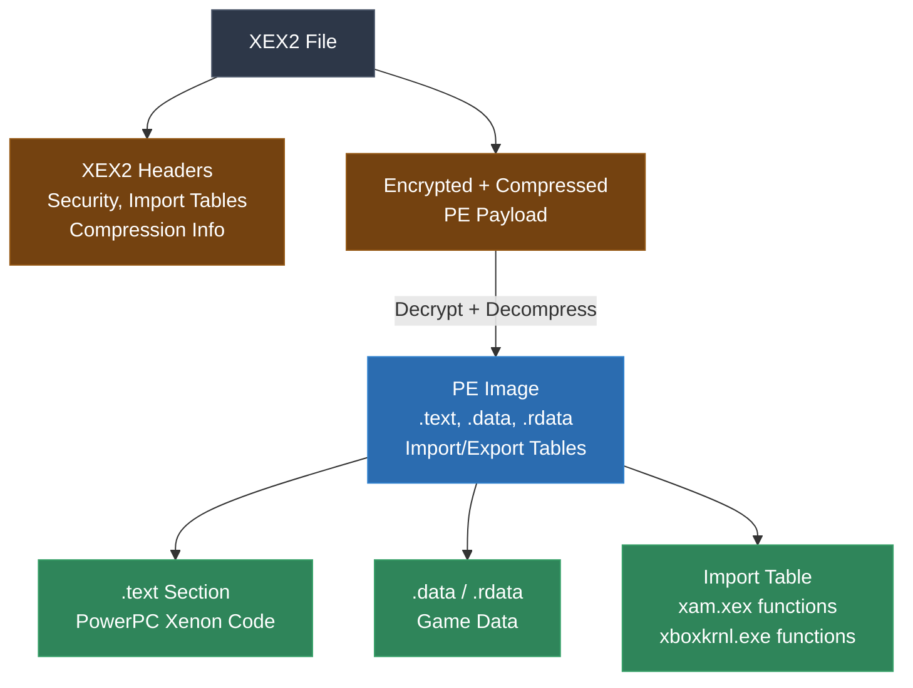
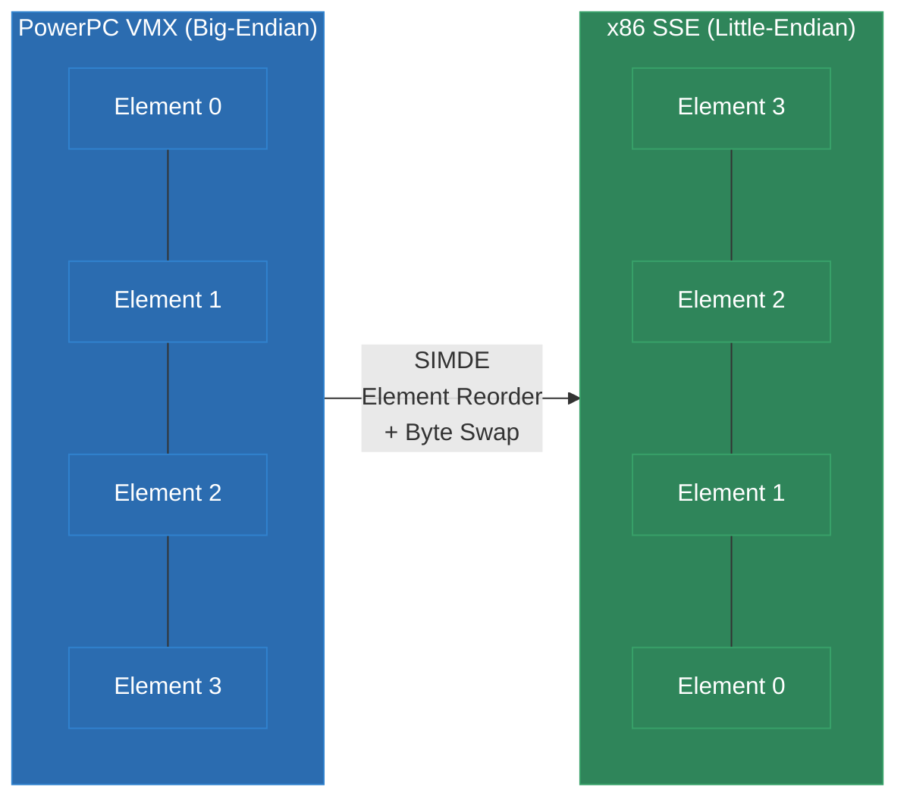
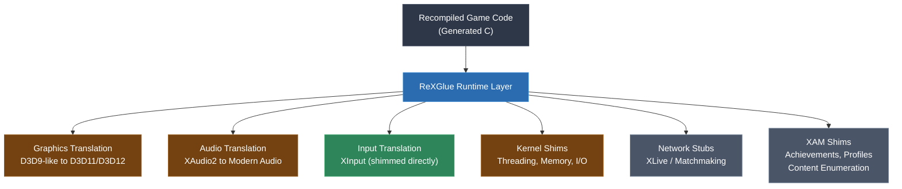

# Module 28: Xbox 360 and PowerPC Xenon

The Xbox 360 represents a massive leap in complexity from the N64. Where an N64 game has 2,000-5,000 functions, an Xbox 360 game routinely has 10,000-50,000 or more. The CPU is a triple-core PowerPC Xenon with VMX/Altivec SIMD, the executable format is encrypted and compressed, and the runtime must shim an entire modern console operating system. This is where static recompilation pushes against the boundaries of what was previously thought feasible.

This module covers the Xbox 360 hardware, the 360tools analysis toolkit, XenonRecomp's pipeline, PowerPC Xenon specifics that affect code generation, VMX-to-SIMDE translation, and the ReXGlue runtime layer.

---

## 1. The Xbox 360 Platform

Released in 2005, the Xbox 360 was a significant departure from its predecessor. Where the original Xbox used commodity PC hardware (an Intel x86 CPU, an NVIDIA GPU), the 360 used a custom IBM PowerPC processor and an ATI-designed GPU.

### CPU: PowerPC Xenon (Waternoose)

The Xenon processor contains three symmetric PowerPC cores, each clocked at 3.2 GHz:

- **3 cores**, each with **2 hardware threads** (6 hardware threads total)
- In-order execution (no out-of-order engine -- games must be carefully scheduled)
- **128 VMX/Altivec registers per thread** (128-bit SIMD)
- 32 KB L1 instruction cache + 32 KB L1 data cache per core
- 1 MB shared L2 cache
- Big-endian byte ordering

The in-order design is important for recompilation: it means instruction scheduling in the original binary is meaningful and intentional. The compiler that built the original game worked hard to hide latencies, and the recompiled code benefits from the host compiler re-scheduling for the host's out-of-order pipeline.

### Memory

512 MB of unified GDDR3 RAM shared between CPU and GPU. No separate VRAM. The memory bus is 128-bit wide at 700 MHz, providing 22.4 GB/s of bandwidth.

### GPU: Xenos

The Xenos GPU was designed by ATI (now AMD) and introduced unified shader architecture to consoles -- the same shader units handle both vertex and pixel processing. It has 48 unified shader units and 10 MB of embedded DRAM (eDRAM) used for the framebuffer and as a fast render target.

### XEX2 Executable Format

Xbox 360 executables use the XEX2 format, a Microsoft-designed container that wraps a PE (Portable Executable) image with:

- **Encryption**: AES encryption of the PE payload
- **Compression**: LZX compression of the encrypted data
- **Digital signatures**: RSA signatures for code integrity
- **Import tables**: References to Xbox 360 system libraries (xam.xex, xboxkrnl.exe)
- **Security headers**: Media type restrictions, region codes, title ID



---

## 2. 360tools and XenonRecomp

### 360tools: Analysis Toolkit

360tools is a suite of utilities for working with Xbox 360 binaries:

- **XEX parser**: Decrypts, decompresses, and extracts the PE image from XEX2 containers
- **Disassembler**: PowerPC Xenon disassembly with VMX instruction support
- **Import resolver**: Maps import ordinals to known Xbox 360 API function names
- **Function analyzer**: Identifies function boundaries in stripped binaries using prologue/epilogue patterns

### XenonRecomp: The Recompiler Pipeline

[XenonRecomp](https://github.com/hedge-dev/XenonRecomp), created by **Skyth** ([hedge-dev](https://github.com/hedge-dev)), is the static recompiler for Xbox 360 binaries. Its codegen and instruction translation build on foundational work by **[rexdex](https://github.com/rexdex/recompiler)**, whose Xbox 360 recompiler was the first to prove static recompilation was viable on this platform. Skyth's collaboration with **Sajid** (who created XenonAnalyse for binary analysis) and **Hyper** (system-level features) culminated in **[UnleashedRecomp](https://github.com/hedge-dev/UnleashedRecomp)** -- a full native PC port of Sonic Unleashed from Xbox 360, and one of the most impressive demonstrations of static recompilation at scale.

XenonRecomp's pipeline follows the standard pattern but with Xbox 360-specific stages:

1. **XEX2 Parsing**: Decrypt and decompress to extract the raw PE
2. **PE Analysis**: Parse sections, resolve imports, identify code vs. data regions
3. **Function Identification**: Use a combination of call targets, prologue patterns (`mflr r12; stw r12, -8(r1); stwu r1, -N(r1)`), and manual symbol files
4. **Disassembly**: Recursive descent through PowerPC instructions
5. **Lifting**: Translate PPC instructions to C, handling the condition register, link register, VMX operations
6. **Code Generation**: Emit compilable C source with the ReXGlue runtime interface

### Function Identification in Stripped Binaries

Xbox 360 games are stripped -- no debug symbols, no function names. Finding function boundaries in a 20MB code section requires multiple strategies:

- **BL targets**: Every `BL` (Branch and Link) instruction identifies a function entry point
- **Prologue matching**: Xbox 360 compilers (Microsoft's PPC compiler) emit recognizable function prologues
- **Exception tables**: Some XEX2 files include exception handling tables that list function boundaries
- **Import stubs**: Functions that load from the import table have a distinctive stub pattern

Typical accuracy is 95-98% of functions identified automatically, with the remainder requiring manual annotation.

---

## 3. PowerPC Xenon Specifics

PowerPC is a more complex architecture to recompile than MIPS. It has features that require careful modeling in the generated C code.

### Condition Register

The PowerPC condition register (CR) has 8 fields (CR0-CR7), each containing 4 bits: LT (less than), GT (greater than), EQ (equal), SO (summary overflow). Compare instructions write to a specific CR field, and branch instructions can test any CR field.

```asm
    cmpwi   cr6, r3, 0       ; compare r3 with 0, result in CR6
    cmpwi   cr7, r4, 10      ; compare r4 with 10, result in CR7
    blt     cr6, label1       ; branch if CR6.LT is set
    beq     cr7, label2       ; branch if CR7.EQ is set
```

The recompiler must model all 8 CR fields. The straightforward approach is to store each CR field as a struct:

```c
// cmpwi cr6, r3, 0
{
    int32_t a = (int32_t)ctx->r[3];
    int32_t b = 0;
    ctx->cr[6].lt = (a < b);
    ctx->cr[6].gt = (a > b);
    ctx->cr[6].eq = (a == b);
    ctx->cr[6].so = ctx->xer_so;
}

// blt cr6, label1
if (ctx->cr[6].lt) goto label1;
```

### Link Register and Count Register

PowerPC uses a **link register** (LR) for function calls and returns, and a **count register** (CTR) for counted loops and indirect branches:

- `BL target` -- branch to target, save return address in LR
- `BLR` -- branch to address in LR (function return)
- `MTCTR r3` -- move r3 into CTR
- `BDNZ loop` -- decrement CTR, branch if not zero
- `BCTR` -- branch to address in CTR (indirect call)

The LR and CTR must be modeled as context variables. `BCTR` (branch to CTR) is particularly challenging because it is an indirect jump -- the recompiler must determine the possible targets through analysis or emit a runtime dispatch.

### Special-Purpose Registers (MTxx/MFxx)

PowerPC has numerous special-purpose registers accessed via `MTSPR`/`MFSPR` (Move To/From Special-Purpose Register):

| SPR | Name | Purpose |
|---|---|---|
| 1 | XER | Fixed-point exception register (carry, overflow) |
| 8 | LR | Link register |
| 9 | CTR | Count register |
| 268-271 | TB | Time base (read-only timer) |

The recompiler must handle each SPR. Most are straightforward context variables, but the time base requires a runtime implementation that provides a monotonically increasing counter.

### VMX/Altivec (128-bit SIMD)

Xbox 360 games make **extremely heavy** use of VMX/Altivec SIMD instructions. Game math -- vector operations, matrix transformations, physics calculations, animation blending -- is almost entirely vectorized. A typical Xbox 360 game has thousands of VMX instructions.

VMX registers are 128 bits wide and can be interpreted as:

- 4 x 32-bit floats
- 4 x 32-bit integers
- 8 x 16-bit integers
- 16 x 8-bit integers
- 2 x 64-bit integers (Xenon extension)

---

## 4. VMX/Altivec to SIMDE Translation

The translation of VMX/Altivec SIMD operations to host-native SIMD is one of the most critical performance challenges in Xbox 360 recompilation.

### The Problem

VMX/Altivec instructions operate on 128-bit vectors with big-endian element ordering. x86 SSE operates on 128-bit vectors with little-endian element ordering. ARM NEON uses yet another convention. A direct 1:1 instruction mapping does not exist for most operations because the element ordering differs.

### SIMDE: The Translation Layer

SIMDE (SIMD Everywhere) is a header-only library that provides portable implementations of SIMD intrinsics. XenonRecomp generates C code that uses SIMDE Altivec intrinsics, which SIMDE then compiles to the optimal SIMD instructions for the host platform.

Here is a concrete example -- a vector dot product pattern common in game math:

```asm
; PowerPC VMX: dot product of v3 and v4, result in v5
    vmaddfp   v5, v3, v4, v0     ; v5 = v3 * v4 + v0 (v0 = zero vector)
    vperm     v6, v5, v5, v10    ; shuffle to prepare for horizontal add
    vaddfp    v5, v5, v6         ; partial horizontal add
    vperm     v6, v5, v5, v11    ; shuffle again
    vaddfp    v5, v5, v6         ; final horizontal sum in all elements
```

The generated SIMDE code:

```c
// vmaddfp v5, v3, v4, v0
ctx->v[5] = vec_madd(ctx->v[3], ctx->v[4], ctx->v[0]);

// vperm v6, v5, v5, v10
ctx->v[6] = vec_perm(ctx->v[5], ctx->v[5], ctx->v[10]);

// vaddfp v5, v5, v6
ctx->v[5] = vec_add(ctx->v[5], ctx->v[6]);

// vperm v6, v5, v5, v11
ctx->v[6] = vec_perm(ctx->v[5], ctx->v[5], ctx->v[11]);

// vaddfp v5, v5, v6
ctx->v[5] = vec_add(ctx->v[5], ctx->v[6]);
```

SIMDE compiles `vec_madd` to `_mm_fmadd_ps` (FMA3) or `_mm_add_ps(_mm_mul_ps(...))` (SSE) on x86, and to `vfmaq_f32` on ARM NEON. The `vec_perm` call compiles to `_mm_shuffle_epi8` (SSSE3) on x86.

### Endianness and Element Ordering

The most subtle issue is element ordering. VMX numbers elements 0-3 from left to right (big-endian convention), while SSE numbers elements 0-3 from right to left (little-endian convention). A `vperm` (vector permute) instruction that shuffles elements in a specific order on PowerPC must have its permute control vector byte-reversed when compiled for a little-endian host.

SIMDE handles this automatically when the permute control vector is a compile-time constant. When it is loaded from memory at runtime (common in Xbox 360 games that store permute tables), the recompiler must insert endian-swap logic.



---

## 5. ReXGlue Runtime

The runtime for Xbox 360 recompilation is substantially more complex than for older consoles. The Xbox 360 has a full operating system with system libraries, and games call into these libraries extensively.

### Architecture

ReXGlue is the runtime shim layer that translates Xbox 360 API calls into modern PC equivalents:



### Graphics: D3D9-like to D3D11/D3D12

Xbox 360 games use a graphics API that is a close cousin of Direct3D 9, with Xbox-specific extensions. The Xenos GPU has features not present in standard D3D9 (predicated tiling, eDRAM resolve, memexport). The graphics translation layer must:

- Translate vertex and pixel shader bytecode (Xbox 360 uses a modified D3D9 shader model)
- Map render state calls to D3D11/D3D12 pipeline state objects
- Handle the Xenos tiling architecture (games explicitly manage eDRAM partitioning)
- Translate texture formats (some are Xenos-specific swizzled formats)

### Audio: XAudio2 Translation

Xbox 360 games use XAudio2 for audio, which is convenient because XAudio2 also exists on Windows. However, the Xbox 360 version predates the Windows version and has API differences. The shim layer bridges these differences and handles Xbox 360-specific audio features like hardware XMA decoding.

### XInput: Direct Mapping

Xbox 360 controller input uses XInput, which is natively supported on Windows. This is one of the few areas where the API maps almost directly, requiring minimal shimming.

### Kernel and XAM

The Xbox 360 kernel (xboxkrnl.exe) and system library (xam.xex) export hundreds of functions for:

- **Threading**: Thread creation, synchronization primitives, thread-local storage
- **Memory management**: Virtual memory allocation, physical memory mapping
- **File I/O**: Content packages, save games, DLC enumeration
- **Networking**: Xbox Live services, matchmaking, leaderboards
- **Profile management**: Achievements, gamer profiles, settings

Many networking and Xbox Live functions are stubbed (returning success but doing nothing), since the Xbox Live infrastructure no longer exists for most games. Threading and memory management require careful reimplementation to match Xbox 360 semantics.

---

## 6. Real-World Projects

### gh2 (Guitar Hero 2)

Guitar Hero 2 is a rhythm game and one of the flagship XenonRecomp projects:

- **Approximately 15,000 functions**
- Heavy audio processing requirements (rhythm detection, audio mixing)
- Custom content loading system for songs and charts
- Relatively moderate graphics complexity (stylized 3D, not photorealistic)
- Good initial target because the game logic is well-structured

### simpsonsarcade (The Simpsons Arcade Game)

An XBLA (Xbox Live Arcade) title -- smaller than full retail games:

- **Approximately 8,000 functions** (smaller scope)
- 2D gameplay with 3D rendering
- Useful as a validation target for the core recompilation pipeline
- XBLA titles often have simpler system API usage

### ctxbla (Crazy Taxi)

Another XBLA title, a port of the Dreamcast/arcade classic:

- **Approximately 12,000 functions**
- Interesting because the underlying game code has Dreamcast heritage
- Tests physics and open-world streaming systems
- Audio system uses multiple XAudio2 voices simultaneously

### vig8 (Vigilante 8)

- **Approximately 10,000 functions**
- Vehicular combat with destructible environments
- Tests physics simulation and particle systems
- Multiplayer code paths (local split-screen)

### Scale Summary

| Project | Functions | Category | Key Challenge |
|---|---|---|---|
| gh2 | ~15,000 | Retail | Audio pipeline, content loading |
| simpsonsarcade | ~8,000 | XBLA | Baseline validation |
| ctxbla | ~12,000 | XBLA | Physics, streaming |
| vig8 | ~10,000 | XBLA | Physics, multiplayer |

### Lessons Learned

1. **VMX is everywhere.** In N64 games, you can recompile most of the game without worrying about the coprocessor. In Xbox 360 games, VMX instructions are in virtually every function. If your VMX lifting is wrong, nothing works.

2. **Endianness is pervasive.** The Xbox 360 is big-endian, PCs are little-endian. Every memory access that crosses the boundary between recompiled code and the host system must be byte-swapped. Getting this wrong produces bugs that are extremely difficult to diagnose -- the game runs but data is corrupted in subtle ways.

3. **Scale changes everything.** Recompiling 15,000 functions generates hundreds of thousands of lines of C. Compilation time becomes a real concern. Incremental builds, precompiled headers, and parallel compilation are not luxuries -- they are necessities.

4. **The runtime dwarfs the recompiler.** Writing XenonRecomp (the recompiler) is the smaller part of the project. Writing ReXGlue (the runtime) -- shimming the Xbox 360 OS, translating the graphics API, handling the audio system -- is where the majority of the work lives.

---

## Lab Reference

**Lab 17** walks you through analyzing an Xbox 360 XEX2 binary with 360tools, examining the import table, running XenonRecomp on a subset of functions, and inspecting the generated C code for VMX operations and condition register handling.

---

## Next Module

[Module 13: Original Xbox and Win32](../module-13-xbox-win32/lecture.md) -- What happens when the source and target architectures are the same ISA? The original Xbox runs x86, just like your PC. It should be easy. It is not.
