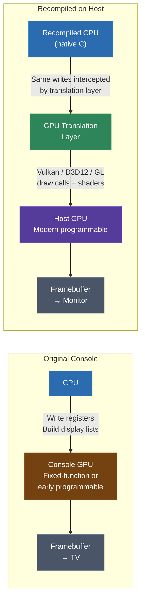
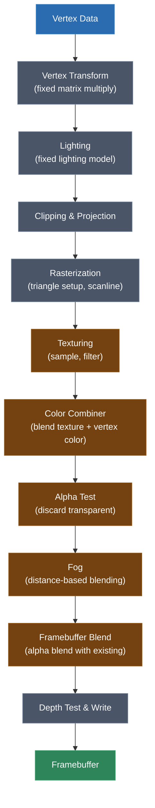
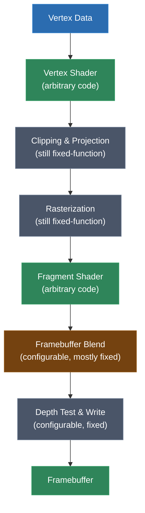
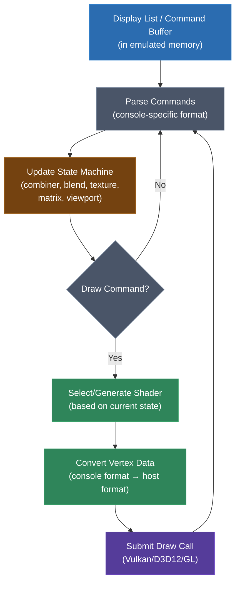
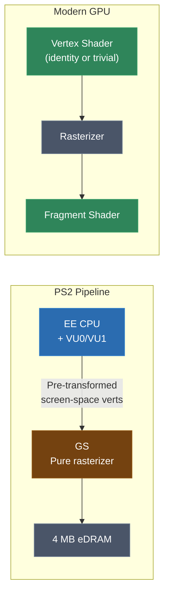
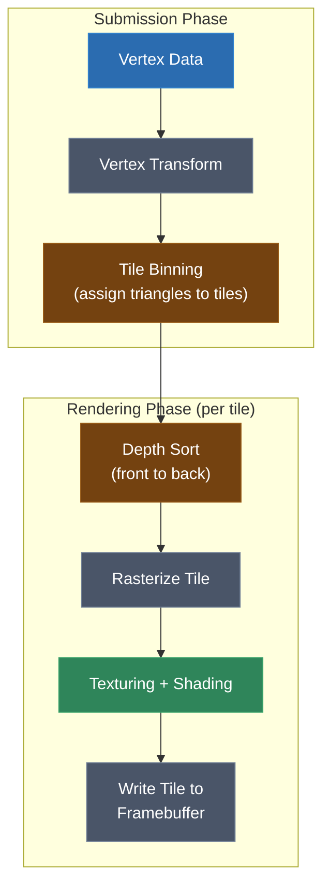
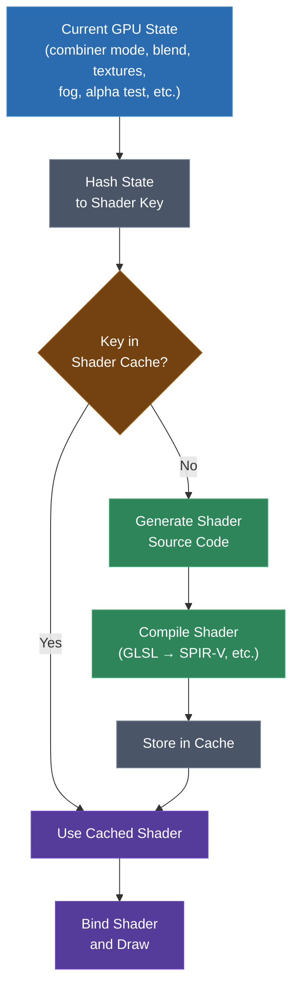
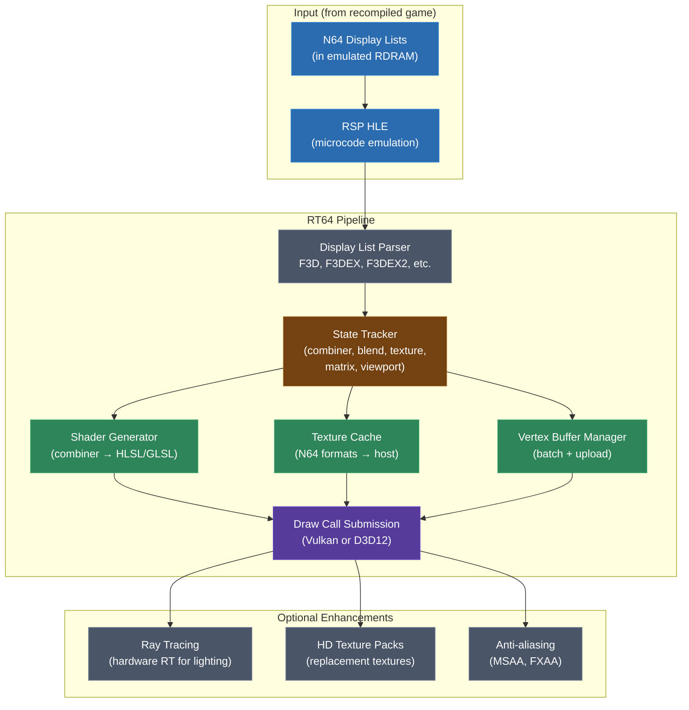

# Module 29: GPU Pipeline Translation

Every console you've studied in this course has a different graphics pipeline. The N64's Reality Display Processor is a fixed-function rasterizer fed by microcode-driven display lists. The GameCube's TEV pipeline chains up to 16 texture environment stages. The PS2's Graphics Synthesizer is a pure rasterizer with no vertex transformation at all. The original Xbox has a programmable GPU that looks almost modern. The Xbox 360 introduced unified shaders in a custom format. The Dreamcast uses tile-based deferred rendering with modifier volumes.

And yet, the modern GPU you're targeting -- whether through Vulkan, Direct3D 12, or OpenGL -- expects one thing: programmable shaders. Vertex shaders, fragment shaders, maybe compute shaders. There are no fixed-function combiner modes, no TEV stages, no hardware color combiners (well, there are, but they're vestigial and insufficient). The entire rendering model has changed.

This module is about bridging that gap. How do you take the GPU commands from an original console and translate them into something a modern GPU can execute? This is the graphics counterpart to instruction lifting -- instead of translating CPU instructions to C, you're translating GPU state and commands into shader programs and draw calls. It's arguably the harder problem, and it's the one that determines whether your recompiled game actually looks right.

---

## 1. The GPU Translation Problem

Let's start with what we're actually trying to do. In a recompiled game, the CPU code has been lifted to C and compiled for the host. That CPU code is executing, and at some point, it does what the original CPU did: it sets up graphics state and tells the GPU to draw things. On the original hardware, that meant writing to memory-mapped GPU registers, building display lists in RAM, or submitting command buffers through a driver API. On the host, there's no original GPU -- we need to intercept those commands and translate them.

The fundamental pattern looks like this:



### What Makes This Hard

CPU instruction lifting is a largely mechanical process. You have a well-defined instruction set, each instruction has clear semantics, and you translate it to C code that does the same thing. GPU translation is different in several fundamental ways:

1. **State machines, not instructions.** A GPU pipeline is configured by setting state -- blend mode, depth test, texture format, combiner mode -- and then issuing a draw command. The draw command's behavior depends on the accumulated state. You can't translate each state change independently; you need to understand the full pipeline configuration at draw time.

2. **Fixed-function → programmable.** The original hardware implements rendering features in dedicated circuits. You must express those features as shader code. This means generating shaders -- often at runtime -- that replicate exact combiner behavior, alpha test modes, fog calculations, and other operations that the original hardware did in fixed silicon.

3. **Timing and ordering.** The original GPU processes commands in a specific order with specific latency. Some games exploit this -- they rely on partial renders, mid-frame state changes, or precise framebuffer feedback. Getting the ordering wrong produces visual artifacts even if every individual draw call is correct.

4. **Format differences.** Textures, vertex data, and framebuffer formats on consoles are often completely different from what modern GPUs expect. You need conversion layers for everything.

5. **Resolution and aspect ratio.** The original game targets a fixed resolution (often 240p or 480i). Users expect the recompiled version to run at higher resolutions. Scaling up sounds simple but breaks games that use pixel-exact rendering, screen-space coordinates, or framebuffer effects.

### The Spectrum of Approaches

Not every project needs a full GPU translation layer. The approaches range from simple to complex:

- **Software rendering**: Run the original GPU's rasterizer in software on the host CPU. Accurate but slow. Good for testing, bad for performance.
- **API wrapping**: If the original console used a recognized API (like the original Xbox's D3D8), wrap it to a modern API version. Relatively straightforward.
- **Command-level translation**: Intercept each GPU command and translate it to an equivalent modern draw call, generating shaders to replicate fixed-function behavior. This is the approach used by most serious projects.
- **Full pipeline reimplementation**: Rewrite the entire rendering backend, understanding what the game is trying to draw and implementing it natively. Maximum quality but enormous effort.

Most real-world recompilation projects land on command-level translation, and that's what we'll focus on in this module.

---

## 2. Fixed-Function vs. Programmable: The Core Tension

To understand GPU translation, you need to understand the historical divide between fixed-function and programmable rendering pipelines, because that divide is the source of almost every translation challenge.

### The Fixed-Function Era

Consoles from the mid-1990s through the early 2000s -- the N64, PlayStation, PlayStation 2, Dreamcast, GameCube -- all use fixed-function graphics pipelines. "Fixed-function" means the hardware implements a specific set of rendering operations in dedicated circuitry. You can configure which operations are active and what parameters they use, but you cannot write arbitrary code that runs on the GPU.

A typical fixed-function pipeline looks like this:



Each stage is configurable but not programmable. The combiner, for instance, might let you choose from 8 or 16 modes for how to blend the texture color with the vertex color, but those modes are the only options. You can't write a combiner that does something the hardware designers didn't anticipate.

### The Programmable Era

Modern GPUs (everything from about 2003 onward) replaced most of these fixed stages with programmable shaders. The vertex transform and lighting stages became vertex shaders. The texturing, combiner, alpha test, and fog stages became fragment (pixel) shaders. Later, geometry shaders, tessellation shaders, and compute shaders were added.

A modern pipeline:



The key insight: **everything the fixed-function combiner, alpha test, fog, and lighting stages did must now be expressed as shader code.** When you're translating from a fixed-function console GPU to a modern programmable GPU, you're essentially writing shader programs that replicate the behavior of the original hardware's fixed circuits.

### The Translation Challenge in One Sentence

GPU translation is the problem of generating shader programs that exactly replicate fixed-function rendering behavior, while also translating all the surrounding state (vertex formats, texture formats, framebuffer configuration) to modern equivalents.

---

## 3. Display List and Command List Translation

Most consoles organize their GPU work as a sequence of commands -- a display list or command buffer that the GPU processes in order. The general translation pattern is:

1. The recompiled CPU code builds display lists in emulated memory (just as the original code did)
2. The translation layer walks those display lists, parsing each command
3. For each command, the translator updates its internal state machine and/or issues modern API calls
4. At synchronization points (vsync, buffer swap), the translation layer presents the rendered frame

### N64 Display Lists

The N64's display list format is the most well-understood because it's been the focus of the most recompilation work. The RSP (Reality Signal Processor) processes microcode that reads display lists from RDRAM and feeds processed triangle commands to the RDP. In a recompilation context, the RSP microcode is typically HLE'd (high-level emulated) -- the translation layer intercepts the display list directly rather than executing microcode.

An N64 display list is a sequence of 64-bit commands:

```
Display List Command Structure (64 bits)
================================================================
Bits 56-63:  Command byte (opcode)
Bits 0-55:   Command-specific data
```

Common commands in the F3DEX2 microcode format:

| Command | Opcode | Purpose |
|---------|--------|---------|
| G_VTX | 0x01 | Load vertices into the vertex buffer |
| G_TRI1 | 0x05 | Draw a single triangle |
| G_TRI2 | 0x06 | Draw two triangles |
| G_TEXTURE | 0xD7 | Set texture parameters |
| G_SETCOMBINE | 0xFC | Set color combiner mode |
| G_SETOTHERMODE_L | 0xE2 | Set blender, alpha compare, z-mode |
| G_SETOTHERMODE_H | 0xE3 | Set pipeline modes (cycle type, etc.) |
| G_SETTIMG | 0xFD | Set texture image address |
| G_LOADBLOCK | 0xF3 | Load texture data into TMEM |
| G_SETTILE | 0xF5 | Configure a tile descriptor |
| G_DL | 0xDE | Branch to another display list |
| G_ENDDL | 0xDF | End of display list |
| G_MTX | 0xDA | Load a matrix |
| G_MOVEWORD | 0xDB | Set a word in DMEM (fog, lightcol, etc.) |

The translation layer maintains a state machine tracking the current combiner mode, blender configuration, texture settings, loaded matrices, and vertex buffer contents. When it encounters a triangle draw command, it has all the state it needs to issue a modern draw call.

Here's a simplified flow of how a translation layer processes an N64 display list:

```python
# Simplified N64 display list processor
class N64DisplayListProcessor:
    def __init__(self, renderer):
        self.renderer = renderer
        self.vertices = [None] * 32  # vertex buffer (32 slots)
        self.combiner_mode = None
        self.blend_mode = None
        self.texture_on = False
        self.current_tile = None
        self.matrix_stack = []

    def process(self, dl_address, memory):
        pc = dl_address
        while True:
            word1 = memory.read_u32(pc)
            word2 = memory.read_u32(pc + 4)
            cmd = (word1 >> 24) & 0xFF
            pc += 8

            if cmd == 0x01:    # G_VTX
                self.load_vertices(word1, word2, memory)
            elif cmd == 0x05:  # G_TRI1
                v0 = (word1 >> 16) & 0xFF
                v1 = (word1 >> 8) & 0xFF
                v2 = word1 & 0xFF
                self.draw_triangle(v0 // 2, v1 // 2, v2 // 2)
            elif cmd == 0xFC:  # G_SETCOMBINE
                self.combiner_mode = (word1, word2)
                self.renderer.set_combiner(word1, word2)
            elif cmd == 0xFD:  # G_SETTIMG
                fmt = (word1 >> 21) & 0x07
                siz = (word1 >> 19) & 0x03
                addr = word2 & 0x01FFFFFF
                self.renderer.set_texture_image(fmt, siz, addr)
            elif cmd == 0xDE:  # G_DL (branch)
                branch = (word1 >> 16) & 0xFF
                if branch == 0:  # push
                    self.process(word2 & 0x01FFFFFF, memory)
                else:  # jump (no return)
                    pc = word2 & 0x01FFFFFF
            elif cmd == 0xDF:  # G_ENDDL
                return
            # ... many more commands
```

### GameCube/Wii Display Lists

The GameCube's GPU (known as Flipper, with its GX API) uses a different command format. GX commands are register writes to the GPU's command processor, organized as 8-bit command bytes followed by variable-length data:

```
GX Command Format
================================================================
Byte 0:     Command type
            0x08: Load CP register
            0x10: Load XF register
            0x61: Load BP register
            0x80+: Draw primitive (type + vertex count)

For register loads:
  Byte 1:     Register address
  Bytes 2-5:  32-bit value

For draw commands:
  Byte 0:     0x80 | (primitive_type << 3) | vat_index
  Bytes 1-2:  Vertex count (16-bit)
  Remaining:  Vertex data (format determined by VCD/VAT registers)
```

The GameCube's rendering pipeline centers around the **TEV** (Texture Environment) unit, which we'll cover in detail in section 5. The key difference from N64 is that GX commands are lower-level register writes rather than high-level operations, and the vertex format is highly configurable through VCD (Vertex Component Description) and VAT (Vertex Attribute Table) registers.

### Xbox Command Buffers

The original Xbox uses a modified version of Direct3D 8, and its GPU (NV2A, based on NVIDIA's GeForce 3) processes command buffers called "push buffers" -- sequences of register writes to the GPU. If you're wrapping D3D8 calls, you intercept at the API level rather than the push buffer level. We'll cover this more in section 7.

### The General Pattern

Regardless of the console, the translation pattern is:



1. Parse the command stream
2. Maintain state (the original GPU is a state machine; your translation layer mirrors it)
3. On draw commands, compile/select a shader that matches the current state, convert vertex data, and submit a draw call

---

## 4. N64 RDP → Modern GPU

The N64's RDP (Reality Display Processor) is the most thoroughly reverse-engineered console GPU in the recompilation world, largely thanks to the angrylion/ares software renderer and the RT64 hardware-accelerated renderer built by Dario and Wiseguy for the N64Recomp ecosystem. Let's walk through how its features map to modern GPU concepts.

### RDP Architecture

The RDP is a fixed-function rasterizer that receives commands either directly from the CPU (in XBUS mode) or via the RSP (in DMA mode -- the standard path). It processes triangles and rectangles with:

- 2 cycle modes (1-cycle and 2-cycle), determining how many texture lookups and combiner passes per pixel
- A color combiner with configurable inputs (texel colors, shade color, environment color, primitive color, etc.)
- An alpha combiner (same structure as color combiner but for alpha channel)
- A blender for framebuffer blending
- Texture filtering (bilinear, nearest)
- Z-buffering (per-pixel depth test)
- Anti-aliasing (coverage-based)
- Dithering

### The Color Combiner

The color combiner is the heart of RDP rendering, and translating it to shaders is the core challenge. It computes:

```
output = (A - B) * C + D
```

Where A, B, C, and D are each selected from a set of inputs:

| Input | A options | B options | C options | D options |
|-------|-----------|-----------|-----------|-----------|
| 0 | Combined/Texel0 | Combined/Texel0 | Combined/Texel0/LOD frac | Combined/Texel0 |
| 1 | Texel0/Texel1 | Texel0/Texel1 | Texel1/Prim LOD frac | Texel0/Texel1 |
| 2 | Texel1/Prim | Texel1/Prim | Shade alpha/etc. | Texel1/Prim |
| 3 | Primitive | Primitive | Primitive alpha | Primitive |
| 4 | Shade | Shade | Shade alpha | Shade |
| 5 | Environment | Environment | Environment alpha | Environment |
| 6 | 1.0/Center/Scale | 1.0/Center/Scale | 1.0 | 1.0 |
| 7 | Noise/K4/K5 | 0 | 0 | 0 |

(The exact table varies between color and alpha combiners, and between cycle 1 and cycle 2 in 2-cycle mode. The full table has around 16 options per slot.)

The G_SETCOMBINE command packs all four input selections for both color and alpha, for both cycles, into 64 bits:

```c
// Decoding G_SETCOMBINE
// word1 = upper 32 bits, word2 = lower 32 bits
// Cycle 1 color:
uint8_t cc1_a = (word1 >> 20) & 0x0F;  // A input
uint8_t cc1_b = (word1 >> 15) & 0x0F;  // B input (from B column)
uint8_t cc1_c = (word1 >> 5)  & 0x1F;  // C input
uint8_t cc1_d = (word2 >> 0)  & 0x07;  // D input

// Cycle 1 alpha:
uint8_t ac1_a = (word1 >> 12) & 0x07;
uint8_t ac1_b = (word1 >> 12) & 0x07;  // (different bit ranges, simplified)
// ... etc for cycle 2
```

### Translating the Combiner to a Fragment Shader

The key technique is to generate a fragment shader that implements the combiner formula for the specific mode the game is using. There are thousands of possible combiner configurations, but most games use a much smaller set (typically 20-100 unique modes).

Here's how a common combiner mode translates:

**Mode: TEXEL0 modulated by SHADE (the most basic textured, lit surface)**
```
A = TEXEL0,  B = 0,  C = SHADE,  D = 0
output = (TEXEL0 - 0) * SHADE + 0 = TEXEL0 * SHADE
```

The generated fragment shader:

```glsl
#version 450

layout(binding = 0) uniform sampler2D tex0;

layout(location = 0) in vec2 v_texcoord;
layout(location = 1) in vec4 v_shade_color;

layout(location = 0) out vec4 frag_color;

void main() {
    vec4 texel0 = texture(tex0, v_texcoord);
    vec4 shade = v_shade_color;

    // Combiner: (TEXEL0 - 0) * SHADE + 0
    frag_color = texel0 * shade;
}
```

**Mode: Environment map with vertex alpha (decal with transparency)**
```
A = TEXEL0,  B = 0,  C = ENVIRONMENT,  D = 0
Alpha: A = 0, B = 0, C = 0, D = SHADE_ALPHA
output.rgb = TEXEL0.rgb * ENV.rgb
output.a = SHADE.a
```

```glsl
void main() {
    vec4 texel0 = texture(tex0, v_texcoord);
    vec4 env = u_env_color;      // uniform set from G_SETENVCOLOR
    vec4 shade = v_shade_color;

    frag_color.rgb = texel0.rgb * env.rgb;
    frag_color.a = shade.a;
}
```

### Two-Cycle Mode

In 2-cycle mode, the combiner runs twice. The output of cycle 1 becomes the "combined" input for cycle 2. This allows effects like:

- Texture blending (cycle 1 blends two textures, cycle 2 applies lighting)
- Detail textures (cycle 1 combines base + detail, cycle 2 modulates by shade)
- Interpolation between texel colors using primitive alpha as a blend factor

A 2-cycle shader simply chains both combiner passes:

```glsl
void main() {
    vec4 texel0 = texture(tex0, v_texcoord0);
    vec4 texel1 = texture(tex1, v_texcoord1);
    vec4 shade = v_shade_color;
    vec4 prim = u_prim_color;
    vec4 env = u_env_color;

    // Cycle 1: interpolate between TEXEL0 and TEXEL1 by PRIM_ALPHA
    // A=TEXEL0, B=TEXEL1, C=PRIM_ALPHA, D=TEXEL1
    // result = (TEXEL0 - TEXEL1) * PRIM_ALPHA + TEXEL1
    vec4 combined = (texel0 - texel1) * prim.a + texel1;

    // Cycle 2: modulate by SHADE
    // A=COMBINED, B=0, C=SHADE, D=0
    frag_color = combined * shade;
}
```

### The RDP Blender

The RDP's blender (set via G_SETOTHERMODE_L) controls how the output color is blended with the framebuffer. It has its own formula:

```
result = (P * A + M * B) / (A + B)
```

Where P, A, M, B are selected from:

- P: pixel color (from combiner) or memory color (framebuffer)
- A: pixel alpha, fog alpha, shade alpha, or zero
- M: pixel color, memory color, blend color, or fog color
- B: 1-A, memory alpha, or 1.0

Some blender configurations map directly to modern GPU blend equations (standard alpha blending, additive blending). Others require shader tricks because modern GPUs don't natively support the divisor `(A + B)` formulation. In practice, most games use a small set of standard blend modes, and the uncommon ones can often be approximated or handled with shader-side logic.

### RT64's Approach

RT64, developed by Dario for the N64 recompilation ecosystem, is the most sophisticated N64 GPU translation layer in existence. It takes the approach of:

1. **Shader compilation on demand**: When a new combiner mode is encountered, RT64 generates and compiles a shader for it. Compiled shaders are cached for reuse.

2. **Uber-shader fallback**: For the first frame (before specific shaders are compiled), RT64 can use a general-purpose uber-shader that handles all combiner modes via branching. This avoids visual glitches during shader compilation.

3. **State hashing**: The full GPU state (combiner mode, blend mode, cycle type, texture settings) is hashed to a shader key. Identical states reuse the same shader.

4. **Hardware ray tracing** (optional): RT64 can optionally replace the RDP's rasterization with hardware ray tracing for enhanced lighting, which is a pure bonus feature not present in any original N64 game.

5. **Vulkan and D3D12 backends**: RT64 supports both modern APIs, choosing based on platform and hardware.

---

## 5. GameCube GX/TEV → Modern GPU

The GameCube (and Wii, which uses the same GPU architecture) has a more sophisticated fixed-function pipeline than the N64, centered around the TEV (Texture Environment) unit.

### The TEV Pipeline

The TEV can chain up to **16 stages**, where each stage can:

- Sample from up to 8 texture maps
- Perform a color combiner operation (same `(A - B) * C + D` formula as the N64, but with more input options)
- Perform an alpha combiner operation
- Apply indirect texturing (using one texture to modify the coordinates used to sample another)
- Scale, clamp, and bias the output

This is strictly more powerful than the N64's 2-cycle combiner. Games like Super Mario Sunshine, The Legend of Zelda: The Wind Waker, and Metroid Prime use many TEV stages simultaneously.

### TEV Configuration

Each TEV stage is configured through GX BP (Blitting Processor) register writes:

```c
// TEV combiner stage structure (conceptual)
struct TEVStage {
    // Color inputs (4 selections)
    uint8_t color_a;    // cprev, aprev, c0, a0, c1, a1, c2, a2,
    uint8_t color_b;    // texc, texa, rasc, rasa, one, half, konst, zero
    uint8_t color_c;
    uint8_t color_d;
    uint8_t color_op;   // add, subtract
    uint8_t color_bias; // zero, +0.5, -0.5
    uint8_t color_scale;// 1, 2, 4, 0.5
    uint8_t color_clamp;
    uint8_t color_dest; // reg0-3 (which register to write result to)

    // Alpha inputs (similar)
    uint8_t alpha_a, alpha_b, alpha_c, alpha_d;
    uint8_t alpha_op, alpha_bias, alpha_scale, alpha_clamp, alpha_dest;

    // Texture and rasterized color routing
    uint8_t tex_map;    // which texture to sample
    uint8_t tex_coord;  // which texcoord to use
    uint8_t ras_sel;    // which rasterized color input
};
```

### Translating TEV to Fragment Shaders

The translation approach is the same as for the N64 combiner, but with more stages. Each TEV stage becomes a block in the fragment shader:

```glsl
#version 450

// Uniform buffer with TEV configuration
layout(binding = 0) uniform TEVConfig {
    // Per-stage configuration (up to 16 stages)
    ivec4 stage_color_inputs[16];   // A, B, C, D selections
    ivec4 stage_alpha_inputs[16];
    ivec4 stage_config[16];         // op, bias, scale, dest
    vec4 konst_colors[4];           // constant color registers
    int num_stages;
};

layout(binding = 1) uniform sampler2D textures[8];

layout(location = 0) in vec4 v_color0;
layout(location = 1) in vec4 v_color1;
layout(location = 2) in vec2 v_texcoord[8];

layout(location = 0) out vec4 frag_color;

// Register file (prev, reg0, reg1, reg2)
vec4 tev_regs[4];

vec3 get_color_input(int sel, int stage) {
    switch (sel) {
        case 0: return tev_regs[0].rgb;         // cprev
        case 1: return vec3(tev_regs[0].a);     // aprev
        case 2: return tev_regs[1].rgb;         // c0
        case 3: return vec3(tev_regs[1].a);     // a0
        case 4: return tev_regs[2].rgb;         // c1
        case 5: return vec3(tev_regs[2].a);     // a1
        case 6: return tev_regs[3].rgb;         // c2
        case 7: return vec3(tev_regs[3].a);     // a2
        case 8: return texcolor.rgb;             // texc
        case 9: return vec3(texcolor.a);         // texa
        case 10: return rascolor.rgb;            // rasc
        case 11: return vec3(rascolor.a);        // rasa
        case 12: return vec3(1.0);               // one
        case 13: return vec3(0.5);               // half
        case 14: return konst_color.rgb;         // konst
        case 15: return vec3(0.0);               // zero
    }
}

void main() {
    tev_regs[0] = vec4(0.0);  // prev
    tev_regs[1] = v_color0;   // reg0 (may be initialized differently)
    tev_regs[2] = vec4(0.0);  // reg1
    tev_regs[3] = vec4(0.0);  // reg2

    for (int i = 0; i < num_stages; i++) {
        // Sample texture for this stage
        vec4 texcolor = texture(textures[tex_map[i]], v_texcoord[tex_coord[i]]);
        vec4 rascolor = (ras_sel[i] == 0) ? v_color0 : v_color1;
        vec4 konst_color = konst_colors[konst_sel[i]];

        // Color combiner: (A - B) * C + D, then apply op/bias/scale
        vec3 a = get_color_input(stage_color_inputs[i].x, i);
        vec3 b = get_color_input(stage_color_inputs[i].y, i);
        vec3 c = get_color_input(stage_color_inputs[i].z, i);
        vec3 d = get_color_input(stage_color_inputs[i].w, i);

        vec3 result = (a - b) * c + d;
        // Apply bias, scale, clamp...

        int dest = stage_config[i].w;
        tev_regs[dest].rgb = result;

        // Alpha combiner (similar, with alpha inputs)
        // ...
    }

    frag_color = tev_regs[0];  // prev register is the final output
}
```

In practice, most projects generate specialized shaders per TEV configuration rather than using a loop. The number of unique TEV setups in a typical GameCube game is surprisingly manageable -- often under 200 unique configurations.

### Indirect Texturing

The GameCube's standout graphics feature is **indirect texturing**, where one texture lookup's result is used to perturb the coordinates of another texture lookup. This enables:

- Water surface distortion
- Heat shimmer effects
- Fur/hair rendering
- Normal mapping (before normal mapping was common)

Translating indirect texturing to modern shaders is relatively natural -- it maps to dependent texture reads, which modern GPUs handle efficiently:

```glsl
// Indirect texturing: tex1's coordinates are offset by tex0's values
vec4 indirect = texture(tex_indirect, v_texcoord_indirect);
vec2 offset = (indirect.rg - 0.5) * indirect_scale;
vec2 perturbed_coord = v_texcoord_main + offset;
vec4 main_color = texture(tex_main, perturbed_coord);
```

### Paired Singles (Vertex Processing)

The GameCube's CPU (Gekko) has a "paired singles" floating-point mode that processes two 32-bit floats in parallel. This is used extensively for matrix math and vertex transformation in game code. While this is a CPU recompilation concern rather than GPU translation, it matters because vertex transformation often happens on the CPU side, and the transformed vertices are then submitted to the GPU.

When you see paired-singles code in a GameCube binary, it's typically doing vertex or matrix work that feeds into the GX pipeline. The recompiled CPU code handles this transformation, and the GPU translation layer receives already-transformed vertices (or transforms them in the vertex shader if the game uses GX's hardware transform).

---

## 6. PS2 GS → Modern GPU

The PlayStation 2's Graphics Synthesizer (GS) is the oddest GPU you'll encounter in this course, and it presents unique translation challenges.

### What Makes the GS Different

The GS has **no vertex transformation pipeline at all**. It is a pure rasterizer. It accepts pre-transformed, screen-space vertices and rasterizes them. All vertex transformation, lighting, clipping, and projection must be done by the CPU (the Emotion Engine) or the Vector Units (VU0/VU1).

This means:



The vertex shader in the modern pipeline is essentially a pass-through -- the vertices arrive already transformed. But you need to be careful about coordinate spaces. PS2 games submit vertices in GS screen space (integer coordinates at the GS's native resolution with a fixed-point offset), and you need to map those into your modern framebuffer's coordinate system.

### GS Registers and Primitives

The GS is configured through a set of privileged and non-privileged registers, written via GIF (Graphics Interface) packets:

```c
// Key GS registers
// TEX0: texture settings
struct GS_TEX0 {
    uint64_t TBP0  : 14;  // Texture base pointer (in 256-byte blocks)
    uint64_t TBW   : 6;   // Texture buffer width
    uint64_t PSM   : 6;   // Pixel storage mode (format)
    uint64_t TW    : 4;   // Texture width (log2)
    uint64_t TH    : 4;   // Texture height (log2)
    uint64_t TCC   : 1;   // Texture color component (RGB or RGBA)
    uint64_t TFX   : 2;   // Texture function (modulate, decal, highlight, highlight2)
    // ...
};

// ALPHA: alpha blending equation
struct GS_ALPHA {
    uint64_t A : 2;   // Cs, Cd, 0 (source selection A)
    uint64_t B : 2;   // Cs, Cd, 0 (source selection B)
    uint64_t C : 2;   // As, Ad, FIX (blend factor)
    uint64_t D : 2;   // Cs, Cd, 0 (source selection D)
    uint64_t FIX : 8; // Fixed alpha value
    // Formula: ((A - B) * C >> 7) + D
};
```

### GIF Packets

The GIF (Graphics Interface) is the path from the EE to the GS. It transfers data in three modes:

- **PACKED**: Each register write is 128 bits (register address + data)
- **REGLIST**: Compact format with register addresses in a header and 64-bit data values following
- **IMAGE**: Raw pixel data transfer to GS local memory

```c
// GIF tag structure (128 bits)
struct GIFTag {
    uint64_t NLOOP : 15;  // Number of loops (data following)
    uint64_t EOP   : 1;   // End of packet
    uint64_t pad   : 30;
    uint64_t PRE   : 1;   // Prim field enable
    uint64_t PRIM  : 11;  // Primitive type + settings (if PRE=1)
    uint64_t FLG   : 2;   // Data format (PACKED/REGLIST/IMAGE)
    uint64_t NREG  : 4;   // Number of registers per loop
    uint64_t REGS  : 64;  // Register descriptors (4 bits each, up to 16)
};
```

### Translation Challenges

The GS presents several unique difficulties:

**1. Screen-space vertices**: Since the GS only receives pre-transformed vertices, your vertex shader is mostly a coordinate mapping. But the mapping isn't trivial -- PS2 games use a fixed-point coordinate system with an offset (typically 2048.0 in both X and Y) that must be subtracted to get actual screen positions.

```glsl
// PS2 GS vertex shader (simplified)
void main() {
    // GS coordinates: fixed-point with 2048 offset
    vec2 screen_pos = a_position.xy - vec2(2048.0, 2048.0);

    // Map to [-1, 1] for the host viewport
    vec2 ndc = (screen_pos / vec2(width, height)) * 2.0 - 1.0;
    ndc.y = -ndc.y;  // flip Y (GS is top-down)

    gl_Position = vec4(ndc, a_position.z / 16777215.0, 1.0);
}
```

**2. Texture storage in eDRAM**: The GS stores textures in its 4 MB of local eDRAM in console-specific swizzled formats. Textures, framebuffers, and Z-buffers all share this memory and can overlap. Games exploit this: they render to a framebuffer area and then use that area as a texture (render-to-texture), all by just changing register pointers without any explicit copy.

**3. Limited blending**: The GS supports a configurable blend equation: `((A-B)*C >> 7) + D` where A, B can be source or destination color, C can be source alpha, dest alpha, or a fixed value, and D can be source or dest color. This covers standard alpha blending but not all modern blend modes. Some PS2 games use multi-pass rendering to simulate blend operations the hardware doesn't directly support.

**4. Channel swizzling**: Some GS pixel formats store channels in unusual orders. PSMCT32 is standard RGBA, but PSMZ32 stores depth in the color channels, and PSMCT16 packs RGB into 16 bits with a 1-bit alpha.

### PCSX2's Approach

PCSX2, the PS2 emulator, has developed extensive GSdx/GSdumpNG plugins for GS translation. While PCSX2 is an emulator (not a static recompiler), its GS translation techniques are directly applicable:

- **Hardware renderer**: Translates GS commands to OpenGL/Vulkan/D3D11 draw calls
- **Software renderer**: Accurate pixel-perfect GS emulation (slower but reference-quality)
- **Texture cache**: Tracks which regions of GS local memory contain textures and invalidates cached host textures when those regions are written
- **Framebuffer management**: Detects render-to-texture by tracking draw target and texture source addresses

A recompilation project targeting PS2 would likely integrate or adapt PCSX2's GS translation layer rather than building one from scratch.

---

## 7. Xbox NV2A → Modern GPU

The original Xbox is the easiest console GPU to translate, because its GPU -- the NV2A, designed by NVIDIA -- is essentially an early GeForce. It's the closest thing to a modern GPU in the classic console era.

### Why the Xbox is Different

The Xbox GPU speaks a subset of Direct3D 8. Games are compiled against D3D8 APIs, and the GPU processes commands that map almost directly to D3D8 concepts: vertex buffers, index buffers, textures, render states, pixel shaders (version 1.1-1.3), vertex shaders (version 1.1). This means:

- **No fixed-function combiner translation needed** (well, mostly -- some games use the fixed-function pipeline, but D3D8's fixed function maps reasonably to modern features)
- **Shader translation is version-to-version** rather than fixed-function-to-programmable
- **Vertex and texture formats** are standard D3D formats with well-known semantics

### NV2A Architecture

```
NV2A Key Specs
================================================================
Architecture:    NVIDIA NV2A (based on NV25 / GeForce 4 Ti)
Clock:           233 MHz
Vertex Pipelines: 2 (fixed-function or VS 1.1)
Pixel Pipelines:  4 (PS 1.1-1.3 or fixed-function register combiners)
Texture Units:    4 per pipeline
Fill Rate:        ~932 Mpixels/sec
Memory:           64 MB shared with CPU (unified)
Unique Features:  NV register combiners (8 stages + final combiner)
```

### Translation Approach: API Wrapping

The most natural approach for Xbox GPU translation is API wrapping -- intercepting D3D8 calls and translating them to a modern API:

```c
// Original Xbox D3D8 call (intercepted from recompiled code)
void xbox_SetRenderState(uint32_t state, uint32_t value) {
    switch (state) {
        case D3DRS_ZENABLE:
            // Translate to Vulkan depth test enable
            vk_pipeline_state.depth_test_enable = (value != 0);
            break;
        case D3DRS_ALPHATESTENABLE:
            // No direct equivalent in modern GPUs -- implement in shader
            shader_state.alpha_test_enable = (value != 0);
            break;
        case D3DRS_SRCBLEND:
            vk_pipeline_state.src_blend = translate_blend_factor(value);
            break;
        // ... etc for all render states
    }
}

void xbox_DrawIndexedPrimitive(uint32_t type, uint32_t min_index,
                                uint32_t num_verts, uint32_t start_index,
                                uint32_t prim_count) {
    // Flush state: compile/select pipeline, bind resources
    flush_render_state();

    // Translate primitive type
    VkPrimitiveTopology topo = translate_primitive_type(type);

    // Issue Vulkan draw call
    vkCmdDrawIndexed(cmd_buf, index_count, 1, start_index, 0, 0);
}
```

### Pixel Shader 1.x → Modern Shaders

Xbox pixel shaders (version 1.1-1.3) are simple register-based programs with:

- 8 arithmetic instructions max (yes, eight)
- 4 texture address instructions
- 2 constant registers, 2 temporary registers
- No branching, no loops

Translating these to modern GLSL or HLSL is straightforward -- each PS 1.x instruction maps to one or two modern shader operations:

```
; Xbox pixel shader 1.3
ps.1.3
tex t0              ; sample texture 0
mul r0, t0, v0      ; multiply texture color by vertex color
```

Becomes:

```glsl
void main() {
    vec4 t0 = texture(sampler0, v_texcoord0);
    vec4 r0 = t0 * v_color0;
    frag_color = r0;
}
```

The NV2A also supports **register combiners** as an alternative to pixel shaders (and some games use both). Register combiners are NVIDIA's proprietary fixed-function combiner system with 8 general stages and a final combiner stage. These need to be translated to shader code similarly to N64 combiners, but with a much richer set of operations.

### Projects

The xemu emulator has a mature NV2A emulation layer, and projects like Cxbx-Reloaded and nxdk-rynern have developed D3D8-to-modern translation layers. For static recompilation, Halo's recompilation project (by Camden and others) provides a reference for how Xbox GPU translation works in a recomp context.

---

## 8. Xbox 360 Xenos → Modern GPU

The Xbox 360's Xenos GPU represents a significant leap -- it was the first consumer GPU with a **unified shader architecture**, predating even NVIDIA's GeForce 8 series. Translating Xenos rendering is more complex than the original Xbox but follows a more modern pattern.

### Xenos Architecture

```
Xenos Key Specs
================================================================
Architecture:    ATI/AMD Xenos (R500 derivative)
Clock:           500 MHz
Shader Units:    48 unified (handle both vertex and pixel work)
Texture Units:   16
Render Backend:  8 ROPs + 10 MB eDRAM
Memory:          512 MB GDDR3 (shared with CPU)
Shader ISA:      Custom (not standard AMD microcode)
API:             Direct3D 9.5 (D3D9 with extensions)
```

### Shader Translation

The core challenge with Xenos is **shader translation**. Xenos shaders are compiled to a custom bytecode format (not standard D3D bytecode, not AMD GCN -- a completely proprietary ISA). Translating these shaders requires:

1. **Parse the Xenos shader bytecode** from the game's executable or loaded resources
2. **Decode the instruction set**: ALU operations, texture fetches, flow control
3. **Translate to SPIR-V, GLSL, or HLSL** for the host GPU

Xenos shader instructions are 96 bits wide and come in three types:

- **ALU instructions**: Vector (4-component) and scalar (1-component) operations that execute in parallel
- **Fetch instructions**: Texture samples and vertex fetches
- **Control flow**: Loops, conditionals, subroutine calls

```c
// Simplified Xenos shader instruction layout
struct XenosAluInstr {
    // 96 bits total
    uint32_t vector_opcode : 5;
    uint32_t scalar_opcode : 6;
    uint32_t vector_dest   : 6;
    uint32_t scalar_dest   : 6;
    uint32_t src0_reg      : 6;
    uint32_t src1_reg      : 6;
    uint32_t src2_reg      : 6;
    // ... swizzle, negate, abs modifiers
    // Vector and scalar ops execute simultaneously
};
```

A Xenos vertex shader might look like this when disassembled:

```
; Xenos vertex shader (disassembled)
exec
    alloc position
    vfetch r0, v0, 0, format=float3    ; fetch position
    vfetch r1, v0, 1, format=float3    ; fetch normal
    vfetch r2, v0, 2, format=float2    ; fetch texcoord

    dp4 oPos.x, r0, c0                 ; transform position by MVP
    dp4 oPos.y, r0, c1
    dp4 oPos.z, r0, c2
    dp4 oPos.w, r0, c3

    alloc interpolator
    mov o0.xy, r2                       ; pass texcoord
    dp3 o1.x, r1, c4                   ; compute N.L for lighting
end
```

Translated to GLSL:

```glsl
#version 450

layout(location = 0) in vec3 a_position;
layout(location = 1) in vec3 a_normal;
layout(location = 2) in vec2 a_texcoord;

layout(binding = 0) uniform Constants {
    mat4 mvp;       // c0-c3
    vec4 light_dir; // c4
};

layout(location = 0) out vec2 v_texcoord;
layout(location = 1) out float v_ndotl;

void main() {
    gl_Position = mvp * vec4(a_position, 1.0);
    v_texcoord = a_texcoord;
    v_ndotl = dot(a_normal, light_dir.xyz);
}
```

### eDRAM and Resolve

The Xenos has 10 MB of embedded DRAM (eDRAM) used as a fast render target. The eDRAM holds the current framebuffer, depth buffer, and can do 4x MSAA "for free" (the eDRAM is large enough to hold a 720p 4x MSAA render target). At the end of a rendering pass, the eDRAM contents are **resolved** (copied) to main memory.

This resolve step has no direct modern equivalent. On modern GPUs, the render target is already in GPU-accessible memory. In translation, you can:

- Ignore the resolve and render directly to a texture/swapchain image
- Emulate the resolve as an explicit copy, which matters if the game reads back the resolved data

### The Tiling Renderer

Xenos uses a tiled rendering approach for the eDRAM -- the screen is divided into tiles that fit in the eDRAM, and each tile is rendered independently. For resolutions larger than what the eDRAM can hold in one pass, the GPU renders multiple tiles and composites them. Most games at 720p fit in a single tile, but some use multiple passes.

For translation, you typically don't need to replicate the tiling -- modern GPUs have enough memory to render the full framebuffer at once. But you need to handle the resolve semantics correctly.

### UnleashedRecomp's GPU Layer

UnleashedRecomp (the Sonic Unleashed Xbox 360 recompilation by Skyth/hedge-dev) includes a Xenos GPU translation layer that:

- Translates Xenos shaders to SPIR-V at load time
- Maps D3D9 render states to Vulkan pipeline states
- Handles eDRAM resolve as render pass transitions
- Supports resolution scaling above the original 720p
- Implements Xenos-specific features like memexport (shader writes to arbitrary memory)

This is currently the most complete example of Xenos GPU translation in a static recompilation context.

---

## 9. Dreamcast PowerVR2 → Modern GPU

The Dreamcast's GPU (PowerVR2, also called CLX2 or Holly) uses **tile-based deferred rendering** (TBDR), which is fundamentally different from the immediate-mode rendering of other consoles in this era. This architectural difference creates unique translation challenges.

### Tile-Based Deferred Rendering

In immediate-mode rendering (N64, PS2, GameCube, Xbox), triangles are rasterized and written to the framebuffer as they're submitted. In TBDR, the GPU:

1. **Collects all geometry** for the frame (vertex transformation happens, but rasterization is deferred)
2. **Bins triangles into screen tiles** (32x32 pixel tiles on PowerVR2)
3. **Processes one tile at a time**: for each tile, sorts the triangles front-to-back, rasterizes them, and writes the tile to the framebuffer

The advantage is efficiency -- deferred rendering eliminates overdraw (pixels that are drawn but then overwritten by closer geometry). The disadvantage for translation is that the submission model is different from modern immediate-mode GPUs.



### Polygon Types and Render Passes

The PowerVR2 processes geometry in three categories, submitted in a specific order:

1. **Opaque polygons**: Rendered first with automatic depth sorting (ISP -- Image Synthesis Processor handles this)
2. **Punch-through (alpha test) polygons**: Binary transparency (pixel is either fully opaque or fully transparent)
3. **Translucent polygons**: Rendered last with order-dependent blending

Games submit these in separate "lists," and the hardware processes them in the correct order. On a modern GPU, you'd render opaque geometry first (with depth write enabled), then punch-through (with alpha test), then translucent (sorted back-to-front with alpha blending).

The catch: on PowerVR2, translucent polygon sorting within a tile is handled by hardware. On a modern GPU, you need to sort translucent geometry yourself, or accept potential ordering artifacts. For most Dreamcast games, the ordering is close enough with standard painter's algorithm, but some games rely on the hardware's exact sort order.

### Modifier Volumes

This is the PowerVR2's most distinctive feature. **Modifier volumes** are closed 3D volumes (defined by triangles) that modify the rendering of any geometry they enclose. The most common use is **shadow volumes** -- a modifier volume darkens the appearance of any geometry inside it.

```
Modifier Volume Rendering
================================================================
1. Render scene normally
2. For each modifier volume:
   a. Rasterize the volume's triangles
   b. For each pixel where the volume's front face is visible
      but back face is behind existing geometry:
      → pixel is "inside" the volume
      → apply the modifier (e.g., switch to shadow parameters)
```

On the original hardware, this is done in the ISP (Image Synthesis Processor) as part of the tile processing. On a modern GPU, you can implement modifier volumes using:

- **Stencil buffer operations**: Increment stencil on front-face, decrement on back-face, then apply the modifier where stencil is non-zero (this is the classic shadow volume technique)
- **Multi-pass rendering**: Render the scene once without modifiers, then render again with modifier effects where the stencil indicates

Dreamcast games use modifier volumes for shadows (Sonic Adventure, Shenmue), lighting effects, and occasionally for gameplay-visible shadow boundaries. Getting these right is important for visual fidelity.

### PowerVR2 Texture Combiners

The PowerVR2's texturing pipeline is simpler than the N64 or GameCube:

- Up to 2 texture stages (the hardware "officially" supports 2 textures per pass via multi-texturing, though many games use single-textured geometry)
- Texture combiners supporting modulate, decal, highlight, and highlight2 modes
- Bump mapping via environment-mapped bump mapping (EMBM) with offset parameters

The translation to fragment shaders is simpler than N64 or GC because there are fewer combiner options:

```glsl
// PowerVR2 texture combiner modes
void main() {
    vec4 texel0 = texture(tex0, v_texcoord0);
    vec4 base_color = v_color;

    // Mode depends on TSP (Texture/Shading Processor) configuration
    switch (tsp_mode) {
        case MODULATE:
            frag_color = texel0 * base_color;
            break;
        case DECAL:
            frag_color.rgb = texel0.rgb;
            frag_color.a = base_color.a;
            break;
        case MODULATE_ALPHA:
            frag_color.rgb = texel0.rgb * base_color.rgb;
            frag_color.a = texel0.a;
            break;
        // ... etc
    }
}
```

### Flycast's GPU Backend

Flycast (the successor to reicast) is the primary Dreamcast emulator with a hardware-accelerated renderer. Its rendering backend provides a reference implementation for PowerVR2 translation:

- Translates TA (Tile Accelerator) display lists to immediate-mode draw calls
- Implements modifier volumes via stencil buffer operations
- Handles sorting of translucent polygons (approximation, not bit-perfect)
- Supports Vulkan, OpenGL, and D3D11 backends

For a Dreamcast recompilation project, adapting Flycast's rendering backend would be the pragmatic starting point.

---

## 10. Shader Generation

We've seen how each console's fixed-function pipeline maps to shaders. Let's now look at the general techniques for shader generation in a GPU translation layer.

### The Shader Cache Architecture

A GPU translation layer needs to generate shaders dynamically because the game changes its rendering state constantly. The standard architecture is:



### What Goes Into the Shader Key

The shader key must capture every piece of state that affects the shader's output. Typical components:

```c
struct ShaderKey {
    // Color combiner configuration
    uint32_t combiner_mode;      // packed combiner inputs

    // Cycle type (1-cycle, 2-cycle, copy, fill)
    uint8_t cycle_type;

    // Texture state
    uint8_t num_textures;        // 0, 1, or 2
    uint8_t tex0_format;         // affects whether alpha is available
    uint8_t tex1_format;

    // Alpha test
    uint8_t alpha_test_enable;
    uint8_t alpha_test_func;     // greater, less, etc.

    // Fog
    uint8_t fog_enable;

    // Blender mode (if not handled by fixed-function blend)
    uint32_t blend_mode;

    // Vertex format
    uint8_t has_color;
    uint8_t has_texcoord;
    uint8_t has_normal;
};
```

### Uber-Shaders vs. Specialized Shaders

There are two approaches to shader generation:

**Uber-shader**: One large shader with branches for every possible mode. Simple to implement, but:
- GPU performance suffers due to branch divergence
- The shader may exceed instruction count limits on some hardware
- All texture samplers must be bound even when not used

```glsl
// Uber-shader approach (simplified)
uniform int u_combiner_mode;
uniform int u_alpha_test_func;
uniform float u_alpha_ref;
uniform bool u_fog_enable;

void main() {
    vec4 combined;

    // Branch on combiner mode
    if (u_combiner_mode == MODE_TEX_SHADE) {
        combined = texel0 * shade;
    } else if (u_combiner_mode == MODE_TEX_ENV) {
        combined = texel0 * env;
    } else if (/* ... hundreds of modes ... */) {
        // ...
    }

    // Alpha test
    if (u_alpha_test_func == GREATER && combined.a <= u_alpha_ref) discard;

    // Fog
    if (u_fog_enable) {
        combined.rgb = mix(combined.rgb, u_fog_color.rgb, v_fog_factor);
    }

    frag_color = combined;
}
```

**Specialized shaders**: Generate a unique shader for each state combination. More complex infrastructure, but:
- Each shader is small and fast
- No branch divergence
- GPU can optimize aggressively
- Dead code is eliminated at compile time

```glsl
// Specialized shader for mode TEX0*SHADE with alpha test (greater) and fog
void main() {
    vec4 texel0 = texture(tex0, v_texcoord);
    vec4 combined = texel0 * v_shade_color;

    if (combined.a <= u_alpha_ref) discard;

    combined.rgb = mix(combined.rgb, u_fog_color.rgb, v_fog_factor);
    frag_color = combined;
}
```

Most mature projects (RT64, Dolphin, PCSX2) use **specialized shaders** with an uber-shader fallback for the first encounter of a new mode. The uber-shader prevents stalls during shader compilation, and the specialized shader takes over once it's ready.

### Alpha Test in Shaders

Alpha test was a fixed-function feature in older OpenGL and D3D versions, but modern APIs don't support it natively. You must implement it in the fragment shader:

```glsl
// Alpha test implementation
uniform int u_alpha_test_func;  // 0=never, 1=less, 2=equal, 3=lequal,
                                 // 4=greater, 5=notequal, 6=gequal, 7=always
uniform float u_alpha_ref;

void apply_alpha_test(float alpha) {
    bool pass;
    switch (u_alpha_test_func) {
        case 0: pass = false; break;
        case 1: pass = (alpha < u_alpha_ref); break;
        case 2: pass = (alpha == u_alpha_ref); break;
        case 3: pass = (alpha <= u_alpha_ref); break;
        case 4: pass = (alpha > u_alpha_ref); break;
        case 5: pass = (alpha != u_alpha_ref); break;
        case 6: pass = (alpha >= u_alpha_ref); break;
        case 7: pass = true; break;
    }
    if (!pass) discard;
}
```

Note: `discard` in fragment shaders has performance implications -- it prevents early Z optimizations on many GPUs. This is rarely a bottleneck at console-era polygon counts, but it's worth knowing.

### Fog Computation

Console fog is typically distance-based, computed per-vertex and interpolated. The vertex shader computes a fog factor, and the fragment shader blends with the fog color:

```glsl
// Vertex shader: compute fog factor
float fog_z = -(modelview * vec4(position, 1.0)).z; // eye-space depth
float fog_factor = clamp((fog_end - fog_z) / (fog_end - fog_start), 0.0, 1.0);
v_fog_factor = fog_factor;

// Fragment shader: apply fog
frag_color.rgb = mix(u_fog_color.rgb, frag_color.rgb, v_fog_factor);
```

Some consoles (particularly the N64) compute fog in the RDP using the shade alpha channel as a fog factor, which is a slightly different approach -- the CPU/RSP precomputes the fog blend value and passes it as vertex alpha.

---

## 11. Texture Format Conversion

Every console uses its own texture formats, and none of them match modern GPU formats directly. Texture conversion is a mandatory part of GPU translation.

### Common Console Texture Formats

| Format | Console(s) | Description | Modern Equivalent |
|--------|-----------|-------------|-------------------|
| I4 | N64, GC | 4-bit intensity (grayscale) | R8 (expand 4→8 bits) |
| I8 | N64, GC | 8-bit intensity | R8 |
| IA4 | N64 | 4-bit (3 intensity + 1 alpha) | RG8 (expand) |
| IA8 | N64 | 8-bit (4 intensity + 4 alpha) | RG8 (expand) |
| IA16 | N64 | 16-bit (8 intensity + 8 alpha) | RG8 |
| RGBA16 | N64 | 16-bit (5551) | RGBA8 (expand) or R5G5B5A1 |
| RGBA32 | N64 | 32-bit RGBA | RGBA8 |
| CI4 / CI8 | N64, GC | 4/8-bit color-indexed (paletted) | Expand via palette lookup |
| CMPR | GC, Wii | S3TC/DXT1 variant | BC1 (almost identical) |
| RGB5A3 | GC, Wii | 16-bit (mode flag: RGB555 or RGBA4443) | RGBA8 (expand) |
| PSMT4 / PSMT8 | PS2 | 4/8-bit paletted | Expand via CLUT |
| PSMCT32 | PS2 | 32-bit color | RGBA8 |
| PSMCT16 | PS2 | 16-bit color (5551) | R5G5B5A1 or RGBA8 |
| Twiddled | Dreamcast | Morton-order textures | Unswizzle to linear |

### Paletted (Color-Indexed) Textures

Many consoles use paletted textures where each texel is an index into a color lookup table (CLUT/palette). Modern GPUs don't support paletted textures natively (this was dropped from OpenGL and D3D long ago). Two approaches:

**CPU-side expansion** (simpler):
```c
// Convert CI8 texture to RGBA8 on CPU
void convert_ci8_to_rgba8(const uint8_t* src, uint32_t* dst,
                           const uint16_t* palette, int width, int height) {
    for (int i = 0; i < width * height; i++) {
        uint16_t color = palette[src[i]];
        // N64 palette is RGBA5551
        uint8_t r = (color >> 11) & 0x1F;
        uint8_t g = (color >> 6) & 0x1F;
        uint8_t b = (color >> 1) & 0x1F;
        uint8_t a = (color & 1) ? 0xFF : 0x00;
        dst[i] = (r << 3) | (g << 11) | (b << 19) | (a << 24);
    }
}
```

**Shader-side lookup** (palette can change without re-uploading the texture):
```glsl
// Upload palette as a 1D texture, index texture as R8
uniform sampler2D index_texture;   // R8 format
uniform sampler1D palette_texture; // RGBA8, 256 entries

void main() {
    float index = texture(index_texture, v_texcoord).r;
    vec4 color = texture(palette_texture, index);
    // ... use color
}
```

### Texture Swizzling

Console textures are rarely stored in linear row-major order. They use various swizzled (tiled) layouts optimized for the console's memory architecture:

- **N64**: Textures in TMEM use a line-interleaved layout (odd and even lines stored in different TMEM banks)
- **GameCube/Wii**: Block-based layout (4x4 or 8x4 blocks depending on format)
- **Dreamcast**: Morton order (Z-order curve / "twiddled")
- **PS2**: GS-specific swizzle patterns that vary by pixel format
- **Xbox/360**: Standard D3D tiling (for tiled textures) or linear

Unswizzling must be done when uploading textures to the host GPU, either on the CPU or via a compute shader:

```c
// Morton (Z-order) unswizzle for Dreamcast textures
void unswizzle_morton(const uint8_t* src, uint8_t* dst,
                       int width, int height, int bpp) {
    for (int y = 0; y < height; y++) {
        for (int x = 0; x < width; x++) {
            int morton = morton_encode(x, y);
            memcpy(dst + (y * width + x) * bpp,
                   src + morton * bpp, bpp);
        }
    }
}

uint32_t morton_encode(uint32_t x, uint32_t y) {
    // Interleave bits of x and y
    x = (x | (x << 8)) & 0x00FF00FF;
    x = (x | (x << 4)) & 0x0F0F0F0F;
    x = (x | (x << 2)) & 0x33333333;
    x = (x | (x << 1)) & 0x55555555;

    y = (y | (y << 8)) & 0x00FF00FF;
    y = (y | (y << 4)) & 0x0F0F0F0F;
    y = (y | (y << 2)) & 0x33333333;
    y = (y | (y << 1)) & 0x55555555;

    return x | (y << 1);
}
```

### Texture Caching

A GPU translation layer needs a texture cache to avoid re-uploading and re-converting textures every frame. The cache maps regions of emulated memory to host GPU texture objects:

```c
struct TextureCacheEntry {
    uint32_t emu_address;     // address in emulated memory
    uint32_t emu_hash;        // hash of the source data
    uint16_t width, height;
    uint8_t  format;          // original console format
    VkImage  host_texture;    // host GPU texture handle
    VkImageView host_view;
    uint64_t last_frame_used; // for eviction
};
```

The cache must handle **invalidation** -- when the CPU writes to memory that contains texture data, the cached host texture is stale and must be re-uploaded. This is typically done by tracking write ranges:

- Maintain a dirty flag per page (4KB) of emulated memory
- Before using a cached texture, check if any page it spans has been dirtied
- If dirty, re-hash and re-upload if the hash differs

---

## 12. Framebuffer Effects

Many games use the framebuffer itself as a rendering tool -- writing to it, then reading it back as a texture or manipulating it directly. These "framebuffer effects" are some of the hardest things to translate correctly.

### Render-to-Texture

The most common framebuffer effect is rendering to a temporary buffer and then using that buffer as a texture in a subsequent draw. This is used for:

- Reflections (render the scene from a reflected viewpoint, use as texture on a reflective surface)
- Shadow maps (render depth from a light's perspective)
- TV screens / monitors in-game
- Post-processing effects

On the original hardware, this often happens implicitly -- the game renders to a specific region of VRAM and then sets the texture address to point at that same region. On modern hardware, you need to detect this pattern and create explicit render targets:

```c
// Detect render-to-texture
void on_set_texture_address(uint32_t address) {
    // Check if this address is within any active render target
    for (int i = 0; i < num_render_targets; i++) {
        if (address >= rt[i].start && address < rt[i].end) {
            // This texture read overlaps a render target!
            // Flush the render target and make its contents available as a texture
            resolve_render_target(i);
            bind_render_target_as_texture(i);
            return;
        }
    }
    // Normal texture path
    bind_texture_from_emulated_memory(address);
}
```

### N64 EFB Copies

On the N64 (and GameCube/Wii), the game can copy the embedded framebuffer (EFB) to main memory and then use it as a texture. N64 games do this via the RDP's color image / texture image mechanism -- they render to a color image in RDRAM, then set that same address as a texture image source.

RT64 handles this by tracking color image addresses and creating render-to-texture when it detects that a previous render target is being sampled.

### GameCube EFB Copies

The GameCube has an explicit EFB copy command (GX_CopyDisp / GX_CopyTex) that copies the embedded framebuffer to a texture in main memory. Dolphin (the GameCube/Wii emulator) has extensive support for this, detecting copy formats and creating equivalent render-to-texture operations. The copy can change format and scale, adding complexity.

### Post-Processing

Some games implement post-processing by:
1. Rendering the scene to the framebuffer
2. Copying the framebuffer to a texture
3. Drawing a full-screen quad with that texture, applying a shader effect (blur, color correction, etc.)

On the original hardware, the "shader effect" is implemented through the fixed-function combiner or blending. In translation, you detect this full-screen quad draw and either:
- Let the normal translation path handle it (the combiner translation generates a shader that applies the effect)
- Implement it as a dedicated post-processing pass for better quality

### Depth Buffer Tricks

Some games read the depth buffer as a texture (for effects like depth-of-field or fog). On original hardware, this might just be reading a specific VRAM address. On modern hardware, you need to explicitly create a depth texture that's readable:

```c
// Create depth buffer that can also be sampled as a texture
VkImageCreateInfo depth_info = {
    .format = VK_FORMAT_D32_SFLOAT,
    .usage = VK_IMAGE_USAGE_DEPTH_STENCIL_ATTACHMENT_BIT
           | VK_IMAGE_USAGE_SAMPLED_BIT,  // Allow shader reads
    // ...
};
```

---

## 13. Resolution Scaling

One of the biggest user-facing benefits of recompilation over original hardware is higher rendering resolution. But scaling up isn't as simple as changing the viewport size.

### The Basic Approach

At minimum, resolution scaling means:
1. Create a framebuffer larger than the original resolution
2. Adjust the viewport and scissor to match
3. Render at the larger size
4. Present to the display

```c
// Resolution scaling factor
float scale = 3.0;  // 3x native resolution

// Original N64: 320x240
int render_width = (int)(320 * scale);   // 960
int render_height = (int)(240 * scale);  // 720

// Set viewport to match
VkViewport viewport = {
    .width = (float)render_width,
    .height = (float)render_height,
    // ...
};
```

### What Breaks

Many things can break at non-native resolutions:

**Screen-space coordinates**: If the game computes coordinates in screen pixels (common for UI, 2D elements, and some particle effects), those coordinates are wrong at higher resolutions. The translation layer needs to scale them:

```glsl
// In the vertex shader, detect and scale screen-space coordinates
// This is often done by checking if the vertex appears to be in
// screen-space (small integer coordinates matching original resolution)
if (is_screen_space_vertex) {
    // Scale from original resolution to render resolution
    gl_Position.x = (v_pos.x / original_width) * 2.0 - 1.0;
    gl_Position.y = (v_pos.y / original_height) * 2.0 - 1.0;
} else {
    // 3D vertex: projection naturally scales
    gl_Position = mvp * vec4(v_pos, 1.0);
}
```

**Framebuffer effects at original resolution**: If a game copies the framebuffer to a texture at a specific size (e.g., 320x240 for an N64 game), and then samples it assuming that size, the effect breaks at higher resolutions. Solutions:
- Downscale the render target to original resolution before the copy
- Adjust texture coordinates to account for the resolution change
- Maintain separate render targets at different resolutions

**Sub-pixel precision**: At original resolution, vertex coordinates may be integer-exact. At higher resolutions, previously coincident edges may develop gaps due to floating-point precision differences. This manifests as flickering or pixel-wide gaps between polygons.

**Depth buffer precision**: The original hardware's depth buffer has a fixed precision (e.g., 16-bit on N64). At higher resolutions with more geometry detail visible, the original depth range may not have enough precision, causing Z-fighting. Using a 32-bit float depth buffer on the host helps.

### Widescreen Hacks

Many recompilation projects also adjust the aspect ratio from 4:3 to 16:9. This requires:

1. Modifying the projection matrix (changing the horizontal field of view)
2. Adjusting UI elements to not stretch
3. Handling games that clip geometry at the screen edges (wider FOV means more visible geometry, which may not have been rendered originally)

The projection matrix modification is typically done in the translation layer:

```c
// Intercept matrix loads and modify for widescreen
void on_load_projection_matrix(float* matrix) {
    if (widescreen_enabled) {
        float original_aspect = 4.0f / 3.0f;
        float target_aspect = 16.0f / 9.0f;
        float ratio = original_aspect / target_aspect;

        // Scale the X component of the projection matrix
        matrix[0] *= ratio;  // matrix[0][0] in column-major
    }
}
```

---

## 14. RT64 and Similar Projects

Let's look at how real GPU translation backends are structured, using RT64 and Dolphin's video backend as primary examples.

### RT64: The N64 Rendering Backend

RT64 (Real-Time 64), developed by Dario, is the rendering backend used by N64Recomp-based projects. It's the most complete example of GPU translation in the static recompilation world.

**Architecture**:



**Key design decisions in RT64**:

1. **Microcode-aware parsing**: RT64 knows about multiple N64 microcode variants (F3D, F3DEX, F3DEX2, L3DEX2, S2DEX) and can parse display lists from any of them. Each microcode variant has slightly different command formats and capabilities.

2. **Shader permutation system**: Rather than a single uber-shader, RT64 generates shader permutations based on the active combiner mode, cycle type, and render state. It uses a hash of these parameters to cache compiled shaders.

3. **Draw call batching**: RT64 batches consecutive triangles that share the same render state into a single draw call. An N64 frame might have hundreds of individual triangle commands, but many share the same state and can be batched into a few dozen draw calls.

4. **Dual API support**: RT64 supports both Vulkan and Direct3D 12, chosen based on platform and hardware capability. The ray tracing features require DXR or Vulkan ray tracing extensions.

### Dolphin's Video Backend

Dolphin, the GameCube/Wii emulator, has a highly mature GX translation layer. While not a static recompiler, its techniques are directly applicable:

- **TEV shader generation**: Generates fragment shaders from TEV stage configurations, with per-stage code blocks compiled into a single shader
- **Vertex loader JIT**: Generates native code at runtime to convert GameCube vertex formats to host formats (this is effectively mini-recompilation applied to the vertex pipeline)
- **EFB management**: Sophisticated tracking of EFB copies, render-to-texture detection, and resolution-aware copy operations
- **Texture decoding**: Fast decoders for all GX texture formats, including CMPR (S3TC/DXT1 variant), CI (paletted), and exotic formats like I4

### xemu's NV2A Translation

xemu (the original Xbox emulator) translates NV2A GPU commands to modern OpenGL or Vulkan:

- Intercepts GPU push buffer commands rather than D3D8 API calls
- Translates NV2A register combiner configurations to fragment shaders
- Handles vertex shader 1.1 programs by translating to GLSL vertex shaders
- Manages NV2A-specific features like shadow map comparison modes

### What They Have in Common

All mature GPU translation backends share these architectural patterns:

1. **State machine mirroring**: They maintain a host-side copy of the original GPU's state, updated as commands are processed
2. **Lazy state application**: State changes are accumulated but only applied (flushed) when a draw command is issued
3. **Shader caching**: Generated shaders are hashed and cached, both in memory and optionally on disk
4. **Texture caching with invalidation**: Host textures are cached and invalidated when the source memory is modified
5. **Format conversion on upload**: Texture and vertex format conversion happens when data moves from emulated memory to the host GPU

---

## 15. Performance Considerations

GPU translation can be a performance bottleneck if not done carefully. The original console might issue hundreds or thousands of small draw calls per frame, and naively translating each one to a modern API call can overwhelm the CPU side of the modern rendering pipeline.

### Draw Call Reduction

The single most important optimization is reducing draw call count. Modern GPUs are fast at processing triangles but relatively slow at processing draw calls (each draw call has significant CPU overhead for state validation, shader binding, and driver processing).

**Batching**: Combine multiple small draws that share the same state into one large draw. If the game draws 50 individual triangles with the same combiner mode, texture, and blend state, emit them as one draw call with 50 triangles in the vertex buffer.

```c
// Batching accumulator
struct DrawBatch {
    ShaderKey key;           // state hash
    VkPipeline pipeline;
    VkDescriptorSet textures;
    Vertex* vertices;
    int vertex_count;
    int vertex_capacity;
};

void add_triangle_to_batch(DrawBatch* batch, Vertex v0, Vertex v1, Vertex v2) {
    if (batch->vertex_count + 3 > batch->vertex_capacity) {
        flush_batch(batch);
    }
    batch->vertices[batch->vertex_count++] = v0;
    batch->vertices[batch->vertex_count++] = v1;
    batch->vertices[batch->vertex_count++] = v2;
}

void on_state_change(DrawBatch* batch, ShaderKey new_key) {
    if (memcmp(&batch->key, &new_key, sizeof(ShaderKey)) != 0) {
        flush_batch(batch);
        batch->key = new_key;
        batch->pipeline = get_pipeline_for_key(new_key);
    }
}
```

### State Tracking and Redundant State Elimination

Don't set state that hasn't changed since the last draw call. Track the current host GPU state and skip redundant API calls:

```c
void set_blend_mode(BlendMode mode) {
    if (mode == current_blend_mode) return;  // no change, skip
    current_blend_mode = mode;
    vkCmdSetBlendConstants(cmd, mode.constants);
    // ... etc
}
```

### Vertex Buffer Management

Uploading vertex data every frame is expensive. Common strategies:

- **Ring buffer**: Allocate a large persistent vertex buffer and write to it in a circular fashion. Each frame gets a new section of the buffer.
- **Staging buffer**: Write to a CPU-visible staging buffer, then copy to GPU-optimal memory. On integrated GPUs (common on laptops), the staging copy can be skipped.
- **Persistent mapping**: Map the vertex buffer once and keep it mapped. Modern APIs (Vulkan, D3D12, GL with persistent mapping) support this efficiently.

### Shader Compilation Stalls

Compiling shaders is expensive (can take milliseconds to hundreds of milliseconds). If a new combiner mode is encountered mid-frame and you compile a shader synchronously, the game hitches. Solutions:

1. **Async compilation**: Compile the shader on a background thread. Use the uber-shader until the specialized shader is ready.
2. **Pre-compilation**: If you can identify all combiner modes the game uses (by scanning display lists ahead of time), compile all shaders during loading.
3. **Pipeline cache**: Vulkan and D3D12 support pipeline caches that persist compiled shaders to disk, avoiding recompilation on subsequent runs.

### Texture Upload Optimization

Texture format conversion and upload can be a bottleneck, especially for games that change textures frequently:

- **Compute shader conversion**: Do format conversion on the GPU via compute shaders rather than on the CPU
- **Streaming uploads**: Use a separate transfer queue (Vulkan) to upload textures asynchronously while the GPU is rendering the previous frame
- **Lazy conversion**: Only convert and upload textures when they're actually sampled, not when they're loaded into TMEM/VRAM

---

## 16. Debugging GPU Translation

When something looks wrong -- and something will always look wrong -- you need tools and techniques to figure out what's happening.

### Common Visual Artifacts

| Artifact | Likely Cause |
|----------|-------------|
| Black screen | No draw calls submitted, wrong render target, shaders not generating output |
| Wrong colors | Combiner mode decoded incorrectly, texture format conversion wrong |
| Missing textures | Texture cache miss, wrong address calculation, format not supported |
| Flickering | Z-fighting (depth precision), state not flushed correctly between draws |
| Seams between polygons | Vertex precision loss at higher resolution, rounding differences |
| Stretched/distorted geometry | Wrong viewport, incorrect vertex format parsing, matrix error |
| Missing transparency | Alpha test not implemented, blend mode wrong |
| Screen-door pattern (dithering) | Original dithering being reproduced at higher resolution (looks terrible) |
| UI at wrong position/scale | Screen-space coordinates not scaled for resolution |

### RenderDoc

RenderDoc is the single most valuable tool for debugging GPU translation. It captures a frame of GPU commands and lets you inspect every draw call, shader, texture, and render state.

Workflow for debugging a rendering issue:

1. **Capture a frame** with RenderDoc (inject into the recompiled game or use RenderDoc's capture API)
2. **Find the problematic draw call** in the event browser (look for the draw that produces the artifact)
3. **Inspect the pipeline state**: check bound shaders, blend mode, depth test, viewport, scissor
4. **Look at the textures**: are the right textures bound? Do they look correct? Check the format.
5. **Examine the vertex data**: are positions reasonable? Are texture coordinates correct?
6. **Step through the shader**: use RenderDoc's shader debugger to trace the fragment shader for a specific pixel
7. **Compare with reference**: capture a frame from a software renderer or emulator to see what the output should look like

### Frame Capture and Comparison

For systematic debugging, capture frames from both your translation layer and a known-accurate reference (software renderer or cycle-accurate emulator) and compare:

```python
# Automated frame comparison tool
from PIL import Image
import numpy as np

def compare_frames(recomp_path, reference_path, threshold=5):
    recomp = np.array(Image.open(recomp_path))
    reference = np.array(Image.open(reference_path))

    # Resize if resolutions differ
    if recomp.shape != reference.shape:
        reference = np.array(Image.fromarray(reference).resize(
            (recomp.shape[1], recomp.shape[0])))

    diff = np.abs(recomp.astype(int) - reference.astype(int))
    error_pixels = np.sum(np.any(diff > threshold, axis=2))
    total_pixels = recomp.shape[0] * recomp.shape[1]
    error_rate = error_pixels / total_pixels

    print(f"Error rate: {error_rate:.4%}")
    print(f"Max diff: {diff.max()}")
    print(f"Mean diff: {diff.mean():.2f}")

    # Save diff image (amplified for visibility)
    diff_image = np.clip(diff * 10, 0, 255).astype(np.uint8)
    Image.fromarray(diff_image).save("frame_diff.png")
```

### Logging and State Dumps

Add comprehensive logging to your translation layer:

```c
// Debug logging for display list processing
#ifdef GPU_DEBUG
    #define GPU_LOG(fmt, ...) fprintf(gpu_log, fmt "\n", ##__VA_ARGS__)
#else
    #define GPU_LOG(fmt, ...)
#endif

void process_set_combine(uint32_t w0, uint32_t w1) {
    GPU_LOG("G_SETCOMBINE: %08X %08X", w0, w1);
    GPU_LOG("  Cycle 1 Color: A=%d B=%d C=%d D=%d",
            decode_cc1_a(w0), decode_cc1_b(w0),
            decode_cc1_c(w0, w1), decode_cc1_d(w1));
    GPU_LOG("  Cycle 1 Alpha: A=%d B=%d C=%d D=%d",
            decode_ac1_a(w0), decode_ac1_b(w0),
            decode_ac1_c(w0), decode_ac1_d(w1));
    // ... etc
}
```

### The "Software Renderer as Oracle" Pattern

The most powerful debugging technique is maintaining a software renderer that you trust and using it as an oracle. When your hardware-accelerated translation produces wrong output, render the same frame with the software renderer and compare. The software renderer doesn't need to be fast -- it just needs to be correct.

For the N64, angrylion's software RDP implementation (integrated into the ares emulator) is the gold-standard reference. For the GameCube, Dolphin's software renderer serves the same purpose. For the PS2, PCSX2's software GS renderer is the reference.

This "dual renderer" approach is invaluable during development: run both renderers side by side, compare their output automatically, and investigate any differences.

---

## Lab Reference

**Lab 25** guides you through building a minimal N64 combiner-to-shader translator. You'll parse a set of common G_SETCOMBINE configurations, generate GLSL fragment shaders for each one, and render test scenes comparing your output against a reference software renderer.

---

## Next Module

[Module 30: PS3 and Cell Broadband Engine](../../unit-8-extreme-targets/module-30-ps3-cell/lecture.md) -- The most complex recompilation target in this course: a heterogeneous dual-ISA processor with six coprocessors, each with its own local memory. If GPU translation seemed hard, wait until you're recompiling the Cell.
