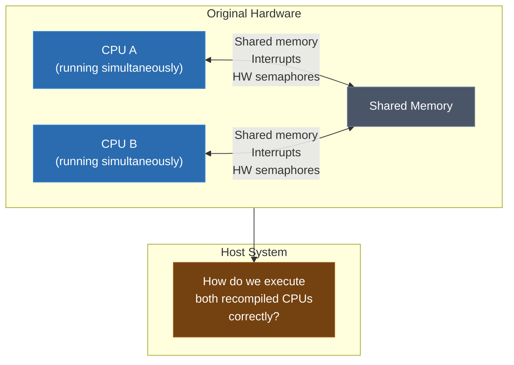
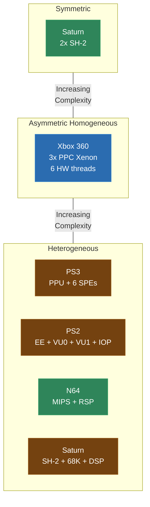
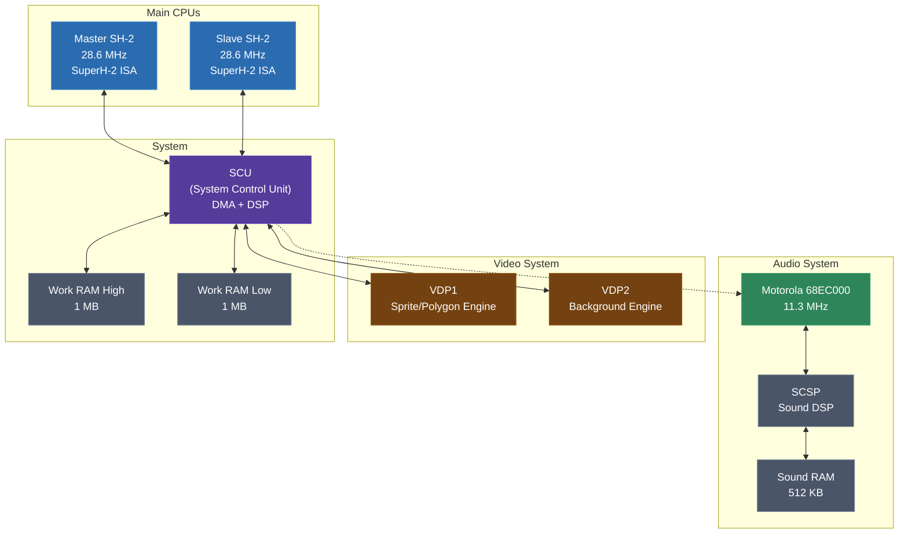
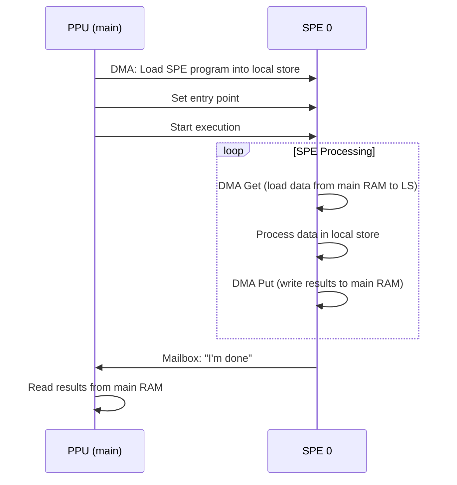
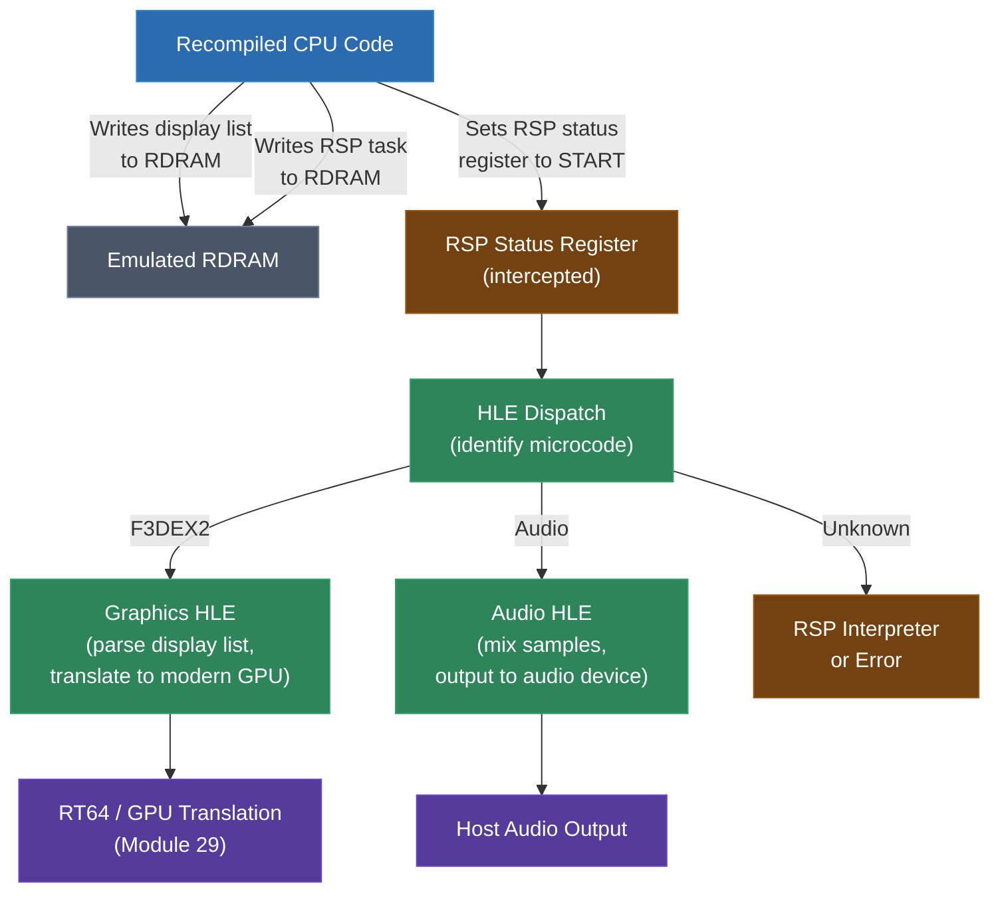
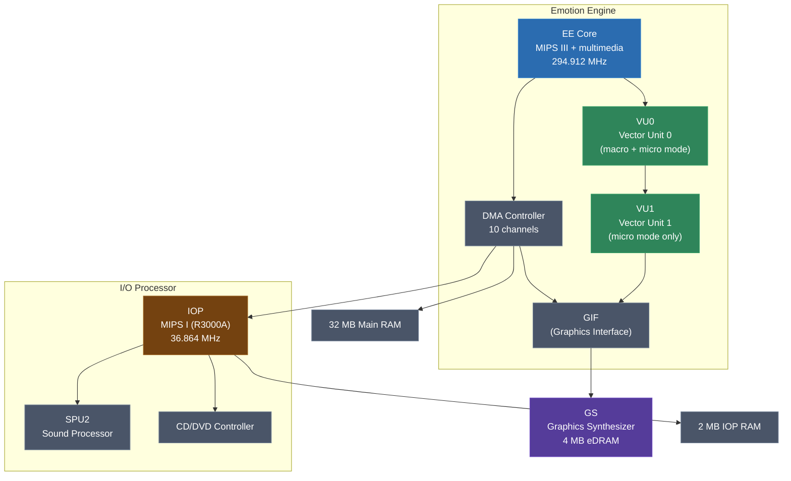

# Module 31: Multi-Threaded and Heterogeneous Recompilation

Up to this point in the course, most of the systems we've recompiled have been single-CPU machines -- or at least, machines where you can get away with treating them that way. The N64 has a CPU and the RSP, but you HLE the RSP. The GameCube has one CPU core. Even when there's a coprocessor, you can often sidestep the multi-processor problem entirely.

That stops working with the harder targets. The Sega Saturn has two SH-2 CPUs running simultaneously, sharing memory, interrupting each other. The PlayStation 2 has the Emotion Engine, two Vector Units, and an I/O Processor -- four programmable processors with three different instruction sets. The PlayStation 3's Cell Broadband Engine has a PowerPC core plus six SPEs, each with its own local store and DMA engine. The Xbox 360 has three PowerPC cores with six hardware threads.

This module is about the general problem: how do you recompile a system where the original hardware has multiple processors running concurrently? This is one of the hardest open problems in static recompilation, and there's no single right answer. The approach depends on the target hardware, the original software's communication patterns, and how much accuracy you need. We'll cover the spectrum of solutions, from simple to complex, with detailed case studies of the systems that matter most.

---

## 1. The Multi-Processor Problem

Let's be precise about what the problem is. When you recompile a single-CPU system, your recompiled code runs on one host thread. The original CPU's state (registers, memory) is maintained in a context structure, and the recompiled functions read from and write to that context. There's no concurrency to worry about -- the host thread is the only thing touching that state.

When the original system has multiple CPUs, each one is executing code simultaneously. They share memory. They send interrupts to each other. They synchronize through hardware mechanisms (mailboxes, semaphores, shared registers). The behavior of the original system depends on the relative timing of these CPUs.

Here's the fundamental tension:



The options, roughly in order of complexity:

1. **Don't recompile the secondary CPU** -- HLE its functionality (sidestep the problem)
2. **Run them sequentially** on one host thread, interleaving execution
3. **Run them on separate host threads** with synchronization
4. **Hybrid** approaches that combine HLE, sequential, and threaded execution depending on the processor

Each has trade-offs in accuracy, performance, and implementation difficulty. Let's examine them.

---

## 2. Categories of Multi-Processor Systems

Not all multi-processor systems are created equal. The relationship between the processors determines which recompilation strategies are viable.

### Symmetric Multiprocessing (SMP)

Two or more identical processors running the same instruction set, with equal access to shared memory. The processors are peers.

**Example: Sega Saturn (dual SH-2)**

The Saturn has two Hitachi SH-2 CPUs -- the "master" and "slave" -- clocked at 28.6 MHz. Both run the same ISA, access the same memory bus, and can execute arbitrary code. In practice, games assign different roles: the master handles game logic and coordinates rendering, the slave handles geometry calculations, AI, or other compute-heavy tasks.

The key challenge: both CPUs are truly running in parallel, and they share memory. A write by the master SH-2 is immediately visible to the slave, subject to bus arbitration timing. Games rely on this for synchronization.

### Asymmetric Homogeneous

Multiple cores of the same ISA but with different roles, priorities, or hardware thread configurations.

**Example: Xbox 360 (triple-core Xenon)**

Three PowerPC cores, each with two hardware threads (six threads total). All cores run the same ISA and share the same memory. But games typically assign specific roles: core 0 for game logic, core 1 for rendering, core 2 for physics or audio. The cores are functionally identical, but the software treats them asymmetrically.

The synchronization challenge is the same as SMP but at higher scale -- six hardware threads sharing memory with the ordering guarantees of PowerPC's relatively weak memory model.

### Heterogeneous

Processors with different instruction sets. Each processor type requires its own recompilation pipeline (or HLE strategy).

**Example: PlayStation 3 (PPU + SPEs)**

The PPU is a 64-bit PowerPC core. The SPEs are completely different -- 128-bit SIMD processors with a different register file, different instruction encoding, and most critically, each SPE has its own 256 KB local store that is not directly memory-mapped. SPE code cannot access main memory directly; it must DMA data in and out of its local store.

This is the hardest case: you need two separate recompilers (or one recompiler and HLE for the SPEs), plus a DMA simulation layer, plus inter-processor communication simulation.

**Example: N64 (MIPS VR4300 + RSP)**

The RSP is a custom vector processor with its own ISA, running microcode from 4 KB of instruction memory. The CPU and RSP communicate through DMA and status registers. Most recompilation projects HLE the RSP entirely -- they don't recompile microcode, they intercept the high-level operations (display list processing, audio mixing) and implement them directly.

**Example: Sega Saturn (SH-2 + 68000 + SCU DSP)**

Beyond the dual SH-2s, the Saturn has a Motorola 68000 for audio and a programmable DSP in the System Control Unit. That's three different ISAs in one system.

### Summary Table

| System | Processors | ISAs | Category |
|--------|-----------|------|----------|
| Saturn | 2x SH-2, 68000, SCU DSP | 3 | Heterogeneous + SMP |
| N64 | MIPS VR4300, RSP | 2 | Heterogeneous |
| PS2 | EE (MIPS), VU0, VU1, IOP (MIPS I) | 3 | Heterogeneous |
| Dreamcast | SH-4, ARM7 (audio) | 2 | Heterogeneous |
| Xbox | x86, NV2A (GPU) | 2 | Heterogeneous (GPU is HLE'd) |
| Xbox 360 | 3x PPC Xenon | 1 | Asymmetric Homogeneous |
| PS3 | PPU (PPC64), 6x SPE | 2 | Heterogeneous |



---

## 3. Execution Models for Recompiled Multi-CPU Systems

There are three fundamental approaches to executing multiple recompiled CPUs on a host system. Let's go through each one in detail.

### Model 1: Sequential / Interleaved

Run all recompiled CPUs on a single host thread, alternating between them. Execute N cycles of CPU A, then N cycles of CPU B, repeat.

```c
// Sequential interleaved execution
void run_frame(CPUContext* master, CPUContext* slave) {
    int cycles_per_slice = 100;  // timeslice granularity

    while (!frame_complete) {
        // Run master SH-2 for 100 cycles
        execute_recompiled_code(master, cycles_per_slice);

        // Run slave SH-2 for 100 cycles
        execute_recompiled_code(slave, cycles_per_slice);

        // Check for interrupts, advance timers, etc.
        update_peripherals();
    }
}
```

**Advantages**:
- No thread synchronization needed -- only one CPU context is active at a time
- Memory access is naturally serialized (no races)
- Deterministic execution (same input always produces same output)
- Simple to implement and debug

**Disadvantages**:
- Only uses one host core (no parallelism benefit)
- Timing is approximate -- the interleaving granularity affects accuracy
- If one CPU is waiting for the other (spin-waiting on a shared flag), you waste host cycles executing the spin loop
- Can be slow for systems with many processors

**When to use it**: This is the right approach for systems where the CPUs interact frequently and timing-sensitive synchronization matters more than performance. Many Saturn emulators use this approach because the two SH-2s interact constantly through shared memory.

### Model 2: Threaded

Run each recompiled CPU on its own host thread. Shared memory is protected by synchronization primitives.

```c
// Threaded execution
void* master_thread(void* arg) {
    CPUContext* master = (CPUContext*)arg;
    while (running) {
        execute_recompiled_code(master, 1000);
        // Sync with slave at known barriers
        barrier_wait(&frame_barrier);
    }
    return NULL;
}

void* slave_thread(void* arg) {
    CPUContext* slave = (CPUContext*)arg;
    while (running) {
        execute_recompiled_code(slave, 1000);
        barrier_wait(&frame_barrier);
    }
    return NULL;
}

void start_system() {
    pthread_create(&t1, NULL, master_thread, &master_ctx);
    pthread_create(&t2, NULL, slave_thread, &slave_ctx);
}
```

**Advantages**:
- Uses multiple host cores (real parallelism)
- Better performance for CPU-heavy workloads
- Natural mapping of original system's parallel execution

**Disadvantages**:
- Shared memory access must be synchronized (mutexes, atomics)
- Memory ordering differences between original hardware and host CPU
- Non-deterministic (thread scheduling varies between runs)
- Race conditions and deadlocks are possible if synchronization is wrong
- Much harder to debug

**When to use it**: Best for systems where the CPUs do significant independent work between synchronization points. The Xbox 360 is a good candidate because its three cores run largely independent workloads with periodic synchronization.

### Model 3: Hybrid

Use different execution strategies for different processors in the system. Typically: run the main CPU on a host thread, HLE coprocessors that have well-understood behavior, and interleave or thread the remaining CPUs as appropriate.

```c
// Hybrid approach (e.g., for Saturn)
// Main SH-2: runs on the primary host thread
// Slave SH-2: interleaved with main on the same thread
// 68000 (audio): HLE'd -- audio mixing is reimplemented, not recompiled
// SCU DSP: HLE'd -- its programs are short and well-understood

void run_frame(SaturnContext* ctx) {
    int cycles = 0;
    int target_cycles = CYCLES_PER_FRAME;

    while (cycles < target_cycles) {
        // Interleave master and slave SH-2
        int master_cycles = execute_sh2(ctx->master, 64);
        int slave_cycles = execute_sh2(ctx->slave, 64);
        cycles += master_cycles;

        // Audio is HLE'd -- generate samples based on sound RAM state
        if (audio_timer_elapsed(cycles)) {
            hle_audio_update(ctx->audio_state);
        }

        // SCU DSP is HLE'd -- triggered by specific register writes
        // (handled inside the SH-2 execution when it writes to SCU regs)
    }
}
```

**Advantages**:
- Pragmatic -- focuses recompilation effort where it matters most
- Avoids recompiling processors whose behavior is simple and well-documented
- Can use the simplest viable approach for each processor

**Disadvantages**:
- HLE requires understanding what each coprocessor does (not always feasible)
- Games that use coprocessors in unusual ways may not work with HLE
- The HLE boundaries are custom per-system (not general-purpose)

**When to use it**: Almost always. Pure approaches (all-sequential or all-threaded) are rarely optimal. Most real projects use a hybrid strategy.

---

## 4. Synchronization

The original CPUs share memory, and the original software assumes that shared memory accesses happen in a specific order with specific visibility guarantees. Replicating this on a modern host is the core technical challenge of multi-threaded recompilation.

### How Original Hardware Synchronizes

Original consoles use several mechanisms for inter-processor synchronization:

**Shared memory flags** (the simplest and most common):
```c
// On the original hardware:
// Master SH-2 sets a flag when work is ready
volatile uint32_t* work_ready = (uint32_t*)0x06000000;

// Master:
*work_data = some_data;
*work_ready = 1;

// Slave (polling):
while (*work_ready == 0) { /* spin */ }
process(*work_data);
*work_ready = 0;
```

**Hardware semaphores**: Some systems have dedicated hardware for atomic test-and-set or compare-and-swap operations.

**Interrupts**: One CPU sends an interrupt to another. The interrupt handler on the receiving CPU reads data from shared memory.

**Mailbox registers**: Dedicated hardware registers that one CPU writes and another reads, with built-in synchronization (reading clears the register, writing sets a "data available" flag).

**DMA completion signals**: A coprocessor's DMA engine raises an interrupt or sets a status flag when a transfer completes.

### The Memory Ordering Problem

Here's where it gets subtle. On the original hardware, when the master SH-2 writes `work_data` and then writes `work_ready`, the slave SH-2 is guaranteed to see `work_data` as updated when it sees `work_ready == 1`. This is because the SH-2 bus enforces ordering -- writes complete in program order as observed by other bus masters.

On a modern x86 host with two threads, this might actually work by accident, because x86 has a strong memory model (Total Store Order) where stores become visible in program order. But on ARM (which many modern devices use, including Apple Silicon and the Steam Deck), the memory model is weaker. Stores can be reordered and may become visible to other cores out of program order. Without explicit memory barriers, the slave thread might see `work_ready == 1` but still read stale `work_data`.


### Solutions

**Approach 1: Make everything atomic (heavy-handed)**

Make all shared memory accesses atomic with sequential consistency ordering. This is correct but destroys performance:

```c
// Every memory write becomes an atomic store
void mem_write32(uint32_t addr, uint32_t value) {
    atomic_store_explicit(
        (atomic_uint32_t*)&memory[addr],
        value,
        memory_order_seq_cst
    );
}
```

This is too slow. Sequential consistency fences on every memory access add massive overhead.

**Approach 2: Atomic only at known synchronization points**

Analyze the original software to identify which memory locations are used for synchronization (flags, semaphores, mailboxes). Apply atomic operations and memory barriers only at those points:

```c
// Normal memory write (no barriers)
void mem_write32(uint32_t addr, uint32_t value) {
    *(uint32_t*)&memory[addr] = value;
}

// Synchronization flag write (with release barrier)
void sync_write32(uint32_t addr, uint32_t value) {
    atomic_store_explicit(
        (atomic_uint32_t*)&memory[addr],
        value,
        memory_order_release
    );
}

// Synchronization flag read (with acquire barrier)
uint32_t sync_read32(uint32_t addr) {
    return atomic_load_explicit(
        (atomic_uint32_t*)&memory[addr],
        memory_order_acquire
    );
}
```

The challenge: how do you know which addresses are synchronization points? Options:
- **Manual annotation**: Reverse-engineer the game and mark synchronization addresses. Works but doesn't scale.
- **Address-based heuristic**: Treat accesses to specific known hardware registers (mailbox addresses, semaphore addresses) as synchronization points.
- **Pattern detection**: Look for spin-wait patterns (loops that read a memory location until it changes) and treat the waited-on address as a synchronization point.

**Approach 3: Coarse-grained synchronization**

Don't try to match the original hardware's fine-grained memory visibility. Instead, insert barriers at natural synchronization points -- frame boundaries, vsync, interrupt delivery:

```c
void run_one_frame() {
    // Both CPUs run freely for one frame
    // Memory writes are NOT ordered between threads during the frame

    // At frame boundary: full memory barrier
    atomic_thread_fence(memory_order_seq_cst);

    // Deliver interrupts (e.g., VBlank)
    deliver_vblank_interrupt(master);
    deliver_vblank_interrupt(slave);
}
```

This is less accurate (mid-frame synchronization won't work correctly) but is simple and often sufficient for games that synchronize primarily at frame boundaries.

---

## 5. Memory Ordering: What the Original Hardware Guarantees vs. What the Host Guarantees

Let's get more precise about memory models, because this is where multi-threaded recompilation either works or breaks.

### Original Console Memory Models

Most classic consoles have simple, strongly-ordered memory models:

**SH-2 (Saturn)**: All memory accesses are visible in program order on the bus. There is no store buffer that can reorder writes. What the CPU writes in order, other bus masters see in order.

**MIPS (N64, PS2 EE)**: MIPS has a weakly-ordered memory model in theory, but in practice the N64 and PS2 don't have cache coherency issues between CPUs because:
- The N64's RSP has no cache (it accesses DMEM/IMEM directly)
- The PS2's VUs have local scratchpad memory, and DMA transfers are explicit barriers

**PowerPC (Xbox 360, PS3 PPU)**: PowerPC has a weak memory model. Stores can be reordered relative to other stores, and loads can be reordered relative to other loads. PowerPC provides explicit barrier instructions:
- `lwsync` (lightweight sync): orders loads and stores, but allows store-load reordering
- `sync` (heavy sync): orders everything
- `isync` (instruction sync): context synchronization

Xbox 360 and PS3 games that share data between cores use these barriers explicitly. The recompiled code must preserve them.

### Host Memory Models

**x86 (Intel/AMD)**: Total Store Order (TSO). Stores are never reordered relative to other stores. Loads are never reordered relative to other loads. Stores can be reordered after loads (the only allowed reordering). This is close to sequential consistency and stronger than most console CPUs.

**ARM (Apple Silicon, Snapdragon, etc.)**: Weak ordering. Both loads and stores can be reordered relative to each other. ARM provides:
- `dmb` (data memory barrier): orders memory accesses
- `dsb` (data synchronization barrier): ensures completion of memory accesses
- `isb` (instruction synchronization barrier): flushes the pipeline

**Practical implication**: If you're running on x86, you often get correct behavior "for free" because x86's strong ordering is at least as strong as most console memory models. On ARM, you need explicit barriers.

### Translating Memory Barriers

When the original code has an explicit memory barrier (like PowerPC's `sync`), the recompiled code must emit an equivalent host barrier:

```c
// Original PowerPC: sync instruction
// Recompiled code:

#if defined(__x86_64__)
    // x86 TSO already provides most ordering guarantees
    // A full sync maps to mfence (or compiler barrier + lock prefix)
    _mm_mfence();
#elif defined(__aarch64__)
    // ARM needs an explicit full barrier
    __asm__ volatile("dmb ish" ::: "memory");
#else
    // Portable C11 atomic fence
    atomic_thread_fence(memory_order_seq_cst);
#endif
```

For implicit ordering (no explicit barrier in the original code, but the hardware guarantees ordering anyway), the approach depends on the host:

```c
// Original SH-2 code does two stores in order:
//   MOV.L R0, @R1     ; store data
//   MOV.L R2, @R3     ; store flag
// SH-2 bus guarantees these are visible in order.

// On x86: no barrier needed (TSO guarantees store-store ordering)
ctx->memory[r1] = r0;
ctx->memory[r3] = r2;

// On ARM: need a store-store barrier between them
ctx->memory[r1] = r0;
__asm__ volatile("dmb ishst" ::: "memory");  // store-store barrier
ctx->memory[r3] = r2;
```

### The "Just Use x86" Escape Hatch

It's worth noting: if your recompilation target is x86 only (which many hobbyist projects are, since they're targeting desktop PCs), the memory ordering problem is much less severe. x86's TSO model matches or exceeds the ordering guarantees of most console CPUs. You still need to handle explicit barriers from PowerPC code, but the implicit ordering usually takes care of itself.

If you need ARM support (Steam Deck via Proton, macOS on Apple Silicon, Switch homebrew), then you need to be much more careful about barriers.

---

## 6. Shared Memory Shimming

Beyond ordering, you need to handle the mechanics of shared memory access. When two recompiled CPUs access the same emulated memory space, you need to ensure their accesses are safe and correctly visible.

### The Memory Space Layout

Most multi-processor consoles have a unified address space where all CPUs see the same memory, but with different views or different latencies:

```
Saturn Memory Map (simplified)
================================================================
0x00000000 - 0x0007FFFF   Boot ROM (read-only, both SH-2s)
0x00100000 - 0x0010007F   SMPC registers (serial interface)
0x00180000 - 0x0018FFFF   Backup RAM
0x00200000 - 0x002FFFFF   Work RAM Low (1 MB, both SH-2s)
0x04000000 - 0x04FFFFFF   Work RAM High (1 MB, both SH-2s, faster access for master)
0x05800000 - 0x058FFFFF   VDP1 VRAM
0x05C00000 - 0x05C0FFFF   VDP2 VRAM
0x05E00000 - 0x05EFFFFF   VDP2 color RAM
0x06000000 - 0x07FFFFFF   Work RAM High mirror (both SH-2s)
0x20000000 - 0x3FFFFFFF   CS0 area (cartridge)

68000 Memory Map:
0x000000 - 0x0FFFFF       Sound RAM (512 KB)
0x100000 - 0x100FFF       SCSP registers
```

In the recompiled system, all of this is backed by a single host memory allocation. Both recompiled SH-2 contexts (and the emulated 68000, if recompiled) access the same buffer:

```c
typedef struct {
    uint8_t work_ram_low[0x100000];     // 1 MB
    uint8_t work_ram_high[0x100000];    // 1 MB
    uint8_t vdp1_vram[0x100000];        // 1 MB
    uint8_t vdp2_vram[0x10000];         // 64 KB
    uint8_t vdp2_cram[0x1000];          // 4 KB
    uint8_t sound_ram[0x80000];         // 512 KB
    // ...
} SaturnMemory;

// Both SH-2 contexts point to the same memory
SaturnMemory shared_memory;
SH2Context master = { .memory = &shared_memory, /* ... */ };
SH2Context slave  = { .memory = &shared_memory, /* ... */ };
```

### Protecting Shared State

If the master and slave run on different host threads, their concurrent access to `shared_memory` is a data race in C terms. Strictly speaking, every concurrent access to the same address (where at least one is a write) is undefined behavior unless it's through an atomic type.

In practice, you have several options:

**Option 1: Don't protect it (pragmatic, common)**

Let both threads read and write the shared memory buffer without synchronization. On x86, this is mostly safe because:
- Individual aligned 32-bit reads and writes are atomic on x86
- Store ordering is guaranteed (TSO)
- The only risk is torn reads/writes on unaligned or 64-bit accesses

Many emulators and recompilation projects take this approach and get away with it. It's technically undefined behavior in C, but it works reliably in practice on x86.

**Option 2: Use `_Atomic` for all shared memory**

Declare the shared memory as atomic types. This is correct but has severe performance implications:

```c
// Correct but slow
_Atomic uint32_t shared_memory[MEMORY_SIZE / 4];
```

Every load and store becomes an atomic operation, even when there's no actual contention. This can be 2-10x slower than normal memory access.

**Option 3: Page-level protection**

Use the host OS's virtual memory system to detect cross-thread memory conflicts:

1. Map shared memory pages as read-only for both threads
2. When a thread writes, it generates a fault
3. The fault handler records the write and marks the page dirty
4. At synchronization points, apply dirty pages and reconcile

This is complex to implement but can be efficient if cross-thread writes are infrequent.

**Option 4: Explicit synchronization at known points**

The most practical approach for recompilation: use normal (non-atomic) memory access everywhere, and insert explicit synchronization at the points where the original code expects it. This requires knowing where those points are (from reverse engineering or pattern matching), but it minimizes overhead:

```c
// Normal memory access (fast path)
static inline void mem_write32(SaturnMemory* mem, uint32_t addr, uint32_t val) {
    *(uint32_t*)((uint8_t*)mem + addr) = val;
}

// Synchronization-aware memory access (used at known sync points)
static inline void sync_mem_write32(SaturnMemory* mem, uint32_t addr, uint32_t val) {
    atomic_store_explicit(
        (_Atomic uint32_t*)((uint8_t*)mem + addr),
        val,
        memory_order_release
    );
}
```

---

## 7. Interrupt Simulation

Interrupts are a critical inter-processor communication mechanism on every console. One CPU sends an interrupt to another to signal that work is ready, a DMA transfer completed, or a frame boundary was reached.

### How Interrupts Work on Original Hardware

On original hardware, interrupts are asynchronous -- they happen between any two instructions. When an interrupt fires:

1. The CPU finishes the current instruction
2. The CPU saves the current program counter and status register
3. The CPU jumps to the interrupt vector (a fixed address determined by the interrupt priority)
4. The interrupt handler runs
5. The handler returns, restoring the saved PC and status
6. Normal execution resumes

The timing of the interrupt matters: it happens at a specific point in the instruction stream, and the handler sees the CPU state at that exact point.

### Simulating Interrupts in Recompiled Code

In recompiled code, there's no mechanism for asynchronous interruption -- you can't inject an interrupt between two arbitrary C statements. Instead, you check for pending interrupts at known safe points:

```c
// Interrupt check in the main execution loop
void execute_recompiled_block(CPUContext* ctx) {
    // Check for pending interrupts before each block
    if (ctx->pending_interrupts & ctx->interrupt_mask) {
        handle_interrupt(ctx);
    }

    // Execute the recompiled block
    recompiled_func_0x12345678(ctx);
}

void handle_interrupt(CPUContext* ctx) {
    // Find highest-priority pending interrupt
    int irq = find_highest_priority(ctx->pending_interrupts & ctx->interrupt_mask);

    // Save state (emulated CPU state, not host state)
    ctx->saved_pc = ctx->pc;
    ctx->saved_sr = ctx->sr;

    // Jump to interrupt vector
    uint32_t vector_addr = get_interrupt_vector(irq);
    ctx->pc = mem_read32(ctx->memory, vector_addr);

    // Clear the pending interrupt
    ctx->pending_interrupts &= ~(1 << irq);

    // Execute interrupt handler (it's also recompiled code)
    execute_from(ctx, ctx->pc);
}
```

### Cross-CPU Interrupt Delivery

When CPU A sends an interrupt to CPU B (common on Saturn, PS3, Xbox 360):

**Sequential model**: Simple -- after executing CPU A's write to the interrupt register, check CPU B's pending interrupts before executing CPU B's next timeslice:

```c
// Master SH-2 writes to slave interrupt register
void smpc_write(uint32_t addr, uint32_t value) {
    if (addr == SLAVE_INTERRUPT_ADDR) {
        slave_ctx.pending_interrupts |= SMPC_IRQ;
        // In sequential model, slave will check this on next timeslice
    }
}
```

**Threaded model**: More complex -- CPU B is running on another thread and needs to be notified. Options:
1. **Atomic flag**: Set an atomic pending interrupt flag that CPU B checks at block boundaries
2. **Signal**: Send an OS-level signal to CPU B's thread (heavy, platform-specific)
3. **Deferred delivery**: Don't interrupt CPU B immediately; deliver the interrupt at the next synchronization point

Most projects use option 1 (atomic flag checked at block boundaries), accepting that the interrupt delivery may be delayed by up to one block execution time:

```c
// Threaded interrupt delivery
_Atomic uint32_t slave_pending_irqs;

// CPU A sets an interrupt for CPU B
void send_interrupt_to_slave(int irq) {
    atomic_fetch_or(&slave_pending_irqs, (1 << irq));
}

// CPU B checks at each block boundary
void slave_block_entry(CPUContext* ctx) {
    uint32_t pending = atomic_load(&slave_pending_irqs);
    if (pending & ctx->interrupt_mask) {
        // Acknowledge and handle
        atomic_fetch_and(&slave_pending_irqs, ~(pending & ctx->interrupt_mask));
        handle_interrupt(ctx);
    }
}
```

---

## 8. DMA Simulation

Many multi-processor systems use DMA (Direct Memory Access) as the primary data transfer mechanism between processors. The CPU sets up a DMA transfer (source, destination, length), and the DMA engine moves data asynchronously while the CPU continues executing.

### DMA on Consoles

| System | DMA Usage |
|--------|-----------|
| N64 | RSP DMA: transfers between RDRAM and RSP's DMEM/IMEM |
| PS2 | EE DMA: transfers between main RAM and VU memory, GS, IOP |
| PS3 | SPE DMA: transfers between main RAM and SPE local stores |
| Saturn | SCU DMA: transfers between work RAM and VDP, sound RAM |
| Dreamcast | SH-4 DMA: transfers between main RAM and VRAM, sound RAM |

### The DMA Simulation Problem

DMA is asynchronous -- the transfer runs in the background while the CPU continues executing. The CPU typically checks for completion by polling a status register or waiting for a DMA completion interrupt.

In a recompiled system, you have two choices:

**Synchronous DMA (simple, slightly inaccurate)**:
Complete the DMA transfer immediately when the CPU initiates it. The CPU code continues after the initiation as if it happened instantly.

```c
void start_dma(uint32_t src, uint32_t dst, uint32_t length) {
    // Just do the copy immediately
    memcpy(&memory[dst], &memory[src], length);

    // Set completion flag immediately
    dma_status |= DMA_COMPLETE;

    // Raise completion interrupt (if configured)
    if (dma_irq_enabled) {
        cpu_ctx.pending_interrupts |= DMA_IRQ;
    }
}
```

This works for most games because:
- The CPU typically can't observe partial DMA transfers (it's either complete or not)
- Games that poll for completion will immediately see it as complete and proceed
- The timing difference is usually insignificant

**Asynchronous DMA (accurate, complex)**:
Model the DMA transfer as taking a specific number of cycles. The transfer progresses as the CPU executes, and completion happens at the right time.

```c
typedef struct {
    uint32_t src, dst, length;
    int remaining_cycles;
    bool active;
} DMATransfer;

DMATransfer active_dma;

void start_dma(uint32_t src, uint32_t dst, uint32_t length) {
    active_dma.src = src;
    active_dma.dst = dst;
    active_dma.length = length;
    active_dma.remaining_cycles = length * CYCLES_PER_WORD;
    active_dma.active = true;
}

void advance_dma(int cpu_cycles) {
    if (!active_dma.active) return;

    active_dma.remaining_cycles -= cpu_cycles;

    if (active_dma.remaining_cycles <= 0) {
        // Transfer complete
        memcpy(&memory[active_dma.dst],
               &memory[active_dma.src],
               active_dma.length);
        active_dma.active = false;
        dma_status |= DMA_COMPLETE;

        if (dma_irq_enabled) {
            cpu_ctx.pending_interrupts |= DMA_IRQ;
        }
    }
}
```

**When does synchronous DMA break?**

Rarely, but it happens. Some games:
- Start a DMA and immediately read the destination buffer, expecting partial transfer data
- Use DMA timing to synchronize with other processors (the DMA completion interrupt arrives at a specific time)
- Overlap multiple DMA transfers and rely on them completing in a specific order

For most recompilation projects, synchronous DMA is sufficient. You only need asynchronous simulation for games that demonstrably rely on DMA timing.

### DMA for Coprocessors with Local Memory

PS3 SPEs and (to a lesser extent) the N64 RSP have local memory that is not directly addressable by the main CPU. Data must be DMA'd in and out. For these systems, DMA is not just a performance feature -- it's the only way to get data to the coprocessor.

```c
// PS3 SPE DMA simulation
typedef struct {
    uint8_t local_store[256 * 1024];  // 256 KB SPE local store
    // ...
} SPEContext;

void spe_dma_get(SPEContext* spe, uint32_t ls_addr, uint64_t ea,
                  uint32_t size, uint32_t tag) {
    // DMA from main memory (ea) to SPE local store (ls_addr)
    memcpy(&spe->local_store[ls_addr], &main_memory[ea], size);
    // Mark tag as complete
    spe->dma_tag_status |= (1 << tag);
}

void spe_dma_put(SPEContext* spe, uint32_t ls_addr, uint64_t ea,
                  uint32_t size, uint32_t tag) {
    // DMA from SPE local store to main memory
    memcpy(&main_memory[ea], &spe->local_store[ls_addr], size);
    spe->dma_tag_status |= (1 << tag);
}
```

---

## 9. The Coprocessor Spectrum: From "Recompile It Too" to "HLE the Whole Thing"

For heterogeneous systems, you have a spectrum of options for handling each coprocessor. Let's lay out the full range.


### Full Recompilation

Recompile the coprocessor's code to host C, just like the main CPU. This gives you native-speed execution but requires:
- A complete instruction lifter for the coprocessor's ISA
- Understanding the coprocessor's memory model and I/O
- Synchronization with the main CPU's recompiled code

**When it makes sense**: When the coprocessor runs substantial, complex code that varies between games. PS3 SPEs are the prime example -- SPE programs are complex and game-specific, and there's no practical way to HLE them all.

### Partial Recompilation

Recompile the compute portions of the coprocessor's code but HLE its I/O and communication with other processors. This simplifies the I/O boundary while still getting native-speed execution for the heavy computation.

**When it makes sense**: When the coprocessor's I/O interface is well-defined but its compute workload is complex and variable. PS2 Vector Units are a candidate -- the VU microcode is complex and game-specific, but the DMA and GIF interface are standardized.

### Interpretation

Don't recompile the coprocessor at all -- emulate it at runtime by interpreting its instructions. Much slower than recompilation but much simpler to implement.

**When it makes sense**: When the coprocessor's workload is small or simple, and the performance cost of interpretation is acceptable. The Saturn's SCU DSP is a good example -- DSP programs are short (up to 256 instructions) and run relatively infrequently.

### High-Level Emulation (HLE)

Don't execute the coprocessor's code at all. Instead, understand what the code is trying to accomplish and reimplement that functionality directly on the host.

**When it makes sense**: When the coprocessor runs standardized or well-understood code:
- N64 RSP: HLE the microcode (display list processing, audio mixing) rather than executing microcode instructions
- Saturn 68000: HLE the sound driver (most games use the same SCSP driver)
- Dreamcast ARM7: HLE the AICA audio processing

### Skip / Stub

Ignore the coprocessor entirely. Return dummy data from its status registers and hope the game doesn't care.

**When it makes sense**: For non-essential processors during early development. You might stub the audio processor to get the game running visually before implementing audio. This is not a long-term solution but can unblock development.

### Choosing the Right Level

| Coprocessor | Typical Approach | Reason |
|-------------|-----------------|--------|
| N64 RSP (graphics) | HLE | Standard microcode formats, well-documented |
| N64 RSP (audio) | HLE | Standard audio microcode |
| Saturn slave SH-2 | Full recompilation | Complex game-specific code |
| Saturn 68000 | HLE or interpret | Standard sound driver |
| Saturn SCU DSP | Interpret or HLE | Short programs, infrequent |
| PS2 VU0/VU1 | Full or partial recompilation | Complex, game-specific |
| PS2 IOP | Interpret or HLE | Runs PS1 hardware, simpler workload |
| PS3 SPEs | Full recompilation | Complex, game-specific, performance-critical |
| Xbox 360 cores 1-2 | Full recompilation | Same ISA as core 0, complex workloads |
| Dreamcast ARM7 | HLE | Standard AICA audio processing |

---

## 10. Case Study: Sega Saturn (Dual SH-2 + 68000 Audio CPU)

The Saturn is the simplest multi-processor system that's actually hard. Two SH-2 CPUs running simultaneously, sharing memory, with tight coupling. Let's walk through how you'd handle it.

### The Saturn's Processor Configuration



### How Games Use the Dual SH-2s

Different games use the slave SH-2 differently:

- **Panzer Dragoon Saga**: Slave handles geometry transformation and lighting
- **Virtua Fighter 2**: Slave runs the secondary character's AI and animation
- **Burning Rangers**: Slave manages the real-time polygon subdivision
- **Many 2D games**: Don't use the slave at all

The master SH-2 always runs the main game loop and manages VDP configuration. The slave handles compute-heavy secondary tasks.

### Communication Patterns

Master-slave communication on the Saturn typically follows this pattern:

```c
// In the original Saturn code (SH-2 assembly, shown as C pseudocode):

// Master SH-2:
void master_game_loop(void) {
    // Set up work for slave
    shared_work_buffer[0] = polygon_data_ptr;
    shared_work_buffer[1] = polygon_count;
    shared_work_buffer[2] = transform_matrix_ptr;

    // Signal slave to start (write to a shared flag)
    slave_work_ready = 1;

    // Do other work while slave processes
    update_game_logic();
    process_input();

    // Wait for slave to finish
    while (slave_work_done == 0) {
        // Spin-wait
    }
    slave_work_done = 0;

    // Use slave's results
    submit_transformed_polygons();
}

// Slave SH-2:
void slave_main_loop(void) {
    while (1) {
        // Wait for work
        while (slave_work_ready == 0) {
            // Spin-wait
        }
        slave_work_ready = 0;

        // Do the work
        transform_polygons(shared_work_buffer[0],
                          shared_work_buffer[1],
                          shared_work_buffer[2]);

        // Signal completion
        slave_work_done = 1;
    }
}
```

### Recompilation Strategy

**SH-2 CPUs**: Both must be recompiled. They run game-specific code that can't be HLE'd. The recommended approach is interleaved execution on a single host thread:

```c
void saturn_run_frame(SaturnState* state) {
    const int CYCLES_PER_FRAME = 28636000 / 60;  // ~477K cycles
    const int TIMESLICE = 32;  // granularity

    int cycles = 0;
    while (cycles < CYCLES_PER_FRAME) {
        // Execute master SH-2
        int master_ran = sh2_execute(&state->master, TIMESLICE);

        // Execute slave SH-2 (if enabled)
        if (state->slave_enabled) {
            int slave_ran = sh2_execute(&state->slave, TIMESLICE);
        }

        // Advance timers, check SCU interrupts
        scu_tick(state, TIMESLICE);
        cycles += master_ran;
    }
}
```

Why interleaved rather than threaded? Because Saturn games synchronize frequently (every frame, sometimes multiple times per frame) through shared memory spin-waits. Threading would require detecting these spin-waits and converting them to proper synchronization primitives, which is complex and error-prone. Interleaving avoids the problem entirely.

The timeslice granularity (32 cycles in this example) determines accuracy. Too coarse and spin-wait loops take too long to resolve. Too fine and you waste time context-switching. In practice, 16-64 cycles per timeslice works well for Saturn.

**68000 (audio)**: HLE or interpret. Most Saturn games use a standard SCSP driver, so HLE is viable for many titles. For games with custom sound engines, interpretation at 11.3 MHz is fast enough on modern hardware.

**SCU DSP**: Interpret. Programs are short (max 256 instructions) and the DSP runs at the same clock as the SH-2s. Interpretation overhead is negligible.

---

## 11. Case Study: PS3 Cell (PPU + 6 SPEs with Local Stores)

The PS3 is the most complex heterogeneous system you'll encounter. Module 30 covered Cell in detail; here we focus on the multi-processor orchestration.

### The Challenge

Six SPEs, each with:
- Its own ISA (128 registers, 128-bit SIMD, ~200 instructions)
- 256 KB of local store (the only memory the SPE can directly access)
- A DMA engine for transferring data between local store and main memory
- Communication channels (mailbox registers, signal notification registers) for inter-processor signaling

The PPU dispatches work to SPEs by:
1. Loading an SPE program into an SPE's local store via DMA
2. Setting the SPE's entry point
3. Starting the SPE
4. Waiting for the SPE to complete (via mailbox or interrupt)



### Execution Model

For PS3 recompilation, the practical approach is:

**PPU**: Full static recompilation to C (PowerPC 64-bit → C). This is the main game thread and must run at full speed.

**SPEs**: Full static recompilation of SPE programs. Each SPE program found in the executable is recompiled separately. At runtime, when the PPU loads an SPE program, the runtime identifies which recompiled SPE function to call.

**Threaded execution**: Each active SPE runs on its own host thread. The PPU runs on the main thread. This maps naturally because:
- SPEs are designed for independent execution (local store means minimal memory contention)
- SPE-PPU communication is through explicit channels (mailboxes), not shared memory reads
- DMA is the only way data moves between SPE local stores and main memory

```c
// PS3 recompiled SPE execution
typedef struct {
    uint8_t local_store[256 * 1024];
    uint32_t regs[128][4];  // 128 x 128-bit registers
    uint32_t pc;
    uint32_t mailbox_out;   // SPE → PPU communication
    uint32_t mailbox_in;    // PPU → SPE communication
    _Atomic bool running;
    pthread_t thread;
} SPEContext;

void* spe_thread(void* arg) {
    SPEContext* spe = (SPEContext*)arg;

    while (spe->running) {
        // Execute the recompiled SPE program
        // The program was identified when the PPU loaded it
        recompiled_spe_functions[spe->program_id](spe);

        // SPE has halted (stop-and-signal instruction)
        // Notify PPU via mailbox
        spe->mailbox_out = SPE_EXIT_STATUS;
        atomic_thread_fence(memory_order_release);

        // Wait for PPU to give us more work
        while (!spe->work_pending) {
            // Could use a condition variable instead of spinning
            sched_yield();
        }
    }
    return NULL;
}
```

### DMA as the Synchronization Boundary

The key insight for PS3 recompilation is that **DMA is the memory consistency boundary**. An SPE can only access main memory through DMA, and DMA is explicit -- you know exactly when data moves. This means:

- SPE code accessing local store: no synchronization needed (only one SPE accesses its own local store)
- DMA Get: copies from main memory to local store. Must see the most recent PPU (or other SPE DMA Put) writes.
- DMA Put: copies from local store to main memory. Must be visible to subsequent PPU reads (or other SPE DMA Gets).

You implement this with memory barriers around DMA operations:

```c
void spe_dma_get(SPEContext* spe, uint32_t ls_addr, uint64_t ea, uint32_t size) {
    // Acquire barrier: ensure we see all prior writes to main memory
    atomic_thread_fence(memory_order_acquire);
    memcpy(&spe->local_store[ls_addr], &main_memory[ea], size);
}

void spe_dma_put(SPEContext* spe, uint32_t ls_addr, uint64_t ea, uint32_t size) {
    memcpy(&main_memory[ea], &spe->local_store[ls_addr], size);
    // Release barrier: ensure our writes are visible to other processors
    atomic_thread_fence(memory_order_release);
}
```

### SPE Program Identification

A practical challenge: how do you know which recompiled function corresponds to a given SPE program? When the PPU loads SPE code into a local store, the recompiled runtime needs to identify it.

**Hash-based lookup**: Hash the SPE program binary and look it up in a table of known programs:

```c
// At build time: catalog all SPE programs found in the executable
RecompiledSPEProgram spe_catalog[] = {
    { .hash = 0xA1B2C3D4, .func = spe_program_physics },
    { .hash = 0xE5F6A7B8, .func = spe_program_audio_mix },
    { .hash = 0x12345678, .func = spe_program_particle_system },
    // ...
};

// At runtime: when PPU loads an SPE program
void on_spe_program_load(SPEContext* spe, uint64_t ea, uint32_t size) {
    uint32_t hash = compute_hash(&main_memory[ea], size);
    for (int i = 0; i < spe_catalog_count; i++) {
        if (spe_catalog[i].hash == hash) {
            spe->program_func = spe_catalog[i].func;
            return;
        }
    }
    // Unknown SPE program -- fall back to interpreter or error
    fprintf(stderr, "Unknown SPE program: hash=%08X\n", hash);
}
```

---

## 12. Case Study: N64 (CPU + RSP Microcode)

The N64 is the most commonly recompiled heterogeneous system, and it demonstrates the HLE approach to coprocessor handling.

### The RSP Problem

The RSP (Reality Signal Processor) runs microcode -- small programs loaded into its 4 KB instruction memory. Different games use different microcode, including:

- **Fast3D / F3DEX / F3DEX2**: Graphics microcode (display list processing, vertex transformation)
- **Audio microcode**: Various audio mixing programs
- **Custom microcode**: Some games (Factor 5 titles, Rare titles) ship custom microcode

The RSP ISA is custom and shares no instructions with the main MIPS CPU. It has a 128-bit SIMD unit with 32 vector registers, each containing 8 x 16-bit lanes. Recompiling RSP microcode is possible (and has been done -- the ares emulator can dynamically recompile RSP code) but is complex.

### Why HLE Works for the N64

HLE works for the N64 because:

1. **Most games use standard microcode.** Nintendo provided F3D, F3DEX, F3DEX2, and audio microcode. The vast majority of N64 games use one of these without modification.

2. **The interface is well-defined.** The CPU communicates with the RSP through a display list in RDRAM. The display list format is documented for each microcode variant. HLE can intercept the display list directly.

3. **The output is well-defined.** Graphics microcode produces RDP commands. Audio microcode produces audio samples. You can reimplement these outputs without executing the microcode.

### HLE Architecture



The key: when the recompiled CPU code writes to the RSP status register to start RSP execution, the runtime intercepts this write and dispatches to the appropriate HLE handler. The HLE handler processes the RSP task (parsing the display list, mixing audio, etc.) and sets the RSP status to "done." From the recompiled CPU code's perspective, the RSP task completed instantly.

### When HLE Fails

HLE doesn't work for games with custom microcode. A few notable examples:

- **Star Wars: Rogue Squadron** (Factor 5): Uses heavily customized microcode for its rendering pipeline
- **World Driver Championship** (Boss Game Studios): Custom microcode for advanced rendering
- **Conker's Bad Fur Day** (Rare): Modified audio microcode

For these games, you need either an RSP interpreter/recompiler or custom HLE implementations for each variant.

### The Timing Mismatch

HLE introduces a timing discrepancy. On real hardware, the RSP takes time to process its task -- hundreds or thousands of RSP cycles. With HLE, the task completes instantly from the CPU's perspective. This usually doesn't matter because games wait for the RSP to finish before reading results. But some games are sensitive to the timing:

- Games that overlap CPU work with RSP processing may complete too fast with HLE, causing the CPU to spin-wait on a different timing condition
- Games that use RSP timing as a crude clock or random seed may behave differently

These are edge cases, but they exist. The fix is usually a small game-specific timing adjustment.

---

## 13. Case Study: PS2 (EE + VU0 + VU1 + IOP)

The PlayStation 2 has the most diverse processor mix of any major console: four programmable processors with three different instruction sets.

### The PS2 Processor Ensemble



### Processor Roles

**EE (Emotion Engine)**: The main CPU. MIPS III with custom multimedia extensions (128-bit integer operations). Runs the game logic, manages DMA, and coordinates the VUs.

**VU0**: A vector unit that can operate in two modes:
- **Macro mode**: Executes instructions inline with the EE (like a coprocessor)
- **Micro mode**: Runs independently from its own microprogram memory

VU0 handles lighter vector work -- camera transforms, small matrix operations, sometimes animation.

**VU1**: A dedicated vector unit that only runs in micro mode. VU1 is the workhorse for vertex transformation and lighting. It receives vertex data via DMA, transforms it, and outputs processed geometry to the GIF for rasterization by the GS.

**IOP**: The I/O Processor is literally a PlayStation 1 CPU (R3000A) repurposed for I/O handling. It manages disc access, controllers, memory cards, USB, networking, and audio. It runs its own programs in its own 2 MB of RAM.

### Recompilation Strategy

**EE**: Full static recompilation. This is the main game logic and must run natively. The EE's multimedia instructions (128-bit integer SIMD) need to be mapped to host SIMD (SSE/AVX on x86, NEON on ARM).

**VU0 in macro mode**: Handled as part of EE recompilation -- the VU0 macro instructions are interleaved with EE code and can be recompiled as part of the same instruction stream.

**VU0 in micro mode and VU1**: These are the challenging ones. VU microcode is game-specific, complex, and runs on a completely different ISA:
- 32 floating-point vector registers (128-bit: x, y, z, w)
- 16 integer registers
- Dual-issue pipeline (upper and lower instructions execute simultaneously)
- No branch prediction, no cache (code runs from microprogram memory)

Options:
1. **Recompile VU microcode statically**: Identify all VU microprograms in the game binary and recompile them to C/host SIMD. Challenging due to the dual-issue pipeline and self-modifying microcode some games use.
2. **JIT recompile at runtime**: Dynamically recompile VU microcode when it's loaded into VU memory. This is what PCSX2 does.
3. **Interpret**: Acceptable for VU0 micro mode (lighter workload), marginal for VU1 (performance-critical).

**IOP**: Interpret or HLE. The IOP runs at only 36 MHz and handles I/O rather than heavy computation. An interpreter is fast enough. Alternatively, HLE the standard IOP modules (libsd for audio, libcdvd for disc access) since most games use Sony's standard libraries.

### The DMA Orchestra

The PS2's DMA controller is the glue holding everything together. It has 10 channels connecting the EE to various destinations:

| Channel | Source → Destination | Purpose |
|---------|---------------------|---------|
| 0 | VIF0 → VU0 | Load VU0 microcode/data |
| 1 | VIF1 → VU1 | Load VU1 microcode/data |
| 2 | GIF → GS | Send primitives to GS |
| 3 | IPU → EE | MPEG decoding output |
| 4 | IPU ← EE | MPEG decoding input |
| 5 | SIF0 → IOP | EE → IOP communication |
| 6 | SIF1 ← IOP | IOP → EE communication |
| 8 | SPR ← EE | Scratchpad RAM transfer |
| 9 | SPR → EE | Scratchpad RAM transfer |

Games build DMA chains -- linked lists of DMA descriptors in memory -- that the hardware processes automatically. A single DMA kickoff can transfer megabytes of data through a chain of dozens of descriptors.

For recompilation, the DMA controller must be emulated accurately because:
- VU1 gets its microcode and vertex data through DMA. If DMA isn't working, VU1 has nothing to process.
- The GS gets primitives through DMA via the GIF. If GIF DMA is broken, nothing renders.
- EE-IOP communication happens through DMA (SIF channels). If SIF DMA is broken, audio and disc access fail.

```c
// PS2 DMA chain processing
void process_dma_chain(uint32_t channel, uint32_t start_addr) {
    uint32_t addr = start_addr;

    while (addr != 0) {
        // Read DMA tag (128 bits at the start of each block)
        uint64_t tag_lo = mem_read64(addr);
        uint64_t tag_hi = mem_read64(addr + 8);

        uint32_t qwc = tag_lo & 0xFFFF;          // quadword count
        uint32_t id = (tag_lo >> 28) & 0x07;       // tag ID (cnt, next, ref, etc.)
        uint32_t addr_field = (tag_lo >> 32) & 0x7FFFFFFF;

        uint32_t data_addr;
        uint32_t next_tag;

        switch (id) {
            case 0: // refe: transfer from addr_field, end chain
                data_addr = addr_field;
                next_tag = 0;  // end
                break;
            case 1: // cnt: transfer data following this tag
                data_addr = addr + 16;
                next_tag = addr + 16 + qwc * 16;
                break;
            case 2: // next: transfer data following this tag, next tag at addr_field
                data_addr = addr + 16;
                next_tag = addr_field;
                break;
            case 3: // ref: transfer from addr_field, next tag follows
                data_addr = addr_field;
                next_tag = addr + 16;
                break;
            // ... more tag types
        }

        // Transfer data to the channel's destination
        transfer_data(channel, data_addr, qwc);

        addr = next_tag;
    }
}
```

### Execution Order

A practical PS2 execution loop:

```c
void ps2_run_frame(PS2State* state) {
    const int EE_CYCLES_PER_FRAME = 294912000 / 60;  // ~4.9M cycles
    const int IOP_CYCLES_PER_EE_CYCLE = 1;  // IOP runs at 1/8 EE speed

    int ee_cycles = 0;
    while (ee_cycles < EE_CYCLES_PER_FRAME) {
        // Execute EE (including VU0 macro mode)
        int ran = ee_execute(&state->ee, 256);
        ee_cycles += ran;

        // Process pending DMA transfers
        dma_tick(&state->dmac, ran);

        // Execute IOP at proportional rate
        iop_execute(&state->iop, ran / 8);

        // Check for VU1 kickoff (triggered by VIF1 DMA)
        if (state->vu1.kickoff_pending) {
            vu1_execute(&state->vu1);  // run VU1 microprogram to completion
            state->vu1.kickoff_pending = false;
        }

        // Process GIF output (GS commands from VU1/DMA)
        gif_process(&state->gif);
    }
}
```

Note that VU1 is executed synchronously when triggered -- it runs its microprogram to completion (which typically takes a few hundred VU cycles) and returns. This is acceptable because VU1 programs are short and self-contained. For more accurate timing, you could interleave VU1 execution with EE execution, but most games don't require it.

---

## 14. Determinism and Reproducibility

When you introduce threading, you lose determinism. Thread scheduling varies between runs, between machines, and between operating systems. The same input can produce different internal states on different runs, which makes debugging extremely difficult.

### Why Determinism Matters

1. **Regression testing**: You need to verify that a code change doesn't break anything. If the system isn't deterministic, you can't compare outputs.
2. **Bug reproduction**: "It crashed on frame 12,847" is useless if you can't reliably reach frame 12,847.
3. **Save states**: Deterministic execution means you can save and restore the complete system state and resume exactly where you left off.
4. **Netplay / TAS**: Network play and tool-assisted speedruns require lock-step determinism.

### Achieving Determinism with Threading

**Approach 1: Don't use threading.** Run everything on one thread with interleaved execution. This is always deterministic. If performance is sufficient, this is the simplest solution.

**Approach 2: Deterministic threading.** Run each processor on its own thread, but synchronize at fixed points:

```c
// Deterministic threading using barriers
void run_deterministic_frame() {
    // Both threads execute exactly N cycles
    const int SYNC_INTERVAL = 64;

    for (int slice = 0; slice < SLICES_PER_FRAME; slice++) {
        // Signal both threads to execute one timeslice
        start_threads();

        // Each thread runs exactly SYNC_INTERVAL cycles
        // master_thread: execute_recompiled_code(&master, SYNC_INTERVAL);
        // slave_thread:  execute_recompiled_code(&slave, SYNC_INTERVAL);

        // Wait for both threads to complete the timeslice
        barrier_wait(&sync_barrier);

        // Now process shared state changes deterministically
        process_interrupts();
        process_dma();
    }
}
```

This gives you parallelism within each timeslice but deterministic synchronization between slices. The overhead of the barrier depends on the sync interval -- more frequent syncs mean more barrier overhead but finer-grained determinism.

**Approach 3: Record and replay.** During development, record all non-deterministic events (interrupt timing, thread scheduling decisions) to a log. During replay, use the log to reproduce the exact same execution:

```c
// Recording mode
void deliver_interrupt(CPUContext* ctx, int irq) {
    if (recording) {
        log_event(EVENT_INTERRUPT, ctx->cycle_count, irq);
    }
    ctx->pending_interrupts |= (1 << irq);
}

// Replay mode
void check_recorded_events(CPUContext* ctx) {
    while (next_event.cycle <= ctx->cycle_count) {
        if (next_event.type == EVENT_INTERRUPT) {
            ctx->pending_interrupts |= (1 << next_event.data);
        }
        advance_log();
    }
}
```

### Cycle Counting

Determinism requires accurate cycle counting -- each recompiled block must advance the cycle counter by the correct amount. This means either:

- **Instruction counting**: Count the number of original instructions in each block and multiply by a constant (works for simple architectures)
- **Cycle-accurate counting**: Track the exact cycle cost of each instruction, including memory latency, pipeline stalls, etc. (necessary for timing-sensitive systems)

Most recompilation projects use instruction counting with per-block cycle totals:

```c
// Each recompiled function has a known cycle count
void recomp_func_0x80001234(CPUContext* ctx) {
    // ... recompiled instructions ...
    ctx->cycle_count += 47;  // this block takes 47 original CPU cycles
}
```

---

## 15. Performance Tuning

Adding threads doesn't automatically make things faster. In fact, for many recompilation workloads, threading can make things slower due to synchronization overhead.

### When Threading Helps

Threading helps when:
- The original CPUs do significant independent work between synchronization points
- The total CPU workload exceeds what one host core can handle in real-time
- Synchronization is infrequent (per-frame or per-major-event)

Threading does NOT help when:
- The CPUs synchronize frequently (every few hundred cycles)
- One CPU is significantly more loaded than the others (the bottleneck is the busiest thread)
- The synchronization overhead exceeds the parallelism benefit

### Measuring Where Time Goes

Before optimizing, measure:

```c
// Simple per-CPU timing
typedef struct {
    uint64_t total_execution_us;
    uint64_t total_sync_wait_us;
    uint64_t total_dma_us;
    uint64_t total_interrupt_us;
    uint64_t block_count;
} CPUProfileData;

void profile_execute(CPUContext* ctx, int cycles) {
    uint64_t start = get_microseconds();
    execute_recompiled_code(ctx, cycles);
    uint64_t end = get_microseconds();
    ctx->profile.total_execution_us += (end - start);
    ctx->profile.block_count++;
}

void print_profile(CPUProfileData* p, const char* name) {
    printf("%s: exec=%.1fms sync=%.1fms dma=%.1fms irq=%.1fms blocks=%llu\n",
           name,
           p->total_execution_us / 1000.0,
           p->total_sync_wait_us / 1000.0,
           p->total_dma_us / 1000.0,
           p->total_interrupt_us / 1000.0,
           p->block_count);
}
```

Common findings:
- **Sync wait dominates**: If one CPU spends most of its time waiting for another, the system is load-imbalanced. Consider moving work between CPUs (if possible) or reducing sync frequency.
- **DMA dominates**: If DMA processing takes a lot of time, consider optimizing the DMA simulation (batch transfers, use `memcpy` optimizations).
- **One CPU is the bottleneck**: If the main CPU takes 90% of the frame time and the coprocessor takes 10%, threading the coprocessor gains you almost nothing (Amdahl's Law).

### Spin-Wait Detection and Optimization

A major performance problem with multi-CPU recompilation is spin-waiting. On original hardware, spinning on a shared flag wastes CPU cycles but doesn't affect the other CPU. In a sequential (interleaved) model, spinning wastes host time that could be used for the other CPU:

```c
// Original slave SH-2 code (wasteful in interleaved model)
while (*(volatile uint32_t*)0x06000100 == 0) {
    // Spin-wait: waiting for master to set flag
    // On real hardware: ~3 cycles per iteration
    // In interleaved model: each iteration consumes a full timeslice
}
```

Detection and optimization:

```c
// Detect spin-wait pattern: a block that reads one address and branches
// back to itself if the value hasn't changed
bool is_spin_wait_block(RecompiledBlock* block) {
    return block->instruction_count <= 4
        && block->has_single_memory_read
        && block->branches_to_self;
}

// Optimization: yield the timeslice immediately
void execute_block(CPUContext* ctx, RecompiledBlock* block) {
    if (is_spin_wait_block(block)) {
        // Read the waited-on address once
        uint32_t value = mem_read32(block->spin_wait_addr);
        if (value == block->spin_wait_expected) {
            // Condition not met -- yield instead of spinning
            ctx->cycle_count += TIMESLICE_CYCLES;  // advance time
            return;  // give other CPU(s) a chance to set the flag
        }
    }
    // Normal execution
    block->func(ctx);
}
```

This optimization can dramatically improve performance in interleaved models by avoiding thousands of wasted iterations.

### Lock-Free Data Structures

For threaded models, consider using lock-free data structures for inter-processor communication instead of mutexes:

```c
// Lock-free single-producer, single-consumer ring buffer
// (ideal for CPU A sending commands to CPU B)
typedef struct {
    _Atomic uint32_t write_pos;
    _Atomic uint32_t read_pos;
    uint32_t buffer[RING_SIZE];
} SPSCRing;

void ring_write(SPSCRing* ring, uint32_t value) {
    uint32_t wp = atomic_load_explicit(&ring->write_pos, memory_order_relaxed);
    ring->buffer[wp & (RING_SIZE - 1)] = value;
    atomic_store_explicit(&ring->write_pos, wp + 1, memory_order_release);
}

bool ring_read(SPSCRing* ring, uint32_t* value) {
    uint32_t rp = atomic_load_explicit(&ring->read_pos, memory_order_relaxed);
    uint32_t wp = atomic_load_explicit(&ring->write_pos, memory_order_acquire);
    if (rp == wp) return false;  // empty
    *value = ring->buffer[rp & (RING_SIZE - 1)];
    atomic_store_explicit(&ring->read_pos, rp + 1, memory_order_release);
    return true;
}
```

---

## 16. The Future: Increasing Complexity

As the consoles we recompile get newer, the multi-processor problem gets worse. Let's look at what's coming.

### The Trend

| Era | Systems | CPUs | ISAs | Threads |
|-----|---------|------|------|---------|
| 1990s | Saturn, N64, PS1 | 2-3 | 1-3 | 1-3 |
| 2000s | PS2, GameCube, Xbox | 2-5 | 1-3 | 2-5 |
| 2005+ | Xbox 360, PS3 | 3-8 | 1-2 | 6-8 |
| 2013+ | PS4, Xbox One | 8 | 1 | 8 |
| 2020+ | PS5, Xbox Series X | 8-16 | 1 | 16 |

The trend is toward more cores but fewer ISAs (modern consoles are all x86-64 or ARM). This is actually good news for recompilation -- more cores of the same ISA means you only need one recompiler, and threading is the "normal" kind (same-ISA threads sharing memory).

### What Changes for Modern Targets

If someone eventually wants to recompile PS4 or Xbox One games (which will happen -- give it a decade), the challenges shift:

- **CPU recompilation is simpler**: Both PS4 and Xbox One use AMD Jaguar x86-64 cores. If your host is also x86-64, the instruction set is the same and you may be doing more of a binary translation / compatibility layer than classical recompilation.
- **GPU is the hard part**: The GPU pipelines of PS4/XboxOne are closer to PC hardware, but they use proprietary shader ISAs (AMD GCN on PS4, custom AMD on Xbox One) that need translation to whatever the host GPU supports.
- **Threading is the standard kind**: 8 x86-64 cores sharing memory with standard OS threading. No exotic memory models, no local stores, no DMA. Just mutexes, atomics, and condition variables -- the same threading model the host OS already supports.
- **OS emulation is larger**: These consoles run full operating systems with process models, virtual memory, networking stacks, and system services. The runtime shim layer is much larger than for older consoles.

### The Enduring Techniques

Regardless of the target, these techniques from this module will remain relevant:

1. **The sequential/interleaved model** works for any multi-processor system and is always the simplest correct starting point.
2. **HLE for coprocessors** with well-defined interfaces is always preferable to recompiling them when possible.
3. **Memory ordering analysis** -- understanding what the original hardware guarantees and what the host provides -- is essential whenever you introduce threading.
4. **Spin-wait detection** is necessary in any model where multiple CPUs share a host thread.
5. **Deterministic synchronization** is essential for testing and debugging, even if the production build uses a non-deterministic threaded model.

The systems change, but the patterns don't. A Saturn dual-SH-2 and a PS4 eight-core Jaguar are different in scale but not in kind. If you understand the principles, you can apply them to whatever target comes next.

---

## Lab Reference

**Lab 27** walks you through building a dual-CPU interleaved executor for a simplified system: two small RISC CPUs sharing memory, one producing work and the other consuming it. You'll implement spin-wait detection, interrupt delivery, and coarse-grained synchronization, then measure the performance impact of different timeslice granularities.

---

## Next Module

[Module 32: Capstone Project](../module-32-capstone-project/lecture.md) -- Everything you've learned, applied to a real recompilation project of your choosing. This is where it all comes together.
