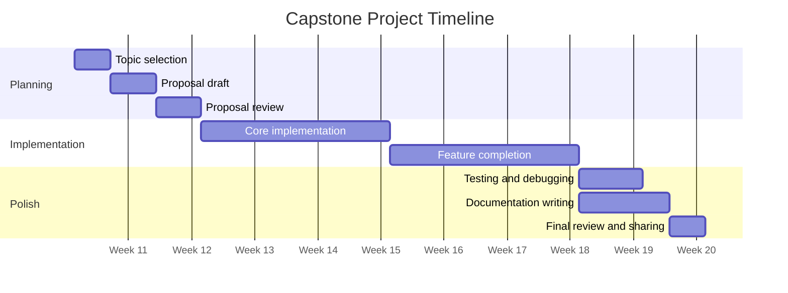
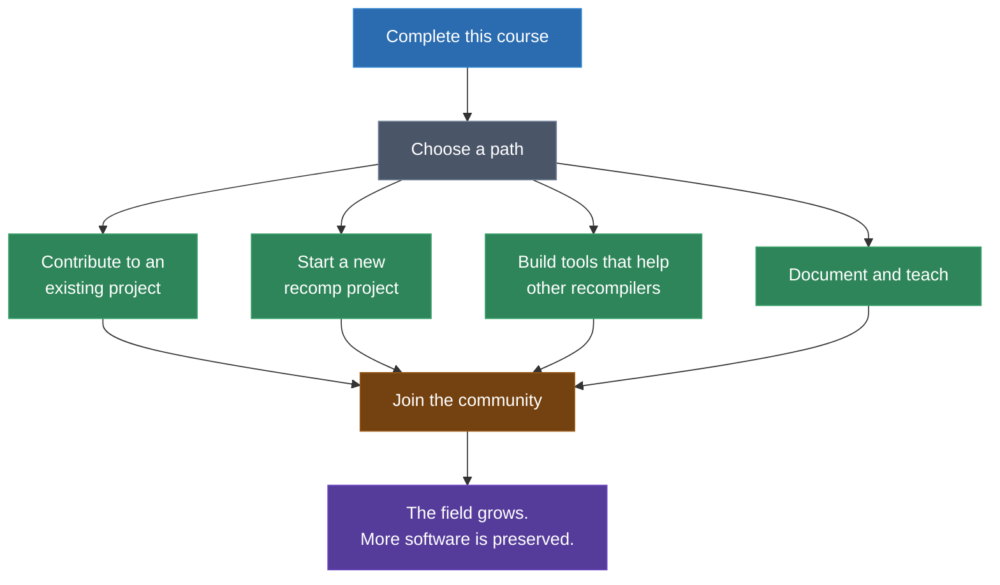

# Module 32: Capstone Project

You have spent fifteen modules learning how to take compiled machine code apart and put it back together for a different architecture. You started with the question "what is static recompilation?" and progressed through binary formats, disassembly, lifting, code generation, and runtime construction. You have worked with the Game Boy's SM83, the SNES's 65C816, the N64's MIPS, the PS1's R3000, the GameCube's PowerPC, the PS2's Emotion Engine, and the PS3's Cell Broadband Engine. You have parsed ROMs, ELFs, DOLs, and SELFs. You have implemented HLE functions for graphics, audio, and input. You have translated SIMD instructions, managed DMA transfers, and resolved NID hashes.

This module is where you put those skills to work on something real. The capstone project is an open-ended exercise where you pick a target and build something meaningful -- a recompilation, a tool contribution, or documentation that helps the next person learn faster.

---

## 1. Skills You Now Have

Before choosing your project, take stock of what you have built over the course:

- **Binary parsing**: You can read and interpret executable formats across decades of computing -- flat ROMs, PEs, ELFs, DOLs, and encrypted containers.
- **Disassembly**: You can decode instruction streams for 7+ ISAs, handle variable-length and fixed-width encodings, and resolve branch targets.
- **Lifting**: You can translate machine instructions into portable C code, managing register state, memory access, flags, and control flow.
- **Code generation**: You can produce compilable C output from lifted IR, including function boundaries, switch tables, and cross-references.
- **Runtime construction**: You can build the supporting infrastructure -- memory maps, HLE functions, graphics translation, audio output, input handling -- that makes recompiled code actually run.
- **Architecture analysis**: You can study an unfamiliar ISA, identify its quirks, and develop a recompilation strategy for it.
- **Debugging recompiled code**: You can trace failures in generated code back to their root causes in the recompilation pipeline.

The field of static recompilation is small and growing. There are more interesting targets than there are people working on them. Every contributor matters.

---

## 2. Capstone Project Options

Here are four directions you could take. Pick whichever excites you most, or invent your own -- these are suggestions, not requirements.

### Option A: Homebrew Recompilation

Build a complete recompilation pipeline for an open-source homebrew game or program targeting any platform covered in the course.

**What you will do:**

1. Select an open-source homebrew title with available source code (for verification) and a compiled binary
2. Parse the binary format for the target platform
3. Disassemble and lift the machine code to C
4. Build a runtime that provides the necessary HLE functions (graphics, input, audio)
5. Compile and run the recompiled program natively on your host machine

**Suggested targets:**

| Platform | Suggested Homebrew | Complexity |
|---|---|---|
| Game Boy | gb-mines, Shock Lobster, Libbet | Low-Medium |
| SNES | Yo-Yo Shuriken, Pong, homebrew demos | Medium |
| N64 | libdragon examples, N64Brew entries | Medium-High |
| PS1 | PSn00bSDK examples, Lameguy64 demos | Medium-High |

**What makes a good project:**

- Pipeline completeness: Does the recompiler handle the full binary? Are all instruction types covered?
- Code quality: Is the recompiler well-structured and maintainable?
- Runtime functionality: Does the recompiled program actually run and produce correct output?
- Documentation: Could someone else follow your process and learn from it?

### Option B: HLE Module Contribution

Contribute a meaningful HLE module implementation or runtime component to an existing static recompilation project.

**What you will do:**

1. Identify a gap in an existing project's HLE coverage or runtime functionality
2. Research the module's API: function signatures, expected behavior, edge cases
3. Implement the module with correct behavior
4. Write tests that verify your implementation
5. Submit your work as a pull request to the project

**Suggested targets:**

| Project | Module/Component | Complexity |
|---|---|---|
| ps3recomp | Unimplemented cellFs functions | Medium |
| ps3recomp | cellSync / cellSync2 primitives | Medium-High |
| ps3recomp | cellPngDec / cellJpgDec | Medium |
| N64Recomp | GX runtime function gaps | Medium |
| Any recomp project | Audio subsystem improvements | Medium-High |

**What makes a good contribution:**

- Correctness: Does the implementation match documented and observed behavior?
- Test coverage: Are there tests for normal operation, edge cases, and error conditions?
- Integration quality: Does the code follow the project's conventions and integrate cleanly?
- Documentation: Are the functions documented? Did you write up what you learned?

### Option C: Toy Recompiler from Scratch

Build a minimal but complete static recompiler for a simplified instruction set architecture.

**What you will do:**

1. Define or adopt a simple ISA (you may use the ISA from Lab 10 or design your own)
2. Write a binary parser for the ISA's executable format
3. Implement a disassembler
4. Build a lifter that translates instructions to C
5. Implement a code generator that produces compilable output
6. Build a minimal runtime (memory, I/O)
7. Write test programs in assembly, assemble them, and recompile them with your tool

**Architecture requirements (minimum):**

- At least 8 general-purpose registers
- At least 20 distinct instructions (arithmetic, logic, memory, branch, comparison)
- A memory model (even if simple: flat address space is fine)
- At least one non-trivial feature: interrupts, SIMD, banked registers, or privileged modes

**What makes a good project:**

- Pipeline completeness: Does the recompiler cover the full pipeline from binary to native executable?
- Architecture quality: Is the code well-organized with clean separation between pipeline stages?
- Extensibility: Could someone add new instructions or pipeline stages without rewriting existing code?
- Test suite: Are there test programs that exercise different instruction categories and edge cases?
- Documentation: Is the ISA documented? Is the recompiler's architecture explained?

### Option D: Documentation Contribution

Write a deep-dive technical document on an aspect of static recompilation not covered (or not covered in depth) in this course.

**What you will do:**

1. Choose a topic that extends or complements the course material
2. Research the topic thoroughly, including primary sources (code, papers, specifications)
3. Write a clear, technically rigorous document of at least 3,000 words
4. Include at least 3 diagrams (Mermaid, SVG, or other vector format)
5. Include code examples where appropriate

**Suggested topics:**

- Comparative analysis of lifting strategies across 3+ recompilation projects
- Deep dive into a specific optimization technique (constant propagation, dead code elimination, pattern matching) as applied to recompiled code
- Architecture analysis of a platform not covered in the course (Saturn SH-2, Dreamcast SH-4, Xbox original x86, PSP MIPS Allegrex)
- Survey of automated testing strategies for recompiled code
- Analysis of how different recomp projects handle self-modifying code
- History and evolution of static recompilation from academic origins to modern game preservation

**What makes a good document:**

- Depth: Does it go beyond surface-level description into genuine technical analysis?
- Accuracy: Are the technical claims correct and supported by evidence?
- Clarity: Is the writing clear, well-organized, and accessible?
- Novelty: Does it contribute something new -- a perspective, analysis, or synthesis not already available?

---

## 3. Project Timeline

If you want to give yourself structure, here is a suggested 10-week timeline. Adjust to fit your pace -- this is self-directed work, not a deadline.

### Week-by-Week Guidance

**Weeks 1-2: Planning.** Write down what you want to build, what target you are aiming at, your planned approach, and a rough milestone schedule. Share it in the community for feedback if you want early input.

**Weeks 3-5: Core implementation.** Build the central component of your project. For Option A, this means getting the recompiler to produce C output for the target binary. For Option B, this means implementing the core functions of your HLE module. For Option C, this means building the parser-disassembler-lifter pipeline. For Option D, this means completing your research and producing a first draft.

**Weeks 6-8: Feature completion.** Fill in the gaps. Implement remaining instructions, handle edge cases, build the runtime components, or expand your document's coverage. By the end of Week 8, the project should be functionally complete.

**Weeks 9-10: Testing and documentation.** Write tests, fix bugs discovered during testing, write your technical documentation, and share what you built.

---

## 4. Sharing Your Work

If you want your project to help others learn (and you should -- that is the whole point), aim for these baselines:

### Repository

- All code must be in a **public GitHub repository**
- The repository must include a README with:
  - Project description (what you built and why)
  - Build instructions (how to compile and run)
  - Usage instructions (how to use the tool or module)
  - Dependencies and prerequisites

### Technical Writeup

- Minimum **1,500 words** (Option D has a higher minimum of 3,000)
- Explain your approach: what decisions you made and why
- Describe the challenges you encountered and how you solved them
- Include at least **3 diagrams** (Mermaid or SVG)
- Place the writeup in your repository as `WRITEUP.md` or in a `docs/` directory

### Demonstrations

- **Options A and C**: A working demo -- the recompiled program must execute and produce correct visible output
- **Option B**: A passing test suite and/or a working demonstration within the parent project
- **Option D**: The document itself is the deliverable

### Code Standards

- Code must compile without errors on at least one major platform (Windows, Linux, or macOS)
- No hardcoded absolute paths or machine-specific dependencies
- Reasonable project structure (separate source files, not one monolithic file)

---

## 5. The Future of Static Recompilation

You are entering a field at an inflection point. Static recompilation has existed in academic literature since the 1990s, but it has only recently become a practical tool for game preservation and software porting, driven by projects like N64Recomp, ps3recomp, and the work coming from the broader community.

### Where the Field Is Heading

**Better static analysis.** Current recompilers rely heavily on manual annotation and pattern matching to resolve indirect jumps, identify function boundaries, and classify data types. The next generation of tools will use more sophisticated analysis -- abstract interpretation, symbolic execution, and constraint solving -- to automate these tasks.

**ML-assisted lifting.** Machine learning models trained on pairs of assembly and C code could assist the lifting stage, suggesting likely high-level constructs for common assembly patterns. This is not a replacement for deterministic recompilation but could accelerate the process of producing readable output.

**New targets.** Every console generation that falls out of commercial support becomes a candidate for recompilation. The PlayStation Vita (ARM Cortex-A9), Nintendo 3DS (ARM11 + ARM9), Xbox original (x86 with custom kernel), and Wii U (PowerPC tri-core) are all plausible near-term targets. Further out, as current-generation hardware ages, even x86-64 and ARM64 console titles will eventually need preservation.

**Embedded and mobile.** Static recompilation is not limited to games. Embedded firmware, mobile applications, and legacy enterprise software all face the same preservation and portability challenges. The techniques you have learned apply to any compiled binary on any architecture.

**Community growth.** The biggest constraint on the field today is not technical -- it is the number of people who understand how to do this work. Every person who completes this course and contributes to a project expands what is possible. The tools get better. The documentation gets more complete. The next person's learning curve gets shorter.

### How to Stay Involved

---

## 6. Resources for Continuing

### Reference Implementations

The sp00nznet repositories remain your best reference for how production-quality recompilation projects are structured. Study them not just for the code but for the architecture decisions: how the pipeline stages are separated, how the runtime is organized, and how HLE functions are implemented.

### Community and Projects

- **[N64Recomp](https://github.com/N64Recomp/N64Recomp)** by Mr-Wiseguy: The project that brought static recompilation to mainstream visibility. Its toolchain, documentation, and growing community of porters (sonicdcer, Rainchus, theboy181, and many others) make it the most accessible entry point for new contributors.
- **[RT64](https://github.com/rt64/rt64)** by Dario Samo: The rendering backend behind N64Recomp projects. Its accuracy-first, no-per-game-hacks design philosophy is worth studying.
- **[XenonRecomp](https://github.com/hedge-dev/XenonRecomp)** by Skyth (hedge-dev): The Xbox 360 recompilation toolchain, along with XenosRecomp for GPU shaders. The [UnleashedRecomp](https://github.com/hedge-dev/UnleashedRecomp) project (Skyth, Sajid, Hyper) is a showcase of what the full pipeline looks like at scale.
- **[rexdex/recompiler](https://github.com/rexdex/recompiler)**: The foundational Xbox 360 static recompiler that inspired XenonRecomp and RexGlueSDK.
- **[gb-recompiled](https://github.com/arcanite24/gb-recompiled)** by arcanite24 (Brandon G. Neri): Game Boy static recompiler with advanced indirect jump resolution.
- **[RexGlueSDK](https://github.com/rexglue/rexglue-sdk)** by tomcl7: Xbox 360 recompilation runtime with growing documentation.
- **[Gilgamesh](https://github.com/AndreaOrru/gilgamesh)** by Andrea Orru: SNES reverse engineering and recompilation toolkit.
- **ps3recomp**: The most ambitious recompilation target currently under active development. Contributing here means working at the frontier of what static recompilation can do.
- **Decomp projects** (e.g., SM64, OoT, TWW): While decompilation is a different discipline, the communities overlap significantly and the reverse engineering skills transfer directly.
- **[ReadOnlyMemo](https://readonlymemo.com/decompilation-projects-and-n64-recompiled-list/)** maintains an updated list of decompilation and recompilation projects across all platforms.

### Academic Literature

- Cifuentes, C. "Reverse Compilation Techniques." PhD Thesis, Queensland University of Technology, 1994. The foundational academic work on static binary translation.
- Sites, R. et al. "Binary Translation." Communications of the ACM, 1993. Early practical work from the DEC Alpha team on translating VAX and MIPS binaries to Alpha.
- Altman, E. et al. "Advances and Future Challenges in Binary Translation and Optimization." Proceedings of the IEEE, 2001. Survey of the field as it stood at the turn of the century.
- Bansal, S. and Aiken, A. "Automatic Generation of Peephole Superoptimizers." ASPLOS, 2006. Techniques for optimizing translated code that apply directly to recompiler output.

### This Course

The course repository's issue tracker is open for questions, discussion, and collaboration. If you discover an error in the material, find a better way to explain something, or develop a tool that helps other students, contribute it back.

---

## Closing

Static recompilation is, at its core, an act of translation. You take meaning encoded in one form -- the machine code of a dead or dying platform -- and express it in another form that will endure. The software you preserve this way will outlive the hardware it was written for by decades. It will be playable, studable, and modifiable long after the last original console stops working.

This matters because software is culture. The games, tools, and programs created for past platforms represent the creative and technical output of thousands of people. When the hardware fails and no preservation effort exists, that work is lost. Emulators have carried the burden of preservation for decades, and they will continue to do so. But static recompilation offers something emulators cannot: native executables that stand on their own, require no runtime translation layer, and produce source code that future developers can read, modify, and learn from.

You now have the skills to do this work. The field needs you. Pick a target, build something, and share it.
